<!--
  This README.md is generated by running:
  "resilient-sdk docgen -p fn_rapid7_insight_idr"

  This file was generated with resilient-sdk v51.0.0.1.486

  It is best edited using a Text Editor with a Markdown Previewer. VS Code
  is a good example. Checkout https://guides.github.com/features/mastering-markdown/
  for tips on writing with Markdown

  All fields followed by "::CHANGE_ME::"" should be manually edited

  If you make manual edits and run docgen again, a .bak file will be created

  Store any screenshots in the "doc/screenshots" directory and reference them like:
  

  NOTE: If your app is available in the container-format only, there is no need to mention the integration server in this readme.
-->

# Rapid7 InsightIDR


## Table of Contents
- [Rapid7 InsightIDR](#rapid7-insightidr)
  - [Table of Contents](#table-of-contents)
  - [Release Notes](#release-notes)
  - [Overview](#overview)
    - [Key Features](#key-features)
  - [Requirements](#requirements)
    - [SOAR platform](#soar-platform)
    - [Cloud Pak for Security](#cloud-pak-for-security)
    - [Proxy Server](#proxy-server)
    - [Python Environment](#python-environment)
    - [Rapid7 InsightIDR Development Version](#rapid7-insightidr-development-version)
      - [Prerequisites](#prerequisites)
      - [Configuration](#configuration)
    - [Generate an Organization API Key in Rapid7 InsightIDR](#generate-an-organization-api-key-in-rapid7-insightidr)
    - [Determine the Rapid7 Data Storage Region](#determine-the-rapid7-data-storage-region)
  - [Installation](#installation)
    - [Install](#install)
    - [App Configuration](#app-configuration)
    - [Custom Layouts](#custom-layouts)
    - [Poller Considerations](#poller-considerations)
      - [Poller Templates for SOAR Cases](#poller-templates-for-soar-cases)
    - [Investigation Filtering](#investigation-filtering)
  - [Function - Rapid7 InsightIDR: Add Attachments to SOAR Case](#function---rapid7-insightidr-add-attachments-to-soar-case)
  - [Function - Rapid7 InsightIDR: Get Alert Evidence](#function---rapid7-insightidr-get-alert-evidence)
  - [Function - Rapid7 InsightIDR: Get Alerts](#function---rapid7-insightidr-get-alerts)
  - [Function - Rapid7 InsightIDR: Get Comments from Rapid7 Investigation](#function---rapid7-insightidr-get-comments-from-rapid7-investigation)
  - [Function - Rapid7 InsightIDR: Get Investigation](#function---rapid7-insightidr-get-investigation)
  - [Function - Rapid7 InsightIDR: List Attachments](#function---rapid7-insightidr-list-attachments)
  - [Function - Rapid7 InsightIDR: Post Comment to Rapid7 Investigation](#function---rapid7-insightidr-post-comment-to-rapid7-investigation)
  - [Function - Rapid7 InsightIDR: Set Priority](#function---rapid7-insightidr-set-priority)
  - [Function - Rapid7: InsightIDR Set Status](#function---rapid7-insightidr-set-status)
  - [Playbooks](#playbooks)
  - [Custom Layouts](#custom-layouts-1)
  - [Data Table - Rapid7 InsightIDR Alerts](#data-table---rapid7-insightidr-alerts)
      - [API Name:](#api-name)
      - [Columns:](#columns)
  - [Custom Fields](#custom-fields)
  - [Templates for SOAR Cases](#templates-for-soar-cases)
    - [soar\_create\_case.jinja](#soar_create_casejinja)
    - [soar\_close\_case.jinja](#soar_close_casejinja)
    - [soar\_update\_case.jinja](#soar_update_casejinja)
  - [Troubleshooting \& Support](#troubleshooting--support)
    - [For Support](#for-support)

---

## Release Notes
<!--
  Specify all changes in this release. Do not remove the release 
  notes of a previous release
-->
| Version | Date | Notes |
| ------- | ---- | ----- |
| 1.0.0 | 2/2024 | Initial Release |

---

## Overview
<!--
  Provide a high-level description of the function itself and its remote software or application.
  The text below is parsed from the "description" and "long_description" attributes in the setup.py file
-->
**IBM SOAR app - bidirectional synchronization and functions for Rapid7 InsightIDR**

 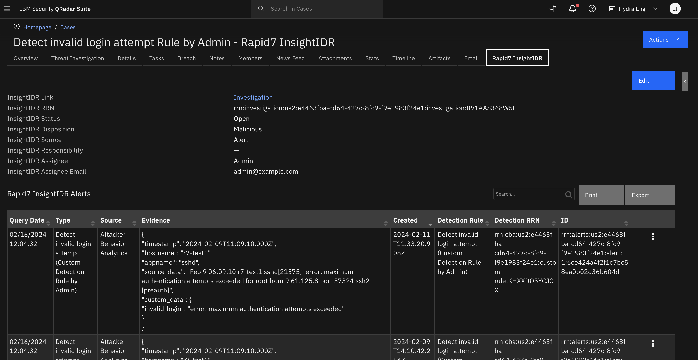

Bi-directional App for Rapid7 InsightIDR. Query Rapid7 InsightIDR for Investigations based on user-defined query parameters and create and update cases in SOAR. The app polls Rapid7 InsightIDR for new or updated investigations.  Information on alerts that triggered an investigation are displayed in the Rapid7 InsightIDR Alerts data table in SOAR, including the alert evidence. 

<p>
Rapid7’s InsightIDR is your security center for incident detection and response, authentication monitoring, and endpoint visibility. Together, these form Extended Detection and Response (XDR). InsightIDR identifies unauthorized access from external and internal threats and highlights suspicious activity so you don’t have to weed through thousands of data streams. XDR accelerates more comprehensive threat detection and response. This cloud-native, cloud-scalable security solution can unify and transform multiple telemetry sources. 
<p>
InsightIDR combines the full power of endpoint forensics, log search, and sophisticated dashboards into a single solution. It is a Software as a Service (SaaS) tool that collects data from your existing network security tools, authentication logs, and endpoint devices. InsightIDR then aggregates the data at an on-premises Collector or a dedicated host machine that centralizes your data.

### Key Features
<!--
  List the Key Features of the Integration
-->
* Poll Rapid7 InsightIDR investigations and create and update corresponding cases in SOAR
* Create cases in SOAR based on user defined investigation field values:
  - "priorities" 
  - "statuses"
  - "sources"
  - "tags"
* Get Alerts from Rapid7 InsightIDR investigation and populate the Rapid7 InsightIDR Alerts data table with the alert type, source, evidence, detection rule and id
* Create System Name and Service artifacts from the alert evidence
* Synchronize comments/notes between Rapid7 InsightIDR investigation and corresponding SOAR case
* Synchronize attachments between Rapid7 InsightIDR investigation and corresponding SOAR case
* Set the Investigation **priority**, **status** and **disposition** in SOAR and update those values in the corresponding investigation in Rapid7 InsightIDR
* Add a comment to a Rapid7 InsightIDR investigation when the corresponding case is closed in SOAR
---

## Requirements
<!--
  List any Requirements 
--> 
This app supports the IBM Security QRadar SOAR Platform and the IBM Security QRadar SOAR for IBM Cloud Pak for Security.

### SOAR platform
The SOAR platform supports two app deployment mechanisms, Edge Gateway (also known as App Host) and integration server.

If deploying to a SOAR platform with an App Host, the requirements are:
* SOAR platform >= `49.0.0`.
* The app is in a container-based format (available from the AppExchange as a `zip` file).

If deploying to a SOAR platform with an integration server, the requirements are:
* SOAR platform >= `49.0.0`.
* The app is in the older integration format (available from the AppExchange as a `zip` file which contains a `tar.gz` file).
* Integration server is running `resilient-circuits>=51.0.0.2`.
* If using an API key account, make sure the account provides the following minimum permissions: 
  | Name | Permissions |
  | ---- | ----------- |
  | Org Data | Read |
  | Function | Read |
  | Incidents | Read, Create |
  | Edit Incidents | Fields, Status |
  | Layouts | Read, Edit |

The following SOAR platform guides provide additional information: 
* _Edge Gateway Deployment Guide_ or _App Host Deployment Guide_: provides installation, configuration, and troubleshooting information, including proxy server settings. 
* _Integration Server Guide_: provides installation, configuration, and troubleshooting information, including proxy server settings.
* _System Administrator Guide_: provides the procedure to install, configure and deploy apps. 

The above guides are available on the IBM Documentation website at [ibm.biz/soar-docs](https://ibm.biz/soar-docs). On this web page, select your SOAR platform version. On the follow-on page, you can find the _Edge Gateway Deployment Guide_, _App Host Deployment Guide_, or _Integration Server Guide_ by expanding **Apps** in the Table of Contents pane. The System Administrator Guide is available by expanding **System Administrator**.

### Cloud Pak for Security
If you are deploying to IBM Cloud Pak for Security, the requirements are:
* IBM Cloud Pak for Security >= `1.10.15`.
* Cloud Pak is configured with an Edge Gateway.
* The app is in a container-based format (available from the AppExchange as a `zip` file).

The following Cloud Pak guides provide additional information: 
* _Edge Gateway Deployment Guide_ or _App Host Deployment Guide_: provides installation, configuration, and troubleshooting information, including proxy server settings. From the Table of Contents, select Case Management and Orchestration & Automation > **Orchestration and Automation Apps**.
* _System Administrator Guide_: provides information to install, configure, and deploy apps. From the IBM Cloud Pak for Security IBM Documentation table of contents, select Case Management and Orchestration & Automation > **System administrator**.

These guides are available on the IBM Documentation website at [ibm.biz/cp4s-docs](https://ibm.biz/cp4s-docs). From this web page, select your IBM Cloud Pak for Security version. From the version-specific IBM Documentation page, select Case Management and Orchestration & Automation.

### Proxy Server
The app **does** support a proxy server.

### Python Environment
Python 3.6 and Python 3.9 are supported.
Additional package dependencies may exist for each of these packages:
* resilient-circuits>=50.1.0

### Rapid7 InsightIDR Development Version

This app has been implemented using:
| Product Name | Product Version | API URL | API Version |
| ------------ | --------------- | ------- | ----------- |
| Rapid7 InsightIDR | 20231219  | https://us2.api.insight.rapid7.com | v1 & v2 |


#### Prerequisites
<!--
List any prerequisites that are needed to use with this endpoint solution. Remove any section that is unnecessary.
-->
* A Rapid7 InsightIDR user account with an Organization API key.
* Enable Rapid7 InsightIDR restricted evidence endpoint if **User Behavior Analytics** detections rules trigger alerts in your Rapid7 InsightIDR platform and you require the alert evidence in the SOAR app. You must reach out to Rapid7 support on a per-organization basis to enable the **restricted evidence API**. 
  
#### Configuration
<!--
List any steps that are needed to configure the endpoint to use this app.
-->

### Generate an Organization API Key in Rapid7 InsightIDR 
Click on the `Settings->API Keys` menu item:
  
 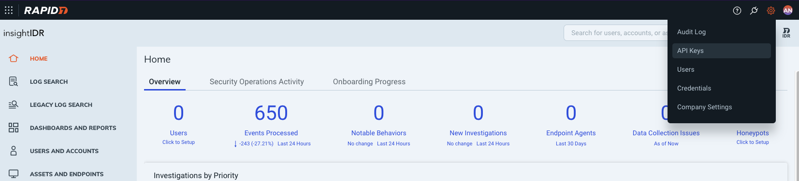 

 Click on the `Generate New Organization Key` button:

 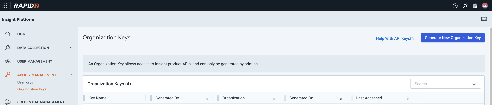

 Fill in the form and click `Submit` button.
 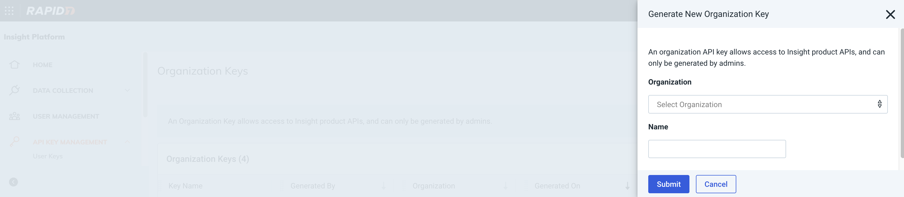

### Determine the Rapid7 Data Storage Region
Navigate to the `Settings` panel and then the `Organization Settings` tab to find the `Data Storage Region`. The region should map to one of these codes: us, us2, us3, ca, eu, ap, au.  You can also find the code at the starting fragment of the URL used to access the InsightIDR platform in a browser.  For example, in this URL `https://us2.idr.insight.rapid7.com` , the region code is `us2`.

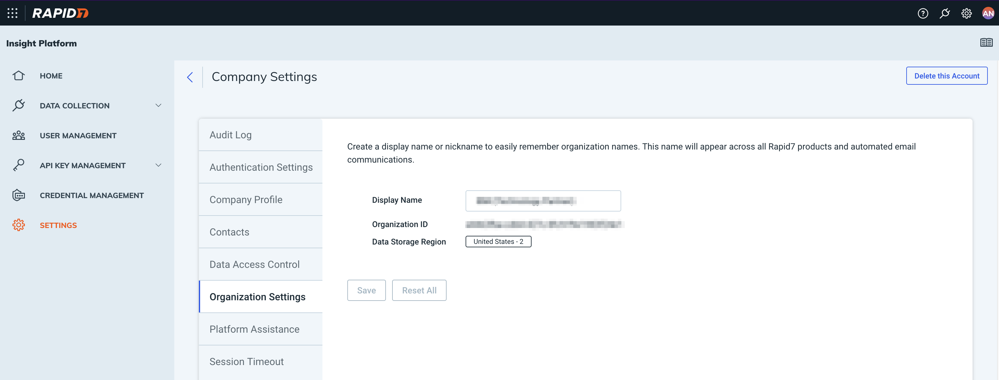 

---

## Installation

### Install
* To install or uninstall an App or Integration on the _SOAR platform_, see the documentation at [ibm.biz/soar-docs](https://ibm.biz/soar-docs).
* To install or uninstall an App on _IBM Cloud Pak for Security_, see the documentation at [ibm.biz/cp4s-docs](https://ibm.biz/cp4s-docs) and follow the instructions above to navigate to Orchestration and Automation.

### App Configuration
The following table provides the settings you need to configure the app. These settings are made in the app.config file. See the documentation discussed in the Requirements section for the procedure.

| Config | Required | Example | Description |
| ------ | :------: | ------- | ----------- |
| **api_key** | Yes | `<api_key>` | *Rapid7 InsightIDR Organization API Key.* |
| **api_version** | Yes | `v2` | *Rapid7 InsightIDR REST API version.* |
| **region** | Yes | `us, us2, us3, ca, eu, ap, au` | *Rapid7 Data Storage Region code.* |
| **polling_filters** | No | `("priorities","HIGH,CRITICAL"),("statuses","OPEN,INVESTIGATING,WAITING")` | *Comma separated tuples ("field","value") where "field" is a Rapid7 InsightIDR field name and "value" is a string of comma-separated values.* |
| **polling_interval** | Yes | `60` | *Poller interval time in seconds. Value of zero turns poller off.* |
| **polling_lookback** | Yes | `1200` | *Number of minutes the poller looks back for Rapid7 InsightIDR investigations. Value is only used on the first time polling when the app starts.* |
| **polling_add_case_url_comment_in_rapid7** | No | `True` | *Boolean flag indicating whether or not to add a comment in the Rapid7 investigation that contains the URL link back to corresponding SOAR case.* |
| **soar_create_case_template** | No | `/var/rescircuits/create_case.jinja` | *Path to override template for automatic case creation. See [Poller Considerations](#poller-considerations).* |
| **soar_update_case_template** | No | `/var/rescircuits/update_case.jinja` | *Path to override template for automatic case updating. See [Poller Considerations](#poller-considerations).* |
| **soar_close_case_template** | No | `/var/rescircuits/close_case.jinja` | *Path to override template for automatic case closing. See [Poller Considerations](#poller-considerations).* |

---
### Custom Layouts

The app automatically creates a custom `Rapid7 InsightIDR` tab on first run after installation:

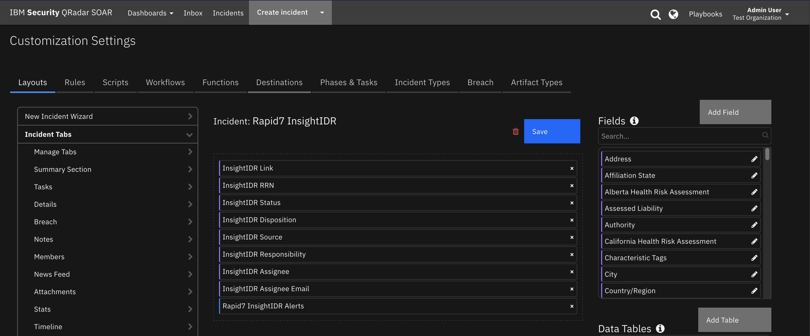 
 

### Poller Considerations
The poller is just one way to escalate Rapid7 InsightIDR investigations to SOAR cases. It's also possible to send Rapid7 InsightIDR investigation information to another SIEM, such as IBM QRadar, which would then correlate cases into Offenses. With the QRadar Plugin for SOAR, offenses can then be escalated to SOAR cases. As long as the Rapid7 Insight investigation RRN (Rapid7 Resource Name) is preserved in the custom case field `rapid7_insight_idr_rrn`, then all the remaining details about the case synchronize to the SOAR case. In the case of the QRadar Plugin for SOAR, you would modify the escalation templates to reference this custom field with the Salesforce Case ID.

When using another source of Rapid7 InsightIDR investigation escalation to IBM SOAR, disable the poller by changing the app.config setting to `poller_interval=0`.

#### Poller Templates for SOAR Cases
It may be necessary to modify the templates used to create, update, or close SOAR cases based on your required custom fields in SOAR.

This is especially relevant if you have required custom `close` fields that need to be filled when closing a case in SOAR. If that is the case, be sure to implement a custom `close_case_template` and reference those required close fields in the template.

When overriding the template in App Host, specify the file path for each file as `/var/rescircuits`.

Below are the default templates used which can be copied, modified, and used with app_config's
`soar_create_case_template`, `soar_update_case_template`, and `soar_close_case_template` settings to override the default templates.

### Investigation Filtering 
To limit the number of investigations escalated to SOAR, consider using the optional `polling_filters` parameter in the app configuration file. Each filter is a tuple in the following format: ("field","values"),
Where:
* "field" is the Rapid7 InsightIDR investigation field to be queried
* "values" is a comma separated string of values to include in the query results returned 
<p>
If more than one filter is needed, separate each tuple with a comma.
<p>
There are 4 Rapid7 InsightIDR investigation fields that can be queried: "statuses", "sources", "priorities", "tags". The table below shows possible values for the fields:


| Field | Example Values |
| ------ | :------: |
| `statuses` | OPEN,INVESTIGATING,CLOSED,WAITING |
| `sources` | USER,ALERT |
| `priorities` | UNSPECIFIED,LOW,MEDIUM,HIGH,CRITICAL |
| `tags` | Incident, Security Test, Reported to Customer, Potentially Unwanted Program |

<p>
Here is an polling filter example that adds or updates investigations in SOAR whose priorities are `HIGH` or `CRITICAL` and whose status is `OPEN`, `INVESTIGATING` or `WAITING`

`polling_filters = ("priorities","HIGH,CRITICAL"),("statuses","OPEN,INVESTIGATING,WAITING")`

NOTE: Each individual filter is first constructed by joining together the field and the desired values using OR statements. Each individual filter is then combined using AND.  In the example above, only investigations with priority HIGH or CRITICAL AND those with statuses OPEN, INVESTIGATING, or WAITING are pulled into SOAR as cases.  MEDIUM, OPEN investigations are not created as cases in SOAR in the example.  

---

## Function - Rapid7 InsightIDR: Add Attachments to SOAR Case
Manual playbook to get the attachments from a Rapid7 InsightIDR investigation and add them to the associated SOAR case.

 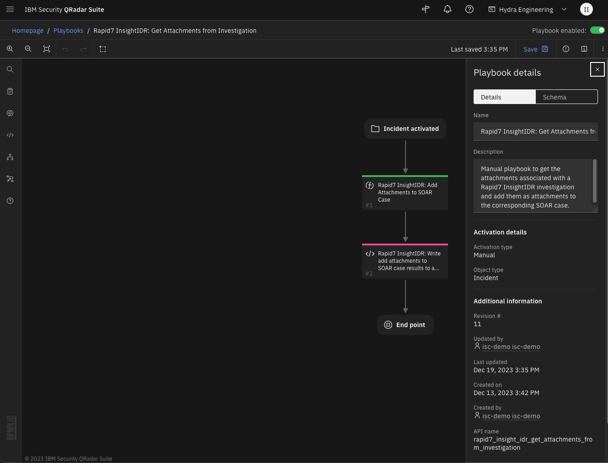 

<details><summary>Inputs:</summary>
<p>

| Name | Type | Required | Example | Tooltip |
| ---- | :--: | :------: | ------- | ------- |
| `rapid7_insight_idr_incident_id` | `number` | Yes | `-` | - |
| `rapid7_insight_idr_rrn` | `text` | Yes | `-` | Rapid7 Resource Name of the investigation. |

</p>
</details>

<details><summary>Outputs:</summary>
<p>

> **NOTE:** This example might be in JSON format, but `results` is a Python Dictionary on the SOAR platform.

```python
results = {
  "content": {
    "rapid7_insight_idr_attachments": [
      "test.txt"
    ]
  },
  "inputs": {
    "rapid7_insight_idr_incident_id": 2228,
    "rapid7_insight_idr_rrn": "rrn:investigation:us2:e4463fba-cd64-427c-8fc9-f9e1983f24e1:investigation:JSPDKLRG7UWY"
  },
  "metrics": {
    "execution_time_ms": 30025,
    "host": "mylaptop",
    "package": "fn-rapid7-insight-idr",
    "package_version": "1.0.0",
    "timestamp": "2023-12-12 14:41:29",
    "version": "1.0"
  },
  "raw": null,
  "reason": null,
  "success": true,
  "version": 2.0
}
```

</p>
</details>

<details><summary>Example Function Input Script:</summary>
<p>

```python
inputs.rapid7_insight_idr_incident_id = incident.id
inputs.rapid7_insight_idr_rrn = incident.properties.rapid7_insight_idr_rrn
```

</p>
</details>

<details><summary>Example Function Post Process Script:</summary>
<p>

```python
results = playbook.functions.results.add_attachments_results

if results.get("success"):
  content = results.get("content", {})
  if content:
    rapid7_attachments = content.get("rapid7_insight_idr_attachments")
    note_text = "<b>Rapid7 InsightIDR: Get Attachments:</b> added {} attachments to incident:<br>".format(len(rapid7_attachments))
    for attachment_name in rapid7_attachments:
      note_text = note_text + "<br>{}".format(attachment_name)
else:
  note_text = "<b>Rapid7 InsightIDR: Get Attachments</b> failed to get <b>ALL</b> attachments from Rapid7 InsightIDR. Retry later:<br> {0}.".format(results.get("reason", None))
incident.addNote(note_text)

```

</p>
</details>

---
## Function - Rapid7 InsightIDR: Get Alert Evidence
Get the Rapid7 InsightIDR investigation alert evidence.  The function requires 1 of 2 optional parameters to be set.  Specify the alert RRN if the alert source is Attack Behavior Analytics.  Specify the investigation RRN if the alert source is User Behavior Analytics.  NOTE: if specifying the investigation RRN, the "restricted evidence" API endpoint must be enabled on a per-organization basis. Contact Rapid7 support to enable the restricted evidence prior to using the function with an investigation RRN.

 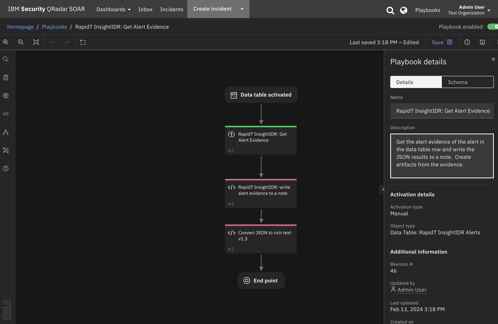

<details><summary>Inputs:</summary>
<p>

| Name | Type | Required | Example | Tooltip |
| ---- | :--: | :------: | ------- | ------- |
| `rapid7_insight_idr_alert_rrn` | `text` | No | `Rapid7 InsightIDR Alert RRN (Rapid7 Resource Name)` | `-` |
| `rapid7_insight_idr_rrn_optional` | `text` | No | `Rapid7 InsightIDR investigation RRN (optional)` | `-` |

</p>
</details>

<details><summary>Outputs:</summary>
<p>

> **NOTE:** This example might be in JSON format, but `results` is a Python Dictionary on the SOAR platform.

```python
results = {
  {
    "version": 2.0,
    "success": true,
    "reason": null,
    "content": {
      "data": {
        "evidences": [
          {
            "rrn": "rrn:alerts:us2:e4463fba-cd64-427c-8fc9-f9e1983f24e1:evidence:1:fcd21bbeec66b34322c57b50478014ef",
            "version": 1,
            "created_at": "2024-01-14T11:07:37.329397Z",
            "updated_at": "2024-01-14T11:07:37.329397Z",
            "evented_at": "2024-01-14T11:07:36.998Z",
            "external_source": "IDR ABA",
            "event_type": "raw",
            "data": "{\"timestamp\":\"2024-01-10T13:51:12.000Z\",\"hostname\":\"r7-test1\",\"appname\":\"sshd\",\"source_data\":\"Jan 10 08:51:12 r7-test1 sshd[19076]: error: maximum authentication attempts exceeded for root from 9.61.113.106 port 54336 ssh2 [preauth]\",\"custom_data\":{\"invalid-login\":\"maximum authentication attempts exceeded for\"}}"
          }
        ],
        "metadata": {
          "index": 0,
          "size": 1,
          "items_in_index": 1,
          "total_items": 1,
          "is_last_index": true
        }
      }
    },
    "raw": null,
    "inputs": {
      "rapid7_insight_idr_alert_rrn": "rrn:alerts:us2:e4463fba-cd64-427c-8fc9-f9e1983f24e1:alert:1:17c2b65f73ba0d975e9d24d446a9e91c",
      "rapid7_insight_idr_rrn": "rrn:investigation:us2:e4463fba-cd64-427c-8fc9-f9e1983f24e1:investigation:8V1AAAAAAA5F"
    },
    "metrics": {
      "version": "1.0",
      "package": "fn-rapid7-insight-idr",
      "package_version": "1.0.0",
      "host": "mylaptop",
      "execution_time_ms": 9332,
      "timestamp": "2024-02-12 13:57:09"
    }
  }
}
```

</p>
</details>

<details><summary>Example Function Input Script:</summary>
<p>

```python
inputs.rapid7_insight_idr_rrn = incident.properties.rapid7_insight_idr_rrn

# The "User Behavior Analytics" alert source uses the "restricted" InsightIDR endpoint 
# that uses the rrn of the investigation to get the alert evidence.  It does not have
# an alert_rrn.
inputs.rapid7_insight_idr_alert_rrn = None if row.r7_alert_source == "User Behavior Analytics" else row.r7_alert_id
```

</p>
</details>

<details><summary>Example Function Post Process Script:</summary>
<p>

```python
from json import (dumps, loads)

results = playbook.functions.results.get_alert_evident_results

evidence_data = {}

if results.get("success", False):
  content = results.get("content", {})
  inputs = results.get("inputs", {})
  if content: 
    alert_data = content.get("data", {})
    if alert_data:
      # evidences is defined only in the case of non-restricted endpoint
      evidences = alert_data.get("evidences", False)
      if evidences:
        # Only one alert is returned. Get the data to display in the note
        evidence = evidences[0]
        data_string = evidence.get("data", "")
        if data_string:
          evidence_data = loads(data_string)
      else:
        # restricted endpoint results 
        indicator_occurrences = alert_data.get("indicator_occurrences", None)
        if indicator_occurrences:
          evidence = indicator_occurrences[0].get("evidence", None)
          if evidence:
            details = evidence[0].get("details", None)
            if details:
              data_string = details.get("logline", None)
              if data_string:
                evidence_data = loads(data_string)
    if evidence_data:
      # Update the Evidence DT column with JSON evidence
      row.r7_evidence = dumps(evidence_data, indent=4)
      
      # Create artifacts from the evidence
      hostname = evidence_data.get("hostname",None)
      if hostname:
        incident.addArtifact("System Name", hostname, "Evidence from Rapid7 InsightIDR")
      appname = evidence_data.get("appname",None)
      if appname:
        incident.addArtifact("Service", appname, "Evidence from Rapid7 InsightIDR")
    else:
      incident.addNote("<b>Rapid7 InsightIDR: Get Evidence:</b> No evidence found {0}".format(results.get("reason", None)))
  else:
    incident.addNote("<b>Rapid7 InsightIDR: Get Evidence:</b> No content found")
else:
  incident.addNote("<b>Rapid7 InsightIDR: Get Evidence: No evidence found {0}".format(results.get("reason", None)))
```

</p>
</details>

---
## Function - Rapid7 InsightIDR: Get Alerts
Get the alerts associated with a Rapid7 InsightIDR investigation.

 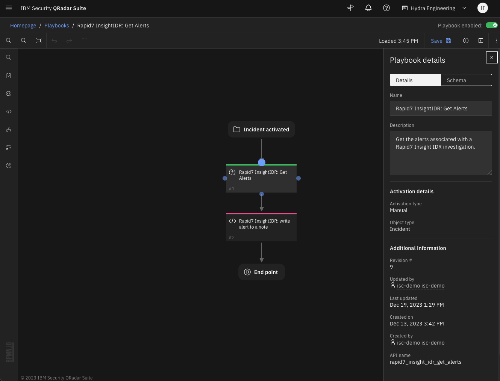

<details><summary>Inputs:</summary>
<p>

| Name | Type | Required | Example | Tooltip |
| ---- | :--: | :------: | ------- | ------- |
| `rapid7_insight_idr_rrn` | `text` | Yes | `-` | Rapid7 Resource Name of the investigation. |

</p>
</details>

<details><summary>Outputs:</summary>
<p>

> **NOTE:** This example might be in JSON format, but `results` is a Python Dictionary on the SOAR platform.

```python
results = {
  "content": {
    "data": [
      {
        "alert_source": "Attacker Behavior Analytics",
        "alert_type": "Suspicious Authentication - Default Administrator Account Login From Public Internet",
        "alert_type_description": "Suspicious Authentication - Default Administrator Account Login From Public Internet",
        "created_time": "2023-11-22T23:49:17.013Z",
        "detection_rule_rrn": null,
        "first_event_time": "2023-11-22T23:44:38.234Z",
        "id": "eeeeeeeeee-83c0-4953-bc40-aaaaaaaaaaaaa",
        "latest_event_time": "2023-11-22T23:49:17.013Z",
        "title": "Suspicious Authentication - Default Administrator Account Login From Public Internet"
      }
    ],
    "metadata": {
      "index": 0,
      "size": 20,
      "total_data": 1,
      "total_pages": 1
    }
  },
  "inputs": {
    "rapid7_insight_idr_rrn": "rrn:investigation:usxx:xxxxxx-1234-4608-be60-xxxxxxxxx:investigation:ggggggggggg"
  },
  "metrics": {
    "execution_time_ms": 219,
    "host": "Pro.local",
    "package": "fn-rapid7-insight-idr",
    "package_version": "1.0.0",
    "timestamp": "2023-12-04 15:32:42",
    "version": "1.0"
  },
  "raw": null,
  "reason": null,
  "success": true,
  "version": 2.0
}
```

</p>
</details>

<details><summary>Example Function Input Script:</summary>
<p>

```python
inputs.rapid7_insight_idr_rrn = incident.properties.rapid7_insight_idr_rrn
```

</p>
</details>

<details><summary>Example Function Post Process Script:</summary>
<p>

```python
from datetime import datetime

results = playbook.functions.results.get_alerts_results

if results.get("success"):
  content = results.get("content", {})
  if content:
    alert_list = content.get("alert_list", [])
    if alert_list:
      for alert in alert_list:
        alert_row = incident.addRow("rapid7_insight_idr_alerts_dt")
        alert_row.r7_query_date = datetime.now()
        alert_row.r7_alert_id = alert.get("id")
        alert_row.r7_alert_source = alert.get("alert_source")
        alert_row.r7_alert_type = alert.get("alert_type")
        alert_row.r7_created_time = alert.get("created_time")
        detection_rule_rrn = alert.get("detection_rule_rrn")
        if detection_rule_rrn:
          alert_row.r7_detection_rrn = detection_rule_rrn.get("rule_rrn")
          alert_row.r7_detection_rule = detection_rule_rrn.get("rule_name")
      note_text = "<b>Rapid7 InsightIDR Get Alerts:</b> Added {0} alerts to the Alerts data table".format(len(alert_list))
    else:
     note_text = "<b>Rapid7 InsightIDR Get Alerts:</b> No alerts found."     
  else:
    note_text = "<b>Rapid7 InsightIDR Get Alerts:</b> No alerts found (no content)."
else:
  note_text = "<b>Rapid7 InsightIDR Get Alerts:</b> Failed function to get alerts. Reason = {0}".format(results.get("reason"))
  
incident.addNote(note_text)
```

</p>
</details>

---
## Function - Rapid7 InsightIDR: Get Comments from Rapid7 Investigation
Get the comments from a Rapid7 InsightIDR investigation and add any new ones as notes to the corresponding SOAR case.

 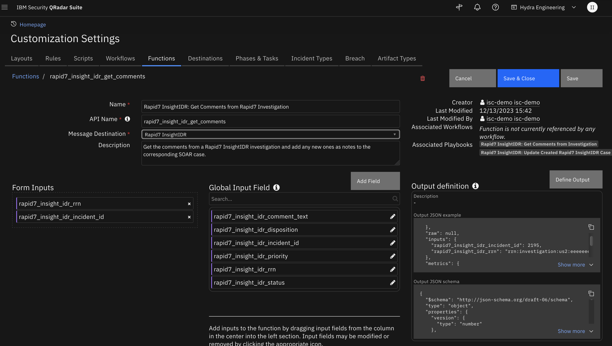 

<details><summary>Inputs:</summary>
<p>

| Name | Type | Required | Example | Tooltip |
| ---- | :--: | :------: | ------- | ------- |
| `rapid7_insight_idr_incident_id` | `number` | Yes | `-` | - |
| `rapid7_insight_idr_rrn` | `text` | Yes | `-` | Rapid7 Resource Name of the investigation. |

</p>
</details>

<details><summary>Outputs:</summary>
<p>

> **NOTE:** This example might be in JSON format, but `results` is a Python Dictionary on the SOAR platform.

```python
results = {
  "content": {
    "count": 1
  },
  "inputs": {
    "rapid7_insight_idr_incident_id": 2195,
    "rapid7_insight_idr_rrn": "rrn:investigation:us2:eeeeeeee-cccc-4c4c-8fc9-f9e19e19e1:investigation:AAAAAAAAAA"
  },
  "metrics": {
    "execution_time_ms": 59301,
    "host": "mylaptop",
    "package": "fn-rapid7-insight-idr",
    "package_version": "1.0.0",
    "timestamp": "2023-12-06 11:56:52",
    "version": "1.0"
  },
  "raw": null,
  "reason": null,
  "success": true,
  "version": 2.0
}
```

</p>
</details>

<details><summary>Example Function Input Script:</summary>
<p>

```python
inputs.rapid7_insight_idr_incident_id = incident.id
inputs.rapid7_insight_idr_rrn = incident.properties.rapid7_insight_idr_rrn
```

</p>
</details>

<details><summary>Example Function Post Process Script:</summary>
<p>

```python
results = playbook.functions.results.get_comments_results

if results.get("success"):
  content = results.get("content")
  if content:
    note_text = "<b>Rapid7 InsightIDR: Get Comments</b> playbook created {0} notes in SOAR".format(content.get("count"))
  else:
    note_text = "<b>Rapid7 InsightIDR: Get Comments</b> function failed to get notes from Rapid7 InsightIDR"
else:
  note_text = "<b>Rapid7 InsightIDR: Get Comments</b> function failed to get notes from Rapid7 InsightIDR"
  
incident.addNote(note_text)
```

</p>
</details>

---
## Function - Rapid7 InsightIDR: Get Investigation
Get investigation information from Rapid7 InsightIDR for the given Rapid7 Resource Name (rrn).

 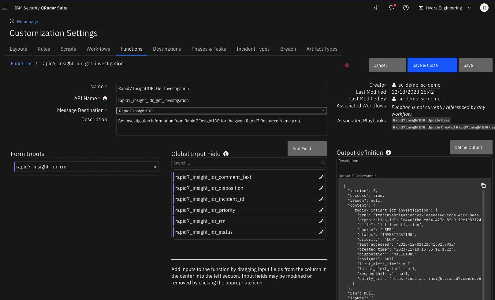

<details><summary>Inputs:</summary>
<p>

| Name | Type | Required | Example | Tooltip |
| ---- | :--: | :------: | ------- | ------- |
| `rapid7_insight_idr_rrn` | `text` | Yes | `-` | Rapid7 Resource Name of the investigation. |

</p>
</details>

<details><summary>Outputs:</summary>
<p>

> **NOTE:** This example might be in JSON format, but `results` is a Python Dictionary on the SOAR platform.

```python
results = {
  "content": {
    "rapid7_insight_idr_investigation": {
      "assignee": null,
      "created_time": "2023-11-10T15:55:12.182Z",
      "disposition": "MALICIOUS",
      "entity_url": "https://us2.api.insight.rapid7.com/op/6E85858585854#/investigations/rrn:investigation:us2:eeeeeeee-cccc-4c4c-8fc9-f9e1983f24e1:investigation:AAAAAAAAAA",
      "first_alert_time": null,
      "last_accessed": "2023-12-01T22:41:02.993Z",
      "latest_alert_time": null,
      "organization_id": "e4463fba-cd64-427c-8fc9-f9e1983f24e1",
      "priority": "LOW",
      "responsibility": null,
      "rrn": "rrn:investigation:us2:eeeeeeee-ccc4-4ccc-8eee-eeeeeeeeeeee:investigation:AAAAAAAAAA",
      "source": "USER",
      "status": "INVESTIGATING",
      "title": "1st investigation"
    }
  },
  "inputs": {
    "rapid7_insight_idr_rrn": "rrn:investigation:us12:cccccccc-cd64-427c-8fc9-f9e1983f24e1:investigation:3AAAAAAAAAA"
  },
  "metrics": {
    "execution_time_ms": 229,
    "host": "Book-Pro.local",
    "package": "fn-rapid7-insight-idr",
    "package_version": "1.0.0",
    "timestamp": "2023-12-04 10:24:18",
    "version": "1.0"
  },
  "raw": null,
  "reason": null,
  "success": true,
  "version": 2.0
}
```

</p>
</details>

<details><summary>Example Function Input Script:</summary>
<p>

```python
inputs.rapid7_insight_idr_rrn = incident.properties.rapid7_insight_idr_rrn
```

</p>
</details>

<details><summary>Example Function Post Process Script:</summary>
<p>

```python
DISPOSITION_MAPPING = {
  "MALICIOUS" : "Malicious",
  "BENIGN": "Benign",
  "UNKNOWN": "Unknown",
  "NOT_APPLICABLE" : "Not Applicable",
  "UNDECIDED": "Undecided"
}

results = playbook.functions.results.rapid7_insight_idr_update_case_results

if not results.success:
    incident.addNote("<b>Rapid7 InsightIDR: Update Case Automatic:</b> Unable to get case data to update custom fields.")
else:
    content = results.get("content", {})
    if content:
        r7_case = content.get("rapid7_insight_idr_investigation")
        incident.properties.rapid7_insight_idr_disposition = DISPOSITION_MAPPING.get(r7_case.get("disposition"))
        incident.properties.rapid7_insight_idr_responsibility = r7_case.get("responsibility")
        incident.properties.rapid7_insight_idr_source = r7_case.get("source").capitalize()
        incident.properties.rapid7_insight_idr_status = r7_case.get("status").capitalize()
        assignee = r7_case.get("assignee", None)
        if assignee:
            incident.properties.rapid7_insight_idr_assignee = assignee.get("name")
            incident.properties.rapid7_insight_idr_assignee_email = assignee.get("email")
        entity_url = r7_case.get("entity_url", None)
        if entity_url:
            incident.properties.rapid7_insight_idr_link = "<a target='_blank' href='{0}'>Investigation</a>".format(entity_url)

        incident.addNote("<b>Rapid7 InsightIDR: Update Case Automatic:</b> update of custom fields complete.")
    else: 
        incident.addNote("<b>Rapid7 InsightIDR: Update Case Automatic:</b> update of custom fields did NOT complete.")
```

</p>
</details>

---
## Function - Rapid7 InsightIDR: List Attachments
Get list of the attachments of a Rapid7 InsightIDR investigation.

 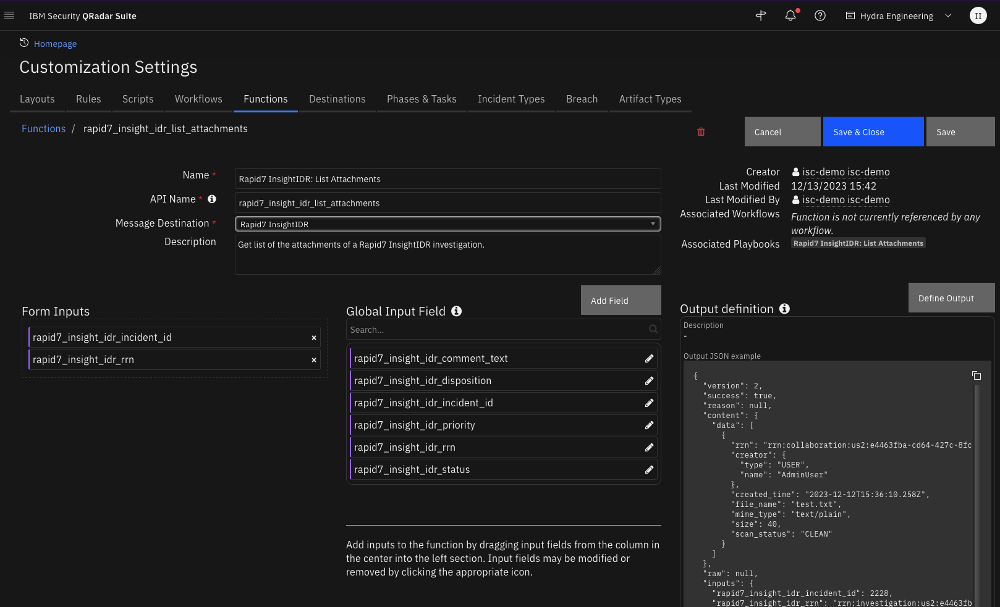 
<details><summary>Inputs:</summary>
<p>

| Name | Type | Required | Example | Tooltip |
| ---- | :--: | :------: | ------- | ------- |
| `rapid7_insight_idr_incident_id` | `number` | Yes | `-` | - |
| `rapid7_insight_idr_rrn` | `text` | Yes | `-` | Rapid7 Resource Name of the investigation. |

</p>
</details>

<details><summary>Outputs:</summary>
<p>

> **NOTE:** This example might be in JSON format, but `results` is a Python Dictionary on the SOAR platform.

```python
results = {
  "content": {
    "data": [
      {
        "created_time": "2023-12-12T15:36:10.258Z",
        "creator": {
          "name": "AdminUser",
          "type": "USER"
        },
        "file_name": "test.txt",
        "mime_type": "text/plain",
        "rrn": "rrn:collaboration:us2:e4463fba-cd64-427c-8fc9-f9e1983f24e1:attachment:9JF5ST900Y1H",
        "scan_status": "CLEAN",
        "size": 40
      }
    ]
  },
  "inputs": {
    "rapid7_insight_idr_incident_id": 2228,
    "rapid7_insight_idr_rrn": "rrn:investigation:us2:e4463fba-cd64-427c-8fc9-f9e1983f24e1:investigation:JSPDKLRG7UWY"
  },
  "metrics": {
    "execution_time_ms": 6807,
    "host": "mylaptop",
    "package": "fn-rapid7-insight-idr",
    "package_version": "1.0.0",
    "timestamp": "2023-12-12 11:34:29",
    "version": "1.0"
  },
  "raw": null,
  "reason": null,
  "success": true,
  "version": 2.0
}
```

</p>
</details>

<details><summary>Example Function Input Script:</summary>
<p>

```python
inputs.rapid7_insight_idr_incident_id = incident.id
inputs.rapid7_insight_idr_rrn = incident.properties.rapid7_insight_idr_rrn
```

</p>
</details>

<details><summary>Example Function Post Process Script:</summary>
<p>

```python
results = playbook.functions.results.list_attachments_results

# Setup error note in case of failure
data = {"error": results.get("reason")}
header = "<b>Rapid7 InsightIDR: List attachments FAILED:</b>"

if results.get("success"):
  content = results.get("content", {})
  if content:
    data = content.get("data", None)
    if data:
      header = "<b>Rapid7 InsightIDR: List attachments:</b>"

json_note = {
              "version": "1.3",
              "header": header, 
              "json": data,
              "sort": False
            }

playbook.addProperty('convert_json_to_rich_text', json_note)
```

</p>
</details>

---
## Function - Rapid7 InsightIDR: Post Comment to Rapid7 Investigation
Send a note to Rapid7 InsightIDR investigation as a comment.

 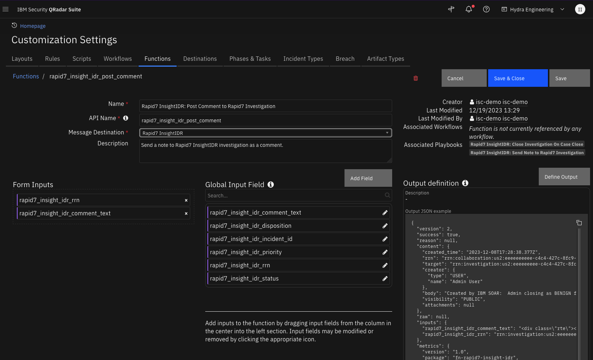

<details><summary>Inputs:</summary>
<p>

| Name | Type | Required | Example | Tooltip |
| ---- | :--: | :------: | ------- | ------- |
| `rapid7_insight_idr_comment_text` | `text` | Yes | `-` | - |
| `rapid7_insight_idr_rrn` | `text` | Yes | `-` | Rapid7 Resource Name of the investigation. |

</p>
</details>

<details><summary>Outputs:</summary>
<p>

> **NOTE:** This example might be in JSON format, but `results` is a Python Dictionary on the SOAR platform.

```python
results = {
  "content": {
    "attachments": null,
    "body": "Created by IBM SOAR:  Admin closing as BENIGN from SOAR December 8, 2023",
    "created_time": "2023-12-08T17:28:38.377Z",
    "creator": {
      "name": "Admin User",
      "type": "USER"
    },
    "rrn": "rrn:collaboration:us2:eeeeeeeeee-c4c4-427c-8fc9-f9e1e1e1e1ee1:comment:CDNOQXKNAFN5",
    "target": "rrn:investigation:us2:eeeeeeeee-c4c4-427c-8fc9-f9efe1e1e1e1e1:investigation:3XAAXAAXAAXAA",
    "visibility": "PUBLIC"
  },
  "inputs": {
    "rapid7_insight_idr_comment_text": "\u003cdiv class=\"rte\"\u003e\u003cdiv\u003eAdmin User closing as BENIGN from SOAR December 8, 2023\u003c/div\u003e\u003c/div\u003e",
    "rapid7_insight_idr_rrn": "rrn:investigation:us2:eeeeeeeee-c4c4-427c-8fc9-f9efe1e1e1e1e1:investigation:3XAAXAAXAAXAA"
  },
  "metrics": {
    "execution_time_ms": 263,
    "host": "laptop.local",
    "package": "fn-rapid7-insight-idr",
    "package_version": "1.0.0",
    "timestamp": "2023-12-08 12:28:38",
    "version": "1.0"
  },
  "raw": null,
  "reason": null,
  "success": true,
  "version": 2.0
}
```

</p>
</details>

<details><summary>Example Function Input Script:</summary>
<p>

```python
inputs.rapid7_insight_idr_rrn = incident.properties.rapid7_insight_idr_rrn
inputs.rapid7_insight_idr_comment_text = incident.resolution_summary.content if incident.resolution_summary.content else "Case {0} was closed in QRadar SOAR".format(incident.id)
```

</p>
</details>

<details><summary>Example Function Post Process Script:</summary>
<p>

```python
results = playbook.functions.results.post_comment_results

note_text = "Rapid7 InsightIDR Automatic playbook <b>On close from SOAR case</b> failed to post comment to Rapid7 InsightIDR: {0}".format(results.get("reason", None))

incident.addNote(note_text)
```

</p>
</details>

---
## Function - Rapid7 InsightIDR: Set Priority
Set the priority of a Rapid7 InsightIDR investigation from SOAR.

 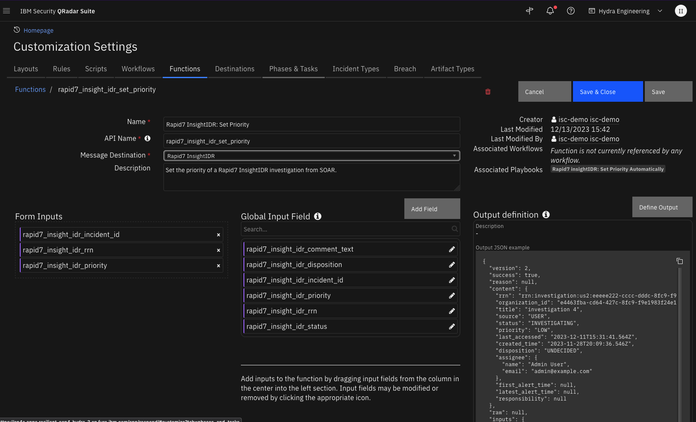

<details><summary>Inputs:</summary>
<p>

| Name | Type | Required | Example | Tooltip |
| ---- | :--: | :------: | ------- | ------- |
| `rapid7_insight_idr_incident_id` | `number` | Yes | `-` | - |
| `rapid7_insight_idr_priority` | `text` | Yes | `-` | - |
| `rapid7_insight_idr_rrn` | `text` | Yes | `-` | Rapid7 Resource Name of the investigation. |

</p>
</details>

<details><summary>Outputs:</summary>
<p>

> **NOTE:** This example might be in JSON format, but `results` is a Python Dictionary on the SOAR platform.

```python
results = {
  "content": {
    "assignee": {
      "email": "admin@example.com",
      "name": "Admin User"
    },
    "created_time": "2023-11-28T20:09:36.546Z",
    "disposition": "UNDECIDED",
    "first_alert_time": null,
    "last_accessed": "2023-12-11T15:31:41.564Z",
    "latest_alert_time": null,
    "organization_id": "e4463fba-cd64-427c-8fc9-f9e1983f24e1",
    "priority": "LOW",
    "responsibility": null,
    "rrn": "rrn:investigation:us2:eeeee222-cccc-dddc-8fc9-f9e19e19e1:investigation:2B9B9B9B9B9",
    "source": "USER",
    "status": "INVESTIGATING",
    "title": "investigation 4"
  },
  "inputs": {
    "rapid7_insight_idr_incident_id": 2220,
    "rapid7_insight_idr_priority": "LOW",
    "rapid7_insight_idr_rrn": "rrn:investigation:us2:eeeee222-cccc-dddc-8fc9-f9e19e19e1:investigation:2B9B9B9B9B9"
  },
  "metrics": {
    "execution_time_ms": 21848,
    "host": "mylaptop.local",
    "package": "fn-rapid7-insight-idr",
    "package_version": "1.0.0",
    "timestamp": "2023-12-11 10:31:47",
    "version": "1.0"
  },
  "raw": null,
  "reason": null,
  "success": true,
  "version": 2.0
}
```

</p>
</details>

<details><summary>Example Function Input Script:</summary>
<p>

```python
PRIORITY_MAPPING = {
  "Low": "LOW",
  "Medium": "MEDIUM",
  "High": "HIGH"
}
inputs.rapid7_insight_idr_incident_id = incident.id
inputs.rapid7_insight_idr_rrn = incident.properties.rapid7_insight_idr_rrn
inputs.rapid7_insight_idr_priority = PRIORITY_MAPPING.get(incident.severity_code)
```

</p>
</details>

<details><summary>Example Function Post Process Script:</summary>
<p>

```python
results = playbook.functions.results.set_priority_results

if results.get("success"):
  priority = results.content.priority
  note_text = "<b>Rapid7 InsightIDR: Set Priority</b> Automatic Playbook set:<br>   Priority: {0}".format(priority)
else:
  note_text = "<b>Rapid7 InsightIDR: Set Priority</b> Automatic Playbook failed:<br>  {0}".results.get("reason")
  
incident.addNote(note_text)
```

</p>
</details>

---
## Function - Rapid7: InsightIDR Set Status
Set the status of a Rapid7 InsightIDR investigation. Optionally, set the investigation disposition.

 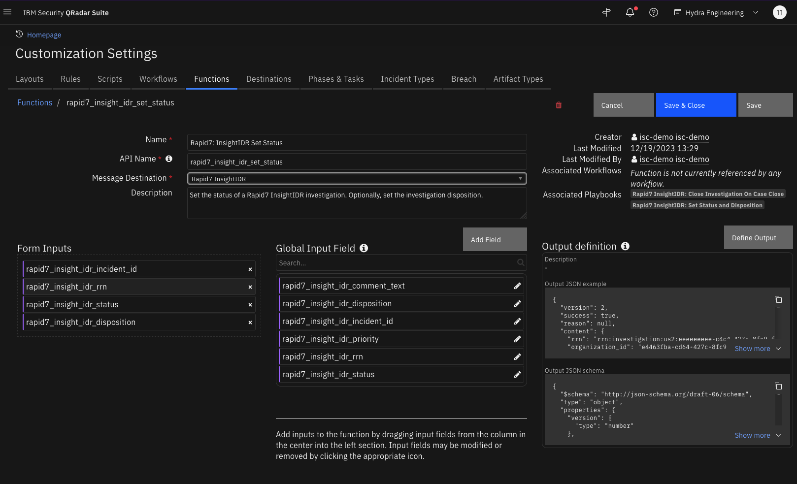

<details><summary>Inputs:</summary>
<p>

| Name | Type | Required | Example | Tooltip |
| ---- | :--: | :------: | ------- | ------- |
| `rapid7_insight_idr_disposition` | `text` | No | `-` | A disposition to set the investigation to. Only used if the new status is CLOSED.  Possible values: "BENIGN" "MALICIOUS" "NOT_APPLICABLE" |
| `rapid7_insight_idr_incident_id` | `number` | Yes | `-` | - |
| `rapid7_insight_idr_rrn` | `text` | Yes | `-` | Rapid7 Resource Name of the investigation. |
| `rapid7_insight_idr_status` | `text` | Yes | `-` | The new status for the investigation (case insensitive). For example: "OPEN" "CLOSED" "INVESTIGATING" "WAITING" |

</p>
</details>

<details><summary>Outputs:</summary>
<p>

> **NOTE:** This example might be in JSON format, but `results` is a Python Dictionary on the SOAR platform.

```python
results = {
  "content": {
    "assignee": null,
    "created_time": "2023-11-10T15:55:12.182Z",
    "disposition": "BENIGN",
    "first_alert_time": null,
    "last_accessed": "2023-12-08T17:30:12.959Z",
    "latest_alert_time": null,
    "organization_id": "e4463fba-cd64-427c-8fc9-f9e1e1e1e1e1e1e1",
    "priority": "LOW",
    "responsibility": null,
    "rrn": "rrn:investigation:us2:eeeeeeeee-c4c4-427c-8fc9-f9efe1e1e1e1e1:investigation:3XAAXAAXAAXAA",
    "source": "USER",
    "status": "CLOSED",
    "title": "Our 1st investigation"
  },
  "inputs": {
    "rapid7_insight_idr_disposition": "BENIGN",
    "rapid7_insight_idr_incident_id": 2211,
    "rapid7_insight_idr_rrn": "rrn:investigation:us2:eeeeeeeee-c4c4-427c-8fc9-f9efe1e1e1e1e1:investigation:3XAAXAAXAAXAA",
    "rapid7_insight_idr_status": "CLOSED",
    "rapid7_insight_idr_threat_command_close_reason": "ProblemSolved",
    "rapid7_insight_idr_threat_command_free_text": "\u003cdiv class=\"rte\"\u003e\u003cdiv\u003eAdmin User closing as BENIGN from SOAR December 8, 2023\u003c/div\u003e\u003c/div\u003e"
  },
  "metrics": {
    "execution_time_ms": 93166,
    "host": "laptop.local",
    "package": "fn-rapid7-insight-idr",
    "package_version": "1.0.0",
    "timestamp": "2023-12-08 12:30:12",
    "version": "1.0"
  },
  "raw": null,
  "reason": null,
  "success": true,
  "version": 2.0
}
```

</p>
</details>

<details><summary>Example Function Input Script:</summary>
<p>

```python
STATUS_MAPPING = {
  "Open": "OPEN",
  "Investigating": "INVESTIGATING",
  "Waiting": "WAITING",
  "Closed": "CLOSED"
}
inputs.rapid7_insight_idr_rrn = incident.properties.rapid7_insight_idr_rrn
inputs.rapid7_insight_idr_incident_id = incident.id
inputs.rapid7_insight_idr_status = STATUS_MAPPING.get(playbook.inputs.rapid7_insight_idr_status)

if inputs.rapid7_insight_idr_status == "CLOSED" and playbook.inputs.rapid7_insight_idr_disposition == "Undecided":
  helper.fail("Rapid7 InsightIDR: Status can not be set to Closed with Disposition set to Undecided")
else:
  inputs.rapid7_insight_idr_disposition = playbook.inputs.rapid7_insight_idr_disposition

```

</p>
</details>

<details><summary>Example Function Post Process Script:</summary>
<p>

```python
MAPPING_DISPOSITON_ON_CLOSE = {
  "Benign": "Resolved",
  "Malicious": "Resolved",
  "Unknown": "Resolved",
  "Not Applicable": "Not an Issue"
}
results = playbook.functions.results.set_status_results

if results.get("success"):
  content = results.get("content", {})
  if content:
    status = content.get("status", {})
    input_status = playbook.inputs.rapid7_insight_idr_status

    if status.lower() == input_status.lower():
        incident.properties.rapid7_insight_idr_status = playbook.inputs.rapid7_insight_idr_status
        
    disposition = content.get("disposition", {})
    input_disposition = playbook.inputs.rapid7_insight_idr_disposition
    if disposition.lower() == input_disposition.lower():
        incident.properties.rapid7_insight_idr_disposition = playbook.inputs.rapid7_insight_idr_disposition
        
    if incident.properties.rapid7_insight_idr_status.lower() == "closed":
      incident.plan_status = "C"
      incident.resolution_id = MAPPING_DISPOSITON_ON_CLOSE.get(incident.properties.rapid7_insight_idr_disposition)
      incident.resolution_summary = "Case {0} Closed in SOAR".format(incident.id)

    note_text = "<b>Rapid7 InsightIDR: Set Status and Disposition</b> set:<br>   Status: {0}<br>   Disposition: {1}".format(incident.properties.rapid7_insight_idr_status, incident.properties.rapid7_insight_idr_disposition)
  else:
    note_text = "<b>Rapid7 InsightIDR: Set Status and Disposition</b> failed:<br>  {0}".results.get("reason")
else:
  note_text = "<b>Rapid7 InsightIDR: Set Status and Disposition</b> failed:<br>  {0}".results.get("reason")
  
incident.addNote(note_text)
```

</p>
</details>

---

## Playbooks
| Playbook Name | Description | Activation Type | Object | Status | Condition | 
| ------------- | ----------- | --------------- | ------ | ------ | --------- | 
| Rapid7 InsightIDR: Close Investigation On Case Close | Automatic playbook that updates the Status and disposition of the associated investigation in Rapid7 InsightIDR when the cases is closed in SOAR.  The SOAR case resolution summary is written as a comment to the Rapid7 InsightIDR investigation. | Automatic | incident | `enabled` | `incident.plan_status changed_to Closed AND incident.properties.rapid7_insight_idr_rrn has_a_value` | 
| Rapid7 InsightIDR: Closed by Rapid7 InsightIDR | Write a note to SOAR when Rapid7 InsightIDR closes an investigation. | Automatic | incident | `enabled` | `incident.properties.rapid7_insight_idr_rrn has_a_value AND incident.resolution_summary changed AND incident.resolution_summary contains Closed by Rapid7 InsightIDR` | 
| Rapid7 InsightIDR: Get Alert Evidence | Get the alert evidence of the alert in the data table row and write the JSON results to the Evidence column of the Alerts data table.  Create artifacts from the evidence. | Manual | rapid7_insight_idr_alerts_dt | `enabled` | `-` | 
| Rapid7 InsightIDR: Get Alerts | Get the alerts associated with a Rapid7 Insight IDR investigation. | Manual | incident | `enabled` | `incident.plan_status equals Active AND incident.properties.rapid7_insight_idr_rrn has_a_value` | 
| Rapid7 InsightIDR: Get Attachments from Investigation | Manual playbook to get the attachments associated with the Rapid7 InsightIDR investigation and add them ass attachments to the SOAR case. | Manual | incident | `enabled` | `incident.plan_status equals Active AND incident.properties.rapid7_insight_idr_rrn has_a_value` | 
| Rapid7 InsightIDR: Get Comments from Investigation | Get the comments from Rapid7 InsightIDR investigation and add as a note in SOAR. | Manual | incident | `enabled` | `incident.plan_status equals Active AND incident.properties.rapid7_insight_idr_rrn has_a_value` | 
| Rapid7 InsightIDR: Send Note to Rapid7 Investigation | Manual playbook that sends a note in SOAR to an investigation in Rapid7 InsightIDR as a comment. | Manual | note | `enabled` | `incident.plan_status equals Active AND incident.properties.rapid7_insight_idr_rrn has_a_value AND note.text not_contains Sent to Rapid7 InsightIDR at` | 
| Rapid7 insightIDR: Set Priority Automatically | Playbook to automatically update the priority of a Rapid7 InsightIDR investigation if the priority is changed in SOAR. | Automatic | incident | `enabled` | `incident.plan_status equals Active AND incident.severity_code changed` | 
| Rapid7 InsightIDR: Set Status and Disposition | Manual playbook to set the Status and Disposition of the Rapid7 InsightIDR investigation in Rapid7 InsightIDR | Manual | incident | `enabled` | `incident.plan_status equals Active AND incident.properties.rapid7_insight_idr_rrn has_a_value` | 
| Rapid7 InsightIDR: Update Case | Manual playbook to update a Rapid7 InsightIDR case. Custom fields and comments are updated in SOAR.| Manual | incident | `enabled` | `incident.properties.rapid7_insight_idr_rrn has_a_value` | 
| Rapid7 InsightIDR: Update Created Rapid7 InsightIDR Case | Automatic playbook to update a newly created Rapid7 InsightIDR case. | Automatic | incident | `enabled` | `incident.properties.rapid7_insight_idr_rrn has_a_value AND object_added` | 

---

## Custom Layouts
<!--
  Use this section to provide guidance on where the user should add any custom fields and data tables.
  You may wish to recommend a new incident tab.
  You should save a screenshot "custom_layouts.png" in the doc/screenshots directory and reference it here
-->
* Import the Data Tables and Custom Fields like the screenshot below:

  


## Data Table - Rapid7 InsightIDR Alerts

Screenshot of a Attack Behavior Analytics alert:
 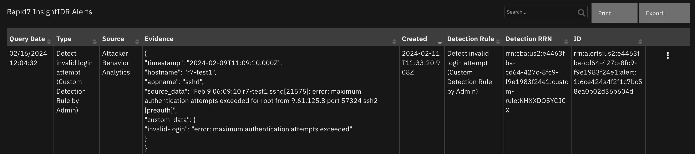

Screenshot of a User Behavior Analytics alert (evidence obtained from InsightIDR restricted evidence API):
 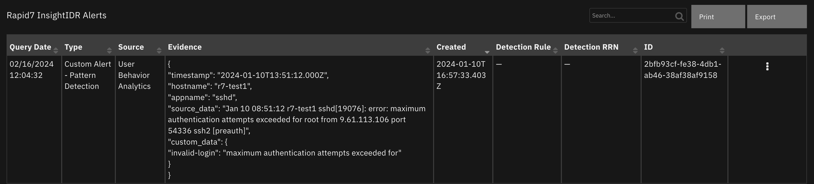

#### API Name:
rapid7_insight_idr_alerts_dt

#### Columns:
| Column Name | API Access Name | Type | Tooltip |
| ----------- | --------------- | ---- | ------- |
| Created | `r7_create_time` | `datetimepicker` | - |
| Detection RRN | `r7_detection_rrn` | `text` | - |
| Detection Rule | `r7_detection_rule` | `text` | - |
| Evidence | `r7_evidence` | `text` | - |
| ID | `r7_alert_id` | `text` | - |
| Query Date | `r7_query_date` | `datetimepicker` | - |
| Source | `r7_alert_source` | `text` | - |
| Type | `r7_alert_type` | `text` | - |

---

## Custom Fields
| Label | API Access Name | Type | Prefix | Placeholder | Tooltip |
| ----- | --------------- | ---- | ------ | ----------- | ------- |
| InsightIDR Assignee | `rapid7_insight_idr_assignee` | `text` | `properties` | - | - |
| InsightIDR Assignee Email | `rapid7_insight_idr_assignee_email` | `text` | `properties` | - | - |
| InsightIDR Disposition | `rapid7_insight_idr_disposition` | `select` | `properties` | - | - |
| InsightIDR Link | `rapid7_insight_idr_link` | `text area` | `properties` | - | - |
| InsightIDR Responsibility | `rapid7_insight_idr_responsibility` | `text` | `properties` | - | - |
| InsightIDR RRN | `rapid7_insight_idr_rrn` | `text` | `properties` | - | - |
| InsightIDR Source | `rapid7_insight_idr_source` | `text` | `properties` | - | - |
| InsightIDR Status | `rapid7_insight_idr_status` | `select` | `properties` | - | - |

---
## Templates for SOAR Cases
It may necessary to modify the templates used to create or close SOAR cases based on a customer's required custom fields. Below are the default templates used which can be copied, modified and used with app_config's
`soar_create_case_template` and `soar_close_case_template` settings to override the default templates.

### soar_create_case.jinja
When overriding the template in App Host, specify the file path as `/var/rescircuits`.

```
{
  {# JINJA template for creating a new SOAR incident from an endpoint #}
  {# See https://ibmresilient.github.io/resilient-python-api/pages/resilient-lib/resilient-lib.html#module-resilient_lib.components.templates_common
     for details on available jinja methods. Examples for `soar_substitute` and more are included below.
  #}
  {# modify to specify your specific **data** fields #}
  "name": "{{ title }} - Rapid7 InsightIDR Investigation",
  "description": "{{ title | replace('"', '\\"') }}",
  {# start_date cannot be after discovered_date #}
  {#  #}
  "discovered_date": {{ created_time | soar_datetimeformat(split_at='.') }},
  "start_date": {{ created_time | soar_datetimeformat(split_at='.') }},
  {# if alert users are different than SOAR users, consider using a mapping table using soar_substitute: #}
  {# "owner_id": "{{ **assignedTo** |soar_substitute('{"Automation": "soar_user1@example.com", "default_user@example.com": "soar_user2@example.com", "DEFAULT": "default_user@example.com" }') }}", #}
  "plan_status": "A",
  {#"plan_status": "{{ status|soar_substitute('{"CLOSED": "C", "INVESTIGATING": "A", "OPEN": "A", "WAITING": "A"}') }}",#}
  
    "severity_code": "High",
    
    "severity_code": "High",
    
    "severity_code": "Medium",
    
    "severity_code": "Low",
    
    "severity_code": "High",
  
  {# specify your custom fields for your endpoint solution #}
  "properties": {
    "rapid7_insight_idr_rrn": "{{ rrn }}"
  }
}
```

### soar_close_case.jinja
When overriding the template in App Host, specify the file path as `/var/rescircuits`.
```
{
  {# JINJA template for closing a SOAR incident using endpoint data #}
  "plan_status": "C",
  "resolution_id": "{{ disposition | soar_substitute('{"BENIGN": "Not an Issue", "MALICIOUS": "Resolved", "UNDECIDED": "Unresolved", "UNKNOWN": "Unresolved", "NOT APPLICABLE": "Not an Issue"}') }}",
  "resolution_summary": "Closed by Rapid7 InsightIDR, Disposition: {{ disposition.replace('_', ' ')|lower|capitalize }}",
  {# add additional fields based on your 'on close' field requirements #}
  "properties": {
    "rapid7_insight_idr_status": "{{ status|lower|capitalize }}",
    "rapid7_insight_idr_disposition": "{{ disposition.replace('_', ' ')|title }}"
  }
}
```

### soar_update_case.jinja
When overriding the template in App Host, specify the file path as `/var/rescircuits`.
```
{
  {# JINJA template for updating a new SOAR incident from an endpoint #}
  {# modify to specify your specific **data** fields #}
  "plan_status": "{{ status|soar_substitute('{"CLOSED": "C", "INVESTIGATING": "A", "OPEN": "A", "WAITING": "A"}') }}",
  
    "severity_code": "High",
    
    "severity_code": "High",
    
    "severity_code": "Medium",
    
    "severity_code": "Low",
    
    "severity_code": "High",
  
  {# specify your custom fields for your endpoint solution #}
  "properties": {
    "rapid7_insight_idr_source": "{{ source|lower|capitalize }}",
    "rapid7_insight_idr_status": "{{ status|lower|capitalize }}",
    "rapid7_insight_idr_assignee": "{{ assignee.name }}",
    "rapid7_insight_idr_assignee_email": "{{ assignee.email }}",
    "rapid7_insight_idr_disposition": "{{ disposition.replace('_', ' ')|title }}",
    "rapid7_insight_idr_responsibility": "{{ responsibility }}",
    "rapid7_insight_idr_link": "<a target='_blank' href='{{ entity_url }}'>Investigation</a>"
  }
}
```
---


## Troubleshooting & Support
Refer to the documentation listed in the Requirements section for troubleshooting information.
 
### For Support
This is an IBM supported app. Please search [ibm.com/mysupport](https://ibm.com/mysupport) for assistance.
