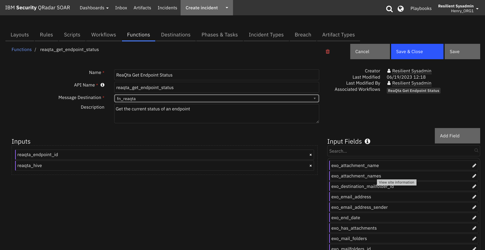
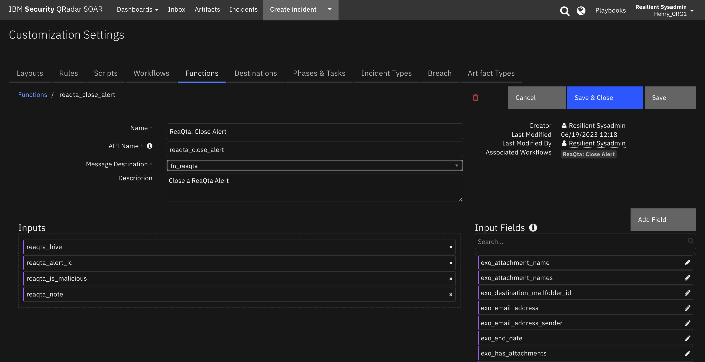
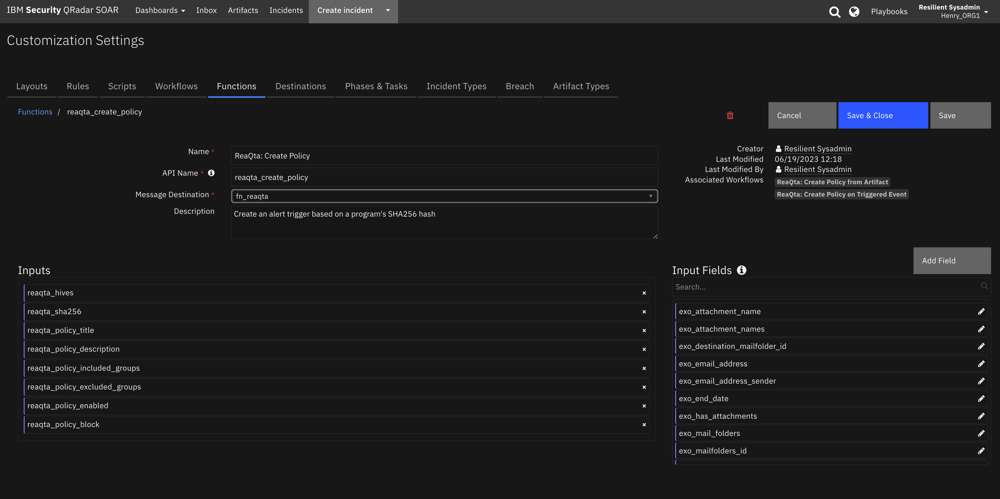
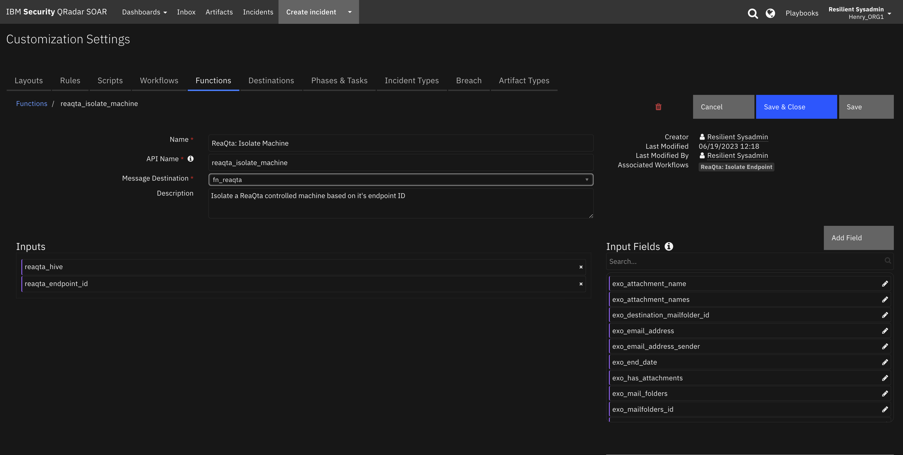
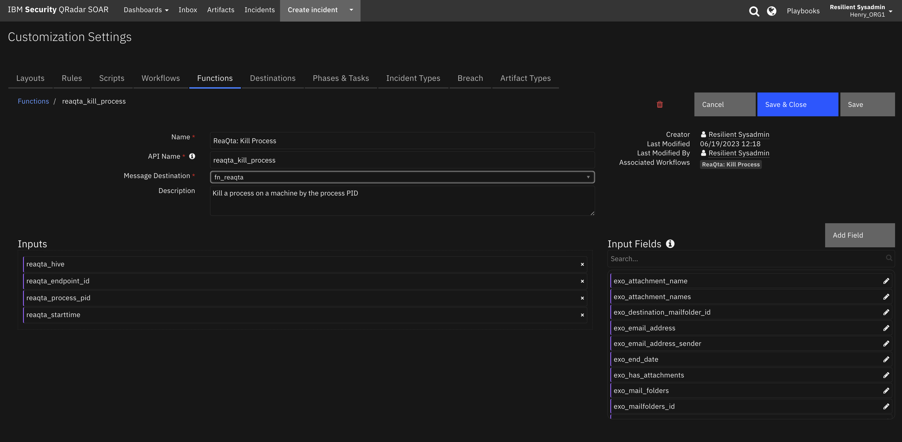
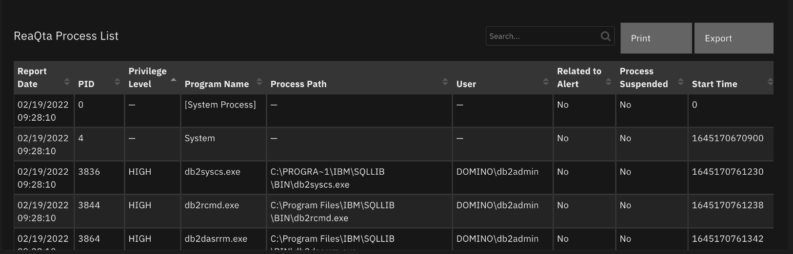

<!--
  This README.md is generated by running:
  "resilient-sdk docgen -p fn_reaqta"

  This file was generated with resilient-sdk v49.0.4423

  It is best edited using a Text Editor with a Markdown Previewer. VS Code
  is a good example. Checkout https://guides.github.com/features/mastering-markdown/
  for tips on writing with Markdown

  All fields followed by "::CHANGE_ME::"" should be manually edited

  If you make manual edits and run docgen again, a .bak file will be created

  Store any screenshots in the "doc/screenshots" directory and reference them like:
  

  NOTE: If your app is available in the container-format only, there is no need to mention the integration server in this readme.
-->

# ReaQta

## Table of Contents
- [Release Notes](#release-notes)
- [Overview](#overview)
  - [Key Features](#key-features)
- [Requirements](#requirements)
  - [SOAR platform](#soar-platform)
  - [Cloud Pak for Security](#cloud-pak-for-security)
  - [Proxy Server](#proxy-server)
  - [Python Environment](#python-environment)
- [Installation](#installation)
  - [Install](#install)
  - [App Configuration](#app-configuration)
  - [Custom Layouts](#custom-layouts)
- [Function - ReaQta Get Endpoint Status](#function---reaqta-get-endpoint-status)
- [Function - ReaQta: Attach File](#function---reaqta-attach-file)
- [Function - ReaQta: Close Alert](#function---reaqta-close-alert)
- [Function - ReaQta: Create Artifact](#function---reaqta-create-artifact)
- [Function - ReaQta: Create Note](#function---reaqta-create-note)
- [Function - ReaQta: Create Policy](#function---reaqta-create-policy)
- [Function - ReaQta: Get Alert Information](#function---reaqta-get-alert-information)
- [Function - ReaQta: Get Processes](#function---reaqta-get-processes)
- [Function - ReaQta: Isolate Machine](#function---reaqta-isolate-machine)
- [Function - ReaQta: Kill Process](#function---reaqta-kill-process)
- [Data Table - ReaQta Process List](#data-table---reaqta-process-list)
- [Data Table - ReaQta Trigger Events](#data-table---reaqta-trigger-events)
- [Custom Fields](#custom-fields)
- [Playbooks](#playbooks)
- [Troubleshooting & Support](#troubleshooting--support)

---

## Release Notes
<!--
  Specify all changes in this release. Do not remove the release 
  notes of a previous release
-->
| Version | Date | Notes |
| ------- | ---- | ----- |
| 1.0.0 | 03/2022 | Initial Release | <!-- ::CHANGE_ME:: -->

---

## Overview
<!--
  Provide a high-level description of the function itself and its remote software or application.
  The text below is parsed from the "description" and "long_description" attributes in the setup.py file
-->
**IBM SOAR app bidirectional synchronization and functions for ReaQta**

  <!-- ::CHANGE_ME:: -->

Bidirectional synchronization of ReaQta Alerts to IBM SOAR.

  Additional functions exists to list and kill endpoint processes, isolate the endpoint and synchronize notes and close events.


### Key Features
<!--
  List the Key Features of the Integration
-->
* Sync alerts to SOAR cases via user defined filter criteria
* Sync SOAR case notes to ReaQta
* ReaQta alert closing closes the SOAR case and SOAR case closing closes the ReaQta alert
* Get running processes on a give endpoint
* Download ReaQta endpoint process file to an attachment
* Kill ReaQta endpoint processes
* Isolate ReaQta endpoint
* Create a new Alert or Blocking policy based on a file hash


---

## Requirements
<!--
  List any Requirements 
--> 
<!-- ::CHANGE_ME:: -->
This app supports the IBM Security QRadar SOAR Platform and the IBM Security QRadar SOAR for IBM Cloud Pak for Security.

### SOAR platform
The SOAR platform supports two app deployment mechanisms, Edge Gateway (formerly App Host) and integration server.

If deploying to a SOAR platform with an Edge Gateway, the requirements are:
* SOAR platform >= `47.0.8304`.
* The app is in a container-based format (available from the AppExchange as a `zip` file).

If deploying to a SOAR platform with an integration server, the requirements are:
* SOAR platform >= `47.0.8304`.
* The app is in the older integration format (available from the AppExchange as a `zip` file which contains a `tar.gz` file).
* Integration server is running `resilient-circuits>=46.0.0`.
* If using an API key account, make sure the account provides the following minimum permissions: 
  | Name | Permissions |
  | ---- | ----------- |
  | Org Data | Read |
  | Function | Read |
  | Incidents | Create, Read, Edit, Edit Status |
  <!-- ::CHANGE_ME:: -->

The following SOAR platform guides provide additional information: 
* _Edge Gateway Deployment Guide_ or _App Host Deployment Guide_: provides installation, configuration, and troubleshooting information, including proxy server settings. 
* _Integration Server Guide_: provides installation, configuration, and troubleshooting information, including proxy server settings.
* _System Administrator Guide_: provides the procedure to install, configure and deploy apps. 

The above guides are available on the IBM Documentation website at [ibm.biz/soar-docs](https://ibm.biz/soar-docs). On this web page, select your SOAR platform version. On the follow-on page, you can find the _Edge Gateway Deployment Guide_, _App Host Deployment Guide_, or _Integration Server Guide_ by expanding **Apps** in the Table of Contents pane. The System Administrator Guide is available by expanding **System Administrator**.

### Cloud Pak for Security
If you are deploying to IBM Cloud Pak for Security, the requirements are:
* IBM Cloud Pak for Security >= `1.8`.
* Cloud Pak is configured with an Edge Gateway.
* The app is in a container-based format (available from the AppExchange as a `zip` file).

The following Cloud Pak guides provide additional information: 
* _Edge Gateway Deployment Guide_ or _App Host Deployment Guide_: provides installation, configuration, and troubleshooting information, including proxy server settings. From the Table of Contents, select Case Management and Orchestration & Automation > **Orchestration and Automation Apps**.
* _System Administrator Guide_: provides information to install, configure, and deploy apps. From the IBM Cloud Pak for Security IBM Documentation table of contents, select Case Management and Orchestration & Automation > **System administrator**.

These guides are available on the IBM Documentation website at [ibm.biz/cp4s-docs](https://ibm.biz/cp4s-docs). From this web page, select your IBM Cloud Pak for Security version. From the version-specific IBM Documentation page, select Case Management and Orchestration & Automation.

### Proxy Server
The app **does/does not** <!-- ::CHANGE_ME:: --> support a proxy server.

### Python Environment
Python 3.6 and Python 3.9 are supported.
Additional package dependencies may exist for each of these packages:
* cachetools
* resilient-circuits>=46.0.0
* retry2

### <!-- ::CHANGE_ME:: --> Development Version

This app has been implemented using:
| Product Name | Product Version | API URL | API Version |
| ------------ | --------------- | ------- | ----------- |
|ReaQta Hive | 3.7 | rqt-api/1/ | 1 |
 <!-- ::CHANGE_ME:: --> | <!-- ::CHANGE_ME:: --> | <!-- ::CHANGE_ME:: --> | <!-- ::CHANGE_ME:: --> |

#### Prerequisites
<!--
List any prerequisites that are needed to use with this endpoint solution. Remove any section that is unnecessary.
-->


#### Configuration
<!--
List any steps that are needed to configure the endpoint to use this app.
-->
In order to make API calls to ReaQta, create an API Application, prodiving the endpoint group restrictions as appropiate. The API ID and secret will be copied into your app.config file


#### Permissions
<!--
List any user permissions that are needed to use this endpoint. For example, list the API key permissions.
-->


---

## Installation

### Install
* To install or uninstall an App or Integration on the _SOAR platform_, see the documentation at [ibm.biz/soar-docs](https://ibm.biz/soar-docs).
* To install or uninstall an App on _IBM Cloud Pak for Security_, see the documentation at [ibm.biz/cp4s-docs](https://ibm.biz/cp4s-docs) and follow the instructions above to navigate to Orchestration and Automation.

### App Configuration
The following table provides the settings you need to configure the app. These settings are made in the app.config file. See the documentation discussed in the Requirements section for the procedure.

#### [fn_reaqta]
This section defines the global settings, including the poller configuration.
For each hive, use the section definition below

| Config | Required | Example | Description |
| ------ | :------: | ------- | ----------- |
| **polling_interval** | Yes | `60` | *Number of seconds between polling queries for new alerts *  |
| **polling_lookback** | Yes | `120` | *Number of minutes to look back for new alerts the first time the app starts or restarts*  |
| **soar_create_case_template** | No | `/path/to/template.jina` | *Override template used to create a SOAR case from the poller. See [Templates for SOAR Cases](#templates-for-soar-cases)* |
| **soar_close_case_template** | No | `/path/to/template.jina` | *Override template used to close a SOAR case from the poller. See [Templates for SOAR Cases](#templates-for-soar-cases)* |
| **https_proxy** | No | `https://xxx/` | *Proxy URL for HTTPS connections* |
| **http_proxy** | No | `http://xxx/` | *Proxy URL for HTTP connections* |
| **timeout** | No | `60` | *Seconds to wait for APIs calls back to ReaQta. Default is 30* |
| **polling_hives** | Yes | hive_label1, hive_label2 | *Comma separated list of hives to poll.* |
| **policy_hives** | Yes |  hive_label1, hive_label2 | *Comma separated list of hives to set a policy if not specified from the SOAR function call* |

#### [fn_reaqta:hive_label]
Repeat this section for each ReaQta hive. Add the `hive_label` used in the `polling_hives` parameter above.

| Config | Required | Example | Description |
| ------ | :------: | ------- | ----------- |
| **reaqta_url** | Yes | `https://xxx/` | *Base URL to ReaQta instance ending in slash '/'*  |
| **api_key** | Yes | `7411a4da-c770-...` | *API Key ID from your configured ReaQta API application* |
| **api_secret** | Yes | `P9zPLkcb-...` | *API Key secret from your configured ReaQta API application*  |
| **api_version** | Yes | `rqt_api/1/` | *API version portion of url to append to reaqta_url, ending in slash '/'*  |
| **cafile** | Yes | `/path/to/cafile.crt or false` | *Path to your ReaQta client certificate, if needed or false for no certificate verification*  |
| **polling_filters** | No | "severity": ["medium", "high"], "tag": ["hive"], "groups": ["groupA", "groupB"], "impact": 70 | *Set filters for the poller. Groups are either Client or Group names. Impact compares alerts greater or equal to this value* |

### Custom Layouts
<!--
  Use this section to provide guidance on where the user should add any custom fields and data tables.
  You may wish to recommend a new incident tab.
  You should save a screenshot "custom_layouts.png" in the doc/screenshots directory and reference it here
-->
* Import the Data Tables and Custom Fields like the screenshot below:

   <!-- ::CHANGE_ME:: -->

---

## Poller Considerations

The poller is just one way to escalate ReaQta alerts to SOAR cases. It's also possible to send alert information to a SIEM, such as IBM QRadar, which would then coorelate alerts into Offenses. With the QRadar Plugin for SOAR, offenses can then be ecalated to SOAR cases. As long as the ReaQta alert ID is preserved in the custom case field `reaqta_id` and `reaqta_hive`, then all the remaining details about the alert will synchronize to the SOAR case. In the case of the QRadar Plugin for SOAR, you would modify the escalation templates to reference this custom field with the ReaQta Alert ID.

When using another source of ReaQta Alert escalation to IBM SOAR, disable the poller by changing the app.config setting to `poller_interval=0`.

---

## Function - ReaQta Get Endpoint Status
Get the current status of an endpoint

  <!-- ::CHANGE_ME:: -->

<details><summary>Inputs:</summary>
<p>

| Name | Type | Required | Example | Tooltip |
| ---- | :--: | :------: | ------- | ------- |
| `reaqta_endpoint_id` | `text` | Yes | `-` | - |
| `reaqta_hive` | `text` | No | `-` | Label used to identify which ReaQta hive this alert is associated with |

</p>
</details>

<details><summary>Outputs:</summary>
<p>

> **NOTE:** This example might be in JSON format, but `results` is a Python Dictionary on the SOAR platform.

```python
results = {
  "content": {
    "agentVersion": "3.10.1",
    "arch": 2,
    "avInstalled": false,
    "componentsVersions": [
      {
        "build": "27.1668701555901.commit",
        "name": "keeper",
        "version": "3.10.1"
      },
      {
        "build": "3.5.0",
        "name": "probos",
        "version": "3.5.0"
      },
      {
        "build": "119.1632119719010.commit",
        "name": "rqtsentry",
        "version": "3.6.1"
      },
      {
        "build": "45.1666597836648.commit",
        "name": "rqtnetsentry",
        "version": "3.10.0"
      },
      {
        "build": "",
        "name": "installer",
        "version": "3.10.1"
      }
    ],
    "connected": false,
    "cpuDescr": "Intel(R) Core(TM) i7-10750H CPU @ 2.60GHz",
    "cpuVendor": 1,
    "disconnectionReason": 0,
    "groups": [
      {
        "description": "This is an example group.",
        "id": "988899645751033863",
        "name": "Example Group",
        "parentGroupId": "988899392910000135"
      },
      {
        "id": "988899392910000135",
        "name": "Example Client"
      }
    ],
    "hvStatus": 19,
    "id": "982370521729466368",
    "isDomainController": false,
    "isServer": false,
    "isVirtualMachine": false,
    "isolated": false,
    "isolationStatus": "PENDING_ISOLATION",
    "isolationStatusFailure": null,
    "kernel": "10.0",
    "lastSeenAt": "2023-07-07T22:05:29.109Z",
    "localAddr": "192.168.1.97",
    "machineId": "0c0dcd602f5d65aed629d4199c8f665955c434050d68a634eaf4ba0e1058b7ce",
    "macs": [
      "5c:e4:2a:2c:f3:a7",
      "90:2e:16:c4:f7:7d"
    ],
    "name": "IBM-PF36LBRC",
    "os": "Windows 10 Enterprise",
    "osType": 1,
    "registrationTime": "2023-04-24T21:50:33.146Z",
    "sessionEnd": "2023-07-07T22:10:29.109Z",
    "sessionStart": "2023-07-07T21:20:29.083Z",
    "state": 1,
    "tags": []
  },
  "inputs": {
    "reaqta_endpoint_id": "982370521729466368",
    "reaqta_hive": "rhiveam"
  },
  "metrics": {
    "execution_time_ms": 468,
    "host": "Henry\u0027s IBM 16 inch Macbook Pro",
    "package": "fn-reaqta",
    "package_version": "1.1.0",
    "timestamp": "2023-07-10 12:50:02",
    "version": "1.0"
  },
  "raw": null,
  "reason": null,
  "success": true,
  "version": 2.0
}
```

</p>
</details>

<details><summary>Example Pre-Process Script:</summary>
<p>

```python
None
```

</p>
</details>

<details><summary>Example Post-Process Script:</summary>
<p>

```python
None
```

</p>
</details>

---
## Function - ReaQta: Attach File
Attach the file associated with a running process

  <!-- ::CHANGE_ME:: -->

<details><summary>Inputs:</summary>
<p>

| Name | Type | Required | Example | Tooltip |
| ---- | :--: | :------: | ------- | ------- |
| `reaqta_endpoint_id` | `text` | Yes | `-` | - |
| `reaqta_hive` | `text` | No | `-` | Label used to identify which ReaQta hive this alert is associated with |
| `reaqta_incident_id` | `number` | Yes | `-` | - |
| `reaqta_program_path` | `text` | Yes | `-` | - |

</p>
</details>

<details><summary>Outputs:</summary>
<p>

> **NOTE:** This example might be in JSON format, but `results` is a Python Dictionary on the SOAR platform.

```python
results = {
  "content": {},
  "inputs": {
    "reaqta_endpoint_id": "982370521729466368",
    "reaqta_hive": "rhiveam",
    "reaqta_incident_id": 2131,
    "reaqta_program_path": "c:\\windows\\system32\\net.exe"
  },
  "metrics": {
    "execution_time_ms": 448,
    "host": "Henry\u0027s IBM 16 inch Macbook Pro",
    "package": "fn-reaqta",
    "package_version": "1.1.0",
    "timestamp": "2023-07-10 11:53:28",
    "version": "1.0"
  },
  "raw": null,
  "reason": "ReaQta Error: \n    status code: 422\n    message: Endpoint offline\n    details: {\u0027endpointId\u0027: \u0027982370521729466368\u0027, \u0027lastSeenAt\u0027: \u00272023-07-07T22:05:29.109Z\u0027}",
  "success": false,
  "version": 2.0
}
```

</p>
</details>

<details><summary>Example Pre-Process Script:</summary>
<p>

```python
None
```

</p>
</details>

<details><summary>Example Post-Process Script:</summary>
<p>

```python
None
```

</p>
</details>

---
## Function - ReaQta: Close Alert
Close a ReaQta Alert

  <!-- ::CHANGE_ME:: -->

<details><summary>Inputs:</summary>
<p>

| Name | Type | Required | Example | Tooltip |
| ---- | :--: | :------: | ------- | ------- |
| `reaqta_alert_id` | `text` | Yes | `-` | - |
| `reaqta_hive` | `text` | No | `-` | Label used to identify which ReaQta hive this alert is associated with |
| `reaqta_is_malicious` | `boolean` | Yes | `-` | - |
| `reaqta_note` | `text` | No | `-` | - |

</p>
</details>

<details><summary>Outputs:</summary>
<p>

> **NOTE:** This example might be in JSON format, but `results` is a Python Dictionary on the SOAR platform.

```python
results = {
  "content": {
    "alertId": "1015597023501484034",
    "closed": true
  },
  "inputs": {
    "reaqta_alert_id": "1015597023501484034",
    "reaqta_hive": "rhiveam",
    "reaqta_is_malicious": false,
    "reaqta_note": "\u003cdiv class=\"rte\"\u003e\u003cdiv\u003etest\u003c/div\u003e\u003c/div\u003e"
  },
  "metrics": {
    "execution_time_ms": 1483,
    "host": "Henry\u0027s IBM 16 inch Macbook Pro",
    "package": "fn-reaqta",
    "package_version": "1.1.0",
    "timestamp": "2023-07-10 12:52:38",
    "version": "1.0"
  },
  "raw": null,
  "reason": null,
  "success": true,
  "version": 2.0
}
```

</p>
</details>

<details><summary>Example Pre-Process Script:</summary>
<p>

```python
None
```

</p>
</details>

<details><summary>Example Post-Process Script:</summary>
<p>

```python
None
```

</p>
</details>

---
## Function - ReaQta: Create Artifact
Create an artifact from a ReaQta endpoint process file

  <!-- ::CHANGE_ME:: -->

<details><summary>Inputs:</summary>
<p>

| Name | Type | Required | Example | Tooltip |
| ---- | :--: | :------: | ------- | ------- |
| `reaqta_artifact_type` | `text` | Yes | `Malware Sample` | - |
| `reaqta_endpoint_id` | `text` | Yes | `-` | - |
| `reaqta_hive` | `text` | No | `-` | Label used to identify which ReaQta hive this alert is associated with |
| `reaqta_incident_id` | `number` | Yes | `-` | - |
| `reaqta_program_path` | `text` | Yes | `-` | - |

</p>
</details>

<details><summary>Outputs:</summary>
<p>

> **NOTE:** This example might be in JSON format, but `results` is a Python Dictionary on the SOAR platform.

```python
results = {
  "content": {},
  "inputs": {
    "reaqta_artifact_type": "Malware Sample",
    "reaqta_endpoint_id": "982370521729466368",
    "reaqta_hive": "rhiveam",
    "reaqta_incident_id": 2131,
    "reaqta_program_path": "c:\\windows\\system32\\net.exe"
  },
  "metrics": {
    "execution_time_ms": 992,
    "host": "Henry\u0027s IBM 16 inch Macbook Pro",
    "package": "fn-reaqta",
    "package_version": "1.1.0",
    "timestamp": "2023-07-10 12:50:36",
    "version": "1.0"
  },
  "raw": null,
  "reason": "ReaQta Error: \n    status code: 422\n    message: Endpoint offline\n    details: {\u0027endpointId\u0027: \u0027982370521729466368\u0027, \u0027lastSeenAt\u0027: \u00272023-07-07T22:05:29.109Z\u0027}",
  "success": false,
  "version": 2.0
}
```

</p>
</details>

<details><summary>Example Pre-Process Script:</summary>
<p>

```python
None
```

</p>
</details>

<details><summary>Example Post-Process Script:</summary>
<p>

```python
None
```

</p>
</details>

---
## Function - ReaQta: Create Note
Append a note to the ReaQta notes

  <!-- ::CHANGE_ME:: -->

<details><summary>Inputs:</summary>
<p>

| Name | Type | Required | Example | Tooltip |
| ---- | :--: | :------: | ------- | ------- |
| `reaqta_alert_id` | `text` | Yes | `-` | - |
| `reaqta_hive` | `text` | No | `-` | Label used to identify which ReaQta hive this alert is associated with |
| `reaqta_note` | `text` | No | `-` | - |

</p>
</details>

<details><summary>Outputs:</summary>
<p>

> **NOTE:** This example might be in JSON format, but `results` is a Python Dictionary on the SOAR platform.

```python
results = {
  "content": {
    "note": "{\"notes\":\"Potential APT Detected: powershell.exe\\nIBM SOAR 07/07/2023 21:40:16\\nPotential APT Detected: powershell.exe\\n\\n[SOAR Case - 2131](https://9.30.211.113:443/#incidents/2131)\\nIBM SOAR 07/07/2023 13:40:42\\nPotential APT Detected: powershell.exe\\nIBM SOAR 07/07/2023 21:40:16\\nPotential APT Detected: powershell.exe\\n\\n[SOAR Case - 2131](https://9.30.211.113:443/#incidents/2131)\\n\\n[SOAR Case - 2560](https://9.30.24.113:443/#incidents/2560)\\nIBM SOAR 07/07/2023 13:38:32\\nPotential APT Detected: powershell.exe\\nIBM SOAR 07/07/2023 21:40:16\\nPotential APT Detected: powershell.exe\\n\\n[SOAR Case - 2131](https://9.30.211.113:443/#incidents/2131)\\nIBM SOAR 07/07/2023 13:40:42\\nPotential APT Detected: powershell.exe\\nIBM SOAR 07/07/2023 21:40:16\\nPotential APT Detected: powershell.exe\\n\\n[SOAR Case - 2131](https://9.30.211.113:443/#incidents/2131)\\n\\n[SOAR Case - 2560](https://9.30.24.113:443/#incidents/2560)\\n\\n[SOAR Case - 17024](https://169.44.147.200:443/#incidents/17024)\\nIBM SOAR 10/07/2023 12:46:44\\nEndpoint Machine Isolated\"}"
  },
  "inputs": {
    "reaqta_alert_id": "1015597023501484034",
    "reaqta_hive": "rhiveam",
    "reaqta_note": "Endpoint Machine Isolated"
  },
  "metrics": {
    "execution_time_ms": 782,
    "host": "Henry\u0027s IBM 16 inch Macbook Pro",
    "package": "fn-reaqta",
    "package_version": "1.1.0",
    "timestamp": "2023-07-10 12:46:44",
    "version": "1.0"
  },
  "raw": null,
  "reason": null,
  "success": true,
  "version": 2.0
}
```

</p>
</details>

<details><summary>Example Pre-Process Script:</summary>
<p>

```python
None
```

</p>
</details>

<details><summary>Example Post-Process Script:</summary>
<p>

```python
None
```

</p>
</details>

---
## Function - ReaQta: Create Policy
Create an alert trigger based on a program's SHA256 hash

  <!-- ::CHANGE_ME:: -->

<details><summary>Inputs:</summary>
<p>

| Name | Type | Required | Example | Tooltip |
| ---- | :--: | :------: | ------- | ------- |
| `reaqta_hives` | `text` | No | `Not needed for ReaQta based cases` | comma separated list of hives to create policies |
| `reaqta_policy_block` | `boolean` | Yes | `-` | Yes - Block hash, No - Create alert only |
| `reaqta_policy_description` | `text` | No | `-` | - |
| `reaqta_policy_enabled` | `boolean` | Yes | `-` | Enable/disable policy when created |
| `reaqta_policy_excluded_groups` | `text` | No | `-` | Comma separated list of excluded groups for this policy |
| `reaqta_policy_included_groups` | `text` | No | `-` | Comma separated list of included groups for this policy |
| `reaqta_policy_title` | `text` | No | `-` | - |
| `reaqta_sha256` | `text` | Yes | `-` | Program file sh256 hash |

</p>
</details>

<details><summary>Outputs:</summary>
<p>

> **NOTE:** This example might be in JSON format, but `results` is a Python Dictionary on the SOAR platform.

```python
results = {
  "content": [],
  "inputs": {
    "reaqta_hives": "rhiveam",
    "reaqta_policy_block": false,
    "reaqta_policy_description": "test PB",
    "reaqta_policy_enabled": true,
    "reaqta_policy_excluded_groups": null,
    "reaqta_policy_included_groups": null,
    "reaqta_policy_title": "test_soar_apps_policy_1_PB",
    "reaqta_sha256": "afbe51517092256504f797f6a5abc02515a09d603e8c046ae31d7d7855568e91"
  },
  "metrics": {
    "execution_time_ms": 1048,
    "host": "Henry\u0027s IBM 16 inch Macbook Pro",
    "package": "fn-reaqta",
    "package_version": "1.1.0",
    "timestamp": "2023-07-10 11:38:54",
    "version": "1.0"
  },
  "raw": null,
  "reason": "A policy already exists for this file hash: afbe51517092256504f797f6a5abc02515a09d603e8c046ae31d7d7855568e91. \u003ca href=\"https://rhiveam.techzone.ibm.com/policies/details/1015604998647578628\" target=\"blank\"\u003ehttps://rhiveam.techzone.ibm.com/policies/details/1015604998647578628\u003c/a\u003e",
  "success": false,
  "version": 2.0
}
```

</p>
</details>

<details><summary>Example Pre-Process Script:</summary>
<p>

```python
None
```

</p>
</details>

<details><summary>Example Post-Process Script:</summary>
<p>

```python
None
```

</p>
</details>

---
## Function - ReaQta: Get Alert Information
Get all the ReaQta Alert information to populate custom fields and datatables

  <!-- ::CHANGE_ME:: -->

<details><summary>Inputs:</summary>
<p>

| Name | Type | Required | Example | Tooltip |
| ---- | :--: | :------: | ------- | ------- |
| `reaqta_alert_id` | `text` | Yes | `-` | - |
| `reaqta_hive` | `text` | No | `-` | Label used to identify which ReaQta hive this alert is associated with |

</p>
</details>

<details><summary>Outputs:</summary>
<p>

> **NOTE:** This example might be in JSON format, but `results` is a Python Dictionary on the SOAR platform.

```python
results = {
  "content": {
    "activityState": "archived",
    "alert_url": "https://rhiveam.techzone.ibm.com/alerts/1015597023501484034",
    "byTypeEventCount": [
      {
        "count": 6,
        "type": 2
      },
      {
        "count": 1,
        "type": 3
      },
      {
        "count": 1,
        "type": 30
      },
      {
        "count": 1,
        "type": 49
      }
    ],
    "closed": true,
    "closedAt": "2023-07-09T00:00:03.317Z",
    "endpoint": {
      "agentVersion": "3.10.1",
      "arch": 2,
      "avInstalled": false,
      "componentsVersions": [
        {
          "build": "27.1668701555901.commit",
          "name": "keeper",
          "version": "3.10.1"
        },
        {
          "build": "3.5.0",
          "name": "probos",
          "version": "3.5.0"
        },
        {
          "build": "119.1632119719010.commit",
          "name": "rqtsentry",
          "version": "3.6.1"
        },
        {
          "build": "45.1666597836648.commit",
          "name": "rqtnetsentry",
          "version": "3.10.0"
        },
        {
          "build": "",
          "name": "installer",
          "version": "3.10.1"
        }
      ],
      "connected": false,
      "cpuDescr": "Intel(R) Core(TM) i7-10750H CPU @ 2.60GHz",
      "cpuVendor": 1,
      "disconnectionReason": 0,
      "groups": [
        {
          "description": "This is an example group.",
          "id": "988899645751033863",
          "name": "Example Group",
          "parentGroupId": "988899392910000135"
        },
        {
          "id": "988899392910000135",
          "name": "Example Client"
        }
      ],
      "hvStatus": 19,
      "id": "982370521729466368",
      "isDomainController": false,
      "isServer": false,
      "isVirtualMachine": false,
      "isolated": false,
      "isolationStatus": "PENDING_ISOLATION",
      "isolationStatusFailure": null,
      "kernel": "10.0",
      "lastSeenAt": "2023-07-07T22:05:29.109Z",
      "localAddr": "192.168.1.97",
      "machineId": "0c0dcd602f5d65aed629d4199c8f665955c434050d68a634eaf4ba0e1058b7ce",
      "macs": [
        "5c:e4:2a:2c:f3:a7",
        "90:2e:16:c4:f7:7d"
      ],
      "name": "IBM-PF36LBRC",
      "os": "Windows 10 Enterprise",
      "osType": 1,
      "registrationTime": "2023-04-24T21:50:33.146Z",
      "sessionEnd": "2023-07-07T22:10:29.109Z",
      "sessionStart": "2023-07-07T21:20:29.083Z",
      "state": 1,
      "tags": []
    },
    "endpointId": "982370521729466368",
    "endpointState": {
      "arch": 2,
      "componentsVersions": [
        {
          "build": "119.1632119719010.commit",
          "name": "rqtsentry",
          "version": "3.6.1"
        },
        {
          "build": "",
          "name": "installer",
          "version": "3.10.1"
        },
        {
          "build": "3.5.0",
          "name": "probos",
          "version": "3.5.0"
        },
        {
          "build": "27.1668701555901.commit",
          "name": "keeper",
          "version": "3.10.1"
        },
        {
          "build": "45.1666597836648.commit",
          "name": "rqtnetsentry",
          "version": "3.10.0"
        }
      ],
      "cpuDescr": "Intel(R) Core(TM) i7-10750H CPU @ 2.60GHz",
      "cpuVendor": 1,
      "endpointVersion": "3.10.1",
      "groups": [
        {
          "description": "This is an example group.",
          "id": "988899645751033863",
          "name": "Example Group",
          "parentGroupId": "988899392910000135"
        },
        {
          "id": "988899392910000135",
          "name": "Example Client"
        }
      ],
      "hvStatus": 19,
      "isolated": false,
      "kernel": "10.0",
      "localAddr": "192.168.1.97",
      "macs": [
        "5c:e4:2a:2c:f3:a7",
        "90:2e:16:c4:f7:7d"
      ],
      "name": "IBM-PF36LBRC",
      "os": "Windows 10 Enterprise",
      "osType": 1,
      "tags": []
    },
    "happenedAt": "2023-07-07T13:39:24.843Z",
    "id": "1015597023501484034",
    "impact": 80,
    "lastChangedAt": "2023-07-10T04:46:44.747Z",
    "localId": "1015596879049656322",
    "notes": "Potential APT Detected: powershell.exe\nIBM SOAR 07/07/2023 21:40:16\nPotential APT Detected: powershell.exe\n\n[SOAR Case - 2131](https://9.30.211.113:443/#incidents/2131)\nIBM SOAR 07/07/2023 13:40:42\nPotential APT Detected: powershell.exe\nIBM SOAR 07/07/2023 21:40:16\nPotential APT Detected: powershell.exe\n\n[SOAR Case - 2131](https://9.30.211.113:443/#incidents/2131)\n\n[SOAR Case - 2560](https://9.30.24.113:443/#incidents/2560)\nIBM SOAR 07/07/2023 13:38:32\nPotential APT Detected: powershell.exe\nIBM SOAR 07/07/2023 21:40:16\nPotential APT Detected: powershell.exe\n\n[SOAR Case - 2131](https://9.30.211.113:443/#incidents/2131)\nIBM SOAR 07/07/2023 13:40:42\nPotential APT Detected: powershell.exe\nIBM SOAR 07/07/2023 21:40:16\nPotential APT Detected: powershell.exe\n\n[SOAR Case - 2131](https://9.30.211.113:443/#incidents/2131)\n\n[SOAR Case - 2560](https://9.30.24.113:443/#incidents/2560)\n\n[SOAR Case - 17024](https://169.44.147.200:443/#incidents/17024)\nIBM SOAR 10/07/2023 12:46:44\nEndpoint Machine Isolated",
    "receivedAt": "2023-07-07T13:39:59.283Z",
    "severity": "medium",
    "tags": [
      "apt"
    ],
    "terminationReason": 1,
    "title": "Destra: Potential APT Detected: powershell.exe",
    "totalEventCount": 9,
    "triggerCondition": 12,
    "triggerEvents": [
      {
        "category": "hive",
        "data": {
          "_t": "l",
          "cmdLine": "\"C:\\windows\\system32\\net.exe\" accounts",
          "cmdLineArgs": [
            "C:\\windows\\system32\\net.exe",
            "accounts"
          ]
        },
        "endpointId": "982370521729466368",
        "eventType": 2,
        "happenedAt": "2023-07-07T13:39:24.821Z",
        "happenedAt_ts": 1688737164000,
        "id": "1015597023866388481",
        "localId": "1015596878957389825",
        "manuallyAdded": false,
        "process": {
          "endpointId": "982370521729466368",
          "id": "982370521729466368:27136:1688737164600",
          "logonId": "0x3e7",
          "noGui": false,
          "parentId": "982370521729466368:18816:1688737159302",
          "pid": 27136,
          "ppid": 18816,
          "privilegeLevel": "SYSTEM",
          "program": {
            "arch": "x64",
            "certInfo": {
              "expired": false,
              "issuer": "Microsoft Windows Production PCA 2011",
              "signer": "Microsoft Windows",
              "trusted": true
            },
            "filename": "net.exe",
            "fsName": "net.exe",
            "md5": "bb1ae49b6b7c53499e94613761a6ac56",
            "path": "c:\\windows\\system32\\net.exe",
            "sha1": "76866dde54ee3fa5bc8efefb9d44e6bf859973aa",
            "sha256": "afbe51517092256504f797f6a5abc02515a09d603e8c046ae31d7d7855568e91",
            "size": 81920
          },
          "pstartTime": "2023-07-07T13:39:19.302Z",
          "startTime": "2023-07-07T13:39:24.600Z",
          "user": "NT AUTHORITY\\SYSTEM",
          "userSID": "S-1-5-18"
        },
        "receivedAt": "2023-07-07T13:39:59.370Z",
        "relevance": 0,
        "severity": "none",
        "trigger": true
      },
      {
        "category": "policies",
        "data": {
          "_t": "r",
          "matched": [
            {
              "groups": [],
              "matcher": {
                "eventTypes": [
                  2
                ],
                "id": "992023020967043078",
                "osTypes": [
                  1
                ],
                "script": "-- Title: Potential APT\n-- Description: This policy will notify every time a series of suspicious app runs within a stipulated timeframe\n-- Binding Events: Process Created\n-- Platform: Windows\n--\n-- Configuration parameters:\n--      app_count :            Number of app_count before triggering and incident\n--      time_span_millis :     Time span between the app_count could happen. Definied in milliseconds.\n--\n-- Adjust the variables accordingly\n-- The timezone is the local time\n\napp_count = 3\ntime_span_millis = 1*60*1000 -- 1 min\n\n------------------ DO NOT CHANGE THE CODE BELOW ---------------------\n\nlocal function notify(event)\n    title = \"Potential APT Detected: \" .. event.process.get_parent_ofn()\n    notes = title\n    impact = 80\n    tags = {\"apt\"}\n    create_alert({event}, title, impact, notes, tags)\n    msg_box (title)\nend\n\n\nlocal apps = {\n    \"net.exe\",\n    \"systeminfo.exe\",\n    \"hostname.exe\",\n    \"whoami.exe\",\n    \"tasklist.exe\"\n}\n\nlocal function match_app(app)\n    for key, value in pairs(apps) do\n        if app:lower():find(value) then\n            return true\n        end\n    end\n    return false\nend\n\nlocal app = match_app(event.process.get_ofn())\n\nif not app then\n    return\nend\n\n\nif tbox == nil then\n    tbox = timebox.new(app_count, time_span_millis)\nend\n\nif tbox:count() then\n    if event.parentProcess then kill_process(event.parentProcess.pid, event.parentProcess.startTime) end\n    kill_process(event)\n    notify(event)\nend",
                "type": 28
              },
              "policyDescription": "",
              "policyId": "992023020967034884",
              "policyTitle": "Potential APT",
              "scope": "global",
              "versionId": "1004361409577877509"
            }
          ]
        },
        "endpointId": "982370521729466368",
        "eventType": 49,
        "happenedAt": "2023-07-07T13:39:24.821Z",
        "happenedAt_ts": 1688737164000,
        "id": "1015597023866392577",
        "localId": "1015596878957393921",
        "manuallyAdded": false,
        "process": {
          "endpointId": "982370521729466368",
          "id": "982370521729466368:27136:1688737164600",
          "logonId": "0x3e7",
          "noGui": false,
          "parentId": "982370521729466368:18816:1688737159302",
          "pid": 27136,
          "ppid": 18816,
          "privilegeLevel": "SYSTEM",
          "program": {
            "arch": "x64",
            "certInfo": {
              "expired": false,
              "issuer": "Microsoft Windows Production PCA 2011",
              "signer": "Microsoft Windows",
              "trusted": true
            },
            "filename": "net.exe",
            "fsName": "net.exe",
            "md5": "bb1ae49b6b7c53499e94613761a6ac56",
            "path": "c:\\windows\\system32\\net.exe",
            "sha1": "76866dde54ee3fa5bc8efefb9d44e6bf859973aa",
            "sha256": "afbe51517092256504f797f6a5abc02515a09d603e8c046ae31d7d7855568e91",
            "size": 81920
          },
          "pstartTime": "2023-07-07T13:39:19.302Z",
          "startTime": "2023-07-07T13:39:24.600Z",
          "user": "NT AUTHORITY\\SYSTEM",
          "userSID": "S-1-5-18"
        },
        "receivedAt": "2023-07-07T13:39:59.370Z",
        "relevance": 100,
        "severity": "high",
        "trigger": true
      }
    ]
  },
  "inputs": {
    "reaqta_alert_id": "1015597023501484034",
    "reaqta_hive": "rhiveam"
  },
  "metrics": {
    "execution_time_ms": 604,
    "host": "Henry\u0027s IBM 16 inch Macbook Pro",
    "package": "fn-reaqta",
    "package_version": "1.1.0",
    "timestamp": "2023-07-10 12:50:31",
    "version": "1.0"
  },
  "raw": null,
  "reason": null,
  "success": true,
  "version": 2.0
}
```

</p>
</details>

<details><summary>Example Pre-Process Script:</summary>
<p>

```python
None
```

</p>
</details>

<details><summary>Example Post-Process Script:</summary>
<p>

```python
None
```

</p>
</details>

---
## Function - ReaQta: Get Processes
Get active processes from a given endpoint

  <!-- ::CHANGE_ME:: -->

<details><summary>Inputs:</summary>
<p>

| Name | Type | Required | Example | Tooltip |
| ---- | :--: | :------: | ------- | ------- |
| `reaqta_endpoint_id` | `text` | Yes | `-` | - |
| `reaqta_has_incident` | `boolean` | No | `-` | Select only processes associated with an incident |
| `reaqta_hive` | `text` | No | `-` | Label used to identify which ReaQta hive this alert is associated with |
| `reaqta_suspended` | `boolean` | No | `-` | Select only processes which are suspended |

</p>
</details>

<details><summary>Outputs:</summary>
<p>

> **NOTE:** This example might be in JSON format, but `results` is a Python Dictionary on the SOAR platform.

```python
results = {
  "content": [
    {
      "hasIncident": false,
      "pid": 0,
      "ppid": 0,
      "processName": "[System Process]",
      "startTime": 0,
      "suspended": false
    },
    {
      "hasIncident": false,
      "pid": 4,
      "ppid": 0,
      "privilegeLevel": "SYSTEM",
      "processName": "System",
      "startTime": 1687544284442,
      "suspended": false,
      "user": "NT AUTHORITY\\SYSTEM"
    },
    {
      "hasIncident": false,
      "pid": 140,
      "ppid": 4,
      "privilegeLevel": "SYSTEM",
      "processName": "Secure System",
      "startTime": 1687544281561,
      "suspended": false,
      "user": "NT AUTHORITY\\SYSTEM"
    },
    {
      "hasIncident": false,
      "pid": 180,
      "ppid": 4,
      "privilegeLevel": "SYSTEM",
      "processName": "Registry",
      "startTime": 1687544281609,
      "suspended": false,
      "user": "NT AUTHORITY\\SYSTEM"
    },
    {
      "hasIncident": false,
      "pid": 748,
      "ppid": 4,
      "privilegeLevel": "SYSTEM",
      "processName": "smss.exe",
      "programPath": "C:\\Windows\\System32\\smss.exe",
      "startTime": 1687544284451,
      "suspended": false,
      "user": "NT AUTHORITY\\SYSTEM"
    },
    {
      "hasIncident": false,
      "pid": 1092,
      "ppid": 872,
      "privilegeLevel": "SYSTEM",
      "processName": "csrss.exe",
      "programPath": "C:\\Windows\\System32\\csrss.exe",
      "startTime": 1687544294676,
      "suspended": false,
      "user": "NT AUTHORITY\\SYSTEM"
    },
    {
      "hasIncident": false,
      "pid": 1200,
      "ppid": 872,
      "privilegeLevel": "SYSTEM",
      "processName": "wininit.exe",
      "programPath": "C:\\Windows\\System32\\wininit.exe",
      "startTime": 1687544296533,
      "suspended": false,
      "user": "NT AUTHORITY\\SYSTEM"
    },
    {
      "hasIncident": false,
      "pid": 1272,
      "ppid": 1200,
      "privilegeLevel": "SYSTEM",
      "processName": "services.exe",
      "programPath": "C:\\Windows\\System32\\services.exe",
      "startTime": 1687544296604,
      "suspended": false,
      "user": "NT AUTHORITY\\SYSTEM"
    },
    {
      "hasIncident": false,
      "pid": 1292,
      "ppid": 1200,
      "privilegeLevel": "SYSTEM",
      "processName": "LsaIso.exe",
      "programPath": "C:\\Windows\\System32\\LsaIso.exe",
      "startTime": 1687544296641,
      "suspended": false,
      "user": "NT AUTHORITY\\SYSTEM"
    },
    {
      "hasIncident": false,
      "pid": 1308,
      "ppid": 1200,
      "privilegeLevel": "SYSTEM",
      "processName": "lsass.exe",
      "programPath": "C:\\Windows\\System32\\lsass.exe",
      "startTime": 1687544296654,
      "suspended": false,
      "user": "NT AUTHORITY\\SYSTEM"
    },
    {
      "hasIncident": false,
      "pid": 1436,
      "ppid": 1272,
      "privilegeLevel": "SYSTEM",
      "processName": "svchost.exe",
      "programPath": "C:\\Windows\\System32\\svchost.exe",
      "startTime": 1687544296937,
      "suspended": false,
      "user": "NT AUTHORITY\\SYSTEM"
    },
    {
      "hasIncident": false,
      "pid": 1468,
      "ppid": 1272,
      "privilegeLevel": "SYSTEM",
      "processName": "WUDFHost.exe",
      "programPath": "C:\\Windows\\System32\\WUDFHost.exe",
      "startTime": 1687544296954,
      "suspended": false,
      "user": "NT AUTHORITY\\LOCAL SERVICE"
    },
    {
      "hasIncident": false,
      "pid": 1504,
      "ppid": 1200,
      "privilegeLevel": "LOW",
      "processName": "fontdrvhost.exe",
      "programPath": "C:\\Windows\\System32\\fontdrvhost.exe",
      "startTime": 1687544296960,
      "suspended": false,
      "user": "Font Driver Host\\UMFD-0"
    },
    {
      "hasIncident": false,
      "pid": 1580,
      "ppid": 1272,
      "privilegeLevel": "SYSTEM",
      "processName": "svchost.exe",
      "programPath": "C:\\Windows\\System32\\svchost.exe",
      "startTime": 1687544297002,
      "suspended": false,
      "user": "NT AUTHORITY\\NETWORK SERVICE"
    },
    {
      "hasIncident": false,
      "pid": 1632,
      "ppid": 1272,
      "privilegeLevel": "SYSTEM",
      "processName": "svchost.exe",
      "programPath": "C:\\Windows\\System32\\svchost.exe",
      "startTime": 1687544297021,
      "suspended": false,
      "user": "NT AUTHORITY\\SYSTEM"
    },
    {
      "hasIncident": false,
      "pid": 1660,
      "ppid": 1272,
      "privilegeLevel": "SYSTEM",
      "processName": "WUDFHost.exe",
      "programPath": "C:\\Windows\\System32\\WUDFHost.exe",
      "startTime": 1687544297036,
      "suspended": false,
      "user": "NT AUTHORITY\\LOCAL SERVICE"
    },
    {
      "hasIncident": false,
      "pid": 1792,
      "ppid": 1272,
      "privilegeLevel": "SYSTEM",
      "processName": "WUDFHost.exe",
      "programPath": "C:\\Windows\\System32\\WUDFHost.exe",
      "startTime": 1687544297324,
      "suspended": false,
      "user": "NT AUTHORITY\\LOCAL SERVICE"
    },
    {
      "hasIncident": false,
      "pid": 1916,
      "ppid": 1272,
      "privilegeLevel": "SYSTEM",
      "processName": "WUDFHost.exe",
      "programPath": "C:\\Windows\\System32\\WUDFHost.exe",
      "startTime": 1687544297363,
      "suspended": false,
      "user": "NT AUTHORITY\\LOCAL SERVICE"
    },
    {
      "hasIncident": false,
      "pid": 1972,
      "ppid": 1272,
      "privilegeLevel": "SYSTEM",
      "processName": "svchost.exe",
      "programPath": "C:\\Windows\\System32\\svchost.exe",
      "startTime": 1687544297704,
      "suspended": false,
      "user": "NT AUTHORITY\\SYSTEM"
    },
    {
      "hasIncident": false,
      "pid": 1064,
      "ppid": 1272,
      "privilegeLevel": "SYSTEM",
      "processName": "svchost.exe",
      "programPath": "C:\\Windows\\System32\\svchost.exe",
      "startTime": 1687544297704,
      "suspended": false,
      "user": "NT AUTHORITY\\SYSTEM"
    },
    {
      "hasIncident": false,
      "pid": 2072,
      "ppid": 1272,
      "privilegeLevel": "SYSTEM",
      "processName": "svchost.exe",
      "programPath": "C:\\Windows\\System32\\svchost.exe",
      "startTime": 1687544297706,
      "suspended": false,
      "user": "NT AUTHORITY\\LOCAL SERVICE"
    },
    {
      "hasIncident": false,
      "pid": 2272,
      "ppid": 1272,
      "privilegeLevel": "SYSTEM",
      "processName": "svchost.exe",
      "programPath": "C:\\Windows\\System32\\svchost.exe",
      "startTime": 1687544297853,
      "suspended": false,
      "user": "NT AUTHORITY\\LOCAL SERVICE"
    },
    {
      "hasIncident": false,
      "pid": 2280,
      "ppid": 1272,
      "privilegeLevel": "SYSTEM",
      "processName": "svchost.exe",
      "programPath": "C:\\Windows\\System32\\svchost.exe",
      "startTime": 1687544297854,
      "suspended": false,
      "user": "NT AUTHORITY\\LOCAL SERVICE"
    },
    {
      "hasIncident": false,
      "pid": 2288,
      "ppid": 1272,
      "privilegeLevel": "SYSTEM",
      "processName": "svchost.exe",
      "programPath": "C:\\Windows\\System32\\svchost.exe",
      "startTime": 1687544297855,
      "suspended": false,
      "user": "NT AUTHORITY\\LOCAL SERVICE"
    },
    {
      "hasIncident": false,
      "pid": 2376,
      "ppid": 1272,
      "privilegeLevel": "SYSTEM",
      "processName": "svchost.exe",
      "programPath": "C:\\Windows\\System32\\svchost.exe",
      "startTime": 1687544297869,
      "suspended": false,
      "user": "NT AUTHORITY\\LOCAL SERVICE"
    },
    {
      "hasIncident": false,
      "pid": 2404,
      "ppid": 1272,
      "privilegeLevel": "SYSTEM",
      "processName": "svchost.exe",
      "programPath": "C:\\Windows\\System32\\svchost.exe",
      "startTime": 1687544297873,
      "suspended": false,
      "user": "NT AUTHORITY\\SYSTEM"
    },
    {
      "hasIncident": false,
      "pid": 2460,
      "ppid": 1272,
      "privilegeLevel": "SYSTEM",
      "processName": "svchost.exe",
      "programPath": "C:\\Windows\\System32\\svchost.exe",
      "startTime": 1687544297879,
      "suspended": false,
      "user": "NT AUTHORITY\\NETWORK SERVICE"
    },
    {
      "hasIncident": false,
      "pid": 2508,
      "ppid": 1272,
      "privilegeLevel": "SYSTEM",
      "processName": "svchost.exe",
      "programPath": "C:\\Windows\\System32\\svchost.exe",
      "startTime": 1687544297884,
      "suspended": false,
      "user": "NT AUTHORITY\\SYSTEM"
    },
    {
      "hasIncident": false,
      "pid": 2516,
      "ppid": 1272,
      "privilegeLevel": "SYSTEM",
      "processName": "svchost.exe",
      "programPath": "C:\\Windows\\System32\\svchost.exe",
      "startTime": 1687544297884,
      "suspended": false,
      "user": "NT AUTHORITY\\SYSTEM"
    },
    {
      "hasIncident": false,
      "pid": 2524,
      "ppid": 1272,
      "privilegeLevel": "SYSTEM",
      "processName": "svchost.exe",
      "programPath": "C:\\Windows\\System32\\svchost.exe",
      "startTime": 1687544297884,
      "suspended": false,
      "user": "NT AUTHORITY\\LOCAL SERVICE"
    },
    {
      "hasIncident": false,
      "pid": 2692,
      "ppid": 1272,
      "privilegeLevel": "SYSTEM",
      "processName": "IntelCpHDCPSvc.exe",
      "programPath": "C:\\Windows\\System32\\DriverStore\\FileRepository\\iigd_dch.inf_amd64_6091bde938afd934\\IntelCpHDCPSvc.exe",
      "startTime": 1687544297908,
      "suspended": false,
      "user": "NT AUTHORITY\\SYSTEM"
    },
    {
      "hasIncident": false,
      "pid": 2700,
      "ppid": 1272,
      "privilegeLevel": "SYSTEM",
      "processName": "svchost.exe",
      "programPath": "C:\\Windows\\System32\\svchost.exe",
      "startTime": 1687544297909,
      "suspended": false,
      "user": "NT AUTHORITY\\SYSTEM"
    },
    {
      "hasIncident": false,
      "pid": 2708,
      "ppid": 1272,
      "privilegeLevel": "SYSTEM",
      "processName": "svchost.exe",
      "programPath": "C:\\Windows\\System32\\svchost.exe",
      "startTime": 1687544297911,
      "suspended": false,
      "user": "NT AUTHORITY\\SYSTEM"
    },
    {
      "hasIncident": false,
      "pid": 2760,
      "ppid": 1272,
      "privilegeLevel": "SYSTEM",
      "processName": "svchost.exe",
      "programPath": "C:\\Windows\\System32\\svchost.exe",
      "startTime": 1687544297914,
      "suspended": false,
      "user": "NT AUTHORITY\\SYSTEM"
    },
    {
      "hasIncident": false,
      "pid": 2800,
      "ppid": 1272,
      "privilegeLevel": "SYSTEM",
      "processName": "svchost.exe",
      "programPath": "C:\\Windows\\System32\\svchost.exe",
      "startTime": 1687544297919,
      "suspended": false,
      "user": "NT AUTHORITY\\SYSTEM"
    },
    {
      "hasIncident": false,
      "pid": 3020,
      "ppid": 1272,
      "privilegeLevel": "SYSTEM",
      "processName": "IntelCpHeciSvc.exe",
      "programPath": "C:\\Windows\\System32\\DriverStore\\FileRepository\\iigd_dch.inf_amd64_6091bde938afd934\\IntelCpHeciSvc.exe",
      "startTime": 1687544297941,
      "suspended": false,
      "user": "NT AUTHORITY\\SYSTEM"
    },
    {
      "hasIncident": false,
      "pid": 3124,
      "ppid": 1272,
      "privilegeLevel": "SYSTEM",
      "processName": "svchost.exe",
      "programPath": "C:\\Windows\\System32\\svchost.exe",
      "startTime": 1687544297953,
      "suspended": false,
      "user": "NT AUTHORITY\\NETWORK SERVICE"
    },
    {
      "hasIncident": false,
      "pid": 3212,
      "ppid": 1272,
      "privilegeLevel": "SYSTEM",
      "processName": "svchost.exe",
      "programPath": "C:\\Windows\\System32\\svchost.exe",
      "startTime": 1687544297962,
      "suspended": false,
      "user": "NT AUTHORITY\\LOCAL SERVICE"
    },
    {
      "hasIncident": false,
      "pid": 3224,
      "ppid": 1272,
      "privilegeLevel": "SYSTEM",
      "processName": "svchost.exe",
      "programPath": "C:\\Windows\\System32\\svchost.exe",
      "startTime": 1687544297963,
      "suspended": false,
      "user": "NT AUTHORITY\\SYSTEM"
    },
    {
      "hasIncident": false,
      "pid": 3352,
      "ppid": 1272,
      "privilegeLevel": "SYSTEM",
      "processName": "svchost.exe",
      "programPath": "C:\\Windows\\System32\\svchost.exe",
      "startTime": 1687544297975,
      "suspended": false,
      "user": "NT AUTHORITY\\SYSTEM"
    },
    {
      "hasIncident": false,
      "pid": 3532,
      "ppid": 1272,
      "privilegeLevel": "SYSTEM",
      "processName": "svchost.exe",
      "programPath": "C:\\Windows\\System32\\svchost.exe",
      "startTime": 1687544298016,
      "suspended": false,
      "user": "NT AUTHORITY\\LOCAL SERVICE"
    },
    {
      "hasIncident": false,
      "pid": 3628,
      "ppid": 1272,
      "privilegeLevel": "SYSTEM",
      "processName": "svchost.exe",
      "programPath": "C:\\Windows\\System32\\svchost.exe",
      "startTime": 1687544298050,
      "suspended": false,
      "user": "NT AUTHORITY\\SYSTEM"
    },
    {
      "hasIncident": false,
      "pid": 3744,
      "ppid": 1272,
      "privilegeLevel": "SYSTEM",
      "processName": "svchost.exe",
      "programPath": "C:\\Windows\\System32\\svchost.exe",
      "startTime": 1687544298122,
      "suspended": false,
      "user": "NT AUTHORITY\\SYSTEM"
    },
    {
      "hasIncident": false,
      "pid": 3812,
      "ppid": 1272,
      "privilegeLevel": "SYSTEM",
      "processName": "ibmpmsvc.exe",
      "programPath": "C:\\Windows\\System32\\DriverStore\\FileRepository\\ibmpmdrv.inf_amd64_02d728b29c6492d3\\x64\\ibmpmsvc.exe",
      "startTime": 1687544298254,
      "suspended": false,
      "user": "NT AUTHORITY\\SYSTEM"
    },
    {
      "hasIncident": false,
      "pid": 3820,
      "ppid": 1272,
      "privilegeLevel": "SYSTEM",
      "processName": "LITSSvc.exe",
      "programPath": "C:\\Windows\\System32\\LITSSvc.exe",
      "startTime": 1687544298255,
      "suspended": false,
      "user": "NT AUTHORITY\\SYSTEM"
    },
    {
      "hasIncident": false,
      "pid": 3932,
      "ppid": 1272,
      "privilegeLevel": "SYSTEM",
      "processName": "SynTPEnhService.exe",
      "programPath": "C:\\Windows\\System32\\SynTPEnhService.exe",
      "startTime": 1687544298273,
      "suspended": false,
      "user": "NT AUTHORITY\\SYSTEM"
    },
    {
      "hasIncident": false,
      "pid": 3988,
      "ppid": 1272,
      "privilegeLevel": "SYSTEM",
      "processName": "NVDisplay.Container.exe",
      "programPath": "C:\\Windows\\System32\\DriverStore\\FileRepository\\nvltwi.inf_amd64_c14cd962b2601a16\\Display.NvContainer\\NVDisplay.Container.exe",
      "startTime": 1687544298316,
      "suspended": false,
      "user": "NT AUTHORITY\\SYSTEM"
    },
    {
      "hasIncident": false,
      "pid": 4016,
      "ppid": 1272,
      "privilegeLevel": "SYSTEM",
      "processName": "svchost.exe",
      "programPath": "C:\\Windows\\System32\\svchost.exe",
      "startTime": 1687544298333,
      "suspended": false,
      "user": "NT AUTHORITY\\LOCAL SERVICE"
    },
    {
      "hasIncident": false,
      "pid": 4048,
      "ppid": 1272,
      "privilegeLevel": "SYSTEM",
      "processName": "svchost.exe",
      "programPath": "C:\\Windows\\System32\\svchost.exe",
      "startTime": 1687544298343,
      "suspended": false,
      "user": "NT AUTHORITY\\SYSTEM"
    },
    {
      "hasIncident": false,
      "pid": 4040,
      "ppid": 1272,
      "privilegeLevel": "SYSTEM",
      "processName": "svchost.exe",
      "programPath": "C:\\Windows\\System32\\svchost.exe",
      "startTime": 1687544298343,
      "suspended": false,
      "user": "NT AUTHORITY\\SYSTEM"
    },
    {
      "hasIncident": false,
      "pid": 4056,
      "ppid": 1272,
      "privilegeLevel": "SYSTEM",
      "processName": "svchost.exe",
      "programPath": "C:\\Windows\\System32\\svchost.exe",
      "startTime": 1687544298343,
      "suspended": false,
      "user": "NT AUTHORITY\\LOCAL SERVICE"
    },
    {
      "hasIncident": false,
      "pid": 3388,
      "ppid": 4,
      "privilegeLevel": "SYSTEM",
      "processName": "Memory Compression",
      "startTime": 1687544298361,
      "suspended": false,
      "user": "NT AUTHORITY\\SYSTEM"
    },
    {
      "hasIncident": false,
      "pid": 1964,
      "ppid": 1272,
      "privilegeLevel": "SYSTEM",
      "processName": "svchost.exe",
      "programPath": "C:\\Windows\\System32\\svchost.exe",
      "startTime": 1687544298363,
      "suspended": false,
      "user": "NT AUTHORITY\\SYSTEM"
    },
    {
      "hasIncident": false,
      "pid": 3808,
      "ppid": 1272,
      "privilegeLevel": "SYSTEM",
      "processName": "igfxCUIService.exe",
      "programPath": "C:\\Windows\\System32\\DriverStore\\FileRepository\\cui_dch.inf_amd64_14ddcd953a744ac8\\igfxCUIService.exe",
      "startTime": 1687544298381,
      "suspended": false,
      "user": "NT AUTHORITY\\SYSTEM"
    },
    {
      "hasIncident": false,
      "pid": 3832,
      "ppid": 1272,
      "privilegeLevel": "SYSTEM",
      "processName": "svchost.exe",
      "programPath": "C:\\Windows\\System32\\svchost.exe",
      "startTime": 1687544298396,
      "suspended": false,
      "user": "NT AUTHORITY\\SYSTEM"
    },
    {
      "hasIncident": false,
      "pid": 4104,
      "ppid": 1272,
      "privilegeLevel": "SYSTEM",
      "processName": "svchost.exe",
      "programPath": "C:\\Windows\\System32\\svchost.exe",
      "startTime": 1687544298397,
      "suspended": false,
      "user": "NT AUTHORITY\\LOCAL SERVICE"
    },
    {
      "hasIncident": false,
      "pid": 4276,
      "ppid": 1272,
      "privilegeLevel": "SYSTEM",
      "processName": "svchost.exe",
      "programPath": "C:\\Windows\\System32\\svchost.exe",
      "startTime": 1687544298588,
      "suspended": false,
      "user": "NT AUTHORITY\\SYSTEM"
    },
    {
      "hasIncident": false,
      "pid": 4348,
      "ppid": 1272,
      "privilegeLevel": "SYSTEM",
      "processName": "svchost.exe",
      "programPath": "C:\\Windows\\System32\\svchost.exe",
      "startTime": 1687544298683,
      "suspended": false,
      "user": "NT AUTHORITY\\LOCAL SERVICE"
    },
    {
      "hasIncident": false,
      "pid": 4376,
      "ppid": 1272,
      "privilegeLevel": "SYSTEM",
      "processName": "svchost.exe",
      "programPath": "C:\\Windows\\System32\\svchost.exe",
      "startTime": 1687544298693,
      "suspended": false,
      "user": "NT AUTHORITY\\SYSTEM"
    },
    {
      "hasIncident": false,
      "pid": 4384,
      "ppid": 1272,
      "privilegeLevel": "SYSTEM",
      "processName": "L4301_Solar.exe",
      "programPath": "C:\\Program Files\\Logitech\\SolarApp\\L4301_Solar.exe",
      "startTime": 1687544298694,
      "suspended": false,
      "user": "NT AUTHORITY\\SYSTEM"
    },
    {
      "hasIncident": false,
      "pid": 4488,
      "ppid": 1272,
      "privilegeLevel": "SYSTEM",
      "processName": "svchost.exe",
      "programPath": "C:\\Windows\\System32\\svchost.exe",
      "startTime": 1687544298722,
      "suspended": false,
      "user": "NT AUTHORITY\\LOCAL SERVICE"
    },
    {
      "hasIncident": false,
      "pid": 4496,
      "ppid": 1272,
      "privilegeLevel": "SYSTEM",
      "processName": "svchost.exe",
      "programPath": "C:\\Windows\\System32\\svchost.exe",
      "startTime": 1687544298722,
      "suspended": false,
      "user": "NT AUTHORITY\\LOCAL SERVICE"
    },
    {
      "hasIncident": false,
      "pid": 4504,
      "ppid": 1272,
      "privilegeLevel": "SYSTEM",
      "processName": "svchost.exe",
      "programPath": "C:\\Windows\\System32\\svchost.exe",
      "startTime": 1687544298722,
      "suspended": false,
      "user": "NT AUTHORITY\\LOCAL SERVICE"
    },
    {
      "hasIncident": false,
      "pid": 4528,
      "ppid": 1272,
      "privilegeLevel": "SYSTEM",
      "processName": "vpnagent.exe",
      "programPath": "C:\\Program Files (x86)\\Cisco\\Cisco Secure Client\\vpnagent.exe",
      "startTime": 1687544298726,
      "suspended": false,
      "user": "NT AUTHORITY\\SYSTEM"
    },
    {
      "hasIncident": false,
      "pid": 4756,
      "ppid": 1272,
      "privilegeLevel": "SYSTEM",
      "processName": "svchost.exe",
      "programPath": "C:\\Windows\\System32\\svchost.exe",
      "startTime": 1687544298760,
      "suspended": false,
      "user": "NT AUTHORITY\\LOCAL SERVICE"
    },
    {
      "hasIncident": false,
      "pid": 4940,
      "ppid": 1272,
      "privilegeLevel": "SYSTEM",
      "processName": "svchost.exe",
      "programPath": "C:\\Windows\\System32\\svchost.exe",
      "startTime": 1687544298822,
      "suspended": false,
      "user": "NT AUTHORITY\\SYSTEM"
    },
    {
      "hasIncident": false,
      "pid": 5112,
      "ppid": 3628,
      "privilegeLevel": "SYSTEM",
      "processName": "dasHost.exe",
      "programPath": "C:\\Windows\\System32\\dasHost.exe",
      "startTime": 1687544298934,
      "suspended": false,
      "user": "NT AUTHORITY\\LOCAL SERVICE"
    },
    {
      "hasIncident": false,
      "pid": 4372,
      "ppid": 1272,
      "privilegeLevel": "SYSTEM",
      "processName": "WUDFHost.exe",
      "programPath": "C:\\Windows\\System32\\WUDFHost.exe",
      "startTime": 1687544298939,
      "suspended": false,
      "user": "NT AUTHORITY\\LOCAL SERVICE"
    },
    {
      "hasIncident": false,
      "pid": 5128,
      "ppid": 1272,
      "privilegeLevel": "SYSTEM",
      "processName": "svchost.exe",
      "programPath": "C:\\Windows\\System32\\svchost.exe",
      "startTime": 1687544298947,
      "suspended": false,
      "user": "NT AUTHORITY\\SYSTEM"
    },
    {
      "hasIncident": false,
      "pid": 5152,
      "ppid": 4940,
      "privilegeLevel": "SYSTEM",
      "processName": "wlanext.exe",
      "programPath": "C:\\Windows\\System32\\wlanext.exe",
      "startTime": 1687544298950,
      "suspended": false,
      "user": "NT AUTHORITY\\SYSTEM"
    },
    {
      "hasIncident": false,
      "pid": 5172,
      "ppid": 5152,
      "privilegeLevel": "SYSTEM",
      "processName": "conhost.exe",
      "programPath": "C:\\Windows\\System32\\conhost.exe",
      "startTime": 1687544298954,
      "suspended": false,
      "user": "NT AUTHORITY\\SYSTEM"
    },
    {
      "hasIncident": false,
      "pid": 5272,
      "ppid": 1272,
      "privilegeLevel": "SYSTEM",
      "processName": "spoolsv.exe",
      "programPath": "C:\\Windows\\System32\\spoolsv.exe",
      "startTime": 1687544298992,
      "suspended": false,
      "user": "NT AUTHORITY\\SYSTEM"
    },
    {
      "hasIncident": false,
      "pid": 5332,
      "ppid": 1272,
      "privilegeLevel": "SYSTEM",
      "processName": "WUDFHost.exe",
      "programPath": "C:\\Windows\\System32\\WUDFHost.exe",
      "startTime": 1687544299013,
      "suspended": false,
      "user": "NT AUTHORITY\\LOCAL SERVICE"
    },
    {
      "hasIncident": false,
      "pid": 5388,
      "ppid": 1272,
      "privilegeLevel": "SYSTEM",
      "processName": "svchost.exe",
      "programPath": "C:\\Windows\\System32\\svchost.exe",
      "startTime": 1687544299021,
      "suspended": false,
      "user": "NT AUTHORITY\\LOCAL SERVICE"
    },
    {
      "hasIncident": false,
      "pid": 5480,
      "ppid": 1272,
      "privilegeLevel": "SYSTEM",
      "processName": "svchost.exe",
      "programPath": "C:\\Windows\\System32\\svchost.exe",
      "startTime": 1687544299052,
      "suspended": false,
      "user": "NT AUTHORITY\\NETWORK SERVICE"
    },
    {
      "hasIncident": false,
      "pid": 5628,
      "ppid": 1272,
      "privilegeLevel": "SYSTEM",
      "processName": "svchost.exe",
      "programPath": "C:\\Windows\\System32\\svchost.exe",
      "startTime": 1687544299135,
      "suspended": false,
      "user": "NT AUTHORITY\\NETWORK SERVICE"
    },
    {
      "hasIncident": false,
      "pid": 5644,
      "ppid": 1272,
      "privilegeLevel": "SYSTEM",
      "processName": "svchost.exe",
      "programPath": "C:\\Windows\\System32\\svchost.exe",
      "startTime": 1687544299136,
      "suspended": false,
      "user": "NT AUTHORITY\\SYSTEM"
    },
    {
      "hasIncident": false,
      "pid": 5656,
      "ppid": 1272,
      "privilegeLevel": "SYSTEM",
      "processName": "armsvc.exe",
      "programPath": "C:\\Program Files (x86)\\Common Files\\Adobe\\ARM\\1.0\\armsvc.exe",
      "startTime": 1687544299137,
      "suspended": false,
      "user": "NT AUTHORITY\\SYSTEM"
    },
    {
      "hasIncident": false,
      "pid": 5664,
      "ppid": 1272,
      "privilegeLevel": "SYSTEM",
      "processName": "FMService64.exe",
      "programPath": "C:\\Windows\\System32\\FMService64.exe",
      "startTime": 1687544299138,
      "suspended": false,
      "user": "NT AUTHORITY\\SYSTEM"
    },
    {
      "hasIncident": false,
      "pid": 5672,
      "ppid": 1272,
      "privilegeLevel": "SYSTEM",
      "processName": "Lenovo.Modern.ImController.exe",
      "programPath": "C:\\Windows\\Lenovo\\ImController\\Service\\Lenovo.Modern.ImController.exe",
      "startTime": 1687544299138,
      "suspended": false,
      "user": "NT AUTHORITY\\SYSTEM"
    },
    {
      "hasIncident": false,
      "pid": 5684,
      "ppid": 1272,
      "privilegeLevel": "SYSTEM",
      "processName": "svchost.exe",
      "programPath": "C:\\Windows\\System32\\svchost.exe",
      "startTime": 1687544299138,
      "suspended": false,
      "user": "NT AUTHORITY\\LOCAL SERVICE"
    },
    {
      "hasIncident": false,
      "pid": 5704,
      "ppid": 1272,
      "privilegeLevel": "SYSTEM",
      "processName": "svchost.exe",
      "programPath": "C:\\Windows\\System32\\svchost.exe",
      "startTime": 1687544299139,
      "suspended": false,
      "user": "NT AUTHORITY\\SYSTEM"
    },
    {
      "hasIncident": false,
      "pid": 5728,
      "ppid": 1272,
      "privilegeLevel": "SYSTEM",
      "processName": "DAX3API.exe",
      "programPath": "C:\\Windows\\System32\\DriverStore\\FileRepository\\dax3_swc_aposvc.inf_amd64_41de6367ef0679f0\\DAX3API.exe",
      "startTime": 1687544299141,
      "suspended": false,
      "user": "NT AUTHORITY\\SYSTEM"
    },
    {
      "hasIncident": false,
      "pid": 5740,
      "ppid": 1272,
      "privilegeLevel": "SYSTEM",
      "processName": "issimsvc.exe",
      "programPath": "C:\\sdwork\\issimsvc.exe",
      "startTime": 1687544299142,
      "suspended": false,
      "user": "NT AUTHORITY\\SYSTEM"
    },
    {
      "hasIncident": false,
      "pid": 5748,
      "ppid": 1272,
      "privilegeLevel": "SYSTEM",
      "processName": "OneApp.IGCC.WinService.exe",
      "programPath": "C:\\Windows\\System32\\DriverStore\\FileRepository\\igcc_dch.inf_amd64_021eceaa8ff1503d\\OneApp.IGCC.WinService.exe",
      "startTime": 1687544299143,
      "suspended": false,
      "user": "NT AUTHORITY\\SYSTEM"
    },
    {
      "hasIncident": false,
      "pid": 5812,
      "ppid": 1272,
      "privilegeLevel": "SYSTEM",
      "processName": "IntelAudioService.exe",
      "programPath": "C:\\Windows\\System32\\cAVS\\IAS\\IntelAudioService.exe",
      "startTime": 1687544299145,
      "suspended": false,
      "user": "NT AUTHORITY\\SYSTEM"
    },
    {
      "hasIncident": false,
      "pid": 5844,
      "ppid": 1272,
      "privilegeLevel": "SYSTEM",
      "processName": "svchost.exe",
      "programPath": "C:\\Windows\\System32\\svchost.exe",
      "startTime": 1687544299151,
      "suspended": false,
      "user": "NT AUTHORITY\\LOCAL SERVICE"
    },
    {
      "hasIncident": false,
      "pid": 5860,
      "ppid": 1272,
      "privilegeLevel": "SYSTEM",
      "processName": "SynRpcServer.exe",
      "programPath": "C:\\Windows\\System32\\SynRpcServer.exe",
      "startTime": 1687544299152,
      "suspended": false,
      "user": "NT AUTHORITY\\SYSTEM"
    },
    {
      "hasIncident": false,
      "pid": 5872,
      "ppid": 1272,
      "privilegeLevel": "SYSTEM",
      "processName": "TbtP2pShortcutService.exe",
      "programPath": "C:\\Windows\\TbtP2pShortcutService.exe",
      "startTime": 1687544299153,
      "suspended": false,
      "user": "NT AUTHORITY\\SYSTEM"
    },
    {
      "hasIncident": false,
      "pid": 5884,
      "ppid": 1272,
      "privilegeLevel": "SYSTEM",
      "processName": "nvWmi64.exe",
      "programPath": "C:\\Windows\\System32\\DriverStore\\FileRepository\\nvltwi.inf_amd64_c14cd962b2601a16\\NVWMI\\nvWmi64.exe",
      "startTime": 1687544299153,
      "suspended": false,
      "user": "NT AUTHORITY\\SYSTEM"
    },
    {
      "hasIncident": false,
      "pid": 5900,
      "ppid": 1272,
      "privilegeLevel": "SYSTEM",
      "processName": "svchost.exe",
      "programPath": "C:\\Windows\\System32\\svchost.exe",
      "startTime": 1687544299154,
      "suspended": false,
      "user": "NT AUTHORITY\\LOCAL SERVICE"
    },
    {
      "hasIncident": false,
      "pid": 5908,
      "ppid": 1272,
      "privilegeLevel": "SYSTEM",
      "processName": "RtkAudUService64.exe",
      "programPath": "C:\\Windows\\System32\\DriverStore\\FileRepository\\realtekservice.inf_amd64_bbb0597391852f64\\RtkAudUService64.exe",
      "startTime": 1687544299155,
      "suspended": false,
      "user": "NT AUTHORITY\\SYSTEM"
    },
    {
      "hasIncident": false,
      "pid": 5940,
      "ppid": 1272,
      "privilegeLevel": "SYSTEM",
      "processName": "svchost.exe",
      "programPath": "C:\\Windows\\System32\\svchost.exe",
      "startTime": 1687544299159,
      "suspended": false,
      "user": "NT AUTHORITY\\SYSTEM"
    },
    {
      "hasIncident": false,
      "pid": 5976,
      "ppid": 1272,
      "privilegeLevel": "SYSTEM",
      "processName": "AGSService.exe",
      "programPath": "C:\\Program Files (x86)\\Common Files\\Adobe\\AdobeGCClient\\AGSService.exe",
      "startTime": 1687544299165,
      "suspended": false,
      "user": "NT AUTHORITY\\SYSTEM"
    },
    {
      "hasIncident": false,
      "pid": 6004,
      "ppid": 1272,
      "privilegeLevel": "SYSTEM",
      "processName": "svchost.exe",
      "programPath": "C:\\Windows\\System32\\svchost.exe",
      "startTime": 1687544299168,
      "suspended": false,
      "user": "NT AUTHORITY\\SYSTEM"
    },
    {
      "hasIncident": false,
      "pid": 6012,
      "ppid": 1272,
      "privilegeLevel": "SYSTEM",
      "processName": "EasyResume.exe",
      "programPath": "C:\\Windows\\SysWOW64\\EasyResume.exe",
      "startTime": 1687544299168,
      "suspended": false,
      "user": "NT AUTHORITY\\LOCAL SERVICE"
    },
    {
      "hasIncident": false,
      "pid": 6024,
      "ppid": 1272,
      "privilegeLevel": "SYSTEM",
      "processName": "UDClientService.exe",
      "programPath": "C:\\Windows\\System32\\drivers\\Lenovo\\udc\\Service\\UDClientService.exe",
      "startTime": 1687544299169,
      "suspended": false,
      "user": "NT AUTHORITY\\SYSTEM"
    },
    {
      "hasIncident": false,
      "pid": 6068,
      "ppid": 1272,
      "privilegeLevel": "SYSTEM",
      "processName": "MsSense.exe",
      "programPath": "C:\\Program Files\\Windows Defender Advanced Threat Protection\\MsSense.exe",
      "startTime": 1687544299187,
      "suspended": false,
      "user": "NT AUTHORITY\\SYSTEM"
    },
    {
      "hasIncident": false,
      "pid": 6076,
      "ppid": 1272,
      "privilegeLevel": "SYSTEM",
      "processName": "ThunderboltService.exe",
      "programPath": "C:\\Windows\\ThunderboltService.exe",
      "startTime": 1687544299190,
      "suspended": false,
      "user": "NT AUTHORITY\\SYSTEM"
    },
    {
      "hasIncident": false,
      "pid": 6084,
      "ppid": 1272,
      "privilegeLevel": "SYSTEM",
      "processName": "MsMpEng.exe",
      "programPath": "C:\\ProgramData\\Microsoft\\Windows Defender\\Platform\\4.18.23050.5-0\\MsMpEng.exe",
      "startTime": 1687544299191,
      "suspended": false,
      "user": "NT AUTHORITY\\SYSTEM"
    },
    {
      "hasIncident": false,
      "pid": 5576,
      "ppid": 1272,
      "privilegeLevel": "SYSTEM",
      "processName": "AGMService.exe",
      "programPath": "C:\\Program Files (x86)\\Common Files\\Adobe\\AdobeGCClient\\AGMService.exe",
      "startTime": 1687544299208,
      "suspended": false,
      "user": "NT AUTHORITY\\SYSTEM"
    },
    {
      "hasIncident": false,
      "pid": 6180,
      "ppid": 1272,
      "privilegeLevel": "SYSTEM",
      "processName": "WMIRegistrationService.exe",
      "programPath": "C:\\Windows\\System32\\DriverStore\\FileRepository\\mewmiprov.inf_amd64_21e0cf0737fd48af\\WMIRegistrationService.exe",
      "startTime": 1687544299214,
      "suspended": false,
      "user": "NT AUTHORITY\\SYSTEM"
    },
    {
      "hasIncident": false,
      "pid": 6228,
      "ppid": 1272,
      "privilegeLevel": "SYSTEM",
      "processName": "svchost.exe",
      "programPath": "C:\\Windows\\System32\\svchost.exe",
      "startTime": 1687544299222,
      "suspended": false,
      "user": "NT AUTHORITY\\SYSTEM"
    },
    {
      "hasIncident": false,
      "pid": 6424,
      "ppid": 1272,
      "privilegeLevel": "SYSTEM",
      "processName": "esif_uf.exe",
      "programPath": "C:\\Windows\\System32\\DriverStore\\FileRepository\\dptf_cpu.inf_amd64_1da48d5885266bb7\\esif_uf.exe",
      "startTime": 1687544299271,
      "suspended": false,
      "user": "NT AUTHORITY\\SYSTEM"
    },
    {
      "hasIncident": false,
      "pid": 6504,
      "ppid": 1272,
      "privilegeLevel": "SYSTEM",
      "processName": "jhi_service.exe",
      "programPath": "C:\\Windows\\System32\\DriverStore\\FileRepository\\dal.inf_amd64_b5484efd38adbe8d\\jhi_service.exe",
      "startTime": 1687544299291,
      "suspended": false,
      "user": "NT AUTHORITY\\SYSTEM"
    },
    {
      "hasIncident": false,
      "pid": 7176,
      "ppid": 1436,
      "privilegeLevel": "SYSTEM",
      "processName": "unsecapp.exe",
      "programPath": "C:\\Windows\\System32\\wbem\\unsecapp.exe",
      "startTime": 1687544299601,
      "suspended": false,
      "user": "NT AUTHORITY\\SYSTEM"
    },
    {
      "hasIncident": false,
      "pid": 7336,
      "ppid": 1272,
      "privilegeLevel": "SYSTEM",
      "processName": "svchost.exe",
      "programPath": "C:\\Windows\\System32\\svchost.exe",
      "startTime": 1687544299659,
      "suspended": false,
      "user": "NT AUTHORITY\\SYSTEM"
    },
    {
      "hasIncident": false,
      "pid": 7916,
      "ppid": 1272,
      "privilegeLevel": "SYSTEM",
      "processName": "acumbrellaagent.exe",
      "programPath": "C:\\Program Files (x86)\\Cisco\\Cisco Secure Client\\acumbrellaagent.exe",
      "startTime": 1687544299878,
      "suspended": false,
      "user": "NT AUTHORITY\\SYSTEM"
    },
    {
      "hasIncident": false,
      "pid": 8052,
      "ppid": 1436,
      "privilegeLevel": "SYSTEM",
      "processName": "WmiPrvSE.exe",
      "programPath": "C:\\Windows\\System32\\wbem\\WmiPrvSE.exe",
      "startTime": 1687544299977,
      "suspended": false,
      "user": "NT AUTHORITY\\NETWORK SERVICE"
    },
    {
      "hasIncident": false,
      "pid": 8148,
      "ppid": 1272,
      "privilegeLevel": "SYSTEM",
      "processName": "svchost.exe",
      "programPath": "C:\\Windows\\System32\\svchost.exe",
      "startTime": 1687544300030,
      "suspended": false,
      "user": "NT AUTHORITY\\LOCAL SERVICE"
    },
    {
      "hasIncident": false,
      "pid": 2232,
      "ppid": 1272,
      "privilegeLevel": "SYSTEM",
      "processName": "svchost.exe",
      "programPath": "C:\\Windows\\System32\\svchost.exe",
      "startTime": 1687544300039,
      "suspended": false,
      "user": "NT AUTHORITY\\NETWORK SERVICE"
    },
    {
      "hasIncident": false,
      "pid": 8500,
      "ppid": 1272,
      "privilegeLevel": "SYSTEM",
      "processName": "svchost.exe",
      "programPath": "C:\\Windows\\System32\\svchost.exe",
      "startTime": 1687544300292,
      "suspended": false,
      "user": "NT AUTHORITY\\LOCAL SERVICE"
    },
    {
      "hasIncident": false,
      "pid": 9052,
      "ppid": 5644,
      "privilegeLevel": "SYSTEM",
      "processName": "AggregatorHost.exe",
      "programPath": "C:\\Windows\\System32\\AggregatorHost.exe",
      "startTime": 1687544300720,
      "suspended": false,
      "user": "NT AUTHORITY\\SYSTEM"
    },
    {
      "hasIncident": false,
      "pid": 9184,
      "ppid": 1272,
      "privilegeLevel": "SYSTEM",
      "processName": "svchost.exe",
      "programPath": "C:\\Windows\\System32\\svchost.exe",
      "startTime": 1687544300783,
      "suspended": false,
      "user": "NT AUTHORITY\\LOCAL SERVICE"
    },
    {
      "hasIncident": false,
      "pid": 9192,
      "ppid": 1272,
      "privilegeLevel": "SYSTEM",
      "processName": "svchost.exe",
      "programPath": "C:\\Windows\\System32\\svchost.exe",
      "startTime": 1687544300784,
      "suspended": false,
      "user": "NT AUTHORITY\\SYSTEM"
    },
    {
      "hasIncident": false,
      "pid": 10180,
      "ppid": 1272,
      "privilegeLevel": "SYSTEM",
      "processName": "svchost.exe",
      "programPath": "C:\\Windows\\System32\\svchost.exe",
      "startTime": 1687544301582,
      "suspended": false,
      "user": "NT AUTHORITY\\NETWORK SERVICE"
    },
    {
      "hasIncident": false,
      "pid": 10356,
      "ppid": 1272,
      "privilegeLevel": "SYSTEM",
      "processName": "svchost.exe",
      "programPath": "C:\\Windows\\System32\\svchost.exe",
      "startTime": 1687544303632,
      "suspended": false,
      "user": "NT AUTHORITY\\SYSTEM"
    },
    {
      "hasIncident": false,
      "pid": 10400,
      "ppid": 1272,
      "privilegeLevel": "SYSTEM",
      "processName": "svchost.exe",
      "programPath": "C:\\Windows\\System32\\svchost.exe",
      "startTime": 1687544303672,
      "suspended": false,
      "user": "NT AUTHORITY\\LOCAL SERVICE"
    },
    {
      "hasIncident": false,
      "pid": 10424,
      "ppid": 5952,
      "privilegeLevel": "SYSTEM",
      "processName": "keeper.exe",
      "programPath": "C:\\Program Files\\ReaQta\\keeper.exe",
      "startTime": 1687544303698,
      "suspended": false,
      "user": "NT AUTHORITY\\SYSTEM"
    },
    {
      "hasIncident": false,
      "pid": 10792,
      "ppid": 1272,
      "privilegeLevel": "SYSTEM",
      "processName": "svchost.exe",
      "programPath": "C:\\Windows\\System32\\svchost.exe",
      "startTime": 1687544304575,
      "suspended": false,
      "user": "NT AUTHORITY\\LOCAL SERVICE"
    },
    {
      "hasIncident": false,
      "pid": 3104,
      "ppid": 1272,
      "privilegeLevel": "SYSTEM",
      "processName": "svchost.exe",
      "programPath": "C:\\Windows\\System32\\svchost.exe",
      "startTime": 1687544305163,
      "suspended": false,
      "user": "NT AUTHORITY\\SYSTEM"
    },
    {
      "hasIncident": false,
      "pid": 10324,
      "ppid": 1272,
      "privilegeLevel": "SYSTEM",
      "processName": "svchost.exe",
      "programPath": "C:\\Windows\\System32\\svchost.exe",
      "startTime": 1687544305193,
      "suspended": false,
      "user": "NT AUTHORITY\\SYSTEM"
    },
    {
      "hasIncident": false,
      "pid": 11388,
      "ppid": 1272,
      "privilegeLevel": "SYSTEM",
      "processName": "svchost.exe",
      "programPath": "C:\\Windows\\System32\\svchost.exe",
      "startTime": 1687544305623,
      "suspended": false,
      "user": "NT AUTHORITY\\LOCAL SERVICE"
    },
    {
      "hasIncident": false,
      "pid": 11308,
      "ppid": 1272,
      "privilegeLevel": "SYSTEM",
      "processName": "svchost.exe",
      "programPath": "C:\\Windows\\System32\\svchost.exe",
      "startTime": 1687544307196,
      "suspended": false,
      "user": "NT AUTHORITY\\SYSTEM"
    },
    {
      "hasIncident": false,
      "pid": 12772,
      "ppid": 1272,
      "privilegeLevel": "SYSTEM",
      "processName": "NisSrv.exe",
      "programPath": "C:\\ProgramData\\Microsoft\\Windows Defender\\Platform\\4.18.23050.5-0\\NisSrv.exe",
      "startTime": 1687544308273,
      "suspended": false,
      "user": "NT AUTHORITY\\LOCAL SERVICE"
    },
    {
      "hasIncident": false,
      "pid": 12200,
      "ppid": 1272,
      "privilegeLevel": "SYSTEM",
      "processName": "svchost.exe",
      "programPath": "C:\\Windows\\System32\\svchost.exe",
      "startTime": 1687544310469,
      "suspended": false,
      "user": "NT AUTHORITY\\SYSTEM"
    },
    {
      "hasIncident": false,
      "pid": 13088,
      "ppid": 1272,
      "privilegeLevel": "SYSTEM",
      "processName": "svchost.exe",
      "programPath": "C:\\Windows\\System32\\svchost.exe",
      "startTime": 1687544310853,
      "suspended": false,
      "user": "NT AUTHORITY\\LOCAL SERVICE"
    },
    {
      "hasIncident": false,
      "pid": 14484,
      "ppid": 1272,
      "privilegeLevel": "SYSTEM",
      "processName": "SgrmBroker.exe",
      "programPath": "C:\\Windows\\System32\\Sgrm\\SgrmBroker.exe",
      "startTime": 1687544310937,
      "suspended": false,
      "user": "NT AUTHORITY\\SYSTEM"
    },
    {
      "hasIncident": false,
      "pid": 14628,
      "ppid": 11752,
      "privilegeLevel": "SYSTEM",
      "processName": "GoogleCrashHandler.exe",
      "programPath": "C:\\Program Files (x86)\\Google\\Update\\1.3.36.272\\GoogleCrashHandler.exe",
      "startTime": 1687544310971,
      "suspended": false,
      "user": "NT AUTHORITY\\SYSTEM"
    },
    {
      "hasIncident": false,
      "pid": 14544,
      "ppid": 11752,
      "privilegeLevel": "SYSTEM",
      "processName": "GoogleCrashHandler64.exe",
      "programPath": "C:\\Program Files (x86)\\Google\\Update\\1.3.36.272\\GoogleCrashHandler64.exe",
      "startTime": 1687544311623,
      "suspended": false,
      "user": "NT AUTHORITY\\SYSTEM"
    },
    {
      "hasIncident": false,
      "pid": 13660,
      "ppid": 1272,
      "privilegeLevel": "SYSTEM",
      "processName": "svchost.exe",
      "programPath": "C:\\Windows\\System32\\svchost.exe",
      "startTime": 1687544318727,
      "suspended": false,
      "user": "NT AUTHORITY\\LOCAL SERVICE"
    },
    {
      "hasIncident": false,
      "pid": 9064,
      "ppid": 1272,
      "privilegeLevel": "SYSTEM",
      "processName": "SecurityHealthService.exe",
      "programPath": "C:\\Windows\\System32\\SecurityHealthService.exe",
      "startTime": 1687544322068,
      "suspended": false,
      "user": "NT AUTHORITY\\SYSTEM"
    },
    {
      "hasIncident": false,
      "pid": 2064,
      "ppid": 1272,
      "privilegeLevel": "SYSTEM",
      "processName": "svchost.exe",
      "programPath": "C:\\Windows\\System32\\svchost.exe",
      "startTime": 1687544356001,
      "suspended": false,
      "user": "NT AUTHORITY\\SYSTEM"
    },
    {
      "hasIncident": false,
      "pid": 21776,
      "ppid": 1272,
      "privilegeLevel": "SYSTEM",
      "processName": "svchost.exe",
      "programPath": "C:\\Windows\\System32\\svchost.exe",
      "startTime": 1687544398209,
      "suspended": false,
      "user": "NT AUTHORITY\\SYSTEM"
    },
    {
      "hasIncident": false,
      "pid": 4124,
      "ppid": 1272,
      "privilegeLevel": "SYSTEM",
      "processName": "tphkload.exe",
      "programPath": "C:\\Windows\\System32\\DriverStore\\FileRepository\\fn.inf_amd64_2c108e77df60bbd0\\driver\\tphkload.exe",
      "startTime": 1687544422204,
      "suspended": false,
      "user": "NT AUTHORITY\\SYSTEM"
    },
    {
      "hasIncident": false,
      "pid": 22484,
      "ppid": 1272,
      "privilegeLevel": "SYSTEM",
      "processName": "uhssvc.exe",
      "programPath": "C:\\Program Files\\Microsoft Update Health Tools\\uhssvc.exe",
      "startTime": 1687544422600,
      "suspended": false,
      "user": "NT AUTHORITY\\SYSTEM"
    },
    {
      "hasIncident": false,
      "pid": 7416,
      "ppid": 1272,
      "privilegeLevel": "SYSTEM",
      "processName": "svchost.exe",
      "programPath": "C:\\Windows\\System32\\svchost.exe",
      "startTime": 1687544422999,
      "suspended": false,
      "user": "NT AUTHORITY\\LOCAL SERVICE"
    },
    {
      "hasIncident": false,
      "pid": 8672,
      "ppid": 1272,
      "privilegeLevel": "SYSTEM",
      "processName": "svchost.exe",
      "programPath": "C:\\Windows\\System32\\svchost.exe",
      "startTime": 1687544613353,
      "suspended": false,
      "user": "NT AUTHORITY\\SYSTEM"
    },
    {
      "hasIncident": false,
      "pid": 3560,
      "ppid": 1272,
      "privilegeLevel": "SYSTEM",
      "processName": "svchost.exe",
      "programPath": "C:\\Windows\\System32\\svchost.exe",
      "startTime": 1687544874574,
      "suspended": false,
      "user": "NT AUTHORITY\\SYSTEM"
    },
    {
      "hasIncident": false,
      "pid": 18388,
      "ppid": 1272,
      "privilegeLevel": "SYSTEM",
      "processName": "msdtc.exe",
      "programPath": "C:\\Windows\\System32\\msdtc.exe",
      "startTime": 1687546775873,
      "suspended": false,
      "user": "NT AUTHORITY\\NETWORK SERVICE"
    },
    {
      "hasIncident": false,
      "pid": 21312,
      "ppid": 1272,
      "privilegeLevel": "SYSTEM",
      "processName": "Box.Desktop.UpdateService.exe",
      "programPath": "C:\\Program Files\\Box\\Box\\Box.Desktop.UpdateService.exe",
      "startTime": 1687784670829,
      "suspended": false,
      "user": "NT AUTHORITY\\SYSTEM"
    },
    {
      "hasIncident": false,
      "pid": 14744,
      "ppid": 1272,
      "privilegeLevel": "SYSTEM",
      "processName": "LenovoVantageService.exe",
      "programPath": "C:\\Program Files (x86)\\Lenovo\\VantageService\\3.13.53.0\\LenovoVantageService.exe",
      "startTime": 1687784944416,
      "suspended": false,
      "user": "NT AUTHORITY\\SYSTEM"
    },
    {
      "hasIncident": false,
      "pid": 18796,
      "ppid": 14744,
      "privilegeLevel": "SYSTEM",
      "processName": "LenovoVantage-(VantageCoreAddin).exe",
      "programPath": "C:\\Program Files (x86)\\Lenovo\\VantageService\\3.13.53.0\\LenovoVantage-(VantageCoreAddin).exe",
      "startTime": 1687784951461,
      "suspended": false,
      "user": "NT AUTHORITY\\SYSTEM"
    },
    {
      "hasIncident": false,
      "pid": 14956,
      "ppid": 1272,
      "privilegeLevel": "SYSTEM",
      "processName": "svchost.exe",
      "programPath": "C:\\Windows\\System32\\svchost.exe",
      "startTime": 1687790749726,
      "suspended": false,
      "user": "NT AUTHORITY\\SYSTEM"
    },
    {
      "hasIncident": false,
      "pid": 25024,
      "ppid": 1272,
      "privilegeLevel": "SYSTEM",
      "processName": "svchost.exe",
      "programPath": "C:\\Windows\\System32\\svchost.exe",
      "startTime": 1687792316121,
      "suspended": false,
      "user": "NT AUTHORITY\\LOCAL SERVICE"
    },
    {
      "hasIncident": false,
      "pid": 22420,
      "ppid": 1272,
      "privilegeLevel": "SYSTEM",
      "processName": "svchost.exe",
      "programPath": "C:\\Windows\\System32\\svchost.exe",
      "startTime": 1687792318977,
      "suspended": false,
      "user": "NT AUTHORITY\\LOCAL SERVICE"
    },
    {
      "hasIncident": false,
      "pid": 13868,
      "ppid": 1272,
      "privilegeLevel": "SYSTEM",
      "processName": "svchost.exe",
      "programPath": "C:\\Windows\\System32\\svchost.exe",
      "startTime": 1687792319287,
      "suspended": false,
      "user": "NT AUTHORITY\\LOCAL SERVICE"
    },
    {
      "hasIncident": false,
      "pid": 24040,
      "ppid": 1272,
      "privilegeLevel": "SYSTEM",
      "processName": "OfficeClickToRun.exe",
      "programPath": "C:\\Program Files\\Common Files\\microsoft shared\\ClickToRun\\OfficeClickToRun.exe",
      "startTime": 1687816940925,
      "suspended": false,
      "user": "NT AUTHORITY\\SYSTEM"
    },
    {
      "hasIncident": false,
      "pid": 10100,
      "ppid": 1272,
      "privilegeLevel": "SYSTEM",
      "processName": "SearchIndexer.exe",
      "programPath": "C:\\Windows\\System32\\SearchIndexer.exe",
      "startTime": 1687870937918,
      "suspended": false,
      "user": "NT AUTHORITY\\SYSTEM"
    },
    {
      "hasIncident": false,
      "pid": 596,
      "ppid": 1272,
      "privilegeLevel": "SYSTEM",
      "processName": "svchost.exe",
      "programPath": "C:\\Windows\\System32\\svchost.exe",
      "startTime": 1687872840194,
      "suspended": false,
      "user": "NT AUTHORITY\\SYSTEM"
    },
    {
      "hasIncident": false,
      "pid": 4876,
      "ppid": 1272,
      "privilegeLevel": "SYSTEM",
      "processName": "svchost.exe",
      "programPath": "C:\\Windows\\System32\\svchost.exe",
      "startTime": 1688157738446,
      "suspended": false,
      "user": "NT AUTHORITY\\SYSTEM"
    },
    {
      "hasIncident": false,
      "pid": 12716,
      "ppid": 1272,
      "privilegeLevel": "SYSTEM",
      "processName": "AdobeUpdateService.exe",
      "programPath": "C:\\Program Files (x86)\\Common Files\\Adobe\\Adobe Desktop Common\\ElevationManager\\AdobeUpdateService.exe",
      "startTime": 1688563506896,
      "suspended": false,
      "user": "NT AUTHORITY\\SYSTEM"
    },
    {
      "hasIncident": false,
      "pid": 6664,
      "ppid": 1272,
      "privilegeLevel": "SYSTEM",
      "processName": "Microsoft.Management.Services.IntuneWindowsAgent.exe",
      "programPath": "C:\\Program Files (x86)\\Microsoft Intune Management Extension\\Microsoft.Management.Services.IntuneWindowsAgent.exe",
      "startTime": 1688563533382,
      "suspended": false,
      "user": "NT AUTHORITY\\SYSTEM"
    },
    {
      "hasIncident": false,
      "pid": 4360,
      "ppid": 1272,
      "privilegeLevel": "SYSTEM",
      "processName": "svchost.exe",
      "programPath": "C:\\Windows\\System32\\svchost.exe",
      "startTime": 1688583336143,
      "suspended": false,
      "user": "NT AUTHORITY\\LOCAL SERVICE"
    },
    {
      "hasIncident": false,
      "pid": 17580,
      "ppid": 1272,
      "privilegeLevel": "SYSTEM",
      "processName": "dllhost.exe",
      "programPath": "C:\\Windows\\System32\\dllhost.exe",
      "startTime": 1688670725690,
      "suspended": false,
      "user": "NT AUTHORITY\\SYSTEM"
    },
    {
      "hasIncident": false,
      "pid": 15896,
      "ppid": 10780,
      "privilegeLevel": "SYSTEM",
      "processName": "csrss.exe",
      "programPath": "C:\\Windows\\System32\\csrss.exe",
      "startTime": 1688678545403,
      "suspended": false,
      "user": "NT AUTHORITY\\SYSTEM"
    },
    {
      "hasIncident": false,
      "pid": 3368,
      "ppid": 10780,
      "privilegeLevel": "SYSTEM",
      "processName": "winlogon.exe",
      "programPath": "C:\\Windows\\System32\\winlogon.exe",
      "startTime": 1688678545599,
      "suspended": false,
      "user": "NT AUTHORITY\\SYSTEM"
    },
    {
      "hasIncident": false,
      "pid": 14020,
      "ppid": 3368,
      "privilegeLevel": "LOW",
      "processName": "fontdrvhost.exe",
      "programPath": "C:\\Windows\\System32\\fontdrvhost.exe",
      "startTime": 1688678546015,
      "suspended": false,
      "user": "Font Driver Host\\UMFD-8"
    },
    {
      "hasIncident": false,
      "pid": 4736,
      "ppid": 3368,
      "privilegeLevel": "SYSTEM",
      "processName": "dwm.exe",
      "programPath": "C:\\Windows\\System32\\dwm.exe",
      "startTime": 1688678546086,
      "suspended": false,
      "user": "Window Manager\\DWM-8"
    },
    {
      "hasIncident": false,
      "pid": 14792,
      "ppid": 3988,
      "privilegeLevel": "SYSTEM",
      "processName": "NVDisplay.Container.exe",
      "programPath": "C:\\Windows\\System32\\DriverStore\\FileRepository\\nvltwi.inf_amd64_c14cd962b2601a16\\Display.NvContainer\\NVDisplay.Container.exe",
      "startTime": 1688678554243,
      "suspended": false,
      "user": "NT AUTHORITY\\SYSTEM"
    },
    {
      "hasIncident": false,
      "pid": 14804,
      "ppid": 5884,
      "privilegeLevel": "SYSTEM",
      "processName": "nvWmi64.exe",
      "programPath": "C:\\Windows\\System32\\DriverStore\\FileRepository\\nvltwi.inf_amd64_c14cd962b2601a16\\NVWMI\\nvWmi64.exe",
      "startTime": 1688678555168,
      "suspended": false,
      "user": "NT AUTHORITY\\SYSTEM"
    },
    {
      "hasIncident": false,
      "pid": 28040,
      "ppid": 1272,
      "privilegeLevel": "SYSTEM",
      "processName": "svchost.exe",
      "programPath": "C:\\Windows\\System32\\svchost.exe",
      "startTime": 1688735363240,
      "suspended": false,
      "user": "NT AUTHORITY\\LOCAL SERVICE"
    },
    {
      "hasIncident": false,
      "pid": 17456,
      "ppid": 5728,
      "privilegeLevel": "SYSTEM",
      "processName": "DAX3API.exe",
      "programPath": "C:\\Windows\\System32\\DriverStore\\FileRepository\\DAX3_S~1.INF\\DAX3API.exe",
      "startTime": 1688735611248,
      "suspended": false,
      "user": "NT AUTHORITY\\SYSTEM"
    },
    {
      "hasIncident": false,
      "pid": 9468,
      "ppid": 6424,
      "privilegeLevel": "MEDIUM",
      "processName": "dptf_helper.exe",
      "programPath": "C:\\Windows\\System32\\DriverStore\\FileRepository\\dptf_cpu.inf_amd64_1da48d5885266bb7\\dptf_helper.exe",
      "startTime": 1688735611277,
      "suspended": false,
      "user": "GMX\\7J6151897"
    },
    {
      "hasIncident": false,
      "pid": 13220,
      "ppid": 4124,
      "privilegeLevel": "MEDIUM",
      "processName": "tposd.exe",
      "programPath": "C:\\Windows\\System32\\DriverStore\\FileRepository\\FN2C8E~1.INF\\driver\\tposd.exe",
      "startTime": 1688735611367,
      "suspended": false,
      "user": "GMX\\7J6151897"
    },
    {
      "hasIncident": false,
      "pid": 7532,
      "ppid": 2708,
      "privilegeLevel": "MEDIUM",
      "processName": "sihost.exe",
      "programPath": "C:\\Windows\\System32\\sihost.exe",
      "startTime": 1688735611585,
      "suspended": false,
      "user": "GMX\\7J6151897"
    },
    {
      "hasIncident": false,
      "pid": 27256,
      "ppid": 1272,
      "privilegeLevel": "MEDIUM",
      "processName": "svchost.exe",
      "programPath": "C:\\Windows\\System32\\svchost.exe",
      "startTime": 1688735611637,
      "suspended": false,
      "user": "GMX\\7J6151897"
    },
    {
      "hasIncident": false,
      "pid": 27900,
      "ppid": 1272,
      "privilegeLevel": "MEDIUM",
      "processName": "svchost.exe",
      "programPath": "C:\\Windows\\System32\\svchost.exe",
      "startTime": 1688735611642,
      "suspended": false,
      "user": "GMX\\7J6151897"
    },
    {
      "hasIncident": false,
      "pid": 15928,
      "ppid": 4124,
      "privilegeLevel": "SYSTEM",
      "processName": "shtctky.exe",
      "programPath": "C:\\Windows\\System32\\DriverStore\\FileRepository\\FN2C8E~1.INF\\driver\\shtctky.exe",
      "startTime": 1688735611668,
      "suspended": false,
      "user": "NT AUTHORITY\\SYSTEM"
    },
    {
      "hasIncident": false,
      "pid": 11372,
      "ppid": 3808,
      "privilegeLevel": "MEDIUM",
      "processName": "igfxEM.exe",
      "programPath": "C:\\Windows\\System32\\DriverStore\\FileRepository\\cui_dch.inf_amd64_14ddcd953a744ac8\\igfxEM.exe",
      "startTime": 1688735612330,
      "suspended": false,
      "user": "GMX\\7J6151897"
    },
    {
      "hasIncident": false,
      "pid": 8208,
      "ppid": 1272,
      "privilegeLevel": "MEDIUM",
      "processName": "svchost.exe",
      "programPath": "C:\\Windows\\System32\\svchost.exe",
      "startTime": 1688735612340,
      "suspended": false,
      "user": "GMX\\7J6151897"
    },
    {
      "hasIncident": false,
      "pid": 10304,
      "ppid": 1272,
      "privilegeLevel": "MEDIUM",
      "processName": "svchost.exe",
      "programPath": "C:\\Windows\\System32\\svchost.exe",
      "startTime": 1688735612885,
      "suspended": false,
      "user": "GMX\\7J6151897"
    },
    {
      "hasIncident": false,
      "pid": 11684,
      "ppid": 27860,
      "privilegeLevel": "MEDIUM",
      "processName": "explorer.exe",
      "programPath": "C:\\Windows\\explorer.exe",
      "startTime": 1688735612948,
      "suspended": false,
      "user": "GMX\\7J6151897"
    },
    {
      "hasIncident": false,
      "pid": 24324,
      "ppid": 2404,
      "privilegeLevel": "MEDIUM",
      "processName": "taskhostw.exe",
      "programPath": "C:\\Windows\\System32\\taskhostw.exe",
      "startTime": 1688735613486,
      "suspended": false,
      "user": "GMX\\7J6151897"
    },
    {
      "hasIncident": false,
      "pid": 22312,
      "ppid": 2404,
      "privilegeLevel": "MEDIUM",
      "processName": "PowerMgr.exe",
      "programPath": "C:\\Windows\\SysWOW64\\Lenovo\\PowerMgr\\PowerMgr.exe",
      "startTime": 1688735613983,
      "suspended": false,
      "user": "GMX\\7J6151897"
    },
    {
      "hasIncident": false,
      "pid": 3028,
      "ppid": 1272,
      "privilegeLevel": "MEDIUM",
      "processName": "svchost.exe",
      "programPath": "C:\\Windows\\System32\\svchost.exe",
      "startTime": 1688735614044,
      "suspended": false,
      "user": "GMX\\7J6151897"
    },
    {
      "hasIncident": false,
      "pid": 18888,
      "ppid": 5908,
      "privilegeLevel": "SYSTEM",
      "processName": "RtkAudUService64.exe",
      "programPath": "C:\\Windows\\System32\\DriverStore\\FileRepository\\realtekservice.inf_amd64_bbb0597391852f64\\RtkAudUService64.exe",
      "startTime": 1688735614298,
      "suspended": false,
      "user": "NT AUTHORITY\\SYSTEM"
    },
    {
      "hasIncident": false,
      "pid": 9628,
      "ppid": 1272,
      "privilegeLevel": "SYSTEM",
      "processName": "svchost.exe",
      "programPath": "C:\\Windows\\System32\\svchost.exe",
      "startTime": 1688735615605,
      "suspended": false,
      "user": "NT AUTHORITY\\SYSTEM"
    },
    {
      "hasIncident": false,
      "pid": 9104,
      "ppid": 11684,
      "privilegeLevel": "MEDIUM",
      "processName": "TSVNCache.exe",
      "programPath": "C:\\Program Files\\TortoiseSVN\\bin\\TSVNCache.exe",
      "startTime": 1688735615677,
      "suspended": false,
      "user": "GMX\\7J6151897"
    },
    {
      "hasIncident": false,
      "pid": 8276,
      "ppid": 1436,
      "privilegeLevel": "LOW",
      "processName": "SearchHost.exe",
      "programPath": "C:\\Windows\\SystemApps\\MicrosoftWindows.Client.CBS_cw5n1h2txyewy\\SearchHost.exe",
      "startTime": 1688735615728,
      "suspended": true,
      "user": "GMX\\7J6151897"
    },
    {
      "hasIncident": false,
      "pid": 13264,
      "ppid": 1436,
      "privilegeLevel": "LOW",
      "processName": "StartMenuExperienceHost.exe",
      "programPath": "C:\\Windows\\SystemApps\\Microsoft.Windows.StartMenuExperienceHost_cw5n1h2txyewy\\StartMenuExperienceHost.exe",
      "startTime": 1688735615736,
      "suspended": false,
      "user": "GMX\\7J6151897"
    },
    {
      "hasIncident": false,
      "pid": 13584,
      "ppid": 1436,
      "privilegeLevel": "MEDIUM",
      "processName": "Widgets.exe",
      "programPath": "C:\\Program Files\\WindowsApps\\MicrosoftWindows.Client.WebExperience_423.13900.0.0_x64__cw5n1h2txyewy\\Dashboard\\Widgets.exe",
      "startTime": 1688735616193,
      "suspended": false,
      "user": "GMX\\7J6151897"
    },
    {
      "hasIncident": false,
      "pid": 3208,
      "ppid": 1436,
      "privilegeLevel": "MEDIUM",
      "processName": "RuntimeBroker.exe",
      "programPath": "C:\\Windows\\System32\\RuntimeBroker.exe",
      "startTime": 1688735616323,
      "suspended": false,
      "user": "GMX\\7J6151897"
    },
    {
      "hasIncident": false,
      "pid": 7164,
      "ppid": 1436,
      "privilegeLevel": "MEDIUM",
      "processName": "RuntimeBroker.exe",
      "programPath": "C:\\Windows\\System32\\RuntimeBroker.exe",
      "startTime": 1688735616786,
      "suspended": false,
      "user": "GMX\\7J6151897"
    },
    {
      "hasIncident": false,
      "pid": 15608,
      "ppid": 9628,
      "privilegeLevel": "SYSTEM",
      "processName": "omadmprc.exe",
      "programPath": "C:\\Windows\\System32\\omadmprc.exe",
      "startTime": 1688735616890,
      "suspended": false,
      "user": "NT AUTHORITY\\SYSTEM"
    },
    {
      "hasIncident": false,
      "pid": 11968,
      "ppid": 3932,
      "privilegeLevel": "MEDIUM",
      "processName": "SynTPEnh.exe",
      "programPath": "C:\\Windows\\System32\\SynTPEnh.exe",
      "startTime": 1688735616929,
      "suspended": false,
      "user": "GMX\\7J6151897"
    },
    {
      "hasIncident": false,
      "pid": 27396,
      "ppid": 1272,
      "privilegeLevel": "MEDIUM",
      "processName": "svchost.exe",
      "programPath": "C:\\Windows\\System32\\svchost.exe",
      "startTime": 1688735616948,
      "suspended": false,
      "user": "GMX\\7J6151897"
    },
    {
      "hasIncident": false,
      "pid": 22952,
      "ppid": 1436,
      "privilegeLevel": "MEDIUM",
      "processName": "igfxext.exe",
      "programPath": "C:\\Windows\\System32\\DriverStore\\FileRepository\\cui_dch.inf_amd64_14ddcd953a744ac8\\igfxext.exe",
      "startTime": 1688735616994,
      "suspended": false,
      "user": "GMX\\7J6151897"
    },
    {
      "hasIncident": false,
      "pid": 24568,
      "ppid": 1436,
      "privilegeLevel": "MEDIUM",
      "processName": "dllhost.exe",
      "programPath": "C:\\Windows\\System32\\dllhost.exe",
      "startTime": 1688735618626,
      "suspended": false,
      "user": "GMX\\7J6151897"
    },
    {
      "hasIncident": false,
      "pid": 11296,
      "ppid": 4376,
      "privilegeLevel": "HIGH",
      "processName": "ctfmon.exe",
      "programPath": "C:\\Windows\\System32\\ctfmon.exe",
      "startTime": 1688735619056,
      "suspended": false,
      "user": "GMX\\7J6151897"
    },
    {
      "hasIncident": false,
      "pid": 564,
      "ppid": 28424,
      "privilegeLevel": "HIGH",
      "processName": "SynTPHelper.exe",
      "programPath": "C:\\Windows\\System32\\SynTPHelper.exe",
      "startTime": 1688735620366,
      "suspended": false,
      "user": "GMX\\7J6151897"
    },
    {
      "hasIncident": false,
      "pid": 18276,
      "ppid": 1436,
      "privilegeLevel": "MEDIUM",
      "processName": "PhoneExperienceHost.exe",
      "programPath": "C:\\Program Files\\WindowsApps\\Microsoft.YourPhone_1.23052.121.0_x64__8wekyb3d8bbwe\\PhoneExperienceHost.exe",
      "startTime": 1688735623037,
      "suspended": false,
      "user": "GMX\\7J6151897"
    },
    {
      "hasIncident": false,
      "pid": 16644,
      "ppid": 1436,
      "privilegeLevel": "MEDIUM",
      "processName": "WidgetService.exe",
      "programPath": "C:\\Program Files\\WindowsApps\\MicrosoftWindows.Client.WebExperience_423.13900.0.0_x64__cw5n1h2txyewy\\Dashboard\\WidgetService.exe",
      "startTime": 1688735624923,
      "suspended": false,
      "user": "GMX\\7J6151897"
    },
    {
      "hasIncident": false,
      "pid": 26076,
      "ppid": 1436,
      "privilegeLevel": "MEDIUM",
      "processName": "RuntimeBroker.exe",
      "programPath": "C:\\Windows\\System32\\RuntimeBroker.exe",
      "startTime": 1688735625306,
      "suspended": false,
      "user": "GMX\\7J6151897"
    },
    {
      "hasIncident": false,
      "pid": 8564,
      "ppid": 1436,
      "privilegeLevel": "LOW",
      "processName": "TextInputHost.exe",
      "programPath": "C:\\Windows\\SystemApps\\MicrosoftWindows.Client.CBS_cw5n1h2txyewy\\TextInputHost.exe",
      "startTime": 1688735625447,
      "suspended": false,
      "user": "GMX\\7J6151897"
    },
    {
      "hasIncident": false,
      "pid": 27352,
      "ppid": 11684,
      "privilegeLevel": "MEDIUM",
      "processName": "SecurityHealthSystray.exe",
      "programPath": "C:\\Windows\\System32\\SecurityHealthSystray.exe",
      "startTime": 1688735629235,
      "suspended": false,
      "user": "GMX\\7J6151897"
    },
    {
      "hasIncident": false,
      "pid": 7884,
      "ppid": 11684,
      "privilegeLevel": "MEDIUM",
      "processName": "Box.exe",
      "programPath": "C:\\Program Files\\Box\\Box\\Box.exe",
      "startTime": 1688735631181,
      "suspended": false,
      "user": "GMX\\7J6151897"
    },
    {
      "hasIncident": false,
      "pid": 21660,
      "ppid": 11684,
      "privilegeLevel": "MEDIUM",
      "processName": "Box Local Com Service.exe",
      "programPath": "C:\\Users\\7J6151897\\AppData\\Local\\Box\\Box Local Com Server\\Box Local Com Service.exe",
      "startTime": 1688735633067,
      "suspended": false,
      "user": "GMX\\7J6151897"
    },
    {
      "hasIncident": false,
      "pid": 24444,
      "ppid": 7884,
      "privilegeLevel": "MEDIUM",
      "processName": "BoxUI.exe",
      "programPath": "C:\\Program Files\\Box\\Box\\UI\\BoxUI.exe",
      "startTime": 1688735633590,
      "suspended": false,
      "user": "GMX\\7J6151897"
    },
    {
      "hasIncident": false,
      "pid": 13324,
      "ppid": 11684,
      "privilegeLevel": "MEDIUM",
      "processName": "Box Edit.exe",
      "programPath": "C:\\Users\\7J6151897\\AppData\\Local\\Box\\Box Edit\\Box Edit.exe",
      "startTime": 1688735633882,
      "suspended": false,
      "user": "GMX\\7J6151897"
    },
    {
      "hasIncident": false,
      "pid": 17008,
      "ppid": 7884,
      "privilegeLevel": "MEDIUM",
      "processName": "streem.exe",
      "programPath": "C:\\Program Files\\Box\\Box\\FS\\streem.exe",
      "startTime": 1688735636567,
      "suspended": false,
      "user": "GMX\\7J6151897"
    },
    {
      "hasIncident": false,
      "pid": 26984,
      "ppid": 1436,
      "privilegeLevel": "LOW",
      "processName": "Cortana.exe",
      "programPath": "C:\\Program Files\\WindowsApps\\Microsoft.549981C3F5F10_4.2204.13303.0_x64__8wekyb3d8bbwe\\Cortana.exe",
      "startTime": 1688735636762,
      "suspended": true,
      "user": "GMX\\7J6151897"
    },
    {
      "hasIncident": false,
      "pid": 15052,
      "ppid": 1436,
      "privilegeLevel": "MEDIUM",
      "processName": "RuntimeBroker.exe",
      "programPath": "C:\\Windows\\System32\\RuntimeBroker.exe",
      "startTime": 1688735637337,
      "suspended": false,
      "user": "GMX\\7J6151897"
    },
    {
      "hasIncident": false,
      "pid": 6252,
      "ppid": 19736,
      "privilegeLevel": "MEDIUM",
      "processName": "msteams.exe",
      "programPath": "C:\\Program Files\\WindowsApps\\MicrosoftTeams_23119.303.2080.2726_x64__8wekyb3d8bbwe\\msteams.exe",
      "startTime": 1688735637373,
      "suspended": false,
      "user": "GMX\\7J6151897"
    },
    {
      "hasIncident": false,
      "pid": 8244,
      "ppid": 1272,
      "privilegeLevel": "MEDIUM",
      "processName": "svchost.exe",
      "programPath": "C:\\Windows\\System32\\svchost.exe",
      "startTime": 1688735637628,
      "suspended": false,
      "user": "GMX\\7J6151897"
    },
    {
      "hasIncident": false,
      "pid": 3584,
      "ppid": 27668,
      "privilegeLevel": "MEDIUM",
      "processName": "slack.exe",
      "programPath": "C:\\Users\\7J6151897\\AppData\\Local\\slack\\app-4.33.73\\slack.exe",
      "startTime": 1688735637676,
      "suspended": false,
      "user": "GMX\\7J6151897"
    },
    {
      "hasIncident": false,
      "pid": 24900,
      "ppid": 1272,
      "privilegeLevel": "MEDIUM",
      "processName": "svchost.exe",
      "programPath": "C:\\Windows\\System32\\svchost.exe",
      "startTime": 1688735637718,
      "suspended": false,
      "user": "GMX\\7J6151897"
    },
    {
      "hasIncident": false,
      "pid": 23580,
      "ppid": 22600,
      "privilegeLevel": "MEDIUM",
      "processName": "csc_ui.exe",
      "programPath": "C:\\Program Files (x86)\\Cisco\\Cisco Secure Client\\UI\\csc_ui.exe",
      "startTime": 1688735638264,
      "suspended": false,
      "user": "GMX\\7J6151897"
    },
    {
      "hasIncident": false,
      "pid": 16436,
      "ppid": 1436,
      "privilegeLevel": "MEDIUM",
      "processName": "RuntimeBroker.exe",
      "programPath": "C:\\Windows\\System32\\RuntimeBroker.exe",
      "startTime": 1688735638328,
      "suspended": false,
      "user": "GMX\\7J6151897"
    },
    {
      "hasIncident": false,
      "pid": 17956,
      "ppid": 4220,
      "privilegeLevel": "MEDIUM",
      "processName": "javaw.exe",
      "programPath": "C:\\Program Files\\IBM\\Java80\\jre\\bin\\javaw.exe",
      "startTime": 1688735638711,
      "suspended": false,
      "user": "GMX\\7J6151897"
    },
    {
      "hasIncident": false,
      "pid": 27816,
      "ppid": 6252,
      "privilegeLevel": "MEDIUM",
      "processName": "msedgewebview2.exe",
      "programPath": "C:\\Program Files (x86)\\Microsoft\\EdgeWebView\\Application\\114.0.1823.67\\msedgewebview2.exe",
      "startTime": 1688735638853,
      "suspended": false,
      "user": "GMX\\7J6151897"
    },
    {
      "hasIncident": false,
      "pid": 8664,
      "ppid": 27816,
      "privilegeLevel": "MEDIUM",
      "processName": "msedgewebview2.exe",
      "programPath": "C:\\Program Files (x86)\\Microsoft\\EdgeWebView\\Application\\114.0.1823.67\\msedgewebview2.exe",
      "startTime": 1688735639396,
      "suspended": false,
      "user": "GMX\\7J6151897"
    },
    {
      "hasIncident": false,
      "pid": 6244,
      "ppid": 27816,
      "privilegeLevel": "LOW",
      "processName": "msedgewebview2.exe",
      "programPath": "C:\\Program Files (x86)\\Microsoft\\EdgeWebView\\Application\\114.0.1823.67\\msedgewebview2.exe",
      "startTime": 1688735639691,
      "suspended": false,
      "user": "GMX\\7J6151897"
    },
    {
      "hasIncident": false,
      "pid": 3364,
      "ppid": 27816,
      "privilegeLevel": "MEDIUM",
      "processName": "msedgewebview2.exe",
      "programPath": "C:\\Program Files (x86)\\Microsoft\\EdgeWebView\\Application\\114.0.1823.67\\msedgewebview2.exe",
      "startTime": 1688735639891,
      "suspended": false,
      "user": "GMX\\7J6151897"
    },
    {
      "hasIncident": false,
      "pid": 12284,
      "ppid": 27816,
      "privilegeLevel": "UNTRUSTED",
      "processName": "msedgewebview2.exe",
      "programPath": "C:\\Program Files (x86)\\Microsoft\\EdgeWebView\\Application\\114.0.1823.67\\msedgewebview2.exe",
      "startTime": 1688735640159,
      "suspended": false,
      "user": "GMX\\7J6151897"
    },
    {
      "hasIncident": false,
      "pid": 20264,
      "ppid": 27816,
      "privilegeLevel": "UNTRUSTED",
      "processName": "msedgewebview2.exe",
      "programPath": "C:\\Program Files (x86)\\Microsoft\\EdgeWebView\\Application\\114.0.1823.67\\msedgewebview2.exe",
      "startTime": 1688735640460,
      "suspended": false,
      "user": "GMX\\7J6151897"
    },
    {
      "hasIncident": false,
      "pid": 5536,
      "ppid": 3584,
      "privilegeLevel": "MEDIUM",
      "processName": "slack.exe",
      "programPath": "C:\\Users\\7J6151897\\AppData\\Local\\slack\\app-4.33.73\\slack.exe",
      "startTime": 1688735641118,
      "suspended": false,
      "user": "GMX\\7J6151897"
    },
    {
      "hasIncident": false,
      "pid": 6036,
      "ppid": 8752,
      "privilegeLevel": "MEDIUM",
      "processName": "CCXProcess.exe",
      "programPath": "C:\\Program Files\\Adobe\\Adobe Creative Cloud Experience\\CCXProcess.exe",
      "startTime": 1688735641194,
      "suspended": false,
      "user": "GMX\\7J6151897"
    },
    {
      "hasIncident": false,
      "pid": 25296,
      "ppid": 6036,
      "privilegeLevel": "MEDIUM",
      "processName": "node.exe",
      "programPath": "C:\\Program Files\\Adobe\\Adobe Creative Cloud Experience\\libs\\node.exe",
      "startTime": 1688735641415,
      "suspended": false,
      "user": "GMX\\7J6151897"
    },
    {
      "hasIncident": false,
      "pid": 13336,
      "ppid": 22600,
      "privilegeLevel": "MEDIUM",
      "processName": "Creative Cloud.exe",
      "programPath": "C:\\Program Files\\Adobe\\Adobe Creative Cloud\\ACC\\Creative Cloud.exe",
      "startTime": 1688735641924,
      "suspended": false,
      "user": "GMX\\7J6151897"
    },
    {
      "hasIncident": false,
      "pid": 27620,
      "ppid": 25296,
      "privilegeLevel": "MEDIUM",
      "processName": "conhost.exe",
      "programPath": "C:\\Windows\\System32\\conhost.exe",
      "startTime": 1688735642559,
      "suspended": false,
      "user": "GMX\\7J6151897"
    },
    {
      "hasIncident": false,
      "pid": 16564,
      "ppid": 13336,
      "privilegeLevel": "MEDIUM",
      "processName": "AdobeIPCBroker.exe",
      "programPath": "C:\\Program Files (x86)\\Common Files\\Adobe\\Adobe Desktop Common\\IPCBox\\AdobeIPCBroker.exe",
      "startTime": 1688735642985,
      "suspended": false,
      "user": "GMX\\7J6151897"
    },
    {
      "hasIncident": false,
      "pid": 9212,
      "ppid": 3584,
      "privilegeLevel": "LOW",
      "processName": "slack.exe",
      "programPath": "C:\\Users\\7J6151897\\AppData\\Local\\slack\\app-4.33.73\\slack.exe",
      "startTime": 1688735643655,
      "suspended": false,
      "user": "GMX\\7J6151897"
    },
    {
      "hasIncident": false,
      "pid": 15944,
      "ppid": 2404,
      "privilegeLevel": "MEDIUM",
      "processName": "RtkAudUService64.exe",
      "programPath": "C:\\Windows\\System32\\DriverStore\\FileRepository\\realtekservice.inf_amd64_bbb0597391852f64\\RtkAudUService64.exe",
      "startTime": 1688735643974,
      "suspended": false,
      "user": "GMX\\7J6151897"
    },
    {
      "hasIncident": false,
      "pid": 10508,
      "ppid": 3584,
      "privilegeLevel": "MEDIUM",
      "processName": "slack.exe",
      "programPath": "C:\\Users\\7J6151897\\AppData\\Local\\slack\\app-4.33.73\\slack.exe",
      "startTime": 1688735645756,
      "suspended": false,
      "user": "GMX\\7J6151897"
    },
    {
      "hasIncident": false,
      "pid": 23248,
      "ppid": 13336,
      "privilegeLevel": "MEDIUM",
      "processName": "Adobe Desktop Service.exe",
      "programPath": "C:\\Program Files (x86)\\Common Files\\Adobe\\Adobe Desktop Common\\ADS\\Adobe Desktop Service.exe",
      "startTime": 1688735645873,
      "suspended": false,
      "user": "GMX\\7J6151897"
    },
    {
      "hasIncident": false,
      "pid": 26204,
      "ppid": 13336,
      "privilegeLevel": "MEDIUM",
      "processName": "Creative Cloud UI Helper.exe",
      "programPath": "C:\\Program Files\\Common Files\\Adobe\\Adobe Desktop Common\\HEX\\Creative Cloud UI Helper.exe",
      "startTime": 1688735645929,
      "suspended": false,
      "user": "GMX\\7J6151897"
    },
    {
      "hasIncident": false,
      "pid": 10528,
      "ppid": 13336,
      "privilegeLevel": "MEDIUM",
      "processName": "Creative Cloud UI Helper.exe",
      "programPath": "C:\\Program Files\\Common Files\\Adobe\\Adobe Desktop Common\\HEX\\Creative Cloud UI Helper.exe",
      "startTime": 1688735646084,
      "suspended": false,
      "user": "GMX\\7J6151897"
    },
    {
      "hasIncident": false,
      "pid": 22136,
      "ppid": 3584,
      "privilegeLevel": "UNTRUSTED",
      "processName": "slack.exe",
      "programPath": "C:\\Users\\7J6151897\\AppData\\Local\\slack\\app-4.33.73\\slack.exe",
      "startTime": 1688735648018,
      "suspended": false,
      "user": "GMX\\7J6151897"
    },
    {
      "hasIncident": false,
      "pid": 17264,
      "ppid": 1436,
      "privilegeLevel": "LOW",
      "processName": "AdobeNotificationClient.exe",
      "programPath": "C:\\Program Files\\WindowsApps\\AdobeNotificationClient_3.0.1.1_x86__enpm4xejd91yc\\AdobeNotificationClient.exe",
      "startTime": 1688735653010,
      "suspended": true,
      "user": "GMX\\7J6151897"
    },
    {
      "hasIncident": false,
      "pid": 19092,
      "ppid": 1436,
      "privilegeLevel": "MEDIUM",
      "processName": "RuntimeBroker.exe",
      "programPath": "C:\\Windows\\System32\\RuntimeBroker.exe",
      "startTime": 1688735653788,
      "suspended": false,
      "user": "GMX\\7J6151897"
    },
    {
      "hasIncident": false,
      "pid": 24704,
      "ppid": 23248,
      "privilegeLevel": "MEDIUM",
      "processName": "CoreSync.exe",
      "programPath": "C:\\Program Files (x86)\\Adobe\\Adobe Sync\\CoreSync\\CoreSync.exe",
      "startTime": 1688735660640,
      "suspended": false,
      "user": "GMX\\7J6151897"
    },
    {
      "hasIncident": false,
      "pid": 15444,
      "ppid": 14744,
      "privilegeLevel": "MEDIUM",
      "processName": "LenovoVantage-(MultimediaAddin).exe",
      "programPath": "C:\\Program Files (x86)\\Lenovo\\VantageService\\3.13.53.0\\LenovoVantage-(MultimediaAddin).exe",
      "startTime": 1688735669942,
      "suspended": false,
      "user": "GMX\\7J6151897"
    },
    {
      "hasIncident": false,
      "pid": 23692,
      "ppid": 13336,
      "privilegeLevel": "MEDIUM",
      "processName": "CCLibrary.exe",
      "programPath": "C:\\Program Files\\Common Files\\Adobe\\Creative Cloud Libraries\\CCLibrary.exe",
      "startTime": 1688735672986,
      "suspended": false,
      "user": "GMX\\7J6151897"
    },
    {
      "hasIncident": false,
      "pid": 13028,
      "ppid": 23692,
      "privilegeLevel": "MEDIUM",
      "processName": "node.exe",
      "programPath": "C:\\Program Files\\Common Files\\Adobe\\Creative Cloud Libraries\\libs\\node.exe",
      "startTime": 1688735673156,
      "suspended": false,
      "user": "GMX\\7J6151897"
    },
    {
      "hasIncident": false,
      "pid": 27988,
      "ppid": 13028,
      "privilegeLevel": "MEDIUM",
      "processName": "conhost.exe",
      "programPath": "C:\\Windows\\System32\\conhost.exe",
      "startTime": 1688735674536,
      "suspended": false,
      "user": "GMX\\7J6151897"
    },
    {
      "hasIncident": false,
      "pid": 3060,
      "ppid": 1436,
      "privilegeLevel": "MEDIUM",
      "processName": "ApplicationFrameHost.exe",
      "programPath": "C:\\Windows\\System32\\ApplicationFrameHost.exe",
      "startTime": 1688735722632,
      "suspended": false,
      "user": "GMX\\7J6151897"
    },
    {
      "hasIncident": false,
      "pid": 26728,
      "ppid": 1272,
      "privilegeLevel": "MEDIUM",
      "processName": "svchost.exe",
      "programPath": "C:\\Windows\\System32\\svchost.exe",
      "startTime": 1688735733481,
      "suspended": false,
      "user": "GMX\\7J6151897"
    },
    {
      "hasIncident": false,
      "pid": 20532,
      "ppid": 11684,
      "privilegeLevel": "MEDIUM",
      "processName": "chrome.exe",
      "programPath": "C:\\Program Files\\Google\\Chrome\\Application\\chrome.exe",
      "startTime": 1688735735367,
      "suspended": false,
      "user": "GMX\\7J6151897"
    },
    {
      "hasIncident": false,
      "pid": 10652,
      "ppid": 20532,
      "privilegeLevel": "MEDIUM",
      "processName": "chrome.exe",
      "programPath": "C:\\Program Files\\Google\\Chrome\\Application\\chrome.exe",
      "startTime": 1688735735554,
      "suspended": false,
      "user": "GMX\\7J6151897"
    },
    {
      "hasIncident": false,
      "pid": 10712,
      "ppid": 20532,
      "privilegeLevel": "LOW",
      "processName": "chrome.exe",
      "programPath": "C:\\Program Files\\Google\\Chrome\\Application\\chrome.exe",
      "startTime": 1688735736348,
      "suspended": false,
      "user": "GMX\\7J6151897"
    },
    {
      "hasIncident": false,
      "pid": 21768,
      "ppid": 20532,
      "privilegeLevel": "MEDIUM",
      "processName": "chrome.exe",
      "programPath": "C:\\Program Files\\Google\\Chrome\\Application\\chrome.exe",
      "startTime": 1688735736615,
      "suspended": false,
      "user": "GMX\\7J6151897"
    },
    {
      "hasIncident": false,
      "pid": 13076,
      "ppid": 11684,
      "privilegeLevel": "MEDIUM",
      "processName": "OUTLOOK.EXE",
      "programPath": "C:\\Program Files\\Microsoft Office\\root\\Office16\\OUTLOOK.EXE",
      "startTime": 1688735736835,
      "suspended": false,
      "user": "GMX\\7J6151897"
    },
    {
      "hasIncident": false,
      "pid": 18224,
      "ppid": 20532,
      "privilegeLevel": "UNTRUSTED",
      "processName": "chrome.exe",
      "programPath": "C:\\Program Files\\Google\\Chrome\\Application\\chrome.exe",
      "startTime": 1688735736941,
      "suspended": false,
      "user": "GMX\\7J6151897"
    },
    {
      "hasIncident": false,
      "pid": 19624,
      "ppid": 11684,
      "privilegeLevel": "MEDIUM",
      "processName": "Trello.exe",
      "programPath": "C:\\Program Files\\WindowsApps\\45273LiamForsyth.PawsforTrello_2.14.2.0_x64__7pb5ddty8z1pa\\app\\Trello.exe",
      "startTime": 1688735737604,
      "suspended": false,
      "user": "GMX\\7J6151897"
    },
    {
      "hasIncident": false,
      "pid": 8036,
      "ppid": 19624,
      "privilegeLevel": "MEDIUM",
      "processName": "Trello.exe",
      "programPath": "C:\\Program Files\\WindowsApps\\45273LiamForsyth.PawsforTrello_2.14.2.0_x64__7pb5ddty8z1pa\\app\\Trello.exe",
      "startTime": 1688735741825,
      "suspended": false,
      "user": "GMX\\7J6151897"
    },
    {
      "hasIncident": false,
      "pid": 17508,
      "ppid": 19624,
      "privilegeLevel": "LOW",
      "processName": "Trello.exe",
      "programPath": "C:\\Program Files\\WindowsApps\\45273LiamForsyth.PawsforTrello_2.14.2.0_x64__7pb5ddty8z1pa\\app\\Trello.exe",
      "startTime": 1688735744661,
      "suspended": false,
      "user": "GMX\\7J6151897"
    },
    {
      "hasIncident": false,
      "pid": 24180,
      "ppid": 20532,
      "privilegeLevel": "UNTRUSTED",
      "processName": "chrome.exe",
      "programPath": "C:\\Program Files\\Google\\Chrome\\Application\\chrome.exe",
      "startTime": 1688735746430,
      "suspended": false,
      "user": "GMX\\7J6151897"
    },
    {
      "hasIncident": false,
      "pid": 14712,
      "ppid": 19624,
      "privilegeLevel": "MEDIUM",
      "processName": "Trello.exe",
      "programPath": "C:\\Program Files\\WindowsApps\\45273LiamForsyth.PawsforTrello_2.14.2.0_x64__7pb5ddty8z1pa\\app\\Trello.exe",
      "startTime": 1688735747027,
      "suspended": false,
      "user": "GMX\\7J6151897"
    },
    {
      "hasIncident": false,
      "pid": 26792,
      "ppid": 19624,
      "privilegeLevel": "UNTRUSTED",
      "processName": "Trello.exe",
      "programPath": "C:\\Program Files\\WindowsApps\\45273LiamForsyth.PawsforTrello_2.14.2.0_x64__7pb5ddty8z1pa\\app\\Trello.exe",
      "startTime": 1688735749727,
      "suspended": false,
      "user": "GMX\\7J6151897"
    },
    {
      "hasIncident": false,
      "pid": 21196,
      "ppid": 1436,
      "privilegeLevel": "MEDIUM",
      "processName": "dllhost.exe",
      "programPath": "C:\\Windows\\System32\\dllhost.exe",
      "startTime": 1688735749827,
      "suspended": false,
      "user": "GMX\\7J6151897"
    },
    {
      "hasIncident": false,
      "pid": 6436,
      "ppid": 20532,
      "privilegeLevel": "UNTRUSTED",
      "processName": "chrome.exe",
      "programPath": "C:\\Program Files\\Google\\Chrome\\Application\\chrome.exe",
      "startTime": 1688735751824,
      "suspended": false,
      "user": "GMX\\7J6151897"
    },
    {
      "hasIncident": false,
      "pid": 18716,
      "ppid": 19624,
      "privilegeLevel": "UNTRUSTED",
      "processName": "Trello.exe",
      "programPath": "C:\\Program Files\\WindowsApps\\45273LiamForsyth.PawsforTrello_2.14.2.0_x64__7pb5ddty8z1pa\\app\\Trello.exe",
      "startTime": 1688735751830,
      "suspended": false,
      "user": "GMX\\7J6151897"
    },
    {
      "hasIncident": false,
      "pid": 14780,
      "ppid": 19624,
      "privilegeLevel": "UNTRUSTED",
      "processName": "Trello.exe",
      "programPath": "C:\\Program Files\\WindowsApps\\45273LiamForsyth.PawsforTrello_2.14.2.0_x64__7pb5ddty8z1pa\\app\\Trello.exe",
      "startTime": 1688735754681,
      "suspended": false,
      "user": "GMX\\7J6151897"
    },
    {
      "hasIncident": false,
      "pid": 14140,
      "ppid": 20532,
      "privilegeLevel": "UNTRUSTED",
      "processName": "chrome.exe",
      "programPath": "C:\\Program Files\\Google\\Chrome\\Application\\chrome.exe",
      "startTime": 1688735755135,
      "suspended": false,
      "user": "GMX\\7J6151897"
    },
    {
      "hasIncident": false,
      "pid": 13372,
      "ppid": 19624,
      "privilegeLevel": "UNTRUSTED",
      "processName": "Trello.exe",
      "programPath": "C:\\Program Files\\WindowsApps\\45273LiamForsyth.PawsforTrello_2.14.2.0_x64__7pb5ddty8z1pa\\app\\Trello.exe",
      "startTime": 1688735756972,
      "suspended": false,
      "user": "GMX\\7J6151897"
    },
    {
      "hasIncident": false,
      "pid": 10920,
      "ppid": 19624,
      "privilegeLevel": "UNTRUSTED",
      "processName": "Trello.exe",
      "programPath": "C:\\Program Files\\WindowsApps\\45273LiamForsyth.PawsforTrello_2.14.2.0_x64__7pb5ddty8z1pa\\app\\Trello.exe",
      "startTime": 1688735760475,
      "suspended": false,
      "user": "GMX\\7J6151897"
    },
    {
      "hasIncident": false,
      "pid": 17448,
      "ppid": 19624,
      "privilegeLevel": "UNTRUSTED",
      "processName": "Trello.exe",
      "programPath": "C:\\Program Files\\WindowsApps\\45273LiamForsyth.PawsforTrello_2.14.2.0_x64__7pb5ddty8z1pa\\app\\Trello.exe",
      "startTime": 1688735762698,
      "suspended": false,
      "user": "GMX\\7J6151897"
    },
    {
      "hasIncident": false,
      "pid": 1420,
      "ppid": 5672,
      "privilegeLevel": "MEDIUM",
      "processName": "Lenovo.Modern.ImController.PluginHost.Device.exe",
      "programPath": "C:\\Windows\\Lenovo\\ImController\\PluginHost86\\Lenovo.Modern.ImController.PluginHost.Device.exe",
      "startTime": 1688735791527,
      "suspended": false,
      "user": "GMX\\7J6151897"
    },
    {
      "hasIncident": false,
      "pid": 7524,
      "ppid": 20532,
      "privilegeLevel": "UNTRUSTED",
      "processName": "chrome.exe",
      "programPath": "C:\\Program Files\\Google\\Chrome\\Application\\chrome.exe",
      "startTime": 1688735893632,
      "suspended": false,
      "user": "GMX\\7J6151897"
    },
    {
      "hasIncident": false,
      "pid": 16032,
      "ppid": 20532,
      "privilegeLevel": "UNTRUSTED",
      "processName": "chrome.exe",
      "programPath": "C:\\Program Files\\Google\\Chrome\\Application\\chrome.exe",
      "startTime": 1688735893843,
      "suspended": false,
      "user": "GMX\\7J6151897"
    },
    {
      "hasIncident": false,
      "pid": 2500,
      "ppid": 20532,
      "privilegeLevel": "UNTRUSTED",
      "processName": "chrome.exe",
      "programPath": "C:\\Program Files\\Google\\Chrome\\Application\\chrome.exe",
      "startTime": 1688735910353,
      "suspended": false,
      "user": "GMX\\7J6151897"
    },
    {
      "hasIncident": false,
      "pid": 17628,
      "ppid": 20532,
      "privilegeLevel": "UNTRUSTED",
      "processName": "chrome.exe",
      "programPath": "C:\\Program Files\\Google\\Chrome\\Application\\chrome.exe",
      "startTime": 1688735921472,
      "suspended": false,
      "user": "GMX\\7J6151897"
    },
    {
      "hasIncident": false,
      "pid": 27812,
      "ppid": 20532,
      "privilegeLevel": "UNTRUSTED",
      "processName": "chrome.exe",
      "programPath": "C:\\Program Files\\Google\\Chrome\\Application\\chrome.exe",
      "startTime": 1688735936867,
      "suspended": false,
      "user": "GMX\\7J6151897"
    },
    {
      "hasIncident": false,
      "pid": 6968,
      "ppid": 20532,
      "privilegeLevel": "UNTRUSTED",
      "processName": "chrome.exe",
      "programPath": "C:\\Program Files\\Google\\Chrome\\Application\\chrome.exe",
      "startTime": 1688735937305,
      "suspended": false,
      "user": "GMX\\7J6151897"
    },
    {
      "hasIncident": false,
      "pid": 11880,
      "ppid": 1272,
      "privilegeLevel": "MEDIUM",
      "processName": "svchost.exe",
      "programPath": "C:\\Windows\\System32\\svchost.exe",
      "startTime": 1688735959141,
      "suspended": false,
      "user": "GMX\\7J6151897"
    },
    {
      "hasIncident": false,
      "pid": 10196,
      "ppid": 20532,
      "privilegeLevel": "LOW",
      "processName": "chrome.exe",
      "programPath": "C:\\Program Files\\Google\\Chrome\\Application\\chrome.exe",
      "startTime": 1688736287865,
      "suspended": false,
      "user": "GMX\\7J6151897"
    },
    {
      "hasIncident": false,
      "pid": 21912,
      "ppid": 1272,
      "privilegeLevel": "SYSTEM",
      "processName": "svchost.exe",
      "programPath": "C:\\Windows\\System32\\svchost.exe",
      "startTime": 1688736952975,
      "suspended": false,
      "user": "NT AUTHORITY\\SYSTEM"
    },
    {
      "hasIncident": false,
      "pid": 10708,
      "ppid": 1436,
      "privilegeLevel": "LOW",
      "processName": "LockApp.exe",
      "programPath": "C:\\Windows\\SystemApps\\Microsoft.LockApp_cw5n1h2txyewy\\LockApp.exe",
      "startTime": 1688737470336,
      "suspended": true,
      "user": "GMX\\7J6151897"
    },
    {
      "hasIncident": false,
      "pid": 22148,
      "ppid": 1436,
      "privilegeLevel": "MEDIUM",
      "processName": "RuntimeBroker.exe",
      "programPath": "C:\\Windows\\System32\\RuntimeBroker.exe",
      "startTime": 1688737470667,
      "suspended": false,
      "user": "GMX\\7J6151897"
    },
    {
      "hasIncident": false,
      "pid": 16816,
      "ppid": 4348,
      "privilegeLevel": "SYSTEM",
      "processName": "audiodg.exe",
      "programPath": "C:\\Windows\\System32\\audiodg.exe",
      "startTime": 1688737483138,
      "suspended": false,
      "user": "NT AUTHORITY\\LOCAL SERVICE"
    },
    {
      "hasIncident": false,
      "pid": 6048,
      "ppid": 2404,
      "privilegeLevel": "SYSTEM",
      "processName": "omadmclient.exe",
      "programPath": "C:\\Windows\\System32\\omadmclient.exe",
      "startTime": 1688738087046,
      "suspended": false,
      "user": "NT AUTHORITY\\SYSTEM"
    },
    {
      "hasIncident": false,
      "pid": 26500,
      "ppid": 20532,
      "privilegeLevel": "UNTRUSTED",
      "processName": "chrome.exe",
      "programPath": "C:\\Program Files\\Google\\Chrome\\Application\\chrome.exe",
      "startTime": 1688738147091,
      "suspended": false,
      "user": "GMX\\7J6151897"
    },
    {
      "hasIncident": false,
      "pid": 15708,
      "ppid": 1436,
      "privilegeLevel": "LOW",
      "processName": "ShellExperienceHost.exe",
      "programPath": "C:\\Windows\\SystemApps\\ShellExperienceHost_cw5n1h2txyewy\\ShellExperienceHost.exe",
      "startTime": 1688738162479,
      "suspended": true,
      "user": "GMX\\7J6151897"
    },
    {
      "hasIncident": false,
      "pid": 12720,
      "ppid": 7916,
      "privilegeLevel": "SYSTEM",
      "processName": "dnscrypt-proxy.exe",
      "programPath": "C:\\Program Files (x86)\\Cisco\\Cisco Secure Client\\dnscrypt-proxy.exe",
      "startTime": 1688738162765,
      "suspended": false,
      "user": "NT AUTHORITY\\SYSTEM"
    },
    {
      "hasIncident": false,
      "pid": 18692,
      "ppid": 1436,
      "privilegeLevel": "MEDIUM",
      "processName": "RuntimeBroker.exe",
      "programPath": "C:\\Windows\\System32\\RuntimeBroker.exe",
      "startTime": 1688738162855,
      "suspended": false,
      "user": "GMX\\7J6151897"
    },
    {
      "hasIncident": false,
      "pid": 11824,
      "ppid": 7916,
      "privilegeLevel": "SYSTEM",
      "processName": "dnscrypt-proxy.exe",
      "programPath": "C:\\Program Files (x86)\\Cisco\\Cisco Secure Client\\dnscrypt-proxy.exe",
      "startTime": 1688738163225,
      "suspended": false,
      "user": "NT AUTHORITY\\SYSTEM"
    },
    {
      "hasIncident": false,
      "pid": 27796,
      "ppid": 12720,
      "privilegeLevel": "SYSTEM",
      "processName": "conhost.exe",
      "programPath": "C:\\Windows\\System32\\conhost.exe",
      "startTime": 1688738163289,
      "suspended": false,
      "user": "NT AUTHORITY\\SYSTEM"
    },
    {
      "hasIncident": false,
      "pid": 14208,
      "ppid": 11824,
      "privilegeLevel": "SYSTEM",
      "processName": "conhost.exe",
      "programPath": "C:\\Windows\\System32\\conhost.exe",
      "startTime": 1688738163338,
      "suspended": false,
      "user": "NT AUTHORITY\\SYSTEM"
    },
    {
      "hasIncident": false,
      "pid": 6116,
      "ppid": 6068,
      "privilegeLevel": "LOW",
      "processName": "SenseNdr.exe",
      "programPath": "C:\\Program Files\\Windows Defender Advanced Threat Protection\\SenseNdr.exe",
      "startTime": 1688738197297,
      "suspended": false,
      "user": "NT AUTHORITY\\LOCAL SERVICE"
    },
    {
      "hasIncident": false,
      "pid": 11336,
      "ppid": 11684,
      "privilegeLevel": "MEDIUM",
      "processName": "WINWORD.EXE",
      "programPath": "C:\\Program Files\\Microsoft Office\\root\\Office16\\WINWORD.EXE",
      "startTime": 1688738237365,
      "suspended": false,
      "user": "GMX\\7J6151897"
    },
    {
      "hasIncident": false,
      "pid": 25520,
      "ppid": 20532,
      "privilegeLevel": "UNTRUSTED",
      "processName": "chrome.exe",
      "programPath": "C:\\Program Files\\Google\\Chrome\\Application\\chrome.exe",
      "startTime": 1688738338616,
      "suspended": false,
      "user": "GMX\\7J6151897"
    },
    {
      "hasIncident": false,
      "pid": 19756,
      "ppid": 20532,
      "privilegeLevel": "UNTRUSTED",
      "processName": "chrome.exe",
      "programPath": "C:\\Program Files\\Google\\Chrome\\Application\\chrome.exe",
      "startTime": 1688738341271,
      "suspended": false,
      "user": "GMX\\7J6151897"
    }
  ],
  "inputs": {
    "reaqta_endpoint_id": "982370521729466368",
    "reaqta_has_incident": null,
    "reaqta_hive": "rhiveam",
    "reaqta_suspended": null
  },
  "metrics": {
    "execution_time_ms": 1071,
    "host": "Henry\u0027s IBM 16 inch Macbook Pro",
    "package": "fn-reaqta",
    "package_version": "1.1.0",
    "timestamp": "2023-07-07 22:10:52",
    "version": "1.0"
  },
  "raw": null,
  "reason": null,
  "success": true,
  "version": 2.0
}
```

</p>
</details>

<details><summary>Example Pre-Process Script:</summary>
<p>

```python
None
```

</p>
</details>

<details><summary>Example Post-Process Script:</summary>
<p>

```python
None
```

</p>
</details>

---
## Function - ReaQta: Isolate Machine
Isolate a ReaQta controlled machine based on it's endpoint ID

  <!-- ::CHANGE_ME:: -->

<details><summary>Inputs:</summary>
<p>

| Name | Type | Required | Example | Tooltip |
| ---- | :--: | :------: | ------- | ------- |
| `reaqta_endpoint_id` | `text` | Yes | `-` | - |
| `reaqta_hive` | `text` | No | `-` | Label used to identify which ReaQta hive this alert is associated with |

</p>
</details>

<details><summary>Outputs:</summary>
<p>

> **NOTE:** This example might be in JSON format, but `results` is a Python Dictionary on the SOAR platform.

```python
results = {
  "content": {
    "success": true
  },
  "inputs": {
    "reaqta_endpoint_id": "982370521729466368",
    "reaqta_hive": "rhiveam"
  },
  "metrics": {
    "execution_time_ms": 1010,
    "host": "Henry\u0027s IBM 16 inch Macbook Pro",
    "package": "fn-reaqta",
    "package_version": "1.1.0",
    "timestamp": "2023-07-10 12:46:41",
    "version": "1.0"
  },
  "raw": null,
  "reason": null,
  "success": true,
  "version": 2.0
}
```

</p>
</details>

<details><summary>Example Pre-Process Script:</summary>
<p>

```python
None
```

</p>
</details>

<details><summary>Example Post-Process Script:</summary>
<p>

```python
None
```

</p>
</details>

---
## Function - ReaQta: Kill Process
Kill a process on a machine by the process PID

  <!-- ::CHANGE_ME:: -->

<details><summary>Inputs:</summary>
<p>

| Name | Type | Required | Example | Tooltip |
| ---- | :--: | :------: | ------- | ------- |
| `reaqta_endpoint_id` | `text` | Yes | `-` | - |
| `reaqta_hive` | `text` | No | `-` | Label used to identify which ReaQta hive this alert is associated with |
| `reaqta_process_pid` | `number` | Yes | `-` | - |
| `reaqta_starttime` | `number` | Yes | `-` | - |

</p>
</details>

<details><summary>Outputs:</summary>
<p>

> **NOTE:** This example might be in JSON format, but `results` is a Python Dictionary on the SOAR platform.

```python
results = {
  "content": {
    "details": {
      "endpointId": "982370521729466368",
      "lastSeenAt": "2023-07-07T22:05:29.109Z"
    },
    "message": "Endpoint offline"
  },
  "inputs": {
    "reaqta_endpoint_id": "982370521729466368",
    "reaqta_hive": "rhiveam",
    "reaqta_process_pid": 180,
    "reaqta_starttime": 1687544281609
  },
  "metrics": {
    "execution_time_ms": 459,
    "host": "Henry\u0027s IBM 16 inch Macbook Pro",
    "package": "fn-reaqta",
    "package_version": "1.1.0",
    "timestamp": "2023-07-10 12:46:41",
    "version": "1.0"
  },
  "raw": null,
  "reason": null,
  "success": true,
  "version": 2.0
}
```

</p>
</details>

<details><summary>Example Pre-Process Script:</summary>
<p>

```python
None
```

</p>
</details>

<details><summary>Example Post-Process Script:</summary>
<p>

```python
None
```

</p>
</details>

---


## Data Table - ReaQta Process List

  <!-- ::CHANGE_ME:: -->

#### API Name:
reaqta_process_list

#### Columns:
| Column Name | API Access Name | Type | Tooltip |
| ----------- | --------------- | ---- | ------- |
| PID | `pid` | `number` | - |
| Privilege Level | `privilege_level` | `text` | - |
| Process Path | `process_path` | `text` | Path to file on endpoint filesystem |
| Process Suspended | `suspended` | `boolean` | - |
| Program Name | `process_name` | `text` | - |
| Related to Alert | `has_incident` | `boolean` | - |
| Report Date | `report_date` | `datetimepicker` | - |
| Start Time | `start_time` | `number` | - |
| Status | `status` | `text` | sed to identify processes killed |
| User | `user` | `text` | - |

---
## Data Table - ReaQta Trigger Events

  <!-- ::CHANGE_ME:: -->

#### API Name:
reaqta_trigger_events

#### Columns:
| Column Name | API Access Name | Type | Tooltip |
| ----------- | --------------- | ---- | ------- |
| Category | `category` | `text` | - |
| Happened At | `happened_at` | `datetimepicker` | - |
| PID | `process_pid` | `number` | - |
| Policy Match | `policy_match` | `text` | - |
| Program Path | `program_path` | `text` | - |
| Relevance | `relevance` | `number` | - |
| Severity | `severity` | `text` | - |
| SHA256 Hash | `sha256_hash` | `text` | - |
| Windows Event Account | `windows_event_account` | `text` | - |
| Windows Event Description | `windows_event_description` | `text` | - |
| Windows Event IP/Port | `windows_event_ipport` | `text` | - |
| Windows Event Workstation | `windows_event_workstation` | `text` | - |

---

## Custom Fields
| Label | API Access Name | Type | Prefix | Placeholder | Tooltip |
| ----- | --------------- | ---- | ------ | ----------- | ------- |
| ReaQta Alert Link | `reaqta_alert_link` | `textarea` | `properties` | - | Link back to the Alert for further review |
| ReaQta Endpoint ID | `reaqta_endpoint_id` | `text` | `properties` | - | Used for further synchronization with the endpoint |
| Reaqta Endpoint Link | `reaqta_endpoint_link` | `textarea` | `properties` | - | - |
| ReaQta Groups | `reaqta_groups` | `text` | `properties` | - | - |
| ReaQta Hive | `reaqta_hive` | `text` | `properties` | - | ReaQta hive reference when multiple hives are present |
| ReaQta Alert ID | `reaqta_id` | `text` | `properties` | - | Used for further synchronization with the alert |
| ReaQta Impact | `reaqta_impact` | `number` | `properties` | - | - |
| ReaQta Machine Info | `reaqta_machine_info` | `textarea` | `properties` | - | - |
| ReaQta Tags | `reaqta_tags` | `text` | `properties` | - | - |
| ReaQta Trigger Condition | `reaqta_trigger_condition` | `text` | `properties` | - | - |

---


## Playbooks
| Playbook Name | Description | Object | Status |
| ------------- | ----------- | ------ | ------ |
| ReaQta: Close Alert (PB) | Close the ReaQta Alert | incident | `enabled` |
| ReaQta: Create Artifact from Process Path (PB) | Create an artifact from a ReaQta Endpoint process file. | reaqta_process_list | `enabled` |
| ReaQta: Create Artifact from Trigger Event (PB) | None | reaqta_trigger_events | `enabled` |
| ReaQta: Create Attachment from Process List (PB) | Attach a file from an endpoint's process list | reaqta_process_list | `enabled` |
| ReaQta: Create Attachment from Triggered Event (PB) | Attach a file from an endpoint. | reaqta_trigger_events | `enabled` |
| ReaQta: Create Note (PB) | Add a note from SOAR to ReaQta | note | `enabled` |
| ReaQta: Create Policy from Artifact (PB) | Create a blocking policy from a SHA256 hash | artifact | `enabled` |
| ReaQta: Create Policy on Triggered Event (PB) | Create an alert trigger policy based on a file hash | reaqta_trigger_events | `enabled` |
| ReaQta: Get Alert Information (PB) | Get alert information and populate the custom fields and datatables | incident | `enabled` |
| ReaQta Get Endpoint Status (PB) | Get the current status of a ReaQta Endpoint | incident | `enabled` |
| ReaQta: Get Processes (PB) | Get the running processes on a given machine | incident | `enabled` |
| ReaQta: Isolate Endpoint (PB) | Isolate the endpoint machine from the network | incident | `enabled` |
| ReaQta: Kill Process (PB) | Get the running processes on a given machine | reaqta_process_list | `enabled` |
| ReaQta: Refresh Alert Information (PB) | Refresh alert information and populate the custom fields and datatables | incident | `enabled` |

---
## Templates for SOAR Cases
It may necessary to modify the templates used to create or close SOAR cases based on a customer's required custom fields. Below are the default templates used which can be copied, modified and used with app_config's
`soar_create_case_template` and `soar_close_case_template` settings to override the default templates.

### soar_create_case_template.jinja
When overriding the template in App Host, specify the file path as `/var/rescircuits`.
```
{
  {# JINJA template for creating a new SOAR incident from a ReaQta alert. #}
  
  "name": "ReaQta Alert - {{ triggerCondition | string | soar_substitute(triggercondition_lookup) }}, Endpoint: {{ endpoint.name }}",
  "description": "{{ title | replace('"', '\\"') }}",
  {# start_date cannot be after discovered_date #}
  
  "discovered_date": {{ receivedAt|soar_datetimeformat(split_at='.') }},
  "start_date": {{ start_date|soar_datetimeformat(split_at='.') }},
  {# if alert users are different than SOAR users, consider using a mapping table using soar_substitute: #}
  {# "owner_id": "{{ assignedTo|soar_substitute('{"Automation": "soar_user1@ent.com", "defender_user2@co.com": "soar_user2@ent.com", "DEFAULT": "default_user@ent.com" }') }}", #}
  "plan_status": "{{ closed|string|soar_substitute('{"False": "A", "True": "A"}') }}",
  "severity_code": "{{ severity|title|soar_substitute('{"Safe": "Low"}') }}",
  "properties": {
    "reaqta_id": "{{ id }}",
    "reaqta_alert_link": "<a target='blank' href='{{ alert_url }}'>ReaQta Alert</a>",
    "reaqta_tags": "{{ tags | join(', ') }}",
    "reaqta_endpoint_id": "{{ endpoint.id }}",
    "reaqta_endpoint_link": "<a target='blank' href='{{ endpoint_url }}'>ReaQta Endpoint</a>",
    "reaqta_groups": "{{ endpoint.groups | map(attribute='name') | join(', ') }}",
    "reaqta_machine_info": "Machine Name: {{ endpoint.name }}\nOS: {{ endpoint.os }}\nDomain: {{ endpoint.domain }}\nCPU: {{ endpoint.cpuDescr }}"
  },
  "comments": [
    
    {
      "text": {
          "format": "text",
          "content": "Created by ReaQta:\n{{ notes|replace('"', '\\"') }}"
      }
    }
    
    {
      "text": {
          "format": "text",
          "content": "Created by ReaQta"
      }
    }
    
  ]
}
```

### soar_close_case_template.jinja
When overriding the template in App Host, specify the file path as `/var/rescircuits`.
```
{
  {# JINJA template for closing a SOAR incident from a ReaQta alert. #}
  "plan_status": "C",
  "resolution_id": "{{ alertStatus | soar_substitute('{"benign": "Not an Issue", "malicious": "Resolved"}') }}",
  "resolution_summary": "Closed by ReaQta, Alert Status: {{ alertStatus }}"
  {# add additional fields based on your 'on close' field requirements #}
  {#
  "properties: {
      "your_custom_field": "value"
  }
  #}
}
```

---

## Troubleshooting & Support
Refer to the documentation listed in the Requirements section for troubleshooting information.

### For Support
This is an IBM supported app. Please search [ibm.com/mysupport](https://ibm.com/mysupport) for assistance.
