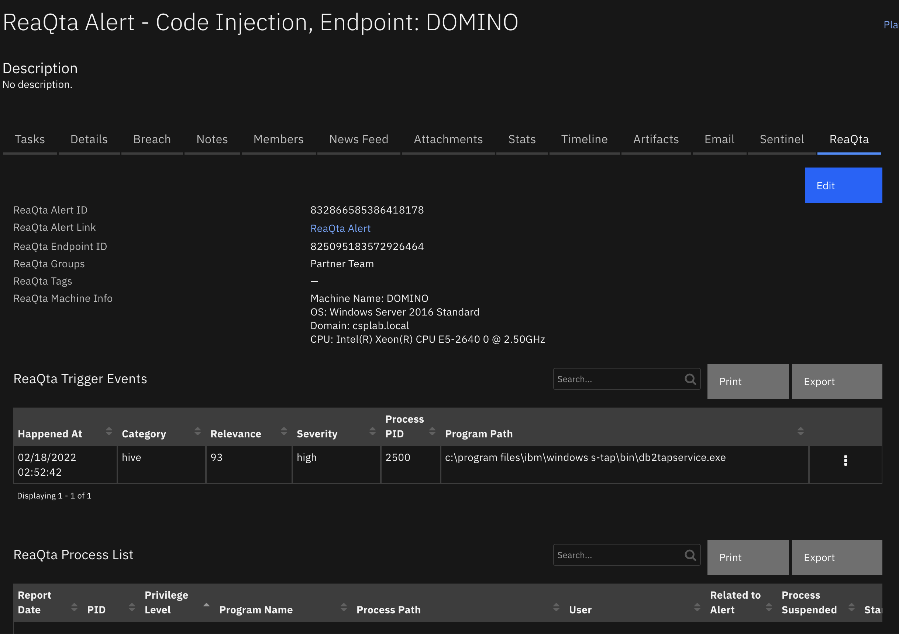
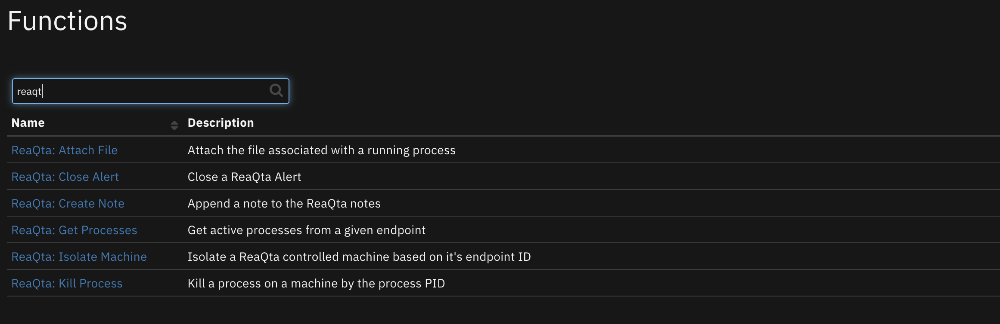
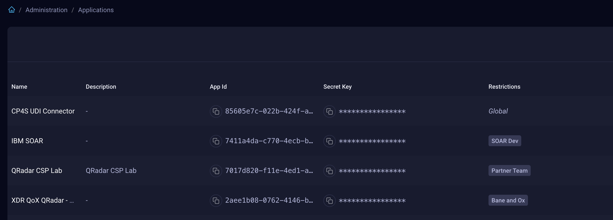
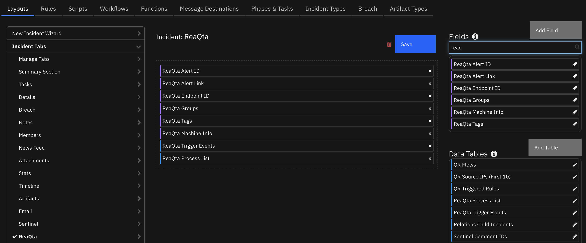
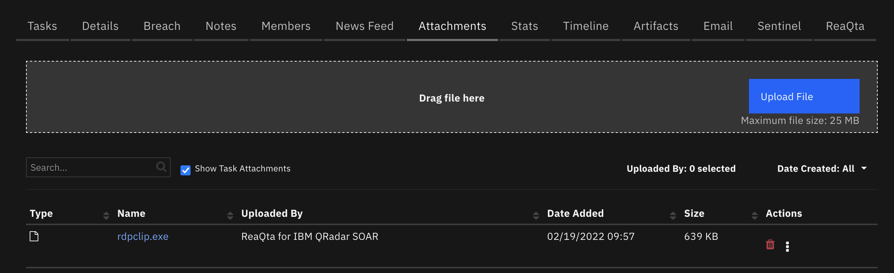
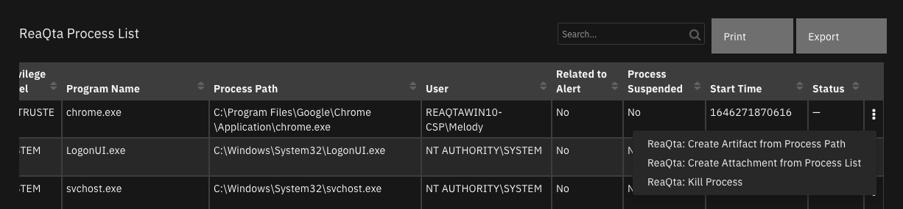
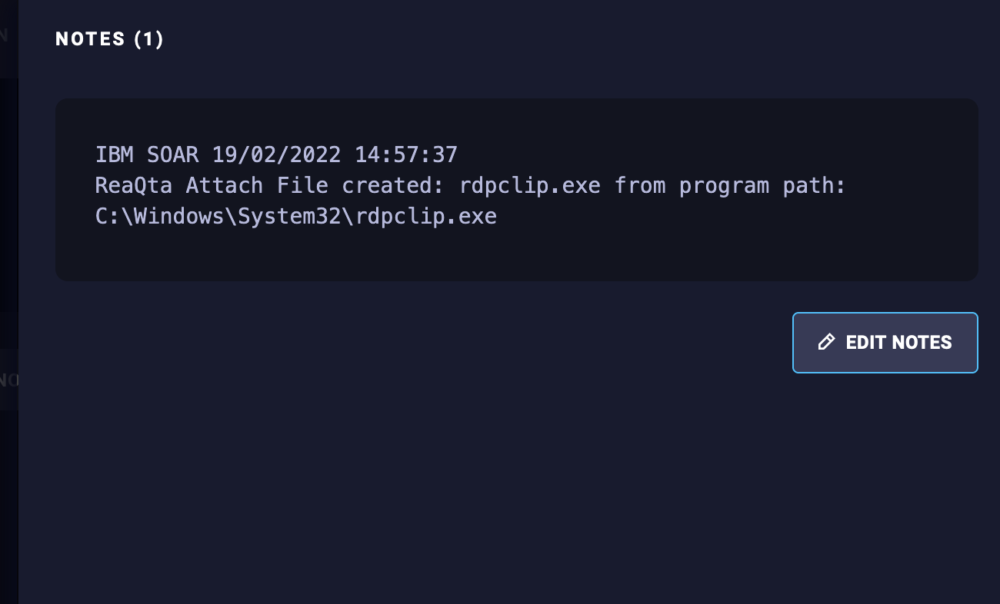
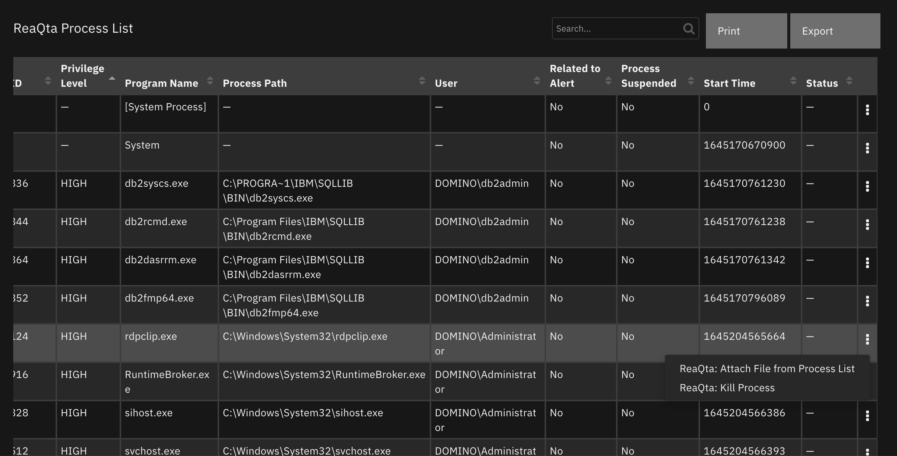
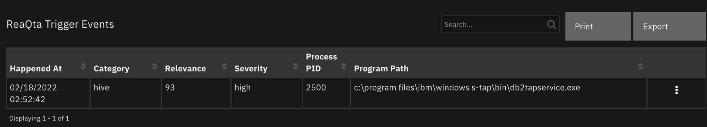

<!--
  This README.md is generated by running:
  "resilient-sdk docgen -p fn_reaqta"

  It is best edited using a Text Editor with a Markdown Previewer. VS Code
  is a good example. Checkout https://guides.github.com/features/mastering-markdown/
  for tips on writing with Markdown

  All fields followed by "::CHANGE_ME::"" should be manually edited

  If you make manual edits and run docgen again, a .bak file will be created

  Store any screenshots in the "doc/screenshots" directory and reference them like:
  

  NOTE: If your app is available in the container-format only, there is no need to mention the integration server in this readme.
-->

# ReaQta for IBM QRadar SOAR

## Table of Contents
- [Release Notes](#release-notes)
- [Overview](#overview)
  - [Key Features](#key-features)
- [Requirements](#requirements)
  - [IBM SOAR platform](#resilient-platform)
  - [Cloud Pak for Security](#cloud-pak-for-security)
  - [Proxy Server](#proxy-server)
  - [Python Environment](#python-environment)
  - [Endpoint Developed With](#endpoint-developed-with)
- [Installation](#installation)
  - [Install](#install)
  - [App Configuration](#app-configuration)
  - [Custom Layouts](#custom-layouts)
- [Poller Considerations](#poller-considerations)
- [Function - ReaQta: Attach File](#function---reaqta-attach-file)
- [Function - ReaQta: Close Alert](#function---reaqta-close-alert)
- [Function - ReaQta: Create Artifact](#function---reaqta-create-artifact)
- [Function - ReaQta: Create Note](#function---reaqta-create-note)
- [Function - ReaQta: Create Policy](#function---reaqta-create-policy)
- [Function - ReaQta: Get Alert Information](#function---reaqta-get-alert-information)
- [Function - ReaQta: Get Endpoint Status](#function---reaqta-get-endpoint-status)
- [Function - ReaQta: Get Processes](#function---reaqta-get-processes)
- [Function - ReaQta: Isolate Machine](#function---reaqta-isolate-machine)
- [Function - ReaQta: Kill Process](#function---reaqta-kill-process)
- [Data Table - ReaQta Process List](#data-table---reaqta-process-list)
- [Data Table - ReaQta Trigger Events](#data-table---reaqta-trigger-events)
- [Custom Fields](#custom-fields)
- [Rules](#rules)
- [Templates for SOAR Cases](#templates-for-soar-cases)
- [Troubleshooting & Support](#troubleshooting--support)
---

## Release Notes
<!--
  Specify all changes in this release. Do not remove the release
  notes of a previous release
-->
| Version | Date | Notes |
| ------- | ---- | ----- |
| 1.0.0 | 03/2022 | Initial Release |

---

## Overview
<!--
  Provide a high-level description of the function itself and its remote software or application.
  The text below is parsed from the "description" and "long_description" attributes in the setup.py file
-->
**IBM SOAR app for ReaQta**

 

Bidirectional synchronization of ReaQta Alerts to IBM SOAR.

    Additional functions exists to list and kill endpoint processes, isolate the endpoint and synchronize notes and close events.

 

### Key Features
<!--
  List the Key Features of the Integration
-->
* Sync alerts to SOAR cases via user defined filter criteria
* Sync SOAR case notes to ReaQta
* ReaQta alert closing closes the SOAR case and SOAR case closing closes the ReaQta alert
* Get running processes on a give endpoint
* Download ReaQta endpoint process file to an attachment
* Kill ReaQta endpoint processes
* Isolate ReaQta endpoint
* Create a new Alert or Blocking policy based on a file hash

---

## Requirements
<!--
  List any Requirements
-->
This app supports the IBM QRadar SOAR Platform and the IBM Cloud Pak for Security.

### IBM SOAR platform
The IBM SOAR platform supports two app deployment mechanisms, App Host and integration server.

If deploying to a IBM SOAR platform with an App Host, the requirements are:
* IBM SOAR platform >= `41.2.41`.
* The app is in a container-based format (available from the AppExchange as a `zip` file).

If deploying to a IBM SOAR platform with an integration server, the requirements are:
* IBM SOAR platform >= `41.2.41`.
* The app is in the older integration format (available from the AppExchange as a `zip` file which contains a `tar.gz` file).
* Integration server is running `resilient-circuits>=43.0.0`.
* If using an API key account, make sure the account provides the following minimum permissions:
  | Name | Permissions |
  | ---- | ----------- |
  | Org Data | Read |
  | Function | Read |
  | Incidents | Create, Read, Edit, Edit Status |


The following IBM SOAR platform guides provide additional information:
* _App Host Deployment Guide_: provides installation, configuration, and troubleshooting information, including proxy server settings.
* _Integration Server Guide_: provides installation, configuration, and troubleshooting information, including proxy server settings.
* _System Administrator Guide_: provides the procedure to install, configure and deploy apps.

The above guides are available on the IBM Knowledge Center at [ibm.biz/soar-docs](https://ibm.biz/soar-docs). On this web page, select your IBM SOAR platform version. On the follow-on page, you can find the _App Host Deployment Guide_ or _Integration Server Guide_ by expanding **IBM SOAR Apps** in the Table of Contents pane. The System Administrator Guide is available by expanding **System Administrator**.

### Cloud Pak for Security
If you are deploying to IBM Cloud Pak for Security, the requirements are:
* IBM Cloud Pak for Security >= 1.5.
* Cloud Pak is configured with an App Host.
* The app is in a container-based format (available from the AppExchange as a `zip` file).

The following Cloud Pak guides provide additional information:
* _App Host Deployment Guide_: provides installation, configuration, and troubleshooting information, including proxy server settings. From the Table of Contents, select Case Management and Orchestration & Automation > **Orchestration and Automation Apps**.
* _System Administrator Guide_: provides information to install, configure, and deploy apps. From the IBM Cloud Pak for Security Knowledge Center table of contents, select Case Management and Orchestration & Automation > **System administrator**.

These guides are available on the IBM Knowledge Center at [ibm.biz/cp4s-docs](https://ibm.biz/cp4s-docs). From this web page, select your IBM Cloud Pak for Security version. From the version-specific Knowledge Center page, select Case Management and Orchestration & Automation.

### Proxy Server
The app **does** support a proxy server.

### Python Environment
Python 3.6+ is supported.
Additional package dependencies may exist for each of these packages:
* cachetools
* resilient-circuits>=43.0.0
* retry2

### Endpoint Developed With

This app has been implemented using:
| Product Name | Product Version | API URL | API Version |
| ------------ | --------------- | ------- | ----------- |
|ReaQta Hive | 1.0 | rqt-api/1/ | 1 |

#### Configuration
In order to make API calls to ReaQta, create an API Application, prodiving the endpoint group restrictions as appropiate. The API ID and secret will be copied into your app.config file



---

## Installation

### Install
* To install or uninstall an App or Integration on the _IBM SOAR platform_, see the documentation at [ibm.biz/soar-docs](https://ibm.biz/soar-docs).
* To install or uninstall an App on _IBM Cloud Pak for Security_, see the documentation at [ibm.biz/cp4s-docs](https://ibm.biz/cp4s-docs) and follow the instructions above to navigate to Orchestration and Automation.

### App Configuration
The following table provides the settings you need to configure the app. These settings are made in the app.config file. See the documentation discussed in the Requirements section for the procedure.

#### [fn_reaqta]
This section defines the global settings, including the poller configuration.
For each hive, use the section definition below

| Config | Required | Example | Description |
| ------ | :------: | ------- | ----------- |
| **polling_interval** | Yes | `60` | *Number of seconds between polling queries for new alerts *  |
| **polling_lookback** | Yes | `120` | *Number of minutes to look back for new alerts the first time the app starts or restarts*  |
| **soar_create_case_template** | No | `/path/to/template.jina` | *Override template used to create a SOAR case from the poller. See [Templates for SOAR Cases](#templates-for-soar-cases)* |
| **soar_close_case_template** | No | `/path/to/template.jina` | *Override template used to close a SOAR case from the poller. See [Templates for SOAR Cases](#templates-for-soar-cases)* |
| **https_proxy** | No | `https://xxx/` | *Proxy URL for HTTPS connections* |
| **http_proxy** | No | `http://xxx/` | *Proxy URL for HTTP connections* |
| **timeout** | No | `60` | *Seconds to wait for APIs calls back to ReaQta. Default is 30* |
| **polling_hives** | Yes | hive_label1, hive_label2 | *Comma separated list of hives to poll.* |
| **policy_hives** | Yes |  hive_label1, hive_label2 | *Comma separated list of hives to set a policy if not specified from the SOAR function call* |

#### [fn_reaqta:hive_label]
Repeat this section for each ReaQta hive. Add the `hive_label` used in the `polling_hives` parameter above.

| Config | Required | Example | Description |
| ------ | :------: | ------- | ----------- |
| **reaqta_url** | Yes | `https://xxx/` | *Base URL to ReaQta instance ending in slash '/'*  |
| **api_key** | Yes | `7411a4da-c770-...` | *API Key ID from your configured ReaQta API application* |
| **api_secret** | Yes | `P9zPLkcb-...` | *API Key secret from your configured ReaQta API application*  |
| **api_version** | Yes | `rqt_api/1/` | *API version portion of url to append to reaqta_url, ending in slash '/'*  |
| **cafile** | Yes | `/path/to/cafile.crt or false` | *Path to your ReaQta client certificate, if needed or false for no certificate verification*  |
| **polling_filters** | No | "severity": ["medium", "high"], "tag": ["hive"], "groups": ["groupA", "groupB"], "impact": 70 | *Set filters for the poller. Groups are either Client or Group names. Impact compares alerts greater or equal to this value* |

### Custom Layouts
<!--
  Use this section to provide guidance on where the user should add any custom fields and data tables.
  You may wish to recommend a new incident tab.
  You should save a screenshot "custom_layouts.png" in the doc/screenshots directory and reference it here
-->
* Import the Data Tables and Custom Fields like the screenshot below:

  

---

## Poller Considerations

The poller is just one way to escalate ReaQta alerts to SOAR cases. It's also possible to send alert information to a SIEM, such as IBM QRadar, which would then coorelate alerts into Offenses. With the QRadar Plugin for SOAR, offenses can then be ecalated to SOAR cases. As long as the ReaQta alert ID is preserved in the custom case field `reaqta_id` and `reaqta_hive`, then all the remaining details about the alert will synchronize to the SOAR case. In the case of the QRadar Plugin for SOAR, you would modify the escalation templates to reference this custom field with the ReaQta Alert ID.

When using another source of ReaQta Alert escalation to IBM SOAR, disable the poller by changing the app.config setting to `poller_interval=0`.

---

## Function - ReaQta: Attach File
Create a SOAR case attachment associated with a running process

 

<details><summary>Inputs:</summary>
<p>

| Name | Type | Required | Example | Tooltip |
| ---- | :--: | :------: | ------- | ------- |
| `reaqta_endpoint_id` | `text` | Yes | `-` | - |
| `reaqta_incident_id` | `number` | Yes | `-` | - |
| `reaqta_program_path` | `text` | Yes | `-` | typically taken from the reaqta_trigger_events or reaqta_process_list datatables |
| `reaqta_hive` | `text` | Yes | `hive_label` | Label used in app.config to identify which ReaQta hive to access |

NOTE: Attachments are subject to the file-size limit. The default is 25mb. This can be increased at the system level using the `resutil` command tool.
</p>
</details>

<details><summary>Outputs:</summary>
<p>

> **NOTE:** This example might be in JSON format, but `results` is a Python Dictionary on the SOAR platform.

```python
results = {
  "content": {
    "actions": [
      {
        "enabled": true,
        "id": 90,
        "name": "ReaQta: Kill Process"
      }
    ],
    "content_type": "application/x-msdownload",
    "created": 1645210092202,
    "creator_id": 3,
    "id": 48,
    "inc_id": 2377,
    "inc_name": "ReaQta Alert - Hive alert Title, Endpoint: AUTISTIC1",
    "inc_owner": 3,
    "name": "notepad.exe",
    "size": 334262,
    "task_at_id": null,
    "task_custom": null,
    "task_id": null,
    "task_members": null,
    "task_name": null,
    "type": "incident",
    "uuid": "50df0c2a-e222-4353-90f0-f4f2a2fad3f5",
    "vers": 7
  },
  "inputs": {
    "reaqta_endpoint_id": "831986736375529472",
    "reaqta_incident_id": 2377,
    "reaqta_program_path": "C:\\Windows\\System32\\notepad.exe"
  },
  "metrics": {
    "execution_time_ms": 18981,
    "host": "endpoint.local",
    "package": "fn-reaqta",
    "package_version": "1.0.0",
    "timestamp": "2022-02-18 13:48:11",
    "version": "1.0"
  },
  "raw": null,
  "reason": null,
  "success": true,
  "version": 2.0
}
```

</p>
</details>

<details><summary>Example Pre-Process Script:</summary>
<p>

```python
inputs.reaqta_program_path = row['process_path'].replace("\\\\", "\\")
inputs.reaqta_endpoint_id = incident.properties.reaqta_endpoint_id
inputs.reaqta_incident_id = incident.id
inputs.reaqta_hive = incident.properties.reaqta_hive
```

</p>
</details>

<details><summary>Example Post-Process Script:</summary>
<p>

```python
if results.success:
  incident.addNote("ReaQta Attach File created: {} from program path: {}".format(results.content['name'], results.inputs['reaqta_program_path']))
else:
  incident.addNote("ReaQta Attach File failed: {}".format(results.reason))
```

</p>
</details>

---

## Function - ReaQta: Create Policy
Create a policy based on a file hash

Notes:
* An error will occur if a policy with this file already exists
* Use `reaqta_hives` to specify the Hive label defined in the app.config file. The default will be the case's `reaqta_hives` custom field and then the `pollicy_hives` app.config setting.

<details><summary>Inputs:</summary>
<p>

| Name | Type | Required | Example | Tooltip |
| ---- | :--: | :------: | ------- | ------- |
| `reaqta_hives` | `text` | No | `hive_label1,hive_label2` | **Needed for cases which don't originate from ReaQta. Defaults are defined in the reaqta_hive custom incident field and app.config policy_hives setting.**
| `reaqta_sha256` | `text` | Yes | `cf8c1b234ad4d72d...` | - |
| `reaqta_policy_title` | `text` | No | `-` | Title for policy |
| `reaqta_policy_description` | `text` | No | `-` | Policy description |
| `reaqta_policy_included_groups` | `text` | No | `groupA,groupB` | Apply policy to these groups. Use either reaqta_policy_included_groups or reaqta_policy_excluded_groups |
| `reaqta_policy_excluded_groups` | `text` | No | `groupC,groupD` | Bypass policy to these groups. Use either reaqta_policy_included_groups or reaqta_policy_excluded_groups |
| `reaqta_hive` | `text` | Yes | `hive_label` | Label used in app.config to identify which ReaQta hive to access |

</p>
</details>

<details><summary>Outputs:</summary>
<p>

> **NOTE:** This example might be in JSON format, but `results` is a Python Dictionary on the SOAR platform.

```python
results = [{
  "version": 2.0,
  "success": true,
  "reason": null,
  "content": {
    "type": 2,
    "id": "834951840876462084",
    "versionId": "834951840876466181",
    "title": "test it policy",
    "description": "",
    "enabled": true,
    "deleted": false,
    "default": false,
    "matchers": [
      {
        "type": 2,
        "id": "834951840876470278",
        "hash": "91514e6be3f581a77daa79e2a4905dcbdf6bdcc32ee0f713599a94d453a26fc1",
        "alg": 1
      }
    ],
    "actions": [
      2
    ],
    "created": "2022-02-24T02:00:31.520Z",
    "lastModified": "2022-02-24T02:00:31.520Z",
    "scope": "group",
    "groups": [
      {
        "id": "831820214906650631",
        "name": "Demo",
        "enabled": true
      }
    ],
    "policy_url": "https://reaqta.host.com/policies/details/834951840876462084"
  },
  "raw": null,
  "inputs": {
    "reaqta_policy_title": "test it policy",
    "reaqta_policy_block": false,
    "reaqta_policy_excluded_groups": null,
    "reaqta_policy_enabled": true,
    "reaqta_policy_description": "",
    "reaqta_sha256": "91514e6be3f581a77daa79e2a4905dcbdf6bdcc32ee0f713599a94d453a26fc1",
    "reaqta_policy_included_groups": "Demo"
  },
  "metrics": {
    "version": "1.0",
    "package": "fn-reaqta",
    "package_version": "1.0.0",
    "host": "local",
    "execution_time_ms": 1283,
    "timestamp": "2022-02-23 21:00:29"
  }
}]
```

</p>
</details>

<details><summary>Example Pre-Process Script:</summary>
<p>

```python
inputs.reaqta_sha256 = row['sha256_hash']
inputs.reaqta_policy_title = rule.properties.reaqta_policy_title
inputs.reaqta_policy_description = rule.properties.reaqta_policy_description or ''
inputs.reaqta_policy_included_groups = rule.properties.reaqta_policy_included_groups
inputs.reaqta_policy_excluded_groups = rule.properties.reaqta_policy_excluded_groups
inputs.reaqta_policy_enabled = rule.properties.reaqta_policy_enabled
inputs.reaqta_policy_block = rule.properties.reaqta_policy_block_when_triggered
inputs.reaqta_hive = incident.properties.reaqta_hive
```

</p>
</details>

<details><summary>Example Post-Process Script:</summary>
<p>

```python
if results.success:
  policies = []
  for policy in results.content:
    policies.append( '<a href="{0}" target="blank">{0}</a>'.format(policy.get("policy_url")))
  incident.addNote(helper.createRichText("ReaQta Create Policies successful: {}".format("<br>".join(policies))))
else:
  incident.addNote(helper.createRichText("ReaQta Create Policy failed: {}".format(results.reason)))
```

</p>
</details>

---

## Function - ReaQta: Close Alert
Close a ReaQta alert. This can be triggered when the SOAR case is closed.


<details><summary>Inputs:</summary>
<p>

| Name | Type | Required | Example | Tooltip |
| ---- | :--: | :------: | ------- | ------- |
| `reaqta_alert_id` | `text` | Yes | `-` | - |
| `reaqta_is_malicious` | `boolean` | Yes | False | true/ false for malicious/benign |
| `reaqta_note` | `text` | No | `-` | - |
| `reaqta_hive` | `text` | Yes | `hive_label` | Label used in app.config to identify which ReaQta hive to access |

</p>
</details>

<details><summary>Outputs:</summary>
<p>

> **NOTE:** This example might be in JSON format, but `results` is a Python Dictionary on the SOAR platform.

```python
results = {
  "content": {
    "alertId": "831993910053044226",
    "closed": true
  },
  "inputs": {
    "reaqta_alert_id": "831993910053044226",
    "reaqta_is_malicious": false,
    "reaqta_note": "\u003cdiv class=\"rte\"\u003e\u003cdiv\u003e\u003cstrong\u003ethis is now complete\u003c/strong\u003e\u003c/div\u003e\u003c/div\u003e"
  },
  "metrics": {
    "execution_time_ms": 1065,
    "host": "endpoint.local",
    "package": "fn-reaqta",
    "package_version": "1.0.0",
    "timestamp": "2022-02-18 13:54:56",
    "version": "1.0"
  },
  "raw": null,
  "reason": null,
  "success": true,
  "version": 2.0
}
```

</p>
</details>

<details><summary>Example Pre-Process Script:</summary>
<p>

```python
# Modify this table for custom resolution types
IS_MALICIOUS_LOOKUP = {
  7: False, # Unresolved
  8: False, # Duplicate
  9: False, # Not a Issue
  10: True  # Resolved
}

inputs.reaqta_alert_id = incident.properties.reaqta_id
inputs.reaqta_note = incident.resolution_summary.content
inputs.reaqta_is_malicious = IS_MALICIOUS_LOOKUP.get(incident.resolution_id, False) # if resolution_id is not found, set to not malicious
inputs.reaqta_hive = incident.properties.reaqta_hive
```

</p>
</details>

<details><summary>Example Post-Process Script:</summary>
<p>

```python
None
```

</p>
</details>

---

## Function - ReaQta: Create Artifact
Create an artifact from a process file

 

<details><summary>Inputs:</summary>
<p>

| Name | Type | Required | Example | Tooltip |
| ---- | :--: | :------: | ------- | ------- |
| `reaqta_incident_id` | `number` | Yes | `-` | - |
| `reaqta_endpoint_id` | `text` | Yes | `-` | - |
| `reaqta_program_path` | `text` | Yes | `c:\\path\\to\\malware.exe` | - |
| `reaqta_artifact_type` | `text` | Yes | `Malware Sample` or `Other File` |
| `reaqta_hive` | `text` | Yes | `hive_label` | Label used in app.config to identify which ReaQta hive to access |

NOTE: Attachments are subject to the file-size limit. The default is 25mb. This can be increased at the system level using the `resutil` command tool.
</p>
</details>

<details><summary>Outputs:</summary>
<p>

> **NOTE:** This example might be in JSON format, but `results` is a Python Dictionary on the SOAR platform.

```python
results = {
  'version': 2.0,
  'success': True,
  'reason': None,
  'content': [
    {
      'id': 2141,
      'type': 12,
      'value': 'chrome.exe',
      'description': 'Extracted from ReaQta',
      'attachment': None,
      'parent_id': None,
      'creator': {
        'id': 3,
        'fname': 'Resilient',
        'lname': 'Sysadmin',
        'display_name': 'Resilient Sysadmin',
        'status': 'A',
        'email': 'a@example.com',
        'locked': False,
        'password_changed': False,
        'is_external': False,
        'ui_theme': 'verydarkmode'
      },
      'inc_id': 2857,
      'inc_name': 'ReaQta Alert - Ransomware Behavior Detected, Endpoint: REAQTAWIN10-CSP',
      'inc_owner': 2,
      'hits': [

      ],
      'created': 1646339889974,
      'last_modified_time': 1646398787005,
      'last_modified_by': {
        'id': 3,
        'type': 'user',
        'name': 'a@example.com',
        'display_name': 'Resilient Sysadmin'
      },
      'pending_sources': [

      ],
      'perms': None,
      'properties': None,
      'actions': [

      ],
      'hash': 'cb702049ff10bce20e09e04024c6654a78c85d54ea71de07f328f76426a42ed5',
      'relating': True,
      'creator_principal': {
        'id': 3,
        'type': 'user',
        'name': 'a@example.com',
        'display_name': 'Resilient Sysadmin'
      },
      'related_incident_count': None,
      'pending_scan_result': False,
      'ip': {
        'source': None,
        'destination': None
      },
      'global_artifact': [

      ]
    },
    {
      'id': 2142,
      'type': 13,
      'value': '87d2ffd6a891119062b89decb05c89d8',
      'description': 'Extracted from ReaQta',
      'attachment': None,
      'parent_id': 2141,
      'creator': {
        'id': 3,
        'fname': 'Resilient',
        'lname': 'Sysadmin',
        'display_name': 'Resilient Sysadmin',
        'status': 'A',
        'email': 'a@example.com',
        'locked': False,
        'password_changed': False,
        'is_external': False,
        'ui_theme': 'verydarkmode'
      },
      'inc_id': 2857,
      'inc_name': 'ReaQta Alert - Ransomware Behavior Detected, Endpoint: REAQTAWIN10-CSP',
      'inc_owner': 2,
      'hits': [

      ],
      'created': 1646339890099,
      'last_modified_time': 1646398787006,
      'last_modified_by': {
        'id': 3,
        'type': 'user',
        'name': 'a@example.com',
        'display_name': 'Resilient Sysadmin'
      },
      'pending_sources': [

      ],
      'perms': None,
      'properties': None,
      'actions': [

      ],
      'hash': '881c60fa0d9f9fd6c9a568e65f1ab1061e7de130f4c2268b600b7c092e72470d',
      'relating': True,
      'creator_principal': {
        'id': 3,
        'type': 'user',
        'name': 'a@example.com',
        'display_name': 'Resilient Sysadmin'
      },
      'related_incident_count': None,
      'pending_scan_result': False,
      'ip': {
        'source': None,
        'destination': None
      },
      'global_artifact': [

      ]
    },
    {
      'id': 2143,
      'type': 14,
      'value': '4d224080d73d0e18a84e5eac43e52aba16161f23',
      'description': 'Extracted from ReaQta',
      'attachment': None,
      'parent_id': 2141,
      'creator': {
        'id': 3,
        'fname': 'Resilient',
        'lname': 'Sysadmin',
        'display_name': 'Resilient Sysadmin',
        'status': 'A',
        'email': 'a@example.com',
        'locked': False,
        'password_changed': False,
        'is_external': False,
        'ui_theme': 'verydarkmode'
      },
      'inc_id': 2857,
      'inc_name': 'ReaQta Alert - Ransomware Behavior Detected, Endpoint: REAQTAWIN10-CSP',
      'inc_owner': 2,
      'hits': [

      ],
      'created': 1646339890117,
      'last_modified_time': 1646398787005,
      'last_modified_by': {
        'id': 3,
        'type': 'user',
        'name': 'a@example.com',
        'display_name': 'Resilient Sysadmin'
      },
      'pending_sources': [

      ],
      'perms': None,
      'properties': None,
      'actions': [

      ],
      'hash': 'b8ea66ed6adba64778a93233cd636a6978bb34f9d91924c6a1480d5dfcdf71ef',
      'relating': True,
      'creator_principal': {
        'id': 3,
        'type': 'user',
        'name': 'a@example.com',
        'display_name': 'Resilient Sysadmin'
      },
      'related_incident_count': None,
      'pending_scan_result': False,
      'ip': {
        'source': None,
        'destination': None
      },
      'global_artifact': [

      ]
    },
    {
      'id': 2144,
      'type': 38,
      'value': '93c68561a63428b1fe70b3d7b0e02af7c9cdcfefc1f6867ecb9ddcc05794bac9',
      'description': 'Extracted from ReaQta',
      'attachment': None,
      'parent_id': 2141,
      'creator': {
        'id': 3,
        'fname': 'Resilient',
        'lname': 'Sysadmin',
        'display_name': 'Resilient Sysadmin',
        'status': 'A',
        'email': 'a@example.com',
        'locked': False,
        'password_changed': False,
        'is_external': False,
        'ui_theme': 'verydarkmode'
      },
      'inc_id': 2857,
      'inc_name': 'ReaQta Alert - Ransomware Behavior Detected, Endpoint: REAQTAWIN10-CSP',
      'inc_owner': 2,
      'hits': [

      ],
      'created': 1646339890136,
      'last_modified_time': 1646398787005,
      'last_modified_by': {
        'id': 3,
        'type': 'user',
        'name': 'a@example.com',
        'display_name': 'Resilient Sysadmin'
      },
      'pending_sources': [

      ],
      'perms': None,
      'properties': None,
      'actions': [

      ],
      'hash': '95b8f0eafd6b31fba895dc7e517e1fac8b10a8a27a08c1d434d2e3ae4b6638be',
      'relating': True,
      'creator_principal': {
        'id': 3,
        'type': 'user',
        'name': 'a@example.com',
        'display_name': 'Resilient Sysadmin'
      },
      'related_incident_count': None,
      'pending_scan_result': False,
      'ip': {
        'source': None,
        'destination': None
      },
      'global_artifact': [

      ]
    }
  ],
  'raw': None,
  'inputs': {
    'reaqta_artifact_type': 'Malware Sample',
    'reaqta_program_path': 'C:\\Program Files\\Google\\Chrome\\Application\\chrome.exe',
    'reaqta_endpoint_id': '833847379160465408',
    'reaqta_incident_id': 2857
  },
  'metrics': {
    'version': '1.0',
    'package': 'fn-reaqta',
    'package_version': '1.0.0',
    'host': 'local',
    'execution_time_ms': 20461,
    'timestamp': '2022-03-04 07:59:46'
  }
}
```

</p>
</details>

<details><summary>Example Pre-Process Script:</summary>
<p>

```python
inputs.reaqta_endpoint_id = incident.properties.reaqta_endpoint_id
inputs.reaqta_incident_id = incident.id
inputs.reaqta_artifact_type = "Malware Sample"
inputs.reaqta_program_path = row['program_path']
inputs.reaqta_hive = incident.properties.reaqta_hive
```

</p>
</details>

<details><summary>Example Post-Process Script:</summary>
<p>

```python
if not results.success:
  incident.addNote("ReaQta Create Artifact failed: {}".format(results.reason))
```

</p>
</details>

---

## Function - ReaQta: Create Note
Append a note to the ReaQta notes. Notes will display in ReaQta with the 'IBM SOAR <date time> header.

 

<details><summary>Inputs:</summary>
<p>

| Name | Type | Required | Example | Tooltip |
| ---- | :--: | :------: | ------- | ------- |
| `reaqta_alert_id` | `text` | Yes | `-` | - |
| `reaqta_note` | `text` | No | `-` | - |
| `reaqta_hive` | `text` | Yes | `hive_label` | Label used in app.config to identify which ReaQta hive to access |

</p>
</details>

<details><summary>Outputs:</summary>
<p>

> **NOTE:** This example might be in JSON format, but `results` is a Python Dictionary on the SOAR platform.

```python
results = {
  "content": "this is a note in the hive alert\nIBM SOAR 18/02/2022 14:04:57\nReaQta Isolate Machine failed: Endpoint offline",
  "inputs": {
    "reaqta_alert_id": "830607817638412290",
    "reaqta_note": "ReaQta Isolate Machine: Endpoint offline"
  },
  "metrics": {
    "execution_time_ms": 738,
    "host": "endpoint.local",
    "package": "fn-reaqta",
    "package_version": "1.0.0",
    "timestamp": "2022-02-18 14:04:58",
    "version": "1.0"
  },
  "raw": null,
  "reason": null,
  "success": true,
  "version": 2.0
}
```

</p>
</details>

<details><summary>Example Pre-Process Script:</summary>
<p>

```python
inputs.reaqta_alert_id = incident.properties.reaqta_id
inputs.reaqta_note = note.text.content
inputs.reaqta_hive = incident.properties.reaqta_hive
```

</p>
</details>

<details><summary>Example Post-Process Script:</summary>
<p>

```python
from java.util import Date

if results.success:
  # Get the current time
  dt_now = Date()
  note.text = u"<b>Sent to ReaQta at {0}</b><br>{1}".format(dt_now, unicode(note.text.content))
```

</p>
</details>

---

## Function - ReaQta: Get Alert Information
Return details for a ReaQta alert

<details><summary>Inputs:</summary>
<p>

| Name | Type | Required | Example | Tooltip |
| ---- | :--: | :------: | ------- | ------- |
| `reaqta_alert_id` | `text` | Yes | `-` | - |
| `reaqta_hive` | `text` | Yes | `hive_label` | Label used in app.config to identify which ReaQta hive to access |

</p>
</details>

<details><summary>Outputs:</summary>
<p>

> **NOTE:** This example might be in JSON format, but `results` is a Python Dictionary on the SOAR platform.

```python
results = {
  "version": 2.0,
  "success": true,
  "reason": null,
  "content": {
    "id": "834832646071648258",
    "localId": "834832599212890114",
    "endpointId": "833847379160465408",
    "triggerCondition": 7,
    "endpoint": {
      "id": "833847379160465408",
      "machineId": "de64775b529ad34495bc51cd8b227c254d112185cfd06a92e0d5bd8a9ca19124",
      "osType": 1,
      "cpuVendor": 1,
      "arch": 2,
      "cpuDescr": "Intel(R) Xeon(R) CPU E5-2450 0 @ 2.10GHz",
      "kernel": "10.0",
      "os": "Windows 10 Pro",
      "name": "REAQTAWIN10-CSP",
      "domain": "csplab.local",
      "state": 1,
      "registrationTime": "2022-02-21T00:51:47.330Z",
      "agentVersion": "3.6.1",
      "componentsVersions": [
        {
          "name": "keeper",
          "version": "3.6.0",
          "build": "19.1627291555548.commit"
        },
        {
          "name": "probos",
          "version": "3.5.0",
          "build": "3.5.0"
        },
        {
          "name": "rqtsentry",
          "version": "3.6.1",
          "build": "119.1632119719010.commit"
        },
        {
          "name": "rqtnetsentry",
          "version": "3.6.0",
          "build": "44.1627295520120.commit"
        },
        {
          "name": "installer",
          "version": "3.6.1",
          "build": ""
        }
      ],
      "isVirtualMachine": true,
      "isDomainController": false,
      "isServer": false,
      "sessionStart": "2022-02-21T00:51:49.215Z",
      "sessionEnd": "2022-02-24T01:09:59.043Z",
      "lastSeenAt": "2022-02-24T01:04:59.043Z",
      "disconnectionReason": 0,
      "localAddr": "172.16.253.37",
      "hvStatus": 19,
      "macs": [
        "00:50:56:bf:9f:16"
      ],
      "isolated": false,
      "connected": true,
      "tags": [
        "vm"
      ],
      "groups": [
        {
          "id": "822878129902059527",
          "name": "Partner Team",
          "description": "Partner Team Ambassador Rob Fichtel"
        }
      ],
      "avInstalled": false
    },
    "triggerEvents": [
      {
        "id": "834832645178261505",
        "category": "hive",
        "localId": "834832599133194241",
        "endpointId": "833847379160465408",
        "receivedAt": "2022-02-23T18:06:53.051Z",
        "happenedAt": "2022-02-23T18:06:42.073Z",
        "relevance": 0,
        "severity": "none",
        "trigger": true,
        "manuallyAdded": false,
        "process": {
          "id": "833847379160465408:7868:1645639602071",
          "parentId": "833847379160465408:872:1645639598803",
          "endpointId": "833847379160465408",
          "program": {
            "path": "c:\\users\\melody\\appdata\\local\\temp\\tryme.exe",
            "filename": "tryme.exe",
            "md5": "a3ce5c07dc7b7d58740b4407a7d3f9d2",
            "sha1": "9fa6c5f1cff4ca41c441e428a847a924627210cc",
            "sha256": "cf8c1b234ad4d72dd6a455b82bf48ff16cd794aaefb682729b0151f0e1c374dd",
            "size": 84992,
            "arch": "x32",
            "fsName": "tryme.exe"
          },
          "user": "REAQTAWIN10-CSP\\Melody",
          "pid": 7868,
          "startTime": "2022-02-23T18:06:42.071Z",
          "ppid": 872,
          "pstartTime": "2022-02-23T18:06:38.803Z",
          "userSID": "S-1-5-21-2250471729-4061103233-1630355673-1002",
          "privilegeLevel": "MEDIUM",
          "noGui": false,
          "logonId": "0x154d314"
        },
        "eventType": 2,
        "data": {
          "cmdLine": "C:\\Users\\Melody\\AppData\\Local\\Temp\\tryme.exe",
          "cmdLineArgs": [
            "C:\\Users\\Melody\\AppData\\Local\\Temp\\tryme.exe"
          ],
          "_t": "l"
        },
        "happenedAt_ts": 1645639602000
      },
      {
        "id": "834832645488640001",
        "category": "hive",
        "localId": "834832599212886017",
        "endpointId": "833847379160465408",
        "receivedAt": "2022-02-23T18:06:53.125Z",
        "happenedAt": "2022-02-23T18:06:42.092Z",
        "relevance": 83,
        "severity": "medium",
        "trigger": true,
        "manuallyAdded": false,
        "process": {
          "id": "833847379160465408:872:1645639598803",
          "parentId": "833847379160465408:6580:1645471843080",
          "endpointId": "833847379160465408",
          "program": {
            "path": "c:\\program files\\microsoft office\\root\\office16\\winword.exe",
            "filename": "winword.exe",
            "md5": "313009918ec71770c8f2fdcd416a4485",
            "sha1": "5d36f6ef6d0f76aaf837c4f7e65b611acd92e0ae",
            "sha256": "d76c3d25eb625a8475488b14b501e775b3186ad4ff77e9c07edb4ec2ff6923d9",
            "certInfo": {
              "signer": "Microsoft Corporation",
              "issuer": "Microsoft Code Signing PCA 2011",
              "trusted": true,
              "expired": false
            },
            "size": 1638704,
            "arch": "x64",
            "fsName": "winword.exe"
          },
          "user": "REAQTAWIN10-CSP\\Melody",
          "pid": 872,
          "startTime": "2022-02-23T18:06:38.803Z",
          "ppid": 6580,
          "pstartTime": "2022-02-21T19:30:43.080Z",
          "userSID": "S-1-5-21-2250471729-4061103233-1630355673-1002",
          "privilegeLevel": "MEDIUM",
          "noGui": false,
          "logonId": "0x154d314"
        },
        "eventType": 31,
        "data": {
          "behaviourType": 1,
          "_t": "l"
        },
        "happenedAt_ts": 1645639602000
      }
    ],
    "totalEventCount": 452,
    "byTypeEventCount": [
      {
        "type": 11,
        "count": 140
      },
      {
        "type": 21,
        "count": 73
      },
      {
        "type": 10,
        "count": 59
      },
      {
        "type": 5,
        "count": 37
      },
      {
        "type": 12,
        "count": 34
      },
      {
        "type": 65,
        "count": 29
      },
      {
        "type": 8,
        "count": 28
      },
      {
        "type": 38,
        "count": 21
      },
      {
        "type": 2,
        "count": 8
      },
      {
        "type": 57,
        "count": 8
      },
      {
        "type": 37,
        "count": 6
      },
      {
        "type": 6,
        "count": 3
      },
      {
        "type": 3,
        "count": 2
      },
      {
        "type": 30,
        "count": 1
      },
      {
        "type": 31,
        "count": 1
      },
      {
        "type": 62,
        "count": 1
      },
      {
        "type": 89,
        "count": 1
      }
    ],
    "impact": 83,
    "severity": "medium",
    "closed": false,
    "activityState": "inactive",
    "terminationReason": 1,
    "receivedAt": "2022-02-23T18:06:53.264Z",
    "happenedAt": "2022-02-23T18:06:42.092Z",
    "tags": [],
    "endpointState": {
      "osType": 1,
      "cpuVendor": 1,
      "arch": 2,
      "cpuDescr": "Intel(R) Xeon(R) CPU E5-2450 0 @ 2.10GHz",
      "kernel": "10.0",
      "os": "Windows 10 Pro",
      "hvStatus": 19,
      "name": "REAQTAWIN10-CSP",
      "domain": "csplab.local",
      "isolated": false,
      "localAddr": "172.16.253.37",
      "macs": [
        "00:50:56:bf:9f:16"
      ],
      "componentsVersions": [
        {
          "name": "keeper",
          "version": "3.6.0",
          "build": "19.1627291555548.commit"
        },
        {
          "name": "probos",
          "version": "3.5.0",
          "build": "3.5.0"
        },
        {
          "name": "rqtsentry",
          "version": "3.6.1",
          "build": "119.1632119719010.commit"
        },
        {
          "name": "rqtnetsentry",
          "version": "3.6.0",
          "build": "44.1627295520120.commit"
        },
        {
          "name": "installer",
          "version": "3.6.1",
          "build": ""
        }
      ],
      "endpointVersion": "3.6.1",
      "tags": [
        "vm"
      ],
      "groups": [
        {
          "id": "822878129902059527",
          "name": "Partner Team",
          "description": "Partner Team Ambassador Rob Fichtel"
        }
      ]
    },
    "alert_url": "https://rhiveam.techzone.ibm.com/alerts/834832646071648258"
  },
  "raw": null,
  "inputs": {
    "reaqta_alert_id": "834832646071648258"
  },
  "metrics": {
    "version": "1.0",
    "package": "fn-reaqta",
    "package_version": "1.0.0",
    "host": "local",
    "execution_time_ms": 663,
    "timestamp": "2022-02-23 20:04:58"
  }
}
```

</p>
</details>

<details><summary>Example Pre-Process Script:</summary>
<p>

```python
inputs.reaqta_alert_id = incident.properties.reaqta_id
inputs.reaqta_hive = incident.properties.reaqta_hive
```

</p>
</details>

<details><summary>Example Post-Process Script:</summary>
<p>

```python
TRIGGERCONDITION_LOOKUP = {
    0: "Code Injection",
    1: "Process Impersonated",
    2: "Signature Forged",
    3: "Incident Correlated",
    4: "DLL Sideloaded",
    5: "Suspicious Script Executed",
    6: "Policies Triggered",
    7: "Anomalous Behaviour Detected",
    8: "Token Stolen",
    9: "Ransomware Behavior Detected",
    10: "Privilege Escalated",
    11: "External Trigger",
    12: "Detection Strategy",
    13: "Antimalware Detection"
  }

if not results.success:
  incident.addNote("ReaQta: Get Alert Information failed: {}".format(results.reason))
else:
  content = results.content
  alert_url = '<a href="{0}" target="blank">{0}</a>'.format(content.get("alert_url"))
  incident.properties.reaqta_alert_link = helper.createRichText(alert_url)
  incident.properties.reaqta_endpoint_id = content.get("endpointId")
  incident.properties.reaqta_trigger_condition = TRIGGERCONDITION_LOOKUP.get(content.get("triggerCondition"))

  endpoint = content.get("endpoint", {})
  incident.properties.reaqta_tags = ", ".join(endpoint.get("tags", []))
  incident.properties.reaqta_groups = ", ".join([ group.get("name") for group in endpoint.get("groups", []) ])
  incident.properties.reaqta_machine_info = "Machine Name: {}\nOS: {}\nDomain: {}\nCPU: {}"\
                          .format(endpoint.get('name'),
                                  endpoint.get('os'),
                                  endpoint.get('domain'),
                                  endpoint.get('cpuDescr'))

  # populate datatable with trigger events
  for event in content.get('triggerEvents', []):
    row = incident.addRow('reaqta_trigger_events')
    row['happened_at'] = event.get('happenedAt_ts')
    row['category'] = event.get('category')
    row['relevance'] = event.get('relevance')
    row['severity'] = event.get('severity')

    process = event.get('process', {})
    program = process.get('program', {})
    row['process_pid'] = process.get('pid')
    row['program_path'] = program.get('path')
    row['sha256_hash'] = program.get('sha256')

    # create artifacts from the trigger event
    if program:
      incident.addArtifact("Malware SHA-256 Hash", program.get('sha256'), "")
      incident.addArtifact("File Path", program.get('path'), "")
      incident.addArtifact("File Name", program.get('filename'), "")
    if process:
      incident.addArtifact("User Account", process.get('user'), "")

  # create artifacts from endpoint
  endpoint_name = endpoint.get("name")
  incident.addArtifact("IP Address", endpoint.get("localAddr"), "Endpoint: {}".format(endpoint_name))
  incident.addArtifact("System Name", endpoint_name, "")
```

</p>
</details>

---


## Function - ReaQta: Get Endpoint Status
Return status details for a ReaQta endpoint

<details><summary>Inputs:</summary>
<p>

| Name | Type | Required | Example | Tooltip |
| ---- | :--: | :------: | ------- | ------- |
| `reaqta_endpoint_id` | `text` | Yes | `-` | - |
| `reaqta_hive` | `text` | Yes | `hive_label` | Label used in app.config to identify which ReaQta hive to access |

</p>
</details>

<details><summary>Outputs:</summary>
<p>

> **NOTE:** This example might be in JSON format, but `results` is a Python Dictionary on the SOAR platform.

```python
results = {
  "version": 2.0,
  "success": true,
  "reason": null,
  "content": {
    "id": "852892681737605120",
    "machineId": "9f75814184f0e13f5c3229937d30312d660cf8f9256a1e3d6b279da882095981",
    "osType": 1,
    "cpuVendor": 1,
    "arch": 2,
    "cpuDescr": "Intel(R) Core(TM) i7-9750H CPU @ 2.60GHz",
    "kernel": "10.0",
    "os": "Windows 10 Enterprise",
    "name": "LAPTOP-377CDOSQ",
    "state": 1,
    "registrationTime": "2022-04-14T14:11:01.315Z",
    "agentVersion": "3.6.1",
    "componentsVersions": [
      {
        "name": "keeper",
        "version": "3.6.0",
        "build": "19.1627291555548.commit"
      },
      {
        "name": "probos",
        "version": "3.5.0",
        "build": "3.5.0"
      },
      {
        "name": "rqtsentry",
        "version": "3.6.1",
        "build": "119.1632119719010.commit"
      },
      {
        "name": "rqtnetsentry",
        "version": "3.6.0",
        "build": "44.1627295520120.commit"
      },
      {
        "name": "installer",
        "version": "3.6.1",
        "build": ""
      }
    ],
    "isVirtualMachine": false,
    "isDomainController": false,
    "isServer": false,
    "sessionStart": "2022-04-14T14:11:27.543Z",
    "sessionEnd": "2022-04-15T16:09:25.661Z",
    "lastSeenAt": "2022-04-15T16:04:25.661Z",
    "disconnectionReason": 0,
    "localAddr": "192.168.2.176",
    "hvStatus": 19,
    "macs": [
      "98:fa:9b:cb:d4:0e",
      "50:eb:71:1b:8f:9a",
      "00:05:9a:3c:7a:00",
      "00:50:56:c0:00:01",
      "00:50:56:c0:00:08",
      "80:6d:97:04:b8:08"
    ],
    "isolated": false,
    "connected": true,
    "tags": [],
    "groups": [
      {
        "id": "825429906883088391",
        "name": "National Market",
        "description": "National Market"
      }
    ],
    "avInstalled": false
  },
  "raw": null,
  "inputs": {
    "reaqta_hive": "rhiveam",
    "reaqta_endpoint_id": "852892681737605120"
  },
  "metrics": {
    "version": "1.0",
    "package": "fn-reaqta",
    "package_version": "1.0.0",
    "host": "local",
    "execution_time_ms": 524,
    "timestamp": "2022-04-15 12:05:10"
  }
}
```

</p>
</details>

<details><summary>Example Pre-Process Script:</summary>
<p>

```python
inputs.reaqta_endpoint_id = incident.properties.reaqta_endpoint_id
inputs.reaqta_hive = incident.properties.reaqta_hive
```

</p>
</details>

<details><summary>Example Post-Process Script:</summary>
<p>

```python
DISCONNECTION_LOOKUP = {
  0: "Session timeout",
  1: "Deregistration"
}

if results.success:
  endpoint = results.content
  msg = """ReaQta Get Endpoint Status:
ID: {}
Endpoint: {}
Agent version: {}
Last Seen At: {}
Connected: {}
Isolated: {}
Disconnection Reason: {}
Tags: {}
Groups: {}
""".format(endpoint.get("id"),
           endpoint.get("name"),
           endpoint.get("agentVersion"),
           endpoint.get("lastSeenAt"),
           endpoint.get("connected"),
           endpoint.get("isolated"),
           DISCONNECTION_LOOKUP.get(endpoint.get("disconnectionReason")),
           ", ".join(endpoint.get("tags")),
           ", ".join([group.get("name") for group in endpoint.get("groups", [])])
           )
  incident.addNote(helper.createPlainText(msg))
else:
  incident.addNote(u"ReaQta Get Endpoint Status failed: {}".format(results.reason))
```

</p>
</details>

---

## Function - ReaQta: Get Processes
Get active processes from a given endpoint and present in the reaqta_process_list datatable. Two filters are available to reduce the size of the process list, as the list can be quite long.

 

<details><summary>Inputs:</summary>
<p>

| Name | Type | Required | Example | Tooltip |
| ---- | :--: | :------: | ------- | ------- |
| `reaqta_endpoint_id` | `text` | Yes | `-` | - |
| `reaqta_has_incident` | `boolean` | No | `true` | Select only processes associated with an alert |
| `reaqta_suspended` | `boolean` | No | `-` | Select only processes which are suspended |
| `reaqta_hive` | `text` | Yes | `hive_label` | Label used in app.config to identify which ReaQta hive to access |

</p>
</details>

<details><summary>Outputs:</summary>
<p>

> **NOTE:** This example might be in JSON format, but `results` is a Python Dictionary on the SOAR platform.

```python
results = {
  "content": [
    {
      "hasIncident": false,
      "pid": 0,
      "ppid": 0,
      "processName": "[System Process]",
      "startTime": 0,
      "suspended": false
    },
    {
      "hasIncident": false,
      "pid": 4,
      "ppid": 0,
      "processName": "System",
      "startTime": 1644961331131,
      "suspended": false
    },
    {
      "hasIncident": false,
      "pid": 92,
      "ppid": 4,
      "privilegeLevel": "SYSTEM",
      "processName": "Registry",
      "startTime": 1644961322746,
      "suspended": false,
      "user": "NT AUTHORITY\\SYSTEM"
    },
    {
      "hasIncident": false,
      "pid": 436,
      "ppid": 4,
      "privilegeLevel": "SYSTEM",
      "processName": "smss.exe",
      "programPath": "C:\\Windows\\System32\\smss.exe",
      "startTime": 1644961331143,
      "suspended": false,
      "user": "NT AUTHORITY\\SYSTEM"
    },
    {
      "hasIncident": false,
      "pid": 556,
      "ppid": 544,
      "privilegeLevel": "SYSTEM",
      "processName": "csrss.exe",
      "programPath": "C:\\Windows\\System32\\csrss.exe",
      "startTime": 1644961338892,
      "suspended": false,
      "user": "NT AUTHORITY\\SYSTEM"
    },
    {
      "hasIncident": false,
      "pid": 628,
      "ppid": 544,
      "privilegeLevel": "SYSTEM",
      "processName": "wininit.exe",
      "programPath": "C:\\Windows\\System32\\wininit.exe",
      "startTime": 1644961339001,
      "suspended": false,
      "user": "NT AUTHORITY\\SYSTEM"
    },
    {
      "hasIncident": true,
      "pid": 6712,
      "ppid": 884,
      "privilegeLevel": "LOW",
      "processName": "Microsoft.Photos.exe",
      "programPath": "C:\\Program Files\\WindowsApps\\Microsoft.Windows.Photos_2021.21090.10008.0_x64__8wekyb3d8bbwe\\Microsoft.Photos.exe",
      "startTime": 1645130455541,
      "suspended": true,
      "user": "AUTISTIC1\\Administrator"
    },
    {
      "hasIncident": true,
      "pid": 6556,
      "ppid": 884,
      "privilegeLevel": "HIGH",
      "processName": "RuntimeBroker.exe",
      "programPath": "C:\\Windows\\System32\\RuntimeBroker.exe",
      "startTime": 1645130459641,
      "suspended": false,
      "user": "AUTISTIC1\\Administrator"
    },
    {
      "hasIncident": true,
      "pid": 1416,
      "ppid": 884,
      "privilegeLevel": "LOW",
      "processName": "TextInputHost.exe",
      "programPath": "C:\\Windows\\SystemApps\\MicrosoftWindows.Client.CBS_cw5n1h2txyewy\\TextInputHost.exe",
      "startTime": 1645130848211,
      "suspended": false,
      "user": "AUTISTIC1\\Administrator"
    },
    {
      "hasIncident": false,
      "pid": 7904,
      "ppid": 4772,
      "privilegeLevel": "HIGH",
      "processName": "chrome.exe",
      "programPath": "C:\\Program Files (x86)\\Google\\Chrome\\Application\\chrome.exe",
      "startTime": 1645130852284,
      "suspended": false,
      "user": "AUTISTIC1\\Administrator"
    }
  ],
  "inputs": {
    "reaqta_endpoint_id": "831986736375529472",
    "reaqta_has_incident": null,
    "reaqta_suspended": null
  },
  "metrics": {
    "execution_time_ms": 953,
    "host": "endpoint.local",
    "package": "fn-reaqta",
    "package_version": "1.0.0",
    "timestamp": "2022-02-18 13:47:22",
    "version": "1.0"
  },
  "raw": null,
  "reason": null,
  "success": true,
  "version": 2.0
}
```

</p>
</details>

<details><summary>Example Pre-Process Script:</summary>
<p>

```python
inputs.reaqta_endpoint_id = incident.properties.reaqta_endpoint_id
inputs.reaqta_has_incident = rule.properties.reaqta_has_incident
inputs.reaqta_suspended = rule.properties.reaqta_suspended
inputs.reaqta_hive = incident.properties.reaqta_hive
```

</p>
</details>

<details><summary>Example Post-Process Script:</summary>
<p>

```python
import java.util.Date as Date
now = Date().getTime()

if results.success:
  for process in results.content:
    row = incident.addRow("reaqta_process_list")

    row['report_date'] = now
    row["pid"] = process.get("pid")
    row["process_name"] = process.get("processName")
    row["process_path"] = process.get("programPath")
    row["privilege_level"] = process.get("privilegeLevel")
    row["user"] = process.get("user")
    row["has_incident"] = process.get("hasIncident")
    row["suspended"] = process.get("suspended")
    row["start_time"] = process.get("startTime")
else:
  incident.addNote("ReaQta Get Processes failed: {}".format(results.reason))
```

</p>
</details>

---
## Function - ReaQta: Isolate Machine
Isolate a ReaQta controlled machine based on it's endpoint ID.

<details><summary>Inputs:</summary>
<p>

| Name | Type | Required | Example | Tooltip |
| ---- | :--: | :------: | ------- | ------- |
| `reaqta_endpoint_id` | `text` | Yes | `-` | - |
| `reaqta_hive` | `text` | Yes | `hive_label` | Label used in app.config to identify which ReaQta hive to access |

NOTE: Restoring an isolated endpoint must be done through the ReaQta console.

</p>
</details>

<details><summary>Outputs:</summary>
<p>

> **NOTE:** This example might be in JSON format, but `results` is a Python Dictionary on the SOAR platform.

```python
results = {
  "content": {
    "details": {
      "endpointId": "820358261151629312",
      "lastSeenAt": "2022-02-15T18:05:09.113Z"
    },
    "message": "Endpoint offline"
  },
  "inputs": {
    "reaqta_endpoint_id": "820358261151629312"
  },
  "metrics": {
    "execution_time_ms": 498,
    "host": "endpoint.local",
    "package": "fn-reaqta",
    "package_version": "1.0.0",
    "timestamp": "2022-02-18 14:04:55",
    "version": "1.0"
  },
  "raw": null,
  "reason": null,
  "success": true,
  "version": 2.0
}
```

</p>
</details>

<details><summary>Example Pre-Process Script:</summary>
<p>

```python
inputs.reaqta_endpoint_id = incident.properties.reaqta_endpoint_id
inputs.reaqta_hive = incident.properties.reaqta_hive
```

</p>
</details>

<details><summary>Example Post-Process Script:</summary>
<p>

```python
if results.success and results.content.get('success'):
  msg = "Endpoint Machine Isolated"
elif results.reason:
  msg = "ReaQta Isolate Machine failed: {}".format(results.reason)
else:
  msg = "ReaQta Isolate Machine failed: {}".format(results.content.get('message'))

incident.addNote(msg)
```

</p>
</details>

---
## Function - ReaQta: Kill Process
Kill a process on a machine by the process PID. The process list datatable row is updates to show the kill status.

 


<details><summary>Inputs:</summary>
<p>

| Name | Type | Required | Example | Tooltip |
| ---- | :--: | :------: | ------- | ------- |
| `reaqta_endpoint_id` | `text` | Yes | `-` | - |
| `reaqta_process_pid` | `number` | Yes | `-` | Collected from the reaQta_process_list datatable. |
| `reaqta_starttime` | `number` | Yes | `-` | Collected from the reaQta_process_list datatable. |
| `reaqta_hive` | `text` | Yes | `hive_label` | Label used in app.config to identify which ReaQta hive to access |

</p>
</details>

<details><summary>Outputs:</summary>
<p>

> **NOTE:** This example might be in JSON format, but `results` is a Python Dictionary on the SOAR platform.

```python
results = {
  "content": [
    {
      "error": "Process not found",
      "errorCode": -1,
      "killed": false,
      "pid": 4,
      "startTime": 1644961331131
    }
  ],
  "inputs": {
    "reaqta_endpoint_id": "831986736375529472",
    "reaqta_process_pid": 4,
    "reaqta_starttime": 1644961331131
  },
  "metrics": {
    "execution_time_ms": 953,
    "host": "endpoint.local",
    "package": "fn-reaqta",
    "package_version": "1.0.0",
    "timestamp": "2022-02-18 13:48:08",
    "version": "1.0"
  },
  "raw": null,
  "reason": null,
  "success": true,
  "version": 2.0
}
```

</p>
</details>

<details><summary>Example Pre-Process Script:</summary>
<p>

```python
inputs.reaqta_hive = incident.properties.reaqta_hive
```

</p>
</details>

<details><summary>Example Post-Process Script:</summary>
<p>

```python
None
```

</p>
</details>

---


## Data Table - ReaQta Process List

 

#### API Name:
reaqta_process_list

#### Columns:
| Column Name | API Access Name | Type | Tooltip |
| ----------- | --------------- | ---- | ------- |
| Report Date | `report_date` | `datetimepicker` | - |
| PID | `pid` | `number` | process ID |
| Privilege Level | `privilege_level` | `text` | - |
| User | `user` | `text` | - |
| Program Name | `process_name` | `text` | - |
| Process Path | `process_path` | `text` | Path to file on endpoint filesystem |
| Process Suspended | `suspended` | `boolean` | - |
| Related to Alert | `has_incident` | `boolean` | - |
| Start Time | `start_time` | `number` | - |
| Status | `status` | `text` | Used to identify processes killed |

---
## Data Table - ReaQta Trigger Events
This table is created when the ReaQta alert is synchronized, showing the specific file events associated with the alert creation.

 

#### API Name:
reaqta_trigger_events

#### Columns:
| Column Name | API Access Name | Type | Tooltip |
| ----------- | --------------- | ---- | ------- |
| Happened At | `happened_at` | `datetimepicker` | - |
| Category | `category` | `text` | - |
| Process PID | `process_pid` | `number` | - |
| Program Path | `program_path` | `text` | - |
| Relevance | `relevance` | `number` | - |
| Severity | `severity` | `text` | - |

---

## Custom Fields
| Label | API Access Name | Type | Prefix | Placeholder | Tooltip |
| ----- | --------------- | ---- | ------ | ----------- | ------- |
| ReaQta Alert Link | `reaqta_alert_link` | `textarea` | `properties` | - | Link back to the Alert for further review |
| ReaQta Alert ID | `reaqta_id` | `text` | `properties` | - | Used for further synchronization with the alert |
| ReaQta Endpoint ID | `reaqta_endpoint_id` | `text` | `properties` | - | Used for further synchronization with the endpoint |
| ReaQta Groups | `reaqta_groups` | `text` | `properties` | - |  |
| ReaQta Tags | `reaqta_tags` | `text` | `properties` | - | - |
| ReaQta Machine Info | `reaqta_machine_info` | `textarea` | `properties` | - | - |
---

## Rules
| Rule Name | Object | Workflow Triggered |
| --------- | ------ | ------------------ |
| ReaQta: Create Artifact from Process Path |  reaqta_process_list | `reaqta_attach_file_from_process_list` |
| ReaQta: Create Artifact from Trigger Event |  reaqta_trigger_events | `reaqta_attach_file_from_trigger_envent` |
| ReaQta: Create Attachment from Process List | reaqta_process_list | `reaqta_attach_file_from_process_list` |
| ReaQta: Create Attachment from Triggered Events | reaqta_trigger_events | `reaqta_create_artifact_from_triggered_events` |
| ReaQta: Create Policy on Triggered Event | reaqta_trigger_events | `reaqta_create_policy_on_triggered_events` |
| ReaQta: Create Policy on Artifact | artifact | `reaqta_create_policy_on_artifact` |
| ReaQta: Close Alert | incident | `reaqta_close_alert` |
| ReaQta: Create Note | note | `reaqta_create_note` |
| ReaQta: Get Alert Information | incident | `reaqta_get_alert_information` |
| ReaQta: Get Endpoint Status | incident | `reaqta_get_endpoint_status` |
| ReaQta: Refresh Alert Information |  incident | `reaqta_refresh_alert_information` |
| ReaQta: Get Processes | incident | `reaqta_get_processes` |
| ReaQta: Isolate Endpoint | incident | `reaqta_isolate_endpoint` |
| ReaQta: Kill Process | reaqta_process_list | `reaqta_kill_process` |

---
## Templates for SOAR Cases
It may necessary to modify the templates used to create or close SOAR cases based on a customer's required custom fields. Below are the default templates used which can be copied, modified and used with app_config's
`soar_create_case_template` and `soar_close_case_template` settings to override the default templates.

### soar_create_case_template.jinja
When overriding the template in App Host, specify the file path as `/var/rescircuits`.
```
{
  {# JINJA template for creating a new SOAR incident from a ReaQta alert. #}
  
  "name": "ReaQta Alert - {{ triggerCondition | string | soar_substitute(triggercondition_lookup) }}, Endpoint: {{ endpoint.name }}",
  "description": "{{ title | replace('"', '\\"') }}",
  {# start_date cannot be after discovered_date #}
  
  "discovered_date": {{ receivedAt|soar_datetimeformat(split_at='.') }},
  "start_date": {{ start_date|soar_datetimeformat(split_at='.') }},
  {# if alert users are different than SOAR users, consider using a mapping table using soar_substitute: #}
  {# "owner_id": "{{ assignedTo|soar_substitute('{"Automation": "soar_user1@ent.com", "defender_user2@co.com": "soar_user2@ent.com", "DEFAULT": "default_user@ent.com" }') }}", #}
  "plan_status": "{{ closed|string|soar_substitute('{"False": "A", "True": "A"}') }}",
  "severity_code": "{{ severity|title|soar_substitute('{"Safe": "Low"}') }}",
  "properties": {
    "reaqta_id": "{{ id }}",
    "reaqta_alert_link": "<a target='blank' href='{{ alert_url }}'>ReaQta Alert</a>",
    "reaqta_tags": "{{ tags | join(', ') }}",
    "reaqta_endpoint_id": "{{ endpoint.id }}",
    "reaqta_groups": "{{ endpoint.groups | map(attribute='name') | join(', ') }}",
    "reaqta_machine_info": "Machine Name: {{ endpoint.name }}\nOS: {{ endpoint.os }}\nDomain: {{ endpoint.domain }}\nCPU: {{ endpoint.cpuDescr }}"
  },
  "comments": [
    
    {
      "text": {
          "format": "text",
          "content": "Created by ReaQta:\n{{ notes|replace('"', '\\"') }}"
      }
    }
    
    {
      "text": {
          "format": "text",
          "content": "Created by ReaQta"
      }
    }
    
  ]
}
```

### soar_close_case_template.jinja
When overriding the template in App Host, specify the file path as `/var/rescircuits`.
```
{
  {# JINJA template for closing a SOAR incident from a ReaQta alert. #}
  "plan_status": "C",
  "resolution_id": "{{ alertStatus | soar_substitute('{"benign": "Not an Issue", "malicious": "Resolved"}') }}",
  "resolution_summary": "Closed by ReaQta, Alert Status: {{ alertStatus }}"
  {# add additional fields based on your 'on close' field requirements #}
  {#
  "properties: {
      "your_custom_field": "value"
  }
  #}
}
```

---

## Troubleshooting & Support
Refer to the documentation listed in the Requirements section for troubleshooting information.

### For Support
This is a IBM Community provided App. Please search the Community [ibm.biz/soarcommunity](https://ibm.biz/soarcommunity) for assistance.
