# Parent/Child Relationships


## Table of Contents
- [Release Notes](#release-notes)
- [Overview](#overview)
  - [Key Features](#key-features)
- [Requirements](#requirements)
  - [SOAR platform](#soar-platform)
  - [Cloud Pak for Security](#cloud-pak-for-security)
  - [Python Environment](#python-environment)
- [Installation](#installation)
  - [Install](#install)
  - [App Configuration](#app-configuration)
  - [Custom Layouts](#custom-layouts)
- [Function - Relations: Assign Parent](#function---relations-assign-parent)
- [Function - Relations: Auto Close Child Incidents](#function---relations-auto-close-child-incidents)
- [Function - Relations: Copy Task](#function---relations-copy-task)
- [Function - Relations: Remove Child Relation](#function---relations-remove-child-relation)
- [Function - Relations: Sync Artifact](#function---relations-sync-artifact)
- [Function - Relations: Sync Child Table Data](#function---relations-sync-child-table-data)
- [Function - Relations: Sync DataTable Data](#function---relations-sync-datatable-data)
- [Function - Relations: Sync Notes](#function---relations-sync-notes)
- [Function - Relations: Sync Task Notes](#function---relations-sync-task-notes)
- [Data Table - Relations Child Incidents](#data-table---relations-child-incidents)
- [Custom Fields](#custom-fields)
- [Custom Artifact Types](#custom-artifact-types)
- [Playbooks](#playbooks)
- [Troubleshooting & Support](#troubleshooting--support)

---

## Release Notes
| Version | Date | Notes |
| ------- | ---- | ----- |
| 1.0.0 | 07/2020 | Initial Release |
| 1.0.1 | 05/2021 | Add AppHost Support<br>Patch: Verification of Parent Incident before creating relation |
| 1.0.2 | 04/2023 | Support for Python 3.9<br>Support for CP4S<br>Patch: Verification of Parent and Child Incidents are different<br>Patch: Changed rules to only sync incident notes |
| 2.0.0 | 09/2023 | New Function: Copy Task to Children<br>New Function: Sync Task Notes from Copied Tasks<br>New Function: Sync Artifact Data to Parent and Children<br>New Function: Sync Datatable Data to Parent and Children<br>Enhancement: Added functionality to all note syncing to allow conversations, meaning notes and replies to notes for better collaboration |
| 3.0.0 | 12/2023 | IBM Supported |
| 3.1.0 | 1/2023 | Auto configuration of Child layout tab and summary information, and use of playbooks | 
| 3.1.1 | 4/2026 | Updated Dockerfile base image to address security vulnerabilities, Added support for Python 3.11 and Python 3.12 |
---

## Overview
The Relations app is meant to provide the ability to allow parent/child relations levels within QRadar SOAR to link incidents “manually”. This package consists of 9 functions, and 11 playbooks along with 2 new fields and 1 new data table.


This document outlines the functionality of function as it relates to QRadar SOAR.

**Builds Relationships of Incidents within IBM Security SOAR**

 

App used within the QRadar SOAR platform allowing the relationship building of incidents as Children and Parents.

The app will also allow syncing of notes between the incidents with a relationship, auto closing child incidents of a closed parent, and syncing changes in child status with the parent Datatable that shows all children.

### Key Features
* Assign Parent incident to Child
* Remove Child Relation if established incorrectly
* Sync Notes between Parent and Child
  * Child Notes sync automatically
  * Parent Notes sync manually
* Parent incident contains Data Table of Children incidents
* Sync Child incident data automatically to Parent Data Table
* Copy Tasks from the Parent Incident to the Children
* Sync Notes from the Copied Tasks between Parent and Child
  * Child Notes sync automatically
  * Parent Notes sync manually
* Syncing of Artifacts between Parent to Children
* Auto-close Child incidents on Parent incident closure

---

## Requirements
No application specific configuration settings are required.

This app supports the IBM Security QRadar SOAR Platform and the IBM Security QRadar SOAR for IBM Cloud Pak for Security.

### SOAR platform
The SOAR platform supports two app deployment mechanisms, Edge Gateway (also known as App Host) and integration server.

If deploying to a SOAR platform with an App Host, the requirements are:
* SOAR platform >= `51.0.4.0`.
* The app is in a container-based format (available from the AppExchange as a `zip` file).

If deploying to a SOAR platform with an integration server, the requirements are:
* SOAR platform >= `51.0.4.0`.
* The app is in the older integration format (available from the AppExchange as a `zip` file which contains a `tar.gz` file).
* Integration server is running `resilient-circuits>=51.0.4.0`.
* If using an API key account, make sure the account provides the following minimum permissions:
  | Name | Permissions |
  | ---- | ----------- |
  | Org Data | Read |
  | Function | Read |
  | All Incidents | Read |
  | All Incidents Status | Edit |
  | All Incidents Fields | Edit |
  | All Incidents Notes | Edit |

The following SOAR platform guides provide additional information:
* _Edge Gateway Deployment Guide_ or _App Host Deployment Guide_: provides installation, configuration, and troubleshooting information, including proxy server settings.
* _Integration Server Guide_: provides installation, configuration, and troubleshooting information, including proxy server settings.
* _System Administrator Guide_: provides the procedure to install, configure and deploy apps.

The above guides are available on the IBM Documentation website at [ibm.biz/soar-docs](https://ibm.biz/soar-docs). On this web page, select your SOAR platform version. On the follow-on page, you can find the _Edge Gateway Deployment Guide_, _App Host Deployment Guide_, or _Integration Server Guide_ by expanding **Apps** in the Table of Contents pane. The System Administrator Guide is available by expanding **System Administrator**.

### Cloud Pak for Security
If you are deploying to IBM Cloud Pak for Security, the requirements are:
* IBM Cloud Pak for Security >= `1.10.15`.
* Cloud Pak is configured with an Edge Gateway.
* The app is in a container-based format (available from the AppExchange as a `zip` file).

The following Cloud Pak guides provide additional information:
* _Edge Gateway Deployment Guide_ or _App Host Deployment Guide_: provides installation, configuration, and troubleshooting information, including proxy server settings. From the Table of Contents, select Case Management and Orchestration & Automation > **Orchestration and Automation Apps**.
* _System Administrator Guide_: provides information to install, configure, and deploy apps. From the IBM Cloud Pak for Security IBM Documentation table of contents, select Case Management and Orchestration & Automation > **System administrator**.

These guides are available on the IBM Documentation website at [ibm.biz/cp4s-docs](https://ibm.biz/cp4s-docs). From this web page, select your IBM Cloud Pak for Security version. From the version-specific IBM Documentation page, select Case Management and Orchestration & Automation.

### Python Environment
Python 3.11, and 3.12 are officially supported. When deployed as an app, the app runs on Python 3.11.
Additional package dependencies may exist for each of these packages:
* resilient-circuits>=51.0.0

---

## Installation

### Install
* To install or uninstall an App or Integration on the _SOAR platform_, see the documentation at [ibm.biz/soar-docs](https://ibm.biz/soar-docs).
* To install or uninstall an App on _IBM Cloud Pak for Security_, see the documentation at [ibm.biz/cp4s-docs](https://ibm.biz/cp4s-docs) and follow the instructions above to navigate to Orchestration and Automation.

### App Configuration
No application specific configuration settings are required.

### Custom Layouts
* Import the Data Tables and Custom Fields like the screenshot below:

#### If Relation Level is: **Parent**

New Tab: Child Incidents
  - Add Relations Child Incidents data table

Summary Section:
  - Add Relation Level

  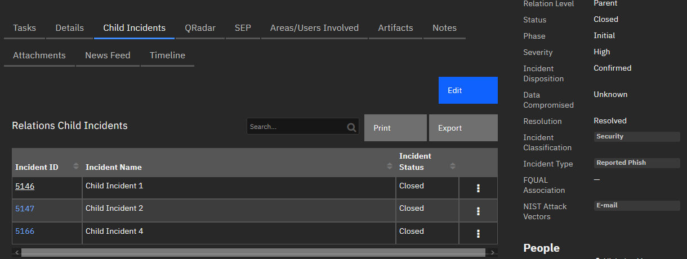

#### If Relation Level is: **Child**

Summary Section:
  - Add Relation Level
  - Parent ID

  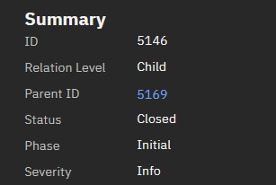

 ---

## Function - Relations: Assign Parent
Create a parent/child relationship between the 2 incidents provided.

 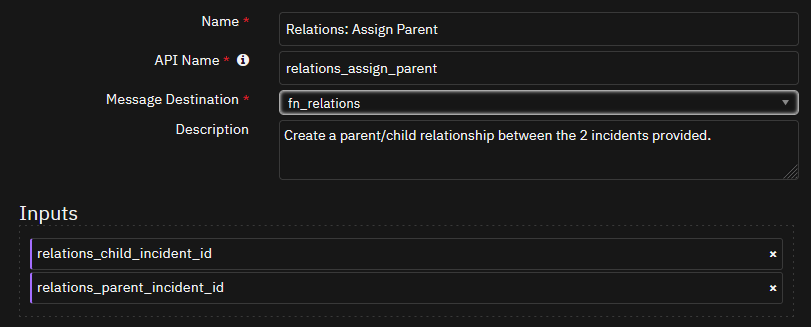

<details><summary>Inputs:</summary>
<p>

| Name | Type | Required | Example | Tooltip |
| ---- | :--: | :------: | ------- | ------- |
| `relations_child_incident_id` | `number` | Yes | `-` | - |
| `relations_parent_incident_id` | `number` | Yes | `-` | - |

</p>
</details>

<details><summary>Outputs:</summary>
<p>

> **NOTE:** This example might be in JSON format, but `results` is a Python Dictionary on the SOAR platform.

```python
results = {
  "content": {
    "child_artifact_results": {
      "content": {
        "actions": [
          {
            "enabled": false,
            "id": 38,
            "name": "Example: Relations - Sync Artifact"
          }
        ],
        "attachment": null,
        "created": 1705509534505,
        "creator": {
          "display_name": "Resilient Sysadmin",
          "email": "a@example.com",
          "fname": "Resilient",
          "id": 8,
          "is_external": false,
          "is_ldap": false,
          "is_saml": false,
          "lname": "Sysadmin",
          "locked": false,
          "password_changed": false,
          "status": "A",
          "ui_theme": "verydarkmode"
        },
        "creator_principal": {
          "display_name": "Resilient Sysadmin",
          "id": 8,
          "name": "a@example.com",
          "type": "user"
        },
        "description": "Parent Incident ID in Relationship",
        "global_artifact": [],
        "global_info": null,
        "hash": "99e5ebfa...25951177",
        "hits": [],
        "id": 15,
        "inc_id": 2102,
        "inc_name": "child3-1",
        "inc_owner": 8,
        "ip": {
          "destination": null,
          "source": null
        },
        "last_modified_by": {
          "display_name": "Resilient Sysadmin",
          "id": 8,
          "name": "a@example.com",
          "type": "user"
        },
        "last_modified_time": 1705509534512,
        "parent_id": null,
        "pending_scan_result": false,
        "pending_sources": [],
        "perms": {
          "delete": true,
          "read": true,
          "write": true
        },
        "playbooks": [
          {
            "display_name": "Relations: Sync Artifact",
            "playbook_handle": 12
          }
        ],
        "properties": null,
        "related_incident_count": null,
        "relating": true,
        "type": 1084,
        "value": "2101"
      },
      "success": true
    },
    "notes_synced": 0,
    "parent_artifact_results": {
      "content": {
        "actions": [
          {
            "enabled": false,
            "id": 38,
            "name": "Example: Relations - Sync Artifact"
          }
        ],
        "attachment": null,
        "created": 1705509537212,
        "creator": {
          "display_name": "Resilient Sysadmin",
          "email": "a@example.com",
          "fname": "Resilient",
          "id": 8,
          "is_external": false,
          "is_ldap": false,
          "is_saml": false,
          "lname": "Sysadmin",
          "locked": false,
          "password_changed": false,
          "status": "A",
          "ui_theme": "verydarkmode"
        },
        "creator_principal": {
          "display_name": "Resilient Sysadmin",
          "id": 8,
          "name": "a@example.com",
          "type": "user"
        },
        "description": "Parent Incident ID in Relationship",
        "global_artifact": [],
        "global_info": null,
        "hash": "6750ee9e...ff2824ec",
        "hits": [],
        "id": 16,
        "inc_id": 2101,
        "inc_name": "parent3",
        "inc_owner": 8,
        "ip": {
          "destination": null,
          "source": null
        },
        "last_modified_by": {
          "display_name": "Resilient Sysadmin",
          "id": 8,
          "name": "a@example.com",
          "type": "user"
        },
        "last_modified_time": 1705509537219,
        "parent_id": null,
        "pending_scan_result": false,
        "pending_sources": [],
        "perms": {
          "delete": true,
          "read": true,
          "write": true
        },
        "playbooks": [
          {
            "display_name": "Relations: Sync Artifact",
            "playbook_handle": 12
          }
        ],
        "properties": null,
        "related_incident_count": null,
        "relating": true,
        "type": 1084,
        "value": "2101"
      },
      "success": true
    },
    "table_addition_results": {
      "content": {
        "actions": [],
        "cells": {
          "relations_incident_id": {
            "id": "relations_incident_id",
            "row_id": 6,
            "value": "\u003cdiv class=\"rte\"\u003e\u003cdiv\u003e\u003ca href=\"#incidents/2102\" target=\"_blank\"\u003e2102\u003c/a\u003e\u003c/div\u003e\u003c/div\u003e"
          },
          "relations_incident_name": {
            "id": "relations_incident_name",
            "row_id": 6,
            "value": "child3-1"
          },
          "relations_incident_status": {
            "id": "relations_incident_status",
            "row_id": 6,
            "value": "Active"
          }
        },
        "id": 6,
        "inc_id": 2101,
        "inc_name": "parent3",
        "inc_owner": "a@example.com",
        "playbooks": [],
        "table_name": "Relations Child Incidents",
        "type_id": 1001,
        "version": 1
      },
      "success": true
    }
  },
  "inputs": {
    "relations_child_incident_id": 2102,
    "relations_parent_incident_id": 2101
  },
  "metrics": {
    "execution_time_ms": 5060,
    "host": "localhost",
    "package": "fn-relations",
    "package_version": "3.1.0",
    "timestamp": "2024-01-17 11:38:57",
    "version": "1.0"
  },
  "raw": null,
  "reason": null,
  "success": true,
  "version": 2.0
}
```

</p>
</details>

<details><summary>Example Function Input Script:</summary>
<p>

```python
inputs.relations_child_incident_id = incident.id
inputs.relations_parent_incident_id = rule.properties.relations_parent_incident

```

</p>
</details>

<details><summary>Example Post-Process Script:</summary>
<p>

```python
None
```

</p>
</details>

---
## Function - Relations: Auto Close Child Incidents
Close child incidents when the parent incident is closed.

 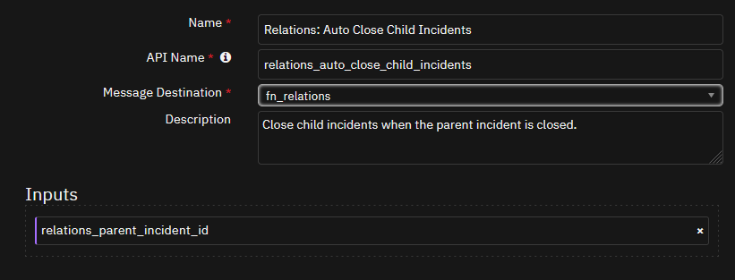

<details><summary>Inputs:</summary>
<p>

| Name | Type | Required | Example | Tooltip |
| ---- | :--: | :------: | ------- | ------- |
| `relations_parent_incident_id` | `number` | Yes | `-` | - |

</p>
</details>

<details><summary>Outputs:</summary>
<p>

> **NOTE:** This example might be in JSON format, but `results` is a Python Dictionary on the SOAR platform.

```python
results = {
  "content": {
    "incidents": [
      2097
    ]
  },
  "inputs": {
    "relations_parent_incident_id": 2096
  },
  "metrics": {
    "execution_time_ms": 2514,
    "host": "localhost",
    "package": "fn-relations",
    "package_version": "3.1.0",
    "timestamp": "2024-01-17 11:32:49",
    "version": "1.0"
  },
  "raw": null,
  "reason": null,
  "success": true,
  "version": 2.0
}
```

</p>
</details>

<details><summary>Example Function Input Script:</summary>
<p>

```python
inputs.relations_parent_incident_id = incident.id

```

</p>
</details>

<details><summary>Example Post-Process Script:</summary>
<p>

```python
None
```

</p>
</details>

---
## Function - Relations: Copy Task
Copy a task from a Parent Incident down to the Children.

 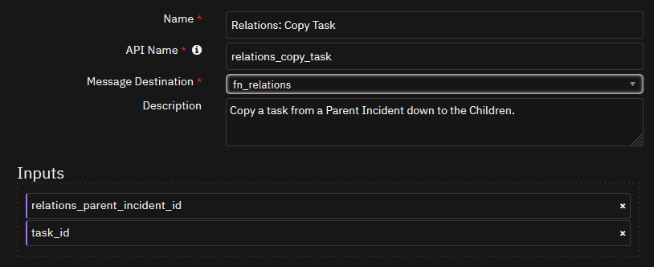

<details><summary>Inputs:</summary>
<p>

| Name | Type | Required | Example | Tooltip |
| ---- | :--: | :------: | ------- | ------- |
| `relations_parent_incident_id` | `number` | Yes | `-` | - |
| `task_id` | `number` | No | `-` | - |

</p>
</details>

<details><summary>Outputs:</summary>
<p>

> **NOTE:** This example might be in JSON format, but `results` is a Python Dictionary on the SOAR platform.

```python
results = {
  "content": {
    "children": [
      2097,
      2100
    ],
    "task": {
      "due_date": null,
      "instructions": "\u003cdiv class=\"rte\"\u003e\u003cdiv\u003esome instructions\u003c/div\u003e\u003c/div\u003e",
      "name": "Task 60 from Parent: parent1 task",
      "phase_id": "Initial",
      "required": true
    }
  },
  "inputs": {
    "relations_parent_incident_id": 2096,
    "task_id": 60
  },
  "metrics": {
    "execution_time_ms": 2517,
    "host": "localhost",
    "package": "fn-relations",
    "package_version": "3.1.0",
    "timestamp": "2024-01-17 11:25:51",
    "version": "1.0"
  },
  "raw": null,
  "reason": null,
  "success": true,
  "version": 2.0
}
```

</p>
</details>

<details><summary>Example Function Input Script:</summary>
<p>

```python
inputs.relations_parent_incident_id
```

</p>
</details>

<details><summary>Example Post-Process Script:</summary>
<p>

```python
None
```

</p>
</details>

---
## Function - Relations: Remove Child Relation
Used to remove the relation child relation from a Child incident as well as removing the parent relation from the Parent incident if it no longer has children.

 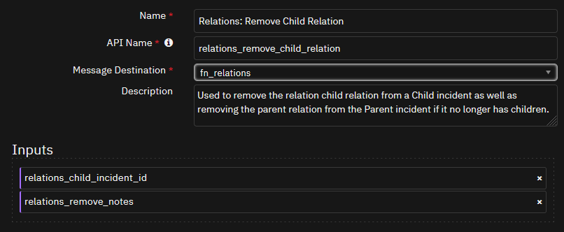

<details><summary>Inputs:</summary>
<p>

| Name | Type | Required | Example | Tooltip |
| ---- | :--: | :------: | ------- | ------- |
| `relations_child_incident_id` | `number` | Yes | `-` | - |
| `relations_remove_notes` | `boolean` | Yes | `-` | - |

</p>
</details>

<details><summary>Outputs:</summary>
<p>

> **NOTE:** This example might be in JSON format, but `results` is a Python Dictionary on the SOAR platform.

```python
results = {
  "content": {
    "child_incident": 2100,
    "parent_incident": 2096
  },
  "inputs": {
    "relations_child_incident_id": 2100,
    "relations_remove_notes": false
  },
  "metrics": {
    "execution_time_ms": 3181,
    "host": "localhost",
    "package": "fn-relations",
    "package_version": "3.1.0",
    "timestamp": "2024-01-17 11:32:10",
    "version": "1.0"
  },
  "raw": null,
  "reason": null,
  "success": true,
  "version": 2.0
}
```

</p>
</details>

<details><summary>Example Function Input Script:</summary>
<p>

```python
inputs.relations_child_incident_id = incident.id
inputs.relations_remove_notes = rule.properties.relations_remove_notes

```

</p>
</details>

<details><summary>Example Post-Process Script:</summary>
<p>

```python
None
```

</p>
</details>

---
## Function - Relations: Sync Artifact
Sync Artifacts from the incident where the artifact is currently to the parent or children.

 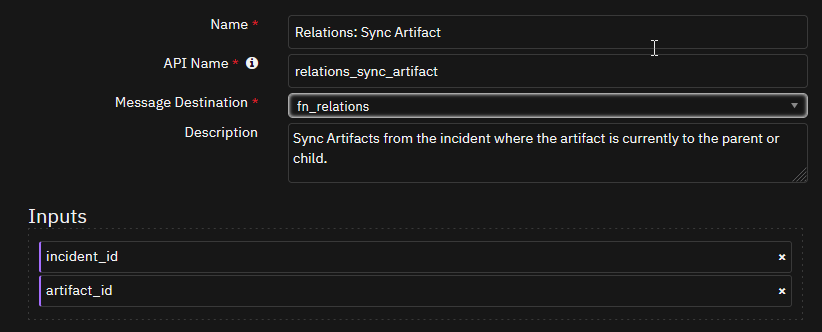

<details><summary>Inputs:</summary>
<p>

| Name | Type | Required | Example | Tooltip |
| ---- | :--: | :------: | ------- | ------- |
| `artifact_id` | `number` | No | `-` | - |
| `incident_id` | `number` | Yes | `-` | - |

</p>
</details>

<details><summary>Outputs:</summary>
<p>

> **NOTE:** This example might be in JSON format, but `results` is a Python Dictionary on the SOAR platform.

```python
results = {
  "content": {
    "artifact": {
      "description": "Artifact Synced from incident 2100.",
      "type": "String",
      "value": "child1-2 artifact"
    },
    "incidents": [
      2096
    ]
  },
  "inputs": {
    "artifact_id": 13,
    "incident_id": 2100
  },
  "metrics": {
    "execution_time_ms": 1471,
    "host": "localhost",
    "package": "fn-relations",
    "package_version": "3.1.0",
    "timestamp": "2024-01-17 11:28:48",
    "version": "1.0"
  },
  "raw": null,
  "reason": null,
  "success": true,
  "version": 2.0
}
```

</p>
</details>

<details><summary>Example Function Input Script:</summary>
<p>

```python
inputs.incident_id = incident.id
inputs.artifact_id = artifact.id

```

</p>
</details>

<details><summary>Example Post-Process Script:</summary>
<p>

```python
None
```

</p>
</details>

---
## Function - Relations: Sync Child Table Data
Update data within the Parent Table if the Child data changes.

 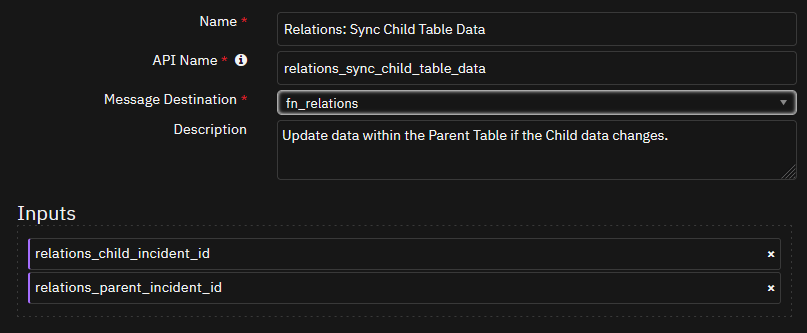

<details><summary>Inputs:</summary>
<p>

| Name | Type | Required | Example | Tooltip |
| ---- | :--: | :------: | ------- | ------- |
| `relations_child_incident_id` | `number` | Yes | `-` | - |
| `relations_parent_incident_id` | `number` | Yes | `-` | - |

</p>
</details>

<details><summary>Outputs:</summary>
<p>

> **NOTE:** This example might be in JSON format, but `results` is a Python Dictionary on the SOAR platform.

```python
results = {
  "content": {
    "response": {
      "actions": [],
      "cells": {
        "relations_incident_id": {
          "id": "relations_incident_id",
          "row_id": 6,
          "value": "\u003cdiv class=\"rte\"\u003e\u003cdiv\u003e\u003ca href=\"#incidents/2102\" target=\"_blank\"\u003e2102\u003c/a\u003e\u003c/div\u003e\u003c/div\u003e"
        },
        "relations_incident_name": {
          "id": "relations_incident_name",
          "row_id": 6,
          "value": "child3-1 chg"
        },
        "relations_incident_status": {
          "id": "relations_incident_status",
          "row_id": 6,
          "value": "Active"
        }
      },
      "id": 6,
      "inc_id": 2101,
      "inc_name": "parent3",
      "inc_owner": "a@example.com",
      "playbooks": [],
      "table_name": "Relations Child Incidents",
      "type_id": 1001,
      "version": 2
    }
  },
  "inputs": {
    "relations_child_incident_id": 2102,
    "relations_parent_incident_id": 2101
  },
  "metrics": {
    "execution_time_ms": 1060,
    "host": "localhost",
    "package": "fn-relations",
    "package_version": "3.1.0",
    "timestamp": "2024-01-17 11:41:38",
    "version": "1.0"
  },
  "raw": null,
  "reason": null,
  "success": true,
  "version": 2.0
}
```

</p>
</details>

<details><summary>Example Function Input Script:</summary>
<p>

```python
import re

regex = re.compile(r'#incidents/(\d+)"')

inputs.relations_parent_incident_id = int(re.findall(regex,incident.properties.relations_parent_id['content'])[0])
inputs.relations_child_incident_id = incident.id

```

</p>
</details>

<details><summary>Example Post-Process Script:</summary>
<p>

```python
None
```

</p>
</details>

---
## Function - Relations: Sync DataTable Data
A Function used to Sync DataTable Data from the incident where it resides to the parent or child.

 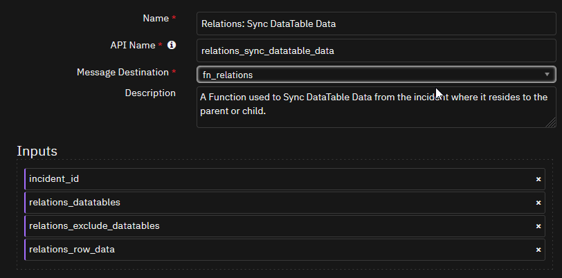

<details><summary>Inputs:</summary>
<p>

| Name | Type | Required | Example | Tooltip |
| ---- | :--: | :------: | ------- | ------- |
| `incident_id` | `number` | Yes | `-` | - |
| `relations_datatables` | `text` | Yes | `data_table_api1,data_table_api2 OR All` | A comma separated list of Datatable API Names to sync, or just "All" if syncing everything. |
| `relations_exclude_datatables` | `text` | No | `data_table_api1,data_table_api2,data_table_api3` | A Comma separated list of Datatable API Names that are to be excluded from the Sync. Meant to be used when syncing "All" DataTables. |
| `relations_row_data` | `text` | No | `-` | The entire row output of a Datatable Row for syncing specific Rows individually. |

</p>
</details>

<details><summary>Outputs:</summary>
<p>

> **NOTE:** This example might be in JSON format, but `results` is a Python Dictionary on the SOAR platform.

```python
results = {
  "content": {
    "datatables": [
      "email_conversations"
    ],
    "incidents": [
      2097
    ],
    "rows": null
  },
  "inputs": {
    "incident_id": 2096,
    "relations_datatables": "email_conversations",
    "relations_exclude_datatables": "dt_relations_child_incidents"
  },
  "metrics": {
    "execution_time_ms": 1076,
    "host": "localhost",
    "package": "fn-relations",
    "package_version": "3.1.0",
    "timestamp": "2024-01-17 11:23:17",
    "version": "1.0"
  },
  "raw": null,
  "reason": null,
  "success": true,
  "version": 2.0
}
```

</p>
</details>

<details><summary>Example Function Input Script:</summary>
<p>

```python
inputs.incident_id = incident.id
inputs.relations_datatables = rule.properties.relations_datatables_to_sync
if rule.properties.relations_datatables_to_exclude:
  inputs.relations_exclude_datatables = 'dt_relations_child_incidents,' + rule.properties.relations_datatables_to_exclude
else:
  inputs.relations_exclude_datatables = 'dt_relations_child_incidents'

```

</p>
</details>

<details><summary>Example Function Post Process Script:</summary>
<p>

```python
None
```

</p>
</details>

---
## Function - Relations: Sync Notes
Sync notes from the incident where the note is currently to the parent or child.

 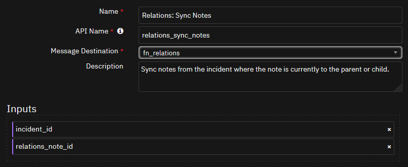

<details><summary>Inputs:</summary>
<p>

| Name | Type | Required | Example | Tooltip |
| ---- | :--: | :------: | ------- | ------- |
| `incident_id` | `number` | Yes | `-` | - |
| `relations_note_id` | `number` | Yes | `-` | - |

</p>
</details>

<details><summary>Outputs:</summary>
<p>

> **NOTE:** This example might be in JSON format, but `results` is a Python Dictionary on the SOAR platform.

```python
results = {
  "content": {
    "new_note": {
      "text": {
        "content": "Note from Parent Incident: \u003ca href=\"#incidents/2096\" target=\"_blank\"\u003e2096\u003c/a\u003e\u003cbr\u003eNote ID: 111\u003cbr\u003eOn Date: 01/17/2024 11:27:09\u003cbr\u003eBy: Resilient Sysadmin\u003cbr\u003e\u003cbr\u003e\u003cdiv class=\"rte\"\u003e\u003cdiv\u003eparent note\u003c/div\u003e\u003c/div\u003e",
        "format": "html"
      }
    }
  },
  "inputs": {
    "incident_id": 2096,
    "relations_note_id": 111
  },
  "metrics": {
    "execution_time_ms": 1882,
    "host": "localhost",
    "package": "fn-relations",
    "package_version": "3.1.0",
    "timestamp": "2024-01-17 11:27:17",
    "version": "1.0"
  },
  "raw": null,
  "reason": null,
  "success": true,
  "version": 2.0
}
```

</p>
</details>

<details><summary>Example Function Input Script:</summary>
<p>

```python
inputs.relations_note_id = note.id
inputs.incident_id = incident.id

```

</p>
</details>

<details><summary>Example Function Post Process Script:</summary>
<p>

```python
None
```

</p>
</details>

---
## Function - Relations: Sync Task Notes
Sync Task notes from a copied Task back to parent originating Task.

 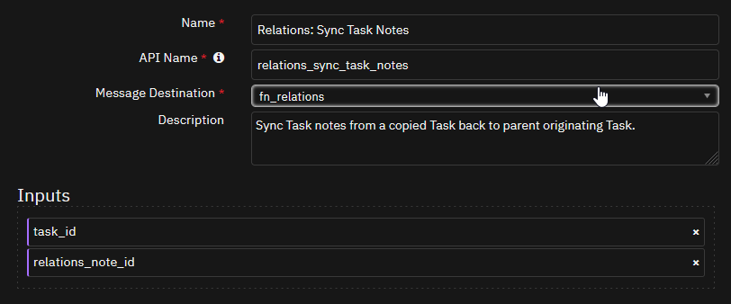

<details><summary>Inputs:</summary>
<p>

| Name | Type | Required | Example | Tooltip |
| ---- | :--: | :------: | ------- | ------- |
| `relations_note_id` | `number` | Yes | `-` | - |
| `task_id` | `number` | No | `-` | - |

</p>
</details>

<details><summary>Outputs:</summary>
<p>

> **NOTE:** This example might be in JSON format, but `results` is a Python Dictionary on the SOAR platform.

```python
results = {
  "content": {
    "new_note": {
      "text": {
        "content": "Note from Child Incident: \u003ca href=\"#incidents/2100\" target=\"_blank\"\u003e2100\u003c/a\u003e\u003cbr\u003eTask: \u003ca href=\"#incidents/2100?taskId=62\u0026tabName=comments\" target=\"_blank\"\u003eTask 60 from Parent: parent1 task\u003c/a\u003e\u003cbr\u003eNote ID: 257\u003cbr\u003eOn Date: 01/17/2024 11:29:07\u003cbr\u003eBy: Resilient Sysadmin\u003cbr\u003e\u003cbr\u003e\u003cdiv class=\"rte\"\u003e\u003cdiv\u003enew notes from child1-2\u003c/div\u003e\u003c/div\u003e",
        "format": "html"
      }
    }
  },
  "inputs": {
    "relations_note_id": 257,
    "task_id": 62
  },
  "metrics": {
    "execution_time_ms": 1171,
    "host": "localhost",
    "package": "fn-relations",
    "package_version": "3.1.0",
    "timestamp": "2024-01-17 11:29:09",
    "version": "1.0"
  },
  "raw": null,
  "reason": null,
  "success": true,
  "version": 2.0
}
```

</p>
</details>

<details><summary>Example Function Input Script:</summary>
<p>

```python
inputs.relations_note_id = note.id
inputs.task_id = task.id

```

</p>
</details>

<details><summary>Example Function Post Process Script:</summary>
<p>

```python
None
```

</p>
</details>

---


## Playbooks
| Playbook Name | Description | Activation Type | Object | Status | Condition | 
| ------------- | ----------- | --------------- | ------ | ------ | --------- | 
| Relations: Assign Parent Incident | Change the necessary information to establish a child/parent relationship. | Manual | incident | `enabled` | `incident.properties.relations_level not_in ['Parent', 'Child']` | 
| Relations: Auto Close Child Incidents | Close the incidents of the child incidents when the parent incident is closed. | Automatic | incident | `enabled` | `incident.plan_status changed_to Closed AND incident.properties.relations_level equals Parent` | 
| Relations: Copy Task to Children | Copy a task from a parent incident to the children. | Manual | task | `enabled` | `incident.properties.relations_level equals Parent` | 
| Relations: Remove Child Relation | Removes the child incident relation with the parent. | Manual | incident | `enabled` | `incident.properties.relations_level equals Child` | 
| Relations: Sync Artifact | Sync an artifact to either its parent or children. | Manual | artifact | `enabled` | `incident.properties.relations_level in ['Parent', 'Child']` | 
| Relations: Sync Datatable Data | Sync Data from DataTables to the incidents Parent or Child to track data across incidents. | Manual | incident | `enabled` | `incident.properties.relations_level in ['Parent', 'Child']` | 
| Relations: Sync Note to Children | Sync a note from a parent incident to the children incidents. | Manual | note | `enabled` | `incident.properties.relations_level equals Parent AND task.id not_has_a_value` | 
| Relations: Sync Notes to Parent | Sync any new notes created in the child to the parent incident. | Automatic | note | `enabled` | `incident.properties.relations_level equals Child AND incident.properties.relations_parent_id has_a_value AND note.text not_contains from parent incident: AND task.id not_has_a_value AND object_added` | 
| Relations: Sync Task Note to Children | Sync Copied Task Notes to Children Tasks. | Manual | note | `enabled` | `incident.properties.relations_level equals Parent AND task.id has_a_value` | 
| Relations: Sync Task Notes to Parent | Sync Copied Task Notes to Parent Task. | Automatic | note | `enabled` | `incident.properties.relations_level equals Child AND note.text not_contains from Parent Incident: AND task.id has_a_value AND task.name contains from Parent: AND object_added` | 
| Relations: Update Child Table Data | Update any data stored in the Child Incidents Data Table on the parent incident if changed, such as if the incident is closed. | Automatic | incident | `enabled` | `(incident.properties.relations_level equals Child AND incident.properties.relations_parent_id has_a_value) AND (incident.name changed OR incident.plan_status changed)` | 

---
## Data Table - Relations Child Incidents

 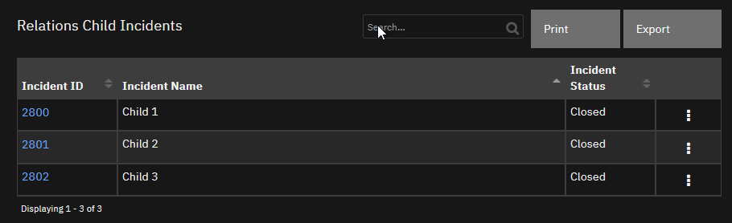

#### API Name:
dt_relations_child_incidents

#### Columns:
| Column Name | API Access Name | Type | Tooltip |
| ----------- | --------------- | ---- | ------- |
| Incident ID | `relations_incident_id` | `textarea` | - |
| Incident Name | `relations_incident_name` | `text` | - |
| Incident Status | `relations_incident_status` | `select` | - |

---

## Custom Fields
| Label | API Access Name | Type | Prefix | Placeholder | Tooltip |
| ----- | --------------- | ---- | ------ | ----------- | ------- |
| Parent ID | `relations_parent_id` | `textarea` | `properties` | - | Incident Number of the Parent Incident |
| Relation Level | `relations_level` | `select` | `properties` | - | Is this incident considered a Parent or Child incident? |

---

## Custom Artifact Types
| Display Name | API Access Name | Description |
| ------------ | --------------- | ----------- |
| Related Parent Incident | `related_parent_incident` | Incident ID of the parent of all related incidents to create a relation within Resilient incidents manually. |

---


## Troubleshooting & Support
Refer to the documentation listed in the Requirements section for troubleshooting information.
 
### For Support
This is a IBM Community provided app. Please search the Community [ibm.biz/soarcommunity](https://ibm.biz/soarcommunity) for assistance.
