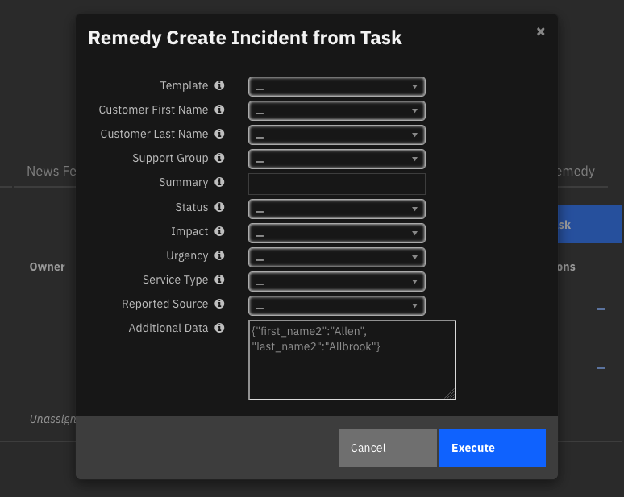

<!--
  This README.md is generated by running:
  "resilient-sdk docgen -p fn_remedy"

  It is best edited using a Text Editor with a Markdown Previewer. VS Code
  is a good example. Checkout https://guides.github.com/features/mastering-markdown/
  for tips on writing with Markdown

  If you make manual edits and run docgen again, a .bak file will be created

  Store any screenshots in the "doc/screenshots" directory and reference them like:
  

  NOTE: If your app is available in the container-format only, there is no need to mention the integration server in this readme.
-->

# fn_remedy
## Table of Contents
- [Release Notes](#release-notes)
- [Overview](#overview)
  - [Key Features](#key-features)
- [Requirements](#requirements)
  - [SOAR platform](#SOAR-platform)
  - [Cloud Pak for Security](#cloud-pak-for-security)
  - [Proxy Server](#proxy-server)
- [Installation](#installation)
  - [Install](#install)
  - [App Configuration](#app-configuration)
  - [Custom Layouts](#custom-layouts)
- [Function - Remedy: Close Incident](#function---remedy-close-incident)
- [Function - Remedy: Create Incident](#function---remedy-create-incident)
- [Data Table - Remedy Linked Incidents Reference Table](#data-table---remedy-linked-incidents-reference-table)
- [Rules](#rules)
- [Troubleshooting & Support](#troubleshooting--support)
---

## Release Notes
<!--
  Specify all changes in this release. Do not remove the release 
  notes of a previous release
-->
| Version | Date | Notes |
| ------- | ---- | ----- |
| 1.0.1 | 04/2022 | Bug fix for use of 'verify' app.config parameter |
| 1.0.0 | 04/2021 | Initial Release |

---

## Overview
<!--
  Provide a high-level description of the function itself and its remote software or application.
  The text below is parsed from the "description" and "long_description" attributes in the setup.py file
-->
**Remedy for IBM SOAR**

 

Remedy for IBM SOAR. This integration provides the capability to create new incidents in Remedy from SOAR tasks via the HPD:IncidentInterface_Create form over the REST API. Once the task is complete, this integration also provides the capability to close existing Remedy Incidents by updating their status to "Resolved."

### Key Features
<!--
  List the Key Features of the Integration
-->
* Send IBM SOAR Case tasks to Remedy as Incidents
* Close Remedy Incidents from IBM SOAR

---

## Requirements
<!--
  List any Requirements 
-->
This app supports the IBM SOAR Platform and the IBM Cloud Pak for Security.

### SOAR platform
The SOAR platform supports two app deployment mechanisms, App Host and integration server.

If deploying to a SOAR platform with an App Host, the requirements are:
* SOAR platform >= `39.0.0`.
* The app is in a container-based format (available from the AppExchange as a `zip` file).

If deploying to a SOAR platform with an integration server, the requirements are:
* SOAR platform >= `39.0.0`.
* The app is in the older integration format (available from the AppExchange as a `zip` file which contains a `tar.gz` file).
* Integration server is running `resilient-circuits>=30.0.0` and `resilient-lib>=39.0.0`.
* If using an API key account, make sure the account provides the following minimum permissions: 
  | Name | Permissions |
  | ---- | ----------- |
  | Org Data | Read |
  | Function | Read |
  | Incidents |  Read |
  | Incident Notes | Write |
  | Private Tasks | Read |

* Resilient-circuits will also require the following permission to run the customize import process.
  | Name | Permissions |
  | ---- | ----------- |
  | Org Data | Write |

The following SOAR platform guides provide additional information: 
* _App Host Deployment Guide_: provides installation, configuration, and troubleshooting information, including proxy server settings. 
* _Integration Server Guide_: provides installation, configuration, and troubleshooting information, including proxy server settings.
* _System Administrator Guide_: provides the procedure to install, configure and deploy apps. 

The above guides are available on the IBM Knowledge Center at [ibm.biz/resilient-docs](https://ibm.biz/resilient-docs). On this web page, select your SOAR platform version. On the follow-on page, you can find the _App Host Deployment Guide_ or _Integration Server Guide_ by expanding **SOAR Apps** in the Table of Contents pane. The System Administrator Guide is available by expanding **System Administrator**.

### Cloud Pak for Security
If you are deploying to IBM Cloud Pak for Security, the requirements are:
* IBM Cloud Pak for Security >= 1.4.
* Cloud Pak is configured with an App Host.
* The app is in a container-based format (available from the AppExchange as a `zip` file).

The following Cloud Pak guides provide additional information: 
* _App Host Deployment Guide_: provides installation, configuration, and troubleshooting information, including proxy server settings. From the Table of Contents, select Case Management and Orchestration & Automation > **Orchestration and Automation Apps**.
* _System Administrator Guide_: provides information to install, configure, and deploy apps. From the IBM Cloud Pak for Security Knowledge Center table of contents, select Case Management and Orchestration & Automation > **System administrator**.

These guides are available on the IBM Knowledge Center at [ibm.biz/cp4s-docs](https://ibm.biz/cp4s-docs). From this web page, select your IBM Cloud Pak for Security version. From the version-specific Knowledge Center page, select Case Management and Orchestration & Automation.

### Proxy Server
The app **does** support a proxy server.

### Remedy Platform
This app requires Remedy IT Service Management Suite 20.x or above with AR Server 9.x or above. The REST API must be enabled and exposed on any port. If the REST API is not already enabled on the Remedy Platform, consult their documentation on [Configuring the REST API](https://docs.bmc.com/docs/ars91/en/configuring-the-rest-api-609071434.html).

---

## Installation

### Install
* To install or uninstall an App or Integration on the _SOAR platform_, see the documentation at [ibm.biz/resilient-docs](https://ibm.biz/resilient-docs).
* To install or uninstall an App on _IBM Cloud Pak for Security_, see the documentation at [ibm.biz/cp4s-docs](https://ibm.biz/cp4s-docs) and follow the instructions above to navigate to Orchestration and Automation.

### App Configuration
The following table provides the settings you need to configure the app. These settings are made in the app.config file. See the documentation discussed in the [Requirements](#requirements) section for the procedure.

| Config | Required | Example | Description |
| ------ | :------: | ------- | ----------- |
| **remedy_host** | Yes | `<example.domain>` | *Hostname or IP for the Remedy instance.* |
| **remedy_user** | Yes | `<example_user>` | *Username to use to authenticate with Remedy.* |
| **remedy_password** | Yes | `xxx` | *Password to use to authenticate with Remedy.* |
| **max_datatable_rows** | No | `30` | *Max number of datatable rows to return from the SOAR API when closing an Incident.* |
| remedy_port | No | `8443` | *Port number over which the Remedy REST API is exposed.* |
| verify | No | `true|false|/path/to/certificate.crt` | *Set to `true` or `/path/to/cerficate.crt` to make verified requests to Remedy, else set to `false`* |
| http_proxy | No | `example.domain` | *http proxy for request traffic.* |
| http_proxy | No | `example.domain` | *https proxy for request traffic.* |

### Custom Layouts
<!--
  Use this section to provide guidance on where the user should add any custom fields and data tables.
  You may wish to recommend a new incident tab.
  You should save a screenshot "custom_layouts.png" in the doc/screenshots directory and reference it here
-->
* Import the Data Tables and Custom Fields like the screenshot below:

  


---


## Function - Remedy: Create Incident
Create a new incident in Remedy from a SOAR task.

 

### Activity Fields

 

Remedy is a highly customizable product, and this integration was designed with those customizations in mind.

Note that when creating an incident in Remedy via the REST API, any auto-routing that is configured in the Remedy platform will continue to apply as it would when creating
a new incident in the user interface. This can result in a discrepancy between the data that was submitted by the integration and the data that is present in Remedy once the incident object is actually created.
For example, the payload sent to Remedy by the integration could indicate a Status of New for an incident (either directly or via a [template](#templating).) However, when that ticket is actually
created, the auto-routing in Remedy could be configured to assign it to a user and update the Status to Assigned. This is expected, and the true status of the created incident
will be reflected in the [datatable](#data-table---remedy-Linked-incidents-reference-table).

**Templating**

To facilitate the use of templates, none of the activity fields are required. If your Remedy server has a template defined that provides all required fields to create an incident, you may simply provided the template name and use this function. Note that it is necessary to manually enter the template name(s) so that they are available in the dropdown. We have provided a stock, out-of-the-box template name as an example. Other template names can be added as necessary by modifying this activity field within the Customization Settings of the platform.

**Other Common Fields**

For convenience, several activity fields have been created to handle input for commonly used fields in Remedy such as Status, Impact, and Urgency. These activity fields are not required, as templates can also provide those values. Note that if a template and activity field provide the same value, the activity field will take precedence over the template.

Please note that the user has the ability to customize what values appear in the dropdown menu for each activity field. This action will likely be necessary if not taking advantage of the Remedy's templating functionality via this integration. Activity fields can be modified within the Customization Settings of the platform.

**Additional Data**

Finally, the Additional Data activity field allows the mapping of any other values to the Remedy form not covered in the above activity fields, including custom defined fields. The fields must be provided as a Python-like dictionary. For example:

```python
{"Short Description": "example incident text", "my_custom_field": 1}
```

The keys provided in this dictionary string must match the API names of fields in the `HPD:IncidentInterface` form. To retrieve the schema for this form on the Remedy server, send an HTTP OPTIONS request to `http://serverName/api/arsys/v1/entry/HPD:IncidentInterface_Create`. This is the endpoint used to create Remedy incidents over the API, and thus the response will indicate which fields are available to map and any value restrictions.

<details><summary>Inputs:</summary>
<p>

| Name | Type | Required | Example | Tooltip |
| ---- | :--: | :------: | ------- | ------- |
| `incident_id` | `number` | No | `-` | - |
| `remedy_incident_name` | `text` | No | `-` | - |
| `remedy_payload` | `text` | No | `-` | - |
| `task_id` | `number` | No | `-` | - |

</p>
</details>

<details><summary>Outputs:</summary>
<p>

```python
results = {
    'version': '1.0',
    'success': True,
    'reason': None,
    'content': {'values': {
        'Request ID': 'INC000000000917|INC000000000917',
        'Submitter': 'Allen',
        'Submit Date': '2021-04-16T18:27:47.000+0000',
        'Assignee Login ID': 'Mary',
        'Last Modified By': 'Remedy Application Service',
        'Last Modified Date': '2021-04-16T18:27:47.000+0000',
        'Status': 'Assigned',
        'Status-History': {'New': {'user': 'Allen',
                           'timestamp': '2021-04-16T18:27:47.000+0000'},
                           'Assigned': {'user': 'Allen',
                           'timestamp': '2021-04-16T18:27:47.000+0000'}},
        'Assignee Groups': "1000000005;'Allen';",
        'InstanceId': 'AGGALAS1CWFC9AQROFY1QQP78CFXL9',
        'Vendor Assignee Groups': None,
        'Vendor Assignee Groups_parent': None,
        'Assignee Groups_parent': '',
        'Product Categorization Tier 1': None,
        'Product Categorization Tier 2': None,
        'Product Categorization Tier 3': None,
        'Department': 'Customer Service',
        'Site Group': 'United States',
        'Region': 'Americas',
        'Product Name': None,
        'Manufacturer': None,
        'Product Model/Version': None,
        'Site': 'Headquarters, Building 1.31',
        'SRAttachment': None,
        'Created_By': None,
        'MaxRetries': None,
        'z1D_Command': None,
        'AccessMode': None,
        'z1D_WorklogDetails': None,
        'z1D_Char02': None,
        'z1D_FormName': None,
        'AppInstanceServer': None,
        'SRInstanceID': 'NA',
        'zTmpEventGUID': None,
        'AppInterfaceForm': None,
        'Entry ID': 'INC000000000917',
        'z1D_Activity_Type': None,
        'z1D_Summary': None,
        'z1D_Details': None,
        'z1D_Secure_Log': None,
        'z1D_View_Access': None,
        'z2AF_Act_Attachment_1': None,
        'Protocol': None,
        'AppLogin': None,
        'AppPassword': None,
        'PortNumber': None,
        'SRMS Registry Instance ID': 'SR0011439CCAD4ec8UQwCkOLAQlQAA',
        'SRMSAOIGuid': None,
        'SRID': None,
        'TemplateID': None,
        'z1D_CommunicationSource': None,
        'z1D_ActivityDate_tab': None,
        'Last _Assigned_Date': None,
        'z1D_AssociationDescription': None,
        'Component_ID': None,
        'mc_ueid': None,
        'cell_name': None,
        'policy_name': None,
        'status_incident': None,
        'status_reason2': None,
        'root_component_id_list': None,
        'root_incident_id_list': None,
        'Impact_OR_Root': None,
        'bOrphanedRoot': None,
        'use_case': None,
        'ClientLocale': None,
        'ServiceCI': None,
        'HPD_CI': None,
        'ServiceCI_ReconID': None,
        'HPD_CI_ReconID': None,
        'z1D_CI_FormName': None,
        'Previous_ServiceCI_ReconID': None,
        'Previous_HPD_CI_ReconID': None,
        'z1D_SR_Instanceid': None,
        'Direct Contact Corporate ID': None,
        'KMSGUID': None,
        'HPD_CI_FormName': None,
        'z1D_InterfaceAction': None,
        'z1D_WorkInfoSubmitter': None,
        'Direct Contact Login ID': None,
        'Customer Login ID': 'Allen',
        'AttachmentSourceFormName': None,
        'AttachmentSourceGUID': None,
        'z1D_ConfirmGroup': None,
        'z1D_CreatedFromBackEndSynchWI': None,
        'InfrastructureEventType': 'None',
        'policy_type': None,
        'Chat Session ID': None,
        'Modified Chat Session ID': None,
        'Auto Open Session': None,
        'TimeOfEvent': None,
        'FirstWIPDate': None,
        'LastWIPDate': None,
        'Broker Vendor Name': None,
        'Description': 'IBM SOAR Case 2169: Investigate Exposure of Personal Information/Data',
        'Company': 'Calbro Services',
        'Country': 'United States',
        'State Province': 'New York',
        'City': 'New York',
        'Organization': 'Information Technology',
        'Assigned Support Organization': 'IT Support',
        'Last Name': 'Allbrook',
        'First Name': 'Allen',
        'Middle Initial': None,
        'Contact Client Type': 'Office-Based Employee',
        'VIP': 'No',
        'Contact Sensitivity': 'Standard',
        'Desk Location': None,
        'Mail Station': None,
        'Street': '1114 Eighth Avenue, 31st Floor',
        'Zip/Postal Code': '10036',
        'Internet E-mail': 'A.Allbrook@calbroservices.com',
        'Corporate ID': None,
        'Phone Number': '1 212 555-5454 (11)',
        'z1D Char01': None,
        'Categorization Tier 1': None,
        'Categorization Tier 2': None,
        'Categorization Tier 3': None,
        'z1D Char02': None,
        'Site ID': 'STE_SOLN0002846',
        'z1D Action': None,
        'Assigned Group ID': 'SGP000000000011',
        'Person ID': 'PPL000000000013',
        'Contact Company': 'Calbro Services',
        'Service Type': 'User Service Restoration',
        'Status_Reason': None,
        'Detailed Decription': None,
        'Resolution': None,
        'Incident Number': 'INC000000000816',
        'Urgency': '1-Critical',
        'Impact': '1-Extensive/Widespread',
        'Priority': 'Critical',
        'Priority Weight': 29,
        'Reported Source': 'Direct Input',
        'Assigned Group': 'Service Desk',
        'Assignee': 'Mary Mann',
        'Assigned Support Company': 'Calbro Services',
        'Assigned Group Shift Name': None,
        'Assigned Group Shift ID': None,
        'Owner Support Organization': 'IT Support',
        'Number of Attachments': None,
        'Vendor Name': None,
        'Owner Group': 'Service Desk',
        'Owner Support Company': 'Calbro Services',
        'Owner Group ID': 'SGP000000000011',
        'Reported Date': '2021-04-16T18:27:47.000+0000',
        'Responded Date': '2021-04-16T18:27:47.000+0000',
        'Last Acknowledged Date': None,
        'Last Resolved Date': None,
        'Closed Date': None,
        'Vendor Ticket Number': None,
        'z1D Permission Group ID': None,
        'z1D Permission Group List': None,
        'Resolution Category': None,
        'Direct Contact Internet E-mail': None,
        'Vendor Organization': None,
        'Vendor Group': None,
        'Vendor Group ID': None,
        'Total Transfers': 1,
        'Resolution Method': None,
        'Resolution Category Tier 2': None,
        'Resolution Category Tier 3': None,
        'Closure Product Category Tier1': None,
        'Closure Product Category Tier2': None,
        'Closure Product Category Tier3': None,
        'Closure Product Name': None,
        'Closure Product Model/Version': None,
        'Closure Manufacturer': None,
        'Estimated Resolution Date': None,
        'Required Resolution DateTime': None,
        'Direct Contact Company': None,
        'Direct Contact Last Name': None,
        'Direct Contact First Name': None,
        'Direct Contact Middle Initial': None,
        'Direct Contact Phone Number': None,
        'Direct Contact Organization': None,
        'Direct Contact Department': None,
        'Direct Contact Region': None,
        'Direct Contact Site Group': None,
        'Direct Contact Site': None,
        'Direct Contact Person ID': None,
        'Direct Contact Street': None,
        'Direct Contact Country': None,
        'Direct Contact State/Province': None,
        'Direct Contact City': None,
        'Direct Contact Zip/Postal Code': None,
        'Direct Contact Time Zone': None,
        'Direct Contact Desk Location': None,
        'Direct Contact Mail Station': None,
        'Direct Contact Location Details': None,
        'Direct Contact Site ID': None,
        'Direct Contact Country Code': None,
        'Direct Contact Area Code': None,
        'Direct Contact Local Number': None,
        'Direct Contact Extension': None,
        },
            '_links': {'self': [{'href': 'http://35.153.129.209:8008/api/arsys/v1/entry/HPD:IncidentInterface/INC000000000917%7CINC000000000917'
                       }]}, 'task': {
        'name': 'Investigate Exposure of Personal Information/Data',
        'inc_id': 2169,
        'inc_owner_id': 1,
        'due_date': None,
        'required': True,
        'owner_id': None,
        'user_notes': None,
        'status': 'C',
        'frozen': False,
        'owner_fname': None,
        'owner_lname': None,
        'init_date': 1618584448988,
        'active': True,
        'src_name': None,
        'inc_name': 'new guy',
        'instr_text': None,
        'instructions': None,
        'form': 'data_compromised, determined_date',
        'members': None,
        'perms': {
            'read': True,
            'write': True,
            'comment': True,
            'assign': True,
            'close': True,
            'change_members': True,
            'attach_file': True,
            'read_attachments': True,
            'delete_attachments': True,
            'change_header': False,
            },
        'notes': [],
        'closed_date': 1618597565810,
        'actions': [{'id': 157,
                    'name': 'Remedy Create Incident from Task',
                    'enabled': True}],
        'phase_id': 1005,
        'category_id': 1,
        'notes_count': 0,
        'attachments_count': 0,
        'task_layout': [],
        'auto_deactivate': True,
        'creator_principal': {
            'id': 1,
            'type': 'user',
            'name': 'a@example.com',
            'display_name': 'Brian Reid',
            },
        'regs': {'88': 'Data Breach Best Practices'},
        'custom': False,
        'id': 380,
        'inc_training': False,
        'cat_name': 'Respond',
        'description': '',
        'at_id': None,
        'private': None,
        }},
    'raw': '{"values": {"Request ID": "INC000000000917|INC000000000917", "Submitter": "Allen", "Submit Date": "2021-04-16T18:27:47.000+0000", "Assignee Login ID": "Mary", "Last Modified By": "Remedy Application Service", "Last Modified Date": "2021-04-16T18:27:47.000+0000", "Status": "Assigned", "Status-History": {"New": {"user": "Allen", "timestamp": "2021-04-16T18:27:47.000+0000"}, "Assigned": {"user": "Allen", "timestamp": "2021-04-16T18:27:47.000+0000"}}, "Assignee Groups": "1000000005;\'Allen\';", "InstanceId": "AGGALAS1CWFC9AQROFY1QQP78CFXL9", "Vendor Assignee Groups": null, "Vendor Assignee Groups_parent": null, "Assignee Groups_parent": "", "Product Categorization Tier 1": null, "Product Categorization Tier 2": null, "Product Categorization Tier 3": null, "Department": "Customer Service", "Site Group": "United States", "Region": "Americas", "Product Name": null, "Manufacturer": null, "Product Model/Version": null, "Site": "Headquarters, Building 1.31", "SRAttachment": null, "Created_By": null, "MaxRetries": null, "z1D_Command": null, "AccessMode": null, "z1D_WorklogDetails": null, "z1D_Char02": null, "z1D_FormName": null, "AppInstanceServer": null, "SRInstanceID": "NA", "zTmpEventGUID": null, "AppInterfaceForm": null, "Entry ID": "INC000000000917", "z1D_Activity_Type": null, "z1D_Summary": null, "z1D_Details": null, "z1D_Secure_Log": null, "z1D_View_Access": null, "z2AF_Act_Attachment_1": null, "Protocol": null, "AppLogin": null, "AppPassword": null, "PortNumber": null, "SRMS Registry Instance ID": "SR0011439CCAD4ec8UQwCkOLAQlQAA", "SRMSAOIGuid": null, "SRID": null, "TemplateID": null, "z1D_CommunicationSource": null, "z1D_ActivityDate_tab": null, "Last _Assigned_Date": null, "z1D_AssociationDescription": null, "Component_ID": null, "mc_ueid": null, "cell_name": null, "policy_name": null, "status_incident": null, "status_reason2": null, "root_component_id_list": null, "root_incident_id_list": null, "Impact_OR_Root": null, "bOrphanedRoot": null, "use_case": null, "ClientLocale": null, "ServiceCI": null, "HPD_CI": null, "ServiceCI_ReconID": null, "HPD_CI_ReconID": null, "z1D_CI_FormName": null, "Previous_ServiceCI_ReconID": null, "Previous_HPD_CI_ReconID": null, "z1D_SR_Instanceid": null, "Direct Contact Corporate ID": null, "KMSGUID": null, "HPD_CI_FormName": null, "z1D_InterfaceAction": null, "z1D_WorkInfoSubmitter": null, "Direct Contact Login ID": null, "Customer Login ID": "Allen", "AttachmentSourceFormName": null, "AttachmentSourceGUID": null, "z1D_ConfirmGroup": null, "z1D_CreatedFromBackEndSynchWI": null, "InfrastructureEventType": "None", "policy_type": null, "Chat Session ID": null, "Modified Chat Session ID": null, "Auto Open Session": null, "TimeOfEvent": null, "FirstWIPDate": null, "LastWIPDate": null, "Broker Vendor Name": null, "Description": "IBM SOAR Case 2169: Investigate Exposure of Personal Information/Data", "Company": "Calbro Services", "Country": "United States", "State Province": "New York", "City": "New York", "Organization": "Information Technology", "Assigned Support Organization": "IT Support", "Last Name": "Allbrook", "First Name": "Allen", "Middle Initial": null, "Contact Client Type": "Office-Based Employee", "VIP": "No", "Contact Sensitivity": "Standard", "Desk Location": null, "Mail Station": null, "Street": "1114 Eighth Avenue, 31st Floor", "Zip/Postal Code": "10036", "Internet E-mail": "A.Allbrook@calbroservices.com", "Corporate ID": null, "Phone Number": "1 212 555-5454 (11)", "z1D Char01": null, "Categorization Tier 1": null, "Categorization Tier 2": null, "Categorization Tier 3": null, "z1D Char02": null, "Site ID": "STE_SOLN0002846", "z1D Action": null, "Assigned Group ID": "SGP000000000011", "Person ID": "PPL000000000013", "Contact Company": "Calbro Services", "Service Type": "User Service Restoration", "Status_Reason": null, "Detailed Decription": null, "Resolution": null, "Incident Number": "INC000000000816", "Urgency": "1-Critical", "Impact": "1-Extensive/Widespread", "Priority": "Critical", "Priority Weight": 29, "Reported Source": "Direct Input", "Assigned Group": "Service Desk", "Assignee": "Mary Mann", "Assigned Support Company": "Calbro Services", "Assigned Group Shift Name": null, "Assigned Group Shift ID": null, "Owner Support Organization": "IT Support", "Number of Attachments": null, "Vendor Name": null, "Owner Group": "Service Desk", "Owner Support Company": "Calbro Services", "Owner Group ID": "SGP000000000011", "Reported Date": "2021-04-16T18:27:47.000+0000", "Responded Date": "2021-04-16T18:27:47.000+0000", "Last Acknowledged Date": null, "Last Resolved Date": null, "Closed Date": null, "Vendor Ticket Number": null, "z1D Permission Group ID": null, "z1D Permission Group List": null, "Resolution Category": null, "Direct Contact Internet E-mail": null, "Vendor Organization": null, "Vendor Group": null, "Vendor Group ID": null, "Total Transfers": 1, "Resolution Method": null, "Resolution Category Tier 2": null, "Resolution Category Tier 3": null, "Closure Product Category Tier1": null, "Closure Product Category Tier2": null, "Closure Product Category Tier3": null, "Closure Product Name": null, "Closure Product Model/Version": null, "Closure Manufacturer": null, "Estimated Resolution Date": null, "Required Resolution DateTime": null, "Direct Contact Company": null, "Direct Contact Last Name": null, "Direct Contact First Name": null, "Direct Contact Middle Initial": null, "Direct Contact Phone Number": null, "Direct Contact Organization": null, "Direct Contact Department": null, "Direct Contact Region": null, "Direct Contact Site Group": null, "Direct Contact Site": null, "Direct Contact Person ID": null, "Direct Contact Street": null, "Direct Contact Country": null, "Direct Contact State/Province": null, "Direct Contact City": null, "Direct Contact Zip/Postal Code": null, "Direct Contact Time Zone": null, "Direct Contact Desk Location": null, "Direct Contact Mail Station": null, "Direct Contact Location Details": null, "Direct Contact Site ID": null, "Direct Contact Country Code": null, "Direct Contact Area Code": null, "Direct Contact Local Number": null, "Direct Contact Extension": null}, "_links": {"self": [{"href": "http://35.153.129.209:8008/api/arsys/v1/entry/HPD:IncidentInterface/INC000000000917%7CINC000000000917"}]}}',
    'inputs': {
        'incident_id': 2169,
        'remedy_incident_name': 'Investigate Exposure of Personal Information/Data',
        'remedy_payload': {'format': 'text',
                           'content': '{"ApplyTemplate": "Email Issue", "First_Name": "Allen", "Last_Name": "Allbrook", "Impact": "1-Extensive/Widespread", "Urgency": "1-Critical", "Service_Type": "User Service Restoration", "Status": "New", "Reported Source": "Direct Input", "Description": null, "Assigned Support Organization": "Service Desk", "additional_data": {"format": "text", "content": null}}'},
        'task_id': 380,
        },
    'metrics': {
        'version': '1.0',
        'package': 'fn-remedy',
        'package_version': '0.0.0',
        'host': 'Brians-MacBook.hsd1.ma.comcast.net',
        'execution_time_ms': 1690,
        'timestamp': '2021-04-16 14:27:02',
        },
    }

```

</p>
</details>

<details><summary>Example Pre-Process Script:</summary>
<p>

```python
# Python 2 compatibility for CP4S 1.6
def mk_str(value, quotes=u'"'):
    if value is None:
        return "null"
    else:
        esc_value = value.replace(u'"', u'\\"')
        if quotes:
            return u'{0}{1}{0}'.format(quotes, esc_value)
        else:
            return esc_value


payload = u"""{{ "ApplyTemplate": {},
  "First_Name": {},
  "Last_Name": {},
  "Impact": {},
  "Urgency": {},
  "Service_Type": {},
  "Status": {},
  "Reported Source": {},
  "Description": {},
  "Assigned Support Organization": {},
  "additional_data": {}
}}""".format(mk_str(rule.properties.remedy_template),
  mk_str(rule.properties.remedy_first_name),
  mk_str(rule.properties.remedy_last_name),
  mk_str(rule.properties.remedy_impact),
  mk_str(rule.properties.remedy_urgency),
  mk_str(rule.properties.remedy_service_type),
  mk_str(rule.properties.remedy_status),
  mk_str(rule.properties.remedy_reported_source),
  mk_str(rule.properties.remedy_note),
  mk_str(rule.properties.remedy_support_group),
  rule.properties.remedy_additional_data.content if rule.properties.remedy_additional_data.content else "null"
)

# set inputs
inputs.task_id = task.id 
inputs.incident_id = incident.id
inputs.remedy_incident_name = task.name
inputs.remedy_payload = payload

```

</p>
</details>

<details><summary>Example Post-Process Script:</summary>
<p>

```python
noteText = "<h5> Remedy Create Incident</h5>"

if results["success"]:
  noteText += "<p>Successfully sent task {0} \"{1}\" to Remedy as Incident Number {2} (UI name) and Request ID {3} (API name).</p>"\
  "".format(results["content"]["task"]["id"], results["content"]["task"]["name"],\
  results["content"]["values"]["Incident Number"], results["content"]["values"]["Request ID"])
else:
  noteText += "<p>Unable to send task {0} \"{1}\" to Remedy</p>".format(results["content"]["task"]["id"], results["content"]["task"]["name"])
  noteText += "<p>Ensure the activity fields and payload you provide meet the minimum requirements in your system for incident creation and routing."

richText = helper.createRichText(noteText)
incident.addNote(richText)
```

</p>
</details>

---

## Function - Remedy: Close Incident
Close an incident ticket in Remedy by modifying its status. The function will make an API call to Remedy to retrieve the target incident form. If the status of that form is "Resolved," "Closed," or "Cancelled," no change to the incident is made. Otherwise, the status is updated to Resolved with Status Reason "No Further Action Required" and Resolution "Closed from IBM SOAR."

When a task is closed under a case, an automatic rule will trigger containing this function. If a row in the Remedy datatable matches the name and ID of the task just closed, the logic described above will trigger to ensure that the corresponding incident in Remedy is also closed.

In the event that multiple rows in the datatable match the target task (a task has been raised to Remedy more than once), the function will iterate over those rows to ensure that each of the corresponding incidents in Remedy are closed.

 

<details><summary>Inputs:</summary>
<p>

| Name | Type | Required | Example | Tooltip |
| ---- | :--: | :------: | ------- | ------- |
| `incident_id` | `number` | No | `-` | - |
| `remedy_payload` | `text` | No | `-` | - |
| `task_id` | `number` | No | `-` | - |

</p>
</details>

<details><summary>Outputs:</summary>
<p>

```python
results = {
    'version': '1.0',
    'success': True,
    'reason': None,
    'content': {'closed': [{'values': {
        'Request ID': 'INC000000000917|INC000000000917',
        'Submitter': 'Allen',
        'Submit Date': '2021-04-16T18:27:47.000+0000',
        'Assignee Login ID': 'Mary',
        'Last Modified By': 'Allen',
        'Last Modified Date': '2021-04-16T18:29:53.000+0000',
        'Status': 'Resolved',
        'Status-History': {'New': {'user': 'Allen',
                           'timestamp': '2021-04-16T18:27:47.000+0000'
                           }, 'Assigned': {'user': 'Allen',
                           'timestamp': '2021-04-16T18:27:47.000+0000'
                           }, 'Resolved': {'user': 'Allen',
                           'timestamp': '2021-04-16T18:29:53.000+0000'
                           }},
        'Assignee Groups': "1000000005;'Allen';",
        'InstanceId': 'AGGALAS1CWFC9AQROFY1QQP78CFXL9',
        'Vendor Assignee Groups': None,
        'Vendor Assignee Groups_parent': None,
        'Assignee Groups_parent': '',
        'Product Categorization Tier 1': None,
        'Product Categorization Tier 2': None,
        'Product Categorization Tier 3': None,
        'Department': 'Customer Service',
        'Site Group': 'United States',
        'Region': 'Americas',
        'Product Name': None,
        'Manufacturer': None,
        'Product Model/Version': None,
        'Site': 'Headquarters, Building 1.31',
        'SRAttachment': None,
        'Created_By': None,
        'MaxRetries': None,
        'z1D_Command': None,
        'AccessMode': None,
        'z1D_WorklogDetails': None,
        'z1D_Char02': None,
        'z1D_FormName': None,
        'AppInstanceServer': None,
        'SRInstanceID': 'NA',
        'zTmpEventGUID': None,
        'AppInterfaceForm': None,
        'Entry ID': 'INC000000000917',
        'z1D_Activity_Type': None,
        'z1D_Summary': None,
        'z1D_Details': None,
        'z1D_Secure_Log': None,
        'z1D_View_Access': None,
        'z2AF_Act_Attachment_1': None,
        'Protocol': None,
        'AppLogin': None,
        'AppPassword': None,
        'PortNumber': None,
        'SRMS Registry Instance ID': 'SR0011439CCAD4ec8UQwCkOLAQlQAA',
        'SRMSAOIGuid': None,
        'SRID': None,
        'TemplateID': None,
        'z1D_CommunicationSource': None,
        'z1D_ActivityDate_tab': None,
        'Last _Assigned_Date': None,
        'z1D_AssociationDescription': None,
        'Component_ID': None,
        'mc_ueid': None,
        'cell_name': None,
        'policy_name': None,
        'status_incident': None,
        'status_reason2': None,
        'root_component_id_list': None,
        'root_incident_id_list': None,
        'Impact_OR_Root': None,
        'bOrphanedRoot': None,
        'use_case': None,
        'ClientLocale': None,
        'ServiceCI': None,
        'HPD_CI': None,
        'ServiceCI_ReconID': None,
        'HPD_CI_ReconID': None,
        'z1D_CI_FormName': None,
        'Previous_ServiceCI_ReconID': None,
        'Previous_HPD_CI_ReconID': None,
        'z1D_SR_Instanceid': None,
        'Direct Contact Corporate ID': None,
        'KMSGUID': None,
        'HPD_CI_FormName': None,
        'z1D_InterfaceAction': None,
        'z1D_WorkInfoSubmitter': None,
        'Direct Contact Login ID': None,
        'Customer Login ID': 'Allen',
        'AttachmentSourceFormName': None,
        'AttachmentSourceGUID': None,
        'z1D_ConfirmGroup': None,
        'z1D_CreatedFromBackEndSynchWI': None,
        'InfrastructureEventType': 'None',
        'policy_type': None,
        'Chat Session ID': None,
        'Modified Chat Session ID': None,
        'Auto Open Session': None,
        'TimeOfEvent': None,
        'FirstWIPDate': None,
        'LastWIPDate': None,
        'Broker Vendor Name': None,
        'Description': 'IBM SOAR Case 2169: Investigate Exposure of Personal Information/Data'
            ,
        'Company': 'Calbro Services',
        'Country': 'United States',
        'State Province': 'New York',
        'City': 'New York',
        'Organization': 'Information Technology',
        'Assigned Support Organization': 'IT Support',
        'Last Name': 'Allbrook',
        'First Name': 'Allen',
        'Middle Initial': None,
        'Contact Client Type': 'Office-Based Employee',
        'VIP': 'No',
        'Contact Sensitivity': 'Standard',
        'Desk Location': None,
        'Mail Station': None,
        'Street': '1114 Eighth Avenue, 31st Floor',
        'Zip/Postal Code': '10036',
        'Internet E-mail': 'A.Allbrook@calbroservices.com',
        'Corporate ID': None,
        'Phone Number': '1 212 555-5454 (11)',
        'z1D Char01': None,
        'Categorization Tier 1': None,
        'Categorization Tier 2': None,
        'Categorization Tier 3': None,
        'z1D Char02': None,
        'Site ID': 'STE_SOLN0002846',
        'z1D Action': None,
        'Assigned Group ID': 'SGP000000000011',
        'Person ID': 'PPL000000000013',
        'Contact Company': 'Calbro Services',
        'Service Type': 'User Service Restoration',
        'Status_Reason': 'No Further Action Required',
        'Detailed Decription': None,
        'Resolution': 'Closed from IBM SOAR',
        'Incident Number': 'INC000000000816',
        'Urgency': '1-Critical',
        'Impact': '1-Extensive/Widespread',
        'Priority': 'Critical',
        'Priority Weight': 29,
        'Reported Source': 'Direct Input',
        'Assigned Group': 'Service Desk',
        'Assignee': 'Mary Mann',
        'Assigned Support Company': 'Calbro Services',
        'Assigned Group Shift Name': None,
        'Assigned Group Shift ID': None,
        'Owner Support Organization': 'IT Support',
        'Number of Attachments': None,
        'Vendor Name': None,
        'Owner Group': 'Service Desk',
        'Owner Support Company': 'Calbro Services',
        'Owner Group ID': 'SGP000000000011',
        'Reported Date': '2021-04-16T18:27:47.000+0000',
        'Responded Date': '2021-04-16T18:27:47.000+0000',
        'Last Acknowledged Date': None,
        'Last Resolved Date': '2021-04-16T18:29:53.000+0000',
        'Closed Date': None,
        'Vendor Ticket Number': None,
        'z1D Permission Group ID': None,
        'z1D Permission Group List': None,
        'Resolution Category': None,
        'Direct Contact Internet E-mail': None,
        'Vendor Organization': None,
        'Vendor Group': None,
        'Vendor Group ID': None,
        'Total Transfers': 1,
        'Resolution Method': None,
        'Resolution Category Tier 2': None,
        'Resolution Category Tier 3': None,
        'Closure Product Category Tier1': None,
        'Closure Product Category Tier2': None,
        'Closure Product Category Tier3': None,
        'Closure Product Name': None,
        'Closure Product Model/Version': None,
        'Closure Manufacturer': None,
        'Estimated Resolution Date': None,
        'Required Resolution DateTime': None,
        'Direct Contact Company': None,
        'Direct Contact Last Name': None,
        'Direct Contact First Name': None,
        'Direct Contact Middle Initial': None,
        'Direct Contact Phone Number': None,
        'Direct Contact Organization': None,
        'Direct Contact Department': None,
        'Direct Contact Region': None,
        'Direct Contact Site Group': None,
        'Direct Contact Site': None,
        'Direct Contact Person ID': None,
        'Direct Contact Street': None,
        'Direct Contact Country': None,
        'Direct Contact State/Province': None,
        'Direct Contact City': None,
        'Direct Contact Zip/Postal Code': None,
        'Direct Contact Time Zone': None,
        'Direct Contact Desk Location': None,
        'Direct Contact Mail Station': None,
        'Direct Contact Location Details': None,
        'Direct Contact Site ID': None,
        'Direct Contact Country Code': None,
        'Direct Contact Area Code': None,
        'Direct Contact Local Number': None,
        'Direct Contact Extension': None,
        },
            '_links': {'self': [{'href': 'http://35.153.129.209:8008/api/arsys/v1/entry/HPD:IncidentInterface/INC000000000917%7CINC000000000917'
                       }]}}], 'skipped': []},
    'raw': '{"closed": [{"values": {"Request ID": "INC000000000917|INC000000000917", "Submitter": "Allen", "Submit Date": "2021-04-16T18:27:47.000+0000", "Assignee Login ID": "Mary", "Last Modified By": "Allen", "Last Modified Date": "2021-04-16T18:29:53.000+0000", "Status": "Resolved", "Status-History": {"New": {"user": "Allen", "timestamp": "2021-04-16T18:27:47.000+0000"}, "Assigned": {"user": "Allen", "timestamp": "2021-04-16T18:27:47.000+0000"}, "Resolved": {"user": "Allen", "timestamp": "2021-04-16T18:29:53.000+0000"}}, "Assignee Groups": "1000000005;\'Allen\';", "InstanceId": "AGGALAS1CWFC9AQROFY1QQP78CFXL9", "Vendor Assignee Groups": null, "Vendor Assignee Groups_parent": null, "Assignee Groups_parent": "", "Product Categorization Tier 1": null, "Product Categorization Tier 2": null, "Product Categorization Tier 3": null, "Department": "Customer Service", "Site Group": "United States", "Region": "Americas", "Product Name": null, "Manufacturer": null, "Product Model/Version": null, "Site": "Headquarters, Building 1.31", "SRAttachment": null, "Created_By": null, "MaxRetries": null, "z1D_Command": null, "AccessMode": null, "z1D_WorklogDetails": null, "z1D_Char02": null, "z1D_FormName": null, "AppInstanceServer": null, "SRInstanceID": "NA", "zTmpEventGUID": null, "AppInterfaceForm": null, "Entry ID": "INC000000000917", "z1D_Activity_Type": null, "z1D_Summary": null, "z1D_Details": null, "z1D_Secure_Log": null, "z1D_View_Access": null, "z2AF_Act_Attachment_1": null, "Protocol": null, "AppLogin": null, "AppPassword": null, "PortNumber": null, "SRMS Registry Instance ID": "SR0011439CCAD4ec8UQwCkOLAQlQAA", "SRMSAOIGuid": null, "SRID": null, "TemplateID": null, "z1D_CommunicationSource": null, "z1D_ActivityDate_tab": null, "Last _Assigned_Date": null, "z1D_AssociationDescription": null, "Component_ID": null, "mc_ueid": null, "cell_name": null, "policy_name": null, "status_incident": null, "status_reason2": null, "root_component_id_list": null, "root_incident_id_list": null, "Impact_OR_Root": null, "bOrphanedRoot": null, "use_case": null, "ClientLocale": null, "ServiceCI": null, "HPD_CI": null, "ServiceCI_ReconID": null, "HPD_CI_ReconID": null, "z1D_CI_FormName": null, "Previous_ServiceCI_ReconID": null, "Previous_HPD_CI_ReconID": null, "z1D_SR_Instanceid": null, "Direct Contact Corporate ID": null, "KMSGUID": null, "HPD_CI_FormName": null, "z1D_InterfaceAction": null, "z1D_WorkInfoSubmitter": null, "Direct Contact Login ID": null, "Customer Login ID": "Allen", "AttachmentSourceFormName": null, "AttachmentSourceGUID": null, "z1D_ConfirmGroup": null, "z1D_CreatedFromBackEndSynchWI": null, "InfrastructureEventType": "None", "policy_type": null, "Chat Session ID": null, "Modified Chat Session ID": null, "Auto Open Session": null, "TimeOfEvent": null, "FirstWIPDate": null, "LastWIPDate": null, "Broker Vendor Name": null, "Description": "IBM SOAR Case 2169: Investigate Exposure of Personal Information/Data", "Company": "Calbro Services", "Country": "United States", "State Province": "New York", "City": "New York", "Organization": "Information Technology", "Assigned Support Organization": "IT Support", "Last Name": "Allbrook", "First Name": "Allen", "Middle Initial": null, "Contact Client Type": "Office-Based Employee", "VIP": "No", "Contact Sensitivity": "Standard", "Desk Location": null, "Mail Station": null, "Street": "1114 Eighth Avenue, 31st Floor", "Zip/Postal Code": "10036", "Internet E-mail": "A.Allbrook@calbroservices.com", "Corporate ID": null, "Phone Number": "1 212 555-5454 (11)", "z1D Char01": null, "Categorization Tier 1": null, "Categorization Tier 2": null, "Categorization Tier 3": null, "z1D Char02": null, "Site ID": "STE_SOLN0002846", "z1D Action": null, "Assigned Group ID": "SGP000000000011", "Person ID": "PPL000000000013", "Contact Company": "Calbro Services", "Service Type": "User Service Restoration", "Status_Reason": "No Further Action Required", "Detailed Decription": null, "Resolution": "Closed from IBM SOAR", "Incident Number": "INC000000000816", "Urgency": "1-Critical", "Impact": "1-Extensive/Widespread", "Priority": "Critical", "Priority Weight": 29, "Reported Source": "Direct Input", "Assigned Group": "Service Desk", "Assignee": "Mary Mann", "Assigned Support Company": "Calbro Services", "Assigned Group Shift Name": null, "Assigned Group Shift ID": null, "Owner Support Organization": "IT Support", "Number of Attachments": null, "Vendor Name": null, "Owner Group": "Service Desk", "Owner Support Company": "Calbro Services", "Owner Group ID": "SGP000000000011", "Reported Date": "2021-04-16T18:27:47.000+0000", "Responded Date": "2021-04-16T18:27:47.000+0000", "Last Acknowledged Date": null, "Last Resolved Date": "2021-04-16T18:29:53.000+0000", "Closed Date": null, "Vendor Ticket Number": null, "z1D Permission Group ID": null, "z1D Permission Group List": null, "Resolution Category": null, "Direct Contact Internet E-mail": null, "Vendor Organization": null, "Vendor Group": null, "Vendor Group ID": null, "Total Transfers": 1, "Resolution Method": null, "Resolution Category Tier 2": null, "Resolution Category Tier 3": null, "Closure Product Category Tier1": null, "Closure Product Category Tier2": null, "Closure Product Category Tier3": null, "Closure Product Name": null, "Closure Product Model/Version": null, "Closure Manufacturer": null, "Estimated Resolution Date": null, "Required Resolution DateTime": null, "Direct Contact Company": null, "Direct Contact Last Name": null, "Direct Contact First Name": null, "Direct Contact Middle Initial": null, "Direct Contact Phone Number": null, "Direct Contact Organization": null, "Direct Contact Department": null, "Direct Contact Region": null, "Direct Contact Site Group": null, "Direct Contact Site": null, "Direct Contact Person ID": null, "Direct Contact Street": null, "Direct Contact Country": null, "Direct Contact State/Province": null, "Direct Contact City": null, "Direct Contact Zip/Postal Code": null, "Direct Contact Time Zone": null, "Direct Contact Desk Location": null, "Direct Contact Mail Station": null, "Direct Contact Location Details": null, "Direct Contact Site ID": null, "Direct Contact Country Code": null, "Direct Contact Area Code": null, "Direct Contact Local Number": null, "Direct Contact Extension": null}, "_links": {"self": [{"href": "http://35.153.129.209:8008/api/arsys/v1/entry/HPD:IncidentInterface/INC000000000917%7CINC000000000917"}]}}], "skipped": []}',
    'inputs': {'incident_id': 2169,
               'remedy_payload': {'format': 'text',
               'content': '{"Status_Reason": "foo"}'}, 'task_id': 380},
    'metrics': {
        'version': '1.0',
        'package': 'fn-remedy',
        'package_version': '0.0.0',
        'host': 'Brians-MacBook.hsd1.ma.comcast.net',
        'execution_time_ms': 2443,
        'timestamp': '2021-04-16 14:29:08',
        },
    }


```

</p>
</details>

<details><summary>Example Pre-Process Script:</summary>
<p>

```python
# Python 2 compatibility for CP4S 1.6
def mk_str(value, quotes=u'"'):
    if value is None:
        return "null"
    else:
        esc_value = value.replace(u'"', u'\\"')
        if quotes:
            return u'{0}{1}{0}'.format(quotes, esc_value)
        else:
            return esc_value


inputs.task_id = task.id
inputs.incident_id = incident.id

# Use this section to add key, value pairs to send to Remedy
# These values will be added/updated on the target Remedy incident,
# so they must conform with the "HPD:IncidentInterface_Create" schema
payload = """{"Status_Reason": "foo"}"""

inputs.remedy_payload = payload if payload else ''

```

</p>
</details>

<details><summary>Example Post-Process Script:</summary>
<p>

```python
noteText = "<h5>Remedy Close Incident:</h5>"

if results["success"]:
  if not results["content"]["closed"] and not results["content"]["skipped"]:
    "<p>No record of task ID {0} in Remedy. Nothing was updated.</p>".format(task.id)
  else:
    if results["content"]["closed"]:
      noteText += "<p>The following incidents were matched in Remedy and the successfully closed:</p>"
      for item in results["content"]["closed"]:
        noteText += "<p>    Incident Number {0}, Request ID: {1}</p>".format(item["values"]["Incident Number"], item["values"]["Request ID"])
    if results["content"]["skipped"]:
      noteText += "<p>The following incidents were not able to be closed. Common reasons include that the incident has been previously closed, " \
      "the incident has been deleted, or the payload sent to Remedy was incomplete according to the requirements of your specific system:</p>"
      for item in results["content"]["skipped"]:
        noteText += "<p>    Incident Number {0}, Request ID: {1}</p>".format(item["values"]["Incident Number"], item["values"]["Request ID"])
else:
  noteText += "<p>Function failed to complete.</p>"

richText = helper.createRichText(noteText)
incident.addNote(richText)


```

</p>
</details>

---


## Data Table - Remedy Linked Incidents Reference Table

 

#### API Name:
remedy_linked_incidents_reference_table

#### Columns:
| Column Name | API Access Name | Type | Tooltip |
| ----------- | --------------- | ---- | ------- |
| Extra | `extra` | `textarea` | Incident ID of the Remedy form entry. |
| Remedy ID | `remedy_id` | `text` | Request ID of the Remedy form entry. |
| Status | `status` | `textarea` | Last status applied to the Remedy Incident. |
| Task ID | `taskincident_id` | `text` | ID of the Task and its description. |
| Timestamp | `timestamp` | `datetimepicker` | - |

---

### Data explanation
The Remedy Linked Incidents Reference Table will be updated when either the `Remedy: Create Incident` or `Remedy: Close Incident`
function completes.

#### Remedy: Create Incident
Once an incident is posted to Remedy, the auto-routing feature has the potential to further alter the values of some of the fields within the Remedy incident 
(see [Activity Fields](#activity-fields) for more information on this). Due to this potential, the integration will fetch the incident back from the 
Remedy server after it has been created to ensure the datatable is updated with accurate information. Once the incident data is received from Remedy, relevant
fields are recorded in the datatable.

One item to note is the difference between the `Remedy ID` and `Extra` columns. As noted in [columns](#columns), above, both of these columns contain some sort of ID
value relevant to the Remedy Incident.

The `Remedy ID` column contains the "Request ID" of the form entry. Often, this value is of the form `INCxxxxxxx|INCxxxxxxx`.
Although this notation may appear to be two numbers separated by the `|` character, the entire string together is a single Request ID value.
This ID is used to refer to the incident over the API.

The `Extra` columns contains the "Incident Number" of the form entry. Often this value is of the form `INCxxxxx`, but will likely not look like either component of
the Request ID. This Incident Number is the ID that appears in the UI for the incident inside the Incident Management Console.

#### Remedy: Close Incident
Once an Incident is Closed in Remedy, the datatable will be updated with the new status of that incident.


## Rules
| Rule Name | Object | Workflow Triggered |
| --------- | ------ | ------------------ |
| Remedy Create Incident from Task | task | `create_a_remedy_incident_from_task` |
| Remedy Close Incident from Task | task | `close_a_remedy_incident_from_task` |

---

## Troubleshooting & Support
Refer to the documentation listed in the Requirements section for troubleshooting information.

### For Support
This is an IBM supported app. Please search https://ibm.com/mysupport for assistance.
