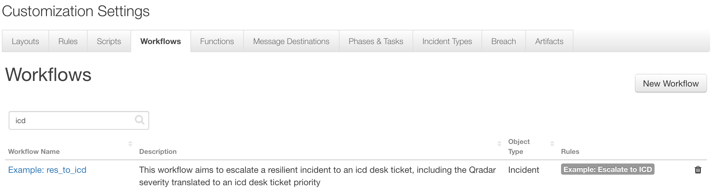
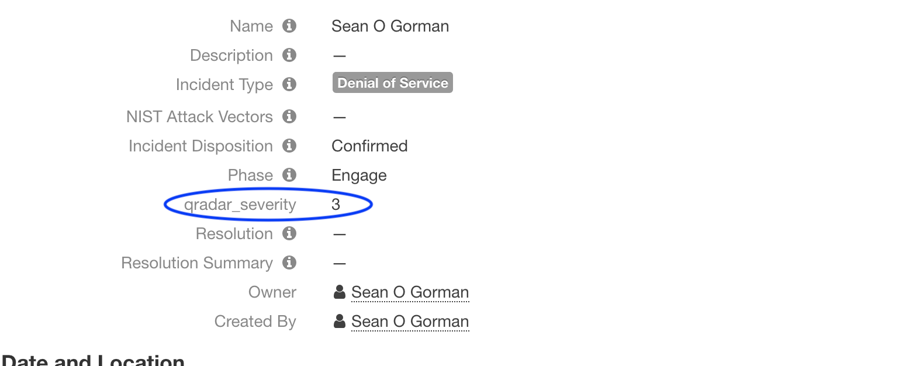

# fn-res-to-icd: ICD Ticket Escalation from IBM Resilient

- [Release Notes](#release-notes)
- [Overview](#overview)
- [Requirements](#requirements)
- [Installation](#installation)
- [Uninstall](#uninstall)
- [Troubleshooting](#troubleshooting)
- [Support](#support)

---

## Release Notes
<!--
  Specify all changes in this release. Do not remove the release 
  notes of a previous release
-->
### v1.0.0
* Initial Release

---

## Overview

**Resilient Circuits Components for 'fn_res_to_icd'**

 

Resilient Circuits Components for 'fn_res_to_icd'

---

## Requirements

* IBM Resilient >= `v31.0.4254`
* An Integration Server running `resilient_circuits>=30.0.0`
  * To setup an Integration Server see: [ibm.biz/res-int-server-guide](https://ibm.biz/res-int-server-guide)
* `resilient-lib>=32.0.140`
* `beautifulsoup4>=4.7.1`

---

## Installation
* Download the `fn_res_to_icd.zip`.
* Copy the `.zip` to your Integration Server and SSH into it.
* **Unzip** the package:
  ```
  $ unzip fn_res_to_icd-x.x.x.zip
  ```
* **Change Directory** into the unzipped directory:
  ```
  $ cd fn_res_to_icd-x.x.x
  ```
* **Install** the package:
  ```
  $ pip install fn_res_to_icd-x.x.x.tar.gz
  ```
* Import the **configurations** into your app.config file:
  ```
  $ resilient-circuits config -u
  ```
* Import the fn_res_to_icd **customizations** into the Resilient platform:
  ```
  $ resilient-circuits customize -y -l fn-res-to-icd
  ```
* Open the config file, scroll to the bottom and edit your fn_res_to_icd configurations:
  ```
  $ nano ~/.resilient/app.config
  ```
  | Config | Required | Example | Description |
  | ------ | :------: | ------- | ----------- |
  | **icd_email** | Yes | `<YOUR ICD EMAIL>` | *email for ICD Platform* |
  | **icd_pass** | Yes | `<YOUR ICD PASSWORD>` | *password for ICD Platform* |
  | **icd_field_severity** | Yes | `custom_severity` | *custom UI severity value* |
  | **icd_priority** | Yes | `<1-4>` | *ICD Platform ticket priority* |
  | **icd_url** | Yes | `https://icdaas.sccd.ibmserviceengage.com/maximo_cbs-dev2` | *ICD Platform URL* |

A custom field can be specified (qradar_severity in this case) in the UI that can correspond to the icd_severity_value:



* **Save** and **Close** the app.config file.
* [Optional]: Run selftest to test the Integration you configured:
  ```
  $ resilient-circuits selftest -l fn-res-to-icd
  ```
* **Run** resilient-circuits or restart the Service on Windows/Linux:
  ```
  $ resilient-circuits run
  ```

---
## Uninstall
* SSH into your Integration Server.
* **Uninstall** the package:
  ```
  $ pip uninstall fn-res-to-icd
  ```
* Open the config file, scroll to the [fn_res_to_icd] section and remove the section or prefix `#` to comment out the section.
* **Save** and **Close** the app.config file.

---

## Troubleshooting
There are several ways to verify the successful operation of a function.

### Resilient Action Status
* When viewing an incident, use the Actions menu to view **Action Status**.
* By default, pending and errors are displayed.
* Modify the filter for actions to also show Completed actions.
* Clicking on an action displays additional information on the progress made or what error occurred.

### Resilient Scripting Log
* A separate log file is available to review scripting errors.
* This is useful when issues occur in the pre-processing or post-processing scripts.
* The default location for this log file is: `/var/log/resilient-scripting/resilient-scripting.log`.

### Resilient Logs
* By default, Resilient logs are retained at `/usr/share/co3/logs`.
* The `client.log` may contain additional information regarding the execution of functions.

### Resilient-Circuits
* The log is controlled in the `.resilient/app.config` file under the section [resilient] and the property `logdir`.
* The default file name is `app.log`.
* Each function will create progress information.
* Failures will show up as errors and may contain python trace statements.

---

## Support
| Name | Version | Author | Support URL |
| ---- | ------- | ------ | ----------- |
| fn_res_to_icd | 1.0.0 | Resilient Labs | https://github.com/ibmresilient/resilient-community-apps |