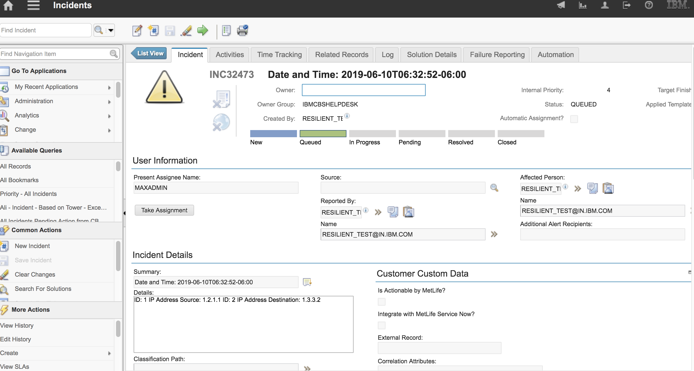

# fn-res-to-icd: ICD tickets generated from IBM Resilient

- [Release Notes](#release-notes)
- [Overview](#overview)
- [Requirements](#requirements)
- [Installation](#installation)
- [Uninstall](#uninstall)
- [Troubleshooting](#troubleshooting)
- [Support](#support)
- [Function - Escalate Resilient incident to ICD dashboard](#function---res-to-icd-function)
- [Workflow - Example: res-to-icd](#workflow---Example:-res-to-icd)

## Release Notes
<!--
  Specify all changes in this release. Do not remove the release 
  notes of a previous release
-->
### v1.0.0
* Initial Release

## Overview
<!--
  Provide a high-level description of the function itself and its remote software or application.
  The text below is parsed from the "description" and "long_description" attributes in the setup.py file
-->
**Resilient Circuits Components to Integrate with the ICD Platform**

This community app allows for the escalation of a Resilient incident to the ICD dashboard via a manual rule. A word document is attached which explains the mapping of resilient fields to the icd ticket fields for specific use cases. If the icd_field_severity or icd_priority is not defined, the INTERNAL PRIORITY on icd desk (4) will be set on the escalated ticket corresponding to that resilient incident. IP Sources or Destination Artifacts will be automatically added to the icd ticket if the icd_field_severity is not None (or a negative number) in the app config settings.

**This package contains 1 Function, 1 Workflow, and 1 Manual Rule (at the resilient incident level) that helps you to escalate a resilient incident to an icd ticket**

---
## Requirements
<!--
  List any Requirements 
-->
* IBM Resilient >= `v31.0.4254`
* An Integration Server running `resilient_circuits>=30.0.0`
  * To setup an Integration Server see: [ibm.biz/res-int-server-guide](https://ibm.biz/res-int-server-guide)
* `resilient-lib>32.0.140`
* beautifulsoup4 >= `4.7.1`

---
## Installation

* To install the package,

`pip install dist/fn-res-to-icd-x.x.x.tar.gz`

To install in "development mode"

`pip install -e ./fn_res_to_icd/`

Please create (or update) the config settings via:

`resilient-circuits config -c [-u]`

Default settings in your app.config file:

```bash
[fn_res_to_icd]
icd_email=<YOUR ICD EMAIL>
icd_pass=<YOUR ICD PASSWORD>
icd_severity_value=custom_severity
icd_priority=<1-4>
icd_url=https://icdaas.sccd.ibmserviceengage.com/maximo_cbs-dev2
```

Customize with:

`resilient-circuits customize`

After installation, the package will be loaded by `resilient-circuits run`.

---

## Config settings

A custom field can be specified (qradar_severity in this case) in the UI that can correspond to the icd_severity_value:


* **Save** and **Close** the app.config file.
* [Optional]: Run selftest to test the Integration you configured:
  ```
  $ resilient-circuits selftest -l fn-res-to-icd 
  ```
This verifies that input credentials to icd dashboard are valid via an api call. A failing test here indicate that credentials are invalid or the endpoint is down.
* **Run** resilient-circuits or restart the Service on Windows/Linux:
  ```
  $ resilient-circuits run
  ```

---
## Uninstall
* SSH into your Integration Server.
* **Uninstall** the package:
  ```
  $ pip uninstall fn-res-to-icd
  ```
* Open the config file, scroll to the `[fn_res_to_icd]` section and remove the section or prefix `#` to comment out the section.
* **Save** and **Close** the app.config file.

---
## Troubleshooting
There are several ways to verify the successful operation of a function.

### Resilient Action Status
* When viewing an incident, use the Actions menu to view **Action Status**.
* By default, pending and errors are displayed.
* Modify the filter for actions to also show Completed actions.
* Clicking on an action displays additional information on the progress made or what error occurred.

### Resilient Scripting Log
* A separate log file is available to review scripting errors.
* This is useful when issues occur in the pre-processing or post-processing scripts.
* The default location for this log file is: `/var/log/resilient-scripting/resilient-scripting.log`.

### Resilient Logs
* By default, Resilient logs are retained at `/usr/share/co3/logs`.
* The `client.log` may contain additional information regarding the execution of functions.

### Resilient-Circuits
* The log is controlled in the `.resilient/app.config` file under the section [resilient] and the property `logdir`.
* The default file name is `app.log`.
* Each function will create progress information.
* Failures will show up as errors and may contain python trace statements.

## res-to-icd-function


## Example: res-to-icd


An incident on the resilient can be escalated to the icd desk by running the "Escalate to ICD" manual rule. An example incident is displayed below:


When the manual rule is pressed, a correpsponding ticket will be created on the ICD dashboard:

