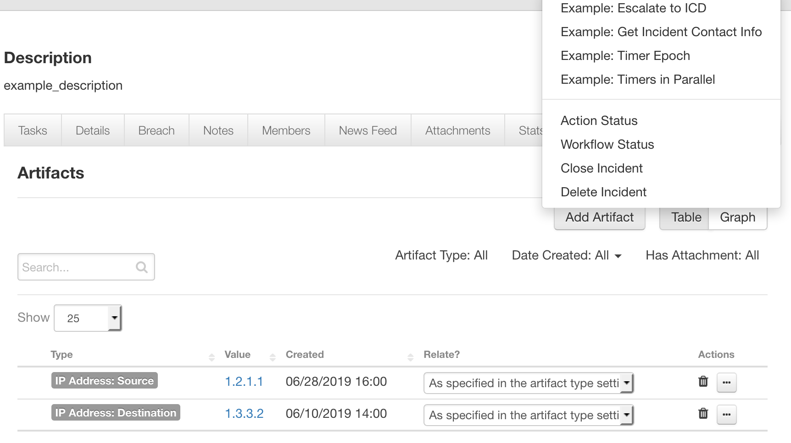

# Escalation of resilient incidents to ICD ticket for IBM Resilient

This community app allows for the escalation of a incident from resilient to the icd desk, via a manual rule on each incident. A word document is attached which explains the mapping of resilient fields to the icd ticket fields for specific use cases, this integration is full customizable. If the custom qradar_severity field is not defined, the INTERNAL PRIORITY on icd desk (4) will can be set in the app config. IP Sources or Destination Artifacts will be automatically added to the icd ticket if the icd_qradar_severity is set to true in the app config settings.

To install the package,

`pip install dist/fn-res-to-icd-1.0.0.tar.gz`

To install in "development mode"

`pip install -e ./fn_res_to_icd/`

Please update the config settings via:

`resilient-circuits config -c [-u]`

Customize with:

`resilient-circuits customize` 

After installation, the package will be loaded by `resilient-circuits run`.

## Table of Contents
  - [Function - Escalate incident to icd dashboard](#function---res-to-icd-function)

---

**This package contains 1 Function, 1 Workflow, and 1 Manual Rule (at the resilient incident level) that helps you to escalate a resilient incident to an icd ticket**

 

* res-to-icd-function: gives you the ability to escalate the incident from resilient to icd

# res-to-icd-function
## Config settings and prerequisites
Package dependencies are included, import errors between python 2 and 3 are handled.

```
[fn_res_to_icd]
icd_email=<YOUR ICD EMAIL>
icd_pass=<YOUR ICD PASSWORD>
icd_qradar_severity=<True or False>
icd_priority=<1-4>
```

As a further testing of credentials, the developer may run command:

"resilient-circuits selftest"

To verify that input credentials to icd dashboard are valid via an api call.



