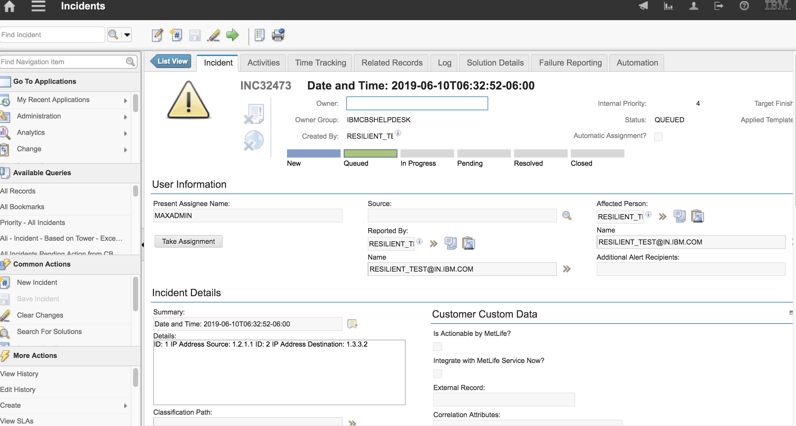

<!--
  This User README.md is generated by running:
  "resilient-circuits docgen -p fn_res_to_icd --only-user-guide"

  It is best edited using a Text Editor with a Markdown Previewer. VS Code
  is a good example. Checkout https://guides.github.com/features/mastering-markdown/
  for tips on writing with Markdown

  If you make manual edits and run docgen again, a .bak file will be created

  Store any screenshots in the "doc/screenshots" directory and reference them like:
  
-->

# **User Guide:** fn_res_to_icd_v1.0.0

## Table of Contents

- [Key Features](#key-features)
- [Function - res_to_icd_function](#function---restoicdfunction)
- [Rules](#rules)

---

## Key Features

<!--
  List the Key Features of the Integration
-->

* Escalates a Resilient incident to the ICD Platform
* If custom severity is specified, populates IP Artifacts to ICD description field

---

<details><summary>Inputs:</summary>
<p>

| Name | Type | Required | Example | Tooltip |
| ---- | :--: | :------: | ------- | ------- |
| `incident_id` | `number` | Yes | `2095` | incident_id for function actions |

</p>
</details>

<details><summary>Outputs:</summary>
<p>

```python
Result: {'version': '1.0', 'success': True, 'reason': None, 'content': {'incident_escalated': 2095, 'icd_id': 'INC32759', 'details': 'ID: 75 IP Address Source: 1.2.1.1 \n'}, 'raw': '{"incident_escalated": 2095, "icd_id": "INC32759", "details": "ID: 75 IP Address Source: 1.2.1.1 \\n"}', 'inputs': {'incident_id': 2095}, 'metrics': {'version': '1.0', 'package': 'fn-res-to-icd', 'package_version': '1.0.0', 'host': 'seanogomcomsmbp.galway.ie.ibm.com', 'execution_time_ms': 6243, 'timestamp': '2019-07-05 12:51:10'}}
```

</p>
</details>

<details><summary>Example Pre-Process Script:</summary>
<p>

```python
inputs.incident_id=incident.id
```

</p>
</details>

<details><summary>Example Post-Process Script:</summary>
<p>

```python
if results.success:
  note_text ="{0} has been added to icd desk priority with icd_id {1}".format(incident.id,results.icd_id)
  incident.addNote(helper.createPlainText(note_text))
else:
  note_text = "Error adding custom severity {}".format(incident.value)
  incident.addNote(helper.createPlainText(note_text))
```

</p>
</details>

---

## Function - res_to_icd_function

This function transfers a resilient with a custom severity (1-10) to an icd ticket with a priority (4-1)

 


An incident on the resilient can be escalated to the icd desk by running the "Escalate to ICD" manual rule. An example incident is displayed below:


When the manual rule is pressed, a correpsponding ticket will be created on the ICD dashboard:


## Rules

| Rule Name | Object | Workflow Triggered |
| --------- | ------ | ------------------ |
| Example: Escalate to ICD | incident | `example_res_to_icd` |

---

<!--
## Inform Resilient Users
  Use this section to optionally provide additional information so that Resilient playbook 
  designer can get the maximum benefit of your integration.
-->