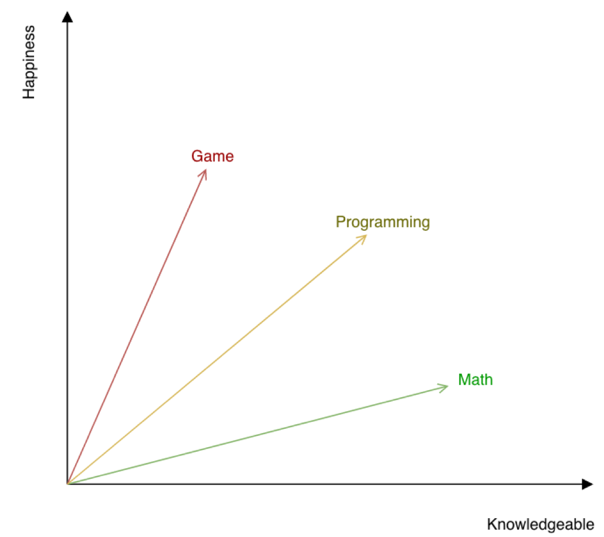
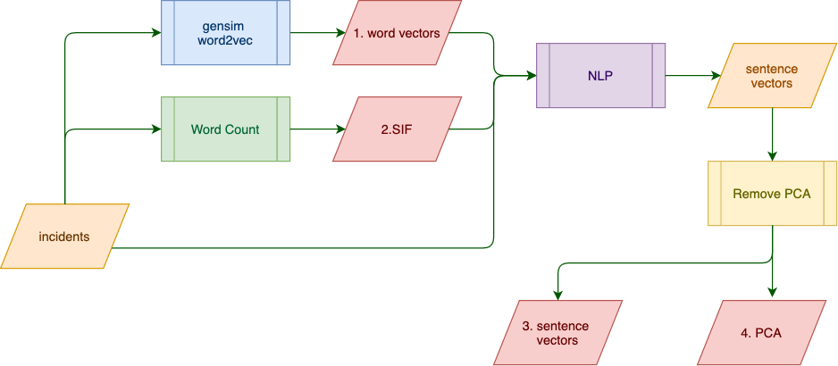
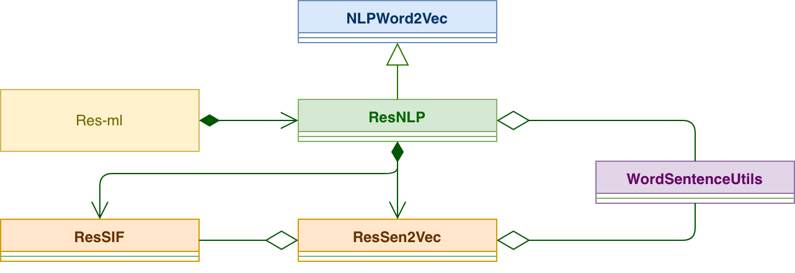
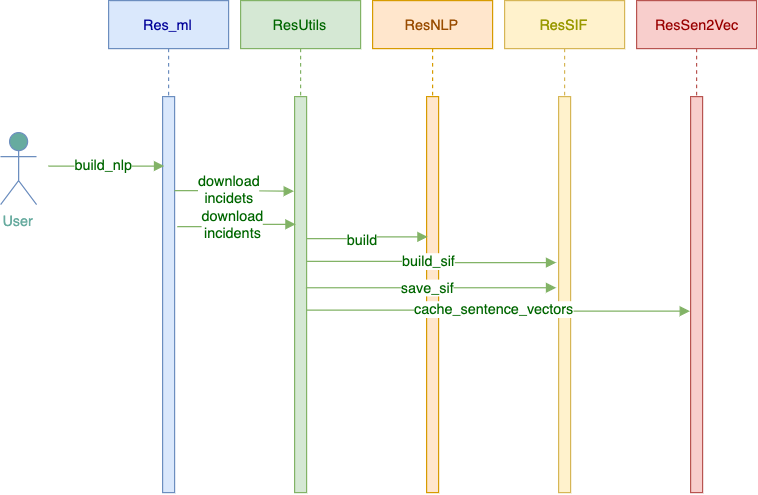
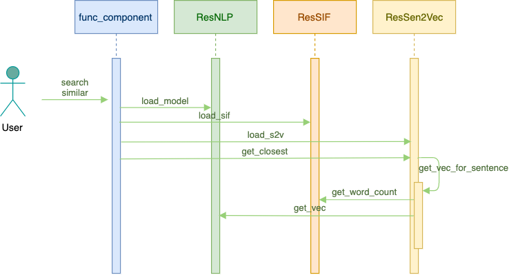

# Resilient NLP integration Design
NLP integration uses Nature Language Processing (NLP) to digest incident data, and
provide advanced predictions of incident relationships.

## NLP
To obtained the relationship among incident, NLP model is used to process textual information
of incidents, including the followings:
* name
* description 
* resolution summary 
* artifact descriptions
The goal is to find similar incidents based on the above information.

In order to find relationship between textual information, one approach is to find relationship 
between individual words first. This NLP integration uses a python package called 
gensim word2vec to do so. 

### Word Embedding
Gensim word2vec represents each word used in the dataset as a multi-dimensional vector. This is also
called word embedding. Here the dataset is the textual information of all the incidents. This is the
dataset being used to train the word2vec model.

From the dataset, the word2vec model looks for the likelihood that words co-occur. Using this information,
the model can convert each word in to a vector such that similar words would stay close to 
each other. It is a two-layer neural network model, which is not so computationally expensive. 

To understand how a word can be represented by a vector, it might be helpful to imagine that each dimension of the 
vector space represents something meaningful and understandable. 

   
In reality, a dimension used by a word2vec is in general a combination of several meaningful features 
human being can understand. 

In summary, word2vec can convert words into a multidimensional vector. Similar words stay close to each
other. 

### Sentence similarity
Word2vec can find out the similarity between words. But how about sentences?

First of all, the similarity between two words is computed by the dot product of those two
corresponding vectors. 

A simple approach is to represent a sentence using the sum of the vectors of all the words. It turns 
out this simple approach can give useful results, with small enhancements, according to this [research
result](https://openreview.net/pdf?id=SyK00v5xx) from Princeton University.

The enhancements includes:
* Use Smooth Inverse Frequency (SIF) to lower down the contribution of common words
* Remove the principle component of each vector

#### SIF
When word vectors are summed up, a weight factor is assigned to each word. 
```
a/(a+wc)
```
Here a is a small number (10^(-4)), wc is the word count. The bigger the word count, the smaller
the weight factor. To understand this, imagine a word appears in all samples (incidents), then this
word is not useful at all in distinguishing different incidents. Thus higher word count means lower
contribution.

#### Remove PCA
According to the research of the above paper, the vectors for sentences obtained by summing word vectors
all share a common principle component (vector), due to shared common words. By removing this common component,
this model can give more accurate result.

In summary, the steps to build this NLP model can be summarized in the following data flow
diagram:


* The raw data (incidents) is used as training dataset to build a gensim word2vec model. The result is saved into
a .txt file. By default, this file is named resilient-w2v.txt.
* The raw data is used to get word count. The data is saved into a file called resilient-sif.pkl. 
* The raw data and the above generated data are used to get sentence vectors
* PCA is then computed using the sentence vectors. PCA data is saved into resilient-pca.json.
* PCA is removed from each sentence vector, and all sentence vectors are saved into resilient-vec.json.

Later on, to find similar incidents given a new one, we need to use all those four files saved above.
* Use the resilient-w2v.txt file to find the vector for each word of the new incident
* Use the resilient-sif.pkl file to find the weight factor for each word
* Sum up the word vector to get the sentence vector
* Remove PCA vector (saved in resilient-pca.json) from the sentence vector above
* Compute the dot product of this new sentence vector and each sentence vector saved in resilient-vec.json
* Find the top ones

## Classes
UML class diagram:



### Res-ml
Command line script to build a NLP model. It instantiates a ResNLP object to do so.

### NLPWord2Vec
NLP base class encapsulates gensim word2vec for a NLP model

### ResSIF
Compute word counts for dataset. Used in Smooth Inverse Frequency (SIF)
calculation

### ResSen2Vec
Compute a vector an input sentence, using word2vec and SIF

### ResNLP
ResNLP extends NLPWord2Vec. Implements logic to preprocess incident data.

## Sequences
Two major processes, namely building a NLP model and searching using a
NLP model
### Build a   NLP model


### Search
