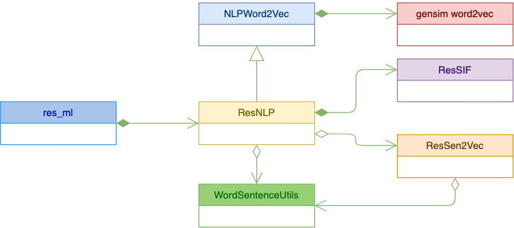

# Resilient NLP integration Design
NLP integration uses Nature Language Processing (NLP) to digest incident data, and
provide advanced predictions of incident relationships.

## NLP
To obtained the relationship among incident, NLP model is used to process textual information
of incidents, including the followings:
* name
* description 
* resolution summary 
* artifact descriptions
The goal is to find similar incidents based on the above information.

In order to find relationship between textual information, one approach is to find relationship 
between individual words first. This NLP integration uses a python package called 
gensim word2vec to do so. 

### Word Embedding
Gensim word2vec represents each word used in the dataset as a multi-dimensional vector. This is also
called word embedding. Here the dataset is the textual information of all the incidents. This is the
dataset being used to train the word2vec model.

From the dataset, the word2vec model looks for the likelihood that words co-occur. Using this information,
the model can convert each word in to a vector such that similar words would stay close to 
each other. It is a two-layer neural network model, which is not so computationally expensive. 

To understand how a word can be represented by a vector, it might be helpful to imagine that each dimension of the 
vector space represents something meaningful and understandable. 

   
In reality, a dimension used by a word2vec is in general a combination of several meaningful features 
human being can understand. 

In summary, word2vec can convert words into a multidimensional vector. Similar words stay close to each
other. 

### Sentence similarity
Word2vec can find out the similarity between words. But how about sentences?

First of all, the similarity between two words is computed by the dot product of those two
corresponding vectors. 

A simple approach is to represent a sentence using the sum of the vectors of all the words. It turns 
out this simple approach can give useful results, with small enhancements, according to this [research
result](https://openreview.net/pdf?id=SyK00v5xx) from Princeton University.

The enhancements includes:
* Use Smooth Inverse Frequency (SIF) to lower down the contribution of common words
* Remove the principle component of each vector

#### SIF
When word vectors are summed up, a weight factor is assigned to each word. 
```
a/(a+wc)
```
Here a is a small number (10^(-4)), wc is the word count. The bigger the word count, the smaller
the weight factor. To understand this, imagine a word appears in all samples (incidents), then this
word is not useful at all in distinguishing different incidents. Thus higher word count means lower
contribution.

#### Remove PCA
According to the research of the above paper, the vectors for sentences obtained by summing word vectors
all share a common principle component (vector), due to shared common words. By removing this common component,
this model can give more accurate result.

### NLP summary
In summary, the steps to build this NLP model can be summarized in the following data flow
diagram:


* The raw data (incidents) is used as training dataset to build a gensim word2vec model. The result is saved into
a .txt file. By default, this file is named resilient-w2v.txt.
* The raw data is used to get word count. The data is saved into a file called resilient-sif.pkl. 
* The raw data and the above generated data are used to get sentence vectors
* PCA is then computed using the sentence vectors. PCA data is saved into resilient-pca.json.
* PCA is removed from each sentence vector, and all sentence vectors are saved into resilient-vec.json.

Later on, to find similar incidents given a new one, we need to use all those four files saved above.
* Use the resilient-w2v.txt file to find the vector for each word of the new incident
* Use the resilient-sif.pkl file to find the weight factor for each word
* Sum up the word vector to get the sentence vector
* Remove PCA vector (saved in resilient-pca.json) from the sentence vector above
* Compute the dot product of this new sentence vector and each sentence vector saved in resilient-vec.json
* Find the top ones

## Classes
UML class diagram:



### Res_ml
Command line script to build a NLP model. It instantiates a ResNLP object to do so. It provides two subcommands

#### build_nlp
This subcommand is used to build a NLP model. It calls ResUtils functions to download
incidents and artifacts. Then save them into resilient-incidents.csv and resilient-artifacts.json.

Then it calls ResNLP to build a NLP model. A NLP model is saved as 4 files, as mentioned in the
above data flow diagram:
* resilient-w2v.txt: word2vec model in text format. It is basically a word-vec dictionary.
* resilient-sif.pkl: word count in python pickle format. It is a word-count dictinary.
* resilient-vec.json: vectors for all (old) incidents. 
* resilient-pca.json: PCA vector.
 
At the end, it removes the saved incident and artifact files.

#### view
This subcommand can show summary information of an input file. An input file here must
be one of those four files listed above. 

### ResNLP
ResNLP extends NLPWord2Vec. Implements logic to preprocess incident data. Several
important methods of this class are listed below.

#### load_data
This method loads the incident and artifact data from files. Note these are the input
data used to build the NLP model.

#### preprocess_data
In the method, the input data is pre-processed. First, for an incident, textual data 
is concatenated together. Then WordSentenceUtil is used to extract a list of words for each 
incident.

#### build
This method builds the word2vec model and the SIF word count.

It calls the build_model of its superclass to build the word2vec model.

#### save
This method saves the model into files.

### NLPWord2Vec
NLP base class encapsulates gensim word2vec for a NLP model. It is a super class
of ResNLP.

#### build_model
This is the standard process of building aword2vec model.

#### get_word_vec
Once a word2vec model is built, this method can provide the vector for a given word. 

### ResSIF
Compute word counts for dataset. Used in Smooth Inverse Frequency (SIF)
calculation.

#### build_sif
Build the word count for a given dataset. Here a dataset is a list of list of words. 
Each incident is represented as a list of words. Therefore, a list of incidents becomes
a list of list of words.

Word count is stored in a dictionary of word-count pairs.

#### save_sif
Save SIF into a file.

#### load_sif
Load SIF from a file.

#### get_word_count
Returns the count of a given word.

### ResSen2Vec
Compute a vector an input sentence, using word2vec and SIF

#### get_vec_for_words
For a given list of words, computes and returns the vector.

It uses the ResNLP to figure out the vector for each word, uses 
the ResSIF to figure out the contribution weight factor. Then
it sums up the vectors. 

#### get_vec_for_sentence
For a given sentence, it calls WordSsentenceUtils to extract a list 
of words from it. Then it calls its get_vec_for_words to get the
corresponding vector.  

#### remove_pca
Once we get the vectors for all the (old) incidents, we can compute the PCA
for them. 

Then this method removes the PCA from each vector. It also saves the PCA for later
use.


### cache_sentence_vectors
This method takes the incident data (a list of list of words), and compute
the vectors. Then it calls remove_pca to remove/save PCA. Then it saves the 
vectors. 

#### get_closeset
This the the main methods to get the similar incidents. 

Inupts:
* sentence: Description of the newly created incident.
* num: How many similar incidents to return
* other incidents: Important here. When a NLP model is built, vectors are computed/saved for each incident
created so far. Later on, the NLP model is used to do a search. But there is a time gap between
when the model is built, and when the model is used to do a search. Incidents could
have been created within this time period. These incidents are not in saved vector file. 
We need download them separately, and input them here.
* search_inc_id: Incident ID of the newly created incident. Because the newly created incident
is created after the model is built, so it is included in the "other incident". Because it is very similar
to itself, its similarity is very high. We want to exclude this from the return. 

#### find_key_words
A general problem of ML and NLP is that sometimes why a model makes a certain decision is quite opaque.
For our case here, why a model picks one incident as a similar one instead of another is not always very clear.

This method tries to get some insights. Remember that the vector for an incident is computed as sum of word
vectors. When NLP concludes a newly created incident (call it incident a here) is similar to an old incident( call it incident b),
we want to know which words in incident a make the biggest contribution. 

To do so, we compute the similarity between incident b and each word of incident a. It is basically the dot product
between a sentence vector and a word vector. Those top ones contribute the most to the overall similarity, and they
can be considered as the keywords being used in the search for similar incidents. 

### WordSentenceUtils
This is a collection of utility functions. 

### get_words 
This method extracts useful words from a given sentence. It does the followings:
* It uses BeautifulSoup to remove html tags
* It removes unwanted chars like "," ".", etc
* It uses NLTK to remove normal English stop words. We can see, the current resilient NLP only handles English
* It uses NLTK WordNetLemmatizer to return a word to its base form, such as from "went" to "go". 

## Sequence Diagrams
Two major processes, namely building a NLP model and searching using a
NLP model
### Build a   NLP model


### Search
