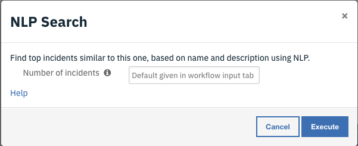
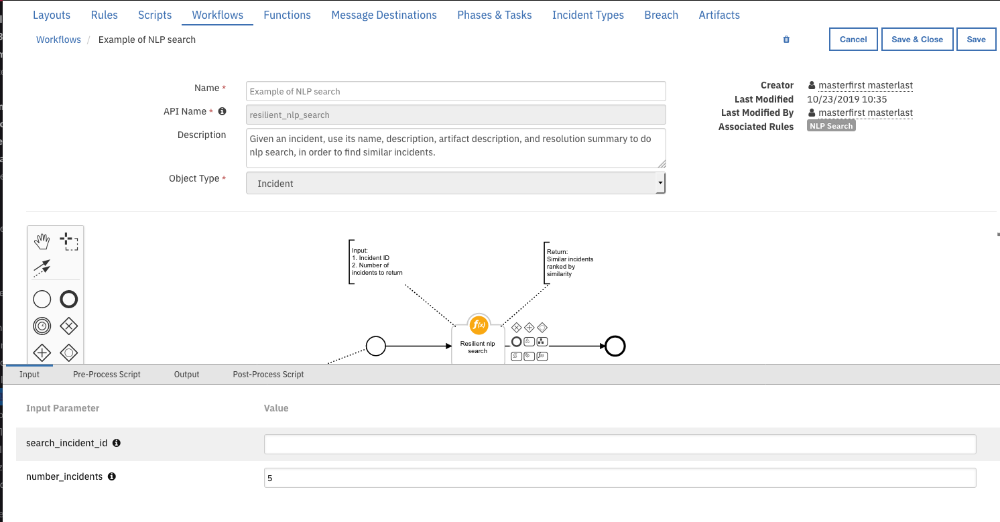

# Resilient NLP Search Help

Resilient NLP Search uses [word2vec](https://radimrehurek.com/gensim/auto_examples/tutorials/run_word2vec.html#sphx-glr-auto-examples-tutorials-run-word2vec-py|word2vec)
and [SIF](https://openreview.net/pdf?id=SyK00v5xx) to find similar incidents.

## Usage

### Build a NLP model

### Do a search
NLP can rank incidents by computing similarity. Specify how many top
incidents to return by the search, or leave it empty to use default
value.

To change the default number of incidents to return value, go to
Customization Settings->Workflows->"Example of NLP search". Click
the "Resilient NLP search" icon and select edit (the pen icon). In the
Input tab, change number_incidents to new default value. Then click
Save & Close.

### Rebuild a NLP model
NLP model needs to be rebuilt periodically when more incidents are available.

## Background information
### word2vec
### SIF

## FAQ

