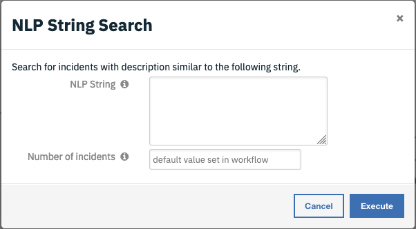

# Resilient NLP Search Help

Resilient NLP Search uses [word2vec](https://radimrehurek.com/gensim/auto_examples/tutorials/run_word2vec.html#sphx-glr-auto-examples-tutorials-run-word2vec-py|word2vec), [SIF, and PCA](https://openreview.net/pdf?id=SyK00v5xx) to find similar incidents.

## Usage

### Build a NLP model
From a command line window of the integration server, make sure app.config has been
created properly. Then
```
res-ml build_nlp
```
This will download the incidents and artifacts, and train a NLP
model.

### Do a search
NLP can rank incidents by similarity. Specify how many top
incidents to return by the search, or leave it empty to use default
value.

Select an incident, then click Actions


There are two NLP searches available.

#### NLP Search
This one uses the description of the selected incident to do NLP search. 

Note: for 0 or negative values, default number of incidents will be returned


To change the default number of incidents to return value, go to
Customization Settings->Workflows->"Example of NLP search". Click
the "Resilient NLP search" icon and select edit (the pen icon). In the
Input tab, change number_incidents to new default value. Then click
Save & Close.


#### NLP String Search
This one allows users to fine-tune the string they want to use for the search. 
A use case is the following. Sometimes the description of an incident might contain
some irrelevant data. If users know which portion of the whole description is more
important/relevant, they can input this portion to do the NLP string search.



Users can specify how many similar incident to return here as well.

### Rebuild a NLP model
NLP model needs to be rebuilt periodically when more incidents are available.
Refer to the section about for building a NLP model. In general, users can rebuild the model once 
a week.

## Background information
Resilient NLP model uses [gensim word2vec](https://radimrehurek.com/gensim/models/word2vec.html) and 
SIF to compute similarity, based on the [research result](https://openreview.net/pdf?id=SyK00v5xxv) of 
Princeton University.

### word2vec
[Gensim word2vec](https://radimrehurek.com/gensim/models/word2vec.html) represents each word used 
in the dataset as a multi-dimensional vector. This is also
called word embeddings. Here the dataset is the textual information of all the incidents. This is the
dataset being used to train the word2vec model. Note that this is an unsupervised learning model, so
there is no need to split the dataset into training and testing. The whole set is used for training.

From the dataset, the word2vec model looks for the likelihood that words co-occur in proximity. 
Using this information,
the model can convert each word in to a vector such that similar words would stay close to 
each other. This is a two-layer neural network model, which is not so computationally expensive. 

Users specify how many features (the number of dimensions of the vector space) to use. By default, 
the Resilient NLP uses 50 features. Users can change this default value in app.config.

n summary, word2vec can convert words into multidimensional vectors. Similar words stay close to each
other. Similarity between words can then be defined as dot product of the corresponding vectors.

### Sentence similarity 
To jump from word similarity to sentence similarity, the [research result](https://openreview.net/pdf?id=SyK00v5xxv)
is used. 

#### SIF
Basically a weight factor is assigned to each word vector when word vectors are summed up to get the
sentence vector. The weight factor is
```a/(a+wc)```
Here ```a``` is a very small constant, and ```wc``` is the word count of the corresponding word. 

#### PCA
As recommended by the Princeton research, once sentence vectors are obtained, the principle component
of all the sentence vectors will be computed, using PCA. Then it will be removed from each sentence
vectors. It will be saved to a file as well.

## FAQ

* How is a model saved?

    A model is saved as 4 files:
    * resilient-w2v.txt: This is the word2vec model saved in text format
    * resilient-sif.pkl: This is the word count for SIF.
    * resilient-pca.json: This is the PCA for principle component
    * resilient-vec.json: This is the saved sentence vectors
* How can this integration find the saved model?
    
    This is done in app.config. Put the absolute path to the folder there.
    ```
    [fn_resilient_ml]
     model_path=
    ```
