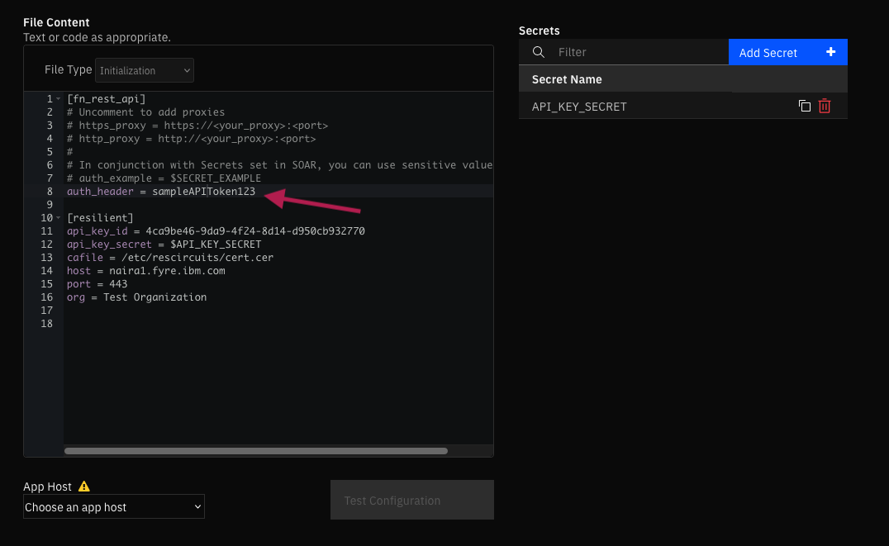

# REST API Functions for SOAR

## Table of Contents
- [REST API Functions for SOAR](#rest-api-functions-for-soar)
  - [Table of Contents](#table-of-contents)
  - [Release Notes](#release-notes)
  - [Overview](#overview)
    - [Key Features](#key-features)
  - [Requirements](#requirements)
    - [SOAR platform](#soar-platform)
    - [Cloud Pak for Security](#cloud-pak-for-security)
    - [Proxy Server](#proxy-server)
    - [Python Environment](#python-environment)
  - [Installation](#installation)
  - [Function - REST API](#function---rest-api)
  - [Input Considerations](#input-considerations)
    - [Sensitive information using APP Secrets](#sensitive-information-using-app-secrets)
    - [Input Format](#input-format)
    - [1. New-line separated (Legacy)](#1-new-line-separated-legacy)
      - [Note:](#note)
      - [Example:](#example)
    - [2. JSON format:](#2-json-format)
      - [Example:](#example-1)
    - [Hint:](#hint)
      - [Example:](#example-2)
  - [Playbooks](#playbooks)
  - [Troubleshooting \& Support](#troubleshooting--support)
    - [For Support](#for-support)

---

## Release Notes
| Version | Date | Notes |
| ------- | ---- | ----- |
| 1.0.0 | 05/2023 | Initial Release |

---

## Overview
<p align="center">

</p>

**Function to call REST web services in the SOAR Platform**

The purpose of this function is to enable the ability to connect with external web services by sending REST API requests. The function supports commonly used REST methods such as GET, HEAD, POST, PUT, DELETE, OPTIONS, and PATCH. The specific details of the request, such as the type of request, URL, and other options like headers, cookies, and the request body, can be specified through the function parameters. Once a response is received from the service, it is presented in both text and JSON format. Additionally, other details about the response, such as the response status code, reason, cookies, headers, time elapsed, and links, are also provided.


### Key Features
* Make REST API requests to external web services.
* Request body, headers and cookies now support complex structures just as nested key-value pairs and lists by JSON format.
* Response is returned in both JSON and text format.
* Ability to substitute sensitive information that are specified in the inputs for values that are in the app.config.

---

## Requirements

This app supports the IBM Security QRadar SOAR Platform and the IBM Security QRadar SOAR for IBM Cloud Pak for Security.

### SOAR platform
The SOAR platform supports two app deployment mechanisms, Edge Gateway (formerly App Host) and integration server.

If deploying to a SOAR platform with an Edge Gateway, the requirements are:
* SOAR platform >= `46.0`.
* The app is in a container-based format (available from the AppExchange as a `zip` file).

If deploying to a SOAR platform with an integration server, the requirements are:
* SOAR platform >= `46.0`.
* The app is in the older integration format (available from the AppExchange as a `zip` file which contains a `tar.gz` file).
* Integration server is running `resilient-circuits>=48.1`.
* If using an API key account, make sure the account provides the following minimum permissions: 
  | Name | Permissions |
  | ---- | ----------- |
  | Org Data | Read |
  | Function | Read |

The following SOAR platform guides provide additional information: 
* _Edge Gateway Deployment Guide_ or _App Host Deployment Guide_: provides installation, configuration, and troubleshooting information, including proxy server settings. 
* _Integration Server Guide_: provides installation, configuration, and troubleshooting information, including proxy server settings.
* _System Administrator Guide_: provides the procedure to install, configure and deploy apps. 

The above guides are available on the IBM Documentation website at [ibm.biz/soar-docs](https://ibm.biz/soar-docs). On this web page, select your SOAR platform version. On the follow-on page, you can find the _Edge Gateway Deployment Guide_, _App Host Deployment Guide_, or _Integration Server Guide_ by expanding **Apps** in the Table of Contents pane. The System Administrator Guide is available by expanding **System Administrator**.

### Cloud Pak for Security
If you are deploying to IBM Cloud Pak for Security, the requirements are:
* IBM Cloud Pak for Security >= `1.10`.
* Cloud Pak is configured with an Edge Gateway.
* The app is in a container-based format (available from the AppExchange as a `zip` file).

The following Cloud Pak guides provide additional information: 
* _Edge Gateway Deployment Guide_ or _App Host Deployment Guide_: provides installation, configuration, and troubleshooting information, including proxy server settings. From the Table of Contents, select Case Management and Orchestration & Automation > **Orchestration and Automation Apps**.
* _System Administrator Guide_: provides information to install, configure, and deploy apps. From the IBM Cloud Pak for Security IBM Documentation table of contents, select Case Management and Orchestration & Automation > **System administrator**.

These guides are available on the IBM Documentation website at [ibm.biz/cp4s-docs](https://ibm.biz/cp4s-docs). From this web page, select your IBM Cloud Pak for Security version. From the version-specific IBM Documentation page, select Case Management and Orchestration & Automation.

### Proxy Server
The app does support a proxy server.

### Python Environment
Python 3.6 and Python 3.9 are supported.
Additional package dependencies may exist for each of these packages:
* resilient-circuits>=48.1.0

---

## Installation

* To install or uninstall an App or Integration on the _SOAR platform_, see the documentation at [ibm.biz/soar-docs](https://ibm.biz/soar-docs).
* To install or uninstall an App on _IBM Cloud Pak for Security_, see the documentation at [ibm.biz/cp4s-docs](https://ibm.biz/cp4s-docs) and follow the instructions above to navigate to Orchestration and Automation.


---

## Function - REST API

This function calls a REST web service. It supports the standard REST methods: GET, HEAD, POST, PUT, DELETE, PATCH and OPTIONS. The function parameters determine the type of call, the URL, and optionally the headers and body. The results include the text or structured (JSON) result from the web service, and additional information including the elapsed time.

<p align="center">

</p>

## Input Considerations

### Sensitive information using APP Secrets

For sensitive information that may be included in the `rest_header`, `rest_url`, `rest_body`, or `rest_cookies`, you can substitute values from the app.conf. To do so simply create a Key and a value pair, `auth_header` shown in the screenshot below. This can then be referenced in the application using the double-curly brace, `{{auth_header}}`.

<p align="center">

</p>

This can also be used in conjunction with app secrets, allows the user to set sensitive values without having them exposed in plaintext.

<p align="center">

</p>

This key can be directly referenced from within a playbook. For instance, a header using the above mentioned value can be constructed in the preprocessing script as follows:

<p align="center">

</p>


### Input Format

* Inputs for the fields: `rest_api_headers`, `rest_api_cookies`, `rest_api_body` can be provided in 2 different format.
### 1. New-line separated (Legacy)
   This format allows for specifying inputs as key-value pairs, separated
   by a new line. It let's us create quick and easy inputs that is properly
   formatted for the request. The primary purpose of this format is to retain
   backwards compatibility.

  #### Note:  
   This format does not support complex data structures such as lists or nested Key-value pairs.

  #### Example:
  ```python
     body = """
     name : user1
     password : p@ssword1
     role : admin
     """

     headers = """
     Content-Type: application/json
     X-Frooble: Baz
     Authorization: {{auth_header}}
     """
  ```

### 2. JSON format:
   Standard json file format. Supports complex data structures such as lists
   or nested Key-value pairs.

  #### Example:
  ```python
    body = """
     "name" : "user1",
     "password" : "p@ssword1",
     "role" : "admin",
     "content" : {
      "site_url" : "www.example.com",
      "users" : ["user1", "user2"] }
    """
  ```
  ### Hint:
   An easier way to feed inputs to the above mentioned fields would be using
   python dictionaries. While the inputs don't directly support dict, the in-built 
   json package can be used to convert a python dict to a json string.

  #### Example:
  ```python
     import json
    
     body = {
      "name"     : "user1",
      "password" : "p@ssword1",
      "role"     : "admin",
      "content"  : { 
         "site_url" : "www.example.com",
         "users"    : ["user1", "user2"]
         }
     }
    
    inputs.rest_api_body = json.dumps(body) # this converts the dict to a json string
  ```

<details><summary>Inputs:</summary>
<p>

| Name | Type | Required | Example | Tooltip |
| ---- | :--: | :------: | ------- | ------- |
| `rest_api_allowed_status_codes` | `text` | No | `"305, 404, 500"` | Comma separated list. All codes < 300 is allowed |
| `rest_api_body` | `textarea` | No | `-` | Request body. Check [Input Considerations](#input-considerations) for format |
| `rest_api_cookies` | `textarea` | No | `-` | Cookies required for the API call. Check [Input Considerations](#input-considerations) for format |
| `rest_api_headers` | `textarea` | No | `-` | Request headers. Check [Input Considerations](#input-considerations) for format |
| `rest_api_method` | `select` | Yes | `GET` | REST methods: GET, HEAD, POST, PUT, DELETE, OPTIONS and PATCH |
| `rest_api_timeout` | `number` | No | `60` | Request timeout in seconds |
| `rest_api_url` | `text` | Yes | `www.example.com` | Endpoint URL |
| `rest_api_verify` | `boolean` | No | `True` | Verify SSL certificate |

</p>
</details>

<details><summary>Outputs:</summary>
<p>

> **NOTE:** This example might be in JSON format, but `results` is a Python Dictionary on the SOAR platform.

```python
results = {
  "content": {
    "apparent_encoding": "ascii",
    "cookies": {
      "sails.sid": "s%3AC3qSgEkPLbzV-xtRnnqe-p7zt80yQSTm.SJf3XOyooMFo0wQ8wiWfCzlgieNUBQGRNtSo%2BRSXw54"
    },
    "elapsed": 711,
    "headers": {
      "Connection": "close",
      "Content-Length": "486",
      "Content-Type": "application/json; charset=utf-8",
      "Date": "Thu, 02 Mar 2023 23:47:12 GMT",
      "ETag": "W/\"1e6-/Slr9JmNLSHXgTt5sCvAphvtWyI\"",
      "set-cookie": "sails.sid=s%3AC3qSgEkPLbzV-xtRnnqe-p7zt80yQSTm.SJf3XOyooMFo0wQ8wiWfCzlgieNUBQGRNtSo%2BRSXw54; Path=/; HttpOnly"
    },
    "json": {
      "args": {
        "key": "8.8.8.8"
      },
      "headers": {
        "accept": "*/*",
        "accept-encoding": "gzip, deflate",
        "authorization": "",
        "content-length": "18",
        "content-type": "application/json",
        "host": "postman-echo.com",
        "user-agent": "python-requests/2.28.1",
        "x-amzn-trace-id": "Root=1-64013580-54708cb41d08344e2a8af58b",
        "x-forwarded-port": "443",
        "x-forwarded-proto": "https",
        "x-frooble": "Baz"
      },
      "url": "https://postman-echo.com/get"
    },
    "links": {},
    "ok": true,
    "reason": "OK",
    "status_code": 200,
    "text": "{\n  \"args\": {\n    \"key\": \"8.8.8.8\"\n  },\n  \"headers\": {\n    \"x-forwarded-proto\": \"https\",\n    \"x-forwarded-port\": \"443\",\n    \"host\": \"postman-echo.com\",\n    \"x-amzn-trace-id\": \"Root=1-64013580-54708cb41d08344e2a8af58b\",\n    \"content-length\": \"18\",\n    \"user-agent\": \"python-requests/2.28.1\",\n    \"accept-encoding\": \"gzip, deflate\",\n    \"accept\": \"*/*\",\n    \"content-type\": \"application/json\",\n    \"x-frooble\": \"Baz\",\n    \"authorization\": \"\"\n  },\n  \"url\": \"https://postman-echo.com/get\"\n}",
    "url": "https://postman-echo.com/get"
  },
  "inputs": {
    "rest_api_allowed_status_codes": " 305,404,500",
    "rest_api_body": "{\"key\": \"8.8.8.8\"}",
    "rest_api_headers": "Content-Type: application/json\nX-Frooble: Baz\nAuthorization: {{auth_header}}",
    "rest_api_method": "GET",
    "rest_api_url": "https://postman-echo.com/get",
    "rest_api_verify": true
  },
  "metrics": {
    "execution_time_ms": 731,
    "host": "My Host",
    "package": "fn-rest-api",
    "package_version": "1.0.0",
    "timestamp": "2023-03-02 18:47:11",
    "version": "1.0"
  },
  "raw": null,
  "reason": null,
  "success": true,
  "version": 2.0
}
```

</p>
</details>

<details><summary>Function-Input Script:</summary>
<p>

```python
# rest_api_url, rest_api_method and rest_api_verify are mandatory fields.
# rest_api_headers, rest_api_cookies, rest_api_body can accept 2 different formats.
#
# 1. New-line separated (Legacy)
#    ---------------------------
#
#    This format allows for specifying inputs as key-value pairs, separated
#    by a new line. It let's us create quick and easy inputs that is properly
#    formatted for the request. The primary purpose of this format is to retain
#    backwards compatibility.
#
#    Note:  This format doesnot support complex data structures such as lists
#    -----  or nested Key-value pairs.
#
#    Example:
#    -------- 
#      body = """
#      name : user1
#      password : p@ssword1
#      role : admin
#      """             
# 
#      headers = """
#      Content-Type: application/json
#      X-Frooble: Baz
#      Authorization: {{auth_header}}
#
#
#
# 2. JSON format:
#    ------------
#
#    Standard json file format. Supports complex data structures such as lists
#    or nested Key-value pairs.
#
#    Example:
#    --------
#      body = """
#      "name" : "user1",
#      "password" : "p@ssword1",
#      "role" : "admin",
#      "content" : { "site_url" : "www.example.com", "users" : ["user1", "user2"] }
#      """      
#
#
#    Hint:
#    -----
#
#    An easier way to feed inputs to the above mentioned fields would be using
#    python dictionaries. While the inputs dont directly support dict, the in-built 
#    json package can be used to convert a python dict to json string.
#
#    Example:
#    --------
#      import json
#     
#      body = {
#       "name"     : "user1",
#       "password" : "p@ssword1",
#       "role"     : "admin",
#       "content"  : { 
#          "site_url" : "www.example.com",
#          "users"    : ["user1", "user2"]
#          }
#      }
#     
#     inputs.rest_api_body = json.dumps(body) # this converts the dict to a json string
#
# """

method = "POST"

url = "https://www.example.com"

header = """
Authorization : xxxxx
Content-type  : application/json
"""

body = """
"displayName"  : "Library Assist",
"mailEnabled"  : true,
"mailNickname" : "library",
"securityEnabled" : true,
"groupTypes": ["Unified"]
"""

cookie  = None
verify  = True
timeout = 60
allowed_status_code = "305, 400, 404, 500"

inputs.rest_api_url     = url                          # Endpoint url
inputs.rest_api_headers = header if header else None   # Request headers used for Authorization
inputs.rest_api_cookies = cookie if cookie else None   # Cookies for request
inputs.rest_api_body    = body if body else None       # Request body
inputs.rest_api_verify  = verify if verify else True   # (Boolean) indicates whether to verify SSL certificates.
inputs.rest_api_timeout = timeout if timeout else 600  # Request timeout
inputs.rest_api_allowed_status_codes = allowed_status_code if allowed_status_code else "200" # Status codes in a comma separated fashion
inputs.rest_api_method  = method if method and method in ["GET", "HEAD", "POST", "PUT", "DELETE", "OPTIONS"] else "GET" #REST methods: GET, HEAD, POST, PUT, DELETE and OPTIONS

```

</p>
</details>

<details><summary>Process REST Response :</summary>
<p>

```python
'''
results = {
  "ok"      : response.ok,
  "url"     : response.url,
  "reason"  : response.reason,
  "cookies" : dedup_dict(response.cookies),
  "headers" : dedup_dict(response.headers),
  "elapsed" : int(response.elapsed.total_seconds() * 1000.0),
  "text"    : response.text,
  "json"    : response_json,
  "links"   : response.links,
  "status_code": response.status_code,
  "apparent_encoding": response.apparent_encoding,
}
'''

result = playbook.functions.results.rest_response

if not result.success:
  incident.addNote(helper.createRichText(result.reason))

else:
  response_text = result.content.get("text")
  if artifact.description:
    artifact.description = u"{}\n\n{}".format(artifact.description.content, response_text)
  else:
    artifact.description = response_text 

```

</p>
</details>

---


## Playbooks
| Playbook Name | Object | API Name |
| --------- | ------ | ------------------ |
| REST API (PB) | artifact | `pb_rest_api` |

---


## Troubleshooting & Support
Refer to the documentation listed in the Requirements section for troubleshooting information.

### For Support
This is an IBM supported app. Please search [ibm.com/mysupport](https://ibm.com/mysupport) for assistance.
