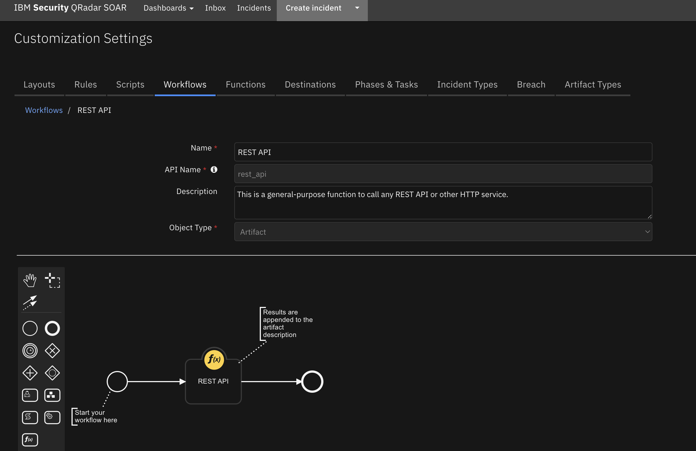

<!--
  This README.md is generated by running:
  "resilient-sdk docgen -p fn_rest_api"

  This file was generated with resilient-sdk v48.0.4034

  It is best edited using a Text Editor with a Markdown Previewer. VS Code
  is a good example. Checkout https://guides.github.com/features/mastering-markdown/
  for tips on writing with Markdown

  All fields followed by "::CHANGE_ME::"" should be manually edited

  If you make manual edits and run docgen again, a .bak file will be created

  Store any screenshots in the "doc/screenshots" directory and reference them like:
  

  NOTE: If your app is available in the container-format only, there is no need to mention the integration server in this readme.
-->

# REST API Functions for SOAR

## Table of Contents
- [Release Notes](#release-notes)
- [Overview](#overview)
  - [Key Features](#key-features)
- [Requirements](#requirements)
  - [SOAR platform](#soar-platform)
  - [Cloud Pak for Security](#cloud-pak-for-security)
  - [Proxy Server](#proxy-server)
  - [Python Environment](#python-environment)
- [Installation](#installation)
  - [Install](#install)
  - [App Configuration](#app-configuration)
- [Function - REST API](#function---rest-api)
- [Rules](#rules)
- [Troubleshooting & Support](#troubleshooting--support)

---

## Release Notes
<!--
  Specify all changes in this release. Do not remove the release 
  notes of a previous release
-->
| Version | Date | Notes |
| ------- | ---- | ----- |
| 1.0.0 | 03/2023 | Initial Release |

---

## Overview
<!--
  Provide a high-level description of the function itself and its remote software or application.
  The text below is parsed from the "description" and "long_description" attributes in the setup.py file
-->
**Function to call REST web services in the SOAR Platform**

 

This function calls a REST web service. It supports the standard REST methods: GET, HEAD, POST, PUT, DELETE, OPTIONS and PATCH.

 The function parameters determine the type of call, the URL, and optionally the headers, cookies and body.

 The results include the text or structured (JSON) result from the web service, and additional information including the elapsed time.

### Key Features
<!--
  List the Key Features of the Integration
-->
* Calls a REST web service

---

## Requirements

This app supports the IBM Security QRadar SOAR Platform and the IBM Security QRadar SOAR for IBM Cloud Pak for Security.

### SOAR platform
The SOAR platform supports two app deployment mechanisms, Edge Gateway (formerly App Host) and integration server.

If deploying to a SOAR platform with an Edge Gateway, the requirements are:
* SOAR platform >= `45.0.7899`.
* The app is in a container-based format (available from the AppExchange as a `zip` file).

If deploying to a SOAR platform with an integration server, the requirements are:
* SOAR platform >= `45.0.7899`.
* The app is in the older integration format (available from the AppExchange as a `zip` file which contains a `tar.gz` file).
* Integration server is running `resilient-circuits>=47.1.0`.
* If using an API key account, make sure the account provides the following minimum permissions: 
  | Name | Permissions |
  | ---- | ----------- |
  | Org Data | Read |
  | Function | Read |

The following SOAR platform guides provide additional information: 
* _Edge Gateway Deployment Guide_ or _App Host Deployment Guide_: provides installation, configuration, and troubleshooting information, including proxy server settings. 
* _Integration Server Guide_: provides installation, configuration, and troubleshooting information, including proxy server settings.
* _System Administrator Guide_: provides the procedure to install, configure and deploy apps. 

The above guides are available on the IBM Documentation website at [ibm.biz/soar-docs](https://ibm.biz/soar-docs). On this web page, select your SOAR platform version. On the follow-on page, you can find the _Edge Gateway Deployment Guide_, _App Host Deployment Guide_, or _Integration Server Guide_ by expanding **Apps** in the Table of Contents pane. The System Administrator Guide is available by expanding **System Administrator**.

### Cloud Pak for Security
If you are deploying to IBM Cloud Pak for Security, the requirements are:
* IBM Cloud Pak for Security >= `1.8`.
* Cloud Pak is configured with an Edge Gateway.
* The app is in a container-based format (available from the AppExchange as a `zip` file).

The following Cloud Pak guides provide additional information: 
* _Edge Gateway Deployment Guide_ or _App Host Deployment Guide_: provides installation, configuration, and troubleshooting information, including proxy server settings. From the Table of Contents, select Case Management and Orchestration & Automation > **Orchestration and Automation Apps**.
* _System Administrator Guide_: provides information to install, configure, and deploy apps. From the IBM Cloud Pak for Security IBM Documentation table of contents, select Case Management and Orchestration & Automation > **System administrator**.

These guides are available on the IBM Documentation website at [ibm.biz/cp4s-docs](https://ibm.biz/cp4s-docs). From this web page, select your IBM Cloud Pak for Security version. From the version-specific IBM Documentation page, select Case Management and Orchestration & Automation.

### Proxy Server
The app does support a proxy server.

### Python Environment
Python 3.6 and Python 3.9 are supported.
Additional package dependencies may exist for each of these packages:
* resilient-circuits>=47.1.0

---

## Installation

### Install
* To install or uninstall an App or Integration on the _SOAR platform_, see the documentation at [ibm.biz/soar-docs](https://ibm.biz/soar-docs).
* To install or uninstall an App on _IBM Cloud Pak for Security_, see the documentation at [ibm.biz/cp4s-docs](https://ibm.biz/cp4s-docs) and follow the instructions above to navigate to Orchestration and Automation.

### App Configuration
The following table provides the settings you need to configure the app. These settings are made in the app.config file. See the documentation discussed in the Requirements section for the procedure.

| Config | Required | Example | Description |
| ------ | :------: | ------- | ----------- |


---

## Function - REST API
This function calls a REST web service. It supports the standard REST methods: GET, HEAD, POST, PUT, DELETE, PATCH and OPTIONS.

The function parameters determine the type of call, the URL, and optionally the headers and body. The results include the text or structured (JSON) result from the web service, and additional information including the elapsed time.

 

<details><summary>Inputs:</summary>
<p>

| Name | Type | Required | Example | Tooltip |
| ---- | :--: | :------: | ------- | ------- |
| `rest_api_allowed_status_codes` | `text` | No | `-` | Comma separated list |
| `rest_api_body` | `textarea` | No | `-` | - |
| `rest_api_cookies` | `textarea` | No | `-` | - |
| `rest_api_headers` | `textarea` | No | `-` | - |
| `rest_api_method` | `select` | No | `-` | - |
| `rest_api_timeout` | `number` | No | `-` | - |
| `rest_api_url` | `text` | No | `-` | - |
| `rest_api_verify` | `boolean` | Yes | `-` | Verify SSL certificate |

</p>
</details>

<details><summary>Outputs:</summary>
<p>

> **NOTE:** This example might be in JSON format, but `results` is a Python Dictionary on the SOAR platform.

```python
results = {
  "content": {
    "apparent_encoding": "ascii",
    "cookies": {
      "sails.sid": "s%3AC3qSgEkPLbzV-xtRnnqe-p7zt80yQSTm.SJf3XOyooMFo0wQ8wiWfCzlgieNUBQGRNtSo%2BRSXw54"
    },
    "elapsed": 711,
    "headers": {
      "Connection": "close",
      "Content-Length": "486",
      "Content-Type": "application/json; charset=utf-8",
      "Date": "Thu, 02 Mar 2023 23:47:12 GMT",
      "ETag": "W/\"1e6-/Slr9JmNLSHXgTt5sCvAphvtWyI\"",
      "set-cookie": "sails.sid=s%3AC3qSgEkPLbzV-xtRnnqe-p7zt80yQSTm.SJf3XOyooMFo0wQ8wiWfCzlgieNUBQGRNtSo%2BRSXw54; Path=/; HttpOnly"
    },
    "json": {
      "args": {
        "key": "8.8.8.8"
      },
      "headers": {
        "accept": "*/*",
        "accept-encoding": "gzip, deflate",
        "authorization": "",
        "content-length": "18",
        "content-type": "application/json",
        "host": "postman-echo.com",
        "user-agent": "python-requests/2.28.1",
        "x-amzn-trace-id": "Root=1-64013580-54708cb41d08344e2a8af58b",
        "x-forwarded-port": "443",
        "x-forwarded-proto": "https",
        "x-frooble": "Baz"
      },
      "url": "https://postman-echo.com/get"
    },
    "links": {},
    "ok": true,
    "reason": "OK",
    "status_code": 200,
    "text": "{\n  \"args\": {\n    \"key\": \"8.8.8.8\"\n  },\n  \"headers\": {\n    \"x-forwarded-proto\": \"https\",\n    \"x-forwarded-port\": \"443\",\n    \"host\": \"postman-echo.com\",\n    \"x-amzn-trace-id\": \"Root=1-64013580-54708cb41d08344e2a8af58b\",\n    \"content-length\": \"18\",\n    \"user-agent\": \"python-requests/2.28.1\",\n    \"accept-encoding\": \"gzip, deflate\",\n    \"accept\": \"*/*\",\n    \"content-type\": \"application/json\",\n    \"x-frooble\": \"Baz\",\n    \"authorization\": \"\"\n  },\n  \"url\": \"https://postman-echo.com/get\"\n}",
    "url": "https://postman-echo.com/get"
  },
  "inputs": {
    "rest_api_allowed_status_codes": " 305,404,500",
    "rest_api_body": "{\"key\": \"8.8.8.8\"}",
    "rest_api_headers": "Content-Type: application/json\nX-Frooble: Baz\nAuthorization: {{auth_header}}",
    "rest_api_method": "GET",
    "rest_api_url": "https://postman-echo.com/get",
    "rest_api_verify": true
  },
  "metrics": {
    "execution_time_ms": 731,
    "host": "My Host",
    "package": "fn-rest-api",
    "package_version": "1.0.0",
    "timestamp": "2023-03-02 18:47:11",
    "version": "1.0"
  },
  "raw": null,
  "reason": null,
  "success": true,
  "version": 2.0
}
```

</p>
</details>

<details><summary>Example Pre-Process Script:</summary>
<p>

```python
inputs.rest_api_method = "GET"

# Let's patch a URL that includes the artifact value
inputs.rest_api_url = u"https://postman-echo.com/get"

# For PATCH requests, the body is text
inputs.rest_api_body = '{"key": "'+artifact.value+'"}'

# HTTP headers can be specified as a multi-line string
# inputs.rest_api_headers = """
# Content-Type: application/json
# X-Frooble: Baz
# """

# The 'rest_verify' parameter (Boolean) indicates whether to verify SSL certificates.
# This should be True unless you need to connect to a self-signed or other invalid cert.
inputs.rest_api_verify = True
```

</p>
</details>

<details><summary>Example Post-Process Script:</summary>
<p>

```python
# Set the artifact description to the Response (in plain text) of the REST call

if artifact.description:
  artifact.description = u"{}\n\n{}".format(artifact.description.content, results.text)
else:
  artifact.description = results.text
```

</p>
</details>

---


## Rules
| Rule Name | Object | Workflow Triggered |
| --------- | ------ | ------------------ |
| REST API | artifact | `rest_api` |

---


## Troubleshooting & Support
Refer to the documentation listed in the Requirements section for troubleshooting information.

### For Support
This is an IBM supported app. Please search [ibm.com/mysupport](https://ibm.com/mysupport) for assistance.
