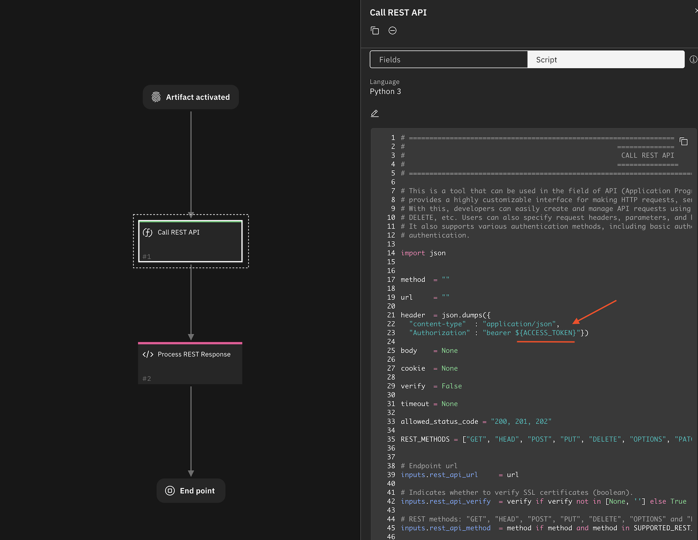

# REST API Functions for SOAR

## Table of Contents  <!-- omit in toc -->
- [REST API Functions for SOAR](#rest-api-functions-for-soar)
  - [Release Notes](#release-notes)
  - [Overview](#overview)
    - [Key Features](#key-features)
  - [Requirements](#requirements)
    - [SOAR platform](#soar-platform)
    - [Cloud Pak for Security](#cloud-pak-for-security)
    - [Proxy Server](#proxy-server)
    - [Python Environment](#python-environment)
  - [Installation](#installation)
  - [Function - REST API](#function---rest-api)
  - [Input Considerations](#input-considerations)
    - [Sensitive information using App Secrets](#sensitive-information-using-app-secrets)
    - [Format:](#format)
  - [Input format](#input-format)
    - [1. JSON format:](#1-json-format)
    - [2. New-line separated (Legacy) format:](#2-new-line-separated-legacy-format)
  - [Retry Mechanism](#retry-mechanism)
    - [1. RETRY TRIES (rest\_retry\_tries)](#1-retry-tries-rest_retry_tries)
    - [2. RETRY DELAY (rest\_retry\_delay)](#2-retry-delay-rest_retry_delay)
    - [3. RETRY BACKOFF (rest\_retry\_backoff)](#3-retry-backoff-rest_retry_backoff)
  - [Attachments](#attachments)
    - [REQUEST FORMAT](#request-format)
    - [1. file bundled as a multipart/form-data:](#1-file-bundled-as-a-multipartform-data)
    - [2. file bundled as request body:](#2-file-bundled-as-request-body)
  - [Authentication](#authentication)
    - [OAuth 2.0](#oauth-20)
      - [Method 1: Using CODE:](#method-1-using-code)
      - [Method 2: Using REFRESH\_TOKEN](#method-2-using-refresh_token)
      - [Method 3: Using ACCESS\_TOKEN](#method-3-using-access_token)
    - [Client-side authentication with certificates](#client-side-authentication-with-certificates)
      - [1. Client Authentication Certificate (client\_auth\_cert)](#1-client-authentication-certificate-client_auth_cert)
      - [2. Client Authentication Private Key (client\_auth\_key)](#2-client-authentication-private-key-client_auth_key)
      - [3. Client Authentication PEM (client\_auth\_pem)](#3-client-authentication-pem-client_auth_pem)
    - [Input Formats:](#input-formats)
    - [JSON Web Token Authentication](#json-web-token-authentication)
      - [1. Using Endpoint provided token](#1-using-endpoint-provided-token)
      - [2. Compiling a Token using JWT parameters](#2-compiling-a-token-using-jwt-parameters)
  - [Playbooks](#playbooks)
  - [Troubleshooting \& Support](#troubleshooting--support)
    - [For Support](#for-support)

---

## Release Notes
| Version | Date | Notes |
| ------- | ---- | ----- |
| 1.0.0 | 05/2023 | Initial Release |
| 1.1.0 | 06/2023 | Added support for OAuth, Client Side Authentication using certificates, JWT |
| 1.2.0 | 11/2023 | Added support for Retry mechanism, attachments, query parameters and json formatted body for content-type/json (case-insensitive) |

---

## Overview
<p align="center">

</p>

**Function to call REST web services in the SOAR Platform**

This application is based on the `call_rest_api` function from the `fn_utilities`, which is expected to be deprecated in the future. It's purpose is to enable the ability to connect with external web services by sending REST API requests. The function supports commonly used REST methods such as GET, HEAD, POST, PUT, DELETE, OPTIONS, and PATCH. The specific details of the request, such as the type of request, URL, and other options like headers, cookies, and the request body, can be specified through the function parameters. Once a response is received from the service, it is presented in both text and JSON format. Additionally, other details about the response, such as the response status code, reason, cookies, headers, time elapsed, and links, are also provided.


### Key Features
* Make REST API requests to external web services.
* Request body, headers and cookies now support complex structures just as nested key-value pairs and lists by JSON format.
* Response is returned in both JSON and text format.
* Ability to substitute sensitive information that are specified in the inputs for values that are in the app.config.
* Make REST API requests to multiple endpoints.

---

## Requirements

This app supports the IBM Security QRadar SOAR Platform and the IBM Security QRadar SOAR for IBM Cloud Pak for Security.

### SOAR platform
The SOAR platform supports two app deployment mechanisms, Edge Gateway (formerly App Host) and integration server.

If deploying to a SOAR platform with an Edge Gateway, the requirements are:
* SOAR platform >= `48.2`.
* The app is in a container-based format (available from the AppExchange as a `zip` file).

If deploying to a SOAR platform with an integration server, the requirements are:
* SOAR platform >= `48.2`.
* The app is in the older integration format (available from the AppExchange as a `zip` file which contains a `tar.gz` file).
* The application underwent testing with Integration server running `resilient-circuits` versions `48.1` and `46.0`.
* Earlier versions of resilient-circuits may also work correctly as there are no specific required dependencies.
* If using an API key account, make sure the account provides the following minimum permissions: 
  | Name | Permissions |
  | ---- | ----------- |
  | Org Data | Read |
  | Function | Read |
  | Incident | Read |
  | Task | Read |

The following SOAR platform guides provide additional information: 
* _Edge Gateway Deployment Guide_ or _App Host Deployment Guide_: provides installation, configuration, and troubleshooting information, including proxy server settings. 
* _Integration Server Guide_: provides installation, configuration, and troubleshooting information, including proxy server settings.
* _System Administrator Guide_: provides the procedure to install, configure and deploy apps. 

The above guides are available on the IBM Documentation website at [ibm.biz/soar-docs](https://ibm.biz/soar-docs). On this web page, select your SOAR platform version. On the follow-on page, you can find the _Edge Gateway Deployment Guide_, _App Host Deployment Guide_, or _Integration Server Guide_ by expanding **Apps** in the Table of Contents pane. The System Administrator Guide is available by expanding **System Administrator**.

### Cloud Pak for Security
If you are deploying to IBM Cloud Pak for Security, the requirements are:
* IBM Cloud Pak for Security >= `1.10`.
* Cloud Pak is configured with an Edge Gateway.
* The app is in a container-based format (available from the AppExchange as a `zip` file).

The following Cloud Pak guides provide additional information: 
* _Edge Gateway Deployment Guide_ or _App Host Deployment Guide_: provides installation, configuration, and troubleshooting information, including proxy server settings. From the Table of Contents, select Case Management and Orchestration & Automation > **Orchestration and Automation Apps**.
* _System Administrator Guide_: provides information to install, configure, and deploy apps. From the IBM Cloud Pak for Security IBM Documentation table of contents, select Case Management and Orchestration & Automation > **System administrator**.

These guides are available on the IBM Documentation website at [ibm.biz/cp4s-docs](https://ibm.biz/cp4s-docs). From this web page, select your IBM Cloud Pak for Security version. From the version-specific IBM Documentation page, select Case Management and Orchestration & Automation.

### Proxy Server
The app does support a proxy server.

### Python Environment
Python 3.6 and Python 3.9 are supported.
Additional package dependencies may exist for each of these packages:
* resilient-circuits

---

## Installation

* To install or uninstall an App or Integration on the _SOAR platform_, see the documentation at [ibm.biz/soar-docs](https://ibm.biz/soar-docs).
* To install or uninstall an App on _IBM Cloud Pak for Security_, see the documentation at [ibm.biz/cp4s-docs](https://ibm.biz/cp4s-docs) and follow the instructions above to navigate to Orchestration and Automation.


---

## Function - REST API

This function calls a REST web service. It supports the standard REST methods: GET, HEAD, POST, PUT, DELETE, PATCH and OPTIONS. The function parameters determine the type of call, the URL, and optionally the headers and body. The results include the text or structured (JSON) result from the web service, and additional information including the elapsed time. The function can be reused to make multiple requests to an endpoint or even access multiple endpoints.

<p align="center">

</p>

## Input Considerations

### Sensitive information using App Secrets

For sensitive information that may be included in the `rest_header`, `rest_url`, `rest_body`, or `rest_cookies`, SECRETS can be directly substituted into input parameters, there by avoiding the need to expose any sensitive information as plain text. This can be done by creating a SECRET under the application's configuration tab and referencing the same with a `$` sign followed by the SECRET's name enclosed within curly brace. PAM Credentials can also be referenced it a similar fashion.

### Format:
 * SECRETS : `${SECRET_NAME}`
 * PAM     : `^{PAM_CREDENTIALS}`

  #### Example:  <!-- omit in toc -->
  ```python
      import json

      inputs.rest_api_headers = json.dumps({
          "Content-Type"  : "application/json",
          "X-Frooble"     : "Baz",
          "Authorization" : "bearer ${API_TOKEN}"
        })
  ```

<p align="center">

</p>

This key can be directly referenced from within a playbook. For instance, a header using the above mentioned value can be constructed in the preprocessing script as follows:

<p align="center">

</p>

---


## Input format

* Function inputs can only accept values that are either strings, numbers, or 
booleans, and they cannot accommodate more intricate data structures like lists
or dictionaries. Nonetheless, specific REST request parameters necessitate input
in the form of key-value pairs. To address this constraint, you can provide inputs
for such parameters using one of the methods described below.

### 1. JSON format:
   Standard json file format. Supports complex data structures such as lists
   or nested Key-value pairs.

  #### Example:  <!-- omit in toc -->
  ```python
    inputs.rest_api_body = """
     "name" : "user1",
     "password" : "p@ssword1",
     "role" : "admin",
     "content" : {
      "site_url" : "www.example.com",
      "users" : ["user1", "user2"] }
    """
  ```
  ### Hint: <!-- omit in toc -->
   An easier way to feed inputs to the above mentioned fields would be using
   python dictionaries. While the inputs don't directly support dict, the in-built 
   json package can be used to convert a python dict to a json string.

  #### Example: <!-- omit in toc -->
  ```python
     import json
     body = {
      "name"     : "user1",
      "password" : "p@ssword1",
      "role"     : "admin",
      "content"  : { 
         "site_url" : "www.example.com",
         "users"    : ["user1", "user2"]
         }
     }
    
    inputs.rest_api_body = json.dumps(body) # this converts the dict to a json string
  ```

### 2. New-line separated (Legacy) format:
   This format allows for specifying inputs as key-value pairs, separated
   by a new line. It lets us create quick and easy inputs that is properly
   formatted for the request. The primary purpose of this format is to retain
   backwards compatibility.

  #### Note:  <!-- omit in toc -->
   This format does not support complex data structures such as lists or nested key-value pairs.

  #### Example:  <!-- omit in toc -->
  ```python
     inputs.rest_api_body = """
     name : user1
     password : p@ssword1
     role : admin
     """

     inputs.rest_api_headers = """
     Content-Type: application/json
     X-Frooble: Baz
     Authorization: {{auth_header}}
     """
  ```

---


## Retry Mechanism

This mechanism ensures the reliable exchange of data by automatically reattempting requests 
that have failed. You can configure the application to do so by modifying the below mentioned
parameters.

### 1. RETRY TRIES (rest_retry_tries)

    This parameter defines the maximum number of retry attempts that will be made for a
    failed request before the system ceases further retry efforts. If the maximum number
    of retry attempts is reached and the request still fails, the system will cease further
    retries and trigger an error notification or follow an alternative error-handling
    process. Setting this value to `-1` results in infinite retries.
    
    Default value : 1 (no retry)

### 2. RETRY DELAY (rest_retry_delay)

    This parameter used to define the delay between retry attempts when a request fails and
    the request retry mechanism is invoked. This parameter plays a crucial role in controlling
    the timing of automatic retry attempts.
    
    Default value : 1 second (no delay)

### 3. RETRY BACKOFF (rest_retry_backoff)

    This parameter is used to specify the multiplier applied to delay between attempts.
    The backoff strategy follows the below mentioned algorithm.
    
    Default: 1 (no backoff)

    Algorithm:

      `DELAY = RETRY_DELAY * (RETRY_BACKOFF ^ n-1)`

          where `n` is the current attempt count.

    Example:

    For these values:
      RETRY_TRIES = 4   RETRY_DELAY = 2   RETRY_BACKOFF = 3

    The retry mechanism attempts requests in the following manner:

      - attempts request 1. if failed, attempts retry in 2 seconds.
      - attempts request 2. if failed, attempts retry in 6 seconds.
      - attempts request 3. if failed, attempts retry in 18 seconds.
      - attempts request 4. if failed, raises exception or follows an alternative error-handling process.

Note: These parameters have default values which are assumed when they are not assigned or left unused.

You can find more information on this in the link: [retry2/retry_call](https://github.com/eSAMTrade/retry#retry_call )

## Attachments

Incident attachments and artifacts (that contain attachments) can be bundled and sent with a REST request.
The following fields can be used to find and locate the file to be sent.

Note: Only one file can be sent per request. If both attachment_id and artifact_id is provided,
      the application will prioritize attachment over artifact

```python
#[Required] ID of the incident in which the artifact or attachment is present. dtype : int
inputs.incident_id   = incident.id

# [Optional] ID of the incident in which the artifact or attachment is present. dtype : int
inputs,task_id = task.id if task else None

# Used to identify the attachment that is to be sent with the REST request. dtype : int
inputs.attachment_id = None

# Used to identify the artifact **with attachment** that is to be sent with the REST request. dtype : int
inputs.artifact_id   = None
```

### REQUEST FORMAT

The endpoint has the capability to receive a REST request containing a file attachment in various formats. The selection of the methodology for sending a file depends on the specific requirements of the endpoint.

### 1. file bundled as a multipart/form-data:

    This methodology sends the attachment as ``Content-Type: multipart/form-data``, meaning that the body of the
    request is a series of parts, each of which contains files that are base64 encoded. The body of the request is
    divided into multiple parts, and each part is separated by a boundary defined that is auto-defined by the app.
    Each part typically contains a `Content-Disposition` header that describes the `name` and `type` of the data,
    along with the actual data itself. While the `type` is automatically assigned by the application, the `name`
    is supposed to be provided by the user in the below field.

    Each part in multipart/form-data is expected to contain a content-disposition header where the disposition type
    is automatically set by the application, and a disposition name. This disposition name changes with regard to
    the endpoint that is being used and is to be set by the user. Default value : "file"

```python
inputs.attachment_form_field_name = "file"

# sends file as multipart/form-data
inputs.send_file_as_body = False
```

###  2. file bundled as request body:

    This methodology sends the binary data of the file as REST request body. Certain endpoints require
    files to be sent in this format. Although most endpoints tend to use multipart/form-data. Default: False

```python
inputs.send_file_as_body = True
```
Note: The body of the request has to be empty, i.e. inputs.rest_api_body = None, otherwise the application will raise an error


---


## Authentication 

The Call REST API function offers support for various authentication protocols that can be employed alongside the REST
request. These authentication methods are optional. If the endpoint does not necessitate any form of 
authentication, you can easily disregard this section, and the Call REST API function will not execute the authentication
process.

### OAuth 2.0

OAuth2 is an authorization framework that allows a user to grant limited access to their resources on a particular endpoint
to QRadar SOAR without sharing their credentials (such as username and password). This process typically involves 2 different
flows: Authorization and Authentication. It is expected for the user to have already performed the authorization flow and 
possesses all the necessary parameters for the Authentication flow. There are three methods available for performing the 
Authentication flow, as mentioned below.

 Note:   The exact implementation details of OAuth2 can vary depending on the
         authorization server and the API you are integrating with. Make sure to consult
         the OAuth2 documentation specific to the service you are working with.

#### Method 1: Using CODE:

     The authorization server redirects the user back to address specified on the 
     redirect URI with an authorization CODE. This CODE is a temporary token
     that represents the user's authorization and usually can be used only once.
     This function exchanges the authorization code for an ACCESS_TOKEN (and 
     possibly also a REFRESH_TOKEN depending on the endpoint). This requires making
     a request to the authorization server's token endpoint, providing the 
     authorization CODE, client ID, client secret, token URL and redirect URI.

     Note: These codes are generally one time use only.

#### Method 2: Using REFRESH_TOKEN

     It is a credential that is used to obtain a new access token from the
     authorization server when the original access token expires. It is an integral
     part of the OAuth 2.0 protocol and enables long-lived access to protected 
     resources without requiring the user to repeatedly authenticate. This can 
     be used for prolonged authentication as using a REFRESH_TOKEN generally extends
     the validity of the token. Client ID, Client secret, Redirect URI and token URL
     might also have to be provided.

     Note: These can be used more than once. The validity of the REFRESH_TOKEN is
           generally extended on use, making it viable for long lived access.

#### Method 3: Using ACCESS_TOKEN

      If an ACCESS_TOKEN is available, it can be directly used without having to 
      perform authentication. In order to use the ACCESS_TOKEN, all that is required
      is the ACCESS_TOKEN & the TOKEN_TYPE. If the TOKEN_TYPE is not specified, the
      DEFAULT_TOKEN_TYPE (bearer) is used.


### Client-side authentication with certificates

Also known as mutual authentication or two-way SSL/TLS authentication, is a security mechanism used in web applications to
verify the identities of both the client (user or device) and the server during the SSL/TLS handshake. In traditional SSL/TLS
authentication, only the server is authenticated using a digital certificate issued by a trusted Certificate Authority (CA).
However, with client-side authentication, the client also presents a digital certificate to the server for verification.

Note:   Client-side authentication with certificates provides an extra layer of
        security by ensuring that the client is trusted and authenticated before
        allowing access to sensitive resources or data. And so this can be used 
        in tandem with other authentication methods

#### 1. Client Authentication Certificate (client_auth_cert)
   
      A client authentication certificate, also known as a client certificate,
      is a digital certificate that is issued to the client (user or device) as
      part of the mutual authentication process. It contains the client's public
      key, identifying information (such as the client's name or ID), and is
      signed by a trusted Certificate Authority (CA) or a self-signed certificate
      if it is a closed system.

#### 2. Client Authentication Private Key (client_auth_key)
   
      Private key is a cryptographic key that corresponds to the client's public
      key in the client authentication certificate. The private key is securely
      stored by the client and kept confidential. During the SSL/TLS handshake,
      when the server sends a challenge to the client, the client uses its 
      private key to decrypt the challenge and generate a response. 
      The server then verifies this response to ensure that the client possesses
      the corresponding private key and is thus authenticated.

#### 3. Client Authentication PEM (client_auth_pem)
   
      This is simply the file format used to store both the client authentication
      certificate and private key in a single PEM (Privacy-Enhanced Mail) file. PEM
      files are a common format for storing cryptographic objects, such as
      certificates and private keys, in a human-readable and ASCII-encoded format.

Note:   The client authentication certificate and private key are commonly given
        together, whereas the PEM file is typically provided separately as an 
        independent file.

### Input Formats:

   The information within these certificates can be directly copied and pasted as
   plain text into the appropriate certificate type, enclosed within quotation marks.
   When making an API call, the application should automatically generate the
   certificates using the pasted content and will securely discard them upon execution.
   All three inputs (client_auth_cert, client_auth_key and client_auth_pem) follow the
   same input format, as shown below.

```python
  inputs.client_auth_cert = """
      -----BEGIN CERTIFICATE-----
      MIIEvAIBADANBgkqhkiG9w0BAQEFAASCBKYwggSiAgEAAoIBAQDFo8xuU+xgNo7G
      9t6hyCRYC0imfYGlH8Huh6OrQ0qO6PnmV8GCGw4ZDHnhUqmS3xWhn5c3MWSXGS5E
      FEgCxB3Rdkim5Dfog6SCCFWIa4YAyv0rdgNLeRbQNTKyT14+inqWE+CLKvZ/T+56
      OEdDSh0RPCg+UxjyCnkSiMce+/8RT+FXK41q1iQZAREJGEpZJIizVYB+aW2caCdq
      9O9YOnDFpqb8S+aE+4/Yfcxg4gGrKazXu+flYNhzpCTx3SpVawQCrUF3dE/2hbV+
      FbGVFPaJziRDeH3UA1+1q0/bRg1trxqkZtGSGukCgYAA7SWvZ3lGJ42tiFzoH4F5
      SfTZXQytCwyxXF6BIWTIXQBcCep5TrfOnYz4iEDwMdp4Qb/QhyjaUsIlo+JldquZ
      k76eXjwrXCwuR0dnwBEsgktWEL8tgCFL1KOACU6dLN2PvE1BOzz8gp1CySn0cpSQ
      Y20A9hExGKyHns4hW5KgvA==
      -----END CERTIFICATE-----
      """
```

### JSON Web Token Authentication

  JWT is also a supported form of authentication. The application has functionality builtin
  that allows for the creation, compilation, and manipulation of JWTs. It can accept several
  optional parameters to customize the authentication process.
  JWT based authentication can be performed in 2 ways:

#### 1. Using Endpoint provided token

      This application can function with a predefined jwt token. A fully generated JWT 
      token can be directly provided, and the application will automatically form the REST
      headers required for a request.

#### 2. Compiling a Token using JWT parameters

      This application can also generate a jwt token. (Skip if you have already specified 
      a jwt_token). The application can automatically compile a jwt token using certain 
      parameters which can be provided in json string or line separated format (similar to
      REST body/header/cookies). These arguments are usually provided by the endpoint itself.
      The application should be able to create and sign a JWT and automatically incorporate it
      into the REST request.


<details><summary>Inputs:</summary>
<p>

| Name | Type | Required | Example | Tooltip |
| ---- | :--: | :------: | ------- | ------- |
| `rest_api_method` | `select` | Yes | `GET` | REST methods: GET, HEAD, POST, PUT, DELETE, OPTIONS and PATCH |
| `rest_api_url` | `text` | Yes | `www.example.com` | Endpoint URL |
| `rest_api_headers` | `textarea` | No | `-` | Request headers. See [Input Considerations](#input-considerations) for format |
| `rest_api_cookies` | `textarea` | No | `-` | Cookies required for the API call. See [Input Considerations](#input-considerations) for format |
| `rest_api_body` | `textarea` | No | `-` | Request body. See [Input Considerations](#input-considerations) for format |
| `rest_api_verify` | `boolean` | Yes | `True` | Verify SSL certificate |
| `rest_api_timeout` | `number` | No | `60` | Request timeout in seconds |
| `rest_api_allowed_status_codes` | `text` | No | `"305, 404, 500"` | Comma separated list. All codes < 300 are allowed by default |
| `rest_api_query_parameters` | `textarea` | No | `60` | Request  timeout in seconds |
| `rest_retry_tries` | `number` | No | `2` | The maximum number of request retry attempts. Default: 1 (no retry). Use -1 for unlimited retries |
| `rest_retry_delay` | `number` | No | `2` | Initial delay in seconds between attempts. Default: 0 |
| `rest_retry_backoff` | `number` | No | `2` | Multiplier applied to delay in seconds between attempts. Default: 1 (no backoff) |
| `oauth_token_url` | `text` | No | `https://www.example.com/oauth/token` | URL for the Authorization server endpoint |
| `incident_id` | `number` | No | `2095` | ID of the incident in which the artifact or attachment is present |
| `artifact_id` | `number` | No | `12` | Used to identify the attachment that is to be sent with the REST request |
| `attachment_id` | `number` | No | `12` | Used to identify file-based artifact that is to be sent with the REST request |
| `send_file_as_body ` | `bool` | No | `False`` | Sends the attachment as request body instead of multipart/form-data |
| `attachment_form_field_name` | `text` | No | `file` | the content-disposition header name for multipart/form-data |
| `oauth_client_id` | `text` | No | `-` | Identifies the client application |
| `oauth_client_secret` | `text` | No | `-` | Authenticates the client application (required for certain grant types) |
| `oauth_redirect_uri` | `text` | No | `https://www.example.com/redirect` | The redirect URI used during the authorization flow (for authorization code grant) |
| `oauth_scope` | `text` | No | `read write delete offline_access` | Set of permissions granted by the resource owner (user) to the client application |
| `oauth_code` | `text` | No | `-` | The authorization code received during the authorization flow (for authorization code grant) |
| `oauth_access_token` | `text` | No | `-` | Resultant token of the Authentication process |
| `oauth_refresh_token` | `text` | No | `-` | The refresh token used to obtain a new access token (for refresh token grant) |
| `oauth_token_type` | `text` | No | `Bearer` |  Provides information to the client application about the token's characteristics. Examples: Bearer, JSON Web Tokens, MAC, SAML. Default : Bearer |
| `jwt_headers` | `text` | No | `-` | headers of the JWT, contains metadata about the token |
| `jwt_payload` | `text` | No | `-` | Payload to be included in the token |
| `jwt_key` | `text` | No | `-` | key used for signing the JWT |
| `jwt_algorithm` | `text` | No | `-` | Encryption algorithm used for encoding the JWT. Defaults to "HS256" algorithm |
| `jwt_token` | `text` | No | `-` | Fully complied JWT token, at times referenced as the Access_token |
| `client_auth_key` | `text` | No | `-` | .key file contents to be pasted as plain text. To be provided with client_auth_cert |
| `client_auth_cert` | `text` | No | `-` | .csr file contents to be pasted as plain text. Requires client_auth_key to function |
| `client_auth_pem` | `text` | No | `-` | .pem file contents to be pasted as plain text. Standalone attribute, does not require the above two attribute |


</p>
</details>

<details><summary>Outputs:</summary>
<p>

> **NOTE:** This example might be in JSON format, but `results` is a Python Dictionary on the SOAR platform.

```python
results = {
  "content": {
    "apparent_encoding": "ascii",
    "cookies": {
      "sails.sid": "s%3AC3qSgEkPLbzV-xtRnnqe-p7zt80yQSTm.SJf3XOyooMFo0wQ8wiWfCzlgieNUBQGRNtSo%2BRSXw54"
    },
    "elapsed": 711,
    "headers": {
      "Connection": "close",
      "Content-Length": "486",
      "Content-Type": "application/json; charset=utf-8",
      "Date": "Thu, 02 Mar 2023 23:47:12 GMT",
      "ETag": "W/\"1e6-/Slr9JmNLSHXgTt5sCvAphvtWyI\"",
      "set-cookie": "sails.sid=s%3AC3qSgEkPLbzV-xtRnnqe-p7zt80yQSTm.SJf3XOyooMFo0wQ8wiWfCzlgieNUBQGRNtSo%2BRSXw54; Path=/; HttpOnly"
    },
    "json": {
      "args": {
        "key": "8.8.8.8"
      },
      "headers": {
        "accept": "*/*",
        "accept-encoding": "gzip, deflate",
        "authorization": "",
        "content-length": "18",
        "content-type": "application/json",
        "host": "postman-echo.com",
        "user-agent": "python-requests/2.28.1",
        "x-amzn-trace-id": "Root=1-64013580-54708cb41d08344e2a8af58b",
        "x-forwarded-port": "443",
        "x-forwarded-proto": "https",
        "x-frooble": "Baz"
      },
      "url": "https://postman-echo.com/get"
    },
    "links": {},
    "ok": true,
    "reason": "OK",
    "status_code": 200,
    "text": "{\n  \"args\": {\n    \"key\": \"8.8.8.8\"\n  },\n  \"headers\": {\n    \"x-forwarded-proto\": \"https\",\n    \"x-forwarded-port\": \"443\",\n    \"host\": \"postman-echo.com\",\n    \"x-amzn-trace-id\": \"Root=1-64013580-54708cb41d08344e2a8af58b\",\n    \"content-length\": \"18\",\n    \"user-agent\": \"python-requests/2.28.1\",\n    \"accept-encoding\": \"gzip, deflate\",\n    \"accept\": \"*/*\",\n    \"content-type\": \"application/json\",\n    \"x-frooble\": \"Baz\",\n    \"authorization\": \"\"\n  },\n  \"url\": \"https://postman-echo.com/get\"\n}",
    "url": "https://postman-echo.com/get"
  },
  "inputs": {
    "rest_api_allowed_status_codes": " 305,404,500",
    "rest_api_body": "{\"key\": \"8.8.8.8\"}",
    "rest_api_headers": "Content-Type: application/json\nX-Frooble: Baz\nAuthorization: {{auth_header}}",
    "rest_api_method": "GET",
    "rest_api_url": "https://postman-echo.com/get",
    "rest_api_verify": true
  },
  "metrics": {
    "execution_time_ms": 731,
    "host": "My Host",
    "package": "fn-rest-api",
    "package_version": "1.0.0",
    "timestamp": "2023-03-02 18:47:11",
    "version": "1.0"
  },
  "raw": null,
  "reason": null,
  "success": true,
  "version": 2.0
}
```

</p>
</details>

<details><summary>Function-Input Script:</summary>
<p>

```python
# ======================================================================================================================== #
#                                                    ===============                                                       #
#                                                     CALL REST API                                                        #
#                                                    ===============                                                       #
# ======================================================================================================================== #

# This is a tool that can be used in the field of API (Application Programming Interface) development and testing. It
# provides a highly customizable interface for making HTTP requests, sending and receiving data, and testing APIs.
# With this, developers can easily create and manage API requests using a variety of HTTP methods such as GET, POST, PUT,
# DELETE, etc. Users can also specify request headers, parameters, and body content for different types of requests.
# It also supports various authentication methods, including basic authentication, OAuth, API keys, and client side 
# authentication.

method  = ""

url     = ""

verify  = True

params  = None

header  = None

body    = None

cookie  = None

timeout = None

retry_tries = None

retry_delay = None

retry_backoff = None

allowed_status_code = "200, 201, 202"

REST_METHODS = ["GET", "HEAD", "POST", "PUT", "DELETE", "OPTIONS", "PATCH"]


# Endpoint url
inputs.rest_api_url     = url

# Indicates whether to verify SSL certificates (boolean).
inputs.rest_api_verify  = verify if verify not in [None, ''] else True

# REST methods: "GET", "HEAD", "POST", "PUT", "DELETE", "OPTIONS" and "PATCH". Defaults to GET method
inputs.rest_api_method  = method if method and method in REST_METHODS else REST_METHODS[0] 

# Time in seconds to wait before timing-out request. Default: 60 seconds.
inputs.rest_api_timeout = timeout if timeout else None

# Request headers used for Authorization. Refer to ``DICT/JSON FORMAT`` section for more information.
inputs.rest_api_headers = header if header else None

# Cookies for request. Refer to ``DICT/JSON FORMAT`` section for more information.
inputs.rest_api_cookies = cookie if cookie else None

# Request body. Refer to ``DICT/JSON FORMAT`` section for more information.
inputs.rest_api_body    = body if body else None

# Parameters used for API calls added to the URL. Refer to ``DICT/JSON FORMAT`` section for more information.
inputs.rest_api_query_parameters = params


#                                                 =====================
#                                                  ALLOWED_STATUS_CODE 
#                                                 =====================

# Any status code below 300 is allowed by default. If you specify codes above 300, they are
# exempted from raising an exception and thereby returns the endpoint response. Multiple
# status codes can be specified as a string in a command separated fashion.
#
#    Example:
#    --------
#     inputs.rest_api_allowed_status_codes = "305, 400, 404, 500"


# Status codes in a comma separated fashion, Anything less than a status code 300 is allowed by default
inputs.rest_api_allowed_status_codes = allowed_status_code if allowed_status_code else None

#                                                       =======
#                                                        RETRY
#                                                       =======

# This mechanism ensures the reliable exchange of data by automatically reattempting requests 
# that have failed.

# 1. RETRY_TRIES (rest_retry_tries):
#
#     This parameter defines the maximum number of retry attempts that will be made for a 
#     failed request before the system ceases further retry efforts.
#     Default value : 1 (no retry)

# 2. RETRY_DELAY (rest_retry_delay):
#
#     This parameter used to define the delay between retry attempts when a request fails and
#     the request retry mechanism is invoked. Default value : 1 (no delay)

# 3. RETRY_BACKOFF (rest_retry_backoff):
#
#     This parameter is used to specify the multiplier applied to delay between attempts.
#     Default: 1 (no backoff). 
#
#       Example:
#
#       For these values:
#         RETRY_TRIES = 4   RETRY_DELAY = 2   RETRY_BACKOFF = 3
#
#       The retry mechanism attempts requests in the following manner:
#
#         - attempts request 1. if failed, attempts retry in 2 seconds.
#         - attempts request 2. if failed, attempts retry in 6 seconds.
#         - attempts request 3. if failed, attempts retry in 18 seconds.
#         - attempts request 4. if failed, raises exception or follows an 
#                               alternative error-handling process.

# You can find more information on this in the link below. https://github.com/eSAMTrade/retry#retry_call 


# The maximum number of request retry attempts. Default: 1 (no retry). Use -1 for unlimited retries.
inputs.rest_retry_tries   = retry_tries

# Initial delay between attempts. Default: 1
inputs.rest_retry_delay   = retry_delay

 # Multiplier applied to delay between attempts. Default: 1 (no backoff)
inputs.rest_retry_backoff = retry_backoff

#                                                    ================
#                                                       Attachment   
#                                                    ================

# Incident attachments and artifacts (that contain attachments) can be bundled and sent with a REST request.
# The following fields can be used to find and locate the file to be sent.

# Note: Only one file can be sent per request. If both attachment_id and artifact_id is provided,
#       the application will prioritize attachment over artifact

# [Required] ID of the incident in which the artifact or attachment is present. dtype : int
inputs.incident_id   = incident.id

# [Optional] ID of the incident in which the artifact or attachment is present. dtype : int
inputs,task_id = task.id if task else None

# Used to identify the attachment that is to be sent with the REST request. dtype : int
inputs.attachment_id = None

# Used to identify file-based artifact that is to be sent with the REST request. dtype : int
inputs.artifact_id   = None

# REQUEST FORMAT
# --------------

# The endpoint has the capability to receive a REST request containing a file attachment in various formats.
# The selection of the methodology for sending a file depends on the specific requirements of the endpoint.

# 1. file bundled as a multipart/form-data:
#
#  This methodology sends the attachment as ``Content-Type: multipart/form-data``, meaning that the body of the
#  request is a series of parts, each of which contains files that are base64 encoded. The body of the request is
#  divided into multiple parts, and each part is separated by a boundary defined that is auto-defined by the app.
#  Each part typically contains a `Content-Disposition` header that describes the `name` and `type` of the data,
#  along with the actual data itself. While the `type` is automatically assigned by the application, the `name`
#  is supposed to be provided by the user in the below field.

#  Each part in multipart/form-data is expected to contain a content-disposition header where the disposition type
#  is automatically set by the application, and a disposition name. This disposition name changes with regard to
#  the endpoint that is being used and is to be set by the user. Default value : "file"

inputs.attachment_form_field_name = "file"

# sends file as multipart/form-data
inputs.send_file_as_body = False


# 2. file bundled as request body:
#
#   This methodology sends the binary data of the file as REST request body. Certain endpoints require
#   files to be sent in this format. Although most endpoints tend to use multipart/form-data. Default: False

# Uncomment the following line to send file as REST request body
# inputs.send_file_as_body = True

# Note: The body of the request has to be empty, i.e. inputs.rest_api_body = None, otherwise the application
#       will raise an error


#                                                       =========
#                                                        SECRETS
#                                                       =========

# SECRETS can be directly substituted into input parameters, there by avoiding
# the need to expose any sensitive information as plain text. This can be done by
# creating a SECRET under the application's configuration tab and referencing the 
# same with a `$` sign followed by the SECRET's name enclosed within curly
# brace. PAM Credentials can also be referenced it a similar fashion.
#
#    Format:
#    -------
#      SECRETS : ${SECRET_NAME}
#      PAM     : ^{PAM_CREDENTIALS}
#
#
#    Example:
#    --------
#      import json
#
#      inputs.rest_api_headers = json.dumps({
#        "Content-Type"  : "application/json",
#        "X-Frooble"     : "Baz",
#        "Authorization" : "bearer ${API_TOKEN}"
#      })
#

#                                                  ====================                                                  
#                                                   DICT / JSON FORMAT                                                      
#                                                  ====================                                                  

# Function inputs can only accept values that are either strings, numbers, or 
# booleans, and they cannot accommodate more intricate data structures like lists
# or dictionaries. Nonetheless, specific REST request parameters necessitate input
# in the form of key-value pairs. To address this constraint, you can provide inputs
# for such parameters using one of the methods described below.
# 
#     Supported fields
#     ----------------
#       - inputs.rest_api_headers
#       - inputs.rest_api_cookies
#       - inputs.rest_api_body 
#       - inputs.rest_api_query_parameters
#       - inputs.jwt_headers
#       - inputs.jwt_payload
#

# 1. JSON format:
#    ------------
#
#    Standard json file format. Supports complex data structures such as lists
#    or nested Key-value pairs.
#
#    Example:
#    --------
#      inputs.rest_api_body  = """
#      "name" : "user1",
#      "password" : "p@ssword1",
#      "role" : "admin",
#      "content" : { "site_url" : "www.example.com", "users" : ["user1", "user2"] }
#      """

#    Hint:
#    -----
#
#    An easier way to feed inputs to the above mentioned fields would be using
#    python dictionaries. While the inputs don't directly support dict, the in-built 
#    json package can be used to convert a python dict to json string.
#
#    Example:
#    --------
#      import json
#     
#      inputs.rest_api_body  = {
#       "name"     : "user1",
#       "password" : "p@ssword1",
#       "role"     : "admin",
#       "content"  : { 
#          "site_url" : "www.example.com",
#          "users"    : ["user1", "user2"]
#          }
#      }
#
#     inputs.rest_api_body = json.dumps(body) # this converts the dict to a json string


# 2. New-line separated (Legacy)
#    ---------------------------
#
#    This format allows for specifying inputs as key-value pairs, separated
#    by a new line. It let's us create quick and easy inputs that is properly
#    formatted for the request. The primary purpose of this format is to retain
#    backwards compatibility.
#
#    Note: This format does not support complex data structures such as lists
#          or nested Key-value pairs.
#
#    Example:
#    -------- 
#      inputs.rest_api_body = """
#      name : user1
#      password : p@ssword1
#      role : admin
#      """             
# 
#      inputs.rest_api_headers = """
#      Content-Type: application/json
#      X-Frooble: Baz
#      Authorization: {{auth_header}}

#                                                     =============
#                                                      REUSABILITY
#                                                     =============

# The function can be reused to make multiple requests to an endpoint or even access 
# multiple endpoints. This can be achieved by simply modifying the pre-processing script
# as per the request and the endpoint.


# ======================================================================================================================== #
#                                                    ================                                                      #
#                                                     AUTHENTICATION                                                       #
#                                                    ================                                                      #
# ======================================================================================================================== #

# The Call REST API function offers support for various authentication protocols that can be employed alongside the REST
# request. These authentication methods are entirely voluntary. If the endpoint does not necessitate any form of 
# authentication, you can easily disregard this section, and the Call REST API function will not execute the authentication
# process.

# Note: All input parameters should either be set to None or must be removed if not being used for authentication.

#                                                     ============= 
#                                                       OAuth 2.0   
#                                                     ============= 

# OAuth2 is an authorization framework that allows a user to grant limited access to their resources on a particular endpoint
# to QRadar SOAR without sharing their credentials (such as username and password). This process typically involves 2 different
# flows: Authorization and Authentication. It is expected for the user to have already performed the authorization flow and 
# possesses all the necessary parameters for the Authentication flow. There are three methods available for performing the 
# Authentication flow, as mentioned below.

# Note:   The exact implementation details of OAuth2 can vary depending on the
#         authorization server and the API you are integrating with. Make sure
#         to consult the OAuth2 documentation specific to the service you are
#         working with.

# Method 1: REFRESH_TOKEN
#
#     It is a credential that is used to obtain a new access token from the
#     authorization server when the original access token expires. It is an integral
#     part of the OAuth 2.0 protocol and enables long-lived access to protected 
#     resources without requiring the user to repeatedly authenticate. This can 
#     be used for prolonged authentication as using a REFRESH_TOKEN generally extends
#     the validity of the token. Client ID, Client secret, Redirect URI and token URL
#     might also have to be provided.
#
#     Note: On successfully completing a `refresh-token` flow, the existing client properties are
#           updated with the newly fetched values. This means that this client can be used to fetch
#           new tokens and values virtually indefinitely.

# Method 2: CLIENT-CREDENTIALS
#
#     Client Credentials Flow doesn't involve user authentication, and it is suitable
#     for scenarios where the client is a confidential client, meaning it can keep it's
#     client credentials (client ID and client secret) secure.
#
#     Note: If the endpoint returns a `refresh-token` on successively completing the above flow,
#           the existing client properties are updated with the newly fetched values. This means
#           the client goes from `Client-Credentials Flow` to `Refresh-Token flow` moving forward.
#           This means that this client can be used to fetch new tokens and values virtually
#           indefinitely.

# Method 3: AUTHORIZATION (CODE):
#
#     The authorization server redirects the user back to address specified on the 
#     redirect URI with an authorization CODE. This CODE is a temporary token
#     that represents the user's authorization and usually can be used only once.
#     This function exchanges the authorization code for an ACCESS_TOKEN (and 
#     possibly also a REFRESH_TOKEN depending on the endpoint). This requires making
#     a request to the authorization server's token endpoint, providing the 
#     authorization CODE, client ID, client secret, token URL and redirect URI.
#
#     Note: If the endpoint returns a `refresh-token` on successively completing the above flow,
#           the existing client properties are updated with the newly fetched values. This means
#           the client goes from `Authorization Flow` to `Refresh-Token flow` moving forward.
#           This means that this client can be used to fetch new tokens and values virtually
#           indefinitely.

# Method 4: ACCESS_TOKEN
#
#      If an ACCESS_TOKEN is available, it can be directly used without having to 
#      perform authentication. In order to use the ACCESS_TOKEN, all that is required
#      is the ACCESS_TOKEN & the TOKEN_TYPE. If the TOKEN_TYPE is not specified, the
#      DEFAULT_TOKEN_TYPE (bearer) is used.

# URL for the Authorization server endpoint
inputs.oauth_token_url     = None

# Identifies the client application
inputs.oauth_client_id     = None

# Authenticates the client application (required for certain grant types)
inputs.oauth_client_secret = None

# The redirect URI used during the authorization flow (for authorization code grant)
inputs.oauth_redirect_uri  = None

# Set of permissions granted by the resource owner (user) to the client application
inputs.oauth_scope         = None

# Provides information to the client application about the token's characteristics. 
# Examples: Bearer, JSON Web Tokens, MAC, SAML. Default : Bearer
inputs.oauth_token_type    = None

# Resultant token of the Authentication process
inputs.oauth_access_token  = None

# The authorization code received during the authorization flow (for authorization code grant)
inputs.oauth_code          = None

# The refresh token used to obtain a new access token (for refresh token grant)
inputs.oauth_refresh_token = None

# Specifies methods through which applications can gain Access Tokens. 
# Commonly used grant_types are : implicit, authorization_code, client_credentials, password.
inputs.oauth_grant_type    = None


#                                     ==============================================          
#                                      Client-side authentication with certificates
#                                     ==============================================        

# Also known as mutual authentication or two-way SSL/TLS authentication, is a security mechanism used in web applications to
# verify the identities of both the client (user or device) and the server during the SSL/TLS handshake. In traditional SSL/TLS
# authentication, only the server is authenticated using a digital certificate issued by a trusted Certificate Authority (CA).
# However, with client-side authentication, the client also presents a digital certificate to the server for verification.

# Note:   Client-side authentication with certificates provides an extra layer of
#         security by ensuring that the client is trusted and authenticated before
#         allowing access to sensitive resources or data. And so this can be used 
#         in tandem with other authentication methods

# 1. Client Authentication Certificate (client_auth_cert):
#
#    A client authentication certificate, also known as a client certificate,
#    is a digital certificate that is issued to the client (user or device) as
#    part of the mutual authentication process. It contains the client's public
#    key, identifying information (such as the client's name or ID), and is
#    signed by a trusted Certificate Authority (CA) or a self-signed certificate
#    if it is a closed system.

# 2. Client Authentication Private Key (client_auth_key):
#
#    Private key is a cryptographic key that corresponds to the client's public
#    key in the client authentication certificate. The private key is securely
#    stored by the client and kept confidential. During the SSL/TLS handshake,
#    when the server sends a challenge to the client, the client uses its 
#    private key to decrypt the challenge and generate a response. 
#    The server then verifies this response to ensure that the client possesses
#    the corresponding private key and is thus authenticated.

# 3. Client Authentication PEM (client_auth_pem): 
# 
#    This is simply the file format used to store both the client authentication
#    certificate and private key in a single PEM (Privacy-Enhanced Mail) file. PEM
#    files are a common format for storing cryptographic objects, such as
#    certificates and private keys, in a human-readable and ASCII-encoded format.

# Note:   The client authentication certificate and private key are commonly given
#         together, whereas the PEM file is typically provided separately as an 
#         independent file.


# INPUT FORMAT:
# -------------
#
#    The information within these certificates can be directly copied and pasted as
#    plain text into the appropriate certificate type, enclosed within quotation marks.
#    When making an API call, the application should automatically generate the
#    certificates using the pasted content and will securely discard them upon execution.
#    The contents of the certificate/key must always be unencrypted.
#
#    All three inputs (client_auth_cert, client_auth_key and client_auth_pem) follow the
#    same input format, as shown below.
#
#   inputs.client_auth_cert = """
#       -----BEGIN CERTIFICATE-----
#       MIIEvAIBADANBgkqhkiG9w0BAQEFAASCBKYwggSiAgEAAoIBAQDFo8xuU+xgNo7G
#       9t6hyCRYC0imfYGlH8Huh6OrQ0qO6PnmV8GCGw4ZDHnhUqmS3xWhn5c3MWSXGS5E
#       FEgCxB3Rdkim5Dfog6SCCFWIa4YAyv0rdgNLeRbQNTKyT14+inqWE+CLKvZ/T+56
#       OEdDSh0RPCg+UxjyCnkSiMce+/8RT+FXK41q1iQZAREJGEpZJIizVYB+aW2caCdq
#       SfTZXQytCwyxXF6BIWTIXQBcCep5TrfOnYz4iEDwMdp4Qb/QhyjaUsIlo+JldquZ
#       k76eXjwrXCwuR0dnwBEsgktWEL8tgCFL1KOACU6dLN2PvE1BOzz8gp1CySn0cpSQ
#       Y20A9hExGKyHns4hW5KgvA==
#       -----END CERTIFICATE-----
#       """

# .CSR file contents to be pasted. Requires client_auth_key to function. Content must be unencrypted.
inputs.client_auth_cert = None

# .KEY file contents to be pasted. To be provided with client_auth_cert. Content must be unencrypted.
inputs.client_auth_key  = None

# .PEM file contents to be pasted. Standalone attribute, does not require the above two attribute. Content must be unencrypted.
inputs.client_auth_pem  = None

#                                                         =======             
#                                                           JWT               
#                                                         =======             

# JWT is also a supported form of authentication. The application has functionality builtin
# that allows for the creation, compilation, and manipulation of JWTs. It can accept several
# optional parameters to customize the authentication process.

# JWT based authentication can be performed in 2 ways:

# 1. This application can function with a predefined jwt token. A fully generated JWT 
# token can be directly provided, and the application will automatically form the REST
# headers required for a request.

inputs.jwt_token = None

# 2. This application can also generate a jwt token. (Skip if you have already specified 
# a jwt_token). The application can automatically compile a jwt token using certain 
# parameters which can be provided in json string or line separated format (similar to
# REST body/header/cookies). These arguments are usually provided by the endpoint itself.
# The application should be able to create and sign a JWT and automatically incorporate it
# into the REST request.

# headers of the JWT, contains metadata about the token.
inputs.jwt_headers   = None

# Payload to be included in the token. 
inputs.jwt_payload   = None

# key used for signing the JWT.
inputs.jwt_key       = None

# Encryption algorithm used for encoding the JWT. Defaults to "HS256" algorithm
inputs.jwt_algorithm = None

```

</p>
</details>

---


## Playbooks
| Playbook Name | Object | API Name |
| --------- | ------ | ------------------ |
| REST API (PB) | artifact | `pb_rest_api` |

---


## Troubleshooting & Support
Refer to the documentation listed in the Requirements section for troubleshooting information.

### For Support
This is an IBM supported app. Please search [ibm.com/mysupport](https://ibm.com/mysupport) for assistance.
