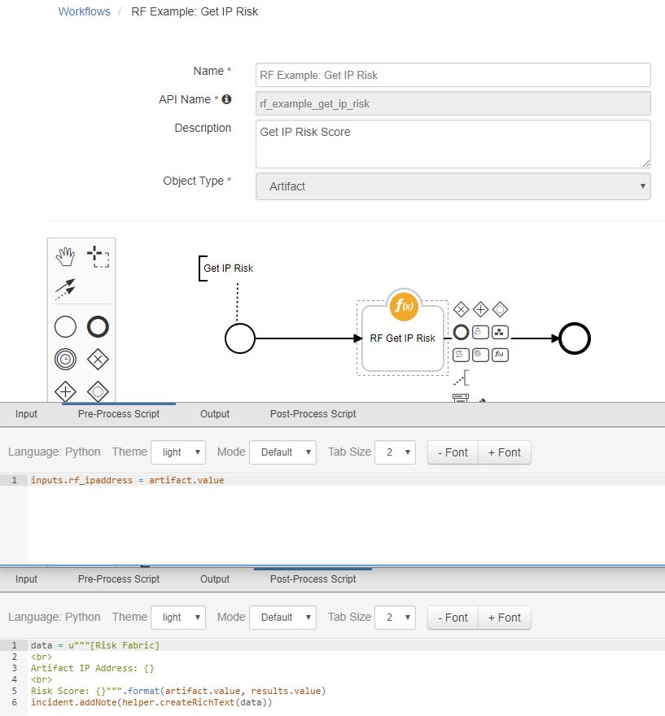
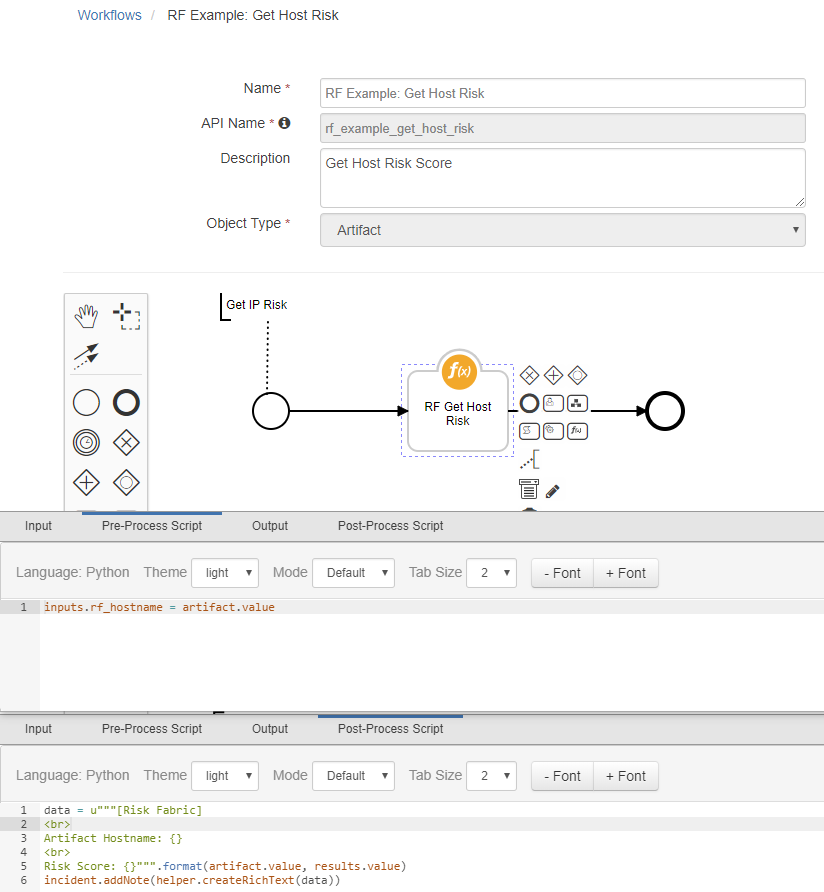
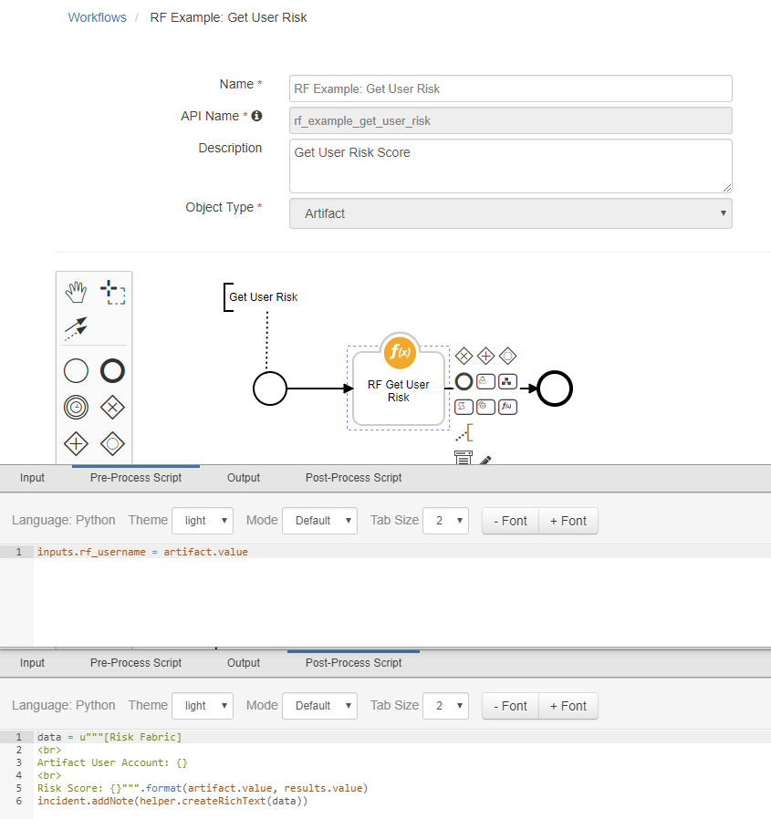
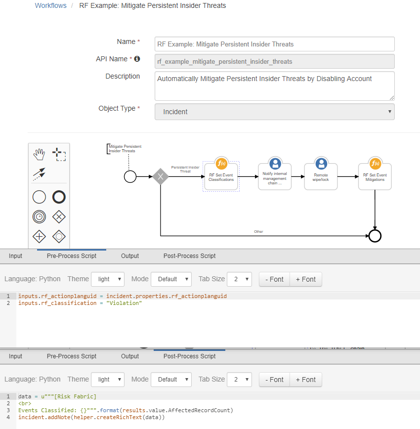

# Risk Fabric Function Integration

The Risk Fabric integration with the Resilient platform allows for the querying of risk ratings for artifacts such as IP addresses, computer endpoints, and users. Risk models, event scenarios, and action plans can be pulled into Resilient and created as incidents, and then fully mitigated or classified.

This package provides several functional integrations with Resilient and example workflows:
* Get Host, User, and IP Risk Information
* Get Action Plans
* Get Risk Model Instances and Details
* Set Event Classifications and Mitigations

## Risk Fabric Example Workflows

### RF Example: Get IP Risk
Example workflow for getting an IP address risk score. Workflow expects an IP address
artifact, and updates the artifact description based on the artifact value with a risk score.
Used by the example Menu Item rule with the same name to run this workflow.

### RF Example: Get Host Risk
Example workflow for getting a host risk score. Workflow expects a system name artifact,
and an adds an incident note based on the artifact value with a risk score. 
Used by the example Menu Item rule with the same name to run this workflow.

### RF Example: Get User Risk
Example workflow for getting a user risk score. Workflow expects a user account artifact,
and an adds an incident note based on the artifact value with a risk score.
Used by the example Menu Item rule with the same name to run this workflow.

### RF Example: Mitigate Persistent Insider Threats
Example workflow for classifying and mitigating persistent insider threats. Add other
integration functions such as disabling users in LDAP and notifying managers to create a
fully-automated mitigation process. Currently, workflow just adds Tasks as examples.

## Installation

This template project was generated by

    resilient-circuits codegen \
	-p fn_risk_fabric \
	-m risk_fabric_integration_functions \
	--workflow rf_example_get_host_risk rf_example_get_host_risk rf_example_get_user_risk rf_example_mitigate_persistent_insider_threats \
	--rule "RF Example: Get IP Risk" "RF Example: Get Host Risk" "RF Example: Get User Risk" "RF Example: Persistent Insider Threat" \
	--field rf_actionplanguid

To install in "development mode"

    pip install -e ./fn_risk_fabric/

After installation, the package will be loaded by `resilient-circuits run`.

To uninstall,

    pip uninstall fn_risk_fabric

To check for errors,

    pylint --disable=R,C,W fn_risk_fabric

To package for distribution,

    python setup.py sdist --formats=gztar

The resulting .tar.gz file can be installed using

    pip install fn_risk_fabric-<version>.tar.gz

## Configuration

Add message destinations, function inputs, and functions to the Resilient instance:

    resilient-circuits customize

Add configuration details to the Resilient config file:

    resilient-circuits config -u

Set the following values in the config file under the `[fn_risk_fabric]` section:

    server=https://www.riskfabric.com
    username=xxxxxxx
    password=xxxxxxx
    verifyFlag=True

## Example Create Incident Scripts

Resilient Incidents can be created through the Resilient Web Console, via the REST API, or with the Python resilient library. 

Here we copied the example create_incident.py python script and are using Risk Fabric Action Plans and Risk Models as sources of data.

Be sure to setup your config for Risk Fabric as described above and review the resilent example script documentation here:

https://github.com/ibmresilient/resilient-python-examples/tree/master/create-incident

### Example Create Incidents with Action Plans

The create_incidents_action_plan.py example python script located in the fn_risk_fabric/util directory will create incidents in Resilient with an incident type of "Action Plan" for any Risk Fabric Action Plans assigned to the "resilient" queue. 
 
To use this script, first make sure that an "RF Action Plan" Incident Type is created in Resilient.  To check this, go to "Customization Settings" and click on "Incident Types" tab and make sure "RF Action Plan" is in the list of Incident Types.  If not, then add it.

Use the following command to add "RF Action Plan" incidents to Resilient:

    python create_incidents_action_plans.py --itype "RF Action Plan" --queue resilient

When the incident is created, a comment to the Action Plan record in Risk Fabric will be made with the Resilient Incident ID.

### Example Create Incidents with Risk Models

The create_incidents_risk_model.py example python script located in the fn_risk_fabric/util directory will create incidents in Resilient with an incident type of "RF Risk Model" for any Risk Fabric Risk Models with a limit of 10 records.
 
To use this script, first make sure that an "RF Risk Model" Incident Type is created in Resilient.  To check this, go to "Customization Settings" and click on "Incident Types" tab and make sure "RF Risk Model" is in the list of Incident Types.  If not, then add it.

Use the following command to add "RF Risk Model" incidents to Resilient:

    python create_incidents_risk_models.py --itype "RF Risk Model" --limit 10
