<!--
  This README.md is generated by running:
  "resilient-sdk docgen -p fn_salesforce"

  This file was generated with resilient-sdk v50.0.85

  It is best edited using a Text Editor with a Markdown Previewer. VS Code
  is a good example. Checkout https://guides.github.com/features/mastering-markdown/
  for tips on writing with Markdown

  All fields followed by "::CHANGE_ME::"" should be manually edited

  If you make manual edits and run docgen again, a .bak file will be created

  Store any screenshots in the "doc/screenshots" directory and reference them like:
  

  NOTE: If your app is available in the container-format only, there is no need to mention the integration server in this readme.
-->

# Salesforce

## Table of Contents
- [Release Notes](#release-notes)
- [Overview](#overview)
  - [Key Features](#key-features)
- [Requirements](#requirements)
  - [SOAR platform](#soar-platform)
  - [Cloud Pak for Security](#cloud-pak-for-security)
  - [Proxy Server](#proxy-server)
  - [Python Environment](#python-environment)
- [Installation](#installation)
  - [Install](#install)
  - [App Configuration](#app-configuration)
- [Function - Salesforce: Add Comment to Salesforce Case](#function---salesforce-add-comment-to-salesforce-case)
- [Function - Salesforce: Create Case in Salesforce](#function---salesforce-create-case-in-salesforce)
- [Function - Salesforce: Create Task in Salesforce Case](#function---salesforce-create-task-in-salesforce-case)
- [Function - Salesforce: Get Account](#function---salesforce-get-account)
- [Function - Salesforce: Get Attachments from Salesforce](#function---salesforce-get-attachments-from-salesforce)
- [Function - Salesforce: Get Case](#function---salesforce-get-case)
- [Function - Salesforce: Get Case Comments](#function---salesforce-get-case-comments)
- [Function - Salesforce: Get Contact](#function---salesforce-get-contact)
- [Function - Salesforce: Get User](#function---salesforce-get-user)
- [Function - Salesforce: Post Attachment to Salesforce Case](#function---salesforce-post-attachment-to-salesforce-case)
- [Function - Salesforce: Sync Tasks Between Cases](#function---salesforce-sync-tasks-between-cases)
- [Function - Salesforce: Update Case Status](#function---salesforce-update-case-status)
- [Custom Fields](#custom-fields)
- [Playbooks](#playbooks)
- [Troubleshooting & Support](#troubleshooting--support)

---

## Release Notes
<!--
  Specify all changes in this release. Do not remove the release 
  notes of a previous release
-->
| Version | Date | Notes |
| ------- | ---- | ----- |
| 1.0.0 | 08/2023 | Initial Release |

---

## Overview
<!--
  Provide a high-level description of the function itself and its remote software or application.
  The text below is parsed from the "description" and "long_description" attributes in the setup.py file
-->
**IBM SOAR app - bidirectional synchronization and functions for Salesforce**

 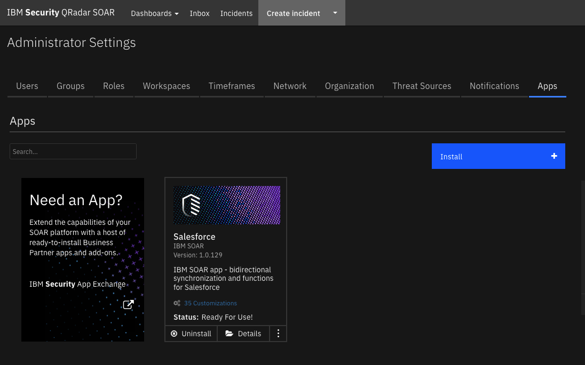 <!-- ::CHANGE_ME:: -->

Bi-directional App for Salesforce. Query Salesforce for Cases based 
         on user-defined query parameters and create and update cases in SOAR.<br>


        <ul><a target='blank' href='https://ibm.com/mysupport'>Support</a></ul>

        <ul><a target='blank' href='https://ideas.ibm.com/'>Enhancement Requests</a></ul>

### Key Features
<!--
  List the Key Features of the Integration
-->
* Key Feature 1 <!-- ::CHANGE_ME:: -->
* Key Feature 2 <!-- ::CHANGE_ME:: -->
* Key Feature 3 <!-- ::CHANGE_ME:: -->

---

## Requirements
<!--
  List any Requirements 
--> 
<!-- ::CHANGE_ME:: -->
This app supports the IBM Security QRadar SOAR Platform and the IBM Security QRadar SOAR for IBM Cloud Pak for Security.

### SOAR platform
The SOAR platform supports two app deployment mechanisms, Edge Gateway (formerly App Host) and integration server.

If deploying to a SOAR platform with an Edge Gateway, the requirements are:
* SOAR platform >= `46.0.8131`.
* The app is in a container-based format (available from the AppExchange as a `zip` file).

If deploying to a SOAR platform with an integration server, the requirements are:
* SOAR platform >= `46.0.8131`.
* The app is in the older integration format (available from the AppExchange as a `zip` file which contains a `tar.gz` file).
* Integration server is running `resilient-circuits>=49.0.0`.
* If using an API key account, make sure the account provides the following minimum permissions: 
  | Name | Permissions |
  | ---- | ----------- |
  | Org Data | Read |
  | Function | Read |
  | Incidents | Read, Create |
  | Edit Incidents | Fields, Status |
  | Layouts | Read, Edit |

The following SOAR platform guides provide additional information: 
* _Edge Gateway Deployment Guide_ or _App Host Deployment Guide_: provides installation, configuration, and troubleshooting information, including proxy server settings. 
* _Integration Server Guide_: provides installation, configuration, and troubleshooting information, including proxy server settings.
* _System Administrator Guide_: provides the procedure to install, configure and deploy apps. 

The above guides are available on the IBM Documentation website at [ibm.biz/soar-docs](https://ibm.biz/soar-docs). On this web page, select your SOAR platform version. On the follow-on page, you can find the _Edge Gateway Deployment Guide_, _App Host Deployment Guide_, or _Integration Server Guide_ by expanding **Apps** in the Table of Contents pane. The System Administrator Guide is available by expanding **System Administrator**.

### Cloud Pak for Security
If you are deploying to IBM Cloud Pak for Security, the requirements are:
* IBM Cloud Pak for Security >= `1.8`.
* Cloud Pak is configured with an Edge Gateway.
* The app is in a container-based format (available from the AppExchange as a `zip` file).

The following Cloud Pak guides provide additional information: 
* _Edge Gateway Deployment Guide_ or _App Host Deployment Guide_: provides installation, configuration, and troubleshooting information, including proxy server settings. From the Table of Contents, select Case Management and Orchestration & Automation > **Orchestration and Automation Apps**.
* _System Administrator Guide_: provides information to install, configure, and deploy apps. From the IBM Cloud Pak for Security IBM Documentation table of contents, select Case Management and Orchestration & Automation > **System administrator**.

These guides are available on the IBM Documentation website at [ibm.biz/cp4s-docs](https://ibm.biz/cp4s-docs). From this web page, select your IBM Cloud Pak for Security version. From the version-specific IBM Documentation page, select Case Management and Orchestration & Automation.

### Proxy Server
The app **does** support a proxy server.

### Python Environment
Python 3.6 and Python 3.9 are supported.
Additional package dependencies may exist for each of these packages:
* resilient-circuits>=49.0.0

### Salesforce Development Version

This app has been implemented using:
| Product Name | Product Version | API URL | API Version |
| ------------ | --------------- | ------- | ----------- |
| Salesforce | N/A |  | 58.0 |

#### Prerequisites
<!--
List any prerequisites that are needed to use with this endpoint solution. Remove any section that is unnecessary.
-->
* Prereq A <!-- ::CHANGE_ME:: -->
* Prereq B <!-- ::CHANGE_ME:: -->
* Prereq C <!-- ::CHANGE_ME:: -->

#### Configuration
<!--
List any steps that are needed to configure the endpoint to use this app.
-->
* Config A <!-- ::CHANGE_ME:: -->
* Config B <!-- ::CHANGE_ME:: -->
* Config C <!-- ::CHANGE_ME:: -->

#### Permissions
<!--
List any user permissions that are needed to use this endpoint. For example, list the API key permissions.
-->
* Permission A <!-- ::CHANGE_ME:: -->
* Permission B <!-- ::CHANGE_ME:: -->
* Permission C <!-- ::CHANGE_ME:: -->


---

## Installation

### Install
* To install or uninstall an App or Integration on the _SOAR platform_, see the documentation at [ibm.biz/soar-docs](https://ibm.biz/soar-docs).
* To install or uninstall an App on _IBM Cloud Pak for Security_, see the documentation at [ibm.biz/cp4s-docs](https://ibm.biz/cp4s-docs) and follow the instructions above to navigate to Orchestration and Automation.

### App Configuration
The following table provides the settings you need to configure the app. These settings are made in the app.config file. See the documentation discussed in the Requirements section for the procedure.

| Config | Required | Example | Description |
| ------ | :------: | ------- | ----------- |
| **api_version** | Yes | `v58.0` | *Salesforce REST API version |
| **consumer_key** | Yes | `xxx` | *Consumer Key of a Salesforce Connected App* |
| **consumer_secret** | Yes | `xxx` | *Consumer Secret of a Salesforce Connected App* |
| **my_domain_name** | Yes | `company.develop` | *My Domain name in Salesforce* |
| **my_domain_url** | Yes | `company.develop.my.salesforce.com` | *My Domain URL in Salesforce* |
| **polling_filters** | Yes | `("Status","IN",["\'New\'","\'Working\'","\'In Progress\'"])` | *Query filters: Comma separated tuples ("field","operator","value") where "field" is a case field name* |
| **polling_interval** | Yes | `60` | *Poller interval time in seconds. Value of zero to turn poller off.* |
| **polling_lookback** | Yes | `120` | *Number of minutes to look back for Salesforce caes. Value is only used on the first time polling when the app starts.* |
| **polling_record_type_names** | No | `"Security Incident","Incident"` | *Case record type names the poller queries each polling interval.  If not set all case record types are queried* |
| **verify** | Yes | `True` | *Boolean indicating whether to verify the Salesforce client certificate.* |


---

## Function - Salesforce: Add Comment to Salesforce Case
Add a comment to a Salesforce case.

 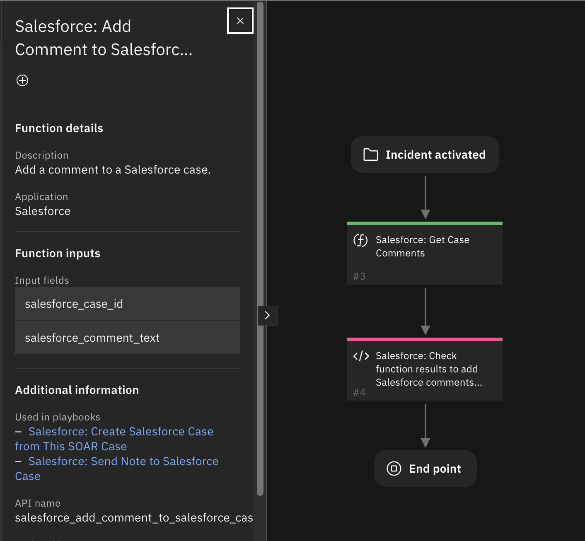 <!-- ::CHANGE_ME:: -->

<details><summary>Inputs:</summary>
<p>

| Name | Type | Required | Example | Tooltip |
| ---- | :--: | :------: | ------- | ------- |
| `salesforce_case_id` | `text` | Yes | `-` | - |
| `salesforce_comment_text` | `text` | Yes | `-` | - |

</p>
</details>

<details><summary>Outputs:</summary>
<p>

> **NOTE:** This example might be in JSON format, but `results` is a Python Dictionary on the SOAR platform.

```python
results = {
  "content": true,
  "inputs": {
    "salesforce_case_id": "500Hr00001X8WykIAF",
    "salesforce_comment_text": "Created by IBM SOAR: Case 2357 created in IBM SOAR"
  },
  "metrics": {
    "execution_time_ms": 1824,
    "host": "MacBook-Pro.local",
    "package": "fn-salesforce",
    "package_version": "1.0.0",
    "timestamp": "2023-07-18 15:29:53",
    "version": "1.0"
  },
  "raw": null,
  "reason": null,
  "success": true,
  "version": 2.0
}
```

</p>
</details>

<details><summary>Example Function Input Script:</summary>
<p>

```python
inputs.salesforce_case_id = incident.properties.salesforce_case_id
results = playbook.functions.results.salesforce_case_results
inputs.salesforce_comment_text = "This Salesforce case created from SOAR case {0} URL: {1}".format(incident.id, playbook.functions.results.salesforce_case_results.content.salesforce_case.soar_case_url)
```

</p>
</details>

<details><summary>Example Function Post Process Script:</summary>
<p>

```python
None
```

</p>
</details>

---
## Function - Salesforce: Create Case in Salesforce
Create a Salesforce case in Salesforce using the specified JSON case data.

 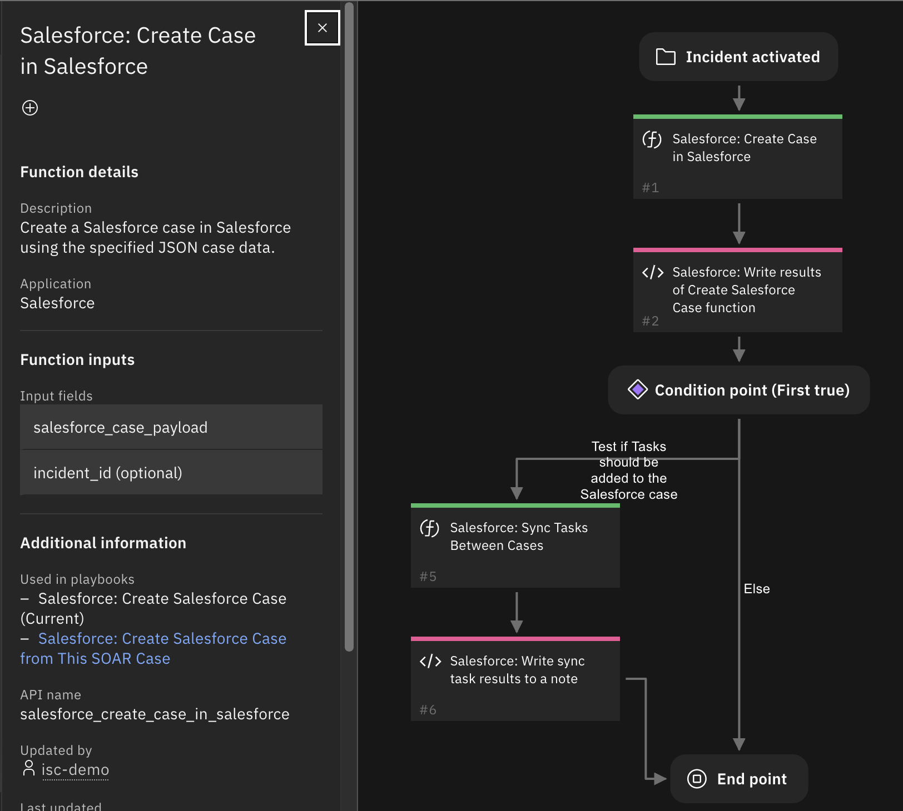 <!-- ::CHANGE_ME:: -->

<details><summary>Inputs:</summary>
<p>

| Name | Type | Required | Example | Tooltip |
| ---- | :--: | :------: | ------- | ------- |
| `incident_id` | `number` | No | `-` | - |
| `salesforce_case_payload` | `text` | Yes | `-` | - |

</p>
</details>

<details><summary>Outputs:</summary>
<p>

> **NOTE:** This example might be in JSON format, but `results` is a Python Dictionary on the SOAR platform.

```python
results = {
  "content": {
    "salesforce_case": {
      "errors": [],
      "id": "500Hr00001X906jIAB",
      "success": true
    }
  },
  "inputs": {
    "salesforce_case_data": "{\"Origin\": \"Web\", \"Status\": \"In Progress\", \"Description\": \"My Description\", \"Subject\": \"My Subject testing\", \"Reason\": \"Installation\"}"
  },
  "metrics": {
    "execution_time_ms": 12850,
    "host": "MacBook-Pro.local",
    "package": "fn-salesforce",
    "package_version": "1.0.0",
    "timestamp": "2023-07-20 11:18:51",
    "version": "1.0"
  },
  "raw": null,
  "reason": null,
  "success": true,
  "version": 2.0
}
```

</p>
</details>

<details><summary>Example Function Input Script:</summary>
<p>

```python
import json

case_json = {}
case_json['Origin'] = "Web"

if playbook.inputs.salesforce_case_status:
  case_json['Status'] = playbook.inputs.salesforce_case_status
else: 
  case_json['Status'] = "New"
  
if playbook.inputs.salesforce_case_type:
  case_json['Type'] = playbook.inputs.salesforce_case_type
  
if playbook.inputs.salesforce_case_description:
  case_json['Description'] = playbook.inputs.salesforce_case_description

if playbook.inputs.salesforce_case_subject:
  case_json['Subject'] = playbook.inputs.salesforce_case_subject

if playbook.inputs.salesforce_case_internal_comments:
  case_json['Comments'] = playbook.inputs.salesforce_case_internal_comments

if incident.properties.salesforce_account_id and incident.properties.salesforce_account_id != "None":
  case_json['AccountId'] = incident.properties.salesforce_account_id

if incident.properties.salesforce_owner_id and incident.properties.salesforce_owner_id != "None":
  case_json['OwnerId'] = incident.properties.salesforce_owner_id
  
if incident.properties.salesforce_contact_id and incident.properties.salesforce_contact_id != "None":
  case_json['ContactId'] = incident.properties.salesforce_contact_id
  
inputs.salesforce_case_payload = json.dumps(case_json)
inputs.incident_id = incident.id

```

</p>
</details>

<details><summary>Example Function Post Process Script:</summary>
<p>

```python
results = playbook.functions.results.create_salesforce_case_results
content = results.get("content")
salesforce_case = content.get("salesforce_case")

if results.success:
  note_text = "<b>Salesforce: Create Case in Salesforce</b> created Case with CaseId: {}".format(salesforce_case.get("id", None))
  if salesforce_case.get("entity_url", None):
    note_text = note_text + "   <a target='_blank' href='{0}'>Link</a>".format(salesforce_case.get("entity_url"))
else:
  note_text = "<b>Salesforce: Create Case in Saleforce</b> failed:<br>{}".format(salesforce_case.get("error", None))
  
incident.addNote(note_text)
```

</p>
</details>

---
## Function - Salesforce: Create Task in Salesforce Case
Create a SOAR task in a Salesforce case.

 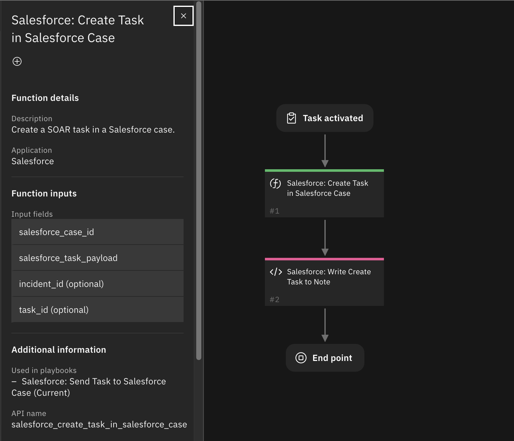 <!-- ::CHANGE_ME:: -->

<details><summary>Inputs:</summary>
<p>

| Name | Type | Required | Example | Tooltip |
| ---- | :--: | :------: | ------- | ------- |
| `incident_id` | `number` | No | `-` | - |
| `salesforce_case_id` | `text` | Yes | `-` | - |
| `salesforce_task_payload` | `text` | Yes | `-` | task data in json format converted to a string |
| `task_id` | `number` | No | `-` | - |

</p>
</details>

<details><summary>Outputs:</summary>
<p>

> **NOTE:** This example might be in JSON format, but `results` is a Python Dictionary on the SOAR platform.

```python
results = {
  "content": {
    "salesforce_task": {
      "errors": [],
      "id": "00THr00008eYnBkMAK",
      "success": true
    }
  },
  "inputs": {
    "incident_id": 2108,
    "salesforce_case_id": "500Hr00001Wthb4IAB",
    "salesforce_task_data": "{\"WhatId\": \"500Hr00001Wthb4IAB\", \"Description\": \"Task from IBM SOAR case\", \"Subject\": \"Investigate Exposure of Personal Information/Data\", \"Priority\": \"Normal\", \"Status\": \"In Progress\"}",
    "task_id": 14
  },
  "metrics": {
    "execution_time_ms": 7112,
    "host": "MacBook-Pro.local",
    "package": "fn-salesforce",
    "package_version": "1.0.0",
    "timestamp": "2023-08-02 17:17:32",
    "version": "1.0"
  },
  "raw": null,
  "reason": null,
  "success": true,
  "version": 2.0
}
```

</p>
</details>

<details><summary>Example Function Input Script:</summary>
<p>

```python
import json

inputs.incident_id = incident.id
inputs.task_id = task.id
inputs.salesforce_case_id = incident.properties.salesforce_case_id
task_json = {}

task_json['WhatId'] = inputs.salesforce_case_id

description = "Task from IBM SOAR case {}".format(incident.id)
if task.instructions:
  description = description + ": {}".format(task.instructions.content)

task_json['Description'] = description

if task.due_date:
  task_json['ActivityDate'] = task.due_date
  
if task.name:
  task_json['Subject'] = task.name

if playbook.inputs.task_priority:
  task_json['Priority'] = playbook.inputs.task_priority
  
if playbook.inputs.task_status:
  task_json['Status'] = playbook.inputs.task_status
  
inputs.salesforce_task_payload = json.dumps(task_json)
```

</p>
</details>

<details><summary>Example Function Post Process Script:</summary>
<p>

```python
results = playbook.functions.results.create_task_results
content = results.get("content")
salesforce_task = content.get("salesforce_task")

if results.success:
  note_text = "<b>Salesforce: Create Task in Salesforce</b> created with TaskId: {}".format(salesforce_task.get("id", None))
else:
    note_text = "<b>Salesforce: Create Task in Salesforce</b> failed:<br>{}".format(salesforce_task.get("error", None))
  
incident.addNote(note_text)
```

</p>
</details>

---
## Function - Salesforce: Get Account
Get the Salesforce account information for the specified Salesforce AccountId.

 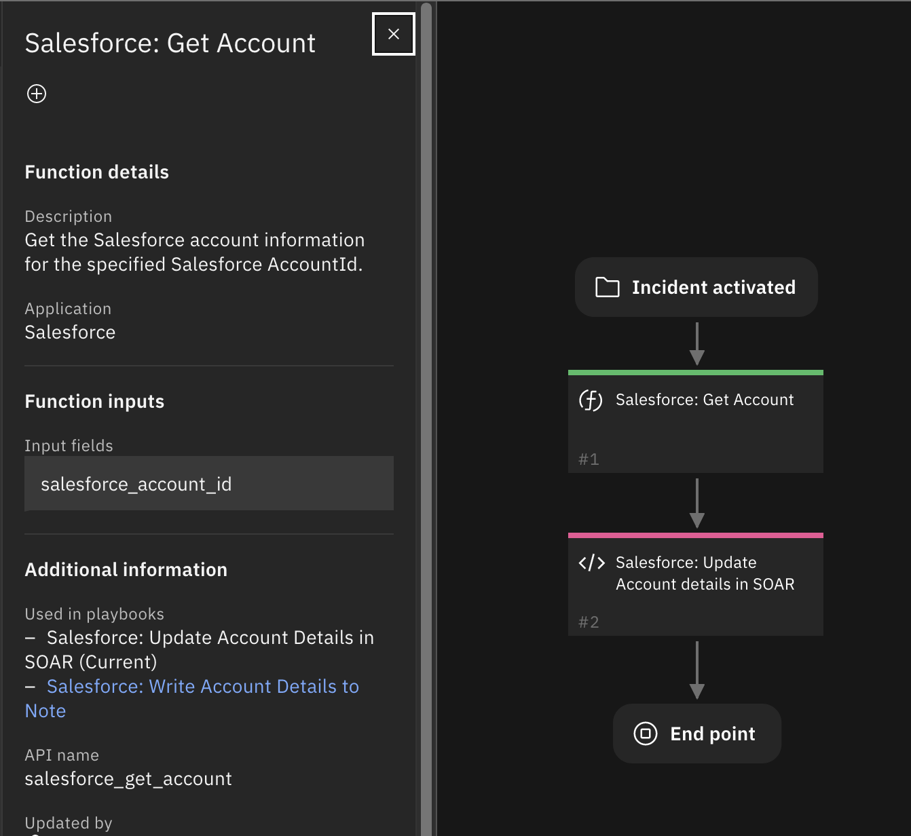 <!-- ::CHANGE_ME:: -->

<details><summary>Inputs:</summary>
<p>

| Name | Type | Required | Example | Tooltip |
| ---- | :--: | :------: | ------- | ------- |
| `salesforce_account_id` | `text` | Yes | `-` | - |

</p>
</details>

<details><summary>Outputs:</summary>
<p>

> **NOTE:** This example might be in JSON format, but `results` is a Python Dictionary on the SOAR platform.

```python
results = {
  "content": {
    "salesforce_account": {
      "AccountNumber": null,
      "AccountSource": null,
      "Active__c": null,
      "AnnualRevenue": null,
      "BillingAddress": null,
      "BillingCity": null,
      "BillingCountry": null,
      "BillingGeocodeAccuracy": null,
      "BillingLatitude": null,
      "BillingLongitude": null,
      "BillingPostalCode": null,
      "BillingState": null,
      "BillingStreet": null,
      "CreatedById": "005Hr00000COneZIAT",
      "CreatedDate": "2023-06-16T18:28:22.000+0000",
      "CustomerPriority__c": null,
      "DandbCompanyId": null,
      "Description": null,
      "DunsNumber": null,
      "Fax": null,
      "Id": "001Hr00001kFBihIAG",
      "Industry": null,
      "IsDeleted": false,
      "Jigsaw": null,
      "JigsawCompanyId": null,
      "LastActivityDate": null,
      "LastModifiedById": "005Hr00000COneZIAT",
      "LastModifiedDate": "2023-06-16T18:28:22.000+0000",
      "LastReferencedDate": "2023-07-17T19:04:52.000+0000",
      "LastViewedDate": "2023-07-17T19:04:52.000+0000",
      "MasterRecordId": null,
      "NaicsCode": null,
      "NaicsDesc": null,
      "Name": "IBM SOAR",
      "NumberOfEmployees": null,
      "NumberofLocations__c": null,
      "OwnerId": "005Hr00000COneZIAT",
      "Ownership": null,
      "ParentId": null,
      "Phone": null,
      "PhotoUrl": null,
      "Rating": "Hot",
      "SLAExpirationDate__c": null,
      "SLASerialNumber__c": null,
      "SLA__c": null,
      "ShippingAddress": null,
      "ShippingCity": null,
      "ShippingCountry": null,
      "ShippingGeocodeAccuracy": null,
      "ShippingLatitude": null,
      "ShippingLongitude": null,
      "ShippingPostalCode": null,
      "ShippingState": null,
      "ShippingStreet": null,
      "Sic": null,
      "SicDesc": null,
      "Site": null,
      "SystemModstamp": "2023-06-16T18:28:22.000+0000",
      "TickerSymbol": null,
      "Tradestyle": null,
      "Type": null,
      "UpsellOpportunity__c": null,
      "Website": null,
      "YearStarted": null,
      "attributes": {
        "type": "Account",
        "url": "/services/data/v58.0/sobjects/Account/001Hr00001kFBihIAG"
      }
    }
  },
  "inputs": {
    "salesforce_account_id": "001Hr00001kFBihIAG"
  },
  "metrics": {
    "execution_time_ms": 262,
    "host": "MacBook-Pro.local",
    "package": "fn-salesforce",
    "package_version": "1.0.0",
    "timestamp": "2023-07-17 15:08:09",
    "version": "1.0"
  },
  "raw": null,
  "reason": null,
  "success": true,
  "version": 2.0
}
```

</p>
</details>

<details><summary>Example Function Input Script:</summary>
<p>

```python
inputs.salesforce_account_id = incident.properties.salesforce_account_id
```

</p>
</details>

<details><summary>Example Function Post Process Script:</summary>
<p>

```python
results = playbook.functions.results.account_details

if results.success:
  content = results.get("content", {})
  if content:
    account = content.get("salesforce_account", None)
    if account:
      incident.properties.salesforce_account_name = account.get("Name", None)
else:
  incident.addNote("Salesforce: unable to get account details for Account Id ")
```

</p>
</details>

---
## Function - Salesforce: Get Attachments from Salesforce
Get attachments associated with a Salesforce case and add the attachments in the corresponding SOAR case.

 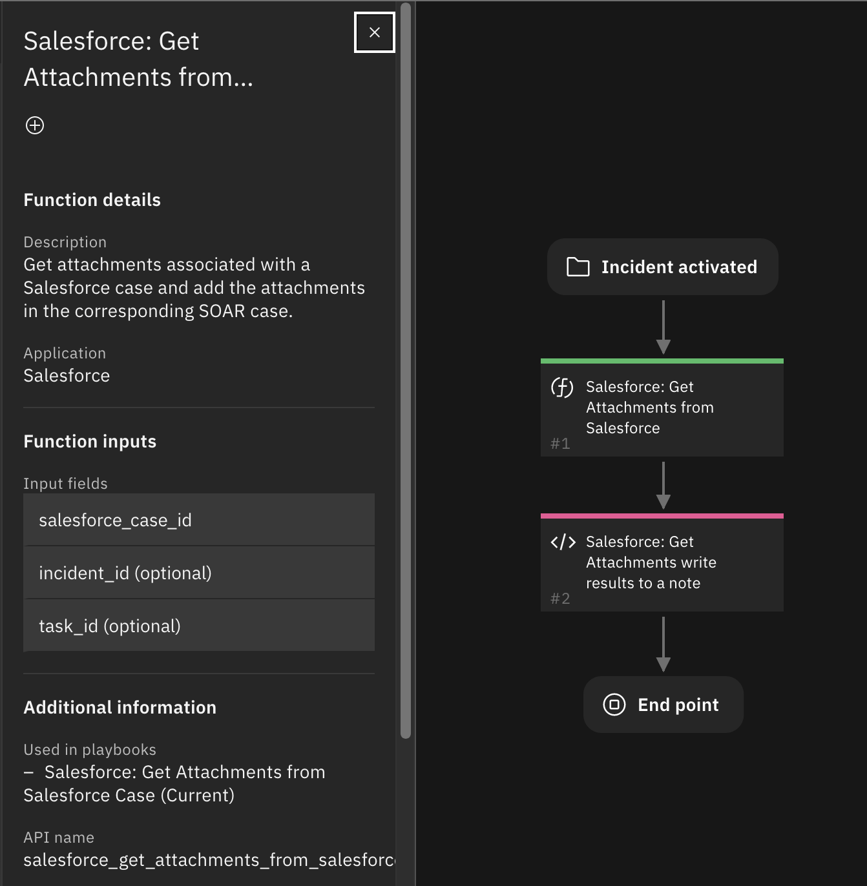 <!-- ::CHANGE_ME:: -->

<details><summary>Inputs:</summary>
<p>

| Name | Type | Required | Example | Tooltip |
| ---- | :--: | :------: | ------- | ------- |
| `incident_id` | `number` | No | `-` | - |
| `salesforce_case_id` | `text` | Yes | `-` | - |
| `task_id` | `number` | No | `-` | - |

</p>
</details>

<details><summary>Outputs:</summary>
<p>

> **NOTE:** This example might be in JSON format, but `results` is a Python Dictionary on the SOAR platform.

```python
results = {
  "content": {
    "salesforce_attachments": [
      "test.txt"
    ]
  },
  "inputs": {
    "incident_id": 2522,
    "salesforce_case_id": "500Hr00001X98NnIAJ",
    "task_id": null
  },
  "metrics": {
    "execution_time_ms": 6912,
    "host": "MacBook-Pro.local",
    "package": "fn-salesforce",
    "package_version": "1.0.0",
    "timestamp": "2023-07-25 12:50:08",
    "version": "1.0"
  },
  "raw": null,
  "reason": null,
  "success": true,
  "version": 2.0
}
```

</p>
</details>

<details><summary>Example Function Input Script:</summary>
<p>

```python
inputs.incident_id = incident.id
inputs.task_id = None
inputs.salesforce_case_id = incident.properties.salesforce_case_id
```

</p>
</details>

<details><summary>Example Function Post Process Script:</summary>
<p>

```python
results = playbook.functions.results.get_attachments_results

if results.success:
  salesforce_attachments = results.content.salesforce_attachments
  note_text = "<b>Salesforce: Get Attachments:</b> added {} attachments to incident:<br>".format(len(salesforce_attachments))
  for attachment_name in salesforce_attachments:
    note_text = note_text + "<br>{}".format(attachment_name)
else:
  note_text = "<b>Salesforce: Get Attachments</b> failed to get attachments from Salesforce."
incident.addNote(note_text)

```

</p>
</details>

---
## Function - Salesforce: Get Case
Get Case information from a specified Salesforce CaseId.

 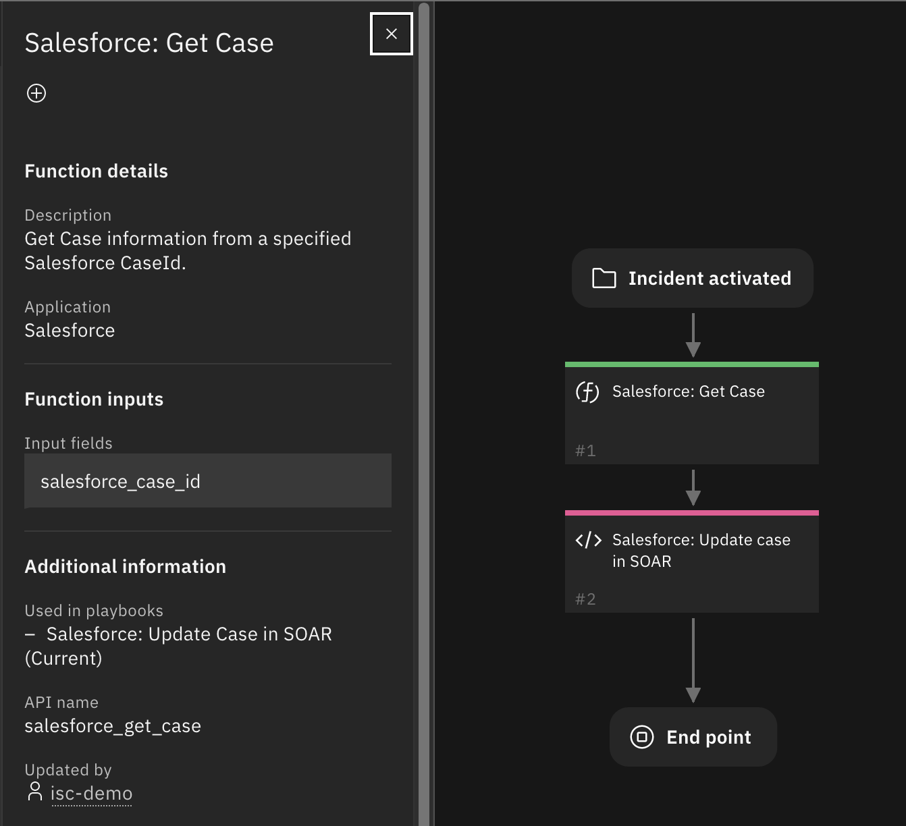 <!-- ::CHANGE_ME:: -->

<details><summary>Inputs:</summary>
<p>

| Name | Type | Required | Example | Tooltip |
| ---- | :--: | :------: | ------- | ------- |
| `salesforce_case_id` | `text` | Yes | `-` | - |

</p>
</details>

<details><summary>Outputs:</summary>
<p>

> **NOTE:** This example might be in JSON format, but `results` is a Python Dictionary on the SOAR platform.

```python
results = {
  "content": {
    "salesforce_case": {
      "AccountId": "001Hr00001kFBihIAG",
      "AssetId": null,
      "CaseNumber": "00001064",
      "ClosedDate": null,
      "Comments": null,
      "ContactEmail": null,
      "ContactFax": null,
      "ContactId": null,
      "ContactMobile": null,
      "ContactPhone": null,
      "CreatedById": "005Hr00000COneZIAT",
      "CreatedDate": "2023-07-07T21:40:12.000+0000",
      "Description": "Testing SOAR poller for new cases",
      "EngineeringReqNumber__c": null,
      "Id": "500Hr00001VhyicIAB",
      "IsClosed": false,
      "IsDeleted": false,
      "IsEscalated": false,
      "LastModifiedById": "005Hr00000COneZIAT",
      "LastModifiedDate": "2023-07-17T19:04:23.000+0000",
      "LastReferencedDate": "2023-07-17T19:04:39.000+0000",
      "LastViewedDate": "2023-07-17T19:04:39.000+0000",
      "MasterRecordId": null,
      "Origin": "Web",
      "OwnerId": "005Hr00000COneZIAT",
      "ParentId": null,
      "PotentialLiability__c": null,
      "Priority": "Medium",
      "Product__c": null,
      "Reason": "Equipment Complexity",
      "SLAViolation__c": null,
      "Status": "New",
      "Subject": "SOAR Test Case",
      "SuppliedCompany": null,
      "SuppliedEmail": "user@qradar.dev",
      "SuppliedName": null,
      "SuppliedPhone": "444-444-4444",
      "SystemModstamp": "2023-07-17T19:04:23.000+0000",
      "Type": "Mechanical",
      "attributes": {
        "type": "Case",
        "url": "/services/data/v58.0/sobjects/Case/500Hr00001VhyicIAB"
      },
      "entity_url": "https://dev-ed.develop.lightning.force.com/lightning/r/Case/500Hr00001VhyicIAB/view"
    }
  },
  "inputs": {
    "salesforce_case_id": "500Hr00001VhyicIAB"
  },
  "metrics": {
    "execution_time_ms": 265,
    "host": "MacBook-Pro.local",
    "package": "fn-salesforce",
    "package_version": "1.0.0",
    "timestamp": "2023-07-17 15:07:07",
    "version": "1.0"
  },
  "raw": null,
  "reason": null,
  "success": true,
  "version": 2.0
}
```

</p>
</details>

<details><summary>Example Function Input Script:</summary>
<p>

```python
inputs.salesforce_case_id = incident.properties.salesforce_case_id
```

</p>
</details>

<details><summary>Example Function Post Process Script:</summary>
<p>

```python
results = playbook.functions.results.salesforce_case_results

TYPE_LOOKUP = {
  'None': "TBD / Unknown",
  'Communication error (fax; email)' : 'Communication error (fax; email)',
  'Customization Packages (internal)': 'Customization Packages (internal)',
  'Denial of Service':                 'Denial of Service',
  'Improper disposal: digital assets': 'Improper disposal: digital assets',
  'Improper disposal: documents / files / records': 'Improper disposal: documents / files / records',
  'Lost documents / files / records':  'Lost documents / files / records',
  'Lost PC / laptop / tablet':         'Lost PC / laptop / tablet',
  'Lost storage device / media':       'Lost storage device / media',
  'Malware':                           'Malware',
  'Not an Issue':                      'Not an Issue',
  'Other':                             'Other',
  'Phishing':                          'Phishing',
  'Stolen documents / files / records':'Stolen documents / files / records',
  'Stolen PC / laptop / tablet':       'Stolen PC / laptop / tablet',
  'Stolen PDA / smartphone':           'Stolen PDA / smartphone',
  'Stolen storage device / media':     'Stolen storage device / media',
  'System Intrusion':                  'System Intrusion',
  'TBD / Unknown':                     'TBD / Unknown',
  'Vendor / 3rd party error':          'Vendor / 3rd party error'
}


if not results.success:
    incident.addNote("Salesforce: Update custom fields: Unable to get case data to update custom fields.")
else:
    content = results.get("content", {})
    sf_case =content.get("salesforce_case")
    incident.properties.salesforce_account_id = sf_case.get("AccountId")
    incident.properties.salesforce_contact_id = sf_case.get("ContactId")
    incident.properties.salesforce_owner_id = sf_case.get("OwnerId")
    incident.properties.salesforce_case_number = sf_case.get("CaseNumber")
    incident.properties.salesforce_case_type = TYPE_LOOKUP.get(sf_case.get("Type"), "None")
    incident.properties.salesforce_contact_phone = sf_case.get("ContactPhone")
    incident.properties.salesforce_contact_email = sf_case.get("ContactEmail")    
    incident.properties.salesforce_contact_fax = sf_case.get("ContactFax")
    incident.properties.salesforce_supplied_name = sf_case.get("SuppliedName")
    incident.properties.salesforce_supplied_phone = sf_case.get("SuppliedPhone")
    incident.properties.salesforce_supplied_email = sf_case.get("SuppliedEmail")    
    incident.properties.salesforce_supplied_company = sf_case.get("SuppliedCompany")
    incident.properties.salesforce_origin = sf_case.get("Origin")
    incident.properties.salesforce_status = sf_case.get("Status")
    entity_url = sf_case.get("entity_url", None)
    if entity_url:
      incident.properties.salesforce_case_link = "<a target='_blank' href='{0}'>{1}</a>".format(entity_url, sf_case.get("CaseNumber"))
      
    # Add Salesforce case Comments as a note
    sf_case_comments = sf_case.get("Comments", None)
    if sf_case_comments:
        incident.addNote(helper.createRichText("<b>Created by Salesforce:</b><br> {}".format(sf_case_comments)))
```

</p>
</details>

---
## Function - Salesforce: Get Case Comments
Get the comments from the Salesforce case.

 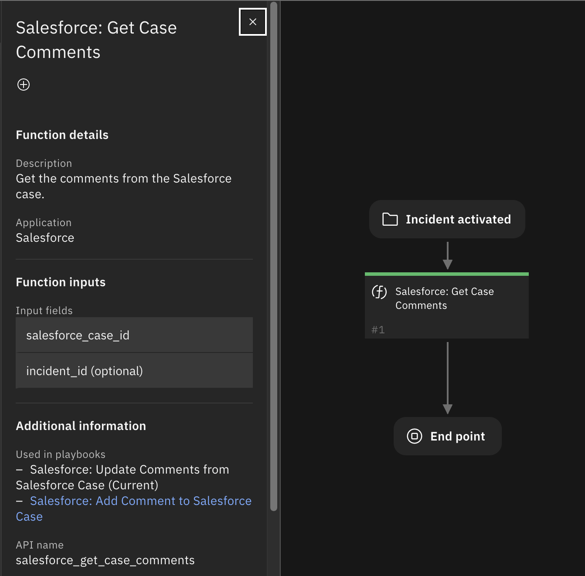 <!-- ::CHANGE_ME:: -->

<details><summary>Inputs:</summary>
<p>

| Name | Type | Required | Example | Tooltip |
| ---- | :--: | :------: | ------- | ------- |
| `incident_id` | `number` | No | `-` | - |
| `salesforce_case_id` | `text` | Yes | `-` | - |

</p>
</details>

<details><summary>Outputs:</summary>
<p>

> **NOTE:** This example might be in JSON format, but `results` is a Python Dictionary on the SOAR platform.

```python
results = {
  "content": {
    "count": 1
  },
  "inputs": {
    "incident_id": 2312,
    "salesforce_case_id": "500Hr00001VhyicIAB"
  },
  "metrics": {
    "execution_time_ms": 4220,
    "host": "MacBook-Pro.local",
    "package": "fn-salesforce",
    "package_version": "1.0.0",
    "timestamp": "2023-07-17 15:09:28",
    "version": "1.0"
  },
  "raw": null,
  "reason": null,
  "success": true,
  "version": 2.0
}
```

</p>
</details>

<details><summary>Example Function Input Script:</summary>
<p>

```python
inputs.incident_id = incident.id
inputs.salesforce_case_id = incident.properties.salesforce_case_id
```

</p>
</details>

<details><summary>Example Function Post Process Script:</summary>
<p>

```python
results  = playbook.functions.results.get_comment_results

if results.success:
  incident.addNote("Salesforce: automatic playbook added {} notes from Salesforce".format(results.content.count))
else:
  incident.addNote("Salesforce: ERROR in automatic playbook to get Salesforce case comments - function not successful.")
```

</p>
</details>

---
## Function - Salesforce: Get Contact
Get the detailed information on the specified Salesforce Contact, give the ContactId.

 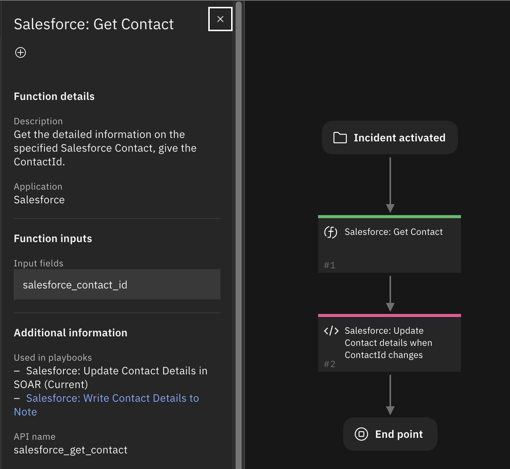 <!-- ::CHANGE_ME:: -->

<details><summary>Inputs:</summary>
<p>

| Name | Type | Required | Example | Tooltip |
| ---- | :--: | :------: | ------- | ------- |
| `salesforce_contact_id` | `text` | Yes | `-` | - |

</p>
</details>

<details><summary>Outputs:</summary>
<p>

> **NOTE:** This example might be in JSON format, but `results` is a Python Dictionary on the SOAR platform.

```python
results = {
  "content": {
    "salesforce_contact": {
      "AccountId": null,
      "AssistantName": null,
      "AssistantPhone": null,
      "Birthdate": null,
      "CreatedById": "005Hr00000COneZIAT",
      "CreatedDate": "2023-06-16T18:29:41.000+0000",
      "Department": null,
      "Description": null,
      "Email": null,
      "EmailBouncedDate": null,
      "EmailBouncedReason": null,
      "Fax": null,
      "FirstName": "John",
      "HomePhone": null,
      "Id": "003Hr00002REwc8IAD",
      "IndividualId": null,
      "IsDeleted": false,
      "IsEmailBounced": false,
      "Jigsaw": null,
      "JigsawContactId": null,
      "Languages__c": null,
      "LastActivityDate": null,
      "LastCURequestDate": null,
      "LastCUUpdateDate": null,
      "LastModifiedById": "005Hr00000COneZIAT",
      "LastModifiedDate": "2023-06-16T18:29:41.000+0000",
      "LastName": "Doe",
      "LastReferencedDate": "2023-07-17T18:58:39.000+0000",
      "LastViewedDate": "2023-07-17T18:58:39.000+0000",
      "LeadSource": null,
      "Level__c": null,
      "MailingAddress": null,
      "MailingCity": null,
      "MailingCountry": null,
      "MailingGeocodeAccuracy": null,
      "MailingLatitude": null,
      "MailingLongitude": null,
      "MailingPostalCode": null,
      "MailingState": null,
      "MailingStreet": null,
      "MasterRecordId": null,
      "MobilePhone": null,
      "Name": "John Doe",
      "OtherAddress": null,
      "OtherCity": null,
      "OtherCountry": null,
      "OtherGeocodeAccuracy": null,
      "OtherLatitude": null,
      "OtherLongitude": null,
      "OtherPhone": null,
      "OtherPostalCode": null,
      "OtherState": null,
      "OtherStreet": null,
      "OwnerId": "005Hr00000COneZIAT",
      "Phone": null,
      "PhotoUrl": null,
      "ReportsToId": null,
      "Salutation": "Mr.",
      "SystemModstamp": "2023-06-16T18:29:41.000+0000",
      "Title": null,
      "attributes": {
        "type": "Contact",
        "url": "/services/data/v58.0/sobjects/Contact/003Hr00002REwc8IAD"
      }
    }
  },
  "inputs": {
    "salesforce_contact_id": "003Hr00002REwc8IAD"
  },
  "metrics": {
    "execution_time_ms": 308,
    "host": "MacBook-Pro.local",
    "package": "fn-salesforce",
    "package_version": "1.0.0",
    "timestamp": "2023-07-17 15:04:52",
    "version": "1.0"
  },
  "raw": null,
  "reason": null,
  "success": true,
  "version": 2.0
}
```

</p>
</details>

<details><summary>Example Function Input Script:</summary>
<p>

```python
inputs.salesforce_contact_id = incident.properties.salesforce_contact_id if incident.properties.salesforce_contact_id else helper.fail("Error: ContactId is None")
```

</p>
</details>

<details><summary>Example Function Post Process Script:</summary>
<p>

```python
import json

results = playbook.functions.results.contact_results

if results.success:
  content = results.get("content", {})
  contact = content.get("salesforce_contact", {})
  note_text = "Contact Details: <br>{0}".format(json.dumps(contact, indent=4))
  incident.addNote(helper.createRichText(note_text))
else:
  incident.addNote("Unable to get Contact details from Salesforce.")
```

</p>
</details>

---
## Function - Salesforce: Get User
Get the detailed information of a Salesforce User, given the UserId.

 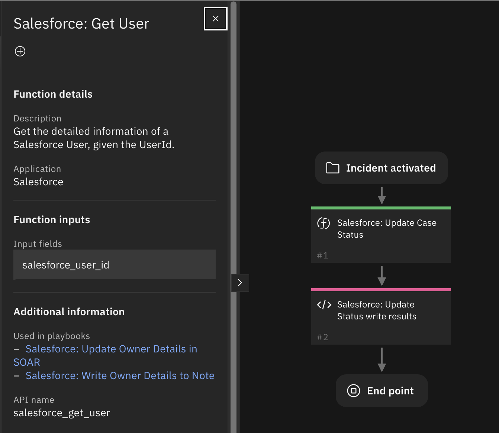 <!-- ::CHANGE_ME:: -->

<details><summary>Inputs:</summary>
<p>

| Name | Type | Required | Example | Tooltip |
| ---- | :--: | :------: | ------- | ------- |
| `salesforce_user_id` | `text` | Yes | `-` | - |

</p>
</details>

<details><summary>Outputs:</summary>
<p>

> **NOTE:** This example might be in JSON format, but `results` is a Python Dictionary on the SOAR platform.

```python
results = {
  "content": {
    "salesforce_user": {
      "AboutMe": null,
      "AccountId": null,
      "Address": null,
      "Alias": "anorc",
      "BadgeText": "",
      "BannerPhotoUrl": "/profilephoto/005/B",
      "CallCenterId": null,
      "City": null,
      "CommunityNickname": "User1686331325735812",
      "CompanyName": null,
      "ContactId": null,
      "Country": null,
      "CreatedById": "005Hr00000COnUsIAL",
      "CreatedDate": "2023-06-09T17:22:47.000+0000",
      "DefaultGroupNotificationFrequency": "D",
      "DelegatedApproverId": null,
      "Department": null,
      "DigestFrequency": "D",
      "Division": null,
      "Email": "user@example.com",
      "EmailEncodingKey": "UTF-8",
      "EmailPreferencesAutoBcc": true,
      "EmailPreferencesAutoBccStayInTouch": false,
      "EmailPreferencesStayInTouchReminder": true,
      "EmployeeNumber": null,
      "Extension": null,
      "Fax": null,
      "FederationIdentifier": null,
      "FirstName": "Joe",
      "ForecastEnabled": false,
      "FullPhotoUrl": "https://ibmc4s-qradar-dev-dev-ed.develop.file.force.com/profilephoto/005/F",
      "GeocodeAccuracy": null,
      "Id": "005Hr00000COneZIAT",
      "IndividualId": null,
      "IsActive": true,
      "IsExtIndicatorVisible": false,
      "IsProfilePhotoActive": false,
      "JigsawImportLimitOverride": 300,
      "LanguageLocaleKey": "en_US",
      "LastLoginDate": "2023-07-18T20:46:26.000+0000",
      "LastModifiedById": "005Hr00000COneZIAT",
      "LastModifiedDate": "2023-07-11T18:40:31.000+0000",
      "LastName": "MyLastName",
      "LastPasswordChangeDate": "2023-07-06T12:55:58.000+0000",
      "LastReferencedDate": "2023-07-18T20:46:37.000+0000",
      "LastViewedDate": "2023-07-18T20:46:37.000+0000",
      "Latitude": null,
      "LocaleSidKey": "en_US",
      "Longitude": null,
      "ManagerId": null,
      "MediumBannerPhotoUrl": "/profilephoto/005/E",
      "MediumPhotoUrl": "https://ibmc4s-qradar-dev-dev-ed.develop.file.force.com/profilephoto/005/M",
      "MobilePhone": null,
      "Name": "Joe MyLastName",
      "NumberOfFailedLogins": 0,
      "OfflinePdaTrialExpirationDate": null,
      "OfflineTrialExpirationDate": null,
      "OutOfOfficeMessage": "",
      "Phone": null,
      "PostalCode": null,
      "ProfileId": "00eHr000001gfgwIAA",
      "ReceivesAdminInfoEmails": true,
      "ReceivesInfoEmails": true,
      "SenderEmail": null,
      "SenderName": null,
      "Signature": null,
      "SmallBannerPhotoUrl": "/profilephoto/005/D",
      "SmallPhotoUrl": "https://ibmc4s-qradar-dev-dev-ed.develop.file.force.com/profilephoto/005/T",
      "State": null,
      "StayInTouchNote": null,
      "StayInTouchSignature": null,
      "StayInTouchSubject": null,
      "Street": null,
      "SystemModstamp": "2023-07-17T15:13:07.000+0000",
      "TimeZoneSidKey": "America/Los_Angeles",
      "Title": null,
      "UserPermissionsCallCenterAutoLogin": false,
      "UserPermissionsInteractionUser": false,
      "UserPermissionsJigsawProspectingUser": false,
      "UserPermissionsKnowledgeUser": false,
      "UserPermissionsLiveAgentUser": false,
      "UserPermissionsMarketingUser": false,
      "UserPermissionsOfflineUser": false,
      "UserPermissionsSFContentUser": true,
      "UserPermissionsSiteforceContributorUser": false,
      "UserPermissionsSiteforcePublisherUser": false,
      "UserPermissionsSupportUser": false,
      "UserPermissionsWorkDotComUserFeature": false,
      "UserPreferencesActivityRemindersPopup": true,
      "UserPreferencesApexPagesDeveloperMode": false,
      "UserPreferencesCacheDiagnostics": false,
      "UserPreferencesContentEmailAsAndWhen": false,
      "UserPreferencesContentNoEmail": false,
      "UserPreferencesCreateLEXAppsWTShown": false,
      "UserPreferencesDisableAllFeedsEmail": false,
      "UserPreferencesEventRemindersCheckboxDefault": true,
      "UserPreferencesExcludeMailAppAttachments": false,
      "UserPreferencesFavoritesShowTopFavorites": false,
      "UserPreferencesFavoritesWTShown": false,
      "UserPreferencesGlobalNavBarWTShown": false,
      "UserPreferencesGlobalNavGridMenuWTShown": false,
      "UserPreferencesHasCelebrationBadge": false,
      "UserPreferencesHasSentWarningEmail": false,
      "UserPreferencesHasSentWarningEmail238": false,
      "UserPreferencesHasSentWarningEmail240": false,
      "UserPreferencesHideBiggerPhotoCallout": false,
      "UserPreferencesHideCSNDesktopTask": false,
      "UserPreferencesHideCSNGetChatterMobileTask": false,
      "UserPreferencesHideChatterOnboardingSplash": false,
      "UserPreferencesHideEndUserOnboardingAssistantModal": false,
      "UserPreferencesHideLightningMigrationModal": false,
      "UserPreferencesHideS1BrowserUI": true,
      "UserPreferencesHideSecondChatterOnboardingSplash": false,
      "UserPreferencesHideSfxWelcomeMat": true,
      "UserPreferencesJigsawListUser": false,
      "UserPreferencesLightningExperiencePreferred": true,
      "UserPreferencesNativeEmailClient": false,
      "UserPreferencesNewLightningReportRunPageEnabled": false,
      "UserPreferencesPathAssistantCollapsed": false,
      "UserPreferencesPreviewCustomTheme": false,
      "UserPreferencesPreviewLightning": false,
      "UserPreferencesReceiveNoNotificationsAsApprover": false,
      "UserPreferencesReceiveNotificationsAsDelegatedApprover": false,
      "UserPreferencesRecordHomeReservedWTShown": false,
      "UserPreferencesRecordHomeSectionCollapseWTShown": false,
      "UserPreferencesReminderSoundOff": false,
      "UserPreferencesReverseOpenActivitiesView": false,
      "UserPreferencesSRHOverrideActivities": false,
      "UserPreferencesShowCityToExternalUsers": false,
      "UserPreferencesShowCityToGuestUsers": false,
      "UserPreferencesShowCountryToExternalUsers": false,
      "UserPreferencesShowCountryToGuestUsers": false,
      "UserPreferencesShowEmailToExternalUsers": false,
      "UserPreferencesShowEmailToGuestUsers": false,
      "UserPreferencesShowFaxToExternalUsers": false,
      "UserPreferencesShowFaxToGuestUsers": false,
      "UserPreferencesShowForecastingChangeSignals": false,
      "UserPreferencesShowManagerToExternalUsers": false,
      "UserPreferencesShowManagerToGuestUsers": false,
      "UserPreferencesShowMobilePhoneToExternalUsers": false,
      "UserPreferencesShowMobilePhoneToGuestUsers": false,
      "UserPreferencesShowPostalCodeToExternalUsers": false,
      "UserPreferencesShowPostalCodeToGuestUsers": false,
      "UserPreferencesShowProfilePicToGuestUsers": false,
      "UserPreferencesShowStateToExternalUsers": false,
      "UserPreferencesShowStateToGuestUsers": false,
      "UserPreferencesShowStreetAddressToExternalUsers": false,
      "UserPreferencesShowStreetAddressToGuestUsers": false,
      "UserPreferencesShowTitleToExternalUsers": true,
      "UserPreferencesShowTitleToGuestUsers": false,
      "UserPreferencesShowWorkPhoneToExternalUsers": false,
      "UserPreferencesShowWorkPhoneToGuestUsers": false,
      "UserPreferencesSuppressEventSFXReminders": false,
      "UserPreferencesSuppressTaskSFXReminders": false,
      "UserPreferencesTaskRemindersCheckboxDefault": true,
      "UserPreferencesUserDebugModePref": false,
      "UserRoleId": "00EHr000002MWZLMA4",
      "UserType": "Standard",
      "Username": "user@qradar.dev",
      "attributes": {
        "type": "User",
        "url": "/services/data/v58.0/sobjects/User/005Hr00000COneZIAT"
      }
    }
  },
  "inputs": {
    "salesforce_user_id": "005Hr00000COneZIAT"
  },
  "metrics": {
    "execution_time_ms": 225,
    "host": "MacBook-Pro.local",
    "package": "fn-salesforce",
    "package_version": "1.0.0",
    "timestamp": "2023-07-18 16:46:43",
    "version": "1.0"
  },
  "raw": null,
  "reason": null,
  "success": true,
  "version": 2.0
}
```

</p>
</details>

<details><summary>Example Function Input Script:</summary>
<p>

```python
inputs.salesforce_user_id = incident.properties.salesforce_owner_id
```

</p>
</details>

<details><summary>Example Function Post Process Script:</summary>
<p>

```python
results = playbook.functions.results.get_user_results

if results.success:
    content = results.get("content", {})
    user = content.get("salesforce_user")
    if user:
        incident.properties.salesforce_case_owner = user.get("Name", "")
else:
  incident.addNote("Unable to get User information from OwnerId")
  
```

</p>
</details>

---
## Function - Salesforce: Post Attachment to Salesforce Case
Post the SOAR attachment to the corresponding Case in Salesforce.

 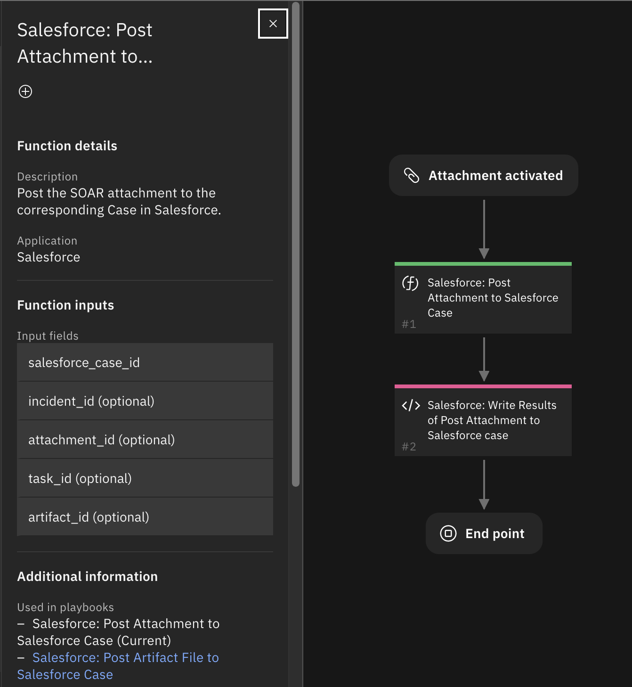 <!-- ::CHANGE_ME:: -->

<details><summary>Inputs:</summary>
<p>

| Name | Type | Required | Example | Tooltip |
| ---- | :--: | :------: | ------- | ------- |
| `artifact_id` | `number` | No | `-` | - |
| `attachment_id` | `number` | No | `-` | - |
| `incident_id` | `number` | No | `-` | - |
| `salesforce_case_id` | `text` | Yes | `-` | - |
| `task_id` | `number` | No | `-` | - |

</p>
</details>

<details><summary>Outputs:</summary>
<p>

> **NOTE:** This example might be in JSON format, but `results` is a Python Dictionary on the SOAR platform.

```python
results = {
  "content": {
    "content_document_link": {
      "errors": [],
      "id": "06AHr00000R0Rl0MAF",
      "success": true
    },
    "salesforce_attachment": "temp.txt"
  },
  "inputs": {
    "artifact_id": null,
    "attachment_id": 50,
    "incident_id": 2522,
    "salesforce_case_id": "500Hr00001X98NnIAJ",
    "task_id": null
  },
  "metrics": {
    "execution_time_ms": 13321,
    "host": "MacBook-Pro.local",
    "package": "fn-salesforce",
    "package_version": "1.0.0",
    "timestamp": "2023-07-25 16:15:49",
    "version": "1.0"
  },
  "raw": null,
  "reason": null,
  "success": true,
  "version": 2.0
}
```

</p>
</details>

<details><summary>Example Function Input Script:</summary>
<p>

```python
inputs.incident_id = incident.id
inputs.attachment_id = attachment.id
inputs.task_id = task.id
inputs.artifact_id = None
inputs.salesforce_case_id = incident.properties.salesforce_case_id
```

</p>
</details>

<details><summary>Example Function Post Process Script:</summary>
<p>

```python
results = playbook.functions.results.post_attachment_results

if results.success:
  note_text = "<b>Salesforce: Post Attachment to Salesforce Case</b> post attachment to case:<br>{}".format(results.content.salesforce_attachment)
else:
  note_text = "<b>Salesforce: Post Attachment to Salesforce Case</b> was NOT successful."

incident.addNote(note_text)
```

</p>
</details>

---
## Function - Salesforce: Sync Tasks Between Cases
Synchronize tasks between Salesforce case and SOAR case. If the SOAR case name matches the Salesforce case Subject and the Description field contains the SOAR header text (indicating it was already sent from SOAR), then the task is not sent to Salesforce.

 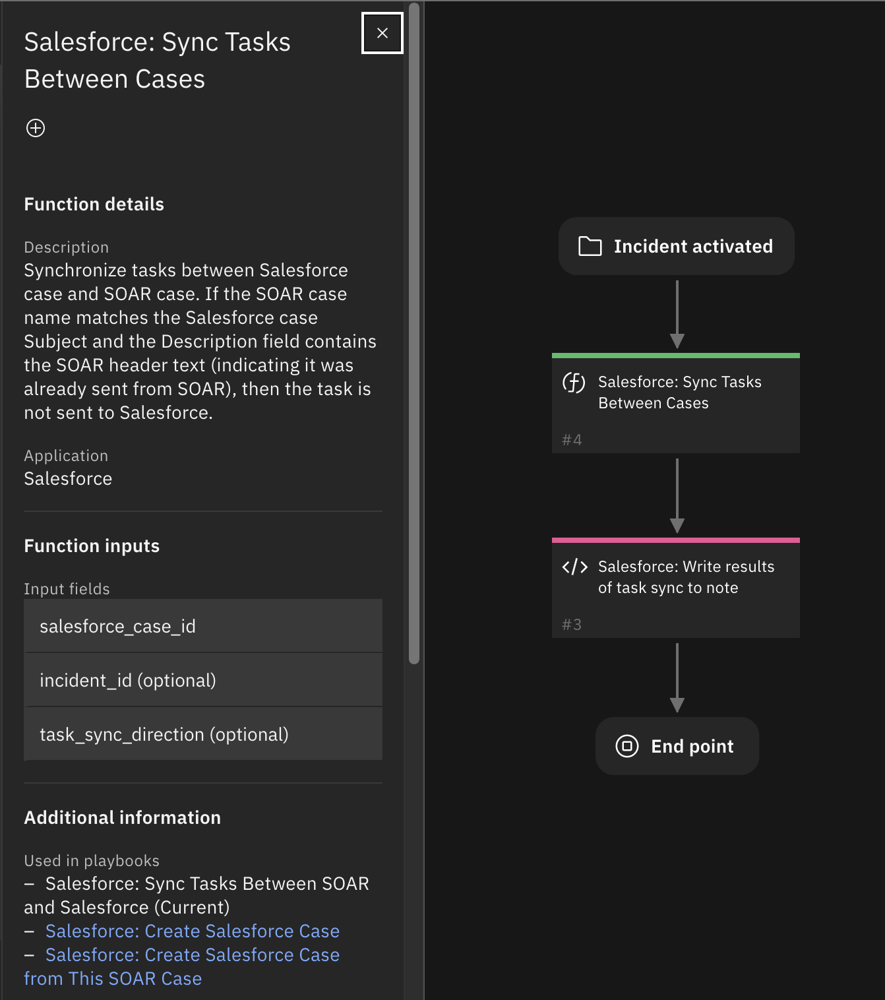 <!-- ::CHANGE_ME:: -->

<details><summary>Inputs:</summary>
<p>

| Name | Type | Required | Example | Tooltip |
| ---- | :--: | :------: | ------- | ------- |
| `incident_id` | `number` | No | `-` | - |
| `salesforce_case_id` | `text` | Yes | `-` | - |
| `task_sync_direction` | `select` | No | `-` | Direction to push tasks |

</p>
</details>

<details><summary>Outputs:</summary>
<p>

> **NOTE:** This example might be in JSON format, but `results` is a Python Dictionary on the SOAR platform.

<!-- ::CHANGE_ME:: -->
```python
results = {
    # TODO: Generate an example of the Function Output within this code block.
    # To get the output of a Function:
    #   1. Run resilient-circuits in DEBUG mode: $ resilient-circuits run --loglevel=DEBUG
    #   2. Invoke the Function in SOAR
    #   3. Gather the results using: $ resilient-sdk codegen -p fn_salesforce --gather-results
    #   4. Run docgen again: $ resilient-sdk docgen -p fn_salesforce
} 
```

</p>
</details>

<details><summary>Example Function Input Script:</summary>
<p>

```python
inputs.incident_id = incident.id
inputs.salesforce_case_id = incident.properties.salesforce_case_id
inputs.task_sync_direction = "Salesforce"
```

</p>
</details>

<details><summary>Example Function Post Process Script:</summary>
<p>

```python
results = playbook.functions.results.sync_task_results

if results.success:
  note_text = "<b>Salesforce: Sync Tasks</b> added:<br> {0} tasks in Salesforce<br> {1} tasks in SOAR".format(results.content.task_count_to_salesforce, results.content.task_count_to_soar)
else:
  note_text = "<b>Salesforce: Sync Tasks</b> FAILED and was unable to add tasks"

incident.addNote(note_text)
```

</p>
</details>

---
## Function - Salesforce: Update Case Status
Update the Status field of a case in Salesforce.

 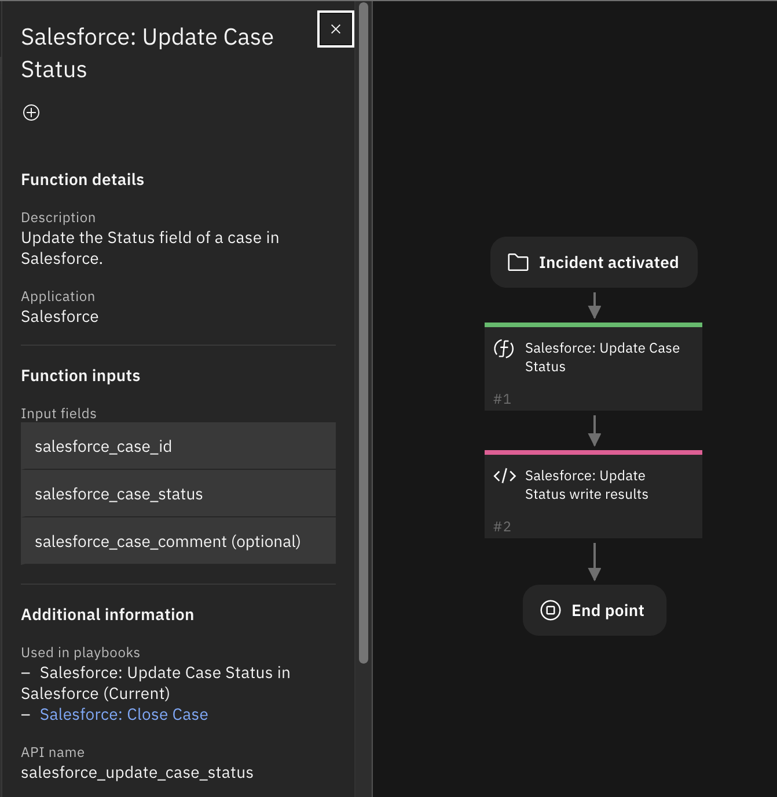 <!-- ::CHANGE_ME:: -->

<details><summary>Inputs:</summary>
<p>

| Name | Type | Required | Example | Tooltip |
| ---- | :--: | :------: | ------- | ------- |
| `salesforce_case_comment` | `text` | No | `-` | - |
| `salesforce_case_id` | `text` | Yes | `-` | - |
| `salesforce_case_status` | `text` | Yes | `-` | - |

</p>
</details>

<details><summary>Outputs:</summary>
<p>

> **NOTE:** This example might be in JSON format, but `results` is a Python Dictionary on the SOAR platform.

```python
results = {
  "content": true,
  "inputs": {
    "salesforce_case_id": "500Hr00001X8WykIAF",
    "salesforce_case_status": "Working"
  },
  "metrics": {
    "execution_time_ms": 8467,
    "host": "My-MBP",
    "package": "fn-salesforce",
    "package_version": "1.0.0",
    "timestamp": "2023-07-14 12:43:49",
    "version": "1.0"
  },
  "raw": null,
  "reason": null,
  "success": true,
  "version": 2.0
}
```

</p>
</details>

<details><summary>Example Function Input Script:</summary>
<p>

```python
inputs.salesforce_case_id = incident.properties.salesforce_case_id
inputs.salesforce_case_status = playbook.inputs.salesforce_case_status
inputs.salesforce_case_comment = playbook.inputs.salesforce_case_comment
```

</p>
</details>

<details><summary>Example Function Post Process Script:</summary>
<p>

```python
update_status = playbook.functions.results.update_status

if not update_status.success:
  incident.addNote("Salesforce: ERROR: Unable to Update Case Status to <b>{}</b>".format(update_status.inputs.salesforce_case_status))
else:
  incident.properties.salesforce_status = update_status.inputs.salesforce_case_status
  incident.addNote("Salesforce: Updated Case Status to <b>{}</b> in Salesforce".format(incident.properties.salesforce_status))
```

</p>
</details>

---


## Custom Fields
| Label | API Access Name | Type | Prefix | Placeholder | Tooltip |
| ----- | --------------- | ---- | ------ | ----------- | ------- |
| Account Id | `salesforce_account_id` | `text` | `properties` | - | ID of the account associated with this case.  |
| Account Name | `salesforce_account_name` | `text` | `properties` | - | - |
| Case Id | `salesforce_case_id` | `text` | `properties` | - | - |
| Link to Case in Salesforce | `salesforce_case_link` | `textarea` | `properties` | - | - |
| Case Number | `salesforce_case_number` | `text` | `properties` | - | - |
| Case Owner | `salesforce_case_owner` | `text` | `properties` | - | - |
| Case Type | `salesforce_case_type` | `text` | `properties` | - | The type of case, such as Feature Request or Question. |
| Contact Email | `salesforce_contact_email` | `text` | `properties` | - | Email address for the contact. The Case.ContactEmail field displays the Email field on the contact that is referenced by Case.ContactId. Label is Contact Email. This field is available in API version 38.0 and later. |
| Contact FAX | `salesforce_contact_fax` | `text` | `properties` | - | Fax number for the contact. Label is Contact Fax. This field is available in API version 38.0 and later. |
| Contact Id | `salesforce_contact_id` | `text` | `properties` | - | - |
| Contact Name | `salesforce_contact_name` | `text` | `properties` | - | - |
| Contact Phone | `salesforce_contact_phone` | `text` | `properties` | - | Telephone number for the contact. Label is Contact Phone. This field is available in API version 38.0 and later. |
| Case Origin | `salesforce_origin` | `text` | `properties` | - | The source of the case, such as Email, Phone, or Web. Label is Case Origin. |
| Owner Id | `salesforce_owner_id` | `text` | `properties` | - | - |
| Case Status | `salesforce_status` | `text` | `properties` | - | - |
| Company | `salesforce_supplied_company` | `text` | `properties` | - | The company name that was entered when the case was created. Label is Company. |
| Email | `salesforce_supplied_email` | `text` | `properties` | - | The email address that was entered when the case was created. Label is Email.  If your organization has an active auto-response rule, SuppliedEmail is required when creating a case via the API. Auto-response rules use the email in the contact specified by ContactId. If no email address is in the contact record, the email specified here is used. |
| Name | `salesforce_supplied_name` | `text` | `properties` | - | The name that was entered when the case was created. Label is Name. |
| Phone | `salesforce_supplied_phone` | `text` | `properties` | - | The phone number that was entered when the case was created. Label is Phone. |

---


## Playbooks
| Playbook Name | Description | Activation Type | Object | Status | Condition |
| ------------- | ----------- | --------------- | ------ | ------ | ---------- |
| Salesforce: Add Comment to Salesforce Case | Add the specified text as a comment to the specified case. | Automatic | incident | `enabled` | `incident.properties.salesforce_case_id has_a_value AND object_added` |
| Salesforce: Close Case | Automatic playbook to close a case in Salesforce.  | Automatic | incident | `enabled` | `incident.properties.salesforce_case_id has_a_value AND incident.resolution_id changed AND incident.resolution_summary not_contains Closed by Salesforce` |
| Salesforce: Create Salesforce Case | Create a case in Salesforce. | Manual | incident | `enabled` | `incident.properties.salesforce_case_id has_a_value` |
| Salesforce: Create Salesforce Case from This SOAR Case | Create a Salesforce case from the SOAR case which activated the playbook.  This playbook is only available to SOAR cases that are not associated with a Salesforce case. | Manual | incident | `enabled` | `incident.properties.salesforce_case_id not_has_a_value` |
| Salesforce: Write Account Details to Note | Get information on the Salesforce account associated with a case and write to a SOAR note. | Manual | incident | `disabled` | `-` |
| Salesforce: Get Attachments from Salesforce Case | Get attachments from Salesforce case and add them to the SOAR case. | Manual | incident | `enabled` | `incident.properties.salesforce_case_id has_a_value` |
| Salesforce: Write Contact Details to Note | Manual playbook to get the Contact information associated with the Salesforce case.  Write the details to a note in SOAR. | Manual | incident | `disabled` | `incident.properties.salesforce_case_id has_a_value` |
| Salesforce: Post Artifact File to Salesforce Case | Post a SOAR artifact file to a Salesforce cases as an attachment. | Manual | artifact | `enabled` | `(incident.properties.salesforce_case_id has_a_value AND artifact.type equals Email Attachment) OR (incident.properties.salesforce_case_id has_a_value AND artifact.type equals Malware Sample)` |
| Salesforce: Post Attachment to Salesforce Case | Post the SOAR attachment to the corresponding case in Salesforce. | Manual | attachment | `enabled` | `incident.properties.salesforce_case_id has_a_value` |
| Salesforce: Send Note to Salesforce Case | Send the specified SOAR case note as a comment in the corresponding Salesforce case. | Manual | note | `enabled` | `incident.properties.salesforce_case_id has_a_value` |
| Salesforce: Send Task to Salesforce Case | Send the task to corresponding Salesforce case. | Manual | task | `enabled` | `incident.properties.salesforce_case_id has_a_value` |
| Salesforce: Sync Tasks Between SOAR and Salesforce | None | Manual | incident | `enabled` | `incident.properties.salesforce_case_id has_a_value` |
| Salesforce: Update Account Details in SOAR | None | Automatic | incident | `enabled` | `incident.properties.salesforce_account_id changed AND incident.properties.salesforce_account_id not_equals None` |
| Salesforce: Update Case in SOAR | Automatic playbook to update the SOAR case with information from Salesforce. | Automatic | incident | `enabled` | `incident.plan_status equals Active AND incident.properties.salesforce_case_id has_a_value AND object_added` |
| Salesforce: Update Case Status in Salesforce | Manual playbook to update the case Status field in Salesforce | Manual | incident | `enabled` | `incident.properties.salesforce_case_id has_a_value` |
| Salesforce: Update Comments from Salesforce Case | Get the comments from the specified Salesforce case and update the notes in corresponding  SOAR case. | Manual | incident | `enabled` | `incident.properties.salesforce_case_id has_a_value` |
| Salesforce: Update Contact Details in SOAR | Automatic playbook to update the Contact details in SOAR when the ContactId has changed. | Automatic | incident | `enabled` | `incident.properties.salesforce_contact_id changed AND incident.properties.salesforce_contact_id not_equals None` |
| Salesforce: Update Owner Details in SOAR | Get the Case Owner details and update the Case Owner field in the SOAR case. | Automatic | incident | `enabled` | `incident.properties.salesforce_owner_id changed AND incident.properties.salesforce_owner_id not_equals None` |
| Salesforce: Write Owner Details to Note | Write the User details of the Case Owner in Salesforce to a SOAR incident Note. | Manual | incident | `disabled` | `incident.properties.salesforce_case_id has_a_value` |

---

## Troubleshooting & Support
Refer to the documentation listed in the Requirements section for troubleshooting information.

### For Support
This is an IBM supported app. Please search [ibm.com/mysupport](https://ibm.com/mysupport) for assistance.
