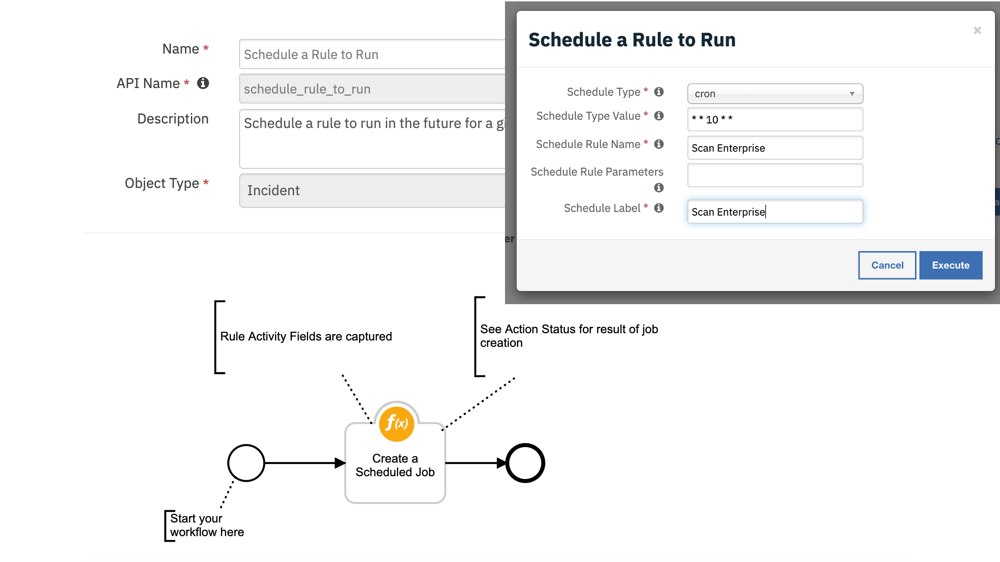

<!--
  This Install README.md is generated by running:
  "resilient-circuits docgen -p fn_scheduler --only-install-guide"

  It is best edited using a Text Editor with a Markdown Previewer. VS Code
  is a good example. Checkout https://guides.github.com/features/mastering-markdown/
  for tips on writing with Markdown

  If you make manual edits and run docgen again, a .bak file will be created

  Store any screenshots in the "doc/screenshots" directory and reference them like:
  
-->

# fn-scheduler Functions for IBM Resilient

- [Release Notes](#release-notes)
- [Overview](#overview)
- [Requirements](#requirements)
- [Installation](#installation)
- [Uninstall](#uninstall)
- [Troubleshooting](#troubleshooting)
- [Support](#support)

---

## Release Notes
<!--
  Specify all changes in this release. Do not remove the release 
  notes of a previous release
-->
### v1.0.0
* Initial Release

---

## Overview
<!--
  Provide a high-level description of the function itself and its remote software or application.
  The text below is parsed from the "description" and "long_description" attributes in the setup.py file
-->
**Resilient Circuits Components for fn_scheduler**

 

This package of functions allows an enterprise to schedule a rule to run in the future associated with a incident, task, artifact, and datatable. Times to run can be specified in the following ways:

1) cron (ex. * 0 * * * for every night at midnight)
2) interval (ex. 5h for every 5 hours)
3) date (ex. 2019/10/23 12:00:00)
4) delta (ex. 1h for one hour in the future)

Schedule rules using `cron` and `interval` are reocurring whereas `date` and `delta` are single event schedules. Scheduled rules are persisted so that restarts of resilient-circuits will resume already scheduled rules.

Functions available include:

1) Scheduling a rule
2) Listing scheduled rules
3) Removing a scheduled rule

---

## Requirements
<!--
  List any Requirements 
-->
* Resilient platform >= `v33.0.5087`
* An Integration Server running `resilient_circuits>=30.0.0`
  * To set up an Integration Server see: [https://ibm.biz/res-int-server-guide](https://ibm.biz/res-int-server-guide)

---

## Installation
* Download the `fn_scheduler.zip`.
* Copy the `.zip` to your Integration Server and SSH into it.
* **Unzip** the package:
  ```
  $ unzip fn_scheduler-x.x.x.zip
  ```
* **Change Directory** into the unzipped directory:
  ```
  $ cd fn_scheduler-x.x.x
  ```
* **Install** the package:
  ```
  $ pip install fn_scheduler-x.x.x.tar.gz
  ```
* Import the **configurations** into your app.config file:
  ```
  $ resilient-circuits config -u
  ```
* Import the fn_scheduler **customizations** into the Resilient platform:
  ```
  $ resilient-circuits customize -y -l fn-scheduler
  ```
* Open the config file, scroll to the bottom and edit your fn_scheduler configurations:
  ```
  $ nano ~/.resilient/app.config
  ```
  | Config | Required | Example | Description |
  | ------ | :------: | ------- | ----------- |
  | **timezone** | Yes | `utc` | *Specify the timezone (ex. America/New_York) which scheduled rules should follow* |
  | **thread_max** | Yes | `20` | *Number of threads which can run at the same. Typically, triggered rules run for a very short time to kick off a Resilient rule.* |
  | **datastore_dir** | Yes | `` | *Specify a data path and file name for the sqlite persistent datafile (ex. /path/to/scheduler.sqlite)* |

* **Save** and **Close** the app.config file.
* [Optional]: Run selftest to test the Integration you configured:
  ```
  $ resilient-circuits selftest -l fn-scheduler
  ```
* **Run** resilient-circuits or restart the Service on Windows/Linux:
  ```
  $ resilient-circuits run
  ```


---

## Uninstall
* SSH into your Integration Server.
* **Uninstall** the package:
  ```
  $ pip uninstall fn-scheduler
  ```
* Open the config file, scroll to the [fn_scheduler] section and remove the section or prefix `#` to comment out the section.
* **Save** and **Close** the app.config file.

---

## Troubleshooting
There are several ways to verify the successful operation of a function.

### Resilient Action Status
* When viewing an incident, use the Actions menu to view **Action Status**.
* By default, pending and errors are displayed.
* Modify the filter for actions to also show Completed actions.
* Clicking on an action displays additional information on the progress made or what error occurred.

### Resilient Scripting Log
* A separate log file is available to review scripting errors.
* This is useful when issues occur in the pre-processing or post-processing scripts.
* The default location for this log file is: `/var/log/resilient-scripting/resilient-scripting.log`.

### Resilient Logs
* By default, Resilient logs are retained at `/usr/share/co3/logs`.
* The `client.log` may contain additional information regarding the execution of functions.

### Resilient-Circuits
* The log is controlled in the `.resilient/app.config` file under the section [resilient] and the property `logdir`.
* The default file name is `app.log`.
* Each function will create progress information.
* Failures will show up as errors and may contain python trace statements.

---

<!--
  If necessary, use this section to describe how to configure your security application to work with the integration.
  Delete this section if the user does not need to perform any configuration procedures on your product.

## Configure <Product_Name>

* Step One
* Step Two
* Step Three

---
-->

## Support
| Name | Version | Author | Support URL |
| ---- | ------- | ------ | ----------- |
| fn_scheduler | 1.0.0 | IBM | support@resilientsystems.com