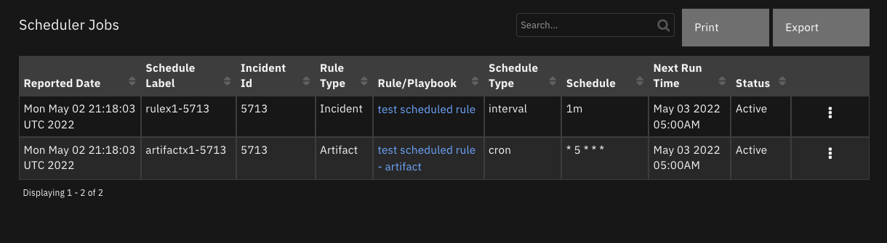
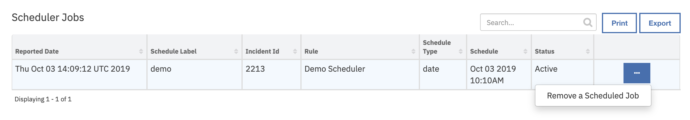

<!--
  This User README.md is generated by running:
  "resilient-circuits docgen -p fn_scheduler --only-user-guide"

  It is best edited using a Text Editor with a Markdown Previewer. VS Code
  is a good example. Checkout https://guides.github.com/features/mastering-markdown/
  for tips on writing with Markdown

  If you make manual edits and run docgen again, a .bak file will be created

  Store any screenshots in the "doc/screenshots" directory and reference them like:
  
-->

# **User Guide:** fn_scheduler_v1.0.0

## Table of Contents
- [Key Features](#key-features)
- [Function - Create a Scheduled Rule](#function---create-a-scheduled-rule)
- [Function - List Scheduled Rules](#function---list-scheduled-rules)
- [Function - Remove a Scheduled Rule](#function---remove-a-scheduled-rule)
- [Rules](#rules)

---

## Key Features

This package of functions allows an enterprise to schedule a rule to run in the future associated with a incident, task, artifact, and datatable. Schedule times to run can be specified in the following ways:

1) cron (ex. * 0 * * * for every night at midnight)
2) interval (ex. 5h for every 5 hours, 2d for every 2 days. Valid values are s(econd), m(inute), h(our), d(ay), w(eek), M(onth))
3) date (ex. 2019/10/23 12:00:00 or 2019-10-23 12:00:00)
4) delta (ex. 1h for one hour in the future, the same values as interval are supported)

Scheduled rules using `cron` and `interval` are reocurring whereas `date` and `delta` are single event schedules. Scheduled rules are persisted so that restarts of resilient-circuits will resume already scheduled rules.

Functions available include:
<!--
  List the Key Features of the Integration
-->
* Create a scheduled rule
* List scheduled rule
* Remove a scheduled rule

---

## Function - Create a Scheduled Rule
Schedule a rule to run on a schedule. This rule will be executed for a given incident, artifact, task, etc.

 

<details><summary>Inputs:</summary>
<p>

| Name | Type | Required | Example | Tooltip |
| ---- | :--: | :------: | ------- | ------- |
| `incident_id` | `number` | Yes | `-` | Incident Id where the rule will be executed |
| `object_id` | `number` | No | `-` | Id for task, artifact, attachment, datatable, etc. |
| `row_id` | `number` | No | `-` | row information for datatable rules |
| `scheduler_label` | `text` | Yes | `-` | Label to recall the created schedule |
| `scheduler_rule_name` | `text` | Yes | `-` | Name of rule to schedule |
| `scheduler_rule_parameters` | `text` | No | `-` | Optional parameters for the rule in field=value format separated by semicolons. These fields should match the api name for the rule's activity fields |
| `scheduler_type` | `select` | No | `-` | type of schedule to create. cron, interval, date or delta |
| `scheduler_type_value` | `text` | Yes | `-` | interval, date (yyyy/mm/dd hh:mm:ss), cron  or delta value |

</p>
</details>

<details><summary>Outputs:</summary>
<p>

```python
results = {
  'success': True,
  'content': {
    'args': (2219, # incident_id
    None, # object_id
    None, # row_id
    u'rule3', # Rule to execute
    u'Delete rule3', # Scheduled rule Label
    49, # rule_id
    0, # object_type_id
    None,
    None),
    'executor': 'default',
    'max_instances': 1,
    'func': 'fn_scheduler.components.create_a_scheduled_rule:triggered_job',
    'id': u'rule3',
    'next_run_time': 'Oct 03 2019 12:35PM',
    'name': 'triggered_job',
    'misfire_grace_time': 1,
    'trigger': None,
    'coalesce': False,
    'version': 1,
    'kwargs': {
      
    }
  },
```

</p>
</details>

<details><summary>Example Pre-Process Script:</summary>
<p>

```python
inputs.scheduler_type = rule.properties.schedule_type
if rule.properties.schedule_type == 'date':
  # date format converted to use dashes
  inputs.scheduler_type_value = rule.properties.schedule_type_value.replace("/", "-")
else:
  inputs.scheduler_type_value = rule.properties.schedule_type_value
inputs.scheduler_rule_name = rule.properties.schedule_rule_name
inputs.scheduler_rule_parameters = rule.properties.schedule_rule_parameters
inputs.scheduler_label = rule.properties.schedule_label
inputs.incident_id = incident.id
```

</p>
</details>

<details><summary>Example Post-Process Script:</summary>
<p>

```python
None
```

</p>
</details>

---
## Function - List Scheduled Rules
List the schedules presently defined

 

<details><summary>Inputs:</summary>
<p>

-- No Input Parameters --

</p>
</details>

<details><summary>Outputs:</summary>
<p>

```python
results = {
    'success': True
    'content': [
    {
      'args': (2219, # incident_id
      None, # object_id
      None, # row_id
      u'rule3', # scheduled rule
      u'Delete rule3', # schedule rule label
      49, # rule_id
      0, # object_type_id
      None,
      None),
      'type': 'date', # schedule rule type
      'id': u'rule3', # schedule rule label
      'value': 'Oct 03 2019 12:35PM' # Schedule
    }
  ],
}
```

</p>
</details>

<details><summary>Example Pre-Process Script:</summary>
<p>

```python
None
```

</p>
</details>

<details><summary>Example Post-Process Script:</summary>
<p>

```python
import java.util.Date as Date

if not results['content']:
  row = incident.addRow("scheduler_rules")
  row['reported_on'] = str(Date())
  row['schedule_label'] = "-- no scheduled rules --"
else:
  for job in results['content']:
    row = incident.addRow("scheduler_rules")
    row['schedule_label'] = job['id']
    row['schedule_type'] = job['type']
    row['incident_id'] = job['args'][0]
    row['rule'] = job['args'][4]
    row['schedule'] = job['value']
    row['reported_on'] = str(Date())
    row['status'] = 'Active'
    
```

</p>
</details>

---
## Function - Remove a Scheduled Rule
Stop a schedule

 

<details><summary>Inputs:</summary>
<p>

| Name | Type | Required | Example | Tooltip |
| ---- | :--: | :------: | ------- | ------- |
| `scheduler_label` | `text` | Yes | `-` | Label to reference created schedule |

</p>
</details>

<details><summary>Outputs:</summary>
<p>

```python
results = {
    'success': True
    'content':  None
}
```

</p>
</details>

<details><summary>Example Pre-Process Script:</summary>
<p>

```python
inputs.scheduler_label = row.schedule_label
```

</p>
</details>

<details><summary>Example Post-Process Script:</summary>
<p>

```python
if results.success:
  row['status'] = "Deleted"
else:
  row['status'] = row['status'] + " (Error)"
```

</p>
</details>

---


## Rules
| Rule Name | Object | Workflow Triggered |
| --------- | ------ | ------------------ |
| List Scheduled Rules | incident | `list_schedules` |
| Remove a Scheduled Rule | scheduler_rules | `remove_a_schedule` |
| Schedule a Rule to Run | incident | `schedule_rule_to_run` |
| Schedule a Rule to Run - Artifact| artifact | `schedule_a_rule_to_run_artifact` |
| Schedule a Rule to Run - Task| task | `schedule_a_rule_to_run__task` |
---

<!--
## Inform Resilient Users
  Use this section to optionally provide additional information so that Resilient playbook 
  designer can get the maximum benefit of your integration.
-->
## Considerations

### Rules
* Rules must be enabled to be scheduled and are again checked when the scheduled rule is triggered.
* Rules scheduled must match the invoking Rule. For instance, to create a scheduled artifact rule, use the rule `Create a Schedule - Artifact`. 
* Disabled rules will not execute but the scheduled rule will continue to trigger.
* Rules triggered on closed incidents will not run and the scheduled rule will be removed.
* Incident notes are created each time a scheduled rule is excuted documenting the rule invocation.
* Scheduled rules will not show up under Action Status and Workflow Status. Refer instead to the incident notes.

### Datatables
* Datatable scheduled rules are not part of this package, but can be easily created for a specific Datatable.
* Datatable scheduled rules cannot currently reference the invoking datatable row in the pre-processing script. However, a rule's activity field can be defined to prompt for it.

### Persistence of Scheduled Rules
* Labels for scheduled rules need to be unique. Attempting to create a duplicate scheduled rule label will fail.
* Sqlite is used to persist scheduled rules. Restarting resilient-circuits will continue with the scheduled rules already defined.

### Integrations
* A function executed from a scheduled rule is free to perform any operation against Resilient. Even through a scheduled rule runs from a specific Incident, Resilient API calls can collect and operate on other incidents. For example, a scheduled rule can call a function which queries Resilient for all open tasks with due dates to review any overdue.

