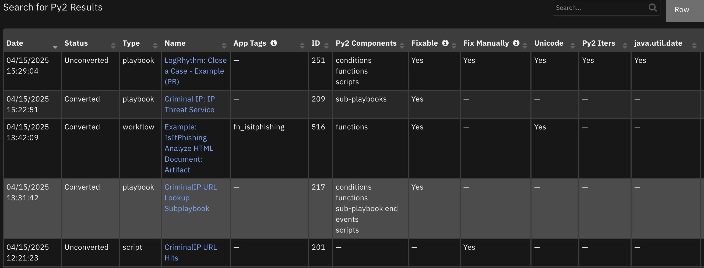
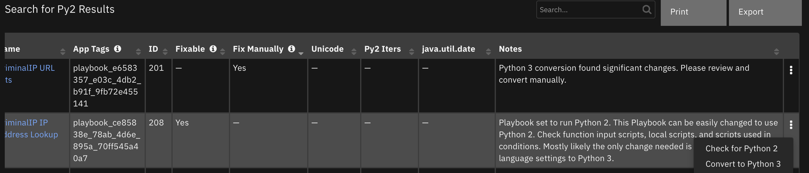
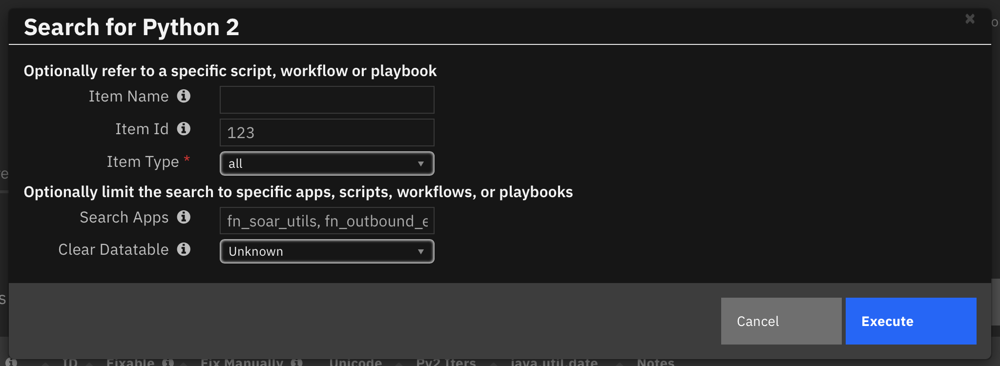

<!--
  This README.md is generated by running:
  "resilient-sdk docgen -p fn_search_for_py2"

  This file was generated with resilient-sdk v51.0.5.0.1475

  It is best edited using a Text Editor with a Markdown Previewer. VS Code
  is a good example. Checkout https://guides.github.com/features/mastering-markdown/
  for tips on writing with Markdown

  All fields followed by "::CHANGE_ME::"" should be manually edited

  If you make manual edits and run docgen again, a .bak file will be created

  Store any screenshots in the "doc/screenshots" directory and reference them like:
  

  NOTE: If your app is available in the container-format only, there is no need to mention the integration server in this readme.
-->

# Search for Python 2


## Table of Contents
- [Release Notes](#release-notes)
- [Overview](#overview)
  - [Key Features](#key-features)
- [Requirements](#requirements)
  - [SOAR platform](#soar-platform)
  - [Cloud Pak for Security](#cloud-pak-for-security)
  - [Proxy Server](#proxy-server)
  - [Python Environment](#python-environment)
- [Installation](#installation)
  - [Install](#install)
  - [App Configuration](#app-configuration)
  - [CLI Usage](#cli-usage)
- [Function - Convert to Python 3](#function---convert-to-python-3)
- [Function - Search for Python 2](#function---search-for-python-2)
- [Data Table - Search for Py2 Results](#data-table---search-for-py2-results)
- [Playbooks](#playbooks)
- [Notes](#notes)
- [Troubleshooting & Support](#troubleshooting--support)

---

## Release Notes
<!--
  Specify all changes in this release. Do not remove the release
  notes of a previous release
-->
| Version | Date | Notes |
| ------- | ---- | ----- |
| 1.0.0 | 04/2025 | Initial Release | 

---

## Overview
<!--
  Provide a high-level description of the function itself and its remote software or application.
  The text below is parsed from the "description" and "long_description" attributes in the setup.py file
-->
**Search for Python 2 in scripts, workflows and playbooks**

 

This app provides visibility to the scripts, workflows and playbooks installed in your SOAR environment which execute on the Python 2 scripting engine. This use of Python 2 needs to be changed as the Python 2 scripting engine will be deprecated.
For those identified items, this app provides information about how Python 2 is used, and whether it can be 'fixable'. This information is presented in an incident datatable.
Fixable items can be converted to Python 3 directly from the datatable with the returned results. 

This process can be iterative, converting items through the app, manually converting items, and then rerunning the `Search for Python 2` playbook to confirm the results of the conversions.

 

This app can also be installed in a local environment with Python 3.9 and run from the command line. In this mode, export files (ex. export.res or export.resz) can be used referenced and Python 2 findings reported on the terminal window. See [CLI Usage](#cli-usage) for more information to configure this capability.

```
% search_for_py2 ~/Downloads/export-ms-20250423122420.resz 

Python 2 findings

Id:          201
Type:        script
Name:        CriminalIP URL Hits
App Tags:    
Components:  
Notes:
Python 3 conversion found significant changes. Please review and convert manually.
-----

Id:          576
Type:        workflow
Name:        Workflow Guardium Insights Block User
App Tags:    fn_guardium_insights_integration
Components:  conditions, functions
Notes:
Python 3 conversion found significant changes. Please review and convert manually.
Unicode strings found ('u' string prefix). This can remain for Python 3, and but cleaner to remove.
-----

Id:          488
Type:        workflow
Name:        Example: SpamHaus: Submit IP Address
App Tags:    fn_spamhaus_query
Components:  functions
Notes:
workflow set to run Python 2. This workflow can be easily changed to use Python 3. Check function input scripts, local scripts, and scripts used in conditions. Mostly likely the only change needed is to convert all language settings to Python 3.
-----
```

Links:

<ul><a target='blank' href='https://ibm.com/mysupport'>Support</a></ul>

<ul><a target='blank' href='https://ideas.ibm.com/'>Enhancement Requests</a></ul>

### Key Features
<!--
  List the Key Features of the Integration
-->
* Search scripts, workflows and playbooks for use of the Python 2 scripting engine.
* Selectively search for a particular script, workflow or playbook or just scripts, workflows and/or playbooks.
* Display the results for easy identification and explained next steps.
* Convert scripts, workflows and playbooks in place to use Python 3.

---

## Requirements
<!--
  List any Requirements
-->
This app supports the IBM Security QRadar SOAR Platform and the IBM Security QRadar SOAR for IBM Cloud Pak for Security.

### SOAR platform
The SOAR platform supports two app deployment mechanisms, Edge Gateway (also known as App Host) and integration server.

If deploying to a SOAR platform with an App Host, the requirements are:
* SOAR platform >= `51.0.0.0.9339`.
* The app is in a container-based format (available from the AppExchange as a `zip` file).

If deploying to a SOAR platform with an integration server, the requirements are:
* SOAR platform >= `51.0.0.0.9339`.
* The app is in the older integration format (available from the AppExchange as a `zip` file which contains a `tar.gz` file).
* Integration server is running `resilient-circuits>=51.0.0`.
* If using an API key account, make sure the account provides the following minimum permissions:
  | Name | Permissions |
  | ---- | ----------- |
  | Org Data | Read |
  | Function | Read |
  | Script | Read, Write |
  | Workflow | Read, Write, Create |
  | Playbook | Read, Write |

  **Note** If running in an Integration Server, Python <= 3.9 should be used.

The following SOAR platform guides provide additional information:
* _Edge Gateway Deployment Guide_ or _App Host Deployment Guide_: provides installation, configuration, and troubleshooting information, including proxy server settings.
* _Integration Server Guide_: provides installation, configuration, and troubleshooting information, including proxy server settings.
* _System Administrator Guide_: provides the procedure to install, configure and deploy apps.

The above guides are available on the IBM Documentation website at [ibm.biz/soar-docs](https://ibm.biz/soar-docs). On this web page, select your SOAR platform version. On the follow-on page, you can find the _Edge Gateway Deployment Guide_, _App Host Deployment Guide_, or _Integration Server Guide_ by expanding **Apps** in the Table of Contents pane. The System Administrator Guide is available by expanding **System Administrator**.

### Cloud Pak for Security
If you are deploying to IBM Cloud Pak for Security, the requirements are:
* IBM Cloud Pak for Security >= `1.10.15`.
* Cloud Pak is configured with an Edge Gateway.
* The app is in a container-based format (available from the AppExchange as a `zip` file).

The following Cloud Pak guides provide additional information:
* _Edge Gateway Deployment Guide_ or _App Host Deployment Guide_: provides installation, configuration, and troubleshooting information, including proxy server settings. From the Table of Contents, select Case Management and Orchestration & Automation > **Orchestration and Automation Apps**.
* _System Administrator Guide_: provides information to install, configure, and deploy apps. From the IBM Cloud Pak for Security IBM Documentation table of contents, select Case Management and Orchestration & Automation > **System administrator**.

These guides are available on the IBM Documentation website at [ibm.biz/cp4s-docs](https://ibm.biz/cp4s-docs). From this web page, select your IBM Cloud Pak for Security version. From the version-specific IBM Documentation page, select Case Management and Orchestration & Automation.

### Proxy Server
Not applicable.

### Python Environment
Python 3.9, 3.11, and 3.12 are officially supported. When deployed as an app, the app runs on Python 3.11.
Additional package dependencies may exist for each of these packages:
* lxml
* resilient-circuits>=51.0.0

#### Configuration
Modify your layout to include the 'Search for Python 2 Results' datatable. This datatable is used to present
the results of the incident action 'Search for Python 2'. In this example, the datatable is added to the Notes
tab.

 

---

## Installation

### Install
* To install or uninstall an App or Integration on the _SOAR platform_, see the documentation at [ibm.biz/soar-docs](https://ibm.biz/soar-docs).
* To install or uninstall an App on _IBM Cloud Pak for Security_, see the documentation at [ibm.biz/cp4s-docs](https://ibm.biz/cp4s-docs) and follow the instructions above to navigate to Orchestration and Automation.

### App Configuration
No app configuration settings are exposed.

### CLI Usage
To use `search_for_py2` from a terminal window, follow these steps:
1) Unzip app-fn_search_for_py2-x.x.x.zip
2) Run `pip install fn_search_for_py2-x.x.x.tar.gz` to install the software.
3) Execute `search_for_py2 -h` to confirm that the command is available.

```
 % search_for_py2 -h
usage: search_for_py2 [-h] [-s] [-w] [-p] [-t TAGS] [file]

positional arguments:
  file                  existing customization.py, export.res or export.resz file

options:
  -h, --help            show this help message and exit
  -s, --scripts         Review scripts only
  -w, --workflows       Review workflows only
  -p, --playbooks       Review playbooks only
  -t TAGS, --tags TAGS  comma separated list of app tags to filter
  ```

The command is similar to the function exposed in the App. but with two differences:
* Conversions are not possible.
* Referencing a specific script, workflow, or playbook by id is not available.

Execution is `search_for_py2 /path/to/export.res[z]`. Both `.res` and `.resz` exports of SOAR layouts with scripts, workflows or playbooks can be used. SOAR integration apps with it's export.res file can also be referenced. Flags `-s`, `-w`, and `-p` can be used to only search scripts, workflows and playbooks, respectively. Use `-t 'tag1,tag2'` to only search by app tag.

---

## Function - Convert to Python 3
Convert a script, playbook or playbook to use the SOAR Python 3 scripting engine.


<details><summary>Inputs:</summary>
<p>

| Name | Type | Required | Example | Tooltip |
| ---- | :--: | :------: | ------- | ------- |
| `py2_item_id` | `number` | No | `42` | script, workflow or playbook id |
| `py2_item_type` | `select` | No | `script` | value: 'script', 'workflow', or 'playbook' |

</p>
</details>

<details><summary>Outputs:</summary>
<p>

> **NOTE:** This example might be in JSON format, but `results` is a Python Dictionary on the SOAR platform.

```python
results = {
  "content": {
    "script": {
      "actions": [],
      "created_date": 1743719293802,
      "creator_id": "sysadmin@example.com",
      "description": "",
      "enabled": false,
      "id": 5,
      "language": "python3",
      "last_modified_by": "sysadmin@example.com",
      "last_modified_time": 1743719293802,
      "name": "email py2",
      "object_type": "__emailmessage",
      "playbook_handle": null,
      "programmatic_name": "email_py2",
      "script_text": "incident.addNote(emailmessage.sender)\n",
      "tags": [],
      "uuid": "****-31fb-4d9a-a3b3-95c6c9c9f148"
    }
  },
  "inputs": {
    "py2_item_id": 5,
    "py2_item_type": "script"
  },
  "metrics": {
    "execution_time_ms": 798,
    "host": "my.app.host",
    "package": "fn-search-for-py2",
    "package_version": "1.0.0",
    "timestamp": "2025-04-04 12:25:47",
    "version": "1.0"
  },
  "raw": null,
  "reason": null,
  "success": true,
  "version": 2.0
}
```

</p>
</details>

<details><summary>Example Function Input Script:</summary>
<p>

```python
inputs.py2_item_id = row.item_id
inputs.py2_item_type = row.item_type
```

</p>
</details>

<details><summary>Example Function Post Process Script:</summary>
<p>

```python
from datetime import datetime
results = playbook.functions.results.convert_results

if results.success:
  now = int(datetime.now().timestamp()*1000)
  row["date"] = now
  row["status"] = "Converted"
else:
  incident.addNote(f"Python 2 conversion failed for '{row.item_name}': {results.reason}")
```

</p>
</details>

---
## Function - Search for Python 2
Search for scripts, workflows and playbooks which are set to use Python 2. 
Python 2 can be converted to Python 3 if the item is mark in the datatable as 'Easily Convertible'.


<details><summary>Inputs:</summary>
<p>

| Name | Type | Required | Example | Tooltip |
| ---- | :--: | :------: | ------- | ------- |
| `py2_item_name` | `str` | No | `_` | Name of script, workflow or playbook to search |
| `py2_item_id` | `number` | No | `-` | script, workflow or playbook id |
| `py2_item_type` | `select` | No | `workflow` | values: 'script', 'workflow' or 'playbook'. If unset with an item_name or item_id, all scripts, workflows and playbooks are search. |
| `py2_search_tags` | `text` | No | `fn_soar_utils, fn_outbound_email` | comma separated list of apps to search. |
| `py2_inc_id` | `int` | Yes | `8900` | Incident id. |
| `py2_clear_datatable` | `boolean` | No | `No` | If Yes, the results datatable is cleared of previous results. |

</p>
</details>

<details><summary>Outputs:</summary>
<p>

> **NOTE:** This example might be in JSON format, but `results` is a Python Dictionary on the SOAR platform.

```python
results = {
  "content": {
    "playbook": {
      "4": {
        "attributes": [
          "PY2_CONVERTIBLE"
        ],
        "display_name": "Py2 3Conditions",
        "name": "py2_3conditions",
        "tags": []
      }
    },
    "script": {
      "5": {
        "attributes": [
          "PY2_CONVERTIBLE",
          "PY2_UNICODE"
        ],
        "display_name": null,
        "name": "email py2",
        "tags": []
      },
      "6": {
        "attributes": [
          "PY2_CONVERTIBLE"
        ],
        "display_name": null,
        "name": "py2_script",
        "tags": []
      }
    },
    "workflow": {
      "5": {
        "attributes": [
          "PY2_CONVERTIBLE"
        ],
        "display_name": null,
        "name": "py2 workflow",
        "tags": []
      }
    }
  },
  "inputs": {
    "py2_item_id": null,
    "py2_item_type": null,
    "py2_playbooks_only": null,
    "py2_scripts_only": null,
    "py2_search_tags": null,
    "py2_workflows_only": null
  },
  "metrics": {
    "execution_time_ms": 3758,
    "host": "my.app.host",
    "package": "fn-search-for-py2",
    "package_version": "1.0.0",
    "timestamp": "2025-04-04 12:25:17",
    "version": "1.0"
  },
  "raw": null,
  "reason": null,
  "success": true,
  "version": 2.0
}
```

</p>
</details>

<details><summary>Example Function Input Script:</summary>
<p>

```python
inputs.py2_item_id = playbook.inputs.item_id
inputs.py2_item_name = playbook.inputs.item_name
inputs.py2_item_type = playbook.inputs.item_type
inputs.py2_playbooks_only = playbook.inputs.only_playbooks
inputs.py2_scripts_only = playbook.inputs.only_scripts
inputs.py2_workflows_only = playbook.inputs.only_workflows
inputs.py2_search_tags = playbook.inputs.search_tags
```

</p>
</details>

<details><summary>Example Function Post Process Script:</summary>
<p>

```python
from datetime import datetime

results = playbook.functions.results.search_for_py2_results

PY2_LOOKUP = {
  "PY2_UNCONVERTIBLE": "Python 3 conversion found significant changes. Please review and convert manually.",
  "PY2_CONVERTIBLE": "{item_type} set to run Python 2. This {item_type} can be easily changed to use Python 2. Check function input scripts, local scripts, and scripts used in conditions. Mostly likely the only change needed is to convert all language settings to Python 3.",
  "PY2_ITERS": "Python 2 iters found. Convert to use .items(), .keys(), and .values() as appropriate",
  "PY2_JAVA_UTIL_DATE": "'import java.util.Date' found. Change to 'from datetime import datetime' and datetime functions such as 'datetime.now()'.",
  "PY2_UNICODE": "Unicode strings found ('u' string prefix). This can remain for Python 3, and but cleaner to remove."
}

def display_db_row(db, now, item_type, item_id, item_name, tags, attributes):
  row = incident.addRow(db)
  row["date"] = now
  row["status"] = "Unconverted"
  row["item_type"] = make_url(item_type, item_id, item_name)
  row["item_id"] = int(item_id)
  row["item_name"] = item_name
  if tags:
    row["app_tags"] = ", ".join([tag.get("tag_handle")  for tag in tags])
  msg = []
  for attr in attributes:
    row[attr.lower()] = "Yes"
    msg.append(PY2_LOOKUP.get(attr, "").format(item_type=item_type.title()))
  row["notes"] = "\n".join(msg)

def display_db(db="search_for_py2_results"):
  now = int(datetime.now().timestamp()*1000)
  found = False
  for item_type in ["script", "playbook", "workflow"]:
    for item_id, item_info in results.content.get(item_type, []).items():
      found = True
      display_db_row(db,
                     now,
                     item_type,
                     item_id,
                     item_info.get("display_name") if item_info.get("display_name") else item_info.get("name"),
                     item_info.get("tags", []),
                     item_info.get("attributes", []))
             
  if not found:
    incident.addNote("No Python 2 scripts, workflows or playbooks found")

def make_url(item_type, item_id, item_name):
  if item_type == "script":
    return f"<a target='_blank' href='#customize?tab=scripts&script={item_id}'>{item_name}</a>"

  if item_type == "workflow":
    return f"<a target='_blank' href='#customize?tab=workflows&workflow={item_id}'>{item_name}</a>"

  if item_type == "playbook":
    return f"<a target='_blank' href='#playbooks/designer/{item_id}'>{item_name}</a>"

  return item_name

# S T A R T
if results.success:
    display_db()
else:
    incident.addNote(f"Search for PY2 failed: {results.reason}")

```

</p>
</details>

---


## Playbooks

 

| Playbook Name | Description | Activation Type | Object | Status | Condition | 
| ------------- | ----------- | --------------- | ------ | ------ | --------- | 
| Convert to Python 3 | Convert Scripts, Workflows and Playbooks to Python 3 if no blockers exist. Blockers are 'Fix Manual', 'Python 2 iterators', and 'import java.util.Date' | Manual | search_for_py2_results | `enabled` | `search_for_py2_results.py2_convertible equals Yes` | 
| Search for Python 2 | Search for Python 2 in scripts, workflows and playbooks. Python 2 will be removed in an upcoming version of SOAR. | Manual | incident | `enabled` | `-` | 
| Check for Python 2 | Search for Python 2 in scripts, workflows and playbooks. Python 2 will be removed in an upcoming version of SOAR. | Manual | search_for_py2_results | `enabled` | `-` | 

---


## Data Table - Search for Py2 Results

#### API Name:
search_for_py2_results

#### Columns:
| Column Name | API Access Name | Type | Tooltip |
| ----------- | --------------- | ---- | ------- |
| Date | `date` | `datetimepicker` | Current date of search results. |
| Status | `status` | `text` | 'Unconverted' or 'Converted' |
| Type | `item_type` | `text` | 'script', 'workflow' or 'playbook' |
| Name | `item_name` | `textarea` | link within SOAR to the named item. |
| App Tags | `app_tags` | `text` | Name(s) of apps which this item is related. |
| ID | `item_id` | `number` | - |
| Py2 Components | `py2_components` | `textarea` | Parts of workflows or playbooks with Python 2. 'conditions', 'scripts', 'sub-playbook end event', 'functions' |
| Fixable | `py2_convertible` | `select` | If 'Yes', use the 'Convert to Py3' action to convert. |
| Fix Manually | `py2_unconvertible` | `select` | Identifies issues with item which needs manual conversion. |
| Py2 Iters | `py2_iters` | `select` | Identifies the use of Python 2 iteration which needs manual conversion. |
| java.util.Date | `py2_java_util_date` | `select` | Identifies use of java.util.Date package which needs manual conversion. |
| Unicode | `py2_unicode` | `select` | Identifies if unicode syntax is found. Ex. x = u'a'. |
| Notes | `notes` | `textarea` | Notes on found issues with remediation steps. |

---
## Notes
* A scan of everything will report a playbook and its sub components, such as sub-playbooks and local scripts in separate rows. Converting a playbook will also update the scripts and sub-playbooks. But those datatable rows aren't updated to show that they were converted. Running 'Search for Python 2' again will then create new datatable rows of Python 2 items remaining. But anything converted will not be part of this report.

* Some scripts will be marked as 'Fix Manually', but are, in fact, easily convertible. For instance, a script with one line: `incident.addNote("something")` will get flagged for Manual Conversion. This is because our Python conversion package doesn't know about the incident object which is embedded into the SOAR scripting engine.

* Playbooks have scripts in the following locations:
  - function input fields
  - conditions
  - local and external scripts
  - pre-processing scripts to call sub-playbooks

* Sub-playbooks have scripts the following locations:
  - all the same locations as playbooks
  - the end decision point 

* Workflows have scripts in:
  - function pre-process and post-processing scripts
  - conditions. Conditions have two places which represent python scripting logic. See the `Advanced Scripting Options`.

* For MSSP configurations, it is not possible to run these functions to both 'Search for Python 2' and 'Convert to Python 2' from a child org. 
The best alternative is to export the scripts, workflows and playbooks from the parent org and use the CLI command tool to scan the `export.resz` file on a local filesystem.
Then apply changes within the parent org before pushing to associated child orgs.

See [CLI Usage](#cli-usage).


## Troubleshooting & Support
Refer to the documentation listed in the Requirements section for troubleshooting information.
 
### For Support
This is a IBM Community provided app. Please search the Community [ibm.biz/soarcommunity](https://ibm.biz/soarcommunity) for assistance.
