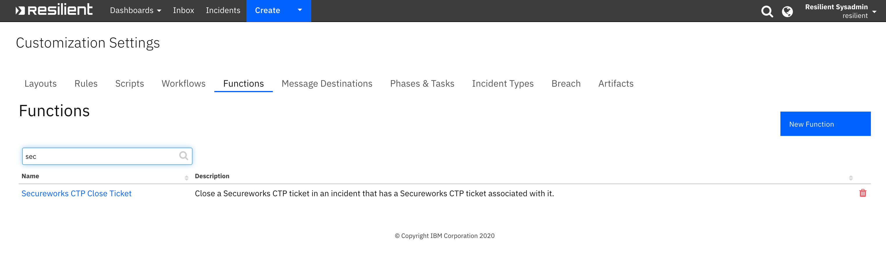
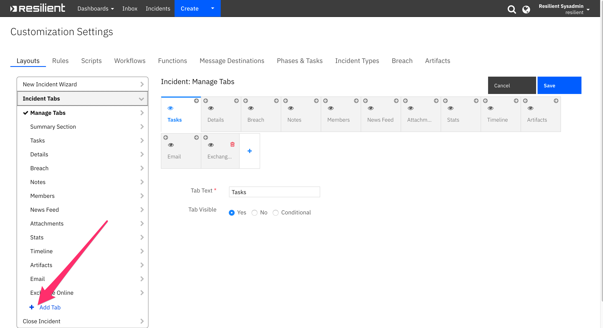
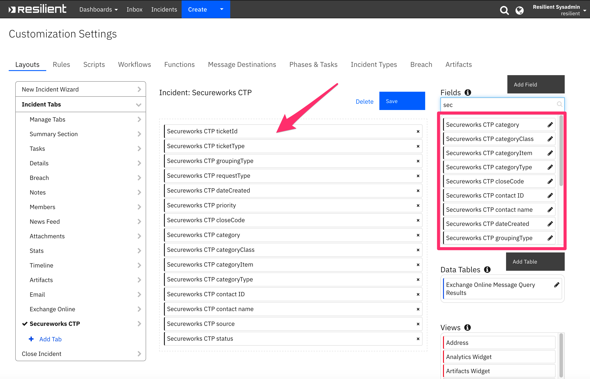
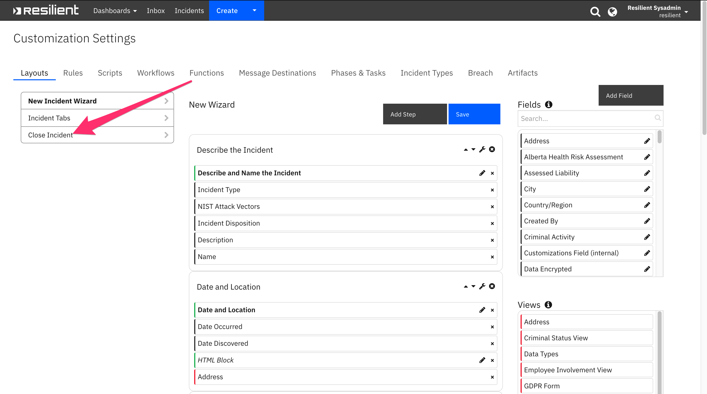
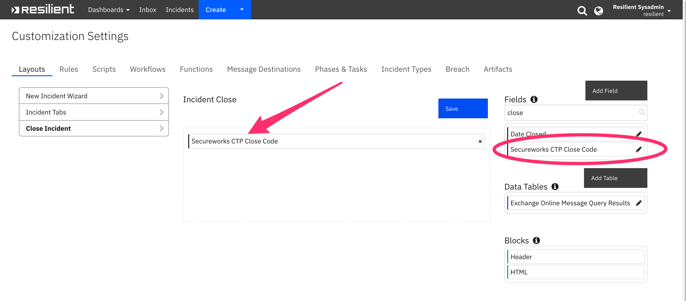

<!--
  This Install README.md is generated by running:
  "resilient-sdk docgen -p fn_secureworks_ctp --install-guide"

  It is best edited using a Text Editor with a Markdown Previewer. VS Code
  is a good example. Checkout https://guides.github.com/features/mastering-markdown/
  for tips on writing with Markdown

  If you make manual edits and run docgen again, a .bak file will be created

  Store any screenshots in the "doc/screenshots" directory and reference them like:
  
-->

# Secureworks CTP Functions for IBM Resilient

- [Release Notes](#release-notes)
- [Overview](#overview)
- [Requirements](#requirements)
- [Installation](#installation)
- [Uninstall](#uninstall)
- [Troubleshooting](#troubleshooting)
- [Support](#support)

---

## Release Notes
<!--
  Specify all changes in this release. Do not remove the release 
  notes of a previous release
-->
### v1.0.0
* Initial Release

---

## Overview
<!--
  Provide a high-level description of the function itself and its remote software or application.
  The text below is parsed from the "description" and "long_description" attributes in the setup.py file
-->
<p>
The Secureworks Counter Threat Platform (CTP) uses the global visibility gained from gathering and analyzing data from clients all over the world to more accurately identify, contain and eradicate cybersecurity threats. By combining up-to-the-minute threat intelligence with the CTP's machine learning and analytics capabilities, organizations can make faster, more informed decisions about how to predict, prevent, detect, and respond to threat activity.
<p>
CTP is used with the Secureworks SOC team when they find a security issue that needs to be communicated to the customer. The issues can be informational, research-based or require proscriptive actions by the customer. Secureworks CTP provides a “ticket-like” interface that allows you acknowledge, add files and notes, and provide ability to close tickets.   
<p>
 The Secureworks CTP integration implements the following functionality in Resilient:

* Poll Secureworks CTP for tickets and create a corresponding incident in the Resilient platform for each ticket.
* Get Secureworks CTP ticket workLogs and attachments and add them as notes and attachments in the corresponding Resilient incident.
* Close a Secureworks CTP ticket when the corresponding Resilient incident is closed.
* Close a Resilient incident when the corresponding Secureworks CTP ticket is closed in Secureworks.


 


---

## Requirements
<!--
  List any Requirements 
-->
* Resilient platform >= `v35.2.32`
* An Integration Server running `resilient_circuits>=30.0.0`
  * To set up an Integration Server see: [ibm.biz/res-int-server-guide](https://ibm.biz/res-int-server-guide)
  * If using API Keys, minimum required permissions are:
      * Org Data: Read, Edit
---

## Installation
* Download the `fn_secureworks_ctp.zip`.
* Copy the `.zip` to your Integration Server and SSH into it.
* **Unzip** the package:
  ```
  $ unzip fn_secureworks_ctp-x.x.x.zip
  ```
* **Change Directory** into the unzipped directory:
  ```
  $ cd fn_secureworks_ctp-x.x.x
  ```
* **Install** the package:
  ```
  $ pip install fn_secureworks_ctp-x.x.x.tar.gz
  ```
* Import the **configurations** into your app.config file:
  ```
  $ resilient-circuits config -u -l fn-secureworks-ctp
  ```
* Import the fn_secureworks_ctp **customizations** into the Resilient platform:
  ```
  $ resilient-circuits customize -y -l fn-secureworks-ctp
  ```
* Open the config file, scroll to the bottom and edit your fn_secureworks_ctp configurations:
  ```
  $ vi ~/.resilient/app.config
  ```
  | Config | Required | Example | Description |
  | ------ | :------: | ------- | ----------- |
  | **base_url** | Yes | `https://api.secureworks.com/api/ticket/v3` | *Secureworks CTP base URL* |
  | **username** | Yes | `user@example.com` | *email address associated with Secureworks account* |
  | **password** | Yes | `` | *password associated with Secureworks account* |
  | **query_ticket_grouping_types** | Yes | `INCIDENT:SECURITY` | *Comma separated list of ticketType:groupingType pairs indicating ticket and grouping types to query. Secureworks ticketTypes : SERVICE_REQUEST, INCIDENT, CHANGE. Secureworks groupingTypes: REQUEST, CHANGE, HEALTH, SECURITY* |
  | **query_limit** | Yes | `10` | *Maximum number of tickets to be returned from Secureworks API query* |
  | **assigned_to_customer** | Yes | `true` | *Boolean indicating whether to only return tickets assigned to the client* |
  | **polling_interval** | Yes | `600` | *Time in seconds between queries to Secureworks endpoint* |
  | **close_codes** | No | `Authorized Activity,Confirmed Security Incident,Duplicate,Incident Misidentified,Inconclusive,Not Actionable,Not Vulnerable,Threat Mitigated` | *Comma separated list of close codes to override the defaults* |
  | **template_file_escalate** | No | `` | *Path to a custom jinja template file used to escalate a Secureworks Ticket to Resilient* |
  | **template_file_close** | No | `` | *Path to a custom jinja template file used to close a Resilient incident when the corresponding ticket is 'Closed' or 'Resolved' in Secureworks* |
  | **cafile** | No | `` | *Path to certificate file* |

* **Save** and **Close** the app.config file.
* [Optional]: Run selftest to test the Integration you configured:
  ```
  $ resilient-circuits selftest -l fn-secureworks-ctp
  ```
* **Run** resilient-circuits or restart the Service on Windows/Linux:
  ```
  $ resilient-circuits run
  ```


---

## Uninstall
* SSH into your Integration Server.
* **Uninstall** the package:
  ```
  $ pip uninstall fn-secureworks-ctp
  ```
* Open the config file, scroll to the [fn_secureworks_ctp] section and remove the section or prefix `#` to comment out the section.
* **Save** and **Close** the app.config file.

---
### Custom Layouts
<!--
  Use this section to provide guidance on where the user should add any custom fields and data tables.
  You may wish to recommend a new incident tab.
  You should save a screenshot "custom_layouts.png" in the doc/screenshots directory and reference it here
-->
Customize Secureworks CTP and Close Incident Layouts to provide Secureworks specific information in the Resilient UI.

#### Secureworks CTP Layout Tab
Create a Secureworks CTP custom incident tab so that you can view Secureworks CTP ticket information in one place. 

* Go to the Customizations Settings -> Layouts tab.
* Click the Incident Tabs menu item on the left. 
* Click the Add Tab button.  
* Enter Secureworks CTP in Add a Tab popup and click Add.

   
---

* Next, search for the Secureworks CTP (scwx) custom incident fields in the Fields search bar.
* Drag Secureworks custom incidents fields on to the layout in the center of the screeen.
* Click Save.

   
---
#### Close Incident Layout Tab
Modify the Close Incident tab so the the Secureworks close code can be selected from the Close Incident popup from Resilient. 
* Go to the Customizations Settings -> Layouts tab.
* Click the Close Incident menu item on the left as shown in the screenshot below.
  
---
* Next, search for the Secureworks CTP Close Code custom incident fields in the Fields search bar.
* Drag the Secureworks CTP Close Code onto the Close Incident layout tab.
   

---

## Troubleshooting
There are several ways to verify the successful operation of a function.

### Resilient Action Status
* When viewing an incident, use the Actions menu to view **Action Status**.
* By default, pending and errors are displayed.
* Modify the filter for actions to also show Completed actions.
* Clicking on an action displays additional information on the progress made or what error occurred.

### Resilient Scripting Log
* A separate log file is available to review scripting errors.
* This is useful when issues occur in the pre-processing or post-processing scripts.
* The default location for this log file is: `/var/log/resilient-scripting/resilient-scripting.log`.

### Resilient Logs
* By default, Resilient logs are retained at `/usr/share/co3/logs`.
* The `client.log` may contain additional information regarding the execution of functions.

### Resilient-Circuits
* The log is controlled in the `.resilient/app.config` file under the section [resilient] and the property `logdir`.
* The default file name is `app.log`.
* Each function will create progress information.
* Failures will show up as errors and may contain python trace statements.

---

<!--
  If necessary, use this section to describe how to configure your security application to work with the integration.
  Delete this section if the user does not need to perform any configuration procedures on your product.

## Configure <Product_Name>

* Step One
* Step Two
* Step Three

---
-->

## Support
| Name | Version | Author | Support URL |
| ---- | ------- | ------ | ----------- |
| fn_secureworks_ctp | 1.0.0 |  | https://ibm.com/mysupport |
