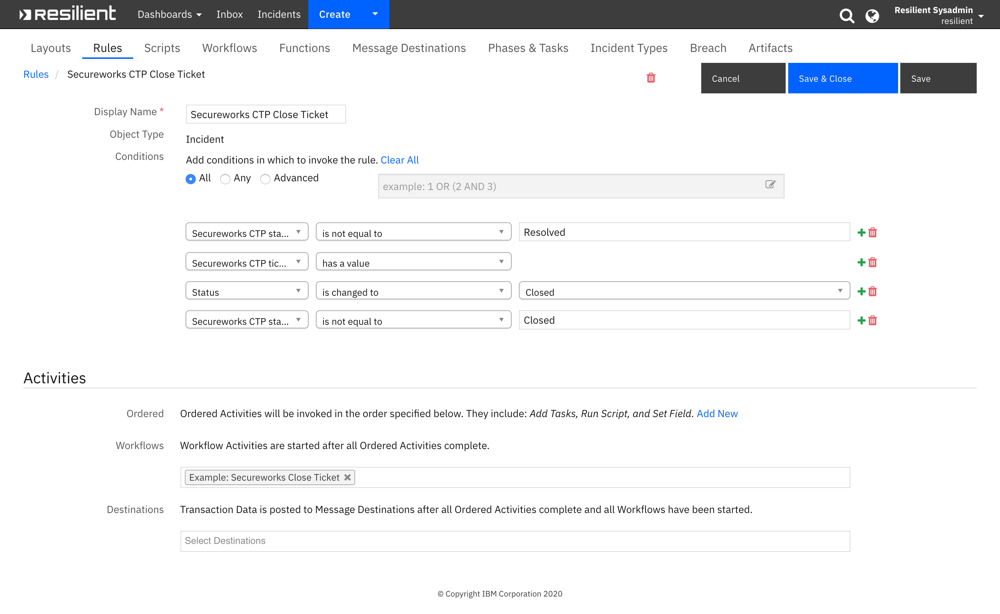

<!--
  This User README.md is generated by running:
  "resilient-sdk docgen -p fn_secureworks_ctp --user-guide"

  It is best edited using a Text Editor with a Markdown Previewer. VS Code
  is a good example. Checkout https://guides.github.com/features/mastering-markdown/
  for tips on writing with Markdown

  If you make manual edits and run docgen again, a .bak file will be created

  Store any screenshots in the "doc/screenshots" directory and reference them like:
  
-->

# **User Guide:** Secureworks CTP Functions for IBM Resilient v1.0.0

## Table of Contents
- [Key Features](#key-features)
- [Poller](#poller)
- [Function - Secureworks CTP Close Ticket](#function---secureworks-ctp-close-ticket)
- [Rules](#rules)

---

## Key Features
<!--
  List the Key Features of the Integration
-->
<p>
The Secureworks Counter Threat Platform (CTP) uses the global visibility gained from gathering and analyzing data from clients all over the world to more accurately identify, contain and eradicate cybersecurity threats. By combining up-to-the-minute threat intelligence with the CTP's machine learning and analytics capabilities, organizations can make faster, more informed decisions about how to predict, prevent, detect, and respond to threat activity.
<p>
CTP is used with the Secureworks SOC team when they find a security issue that needs to be communicated to the customer. The issues can be informational, research-based or require proscriptive actions by the customer. Secureworks CTP provides a “ticket-like” interface that allows you acknowledge, add files and notes, and provide ability to close tickets.   
<p>
The Secureworks CTP integration implements the following functionality in the Resilient platform:

* Poll Secureworks CTP for tickets and create a corresponding incident in the Resilient platform for each ticket.
* Get Secureworks CTP ticket workLogs and attachments and add them as notes and attachments in the corresponding Resilient incident.
* Close a Secureworks CTP ticket when the corresponding Resilient incident is closed.
---
## Integration Flow for Ticket Management

<p>
The primary use case for the Secureworks CTP integration with the Resilient platform is to
bring Secureworks CTP tickets of interest into the Resilient platform for further inspection and migitation. Below is a screenshot of a sample Secureworks CTP incident 
with the incident tab displayed:


<p> 
Once a Secureworks incidents is resolved, the incident is closed in the Resilient platform by the user via the Actions menu Close Incident item, triggering the close menu popup to appear as depicted below.  Select the Secureworks CTP close code, the Resilient Resolution ID and enter the Resolution Summary.  Once the user clicks OK, the Secureworks CTP Close Ticket automatic rule is activated, starting the Example Secureworks Close Ticket workflow.  The Secureworks CTP close code and the Resolution summary are sent back to Secureworks when the function is activated to close the corresponding Secureworks Ticket in Secureworks. 

<p>
NOTE: The integration uses default Secureworks CTP close codes that appear in the Close Incident popup select input field.  The defaults can be overridden in the app.config by setting close_code parameter.


<p>

---
## Poller
The integration poller runs continuously while the integration is running. 

* The poller creates a Resilient incident for each Secureworks CTP ticket returned matching the search criteria.
* The user can specify which of the following Secureworks CTP ticket types to be searched during polling:
  * SERVICE_REQUEST
  * INCIDENT
  * CHANGE
* The user can specify the following Secureworks CTP ticket groups to searched for during polling:
  * REQUEST
  * CHANGE
  * HEALTH
  * SECURITY
* The poller adds Secureworks CTP ticket workLogs and attachments as incident notes and attachments in the corresponding Resilient incident.
* Poller interval can be set in the app.config to specify how often the integration checks for updated tickets from Secureworks CTP. 

---

## Function - Secureworks CTP Close Ticket
Close a Secureworks CTP ticket in an incident that has a Secureworks CTP ticket associated with it.

 

<details><summary>Inputs:</summary>
<p>

| Name | Type | Required | Example | Tooltip |
| ---- | :--: | :------: | ------- | ------- |
| `incident_id` | `number` | Yes | `-` | - |

</p>
</details>

<details><summary>Outputs:</summary>
<p>

```python
results = {'version': '1.0', 
           'success': True, 
           'reason': None, 
           'content': {'code': 'SUCCESS', 
                       'ticketID': 'IN32088613'}, 
           'raw': '{"code": "SUCCESS", "ticketID": "IN32088613"}', 
           'inputs': {'incident_id': 2097}, 
           'metrics': {'version': '1.0', 'package': 
                       'fn-secureworks-ctp', 
                       'package_version': '1.0.0', 
                       'host': 'my-laptop', 
                       'execution_time_ms': 92160, 
                       'timestamp': '2020-04-14 13:53:29'
                       }
}
```

</p>
</details>

<details><summary>Workflows</summary>

The example Secureworks Close Ticket workflow calls the Close Ticket function that closes the associated Secureworks CTP ticket in Secureworks.  


  <details><summary>Example Pre-Process Script:</summary>
  <p>

  ```python
  inputs.incident_id = incident.id
  ```

  </p>
  </details>

  <details><summary>Example Post-Process Script:</summary>
  <p>

  ```python
  if results.success:
  noteText = u'Secureworks ticket {0} closed.'.format(results.content['ticketID'])
elif:
  noteText = u'ERROR: unable to close Secureworks CTP ticket {0}.'.format(results.content['ticketID']) 

incident.addNote(noteText)
  ```

  </p>
  </details>

</details>

---


## Rules
| Rule Name | Object | Workflow Triggered |
| --------- | ------ | ------------------ |
| Secureworks CTP Close Ticket | incident | `example_secureworks_close_ticket` |

---

<details><summary>Example Rule:</summary>

<p>
The example Secureworks CTP Close Ticket rule is an automatic rule which is activated when an incident is closed that has a Secureworks CTP ticket ID associated with it via the scwx_ctp_ticket_id custom incident field.  The rule automatically initiates the example Close Secureworks Ticket workflow under these conditions as shown in the screenshot:



</p>
</details>

<!--
## Inform Resilient Users
  Use this section to optionally provide additional information so that Resilient playbook 
  designer can get the maximum benefit of your integration.
-->