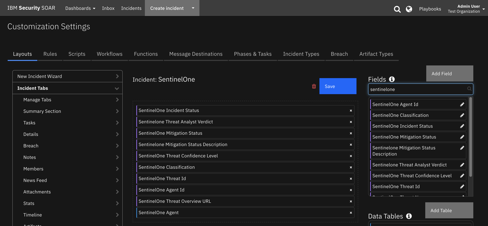

<!--
  This README.md is generated by running:
  "resilient-sdk docgen -p fn_sentinelone"

  This file was generated with resilient-sdk v50.0.151

  It is best edited using a Text Editor with a Markdown Previewer. VS Code
  is a good example. Checkout https://guides.github.com/features/mastering-markdown/
  for tips on writing with Markdown

  All fields followed by "::CHANGE_ME::"" should be manually edited

  If you make manual edits and run docgen again, a .bak file will be created

  Store any screenshots in the "doc/screenshots" directory and reference them like:
  

  NOTE: If your app is available in the container-format only, there is no need to mention the integration server in this readme.
-->

# SentinelOne

## Table of Contents
- [SentinelOne](#sentinelone)
  - [Table of Contents](#table-of-contents)
  - [Release Notes](#release-notes)
  - [Overview](#overview)
    - [Key Features](#key-features)
  - [Requirements](#requirements)
    - [SOAR platform](#soar-platform)
    - [Cloud Pak for Security](#cloud-pak-for-security)
    - [Proxy Server](#proxy-server)
    - [Python Environment](#python-environment)
      - [Prerequisites](#prerequisites)
      - [Configuration](#configuration)
      - [Permissions](#permissions)
  - [Installation](#installation)
    - [Install](#install)
    - [App Configuration](#app-configuration)
    - [Custom Layouts](#custom-layouts)
  - [Function - SentinelOne: Abort Disk Scan](#function---sentinelone-abort-disk-scan)
  - [Function - SentinelOne: Connect to Network](#function---sentinelone-connect-to-network)
  - [Function - SentinelOne: Disconnect From Network](#function---sentinelone-disconnect-from-network)
  - [Function - SentinelOne: Get Agent Details](#function---sentinelone-get-agent-details)
  - [Function - SentinelOne: Get Hash Reputation](#function---sentinelone-get-hash-reputation)
  - [Function - SentinelOne: Get Threat Details](#function---sentinelone-get-threat-details)
  - [Function - SentinelOne: Initiate Disk Scan](#function---sentinelone-initiate-disk-scan)
  - [Function - SentinelOne: Resolve Threat in SentinelOne](#function---sentinelone-resolve-threat-in-sentinelone)
  - [Function - SentinelOne: Restart Agent](#function---sentinelone-restart-agent)
  - [Function - SentinelOne: Send SOAR Note to SentinelOne](#function---sentinelone-send-soar-note-to-sentinelone)
  - [Function - SentinelOne: Shutdown Agent](#function---sentinelone-shutdown-agent)
  - [Function - SentinelOne: Update Notes From SentinelOne](#function---sentinelone-update-notes-from-sentinelone)
  - [Function - Sentinelone: Update Threat Status](#function---sentinelone-update-threat-status)
  - [Script - Convert JSON to rich text v1.3](#script---convert-json-to-rich-text-v13)
  - [Data Table - SentinelOne Agent](#data-table---sentinelone-agent)
      - [API Name:](#api-name)
      - [Columns:](#columns)
  - [Custom Fields](#custom-fields)
  - [Playbooks](#playbooks)
  - [Troubleshooting \& Support](#troubleshooting--support)
    - [For Support](#for-support)

---

## Release Notes
<!--
  Specify all changes in this release. Do not remove the release 
  notes of a previous release
-->
| Version | Date | Notes |
| ------- | ---- | ----- |
| 1.1.0 | 10/2023 | Convert to playbooks; add upload file support; poller template improvements |
| 1.0.1 | 1/2022 | Update payload schema files |
| 1.0.0 | 1/2022 | Initial Release |

---

## Overview
<!--
  Provide a high-level description of the function itself and its remote software or application.
  The text below is parsed from the "description" and "long_description" attributes in the setup.py file
-->
**IBM SOAR app - bidirectional synchronization and functions for SentinelOne**

 


The SentinelOne platform provides AI-powered prevention, detection, response, and threat hunting across user endpoints, containers, cloud workloads, and IoT devices. 

This app escalates SentinelOne threat incidents into IBM Security SOAR as an incident/case.


### Key Features
<!--
  List the Key Features of the Integration
-->
* Poll SentinelOne for threats and create a corresponding incident/case in the IBM SOAR platform for each threat.
* Get SentinelOne threat notes and add them as notes in corresponding IBM SOAR incident/case.
* Resolve a SentinelOne threat when the corresponding IBM SOAR incident is closed.
* Close an IBM SOAR incident/case when the corresponding SentinelOne threat is resolved in SentinelOne.
* Create artifacts from the SentinelOne threat in the IBM SOAR platform.
* Provide information on the SentinelOne agent (endpoint) in a data table.
* Allow the IBM SOAR user to perform the following actions on the SentinelOne agent:
  - connect/disconnect agent from network
  - shutdown/restart agent
  - initiate/abort full disk scan
* Get the agent or threat details and write the JSON returned from SentinelOne in a formatted SOAR case note.

---

## Requirements
<!--
  List any Requirements 
--> 
This app supports the IBM Security QRadar SOAR Platform and the IBM Security QRadar SOAR for IBM Cloud Pak for Security.

### SOAR platform
The SOAR platform supports two app deployment mechanisms, Edge Gateway (formerly App Host) and integration server.

If deploying to a SOAR platform with an Edge Gateway, the requirements are:
* SOAR platform >= `48.2.16`.
* The app is in a container-based format (available from the AppExchange as a `zip` file).

If deploying to a SOAR platform with an integration server, the requirements are:
* SOAR platform >= `48.2.16`.
* The app is in the older integration format (available from the AppExchange as a `zip` file which contains a `tar.gz` file).
* Integration server is running `resilient-circuits>=49.0.0`.
* If using an API key account, make sure the account provides the following minimum permissions: 
  | Name | Permissions |
  | ---- | ----------- |
  | Org Data | Read |
  | Function | Read |
  | Incident | Read, Edit, Create, Owner, Status |
  | Incident Notes | Edit |

The following SOAR platform guides provide additional information: 
* _Edge Gateway Deployment Guide_ or _App Host Deployment Guide_: provides installation, configuration, and troubleshooting information, including proxy server settings. 
* _Integration Server Guide_: provides installation, configuration, and troubleshooting information, including proxy server settings.
* _System Administrator Guide_: provides the procedure to install, configure and deploy apps. 

The above guides are available on the IBM Documentation website at [ibm.biz/soar-docs](https://ibm.biz/soar-docs). On this web page, select your SOAR platform version. On the follow-on page, you can find the _Edge Gateway Deployment Guide_, _App Host Deployment Guide_, or _Integration Server Guide_ by expanding **Apps** in the Table of Contents pane. The System Administrator Guide is available by expanding **System Administrator**.

### Cloud Pak for Security
If you are deploying to IBM Cloud Pak for Security, the requirements are:
* IBM Cloud Pak for Security >= `1.8`.
* Cloud Pak is configured with an Edge Gateway.
* The app is in a container-based format (available from the AppExchange as a `zip` file).

The following Cloud Pak guides provide additional information: 
* _Edge Gateway Deployment Guide_ or _App Host Deployment Guide_: provides installation, configuration, and troubleshooting information, including proxy server settings. From the Table of Contents, select Case Management and Orchestration & Automation > **Orchestration and Automation Apps**.
* _System Administrator Guide_: provides information to install, configure, and deploy apps. From the IBM Cloud Pak for Security IBM Documentation table of contents, select Case Management and Orchestration & Automation > **System administrator**.

These guides are available on the IBM Documentation website at [ibm.biz/cp4s-docs](https://ibm.biz/cp4s-docs). From this web page, select your IBM Cloud Pak for Security version. From the version-specific IBM Documentation page, select Case Management and Orchestration & Automation.

### Proxy Server
The app does support a proxy server.

### Python Environment
Python 3.6 and Python 3.9 are supported.
Additional package dependencies may exist for each of these packages:
* resilient-circuits>=49.0.0

This app has been implemented using:
| Product Name | Product Version | API URL | API Version |
| ------------ | --------------- | ------- | ----------- |
| SentinelOne  | X#99 | https://SentinelOne-server/web/api/v2.1 | 2.1 |

#### Prerequisites
<!--
List any prerequisites that are needed to use with this endpoint solution. Remove any section that is unnecessary.
-->
* A SentinelOne cloud account with Admin role.

#### Configuration
<!--
List any steps that are needed to configure the endpoint to use this app.
-->
* To run the app, obtain an API token from the SentinelOne My User menu item in the Options menu and place in the App configuration file.
* 
#### Permissions
<!--
List any user permissions that are needed to use this endpoint. For example, list the API key permissions.
-->
* SentinelOne Admin role is required in the SentinelOne account that IBM SOAR is communicating with as specified in the App configration file.


---

## Installation

### Install
* To install or uninstall an App or Integration on the _SOAR platform_, see the documentation at [ibm.biz/soar-docs](https://ibm.biz/soar-docs).
* To install or uninstall an App on _IBM Cloud Pak for Security_, see the documentation at [ibm.biz/cp4s-docs](https://ibm.biz/cp4s-docs) and follow the instructions above to navigate to Orchestration and Automation.

### App Configuration
The following table provides the settings you need to configure the app. These settings are made in the app.config file. See the documentation discussed in the Requirements section for the procedure.

| Config | Required | Example | Description |
| ------ | :------: | ------- | ----------- |
| **sentinelone_server** | Yes | `xxx.sentinelone.net` | *SentinelOne server* |
| **api_version** | Yes | `2.1` | *SentinelOne REST API version* |
| **api_token** | Yes | `xxxxxx` | *SentinelOne user API token* |
| **polling_interval** | Yes | `60` | *Poller interval time in seconds. Value of zero to turn poller off.*|
| **polling_lookback** | Yes | `120` | *Number of minutes to look back for threat updates. Value is only used on the first time polling when the app starts.* |
| **account_ids** | No | `123456789012345678` | *Comma separated list of SentinelOne accountIds to query for threats.* |
| **site_ids** | No | `987654321098765432` | *Comma separated list of SentinelOne siteIds to query for threats.* |
| **incident_statuses** | No | `resolved,in_progress,unresolved` | *Comma separated list of SentinelOne incidentStatuses to query for threats. NOTE: Include incidentStatus **resolved**  if the poller should close SOAR incidents that are marked as **resolved** in SentinelOne.* |
| **limit** | No | `25` | *Limit number of threats to return from query.* |
| **sort_by** | No | `createdDate` | *The column to sort results by when querying threats.* |
| **sort_order** | No | `desc` | *Sort direction to return threat query results: 'asc' or 'desc'.* |
| **query_param** | No | `threat details` | *Full text search for fields when querying threats.* |
| **send_soar_link_to_sentinelone** | No | true | *Send SOAR incident URL live link via threat note to SentinelOne.* |
| **soar_create_case_template** | No | /var/rescircuits/create_case.jinja | *Path to custom create incident jinja template.* |
| **soar_close_case_template** | No | /var/rescircuits/close_case.jinja | *Path to custom close incident jinja template.* |
| **soar_update_case_template** | No | /var/rescircuits/update_case.jinja | *Path to custom update incident jinja template.* |
| **verify** | No | /path/toclient_certificate.pem | *Path to client SSL certificate.* |

### Custom Layouts
<!--
  Use this section to provide guidance on where the user should add any custom fields and data tables.
  You may wish to recommend a new incident tab.
  You should save a screenshot "custom_layouts.png" in the doc/screenshots directory and reference it here
-->
* Create a SentinelOne incident tab and import the data table and custom fields as shown in the screenshot:

   

* Create a Close Incident tab so that when a SOAR case corresponding to a SentinelOne threat is closed in SOAR, the user can select a SentinelOne Threat Analyst Verdict to send to SentinelOne. The SentinelOne threat cannot be closed if the Analyst Verdict is **undefined**.  
    
Here is a screenshot of the SentinelOne custom Close Incident popup:

    
 NOTE: If a custom **Close Incident** tab is created, all non-SentinelOne incidents also contain the SentinelOne Threat Analyst Verdict select field in the Close menu pop-up. To avoid this, you can alternatively, use the provided incident menu item rule **SentinelOne: Update Analyst Verdict and Threat Status**, which a user can run manually to update the Analyst Verdict and Threat status in SentinelOne. When the rule is run to resolve a SentinelOne threat, choose an Analyst Verdict and set the Threat Status to **resolved**. SOAR updates the SentinelOne threat which in turn causes the incident to be closed in IBM SOAR on the next poll.

---

## Function - SentinelOne: Abort Disk Scan
Abort a Disk Scan on an agent managed by SentinelOne.

 


<details><summary>Inputs:</summary>
<p>

| Name | Type | Required | Example | Tooltip |
| ---- | :--: | :------: | ------- | ------- |
| `sentinelone_agent_id` | `text` | Yes | `-` | - |

</p>
</details>

<details><summary>Outputs:</summary>
<p>

> **NOTE:** This example might be in JSON format, but `results` is a Python Dictionary on the SOAR platform.

```python
results = {
  "content": {
    "data": {
      "affected": 1
    }
  },
  "inputs": {
    "sentinelone_agent_id": "1212121212121212121"
  },
  "metrics": {
    "execution_time_ms": 4108,
    "host": "myHost",
    "package": "fn-sentinelone",
    "package_version": "1.0.0",
    "timestamp": "2021-12-13 11:22:36",
    "version": "1.0"
  },
  "raw": null,
  "reason": null,
  "success": true,
  "version": 2.0
}
```

</p>
</details>

<details><summary>Example Function Input Script:</summary>
<p>

```python
inputs.sentinelone_agent_id = row.sentinelone_dt_agent_id
```

</p>
</details>

<details><summary>Example Function Post Process Script:</summary>
<p>

```python
results = playbook.functions.results.abort_scan_results

so_inputs = results.get("inputs")
agent_id = so_inputs.get("sentinelone_agent_id")
note = u"<b>SentinelOne: Abort Full Disk Scan </b><br>  SentinelOne Agent Id: {0}".format(agent_id)
content = results.get("content")
if content:
  data = content.get("data")
  if data:
    if int(data.get("affected")) <= 0:
      note = u"{0} Full Disk Scan was NOT aborted.".format(note)
    else:
      note = u"{0} Full Disk Scan aborted.".format(note)
  else:
    note = u"{0} Full Disk Scan was NOT aborted. No 'data' returned from function".format(note)
else:
    note = u"{0} Full Disk Scan was NOT aborted. No content returned from function".format(note)  

incident.addNote(helper.createRichText(note))
```

</p>
</details>

---
## Function - SentinelOne: Connect to Network
Connect an endpoint managed by SentinelOne to the network.

 

<details><summary>Inputs:</summary>
<p>

| Name | Type | Required | Example | Tooltip |
| ---- | :--: | :------: | ------- | ------- |
| `sentinelone_agent_id` | `text` | Yes | `-` | - |

</p>
</details>

<details><summary>Outputs:</summary>
<p>

> **NOTE:** This example might be in JSON format, but `results` is a Python Dictionary on the SOAR platform.

```python
results = {
  "content": {
    "data": {
      "affected": 1
    }
  },
  "inputs": {
    "sentinelone_agent_id": "1212121212121212121"
  },
  "metrics": {
    "execution_time_ms": 226,
    "host": "myHost",
    "package": "fn-sentinelone",
    "package_version": "1.0.0",
    "timestamp": "2021-12-13 11:21:53",
    "version": "1.0"
  },
  "raw": null,
  "reason": null,
  "success": true,
  "version": 2.0
}
```

</p>
</details>

<details><summary>Example Function Input Script:</summary>
<p>

```python
inputs.sentinelone_agent_id = row.sentinelone_dt_agent_id
```

</p>
</details>

<details><summary>Example Function Post Process Script:</summary>
<p>

```python
results = playbook.functions.results.connect_results

so_inputs = results.get("inputs")
agent_id = so_inputs.get("sentinelone_agent_id")
note = u"<b>SentinelOne: Connect to Network </b><br>  SentinelOne Agent Id: {0}".format(agent_id)
content = results.get("content")
if content:
  data = content.get("data")
  if data:
    if int(data.get("affected")) <= 0:
      note = u"{0} is NOT connected to network".format(note)
    else:
      networkStatus = u"""<p style= "color:{color}">{status}</p>""".format(color="green", status="connected")
      row["sentinelone_dt_network_status"] = helper.createRichText(networkStatus)
      note = u"{0} is connected to network".format(note)
  else:
    note = u"{0} no data returned from function".format(note)
else:
    note = u"{0} no content data returned from function".format(note)  

incident.addNote(helper.createRichText(note))

```

</p>
</details>

---
## Function - SentinelOne: Disconnect From Network
Disconnect an endpoint managed by SentinelOne from the network.

 

<details><summary>Inputs:</summary>
<p>

| Name | Type | Required | Example | Tooltip |
| ---- | :--: | :------: | ------- | ------- |
| `sentinelone_agent_id` | `text` | Yes | `-` | - |

</p>
</details>

<details><summary>Outputs:</summary>
<p>

> **NOTE:** This example might be in JSON format, but `results` is a Python Dictionary on the SOAR platform.

```python
results = {
  "content": {
    "data": {
      "affected": 1
    }
  },
  "inputs": {
    "sentinelone_agent_id": "1275282318251495460"
  },
  "metrics": {
    "execution_time_ms": 242,
    "host": "myHost",
    "package": "fn-sentinelone",
    "package_version": "1.0.0",
    "timestamp": "2021-12-13 11:21:08",
    "version": "1.0"
  },
  "raw": null,
  "reason": null,
  "success": true,
  "version": 2.0
}
```

</p>
</details>

<details><summary>Example Function Input Script:</summary>
<p>

```python
inputs.sentinelone_agent_id = row.sentinelone_dt_agent_id
```

</p>
</details>

<details><summary>Example Function Post Process Script:</summary>
<p>

```python
results = playbook.functions.results.disconnect_results

note = u"<b>SentinelOne: Disconnect From Network </b>"

if results.get("success"):
  so_inputs = results.get("inputs")
  agent_id = so_inputs.get("sentinelone_agent_id")
  note = "{0}<br>  SentinelOne Agent Id: {1}".format(note, agent_id)
  content = results.get("content")
  if content:
    data = content.get("data")
    if data:
      if int(data.get("affected")) <= 0:
        note = "{0} was not disconnected from network".format(note)
      else:
        networkStatus = """<p style= "color:{color}">{status}</p>""".format(color="red", status="disconnected")
        row["sentinelone_dt_network_status"] = helper.createRichText(networkStatus)      
        note = "{0} is disconnected from network".format(note)
    else:
      note = "{0} no data returned from function".format(note)
  else:
    note = "{0} no content data returned from function".format(note)  
else:
  note = "{0} Disconnect from Network function did not return success".format(note)
  
incident.addNote(helper.createRichText(note))
```

</p>
</details>

---
## Function - SentinelOne: Get Agent Details
Get details of a SentinelOne managed agent.

 

<details><summary>Inputs:</summary>
<p>

| Name | Type | Required | Example | Tooltip |
| ---- | :--: | :------: | ------- | ------- |
| `sentinelone_agent_id` | `text` | Yes | `-` | - |

</p>
</details>

<details><summary>Outputs:</summary>
<p>

> **NOTE:** This example might be in JSON format, but `results` is a Python Dictionary on the SOAR platform.

```python
results = {
  "content": {
    "data": [
      {
        "accountId": "434343434343434343",
        "accountName": "SentinelOne",
        "activeDirectory": {
          "computerDistinguishedName": null,
          "computerMemberOf": [],
          "lastUserDistinguishedName": null,
          "lastUserMemberOf": []
        },
        "activeThreats": 0,
        "agentVersion": "21.10.1.6",
        "allowRemoteShell": false,
        "appsVulnerabilityStatus": "not_applicable",
        "cloudProviders": {},
        "computerName": "computerName",
        "consoleMigrationStatus": "N/A",
        "coreCount": 2,
        "cpuCount": 2,
        "cpuId": "AMD EPYC Processor (with IBPB)",
        "createdAt": "2021-10-26T13:18:19.135249Z",
        "detectionState": null,
        "domain": "unknown",
        "encryptedApplications": false,
        "externalId": "",
        "externalIp": "12.4.8.3",
        "firewallEnabled": true,
        "firstFullModeTime": null,
        "groupId": "607447413805059643",
        "groupIp": "12.4.8.x",
        "groupName": "Default Group",
        "id": "1275282318251495460",
        "inRemoteShellSession": false,
        "infected": false,
        "installerType": ".rpm",
        "isActive": true,
        "isDecommissioned": false,
        "isPendingUninstall": false,
        "isUninstalled": false,
        "isUpToDate": true,
        "lastActiveDate": "2021-12-13T16:23:27.067226Z",
        "lastIpToMgmt": "10.21.10.88",
        "lastLoggedInUserName": "",
        "licenseKey": "",
        "locationEnabled": false,
        "locationType": "not_supported",
        "locations": null,
        "machineType": "server",
        "mitigationMode": "protect",
        "mitigationModeSuspicious": "detect",
        "modelName": "QEMU Standard PC (i440FX + PIIX, 1996)",
        "networkInterfaces": [
          {
            "gatewayIp": null,
            "gatewayMacAddress": null,
            "id": "1275282318259884069",
            "inet": [
              "10.21.10.88"
            ],
            "inet6": [],
            "name": "eth0",
            "physical": "00:00:0A:15:0A:58"
          },
          {
            "gatewayIp": "9.46.92.1",
            "gatewayMacAddress": "00:00:0c:9f:f0:01",
            "id": "1275282318268272678",
            "inet": [
              "9.46.92.211"
            ],
            "inet6": [],
            "name": "eth1",
            "physical": "00:00:09:2E:5C:D3"
          }
        ],
        "networkQuarantineEnabled": false,
        "networkStatus": "connected",
        "operationalState": "na",
        "operationalStateExpiration": null,
        "osArch": "64 bit",
        "osName": "Linux",
        "osRevision": "CentOS release 7.9.2009 (Core) 3.10.0-1160.49.1.el7.x86_64",
        "osStartTime": "2021-12-11T22:40:32Z",
        "osType": "linux",
        "osUsername": "root",
        "rangerStatus": "NotApplicable",
        "rangerVersion": null,
        "registeredAt": "2021-10-26T13:18:19.132188Z",
        "remoteProfilingState": "disabled",
        "remoteProfilingStateExpiration": null,
        "scanAbortedAt": "2021-12-10T21:57:56.711226Z",
        "scanFinishedAt": "2021-12-10T02:33:00.768224Z",
        "scanStartedAt": "2021-12-13T16:22:40.612822Z",
        "scanStatus": "started",
        "siteId": "607447413779893818",
        "siteName": "mySite",
        "storageName": null,
        "storageType": null,
        "threatRebootRequired": false,
        "totalMemory": 3789,
        "updatedAt": "2021-12-13T16:22:40.616308Z",
        "userActionsNeeded": [],
        "uuid": "8329e587-bbe9-b906-a6a5-646e2686eba9"
      }
    ],
    "pagination": {
      "nextCursor": null,
      "totalItems": 1
    }
  },
  "inputs": {
    "sentinelone_agent_id": "12121212121212121"
  },
  "metrics": {
    "execution_time_ms": 277,
    "host": "myHost",
    "package": "fn-sentinelone",
    "package_version": "1.0.0",
    "timestamp": "2021-12-13 11:23:55",
    "version": "1.0"
  },
  "raw": null,
  "reason": null,
  "success": true,
  "version": 2.0
}
```

</p>
</details>

<details><summary>Example Function Input Script:</summary>
<p>

```python
inputs.sentinelone_agent_id = incident.properties.sentinelone_agent_id
```

</p>
</details>

<details><summary>Example Function Post Process Script:</summary>
<p>

```python
from datetime import datetime

results = playbook.functions.results.update_agent_results

note = u"<b>SentinelOne: Update Agent in Data Table: </b> \n"
if results.get("success"):
  content = results.get("content")
  if content:
    data = content.get("data")
    if data:
      for agent in data:
        row.sentinelone_dt_query_date = datetime.now()
        row.sentinelone_dt_agent_id = agent.get("id")
        networkStatus = agent.get("networkStatus")
        display_color = "green" if networkStatus == "connected" else "red"
        networkStatus = u"""<p style= "color:{color}">{status}</p>""".format(color=display_color, status=networkStatus)
        row.sentinelone_dt_network_status = helper.createRichText(networkStatus)
        row.sentinelone_dt_computername = agent.get("computerName")
        row.sentinelone_dt_external_ip = agent.get("externalIp")
        row.sentinelone_dt_site = agent.get("siteName")
        row.sentinelone_dt_agent_version = agent.get("agentVersion")
        row.sentinelone_dt_threat_count = agent.get("activeThreats")
        row.sentinelone_dt_domain = agent.get("domain")
        row.sentinelone_dt_os_name = agent.get("osName")
        row.sentinelone_dt_uuid = agent.get("uuid")
        row.sentinelone_dt_is_active = agent.get("isActive")
        row.sentinelone_dt_registered = agent.get("registeredAt")
        row.sentinelone_dt_created = agent.get("createdAt")
        row.sentinelone_dt_updated = agent.get("updatedAt")
        note = "{0} success.".format(note)
    else:
      note = "{0} No agent data returned from function.".format(note)
  else:
    note = "{0} No content data returned from function.".format(note)
else:
  note = "{0} Get Agent Details function did not return success.".format(note)
  
incident.addNote(helper.createRichText(note))
```

</p>
</details>

---
## Function - SentinelOne: Get Hash Reputation
Get the SentinelOne reputation of a hash.

 

<details><summary>Inputs:</summary>
<p>

| Name | Type | Required | Example | Tooltip |
| ---- | :--: | :------: | ------- | ------- |
| `sentinelone_hash` | `text` | No | `-` | - |

</p>
</details>

<details><summary>Outputs:</summary>
<p>

> **NOTE:** This example might be in JSON format, but `results` is a Python Dictionary on the SOAR platform.

```python
results = {
  "content": {
    "data": {
      "rank": "0"
    }
  },
  "inputs": {
    "sentinelone_hash": "1641df58c1027a00f670d41491a2eecff931604c"
  },
  "metrics": {
    "execution_time_ms": 202,
    "host": "myHost",
    "package": "fn-sentinelone",
    "package_version": "1.0.0",
    "timestamp": "2021-12-13 11:27:14",
    "version": "1.0"
  },
  "raw": null,
  "reason": null,
  "success": true,
  "version": 2.0
}
```

</p>
</details>

<details><summary>Example Function Input Script:</summary>
<p>

```python
inputs.sentinelone_hash = artifact.value
```

</p>
</details>

<details><summary>Example Function Post Process Script:</summary>
<p>

```python
results = playbook.functions.results.get_reputation_results

note = u"<b>SentinelOne: Get Hash Reputation: </b><br>"
content = results.get("content")
inputs = results.get("inputs")
hash_value = inputs.get("sentinelone_hash")
if content:
  data = content.get("data")
  if data:
    rank = data.get("rank")
    note = u"{0} Hash <b>{1}</b> has rank: <b>{2}</b>".format(note, hash_value, rank)
  else:
    note = u"{0} No data returned from function.".format(note)
else:
  note = u"{0} No content data returned from function.".format(note)
  
incident.addNote(helper.createRichText(note))
```

</p>
</details>

---
## Function - SentinelOne: Get Threat Details
Get the details of a threat detected by SentinelOne.

 

<details><summary>Inputs:</summary>
<p>

| Name | Type | Required | Example | Tooltip |
| ---- | :--: | :------: | ------- | ------- |
| `sentinelone_threat_id` | `text` | No | `-` | - |

</p>
</details>

<details><summary>Outputs:</summary>
<p>

> **NOTE:** This example might be in JSON format, but `results` is a Python Dictionary on the SOAR platform.

```python
results = {
  "content": {
    "data": [
      {
        "agentDetectionInfo": {
          "accountId": "433241117337583618",
          "accountName": "SentinelOne",
          "agentDetectionState": null,
          "agentDomain": "unknown",
          "agentIpV4": "10.21.10.88,9.46.92.211",
          "agentIpV6": "",
          "agentLastLoggedInUserName": "",
          "agentMitigationMode": "detect",
          "agentOsName": "Linux",
          "agentOsRevision": "CentOS release 7.9.2009 (Core) 3.10.0-1160.49.1.el7.x86_64",
          "agentRegisteredAt": "2021-10-26T13:18:19.132188Z",
          "agentUuid": "8329e587-bbe9-b906-a6a5-646e2686eba9",
          "agentVersion": "21.10.1.6",
          "externalIp": "129.41.87.3",
          "groupId": "607447413805059643",
          "groupName": "Default Group",
          "siteId": "606060606060606060",
          "siteName": "mySite"
        },
        "agentRealtimeInfo": {
          "accountId": "43434343434343434343434343",
          "accountName": "SentinelOne",
          "activeThreats": 1,
          "agentComputerName": "SplunkHF1.fyre.ibm.com",
          "agentDecommissionedAt": null,
          "agentDomain": "unknown",
          "agentId": "1275282318251495460",
          "agentInfected": true,
          "agentIsActive": true,
          "agentIsDecommissioned": false,
          "agentMachineType": "server",
          "agentMitigationMode": "detect",
          "agentNetworkStatus": "connected",
          "agentOsName": "Linux",
          "agentOsRevision": "CentOS release 7.9.2009 (Core) 3.10.0-1160.49.1.el7.x86_64",
          "agentOsType": "linux",
          "agentUuid": "8329e587-bbe9-b906-a6a5-646e2686eba9",
          "agentVersion": "21.10.1.6",
          "groupId": "6060606060606060606",
          "groupName": "Default Group",
          "networkInterfaces": [
            {
              "id": "1275282318268272678",
              "inet": [
                "9.46.92.211"
              ],
              "inet6": [],
              "name": "eth1",
              "physical": "00:00:09:2E:5C:D3"
            },
            {
              "id": "1275282318259884069",
              "inet": [
                "10.21.10.88"
              ],
              "inet6": [],
              "name": "eth0",
              "physical": "00:00:0A:15:0A:58"
            }
          ],
          "operationalState": "na",
          "rebootRequired": false,
          "scanAbortedAt": "2021-12-10T21:57:56.711226Z",
          "scanFinishedAt": "2021-12-10T02:33:00.768224Z",
          "scanStartedAt": "2021-12-13T16:22:40.612822Z",
          "scanStatus": "started",
          "siteId": "606060606060606060",
          "siteName": "IBM",
          "storageName": null,
          "storageType": null,
          "userActionsNeeded": []
        },
        "containerInfo": {
          "id": null,
          "image": null,
          "labels": null,
          "name": null
        },
        "id": "1308905355630511064",
        "indicators": [
          {
            "category": "Persistence",
            "description": "Unsigned kernel module was loaded.",
            "ids": [
              384
            ],
            "tactics": [
              {
                "name": "Persistence",
                "source": "MITRE",
                "techniques": [
                  {
                    "link": "https://attack.mitre.org/techniques/T1547/006/",
                    "name": "T1547.006"
                  }
                ]
              }
            ]
          },
          {
            "category": "Persistence",
            "description": "New kernel module was added.",
            "ids": [
              399
            ],
            "tactics": [
              {
                "name": "Persistence",
                "source": "MITRE",
                "techniques": [
                  {
                    "link": "https://attack.mitre.org/techniques/T1547/006/",
                    "name": "T1547.006"
                  }
                ]
              }
            ]
          }
        ],
        "kubernetesInfo": {
          "cluster": null,
          "controllerKind": null,
          "controllerLabels": null,
          "controllerName": null,
          "namespace": null,
          "namespaceLabels": null,
          "node": null,
          "pod": null,
          "podLabels": null
        },
        "mitigationStatus": [],
        "threatInfo": {
          "analystVerdict": "true_positive",
          "analystVerdictDescription": "True positive",
          "automaticallyResolved": false,
          "browserType": null,
          "certificateId": null,
          "classification": "Malware",
          "classificationSource": "Static",
          "cloudFilesHashVerdict": "provider_unknown",
          "collectionId": "1140024784343285701",
          "confidenceLevel": "suspicious",
          "createdAt": "2021-12-11T22:41:17.533077Z",
          "detectionEngines": [
            {
              "key": "executables",
              "title": "Behavioral AI"
            }
          ],
          "detectionType": "dynamic",
          "engines": [
            "DBT - Executables"
          ],
          "externalTicketExists": false,
          "externalTicketId": null,
          "failedActions": false,
          "fileExtension": null,
          "fileExtensionType": null,
          "filePath": "/opt/CrowdStrike/falcon-sensor12803",
          "fileSize": 1617904,
          "fileVerificationType": null,
          "identifiedAt": "2021-12-11T22:41:17.461397Z",
          "incidentStatus": "in_progress",
          "incidentStatusDescription": "In progress",
          "initiatedBy": "agent_policy",
          "initiatedByDescription": "Agent Policy",
          "initiatingUserId": null,
          "initiatingUsername": null,
          "isFileless": false,
          "isValidCertificate": null,
          "maliciousProcessArguments": " falcon-sensor",
          "md5": null,
          "mitigatedPreemptively": false,
          "mitigationStatus": "not_mitigated",
          "mitigationStatusDescription": "Not mitigated",
          "originatorProcess": "systemd",
          "pendingActions": false,
          "processUser": "root",
          "publisherName": null,
          "reachedEventsLimit": null,
          "rebootRequired": false,
          "sha1": "1641df58c1027a00f670d41491a2eecff931604c",
          "sha256": null,
          "storyline": "2588b11a-e3cd-1677-7746-3f85cd99c850",
          "threatId": "1308905355630511064",
          "threatName": "falcon-sensor12803",
          "updatedAt": "2021-12-13T16:25:55.851553Z"
        },
        "whiteningOptions": [
          "path",
          "hash"
        ]
      }
    ],
    "pagination": {
      "nextCursor": null,
      "totalItems": 1
    }
  },
  "inputs": {
    "sentinelone_threat_id": "1308905355630511064"
  },
  "metrics": {
    "execution_time_ms": 260,
    "host": "myHost",
    "package": "fn-sentinelone",
    "package_version": "1.0.0",
    "timestamp": "2021-12-13 11:26:02",
    "version": "1.0"
  },
  "raw": null,
  "reason": null,
  "success": true,
  "version": 2.0
}
```

</p>
</details>

<details><summary>Example Function Input Script:</summary>
<p>

```python
inputs.sentinelone_threat_id = incident.properties.sentinelone_threat_id
```

</p>
</details>

<details><summary>Example Function Post Process Script:</summary>
<p>

```python
results = playbook.functions.results.get_threat_results

inputs = results.get("inputs")
threat_id = inputs.get("sentinelone_threat_id")
content = results.get("content")
data = content.get("data")

header = u"SentinelOne Threat Id: {0} Details:".format(threat_id)

json_note = {
              "version": "1.1",
              "header": header, 
              "json": data,
              "sort": False
            }

workflow.addProperty('convert_json_to_rich_text', json_note)
```

</p>
</details>

---
## Function - SentinelOne: Initiate Disk Scan
Initiate a Full Disk scan on an agent managed by SentinelOne.

  

<details><summary>Inputs:</summary>
<p>

| Name | Type | Required | Example | Tooltip |
| ---- | :--: | :------: | ------- | ------- |
| `sentinelone_agent_id` | `text` | Yes | `-` | - |

</p>
</details>

<details><summary>Outputs:</summary>
<p>

> **NOTE:** This example might be in JSON format, but `results` is a Python Dictionary on the SOAR platform.

```python
results = {
  "content": {
    "data": {
      "affected": 1
    }
  },
  "inputs": {
    "sentinelone_agent_id": "1275282318251495460"
  },
  "metrics": {
    "execution_time_ms": 5678,
    "host": "myHost",
    "package": "fn-sentinelone",
    "package_version": "1.0.0",
    "timestamp": "2021-12-13 11:22:20",
    "version": "1.0"
  },
  "raw": null,
  "reason": null,
  "success": true,
  "version": 2.0
}
```

</p>
</details>

<details><summary>Example Function Input Script:</summary>
<p>

```python
inputs.sentinelone_agent_id = row.sentinelone_dt_agent_id
```

</p>
</details>

<details><summary>Example Function Post Process Script:</summary>
<p>

```python
results = playbook.functions.results.initiate_scan_results
so_inputs = results.get("inputs")
agent_id = so_inputs.get("sentinelone_agent_id")
note = u"<b>SentinelOne: Initiate Full Disk Scan </b><br>  SentinelOne Agent Id: {0}".format(agent_id)
content = results.get("content")
if content:
  data = content.get("data")
  if data:
    if int(data.get("affected")) <= 0:
      note = u"{0} Full Disk Scan was NOT initiated.".format(note)
    else:
      note = u"{0} Full Disk Scan initiated.".format(note)
  else:
    note = u"{0} Full Disk Scan was NOT initiated. No 'data' returned from function".format(note)
else:
    note = u"{0} Full Disk Scan was NOT initiated. No content returned from function".format(note)  

incident.addNote(helper.createRichText(note))
```

</p>
</details>

---
## Function - SentinelOne: Resolve Threat in SentinelOne
Resolve (close) a threat in SentinelOne.

 

 

<details><summary>Inputs:</summary>
<p>

| Name | Type | Required | Example | Tooltip |
| ---- | :--: | :------: | ------- | ------- |
| `incident_id` | `number` | No | `-` | - |

</p>
</details>

<details><summary>Outputs:</summary>
<p>

> **NOTE:** This example might be in JSON format, but `results` is a Python Dictionary on the SOAR platform.

```python
results = {
  "content": {
    "success": true,
    "threat_id": "131313131313131313"
  },
  "inputs": {
    "incident_id": 2338
  },
  "metrics": {
    "execution_time_ms": 1208,
    "host": "myHost",
    "package": "fn-sentinelone",
    "package_version": "1.0.0",
    "timestamp": "2021-12-14 11:21:41",
    "version": "1.0"
  },
  "raw": null,
  "reason": null,
  "success": true,
  "version": 2.0
}
```

</p>
</details>

<details><summary>Example Function Input Script:</summary>
<p>

```python
inputs.incident_id = incident.id
```

</p>
</details>

<details><summary>Example Function Post Process Script:</summary>
<p>

```python
results = playbook.functions.results.resolve_threat_results

content = results.get("content")
success = content.get("success", False)
threat_id = content.get("threat_id", None)
if success:
  noteText = u'<b>SentinelOne: Resolve Threat in SentinelOne</b><br> threatId {0} resolved.'.format(threat_id)
else:
  noteText = u'<b>SentinelOne: Resolve Threat in SentinelOne</b><br> threatId {0}: check analystVerdict and incidentStatus in SentinelOne.'.format(threat_id)

incident.addNote(noteText)
```

</p>
</details>

---
## Function - SentinelOne: Restart Agent
Restart a endpoint managed by SentinelOne.

 

<details><summary>Inputs:</summary>
<p>

| Name | Type | Required | Example | Tooltip |
| ---- | :--: | :------: | ------- | ------- |
| `sentinelone_agent_id` | `text` | Yes | `-` | - |

</p>
</details>

<details><summary>Outputs:</summary>
<p>

> **NOTE:** This example might be in JSON format, but `results` is a Python Dictionary on the SOAR platform.

```python
results = {
  "content": {
    "data": {
      "affected": 0
    }
  },
  "inputs": {
    "sentinelone_agent_id": "121212121212121212"
  },
  "metrics": {
    "execution_time_ms": 3624,
    "host": "myHost",
    "package": "fn-sentinelone",
    "package_version": "1.0.0",
    "timestamp": "2021-12-13 11:23:30",
    "version": "1.0"
  },
  "raw": null,
  "reason": null,
  "success": true,
  "version": 2.0
}
```

</p>
</details>

<details><summary>Example Function Input Script:</summary>
<p>

```python
inputs.sentinelone_agent_id = incident.properties.sentinelone_agent_id
```

</p>
</details>

<details><summary>Example Function Post Process Script:</summary>
<p>

```python
None
```

</p>
</details>

---
## Function - SentinelOne: Send SOAR Note to SentinelOne
Send a note created in SOAR to corresponding SentinelOne threat.

 
 
<details><summary>Inputs:</summary>
<p>

| Name | Type | Required | Example | Tooltip |
| ---- | :--: | :------: | ------- | ------- |
| `sentinelone_note_text` | `text` | No | `-` | - |
| `sentinelone_threat_id` | `text` | No | `-` | - |

</p>
</details>

<details><summary>Outputs:</summary>
<p>

> **NOTE:** This example might be in JSON format, but `results` is a Python Dictionary on the SOAR platform.

```python
results = {
  "content": {
    "reason:": null,
    "success": true
  },
  "inputs": {
    "sentinelone_note_text": "\u003cb\u003eSentinelOne: Get Hash Reputation: \u003c/b\u003e\u003cbr /\u003e Hash \u003cb\u003e1641df58c1027a00f670d41491a2eecff931604c\u003c/b\u003e has rank: \u003cb\u003e0\u003c/b\u003e",
    "sentinelone_threat_id": "1308905355630511064"
  },
  "metrics": {
    "execution_time_ms": 5590,
    "host": "myHost",
    "package": "fn-sentinelone",
    "package_version": "1.0.0",
    "timestamp": "2021-12-13 11:28:04",
    "version": "1.0"
  },
  "raw": null,
  "reason": null,
  "success": true,
  "version": 2.0
}
```

</p>
</details>

<details><summary>Example Function Input Script:</summary>
<p>

```python
inputs.sentinelone_threat_id = incident.properties.sentinelone_threat_id
inputs.sentinelone_note_text = note.text.content
```

</p>
</details>

<details><summary>Example Function Post Process Script:</summary>
<p>

```python
from datetime import datetime

results = playbook.functions.results.send_note_results

# Edit note in SOAR to indicate it was sent to SentinelOne
#if results.get("success"):
  # Get the current time
#  dt_now = datetime.now()
#  note.text = u"<b>Sent to SentinelOne at {0}</b><br>{1}".format(dt_now, note.text.content)
```

</p>
</details>

---
## Function - SentinelOne: Shutdown Agent
Shutdown an agent managed by SentinelOne.

 

<details><summary>Inputs:</summary>
<p>

| Name | Type | Required | Example | Tooltip |
| ---- | :--: | :------: | ------- | ------- |
| `sentinelone_agent_id` | `text` | Yes | `-` | - |

</p>
</details>

<details><summary>Outputs:</summary>
<p>

> **NOTE:** This example might be in JSON format, but `results` is a Python Dictionary on the SOAR platform.

```python
results = {
  "content": {
    "data": {
      "affected": 0
    }
  },
  "inputs": {
    "sentinelone_agent_id": "1275282318251495460"
  },
  "metrics": {
    "execution_time_ms": 3426,
    "host": "myHost",
    "package": "fn-sentinelone",
    "package_version": "1.0.0",
    "timestamp": "2021-12-13 11:23:17",
    "version": "1.0"
  },
  "raw": null,
  "reason": null,
  "success": true,
  "version": 2.0
}
```

</p>
</details>

<details><summary>Example Function Input Script:</summary>
<p>

```python
inputs.sentinelone_agent_id = row.sentinelone_dt_agent_id
```

</p>
</details>

<details><summary>Example Function Post Process Script:</summary>
<p>

```python
results = playbook.functions.results.shutdown_agent_results

if results.get("success"):
  so_inputs = results.get("inputs")
  agent_id = so_inputs.get("sentinelone_agent_id")
  note = "<b>SentinelOne: Shutdown Agent </b><br>  SentinelOne Agent Id: {0}".format(agent_id)
  content = results.get("content")
  if content:
    data = content.get("data")
    if data:
      if int(data.get("affected")) <= 0:
        note = "{0} Agent was NOT shutdown.".format(note)
      else:
        note = "{0} Agent shutdown initiated.".format(note)
    else:
      note = "{0} Agent shutdown was NOT initiated. No 'data' returned from function".format(note)
  else:
    note = "{0} Agent shutdown was NOT initiated. No content returned from function".format(note)  
else:
  note = "{0} Agent shutdown was NOT initiated. Function did no return success".format(note)  
  
incident.addNote(helper.createRichText(note))
```

</p>
</details>

---
## Function - SentinelOne: Update Notes From SentinelOne
Query SentinelOne threat and add any new threat notes to the SOAR incident.

 

<details><summary>Inputs:</summary>
<p>

| Name | Type | Required | Example | Tooltip |
| ---- | :--: | :------: | ------- | ------- |
| `incident_id` | `number` | No | `-` | - |
| `sentinelone_threat_id` | `text` | No | `-` | - |

</p>
</details>

<details><summary>Outputs:</summary>
<p>

> **NOTE:** This example might be in JSON format, but `results` is a Python Dictionary on the SOAR platform.

```python
results = {
  "content": {
    "notes_created": 1,
    "success": true
  },
  "inputs": {
    "incident_id": 2334,
    "sentinelone_threat_id": "1308905355630511064"
  },
  "metrics": {
    "execution_time_ms": 1668,
    "host": "myHost",
    "package": "fn-sentinelone",
    "package_version": "1.0.0",
    "timestamp": "2021-12-13 11:28:59",
    "version": "1.0"
  },
  "raw": null,
  "reason": null,
  "success": true,
  "version": 2.0
}
```

</p>
</details>

<details><summary>Example Function Input Script:</summary>
<p>

```python
inputs.incident_id = incident.id
inputs.sentinelone_threat_id = incident.properties.sentinelone_threat_id
```

</p>
</details>

<details><summary>Example Function Post Process Script:</summary>
<p>

```python
None
```

</p>
</details>

---
## Function - Sentinelone: Update Threat Status
Update the incidentStatus and analystVerdict of a threat in SentinelOne.

 

<details><summary>Inputs:</summary>
<p>

| Name | Type | Required | Example | Tooltip |
| ---- | :--: | :------: | ------- | ------- |
| `sentinelone_threat_analyst_verdict` | `select` | No | `-` | - |
| `sentinelone_threat_id` | `text` | No | `-` | - |
| `sentinelone_threat_status` | `select` | No | `-` | - |

</p>
</details>

<details><summary>Outputs:</summary>
<p>

> **NOTE:** This example might be in JSON format, but `results` is a Python Dictionary on the SOAR platform.

```python
results = {
  "content": {
    "data": {
      "affected": 1
    }
  },
  "inputs": {
    "sentinelone_threat_analyst_verdict": "suspicious",
    "sentinelone_threat_id": "1308905355630511064",
    "sentinelone_threat_status": "in_progress"
  },
  "metrics": {
    "execution_time_ms": 5215,
    "host": "myHost",
    "package": "fn-sentinelone",
    "package_version": "1.0.0",
    "timestamp": "2021-12-13 11:25:54",
    "version": "1.0"
  },
  "raw": null,
  "reason": null,
  "success": true,
  "version": 2.0
}
```

</p>
</details>

<details><summary>Example Function Input Script:</summary>
<p>

```python
inputs.sentinelone_threat_id = incident.properties.sentinelone_threat_id
inputs.sentinelone_threat_status = playbook.inputs.sentinelone_threat_status
inputs.sentinelone_threat_analyst_verdict = playbook.inputs.sentinelone_threat_analyst_verdict
```

</p>
</details>

<details><summary>Example Function Post Process Script:</summary>
<p>

```python
results = playbook.functions.results.update_status_results

note = "<b>SentinelOne: Update Threat Status </b>"
if results.get("success"):
  content = results.get("content")
  threat_id = content.get("threat_id")
  success_verdict = content.get("success_verdict")
  success_status = content.get("success_status")
  status = content.get("threat_status")
  verdict = content.get("threat_analyst_verdict")
  note = "{0}><br>  SentinelOne Threat Id: {1}<br>".format(note, threat_id)
  content = results.get("content")
  if success_verdict and success_status:
    note = "{0} analystVerdict set to <b>{1}</b><br> incidentStatus set to <b>{2}</b> in SentinelOne".format(note, verdict, status)
  elif success_verdict:
    note = "{0} analystVerdict set to <b>{1}</b><br> incidentStatus was NOT set to {2} in SentinelOne".format(note, verdict, status)
  elif success_status:
    note = "{0} incidentStatus set to <b>{1}</b><br> analystVerdict was NOT set to {2} in SentinelOne".format(note, status, verdict)
  else:
    note = "{0} analystVerdict: <b>{1}</b> and incidentStatus: <b>{2}</b> were NOT set in SentinelOne".format(note, verdict, status)
else:
  note = "{0} function did not return success.".format(note)
  
incident.addNote(helper.createRichText(note))
```

</p>
</details>

---

## Script - Convert JSON to rich text v1.3
This script converts a json object into a hierarchical display of rich text and adds the rich text to an incident's rich text (custom) field or an incident note. A workflow property is used to share the json to convert and identify parameters used on how to perform the conversion.
Typically, a function will create workflow property and this script will run after that function to perform the conversion.

Features:

* Display the hierarchical nature of json, presenting the json keys (sorted if specified) as bold labels
* Provide links to found URLs
* Create either an incident note or add results to an incident (custom) rich text field.

**Object:** incident

<details><summary>Script Text:</summary>
<p>

```python
# (c) Copyright IBM Corp. 2010, 2023. All Rights Reserved.
VERSION = 1.3
"""
  This script converts a json object into a hierarchical display of rich text and adds the rich text to an incident's rich text (custom) field or an incident note.
  A workflow property is used to define the json to convert and identify parameters used on how to perform the conversion.
  Typically, a function will create workflow property and this script will run after that function to perform the conversion.
  Features:
    * Display the hierarchical nature of json, presenting the json keys as bold labels
    * Provide links to found URLs
    * Create either an incident note or add results to an incident (custom) rich text field.
  
  In order to use this script, define a workflow property called: convert_json_to_rich_text, to define the json and parameters to use for the conversion.
  Workflow properties can be added using a command similar to this:
  workflow.addProperty('convert_json_to_rich_text', {
    "version": 1.3,
    "header": "Artifact scan results for: {}".format(artifact.value),
    "padding": 10,
    "separator": u"<br />",
    "sort": True,
    "json": results.content,
    "json_omit_list": ["omit"],
    "incident_field": None
  })
  
  Format of workflow.property.convert_json_to_rich_text:
  { 
    "version": 1.3, [this is for future compatibility]
    "header": str, [header line to add to converted json produced or None. Ex: Results from scanning artifact: xxx. The header may contain rich text tags]
    "padding": 10, [padding for nested json elements, or defaults to 10]
    "separator": u"<br />"|list such as ['<span>','</span>'], [html separator between json keys and lists or defaults to html break: '<br />'. 
                                                If a list, then the data is brackets by the pair specified]
    "sort": True|False, [sort the json keys at each level when displayed]
    "json": json, [required json to convert]
    "json_omit_list": [list of json keys to exclude or None]
    "incident_field": "<incident_field>" [indicates a builtin rich text incident field, such as 'description' 
                                          or a custom rich text field in the format: 'properties.<field>'. default: create an incident note]
  }

  For playbooks, use playbook.addProperty() with the same format as workflow.addProperty()

  Playbooks can also use playbook.functions.results.convert_json_to_rich_text using the standard function output which contains the 'content' json element.
  When using playbook.functions.results.convert_json_to_rich_text with standard function results, all the defaults for padding, separator, etc. are used.
"""

import re

# needed for python 3
try:
    unicode("abc") # fails in py3
    py2 = True
except:
    unicode = str
    py2 = False


rc = re.compile(r'http[s]?://(?:[a-zA-Z]|[0-9]|[$-_@.&+#\?]|[!*\(\),]|(?:%[0-9a-fA-F][0-9a-fA-F]))+')

class ConvertJson:
    """Class to hold the conversion parameters and perform the conversion"""

    def __init__(self, omit_keys=[], padding=10, separator=u"<br />", sort_keys=False):
        self.omit_keys = omit_keys
        self.padding = padding
        self.separator = separator
        self.sort_keys = sort_keys


    def format_link(self, item):
        """[summary]
          Find embedded urls (http(s)) and add html anchor tags to display as links
          Args:
              item ([string])

          Returns:
              [str]: None|original text if no links|text with html links
        """
        formatted_item = item
        if py2:
            num_type = bool(item and isinstance(item, (int, long, bool, float)))
        else:
            num_type = bool(item and isinstance(item, (int, bool, float)))

        if item and not num_type:
            list = rc.findall(item)
            if list:
                for link in list:
                    formatted_item = formatted_item.replace(link, u"<a target='blank' href='{0}'>{0}</a>".format(link))

        return formatted_item

    def expand_list(self, list_value, is_list=False):
        """[summary]
          convert items to html, adding indents to nested dictionaries.
          Args:
              list_value ([dict|list]): json element

          Returns:
              [str]: html converted code
        """
        if not isinstance(list_value, list):
            return self.format_link(list_value)
        elif not list_value:
            return u"None<br>"

        try:
            items_list = []  # this will ensure list starts on second line of key label
            for item in list_value:
                if isinstance(item, dict):
                    result = self.convert_json_to_rich_text(item)
                    if is_list:
                        items_list.append(u"<li>{}</li>".format(result))
                    else:
                        items_list.append(result)
                elif isinstance(item, list):
                    items_list.append(self.expand_list(item, is_list=True))
                elif is_list:
                    items_list.append(u"<li>{}</li>".format(self.format_link(unicode(item))))
                else:
                    items_list.append(self.format_link(unicode(item)))

            expand_list_result = self.add_separator(self.separator if not is_list else u"",
                                                    items_list,
                                                    is_list=is_list)

            if is_list:
                return u"<ul>{}</ul>".format(expand_list_result)
            else:
                return u"<div style='padding:5px'>{}</div>".format(expand_list_result)
        except Exception as err:
            return str(err)

    def convert_json_to_rich_text(self, sub_dict):
        """[summary]
          Walk dictionary tree and convert to html for better display
          Args:
              sub_dict ([type]): [description]

          Returns:
              [type]: [description]
        """
        notes = []
        if sub_dict and isinstance(sub_dict, (list, dict)):
            if isinstance(sub_dict, list):
                expanded_list = self.expand_list(sub_dict, is_list=True)
                notes.append(self.add_separator(self.separator, expanded_list))
            else:
                keys = sorted (sub_dict.keys()) if self.sort_keys else sub_dict.keys()

                for key in keys:
                    if key not in self.omit_keys:
                        value = sub_dict[key]
                        is_list = isinstance(value, list)
                        item_list = [u"<strong>{0}</strong>: ".format(key)]
                        if isinstance(value, dict):
                            convert_result = self.convert_json_to_rich_text(value)
                            if convert_result:
                                item_list.append(u"<div style='padding:{}px'>{}</div>".format(self.padding, convert_result))
                            else:
                                item_list.append(u"None<br>")
                        else:
                            item_list.append(self.expand_list(value, is_list=is_list))

                        notes.append(self.add_separator(self.separator, u"".join(make_unicode(v) for v in item_list), is_list=is_list))

        result_notes = u"".join(notes)
        if isinstance(self.separator, list):
            return result_notes
        else:
            return result_notes.replace(
                u"</div>{0}".format(self.separator), u"</div>").replace(
                u"{0}</div>".format(self.separator), u"</div>"
            )  # tighten up result

    def add_separator(self, separator, items, is_list=False):
        """
        apply the separator to the data
        :param separator: None, str or list such as ['<span>', '</span>']
        :param items: str or list to add separator
        :return: text with separator applied
        """
        _items = items

        if not _items:
            return "<br>"

        if not isinstance(_items, list):
            _items = [_items]

        if isinstance(separator, list):
            return u"".join([u"{}{}{}".format(separator[0], item, separator[1]) for item in _items])

        return u"{}{}".format(separator.join(_items), separator if not is_list else u"")

def make_unicode(value):
    if value is None:
        return 'None'

    return unicode(value)

def get_results(property_name):
    if playbook and playbook.functions.results[property_name] is not None:
        return playbook.functions.results[property_name]
    elif playbook and playbook.properties[property_name] is not None:
        return playbook.properties[property_name]
    elif workflow and workflow.properties[property_name] is not None:
        return workflow.properties[property_name]

    return None

def get_properties(property_name):
    """
    Logic to collect the json and parameters from a workflow property.
    Args:
      property_name: workflow property to reference
    Returns:
      padding, separator, header, json_omit_list, incident_field, json, sort_keys
    """
    result_properties = get_results(property_name)
    if not result_properties:
        helper.fail("Playbook/workflow property not found: {}".format(property_name))

    padding = int(result_properties.get("padding", 10))
    separator = result_properties.get("separator", u"<br />")
    if isinstance(separator, list) and len(separator) != 2:
        helper.fail("list of separators should be specified as a pair such as ['<div>', '</div>']: {}".format(separator))

    header = result_properties.get("header")
    sort_keys = bool(result_properties.get("sort", False))
    json_omit_list = result_properties.get("json_omit_list")
    if not json_omit_list:
        json_omit_list = []
    incident_field = result_properties.get("incident_field")
    
    # workflow formatted content is 'json'. Standard functions is 'content'
    json = result_properties.get("json") if result_properties.get("json") else result_properties.get("content")
    json_err = None
    # is there an issue we need handle now?
    if not json and \
        result_properties.get("success") == False and result_properties.get("reason"):
        json_err = result_properties.get("reason")
    
    return padding, separator, header, json_omit_list, incident_field, json, json_err, sort_keys


## S T A R T
padding, separator, header, json_omit_list, incident_field, json, json_err, sort_keys = get_properties('convert_json_to_rich_text')
if json_err:
    result = "Result error: {}".format(json_err)
else:
    if header:
        if isinstance(separator, list):
            hdr = u"{0}{1}{2}".format(separator[0], header, separator[1])
        else:
            hdr = u"{0}{1}".format(header, separator)
    else:
        hdr = u""

    convert = ConvertJson(omit_keys=json_omit_list, padding=padding, separator=separator, sort_keys=sort_keys)
    converted_json = convert.convert_json_to_rich_text(json)
    result = u"{}{}".format(hdr, converted_json if converted_json else "\nNone")

rich_text_note = helper.createRichText(result)
if incident_field:
    incident[incident_field] = rich_text_note
else:
    incident.addNote(rich_text_note)

```

</p>
</details>

---

## Data Table - SentinelOne Agent

 

#### API Name:
sentinelone_agents_dt

#### Columns:
| Column Name | API Access Name | Type | Tooltip |
| ----------- | --------------- | ---- | ------- |
| Agent ID | `sentinelone_dt_agent_id` | `text` | - |
| Agent Version | `sentinelone_dt_agent_version` | `text` | - |
| Computer Name | `sentinelone_dt_computername` | `text` | - |
| Created At | `sentinelone_dt_created` | `text` | - |
| Domain | `sentinelone_dt_domain` | `text` | - |
| External IP | `sentinelone_dt_external_ip` | `text` | - |
| Is Active | `sentinelone_dt_is_active` | `boolean` | - |
| Network Status | `sentinelone_dt_network_status` | `textarea` | - |
| OS Name | `sentinelone_dt_os_name` | `text` | - |
| Query Date | `sentinelone_dt_query_date` | `datetimepicker` | - |
| Registered At | `sentinelone_dt_registered` | `text` | - |
| Site | `sentinelone_dt_site` | `text` | - |
| Threat Count | `sentinelone_dt_threat_count` | `number` | - |
| Updated At | `sentinelone_dt_updated` | `text` | - |
| UUID | `sentinelone_dt_uuid` | `text` | - |

---

## Custom Fields
| Label | API Access Name | Type | Prefix | Placeholder | Tooltip |
| ----- | --------------- | ---- | ------ | ----------- | ------- |
| Agent Id | `sentinelone_agent_id` | `text` | `properties` | - | - |
| Classification | `sentinelone_classification` | `text` | `properties` | - | - |
| Confidence Level | `sentinelone_confidence_level` | `text` | `properties` | - | - |
| Incident Status | `sentinelone_incident_status` | `text` | `properties` | - | - |
| Mitigation Status | `sentinelone_mitigation_status` | `text` | `properties` | - | - |
| Mitigation Status Description | `sentinelone_mitigation_status_description` | `text` | `properties` | - | - |
| Analyst Verdict | `sentinelone_threat_analyst_verdict` | `select` | `properties` | - | SentinelOne threat analyst verdict |
| Threat Id | `sentinelone_threat_id` | `text` | `properties` | - | - |
| Threat Name | `sentinelone_threat_name` | `text` | `properties` | - | - |
| Threat Overview URL | `sentinelone_threat_overview_url` | `textarea` | `properties` | - | - |

---


## Playbooks
| Playbook Name | Description | Activation Type | Object | Status | Condition |
| ------------- | ----------- | --------------- | ------ | ------ | ---------- |
| SentinelOne: Abort Disk Scan (PB) | Abort a Full Disk Scan on an agent managed by SentinelOne. | Manual | sentinelone_agents_dt | `enabled` | `sentinelone_agents_dt.sentinelone_dt_is_active equals True AND sentinelone_agents_dt.sentinelone_dt_network_status equals connected` |
| SentinelOne: Add Agent to Data Table (PB) | Add information from an agent managed by SentinelOne to the SentinelOne Agent data table. | Automatic | incident | `enabled` | `incident.properties.sentinelone_agent_id has_a_value AND incident.properties.sentinelone_threat_id has_a_value AND object_added` |
| SentinelOne: Connect Agent to Network (PB) | Disconnect a SentinelOne managed endpoint from the network. | Manual | sentinelone_agents_dt | `enabled` | `(sentinelone_agents_dt.sentinelone_dt_network_status equals disconnected OR sentinelone_agents_dt.sentinelone_dt_network_status equals disconnecting) AND sentinelone_agents_dt.sentinelone_dt_is_active equals True` |
| SentinelOne: Disconnect Agent From Network (PB) | Disconnect a SentinelOne managed endpoint from the network. | Manual | sentinelone_agents_dt | `enabled` | `(sentinelone_agents_dt.sentinelone_dt_network_status equals connected OR sentinelone_agents_dt.sentinelone_dt_network_status equals connecting) AND sentinelone_agents_dt.sentinelone_dt_is_active equals True` |
| SentinelOne: Get Hash Reputation (PB) | Get the SentinelOne hash reputation and write it to an incident note. | Manual | artifact | `enabled` | `artifact.type equals Malware SHA-1 Hash` |
| SentinelOne: Initiate Disk Scan (PB) | Initiate a full disk scan on an agent managed by SentinelOne. | Manual | sentinelone_agents_dt | `enabled` | `sentinelone_agents_dt.sentinelone_dt_is_active equals True AND sentinelone_agents_dt.sentinelone_dt_network_status equals connected` |
| SentinelOne: Resolve Threat in SentinelOne (PB) | Resolve a SentinelOne threat in SentinelOne. | Automatic | incident | `enabled` | `incident.plan_status changed_to Closed AND incident.properties.sentinelone_incident_status not_equals resolved AND incident.properties.sentinelone_threat_id has_a_value` |
| SentinelOne: Restart Agent (PB) | Restart an agent managed by SentinelOne. | Manual | sentinelone_agents_dt | `enabled` | `sentinelone_agents_dt.sentinelone_dt_is_active equals True AND sentinelone_agents_dt.sentinelone_dt_network_status equals connected` |
| SentinelOne: Send Note to SentinelOne Threat (PB) | Send a note created in SOAR to the corresponding SentinelOne threat as a threat note. | Manual | note | `enabled` | `incident.properties.sentinelone_threat_id has_a_value AND note.text not_contains Sent to SentinelOne at ` |
| SentinelOne: Send SOAR Note to SentinelOne (PB) | Send a note created in SOAR to the corresponding SentinelOne threat as a threat note. | Automatic | note | `disabled` | `incident.properties.sentinelone_threat_id has_a_value AND note.text not_contains From SentinelOne AND object_added` |
| SentinelOne: Shutdown Agent (PB) | Shutdown an agent managed by SentinelOne. | Manual | sentinelone_agents_dt | `enabled` | `sentinelone_agents_dt.sentinelone_dt_is_active equals True AND sentinelone_agents_dt.sentinelone_dt_network_status equals connected` |
| SentinelOne: Update Agent in Data Table (PB) | Update the agent details in the SentinelOne Agent data table. | Manual | sentinelone_agents_dt | `enabled` | `-` |
| SentinelOne: Update Analyst Verdict and Threat Status (PB) | Update the Incident Status and Analyst Verdict of a threat in SentinelOne.  Write the results to a notes. | Manual | incident | `enabled` | `incident.properties.sentinelone_threat_id has_a_value` |
| SentinelOne: Update Case in SOAR | Automatic playbook to update the SentinelOne case in SOAR. | Automatic | incident | `enabled` | `incident.properties.sentinelone_threat_id has_a_value AND object_added` |
| SentinelOne: Update Notes from SentinelOne (PB) | Query SentinelOne and add any new threat notes to the SOAR incident. | Manual | incident | `enabled` | `incident.properties.sentinelone_threat_id has_a_value` |
| SentinelOne: Write Agent Details to Note (PB) | Get the SentinelOne agent details in JSON format and call the Convert JSON to rich text script to write the information to an incident note in formatted rich text. | Manual | sentinelone_agents_dt | `enabled` | `-` |
| SentinelOne: Write Threat Details to Note (PB) | Get the SentinelOne agent details in JSON format and call the Convert JSON to rich text script to write the information to an incident note in formatted rich text. | Manual | incident | `enabled` | `incident.properties.sentinelone_threat_id has_a_value` |

---

## Troubleshooting & Support
Refer to the documentation listed in the Requirements section for troubleshooting information.

### For Support
This is an IBM supported app. Please search [ibm.com/mysupport](https://ibm.com/mysupport) for assistance.
