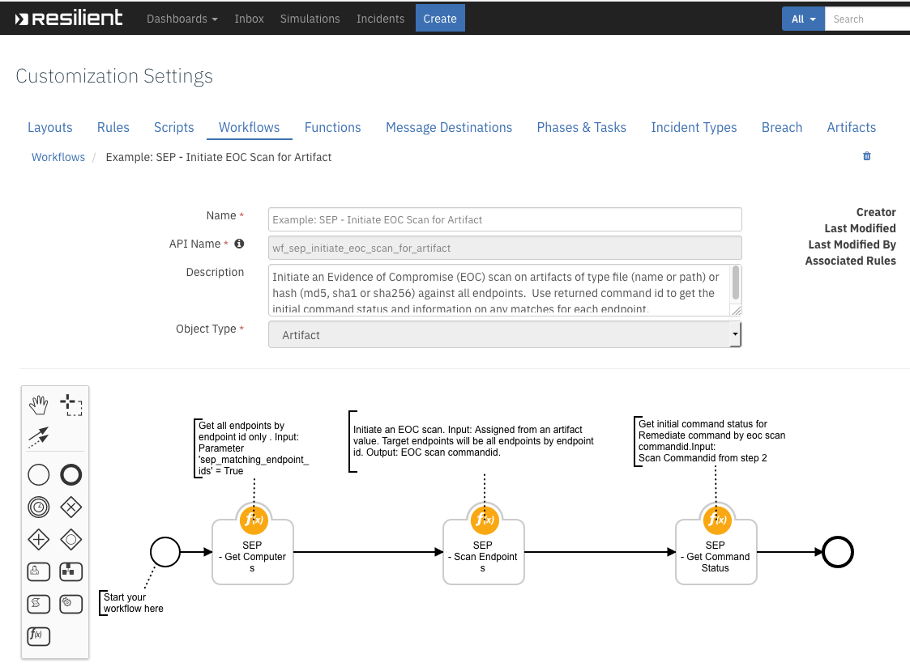
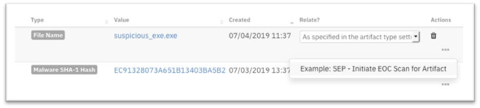

# Resilient Function - fn_sep

This Resilient Function package can be used to perform the following queries and actions against in a Symantec Endpoint Protection (SEP) environment from workflows using the Functions feature of the Resilient
Circuits integration framework.
```
•	Execute an Evidence of Compromise (EOC) scan for artifacts of type file (name or path) and hash (md5, sha1 or sha256).
•	Upload a file from an endpoint to the Symantec Endpoint Protect Manager (SEPM).
•	Download a file from the SEPM as base64.
•	Remediate (quarantine) files (by hash match) discovered in an EOC scan.
•	Get endpoint details or status.
•	Get groups.
•	Get fingerprint lists.
•	Add or delete an md5 hash value to a fingerprint list which can be used to blacklist files.
•	Assign a fingerprint list to a group for system lockdown.
•	Delete a fingerprint list.
•	Move a endpoint to a new group.
•	Quarantine an endpoint.
```

Prerequisites:
```
resilient version 32 or later
resilient_circuits version 32 or later
resilient Generic Email Parsing Script 1.0.1 or later.
Symantec Endpoint Protection 14.2 or later.
```
* For more info about Symantec Endpoint Protection V14, please visit https://support.symantec.com/us/en/article.howto124729.html#sep14
* For more info about Symantec Endpoint Protection Rest API, please visit https://apidocs.symantec.com/home/saep


## Environment

This package requires that it is installed on a RHEL or CentOS platform and that the resilient-circuits application is running.
Install this package with 'pip', or `python setup.py install`.
To set the config values in the app.config file with a new resilient instance run `resilient-circuits config -c`.
To set the config values in the app.config file with an existing resilient instance run `resilient-circuits config -u`.

Config values example:
```
[fn_sep]
sep_base_path=/sepm/api/v1
sep_auth_path=/sepm/api/v1/identity/authenticate
sep_host=192.168.190.190
sep_port=8446
sep_username=admin
sep_password=password
sep_domain=Default
#http_proxy=http://proxy:80
#https_proxy=http://proxy:80
# Limit result sent to Resilient, add full result as an attachment.
sep_results_limit=200
# Period of time (seconds) to wait for all endpoints to return a scan result.
sep_scan_timeout=1800
```

Run with: `resilient-circuits run`.

## Supported Resilient Functions for Symantec Endpoint Protection.
```
SEP - Scan Endpoints (fn_sep_scan_endpoints)
SEP - Upload File to SEPM (fn_sep_upload_file_to_sepm)
SEP - Get File Content as Base64 (fn_sep_get_file_content_as_base64)
SEP - Get Computers (fn_sep_get_computers)
SEP - Move Endpoint (fn_sep_move_endpoint)
SEP - Quarantine Endpoints (fn_sep_quarantine_endpoints)
SEP - Get Fingerprint List (fn_sep_get_fingerprint_list)
SEP - Add Fingerprint List (fn_sep_add_fingerprint_list)
SEP - Update Fingerprint List (fn_sep_update_fingerprint_list)
SEP - Get Groups (fn_sep_get_groups)
SEP - Assign Fingerprint List to Group (fn_sep_assign_fingerprint_list_to_group)
SEP - Delete Fingerprint List (fn_sep_delete_fingerprint_list)
SEP - Get Command Status (fn_sep_get_command_status)
SEP - Get Domains (fn_sep_get_domains)
```
## Sample workflows provided:
```
Example: SEP - Add Hash to Blacklist
Example: SEP - Assign Blacklist to lockdown group
Example: SEP - Delete Blacklist
Example: SEP - Delete Hash from Blacklist
Example: SEP - Get Blacklist information
Example: SEP - Get Endpoint Details
Example: SEP - Get Endpoint Details for artifact
Example: SEP - Get Endpoints status
Example: SEP - Get Endpoints status (refresh)
Example: SEP - Get File Content as Base64 string
Example: SEP - Get Groups information
Example: SEP - Get Non-Compliant Endpoints status details
Example: SEP - Get Quarantine status
Example: SEP - Get Remediation status
Example: SEP - Get Scan results
Example: SEP - Get Upload status
Example: SEP - Initiate EOC Scan for Artifact
Example: SEP - Move Endpoint
Example: SEP - Quarantine Endpoint
Example: SEP - Remediate Artifact on Endpoint
Example: SEP - Upload file to SEPM server
```
## Sample rules provided:
```
Example: SEP - Add Artifact from Scan Result
Example: SEP - Add Hash to Blacklist
Example: SEP - Assign Blacklist to lockdown group
Example: SEP - Delete Blacklist
Example: SEP - Delete Hash from Blacklist
Example: SEP - Get Blacklist information
Example: SEP - Get Endpoint Details
Example: SEP - Get Endpoint Details for artifact
Example: SEP - Get Endpoints status
Example: SEP - Get Endpoints status (refresh)
Example: SEP - Get File Content as Base64 string
Example: SEP - Get Groups information
Example: SEP - Get Non-Compliant Endpoints status details
Example: SEP - Get Quarantine status
Example: SEP - Get Remediation status
Example: SEP - Get Scan results
Example: SEP - Get Upload status
Example: SEP - Initiate EOC Scan for Artifact
Example: SEP - Move Endpoint
Example: SEP - Parse notification
Example: SEP - Quarantine Endpoint
Example: SEP - Remediate Artifact on Endpoint
Example: SEP - Un-Quarantine Endpoint
Example: SEP - Upload file to SEPM server
```
## SEP - Scan Endpoints (fn_sep_scan_endpoints) Example
## Sample workflow `Example: SEP - Initiate EOC Scan for Artifact` has been provided:
 
 

Initiates an Evidence of Compromise (EOC) scan of an artifact value against a list of endpoints or groups. The function can also be used to complete a remediation delete action on a sha256 hash value in conjunction with a scan.
 
 


<details><summary>Outputs:</summary>
<p>

```python
results = {'inputs': {u'sep_description': u'Scan to remediate file based on sha256', u'sep_computer_ids': u'D31AA16E0946C25D40C83823C500518B',
                      u'sep_scan_action': None, u'sep_file_path': u'C:\\temp\\eicar.zip', u'sep_group_ids': u'CAD80F000946C25D6C150831060AA326',
                      u'sep_sha256': None, u'sep_scan_type': {u'name': u'FULL_SCAN', u'id': 229}},
           'metrics': {'package': 'fn-sep', 'timestamp': '2019-04-12 10:49:22', 'package_version': '1.0.0', 'host': 'myhost', 'version': '1.0', 'execution_time_ms': 12349},
           'success': True, 'content': {u'commandID_computer': u'0F0CBDD7EDFF4634B23FA11F5AB81FFC', u'commandID_group': u'BB37F78894DB451B8E8921EC127667A3'},
           'raw': '{"commandID_computer": "0F0CBDD7EDFF4634B23FA11F5AB81FFC", "commandID_group": "BB37F78894DB451B8E8921EC127667A3"}',
           'reason': None,
           'version': '1.0'
}
```

</p>
</details>

<details><summary>Example Pre-Process Script:</summary>
<p>

```python
GET_COMPUTERS_CONTENT = workflow.properties.get_computers_results.content
ARTIFACT_TYPE = artifact.type
ARTIFACT_VALUE = artifact.value
ARTIFACT_DESCRIPTION = artifact.description
ARTIFACT_TYPE_TO_ROW = {
    "File Name": "file_name",
    "File Path": "file_path",
    "Malware MD5 Hash": "md5",
    "Malware SHA-1 Hash": "sha1",
    "Malware SHA-256 Hash": "sha256"
}
ARTIFACT_TYPES = [ v for v in sorted(ARTIFACT_TYPE_TO_ROW.values())]
COMPUTER_IDS = []
## Processing

def get_computers():
    global COMPUTER_IDS
    # Get computers to run scan against from previous step.
    if GET_COMPUTERS_CONTENT is not None and GET_COMPUTERS_CONTENT["endpoints_matching_ids"]:
        COMPUTER_IDS = GET_COMPUTERS_CONTENT["endpoints_matching_ids"]

def set_inputs(fn, fp, md5, sha1, sha256):
    global COMPUTER_IDS
    inputs.sep_file_path = fn if fp is None else fp
    inputs.sep_md5 = md5
    inputs.sep_sha1 = sha1
    inputs.sep_sha256 = sha256
    inputs.sep_computer_ids = ','.join(COMPUTER_IDS)
    inputs.sep_scan_type = rule.properties.sep_scan_type
    inputs.sep_scan_action = None
    if ARTIFACT_DESCRIPTION is not None:
        inputs.sep_description = u"Scan eoc for {0}".format(unicode(ARTIFACT_DESCRIPTION["content"]))
    else:
        inputs.sep_description = u"Scan eoc for for suspicious hash of type {0} and value {1} in the SEP environment.".format(ARTIFACT_TYPE, ARTIFACT_VALUE)

def main():
    get_computers()
    # Assign values to correct row based on artifact type
    types = [None if t not in ARTIFACT_TYPE_TO_ROW[ARTIFACT_TYPE] else ARTIFACT_VALUE for t in ARTIFACT_TYPES]
    set_inputs(*types)

if __name__ == "__main__":
    main()
```

</p>
</details>

<details><summary>Example Post-Process Script:</summary>
<p>

```python
##  Symantec Endpoint Protection  - fn_sep_upload_file_to_sepm script ##
# Example result:
"""
Result: {'inputs': {u'sep_description': u'Scan to remediate file based on sha256', u'sep_computer_ids': u'D31AA16E0946C25D40C83823C500518B',
                    u'sep_scan_action': None, u'sep_file_path': u'C:\\temp\\eicar.zip', u'sep_group_ids': u'CAD80F000946C25D6C150831060AA326',
                    u'sep_sha256': None, u'sep_scan_type': {u'name': u'FULL_SCAN', u'id': 229}},
         'metrics': {'package': 'fn-sep', 'timestamp': '2019-04-12 10:49:22', 'package_version': '1.0.0', 'host': 'myhost', 'version': '1.0', 'execution_time_ms': 12349},
         'success': True, 'content': {u'commandID_computer': u'0F0CBDD7EDFF4634B23FA11F5AB81FFC', u'commandID_group': u'BB37F78894DB451B8E8921EC127667A3'},
         'raw': '{"commandID_computer": "0F0CBDD7EDFF4634B23FA11F5AB81FFC", "commandID_group": "BB37F78894DB451B8E8921EC127667A3"}',
         'reason': None,
         'version': '1.0'
}

"""
#  Globals
# List of fields in datatable fn_sep_get_command_status script
DATA_TBL_FIELDS = ["scan_commandID"]
FN_NAME = "fn_sep_scan_endpoints"
WF_NAME = "Initiate EOC Scan for Artifact"
# Processing
CONTENT = results.content
INPUTS = results.inputs
QUERY_EXECUTION_DATE = results["metrics"]["timestamp"]
note_text = ''

def main():
    note_text = ''
    if CONTENT  is not None:
        note_text = u"Symantec SEP Integration: Workflow <b>{0}</b>: Returned command id <b>{1}</b> for a <b>{2}</b> " \
                    "scan on artifact <b>{3}</b> for Resilient function <b>{4}</b>"\
            .format(WF_NAME, CONTENT["commandID_computer"], INPUTS["sep_scan_type"], unicode(artifact.value), FN_NAME)
    else:
        note_text = u"Symantec SEP Integration: Workflow <b>{0}</b>: There was <b>no</b> command id returned for a " \
                    "<b>{1}</b> scan on artifact <b>{2}</b> for Resilient function <b>{3}</b>"\
            .format(WF_NAME, INPUTS["sep_scan_type"], INPUTS["sep_file_path"], unicode(artifact.value), FN_NAME)

    incident.addNote(helper.createRichText(note_text))
if __name__ == "__main__":
    main()
```
