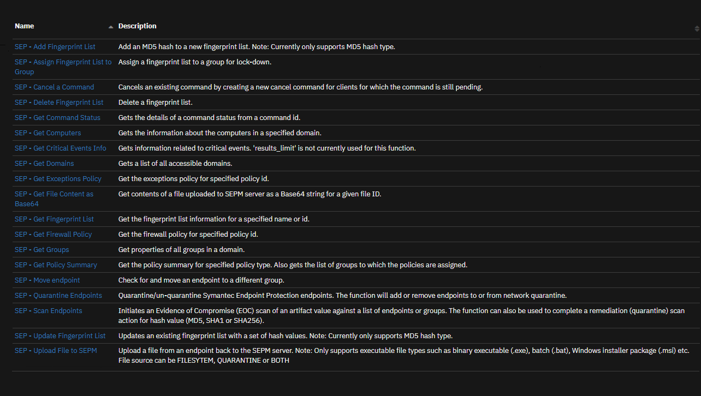
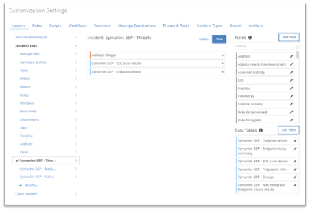
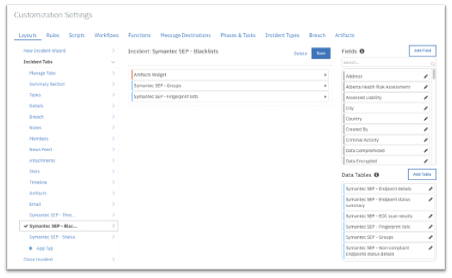

<!--
  This README.md is generated by running:
  "resilient-sdk docgen -p fn_sep"

  It is best edited using a Text Editor with a Markdown Previewer. VS Code
  is a good example. Checkout https://guides.github.com/features/mastering-markdown/
  for tips on writing with Markdown

  All fields followed by "::CHANGE_ME::"" should be manually edited

  If you make manual edits and run docgen again, a .bak file will be created

  Store any screenshots in the "doc/screenshots" directory and reference them like:
  

  NOTE: If your app is available in the container-format only, there is no need to mention the integration server in this readme.
-->

# Symantec Endpoint Protection Integration for IBM Resilient

## Table of Contents

- [Release Notes](#release-notes)
- [Overview](#overview)
  - [Key Features](#key-features)
- [Requirements](#requirements)
  - [SOAR platform](#soar-platform)
  - [Cloud Pak for Security](#cloud-pak-for-security)
  - [Proxy Server](#proxy-server)
  - [Python Environment](#python-environment)
  - [Endpoint Developed With](#endpoint-developed-with)
- [Installation](#installation)
  - [Install](#install)
  - [App Configuration](#app-configuration)
  - [Custom Layouts](#custom-layouts)
- [Function - SEP - Add Fingerprint List](#function---sep---add-fingerprint-list)
- [Function - SEP - Assign Fingerprint List to Group](#function---sep---assign-fingerprint-list-to-group)
- [Function - SEP - Delete Fingerprint List](#function---sep---delete-fingerprint-list)
- [Function - SEP - Get Command Status](#function---sep---get-command-status)
- [Function - SEP - Get Computers](#function---sep---get-computers)
- [Function - SEP - Get Domains](#function---sep---get-domains)
- [Function - SEP - Get File Content as Base64](#function---sep---get-file-content-as-base64)
- [Function - SEP - Get Fingerprint List](#function---sep---get-fingerprint-list)
- [Function - SEP - Get Groups](#function---sep---get-groups)
- [Function - SEP - Move endpoint](#function---sep---move-endpoint)
- [Function - SEP - Quarantine Endpoints](#function---sep---quarantine-endpoints)
- [Function - SEP - Scan Endpoints](#function---sep---scan-endpoints)
- [Function - SEP - Update Fingerprint List](#function---sep---update-fingerprint-list)
- [Function - SEP - Upload File to SEPM](#function---sep---upload-file-to-sepm)
- [Function - SEP: Cancel a Command](#function---sep-cancel-a-command)
- [Function - SEP: Get Critical Events Info](#function---sep-get-critical-events-info)
- [Function - SEP: Get Exceptions Policy](#function---sep-get-exceptions-policy)
- [Function - SEP: Get Firewall Policy](#function---sep-get-firewall-policy)
- [Function - SEP: Get Policy Summary](#function---sep-get-policy-summary)
- [Script - scr_sep_add_artifact_from_scan_results](#script---scr_sep_add_artifact_from_scan_results)
- [Script - scr_sep_parse_email_notification](#script---scr_sep_parse_email_notification)
- [Data Table - Symantec SEP - Endpoint details](#data-table---symantec-sep---endpoint-details)
- [Data Table - Symantec SEP - Endpoint status summary](#data-table---symantec-sep---endpoint-status-summary)
- [Data Table - Symantec SEP - EOC scan results](#data-table---symantec-sep---eoc-scan-results)
- [Data Table - Symantec SEP - Fingerprint lists](#data-table---symantec-sep---fingerprint-lists)
- [Data Table - Symantec SEP - Groups](#data-table---symantec-sep---groups)
- [Data Table - Symantec SEP - Non-compliant Endpoints status details](#data-table---symantec-sep---non-compliant-endpoints-status-details)
- [Rules](#rules)
- [Troubleshooting & Support](#troubleshooting--support)

---

## Release Notes

<!--
  Specify all changes in this release. Do not remove the release 
  notes of a previous release
-->

| Date | Version | Notes |
| ---: | :------: | :---- |
| 01/2023 | 1.1.0 | Five more functions added (Cancel a command, Get critical event information, Get all policy summary, Get firewall policy, Get exceptions policy) and relevant test functions implemented. Payload, ReadMe added and bug fix for patch import.|
| 12/2022 | 1.0.2 | Bug fix for osname and selftest |
| 11/2020 | 1.0.1 | Support added for App Host |
| 08/2019 | 1.0.0 | Initial Release |

## Overview

<!--
  Provide a high-level description of the function itself and its remote software or application.
  The text below is parsed from the "description" and "long_description" attributes in the setup.py file
-->
**Symantec Endpoint Protection Integration for Resilient**


  
Integration with Symantec Endpoint Protection to facilitate manual enrichment and targeted remediation actions. Teams can investigate an attack by hunting for IOCs or suspect Endpoints across an enterprise, and quickly respond to attacks by executing endpoint remediation actions, such as deleting or blacklisting suspicious files from within the Resilient platform.

### Key Features
•	Execute an Evidence of Compromise (EOC) scan for artifacts of type file (name or path) and hash (MD5, SHA1 or SHA256).
•	Upload a file from an endpoint to the Symantec Endpoint Protect Manager (SEPM).
•	Download a file from the SEPM as base64.
•	Remediate (quarantine) files (by hash match) discovered in an EOC scan.
•	Get endpoint details or status.
•	Get groups.
•	Get fingerprint lists.
•	Add or delete an MD5 hash value from a fingerprint list, which can be used to blacklist files.
•	Assign a fingerprint list to a group for system lockdown.
•	Delete a fingerprint list.
•	Move an endpoint to a new group.
•	Quarantine an endpoint.
•	Cancel a command
•	Get critical event information
• 	Get all policy summary
•	Get firewall policy
•	Get exceptions policy

---

## Requirements

<!--
  List any Requirements 
--> 

This app supports the IBM Security QRadar SOAR Platform and the IBM Security QRadar SOAR for IBM Cloud Pak for Security.

### SOAR platform
The SOAR platform supports two app deployment mechanisms, Edge Gateway (formerly App Host) and integration server.

If deploying to a SOAR platform with an Edge Gateway, the requirements are:
* SOAR platform >= `45.0.7899`.
* The app is in a container-based format (available from the AppExchange as a `zip` file).

If deploying to a SOAR platform with an integration server, the requirements are:
* SOAR platform >= `45.0.7899`.
* The app is in the older integration format (available from the AppExchange as a `zip` file which contains a `tar.gz` file).
* Integration server is running `resilient_circuits>=47.1.0`.
* If using an API key account, make sure the account provides the following minimum permissions: 
  | Name | Permissions |
  | ---- | ----------- |
  | Org Data | Read |
  | Function | Read |

The following SOAR platform guides provide additional information: 
* _Edge Gateway Deployment Guide_ or _App Host Deployment Guide_: provides installation, configuration, and troubleshooting information, including proxy server settings. 
* _Integration Server Guide_: provides installation, configuration, and troubleshooting information, including proxy server settings.
* _System Administrator Guide_: provides the procedure to install, configure and deploy apps. 

The above guides are available on the IBM Documentation website at [ibm.biz/soar-docs](https://ibm.biz/soar-docs). On this web page, select your SOAR platform version. On the follow-on page, you can find the _Edge Gateway Deployment Guide_, _App Host Deployment Guide_, or _Integration Server Guide_ by expanding **Apps** in the Table of Contents pane. The System Administrator Guide is available by expanding **System Administrator**.

### Cloud Pak for Security
If you are deploying to IBM Cloud Pak for Security, the requirements are:
* IBM Cloud Pak for Security >= `1.8`.
* Cloud Pak is configured with an Edge Gateway.
* The app is in a container-based format (available from the AppExchange as a `zip` file).

The following Cloud Pak guides provide additional information: 
* _Edge Gateway Deployment Guide_ or _App Host Deployment Guide_: provides installation, configuration, and troubleshooting information, including proxy server settings. From the Table of Contents, select Case Management and Orchestration & Automation > **Orchestration and Automation Apps**.
* _System Administrator Guide_: provides information to install, configure, and deploy apps. From the IBM Cloud Pak for Security IBM Documentation table of contents, select Case Management and Orchestration & Automation > **System administrator**.

These guides are available on the IBM Documentation website at [ibm.biz/cp4s-docs](https://ibm.biz/cp4s-docs). From this web page, select your IBM Cloud Pak for Security version. From the version-specific IBM Documentation page, select Case Management and Orchestration & Automation.

### Proxy Server
The app **does** support a https proxy server.

### Python Environment

Python >= 3.6 is supported.
Additional package dependencies may exist for each of these packages:
* resilient_circuits>=46.0.0
* resilient_lib>=46.0.0
* defusedxml==0.7.1

### Endpoint Developed With

This app has been implemented using:
| Product Name | Product Version | API URL | API Version |
| ------------ | --------------- | ------- | ----------- |
| Symantec Endpoint Protection | 14 | https://apidocs.securitycloud.symantec.com | v1 |

---

## Installation

### Install
* To install or uninstall an App or Integration on the _SOAR platform_, see the documentation at [ibm.biz/soar-docs](https://ibm.biz/soar-docs).
* To install or uninstall an App on _IBM Cloud Pak for Security_, see the documentation at [ibm.biz/cp4s-docs](https://ibm.biz/cp4s-docs) and follow the instructions above to navigate to Orchestration and Automation.

### App Configuration

The following table provides the settings you need to configure the app. These settings are made in the app.config file. See the documentation discussed in the Requirements section for the procedure.

| Config | Required | Example | Description |
| ------ | :------: | ------- | ----------- |
| **sep_host** | Yes | `<SEPM server dns name or ip address>` | *DNS name of ip address of the SEP server.* |
| **sep_port** | Yes | `8446` | *The port on which the app is accessible * |
| **sep_auth_path** | Yes | `/sepm/api/v1/identity/authenticate` | *Authentiaction Path for SEP api.* |
| **sep_base_path** | Yes | `/sepm/api/v1` | *Base path for SEP api.* |
| **sep_username** | Yes | `<username>` | *User name for SEP api access.* |
| **sep_password** | Yes | `<password>` | *User password for SEP api access.*  |
| **sep_domain** | Yes | `<SEP domain name>` | *User password for McAfee ESM api access.*  |
| **sep_results_limit** | Yes | `200` | *Limit result sent to Resilient, add full result as an attachment.*  |
| **sep_scan_timeout** | Yes | `1800` | *Period of time (seconds) to wait for all endpoints to return a scan result.*  |
| **https_proxy** | No | `<HTTPS_PROXY>` | *Optional settings for accessing Symantec Endpoint Protection via a https proxy* |
| **client_auth_cert** | No | `<CLIENT_AUTH_CERT>` | *Specify path to <cert.pem> file if client certs are needed to authenticate* |
| **client_auth_key** | No | `<CLIENT_AUTH_KEY>` | *Specify path to <cert_private_key.pem> file if client certs are needed to authenticate* |


### Custom Layouts
<!--
  Use this section to provide guidance on where the user should add any custom fields and data tables.
  You may wish to recommend a new incident tab.
  You should save a screenshot "custom_layouts.png" in the doc/screenshots directory and reference it here
-->
* To use the functions, create new Incident tabs e.g. Symantec SEP - Threats, Symantec SEP - Blacklists and Symantec SEP - Status. Drag the SEP data tables on to the layouts and click Save as shown in the screenshots below:
  
  
  

---

## Function - SEP - Add Fingerprint List
Add an MD5 hash to a new fingerprint list. 
Note: Currently only supports MD5 hash type.

<details><summary>Inputs:</summary>
<p>

| Name | Type | Required | Example | Tooltip |
| ---- | :--: | :------: | ------- | ------- |
| `sep_description` | `text` | No | `-` | The SEP object (e.g. scan) description. |
| `sep_domainid` | `text` | No | `-` | The SEPM domain id. |
| `sep_fingerprintlist_name` | `text` | No | `-` | Name of a SEP fingerprint list. |
| `sep_hash_value` | `text` | No | `-` | The hash value. Can be MD5 or SHA256 hash value. |

</p>
</details>

<details><summary>Outputs:</summary>
<p>

> **NOTE:** This example might be in JSON format, but `results` is a Python Dictionary on the SOAR platform.

```python
results = {
  "content": {
    "id": "id"
  },
  "inputs": {
    "sep_description": "This is test of adding files in blacklist.",
    "sep_domainid": "domainid",
    "sep_fingerprintlist_name": "Test Blacklist 13",
    "sep_hash_value": "hash_value"
  },
  "metrics": {
    "execution_time_ms": 2322,
    "host": "host",
    "package": "fn-sep",
    "package_version": "1.0.1",
    "timestamp": "2023-01-06 06:33:51",
    "version": "1.0"
  },
  "raw": "{\"id\": \"id\"}",
  "reason": null,
  "success": true,
  "version": "1.0"
}
```

</p>
</details>

<details><summary>Example Pre-Process Script:</summary>
<p>

```python
domain_content_results =  workflow.properties.get_domains_results
content = domain_content_results.content
for i in range(len(content)):
  if content[i]["name"] ==  rule.properties.sep_domain_name:
    inputs.sep_domainid = content[i]["id"]
    break
inputs.sep_hash_value = artifact.value
inputs.sep_fingerprintlist_name = rule.properties.sep_fingerprintlist_name
inputs.sep_description = u"Fingerprint list '{}'".format(unicode(inputs.sep_fingerprintlist_name))
```

</p>
</details>

<details><summary>Example Post-Process Script:</summary>
<p>

```python
##  Symantec Endpoint Protection  - fn_sep_add_fingerprint_list script ##
# Example result:
"""
Result: {'inputs': {u'sep_description': u'Hash of type Malware MD5 Hash', 
                   u'sep_fingerprintlist_name': u'Blacklist', 
                   u'sep_hash_value': u'482F9B6E0CC4C1DBBD772AAAF088CB3A', 
                   u'sep_domainid': u'A9B4B7160946C25D24B6AA458EF5557F'
                   }, 
        'metrics': {'package': 'fn-sep', 'timestamp': '2019-05-14 12:02:37', 'package_version': '1.0.0', 
                    'host': 'myhost.ibm.com', 'version': '1.0', 'execution_time_ms': 1417
                    }, 
        'success': True, 
        'content': {u'id': u'AB29BEA5333C488694B9533E65858BF2'}, 
        'raw': '{"id": "AB29BEA5333C488694B9533E65858BF2"}',
        'reason': None, 
        'version': '1.0'
}
"""
FN_NAME = "Add Hash to Fingerprint List"
WF_NAME = "fn_sep_add_fingerprint_list"
CONTENT = results.content
INPUTS = results.inputs

def main():
    if CONTENT is not None:
        # If we got here we assume we are successsful.
        note_text = u"Symantec SEP Integration: Workflow <b>{0}</b>: Successfully added MD5 hash <b>{1}</b> to new fingerprint list <b>{2}</b> for Resilient function " \
                   "<b>{3}</b>".format(WF_NAME, artifact.value, unicode(INPUTS["sep_fingerprintlist_name"]), FN_NAME)
    
    else:
        note_text += "Symantec SEP Integration: Workflow <b>{0}</b>: There was <b>no</b> results returned for Resilient " \
                     "function <b>{1}</b>".format(WF_NAME, FN_NAME)
    
    incident.addNote(helper.createRichText(note_text))

if __name__ == "__main__":
    main()
```

</p>
</details>

<details><summary>Steps to Fetch "sep_domainid": </summary>    
<p>

Value of `sep_domainid` field can be refered from [Function - SEP - Get Domains](#function---sep---get-domains) function's output. <br>
Ex. `id` attribute from following path `content-->id`.

</p>
</details>

---
## Function - SEP - Assign Fingerprint List to Group
Assign a fingerprint list to a group for lock-down.

<details><summary>Inputs:</summary>
<p>

| Name | Type | Required | Example | Tooltip |
| ---- | :--: | :------: | ------- | ------- |
| `sep_fingerprintlist_id` | `text` | No | `-` | Id of SEP fingerprint list |
| `sep_groupid` | `text` | No | `-` | Group id on which to run the SEP command. |

</p>
</details>

<details><summary>Outputs:</summary>
<p>

> **NOTE:** This example might be in JSON format, but `results` is a Python Dictionary on the SOAR platform.

```python
results = {
  "content": {},
  "inputs": {
    "sep_fingerprintlist_id": "fingerprintlist_id",
    "sep_groupid": "groupid"
  },
  "metrics": {
    "execution_time_ms": 2038,
    "host": "host",
    "package": "fn-sep",
    "package_version": "1.0.1",
    "timestamp": "2023-01-06 11:32:28",
    "version": "1.0"
  },
  "raw": "{}",
  "reason": null,
  "success": true,
  "version": "1.0"
}
```

</p>
</details>

<details><summary>Example Pre-Process Script:</summary>
<p>

```python
content = workflow.properties.get_fingerprintlist_results.content
inputs.sep_fingerprintlist_id = content["id"]
inputs.sep_groupid = row.group_id
```

</p>
</details>

<details><summary>Example Post-Process Script:</summary>
<p>

```python
##  Symantec Endpoint Protection  - fn_sep_assign_fingerprint_list_to_group ##
# Example result:
"""
Result:{'inputs': {u'sep_fingerprintlist_id': u'E60B061FDD844EBF9778D4BD2AC3942A', u'sep_groupid': u'7E4BB119A9FE9DC526EDABFB1EE261B8'},
        'metrics': {'package': 'fn-sep', 'timestamp': '2019-05-28 17:53:52', 'package_version': '1.0.0', 'host': 'myhost',
                   'version': '1.0', 'execution_time_ms': 1225},
        'success': True,
        'content': '',
        'raw': '""',
        'reason': None,
        'version': '1.0'
 }
"""
#  Globals
FN_NAME = "fn_sep_assign_fingerprint_list_to_group"
WF_NAME = "Assign Fingerprint List to lockdown group"
DATA_TBL_FIELDS = ["domain_name", "list_name", "list_id", "list_description", "hash_values", "hash_type", "group_ids"]
CONTENT = results.content
INPUTS = results.inputs
QUERY_EXECUTION_DATE = results["metrics"]["timestamp"]

# Processing

def main():
    note_text = ''

    if CONTENT is not None:
        if "errorCode" in CONTENT and int(CONTENT["errorCode"]) == 400:
            # The finger print list doesn't exist.
            note_text = "Symantec SEP Integration: Workflow <b>{0}</b>: The fingerprint list <b>{1}</b> does not exist or is invalid " \
                        "for domain id <b>{2}</b> for Resilient function <b>{3}</b>"\
                .format( WF_NAME, INPUTS["sep_fingerprintlist_name"], row.domain_id, FN_NAME)
        else:
            note_text = "Symantec SEP Integration: Workflow <b>{0}</b>: Successfully assigned fingerprint list  with id " \
                        "<b>{1}</b> to group with id <b>{2}</b> for Resilient function <b>{3}</b>"\
                .format(WF_NAME, INPUTS["sep_fingerprintlist_id"], INPUTS["sep_groupid"], FN_NAME)

    else:
        note_text += "Symantec SEP Integration: Workflow <b>{0}</b>: There were <b>no</b> results returned " \
                     "with fingerprint id <b>{1}</b> and group id <b>{2}</b> for Resilient function <b>{3}</b>"\
            .format(WF_NAME, INPUTS["sep_fingerprintlist_id"], INPUTS["sep_groupid"], FN_NAME)

    incident.addNote(helper.createRichText(note_text))

if __name__ == "__main__":
    main()
```

</p>
</details>

<details><summary>Steps to Fetch "sep_groupid": </summary>    
<p>

Value of `sep_groupid` field can be refered from [Function - SEP - Get Groups](#function---sep---get-groups) function's output. <br>
Ex. `id` attribute from following path `content-->content-->id`.

</p>
</details>

<details><summary>Steps to Fetch "sep_fingerprintlist_id": </summary>    
<p>

Value of `sep_fingerprintlist_id` field can be refered from [Function - SEP - Add Fingerprint List](#function---sep---add-fingerprint-list) function's output. <br>
Ex. `id` attribute from following path `content-->id`.

</p>
</details>

---
## Function - SEP - Delete Fingerprint List
Delete  a  fingerprint list.

<details><summary>Inputs:</summary>
<p>

| Name | Type | Required | Example | Tooltip |
| ---- | :--: | :------: | ------- | ------- |
| `sep_fingerprintlist_id` | `text` | No | `-` | Id of SEP fingerprint list |

</p>
</details>

<details><summary>Outputs:</summary>
<p>

> **NOTE:** This example might be in JSON format, but `results` is a Python Dictionary on the SOAR platform.

```python
results = {
  "content": {},
  "inputs": {
    "sep_fingerprintlist_id": "fingerprintlist_id"
  },
  "metrics": {
    "execution_time_ms": 2041,
    "host": "host",
    "package": "fn-sep",
    "package_version": "1.0.1",
    "timestamp": "2023-01-06 11:12:40",
    "version": "1.0"
  },
  "raw": "{}",
  "reason": null,
  "success": true,
  "version": "1.0"
}
```

</p>
</details>

<details><summary>Example Pre-Process Script:</summary>
<p>

```python
inputs.sep_fingerprintlist_id = row.list_id
```

</p>
</details>

<details><summary>Example Post-Process Script:</summary>
<p>

```python
##  Symantec Endpoint Protection  - fn_sep_delete_fingerprint_list ##
# Example result:
"""
Result:{'inputs': {u'sep_fingerprintlist_id': u'E60B061FDD844EBF9778D4BD2AC3942A'},
         'metrics': {'package': 'fn-sep', 'timestamp': '2019-05-29 10:36:53', 'package_version': '1.0.0', 'host': 'myhost',
                     'version': '1.0', 'execution_time_ms': 1744},
         'success': True,
         'content': '',
         'raw': '""',
         'reason': None,
         'version': '1.0'
 }
"""
#  Globals
FN_NAME = "fn_sep_delete_fingerprint_list"
WF_NAME = "Delete Fingerprint List"
CONTENT = results.content
INPUTS = results.inputs
QUERY_EXECUTION_DATE = results["metrics"]["timestamp"]

# Processing

def main():
    note_text = ''

    if CONTENT is not None:
        if "errorCode" in CONTENT and int(CONTENT["errorCode"]) == 410:
            # The finger print list doesn't exist.
            note_text = "Symantec SEP Integration: Workflow <b>{0}</b>: The fingerprint list <b>{1}</b> does not exist or is invalid " \
                        "for Resilient function <b>{2}</b>"\
                .format( WF_NAME, INPUTS["sep_fingerprintlist_name"], FN_NAME)
        else:
            note_text = "Symantec SEP Integration: Workflow <b>{0}</b>: Successfully deleted fingerprint list  with id " \
                        "<b>{1}</b> for Resilient function <b>{2}</b>"\
                .format(WF_NAME, INPUTS["sep_fingerprintlist_id"], FN_NAME)

    else:
        note_text += "Symantec SEP Integration: Workflow <b>{0}</b>: There were <b>no</b> results returned " \
                     "with fingerprint id <b>{1}</b> for Resilient function <b>{2}</b>"\
            .format(WF_NAME, INPUTS["sep_fingerprintlist_id"],  FN_NAME)

    incident.addNote(helper.createRichText(note_text))

if __name__ == "__main__":
    main()
```

</p>
</details>

<details><summary>Steps to Fetch "sep_fingerprintlist_id": </summary>    
<p>

Value of `sep_fingerprintlist_id` field can be refered from [Function - SEP - Add Fingerprint List](#function---sep---add-fingerprint-list) function's output. <br>
Ex. `id` attribute from following path `content-->id`.

</p>
</details>

---
## Function - SEP - Get Command Status
Gets the details of a command status from a command id.

<details><summary>Inputs:</summary>
<p>

| Name | Type | Required | Example | Tooltip |
| ---- | :--: | :------: | ------- | ------- |
| `sep_commandid` | `text` | No | `-` | Command id of SEP job. |
| `sep_incident_id` | `number` | No | `-` | The resilient incident id. |
| `sep_matching_endpoint_ids` | `boolean` | No | `-` | Get list of matching endpoints. |
| `sep_order` | `text` | No | `-` | Specifies whether the results are in ascending order (ASC) or descending order (DESC). |
| `sep_pageindex` | `number` | No | `-` | The index page that is used for the returned results. The default page index is 1. |
| `sep_pagesize` | `number` | No | `-` | The number of results to include on each page. The default is 20. |
| `sep_scan_date` | `text` | No | `-` | Time when scan was initiated |
| `sep_sort` | `text` | No | `-` | The column by which the results are sorted. Possible values are COMPUTER_NAME (Default value), COMPUTER_ID, COMPUTER_DOMAIN_NAME, or DOMAIN_ID. |
| `sep_status_type` | `text` | No | `-` | The type of command status requested. |

</p>
</details>

<details><summary>Outputs:</summary>
<p>

> **NOTE:** This example might be in JSON format, but `results` is a Python Dictionary on the SOAR platform.

```python
results = {
  "content": {
    "content": [
      {
        "beginTime": "2023-01-06T09:51:09Z",
        "binaryFileId": "binaryFileId",
        "computerId": "computerId",
        "computerIp": "000.00.00.00",
        "computerName": "computerName",
        "currentLoginUserName": "Testuser",
        "domainName": "Default",
        "hardwareKey": "hardwareKey",
        "lastUpdateTime": "2023-01-06T09:51:09Z",
        "resultInXML": "",
        "stateId": 3,
        "subStateDesc": "C:\\Users\\Public\\Documents\\sample.exe",
        "subStateId": 0
      }
    ],
    "firstPage": true,
    "lastPage": true,
    "number": 0,
    "numberOfElements": 1,
    "overall_command_state": "Completed",
    "remediate_artifact_value": "",
    "scan_artifact_value": "",
    "size": 20,
    "sort": [
      {
        "ascending": true,
        "direction": "ASC",
        "property": "Begintime"
      }
    ],
    "totalElements": 1,
    "totalPages": 1,
    "total_ep_count": 1,
    "total_fail_remediation_count": 0,
    "total_match_count": 0,
    "total_match_ep_count": 0,
    "total_not_completed": 0,
    "total_remediation_count": 0,
    "total_remediation_ep_count": 0
  },
  "inputs": {
    "sep_commandid": "commandid",
    "sep_status_type": "quarantine"
  },
  "metrics": {
    "execution_time_ms": 2060,
    "host": "host",
    "package": "fn-sep",
    "package_version": "1.0.1",
    "timestamp": "2023-01-06 13:56:03",
    "version": "1.0"
  },
  "raw": "{\"content\": [{\"beginTime\": \"2023-01-06T09:51:09Z\", \"lastUpdateTime\": \"2023-01-06T09:51:09Z\", \"computerName\": \"EC2AMAZ-O9BT872\", \"computerIp\": \"172.31.37.22\", \"domainName\": \"Default\", \"currentLoginUserName\": \"Administrator\", \"stateId\": 3, \"subStateId\": 0, \"subStateDesc\": \"C:\\\\Users\\\\Public\\\\Documents\\\\sample.exe\", \"binaryFileId\": \"F1568E3BAC1F211B397E2DAC71FD6BF7\", \"resultInXML\": \"\", \"computerId\": \"CD08C63EAC1F211B1B6FD4039B293000\", \"hardwareKey\": \"E4A30FDB287F7B23F9BF22166FD54BF1\"}], \"totalPages\": 1, \"firstPage\": true, \"lastPage\": true, \"totalElements\": 1, \"size\": 20, \"number\": 0, \"sort\": [{\"direction\": \"ASC\", \"property\": \"Begintime\", \"ascending\": true}], \"numberOfElements\": 1, \"total_match_count\": 0, \"total_match_ep_count\": 0, \"total_remediation_count\": 0, \"total_fail_remediation_count\": 0, \"total_remediation_ep_count\": 0, \"total_not_completed\": 0, \"total_ep_count\": 1, \"scan_artifact_value\": \"\", \"remediate_artifact_value\": \"\", \"overall_command_state\": \"Completed\"}",
  "reason": null,
  "success": true,
  "version": "1.0"
}
```

</p>
</details>

<details><summary>Example Pre-Process Script:</summary>
<p>

```python
inputs.sep_commandid = row.quarantine_commandid
inputs.sep_status_type = "quarantine"
```

</p>
</details>

<details><summary>Example Post-Process Script:</summary>
<p>

```python
##  Symantec Endpoint Protection  - fn_sep_get_command_status script ##
# Example result:
"""
Result: { 'inputs': {u'sep_status_type': u'quarantine', u'sep_commandid': u'7D3670DDF5A64A99B3721BF8A375B302'},
          'metrics': {'package': 'fn-sep', 'timestamp': '2019-04-26 15:25:55', 'package_version': '1.0.0',
                      'host': 'myhost', 'version': '1.0', 'execution_time_ms': 1256},
          'success': True,
          'content': {u'sort': [{u'direction': u'ASC', u'property': u'Begintime', u'ascending': True}], 'command_state': 'Completed', u'number': 0, u'firstPage': True, ': 0, u'content': [{u'computerName': u'WIN-N5KGH4CP3N3', u'subStateId u'binaryFileId': None, u'lastUpdateTime':
                        u'2019-04-26T11:05:27Z', u'domainName': u'Default', u'hardwareKey': u'DC7D24D6465566D2941F35BC8D17801E',
                        u'subStateDesc': u'', u'stateId': 3, u'computerId': u'89AD1BBB0946C25D25E6C0984E971D8A', u'computerIp': u'9.70.194.94', u'beginTime': u'2019-04-26T11:05:27Z', u'currentLoginUserName': u'Administrator', u'resultInXML': u'', 'command_status_id': 3}], u'lastPage': True, u'totalPages': 1, u'numberOfElements': 1, u'totalElements': 1, u'size': 20},
          'raw': '{"sort": [{"direction": "ASC", "property": "Begintime", "ascending": true}], "command_state": "Completed", "number": 0, "firstPage": true, "content": [{"computerName": "WIN-N5KGH4CP3N3", "subStateId": 0, "binaryFileId": null, "lastUpdateTime": "2019-04-26T11:05:27Z", "domainName": "Default", "hardwareKey": "DC7D24D6465566D2941F35BC8D17801E", "subStateDesc": "", "stateId": 3, "computerId": "89AD1BBB0946C25D25E6C0984E971D8A", "computerIp": "9.70.194.94", "beginTime": "2019-04-26T11:05:27Z", "currentLoginUserName": "Administrator", "resultInXML": "", "command_status_id": 3}], "lastPage": true, "totalPages": 1, "numberOfElements": 1, "totalElements": 1, "size": 20}', 'reason': None, 'version': '1.0'
}
"""
#  Globals
# List of fields in datatable fn_sep_get_command_status script
DATA_TBL_FIELDS = ["quarantine_status", "quarantine_command_state", "endpoint_quarantine_status"]
FN_NAME = "fn_sep_get_command_status"
WF_NAME = "Quarantine Endpoint"
STATUS_TYPE = "quarantine"
FINAL_STATUSES = {
    0: "Not received",
    1: "Received",
    2: "In progress",
    3: "Completed",
    4: "Rejected",
    5: "Canceled",
    6: "Failed"
}

C_OUTER = results.content
QUERY_EXECUTION_DATE = results["metrics"]["timestamp"]
# Processing

def main():

    endpoint_quarantine_status = row.endpoint_quarantine_status["content"]
    status_msg = "Un-quarantine" if endpoint_quarantine_status == "Quarantined" else "Quarantine"
    note_text = ''
    quarantine_command_state = C_OUTER["overall_command_state"]

    if C_OUTER is not None and len(C_OUTER["content"]) > 0:
        row.quarantine_command_state = quarantine_command_state
        row.query_execution_date = QUERY_EXECUTION_DATE
        computer = C_OUTER["content"][0]
        note_text = "Symantec SEP Integration: Workflow <b>{0}</b>: <b>{1}</b> command status for command id <b>{2}</b> " \
                    "for computer <b>{3}</b> was <b>{4}</b> for Resilient function <b>{5}</b>"\
            .format(WF_NAME, status_msg, row.quarantine_commandid, row.computerName, FINAL_STATUSES[computer["stateId"]], FN_NAME)
        if quarantine_command_state == "Completed":
            row.quarantine_command_state = FINAL_STATUSES[computer["stateId"]]
        else:
            row.quarantine_command_state = quarantine_command_state

    else:
        note_text += "Symantec SEP Integration: Workflow <b>{0}</b>: There were <b>no</b> results returned for Resilient function <b>{1}</b>" \
            .format(WF_NAME, FN_NAME)

    incident.addNote(helper.createRichText(note_text))

if __name__ == "__main__":
    main()
```

</p>
</details>

<details><summary>Steps to Fetch "sep_commandid": </summary>    
<p>

Value of `sep_commandid` field can be refered from the output of some of the functions like [Function - SEP - Scan Endpoints](#function---sep---scan-endpoints),  [Function - SEP - Upload File to SEPM](#function---sep---upload-file-to-sepm) etc. <br>
Ex. `commandID/commandID_group/commandID_computer` attribute from following path `content-->commandID/commandID_group/commandID_computer`.

</p>
</details>

---
## Function - SEP - Get Computers
Gets the information about the computers in a specified domain.

<details><summary>Inputs:</summary>
<p>

| Name | Type | Required | Example | Tooltip |
| ---- | :--: | :------: | ------- | ------- |
| `sep_computername` | `text` | No | `-` | The host name of computer. Wild card is supported as '*'. |
| `sep_domain` | `text` | No | `-` | The SEPM domain. |
| `sep_lastupdate` | `text` | No | `-` | Indicates when a computer last updated its status. The default value of 0 gets all the results. |
| `sep_matching_endpoint_ids` | `boolean` | No | `-` | Get list of matching endpoints. |
| `sep_order` | `text` | No | `-` | Specifies whether the results are in ascending order (ASC) or descending order (DESC). |
| `sep_os` | `text` | No | `-` | The list of OS to filter. Possible values are CentOs, Debian, Fedora, MacOSX, Oracle, OSX, RedHat, SUSE, Ubuntu, Win10, Win2K, Win7, Win8, WinEmb7, WinEmb8, WinEmb81, WinFundamental, WinNT, Win2K3, Win2K8, Win2K8R2, WinVista, WinXP, WinXPEmb, WinXPProf64 |
| `sep_pageindex` | `number` | No | `-` | The index page that is used for the returned results. The default page index is 1. |
| `sep_pagesize` | `number` | No | `-` | The number of results to include on each page. The default is 20. |
| `sep_sort` | `text` | No | `-` | The column by which the results are sorted. Possible values are COMPUTER_NAME (Default value), COMPUTER_ID, COMPUTER_DOMAIN_NAME, or DOMAIN_ID. |
| `sep_status` | `boolean` | No | `-` | Get overall status for endpoints. |
| `sep_status_details` | `boolean` | No | `-` | Get endpoints status details. |

</p>
</details>

<details><summary>Outputs:</summary>
<p>

> **NOTE:** This example might be in JSON format, but `results` is a Python Dictionary on the SOAR platform.

```python
results = {
  "content": {
    "content": [
      {
        "agentId": "agentId",
        "agentTimeStamp": 1673003005980,
        "agentType": "105",
        "agentUsn": 252331,
        "agentVersion": "14.3.9205.6000",
        "apOnOff": 1,
        "atpDeviceId": null,
        "atpServer": "",
        "attributeExtension": "",
        "avDefsetRevision": "23",
        "avDefsetSequence": "225331",
        "avDefsetVersion": "230105023",
        "avEngineOnOff": 1,
        "bashStatus": 1,
        "biosVersion": "Xen - 0 Revision: 1.221",
        "bwf": 2,
        "cidsBrowserFfOnOff": 1,
        "cidsBrowserIeOnOff": 1,
        "cidsDefsetVersion": "230105073",
        "cidsDrvMulfCode": 0,
        "cidsDrvOnOff": 1,
        "cidsEngineVersion": "17.2.10.7",
        "cidsSilentMode": 0,
        "computerDescription": "",
        "computerName": "computerName",
        "computerTimeStamp": 1673001224119,
        "computerUsn": 252244,
        "contentUpdate": 1,
        "creationTime": 1670855079127,
        "currentClientId": "currentClientId",
        "daOnOff": 1,
        "deleted": 0,
        "department": "",
        "deploymentMessage": "",
        "deploymentPreVersion": "",
        "deploymentRunningVersion": "14.3.9205.6000",
        "deploymentStatus": "302456832",
        "deploymentTargetVersion": "14.3.9205.6000",
        "description": "",
        "dhcpServer": "000.00.00.1",
        "diskDrive": "C:\\",
        "dnsServers": [
          "0.0.0.0",
          "0.0.0.0"
        ],
        "domainOrWorkgroup": "WORKGROUP",
        "edrStatus": 0,
        "elamOnOff": 1,
        "email": "",
        "employeeNumber": "",
        "employeeStatus": "",
        "encryptedDevicePassword": null,
        "fbwf": 2,
        "firewallOnOff": 1,
        "freeDisk": 33266442240,
        "freeMem": 2616713216,
        "fullName": "",
        "gateways": [
          "000.00.00.1",
          "000.00.00.1",
          "0.0.0.0",
          "0.0.0.0"
        ],
        "group": {
          "domain": {
            "id": "id",
            "name": "Default"
          },
          "externalReferenceId": null,
          "fullPathName": null,
          "id": "id",
          "name": "My Company",
          "source": null
        },
        "groupUpdateProvider": false,
        "hardwareKey": "hardwareKey",
        "homePhone": "",
        "hypervisorVendorId": "3",
        "idsChecksum": null,
        "idsSerialNo": "",
        "idsVersion": "",
        "infected": 0,
        "installType": "0",
        "ipAddresses": [
          "000.00.00.00",
          "0000:0000:0000:0000:0000:0000:C3BE:E313"
        ],
        "isGrace": 0,
        "isNpvdiClient": 0,
        "jobTitle": "",
        "kernel": null,
        "lastConnectedIpAddr": "000.00.00.00",
        "lastDeploymentTime": 1670855163000,
        "lastDownloadTime": 1670855103022,
        "lastHeuristicThreatTime": 0,
        "lastScanTime": 1672980342000,
        "lastServerId": "lastServerId",
        "lastServerName": "lastServerName",
        "lastSiteId": "lastSiteId",
        "lastSiteName": "My Site",
        "lastUpdateTime": 1673003005980,
        "lastVirusTime": 0,
        "licenseExpiry": 0,
        "licenseId": null,
        "licenseStatus": -1,
        "logicalCpus": 0,
        "loginDomain": "LocalComputer",
        "logonUserName": "Administrator",
        "macAddresses": [
          "02-00-00-00-00-80",
          "02-00-00-00-00-80"
        ],
        "majorVersion": 14,
        "memory": 4294557696,
        "minorVersion": 3,
        "mobilePhone": "",
        "officePhone": "",
        "onlineStatus": 1,
        "operatingSystem": "Windows Server 2019 Datacenter Edition",
        "osBitness": "x64",
        "osElamStatus": 0,
        "osFlavorNumber": 8,
        "osFunction": "Server",
        "osLanguage": "en-US",
        "osMajor": 10,
        "osMinor": 0,
        "osName": "Windows Server 2019",
        "osServicePack": "17763",
        "osVersion": "10.0",
        "patternIdx": "patternIdx",
        "pepOnOff": 1,
        "physicalCpus": 2,
        "processorClock": 2300,
        "processorType": "Intel64 Family 6 Model 79 Stepping 1",
        "profileChecksum": null,
        "profileSerialNo": "AAAA-12/28/2022 14:30:24 853",
        "profileVersion": "14.3.9205",
        "pskVersion": 0,
        "ptpOnOff": 1,
        "publicKey": "publicKey",
        "quarantineCode": 105,
        "quarantineDesc": "Host Integrity check is disabled.\n Host Integrity policy has been disabled by the administrator.",
        "quarantineStatus": 3,
        "readableLastScanTime": "2023-01-06 04:45:42",
        "readableLastUpdateTime": "2023-01-06 11:03:25",
        "readableLastVirusTime": "1970-01-01 00:00:00",
        "rebootReason": "",
        "rebootRequired": 0,
        "securityVirtualAppliance": null,
        "serialNumber": "serialNumber1",
        "snacLicenseId": null,
        "subnetMasks": [
          "000.000.000.0",
          "64"
        ],
        "svaId": null,
        "tamperOnOff": 1,
        "tdadGlobalDataDownloadTime": 0,
        "tdadGlobalDataProcessingDoneTime": 0,
        "tdadOnOff": 3,
        "tdadStatusId": 127,
        "telemetryHwid": "telemetryHwid",
        "telemetryMid": "telemetryMid",
        "timeZone": 0,
        "timediffLastScanTime": 22878.328934907913,
        "timediffLastUpdateTime": 214.34893488883972,
        "timediffLastVirusTime": 1673003220.328935,
        "tmpDevice": null,
        "totalDiskSpace": 51197,
        "tpmDevice": "0",
        "uniqueId": "uniqueId",
        "uuid": "uuid",
        "uwf": 2,
        "virtualizationPlatform": "Citrix",
        "vsicStatus": 3,
        "winServers": [
          "0.0.0.0",
          "0.0.0.0"
        ],
        "worstInfectionIdx": "9999",
        "writeFiltersStatus": null,
        "wssStatus": 3
      }
    ],
    "firstPage": true,
    "lastPage": true,
    "number": 0,
    "numberOfElements": 1,
    "size": 20,
    "sort": [
      {
        "ascending": true,
        "direction": "ASC",
        "property": "COMPUTER_NAME"
      }
    ],
    "totalElements": 1,
    "totalPages": 1
  },
  "inputs": {},
  "metrics": {
    "execution_time_ms": 2156,
    "host": "host",
    "package": "fn-sep",
    "package_version": "1.0.1",
    "timestamp": "2023-01-06 11:07:00",
    "version": "1.0"
  },
  "raw": "{\"content\": [{\"group\": {\"id\": \"id\", \"name\": \"My Company\", \"fullPathName\": null, \"domain\": {\"id\": \"id\", \"name\": \"Default\"}, \"externalReferenceId\": null, \"source\": null}, \"ipAddresses\": [\"000.00.00.00\", \"FFFF:0000:0000:0000:1111:AAAA:CCCC:EEEE\"], \"macAddresses\": [\"02-00-00-00-00-80\", \"02-00-00-00-00-80\"], \"gateways\": [\"000.00.00.0\", \"000.00.00.0\", \"0.0.0.0\", \"0.0.0.0\"], \"subnetMasks\": [\"000.000.000.0\", \"64\"], \"dnsServers\": [\"0.0.0.0\", \"0.0.0.0\"], \"winServers\": [\"0.0.0.0\", \"0.0.0.0\"], \"description\": \"\", \"computerName\": \"computerName\", \"logonUserName\": \"Administrator\", \"domainOrWorkgroup\": \"WORKGROUP\", \"computerDescription\": \"\", \"processorType\": \"Intel64 Family 6 Model 79 Stepping 1\", \"processorClock\": 2300, \"physicalCpus\": 2, \"logicalCpus\": 0, \"memory\": 4294557696, \"biosVersion\": \"Xen - 0 Revision: 1.221\", \"osFunction\": \"Server\", \"osFlavorNumber\": 8, \"osName\": \"Windows Server 2019\", \"operatingSystem\": \"Windows Server 2019 Datacenter Edition\", \"osVersion\": \"10.0\", \"osMajor\": 10, \"osMinor\": 0, \"osServicePack\": \"17763\", \"osBitness\": \"x64\", \"tmpDevice\": null, \"uniqueId\": \"uniqueId\", \"hardwareKey\": \"hardwareKey\", \"uuid\": \"uuid\", \"osLanguage\": \"en-US\", \"totalDiskSpace\": 51197, \"groupUpdateProvider\": false, \"deploymentStatus\": \"302456832\", \"deploymentMessage\": \"\", \"deploymentTargetVersion\": \"14.3.9205.6000\", \"deploymentRunningVersion\": \"14.3.9205.6000\", \"deploymentPreVersion\": \"\", \"lastDeploymentTime\": 1670855163000, \"virtualizationPlatform\": \"Citrix\", \"securityVirtualAppliance\": null, \"serialNumber\": \"serialNumber\", \"installType\": \"0\", \"writeFiltersStatus\": null, \"agentVersion\": \"14.3.9205.6000\", \"atpDeviceId\": null, \"encryptedDevicePassword\": null, \"publicKey\": \"publicKey\", \"deleted\": 0, \"quarantineStatus\": 3, \"quarantineCode\": 105, \"quarantineDesc\": \"Host Integrity check is disabled.\\n Host Integrity policy has been disabled by the administrator.\", \"loginDomain\": \"LocalComputer\", \"agentId\": \"agentId\", \"agentType\": \"105\", \"profileVersion\": \"14.3.9205\", \"profileSerialNo\": \"DDDD-12/28/2022 14:30:24 853\", \"profileChecksum\": null, \"idsVersion\": \"\", \"idsSerialNo\": \"\", \"idsChecksum\": null, \"creationTime\": 1670855079127, \"onlineStatus\": 1, \"lastUpdateTime\": 1673003005980, \"lastServerId\": \"lastServerId\", \"lastServerName\": \"lastServerName\", \"lastSiteId\": \"lastSiteId\", \"lastSiteName\": \"My Site\", \"attributeExtension\": \"\", \"fullName\": \"\", \"email\": \"\", \"jobTitle\": \"\", \"department\": \"\", \"employeeNumber\": \"\", \"employeeStatus\": \"\", \"officePhone\": \"\", \"mobilePhone\": \"\", \"homePhone\": \"\", \"agentTimeStamp\": 1673003005980, \"agentUsn\": 252331, \"patternIdx\": \"patternIdx\", \"apOnOff\": 1, \"infected\": 0, \"worstInfectionIdx\": \"9999\", \"lastScanTime\": 1672980342000, \"lastVirusTime\": 0, \"contentUpdate\": 1, \"avEngineOnOff\": 1, \"avDefsetVersion\": \"230105023\", \"avDefsetSequence\": \"225331\", \"avDefsetRevision\": \"23\", \"tamperOnOff\": 1, \"majorVersion\": 14, \"minorVersion\": 3, \"rebootRequired\": 0, \"rebootReason\": \"\", \"licenseStatus\": -1, \"licenseExpiry\": 0, \"timeZone\": 0, \"firewallOnOff\": 1, \"freeMem\": 2616713216, \"freeDisk\": 33266442240, \"lastDownloadTime\": 1670855103022, \"currentClientId\": \"currentClientId\", \"licenseId\": null, \"isGrace\": 0, \"snacLicenseId\": null, \"ptpOnOff\": 1, \"lastHeuristicThreatTime\": 0, \"bashStatus\": 1, \"daOnOff\": 1, \"cidsDrvOnOff\": 1, \"cidsSilentMode\": 0, \"cidsDrvMulfCode\": 0, \"cidsBrowserIeOnOff\": 1, \"cidsBrowserFfOnOff\": 1, \"cidsEngineVersion\": \"00.0.00.0\", \"cidsDefsetVersion\": \"230105073\", \"elamOnOff\": 1, \"osElamStatus\": 0, \"tdadOnOff\": 3, \"tdadStatusId\": 127, \"tdadGlobalDataDownloadTime\": 0, \"tdadGlobalDataProcessingDoneTime\": 0, \"vsicStatus\": 3, \"isNpvdiClient\": 0, \"svaId\": null, \"lastConnectedIpAddr\": \"000.00.00.00\", \"pepOnOff\": 1, \"edrStatus\": 0, \"atpServer\": \"\", \"tpmDevice\": \"0\", \"dhcpServer\": \"000.00.00.0\", \"computerTimeStamp\": 1673001224119, \"computerUsn\": 252244, \"diskDrive\": \"C:\\\\\", \"hypervisorVendorId\": \"3\", \"kernel\": null, \"bwf\": 2, \"fbwf\": 2, \"uwf\": 2, \"telemetryMid\": \"telemetryMid\", \"telemetryHwid\": \"telemetryHwid\", \"wssStatus\": 3, \"pskVersion\": 0, \"readableLastScanTime\": \"2023-01-06 04:45:42\", \"timediffLastScanTime\": 22878.328934907913, \"readableLastUpdateTime\": \"2023-01-06 11:03:25\", \"timediffLastUpdateTime\": 214.34893488883972, \"readableLastVirusTime\": \"1970-01-01 00:00:00\", \"timediffLastVirusTime\": 1673003220.328935}], \"totalPages\": 1, \"firstPage\": true, \"lastPage\": true, \"totalElements\": 1, \"size\": 20, \"number\": 0, \"sort\": [{\"direction\": \"ASC\", \"property\": \"COMPUTER_NAME\", \"ascending\": true}], \"numberOfElements\": 1}",
  "reason": null,
  "success": true,
  "version": "1.0"
}
```

</p>
</details>

<details><summary>Example Pre-Process Script:</summary>
<p>

```python
inputs.sep_computername = row.computer_name
```

</p>
</details>

<details><summary>Example Post-Process Script:</summary>
<p>

```python
##  Symantec Endpoint Protection  - fn_sep_get_computers script ##
# Example result:
"""
Result: {'inputs': {u'sep_computername': u'WIN-4OA0GKJN830'}, 
         'metrics': {'package': 'fn-sep', 'timestamp': '2019-05-23 18:40:17', 'package_version': '1.0.0', 
         'host': 'myhost', 'version': '1.0', 'execution_time_ms': 1966}, 
         'success': True, 
         'content': {u'sort': [{u'direction': u'ASC', u'property': u'COMPUTER_NAME', u'ascending': True}], u'number': 0, 
                     u'firstPage': True, u'content': [{u'profileVersion': u'14.2.1031', u'elamOnOff': 1, 
                     u'avEngineOnOff': 1, u'profileChecksum': None, u'atpDeviceId': None, 
                     u'processorType': u'Intel64 Family 6 Model 15 Stepping 1', u'oslanguage': u'en-US', 
                     u'licenseId': None, u'licenseStatus': -1, 
                     u'group': {u'domain': {u'id': u'908090000946C25D330E919313D23887', u'name': u'Default'}, u'name': u'My Company\\JP_TEST_GROUP_1', u'fullPathName': None, u'externalReferenceId': None, u'source': None, u'id': u'8E20F39B0946C25D118925C2E28C2D59'}, 
                     u'uuid': u'EA650B42-D10A-7F9F-A1D2-0A58C4F4CEB1', 
                     u'groupUpdateProvider': False, 
                     u'edrStatus': 2, u'freeDisk': 40542507008, u'diskDrive': u'C:\\', u'osFunction': u'Server', u'processorClock': 2394, 
                     u'mobilePhone': u'', u'jobTitle': u'', u'lastáHeuristicThreatTime': 0, u'osname': u'Windows Server 2012', 
                     u'winServers': [u'0.0.0.0', u'0.0.0.0'], u'deploymentMessage': u'', u'idsSerialNo': u'', 
                     u'employeeNumber': u'', u'snacLicenseId': None, u'lastSiteId': u'EE75B0850946C25D5287B58B5173A37C', 
                     u'uwf': 2, u'currentClientId': u'256B2B130946C25D40C83823AA2E5D4C', u'osbitness': u'x64', 
                     u'lastScanTime': 1558613245000, u'email': u'', u'securityVirtualAppliance': None, 
                     u'worstInfectionIdx': u'0', u'encryptedDevicePassword': None, u'lastServerId': u'7D6AAA6F0946C25D170B3A2D442500B6', 
                     u'kernel': None, u'lastUpdateTime': 1558632769514, u'ptpOnOff': 1, u'majorVersion': 14, 
                     u'lastConnectedIpAddr': u'9.70.194.93', u'agentVersion': u'14.2.1031.0100', u'deploymentRunningVersion': u'14.2.1031.0100', 
                     u'agentTimeStamp': 1558632769514, u'osminor': 2, u'osMajor': 6, u'deploymentTargetVersion': u'14.2.1031.0100', 
                     u'osMinor': 2, u'osFlavorNumber': 79, u'logicalCpus': 0, u'deploymentPreVersion': u'', u'hypervisorVendorId': u'0', 
                     u'fbwf': 2, u'osversion': u'6.2', u'dnsServers': [u'9.70.192.29', u'FEC0:0000:0000:FFFF:0000:0000:0000:0001'], 
                     u'vsicStatus': 3, u'deleted': 0, u'deploymentStatus': u'302456832', u'computerTimeStamp': 1558622386922, u'bwf': 2, 
                     u'totalDiskSpace': 81567, u'homePhone': u'', u'daOnOff': 1, u'computerDescription': u'', u'pepOnOff': 1, 
                     'timediffLastUpdateTime': 448.98237204551697, u'bashStatus': 1, u'agentUsn': 2545799, u'osName': u'Windows Server 2012', 
                     'readableLastUpdateTime': '2019-05-23 18:32:49', u'patternIdx': u'4A80266952462523E3E5AC3B816032AE', 
                     u'employeeStatus': u'', u'tmpDevice': None, u'rebootRequired': 0, u'subnetMasks': [u'255.255.255.0', u'64'], 
                     u'minorVersion': 2, u'osservicePack': u'', 'timediffLastVirusTime': 5638590.9823720455, u'lastSiteName': u'My Site', 
                     u'cidsEngineVersion': u'0.0.0.0', u'lastDeploymentTime': 1550585147000, u'isGrace': 0, u'computerUsn': 2544267, 
                     u'agentId': u'6E5AA5CB0946C25D40C83823BB5107E6', u'cidsBrowserFfOnOff': 1, u'domainOrWorkgroup': u'WORKGROUP', 
                     u'svaId': None, u'loginDomain': u'LocalComputer', u'lastServerName': u'WIN-4OA0GKJN830', u'contentUpdate': 1, 
                     u'writeFiltersStatus': None, u'infected': 0, 'timediffLastScanTime': 19972.982372045517, u'memory': 6441979904, 
                     u'freeMem': 3117060096, u'officePhone': u'', u'lastVirusTime': 1552994627000, u'telemetryMid': u'890E283B-41D3-4340-A397-66F6AFCAF33E',
                     u'idsVersion': u'', u'cidsBrowserIeOnOff': 1, u'publicKey': u'BgIAAACkAABSU0ExAAgAAAEAAQDfMtYpvbC2ZOrpGFbK76tuyp2MZ7/6EGsFrqAV3ZBMfvMllksVObpPYvDSc5vCjtzthb1301VADLAspayGytsdAj5z8+LLpOnJkHNg9tIunm1lLkBTitevI6G+nNjyKd7uPn3+bxjk1LL8g1exL2C2SMPEXubdUa1N5xwmhhPHp6PSIAjY74QUcNyplfvylMS9QRWoQ70mqNy9tLLef6+qCYWTqGa7QKXS0WUJs8sJMzWfCrpeMVAmU5/s3yEu+OI+9RKgOeSfy7wRzmAWHQTofjHkYGYqwXcwwLX7AbWjdcpYo0Kaecf8e5t2ZvWyR362EaNxn0HYSjpKraY1hLK1', 
                     u'quarantineDesc': u'Host Integrity check passed\n', u'cidsDrvMulfCode': 0, u'biosVersion': u'INTEL  - 6040000 PhoenixBIOS 4.0 Release 6.0', 
                     u'rebootReason': u'', u'telemetryHwid': u'A942D8EB-32C3-E42F-FE83-723FDC431F32', 'readableLastVirusTime': '2019-03-19 11:23:47', 
                     u'cidsSilentMode': 0, u'creationTime': 1550585043812, u'macAddresses': [u'00-50-56-8B-A6-C3', u'00-50-56-8B-A6-C3'], 
                     u'idsChecksum': None, u'operatingSystem': u'Windows Server 2012 ', u'osmajor': 6, u'virtualizationPlatform': u'Unknown', 
                     u'ipAddresses': [u'9.70.194.93', u'FE80:0000:0000:0000:FC67:074E:CD22:0188'], u'physicalCpus': 1, u'osBitness': u'x64', 
                     u'cidsDefsetVersion': u'190522063', u'cidsDrvOnOff': 1, u'computerName': u'WIN-4OA0GKJN830', u'logonUserName': u'Administrator', 
                     u'licenseExpiry': 0, u'osLanguage': u'en-US', u'gateways': [u'9.70.194.1', u'9.70.194.1', u'0.0.0.0', u'0.0.0.0'], 
                     u'uniqueId': u'D31AA16E0946C25D40C83823C500518B', u'department': u'', u'isNpvdiClient': 0, u'dhcpServer': u'0.0.0.0', 
                     u'readableLastScanTime': '2019-05-23 13:07:25', u'osfunction': u'Server', u'description': u'', u'osflavorNumber': 79, 
                     u'tpmDevice': u'0', u'onlineStatus': 1, u'lastDownloadTime': 1558356063096, u'apOnOff': 1, u'timeZone': 480, u'fullName': u'', 
                     u'osVersion': u'6.2', u'attributeExtension': u'', u'atpServer': u'https://9.70.194.99:443', u'tamperOnOff': 1, u'osServicePack': u'', 
                     u'agentType': u'105', u'serialNumber': u'VMware-42 0b 65 ea 0a d1 9f 7f-a1 d2 0a 58 c4 f4 ce b1', u'osElamStatus': 0, u'installType': u'0', 
                     u'profileSerialNo': u'8E20-05/08/2019 07:00:23 015', u'hardwareKey': u'1771D79454E53469DF4B290C06C104C9', u'firewallOnOff': 1}], 
                     u'lastPage': True, u'totalPages': 1, u'numberOfElements': 1, u'totalElements': 1, u'size': 20}, 

         'raw': '<content_as_string>'
         'reason': None, 
         'version': '1.0'}
"""
#  Globals
# List of fields in datatable fn_amp_get_computers script
DATA_TBL_FIELDS = ["query_execution_time", "computerName", "uniqueId", "operatingSystem", "ipAddresses",
                   "sep_description", "domain_name", "domain_id", "hardwareKey", "group_name", "group_id",
                   "infected"]
WF_NAME = "Get Endpoint Details"
FN_NAME = "fn_sep_get_computers"
C_OUTER = results.content
INPUTS = results.inputs
QUERY_EXECUTION_DATE = results["metrics"]["timestamp"]


# Processing

def main():
    note_text = ''
    if C_OUTER is not None:
        note_text = u"Symantec SEP Integration: Workflow <b>{0}</b>: There were <b>{1}</b> results returned for computer name " \
                    "<b>{2}</b> for Resilient function <b>{3}</b>" \
            .format(WF_NAME, results["content"]["numberOfElements"], unicode(INPUTS["sep_computername"]),
                    FN_NAME)

        eps = C_OUTER["content"]
        for i in range(len(eps)):
            ep_osname = eps[i]["osname"]
            newrow = incident.addRow("sep_endpoint_details")
            newrow.query_execution_date = QUERY_EXECUTION_DATE
            for f in DATA_TBL_FIELDS:
                f_base = f.split('_')[0]
                if f_base == "query_execution_time":
                    continue
                if eps[i][f_base] is not None:
                    if isinstance(eps[i][f_base], unicode) or isinstance(eps[i][f_base], int) \
                            or isinstance(eps[i][f_base], long) or len(eps[i][f_base]) == 0:
                        if f_base == "onlineStatus":
                            if eps[i][f_base]:
                                newrow[f] = "Online"
                            else:
                                newrow[f] = "Offline"
                        elif f_base == "infected":
                            if eps[i][f_base]:
                                newrow[f] = "Yes"
                            else:
                                newrow[f] = "No"
                        else:
                            newrow[f] = eps[i][f_base]
                    else:
                        newrow[f] = ','.join(eps[i][f_base])

            if "windows" in ep_osname.lower():
                if (eps[i]["quarantineDesc"].find("Host Integrity check passed") == -1):
                    newrow.endpoint_quarantine_status = "Quarantined"
                else:
                    newrow.endpoint_quarantine_status = "Un-Quarantined"
            else:
                newrow.endpoint_quarantine_status = ""

            group = eps[i].group
            if group is not None:
                newrow.group_name = group["name"]
                newrow.group_id = group["id"]
                domain = group["domain"]
                if domain is not None:
                    newrow.domain_name = domain["name"]
                    newrow.domain_id = domain["id"]

    else:
        note_text += u"Symantec SEP Integration: Workflow <b>{0}</b>: There were <b>no</b> results returned for computer " \
                     "name <b>{1}</b> for Resilient function <b>{2}</b>" \
            .format(WF_NAME, unicode(INPUTS["sep_computername"]), FN_NAME)

    incident.addNote(helper.createRichText(note_text))


if __name__ == "__main__":
    main()

```

</p>
</details>

<details><summary>Steps to Fetch "sep_domain": </summary>    
<p>

Value of `sep_domain` field can be refered from [Function - SEP - Get Domains](#function---sep---get-domains) function's output. <br>
Ex. `id` attribute from following path `content-->id`.

</p>
</details>

---
## Function - SEP - Get Domains
Gets a list of all accessible domains

<details><summary>Inputs:</summary>
<p>

| Name | Type | Required | Example | Tooltip |
| ---- | :--: | :------: | ------- | ------- |

</p>
</details>

<details><summary>Outputs:</summary>
<p>

> **NOTE:** This example might be in JSON format, but `results` is a Python Dictionary on the SOAR platform.

```python
results = {
  "content": [
    {
      "administratorCount": 1,
      "companyName": "Tata Consultancy Services Ltd",
      "contactInfo": null,
      "createdTime": 1670774894004,
      "description": null,
      "enable": true,
      "id": "id",
      "name": "Default"
    }
  ],
  "inputs": {},
  "metrics": {
    "execution_time_ms": 2032,
    "host": "host",
    "package": "fn-sep",
    "package_version": "1.0.1",
    "timestamp": "2023-01-06 11:05:32",
    "version": "1.0"
  },
  "raw": "[{\"id\": \"id\", \"name\": \"Default\", \"description\": null, \"createdTime\": 1670774894004, \"enable\": true, \"companyName\": \"Tata Consultancy Services Ltd\", \"contactInfo\": null, \"administratorCount\": 1}]",
  "reason": null,
  "success": true,
  "version": "1.0"
}
```

</p>
</details>

<details><summary>Example Post-Process Script:</summary>
<p>

```python
fn_name = "fn_sep_get_domains"
wf_name = "Example: SEP - Add Hash to Blacklist"
content = results.content
domainid = None
for i in range(len(content)):
  if content[i]["name"] ==  rule.properties.sep_domain_name:
    domainid = content[i]["id"]
    break
if domainid is not None:
    workflow.addProperty("domid_exists", {})
else:
    note_text = u"Symantec SEP Integration: Workflow <b>{0}</b>: The domain name  <b>{1}</b> was not found " \
                u"for Resilient function <b>{2}</b>.".format(wf_name, unicode(rule.properties.sep_domain_name), fn_name)
    incident.addNote(helper.createRichText(note_text))
```

</p>
</details>

---
## Function - SEP - Get File Content as Base64
Get contents of a file uploaded to SEPM server as a Base64 string for a given file ID.

<details><summary>Inputs:</summary>
<p>

| Name | Type | Required | Example | Tooltip |
| ---- | :--: | :------: | ------- | ------- |
| `sep_file_id` | `text` | No | `-` | The file ID from which to get detailed information. |

</p>
</details>

<details><summary>Outputs:</summary>
<p>

> **NOTE:** This example might be in JSON format, but `results` is a Python Dictionary on the SOAR platform.

```python
results = {
  "content": "TVpQAAIAAAAEAA8A//8AALgAAAAAAAAAQAAaAAAA+yFqcgAAAAAAAAAAAAAAAAAAAAAAAAAAAAAAAAAAAAIAALoQAA4ftAnNIbgBTM0hkJBUaGlzIHByb2dyYW0gbXVzdCBiZSBydW4gdW5kZXIgV2luMzINCiQ3AAAAAAAAAAAAAAAAAAAAAAAAAAAAAAAAAAAAAAAAAAAAAAAAAAAAAAAAAAAAAAAAAAAAAAAAAAAAAAAAAAAAAAAAAAAAAAAAAAAAAAAAAAAAAAAAAAAAAAAAAAAAAAAAAAAAAAAAAAAAAAAAAAAAAAAAAAAAAAAAAAAAAAAAAAAAAAAAAAAAAAAAAAAAAAAAAAAAAAAAAAAAAAAAAAAAAAAAAAAAAAAAAAAAAAAAAAAAAAAAAAAAAAAAAAAAAAAAAAAAAAAAAAAAAAAAAAAAAAAAAAAAAAAAAAAAAAAAAAAAAAAAAAAAAAAAAAAAAAAAAAAAAAAAAAAAAAAAAAAAAAAAAAAAAAAAAAAAAAAAAAAAAAAAAAAAAAAAAAAAAAAAAAAAAAAAAAAAAAAAAAAAAAAAAAAAAAAAAAAAAAAAAAAAAAAAAAAAAAAAAAAAAAAAAAAAAAAAAAAAAAAAAAAAAAAAAAAAAAAAAAAAAAAAAAAAAAAAAAAAAAAAAAAAAAAAAAAAAAAAAABQRQAATAEJAO3nqFYAAAAAAAAAAOAADgMLAQUAAAAhAABgAgAAAAAACCAAAAAQAAAAECEAAABAAAAQAAAAAgAABAAAAAAAAAAFAAAAAAAAAAAwJwAABgAAAAAAAAIAAAAAABAAACAAAAAAEAAAEAAAAAAAABAAAAAA4CMAsQEAAACQIwBWOwAAAPAjAACeAAAAAAAAAAAAAAAAAAAAAAAAAJAkAIidAgAAAAAAAAAAAAAAAAAAAAAAAAAAAAAAAAAAgCMAGAAAAAAAAAAAAAAAAAAAAAAAAAAAAAAAAAAAAADQIwDlBgAAAAAAAAAAAAAAAAAAAAAAAC50ZXh0AAAAAAAhAAAQAAAA+CAAAAYAAAAAAAAAAAAAAAAAACAAAGAuZGF0YQAAAABgAgAAECEAAMwAAAD+IAAAAAAAAAAAAAAAAABAAADALnRscwAAAAAAEAAAAHAjAAACAAAAyiEAAAAAAAAAAAAAAAAAQAAAwC5yZGF0YQAAABAAAACAIwAAAgAAAMwhAAAAAAAAAAAAAAAAAEAAAFAuaWRhdGEAAABAAAAAkCMAADwAAADOIQAAAAAAAAAAAAAAAABAAABALmRpZGF0YQAAEAAAANAjAAAIAAAACiIAAAAAAAAAAAAAAAAAQAAAwC5lZGF0YQAAABAAAADgIwAAAgAAABIiAAAAAAAAAAAAAAAAAEAAAEAucnNyYwAAAACgAAAA8CMAAJ4AAAAUIgAAAAAAAAAAAAAAAABAAABALnJlbG9jAAAAoAIAAJAkAACeAgAAsiIAAAAAAAAAAAAAAAAAQAAAUAAAAAAAAAAAAAAAAAAAAAAAAAAAAAAAAAAAAAAAAAAAAAAAAAAAAAAAAAAAAAAAAAAAAAAAAAAAAAAAAAAAAAAAAAAAAAAAAAAAAAAAAAAAAAAAAAAAAAAAAAAAAAAAAAAAAAAAAAAAAAAAAAAAAAAAAAAAAAAAAAAAAAAAAAAAAAAAAAAAAAAAAAAAAAAAAAAAAAAAAAAAAAAAAAAAAAAAAAAAAAAAAAAAAAAAAAAAAAAAAAAAAAAAAAAAAAAAAAAAAAAAAAAAAAAAAAAAAAAAAAAAAAAAAAAAAAAAAAAAAAAAAAAAAAAAAAAAAAAAAAAAAAAAAAAAAAAAAAAAAAAAAAAAAAAAAAAAAAAAAAAAAAAAAAAAAAAAAAAAAAAAAAAAAAAAAAAAAAAAAAAAAAAAAAAAAAAAAAAAAAAAAAAAAAAAAAAAAAAAAAAAAAAAAAAAAAAAAAAAAAAAAAAAAAAAAAAAAAAAAAAAAAAAAAAAAAAAAAAAAAAAAAAAAAAAAAAAAAAAAAAAAAAAAAAAAAAAAAAAAAAAAAAAAAAAAAAAAByo8WAAAACw6GAAAAOE8GAAACCs8GAAAB6chEgAAB44KEAAAB6EokcAAB5o1EcAAB5I7UcAAB4kn0cAAB78pUcAAB4Q+kYAAB64jkcAAB7EskEAAB4ssEEAAB7IjkcAAB7w2kUAAB6EGUYAAB7AnEYAAB5I70YAAB489UYAAB5MaEQAAB5oUEUAAB5s2UUAAB6MK0QAAB6gtkEAAB5sxUEAAB588kEAAB5gu0IAAB4oxkMAAB4Y+EMAAB68DEQAAB6sIEUAAB445kEAAB4Qs0EAAB7gNkQAAB6MukEAAB4I0FAAAB5EwkEAAB6MokAAAB6EqUAAAB4cjEAAAB6YSEUAAB48rEEAAB58ukEAAB7UnUEAAB4EnkEAAB70nUEAAB4YskEAAB4oskEAAB5YskEAAB5UnkEAAB60nUEAAB5kykcAAB5kaEQAAB5400AAAB4MjEAAAB5U6UAAAB70n0QAAB74pEQAAB7sgUAAAB5Mi0AAAB7saEQAAB7YSkQAAB48Z0QAAB6AgUAAAB5AY1YAAB7M81AAAB6Ui0AAAB6wtkEAAB4gDVQAAB40+1sAAB4EVVEAAB48PlIAAB4MTlIAAB5EZ1IAAB7Yg1IAAB5snFIAAB5Uq1IAAB50tFIAAB4ovlIAAB743lIAAB5M5VIAAB5IT1MAAB5oT1MAAB6IT1MAAB6oT1MAAB7IT1MAAB7oT1MAAB4IUFMAAB4oUFMAAB6oUVMAAB4YFlkAAB6MH1kAAB6sH1kAAB40KVkAAB5cKVkAAB6snkEAAB4IM0UAAB70MUUAAB6IMkUAAB4ws0EAAB7QgEAAAB7ggEAAAB7wgEAAAB5grEEAAB4knkEAAB60skEAAB4csEEAAB7ovEEAAB6kskEAAB5wv2AAAB709VAAAB6E/FsAAB7knUEAAB6sblMAAB4wXFQAAB7kYlEAAB7w8F0AAB5AAV4AAB48BF4AAB7kFV4AAB78W14AAB6Ukl4AAB60kl4AAB4Qnl4AAB4MyV4AAB6s114AAB7M114AAB5g4l4AAB6A4l4AAB7s5l4AAB7IE18AAB7IZ18AAB7Qd18AAB6E1l8AAB5IAmAAAB4MDGAAAB4AGGAAAB7cJmAAAB78JmAAAB6MK2AAAB4UrmAAAB6A71kAAB7kskEAAB6grUAAAB7UZE0AAB74yE0AAB5M5U0AAB5cC04AAB4o8kEAAB5UM1QAAB68n1QAAB6gF1UAAB6oRlUAAB6IO1UAAB7QRlUAAB4w1EsAAB78E0wAAB6UVU4AAB4U2U8AAB4EMFEAAB5AukEAAB64FlcAAB50F1cAAB5ghVcAAB7IYlgAAB6chEgAAB44KEAAAB78pUcAAB6EokcAAB5o1EcAAB5I7UcAAB4kn0cAAB4Q+kYAAB7EskEAAB4ssEEAAB7IjkcAAB7w2kUAAB6EGUYAAB7AnEYAAB5I70YAAB489UYAAB64jkcAAB5oUEUAAB5s2UUAAB6MK0QAAB6gtkEAAB5sxUEAAB588kEAAB5gu0IAAB4oxkMAAB4Y+EMAAB68DEQAAB5EwkEAAB5MaEQAAB6MokAAAB6EqUAAAB4cjEAAAB6YSEUAAB48rEEAAB58ukEAAB6sIEUAAB445kEAAB4Qs0EAAB7gNkQAAB4I0FAAAB5kykcAAB5kaEQAAB5400AAAB4MjEAAAB5U6UAAAB70n0QAAB74pEQAAB7sgUAAAB5Mi0AAAB7saEQAAB7YSkQAAB48Z0QAAB6AgUAAAB5AY1YAAB4EMFEAAB5UnkEAAB60nUEAAB7M81AAAB6Ui0AAAB4gDVQAAB4EVVEAAB6wtkEAAB40...",
  "reason": null,
  "success": true,
  "version": "1.0"
}
```

</p>
</details>

<details><summary>Example Pre-Process Script:</summary>
<p>

```python
inputs.sep_file_id = row.file_id
```

</p>
</details>

<details><summary>Example Post-Process Script:</summary>
<p>

```python
##  Symantec Endpoint Protection  - fn_sep_get_file_content_as_base64 ##
# Example result:
"""
Result: {'inputs': {u'sep_file_id': u'B9158547A9FE9DC52292A6098528F239'},
         'metrics': {'package': 'fn-sep', 'timestamp': '2019-05-29 16:44:07', 'package_version': '1.0.0', 'host': 'myhost',
                     'version': '1.0', 'execution_time_ms': 1893},
         'success': True,
         'content': '<base64_string>',
         'raw': '"<base64_string>"',
         'reason': None,
         'version': '1.0'
}
"""
#  Globals
DATA_TBL_FIELDS = []
FN_NAME = "fn_sep_get_file_content_as_base64"
WF_NAME = "Get  File Content as Base64 string"
# List of fields in datatable fn_amp_get_computers script
DATA_TBL_FIELDS = []
CONTENT = results.content
QUERY_EXECUTION_DATE = results["metrics"]["timestamp"]
# Processing


def main():
    note_text = ''
    if CONTENT is not None:
        note_text = "Symantec SEP Integration: Workflow <b>{0}</b>: Returned Base64 string of size <b>{1}</b> returned " \
                    "for Resilient function <b>{2}</b>".format(WF_NAME, len(CONTENT), FN_NAME)
    else:
        note_text += "Symantec SEP Integration: Workflow <b>{0}</b>: There was <b>no</b> result returned for " \
                    "Resilient function <b>{1}</b>".format(WF_NAME, FN_NAME)

    incident.addNote(helper.createRichText(note_text))

if __name__ == "__main__":
    main()
```

</p>
</details>

<details><summary>Steps to Fetch "sep_file_id": </summary>    
<p>

Value of `sep_file_id` field can be refered from [Function - SEP - Get Command Status](#function---sep---get-command-status) function's output while checking status of the returned command id after performing a file upload using the function [Function - SEP - Upload File to SEPM](#function---sep---upload-file-to-sepm). <br>
Ex. `binaryFileId` attribute from following path `content-->content-->binaryFileId`.

</p>
</details>

---
## Function - SEP - Get Fingerprint List
Get the fingerprint list information for a specified name or id.

<details><summary>Inputs:</summary>
<p>

| Name | Type | Required | Example | Tooltip |
| ---- | :--: | :------: | ------- | ------- |
| `sep_domainid` | `text` | No | `-` | The SEPM domain id. |
| `sep_fingerprintlist_id` | `text` | No | `-` | Id of SEP fingerprint list |
| `sep_fingerprintlist_name` | `text` | No | `-` | Name of a SEP fingerprint list. |

</p>
</details>

<details><summary>Outputs:</summary>
<p>

> **NOTE:** This example might be in JSON format, but `results` is a Python Dictionary on the SOAR platform.

```python
results = {
  "content": {
    "data": [
      "data"
    ],
    "description": "This is test of adding files in blacklist.",
    "groupIds": [],
    "hashType": "MD5",
    "id": "id",
    "name": "Test Blacklist 13 of testing purpose",
    "source": "WEBSERVICE"
  },
  "inputs": {
    "sep_domainid": "sep_domainid",
    "sep_fingerprintlist_id": "sep_fingerprintlist_id",
    "sep_fingerprintlist_name": "Test blacklist updated"
  },
  "metrics": {
    "execution_time_ms": 2092,
    "host": "host",
    "package": "fn-sep",
    "package_version": "1.0.1",
    "timestamp": "2023-01-06 06:41:50",
    "version": "1.0"
  },
  "raw": "{\"id\": \"id\", \"name\": \"Test Blacklist 13 of testing purpose\", \"hashType\": \"MD5\", \"source\": \"WEBSERVICE\", \"description\": \"This is test of adding files in blacklist.\", \"data\": [\"data\"], \"groupIds\": []}",
  "reason": null,
  "success": true,
  "version": "1.0"
}
```

</p>
</details>

<details><summary>Example Pre-Process Script:</summary>
<p>

```python
domain_content_results =  workflow.properties.get_domains_results
domain_content = domain_content_results.content

for i in range(len(domain_content)):
  if domain_content[i]["name"] ==  rule.properties.sep_domain_name:
    inputs.sep_domainid = domain_content[i]["id"]
    break

inputs.sep_fingerprintlist_name = rule.properties.sep_fingerprintlist_name

```

</p>
</details>

<details><summary>Example Post-Process Script:</summary>
<p>

```python
##  Symantec Endpoint Protection  - fn_sep_get_fingerprint_list script ##
# Example result:
"""
Result:{'inputs': {u'sep_fingerprintlist_name': u'Blacklist_2', u'sep_domainid': u'908090000946C25D330E919313D23887'},
        'metrics': {'package': 'fn-sep', 'timestamp': '2019-05-28 16:23:05', 'package_version': '1.0.0',
                    'host': 'myhost', 'version': '1.0', 'execution_time_ms': 1153},
        'success': True,
        'content': {u'description': u'Hash of type Malware MD5 Hash', u'hashType': u'MD5', u'source': u'WEBSERVICE',
                    u'groupIds': [u'7E4BB119A9FE9DC526EDABFB1EE261B8'], u'data': [u'482F9B6E0CC4C1DBBD772AAAF088CB3A'],
                    u'id': u'E60B061FDD844EBF9778D4BD2AC3942A', u'name': u'Blacklist_2'},
        'raw': '{"description": "Hash of type Malware MD5 Hash", "hashType": "MD5", "source": "WEBSERVICE", '
               '"groupIds": ["7E4BB119A9FE9DC526EDABFB1EE261B8"], "data": ["482F9B6E0CC4C1DBBD772AAAF088CB3A"], '
               '"id": "E60B061FDD844EBF9778D4BD2AC3942A", "name": "Blacklist_2"}',
        'reason': None,
        'version': '1.0'
 }
"""
#  Globals
# List of fields in datatable fn_sep_get_fingerprint_list script
DATA_TBL_FIELDS = ["domain_name", "list_name", "list_id", "list_description", "hash_values", "hash_type", "group_ids"]
WF_NAME = "Add Hash to Fingerprint List"
CONTENT = results.content
INPUTS = results.inputs
QUERY_EXECUTION_DATE = results["metrics"]["timestamp"]

# Processing

def main():
    fpl_exists = hash_in_list = False
    note_text = ''
    if CONTENT is not None:
        if "errorCode" in CONTENT and int(CONTENT["errorCode"]) == 410:
            # The finger print list doesn't already exist.
            pass
        elif "data" in CONTENT:
            # The finger print list exists set flag for gateway.
            fpl_exists = True
            workflow.addProperty("fpl_exists", {})
        if "data" in CONTENT and artifact.value.upper() in [d.upper() for d in CONTENT["data"]]:
            # Finger print list exists and hash in list set flag for hash in list.
            hash_in_list = True
            workflow.addProperty("hash_in_list", {})

    if fpl_exists and hash_in_list:
        note_text = u"Symantec SEP Integration: Workflow <b>{0}</b>: The hash <b>{1}</b> has already been added to " \
                    u"fingerprint list <b>{2}</b> for domain id <b>{3}</b>."\
            .format(WF_NAME, artifact.value, unicode(INPUTS["sep_fingerprintlist_name"]),
                    INPUTS["sep_domainid"])
        incident.addNote(helper.createRichText(note_text))

if __name__ == "__main__":
    main()
```

</p>
</details>

<details><summary>Steps to Fetch "sep_domainid": </summary>    
<p>

Value of `sep_domainid` field can be refered from [Function - SEP - Get Domains](#function---sep---get-domains) function's output. <br>
Ex. `id` attribute from following path `content-->id`.

</p>
</details>

<details><summary>Steps to Fetch "sep_fingerprintlist_id": </summary>    
<p>

Value of `sep_fingerprintlist_id` field can be refered from [Function - SEP - Add Fingerprint List](#function---sep---add-fingerprint-list) function's output. <br>
Ex. `id` attribute from following path `content-->id`.

</p>
</details>

---
## Function - SEP - Get Groups
Get properties of all groups in a domain.

<details><summary>Inputs:</summary>
<p>

| Name | Type | Required | Example | Tooltip |
| ---- | :--: | :------: | ------- | ------- |
| `sep_domain` | `text` | No | `-` | The SEPM domain. |
| `sep_fullpathname` | `text` | No | `-` | The full path name of the group. |
| `sep_mode` | `text` | No | `-` | The presentation mode for the results, as a list (default) or as a tree. |
| `sep_order` | `text` | No | `-` | Specifies whether the results are in ascending order (ASC) or descending order (DESC). |
| `sep_pageindex` | `number` | No | `-` | The index page that is used for the returned results. The default page index is 1. |
| `sep_pagesize` | `number` | No | `-` | The number of results to include on each page. The default is 20. |
| `sep_sort` | `text` | No | `-` | The column by which the results are sorted. Possible values are COMPUTER_NAME (Default value), COMPUTER_ID, COMPUTER_DOMAIN_NAME, or DOMAIN_ID. |

</p>
</details>

<details><summary>Outputs:</summary>
<p>

> **NOTE:** This example might be in JSON format, but `results` is a Python Dictionary on the SOAR platform.

```python
results = {
  "content": {
    "content": [
      {
        "created": 1670774894035,
        "createdBy": "createdBy                                                                                                ",
        "customIpsNumber": "",
        "description": "",
        "domain": {
          "id": "id",
          "name": "name"
        },
        "fullPathName": "My Company",
        "id": "id",
        "lastModified": 1670774894035,
        "name": "My Company",
        "numberOfPhysicalComputers": 1,
        "numberOfRegisteredUsers": 1,
        "policyDate": 1672237824853,
        "policyInheritanceEnabled": false,
        "policySerialNumber": "E3DD-12/28/2022 14:30:24 853"
      },
      {
        "created": 1670774894035,
        "createdBy": "createdBy                                                                                                ",
        "customIpsNumber": "",
        "description": "",
        "domain": {
          "id": "id",
          "name": "Default"
        },
        "fullPathName": "My Company\\Default Group",
        "id": "id",
        "lastModified": 1670774894035,
        "name": "Default Group",
        "numberOfPhysicalComputers": 0,
        "numberOfRegisteredUsers": 0,
        "policyDate": 1672237824853,
        "policyInheritanceEnabled": true,
        "policySerialNumber": "459F-12/28/2022 14:30:24 853"
      },
      {
        "created": 1670853895754,
        "createdBy": "createdBy                                                                                                ",
        "customIpsNumber": "",
        "description": "",
        "domain": {
          "id": "id",
          "name": "Default"
        },
        "fullPathName": "My Company\\Test",
        "id": "id",
        "lastModified": 1670853895754,
        "name": "Test",
        "numberOfPhysicalComputers": 0,
        "numberOfRegisteredUsers": 0,
        "policyDate": 1672237824853,
        "policyInheritanceEnabled": true,
        "policySerialNumber": "01C5-12/28/2022 14:30:24 853"
      }
    ],
    "firstPage": true,
    "lastPage": true,
    "number": 0,
    "numberOfElements": 3,
    "size": 25,
    "sort": [
      {
        "ascending": true,
        "direction": "ASC",
        "property": "NAME"
      }
    ],
    "totalElements": 3,
    "totalPages": 1
  },
  "inputs": {},
  "metrics": {
    "execution_time_ms": 2148,
    "host": "host",
    "package": "fn-sep",
    "package_version": "1.0.1",
    "timestamp": "2023-01-06 10:17:14",
    "version": "1.0"
  },
  "raw": "{\"content\": [{\"id\": \"id\", \"name\": \"My Company\", \"description\": \"\", \"fullPathName\": \"My Company\", \"numberOfPhysicalComputers\": 1, \"numberOfRegisteredUsers\": 1, \"createdBy\": \"createdBy                                                                                                \", \"created\": 1670774894035, \"lastModified\": 1670774894035, \"policySerialNumber\": \"E3DD-12/28/2022 14:30:24 853\", \"policyDate\": 1672237824853, \"customIpsNumber\": \"\", \"domain\": {\"id\": \"3CB04764AC1F211B2A79E12FEDEA41B1\", \"name\": \"Default\"}, \"policyInheritanceEnabled\": false}, {\"id\": \"459F58A0AC1F211B0743E90D2F0C32A1\", \"name\": \"Default Group\", \"description\": \"\", \"fullPathName\": \"My Company\\\\Default Group\", \"numberOfPhysicalComputers\": 0, \"numberOfRegisteredUsers\": 0, \"createdBy\": \"AF3C39A10A320801000000DBF200C60A                                                                                                \", \"created\": 1670774894035, \"lastModified\": 1670774894035, \"policySerialNumber\": \"459F-12/28/2022 14:30:24 853\", \"policyDate\": 1672237824853, \"customIpsNumber\": \"\", \"domain\": {\"id\": \"3CB04764AC1F211B2A79E12FEDEA41B1\", \"name\": \"Default\"}, \"policyInheritanceEnabled\": true}, {\"id\": \"01C53575AC1F211B53E6515D65FC81CD\", \"name\": \"Test\", \"description\": \"\", \"fullPathName\": \"My Company\\\\Test\", \"numberOfPhysicalComputers\": 0, \"numberOfRegisteredUsers\": 0, \"createdBy\": \"AF3C39A10A320801000000DBF200C60A                                                                                                \", \"created\": 1670853895754, \"lastModified\": 1670853895754, \"policySerialNumber\": \"01C5-12/28/2022 14:30:24 853\", \"policyDate\": 1672237824853, \"customIpsNumber\": \"\", \"domain\": {\"id\": \"3CB04764AC1F211B2A79E12FEDEA41B1\", \"name\": \"Default\"}, \"policyInheritanceEnabled\": true}], \"totalPages\": 1, \"firstPage\": true, \"lastPage\": true, \"totalElements\": 3, \"size\": 25, \"number\": 0, \"sort\": [{\"direction\": \"ASC\", \"property\": \"NAME\", \"ascending\": true}], \"numberOfElements\": 3}",
  "reason": null,
  "success": true,
  "version": "1.0"
}
```

</p>
</details>

<details><summary>Example Pre-Process Script:</summary>
<p>

```python
domain_content_results =  workflow.properties.get_domains_results
domain_content = domain_content_results.content

for i in range(len(domain_content)):
  if domain_content[i]["name"] ==  rule.properties.sep_domain_name:
    inputs.sep_domain = domain_content[i]["id"]
    break
```

</p>
</details>

<details><summary>Example Post-Process Script:</summary>
<p>

```python
##  Symantec Endpoint Protection  - fn_sep_get_groups script ##
# Example result:
"""
Result: {
         'content': {
                      "sort": [
                        {
                          "direction": "ASC",
                          "property": "NAME",
                          "ascending": true
                        }
                      ],
                      "number": 0,
                      "firstPage": true,
                      "content": [
                        {
                          "policyDate": 1548489611062,
                          "domain": {
                            "id": "908090000946C25D330E919313D23887",
                            "name": "Default"
                          },
                          "numberOfRegisteredUsers": 1,
                          "description": "",
                          "created": 1548481072007,
                          "policySerialNumber": "4CBD-01/26/2019 08:00:11 062",
                          "lastModified": 1548481072007,
                          "fullPathName": "My Company\\Default Group",
                          "createdBy": "AF3C39A10A320801000000DBF200C60A",
                          "numberOfPhysicalComputers": 1,
                          "customIpsNumber": "",
                          "id": "4CBD63EE0946C25D1011DB1872A1736A",
                          "policyInheritanceEnabled": true,
                          "name": "Default Group"
                        },
                        {
                          "policyDate": 1548489611062,
                          "domain": {
                            "id": "908090000946C25D330E919313D23887",
                            "name": "Default"
                          },
                          "numberOfRegisteredUsers": 1,
                          "description": "",
                          "created": 1548481072007,
                          "policySerialNumber": "CAD8-01/26/2019 08:00:11 062",
                          "lastModified": 1548481072007,
                          "fullPathName": "My Company",
                          "createdBy": "AF3C39A10A320801000000DBF200C60A",
                          "number OfPhysicalComputers": 1,
                          "customIpsNumber": "",
                          "id": "CAD80F000946C25D6C150831060AA326",
                          "policyInheritanceEnabled": false,
                          "name": "My Company"
                        }
                      ],
                      "lastPage": true,
                      "totalPages": 1,
                      "size": 25,
                      "totalElements": 2,
                      "numberOfElements": 2
                     }

}
"""
#  Globals
# List of fields in datatable fn_amp_get_groups script
DATA_TBL_FIELDS = ["query_execution_time", "group_name", "group_id", "group_description", "fullPathName",
                   "numberOfPhysicalComputers","policyInheritanceEnabled"]
FN_NAME = "fn_symc_sep_get_groups"
WF_NAME = "Get Groups information"
DATA_TBL_FIELDS_DOM = ["domain_name", "domain_id"]
C_OUTER = results.content
QUERY_EXECUTION_DATE = results["metrics"]["timestamp"]
DOMAIN_NAME = rule.properties.sep_domain_name

# Processing
def main():
    note_text = ''
    if C_OUTER is not None:
        note_text = "Symantec SEP Integration: Workflow <b>{0}</b>: There were <b>{1}</b> results returned for domain " \
                    "<b>{2}</b> for Resilient function <b>{3}</b>"\
            .format(WF_NAME, results["content"]["numberOfElements"], DOMAIN_NAME, FN_NAME)
        groups = C_OUTER["content"]
        for i in range(len(groups)):
            newrow = incident.addRow("sep_groups")
            newrow.query_execution_date = QUERY_EXECUTION_DATE
            for f in DATA_TBL_FIELDS:
                try:
                    f_base = f.split('_')[1]
                except:
                    f_base = f
                if f == "query_execution_time":
                    continue
                if groups[i][f_base] is not None:
                      newrow[f] = groups[i][f_base]

            domain = groups[i]["domain"]
            if domain is not None:
                for d in DATA_TBL_FIELDS_DOM:
                    d_base = d.split('_')[1]
                    newrow[d] = domain[d_base]

    else:
        note_text += "Symantec SEP Integration: Workflow <b>{0}</b>: There were <b>no</b> results returned for domain " \
                     "<b>{1}</b>for Resilient function <b>{2}</b>".format(WF_NAME, DOMAIN_NAME, FN_NAME)

    incident.addNote(helper.createRichText(note_text))

if __name__ == "__main__":
    main()
```

</p>
</details>

<details><summary>Steps to Fetch "sep_domain": </summary>    
<p>

Value of `sep_domain` field can be refered from [Function - SEP - Get Domains](#function---sep---get-domains) function's output. <br>
Ex. `id` attribute from following path `content-->id`.

</p>
</details>

---
## Function - SEP - Move endpoint
Check for and move an endpoint to a different group.

<details><summary>Inputs:</summary>
<p>

| Name | Type | Required | Example | Tooltip |
| ---- | :--: | :------: | ------- | ------- |
| `sep_groupid` | `text` | No | `-` | Group id on which to run the SEP command. |
| `sep_hardwarekey` | `text` | No | `-` | Hardware key of SEP computer. |

</p>
</details>

<details><summary>Outputs:</summary>
<p>

> **NOTE:** This example might be in JSON format, but `results` is a Python Dictionary on the SOAR platform.

```python
results = {
  "content": [
    {
      "responseCode": "200",
      "responseMessage": "OK"
    }
  ],
  "inputs": {
    "sep_groupid": "sep_groupid",
    "sep_hardwarekey": "sep_hardwarekey"
  },
  "metrics": {
    "execution_time_ms": 1991,
    "host": "host",
    "package": "fn-sep",
    "package_version": "1.0.1",
    "timestamp": "2023-01-06 10:40:03",
    "version": "1.0"
  },
  "raw": "[{\"responseCode\": \"200\", \"responseMessage\": \"OK\"}]",
  "reason": null,
  "success": true,
  "version": "1.0"
}
```

</p>
</details>

<details><summary>Example Pre-Process Script:</summary>
<p>

```python
content =  workflow.properties.get_groups_results.content
full_path_name = content["content"][0]["fullPathName"]
inputs.sep_hardwarekey = row.hardwareKey
inputs.sep_groupid = content["content"][0]["id"]

```

</p>
</details>

<details><summary>Example Post-Process Script:</summary>
<p>

```python
##  Symantec Endpoint Protection  - fn_sep_move_client script ##
# Example result:
"""
Result: {'inputs': {u'sep_hardwarekey': u'B791D1DF2BB8AA77D19B10E3BB395B81', u'sep_groupid': u'CC00A6170946C25D35BD115E41F2F92C'}, 
         'metrics': {'package': 'fn-sep', 'timestamp': '2019-05-29 12:17:17', 'package_version': '1.0.0', 'host': 'myhost', 
                     'version': '1.0', 'execution_time_ms': 1782}, 
         'success': True, 
         'content': [{u'responseMessage': u'OK', u'responseCode': u'200'}], 
         'raw': '[{"responseMessage": "OK", "responseCode": "200"}]', 
         'reason': None, 
         'version': '1.0'
 }
"""
#  Globals
# List of fields in datatable fn_amp_get_computers script
FN_NAME = "fn_set_move_client"
WF_NAME = "Move Endpoint"
CONTENT = results.content
HW_KEY = results["inputs"]["sep_hardwarekey"]
GROUP_ID = results["inputs"]["sep_groupid"]
QUERY_EXECUTION_DATE = results["metrics"]["timestamp"]
# Processing

def main():
    note_text = ''
    if CONTENT is not None:
        response_msg = CONTENT[0]["responseMessage"]
        if response_msg == "OK":
            oldfullpath = workflow.properties.get("sep_oldpathname", None)["oldPathName"]
            fullpathname = workflow.properties.get("sep_fullpathname", None)["fullPathName"]
            note_text = "Symantec SEP Integration: Workflow: <b>{0}</b> : Successfully moved computer <b>{1}</b> " \
                       "from group <b>{2}</b> to group <b>{3}</b> for Resilient function <b>{4}</b>."\
                .format(WF_NAME, row.computerName, oldfullpath, fullpathname, FN_NAME)
            row.group_id = GROUP_ID
            if fullpathname is not None:
              row.group_name = fullpathname
        else:
            note_text = "Symantec SEP Integration: Workflow: <b>{0}</b> : Unsuccessful move of computer <b>{1}</b> " \
                       "to group with id <b>{2}</b>. Received response <b>{3}</b> for Resilient function <b>{4}</b>."\
                .format(WF_NAME, row.computerName, GROUP_ID, response_msg, FN_NAME)
    else:
      noteText = "Symantec SEP Integration: Workflow: <b>{0}</b> : Move unsuccessful for computer with hardware id <b>{1}</b> " \
                 "to group with id <b>{2}</b> for Resilient function <b>{3}</b>."\
          .format(WF_NAME, HW_KEY, GROUP_ID, FN_NAME)
    
    incident.addNote(helper.createRichText(note_text))

if __name__ == "__main__":
    main()
```

</p>
</details>

<details><summary>Steps to Fetch "sep_groupid": </summary>    
<p>

Value of `sep_groupid` field can be refered from [Function - SEP - Get Groups](#function---sep---get-groups) function's output. <br>
Ex. `id` attribute from following path `content-->content-->id`.

</p>
</details>

<details><summary>Steps to Fetch "sep_hardwarekey": </summary>    
<p>

Value of `sep_hardwarekey` field can be refered from [Function - SEP - Get Computers](#function---sep---get-computers) function's output. <br>
Ex. `hardwareKey` attribute from following path `content-->content-->hardwareKey`.

</p>
</details>

---
## Function - SEP - Quarantine Endpoints
Quarantine/un-quarantine Symantec Endpoint Protection endpoints. The function will add or remove endpoints to or from network quarantine.

<details><summary>Inputs:</summary>
<p>

| Name | Type | Required | Example | Tooltip |
| ---- | :--: | :------: | ------- | ------- |
| `sep_computer_ids` | `text` | No | `-` | The list of computer ids on which to run the SEP command. |
| `sep_group_ids` | `text` | No | `-` | The list of groups on which to run the SEP command. |
| `sep_undo` | `boolean` | No | `-` | Boolean value, if set to true, will undo operation. |

</p>
</details>

<details><summary>Outputs:</summary>
<p>

> **NOTE:** This example might be in JSON format, but `results` is a Python Dictionary on the SOAR platform.

```python
results = {
  "content": {
    "commandID_computer": "commandID_computer",
    "commandID_group": "commandID_group"
  },
  "inputs": {
    "sep_computer_ids": "sep_computer_ids",
    "sep_group_ids": "sep_group_ids",
    "sep_undo": true
  },
  "metrics": {
    "execution_time_ms": 2090,
    "host": "host",
    "package": "fn-sep",
    "package_version": "1.0.1",
    "timestamp": "2023-01-06 10:10:20",
    "version": "1.0"
  },
  "raw": "{\"commandID_group\": \"commandID_group\", \"commandID_computer\": \"commandID_computer\"}",
  "reason": null,
  "success": true,
  "version": "1.0"
}
```

</p>
</details>

<details><summary>Example Pre-Process Script:</summary>
<p>

```python
inputs.sep_computer_ids = row.uniqueId
endpoint_quarantine_status = row.endpoint_quarantine_status["content"]

# 2 different rules using - Quarantine or Un-quarantine  based on row value. (w rules using Workflow)
inputs.sep_undo = True if endpoint_quarantine_status == "Quarantined" else False

```

</p>
</details>

<details><summary>Example Post-Process Script:</summary>
<p>

```python
##  Symantec Endpoint Protection  - fn_sep_quarantine_endpoints script ##
# Example result:
"""
Result: { 'inputs': {u'sep_undo': False, u'sep_computer_ids': u'89AD1BBB0946C25D25E6C0984E971D8A'},
         'metrics': {'package': 'fn-sep', 'timestamp': '2019-05-14 14:42:09', 'package_version': '1.0.0',
                     'host': 'myhost', 'version': '1.0', 'execution_time_ms': 1102
                    }, 'success': True,
         'content': {u'commandID_computer': u'79AD5636B73A4C0D828938AE1E5B2C13'},
         'raw': '{"commandID_computer": "79AD5636B73A4C0D828938AE1E5B2C13"}',
         'reason': None,
         'version': '1.0'
}

"""
#  Globals
# List of fields in datatable fn_sep_quarantine_endpoints script
DATA_TBL_FIELDS = ["quarantine_commandid"]
fn_name = "fn_sep_quarantine_endpoints"
wf_name = "Quarantine Endpoint"
# Processing
content = results.content
inputs = results.inputs
query_execution_date = results["metrics"]["timestamp"]

if content  is not None:
    note_text = "Symantec SEP Integration: Workflow <b>{0}</b>: Executed with command id <b>{1}</b> for endpoint " \
                "<b>{2}</b> for Resilient function <b>{3}</b>"\
        .format(wf_name, content["commandID_computer"], row.computerName, fn_name)
    row.query_execution_date = query_execution_date
    row.quarantine_commandid = content["commandID_computer"]

else:
    note_text += "Symantec SEP Integration: Workflow <b>{0}</b>: There was <b>no</b> results returned for Resilient function <b>{1}</b>" \
                 .format(wf_name, fn_name)

incident.addNote(helper.createRichText(note_text))

```

</p>
</details>

<details><summary>Steps to Fetch "sep_group_ids": </summary>    
<p>

Value of `sep_group_ids` field can be refered from [Function - SEP - Get Groups](#function---sep---get-groups) function's output. <br>
Ex. `id` attribute from following path `content-->content-->id`.

</p>
</details>

<details><summary>Steps to Fetch "sep_computer_ids": </summary>    
<p>

Value of `sep_computer_ids` field can be refered from [Function - SEP - Get Computers](#function---sep---get-computers) function's output. <br>
Ex. `uniqueId` attribute from following path `content-->content-->uniqueId`.

</p>
</details>

---
## Function - SEP - Scan Endpoints
Initiates an Evidence of Compromise (EOC) scan  of an artifact value  against  a list of endpoints or groups. The function can also be used to complete a remediation (quarantine) scan action  for hash value (MD5, SHA1 or SHA256).

The provided **SEP - Scan Endpoints** function with the **Initiate EOC Scan for Artifact** workflow initiates an Evidence of Compromise (EOC) scan of an artifact value against a list of endpoints or groups. 
 
 

The function can also be used to complete a remediation delete action on a SHA256 hash value in conjunction with a scan.
 
 


<details><summary>Inputs:</summary>
<p>

| Name | Type | Required | Example | Tooltip |
| ---- | :--: | :------: | ------- | ------- |
| `sep_computer_ids` | `text` | No | `-` | The list of computer ids on which to run the SEP command. |
| `sep_description` | `text` | No | `-` | The SEP object (e.g. scan) description. |
| `sep_file_path` | `text` | No | `-` | The file path of the suspect file. |
| `sep_group_ids` | `text` | No | `-` | The list of groups on which to run the SEP command. |
| `sep_md5` | `text` | No | `-` | The MD5 hash value of the suspicious file. |
| `sep_scan_action` | `select` | No | `-` | Action to be performed during a scan. |
| `sep_scan_type` | `select` | No | `-` | The SEP eoc scan type. Possible values are:  FULL_SCAN and QUICK_SCAN. |
| `sep_sha1` | `text` | No | `-` | The SHA1 hash value of the suspicious file. |
| `sep_sha256` | `text` | No | `-` | The SHA256 hash value of the suspicious file. |

</p>
</details>

<details><summary>Outputs:</summary>
<p>

> **NOTE:** This example might be in JSON format, but `results` is a Python Dictionary on the SOAR platform.

```python
results = {
  "content": {
    "commandID_computer": "commandID_computer",
    "commandID_group": "commandID_group"
  },
  "inputs": {
    "sep_computer_ids": "sep_computer_ids",
    "sep_description": "demo xyz",
    "sep_group_ids": "sep_group_ids",
    "sep_scan_action": "remediate",
    "sep_scan_type": "FULL_SCAN"
  },
  "metrics": {
    "execution_time_ms": 2108,
    "host": "host",
    "package": "fn-sep",
    "package_version": "1.0.1",
    "timestamp": "2023-01-06 10:04:26",
    "version": "1.0"
  },
  "raw": "{\"commandID_group\": \"commandID_group\", \"commandID_computer\": \"commandID_computer\"}",
  "reason": null,
  "success": true,
  "version": "1.0"
}
```

</p>
</details>

<details><summary>Example Pre-Process Script:</summary>
<p>

```python
GET_COMPUTERS_CONTENT = workflow.properties.get_computers_results.content
ARTIFACT_TYPE = artifact.type
ARTIFACT_VALUE = artifact.value
ARTIFACT_DESCRIPTION = artifact.description
ARTIFACT_TYPE_TO_ROW = {
    "File Name": "file_name",
    "File Path": "file_path",
    "Malware MD5 Hash": "md5",
    "Malware SHA-1 Hash": "sha1",
    "Malware SHA-256 Hash": "sha256"
}
ARTIFACT_TYPES = [ v for v in sorted(ARTIFACT_TYPE_TO_ROW.values())]
COMPUTER_IDS = []
## Processing

def get_computers():
    global COMPUTER_IDS
    # Get computers to run scan against from previous step.
    if GET_COMPUTERS_CONTENT is not None and GET_COMPUTERS_CONTENT["endpoints_matching_ids"]:
        COMPUTER_IDS = GET_COMPUTERS_CONTENT["endpoints_matching_ids"]

def set_inputs(fn, fp, md5, sha1, sha256):
    global COMPUTER_IDS
    inputs.sep_file_path = fn if fp is None else fp
    inputs.sep_md5 = md5
    inputs.sep_sha1 = sha1
    inputs.sep_sha256 = sha256
    inputs.sep_computer_ids = ','.join(COMPUTER_IDS)
    inputs.sep_scan_type = rule.properties.sep_scan_type
    inputs.sep_scan_action = None
    if ARTIFACT_DESCRIPTION is not None:
        inputs.sep_description = u"Scan eoc for {0}".format(unicode(ARTIFACT_DESCRIPTION["content"]))
    else:
        inputs.sep_description = u"Scan eoc for for suspicious hash of type {0} and value {1} in the SEP environment.".format(ARTIFACT_TYPE, ARTIFACT_VALUE)

def main():
    get_computers()
    # Assign values to correct row based on artifact type
    types = [None if t not in ARTIFACT_TYPE_TO_ROW[ARTIFACT_TYPE] else ARTIFACT_VALUE for t in ARTIFACT_TYPES]
    set_inputs(*types)

if __name__ == "__main__":
    main()
```

</p>
</details>

<details><summary>Example Post-Process Script:</summary>
<p>

```python
##  Symantec Endpoint Protection  - fn_sep_upload_file_to_sepm script ##
# Example result:
"""
Result: {'inputs': {u'sep_description': u'Scan to remediate file based on sha256', u'sep_computer_ids': u'D31AA16E0946C25D40C83823C500518B',
                    u'sep_scan_action': None, u'sep_file_path': u'C:\\temp\\eicar.zip', u'sep_group_ids': u'CAD80F000946C25D6C150831060AA326',
                    u'sep_sha256': None, u'sep_scan_type': {u'name': u'FULL_SCAN', u'id': 229}},
         'metrics': {'package': 'fn-sep', 'timestamp': '2019-04-12 10:49:22', 'package_version': '1.0.0', 'host': 'myhost', 'version': '1.0', 'execution_time_ms': 12349},
         'success': True, 'content': {u'commandID_computer': u'0F0CBDD7EDFF4634B23FA11F5AB81FFC', u'commandID_group': u'BB37F78894DB451B8E8921EC127667A3'},
         'raw': '{"commandID_computer": "0F0CBDD7EDFF4634B23FA11F5AB81FFC", "commandID_group": "BB37F78894DB451B8E8921EC127667A3"}',
         'reason': None,
         'version': '1.0'
}

"""
#  Globals
# List of fields in datatable fn_sep_get_command_status script
DATA_TBL_FIELDS = ["scan_commandID"]
FN_NAME = "fn_sep_scan_endpoints"
WF_NAME = "Initiate EOC Scan for Artifact"
# Processing
CONTENT = results.content
INPUTS = results.inputs
QUERY_EXECUTION_DATE = results["metrics"]["timestamp"]
note_text = ''

def main():
    note_text = ''
    if CONTENT  is not None:
        note_text = u"Symantec SEP Integration: Workflow <b>{0}</b>: Returned command id <b>{1}</b> for a <b>{2}</b> " \
                    "scan on artifact <b>{3}</b> for Resilient function <b>{4}</b>"\
            .format(WF_NAME, CONTENT["commandID_computer"], INPUTS["sep_scan_type"], unicode(artifact.value), FN_NAME)
    else:
        note_text = u"Symantec SEP Integration: Workflow <b>{0}</b>: There was <b>no</b> command id returned for a " \
                    "<b>{1}</b> scan on artifact <b>{2}</b> for Resilient function <b>{3}</b>"\
            .format(WF_NAME, INPUTS["sep_scan_type"], INPUTS["sep_file_path"], unicode(artifact.value), FN_NAME)

    incident.addNote(helper.createRichText(note_text))
if __name__ == "__main__":
    main()
```

</p>
</details>

<details><summary>Steps to Fetch "sep_group_ids": </summary>    
<p>

Value of `sep_group_ids` field can be refered from [Function - SEP - Get Groups](#function---sep---get-groups) function's output. <br>
Ex. `id` attribute from following path `content-->content-->id`.

</p>
</details>

<details><summary>Steps to Fetch "sep_computer_ids": </summary>    
<p>

Value of `sep_computer_ids` field can be refered from [Function - SEP - Get Computers](#function---sep---get-computers) function's output. <br>
Ex. `uniqueId` attribute from following path `content-->content-->uniqueId`.

</p>
</details>

---
## Function - SEP - Update Fingerprint List
Updates an existing fingerprint list with a set of hash values. 
Note: Currently only supports MD5 hash type.

<details><summary>Inputs:</summary>
<p>

| Name | Type | Required | Example | Tooltip |
| ---- | :--: | :------: | ------- | ------- |
| `sep_description` | `text` | No | `-` | The SEP object (e.g. scan) description. |
| `sep_domainid` | `text` | No | `-` | The SEPM domain id. |
| `sep_fingerprintlist_id` | `text` | No | `-` | Id of SEP fingerprint list |
| `sep_fingerprintlist_name` | `text` | No | `-` | Name of a SEP fingerprint list. |
| `sep_hash_value` | `text` | No | `-` | The hash value. Can be MD5 or SHA256 hash value. |

</p>
</details>

<details><summary>Outputs:</summary>
<p>

> **NOTE:** This example might be in JSON format, but `results` is a Python Dictionary on the SOAR platform.

```python
results = {
  "content": {},
  "inputs": {
    "sep_description": "This is test of adding files in blacklist.",
    "sep_domainid": "sep_domainid",
    "sep_fingerprintlist_id": "sep_fingerprintlist_id",
    "sep_fingerprintlist_name": "Test Blacklist Updated",
    "sep_hash_value": "sep_hash_value"
  },
  "metrics": {
    "execution_time_ms": 2087,
    "host": "host",
    "package": "fn-sep",
    "package_version": "1.0.1",
    "timestamp": "2023-01-06 09:30:38",
    "version": "1.0"
  },
  "raw": "{}",
  "reason": null,
  "success": true,
  "version": "1.0"
}
```

</p>
</details>

<details><summary>Example Pre-Process Script:</summary>
<p>

```python
domain_content_results =  workflow.properties.get_domains_results
fpl_content_results = workflow.properties.get_fingerprintlist_results
domain_content = domain_content_results.content
fpl_content = fpl_content_results.content

for i in range(len(domain_content)):
  if domain_content[i]["name"] ==  rule.properties.sep_domain_name:
    inputs.sep_domainid = domain_content[i]["id"]
    break
    
if fpl_content["name"] ==  rule.properties.sep_fingerprintlist_name:
    inputs.sep_fingerprintlist_id = fpl_content["id"]
    inputs.sep_fingerprintlist_name = fpl_content["name"]
    if fpl_content["data"] is not None:
        inputs.sep_hash_value = artifact.value + ',' + ','.join(fpl_content["data"])
    else:
        inputs.sep_hash_value = artifact.value

inputs.sep_description = u"Fingerprint list '{}'".format(unicode(inputs.sep_fingerprintlist_name))

```

</p>
</details>

<details><summary>Example Post-Process Script:</summary>
<p>

```python
##  Symantec Endpoint Protection  - fn_sep_update_fingerprint_list script ##
# Example result:
"""
Result: {'inputs': {u'sep_description': u'Hash of type Malware MD5 Hash', u'sep_fingerprintlist_name': u'Blacklist_2',
                   u'sep_hash_value': u'0B26E313ED4A7CA6904B0E9369E5B957,482F9B6E0CC4C1DBBD772AAAF088CB3A',
                   u'sep_domainid': u'A9B4B7160946C25D24B6AA458EF5557F',
                   u'sep_fingerprintlist_id': u'D132F4BA85D64E9F941906C2ECBF3F5F'
                   },
        'metrics': {'package': 'fn-sep', 'timestamp': '2019-05-14 10:48:45', 'package_version': '1.0.0',
                    'host': 'myhost.com', 'version': '1.0', 'execution_time_ms': 1131
                    }, 'success': True,
                    'content': '',
                    'raw': '""',
                    'reason': None,
                    'version': '1.0'

}
"""
FN_NAME = "fn_sep_update_fingerprint_list"
WF_NAME = "Add Hash to Fingerprint List"
CONTENT = results.content
INPUTS = results.inputs

def main():
    if CONTENT is not None:
        # If we got here we assume we are successsful, no status messgae is returned by api.
        note_text = u"Symantec SEP Integration: Workflow <b>{0}</b>: Successfully added MD5 hash <b>{1}</b> to fingerprint " \
                    "list <b>{2}</b> for Resilient function <b>{3}</b>"\
            .format(WF_NAME, artifact.value, unicode(INPUTS["sep_fingerprintlist_name"]),
                    FN_NAME)
    
    else:
        note_text += "Symantec SEP Integration: Workflow <b>{0}</b>: There was <b>no</b> results returned for Resilient " \
                     "function <b>{1}</b>".format(WF_NAME, FN_NAME)
    
    incident.addNote(helper.createRichText(note_text))

if __name__ == "__main__":
    main()
```

</p>
</details>

<details><summary>Steps to Fetch "sep_domainid": </summary>    
<p>

Value of `sep_domainid` field can be refered from [Function - SEP - Get Domains](#function---sep---get-domains) function's output. <br>
Ex. `id` attribute from following path `content-->id`.

</p>
</details>

<details><summary>Steps to Fetch "sep_fingerprintlist_id": </summary>    
<p>

Value of `sep_fingerprintlist_id` field can be refered from [Function - SEP - Add Fingerprint List](#function---sep---add-fingerprint-list) function's output. <br>
Ex. `id` attribute from following path `content-->id`.

</p>
</details>

---
## Function - SEP - Upload File to SEPM
Upload a file from an endpoint back to the SEPM server.  
Note: Only supports executable file types such as binary executable (.exe), batch (.bat), Windows installer package (.msi) etc. File source can be FILESYTEM, QUARANTINE or BOTH

<details><summary>Inputs:</summary>
<p>

| Name | Type | Required | Example | Tooltip |
| ---- | :--: | :------: | ------- | ------- |
| `sep_computer_ids` | `text` | No | `-` | The list of computer ids on which to run the SEP command. |
| `sep_file_path` | `text` | No | `-` | The file path of the suspect file. |
| `sep_md5` | `text` | No | `-` | The MD5 hash value of the suspicious file. |
| `sep_sha1` | `text` | No | `-` | The SHA1 hash value of the suspicious file. |
| `sep_sha256` | `text` | No | `-` | The SHA256 hash value of the suspicious file. |
| `sep_source` | `text` | No | `-` | The file source from where to search for the suspicious file. Possible values are: FILESYSTEM (default), QUARANTINE, or BOTH.  |

</p>
</details>

<details><summary>Outputs:</summary>
<p>

> **NOTE:** This example might be in JSON format, but `results` is a Python Dictionary on the SOAR platform.

```python
results = {
  "content": {
    "commandID": "commandID"
  },
  "inputs": {
    "sep_computer_ids": "sep_computer_ids",
    "sep_file_path": "C:/Users/Public/Documents/sample.exe",
    "sep_md5": "sep_md5",
    "sep_source": "FILESYSTEM"
  },
  "metrics": {
    "execution_time_ms": 2270,
    "host": "host",
    "package": "fn-sep",
    "package_version": "1.0.1",
    "timestamp": "2023-01-06 09:50:57",
    "version": "1.0"
  },
  "raw": "{\"commandID\": \"commandID\"}",
  "reason": null,
  "success": true,
  "version": "1.0"
}
```

</p>
</details>

<details><summary>Example Pre-Process Script:</summary>
<p>

```python
inputs.sep_computer_ids = row.computer_id
inputs.sep_file_path = row.file_path
inputs.sep_source = rule.properties.sep_source
hash_lengths  = [64, 40, 32]
hvs = [None if h != len(row.hash_value) else row.hash_value for h in hash_lengths]
inputs.sep_sha256 = hvs[0]
inputs.sep_sha1 = hvs[1]
inputs.sep_md5 = hvs[2]
```

</p>
</details>

<details><summary>Example Post-Process Script:</summary>
<p>

```python
##  Symantec Endpoint Protection  - fn_sep_upload_file_to_sepm script ##
# Example result:
"""
Result: { 'inputs': {u'sep_sha256': u'590f9895c2cbe93d47c3f7a3104fb843edfb5d5741330593d7d302a1e11e0ba5', u'sep_source': u'FILESYSTEM',
                   u'sep_computer_ids': u'89AD1BBB0946C25D25E6C0984E971D8A', u'sep_file_path': u'C:\\temp\\New Text Document.txt',
                   u'sep_sha1': None, u'sep_md5': None
                   },
         'metrics': {'package': 'fn-sep', 'timestamp': '2019-05-14 14:46:08', 'package_version': '1.0.0',
                    'host': 'myhost', 'version': '1.0', 'execution_time_ms': 1226
                   }, 'success': True,
         'content': {u'commandID': u'1BFD8C9B3FD74FF4A2490FFE63314E7A'},
         'raw': '{"commandID": "1BFD8C9B3FD74FF4A2490FFE63314E7A"}',
         'reason': None,
         'version': '1.0'
}

"""
#  Globals
# List of fields in datatable fn_sep_get_command_status script
DATA_TBL_FIELDS = ["commandID"]
fn_name = "fn_sep_upload_file_to_sepm"
wf_name = "Upload file to SEPM server"
content = results.content
inputs = results.inputs
# Processing

if content  is not None:
    noteText = u"Symantec SEP Integration: Workflow <b>{0}</b>: Command excuted with id  <b>{1}</b> for artifact with " \
               "type <b>{2}</b> and value <b>{3}</b> from source <b>{4}</b> for Resilient function <b>{5}</b>"\
        .format(wf_name, content["commandID"], row.artifact_type, unicode(row.artifact_value), inputs["sep_source"], fn_name)
    row.upload_commandid = content["commandID"]

else:
    noteText += "Symantec SEP Integration: Workflow <b>{0}</b>: There was <b>no</b> results returned for Resilient " \
                "function <b>{1}</b>".format(wf_name, fn_name)

incident.addNote(helper.createRichText(noteText))
```

</p>
</details>

<details><summary>Steps to Fetch "sep_computer_ids": </summary>    
<p>

Value of `sep_computer_ids` field can be refered from [Function - SEP - Get Computers](#function---sep---get-computers) function's output. <br>
Ex. `uniqueId` attribute from following path `content-->content-->uniqueId`.

</p>
</details>

---
## Function - SEP: Cancel a Command
Cancels an existing command by creating a new cancel command for clients for which the command is still pending.

<details><summary>Inputs:</summary>
<p>

| Name | Type | Required | Example | Tooltip |
| ---- | :--: | :------: | ------- | ------- |
| `sep_command_id` | `text` | Yes | `-` | The command ID for which details are needed. |

</p>
</details>

<details><summary>Outputs:</summary>
<p>

> **NOTE:** This example might be in JSON format, but `results` is a Python Dictionary on the SOAR platform.

```python
results = {
  "content": {
     "commandID":"8D77EE017C204AFEA4A10B682F15DBAE"
  },
  "inputs": {
    "sep_command_id": "E1B09D9873174FD49CC622037C5F4AE4"
  },
  "metrics": {
     "version":"1.0",
     "package":"fn-sep",
     "package_version":"1.0.2",
     "host":"host",
     "execution_time_ms":2106,
     "timestamp":"2023-01-18 19:34:42"
  },
  "raw": "None",
  "reason": "None",
  "success":true,
  "version": 2.0
}
```

</p>
</details>

<details><summary>Steps to Fetch "sep_command_id": </summary>    
<p>

Value of `sep_command_id` field can be refered from [Function - SEP - Scan Endpoints](#function---sep---scan-endpoints) function's output. <br>
Ex. `commandID_group/commandID_computer` attribute from following path `content-->commandID_group/commandID_computer`.

</p>
</details>

---
## Function - SEP: Get Critical Events Info
Gets information related to critical events. 'results_limit' is not currently used for this function.

<details><summary>Inputs:</summary>
<p>

| Name | Type | Required | Example | Tooltip |
| ---- | :--: | :------: | ------- | ------- |
| `sep_results_limit` | `number` | No | `5` | The maximum number of records to be returned. Page size must be between 1 and 10000 |

</p>
</details>

<details><summary>Outputs:</summary>
<p>

> **NOTE:** This example might be in JSON format, but `results` is a Python Dictionary on the SOAR platform.

```python
results = {
  "content": {
    "criticalEventsInfoList": [
      {
        "acknowledged": 0,
        "eventDateTime": "eventDateTime",
        "eventId": "eventId",
        "message": "To enhance security, Symantec recommends that you should require the users in this client group to use passwords in the following situations: opening, stopping, or uninstalling the client, or importing the Sylink file. You should assign a password to the following client groups.\u003cbr/\u003e\u003cbr/\u003eDefault: My Company\u003cbr/\u003e\u003cbr/\u003e\u003cbr/\u003eFor information on how to enable password protection on the client, see: \u003ca href=\"https://techdocs.broadcom.com/bin/gethidpage.html?ux-context-string=sesm_computersnusers_policies_password_setting\u0026appid=SEP\u0026language=en\u0026format=rendered\" class=\"bluelink\" target=\"_blank\" rel=\"noopener\"\u003ePassword-protecting the Symantec Endpoint Protection client\u003c/a\u003e",
        "subject": "Some Symantec Endpoint Protection groups have not been assigned a password."
      },
      {
        "acknowledged": 0,
        "eventDateTime": "eventDateTime",
        "eventId": "eventId",
        "message": "Server EC2AAA-1A0AAAA health status: poor. \nReason: The Symantec Endpoint Protection Manager server does not have Symantec Endpoint Protection installed. \nStatus reported on Dec 11, 2022 4:11:03 PM.",
        "subject": "Server Health Alert"
      },
      {
        "acknowledged": 0,
        "eventDateTime": "eventDateTime",
        "eventId": "eventId",
        "message": "Your Symantec Endpoint Protection Trial license expires in 60 days. To continue to receive virus definitions and product updates, contact your \u0026lt;a class=\u0026quot;bluelink\u0026quot; onclick=\u0026quot;createWindowFromURL(\u0026#039;../util/universal-redirect.php?WhereWeWant=https://ced.broadcom.com/sep/14/partnerlocator\u0026#039;, \u0026#039;_blank\u0026#039;, \u0026#039;scrollbars=yes,width=800, height=650, resizable=yes, screenX=100, screenY=100\u0026#039;);\u0026quot; href=\u0026quot;#\u0026quot; \u0026gt;preferred reseller\u0026lt;/a\u0026gt;.\u0026lt;br\u0026gt;",
        "subject": "Information: Symantec Trial license Expires In 60 Days"
      },
      {
        "acknowledged": 0,
        "eventDateTime": "eventDateTime",
        "eventId": "eventId",
        "message": "Date: Dec 11, 2022 4:19:17 PM UTC\tServer: EC2AAA-1A0AAAA\nDownload: Successfully downloaded the Symantec Agent for Linux 14.3 RU5 package from LiveUpdate. This package is now available for deployment.",
        "subject": "New software package available"
      },
      {
        "acknowledged": 0,
        "eventDateTime": "eventDateTime",
        "eventId": "eventId",
        "message": "Date: Dec 11, 2022 4:20:22 PM UTC\tServer: EC2AAA-1A0AAAA\nDownload: Successfully downloaded the Symantec Endpoint Protection Mac 14.3 RU3 package from LiveUpdate. This package is now available for deployment.",
        "subject": "New software package available"
      },
      {
        "acknowledged": 0,
        "eventDateTime": "eventDateTime",
        "eventId": "eventId",
        "message": "Date: Dec 11, 2022 4:21:28 PM UTC\tServer: EC2AAA-1A0AAAA\nDownload: Successfully downloaded the Symantec Endpoint Protection Mac 14.3 RU5 package from LiveUpdate. This package is now available for deployment.",
        "subject": "New software package available"
      },
      {
        "acknowledged": 0,
        "eventDateTime": "eventDateTime",
        "eventId": "eventId",
        "message": "Date: Dec 11, 2022 4:21:31 PM UTC\tServer: EC2AAA-1A0AAAA\nDownload: Successfully downloaded the Symantec Agent for Linux 14.3 RU4 package from LiveUpdate. This package is now available for deployment.",
        "subject": "New software package available"
      },
      {
        "acknowledged": 0,
        "eventDateTime": "eventDateTime",
        "eventId": "eventId",
        "message": "Server EC2AAA-1A0AAAA health status: poor. \nReason: The Symantec Endpoint Protection Manager server does not have Symantec Endpoint Protection installed. \nStatus reported on Dec 12, 2022 7:37:15 AM.",
        "subject": "Server Health Alert"
      },
      {
        "acknowledged": 0,
        "eventDateTime": "eventDateTime",
        "eventId": "eventId",
        "message": "Number of clients changed: 1.  Changes could be that a client was added, renamed, or deleted, Unmanaged Detector status changed, client mode changed, or the hardware changed.",
        "subject": "Informational: Symantec Endpoint Protection Computer List Changed"
      },
      {
        "acknowledged": 0,
        "eventDateTime": "eventDateTime",
        "eventId": "eventId",
        "message": "Server EC2AAA-1A0AAAA health status: poor. \nReason: The Symantec Endpoint Protection Manager server does not have Symantec Endpoint Protection installed. \nStatus reported on Dec 13, 2022 7:42:58 AM.",
        "subject": "Server Health Alert"
      },
      {
        "acknowledged": 0,
        "eventDateTime": "eventDateTime",
        "eventId": "eventId",
        "message": "Server EC2AAA-1A0AAAA health status: poor. \nReason: The Symantec Endpoint Protection Manager server does not have Symantec Endpoint Protection installed. \nStatus reported on Dec 14, 2022 4:32:24 AM.",
        "subject": "Server Health Alert"
      },
      {
        "acknowledged": 0,
        "eventDateTime": "eventDateTime",
        "eventId": "eventId",
        "message": "Date: Dec 14, 2022 4:37:47 AM UTC\tServer: EC2AAA-1A0AAAA\nDownload: Successfully downloaded the Symantec Endpoint Protection Mac 14.3 RU6 package from LiveUpdate. This package is now available for deployment.",
        "subject": "New software package available"
      },
      {
        "acknowledged": 0,
        "eventDateTime": "eventDateTime",
        "eventId": "eventId",
        "message": "Server EC2AAA-1A0AAAA health status: poor. \nReason: The Symantec Endpoint Protection Manager server does not have Symantec Endpoint Protection installed. \nStatus reported on Dec 15, 2022 4:32:27 AM.",
        "subject": "Server Health Alert"
      },
      {
        "acknowledged": 0,
        "eventDateTime": "eventDateTime",
        "eventId": "eventId",
        "message": "Server EC2AAA-1A0AAAA health status: poor. \nReason: The Symantec Endpoint Protection Manager server does not have Symantec Endpoint Protection installed. \nStatus reported on Dec 16, 2022 4:32:29 AM.",
        "subject": "Server Health Alert"
      },
      {
        "acknowledged": 0,
        "eventDateTime": "eventDateTime",
        "eventId": "eventId",
        "message": "Server EC2AAA-1A0AAAA health status: poor. \nReason: The Symantec Endpoint Protection Manager server does not have Symantec Endpoint Protection installed. \nStatus reported on Dec 19, 2022 4:32:29 AM.",
        "subject": "Server Health Alert"
      },
      {
        "acknowledged": 0,
        "eventDateTime": "eventDateTime",
        "eventId": "eventId",
        "message": "Server EC2AAA-1A0AAAA health status: poor. \nReason: The Symantec Endpoint Protection Manager server does not have Symantec Endpoint Protection installed. \nStatus reported on Dec 13, 2022 5:42:55 PM.",
        "subject": "Server Health Alert"
      },
      {
        "acknowledged": 0,
        "eventDateTime": "eventDateTime",
        "eventId": "eventId",
        "message": "Server EC2AAA-1A0AAAA health status: poor. \nReason: The Symantec Endpoint Protection Manager server does not have Symantec Endpoint Protection installed. \nStatus reported on Dec 14, 2022 2:32:21 PM.",
        "subject": "Server Health Alert"
      },
      {
        "acknowledged": 0,
        "eventDateTime": "eventDateTime",
        "eventId": "eventId",
        "message": "Server EC2AAA-1A0AAAA health status: poor. \nReason: The Symantec Endpoint Protection Manager server does not have Symantec Endpoint Protection installed. \nStatus reported on Dec 15, 2022 2:32:20 PM.",
        "subject": "Server Health Alert"
      },
      {
        "acknowledged": 0,
        "eventDateTime": "eventDateTime",
        "eventId": "eventId",
        "message": "Server EC2AAA-1A0AAAA health status: poor. \nReason: The Symantec Endpoint Protection Manager server does not have Symantec Endpoint Protection installed. \nStatus reported on Dec 16, 2022 2:32:30 PM.",
        "subject": "Server Health Alert"
      },
      {
        "acknowledged": 0,
        "eventDateTime": "eventDateTime",
        "eventId": "eventId",
        "message": "Server EC2AAA-1A0AAAA health status: poor. \nReason: The Symantec Endpoint Protection Manager server does not have Symantec Endpoint Protection installed. \nStatus reported on Dec 19, 2022 2:32:31 PM.",
        "subject": "Server Health Alert"
      },
      {
        "acknowledged": 0,
        "eventDateTime": "eventDateTime",
        "eventId": "eventId",
        "message": "Server EC2AAA-1A0AAAA health status: poor. \nReason: The Symantec Endpoint Protection Manager server does not have Symantec Endpoint Protection installed. \nStatus reported on Dec 20, 2022 4:32:25 AM.",
        "subject": "Server Health Alert"
      },
      {
        "acknowledged": 0,
        "eventDateTime": "eventDateTime",
        "eventId": "eventId",
        "message": "Server EC2AAA-1A0AAAA health status: poor. \nReason: The Symantec Endpoint Protection Manager server does not have Symantec Endpoint Protection installed. \nStatus reported on Dec 20, 2022 2:32:25 PM.",
        "subject": "Server Health Alert"
      },
      {
        "acknowledged": 0,
        "eventDateTime": "eventDateTime",
        "eventId": "eventId",
        "message": "Server EC2AAA-1A0AAAA health status: poor. \nReason: The Symantec Endpoint Protection Manager server does not have Symantec Endpoint Protection installed. \nStatus reported on Dec 21, 2022 4:32:21 AM.",
        "subject": "Server Health Alert"
      },
      {
        "acknowledged": 0,
        "eventDateTime": "eventDateTime",
        "eventId": "eventId",
        "message": "Server EC2AAA-1A0AAAA health status: poor. \nReason: The Symantec Endpoint Protection Manager server does not have Symantec Endpoint Protection installed. \nStatus reported on Dec 21, 2022 2:32:21 PM.",
        "subject": "Server Health Alert"
      },
      {
        "acknowledged": 0,
        "eventDateTime": "eventDateTime",
        "eventId": "eventId",
        "message": "Server EC2AAA-1A0AAAA health status: poor. \nReason: The Symantec Endpoint Protection Manager server does not have Symantec Endpoint Protection installed. \nStatus reported on Dec 22, 2022 4:32:23 AM.",
        "subject": "Server Health Alert"
      },
      {
        "acknowledged": 0,
        "eventDateTime": "eventDateTime",
        "eventId": "eventId",
        "message": "Server EC2AAA-1A0AAAA health status: poor. \nReason: The Symantec Endpoint Protection Manager server does not have Symantec Endpoint Protection installed. \nStatus reported on Dec 23, 2022 4:32:20 AM.",
        "subject": "Server Health Alert"
      },
      {
        "acknowledged": 0,
        "eventDateTime": "eventDateTime",
        "eventId": "eventId",
        "message": "Server EC2AAA-1A0AAAA health status: poor. \nReason: The Symantec Endpoint Protection Manager server does not have Symantec Endpoint Protection installed. \nStatus reported on Dec 26, 2022 4:32:25 AM.",
        "subject": "Server Health Alert"
      },
      {
        "acknowledged": 0,
        "eventDateTime": "eventDateTime",
        "eventId": "eventId",
        "message": "Server EC2AAA-1A0AAAA health status: poor. \nReason: The Symantec Endpoint Protection Manager server does not have Symantec Endpoint Protection installed. \nStatus reported on Dec 27, 2022 4:32:27 AM.",
        "subject": "Server Health Alert"
      },
      {
        "acknowledged": 0,
        "eventDateTime": "eventDateTime",
        "eventId": "eventId",
        "message": "Server EC2AAA-1A0AAAA health status: poor. \nReason: The Symantec Endpoint Protection Manager server does not have Symantec Endpoint Protection installed. \nStatus reported on Dec 28, 2022 4:32:27 AM.",
        "subject": "Server Health Alert"
      },
      {
        "acknowledged": 0,
        "eventDateTime": "eventDateTime",
        "eventId": "eventId",
        "message": "Server EC2AAA-1A0AAAA health status: poor. \nReason: The Symantec Endpoint Protection Manager server does not have Symantec Endpoint Protection installed. \nStatus reported on Dec 29, 2022 4:32:25 AM.",
        "subject": "Server Health Alert"
      },
      {
        "acknowledged": 0,
        "eventDateTime": "eventDateTime",
        "eventId": "eventId",
        "message": "Server EC2AAA-1A0AAAA health status: poor. \nReason: The Symantec Endpoint Protection Manager server does not have Symantec Endpoint Protection installed. \nStatus reported on Dec 22, 2022 2:32:23 PM.",
        "subject": "Server Health Alert"
      },
      {
        "acknowledged": 0,
        "eventDateTime": "eventDateTime",
        "eventId": "eventId",
        "message": "Server EC2AAA-1A0AAAA health status: poor. \nReason: The Symantec Endpoint Protection Manager server does not have Symantec Endpoint Protection installed. \nStatus reported on Dec 23, 2022 2:32:20 PM.",
        "subject": "Server Health Alert"
      },
      {
        "acknowledged": 0,
        "eventDateTime": "eventDateTime",
        "eventId": "eventId",
        "message": "Server EC2AAA-1A0AAAA health status: poor. \nReason: The Symantec Endpoint Protection Manager server does not have Symantec Endpoint Protection installed. \nStatus reported on Dec 26, 2022 2:32:24 PM.",
        "subject": "Server Health Alert"
      },
      {
        "acknowledged": 0,
        "eventDateTime": "eventDateTime",
        "eventId": "eventId",
        "message": "Server EC2AAA-1A0AAAA health status: poor. \nReason: The Symantec Endpoint Protection Manager server does not have Symantec Endpoint Protection installed. \nStatus reported on Dec 27, 2022 2:33:26 PM.",
        "subject": "Server Health Alert"
      },
      {
        "acknowledged": 0,
        "eventDateTime": "eventDateTime",
        "eventId": "eventId",
        "message": "Server EC2AAA-1A0AAAA health status: poor. \nReason: The Symantec Endpoint Protection Manager server does not have Symantec Endpoint Protection installed. \nStatus reported on Dec 28, 2022 2:32:27 PM.",
        "subject": "Server Health Alert"
      },
      {
        "acknowledged": 0,
        "eventDateTime": "eventDateTime",
        "eventId": "eventId",
        "message": "Server EC2AAA-1A0AAAA health status: poor. \nReason: The Symantec Endpoint Protection Manager server does not have Symantec Endpoint Protection installed. \nStatus reported on Dec 29, 2022 2:32:26 PM.",
        "subject": "Server Health Alert"
      },
      {
        "acknowledged": 0,
        "eventDateTime": "eventDateTime",
        "eventId": "eventId",
        "message": "Server EC2AAA-1A0AAAA health status: poor. \nReason: The Symantec Endpoint Protection Manager server does not have Symantec Endpoint Protection installed. \nStatus reported on Dec 30, 2022 4:32:24 AM.",
        "subject": "Server Health Alert"
      },
      {
        "acknowledged": 0,
        "eventDateTime": "eventDateTime",
        "eventId": "eventId",
        "message": "Server EC2AAA-1A0AAAA health status: poor. \nReason: The Symantec Endpoint Protection Manager server does not have Symantec Endpoint Protection installed. \nStatus reported on Dec 30, 2022 2:32:22 PM.",
        "subject": "Server Health Alert"
      },
      {
        "acknowledged": 0,
        "eventDateTime": "eventDateTime",
        "eventId": "eventId",
        "message": "Server EC2AAA-1A0AAAA health status: poor. \nReason: The Symantec Endpoint Protection Manager server does not have Symantec Endpoint Protection installed. \nStatus reported on Jan 2, 2023 4:32:25 AM.",
        "subject": "Server Health Alert"
      },
      {
        "acknowledged": 0,
        "eventDateTime": "eventDateTime",
        "eventId": "eventId",
        "message": "Server EC2AAA-1A0AAAA health status: poor. \nReason: The Symantec Endpoint Protection Manager server does not have Symantec Endpoint Protection installed. \nStatus reported on Jan 2, 2023 2:32:21 PM.",
        "subject": "Server Health Alert"
      },
      {
        "acknowledged": 0,
        "eventDateTime": "eventDateTime",
        "eventId": "eventId",
        "message": "Server EC2AAA-1A0AAAA health status: poor. \nReason: The Symantec Endpoint Protection Manager server does not have Symantec Endpoint Protection installed. \nStatus reported on Jan 3, 2023 4:32:24 AM.",
        "subject": "Server Health Alert"
      },
      {
        "acknowledged": 0,
        "eventDateTime": "eventDateTime",
        "eventId": "eventId",
        "message": "Server EC2AAA-1A0AAAA health status: poor. \nReason: The Symantec Endpoint Protection Manager server does not have Symantec Endpoint Protection installed. \nStatus reported on Jan 3, 2023 2:32:22 PM.",
        "subject": "Server Health Alert"
      },
      {
        "acknowledged": 0,
        "eventDateTime": "eventDateTime",
        "eventId": "eventId",
        "message": "Server EC2AAA-1A0AAAA health status: poor. \nReason: The Symantec Endpoint Protection Manager server does not have Symantec Endpoint Protection installed. \nStatus reported on Jan 4, 2023 4:32:26 AM.",
        "subject": "Server Health Alert"
      },
      {
        "acknowledged": 0,
        "eventDateTime": "eventDateTime",
        "eventId": "eventId",
        "message": "Server EC2AAA-1A0AAAA health status: poor. \nReason: The Symantec Endpoint Protection Manager server does not have Symantec Endpoint Protection installed. \nStatus reported on Jan 4, 2023 2:32:25 PM.",
        "subject": "Server Health Alert"
      },
      {
        "acknowledged": 0,
        "eventDateTime": "eventDateTime",
        "eventId": "eventId",
        "message": "Server EC2AAA-1A0AAAA health status: poor. \nReason: The Symantec Endpoint Protection Manager server does not have Symantec Endpoint Protection installed. \nStatus reported on Jan 5, 2023 4:32:27 AM.",
        "subject": "Server Health Alert"
      },
      {
        "acknowledged": 0,
        "eventDateTime": "eventDateTime",
        "eventId": "eventId",
        "message": "Server EC2AAA-1A0AAAA health status: poor. \nReason: The Symantec Endpoint Protection Manager server does not have Symantec Endpoint Protection installed. \nStatus reported on Jan 5, 2023 2:32:26 PM.",
        "subject": "Server Health Alert"
      },
      {
        "acknowledged": 0,
        "eventDateTime": "eventDateTime",
        "eventId": "eventId",
        "message": "Server EC2AAA-1A0AAAA health status: poor. \nReason: The Symantec Endpoint Protection Manager server does not have Symantec Endpoint Protection installed. \nStatus reported on Jan 6, 2023 4:32:24 AM.",
        "subject": "Server Health Alert"
      }
    ],
    "lastUpdated": 1672986455971,
    "totalUnacknowledgedMessages": 47
  },
  "inputs": {},
  "metrics": {
    "execution_time_ms": 2281,
    "host": "host",
    "package": "fn-sep",
    "package_version": "1.0.1",
    "timestamp": "2023-01-06 06:27:36",
    "version": "1.0"
  },
  "raw": null,
  "reason": null,
  "success": true,
  "version": 2.0
}
```

</p>
</details>

---
## Function - SEP: Get Exceptions Policy
Get the exceptions policy for specified policy id.

<details><summary>Inputs:</summary>
<p>

| Name | Type | Required | Example | Tooltip |
| ---- | :--: | :------: | ------- | ------- |
| `sep_exceptions_id` | `text` | Yes | `-` | The ID of the exceptions policy to get |

</p>
</details>

<details><summary>Outputs:</summary>
<p>

> **NOTE:** This example might be in JSON format, but `results` is a Python Dictionary on the SOAR platform.

```python
results = {
  "content": {
    "configuration": {
      "applications": [],
      "applications_to_monitor": [],
      "blacklistrules": [],
      "certificates": [],
      "directories": [],
      "dns_and_host_applications": [],
      "dns_and_host_blacklistrules": [],
      "extension_list": null,
      "files": [],
      "knownrisks": [
        {
          "action": "IGNORE",
          "rulestate": {
            "enabled": true
          },
          "threat": {
            "id": "id",
            "name": "name"
          }
        },
        {
          "action": "IGNORE",
          "rulestate": {
            "enabled": true
          },
          "threat": {
            "id": "id",
            "name": "name"
          }
        },
        {
          "action": "IGNORE",
          "rulestate": {
            "enabled": true
          },
          "threat": {
            "id": "id",
            "name": "name"
          }
        }
      ],
      "linux": {
        "directories": [],
        "extension_list": null
      },
      "mac": {
        "files": []
      },
      "non_pe_rules": [],
      "tamper_files": [],
      "webdomains": []
    },
    "desc": "test",
    "enabled": true,
    "lastmodifiedtime": 1671002049331,
    "lockedoptions": {
      "application": false,
      "certificate": false,
      "dnshostfile": false,
      "domain": false,
      "extension": false,
      "file": false,
      "knownrisk": false,
      "securityrisk": false,
      "sonar": false
    },
    "name": "name",
    "sources": []
  },
  "inputs": {
    "sep_exceptions_id": "sep_exceptions_id"
  },
  "metrics": {
    "execution_time_ms": 2262,
    "host": "host",
    "package": "fn-sep",
    "package_version": "1.0.1",
    "timestamp": "2023-01-05 10:28:10",
    "version": "1.0"
  },
  "raw": null,
  "reason": null,
  "success": true,
  "version": 2.0
}
```
</p>
</details>

<details><summary>Steps to Fetch "sep_exceptions_id": </summary>    
<p>

Value of `sep_exceptions_id` field can be refered from [Function - SEP: Get Policy Summary](#function---sep-get-policy-summary) function's output. <br>
Ex. `id` attribute from following path `content-->content-->id` where `"name": "Exceptions policy"`.

</p>
</details>

---
## Function - SEP: Get Firewall Policy
Get the firewall policy for specified policy id.

<details><summary>Inputs:</summary>
<p>

| Name | Type | Required | Example | Tooltip |
| ---- | :--: | :------: | ------- | ------- |
| `sep_firewall_id` | `text` | Yes | `-` | The ID of the firewall policy to get. |

</p>
</details>

<details><summary>Outputs:</summary>
<p>

> **NOTE:** This example might be in JSON format, but `results` is a Python Dictionary on the SOAR platform.

```python
results = {
  "content": {
    "configuration": {
      "antiIP_spoofing": false,
      "antimac_spoofing": false,
      "autoblock": true,
      "autoblock_duration": 600,
      "baseline_rules": [
        {
          "action": "ALLOW",
          "adapters": [
            {
              "enabled": true,
              "name": "All Adapters",
              "type": "ANY",
              "uid": "uid"
            }
          ],
          "applications": null,
          "connections": [
            {
              "direction_id": 0,
              "enabled": true,
              "ports": [
                {
                  "end": null,
                  "location": "LOCAL",
                  "start": 139
                },
                {
                  "end": null,
                  "location": "LOCAL",
                  "start": 445
                }
              ],
              "protocol_ids": [
                6
              ]
            },
            {
              "direction_id": 0,
              "enabled": true,
              "ports": [
                {
                  "end": null,
                  "location": "LOCAL",
                  "start": 137
                },
                {
                  "end": null,
                  "location": "LOCAL",
                  "start": 138
                },
                {
                  "end": null,
                  "location": "LOCAL",
                  "start": 139
                },
                {
                  "end": null,
                  "location": "LOCAL",
                  "start": 445
                }
              ],
              "protocol_ids": [
                17
              ]
            }
          ],
          "desc": null,
          "email_alert": false,
          "hosts": [
            {
              "ip_range": {
                "ip_end": "ip_end",
                "ip_start": "ip_start"
              },
              "location": "REMOTE"
            },
            {
              "ip_range": {
                "ip_end": "ip_end",
                "ip_start": "ip_start"
              },
              "location": "REMOTE"
            },
            {
              "ip_range": {
                "ip_end": "ip_end",
                "ip_start": "ip_start"
              },
              "location": "REMOTE"
            },
            {
              "ip_range": {
                "ip_end": "ip_end",
                "ip_start": "ip_start"
              },
              "location": "REMOTE"
            },
            {
              "ip_range": {
                "ip_end": "ip_end",
                "ip_start": "ip_start"
              },
              "location": "REMOTE"
            },
            {
              "ip_range": {
                "ip_end": "ip_end",
                "ip_start": "ip_start"
              },
              "location": "REMOTE"
            }
          ],
          "log_action": 0,
          "name": "Allow Local File Sharing to private IP addresses",
          "packet_capture": false,
          "rulestate": {
            "enabled": true
          },
          "screen_saver": "ANY",
          "severity": 3,
          "time_slots": null,
          "uid": "uid"
        },
        {
          "action": "BLOCK",
          "adapters": [
            {
              "enabled": true,
              "name": "All Adapters",
              "type": "ANY",
              "uid": "uid"
            }
          ],
          "applications": null,
          "connections": [
            {
              "direction_id": 0,
              "enabled": true,
              "ports": [
                {
                  "end": null,
                  "location": "LOCAL",
                  "start": 139
                },
                {
                  "end": null,
                  "location": "LOCAL",
                  "start": 445
                }
              ],
              "protocol_ids": [
                6
              ]
            },
            {
              "direction_id": 0,
              "enabled": true,
              "ports": [
                {
                  "end": null,
                  "location": "LOCAL",
                  "start": 137
                },
                {
                  "end": null,
                  "location": "LOCAL",
                  "start": 138
                },
                {
                  "end": null,
                  "location": "LOCAL",
                  "start": 139
                },
                {
                  "end": null,
                  "location": "LOCAL",
                  "start": 445
                }
              ],
              "protocol_ids": [
                17
              ]
            }
          ],
          "desc": null,
          "email_alert": false,
          "hosts": null,
          "log_action": 1,
          "name": "Block Local File Sharing",
          "packet_capture": false,
          "rulestate": {
            "enabled": true
          },
          "screen_saver": "ANY",
          "severity": 3,
          "time_slots": null,
          "uid": "uid"
        },
        {
          "action": "ALLOW",
          "adapters": [
            {
              "enabled": true,
              "name": "All Adapters",
              "type": "ANY",
              "uid": "uid"
            }
          ],
          "applications": null,
          "connections": [
            {
              "direction_id": 0,
              "enabled": true,
              "ports": [
                {
                  "end": null,
                  "location": "LOCAL",
                  "start": 68
                },
                {
                  "end": null,
                  "location": "LOCAL",
                  "start": 67
                }
              ],
              "protocol_ids": [
                17
              ]
            }
          ],
          "desc": null,
          "email_alert": false,
          "hosts": null,
          "log_action": 0,
          "name": "Allow Bootp",
          "packet_capture": false,
          "rulestate": {
            "enabled": true
          },
          "screen_saver": "ANY",
          "severity": 3,
          "time_slots": null,
          "uid": "uid"
        },
        {
          "action": "ALLOW",
          "adapters": [
            {
              "enabled": true,
              "name": "All Adapters",
              "type": "ANY",
              "uid": "uid"
            }
          ],
          "applications": null,
          "connections": [
            {
              "direction_id": 0,
              "enabled": true,
              "ports": [
                {
                  "end": null,
                  "location": "DST",
                  "start": 1900
                }
              ],
              "protocol_ids": [
                17
              ]
            }
          ],
          "desc": null,
          "email_alert": false,
          "hosts": [
            {
              "ip_range": {
                "ip_end": "ip_end",
                "ip_start": "ip_start"
              },
              "location": "SRC"
            },
            {
              "ip_range": {
                "ip_end": "ip_end",
                "ip_start": "ip_start"
              },
              "location": "SRC"
            },
            {
              "ip_range": {
                "ip_end": "ip_end",
                "ip_start": "ip_start"
              },
              "location": "SRC"
            },
            {
              "ip_range": {
                "ip_end": "ip_end",
                "ip_start": "ip_start"
              },
              "location": "SRC"
            },
            {
              "ip_range": {
                "ip_end": "ip_end",
                "ip_start": "ip_start"
              },
              "location": "SRC"
            },
            {
              "ip_range": {
                "ip_end": "ip_end",
                "ip_start": "ip_start"
              },
              "location": "SRC"
            }
          ],
          "log_action": 0,
          "name": "Allow UPnP Discovery from private IP addresses",
          "packet_capture": false,
          "rulestate": {
            "enabled": true
          },
          "screen_saver": "ANY",
          "severity": 3,
          "time_slots": null,
          "uid": "uid"
        },
        {
          "action": "BLOCK",
          "adapters": [
            {
              "enabled": true,
              "name": "All Adapters",
              "type": "ANY",
              "uid": "uid"
            }
          ],
          "applications": null,
          "connections": [
            {
              "direction_id": 0,
              "enabled": true,
              "ports": [
                {
                  "end": null,
                  "location": "LOCAL",
                  "start": 1900
                }
              ],
              "protocol_ids": [
                17
              ]
            }
          ],
          "desc": null,
          "email_alert": false,
          "hosts": null,
          "log_action": 1,
          "name": "Block UPnP Discovery",
          "packet_capture": false,
          "rulestate": {
            "enabled": true
          },
          "screen_saver": "ANY",
          "severity": 3,
          "time_slots": null,
          "uid": "uid"
        },
        {
          "action": "ALLOW",
          "adapters": [
            {
              "enabled": true,
              "name": "All Adapters",
              "type": "ANY",
              "uid": "uid"
            }
          ],
          "applications": null,
          "connections": [
            {
              "direction_id": 0,
              "enabled": true,
              "ports": [
                {
                  "end": null,
                  "location": "LOCAL",
                  "start": 5357
                },
                {
                  "end": null,
                  "location": "LOCAL",
                  "start": 5358
                }
              ],
              "protocol_ids": [
                6
              ]
            },
            {
              "direction_id": 0,
              "enabled": true,
              "ports": [
                {
                  "end": null,
                  "location": "LOCAL",
                  "start": 5357
                },
                {
                  "end": null,
                  "location": "LOCAL",
                  "start": 5358
                }
              ],
              "protocol_ids": [
                17
              ]
            }
          ],
          "desc": null,
          "email_alert": false,
          "hosts": [
            {
              "ip_range": {
                "ip_end": "ip_end",
                "ip_start": "ip_start"
              },
              "location": "REMOTE"
            },
            {
              "ip_range": {
                "ip_end": "ip_end",
                "ip_start": "ip_start"
              },
              "location": "REMOTE"
            },
            {
              "ip_range": {
                "ip_end": "ip_end",
                "ip_start": "ip_start"
              },
              "location": "REMOTE"
            },
            {
              "ip_range": {
                "ip_end": "ip_end",
                "ip_start": "ip_start"
              },
              "location": "REMOTE"
            },
            {
              "ip_range": {
                "ip_end": "ip_end",
                "ip_start": "ip_start"
              },
              "location": "REMOTE"
            },
            {
              "ip_range": {
                "ip_end": "ip_end",
                "ip_start": "ip_start"
              },
              "location": "REMOTE"
            }
          ],
          "log_action": 0,
          "name": "Allow Web Service requests from private IP addresses",
          "packet_capture": false,
          "rulestate": {
            "enabled": true
          },
          "screen_saver": "ANY",
          "severity": 3,
          "time_slots": null,
          "uid": "uid"
        },
        {
          "action": "BLOCK",
          "adapters": [
            {
              "enabled": true,
              "name": "All Adapters",
              "type": "ANY",
              "uid": "uid"
            }
          ],
          "applications": null,
          "connections": [
            {
              "direction_id": 0,
              "enabled": true,
              "ports": [
                {
                  "end": null,
                  "location": "LOCAL",
                  "start": 5357
                },
                {
                  "end": null,
                  "location": "LOCAL",
                  "start": 5358
                }
              ],
              "protocol_ids": [
                6
              ]
            },
            {
              "direction_id": 0,
              "enabled": true,
              "ports": [
                {
                  "end": null,
                  "location": "LOCAL",
                  "start": 5357
                },
                {
                  "end": null,
                  "location": "LOCAL",
                  "start": 5358
                }
              ],
              "protocol_ids": [
                17
              ]
            }
          ],
          "desc": null,
          "email_alert": false,
          "hosts": null,
          "log_action": 1,
          "name": "Block Web Service requests",
          "packet_capture": false,
          "rulestate": {
            "enabled": true
          },
          "screen_saver": "ANY",
          "severity": 3,
          "time_slots": null,
          "uid": "uid"
        },
        {
          "action": "ALLOW",
          "adapters": [
            {
              "enabled": true,
              "name": "All Adapters",
              "type": "ANY",
              "uid": "uid"
            }
          ],
          "applications": null,
          "connections": [
            {
              "direction_id": 0,
              "enabled": true,
              "ports": [
                {
                  "end": null,
                  "location": "LOCAL",
                  "start": 5355
                }
              ],
              "protocol_ids": [
                17
              ]
            }
          ],
          "desc": null,
          "email_alert": false,
          "hosts": [
            {
              "ip_range": {
                "ip_end": "ip_end",
                "ip_start": "ip_start"
              },
              "location": "REMOTE"
            },
            {
              "ip_range": {
                "ip_end": "ip_end",
                "ip_start": "ip_start"
              },
              "location": "REMOTE"
            },
            {
              "ip_range": {
                "ip_end": "ip_end",
                "ip_start": "ip_start"
              },
              "location": "REMOTE"
            },
            {
              "ip_range": {
                "ip_end": "ip_end",
                "ip_start": "ip_start"
              },
              "location": "REMOTE"
            },
            {
              "ip_range": {
                "ip_end": "ip_end",
                "ip_start": "ip_start"
              },
              "location": "REMOTE"
            },
            {
              "ip_range": {
                "ip_end": "ip_end",
                "ip_start": "ip_start"
              },
              "location": "REMOTE"
            }
          ],
          "log_action": 0,
          "name": "Allow LLMNR from private IP addresses",
          "packet_capture": false,
          "rulestate": {
            "enabled": true
          },
          "screen_saver": "ANY",
          "severity": 3,
          "time_slots": null,
          "uid": "uid"
        },
        {
          "action": "BLOCK",
          "adapters": [
            {
              "enabled": true,
              "name": "All Adapters",
              "type": "ANY",
              "uid": "uid"
            }
          ],
          "applications": null,
          "connections": [
            {
              "direction_id": 0,
              "enabled": true,
              "ports": [
                {
                  "end": null,
                  "location": "LOCAL",
                  "start": 5355
                }
              ],
              "protocol_ids": [
                17
              ]
            }
          ],
          "desc": null,
          "email_alert": false,
          "hosts": [
            {
              "ip_range": {
                "ip_end": "ip_end",
                "ip_start": "ip_start"
              },
              "location": "REMOTE"
            }
          ],
          "log_action": 1,
          "name": "Block LLMNR",
          "packet_capture": false,
          "rulestate": {
            "enabled": true
          },
          "screen_saver": "ANY",
          "severity": 3,
          "time_slots": null,
          "uid": "uid"
        },
        {
          "action": "ALLOW",
          "adapters": [
            {
              "enabled": true,
              "name": "All Adapters",
              "type": "ANY",
              "uid": "uid"
            }
          ],
          "applications": null,
          "connections": [
            {
              "direction_id": 0,
              "enabled": true,
              "ports": [
                {
                  "end": null,
                  "location": "LOCAL",
                  "start": 5355
                }
              ],
              "protocol_ids": [
                17
              ]
            }
          ],
          "desc": null,
          "email_alert": false,
          "hosts": null,
          "log_action": 0,
          "name": "Allow LLMNR from ipv6 traffic",
          "packet_capture": false,
          "rulestate": {
            "enabled": true
          },
          "screen_saver": "ANY",
          "severity": 3,
          "time_slots": null,
          "uid": "uid"
        },
        {
          "action": "ALLOW",
          "adapters": [
            {
              "enabled": true,
              "name": "All Adapters",
              "type": "ANY",
              "uid": "uid"
            }
          ],
          "applications": null,
          "connections": [
            {
              "direction_id": 0,
              "enabled": true,
              "ports": [
                {
                  "end": null,
                  "location": "LOCAL",
                  "start": 3702
                }
              ],
              "protocol_ids": [
                17
              ]
            }
          ],
          "desc": null,
          "email_alert": false,
          "hosts": [
            {
              "ip_range": {
                "ip_end": "ip_end",
                "ip_start": "ip_start"
              },
              "location": "REMOTE"
            },
            {
              "ip_range": {
                "ip_end": "ip_end",
                "ip_start": "ip_start"
              },
              "location": "REMOTE"
            },
            {
              "ip_range": {
                "ip_end": "ip_end",
                "ip_start": "ip_start"
              },
              "location": "REMOTE"
            },
            {
              "ip_range": {
                "ip_end": "ip_end",
                "ip_start": "ip_start"
              },
              "location": "REMOTE"
            },
            {
              "ip_range": {
                "ip_end": "ip_end",
                "ip_start": "ip_start"
              },
              "location": "REMOTE"
            },
            {
              "ip_range": {
                "ip_end": "ip_end",
                "ip_start": "ip_start"
              },
              "location": "REMOTE"
            }
          ],
          "log_action": 0,
          "name": "Allow Web Services Discovery from private IP addresses",
          "packet_capture": false,
          "rulestate": {
            "enabled": true
          },
          "screen_saver": "ANY",
          "severity": 3,
          "time_slots": null,
          "uid": "uid"
        },
        {
          "action": "BLOCK",
          "adapters": [
            {
              "enabled": true,
              "name": "All Adapters",
              "type": "ANY",
              "uid": "uid"
            }
          ],
          "applications": null,
          "connections": [
            {
              "direction_id": 0,
              "enabled": true,
              "ports": [
                {
                  "end": null,
                  "location": "LOCAL",
                  "start": 3702
                }
              ],
              "protocol_ids": [
                17
              ]
            }
          ],
          "desc": null,
          "email_alert": false,
          "hosts": null,
          "log_action": 1,
          "name": "Block Web Services Discovery",
          "packet_capture": false,
          "rulestate": {
            "enabled": true
          },
          "screen_saver": "ANY",
          "severity": 3,
          "time_slots": null,
          "uid": "uid"
        },
        {
          "action": "ALLOW",
          "adapters": [
            {
              "enabled": true,
              "name": "All Adapters",
              "type": "ANY",
              "uid": "uid"
            }
          ],
          "applications": null,
          "connections": [
            {
              "direction_id": 0,
              "enabled": true,
              "ports": [
                {
                  "end": null,
                  "location": "LOCAL",
                  "start": 2869
                }
              ],
              "protocol_ids": [
                6
              ]
            }
          ],
          "desc": null,
          "email_alert": false,
          "hosts": [
            {
              "ip_range": {
                "ip_end": "ip_end",
                "ip_start": "ip_start"
              },
              "location": "REMOTE"
            },
            {
              "ip_range": {
                "ip_end": "ip_end",
                "ip_start": "ip_start"
              },
              "location": "REMOTE"
            },
            {
              "ip_range": {
                "ip_end": "ip_end",
                "ip_start": "ip_start"
              },
              "location": "REMOTE"
            },
            {
              "ip_range": {
                "ip_end": "ip_end",
                "ip_start": "ip_start"
              },
              "location": "REMOTE"
            },
            {
              "ip_range": {
                "ip_end": "ip_end",
                "ip_start": "ip_start"
              },
              "location": "REMOTE"
            },
            {
              "ip_range": {
                "ip_end": "ip_end",
                "ip_start": "ip_start"
              },
              "location": "REMOTE"
            }
          ],
          "log_action": 0,
          "name": "Allow SSDP from private IP addresses",
          "packet_capture": false,
          "rulestate": {
            "enabled": true
          },
          "screen_saver": "ANY",
          "severity": 3,
          "time_slots": null,
          "uid": "uid"
        },
        {
          "action": "BLOCK",
          "adapters": [
            {
              "enabled": true,
              "name": "All Adapters",
              "type": "ANY",
              "uid": "uid"
            }
          ],
          "applications": null,
          "connections": [
            {
              "direction_id": 0,
              "enabled": true,
              "ports": [
                {
                  "end": null,
                  "location": "LOCAL",
                  "start": 2869
                }
              ],
              "protocol_ids": [
                6
              ]
            }
          ],
          "desc": null,
          "email_alert": false,
          "hosts": null,
          "log_action": 1,
          "name": "Block SSDP",
          "packet_capture": false,
          "rulestate": {
            "enabled": true
          },
          "screen_saver": "ANY",
          "severity": 3,
          "time_slots": null,
          "uid": "uid"
        },
        {
          "action": "ALLOW",
          "adapters": [
            {
              "enabled": true,
              "name": "All Adapters",
              "type": "ANY",
              "uid": "uid"
            }
          ],
          "applications": null,
          "connections": [
            {
              "direction_id": 1,
              "enabled": true,
              "icmp_types": [
                0
              ],
              "protocol_ids": [
                1
              ]
            },
            {
              "direction_id": 0,
              "enabled": true,
              "icmp_types": [
                8
              ],
              "protocol_ids": [
                1
              ]
            },
            {
              "direction_id": 1,
              "enabled": true,
              "icmp_types": [
                11
              ],
              "protocol_ids": [
                1
              ]
            }
          ],
          "desc": null,
          "email_alert": false,
          "hosts": null,
          "log_action": 0,
          "name": "Allow ping, pong and tracert",
          "packet_capture": false,
          "rulestate": {
            "enabled": true
          },
          "screen_saver": "ANY",
          "severity": 3,
          "time_slots": null,
          "uid": "uid"
        },
        {
          "action": "ALLOW",
          "adapters": [
            {
              "enabled": true,
              "name": "All Adapters",
              "type": "ANY",
              "uid": "uid"
            }
          ],
          "applications": [
            {
              "name": "*"
            }
          ],
          "connections": null,
          "desc": null,
          "email_alert": false,
          "hosts": null,
          "log_action": 0,
          "name": "Allow all applications",
          "packet_capture": false,
          "rulestate": {
            "enabled": true
          },
          "screen_saver": "ANY",
          "severity": 3,
          "time_slots": null,
          "uid": "uid"
        },
        {
          "action": "ALLOW",
          "adapters": [
            {
              "enabled": true,
              "name": "All Adapters",
              "type": "ANY",
              "uid": "uid"
            }
          ],
          "applications": null,
          "connections": [
            {
              "direction_id": 2,
              "enabled": true,
              "ports": [
                {
                  "end": null,
                  "location": "REMOTE",
                  "start": 1723
                }
              ],
              "protocol_ids": [
                6
              ],
              "svc_name": "VPN --- PPTP",
              "svc_uid": "svc_uid"
            },
            {
              "direction_id": 0,
              "enabled": true,
              "ports": [
                {
                  "end": null,
                  "location": "REMOTE",
                  "start": 500
                },
                {
                  "end": null,
                  "location": "REMOTE",
                  "start": 1701
                },
                {
                  "end": null,
                  "location": "REMOTE",
                  "start": 4500
                }
              ],
              "protocol_ids": [
                17
              ],
              "svc_name": "VPN --- PPTP",
              "svc_uid": "svc_uid"
            },
            {
              "direction_id": 0,
              "enabled": true,
              "ip_fragmented_only": false,
              "protocol_ids": [
                47,
                50
              ],
              "svc_name": "VPN --- PPTP",
              "svc_uid": "svc_uid"
            },
            {
              "direction_id": 0,
              "enabled": true,
              "ports": [
                {
                  "end": null,
                  "location": "LOCAL",
                  "start": 1032
                },
                {
                  "end": null,
                  "location": "LOCAL",
                  "start": 1033
                }
              ],
              "protocol_ids": [
                6
              ],
              "svc_name": "VPN --- Check Point",
              "svc_uid": "svc_uid"
            },
            {
              "direction_id": 0,
              "enabled": true,
              "ports": [
                {
                  "end": null,
                  "location": "REMOTE",
                  "start": 256
                },
                {
                  "end": null,
                  "location": "REMOTE",
                  "start": 264
                },
                {
                  "end": null,
                  "location": "REMOTE",
                  "start": 18231
                },
                {
                  "end": null,
                  "location": "REMOTE",
                  "start": 18234
                }
              ],
              "protocol_ids": [
                6
              ],
              "svc_name": "VPN --- Check Point",
              "svc_uid": "svc_uid"
            },
            {
              "direction_id": 0,
              "enabled": true,
              "ports": [
                {
                  "end": null,
                  "location": "LOCAL",
                  "start": 1266
                },
                {
                  "end": null,
                  "location": "LOCAL",
                  "start": 1368
                }
              ],
              "protocol_ids": [
                17
              ],
              "svc_name": "VPN --- Check Point",
              "svc_uid": "svc_uid"
            },
            {
              "direction_id": 0,
              "enabled": true,
              "ports": [
                {
                  "end": null,
                  "location": "REMOTE",
                  "start": 18231
                },
                {
                  "end": null,
                  "location": "REMOTE",
                  "start": 18234
                },
                {
                  "end": null,
                  "location": "REMOTE",
                  "start": 500
                }
              ],
              "protocol_ids": [
                17
              ],
              "svc_name": "VPN --- Check Point",
              "svc_uid": "svc_uid"
            },
            {
              "direction_id": 0,
              "enabled": true,
              "ip_fragmented_only": false,
              "protocol_ids": [
                50
              ],
              "svc_name": "VPN --- Check Point",
              "svc_uid": "svc_uid"
            },
            {
              "direction_id": 0,
              "enabled": true,
              "ip_fragmented_only": true,
              "protocol_ids": [
                17
              ],
              "svc_name": "VPN --- Check Point",
              "svc_uid": "svc_uid"
            },
            {
              "direction_id": 0,
              "enabled": true,
              "ports": [
                {
                  "end": null,
                  "location": "REMOTE",
                  "start": 62516
                },
                {
                  "end": null,
                  "location": "REMOTE",
                  "start": 500
                }
              ],
              "protocol_ids": [
                17
              ],
              "svc_name": "VPN --- NetScreen",
              "svc_uid": "svc_uid"
            },
            {
              "direction_id": 0,
              "enabled": true,
              "ip_fragmented_only": false,
              "protocol_ids": [
                50
              ],
              "svc_name": "VPN --- NetScreen",
              "svc_uid": "svc_uid"
            },
            {
              "direction_id": 0,
              "enabled": true,
              "ports": [
                {
                  "end": null,
                  "location": "REMOTE",
                  "start": 1029
                },
                {
                  "end": null,
                  "location": "REMOTE",
                  "start": 500
                }
              ],
              "protocol_ids": [
                17
              ],
              "svc_name": "VPN --- Cisco 5000",
              "svc_uid": "svc_uid"
            },
            {
              "direction_id": 0,
              "enabled": true,
              "ip_fragmented_only": false,
              "protocol_ids": [
                50
              ],
              "svc_name": "VPN --- Cisco 5000",
              "svc_uid": "svc_uid"
            },
            {
              "direction_id": 0,
              "enabled": true,
              "ports": [
                {
                  "end": null,
                  "location": "REMOTE",
                  "start": 500
                },
                {
                  "end": null,
                  "location": "REMOTE",
                  "start": 10000
                },
                {
                  "end": 62524,
                  "location": "REMOTE",
                  "start": 62514
                }
              ],
              "protocol_ids": [
                17
              ],
              "svc_name": "VPN --- Cisco 3000",
              "svc_uid": "svc_uid"
            },
            {
              "direction_id": 0,
              "enabled": true,
              "ip_fragmented_only": false,
              "protocol_ids": [
                50
              ],
              "svc_name": "VPN --- Cisco 3000",
              "svc_uid": "svc_uid"
            },
            {
              "direction_id": 0,
              "enabled": true,
              "ports": [
                {
                  "end": null,
                  "location": "LOCAL",
                  "start": 8282
                }
              ],
              "protocol_ids": [
                6
              ],
              "svc_name": "VPN --- Nortel",
              "svc_uid": "svc_uid"
            },
            {
              "direction_id": 0,
              "enabled": true,
              "ports": [
                {
                  "end": null,
                  "location": "REMOTE",
                  "start": 17
                },
                {
                  "end": null,
                  "location": "REMOTE",
                  "start": 586
                }
              ],
              "protocol_ids": [
                6
              ],
              "svc_name": "VPN --- Nortel",
              "svc_uid": "svc_uid"
            },
            {
              "direction_id": 0,
              "enabled": true,
              "ports": [
                {
                  "end": null,
                  "location": "REMOTE",
                  "start": 500
                },
                {
                  "end": null,
                  "location": "REMOTE",
                  "start": 8121
                }
              ],
              "protocol_ids": [
                17
              ],
              "svc_name": "VPN --- Nortel",
              "svc_uid": "svc_uid"
            },
            {
              "direction_id": 0,
              "enabled": true,
              "ip_fragmented_only": false,
              "protocol_ids": [
                50
              ],
              "svc_name": "VPN --- Nortel",
              "svc_uid": "svc_uid"
            },
            {
              "direction_id": 0,
              "enabled": true,
              "ports": [
                {
                  "end": null,
                  "location": "REMOTE",
                  "start": 443
                },
                {
                  "end": null,
                  "location": "REMOTE",
                  "start": 1080
                }
              ],
              "protocol_ids": [
                6
              ],
              "svc_name": "VPN --- Aventail",
              "svc_uid": "svc_uid"
            },
            {
              "direction_id": 0,
              "enabled": true,
              "ip_fragmented_only": false,
              "protocol_ids": [
                50
              ],
              "svc_name": "VPN --- Aventail",
              "svc_uid": "svc_uid"
            }
          ],
          "desc": null,
          "email_alert": false,
          "hosts": null,
          "log_action": 0,
          "name": "Allow VPN",
          "packet_capture": false,
          "rulestate": {
            "enabled": true
          },
          "screen_saver": "ANY",
          "severity": 4,
          "time_slots": null,
          "uid": "uid"
        },
        {
          "action": "ALLOW",
          "adapters": [
            {
              "enabled": true,
              "name": "All Adapters",
              "type": "ANY",
              "uid": "uid"
            }
          ],
          "applications": null,
          "connections": [
            {
              "direction_id": 0,
              "enabled": true,
              "ether_type_id": 51966
            }
          ],
          "desc": null,
          "email_alert": false,
          "hosts": null,
          "log_action": 0,
          "name": "Allow Veritas Protocol",
          "packet_capture": false,
          "rulestate": {
            "enabled": true
          },
          "screen_saver": "ANY",
          "severity": 4,
          "time_slots": null,
          "uid": "uid"
        },
        {
          "action": "ALLOW",
          "adapters": [
            {
              "enabled": true,
              "name": "All Adapters",
              "type": "ANY",
              "uid": "uid"
            }
          ],
          "applications": null,
          "connections": [
            {
              "direction_id": 0,
              "enabled": true,
              "ip_fragmented_only": false,
              "protocol_ids": [
                2
              ]
            }
          ],
          "desc": null,
          "email_alert": false,
          "hosts": null,
          "log_action": 0,
          "name": "Allow IGMP traffic",
          "packet_capture": false,
          "rulestate": {
            "enabled": true
          },
          "screen_saver": "ANY",
          "severity": 4,
          "time_slots": null,
          "uid": "uid"
        },
        {
          "action": "ALLOW",
          "adapters": [
            {
              "enabled": true,
              "name": "All Adapters",
              "type": "ANY",
              "uid": "uid"
            }
          ],
          "applications": null,
          "connections": [
            {
              "direction_id": 0,
              "enabled": true,
              "ports": [
                {
                  "end": null,
                  "location": "LOCAL",
                  "start": 5353
                }
              ],
              "protocol_ids": [
                17
              ]
            },
            {
              "direction_id": 0,
              "enabled": true,
              "ports": [
                {
                  "end": null,
                  "location": "REMOTE",
                  "start": 5353
                }
              ],
              "protocol_ids": [
                17
              ]
            }
          ],
          "desc": null,
          "email_alert": false,
          "hosts": null,
          "log_action": 0,
          "name": "Allow Bonjour traffic",
          "packet_capture": false,
          "rulestate": {
            "enabled": true
          },
          "screen_saver": "ANY",
          "severity": 3,
          "time_slots": null,
          "uid": "uid"
        },
        {
          "action": "BLOCK",
          "adapters": [
            {
              "enabled": true,
              "name": "All Adapters",
              "type": "ANY",
              "uid": "uid"
            }
          ],
          "applications": null,
          "connections": null,
          "desc": null,
          "email_alert": false,
          "hosts": [
            {
              "location": "LOCAL",
              "mac": "FF-FF-FF-FF-FF-FF"
            },
            {
              "ip_range": {
                "ip_end": "ip_end",
                "ip_start": "ip_start"
              },
              "location": "LOCAL"
            }
          ],
          "log_action": 0,
          "name": "Block broadcast and multicast traffic and don\u0027t log",
          "packet_capture": false,
          "rulestate": {
            "enabled": true
          },
          "screen_saver": "ANY",
          "severity": 1,
          "time_slots": null,
          "uid": "uid"
        },
        {
          "action": "BLOCK",
          "adapters": [
            {
              "enabled": true,
              "name": "All Adapters",
              "type": "ANY",
              "uid": "uid"
            }
          ],
          "applications": null,
          "connections": [
            {
              "direction_id": 0,
              "enabled": true,
              "ip_fragmented_only": false
            }
          ],
          "desc": null,
          "email_alert": false,
          "hosts": null,
          "log_action": 1,
          "name": "Block all other IP traffic and log",
          "packet_capture": false,
          "rulestate": {
            "enabled": true
          },
          "screen_saver": "ANY",
          "severity": 1,
          "time_slots": null,
          "uid": "uid"
        },
        {
          "action": "BLOCK",
          "adapters": [
            {
              "enabled": true,
              "name": "All Adapters",
              "type": "ANY",
              "uid": "uid"
            }
          ],
          "applications": null,
          "connections": null,
          "desc": null,
          "email_alert": false,
          "hosts": null,
          "log_action": 0,
          "name": "Block all other traffic and don\u0027t log",
          "packet_capture": false,
          "rulestate": {
            "enabled": true
          },
          "screen_saver": "ANY",
          "severity": 1,
          "time_slots": null,
          "uid": "uid"
        }
      ],
      "dos": false,
      "endpoint_notification": {
        "ask_enabled": false,
        "enabled": false,
        "endpoint_notification_ask_message": null,
        "endpoint_notification_message": null
      },
      "enforced_rules": [
        {
          "action": "BLOCK",
          "adapters": [
            {
              "enabled": true,
              "name": "All Adapters",
              "type": "ANY",
              "uid": "uid"
            }
          ],
          "applications": null,
          "connections": [
            {
              "direction_id": 0,
              "enabled": true,
              "ether_type_id": 34525
            }
          ],
          "desc": null,
          "email_alert": false,
          "hosts": null,
          "log_action": 0,
          "name": "Block IPv6",
          "packet_capture": false,
          "rulestate": {
            "enabled": false
          },
          "screen_saver": "ANY",
          "severity": 3,
          "time_slots": null,
          "uid": "uid"
        },
        {
          "action": "BLOCK",
          "adapters": [
            {
              "enabled": true,
              "name": "All Adapters",
              "type": "ANY",
              "uid": "uid"
            }
          ],
          "applications": null,
          "connections": [
            {
              "direction_id": 0,
              "enabled": true,
              "ports": [
                {
                  "end": null,
                  "location": "REMOTE",
                  "start": 3544
                }
              ],
              "protocol_ids": [
                17
              ]
            }
          ],
          "desc": null,
          "email_alert": false,
          "hosts": null,
          "log_action": 0,
          "name": "Block IPv6 over IPv4 (Teredo)",
          "packet_capture": false,
          "rulestate": {
            "enabled": true
          },
          "screen_saver": "ANY",
          "severity": 3,
          "time_slots": null,
          "uid": "uid"
        },
        {
          "action": "BLOCK",
          "adapters": [
            {
              "enabled": true,
              "name": "All Adapters",
              "type": "ANY",
              "uid": "uid"
            }
          ],
          "applications": null,
          "connections": [
            {
              "direction_id": 0,
              "enabled": true,
              "ip_fragmented_only": false,
              "protocol_ids": [
                41
              ]
            }
          ],
          "desc": null,
          "email_alert": false,
          "hosts": null,
          "log_action": 0,
          "name": "Block IPv6 over IPv4 (ISATAP)",
          "packet_capture": false,
          "rulestate": {
            "enabled": true
          },
          "screen_saver": "ANY",
          "severity": 3,
          "time_slots": null,
          "uid": "uid"
        },
        {
          "action": "ALLOW",
          "adapters": [
            {
              "enabled": true,
              "name": "All Adapters",
              "type": "ANY",
              "uid": "uid"
            }
          ],
          "applications": null,
          "connections": [
            {
              "direction_id": 0,
              "enabled": true,
              "icmp_code_ranges": [
                {
                  "end": 4,
                  "start": 1
                },
                {
                  "end": 132,
                  "start": 128
                },
                {
                  "end": 143,
                  "start": 141
                },
                {
                  "end": 153,
                  "start": 151
                }
              ],
              "icmp_codes": [
                135,
                136,
                148,
                149
              ],
              "icmp_type_ranges": [
                {
                  "end": 4,
                  "start": 1
                },
                {
                  "end": 132,
                  "start": 128
                },
                {
                  "end": 143,
                  "start": 141
                },
                {
                  "end": 153,
                  "start": 151
                }
              ],
              "icmp_types": [
                135,
                136,
                148,
                149
              ],
              "protocol_ids": [
                58
              ]
            }
          ],
          "desc": null,
          "email_alert": false,
          "hosts": null,
          "log_action": 0,
          "name": "Allow ICMPv6",
          "packet_capture": false,
          "rulestate": {
            "enabled": true
          },
          "screen_saver": "ANY",
          "severity": 3,
          "time_slots": null,
          "uid": "uid"
        },
        {
          "action": "BLOCK",
          "adapters": [
            {
              "enabled": true,
              "name": "All Adapters",
              "type": "ANY",
              "uid": "uid"
            }
          ],
          "applications": null,
          "connections": [
            {
              "direction_id": 0,
              "enabled": true,
              "ports": [
                {
                  "end": null,
                  "location": "REMOTE",
                  "start": 161
                },
                {
                  "end": null,
                  "location": "REMOTE",
                  "start": 162
                },
                {
                  "end": null,
                  "location": "REMOTE",
                  "start": 10161
                },
                {
                  "end": null,
                  "location": "REMOTE",
                  "start": 10162
                }
              ],
              "protocol_ids": [
                6
              ],
              "svc_name": "SNMP Management",
              "svc_uid": "svc_uid"
            },
            {
              "direction_id": 0,
              "enabled": true,
              "ports": [
                {
                  "end": null,
                  "location": "REMOTE",
                  "start": 161
                },
                {
                  "end": null,
                  "location": "REMOTE",
                  "start": 162
                },
                {
                  "end": null,
                  "location": "REMOTE",
                  "start": 10161
                },
                {
                  "end": null,
                  "location": "REMOTE",
                  "start": 10162
                }
              ],
              "protocol_ids": [
                17
              ],
              "svc_name": "SNMP Management",
              "svc_uid": "svc_uid"
            },
            {
              "direction_id": 0,
              "enabled": true,
              "ports": [
                {
                  "end": null,
                  "location": "LOCAL",
                  "start": 161
                },
                {
                  "end": null,
                  "location": "LOCAL",
                  "start": 162
                },
                {
                  "end": null,
                  "location": "LOCAL",
                  "start": 10161
                },
                {
                  "end": null,
                  "location": "LOCAL",
                  "start": 10162
                }
              ],
              "protocol_ids": [
                6
              ],
              "svc_name": "SNMP Client",
              "svc_uid": "svc_uid"
            },
            {
              "direction_id": 0,
              "enabled": true,
              "ports": [
                {
                  "end": null,
                  "location": "LOCAL",
                  "start": 161
                },
                {
                  "end": null,
                  "location": "LOCAL",
                  "start": 162
                },
                {
                  "end": null,
                  "location": "LOCAL",
                  "start": 10161
                },
                {
                  "end": null,
                  "location": "LOCAL",
                  "start": 10162
                }
              ],
              "protocol_ids": [
                17
              ],
              "svc_name": "SNMP Client",
              "svc_uid": "svc_uid"
            }
          ],
          "desc": null,
          "email_alert": false,
          "hosts": null,
          "log_action": 0,
          "name": "Block SNMP",
          "packet_capture": false,
          "rulestate": {
            "enabled": false
          },
          "screen_saver": "ANY",
          "severity": 3,
          "time_slots": null,
          "uid": "uid"
        },
        {
          "action": "ALLOW",
          "adapters": [
            {
              "enabled": true,
              "name": "All Adapters",
              "type": "ANY",
              "uid": "uid"
            }
          ],
          "applications": null,
          "connections": [
            {
              "direction_id": 0,
              "enabled": true,
              "ip_fragmented_only": true
            }
          ],
          "desc": null,
          "email_alert": false,
          "hosts": null,
          "log_action": 0,
          "name": "Allow fragmented packets",
          "packet_capture": false,
          "rulestate": {
            "enabled": true
          },
          "screen_saver": "ANY",
          "severity": 3,
          "time_slots": null,
          "uid": "uid"
        },
        {
          "action": "ALLOW",
          "adapters": [
            {
              "enabled": true,
              "name": "All Adapters",
              "type": "ANY",
              "uid": "uid"
            }
          ],
          "applications": null,
          "connections": [
            {
              "direction_id": 0,
              "enabled": true,
              "ether_type_id": 34958
            }
          ],
          "desc": null,
          "email_alert": false,
          "hosts": null,
          "log_action": 0,
          "name": "Allow wireless EAPOL",
          "packet_capture": false,
          "rulestate": {
            "enabled": true
          },
          "screen_saver": "ANY",
          "severity": 3,
          "time_slots": null,
          "uid": "uid"
        },
        {
          "action": "ALLOW",
          "adapters": [
            {
              "enabled": true,
              "name": "All Adapters",
              "type": "ANY",
              "uid": "uid"
            }
          ],
          "applications": null,
          "connections": [
            {
              "direction_id": 0,
              "enabled": true,
              "ether_type_id": 35118
            }
          ],
          "desc": null,
          "email_alert": false,
          "hosts": null,
          "log_action": 0,
          "name": "Allow USB over IEEE802",
          "packet_capture": false,
          "rulestate": {
            "enabled": true
          },
          "screen_saver": "ANY",
          "severity": 3,
          "time_slots": null,
          "uid": "uid"
        }
      ],
      "hide_os": false,
      "ignore_parent_rules": null,
      "mac": {
        "antimac_spoofing": false,
        "autoblock": true,
        "autoblock_duration": 600,
        "baseline_rules": [
          {
            "action": "ALLOW",
            "adapters": null,
            "applications": null,
            "connections": [
              {
                "direction_id": 0,
                "enabled": true,
                "ports": [
                  {
                    "end": null,
                    "location": "REMOTE",
                    "start": 137
                  },
                  {
                    "end": null,
                    "location": "REMOTE",
                    "start": 138
                  }
                ],
                "protocol_ids": [
                  17
                ]
              },
              {
                "direction_id": 0,
                "enabled": true,
                "ports": [
                  {
                    "end": null,
                    "location": "LOCAL",
                    "start": 20
                  },
                  {
                    "end": null,
                    "location": "LOCAL",
                    "start": 21
                  },
                  {
                    "end": null,
                    "location": "LOCAL",
                    "start": 22
                  },
                  {
                    "end": null,
                    "location": "LOCAL",
                    "start": 139
                  },
                  {
                    "end": null,
                    "location": "LOCAL",
                    "start": 445
                  }
                ],
                "protocol_ids": [
                  6
                ]
              },
              {
                "direction_id": 0,
                "enabled": true,
                "ports": [
                  {
                    "end": null,
                    "location": "LOCAL",
                    "start": 137
                  },
                  {
                    "end": null,
                    "location": "LOCAL",
                    "start": 138
                  }
                ],
                "protocol_ids": [
                  17
                ]
              },
              {
                "direction_id": 0,
                "enabled": true,
                "ports": [
                  {
                    "end": null,
                    "location": "REMOTE",
                    "start": 445
                  },
                  {
                    "end": null,
                    "location": "REMOTE",
                    "start": 548
                  }
                ],
                "protocol_ids": [
                  6
                ]
              }
            ],
            "desc": null,
            "email_alert": false,
            "hosts": [
              {
                "ip_range": {
                  "ip_end": "ip_end",
                  "ip_start": "ip_start"
                },
                "location": "REMOTE"
              },
              {
                "ip_range": {
                  "ip_end": "ip_end",
                  "ip_start": "ip_start"
                },
                "location": "REMOTE"
              },
              {
                "ip_range": {
                  "ip_end": "ip_end",
                  "ip_start": "ip_start"
                },
                "location": "REMOTE"
              },
              {
                "ip_range": {
                  "ip_end": "ip_end",
                  "ip_start": "ip_start"
                },
                "location": "REMOTE"
              },
              {
                "ip_range": {
                  "ip_end": "ip_end",
                  "ip_start": "ip_start"
                },
                "location": "REMOTE"
              },
              {
                "ip_range": {
                  "ip_end": "ip_end",
                  "ip_start": "ip_start"
                },
                "location": "REMOTE"
              }
            ],
            "log_action": 0,
            "name": "Allow Local File Sharing to private IP addresses",
            "packet_capture": false,
            "rulestate": {
              "enabled": true
            },
            "screen_saver": "ANY",
            "severity": 3,
            "time_slots": null,
            "uid": "uid"
          },
          {
            "action": "BLOCK",
            "adapters": null,
            "applications": null,
            "connections": [
              {
                "direction_id": 0,
                "enabled": true,
                "ports": [
                  {
                    "end": null,
                    "location": "REMOTE",
                    "start": 445
                  }
                ],
                "protocol_ids": [
                  6
                ]
              },
              {
                "direction_id": 0,
                "enabled": true,
                "ports": [
                  {
                    "end": null,
                    "location": "LOCAL",
                    "start": 20
                  },
                  {
                    "end": null,
                    "location": "LOCAL",
                    "start": 21
                  },
                  {
                    "end": null,
                    "location": "LOCAL",
                    "start": 22
                  },
                  {
                    "end": null,
                    "location": "LOCAL",
                    "start": 139
                  },
                  {
                    "end": null,
                    "location": "LOCAL",
                    "start": 445
                  }
                ],
                "protocol_ids": [
                  6
                ]
              },
              {
                "direction_id": 0,
                "enabled": true,
                "ports": [
                  {
                    "end": null,
                    "location": "LOCAL",
                    "start": 137
                  },
                  {
                    "end": null,
                    "location": "LOCAL",
                    "start": 138
                  }
                ],
                "protocol_ids": [
                  17
                ]
              },
              {
                "direction_id": 0,
                "enabled": true,
                "ports": [
                  {
                    "end": null,
                    "location": "REMOTE",
                    "start": 137
                  }
                ],
                "protocol_ids": [
                  17
                ]
              }
            ],
            "desc": null,
            "email_alert": false,
            "hosts": null,
            "log_action": 1,
            "name": "Block Local File Sharing to external computers",
            "packet_capture": false,
            "rulestate": {
              "enabled": true
            },
            "screen_saver": "ANY",
            "severity": 3,
            "time_slots": null,
            "uid": "uid"
          },
          {
            "action": "ALLOW",
            "adapters": null,
            "applications": null,
            "connections": [
              {
                "direction_id": 0,
                "enabled": true,
                "ports": [
                  {
                    "end": null,
                    "location": "LOCAL",
                    "start": 68
                  },
                  {
                    "end": null,
                    "location": "LOCAL",
                    "start": 67
                  }
                ],
                "protocol_ids": [
                  17
                ]
              }
            ],
            "desc": null,
            "email_alert": false,
            "hosts": null,
            "log_action": 0,
            "name": "Allow Bootp",
            "packet_capture": false,
            "rulestate": {
              "enabled": true
            },
            "screen_saver": "ANY",
            "severity": 3,
            "time_slots": null,
            "uid": "uid"
          },
          {
            "action": "ALLOW",
            "adapters": null,
            "applications": null,
            "connections": [
              {
                "direction_id": 0,
                "enabled": true,
                "ports": [
                  {
                    "end": null,
                    "location": "DST",
                    "start": 1900
                  }
                ],
                "protocol_ids": [
                  17
                ]
              }
            ],
            "desc": null,
            "email_alert": false,
            "hosts": [
              {
                "ip_range": {
                  "ip_end": "ip_end",
                  "ip_start": "ip_start"
                },
                "location": "SRC"
              },
              {
                "ip_range": {
                  "ip_end": "ip_end",
                  "ip_start": "ip_start"
                },
                "location": "SRC"
              },
              {
                "ip_range": {
                  "ip_end": "ip_end",
                  "ip_start": "ip_start"
                },
                "location": "SRC"
              },
              {
                "ip_range": {
                  "ip_end": "ip_end",
                  "ip_start": "ip_start"
                },
                "location": "SRC"
              },
              {
                "ip_range": {
                  "ip_end": "ip_end",
                  "ip_start": "ip_start"
                },
                "location": "SRC"
              },
              {
                "ip_range": {
                  "ip_end": "ip_end",
                  "ip_start": "ip_start"
                },
                "location": "SRC"
              }
            ],
            "log_action": 0,
            "name": "Allow UPnP Discovery from private IP addresses",
            "packet_capture": false,
            "rulestate": {
              "enabled": true
            },
            "screen_saver": "ANY",
            "severity": 3,
            "time_slots": null,
            "uid": "uid"
          },
          {
            "action": "BLOCK",
            "adapters": null,
            "applications": null,
            "connections": [
              {
                "direction_id": 0,
                "enabled": true,
                "ports": [
                  {
                    "end": null,
                    "location": "LOCAL",
                    "start": 1900
                  }
                ],
                "protocol_ids": [
                  17
                ]
              }
            ],
            "desc": null,
            "email_alert": false,
            "hosts": null,
            "log_action": 1,
            "name": "Block UPnP Discovery",
            "packet_capture": false,
            "rulestate": {
              "enabled": true
            },
            "screen_saver": "ANY",
            "severity": 3,
            "time_slots": null,
            "uid": "uid"
          },
          {
            "action": "ALLOW",
            "adapters": null,
            "applications": null,
            "connections": [
              {
                "direction_id": 0,
                "enabled": true,
                "ports": [
                  {
                    "end": null,
                    "location": "LOCAL",
                    "start": 2869
                  }
                ],
                "protocol_ids": [
                  6
                ]
              }
            ],
            "desc": null,
            "email_alert": false,
            "hosts": [
              {
                "ip_range": {
                  "ip_end": "ip_end",
                  "ip_start": "ip_start"
                },
                "location": "REMOTE"
              },
              {
                "ip_range": {
                  "ip_end": "ip_end",
                  "ip_start": "ip_start"
                },
                "location": "REMOTE"
              },
              {
                "ip_range": {
                  "ip_end": "ip_end",
                  "ip_start": "ip_start"
                },
                "location": "REMOTE"
              },
              {
                "ip_range": {
                  "ip_end": "ip_end",
                  "ip_start": "ip_start"
                },
                "location": "REMOTE"
              },
              {
                "ip_range": {
                  "ip_end": "ip_end",
                  "ip_start": "ip_start"
                },
                "location": "REMOTE"
              },
              {
                "ip_range": {
                  "ip_end": "ip_end",
                  "ip_start": "ip_start"
                },
                "location": "REMOTE"
              }
            ],
            "log_action": 0,
            "name": "Allow SSDP from private IP addresses",
            "packet_capture": false,
            "rulestate": {
              "enabled": true
            },
            "screen_saver": "ANY",
            "severity": 3,
            "time_slots": null,
            "uid": "uid"
          },
          {
            "action": "BLOCK",
            "adapters": null,
            "applications": null,
            "connections": [
              {
                "direction_id": 0,
                "enabled": true,
                "ports": [
                  {
                    "end": null,
                    "location": "LOCAL",
                    "start": 2869
                  }
                ],
                "protocol_ids": [
                  6
                ]
              }
            ],
            "desc": null,
            "email_alert": false,
            "hosts": null,
            "log_action": 1,
            "name": "Block SSDP",
            "packet_capture": false,
            "rulestate": {
              "enabled": true
            },
            "screen_saver": "ANY",
            "severity": 3,
            "time_slots": null,
            "uid": "uid"
          },
          {
            "action": "ALLOW",
            "adapters": null,
            "applications": null,
            "connections": [
              {
                "direction_id": 1,
                "enabled": true,
                "icmp_types": [
                  0
                ],
                "protocol_ids": [
                  1
                ]
              },
              {
                "direction_id": 0,
                "enabled": true,
                "icmp_types": [
                  8
                ],
                "protocol_ids": [
                  1
                ]
              },
              {
                "direction_id": 1,
                "enabled": true,
                "icmp_types": [
                  11
                ],
                "protocol_ids": [
                  1
                ]
              }
            ],
            "desc": null,
            "email_alert": false,
            "hosts": null,
            "log_action": 0,
            "name": "Allow ping, pong and tracert",
            "packet_capture": false,
            "rulestate": {
              "enabled": true
            },
            "screen_saver": "ANY",
            "severity": 3,
            "time_slots": null,
            "uid": "uid"
          },
          {
            "action": "ALLOW",
            "adapters": null,
            "applications": null,
            "connections": [
              {
                "direction_id": 0,
                "enabled": true,
                "ports": [
                  {
                    "end": null,
                    "location": "REMOTE",
                    "start": 62516
                  },
                  {
                    "end": null,
                    "location": "REMOTE",
                    "start": 500
                  }
                ],
                "protocol_ids": [
                  17
                ],
                "svc_name": "VPN --- NetScreen",
                "svc_uid": "svc_uid"
              },
              {
                "direction_id": 0,
                "enabled": true,
                "ip_fragmented_only": false,
                "protocol_ids": [
                  50
                ],
                "svc_name": "VPN --- NetScreen",
                "svc_uid": "svc_uid"
              },
              {
                "direction_id": 0,
                "enabled": true,
                "ports": [
                  {
                    "end": null,
                    "location": "REMOTE",
                    "start": 1029
                  },
                  {
                    "end": null,
                    "location": "REMOTE",
                    "start": 500
                  }
                ],
                "protocol_ids": [
                  17
                ],
                "svc_name": "VPN --- Cisco 5000",
                "svc_uid": "svc_uid"
              },
              {
                "direction_id": 0,
                "enabled": true,
                "ip_fragmented_only": false,
                "protocol_ids": [
                  50
                ],
                "svc_name": "VPN --- Cisco 5000",
                "svc_uid": "svc_uid"
              },
              {
                "direction_id": 0,
                "enabled": true,
                "ports": [
                  {
                    "end": null,
                    "location": "REMOTE",
                    "start": 500
                  },
                  {
                    "end": null,
                    "location": "REMOTE",
                    "start": 10000
                  },
                  {
                    "end": 62524,
                    "location": "REMOTE",
                    "start": 62514
                  }
                ],
                "protocol_ids": [
                  17
                ],
                "svc_name": "VPN --- Cisco 3000",
                "svc_uid": "svc_uid"
              },
              {
                "direction_id": 0,
                "enabled": true,
                "ip_fragmented_only": false,
                "protocol_ids": [
                  50
                ],
                "svc_name": "VPN --- Cisco 3000",
                "svc_uid": "svc_uid"
              },
              {
                "direction_id": 0,
                "enabled": true,
                "ports": [
                  {
                    "end": null,
                    "location": "LOCAL",
                    "start": 1723
                  }
                ],
                "protocol_ids": [
                  6
                ],
                "svc_name": "VPN --- OS X",
                "svc_uid": "svc_uid"
              },
              {
                "direction_id": 0,
                "enabled": true,
                "ports": [
                  {
                    "end": null,
                    "location": "REMOTE",
                    "start": 1723
                  }
                ],
                "protocol_ids": [
                  6
                ],
                "svc_name": "VPN --- OS X",
                "svc_uid": "svc_uid"
              },
              {
                "direction_id": 0,
                "enabled": true,
                "ports": [
                  {
                    "end": null,
                    "location": "LOCAL",
                    "start": 500
                  },
                  {
                    "end": null,
                    "location": "LOCAL",
                    "start": 1701
                  },
                  {
                    "end": null,
                    "location": "LOCAL",
                    "start": 4500
                  }
                ],
                "protocol_ids": [
                  17
                ],
                "svc_name": "VPN --- OS X",
                "svc_uid": "svc_uid"
              },
              {
                "direction_id": 0,
                "enabled": true,
                "ports": [
                  {
                    "end": null,
                    "location": "REMOTE",
                    "start": 500
                  },
                  {
                    "end": null,
                    "location": "REMOTE",
                    "start": 1701
                  },
                  {
                    "end": null,
                    "location": "REMOTE",
                    "start": 4500
                  }
                ],
                "protocol_ids": [
                  17
                ],
                "svc_name": "VPN --- OS X",
                "svc_uid": "svc_uid"
              }
            ],
            "desc": null,
            "email_alert": false,
            "hosts": null,
            "log_action": 0,
            "name": "Allow VPN",
            "packet_capture": false,
            "rulestate": {
              "enabled": true
            },
            "screen_saver": "ANY",
            "severity": 4,
            "time_slots": null,
            "uid": "uid"
          },
          {
            "action": "ALLOW",
            "adapters": null,
            "applications": null,
            "connections": [
              {
                "direction_id": 0,
                "enabled": true,
                "ip_fragmented_only": false,
                "protocol_ids": [
                  2
                ]
              }
            ],
            "desc": null,
            "email_alert": false,
            "hosts": null,
            "log_action": 0,
            "name": "Allow IGMP traffic",
            "packet_capture": false,
            "rulestate": {
              "enabled": true
            },
            "screen_saver": "ANY",
            "severity": 4,
            "time_slots": null,
            "uid": "uid"
          },
          {
            "action": "ALLOW",
            "adapters": null,
            "applications": null,
            "connections": [
              {
                "direction_id": 2,
                "enabled": true,
                "ports": [
                  {
                    "end": null,
                    "location": "REMOTE",
                    "start": 80
                  },
                  {
                    "end": null,
                    "location": "REMOTE",
                    "start": 443
                  }
                ],
                "protocol_ids": [
                  6
                ]
              },
              {
                "direction_id": 2,
                "enabled": true,
                "ports": [
                  {
                    "end": null,
                    "location": "REMOTE",
                    "start": 80
                  },
                  {
                    "end": null,
                    "location": "REMOTE",
                    "start": 443
                  }
                ],
                "protocol_ids": [
                  17
                ]
              }
            ],
            "desc": null,
            "email_alert": false,
            "hosts": null,
            "log_action": 0,
            "name": "Allow outgoing web traffic",
            "packet_capture": false,
            "rulestate": {
              "enabled": true
            },
            "screen_saver": "ANY",
            "severity": 4,
            "time_slots": null,
            "uid": "uid"
          },
          {
            "action": "BLOCK",
            "adapters": null,
            "applications": null,
            "connections": null,
            "desc": null,
            "email_alert": false,
            "hosts": [
              {
                "ip": "255.255.255.255",
                "location": "LOCAL"
              },
              {
                "ip_range": {
                  "ip_end": "ip_end",
                  "ip_start": "ip_start"
                },
                "location": "LOCAL"
              }
            ],
            "log_action": 0,
            "name": "Block broadcast and multicast traffic and don\u0027t log",
            "packet_capture": false,
            "rulestate": {
              "enabled": true
            },
            "screen_saver": "ANY",
            "severity": 1,
            "time_slots": null,
            "uid": "uid"
          },
          {
            "action": "ALLOW",
            "adapters": null,
            "applications": null,
            "connections": [
              {
                "direction_id": 0,
                "enabled": true,
                "ports": [
                  {
                    "end": null,
                    "location": "REMOTE",
                    "start": 192
                  }
                ],
                "protocol_ids": [
                  17
                ]
              }
            ],
            "desc": null,
            "email_alert": false,
            "hosts": null,
            "log_action": 0,
            "name": "Allow Airport",
            "packet_capture": false,
            "rulestate": {
              "enabled": false
            },
            "screen_saver": "ANY",
            "severity": 3,
            "time_slots": null,
            "uid": "uid"
          },
          {
            "action": "ALLOW",
            "adapters": null,
            "applications": null,
            "connections": [
              {
                "direction_id": 0,
                "enabled": true,
                "ports": [
                  {
                    "end": null,
                    "location": "REMOTE",
                    "start": 88
                  }
                ],
                "protocol_ids": [
                  17
                ]
              },
              {
                "direction_id": 0,
                "enabled": true,
                "ports": [
                  {
                    "end": null,
                    "location": "REMOTE",
                    "start": 88
                  }
                ],
                "protocol_ids": [
                  6
                ]
              }
            ],
            "desc": null,
            "email_alert": false,
            "hosts": null,
            "log_action": 0,
            "name": "Allow Kerberos",
            "packet_capture": false,
            "rulestate": {
              "enabled": false
            },
            "screen_saver": "ANY",
            "severity": 3,
            "time_slots": null,
            "uid": "uid"
          },
          {
            "action": "ALLOW",
            "adapters": null,
            "applications": null,
            "connections": [
              {
                "direction_id": 2,
                "enabled": true,
                "ports": [
                  {
                    "end": null,
                    "location": "REMOTE",
                    "start": 10443
                  }
                ],
                "protocol_ids": [
                  6
                ]
              }
            ],
            "desc": null,
            "email_alert": false,
            "hosts": null,
            "log_action": 0,
            "name": "Allow outgoing DLP",
            "packet_capture": false,
            "rulestate": {
              "enabled": false
            },
            "screen_saver": "ANY",
            "severity": 3,
            "time_slots": null,
            "uid": "uid"
          },
          {
            "action": "ALLOW",
            "adapters": null,
            "applications": null,
            "connections": [
              {
                "direction_id": 2,
                "enabled": true,
                "ports": [
                  {
                    "end": null,
                    "location": "REMOTE",
                    "start": 3283
                  }
                ],
                "protocol_ids": [
                  6
                ]
              }
            ],
            "desc": null,
            "email_alert": false,
            "hosts": null,
            "log_action": 0,
            "name": "Allow outgoing RDP",
            "packet_capture": false,
            "rulestate": {
              "enabled": false
            },
            "screen_saver": "ANY",
            "severity": 3,
            "time_slots": null,
            "uid": "uid"
          },
          {
            "action": "ALLOW",
            "adapters": null,
            "applications": null,
            "connections": [
              {
                "direction_id": 2,
                "enabled": true,
                "ports": [
                  {
                    "end": null,
                    "location": "REMOTE",
                    "start": 8443
                  }
                ],
                "protocol_ids": [
                  6
                ]
              }
            ],
            "desc": null,
            "email_alert": false,
            "hosts": [
              {
                "ip_range": {
                  "ip_end": "ip_end",
                  "ip_start": "ip_start"
                },
                "location": "REMOTE"
              },
              {
                "ip_range": {
                  "ip_end": "ip_end",
                  "ip_start": "ip_start"
                },
                "location": "REMOTE"
              },
              {
                "ip_range": {
                  "ip_end": "ip_end",
                  "ip_start": "ip_start"
                },
                "location": "REMOTE"
              },
              {
                "ip_range": {
                  "ip_end": "ip_end",
                  "ip_start": "ip_start"
                },
                "location": "REMOTE"
              },
              {
                "ip_range": {
                  "ip_end": "ip_end",
                  "ip_start": "ip_start"
                },
                "location": "REMOTE"
              },
              {
                "ip_range": {
                  "ip_end": "ip_end",
                  "ip_start": "ip_start"
                },
                "location": "REMOTE"
              }
            ],
            "log_action": 0,
            "name": "Allow outgoing JAMF",
            "packet_capture": false,
            "rulestate": {
              "enabled": false
            },
            "screen_saver": "ANY",
            "severity": 3,
            "time_slots": null,
            "uid": "uid"
          },
          {
            "action": "ALLOW",
            "adapters": null,
            "applications": null,
            "connections": [
              {
                "direction_id": 0,
                "enabled": true,
                "ports": [
                  {
                    "end": null,
                    "location": "REMOTE",
                    "start": 389
                  }
                ],
                "protocol_ids": [
                  6
                ]
              },
              {
                "direction_id": 2,
                "enabled": true,
                "ports": [
                  {
                    "end": null,
                    "location": "REMOTE",
                    "start": 3268
                  }
                ],
                "protocol_ids": [
                  6
                ]
              }
            ],
            "desc": null,
            "email_alert": false,
            "hosts": null,
            "log_action": 0,
            "name": "Allow LDAP",
            "packet_capture": false,
            "rulestate": {
              "enabled": false
            },
            "screen_saver": "ANY",
            "severity": 3,
            "time_slots": null,
            "uid": "uid"
          },
          {
            "action": "BLOCK",
            "adapters": null,
            "applications": null,
            "connections": [
              {
                "direction_id": 0,
                "enabled": true,
                "ip_fragmented_only": false
              }
            ],
            "desc": null,
            "email_alert": false,
            "hosts": null,
            "log_action": 1,
            "name": "Block all other IP traffic and log",
            "packet_capture": false,
            "rulestate": {
              "enabled": true
            },
            "screen_saver": "ANY",
            "severity": 1,
            "time_slots": null,
            "uid": "uid"
          }
        ],
        "dos": false,
        "endpoint_notification": {
          "ask_enabled": null,
          "enabled": false,
          "endpoint_notification_ask_message": null,
          "endpoint_notification_message": null
        },
        "enforced_rules": [
          {
            "action": "BLOCK",
            "adapters": null,
            "applications": null,
            "connections": [
              {
                "direction_id": 0,
                "enabled": true,
                "ports": [
                  {
                    "end": null,
                    "location": "REMOTE",
                    "start": 3544
                  }
                ],
                "protocol_ids": [
                  17
                ]
              }
            ],
            "desc": null,
            "email_alert": false,
            "hosts": null,
            "log_action": 0,
            "name": "Block IPv6 over IPv4 (Teredo)",
            "packet_capture": false,
            "rulestate": {
              "enabled": true
            },
            "screen_saver": "ANY",
            "severity": 3,
            "time_slots": null,
            "uid": "uid"
          },
          {
            "action": "ALLOW",
            "adapters": null,
            "applications": null,
            "connections": [
              {
                "direction_id": 0,
                "enabled": true,
                "icmp_code_ranges": [
                  {
                    "end": 4,
                    "start": 1
                  },
                  {
                    "end": 132,
                    "start": 128
                  },
                  {
                    "end": 143,
                    "start": 141
                  },
                  {
                    "end": 153,
                    "start": 151
                  }
                ],
                "icmp_codes": [
                  135,
                  136,
                  148,
                  149
                ],
                "icmp_type_ranges": [
                  {
                    "end": 4,
                    "start": 1
                  },
                  {
                    "end": 132,
                    "start": 128
                  },
                  {
                    "end": 143,
                    "start": 141
                  },
                  {
                    "end": 153,
                    "start": 151
                  }
                ],
                "icmp_types": [
                  135,
                  136,
                  148,
                  149
                ],
                "protocol_ids": [
                  58
                ]
              }
            ],
            "desc": null,
            "email_alert": false,
            "hosts": null,
            "log_action": 0,
            "name": "Allow ICMPv6",
            "packet_capture": false,
            "rulestate": {
              "enabled": true
            },
            "screen_saver": "ANY",
            "severity": 3,
            "time_slots": null,
            "uid": "uid"
          },
          {
            "action": "ALLOW",
            "adapters": null,
            "applications": null,
            "connections": [
              {
                "direction_id": 0,
                "enabled": true,
                "ports": [
                  {
                    "end": null,
                    "location": "LOCAL",
                    "start": 5353
                  }
                ],
                "protocol_ids": [
                  17
                ]
              }
            ],
            "desc": null,
            "email_alert": false,
            "hosts": [
              {
                "ip_range": {
                  "ip_end": "ip_end",
                  "ip_start": "ip_start"
                },
                "location": "DST"
              },
              {
                "ipv6_subnet": "FF00::/12",
                "location": "DST"
              }
            ],
            "log_action": 0,
            "name": "Allow Mac Discovery from local computers",
            "packet_capture": false,
            "rulestate": {
              "enabled": true
            },
            "screen_saver": "ANY",
            "severity": 3,
            "time_slots": null,
            "uid": "uid"
          },
          {
            "action": "BLOCK",
            "adapters": null,
            "applications": null,
            "connections": [
              {
                "direction_id": 0,
                "enabled": true,
                "ports": [
                  {
                    "end": null,
                    "location": "LOCAL",
                    "start": 5353
                  }
                ],
                "protocol_ids": [
                  17
                ]
              }
            ],
            "desc": null,
            "email_alert": false,
            "hosts": null,
            "log_action": 1,
            "name": "Block Mac Discovery from external computers",
            "packet_capture": false,
            "rulestate": {
              "enabled": true
            },
            "screen_saver": "ANY",
            "severity": 3,
            "time_slots": null,
            "uid": "uid"
          },
          {
            "action": "ALLOW",
            "adapters": null,
            "applications": null,
            "connections": [
              {
                "direction_id": 2,
                "enabled": true,
                "ports": [
                  {
                    "end": null,
                    "location": "REMOTE",
                    "start": 1900
                  }
                ],
                "protocol_ids": [
                  17
                ]
              },
              {
                "direction_id": 2,
                "enabled": true,
                "ports": [
                  {
                    "end": null,
                    "location": "REMOTE",
                    "start": 5223
                  }
                ],
                "protocol_ids": [
                  6
                ]
              }
            ],
            "desc": null,
            "email_alert": false,
            "hosts": null,
            "log_action": 0,
            "name": "Allow outgoing ichat requests",
            "packet_capture": false,
            "rulestate": {
              "enabled": true
            },
            "screen_saver": "ANY",
            "severity": 3,
            "time_slots": null,
            "uid": "uid"
          },
          {
            "action": "ALLOW",
            "adapters": null,
            "applications": null,
            "connections": [
              {
                "direction_id": 2,
                "enabled": true,
                "ports": [
                  {
                    "end": null,
                    "location": "REMOTE",
                    "start": 123
                  }
                ],
                "protocol_ids": [
                  17
                ]
              }
            ],
            "desc": null,
            "email_alert": false,
            "hosts": null,
            "log_action": 0,
            "name": "Allow outgoing NTP requests",
            "packet_capture": false,
            "rulestate": {
              "enabled": true
            },
            "screen_saver": "ANY",
            "severity": 3,
            "time_slots": null,
            "uid": "uid"
          }
        ],
        "ignore_parent_rules": null,
        "port_scan": true,
        "smart_dhcp": true,
        "smart_dns": true
      },
      "netbios_protection": false,
      "p2p_auth": {
        "enabled": false,
        "excludeHosts": null,
        "hosts": null,
        "max_auth_attempts": null,
        "session_timeout": null,
        "time_before_re_auth": null,
        "time_between_auth_attempts": null,
        "time_for_remote_blocked": null
      },
      "port_scan": true,
      "reverse_dns": false,
      "smart_dhcp": true,
      "smart_dns": true,
      "smart_wins": true,
      "stealth_web": false,
      "token_ring_traffic": false,
      "windows_firewall": "DISABLE_ONCE",
      "windows_firewall_notification": false
    },
    "desc": "Test Firewall",
    "enabled": true,
    "lastmodifiedtime": 1671002675007,
    "name": "Test Firewall",
    "sources": null
  },
  "inputs": {
    "sep_firewall_id": "sep_firewall_id"
  },
  "metrics": {
    "execution_time_ms": 3004,
    "host": "host",
    "package": "fn-sep",
    "package_version": "1.0.1",
    "timestamp": "2023-01-05 10:28:02",
    "version": "1.0"
  },
  "raw": null,
  "reason": null,
  "success": true,
  "version": 2.0
}
```

</p>
</details>

<details><summary>Steps to Fetch "sep_firewall_id": </summary>    
<p>

Value of `sep_firewall_id` field can be refered from [Function - SEP: Get Policy Summary](#function---sep-get-policy-summary) function's output. <br>
Ex. `id` attribute from following path `content-->content-->id` where `"name": "Firewall policy"`.

</p>
</details>


---
## Function - SEP: Get Policy Summary
Get the policy summary for specified policy type. Also gets the list of groups to which the policies are assigned.

<details><summary>Inputs:</summary>
<p>

| Name | Type | Required | Example | Tooltip |
| ---- | :--: | :------: | ------- | ------- |
| `sep_domainid` | `text` | No | `-` | The SEPM domain id. |

</p>
</details>

<details><summary>Outputs:</summary>
<p>

> **NOTE:** This example might be in JSON format, but `results` is a Python Dictionary on the SOAR platform.

```python
results = {
  "content": {
    "content": [
      {
        "assignedtocloudgroups": null,
        "assignedtolocations": [
          {
            "defaultLocationId": "defaultLocationId",
            "groupId": "groupId",
            "locationIds": [
              "locationIds"
            ]
          }
        ],
        "desc": "Created automatically during product installation.",
        "domainid": "domainid",
        "enabled": false,
        "id": "id",
        "lastmodifiedtime": 1670774922808,
        "name": "Intensive Protection policy",
        "policytype": "hid",
        "sources": [],
        "subtype": null
      },
      {
        "assignedtocloudgroups": null,
        "assignedtolocations": [
          {
            "defaultLocationId": "defaultLocationId",
            "groupId": "groupId",
            "locationIds": [
              "locationIds"
            ]
          }
        ],
        "desc": "Created automatically during product installation.",
        "domainid": "domainid",
        "enabled": true,
        "id": "id",
        "lastmodifiedtime": 1670774922808,
        "name": "Exceptions policy",
        "policytype": "exceptions",
        "sources": [],
        "subtype": null
      },
      {
        "assignedtocloudgroups": null,
        "assignedtolocations": null,
        "desc": "test",
        "domainid": "domainid",
        "enabled": true,
        "id": "id",
        "lastmodifiedtime": 1671002049331,
        "name": "Test",
        "policytype": "exceptions",
        "sources": [],
        "subtype": null
      },
      {
        "assignedtocloudgroups": null,
        "assignedtolocations": [
          {
            "defaultLocationId": "defaultLocationId",
            "groupId": "groupId",
            "locationIds": [
              "locationIds"
            ]
          }
        ],
        "desc": "Created automatically during product installation.",
        "domainid": "domainid",
        "enabled": true,
        "id": "id",
        "lastmodifiedtime": 1670774922777,
        "name": "Memory Exploit Mitigation policy",
        "policytype": "mem",
        "sources": [],
        "subtype": null
      },
      {
        "assignedtocloudgroups": null,
        "assignedtolocations": null,
        "desc": "",
        "domainid": "domainid",
        "enabled": true,
        "id": "id",
        "lastmodifiedtime": 1671003757070,
        "name": "Test MEM",
        "policytype": "mem",
        "sources": [],
        "subtype": null
      },
      {
        "assignedtocloudgroups": null,
        "assignedtolocations": [
          {
            "defaultLocationId": "defaultLocationId",
            "groupId": "groupId",
            "locationIds": [
              "locationIds"
            ]
          }
        ],
        "desc": "Created automatically during product installation.",
        "domainid": "domainid",
        "enabled": true,
        "id": "id",
        "lastmodifiedtime": 1670774922777,
        "name": "Web and Cloud Access Protection policy",
        "policytype": "ntr",
        "sources": [],
        "subtype": null
      },
      {
        "assignedtocloudgroups": null,
        "assignedtolocations": [
          {
            "defaultLocationId": "defaultLocationId",
            "groupId": "groupId",
            "locationIds": [
              "locationIds"
            ]
          }
        ],
        "desc": "Recommended policy for most environments, providing a good balance between security and performance. Created automatically during product installation.",
        "domainid": "domainid",
        "enabled": true,
        "id": "id",
        "lastmodifiedtime": 1670774922824,
        "name": "Virus and Spyware Protection policy - Balanced",
        "policytype": "av",
        "sources": [],
        "subtype": null
      },
      {
        "assignedtocloudgroups": null,
        "assignedtolocations": null,
        "desc": "High security policy that may affect the performance of other applications. Created automatically during product installation.",
        "domainid": "domainid",
        "enabled": true,
        "id": "id",
        "lastmodifiedtime": 1670774922840,
        "name": "Virus and Spyware Protection policy - High Security",
        "policytype": "av",
        "sources": [],
        "subtype": null
      },
      {
        "assignedtocloudgroups": null,
        "assignedtolocations": null,
        "desc": "Higher performance policy, but with reduced security. Relies on Auto-Protect scanning of files with selected extensions for most detections. One monthly scheduled scan and no email scanning. Created automatically during product installation.",
        "domainid": "domainid",
        "enabled": true,
        "id": "id",
        "lastmodifiedtime": 1670774922840,
        "name": "Virus and Spyware Protection policy - High Performance",
        "policytype": "av",
        "sources": [],
        "subtype": null
      },
      {
        "assignedtocloudgroups": null,
        "assignedtolocations": [
          {
            "defaultLocationId": "defaultLocationId",
            "groupId": "groupId",
            "locationIds": [
              "locationIds"
            ]
          }
        ],
        "desc": "Created automatically during product installation.",
        "domainid": "domainid",
        "enabled": true,
        "id": "id",
        "lastmodifiedtime": 1670774922808,
        "name": "Firewall policy",
        "policytype": "fw",
        "sources": [],
        "subtype": null
      },
      {
        "assignedtocloudgroups": null,
        "assignedtolocations": null,
        "desc": "Created automatically during product installation.",
        "domainid": "domainid",
        "enabled": true,
        "id": "id",
        "lastmodifiedtime": 1670774922808,
        "name": "Quarantine Firewall policy",
        "policytype": "fw",
        "sources": [],
        "subtype": null
      },
      {
        "assignedtocloudgroups": null,
        "assignedtolocations": null,
        "desc": "Test Firewall",
        "domainid": "domainid",
        "enabled": true,
        "id": "id",
        "lastmodifiedtime": 1671002675007,
        "name": "Test Firewall",
        "policytype": "fw",
        "sources": [],
        "subtype": null
      },
      {
        "assignedtocloudgroups": null,
        "assignedtolocations": [
          {
            "defaultLocationId": "defaultLocationId",
            "groupId": "groupId",
            "locationIds": [
              "locationIds"
            ]
          }
        ],
        "desc": "Created automatically during product installation.",
        "domainid": "domainid",
        "enabled": true,
        "id": "id",
        "lastmodifiedtime": 1670774922777,
        "name": "Intrusion Prevention policy",
        "policytype": "ips",
        "sources": [],
        "subtype": null
      },
      {
        "assignedtocloudgroups": null,
        "assignedtolocations": null,
        "desc": "Created automatically during product installation.",
        "domainid": "domainid",
        "enabled": true,
        "id": "id",
        "lastmodifiedtime": 1670774922855,
        "name": "LiveUpdate Content policy",
        "policytype": "lucontent",
        "sources": null,
        "subtype": null
      },
      {
        "assignedtocloudgroups": null,
        "assignedtolocations": [
          {
            "defaultLocationId": "defaultLocationId",
            "groupId": "groupId",
            "locationIds": [
              "locationIds"
            ]
          }
        ],
        "desc": "Created automatically during product installation.",
        "domainid": "domainid",
        "enabled": true,
        "id": "id",
        "lastmodifiedtime": 1670774922855,
        "name": "LiveUpdate Settings policy",
        "policytype": "lu",
        "sources": [],
        "subtype": null
      },
      {
        "assignedtocloudgroups": null,
        "assignedtolocations": null,
        "desc": "",
        "domainid": "domainid",
        "enabled": true,
        "id": "id",
        "lastmodifiedtime": 1671003711900,
        "name": "Test LiveUpdate",
        "policytype": "lu",
        "sources": [],
        "subtype": null
      },
      {
        "assignedtocloudgroups": null,
        "assignedtolocations": null,
        "desc": "Created automatically during product installation.",
        "domainid": "domainid",
        "enabled": true,
        "id": "id",
        "lastmodifiedtime": 1670774922808,
        "name": "Host Integrity policy",
        "policytype": "hi",
        "sources": [],
        "subtype": null
      },
      {
        "assignedtocloudgroups": null,
        "assignedtolocations": null,
        "desc": "HID/HI",
        "domainid": "domainid",
        "enabled": true,
        "id": "id",
        "lastmodifiedtime": 1671003318142,
        "name": "Test Integrity",
        "policytype": "hi",
        "sources": [],
        "subtype": null
      },
      {
        "assignedtocloudgroups": null,
        "assignedtolocations": [
          {
            "defaultLocationId": "defaultLocationId",
            "groupId": "groupId",
            "locationIds": [
              "locationIds"
            ]
          }
        ],
        "desc": "Created automatically during product installation.",
        "domainid": "domainid",
        "enabled": true,
        "id": "id",
        "lastmodifiedtime": 1670774922824,
        "name": "Application and Device Control policy",
        "policytype": "adc",
        "sources": [],
        "subtype": null
      },
      {
        "assignedtocloudgroups": null,
        "assignedtolocations": [
          {
            "defaultLocationId": "defaultLocationId",
            "groupId": "groupId",
            "locationIds": [
              "locationIds"
            ]
          }
        ],
        "desc": "Created automatically during product installation.",
        "domainid": "domainid",
        "enabled": false,
        "id": "id",
        "lastmodifiedtime": 1670774922808,
        "name": "Client Upgrade policy",
        "policytype": "upgrade",
        "sources": [],
        "subtype": null
      }
    ],
    "firstPage": true,
    "lastPage": true,
    "number": 0,
    "numberOfElements": 20,
    "size": 20,
    "sort": null,
    "totalElements": 20,
    "totalPages": 1
  },
  "inputs": {},
  "metrics": {
    "execution_time_ms": 2390,
    "host": "host",
    "package": "fn-sep",
    "package_version": "1.0.1",
    "timestamp": "2023-01-05 10:21:01",
    "version": "1.0"
  },
  "raw": null,
  "reason": null,
  "success": true,
  "version": 2.0
}
```

</p>
</details>

<details><summary>Steps to Fetch "sep_domainid": </summary>    
<p>

Value of `sep_domainid` field can be refered from [Function - SEP - Get Domains](#function---sep---get-domains) function's output. <br>
Ex. `id` attribute from following path `content-->id`.

</p>
</details>

---

## Script - scr_sep_add_artifact_from_scan_results
Script for Symantec SEP to add a Resilient artifact from a property of the 'Symantec SEP - EOC scan results' data-table.
The supported artifact types supported are: "File Path", "Malware SHA-256 Hash" and "System Name".

**Object:** sep_eoc_scan_results

<details><summary>Script Text:</summary>
<p>

```python
# Create a Resilient artifact based on a dropdown which selects the corresponding data-table field.
ARTIFACT_TYPE = rule.properties.sep_artifact_type_scan_results
FUNCTION_NAME = "fn_sep_scan_endpoints"

PARAMS = {
    "Malware SHA-256 Hash": row.hash_value,
    "System Name": row.computer_name,
    "File Path": row.file_path
}


def addArtifact(artifact_type, artifact_value, description):
    """This method adds new artifacts to the incident derived from matches of the the regular expression

    :param artifact_type: The type of the artifact.
    :param artifact_value: - The value of the artifact.
    :param description: - the description of the artifact.
    """
    incident.addArtifact(artifact_type, artifact_value, description)


def validate_fields(fields, params):
    """
    Ensure required fields are present. Throw ValueError if not
    :param fields: Required fields.
    :param params: Data-table fields as parameters.
    :return: no return
    """
    for f in fields:
        if f not in params or not params.get(f) or params.get(f) == '':
            raise ValueError(str('Required data-table field is missing or empty for artifact type: ' + f))


def main():
    desc = ''

    validate_fields(["System Name", ARTIFACT_TYPE], PARAMS)

    desc = u"Detected by Symantec SEP Eoc Scan for artifact of type '{0}' and value '{1}' by function " \
    "'{2}' for Symantec SEP.".format(row.artifact_type, unicode(row.artifact_value), FUNCTION_NAME)
    addArtifact(ARTIFACT_TYPE, PARAMS[ARTIFACT_TYPE], desc)


# Script execution starts here
if __name__ == "__main__":
    main()
```

</p>
</details>

---
## Script - scr_sep_parse_email_notification
Script for Symantec SEP to parse email notifications to generate incidents and artifacts.

**Object:** __emailmessage

<details><summary>Script Text:</summary>
<p>

```python
# Symantec SEP email notification parsing script.
# This is a a follow-on from the generic parsing script which is used specifically to parse for Symantec SEP notifications.

import re

# Dict to capture suspicious file details to add to data-table.
FILE_PATH_LIST = []
COMPUTER_NAME = ''

def add_artifact(artifact_type, artifact_value, description):
    """ Add new artifacts to the incident.
    :param artifact_type: The type of the artifact.
    :param artifact_value: - The value of the artifact.
    :param description: - the description of the artifact.
    """
    incident.addArtifact(artifact_type, artifact_value, description)

def add_artifact_from_email(regex, artifact_type, description):
    """This method adds new artifacts to the incident derived from matches of the the regular expression
    parameter within the email body contents.
    :param regex: - A regular expression to match against the email body contents.
    :param artifact_type: - The type of the artifact(s).
    :param description: - The description of the artifact(s).
    """
    global FILE_PATH_LIST, COMPUTER_NAME
    data_list = []
    if artifact_type == "System Name":
        # Only extract 1st match found for "Computer:"
        data = re.search(regex, emailmessage.body.content)
        if data is not None:
            add_artifact(artifact_type, data.group(1), description)
            COMPUTER_NAME = data.group(1).strip()
    else:
        data_set = set(re.findall(regex, emailmessage.body.content))  # Using a set to enforce uniqueness
        if data_set is not None and len(data_set) > 0:
            # Convert regex set to list
            for d in data_set:
                data_list.append(d.strip())
            [add_artifact(artifact_type, artifact_value, description) for artifact_value in data_list]
            if artifact_type == "File Path":
                [FILE_PATH_LIST.append(fp) for fp in data_list]


###
# Mainline starts here
###
def main():
    # Add "Phishing" as an incident type for the associated incident
    incident.incident_type_ids.append("Phishing")

    # Add the email sender information to the incident as the recipient of the Symantec SEP notification.
    reportingUserInfo = emailmessage.from.address
    if emailmessage.from.name is not None:
        reportingUserInfo = u"{0} <{1}>".format(emailmessage.from.name,emailmessage.from.address)
        incident.addArtifact("Email Recipient", reportingUserInfo, "Symantec SEP notification email reipient.")
        # Extract email sender information on the assumption that a fishing email is being forwarded
    if emailmessage.body.content is not None:
        add_artifact_from_email(r"From: (.*)\n", "Email Sender", "Symantec SEP notification  email sender.")
        add_artifact_from_email(r"Reply-To: (.*)\n", "Email Sender", "Symantec SEP notification email sender (Reply-To).")
        add_artifact_from_email(r"File path: (.*)\n", "File Path", "File path of suspicious file in SEP environment.")
        add_artifact_from_email(r"Computer: (.*)\n", "System Name", "Endpoint  with suspicious file in SEP environment.")
        add_artifact_from_email(r"User: (.*)\n", "User Account", "User account which had a suspicious file in SEP environment.")
        add_artifact_from_email(r"IP Address: (.*)\n", "IP Address",
                        "IP address of Endpoint which had the suspicious file in SEP environment.")
        add_artifact_from_email(r"Security alert: suspicious activity from (\d{1,3}.\d{1,3}.\d{1,3}.\d{1,3}) .*", "IP Address",
                                "IP address with suspicious activity detected in SEP environment.")
    if FILE_PATH_LIST:
        for fp in FILE_PATH_LIST:
          file_name = fp.split("\\")[-1] if '\\' in fp else fp.split("/")[-1]
          add_artifact("File Name", file_name, u"File name of file path for suspicious file {} in SEP environment.".format(unicode(fp)))
# Script execution starts here
main()
```

</p>
</details>

---

## Data Table - Symantec SEP - Endpoint details

#### API Name:
sep_endpoint_details

#### Columns:
| Column Name | API Access Name | Type | Tooltip |
| ----------- | --------------- | ---- | ------- |
| Computer name | `computerName` | `text` | - |
| Description | `sep_description` | `text` | Description of an endpoint in the SEP environment. |
| Endpoint quarantine status | `endpoint_quarantine_status` | `textarea` | Quarantine status of an endpoint. Possible statuses are 'Un-Quarantined' and 'Quarantined'. Note: Only applicable for MS Windows endpoints. |
| Hardware key | `hardwareKey` | `text` | Hardware Key is the way to identify a client in SEP. |
| Infected | `infected` | `text` | - |
| IP addresses | `ipAddresses` | `text` | - |
| Operating system | `operatingSystem` | `text` | - |
| Quarantine command state | `quarantine_command_state` | `textarea` | State of the quarantine command for a SEP command id. |
| Query execution date | `query_execution_date` | `text` | - |
| SEP Computer id | `uniqueId` | `text` | - |
| SEP domain id | `domain_id` | `text` | - |
| SEP domain name | `domain_name` | `text` | - |
| SEP group id | `group_id` | `text` | - |
| SEP group name | `group_name` | `text` | - |
| SEP quarantine  command id | `quarantine_commandid` | `text` | - |

---
## Data Table - Symantec SEP - Endpoint status summary

#### API Name:
sep_endpoint_status_summary

#### Columns:
| Column Name | API Access Name | Type | Tooltip |
| ----------- | --------------- | ---- | ------- |
| Disabled | `disabled` | `number` | Count of endpoints on which at least one of the main Symantec SEP engines are disabled. |
| Host integrity failed | `hi_failed` | `number` | Count of endpoints where Host Integrity check has failed. |
| Non compliant | `non_compliant` | `number` | Total count of non-compliant endpoints in the Symantec SEP environment.  |
| Offline | `offline` | `number` | Count of offline endpoints. |
| Out of date | `out_of_date` | `number` | Count of endpoints which have not sent an update within the heartbeart (15 minute) windows. |
| Query execution date | `query_execution_date` | `text` | - |
| Total | `total` | `number` | Total count of endpoints in the Symantec SEP environment. Note: Endpoints can be counted in more than status column. |
| Up to date | `up_to_date` | `number` | Count of endpoints which have sent an update within the heartbeart (15 minute) windows. |

---
## Data Table - Symantec SEP - EOC scan results

#### API Name:
sep_eoc_scan_results

#### Columns:
| Column Name | API Access Name | Type | Tooltip |
| ----------- | --------------- | ---- | ------- |
| Artifact id | `artifact_id` | `text` | - |
| Artifact type | `artifact_type` | `text` | - |
| Artifact value | `artifact_value` | `text` | - |
| Computer name | `computer_name` | `text` | - |
| File path | `file_path` | `text` | - |
| File upload  status | `file_upload_status` | `textarea` | - |
| Hash value | `hash_value` | `text` | Scan match can return sha-256, sha1 or md5 hash values. |
| Query execution date | `query_execution_date` | `text` | - |
| Remediation status | `remediation_status` | `textarea` | - |
| Scan command state | `scan_command_state` | `textarea` | This value contains the overall state of the scan command across all target endpoints. Possible values are 'In progress', 'Completed' and 'Timedout''. |
| Scan Query/Result | `scan_result` | `textarea` | This column is used to signify whether the row is being used to display a query or a query result.  Possible values: 'Query' for a query and 'Full match', 'Partial Match' or 'Hash match' for a match. |
| SEP computer id | `computer_id` | `text` | - |
| SEP file id | `file_id` | `text` | - |
| SEP remediation command id | `remediation_commandid` | `text` | - |
| SEP scan command id | `scan_commandid` | `text` | - |
| SEP Scan type | `scan_type` | `text` | The SEP eoc scan type.  |
| SEP upload command id | `upload_commandid` | `text` | - |

---
## Data Table - Symantec SEP - Fingerprint lists

#### API Name:
sep_fingerprint_lists

#### Columns:
| Column Name | API Access Name | Type | Tooltip |
| ----------- | --------------- | ---- | ------- |
| Assigned SEP group ids | `group_ids` | `text` | - |
| Description | `list_description` | `text` | SEP list description. |
| List name | `list_name` | `text` | SEP list name. |
| MD5 Hash values | `hash_values` | `text` | Hash values in list (Currently MD5 only supported). |
| Query Execution date | `query_execution_date` | `text` | - |
| SEP domain name | `domain_name` | `text` | - |
| SEP list id | `list_id` | `text` | - |

---
## Data Table - Symantec SEP - Groups

#### API Name:
sep_groups

#### Columns:
| Column Name | API Access Name | Type | Tooltip |
| ----------- | --------------- | ---- | ------- |
| Description | `group_description` | `text` | Description of the SEP group.  |
| Full path name | `fullPathName` | `text` | Full path name of the SEP group. |
| Number of physical computers | `numberOfPhysicalComputers` | `text` | Numer of physical endpoints assigned to the SEP group. |
| Policy inheritance enabled | `policyInheritanceEnabled` | `boolean` | - |
| Query execution date | `query_execution_date` | `text` | - |
| SEP domain id | `domain_id` | `text` | - |
| SEP domain name | `domain_name` | `text` | - |
| SEP Group id | `group_id` | `text` | - |
| SEP Group name | `group_name` | `text` | - |

---
## Data Table - Symantec SEP - Non-compliant Endpoints status details

#### API Name:
sep_endpoints_non_compliant_details

#### Columns:
| Column Name | API Access Name | Type | Tooltip |
| ----------- | --------------- | ---- | ------- |
| Anti-Virus engine | `avEngineOnOff` | `text` | Anti-Virus engine - status on an endpoint. |
| Auto-protect engine | `apOnOff` | `text` | Auto-protect engine - status on an endpoint. |
| Browser Intrustion Prevention - FireFox engine | `cidsBrowserFfOnOff` | `text` | Browser Intrustion Prevention - FireFox engine - status on an endpoint. |
| Browser Intrustion Prevention - IE engine | `cidsBrowserIeOnOff` | `text` | Browser Intrustion Prevention - IE engine - status on an endpoint. |
| Client Intrusion Detection System engine | `cidsDrvOnOff` | `text` | Client Intrusion Detection System engine - status on an endpoint. |
| Computer name | `computer_name` | `text` | - |
| Download Insight engine | `daOnOff` | `text` | Client Intrusion Detection System engine - status on an endpoint. |
| Early Launch Antimalware engine | `elamOnOff` | `text` | Client Intrusion Detection System engine - status on an endpoint. |
| Firewall engine | `firewallOnOff` | `text` | Client Intrusion Detection System engine - status on an endpoint. |
| Host integrity check status | `host_integrity_check` | `text` | Status of Host Integrity check.  Possible values are 'Passed' and  'Failed'. |
| Last Scan Time | `readableLastScanTime` | `text` | Last time the ednpoint performed a scan. |
| Last update time | `readableLastUpdateTime` | `text` | Last time Endpoint sent an update to the SEPM server. |
| Online status | `onlineStatus` | `text` | - |
| Proactive Exploit Protection engine | `pepOnOff` | `text` | Client Intrusion Detection System engine - status on an endpoint. |
| Proactive Threat Protection engine | `ptpOnOff` | `text` | Client Intrusion Detection System engine - status on an endpoint. |
| Query execution date | `query_execution_date` | `text` | - |
| Tamper protection engine | `tamperOnOff` | `text` | Client Intrusion Detection System engine - status on an endpoint. |

---


## Rules
| Rule Name | Object | Workflow Triggered |
| --------- | ------ | ------------------ |
| Example: SEP - Add Artifact from Scan Result | sep_eoc_scan_results | `-` |
| Example: SEP - Add Hash to Blacklist | artifact | `wf_sep_add_fingerprint_list` |
| Example: SEP - Assign Blacklist to lockdown group | sep_groups | `wf_sep_assign_fingerprint_list_to_lockdown_group` |
| Example: SEP - Delete Blacklist | sep_fingerprint_lists | `wf_sep_delete_fingerprint_list` |
| Example: SEP - Delete Hash from Blacklist | artifact | `wf_sep_delete_hash_from_fingerprint_list` |
| Example: SEP - Get Blacklist information | incident | `wf_sep_get_blacklist_information` |
| Example: SEP - Get Endpoint Details | sep_eoc_scan_results | `wf_sep_get_endpoint_details` |
| Example: SEP - Get Endpoint Details for artifact | artifact | `wf_sep_get_endpoint_details_for_artifact` |
| Example: SEP - Get Endpoints status summary | incident | `wf_sep_get_endpoints_status` |
| Example: SEP - Get Endpoints status summary (refresh) | sep_endpoint_status_summary | `wf_sep_get_endpoints_status_refresh` |
| Example: SEP - Get File Content as Base64 string | sep_eoc_scan_results | `wf_sep_get_file_content_as_base64_string` |
| Example: SEP - Get Groups information | incident | `wf_sep_get_groups_information` |
| Example: SEP - Get Non-Compliant Endpoints status details | sep_endpoint_status_summary | `wf_sep_get_endpoints_status_details` |
| Example: SEP - Get Quarantine status | sep_endpoint_details | `wf_sep_get_quarantine_status` |
| Example: SEP - Get Remediation status | sep_eoc_scan_results | `wf_sep_get_remediation_status` |
| Example: SEP - Get Scan results | sep_eoc_scan_results | `wf_sep_get_scan_results` |
| Example: SEP - Get Upload status | sep_eoc_scan_results | `wf_sep_get_upload_status` |
| Example: SEP - Initiate EOC Scan for Artifact | artifact | `wf_sep_initiate_eoc_scan_for_artifact` |
| Example: SEP - Move Endpoint | sep_endpoint_details | `wf_sep_move_endpoint` |
| Example: SEP - Parse notification | __emailmessage | `-` |
| Example: SEP - Quarantine Endpoint | sep_endpoint_details | `wf_sep_quarantine_endpoint` |
| Example: SEP - Remediate Artifact on Endpoint | sep_eoc_scan_results | `wf_sep_remediate_artifact_on_endpoint` |
| Example: SEP - Un-Quarantine Endpoint | sep_endpoint_details | `wf_sep_quarantine_endpoint` |
| Example: SEP - Upload file to SEPM server | sep_eoc_scan_results | `wf_sep_upload_file_to_sepm` |

---


## Troubleshooting & Support

Refer to the documentation listed in the Requirements section for troubleshooting information.

### For Support

This is an IBM supported app. Please search https://ibm.com/mysupport for assistance.