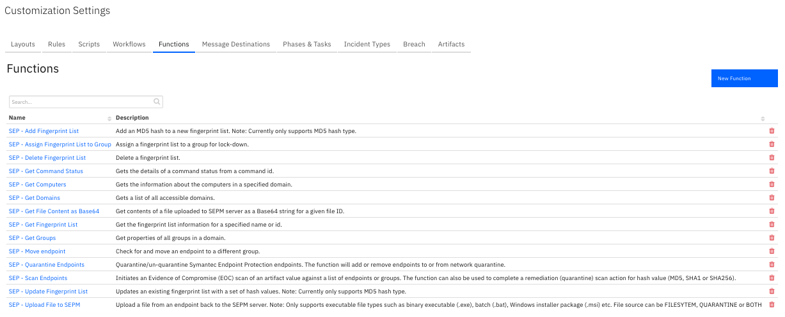
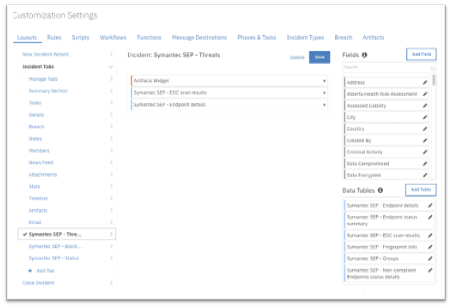
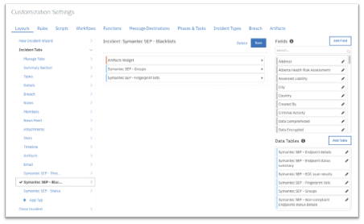
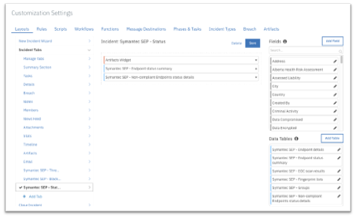

<!--
  This Install README.md is generated by running:
  "resilient-sdk docgen -p fn_mcafee_esm --install-guide"

  It is best edited using a Text Editor with a Markdown Previewer. VS Code
  is a good example. Checkout https://guides.github.com/features/mastering-markdown/
  for tips on writing with Markdown

  If you make manual edits and run docgen again, a .bak file will be created

  Store any screenshots in the "doc/screenshots" directory and reference them like:
  
-->

# fn-sep Functions for IBM Resilient

- [Release Notes](#release-notes)
- [Overview](#overview)
- [Requirements](#requirements)
- [Installation](#installation)
- [Uninstall](#uninstall)
- [Functions](#functions)
- [Sample workflows](#sample-workflows)
- [Sample rules](#sample-rules)
- [Example](#example)
- [Troubleshooting](#troubleshooting)
- [Support](#support)

---

## Release Notes
<!--
  Specify all changes in this release. Do not remove the release 
  notes of a previous release
-->
### v1.0.1
- Support added for App Host.
 
### v1.0.0
* Initial Release
---

## Overview
<!--
  Provide a high-level description of the function itself and its remote software or application.
  The text below is parsed from the "description" and "long_description" attributes in the setup.py file
-->
**Resilient Circuits Components for 'fn_sep'**

 

The Symantec Endpoint Protection (SEP) integration with the Resilient platform allows for querying and updating of a SEP deployment. 
### Key Features
```
•	Execute an Evidence of Compromise (EOC) scan for artifacts of type file (name or path) and hash (MD5, SHA1 or SHA256).
•	Upload a file from an endpoint to the Symantec Endpoint Protect Manager (SEPM).
•	Download a file from the SEPM as base64.
•	Remediate (quarantine) files (by hash match) discovered in an EOC scan.
•	Get endpoint details or status.
•	Get groups.
•	Get fingerprint lists.
•	Add or delete an MD5 hash value from a fingerprint list, which can be used to blacklist files.
•	Assign a fingerprint list to a group for system lockdown.
•	Delete a fingerprint list.
•	Move an endpoint to a new group.
•	Quarantine an endpoint.
```
## Requirements
<!--
  List any Requirements 
-->
* Resilient version 32 or later
* Resilient circuits version 32 or later
* Resilient Generic Email Parsing Script 1.0.1 or later
* Symantec Endpoint Protection 14.2 or later
* To setup up an App Host see:  [ibm.biz/res-app-host-setup](https://ibm.biz/res-app-host-setup)
* An Integration Server running `resilient_circuits>=30.0.0`
  * To set up an Integration Server see: [ibm.biz/res-int-server-guide](https://ibm.biz/res-int-server-guide)
  * If using API Keys, minimum required permissions are:
    | Name | Permissions |
    | ---- | ----------- |
    | Org Data | Read, Edit |
    | Incident fields | Edit all |
* Proxy supported: Yes
---


## Installation
* To install or uninstall an App using the App Host see [ibm.biz/res-install-app](https://ibm.biz/res-install-app)

* To install or uninstall an Integration using the Integration Server see the [ibm.biz/res-install-int](https://ibm.biz/res-install-int)
---

### App Configuration
The following table describes the settings you need to configure in the app.config file. If using App Host, see the Resilient System Administrator Guide. If using the integration server, see the Integration Server Guide.
| Config | Required | Example | Description |
| ------ | :------: | ------- | ----------- |
| **sep_base_path** | Yes | `/sepm/api/v1` | *Base path for SEP api.* |
| **sep_auth_path** | Yes | `/sepm/api/v1/identity/authenticate` | *Authentiaction Path for SEP api.* |
| **sep_host** | Yes | `192.168.190.190` | *DNS name of ip address of the SEP server.* |
| **sep_username** | Yes | `sep_username` | *User name for SEP api access.* |
| **sep_password** | Yes | `sep_password` | *User password for SEP api access.*  |
| **sep_domain** | Yes | `Default` | *User password for McAfee ESM api access.*  |
| **sep_results_limit** | Yes | `200` | *Limit result sent to Resilient, add full result as an attachment.*  |
| **sep_scan_timeout** | Yes | `1800 | *Period of time (seconds) to wait for all endpoints to return a scan result.*  |
| **http_proxy** | No | `0` | *Optional setting for an http proxy if required.*  |
| **https_proxy** | No | `0` | *Optional setting for an https proxy if required.*  |

---

### Custom Layouts
<!--
  Use this section to provide guidance on where the user should add any custom fields and data tables.
  You may wish to recommend a new incident tab.
  You should save a screenshot "custom_layouts.png" in the doc/screenshots directory and reference it here
-->
* To use the functions, create new Incident tabs e.g. Symantec SEP - Threats, Symantec SEP - Blacklists and Symantec SEP - Status. Drag the SEP data tables on to the layouts and click Save as shown in the screenshots below:
  
  
  
---

## Uninstall
* SSH into your Integration Server.
* **Uninstall** the package:
  ```
  $ pip uninstall fn-sep
  ```
* Open the config file, scroll to the [fn_sep] section and remove the section or prefix `#` to comment out the section.
* **Save** and **Close** the app.config file.
---

## Functions:
```
SEP - Scan Endpoints (fn_sep_scan_endpoints)
SEP - Upload File to SEPM (fn_sep_upload_file_to_sepm)
SEP - Get File Content as Base64 (fn_sep_get_file_content_as_base64)
SEP - Get Computers (fn_sep_get_computers)
SEP - Move Endpoint (fn_sep_move_endpoint)
SEP - Quarantine Endpoints (fn_sep_quarantine_endpoints)
SEP - Get Fingerprint List (fn_sep_get_fingerprint_list)
SEP - Add Fingerprint List (fn_sep_add_fingerprint_list)
SEP - Update Fingerprint List (fn_sep_update_fingerprint_list)
SEP - Get Groups (fn_sep_get_groups)
SEP - Assign Fingerprint List to Group (fn_sep_assign_fingerprint_list_to_group)
SEP - Delete Fingerprint List (fn_sep_delete_fingerprint_list)
SEP - Get Command Status (fn_sep_get_command_status)
SEP - Get Domains (fn_sep_get_domains)
```
---

## Sample workflows:
```
Example: SEP - Add Hash to Blacklist
Example: SEP - Assign Blacklist to lockdown group
Example: SEP - Delete Blacklist
Example: SEP - Delete Hash from Blacklist
Example: SEP - Get Blacklist information
Example: SEP - Get Endpoint Details
Example: SEP - Get Endpoint Details for artifact
Example: SEP - Get Endpoints status summary
Example: SEP - Get Endpoints status summary (refresh)
Example: SEP - Get File Content as Base64 string
Example: SEP - Get Groups information
Example: SEP - Get Non-Compliant Endpoints status details
Example: SEP - Get Quarantine status
Example: SEP - Get Remediation status
Example: SEP - Get Scan results
Example: SEP - Get Upload status
Example: SEP - Initiate EOC Scan for Artifact
Example: SEP - Move Endpoint
Example: SEP - Quarantine Endpoint
Example: SEP - Remediate Artifact on Endpoint
Example: SEP - Upload file to SEPM server
```
---

## Sample rules:
```
Example: SEP - Add Artifact from Scan Result
Example: SEP - Add Hash to Blacklist
Example: SEP - Assign Blacklist to lockdown group
Example: SEP - Delete Blacklist
Example: SEP - Delete Hash from Blacklist
Example: SEP - Get Blacklist information
Example: SEP - Get Endpoint Details
Example: SEP - Get Endpoint Details for artifact
Example: SEP - Get Endpoints status summary
Example: SEP - Get Endpoints status summary (refresh)
Example: SEP - Get File Content as Base64 string
Example: SEP - Get Groups information
Example: SEP - Get Non-Compliant Endpoints status details
Example: SEP - Get Quarantine status
Example: SEP - Get Remediation status
Example: SEP - Get Scan results
Example: SEP - Get Upload status
Example: SEP - Initiate EOC Scan for Artifact
Example: SEP - Move Endpoint
Example: SEP - Parse notification
Example: SEP - Quarantine Endpoint
Example: SEP - Remediate Artifact on Endpoint
Example: SEP - Un-Quarantine Endpoint
Example: SEP - Upload file to SEPM server
```
---

## Example
The provided **SEP - Scan Endpoints** function with the **Initiate EOC Scan for Artifact** workflow initiates an Evidence of Compromise (EOC) scan of an artifact value against a list of endpoints or groups. 
 
 

The function can also be used to complete a remediation delete action on a SHA256 hash value in conjunction with a scan.
 
 


<details><summary>Outputs:</summary>
<p>

```python
results = {'inputs': {u'sep_description': u'Scan to remediate file based on sha256', u'sep_computer_ids': u'D31AA16E0946C25D40C83823C500518B',
                      u'sep_scan_action': None, u'sep_file_path': u'C:\\temp\\eicar.zip', u'sep_group_ids': u'CAD80F000946C25D6C150831060AA326',
                      u'sep_sha256': None, u'sep_scan_type': {u'name': u'FULL_SCAN', u'id': 229}},
           'metrics': {'package': 'fn-sep', 'timestamp': '2019-04-12 10:49:22', 'package_version': '1.0.0', 'host': 'myhost', 'version': '1.0', 'execution_time_ms': 12349},
           'success': True, 'content': {u'commandID_computer': u'0F0CBDD7EDFF4634B23FA11F5AB81FFC', u'commandID_group': u'BB37F78894DB451B8E8921EC127667A3'},
           'raw': '{"commandID_computer": "0F0CBDD7EDFF4634B23FA11F5AB81FFC", "commandID_group": "BB37F78894DB451B8E8921EC127667A3"}',
           'reason': None,
           'version': '1.0'
}
```

</p>
</details>

<details><summary>Example Pre-Process Script:</summary>
<p>

```python
GET_COMPUTERS_CONTENT = workflow.properties.get_computers_results.content
ARTIFACT_TYPE = artifact.type
ARTIFACT_VALUE = artifact.value
ARTIFACT_DESCRIPTION = artifact.description
ARTIFACT_TYPE_TO_ROW = {
    "File Name": "file_name",
    "File Path": "file_path",
    "Malware MD5 Hash": "md5",
    "Malware SHA-1 Hash": "sha1",
    "Malware SHA-256 Hash": "sha256"
}
ARTIFACT_TYPES = [ v for v in sorted(ARTIFACT_TYPE_TO_ROW.values())]
COMPUTER_IDS = []
## Processing

def get_computers():
    global COMPUTER_IDS
    # Get computers to run scan against from previous step.
    if GET_COMPUTERS_CONTENT is not None and GET_COMPUTERS_CONTENT["endpoints_matching_ids"]:
        COMPUTER_IDS = GET_COMPUTERS_CONTENT["endpoints_matching_ids"]

def set_inputs(fn, fp, md5, sha1, sha256):
    global COMPUTER_IDS
    inputs.sep_file_path = fn if fp is None else fp
    inputs.sep_md5 = md5
    inputs.sep_sha1 = sha1
    inputs.sep_sha256 = sha256
    inputs.sep_computer_ids = ','.join(COMPUTER_IDS)
    inputs.sep_scan_type = rule.properties.sep_scan_type
    inputs.sep_scan_action = None
    if ARTIFACT_DESCRIPTION is not None:
        inputs.sep_description = u"Scan eoc for {0}".format(unicode(ARTIFACT_DESCRIPTION["content"]))
    else:
        inputs.sep_description = u"Scan eoc for for suspicious hash of type {0} and value {1} in the SEP environment.".format(ARTIFACT_TYPE, ARTIFACT_VALUE)

def main():
    get_computers()
    # Assign values to correct row based on artifact type
    types = [None if t not in ARTIFACT_TYPE_TO_ROW[ARTIFACT_TYPE] else ARTIFACT_VALUE for t in ARTIFACT_TYPES]
    set_inputs(*types)

if __name__ == "__main__":
    main()
```

</p>
</details>

<details><summary>Example Post-Process Script:</summary>
<p>

```python
##  Symantec Endpoint Protection  - fn_sep_upload_file_to_sepm script ##
# Example result:
"""
Result: {'inputs': {u'sep_description': u'Scan to remediate file based on sha256', u'sep_computer_ids': u'D31AA16E0946C25D40C83823C500518B',
                    u'sep_scan_action': None, u'sep_file_path': u'C:\\temp\\eicar.zip', u'sep_group_ids': u'CAD80F000946C25D6C150831060AA326',
                    u'sep_sha256': None, u'sep_scan_type': {u'name': u'FULL_SCAN', u'id': 229}},
         'metrics': {'package': 'fn-sep', 'timestamp': '2019-04-12 10:49:22', 'package_version': '1.0.0', 'host': 'myhost', 'version': '1.0', 'execution_time_ms': 12349},
         'success': True, 'content': {u'commandID_computer': u'0F0CBDD7EDFF4634B23FA11F5AB81FFC', u'commandID_group': u'BB37F78894DB451B8E8921EC127667A3'},
         'raw': '{"commandID_computer": "0F0CBDD7EDFF4634B23FA11F5AB81FFC", "commandID_group": "BB37F78894DB451B8E8921EC127667A3"}',
         'reason': None,
         'version': '1.0'
}

"""
#  Globals
# List of fields in datatable fn_sep_get_command_status script
DATA_TBL_FIELDS = ["scan_commandID"]
FN_NAME = "fn_sep_scan_endpoints"
WF_NAME = "Initiate EOC Scan for Artifact"
# Processing
CONTENT = results.content
INPUTS = results.inputs
QUERY_EXECUTION_DATE = results["metrics"]["timestamp"]
note_text = ''

def main():
    note_text = ''
    if CONTENT  is not None:
        note_text = u"Symantec SEP Integration: Workflow <b>{0}</b>: Returned command id <b>{1}</b> for a <b>{2}</b> " \
                    "scan on artifact <b>{3}</b> for Resilient function <b>{4}</b>"\
            .format(WF_NAME, CONTENT["commandID_computer"], INPUTS["sep_scan_type"], unicode(artifact.value), FN_NAME)
    else:
        note_text = u"Symantec SEP Integration: Workflow <b>{0}</b>: There was <b>no</b> command id returned for a " \
                    "<b>{1}</b> scan on artifact <b>{2}</b> for Resilient function <b>{3}</b>"\
            .format(WF_NAME, INPUTS["sep_scan_type"], INPUTS["sep_file_path"], unicode(artifact.value), FN_NAME)

    incident.addNote(helper.createRichText(note_text))
if __name__ == "__main__":
    main()
```
---

## Troubleshooting
If using the app with an App Host, see the Resilient System Administrator Guide and the App Host Deployment Guide for troubleshooting procedures. You can find these guides on the [IBM Knowledge Center](https://www.ibm.com/support/knowledgecenter/SSBRUQ), where you can select which version of the Resilient platform you are using.

If using the app with an integration server, see the [Integration Server Guide](https://ibm.biz/res-int-server-guide)

---

## For Support
This is an IBM Supported app. Please search https://ibm.com/mysupport for assistance.

