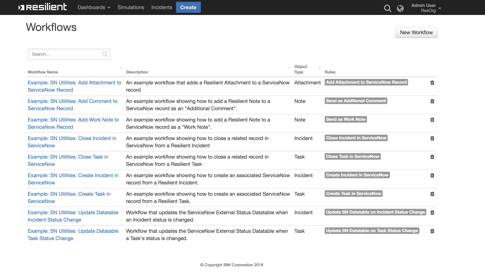
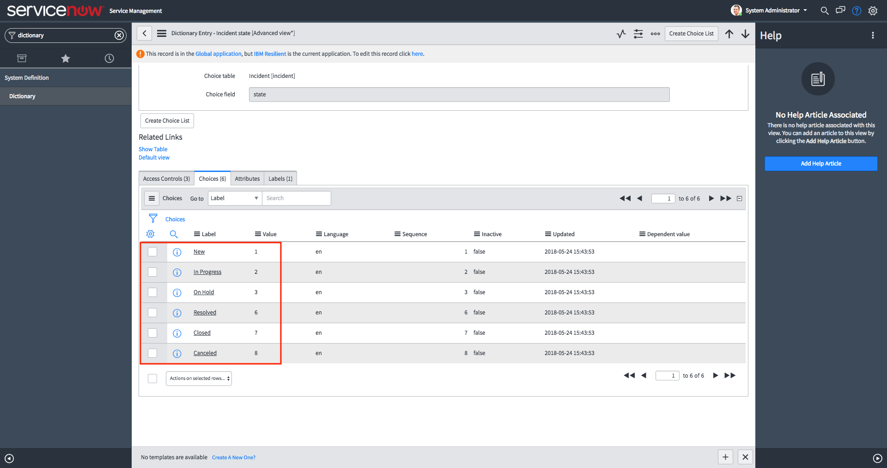
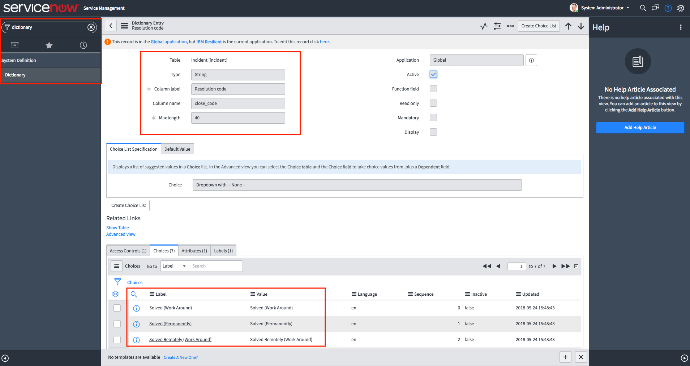

# Resilient Integration with ServiceNow
**This package contains six functions that help integrate with the ServiceNow Platform**

 


## app.config settings:
```python
[fn_service_now]
# Link to your ServiceNow Instance
sn_host=https://instance.service-now.com

# The URI to the ServiceNow App that handles the requests from Resilient
sn_api_uri=/api/x_261673_resilient/api

# The name of the table in ServiceNow you want to integrate with
sn_table_name=incident

# Username and Password for your Administrative User in ServiceNow
sn_username=
sn_password=
```

# Functions:

## **1: Create in ServiceNow**

### Function Inputs:
| Input Name | Type | Required | Example |
| ------------- | :--: | :-------:| ------- |
| `incident_id` | `Number` | Yes | `1001` |
| `task_id` | `Number` | No | `20000002` |
| `sn_init_work_note` | `String` | No | `"This Incident originated from our Cyber Security Team using the IBM Resilient platform"` |
| `sn_optional_fields` | `JSON String` | No | `"""{"assignment_group": "IT Security"}"""` |


### Function Output:
```python
results = {
  success: True,

  inputs: {
    incident_id: 2105,
    task_id: None
    sn_init_work_note: "Please investigate this",
    sn_optional_fields: {
      caller_id: "c1045b20db18230044ccd426ca9619fe",
      assignment_group: "5f6441efc0a8010e0177fcb589156352"
    }
  },

  res_id: "RES-2105",
  sn_ref_id: "INC0010453",
  sn_sys_id: "a48f21c5db82230044ccd426ca96198d",
  sn_time_created: 1543245771795,
  row_id: 45,
  res_link: "https://resilient-instance/#incidents/2105",
  sn_record_link: "https://instance.service-now.com/nav_to.do?uri=incident.do?sysparm_query=number=INC0010453",
}
```

### Pre-Process Script:
* This example defines and uses the `dict_to_json_str` function to allow us to easily set optional_fields we want to send to ServiceNow
* We also make use of user inputs from Rule Activity Fields by using: `rule.properties.sn_initial_note`
* In the supplied example Workflow, there are 3 Functions chained together, with this Function being the third. 
We use the output of the first and second functions here: 
  ```python
    "assignment_group": workflow.properties.assignment_group.sys_id,
    "caller_id": workflow.properties.caller_id.sys_id
  ```
The example:
```python
########################
### Define Functions ###
########################
def dict_to_json_str(d):
  """Function that converts a dictionary into a JSON string.
     Supports types: basestring, bool and int. 
     Supports nested directories.
     If the value is None, it sets it to False"""

  json_str = '"{ {0} }"'
  json_entry = '"{0}":{1}'
  json_entry_str = '"{0}":"{1}"'
  entries = [] 
  
  for entry in d:
    key = entry
    value = d[entry]
    
    if value is None:
      value = False
      
    if isinstance(value, basestring):
      value = value.replace(u'"', u'\\"')
      entries.append(json_entry_str.format(key, value))
    
    elif isinstance(value, bool):
      value = 'true' if value == True else 'false'
      entries.append(json_entry.format(key, value))
    
    elif isinstance(value, dict):
      entries.append(json_entry.format(key, dict_to_json_str(value)))
    
    else:
      entries.append(json_entry.format(key, value))
  
  return '{' + ','.join(entries) + '}'

#####################
### Define Inputs ###
#####################

# ID of this incident
inputs.incident_id = incident.id

# Initial work note to attach to created ServiceNow record
if rule.properties.sn_initial_note is not None:
  inputs.sn_init_work_note = rule.properties.sn_initial_note
else:
  inputs.sn_init_work_note = "This record was created by {0} [{1}] from IBM Resilient".format(principal.display_name, principal.name)

# Any further information you want to send to ServiceNow. Each Key/Value pair is attached to the Request object and accessible in ServiceNow.
inputs.sn_optional_fields = dict_to_json_str({
  "assignment_group": workflow.properties.assignment_group.sys_id,
  "caller_id": workflow.properties.caller_id.sys_id
})
```

### Post-Process Script:
This example **adds a Note to the Incident** with a link to the ServiceNow Record.
```python
if results.success:

  noteText = """<br>This Incident has been created in <b>ServiceNow</b>
              <br><b>ServiceNow ID:</b>  {0}
              <br><b>ServiceNow Link:</b> <a href='{1}'>{1}</a>""".format(results.sn_ref_id, results.sn_record_link)

  incident.addNote(helper.createRichText(noteText))
```

## **2: Close in ServiceNow**

### Function Inputs:
| Input Name | Type | Required | Example |
| ------------- | :--: | :-------:| ------- |
| `incident_id` | `Number` | Yes | `1001` |
| `task_id` | `Number` | No | `20000002` |
| `sn_record_state` | `Number` | Yes | `7` *NB: These are defined in ServiceNow (See Note below)* |
| `sn_close_notes` | `String` | Yes | `"We have closed this Incident"` |
| `sn_close_code` | `String` | Yes | `"Solved (Work Around)"`  *NB: These are defined in ServiceNow (See Note below). We use an Activity Field in the Rule to define a Select field, where we list all the possible close_codes* |

>**NOTE:** 
> * To see your record_state and close_codes value in ServiceNow go to **System Definition** > **Dictionary** > **Table Name** > **sate/close_code** and you will see their label and values
> * It is the value that we send from Resilient to ServiceNow
>
> **Record State:**
>
>
> **Close Code:**
> 

### Function Output:
```python
results = {
  success: True,

  inputs: {
    incident_id: 2105,
    sn_record_state: 7,
    task_id: 2251401,
    sn_close_notes: "The IBM Resilient Team fixed this one!",
    sn_ref_id: None,
    sn_close_code: "Solved (Permanently)"
    },

  sn_ref_id: "INC0010454"
}
```

### Pre-Process Script:
* This example creates a Python Dictionary to map the ServiceNow States to their corresponding numeric value
```python
# A Dictionary that maps Record States to their corresponding codes
# These codes are defined in ServiceNow and may be different for each ServiceNow configuration
map_sn_record_states = {
  "New": 1,
  "In Progress": 2,
  "On Hold": 3,
  "Resolved": 6,
  "Closed": 7,
  "Canceled": 8
}

#####################
### Define Inputs ###
#####################

# ID of this incident
inputs.incident_id = incident.id

# The state to change the record to
# inputs.sn_record_state = map_sn_record_states["Closed"]
inputs.sn_record_state = map_sn_record_states[rule.properties.sn_record_state]

# The resolution notes that are normally required when you close a ServiceNow record
# inputs.sn_close_notes = "This incident has been resolved in Resilient. No further action required"
inputs.sn_close_notes = rule.properties.sn_close_notes

# The ServiceNow 'close_code' that you normally select when closing a ServiceNow record
# inputs.sn_close_code = "Solved (Permanently)"
inputs.sn_close_code = rule.properties.sn_close_code
```

### Post-Process Script:
This example **adds a Note to the Incident** detailing why the Incident was Closed.
```python
if results.success:

  noteText = """<br>This Incident has been CLOSED in <b>ServiceNow</b>
              <br><b>ServiceNow ID:</b> {0}
              <br><b>ServiceNow Record State:</b> {1}
              <br><b>ServiceNow Closing Notes:</b> {2}
              <br><b>ServiceNow Closing Code:</b> {3}""".format(
                                      results.sn_ref_id,
                                      results.inputs.sn_record_state,
                                      results.inputs.sn_close_notes,
                                      results.inputs.sn_close_code)

  incident.addNote(helper.createRichText(noteText))
```

# Rules:
| Rule Name | Object Type | Activity Fields | Workflow Triggered |
| --------- | :---------: | --------------- | ------------------ |
| Create Incident in ServiceNow | `Incident` | `SN Assignment Group`, `SN Initial Note` | `Example: SN Utilities: Create Incident in ServiceNow` |
| Create Task in ServiceNow | `Task` | `SN Assignment Group`, `SN Initial Note` | `Example: SN Utilities: Create Task in ServiceNow` |
| Close Incident in ServiceNow | `Incident` | `SN Record State`, `SN Close Code`, `SN Close Notes` | `Example: SN Utilities: Close Incident in ServiceNow` |
| Close Task in ServiceNow | `Task` | `SN Record State`, `SN Close Code`, `SN Close Notes` | `Example: SN Utilities: Close Task in ServiceNow` |