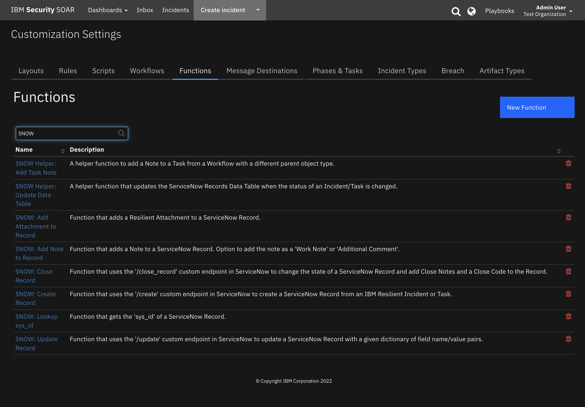
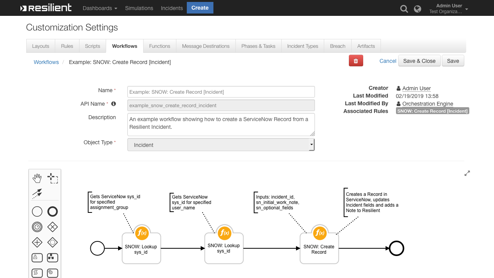
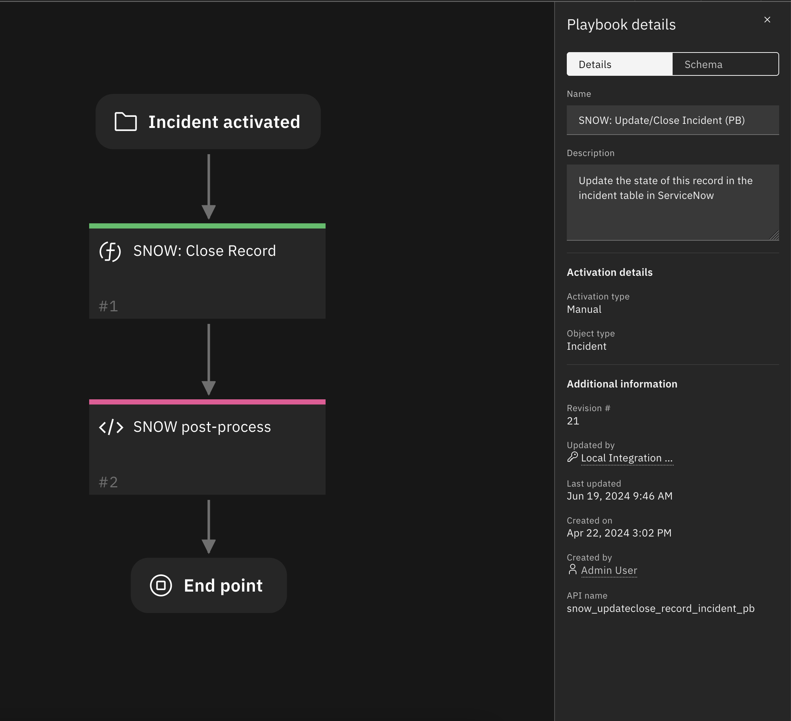
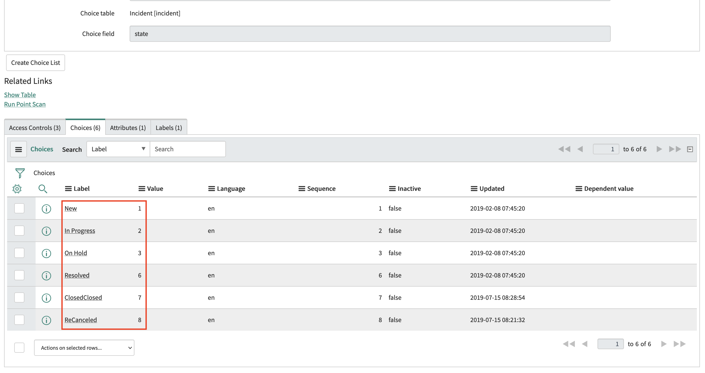
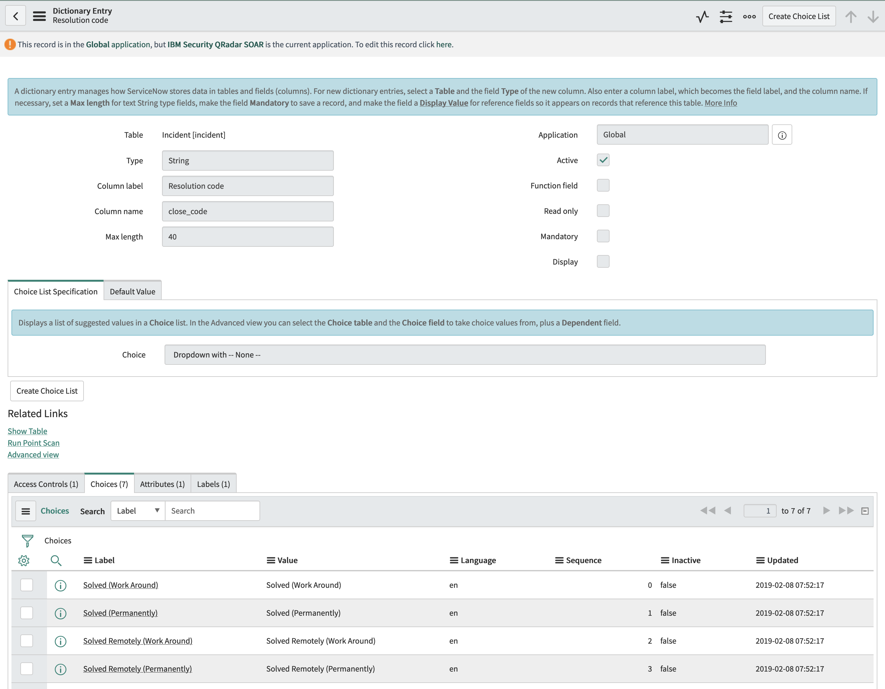
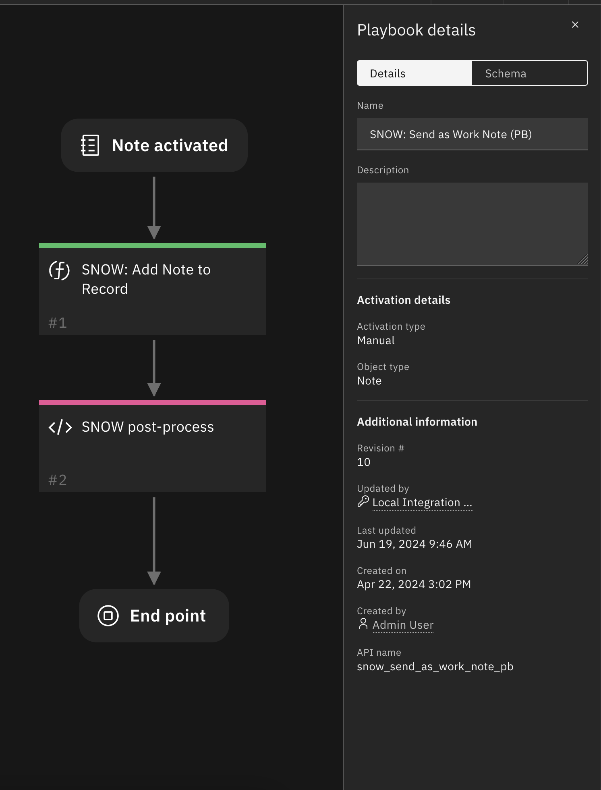
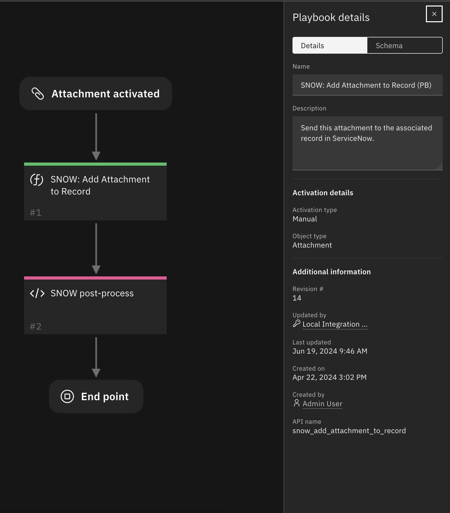
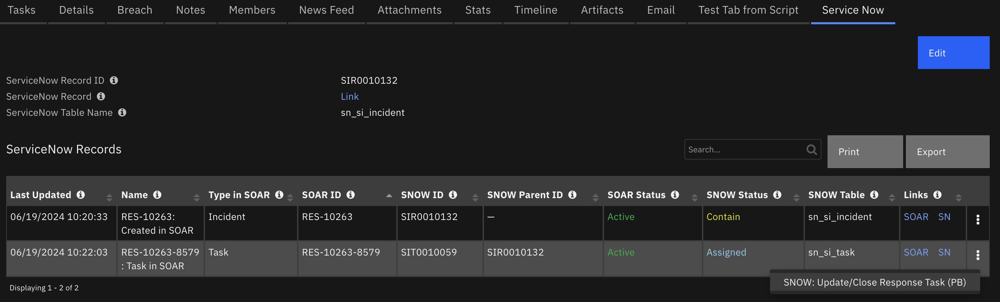

# IBM Resilient Integration for ServiceNow

## Table of Contents
- [App Config Settings](#appconfig-settings)
- [Functions](#functions)
  - [SNOW: Create Record](#snow-create-record)
  - [SNOW: Update Record](#snow-update-record)
  - [SNOW: Close Record](#snow-close-record)
  - [SNOW: Add Note to Record](#snow-add-note-to-record)
  - [SNOW: Add Attachment to Record](#snow-add-attachment-to-record)
  - [SNOW: Lookup sys_id](#snow-lookup-sysid)
  - [SNOW Helper: Update Data Table](#snow-helper-update-data-table)
- [Rules](#rules)
- [ServiceNow Records Data Table](#servicenow-records)
  - [Display a Data Table in an Incident](#display-a-data-table-in-an-incident)

---

# Overview:
This package contains 8 Functions, 11 Workflows, 11 Rules and 1 Data Table that, when used along side our ServiceNow App help you integrate with your ServiceNow Instance

* [SNOW: Create Record](#snow-create-record) gives you the ability to create a Record in ServiceNow from a Resilient Incident or Task
* [SNOW: Update Record](#snow-update-record) allows you to update multiple column fields in a ServiceNow Record
* [SNOW: Close Record](#snow-close-record) lets you close a related Record in ServiceNow from a Resilient Incident or Task
* [SNOW: Add Note to Record](#snow-add-note-to-record) allows you to send a Resilient Note to a ServiceNow Record as a `Work Note` or `Additional Comment`
* [SNOW: Add Attachment to Record](#snow-add-attachment-to-record) gives you the ability to send a Resilient Attachment to a ServiceNow Record
* [SNOW: Lookup sys_id](#snow-lookup-sysid) queries your ServiceNow Instance for a Record and returns the `sys_id` of that Record
* [SNOW Helper: Update Data Table](#snow-helper-update-data-table) helper function that updates the ServiceNow Records Data Table status

---

# App Config Settings (app.config):
```
[fn_service_now]
# Link to your ServiceNow Instance
sn_host=https://instance.service-now.com

# The URI to the ServiceNow App that handles the requests from Resilient
sn_api_uri=/api/x_261673_resilient/api

# The name of the table in ServiceNow you want to integrate with
sn_table_name=incident

# Username and Password for your Administrative User in ServiceNow
sn_username=ibmresilient
sn_password=MyPassword
```

---

# Functions:

 

## SNOW: Create Record:
Uses the '/create' custom endpoint in ServiceNow to create a ServiceNow Record from an IBM Resilient Incident or Task.

 

### Inputs:
| Input Name | Type | Required | Example | Info |
| ---------- | :--: | :-------:| ------- | ---- |
| `incident_id` | `Number` | Yes | `2105` | ID of the Resilient Incident |
| `task_id` | `Number` | No | `None` | ID of the Resilient Task |
| `sn_init_work_note` | `String` | No | `"This Incident originated from our Cyber Security Team using the IBM Resilient platform"` | Initial Work Note to be added to the new ServiceNow Record |
| `sn_optional_fields` | `JSON String` | No | `'{"assignment_group": "IT Security"}'` | An extensible JSON String of the field names and values to set in the new ServiceNow Record |

>**NOTE:** by default this function:
> * sets `short_description` in ServiceNow as the `incident.name` or `task.name`
> * sets `description` in ServiceNow as the `incident.description` or `task.instructions`
> * sets `work_notes` in ServiceNow as the `sn_init_work_note`
>
> **These defaults can be overwritten** by passing values from them in the `sn_optional_fields` input. To do this you would extend the example Pre-Process Script provided with the following:
> ```python
> inputs.sn_optional_fields = dict_to_json_str({
> "short_description": "Custom Short Description",
> "description": "Custom Long Description"
> })
> ```

### Output:
```python
results = {
    'inputs': {
        'incident_id': 2095,
        'sn_init_work_note': "Record created from a IBM Resilient Incident ID: 2095.\nSeverity: Low\nIncident Type(s): [u'Malware']\n\nPlease look into this now",
        'sn_optional_fields': {
            'short_description': 'RES-2095: Malware found on CEO laptop',
            'severity': 3,
            'caller_id': 'c1045b20db18230044ccd426ca9619fe',
            'assignment_group': '12a586cd0bb23200ecfd818393673a30'
        },
        'task_id': None
    },
    'sn_record_state': 'New',
    'res_link': 'https://192.168.58.3/#incidents/2095',
    'success': True,
    'reason': None  # A string error message if success is false
    'sn_time_created': 1550596132530,
    'sn_sys_id': '6ae67f94dbf3230044ccd426ca961920',
    'sn_ref_id': 'INC0010698',
    'row_id': 1,
    'res_id': 'RES-2095',
    'sn_record_link': 'https://xxxxx.service-now.com/nav_to.do?uri=incident.do?sysparm_query=number=INC0010698'
}
```

### Pre-Process Script:
* This example defines and uses the `dict_to_json_str` function to allow us to easily set optional_fields we want to send to ServiceNow.
* We also make use of user inputs from **Rule Activity Fields** by using: `rule.properties.sn_initial_note`.
* In the supplied example Workflow, there are 3 Functions chained together, with this Function being the third. 
  * We use the output of the first and second functions here: 
    ```python
        "assignment_group": workflow.properties.assignment_group.sys_id,
        "caller_id": workflow.properties.caller_id.sys_id
    ```
The example:
```python
#######################################
### Define pre-processing functions ###
#######################################
def dict_to_json_str(d):
  """Function that converts a dictionary into a JSON string.
     Supports types: basestring, bool, int and nested dicts.
     Does not support lists.
     If the value is None, it sets it to False."""

  json_entry = u'"{0}":{1}'
  json_entry_str = u'"{0}":"{1}"'
  entries = [] 

  for entry in d:
    key = entry
    value = d[entry]

    if value is None:
      value = False

    if isinstance(value, list):
      helper.fail('dict_to_json_str does not support Python Lists')

    if isinstance(value, basestring):
      value = value.replace(u'"', u'\\"')
      entries.append(json_entry_str.format(unicode(key), unicode(value)))
      
    elif isinstance(value, unicode):
      entries.append(json_entry.format(unicode(key), unicode(value)))
    
    elif isinstance(value, bool):
      value = 'true' if value == True else 'false'
      entries.append(json_entry.format(key, value))

    elif isinstance(value, int):
      entries.append(json_entry.format(unicode(key), value))

    elif isinstance(value, dict):
      entries.append(json_entry.format(key, dict_to_json_str(value)))

    else:
      helper.fail('dict_to_json_str does not support this type: {0}'.format(type(value)))

  return u'{0} {1} {2}'.format(u'{', ','.join(entries), u'}')

# Map IBM Resilient severity values to ServiceNow severity values
sn_severity_map = {
  "High": 1,
  "Medium": 2,
  "Low": 3
}

#####################
### Define Inputs ###
#####################

# Default text of the initial note added to the ServiceNow Record
init_snow_note_text = u"""Record created from a IBM Resilient Incident ID: {0}.
                          Severity: {1}
                          Incident Type(s): {2}""".format(incident.id, incident.severity_code, incident.incident_type_ids)

# If the user adds a comment when they invoke the rule, that comment gets concatenated here
if rule.properties.sn_initial_note.content is not None:
  init_snow_note_text = u"{0}\n\n{1}".format(init_snow_note_text, unicode(rule.properties.sn_initial_note.content))

# ID of this incident
inputs.incident_id = incident.id

# Initial work note to attach to created ServiceNow Record
inputs.sn_init_work_note = init_snow_note_text

# Any further information you want to send to ServiceNow. Each Key/Value pair is attached to the Request object and accessible in ServiceNow.
# ServiceNow Example:: setValue('assignment_group', request.body.data.sn_optional_fields.assignment_group)
inputs.sn_optional_fields = dict_to_json_str({
  "short_description": u"RES-{0}: {1}".format(incident.id, unicode(incident.name)),
  "severity": sn_severity_map[incident.severity_code],
  "assignment_group": workflow.properties.assignment_group.sys_id,
  "caller_id": workflow.properties.caller_id.sys_id
})
```

### Post-Process Script:
* This example updates two Custom Incident Fields **sn_snow_record_id** and **sn_snow_record_link** then **adds a Note to the Incident**
```python
if results.success:

  # Set incident fields sn_snow_record_id and sn_snow_record_link
  incident.sn_snow_record_id = results.sn_ref_id
  incident.sn_snow_record_link = """<a href='{0}'>Link</a>""".format(results.sn_record_link)
  
  noteText = """<br>This Incident has been created in <b>ServiceNow</b>
              <br><b>ServiceNow ID:</b>  {0}
              <br><b>ServiceNow Link:</b> <a href='{1}'>{1}</a>""".format(results.sn_ref_id, results.sn_record_link)

  incident.addNote(helper.createRichText(noteText))
```

---

## SNOW: Update Record:
Uses the '/update' custom endpoint in ServiceNow to update a ServiceNow Record with a given dictionary of field name/value pairs.

 

### Inputs:
| Name | Type | Required | Example | Info |
| ---- | :--: | :------: | ------- | ---- |
| `incident_id` | `Number` | Yes | `1001` | ID of the Resilient Incident |
| `task_id` | `Number` | No | `20000002` or `None` | The ID of the Resilient Task |
| `sn_res_id` | `String` | No | `"RES-1001"` or `"RES-1001-20000002"` | This ID is an accumulation of the Resilient Incident and/or Task ID. It is stored in the `sn_records_dt` Data Table |
| `sn_update_fields` | `JSON String` | No | `'{"assignment_group": "IT Security"}'` | A JSON String of the ServiceNow field name and values you want to update. In our examples below we use the `dict_to_json_str(d)` Python Function to generate this JSON String. |

### Output:
```python
results = {
    'inputs': {
        'incident_id': 1001,
        'task_id': None,
        'sn_res_id': None,
        'sn_update_fields': {
            'severity': 1
        },
        'task_id': None,
        'sn_res_id': None
    },
    'sn_time_updated': 1550843019456,
    'sn_ref_id': 'INC0010701',
    'success': True
}
```

### Pre-Process Script:
* This example uses `dict_to_json_str()` to generate a JSON String for the `sn_update_fields` input

```python
#######################################
### Define pre-processing functions ###
#######################################
def dict_to_json_str(d):
  """Function that converts a dictionary into a JSON string.
     Supports types: basestring, bool, int and nested dicts.
     Does not support lists.
     If the value is None, it sets it to False."""

  json_entry = u'"{0}":{1}'
  json_entry_str = u'"{0}":"{1}"'
  entries = [] 

  for entry in d:
    key = entry
    value = d[entry]

    if value is None:
      value = False

    if isinstance(value, list):
      helper.fail('dict_to_json_str does not support Python Lists')

    if isinstance(value, basestring):
      value = value.replace(u'"', u'\\"')
      entries.append(json_entry_str.format(unicode(key), unicode(value)))
      
    elif isinstance(value, unicode):
      entries.append(json_entry.format(unicode(key), unicode(value)))
    
    elif isinstance(value, bool):
      value = 'true' if value == True else 'false'
      entries.append(json_entry.format(key, value))

    elif isinstance(value, int):
      entries.append(json_entry.format(unicode(key), value))

    elif isinstance(value, dict):
      entries.append(json_entry.format(key, dict_to_json_str(value)))

    else:
      helper.fail('dict_to_json_str does not support this type: {0}'.format(type(value)))

  return u'{0} {1} {2}'.format(u'{', ','.join(entries), u'}')

# Map IBM Resilient severity values to ServiceNow severity values
sn_severity_map = {
  "High": 1,
  "Medium": 2,
  "Low": 3
}

#####################
### Define Inputs ###
#####################

# Get the id of this incident
inputs.incident_id = incident.id

# List all the fields you want to update in the ServiceNow Record here with the ServiceNow field_name being the key
inputs.sn_update_fields = dict_to_json_str({
  "severity": sn_severity_map[incident.severity_code],
})
```

### Post-Process Script:
* This example **adds a Note to the Incident**
```python
# Add a Note to the Incident
note_text = u"The Severity of this Incident was updated to {0} in IBM Resilient".format(incident.severity_code)
incident.addNote(note_text)
```

---

## SNOW: Close Record:
Uses the '/close_record' custom endpoint in ServiceNow to change the state of a ServiceNow Record and add Close Notes and a Close Code to the Record.

 

### Inputs:
| Input Name | Type | Required | Example | Info |
| ---------- | :--: | :-------:| ------- | ---- |
| `incident_id` | `Number` | Yes | `2105` | ID of the Resilient Incident |
| `task_id` | `Number` | No | `2251401` | ID of the Resilient Task |
| `sn_record_state` | `Number` | Yes | `7` | These are defined in ServiceNow (See Note below) |
| `sn_close_notes` | `String` | Yes | `"We have closed this Incident"` | The notes required to close an Incident Record in ServiceNow |
| `sn_close_code` | `String` | Yes | `"Solved (Work Around)"` | These are defined in ServiceNow (See Note below). We use an Activity Field in the Rule to define a Select field, where we list all the possible close_codes |
| `sn_close_work_note` | `String` | Yes | `"This record's state has be changed to 'Resolved' by IBM Resilient"`  | If defined this text is added as a Work Note to the ServiceNow Record |

>**NOTE:** 
> * To see your record_state and close_codes value in ServiceNow go to **System Definition** > **Dictionary** > **Table Name** > **sate/close_code** and you will see their label and values.
> * It is the value that we send from Resilient to ServiceNow.
>
> **Record State:**
>
>
> **Close Code:**
> 

### Output:
```python
results = {
    'inputs': {
        'incident_id': 2095,
        'sn_record_state': 6,
        'task_id': None,
        'sn_close_work_note': "This record's state has be changed to Resolved by IBM Resilient",
        'sn_res_id': None,
        'sn_close_notes': 'The Resilient team have solved this',
        'sn_close_code': 'Solved (Permanently)'
    },
    'reason': None,
    'sn_record_state': 'Resolved',
    'sn_ref_id': 'INC0010698',
    'success': True
}
```

### Pre-Process Script:
* This example **creates a Python Dictionary** to map the ServiceNow States to their corresponding numeric value.
```python
# A Dictionary that maps Record States to their corresponding codes
# These codes are defined in ServiceNow and may be different for each ServiceNow configuration
map_sn_record_states = {
  "New": 1,
  "In Progress": 2,
  "On Hold": 3,
  "Resolved": 6,
  "Closed": 7,
  "Canceled": 8
}

#####################
### Define Inputs ###
#####################

# ID of this incident
inputs.incident_id = incident.id

# The state to change the record to
# inputs.sn_record_state = map_sn_record_states["Closed"]
inputs.sn_record_state = map_sn_record_states[rule.properties.sn_record_state]

# The resolution notes that are normally required when you close a ServiceNow record
# inputs.sn_close_notes = "This incident has been resolved in Resilient. No further action required"
inputs.sn_close_notes = rule.properties.sn_close_notes

# The ServiceNow 'close_code' that you normally select when closing a ServiceNow record
# inputs.sn_close_code = "Solved (Permanently)"
inputs.sn_close_code = rule.properties.sn_close_code

# Add a Work Note to the Record in ServiceNow
inputs.sn_close_work_note = u"This record's state has be changed to {0} by IBM Resilient".format(unicode(rule.properties.sn_record_state))
```

### Post-Process Script:
* This example **adds a Note to the Incident** detailing why the Incident was closed or if the Workflow **fails** to close the ServiceNow Record
```python
note_text = None

if results.success:

  note_text = u"""<br>This Incident has been CLOSED in <b>ServiceNow</b>
              <br><b>ServiceNow ID:</b> {0}
              <br><b>ServiceNow Record State:</b> {1}
              <br><b>ServiceNow Closing Notes:</b> {2}
              <br><b>ServiceNow Closing Code:</b> {3}""".format(
                                      unicode(results.sn_ref_id),
                                      unicode(results.sn_record_state),
                                      unicode(results.inputs.sn_close_notes),
                                      unicode(results.inputs.sn_close_code))

else:
  note_text = u"""<br>Failed to close this Incident in <b>ServiceNow</b>
              <br><b>Reason:</b> {0}""".format(unicode(results.reason))
  
incident.addNote(helper.createRichText(note_text))
```

---

## SNOW: Add Note to Record:
Uses the '/add' custom endpoint in ServiceNow to add a Resilient Note to a ServiceNow Record as a `Work Note` or `Additional Comment`.

 

### Inputs:
| Input Name | Type | Required | Example | Info |
| ---------- | :--: | :-------:| ------- | ---- |
| `incident_id` | `Number` | Yes | `2105` | ID of the Resilient Incident |
| `task_id` | `Number` | No | `2251401` | ID of the Resilient Task |
| `sn_note_text` | `String` | Yes | `"Can your team look into this please"` | Text of the new ServiceNow Note |
| `sn_note_type` | `Select` | Yes | `"work_note"` OR `"additional_comment"` | Note type. Either `Work Note` or `Additional Comment` |

### Output:
```python
results = {
    'inputs': {
        'incident_id': 2095,
        'sn_note_text': 'What is the status of this ticket?',
        'task_id': 2251213,
        'sn_note_type': 'work_note'
    },
    'res_id': 'RES-2095-2251213',
    'sn_ref_id': 'INC0010699',
    'success': True
}
```

### Pre-Process Script:
```python
# The id of this incident
inputs.incident_id = incident.id

# If this is a task, get the taskId
if note.type == 'task':
  # Set the task_id
  inputs.task_id = task.id

# The type of note to create in ServiceNow
inputs.sn_note_type = "work_note"

# Get the text of the note
inputs.sn_note_text = note.text.content
```

### Post-Process Script:
* This example prepends a timestamp to the Resilient Note to track when the Note was sent to ServiceNow.
```python
# Import Date
from java.util import Date

# Get the current time
dt_now = Date()

# Prepends message and time to the note
note.text = u"<b>Sent to ServiceNow at {0}</b><br>{1}".format(dt_now, unicode(note.text.content))
```

---

## SNOW: Add Attachment to Record:
Uses the '/add' custom endpoint in ServiceNow to add a Resilient Attachment to a ServiceNow Record

 

### Inputs:
| Input Name | Type | Required | Example | Info |
| ---------- | :--: | :-------:| ------- | ---- |
| `attachment_id` | `Number` | Yes | `39` | ID of the Resilient Attachment |
| `incident_id` | `Number` | Yes | `2105` | ID of the Resilient Incident |
| `task_id` | `Number` | No | `2251401` | ID of the Resilient Task |

### Output:
```python
results = {
  success: True,

  inputs: {
    attachment_id: 39,
    task_id: 2251401,
    incident_id: 2105
  },

  attachment_name: "malwarefile.exe",
  res_id: "RES-2105-2251401",
  sn_ref_id: "INC0010455"
}
```

### Pre-Process Script:
```python
# The id of this attachment
inputs.attachment_id = attachment.id

# The id of this incident
inputs.incident_id = incident.id

# If this is a task attachment, get the taskId
if attachment.type == 'task':
  inputs.task_id = task.id
```

### Post-Process Script:
* This example **adds a Note to the Incident/Task** detailing what attachment was sent to ServiceNow.
```python
if results.success:

  noteText = u"""<br>{0} has added an attachment to <b>ServiceNow</b>
              <br><b>Attachment Name:</b>  {1}
              <br><b>ServiceNow ID:</b>  {2}""".format(unicode(principal.display_name), unicode(results.attachment_name), results.sn_ref_id)

  # If this is a task attachment, add a note to the Task
  if task:
    task.addNote(helper.createRichText(noteText))
  # Else add the note to the Incident
  else:
    incident.addNote(helper.createRichText(noteText))
```

---

## SNOW: Lookup sys_id:
* Gets the `sys_id` of a ServiceNow Record
* Used when creating a ServiceNow Record to get the `sys_id` of the `assignment_group` to assign the new Record to

 

### Inputs:
| Input Name | Type | Required | Example | Info |
| ---------- | :--: | :-------:| ------- | ---- |
| `sn_table_name` | `String` | Yes | `"sys_user_group"` | The table name in ServiceNow to query |
| `sn_query_field` | `String` | Yes | `"name"` | The column name in the table you want to query |
| `sn_query_value` | `String` | Yes | `"IT Securities"` | The cell value in the column you want to query |

### Output:
```python
results = {
  success: True,

  inputs: {
    sn_table_name: "sys_user_group",
    sn_query_value: "IT Securities",
    sn_query_field: "name"
  },

  sys_id: "5f6441efc0a8010e0177fcb589156352"
}
```

### Pre-Process Script:
```python
# The table in ServiceNow to query
inputs.sn_table_name = "sys_user_group"

# The name of the field/table column to query
inputs.sn_query_field = "name"

# The value to equate the cell to
## Get the group name from the Rule Activity Field with:
inputs.sn_query_value = rule.properties.sn_assignment_group

## OR Set group name statically with:
# inputs.sn_query_value = "IT Securities"
```

### Post-Process Script:
*There is generally no Post-Process Script for this Function. Its output is normally used as an input to the **Create in ServiceNow** function.*

---

## SNOW Helper: Update Data Table:

### Inputs:
| Input Name | Type | Required | Example | Info |
| ---------- | :--: | :-------:| ------- | ---- |
| `incident_id` | `Number` | Yes | `2105` | ID of the Incident |
| `task_id` | `Number` | No | `2251401` | ID of the Task |
| `sn_resilient_status` | `String` | Yes | `"C"` | "A"=Active Incident, "O"=Open Task, "C"=Closed Incident/Task |

### Function Output:
```python
results = {
  success: True,

  inputs: {
    incident_id: 2105,
    task_id: 2251401,
    sn_resilient_status: "C"
  },

  row_id: 47,
  res_id: "RES-2105-2251401"
}
```

### Pre-Process Script:
```python
# Get the incident id
inputs.incident_id = incident.id

# Get the task id
inputs.task_id = task.id

# Get the new status of the task
inputs.sn_resilient_status = task.status
```

### Post-Process Script:
*There is generally no Post-Process Script for this Function.*

---

# Rules:
| Rule Name | Object Type | Activity Fields | Workflow Triggered | Conditions |
| --------- | :---------: | --------------- | ------------------ | ---------- |
| SNOW: Create Record [Incident] | `Incident` | `SN Assignment Group`, `SN Initial Note` | `Example: SNOW: Create Record [Incident]` | `SNOW Record ID` does not have a value |
| SNOW: Create Record [Task] | `Task` | `SN Assignment Group`, `SN Initial Note` | `Example: SNOW: Create Record [Task]` | None |
| SNOW: Close Record [Incident] | `Incident` | `SN Record State`, `SN Close Code`, `SN Close Notes` | `Example: SNOW: Close Record [Incident]` | `SNOW Record ID` has a value |
| SNOW: Close Record [Task] | `Task` | `SN Record State`, `SN Close Code`, `SN Close Notes` | `Example: SNOW: Close Record [Task]` | None |
| SNOW: Send as Additional Comment | `Note` | None | `Example: SNOW: Add Comment to Record` | `Note Text` does not contain "Sent to ServiceNow at" |
| SNOW: Send as Work Note | `Note` | None | `Example: SNOW: Add Work Note to Record` | `Note Text` does not contain "Sent to ServiceNow at" |
| SNOW: Add Attachment to Record | `Attachment` | None | `Example: SNOW: Add Attachment to Record` | None |
| SNOW: Update Record on Severity Change  | `Incident` | None | `Example: SNOW: Update Record on Severity Change` | `Severity` is changed AND `SNOW Record ID` has a value |
| SNOW: Update Data Table on Status Change [Incident] | `Incident` | None | `Example: SNOW: Update Data Table on Status Change [Incident]` | `Status` is changed |
| SNOW: Update Data Table on Status Change [Task] | `Task` | None | `Example: SNOW: Update Data Table on Status Change [Task]` | `Status` is changed |

---

# Data Table:

## ServiceNow Records
 

### API Name:
sn_records_dt

### Columns:
| Column Name | API Access Name | Type |
| ----------- | --------------- | -----|
| Last Updated | `sn_records_dt_time` | `DateTimePicker` |
| Name | `sn_records_dt_name` | `Text` |
| Type | `sn_records_dt_type` | `Text` |
| RES ID | `sn_records_dt_res_id` | `Text` |
| SNOW ID | `sn_records_dt_sn_ref_id` | `Text` |
| RES Status | `sn_records_dt_res_status` | `Rich Text` |
| SNOW Status | `sn_records_dt_snow_status` | `Rich Text` |
| Links | `sn_records_dt_links` | `Rich Text` |

### Display a Data Table in an Incident
* In order to **display** the Test Data Table in your Incident, you must **modify your Layout Settings**

1. Go to **Customization Settings** > **Layouts** > **Incident Tabs** > **+ Add Tab**
   
 

2. Enter **Tab Text**: `My Test Tab` and click **Add**
 
 

3. **Drag** the Data table into the middle and click **Save**
 
 

4. Create a new Incident and you will now see the **My Test Tab** with the **Test Data Table**