# IBM Resilient Integration for ServiceNow - Customization Guide *(Pre-Certification Process)*
**Please note that this guide has been created prior to the ServiceNow certification. Once we have completed that process, this guide will be refactored accordingly**

*This guide will show you how to customize and configure this integration to suit your specific needs*

- [Prerequisites](#prerequisites)
- [Architectural Diagram](#architectural-diagram)
- [Overview](#overview)
- [Pre-Defined ServiceNow Workflows](#pre-defined-servicenow-workflows)
- [ResilientHelper API](#resilienthelper-api)
  - [create(GlideRecord record, String snRecordId, String caseName, Object options)](#creategliderecord-record-string-snrecordid-string-casename-object-options)
  - [addNote(String res_reference_id, String noteText, String noteFormat)](#addnotestring-resreferenceid-string-notetext-string-noteformat)
  - [updateStateInResilient(String res_reference_id, String snTicketState, String snTicketStateColor)](#updatestateinresilientstring-resreferenceid-string-snticketstate-string-snticketstatecolor)
- [Create Own Custom ServiceNow Workflow](#create-own-custom-servicenow-workflow)
  - [Step 1: *Use Correct Application Scope*](#step-1-use-correct-application-scope)
  - [Step 2: *Create a new Workflow*](#step-2-create-a-new-workflow)
  - [Step 3: *Add a Timer to the Workflow*](#step-3-add-a-timer-to-the-workflow)
  - [Step 4: *Add a Run Script to the Workflow*](#step-4-add-a-run-script-to-the-workflow)
  - [Step 5: *Test Your New Custom Workflow*](#step-5-test-your-new-custom-workflow)

---

## Prerequisites 
* Resilient Appliance updated to at least `v31.0.0`
* An Integrations Server setup with `resilient-circuits >= 31.0.0` installed
* All steps in the **[Installation Guide](./install_guide)** complete
* ServiceNow instance running `Kingston` or later
* ServiceNow user with an `admin` role
* A basic understanding of **IBM Resilient Workflows**
* A basic understanding of **ServiceNow Workflows**
---

## Architectural Diagram
 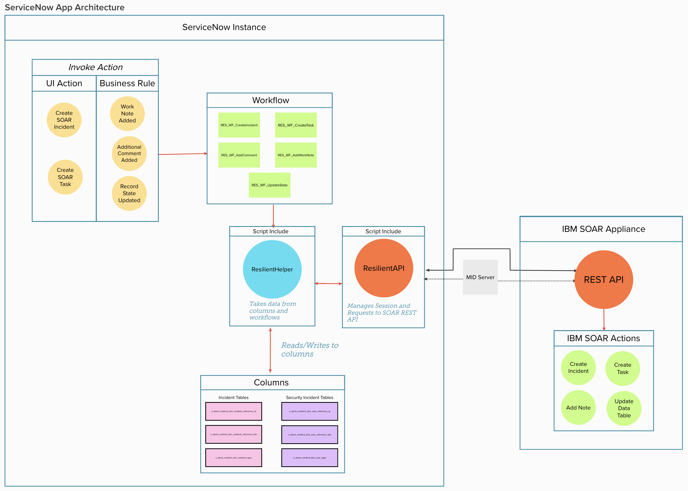

---
## Overview
When this Integration is installed, on your ServiceNow instance, you will have access to the **ResilientHelper** class in any ServiceNow `Workflow`, `UI Action` or `Script Include`.

From the architectural diagram above, within ServiceNow, any IBM Resilient action must start with a ServiceNow `Workflow`. ServiceNow `Workflows` are invoked from `UI Actions` or `Business Rules`.

This app comes with **4 pre-defined ServiceNow Workflows:**
1. RES_WF_CreateIncident
2. RES_WF_CreateTask
3. RES_WF_AddComment
4. RES_WF_AddWorkNote
5. RES_WF_UpdateState

The **ResilientHelper API** will help you to create your own ServiceNow `Workflows` that use the **ResilientHelper** class to call IBM Resilient Actions

---

## Pre-Defined ServiceNow Workflows
* Each of the installed 'out-of-the-box' `Workflows` contain a `Run Script`
* It is in that `Run Script` where we use the **ResilientHelper** class to invoke IBM Resilient Actions
* Following this is the code for each **Run Script** of the pre-defined workflows
* Use this code for guidance along with the **[ResilientHelper API](#resilienthelper-api)** (below) when creating your own Custom Workflows

### RES_WF_CreateIncident
```javascript
(function RES_WF_CreateIncident(){
    
    var resHelper, record, snRecordId, caseName, options, resSeverityMap, res, noteText, workNotes, workNotesSplit = null;
    
    try{
        //Instantiate new ResilientHelper
        resHelper = new ResilientHelper();
        
        //Get the required parameters to create an Incident
        record = current;
        snRecordId = record.getValue("number");
        caseName = "SN: " + record.getValue("short_description") + " [" + snRecordId + "]";

        //Map ServiceNow severity in digits to Resilient strings
        //TIP: use the 'finfo' command on Resilient Integrations Server
        //to get Resilient field information
        resSeverityMap = {
            "1": "High",
            "2": "Medium",
            "3": "Low"
        };

        //Initialize options
        options = {
            initSnNote: "Incident created in IBM Resilient",
            optionalFields: {
                "description": record.getValue("description"),
                "severity_code": resSeverityMap[record.getValue("severity").toString()]
            }
        };

        // Call helper to create the Incident in Resilient
        res = resHelper.create(record, snRecordId, caseName, options);

        if (res){
            // Create the initial RES Note
            noteText = "<br>This " + res.res_reference_type + " has been sent from <b>ServiceNow</b>";
            noteText += "<br><b>ServiceNow ID:</b> " + snRecordId;
            noteText += '<br><b>ServiceNow Link:</b> <a href="'+res.snLink+'">'+res.snLink+'</a></div>';
            resHelper.addNote(res.res_reference_id, noteText, "html");
            
            // Get all Work Notes. Returns as a string where each entry is delimited by '\n\n'
            workNotes = current.work_notes.getJournalEntry(-1);

            //Split the Work Notes on '\n\n'
            workNotesSplit = workNotes.split("\n\n");

            //Loop each Work Note and add a Resilient Note
            for (var i = 0; i < workNotesSplit.length; i++){
                noteText = workNotesSplit[i];
                if(noteText && noteText.length > 0){
                    resHelper.addNote(res.res_reference_id, workNotesSplit[i]);
                }
            }
        }
    }
    catch (errMsg){
        current.work_notes = "Failed to create an Incident in IBM Resilient.\nReason: " + errMsg;
        gs.error(errMsg);
    }
})();
```
### RES_WF_CreateTask
```javascript
(function RES_WF_CreateTask(){
    
    var resHelper, record, snRecordId, caseName, incidentId, options, res, noteText, workNotes, workNotesSplit = null;

    try{
        //Instantiate new ResilientHelper
        resHelper = new ResilientHelper();
        
        //Get the required parameters to create a Task
        record = current;
        snRecordId = record.getValue("number");
        caseName = "SN: " + record.getValue("short_description") + " [" + snRecordId + "]";
        incidentId = workflow.variables.u_ibm_resilient_incident_id;
        
        //Initialize options
        options = {
            initSnNote: "Task created in IBM Resilient",
            incidentId: incidentId,
            optionalFields: {
                "instr_text": record.getValue("description")
            }
        };
            
        // Call helper to create the Incident in Resilient
        res = resHelper.create(record, snRecordId, caseName, options);
        
        if (res){
            // Create the initial RES Note
            noteText = "<br>This " + res.res_reference_type + " has been sent from <b>ServiceNow</b>";
            noteText += "<br><b>ServiceNow ID:</b> " + snRecordId;
            noteText += '<br><b>ServiceNow Link:</b> <a href="'+res.snLink+'">'+res.snLink+'</a></div>';
            resHelper.addNote(res.res_reference_id, noteText, "html");
            
            // Get all Work Notes. Returns as a string where each entry is delimited by '\n\n'
            workNotes = current.work_notes.getJournalEntry(-1);

            //Split the Work Notes on '\n\n'
            workNotesSplit = workNotes.split("\n\n");

            //Loop each Work Note and add a Resilient Note
            for (var i = 0; i < workNotesSplit.length; i++){
                noteText = workNotesSplit[i];
                if(noteText && noteText.length > 0){
                    resHelper.addNote(res.res_reference_id, workNotesSplit[i]);
                }
            }
        }
    }
    catch (errMsg){
        current.work_notes = "Failed to create a Task in IBM Resilient for Incident "+incidentId+".\nReason: " + errMsg;
        gs.error(errMsg);
    }
})();
```
### RES_WF_AddComment
```javascript
(function RES_WF_AddComment(){
    
    var resHelper, res_reference_id, noteText = null;
    
    try{
        //Instantiate new ResilientHelper
        resHelper = new ResilientHelper();
    
        //Get resilient_reference_id
        res_reference_id = current.getValue("x_261673_resilient_reference_id");
        
        //Set noteText to last additional comment added
        noteText = current.comments.getJournalEntry(1);
        
        //Add a note in Resilient
        resHelper.addNote(res_reference_id, noteText);
    }
    catch (errMsg){
        current.work_notes = "Failed to add a note in IBM Resilient.\nReason: " + errMsg;
        gs.error(errMsg);
    }
})();
```
### RES_WF_AddWorkNote
```javascript
(function RES_WF_AddComment(){
    
    var resHelper, res_reference_id, noteText = null;
    
    try{
        //Instantiate new ResilientHelper
        resHelper = new ResilientHelper();
    
        //Get resilient_reference_id
        res_reference_id = current.getValue("x_261673_resilient_reference_id");
        
        //Set noteText to last additional comment added
        noteText = current.work_notes.getJournalEntry(1);
        
        //Add a note in Resilient
        resHelper.addNote(res_reference_id, noteText);
    }
    catch (errMsg){
        current.work_notes = "Failed to add a note in IBM Resilient.\nReason: " + errMsg;
        gs.error(errMsg);
    }
})();
```
### RES_WF_UpdateState
```javascript
(function RES_WF_UpdateState(){
    
    var resHelper, stateToColorMap, res_reference_id, snTicketState, snTicketStateColor, resolutionNotes = null;

    try{
        //Instantiate new resHelper
        resHelper = new ResilientHelper();
        
        //Map ServiceNow state to a color
        //Colors accepted by resHelper.updateStateInResilient() = green/orange/yellow/red
        stateToColorMap = {
            "New": "green",
            "In Progress": "orange",
            "On Hold": "yellow",
            "Resolved": "red",
            "Closed": "red",
            "Canceled": "red"
        };
        
        //Get the required values
        res_reference_id = current.getValue("x_261673_resilient_reference_id");
        snTicketState = current.state.getChoiceValue();
        snTicketStateColor = stateToColorMap[snTicketState];
        
        //Update that status in the res datatable
        resHelper.updateStateInResilient(res_reference_id, snTicketState, snTicketStateColor);
        
        //Get resolution notes if there are any
        resolutionNotes = current.getValue("close_notes");
        
        //Add a note to the resilient incident/task if there are resolution notes
        if(resolutionNotes){
            resHelper.addNote(res_reference_id, resolutionNotes);
        }
    }
    catch(errMsg){
        current.work_notes = "Failed to update state in IBM Resilient.\nReason: " + errMsg;
        gs.error(errMsg);
    }
})();
```
---
## ResilientHelper API

### create(GlideRecord record, String snRecordId, String caseName, Object options)

* Creates an Incident/Task in IBM Resilient
* Sets the the following Columns in ServiceNow:
  * x_261673_resilient_reference_id
  * x_261673_resilient_type
  * x_261673_resilient_reference_link
* Adds a new row to the Data Table in IBM Resilient

#### Parameters:
| Name | Type | Description |
| ---- | ---- | ----------- |
| record | GlideRecord | The current ServiceNow record |
| snRecordId | String | Is the ID of the record, unique to its table. E.g. 'INC123456' |
| caseName | String | The name of the Incident/Task to create in IBM Resilient |
| options | Object | There are 3 valid options that are all optional: `incidentId`: a String, if defined will create a Task in Resilient. `initSnNote`: a String, if defined will add it as a Work Note to the ServiceNow record. `optionalFields`: an Object, if defined will take each key/value pair and will set those fields in Resilient when creating the Incident/Task |


#### Return:
Returns an object with the following keys:

| Key | Type | Description |
| --- | ---- | ----------- |
| res_reference_id | String | Unique ID relative to the Incident/Task created in IBM Resilient. E.g: RES-1234-100001 |
| res_reference_link | String | A link to the Incident/Task in IBM Resilient |
| res_reference_type | String | The type of case created in IBM Resilient. Incident/Task |
| snLink | String | A link to the ServiceNow Record |


### addNote(String res_reference_id, String noteText, String noteFormat)

* Creates a note in IBM Resilient

#### Parameters:
| Name | Type | Description |
| ---- | ---- | ----------- |
| res_reference_id | String | Unique ID relative to the Incident/Task created in IBM Resilient. E.g: RES-1234-100001 |
| noteText | String | The text of the note |
| noteFormat | String | Format of the note to create. Can be `text`/`html`. Use `html` if you want to create a RichText note in IBM Resilient |

#### Return:
*Does not return anything*

### updateStateInResilient(String res_reference_id, String snTicketState, String snTicketStateColor)

* Updates the `servicenow_status` column in the Data Table in IBM Resilient with the `snTicketState`

#### Parameters:
| Name | Type | Description |
| ---- | ---- | ----------- |
| res_reference_id | String | Unique ID relative to the Incident/Task created in IBM Resilient. E.g: RES-1234-100001 |
| snTicketState | String | The current state of the record. E.g.: 'In Progress' |
| snTicketStateColor | String | "green", "orange", "yellow" or "red" |

#### Return:
*Does not return anything*

---
## Create Own Custom ServiceNow Workflow

* A Custom Workflow can be created to *overwrite* the above pre-defined workflows
* To have your custom workflow be invoked instead of a pre-defined workflow, use must use the **correct naming convention**
* For example, to overwrite the Add Comment workflow, you would create a workflow with the name: **CUSTOM_RES_WF_AddComment**
* Follow the steps below as a **guide to create your own Custom Workflow**

### Step 1: *Use Correct Application Scope*
* In ServiceNow, click the **gear icon** in the top right corner
* Click **Developer** in the menu
* Ensure:
  * **Application:** IBM Resilient
  * **Update Set:** Default [IBM Resilient]
 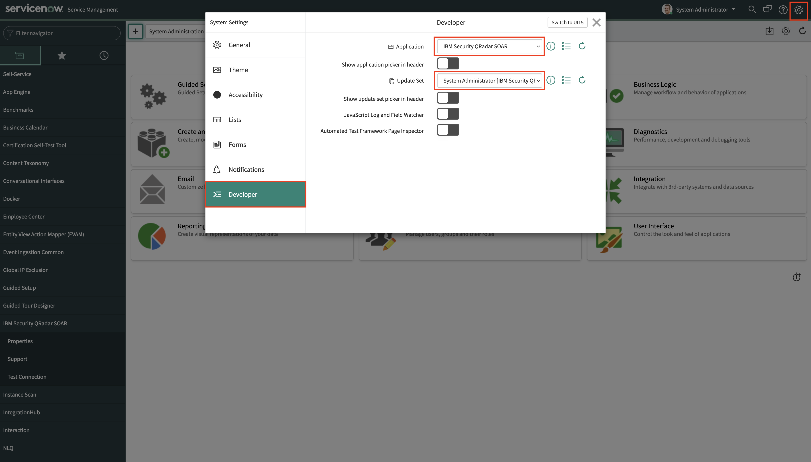
* **Close** the popup
---
### Step 2: *Create a new Workflow*
* Using the Navigation Panel, open the **Workflow Editor:**
 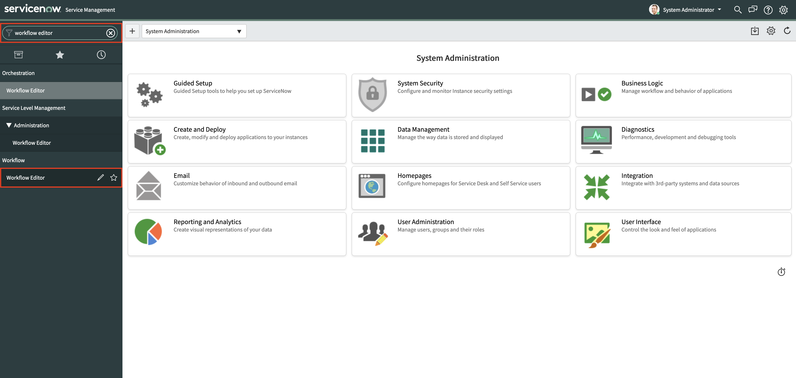
* Click **New Workflow**
* Enter the following for the Workflow's properties:
  * **Name:** CUSTOM_RES_WF_CreateIncident
  * **Table:** Incident
  * **Description:** Our custom Workflow that creates an Incident in IBM Resilient from a record in our ServiceNow Incident Table
* Ensure **if condition matches** is set to **None** in the dropdown
* Click **Submit**
 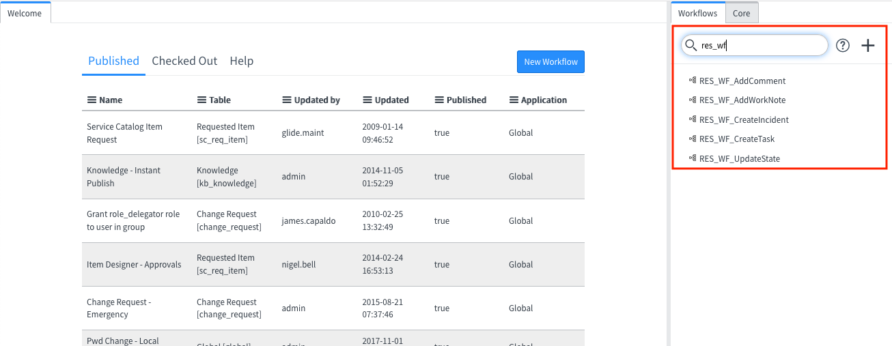

---
### Step 3: *Add a Timer to the Workflow*
* On the right-hand side of the Workflow Editor, click the **Core** Tab
* Search for **Timer**
* Click and hold the **Timer** icon then **drag** it into your Workflow
* Place it on the **black line** that joins **Begin** and **End**, until the line **turns blue**
* Then **drop** it
 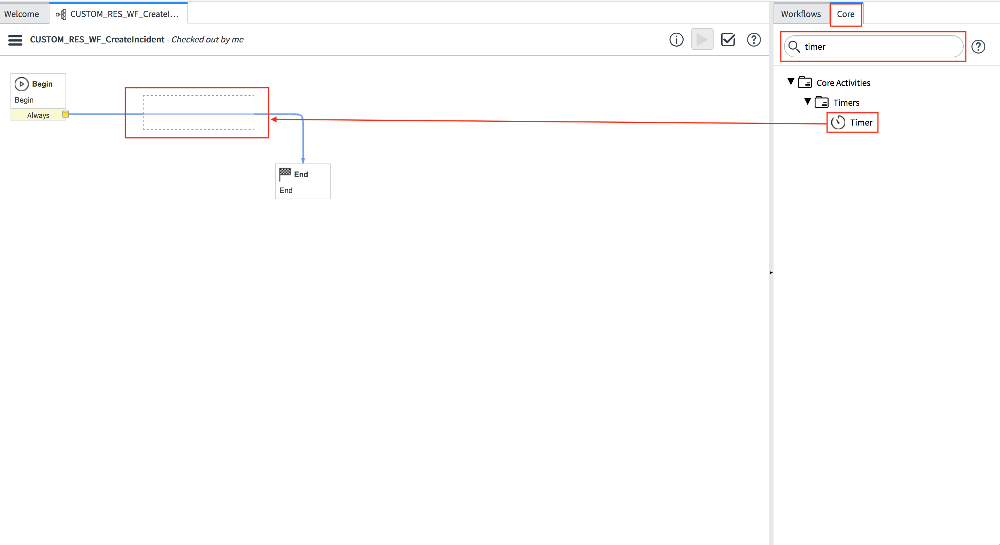
* In the **popup** that appears, enter **01** seconds (like in the screenshot below) and click **Submit**
 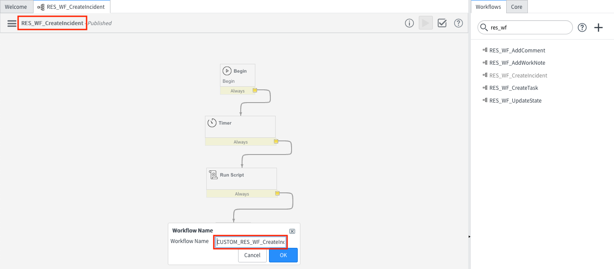
>**NOTE:** this timer is required to allow this Workflow to **run asynchronously.** Without it, this Workflow will freeze/hang the ServiceNow UI when invoked.
---
### Step 4: *Add a Run Script to the Workflow*
* Similar to the previous step, on the right-hand side of the Workflow Editor, click the **Core** Tab
* Search for **Run Script**
* Click and hold the **Run Script** icon then **drag** it into your Workflow
* Place it on the **black line** that joins **Timer** and **End**, until the line **turns blue**
* Then **drop** it
 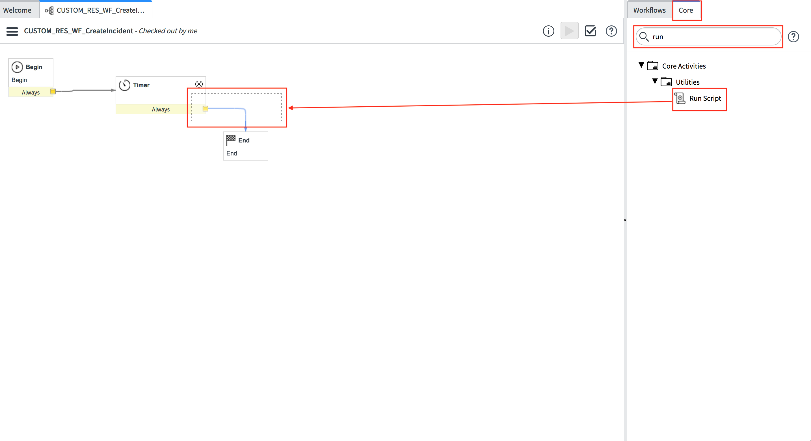
* In the **popup** that appears, copy the below script and paste it into the Script Editor:
    ```javascript
    (function RES_WF_CreateIncident(){

        var resHelper, record, snRecordId, caseName, options, resSeverityMap, res, noteText, workNotes, workNotesSplit = null;
        
        try{
            //Instantiate new ResilientHelper
            resHelper = new ResilientHelper();
            
            //Get the required parameters to create an Incident
            record = current;
            snRecordId = record.getValue("number");
            caseName = "SN: " + record.getValue("short_description") + " [" + snRecordId + "]";

            //Map ServiceNow severity in digits to Resilient strings
            //TIP: use the 'finfo' command on Resilient Integrations Server
            //to get Resilient field information
            resSeverityMap = {
                "1": "High",
                "2": "Medium",
                "3": "Low"
            };

            //Initialize options
            options = {
                initSnNote: "Created a Phishing Incident in IBM Resilient",
                optionalFields: {
                    "description": record.getValue("description"),
                    "severity_code": resSeverityMap[record.getValue("severity").toString()],
                    "incident_type_ids": ["Phishing"]
                }
            };

            // Call helper to create the Incident in Resilient
            res = resHelper.create(record, snRecordId, caseName, options);

            if (res){
                // Create the initial RES Note
                noteText = "<br>This " + res.res_reference_type + " has been sent from <b>ServiceNow</b>";
                noteText += "<br><b>ServiceNow ID:</b> " + snRecordId;
                noteText += '<br><b>ServiceNow Link:</b> <a href="'+res.snLink+'">'+res.snLink+'</a></div>';
                resHelper.addNote(res.res_reference_id, noteText, "html");
                
                // Get all Work Notes. Returns as a string where each entry is delimited by '\n\n'
                workNotes = current.work_notes.getJournalEntry(-1);

                //Split the Work Notes on '\n\n'
                workNotesSplit = workNotes.split("\n\n");

                //Loop each Work Note and add a Resilient Note
                for (var i = 0; i < workNotesSplit.length; i++){
                    noteText = workNotesSplit[i];
                    if(noteText && noteText.length > 0){
                        resHelper.addNote(res.res_reference_id, workNotesSplit[i]);
                    }
                }
            }
        }
        catch (errMsg){
            current.work_notes = "Failed to create an Incident in IBM Resilient.\nReason: " + errMsg;
            gs.error(errMsg);
        }
    })();
    ```
* Click **Submit**
 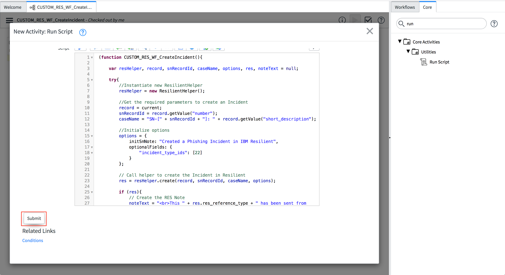
* **Tidy your Workflow,** by dragging the components around:
 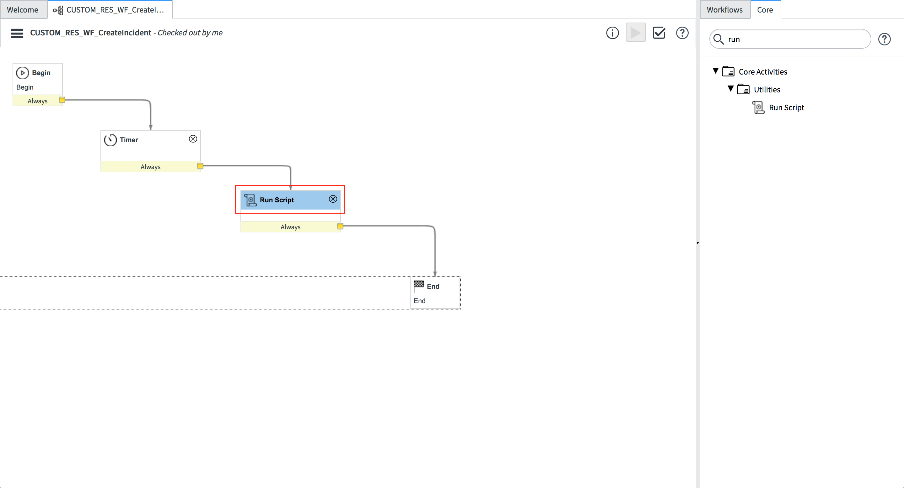
* **Publish your Workflow,** by clicking the **burger menu** then clicking **Publish**
 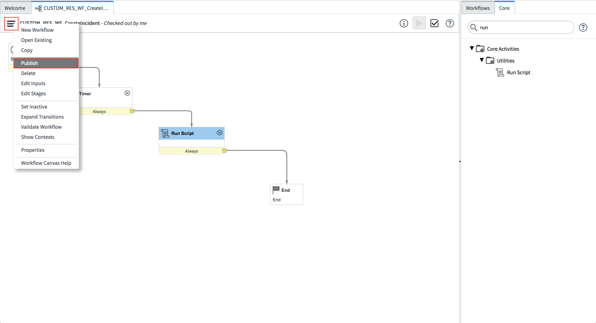
* **Close** the tab that contains the Workflow Editor
---
### Step 5: *Test Your New Custom Workflow*
* **Create a new Incident** in ServiceNow
 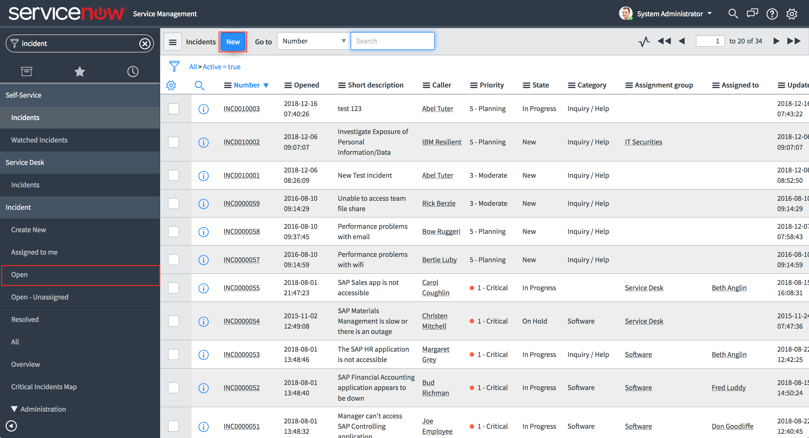
* Scroll to the end of the Incident and click the **Create Resilient Incident** UI Action
 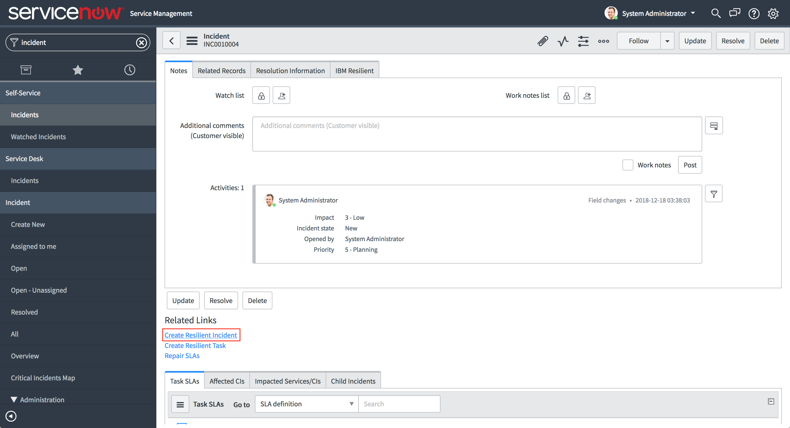
* Wait a few seconds for the **IBM Resilient fields to populate**, informing you an Incident has been created in IBM Resilient. 
 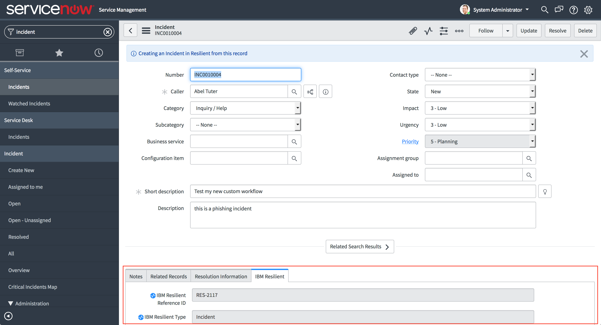
>**NOTE:** if the fields do not populate after more than 30/40 seconds after clicking the UI Action Button, check the **Application Logs** and test your connection using the **Test Connection** functionality in the IBM Resilient menu in the ServiceNow navigation panel. The logs will inform you of an connection issues or issues within your Workflow's **Run Script**
> 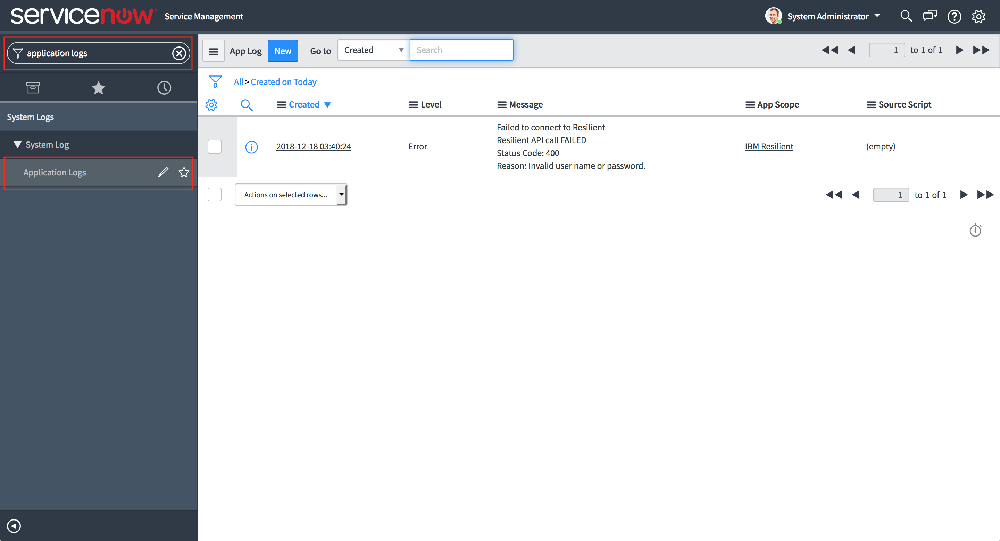
> 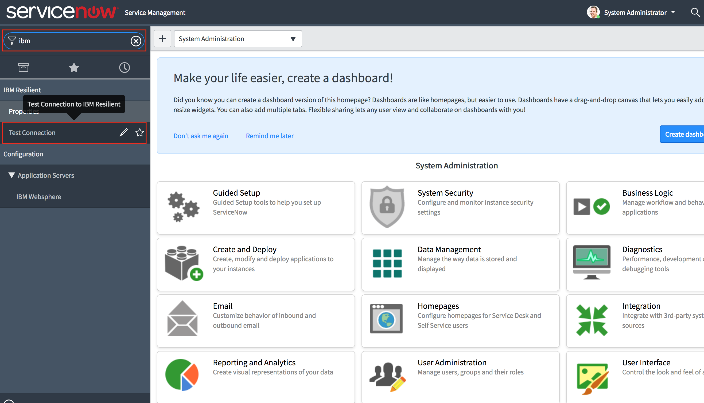

---