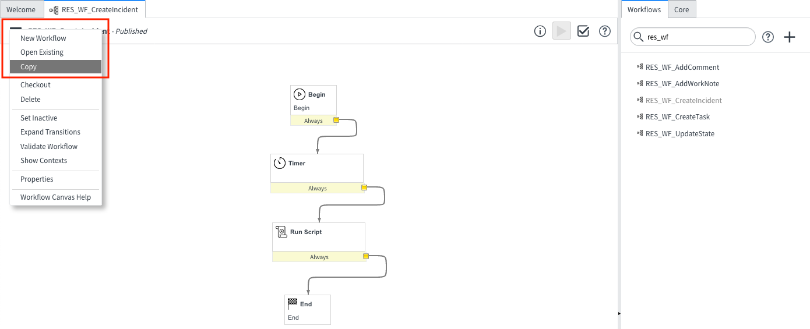

# IBM Security QRadar SOAR Platform App for ServiceNow - Customization Guide

*This guide shows how to adapt the App installed on your ServiceNow instance to suit your Incident Response Workflow*

- [Prerequisites](#prerequisites)
- [Architectural Diagram](#architectural-diagram)
- [Overview](#overview)
- [Pre-Defined ServiceNow Workflows](#pre-defined-servicenow-workflows)
- [ResilientHelper API](#resilienthelper-api)
  - [`create()`](#creategliderecord-record-string-snrecordid-string-casename-object-options)
  - [`addNote()`](#addnotestring-res_reference_id-string-notetext-string-noteformat)
  - [`updateStateInResilient()`](#updatestateinresilientstring-res_reference_id-string-snticketstate-string-snticketstatecolor)
  - [`getResilientReferenceId()`](#getresilientreferenceidgliderecord-record)
  - [`getResilientReferenceLink()`](#getresilientreferencelinkgliderecord-record)
  - [`getResilientType()`](#getresilienttypegliderecord-record)
- [Create Own Custom ServiceNow Workflow](#create-own-custom-servicenow-workflow)
  - [Step 1: *Use Correct Application Scope*](#step-1-use-correct-application-scope)
  - [Step 2: *Create a Copy of Existing RES Workflow*](#step-2-create-a-copy-of-existing-res-workflow)
  - [Step 3: *Modify the Run Script*](#step-3-modify-the-run-script)

---

## Prerequisites 
* SOAR Platform updated to at least `v31.0.0` or Cloud Pak for Security running at least `v1.9.0`.
* App Host `>= 1.6.0` or an Integration Server setup with `resilient-circuits >= 31.0.0` installed.
* All steps in the **[Installation Guide](../install_guide)** complete.
* ServiceNow Instance with ITSM enabled and running a `Kingston` or later release.
* ServiceNow user with an `admin` role.
* A basic understanding of **IBM SOAR Workflows**.
* A basic understanding of **ServiceNow Workflows**.
---

## Architectural Diagram
 

---
## Overview
When this App is installed, on your ServiceNow instance, you have access to the **ResilientHelper** class in any ServiceNow `Workflow`, `UI Action` or `Script Include`.

From the architectural diagram above, within ServiceNow, any SOAR action must start with a ServiceNow `Workflow`. ServiceNow `Workflows` are invoked from `UI Actions` or `Business Rules`.

This app comes with **4 pre-defined ServiceNow Workflows:**
1. RES_WF_CreateIncident
2. RES_WF_CreateTask
3. RES_WF_AddComment
4. RES_WF_AddWorkNote
5. RES_WF_UpdateState

The **ResilientHelper API** helps create your own ServiceNow `Workflows` that use the **ResilientHelper** class to call SOAR Actions.

---

## Pre-Defined ServiceNow Workflows
* Each of the installed 'out-of-the-box' `Workflows` contain a `Run Script`
* It is in that `Run Script` where we use the **ResilientHelper** class to invoke SOAR Actions
* Following this is the code for each **Run Script** of the pre-defined workflows
* Use this code for guidance along with the **[ResilientHelper API](#resilienthelper-api)** (below) when creating your own Custom Workflows

<details><summary>RES_WF_CreateIncident</summary>

```javascript
(function RES_WF_CreateIncident(){
	
	var resHelper, record, snRecordId, caseName, options, resSeverityMap, res, noteText, workNotes, workNotesSplit, severityMapped = null;
	
	try {
		//Instantiate new ResilientHelper
		resHelper = new ResilientHelper();
		
		//Get the required parameters to create an Incident
		record = current;
		snRecordId = record.getValue("number");
		caseName = "SN: " + record.getValue("short_description") + " [" + snRecordId + "]";

		//Map ServiceNow severity in digits to Resilient strings
		//TIP: use the 'finfo' command on Resilient Integrations Server
		//to get Resilient field information
		resSeverityMap = {
			"1": "High",
			"2": "Medium",
			"3": "Low"
		};

		severityMapped = resSeverityMap[record.getValue("severity").toString()];

		//Initialize options
		options = {
			initSnNote: "Incident created in IBM SOAR",
			optionalFields: {
				"description": record.getValue("description"),
				"severity_code": severityMapped
			}
		};

		// Call helper to create the Incident in Resilient
		res = resHelper.create(record, snRecordId, caseName, options);

		if (res) {
			// Create the initial RES Note
			noteText = "<br>This " + res.res_reference_type + " has been sent from <b>ServiceNow</b>";
			noteText += "<br><b>ServiceNow ID:</b> " + snRecordId;
			noteText += '<br><b>ServiceNow Link:</b> <a href="'+res.snLink+'">'+res.snLink+'</a></div>';
			resHelper.addNote(res.res_reference_id, noteText, "html");
			
			// Get all Work Notes. Returns as a string where each entry is delimited by '\n\n'
			workNotes = current.work_notes.getJournalEntry(-1);

			//Split the Work Notes on '\n\n'
			workNotesSplit = workNotes.split("\n\n");

			//Loop each Work Note and add a Resilient Note
			for (var i = 0; i < workNotesSplit.length; i++){
				noteText = workNotesSplit[i];
				if(noteText && noteText.length > 0){
					resHelper.addNote(res.res_reference_id, workNotesSplit[i]);
				}
			}
		}
	}
	catch (errMsg) {
		current.work_notes = "Failed to create an Incident in IBM SOAR.\nReason: " + errMsg;
		gs.error(errMsg);
	}
})();
```

</details>

<details><summary>RES_WF_CreateTask</summary>

```javascript
(function RES_WF_CreateTask(){
	
	var resHelper, record, snRecordId, caseName, incidentId, options, res, noteText, workNotes, workNotesSplit = null;

	try{
		//Instantiate new ResilientHelper
		resHelper = new ResilientHelper();
		
		//Get the required parameters to create a Task
		record = current;
		snRecordId = record.getValue("number");
		caseName = "SN: " + record.getValue("short_description") + " [" + snRecordId + "]";
		incidentId = workflow.variables.u_ibm_resilient_incident_id;
		
		//Initialize options
		options = {
			initSnNote: "Task created in IBM SOAR",
			incidentId: incidentId,
			optionalFields: {
				"instr_text": record.getValue("description")
			}
		};
			
		// Call helper to create the Incident in Resilient
		res = resHelper.create(record, snRecordId, caseName, options);
		
		if (res){
			// Create the initial RES Note
			noteText = "<br>This " + res.res_reference_type + " has been sent from <b>ServiceNow</b>";
			noteText += "<br><b>ServiceNow ID:</b> " + snRecordId;
			noteText += '<br><b>ServiceNow Link:</b> <a href="'+res.snLink+'">'+res.snLink+'</a></div>';
			resHelper.addNote(res.res_reference_id, noteText, "html");
			
			// Get all Work Notes. Returns as a string where each entry is delimited by '\n\n'
			workNotes = current.work_notes.getJournalEntry(-1);

			//Split the Work Notes on '\n\n'
			workNotesSplit = workNotes.split("\n\n");

			//Loop each Work Note and add a Resilient Note
			for (var i = 0; i < workNotesSplit.length; i++){
				noteText = workNotesSplit[i];
				if(noteText && noteText.length > 0){
					resHelper.addNote(res.res_reference_id, workNotesSplit[i]);
				}
			}
		}
	}
	catch (errMsg){
		current.work_notes = "Failed to create a Task in IBM SOAR for Incident "+incidentId+".\nReason: " + errMsg;
		gs.error(errMsg);
	}
})();
```

</details>

<details><summary>RES_WF_AddComment</summary>

```javascript
(function RES_WF_AddComment(){
	
	var resHelper, res_reference_id, noteText = null;
	
	try{
		//Instantiate new ResilientHelper
		resHelper = new ResilientHelper();
	
		//Get resilient_reference_id depending on what Table the record is in
		res_reference_id = resHelper.getResilientReferenceId(current);
		
		//Set noteText to last additional comment added
		noteText = current.comments.getJournalEntry(1);
		
		//Add a note in Resilient
		resHelper.addNote(res_reference_id, noteText);
	}
	catch (errMsg){
		current.work_notes = "Failed to add a note in IBM SOAR.\nReason: " + errMsg;
		gs.error(errMsg);
	}
})();
```

</details>

<details><summary>RES_WF_AddWorkNote</summary>

```javascript
(function RES_WF_AddWorkNote(){
	
	var resHelper, res_reference_id, noteText = null;
	
	try{
		//Instantiate new ResilientHelper
		resHelper = new ResilientHelper();
	
		//Get resilient_reference_id depending on what Table the record is in
		res_reference_id = resHelper.getResilientReferenceId(current);
		
		//Set noteText to last additional comment added
		noteText = current.work_notes.getJournalEntry(1);
		
		//Add a note in Resilient
		resHelper.addNote(res_reference_id, noteText);
	}
	catch (errMsg){
		current.work_notes = "Failed to add a note in IBM SOAR.\nReason: " + errMsg;
		gs.error(errMsg);
	}
})();
```

</details>

<details><summary>RES_WF_UpdateState</summary>

```javascript
(function RES_WF_UpdateState(){
	
	var resHelper, stateToColorMap, res_reference_id, snTicketState, snTicketStateColor, resolutionNotes = null;

	try{
		//Instantiate new resHelper
		resHelper = new ResilientHelper();
		
		//Map ServiceNow state to a color
		//Colors accepted by resHelper.updateStateInResilient() = green/orange/yellow/red
		stateToColorMap = {
			"New": "green",
			"In Progress": "orange",
			"On Hold": "yellow",
			"Resolved": "red",
			"Closed": "red",
			"Canceled": "red",

			// colors for security incidents states
			"Draft": "green",
			"Analysis": "orange",
			"Contain": "yellow",
			"Eradicate": "yellow",
			"Recover": "yellow",
			"Review": "red"
		};
		
		//Get resilient_reference_id depending on what Table the record is in
		res_reference_id = resHelper.getResilientReferenceId(current);
		snTicketState = current.state.getChoiceValue();
		
		// Try get the snTicketStateColor that matches the snTicketState
		try{
			snTicketStateColor = stateToColorMap[snTicketState];
		}
		// If it does not exist, default to green
		catch(errMsg){
			snTicketStateColor = "green";
		}
		
		//Update that status in the res datatable
		resHelper.updateStateInResilient(res_reference_id, snTicketState, snTicketStateColor);
		
		//Add a note to the resilient incident/task stating the change
		resHelper.addNote(res_reference_id, "ServiceNow Record state changed to: " + snTicketState);
		
		//Get resolution notes if there are any
		resolutionNotes = current.getValue("close_notes");
		
		//Add a note to the resilient incident/task if there are resolution notes
		if(resolutionNotes){
			resHelper.addNote(res_reference_id, resolutionNotes);
		}
	}
	catch(errMsg){
		current.work_notes = "Failed to update state in IBM SOAR.\nReason: " + errMsg;
		gs.error(errMsg);
	}
})();
```

</details>

---
## ResilientHelper API

### `create(GlideRecord record, String snRecordId, String caseName, Object options)`

* Creates an Incident/Task in SOAR.
* Sets the the following Columns in ServiceNow:
  * `x_ibmrt_resilient_ibm_resilient_reference_id` (INC) OR `x_ibmrt_resilient_ibm_soar_reference_id` (SIR).
  * `x_ibmrt_resilient_ibm_resilient_type` (INC) OR `x_ibmrt_resilient_ibm_soar_type` (SIR).
  * `x_ibmrt_resilient_ibm_resilient_reference_link` (INC) OR `x_ibmrt_resilient_ibm_soar_reference_link` (SIR).
* Adds a new row to the Data Table in SOAR.

#### Parameters:
| Name | Type | Description |
| ---- | ---- | ----------- |
| record | GlideRecord | The current ServiceNow record |
| snRecordId | String | Is the ID of the record, unique to its table. E.g. 'INC123456' |
| caseName | String | The name of the Incident/Task to create in SOAR |
| options | Object | There are 3 valid options that are all optional: `incidentId`: a String, if defined creates a Task in SOAR. `initSnNote`: a String, if defined adds it as a Work Note to the ServiceNow record. `optionalFields`: an Object, if defined takes each key/value pair and sets those fields in SOAR when creating the Incident/Task |


#### Return:
Returns an object with the following keys:

| Key | Type | Description |
| --- | ---- | ----------- |
| res_reference_id | String | Unique ID relative to the Incident/Task created in SOAR. E.g: RES-1234-100001 |
| res_reference_link | String | A link to the Incident/Task in SOAR |
| res_reference_type | String | The type of case created in SOAR. Incident/Task |
| snLink | String | A link to the ServiceNow Record |

---

### `addNote(String res_reference_id, String noteText, String noteFormat)`

* Creates a note in SOAR.

#### Parameters:
| Name | Type | Description |
| ---- | ---- | ----------- |
| res_reference_id | String | Unique ID relative to the Incident/Task created in IBM SOAR. E.g: RES-1234-100001 |
| noteText | String | The text of the note |
| noteFormat | String | Format of the note to create. Can be `text`/`html`. Use `html` if you want to create a RichText note in IBM SOAR |

#### Return:
*Does not return anything*.

---

### `updateStateInResilient(String res_reference_id, String snTicketState, String snTicketStateColor)`

* Updates the `servicenow_status` column in the Data Table in IBM SOAR with the `snTicketState`.

#### Parameters:
| Name | Type | Description |
| ---- | ---- | ----------- |
| res_reference_id | String | Unique ID relative to the Incident/Task created in IBM SOAR. E.g: RES-1234-100001 |
| snTicketState | String | The current state of the record. E.g.: 'In Progress' |
| snTicketStateColor | String | Accepted values: `"green"`, `"orange"`, `"yellow"`, `"red"` or `null` |

#### Return:
*Does not return anything*.

---

### `getResilientReferenceId(GlideRecord record)`

* Gets the IBM SOAR Reference ID for a linked record.

#### Parameters:
| Name | Type | Description |
| ---- | ---- | ----------- |
| record | `GlideRecord` | `GlideRecord` object of the current table record (usually this is `current` in Workflows) |

#### Returns:
*A string containing the Reference ID of the SOAR record*.

---

### `getResilientReferenceLink(GlideRecord record)`

* Gets the SOAR Reference Link to directly access the record in SOAR.

#### Parameters:
| Name | Type | Description |
| ---- | ---- | ----------- |
| record | `GlideRecord` | `GlideRecord` object of the current table record (usually this is `current` in Workflows) |

#### Returns:
*A string containing the URL link of the SOAR record*.

---

### `getResilientType(GlideRecord record)`

* Gets the SOAR Type for a linked record (i.e. "Incident" or "Task").

#### Parameters:
| Name | Type | Description |
| ---- | ---- | ----------- |
| record | `GlideRecord` | `GlideRecord` object of the current table record (usually this is `current` in Workflows) |

#### Returns:
*A string containing either "Task" or "Incident" indicating the type of record linked in SOAR*.

---
## Create Own Custom ServiceNow Workflow

* A Custom Workflow can be created to *overwrite* the above pre-defined workflows.
* To have your custom workflow be invoked instead of a pre-defined workflow, use must use the **correct naming convention**.
* For example, to overwrite the Add Comment workflow, you would create a workflow with the name: **CUSTOM_RES_WF_AddComment**.
* Follow the steps below as a **guide to create your own Custom Workflow**.

### Step 1: *Use Correct Application Scope*
* In ServiceNow, click the **gear icon** in the top right corner.
* Click **Developer** in the menu.
* Ensure:
  * **Application:** IBM Security QRadar SOAR.
  * **Update Set:** Default [IBM Security QRadar SOAR].
 
* **Close** the popup.
---
### Step 2: *Create a Copy of Existing RES Workflow*
* Using the Navigation Panel, open the **Workflow Editor**:
 
* On the right-hand side of the Workflow Editor, search for **res_wf**:
 
* Click the Workflow you want to *overwrite*. The Workflow opens.
* Click the **Burger Menu** on the top left and then **Copy**:
 
* In the popup enter the Workflow Name. Ensure you use the **correct naming convention:** `CUSTOM_<original_workflow_name>`:
 
* Click **OK**.

---

### Step 3: *Modify the Run Script*
* Double click the **Run Script**:
 
* In the **popup** that appears, copy the below script and paste it into the Script Editor:
    ```javascript
    (function RES_WF_CreateIncident(){

        var resHelper, record, snRecordId, caseName, options, resSeverityMap, res, noteText, workNotes, workNotesSplit, severityMapped = null;
        
        try {
            //Instantiate new ResilientHelper
            resHelper = new ResilientHelper();
            
            //Get the required parameters to create an Incident
            record = current;
            snRecordId = record.getValue("number");
            caseName = "SN: " + record.getValue("short_description") + " [" + snRecordId + "]";

            //Map ServiceNow severity in digits to Resilient strings
            //TIP: use the 'finfo' command on Resilient Integrations Server
            //to get Resilient field information
            resSeverityMap = {
                "1": "High",
                "2": "Medium",
                "3": "Low"
            };

            severityMapped = resSeverityMap[record.getValue("severity").toString()];

            //Initialize options
            options = {
                initSnNote: "Incident created in IBM SOAR",
                optionalFields: {
                    "description": record.getValue("description"),
                    "severity_code": severityMapped
                }
            };

            // Call helper to create the Incident in Resilient
            res = resHelper.create(record, snRecordId, caseName, options);

            if (res) {
                // Create the initial RES Note
                noteText = "<br>This " + res.res_reference_type + " has been sent from <b>ServiceNow</b>";
                noteText += "<br><b>ServiceNow ID:</b> " + snRecordId;
                noteText += '<br><b>ServiceNow Link:</b> <a href="'+res.snLink+'">'+res.snLink+'</a></div>';
                resHelper.addNote(res.res_reference_id, noteText, "html");
                
                // Get all Work Notes. Returns as a string where each entry is delimited by '\n\n'
                workNotes = current.work_notes.getJournalEntry(-1);

                //Split the Work Notes on '\n\n'
                workNotesSplit = workNotes.split("\n\n");

                //Loop each Work Note and add a Resilient Note
                for (var i = 0; i < workNotesSplit.length; i++){
                    noteText = workNotesSplit[i];
                    if(noteText && noteText.length > 0){
                        resHelper.addNote(res.res_reference_id, workNotesSplit[i]);
                    }
                }
            }
        }
        catch (errMsg) {
            current.work_notes = "Failed to create an Incident in IBM SOAR.\nReason: " + errMsg;
            gs.error(errMsg);
        }
    })();
    ```
* Edit the workflow script as fits your needs.
* Click **Submit**.
* **Publish your Workflow,** by clicking the **burger menu** then clicking **Publish**:
 
* **Close** the tab that contains the Workflow Editor.
---