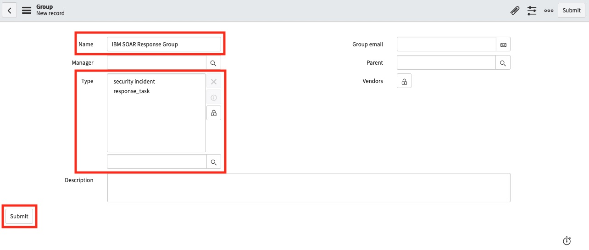

# Installation Guide for ServiceNow App

## Table of Contents
  - [Prerequisites](#prerequisites)
  - [Step 1: *Install ServiceNow IBM SOAR App*](#step-1-install-servicenow-ibm-soar-app)
  - [Step 2: *Create a User in ServiceNow and assign it the correct Role*](#step-2-create-a-user-in-servicenow-and-assign-it-the-correct-role)
  - [Step 3: *Create a User on the SOAR Platform*](#step-3-create-an-api-key-on-the-soar-platform)
  - [Step 4: *Enter IBM SOAR Configurations in ServiceNow*](#step-4-enter-ibm-soar-configurations)
  - [Step 5: *Download & Install fn_service_now App*](#step-5-download--install-fn_service_now-app)
  - [Step 6: *Install and Configure ServiceNow Mid-Server (if needed)*](#step-6-install-and-configure-servicenow-mid-server-if-needed)
  - [Step 7: *Give your ServiceNow users the correct Role*](#step-7-give-your-servicenow-users-the-correct-role)
  - [Step 8: Security Incident Response (SIR) Configurations](#step-8-security-incident-response-sir-configurations)
    - [Configure `ServiceNowAllowedTableNames` (SIR only)](#configure-servicenowallowedtablenames-sir-only)
    - [Add IBM SOAR tab to Security Incident UI (SIR only)](#add-ibm-soar-tab-to-security-incident-ui-sir-only)
    - [Automatic escalation on group assignment (SIR only)](#sync-to-soar-automatically-on-group-assignment-sir-only)
  - [Step 9: *Test*](#step-9-test)
---

## Prerequisites 
* ServiceNow Instance with ITSM enabled and running `Kingston` or newer releases
* Access to the `Incident Table` in ServiceNow
* A user in ServiceNow with an `admin` role
* IBM Cloud Pak for Security `>= 1.9.0` *or* IBM SOAR `>= v31.0.0`
* An App Host >= `v1.0.0` or an Integrations Server running `resilient-circuits >= v31.0.0`.
  > - To setup an App Host see: [ibm.biz/res-app-host-setup](https://ibm.biz/res-app-host-setup)
  > - To setup an Integration Server see: [ibm.biz/res-int-server-guide](https://ibm.biz/res-int-server-guide)
* If SOAR instance is not publicly accessible (behind a firewall), a `ServiceNow MID Server` is required
* If you want to integrate with ServiceNow Security Incident Response (SIR), make sure to install it first
- `fn_service_now >= v1.0.0` installed, which you can download from our [App Exchange](http://ibm.biz/get-ibm-resilient-service-now-integration)
  - If integrating with SIR, `fn_service_now >= v2.0.0` is required
---

## Step 1: *Install ServiceNow IBM SOAR App*
* Go to the [ServiceNow Store](http://ibm.biz/get-ibm-resilient-service-now-app).
* Login with your **ServiceNow Credentials**.
* Look for **IBM Security QRadar SOAR**.
* Click **more**. A new page opens.
* On the top-right, click **Get** and follow the on-screen instructions to install the app on your ServiceNow instance.
* Log in to your ServiceNow instance with a user that has an **admin** role.
* Look for the **IBM SOAR** menu in the navigation panel.
 
* If you see it, the app installed successfully.
---

## Step 2: *Create a User in ServiceNow and assign it the correct Role*
* In ServiceNow, go to the **Users Table** and click **New**.
 
* Enter the following:
  * **User ID:** `ibmresilient`
  * **First Name:** IBM
  * **Last Name:** SOAR
  * **Password:** #########
  * **Email:** `ibm_resilient_integration@example.com`
* Set the **Timezone** to the same timezone of your SOAR Platform.
 
* Click **Submit.**
* Still in the users table, search and open the user you just created.
* Scroll down. Under **Roles**, click **Edit**.
* Give the user the `x_ibmrt_resilient.integrator` role.
 
* **(SIR ONLY)** If integrating with ServiceNow Security Incident Response (SIR) tables, you need to add the `sn_si.integration_user` role to the user as well.
* Click **Save.**
---

## Step 3: *Create an API Key on the SOAR Platform*
> If not using API Key authentication, follow instructions in [Step 3.1](#step-31-only-if-not-using-api-key-create-a-user-on-the-soar-platform).
* Get the SOAR Organization name you want to use this app with. In CP4S this is a UUID.
* In the SOAR UI, navigate to **Administrator Settings** > **Users** > **API Keys**.
  * In CP4S, this is located under the **hamburger menu** on the left > **Application Settings** > **Case Management** > **Permissions and access** > **Users** > **API Keys**.
  * For CP4S you will also need to find the REST endpoint of your instance. This is usually `cases-rest.<cp4s_host_url>` but it can be customized.
* Create a new API Key with permissions for all **Incidents and Tasks** and save the Key ID and Key Secret. You will need this information for [Step 4](#step-4-enter-ibm-soar-configurations).

> ## *Step 3.1: (Only if not using API Key) Create a User on the SOAR Platform*
> * SSH into your SOAR Platform.
> * Insert your Organization name in the command below and run it:
>   ```
>   $ sudo resutil newuser -org "<org-name>" -email snow_integration@example.com -first "SNOW" -last "Integration"
>   ```
> * You can use any email address you desire.
> * This creates a new user in that Organization with the following attributes:
>   * **First Name:** SNOW
>   * **Last Name:** Integration
>   * **Email:** `snow_integration@example.com`
--- 

## Step 4: *Enter IBM SOAR Configurations*
* In ServiceNow, look for the **IBM Security QRadar SOAR** menu in the navigation panel.
 
* Click **Properties.** A new tab opens.
  
* Enter your configurations:

  | Config | Required | Description |
  | ------ | :------: | ----------- |
  | SOAR Host | Yes | The Hostname or IP address of your SOAR Platform, **relative to your ServiceNow Instance**, but **if you use a MID Server, it is relative to the MID Server** *(See  Step 6 on setting up your Mid-Server).* |
  | SOAR Organization | Yes | The Org Name you used in **Step 3.** Note that for CP4S this is a UUID |
  | API Key ID | Yes | The API Key ID you created in **Step 3.** This is required if authenticating to CP4S. Must include at least all **Incident** and **Task** permissions |
  | API Key Secret | Yes | The API Key Secret you created in **Step 3** |
  | Email Address | No | (Required if not using API Key) The Email Address you used in **Step 3.1** |
  | Password | No | (Required if not using API Key) The Password you used in **Step 3.1** |
  | ServiceNow Username | Yes | The **User ID** you entered in **Step 2** |
  | ServiceNow MID Server Name | No | The MID Server to use with this App or leave blank if not using a MID Server |
  | Configure with CP4S? | Yes | Defaults to **No**. Should be changed to **Yes** if you are conencting to a Cloud Pak for Security instance |
  | CP4S Rest URL | No | (Required if configuring with CP4S) The rest URL of the CP4S instance. Usually this is `cases-rest.<host_name>` but sometimes it is a custom prefix. |
  | ServiceNowAllowedTableNames | Yes | A CSV list of all the **Table Names** in ServiceNow IBM SOAR is allowed to integrate with. *Out-of-the-box this app requires access to the `incident`, `sys_user` and `sys_user_group` tables.* For integrating with ServiceNow Security Incident Response (SIR) this app requires `sn_si_incident` and `sn_si_task` |
  | IBM SOAR Assignment Group Names | No | A CSV list of assignment groups that, upon assignment on a SIR incident, will automatically sync the security incident or task to SOAR |
  | Logging Verbosity | Yes | Defaults to **error**. Can be changed to **debug** if needed later. |
  | Logging Destination | Yes | Defaults to **db** (which will print any error logs to the Application Logs Table). Can be changed to **file** if needed later. |

* Click **Save.** You should see a **Properties updated** banner at the top of the page if the save was successful.
* **Close** the tab.
---

## Step 5: *Download & Install fn_service_now App*
You can run this app on either App Host (recommended) or an Integration Server. 

### Download & Install on App Host
* To install or uninstall an App or Integration on the _IBM SOAR platform_, see the documentation at [ibm.biz/resilient-docs](https://ibm.biz/resilient-docs).
* To install or uninstall an App on _IBM Cloud Pak for Security_, see the documentation at [ibm.biz/cp4s-docs](https://ibm.biz/cp4s-docs) and follow the instructions above to navigate to Orchestration and Automation.

### Download & Install on Integration Server
* Download the  app-fn_service_now.zip from our [App Exchange](http://ibm.biz/get-ibm-resilient-service-now-integration).
* Copy the .zip to your Integrations Server and SSH into it.
* **Unzip** the package:
  ```
  $ unzip app-fn_service_now-x.x.x.zip
  ```
* **Install** the package:
  ```
  $ pip install fn_service_now-x.x.x.tar.gz
  ```
* Import the **configurations** into your app.config file:
  ```
  $ resilient-circuits config -u
  ```
* Import the fn-service-now **customizations** into the SOAR Platform:
  ```
  $ resilient-circuits customize -y -l fn-service-now
  ```
* Open the config file, scroll to the bottom and **edit your ServiceNow credentials.** The details of which are described in the table below.
* **Save** and **Close** the app.config file.
* **Test** your Connection to ServiceNow:
  ```
  $ resilient-circuits selftest -l fn-service-now
  ```
    

* **Run** resilient-circuits:
  ```
  $ resilient-circuits run
  ```

### App Configuration:
The following table describes the settings you need to configure the App. If using App Host, see the SOAR System Administrator Guide. If using the integration server, you must update the app.config file.

| Config | Required | Description |
| ------ | :------: | ----------- |
| sn_host | Yes | Host to access your ServiceNow Instance, such as `https://instance.service-now.com` |
| sn_api_uri | Yes | URI for the custom APIs that are exposed by your ServiceNow Instance. Default is: `/api/x_ibmrt_resilient/api`. If you decide to implement your own endpoints, you would change this URI. |
| sn_table_name | Yes | Name of the ServiceNow Table. It is where Incidents and Tasks from SOAR are created and synced. The app supports the Incident table and Security Incident table in ServiceNow (only one table is supported at a time). |
| sn_username | Yes | The **User ID** from **Step 2.** |
| sn_password | Yes | The **Password** from **Step 2.** |


### Custom Layouts
Once the App is installed, you need to import the custom layouts. To do this:
* Go to **Customization Settings** > **Layouts** > **Incident Tabs** > **Summary Section**.
* Under **Fields**, search for **snow**.
* Drag the two **SNOW Fields** into the **Summary Section** as per the screenshot below:
  
* Click **Save**.
* In the same view, click **Add Tab**.
* In the popup modal, enter **ServiceNow** and click **Add**.
* Click the new **ServiceNow** tab, drag in the **ServiceNow Records** Data Table and click **Save**:
  
--- 

## Step 6: *Install and Configure ServiceNow MID Server (if needed)*
A ServiceNow MID Server is needed if your SOAR instance is not directly accessible from your ServiceNow instance. If using a MID Server, verify the following:
  * The ServiceNow MID Server must be setup on the same network as your SOAR Platform and App Host.
  * The SOAR Host Address you input in **Step 4** must be relevant to and accessible from your MID Server.

The ports for communication between SOAR, the Integration Server and the MID Server are:

* MID Server => SOAR 443
* SOAR => Integration Server 65001
* App Host/Integration Server => SOAR 65001, 443

If not already installed:
* Type **mid server** into your ServiceNow search box and click **Installation Instructions.**
  

Once **installed** and **validated:**
* In ServiceNow, go to your List of MID Servers.
  
* Copy the **Name** of the MID Server.
* In the Navigation Panel, open **IBM Security QRadar SOAR Properties**.
  
* Paste the name into the **ServiceNow MID Server Name** field.
* Click **Save.**
--- 

## Step 7: *Give your ServiceNow users the correct Role*
* For a ServiceNow user to have the permission to escalate an Incident to IBM SOAR, they must be explicitly given the correct role.
* In ServiceNow, go to the **Users Table** and select the user.
* Scroll down. Under **Roles**, click **Edit**:
 
* Give the user the `x_ibmrt_resilient.user` role:
 
* Click **Save**.
---

## Step 8: Security Incident Response (SIR) Configurations
ServiceNow SecOps module offers the Security Incident Response (SIR) add-on. The IBM SOAR app is configured to work with the SIR tables, however, they require a few extra manual configurations.

### Configure `ServiceNowAllowedTableNames` (SIR only)
* In ServiceNow, look for the **IBM Security QRadar SOAR** menu in the navigation panel.
 
* Click **Properties.** A new tab opens.
  

### Add IBM SOAR tab to Security Incident UI (SIR only)
> *Note: the app is fully supported only when using the Security Incident "Classic UI".*

If integrating with SIR related tables, you need to configure the Security Incident table:
* Open or create a new Security Incident.
* Right click in the top of the form or click the hamburger bar then go to **Configure** > **Form Design**.
  
* Create a new section named **IBM SOAR** with one column.
  
* Drag the three IBM SOAR properties from the **Fields** section on the left to the new section.
  
* Click **Save**.
---

## Sync to SOAR automatically on group assignment (SIR only)
When integrating with SIR tables, there is a parameter that can be set in the IBM Security QRadar SOAR Properties section for automatic escalation to SOAR on group assignment. This is most useful for Security Response Tasks but can also be used on the parent Security Incident table.

By default, this app includes the "IBM SOAR Response Group" but that needs to be created.
* In ServiceNow, in the navigation panel, go to **Security Incidents** > **Groups**.
* Create a new group.
  
* Name the new group IBM SOAR Response Group (or whatever name you have included in the CSV list in IBM properties).
* Give the new group the types `security incident` and `response_task`.
  
* Click **Submit**.
* Similarly to as in [Step 7](#step-7-give-your-servicenow-users-the-correct-role), give any user except the user that was created in Step 7 the role `sn_si.analyst` and add them to the response group you created above.
---

## Step 9: *Test*
* In ServiceNow, in the navigation panel, go to **IBM SOAR > Test Connection**. A **new tab** opens.
* Click the blue **Test Connection** button and wait until you see a page banner.
* The **page banner** informs you if your Test was successful or not and print any errors you may have.
  
* If your test was successful, we can now do a test of the functionality of the app.
* **Login** to ServiceNow with a user that has the `x_ibmrt_resilient.admin` or `x_ibmrt_resilient.user` role
* Go to the **Incident Table**
  
* Create a **New Incident** and **Save** it
* Open the incident you just created and **scroll to the bottom**
* Click **Create SOAR Incident**
  
* Click the **IBM SOAR** tab
  
* Once the incident has been created in SOAR, these fields will be populated
  >**NOTE:** This can take up to 20 seconds. If nothing appears after that time, **view the logs**
  > 
  > To view the Application Logs in ServiceNow:
  > * In the navigation panel, go to **System Logs > System Log > Application Logs**

* Log in to your SOAR Platform and see if it created successfully
* Open the incident that was created
* Send the **default task** to ServiceNow by clicking the Action Status button:
  
* Fill out the Activity Inputs and click **Execute**:
  
* If successful, open the ServiceNow tab on the incident and make sure the new task is in the table
  
---
