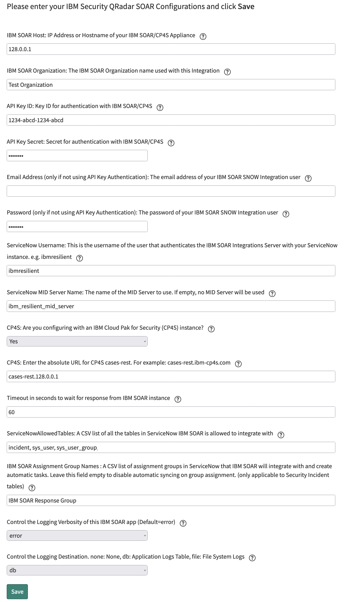
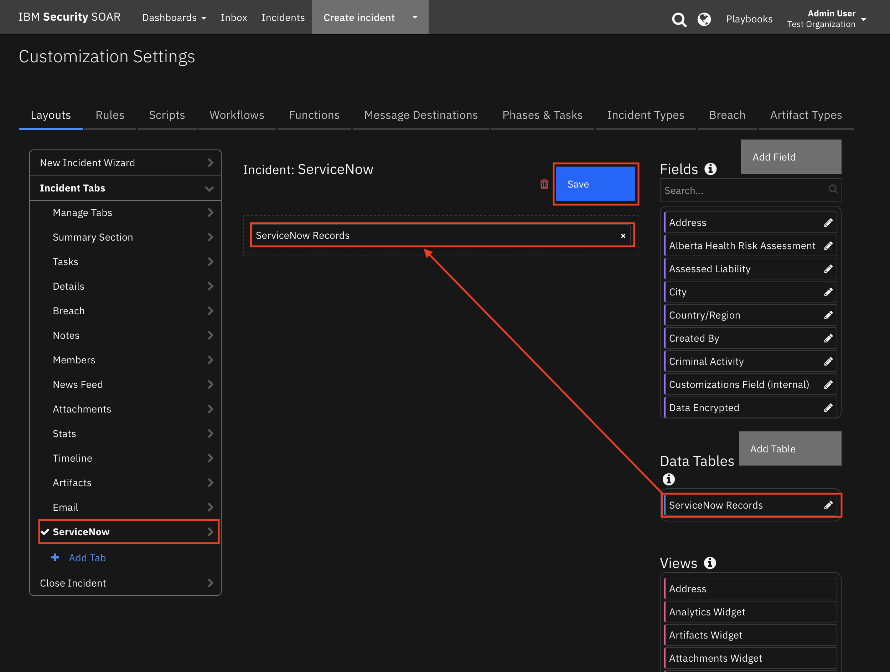

# Installation Guide for ServiceNow Integration

## Table of Contents
  - [Prerequisites](#prerequisites)
  - [Step 1: *Create a User on the Resilient Appliance*](#step-1-create-a-user-on-the-resilient-appliance)
  - [Step 2: *Install ServiceNow IBM Resilient App*](#step-2-install-servicenow-ibm-resilient-app)
  - [Step 3: *Create a User in ServiceNow and assign it the correct Role*](#step-3-create-a-user-in-servicenow-and-assign-it-the-correct-role)
  - [Step 4: *Enter IBM Resilient Configurations*](#step-4-enter-ibm-resilient-configurations)
  - [Step 5: *Download & Install fn_service_now Integration*](#step-5-download--install-fnservicenow-integration)
  - [Step 6: *Install and Configure ServiceNow Mid-Server (if needed)*](#step-6-install-and-configure-servicenow-mid-server-if-needed)
  - [Step 7: *Give your ServiceNow users the correct Role*](#step-7-give-your-servicenow-users-the-correct-role)
  - [Step 8: *Test*](#step-8-test)
---

## Prerequisites 
* ServiceNow Instance with ITSM enabled and running a `Kingston`, `London` or `Madrid` release
* Access to the `Incident Table` in ServiceNow
* A user in ServiceNow with an `admin` role
* IBM Resilient >= `v31.0.0`
* An Integrations Server running `resilient-circuits >= v31.0.0`
* If IBM Resilient is not publicly accessible (behind a firewall) a `ServiceNow MID Server` is required

---

## Step 1: *Create a User on the Resilient Appliance*
* Get the Resilient Organization name you want to use this integration with.
* SSH into your Resilient Appliance.
* Insert your Organization name in the command below and run it:
  ```
  $ sudo resutil newuser -org "<org-name>" -email snow_integration@example.com -first "SNOW" -last "Integration"
  ```
* You can use any email address you desire
* This creates a new user in that Organization with the following attributes:
  * **First Name:** SNOW
  * **Last Name:** Integration
  * **Email:** snow_integration@example.com
--- 

## Step 2: *Install ServiceNow IBM Resilient App*
* Go to the [ServiceNow Store](http://ibm.biz/get-ibm-resilient-service-now-app)
* Login with your **ServiceNow HI Credentials**.
* Look for **IBM Resilient**.
* Click **more,** a new page opens.
* On the top-right click **Get** and follow the on screen instructions to install the app on your ServiceNow instance.
* Log in to your ServiceNow instance with a user that has an **admin** role.
* Look for the **IBM Resilient** menu in the navigation panel.
 
* If you see it, the app installed successfully.
---

## Step 3: *Create a User in ServiceNow and assign it the correct Role*
* In ServiceNow, go to the **Users Table** and click **New**
 
* Enter the following:
  * **User ID:** ibmresilient
  * **First Name:** IBM
  * **Last Name:** Resilient
  * **Password:** #########
  * **Email:** ibm_resilient_integration@example.com
* Set the **Timezone** to the same timezone of your Resilient Integrations Server.
 
* Click **Submit.**
* Still in the users table, search and open the user you just created.
 
* Scroll down. Under **Roles**, click **Edit**
* Give the user the `x_ibmrt_resilient.integrator` role.
 
* Click **Save.**
---

## Step 4: *Enter IBM Resilient Configurations*
* In ServiceNow, look for the **IBM Resilient** menu in the navigation panel.
 
* Click **Properties.** A new tab opens.
  
* Enter your configurations:

  | Config | Required | Description |
  | ------ | :------: | ----------- |
  | Resilient Host | Yes | The Hostname or IP address of your Resilient Appliance, **relative to your ServiceNow Instance**, but **if you use a MID Server, it is relative to the MID Server** *(See  Step 6 on setting up your Mid-Server).* |
  | Resilient Organization | Yes | The Org Name you used in **Step 1.** |
  | Email Address | Yes | The Email Address you used in **Step 1.** |
  | Password | Yes | The Password you used in **Step 1.** |
  | ServiceNow Username | Yes | The **User ID** you entered in **Step 3.** |
  | ServiceNow MID Server Name | No | The MID Server to use with this Integration or leave blank if not using a MID Server |
  | ServiceNowAllowedTableNames | Yes | is a CSV list of all the **Table Names** in ServiceNow IBM Resilient is allowed to integrate with. *Out-of-the-box this integration requires access to the `incident`, `sys_user` and `sys_user_group` tables.* |
  | Logging Verbosity | Yes | Defaults to **error**. Can be changed to **debug** if needed later. |
  | Logging Destination | Yes | Defaults to **db** (which will print any error logs to the Application Logs Table). Can be changed to **file** if needed later. |

* Click **Save.** You should see a **Properties updated** banner at the top of the page if the save was successful.
* **Close** the tab.
---

## Step 5: *Download & Install fn_service_now Integration*
* Download fn_service_now.zip from our [App Exchange](http://ibm.biz/get-ibm-resilient-service-now-integration)
* Copy the .zip to your Integrations Server and SSH into it.
* **Unzip** the package:
  ```
  $ unzip fn_service_now-x.x.x.zip
  ```
* **Install** the package:
  ```
  $ pip install fn_service_now-x.x.x.tar.gz
  ```
* Import the **configurations** into your app.config file:
  ```
  $ resilient-circuits config -u
  ```
* Import the fn-service-now **customizations** into the Resilient Appliance:
  ```
  $ resilient-circuits customize -y -l fn-service-now
  ```
* Open the config file, scroll to the bottom and **edit your ServiceNow credentials**:
  ```
  $ nano ~/.resilient/app.config
  ```
  | Config | Required | Description |
  | ------ | :------: | ----------- |
  | sn_host | Yes | The host you use to access your ServiceNow Instance. E.g: `https://instance.service-now.com` |
  | sn_api_uri | Yes | This is the URI for the custom APIs that get exposed by your ServiceNow Instance when you install the app. Generally left as its default setting: `/api/x_ibmrt_resilient/api`. If you decide to implement your own endpoints, you would change this URI. |
  | sn_table_name | Yes | This is the name of the Table in ServiceNow to Integrate with. It is where any Incidents/Tasks from Resilient will be created and synced. **NOTE:** *currently this version (v1.0.1) only supports the **Incident table** in ServiceNow* |
  | sn_username | Yes | The **User ID** from **Step 3.** |
  | sn_password | Yes | The **Password** from **Step 3.** |

* **Save** and **Close** the app.config file.
* **Test** your Connection to ServiceNow:
  ```
  $ resilient-circuits selftest -l fn-service-now
  ```
    

* **Run** resilient-circuits:
  ```
  $ resilient-circuits run
  ```
* **Login** to the Resilient Appliance and select the Organization used in Step 1
* Go to **Customization Settings** > **Layouts** > **Incident Tabs** > **Summary Section**
* Under **Fields**, search for **snow**
* Drag the two **SNOW Fields** into the **Summary Section** as per the screenshot below
  
* Click **Save**
* In the same view, click **Add Tab**
* In the popup modal, enter **ServiceNow** and click **Add**
  
* Click the **ServiceNow** tab, drag in the **ServiceNow Records** Data Table and click **Save**
  
--- 

## Step 6: *Install and Configure ServiceNow MID Server (if needed)*
A ServiceNow MID Server is needed if your Resilient instance is not directly accessible from your ServiceNow instance. If using a MID Server, verify the following:
  * The ServiceNow MID Server must be setup on the same network as your Resilient Appliance.
  * The Resilient Host Address you input in **Step 4** must be relevant to and accessible from your MID Server.

If not already installed:
* Type **mid server** into your ServiceNow search box and click **Installation Instructions.**
  

Once **installed** and **validated:**
* In ServiceNow, go to your List of MID Servers.
  
* Copy the **Name** of the MID Server you will be using with IBM Resilient.
* In the Navigation Panel, open **IBM Resilient Properties**.
  
* Paste the name into the **ServiceNow MID Server Name** field.
* Click **Save.**
--- 

## Step 7: *Give your ServiceNow users the correct Role*
* For a ServiceNow user to have the permission to escalate an Incident to IBM Resilient, they must be explicitly given the correct role
* In ServiceNow, go to the **Users Table** and open the user you want to give the permissions to
* Scroll down. Under **Roles**, click **Edit**
 
* Give the user the `x_ibmrt_resilient.user` role
 
* Click **Save**
---

## Step 8: *Test*
* In ServiceNow, in the navigation panel, go to **IBM Resilient > Test Connection**
* A **new tab** opens
* Click the green **Test Connection** button and wait until you see a page banner
* The **page banner** will inform you if your Test was successful or not and print any errors you may have
  
* If your test was successful, we can now do a **real test!**
* **Login** to ServiceNow with a user that has the `x_ibmrt_resilient.admin` or `x_ibmrt_resilient.user` role
* Go to the **Incident Table**
  
* Create a **New Incident** and **Save** it
* Open the incident you just created and **scroll to the bottom**
* Click **Create Resilient Incident**
  
* Click the **IBM Resilient** tab
  
* Once the incident has been created in Resilient, these fields will be populated
  >**NOTE:** this can take up to 20 seconds. If nothing appears after that time, **view the logs**
  > 
  > To view the Application Logs in ServiceNow:
  > * In the navigation panel, go to **System Logs > System Log > Application Logs**
  >  

* Sign into your Resilient Appliance and see if it created successfully
* Open the incident that was created
* Send the **default task** to ServiceNow by clicking the Action Status button:
  
* Then fill out the Activity Inputs and click **Execute**:
  
* If successful, a **Note** was added to the Task
  
---
