# IBM Resilient Integration for ServiceNow - Installation Guide *(Pre-Certification Process)*
**Please note that this guide has been created prior to the ServiceNow certification. Once we have completed that process, this guide will be refactored accordingly**

---

## Prerequisites 
* Resilient Appliance updated to at least `v31.0.0`
* An Integrations Server setup with `resilient-circuits >= 30.0.111` installed
---

## Step 1: *Create a User on the Resilient Appliance*
* Get the Organization name you want to use this integration with
* SSH into your Resilient Appliance, insert your Organization name in the command below and run it:
  ```
  $ sudo resutil newuser -org "<org-name>" -email snow_integration@example.com -first "SNOW" -last "Integration"
  ```
* This creates a user with the following attributes:
  * **First Name:** SNOW
  * **Last Name:** Integration
  * **Email:** snow_integration@example.com
--- 

## Step 2: *Get IBM Resilient ServiceNow App from GitLab*
***NOTE: this is temporary and will be replaced by an App on the ServiceNow App Store shortly***
* Login to your ServiceNow instance with a user that has an **admin role**
* In the navigation panel on the left, go to **System Applications > Studio**
 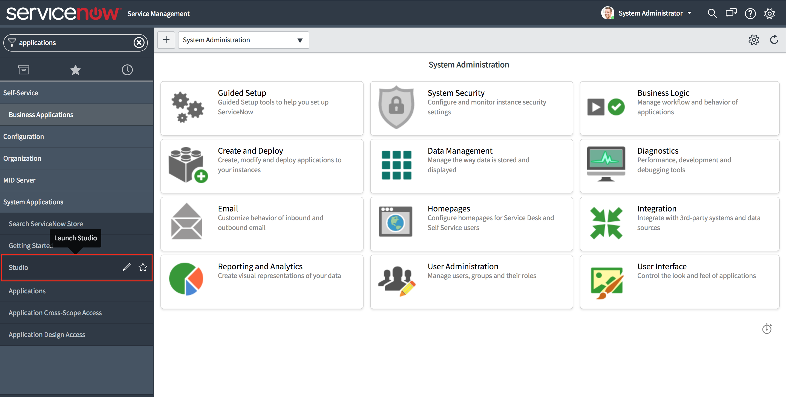
* A new tab will open, click **Import from Source Control**
 
* Copy this url, paste it into the **URL input** and click **Import**
 
* Wait for it to import successfully. Then click **Select Application**
 
* Click **IBM Resilient** to initialize and open the app
 
* Close this **Studio tab**
* Go to the homepage in your ServiceNow instance and refresh the browser
* Look for the **IBM Resilient** menu in the navigation panel
 
* If you see it, the app installed successfully
---

## Step 3: *Create a User in ServiceNow and assign it the correct Role*
* In ServiceNow, go to the **Users Table** and click **New**
 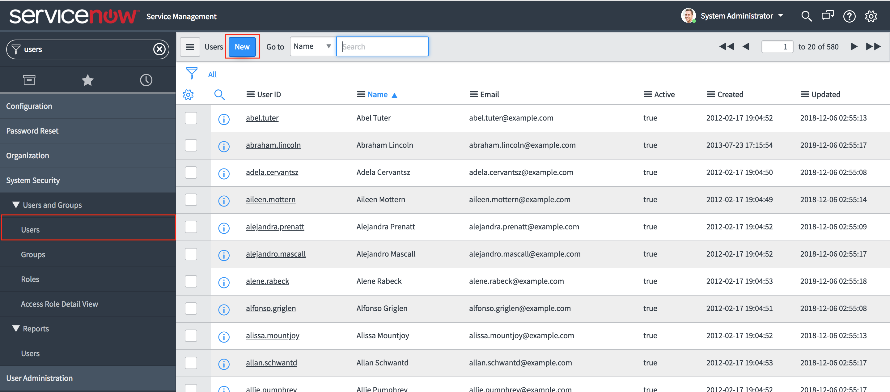
* Enter the following:
  * **User ID:** ibmresilient
  * **First Name:** IBM
  * **Last Name:** Resilient
  * **Password:** #########
* Enter an **email address**
  >**NOTE:** this email address **MUST** be the same email address of your Resilient Integrations Server user. In other words, open your **app.config** file and use the email specified under the **[resilient]** heading at the top of the file
* Set the **Timezone** to the same timezone of your Resilient Integrations Server
 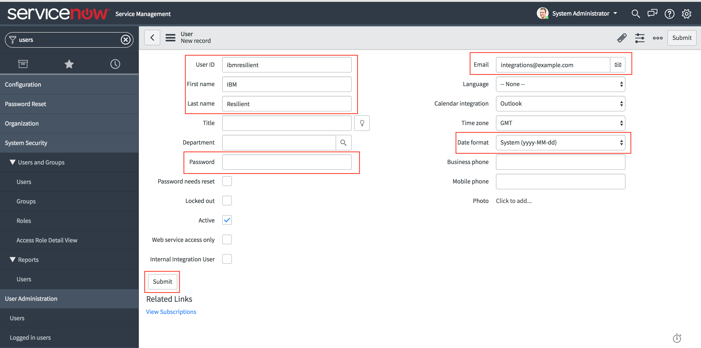
* Click **Submit**
* Still in the users table, search and open the user you just created
 
* Scroll down. Under **Roles**, click **Edit**
* Give the user the `x_261673_resilient.admin` role
 
* Click **Save**
---

## Step 4: *Enter IBM Resilient Configurations*
* In ServiceNow, look for the **IBM Resilient** menu in the navigation panel
 
* Click **Properties**, a new tab will open
 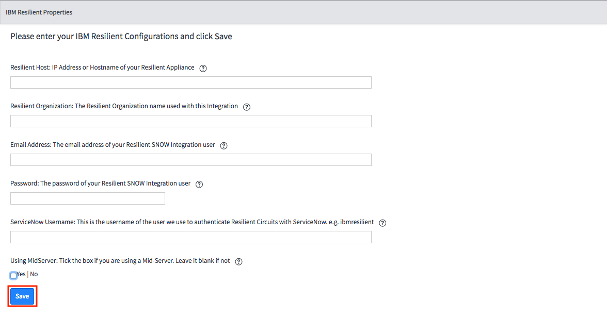
* Enter your configurations:
  * **Resilient Host:** this is the Hostname/IP Address of your Resilient Appliance, **relative to your ServiceNow Instance**, but **if you use a Mid-Server, it is relative to the Mid-Server** *(See later step on setting up your Mid-Server)*
  * **Resilient Organization:** this is the Org Name you used in **Step 1**
  * **Email Address:** this is the Email Address you used in **Step 1**
  * **Password:** this is the Password you used in **Step 1**
  * **ServiceNow Username:** this is the **User ID** you enterd in **Step 3**
* Click **Save**
* You should see a **Properties updated** banner at the top of the page if the save was successful
* **Close** the tab
---

## Step 5: *Download & Install fn_service_now Integration*
* Source the `.tar.gz` package internally
* Copy the package to your Integrations Server and SSH into it
* **Install** the package:
  ```
  $ pip install fn_service_now-x.x.x.tar.gz
  ```
* Import the **configurations** into your app.config file:
  ```
  $ resilient-circuits config -u
  ```
* Import the fn-service-now **customizations** into the Resilient Appliance:
  ```
  $ resilient-circuits customize -y -l fn-service-now
  ```
* Open the config file, scroll to the bottom and **edit your ServiceNow credentials**:
  ```
  $ nano ~/.resilient/app.config
  ```
  * **sn_host:** this is the host you use to access your ServiceNow Instance
    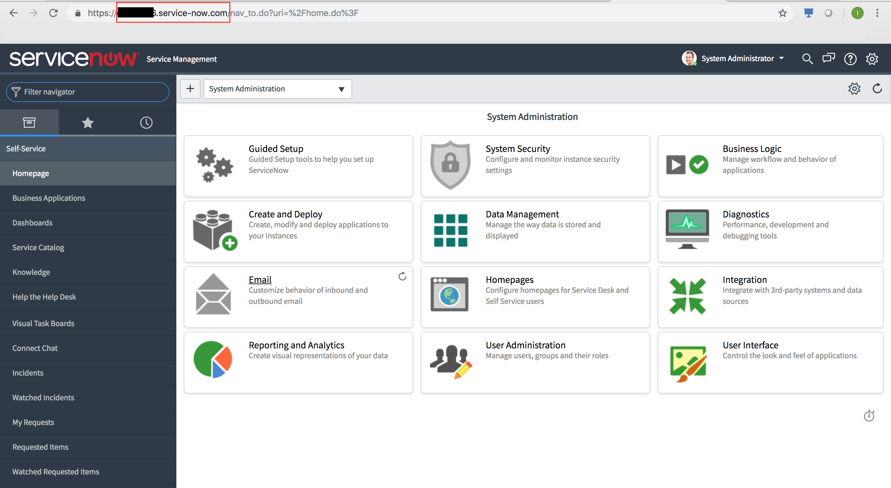
  * **sn_api_uri:** generally left as its default setting. This is the URL for the custom APIs that gets installed with the app. If you decide to implement your own endpoints, you would change this URL
  * **sn_table_name:** this is the Name of the Table in ServiceNow to Integrate with. It is where any Incidents/Tasks from Resilient will be created and synced
    >**NOTE:** currently this version (v1) only supports the **incident table in ServiceNow**. There are plans to release another update that will enable this integration to work with any table in ServiceNow, in the near future
  * **sn_username:** the **User ID** from **Step 3**
  * **sn_password:** the **Password** from **Step 3**
* **Save** and **Close** the app.config file
* **Test** your Connection to ServiceNow
  ```
  $ resilient-circuits selftest -l fn-service-now
  ```
    

* **Run** resilient-circuits
  ```
  $ resilient-circuits run
  ```
--- 

## Step 6a: *Install Mid-Server (if needed)*
>**NOTE:** If you already have the correct Mid-Server installed, you can **skip to Step 6b** to configure your server
* A ServiceNow Mid-Server is needed if your Resilient Instance is **not directly accessible from your ServiceNow instance**
* The ServiceNow Mid-Server must be setup on the same network as your Resilient Instance
* The Resilient Host Address you input in the previous step must be relevant to your Mid Server
* To install, type mid-server into your ServiceNow search box and click Installation Instructions
  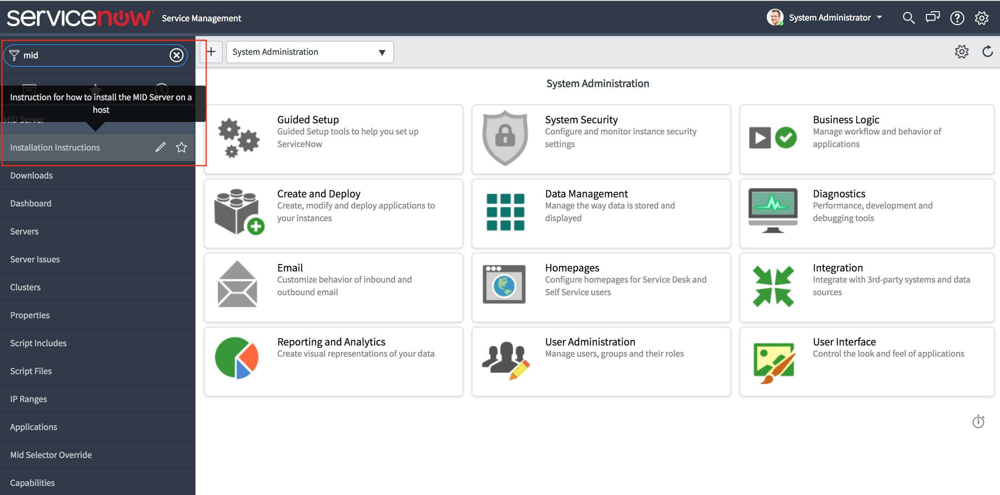
--- 

## Step 6b: *Configure Mid-Server (if needed)*
* Once **installed** AND **validated**, in ServiceNow, go to your List of Mid Servers
  
* Click to open the Mid Server you will be using with IBM Resilient
* Scroll down, click on **Capabilities** and then **Edit**
  
* Add the **IBMResilientAccess Capability**
  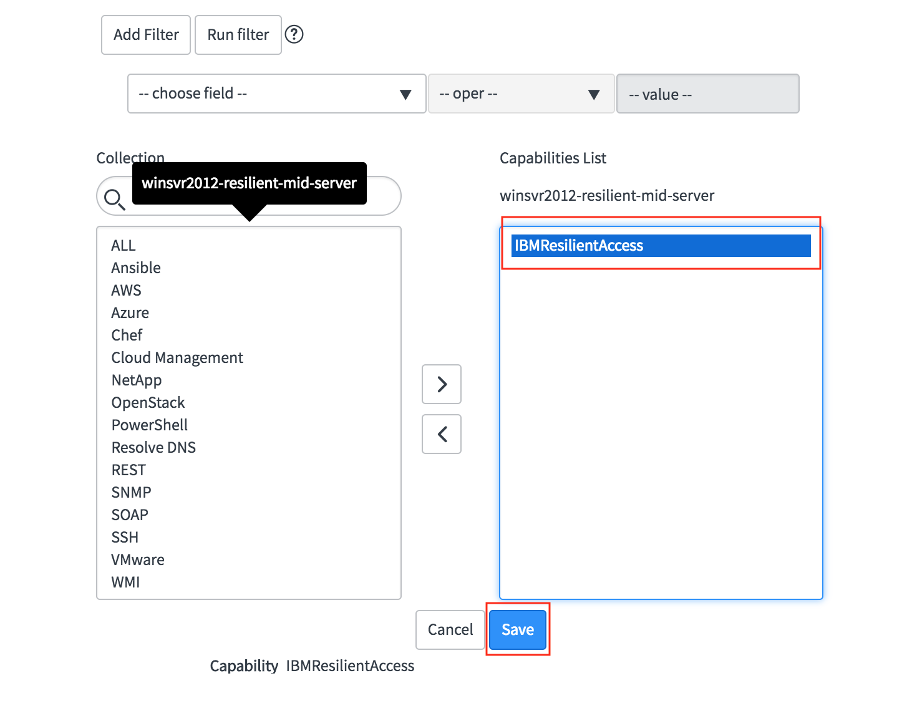
* Click **Save**
---

## Step 7: *Test*
* In ServiceNow, go to the **Incident Table**
  
* Create a **New Incident** and **Save** it
* Open the incident you just created and **scroll to the bottom**
* Click **Create Resilient Incident**
  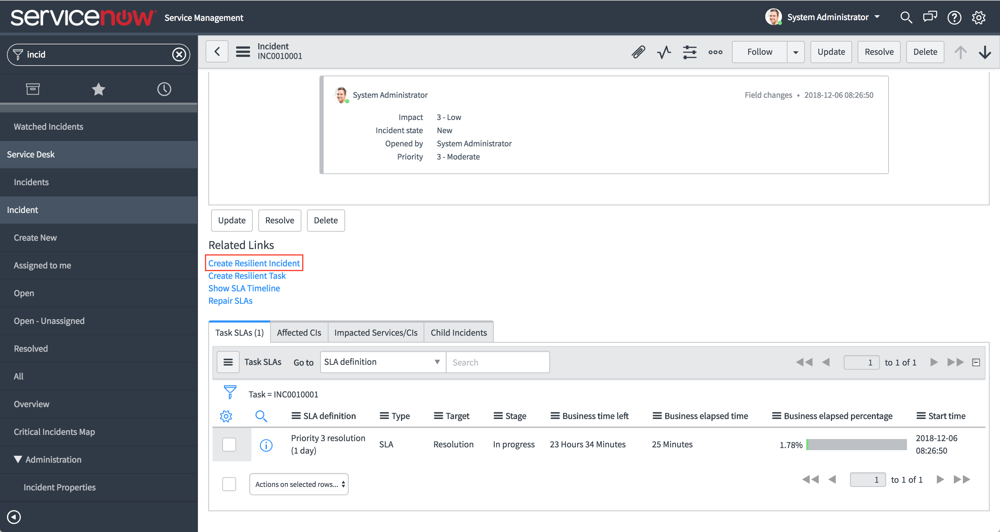
* Click the **IBM Resilient** tab
  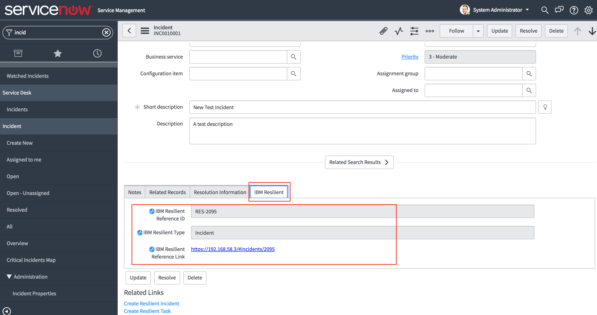
* Once the incident has been created in Resilient, these fields will be populated
  >**NOTE:** this can take up to 20 seconds
* Sign into your Resilient Appliance and see if it created successfully
* Open the incident that was created
* Send the **default task** to ServiceNow by clicking the Action Status button:
  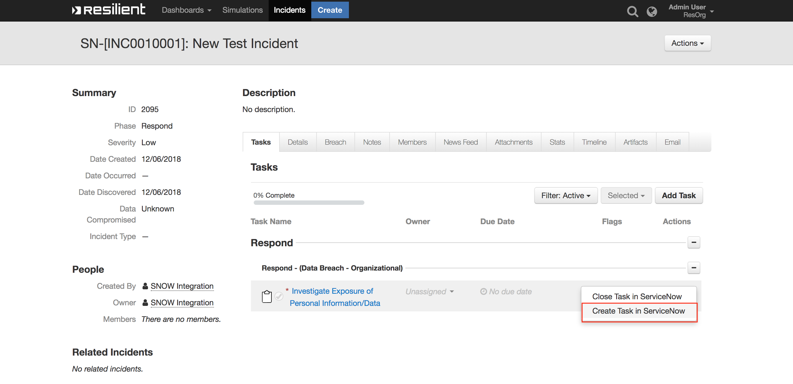
* Then fill out the Activity Inputs and click **Execute**:
  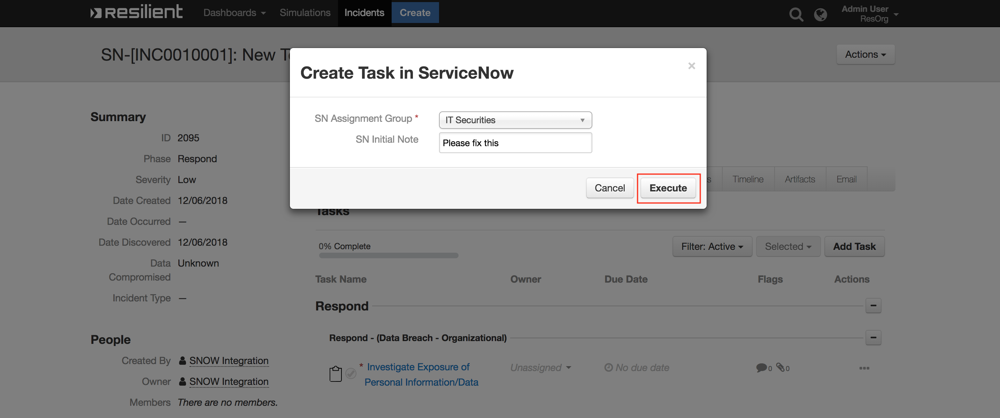
* If successful, a **Note** was added to the Task
  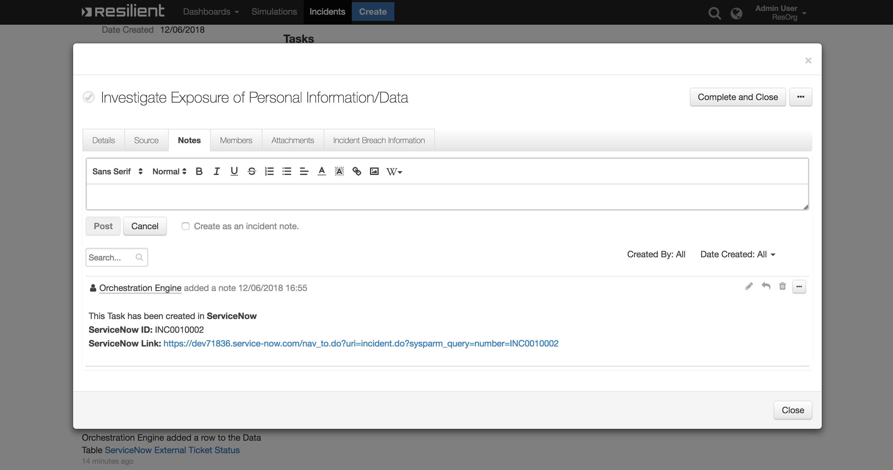
---

## Step 8: *How to Import Updates in ServiceNow*
***Still in a testing stage, so updates will be delivered frequently***
* In ServiceNow, go to **System Applications > Studio**
* Click on **IBM Resilient**
* On the top left click **Source Control > Apply Remote Changes**
  
* It will **re-install the app** with the latest changes, which will remove your configurations
* Click **Apply Stashed Changes** to *re-import* your configurations
  
* Go back to ServiceNow Homepage and **refresh the browser**
* You're up to date!

# Where Next?
* **Import the Datatable** and **Customize the Workflows** in Resilient to suit your needs 
* Get help from the **Function documentation provided with the package**
* Customize the Workflows in ServiceNow - *docs not yet complete*