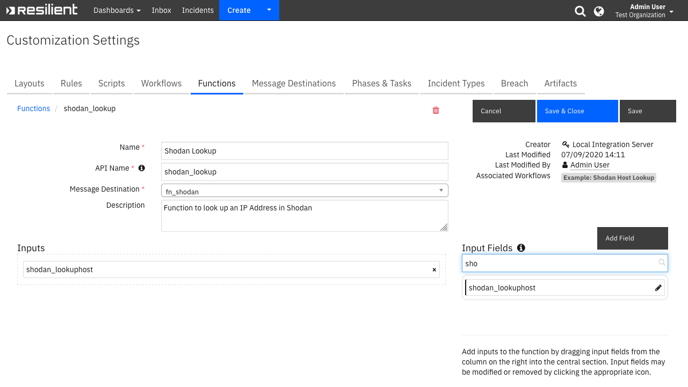

<!--
  This User README.md is generated by running:
  "resilient-sdk docgen -p fn_shodan --user-guide"

  It is best edited using a Text Editor with a Markdown Previewer. VS Code
  is a good example. Checkout https://guides.github.com/features/mastering-markdown/
  for tips on writing with Markdown

  If you make manual edits and run docgen again, a .bak file will be created

  Store any screenshots in the "doc/screenshots" directory and reference them like:
  
-->

# **User Guide:** fn_shodan_v2.0.0

## Table of Contents
- [Key Features](#key-features)
- [Function - Shodan Lookup](#function---shodan-lookup)
- [Rules](#rules)

---

## Key Features
<!--
  List the Key Features of the Integration
-->
* Look up an IP Address artifact in Shodan
* Write the results to a Note and update the Artifact's description

---

## Function - Shodan Lookup
Function to look up an IP Address in Shodan

 

<details><summary>Inputs:</summary>
<p>

| Name | Type | Required | Example | Tooltip |
| ---- | :--: | :------: | ------- | ------- |
| `shodan_lookuphost` | `text` | Yes | `127.0.0.1` | The IP Address to lookup in Shodan |

</p>
</details>

<details><summary>Outputs:</summary>
<p>

```python
results = {
    'version': '1.0',
    'success': True,
    'reason': None,
    'content': {
        'region_code': 'XX',
        'tags': ['cloud'],
        'ip': 0000,
        'area_code': None,
        'domains': [],
        'hostnames': [],
        'postal_code': None,
        'dma_code': 000,
        'country_code': 'XX',
        'org': 'XXX',
        'data': [{
            'ip': 0000,
            'port': 22,
            'transport': 'tcp',
            'version': '7.6p1 Ubuntu-4ubuntu0.3',
            'location': {
                'city': 'XXX',
                'region_code': 'XX',
                'area_code': None,
                'longitude': -00.00,
                'country_code3': None,
                'latitude': 00.00,
                'postal_code': None,
                'dma_code': 000,
                'country_code': 'XX',
                'country_name': 'XXX'
            },
            'product': 'OpenSSH',
            'hash': 867462112,
            'tags': ['cloud'],
            'timestamp': '2020-09-08T20:38:29.156574',
            'hostnames': [],
            'ssh': {
                'type': 'ssh-rsa',
                'fingerprint': '8d:5d:4d:80:a1:25:6d:30:ef:ec:e3:94:c4:46:c8:db',
                'mac': 'hmac-sha2-256',
                'cipher': 'aes128-ctr',
                'key': 'AAAAB3NzaC1yc2EAAAADAQABAAABAQC9cQMLgSfaoy7UtuzmEiVQ0wG5RM8D9iuGZYJ3eW0yWlU/\nTuaow4k5KZhP9NEYEdK9NslU5G6iJ6jB1l2xFcWKjAegzkIyneHk0+7YJUaNzS00D94VEiorxiMM\nDcSgS+kuNjnB416tz8SQ+ct60QOr9MzPMpdKKRSeOgiVAeB7/Z/vFrccYkzibb6zuqRf7+kTvLx6\nnciBMsumJgek+/tP35XakWNGDtViRSy3w7d+KTuf43fAD/WMGXs3CwywHmYLWHou7Hzfb1lGQfcC\nhiRYNrJayiUW9sHGEfqeRvi3MWuygB3n5Rr8OHRzVP1WfUoOipN/+qdGrfNsfe+0ANxH\n',
                'kex': {
                    'unused': 0,
                    'server_host_key_algorithms': ['ssh-rsa', 'rsa-sha2-512', 'rsa-sha2-256', 'ecdsa-sha2-nistp256', 'ssh-ed25519'],
                    'encryption_algorithms': ['chacha20-poly1305@openssh.com', 'aes128-ctr', 'aes192-ctr', 'aes256-ctr', 'aes128-gcm@openssh.com', 'aes256-gcm@openssh.com'],
                    'kex_follows': False,
                    'languages': [''],
                    'kex_algorithms': ['curve25519-sha256', 'curve25519-sha256@libssh.org', 'ecdh-sha2-nistp256', 'ecdh-sha2-nistp384', 'ecdh-sha2-nistp521', 'diffie-hellman-group-exchange-sha256', 'diffie-hellman-group16-sha512', 'diffie-hellman-group18-sha512', 'diffie-hellman-group14-sha256', 'diffie-hellman-group14-sha1'],
                    'compression_algorithms': ['none', 'zlib@openssh.com'],
                    'mac_algorithms': ['umac-64-etm@openssh.com', 'umac-128-etm@openssh.com', 'hmac-sha2-256-etm@openssh.com', 'hmac-sha2-512-etm@openssh.com', 'hmac-sha1-etm@openssh.com', 'umac-64@openssh.com', 'umac-128@openssh.com', 'hmac-sha2-256', 'hmac-sha2-512', 'hmac-sha1']
                },
                'hassh': 'b12d2871a1189eff20364cf5333619ee'
            },
            'org': 'XXX',
            'data': 'SSH-2.0-OpenSSH_7.6p1 Ubuntu-4ubuntu0.3\nKey type: ssh-rsa\nKey: AAAAB3NzaC1yc2EAAAADAQABAAABAQC9cQMLgSfaoy7UtuzmEiVQ0wG5RM8D9iuGZYJ3eW0yWlU/\nTuaow4k5KZhP9NEYEdK9NslU5G6iJ6jB1l2xFcWKjAegzkIyneHk0+7YJUaNzS00D94VEiorxiMM\nDcSgS+kuNjnB416tz8SQ+ct60QOr9MzPMpdKKRSeOgiVAeB7/Z/vFrccYkzibb6zuqRf7+kTvLx6\nnciBMsumJgek+/tP35XakWNGDtViRSy3w7d+KTuf43fAD/WMGXs3CwywHmYLWHou7Hzfb1lGQfcC\nhiRYNrJayiUW9sHGEfqeRvi3MWuygB3n5Rr8OHRzVP1WfUoOipN/+qdGrfNsfe+0ANxH\nFingerprint: 8d:5d:4d:80:a1:25:6d:30:ef:ec:e3:94:c4:46:c8:db\n\nKex Algorithms:\n\tcurve25519-sha256\n\tcurve25519-sha256@libssh.org\n\tecdh-sha2-nistp256\n\tecdh-sha2-nistp384\n\tecdh-sha2-nistp521\n\tdiffie-hellman-group-exchange-sha256\n\tdiffie-hellman-group16-sha512\n\tdiffie-hellman-group18-sha512\n\tdiffie-hellman-group14-sha256\n\tdiffie-hellman-group14-sha1\n\nServer Host Key Algorithms:\n\tssh-rsa\n\trsa-sha2-512\n\trsa-sha2-256\n\tecdsa-sha2-nistp256\n\tssh-ed25519\n\nEncryption Algorithms:\n\tchacha20-poly1305@openssh.com\n\taes128-ctr\n\taes192-ctr\n\taes256-ctr\n\taes128-gcm@openssh.com\n\taes256-gcm@openssh.com\n\nMAC Algorithms:\n\tumac-64-etm@openssh.com\n\tumac-128-etm@openssh.com\n\thmac-sha2-256-etm@openssh.com\n\thmac-sha2-512-etm@openssh.com\n\thmac-sha1-etm@openssh.com\n\tumac-64@openssh.com\n\tumac-128@openssh.com\n\thmac-sha2-256\n\thmac-sha2-512\n\thmac-sha1\n\nCompression Algorithms:\n\tnone\n\tzlib@openssh.com\n\n',
            'asn': 'AS14061',
            'info': 'protocol 2.0',
            'isp': 'XXX',
            'cpe': ['cpe:/a:openbsd:openssh:7.6p1 Ubuntu-4ubuntu0.3'],
            'domains': [],
            'ip_str': '127.0.0.1',
            'os': None,
            '_shodan': {
                'crawler': '82488cbcb7dd25da13f728d04775390417d9ee4e',
                'ptr': True,
                'id': 'fdc70742-b10b-481f-9a98-b083dfb8ac21',
                'module': 'ssh',
                'options': {}
            },
            'opts': {}
        }, {
            'ip': 000,
            'hash': 000,
            'port': 80,
            'transport': 'tcp',
            'version': '2.4.29',
            'location': {
                'city': 'XXX',
                'region_code': 'XX',
                'area_code': None,
                'longitude': -00.00,
                'country_code3': None,
                'latitude': 00.00,
                'postal_code': None,
                'dma_code': 000,
                'country_code': 'XX',
                'country_name': 'XXX'
            },
            'vulns': {
                'CVE-2019-0196': {
                    'verified': False,
                    'references': ['http://lists.opensuse.org/opensuse-security-announce/2019-04/msg00051.html', 'http://lists.opensuse.org/opensuse-security-announce/2019-04/msg00061.html', 'http://lists.opensuse.org/opensuse-security-announce/2019-04/msg00084.html', 'http://www.apache.org/dist/httpd/CHANGES_2.4.39', 'http://www.openwall.com/lists/oss-security/2019/04/02/1', 'http://www.securityfocus.com/bid/107669', 'https://httpd.apache.org/security/vulnerabilities_24.html', 'https://lists.apache.org/thread.html/97a1c58e138ed58a364513b58d807a802e72bf6079ff81a10948ef7c@%3Ccvs.httpd.apache.org%3E', 'https://lists.apache.org/thread.html/fd110f4ace2d8364c7d9190e1993cde92f79e4eb85576ed9285686ac@%3Ccvs.httpd.apache.org%3E', 'https://lists.fedoraproject.org/archives/list/package-announce@lists.fedoraproject.org/message/WETXNQWNQLWHV6XNW6YTO5UGDTIWAQGT/', 'https://lists.fedoraproject.org/archives/list/package-announce@lists.fedoraproject.org/message/YTJPHI3E3OKW7OT7COQXVG7DE7IDQ2OT/', 'https://seclists.org/bugtraq/2019/Apr/5', 'https://security.netapp.com/advisory/ntap-20190617-0002/', 'https://support.f5.com/csp/article/K44591505', 'https://usn.ubuntu.com/3937-1/', 'https://www.debian.org/security/2019/dsa-4422'],
                    'cvss': '5.0',
                    'summary': 'A vulnerability was found in Apache HTTP Server 2.4.17 to 2.4.38. Using fuzzed network input, the http/2 request handling could be made to access freed memory in string comparison when determining the method of a request and thus process the request incorrectly.'
                },
                'CVE-2019-0197': {
                    'verified': False,
                    'references': ['http://lists.opensuse.org/opensuse-security-announce/2019-04/msg00051.html', 'http://lists.opensuse.org/opensuse-security-announce/2019-04/msg00061.html', 'http://lists.opensuse.org/opensuse-security-announce/2019-04/msg00084.html', 'http://www.openwall.com/lists/oss-security/2019/04/02/2', 'http://www.securityfocus.com/bid/107665', 'https://httpd.apache.org/security/vulnerabilities_24.html', 'https://lists.apache.org/thread.html/e0b8f6e858b1c8ec2ce8e291a2c543d438915037c7af661ab6d33808@%3Cdev.httpd.apache.org%3E', 'https://lists.fedoraproject.org/archives/list/package-announce@lists.fedoraproject.org/message/WETXNQWNQLWHV6XNW6YTO5UGDTIWAQGT/', 'https://security.netapp.com/advisory/ntap-20190617-0002/', 'https://support.f5.com/csp/article/K44591505'],
                    'cvss': '4.9',
                    'summary': 'A vulnerability was found in Apache HTTP Server 2.4.34 to 2.4.38. When HTTP/2 was enabled for a http: host or H2Upgrade was enabled for h2 on a https: host, an Upgrade request from http/1.1 to http/2 that was not the first request on a connection could lead to a misconfiguration and crash. Server that never enabled the h2 protocol or that only enabled it for https: and did not set "H2Upgrade on" are unaffected by this issue.'
                },
                'CVE-2019-0220': {
                    'verified': False,
                    'references': ['http://lists.opensuse.org/opensuse-security-announce/2019-04/msg00051.html', 'http://lists.opensuse.org/opensuse-security-announce/2019-04/msg00061.html', 'http://lists.opensuse.org/opensuse-security-announce/2019-04/msg00084.html', 'http://www.openwall.com/lists/oss-security/2019/04/02/6', 'http://www.securityfocus.com/bid/107670', 'https://httpd.apache.org/security/vulnerabilities_24.html', 'https://lists.debian.org/debian-lts-announce/2019/04/msg00008.html', 'https://lists.fedoraproject.org/archives/list/package-announce@lists.fedoraproject.org/message/ALIR5S3O7NRHEGFMIDMUSYQIZOE4TJJN/', 'https://lists.fedoraproject.org/archives/list/package-announce@lists.fedoraproject.org/message/EZRMTEIGZKYFNGIDOTXN3GNEJTLVCYU7/', 'https://lists.fedoraproject.org/archives/list/package-announce@lists.fedoraproject.org/message/WETXNQWNQLWHV6XNW6YTO5UGDTIWAQGT/', 'https://seclists.org/bugtraq/2019/Apr/5', 'https://security.netapp.com/advisory/ntap-20190625-0007/', 'https://support.f5.com/csp/article/K44591505', 'https://usn.ubuntu.com/3937-1/', 'https://www.debian.org/security/2019/dsa-4422'],
                    'cvss': '5.0',
                    'summary': "A vulnerability was found in Apache HTTP Server 2.4.0 to 2.4.38. When the path component of a request URL contains multiple consecutive slashes ('/'), directives such as LocationMatch and RewriteRule must account for duplicates in regular expressions while other aspects of the servers processing will implicitly collapse them."
                }
            },
            'product': 'Apache httpd',
            'http': {
                'robots_hash': None,
                'redirects': [],
                'securitytxt': None,
                'title': 'Bryant Frazer &#8211; Writer / Editor / Critic / Enthusiast',
                'sitemap_hash': None,
                'robots': None,
                'server': 'Apache/2.4.29 (Ubuntu)',
                'host': '127.0.0.1',
                'html': '<!DOCTYPE html>\n<html lang="en-US">\n<head>\n<meta charset="UTF-8">\...',
                'location': '/',
                'components': {
                    'jQuery': {
                        'categories': []
                    }
                },
                'securitytxt_hash': None,
                'sitemap': None,
                'html_hash': 000
            },
            'tags': ['cloud'],
            'timestamp': '2020-09-08T10:30:47.664826',
            'hostnames': [],
            'org': 'XXX',
            'data': 'HTTP/1.1 200 OK\r\nDate: Tue, 08 Sep 2020 10:30:47 ...',
            'asn': 'AS14061',
            'info': '(Ubuntu)',
            'isp': 'XXX',
            'cpe': ['cpe:/a:jquery:jquery', 'cpe:/a:php:php', 'cpe:/a:mysql:mysql', 'cpe:/a:wordpress:wordpress', 'cpe:/a:apache:http_server:2.4.29'],
            'domains': [],
            'ip_str': '127.0.0.1',
            'os': None,
            '_shodan': {
                'crawler': 'd264629436af1b777b3b513ca6ed1404d7395d80',
                'ptr': True,
                'id': '67205368-8ab4-4321-b783-45c1cacb2265',
                'module': 'http',
                'options': {}
            },
            'opts': {}
        }],
        'asn': 'AS14061',
        'city': 'XXX',
        'latitude': 40.8364,
        'isp': 'XXX',
        'longitude': -74.1403,
        'last_update': '2020-09-08T20:38:29.156574',
        'country_code3': None,
        'vulns': ['CVE-2019-0220', 'CVE-2019-0197', 'CVE-2019-0196', 'CVE-2018-1302', 'CVE-2019-0211', 'CVE-2017-15710', 'CVE-2018-1301'],
        'country_name': 'XXX',
        'ip_str': '127.0.0.1',
        'os': None,
        'ports': [80, 22]
    },
    'raw': '{"region_code": "NJ", "tags": ["cloud"], "ip": 000, "area_code": null, "domains": [], ...}'
    'inputs': {
        'shodan_lookuphost': '127.0.0.1'
    },
    'metrics': {
        'version': '1.0',
        'package': 'fn-shodan',
        'package_version': '2.0.0',
        'host': 'XXX',
        'execution_time_ms': 584,
        'timestamp': '2020-09-09 14:12:36'
    },
    'shodan_vulns': ['CVE-2019-0220', 'CVE-2019-0197', 'CVE-2019-0196', 'CVE-2018-1302', 'CVE-2019-0211', 'CVE-2017-15710', 'CVE-2018-1301'],
    'shodan_ports': [80, 22],
    'shodan_url': 'https://www.shodan.io/host/127.0.0.1'
}
```

</p>
</details>

<details><summary>Workflows</summary>

  <details><summary>Example Pre-Process Script:</summary>
  <p>

  ```python
  inputs.shodan_lookuphost = artifact.value
  ```

  </p>
  </details>

  <details><summary>Example Post-Process Script:</summary>
  <p>

  ```python
  def append_artifact_description(the_artifact, the_text):
  """Appends the_text to the_artifact.description safely
  handling unicode"""
  
  new_description = u""
  
  if the_artifact.description is None:
    current_description = None
  else:
    current_description = the_artifact.description.get("content", None)

  if current_description is not None:
    new_description = u"{0}<br>---<br>{1}".format(unicode(current_description), unicode(the_text))

  else:
    new_description = u"{0}".format(unicode(the_text))

  the_artifact.description = helper.createRichText(new_description)

comment = u"""<b>Shodan Host Lookup</b> has complete
            <br><b>Found:</b> <b style="color:{found_color}">{was_found}</b>
            <br><b>Artifact Type:</b> {artifact_type}
            <br><b>Artifact Value:</b> {artifact_value}"""

if results.success:
  results_content = results.get("content", {})
  comment = comment.format(found_color="#ff402b", was_found="Yes", artifact_type=artifact.type, artifact_value=artifact.value)
  comment += u"""<br><b>Organization:</b> {0}""".format(results_content.get("org", "Unknown"))
  comment += u"""<br><b>ISP:</b> {0}""".format(results_content.get("isp", "Unknown"))
  comment += u"""<br><b>Location:</b> {0}, {1}""".format(results_content.get("city", "Unknown City"), results_content.get("country_name", "Unknown Country"))
  comment += u"""<br><b>Vulnerabilities:</b> {0}""".format(results_content.get("vulns", "None Found"))
  comment += u"""<br><b>Ports:</b> {0}""".format(results_content.get("ports", "None Found"))
  comment += u"""<br><b>Link:</b> <a target='blank' href='{0}'>{0}</a>""".format(results.get("shodan_url", "404"))

else:
  comment = comment.format(found_color="#45bc27", was_found="No", artifact_type=artifact.type, artifact_value=artifact.value)
  comment += u"""<br><b>Reason:</b> {reason}""".format(reason=results.get("reason", "Not found in Shodan"))
  
append_artifact_description(artifact, comment)
incident.addNote(helper.createRichText(comment))
  ```

  </p>
  </details>

</details>

---


## Rules
| Rule Name | Object | Workflow Triggered |
| --------- | ------ | ------------------ |
| Example: Shodan Host Lookup | artifact | `example_shodan_host_lookup` |

---

<!--
## Inform Resilient Users
  Use this section to optionally provide additional information so that Resilient playbook 
  designer can get the maximum benefit of your integration.
-->