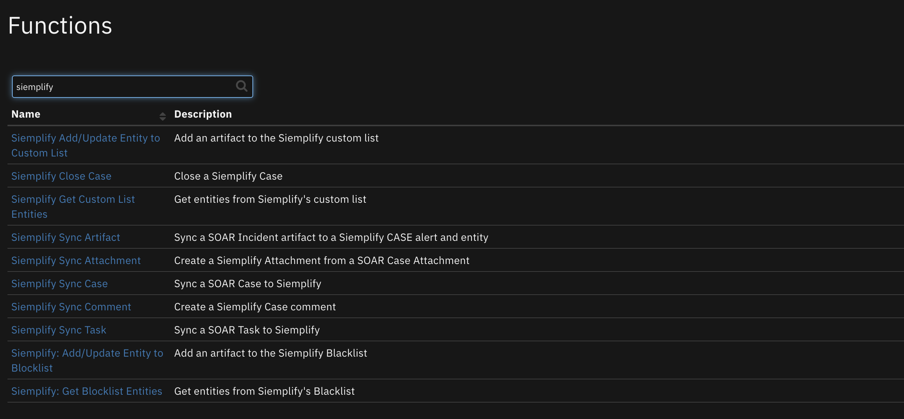
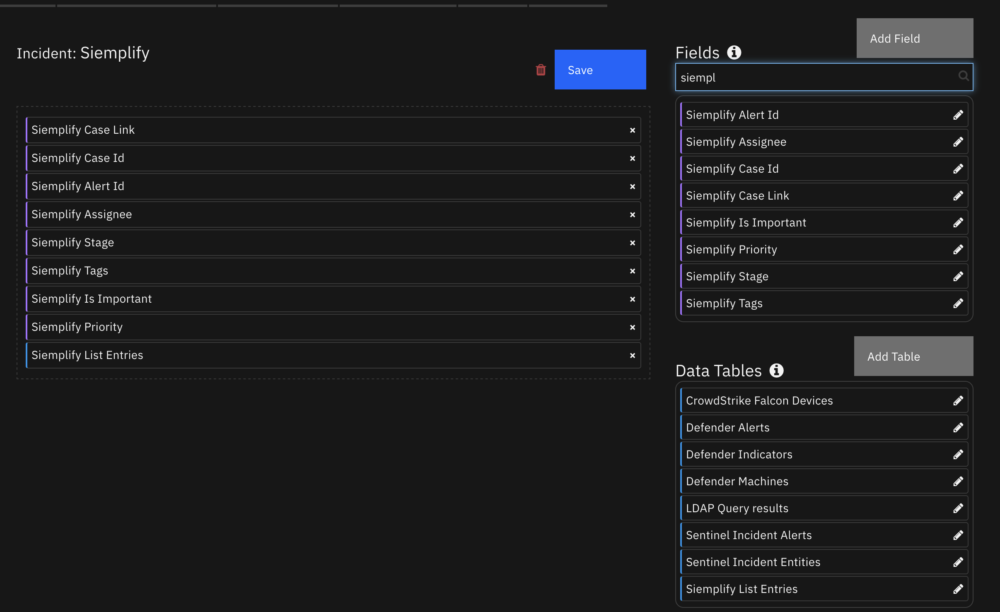
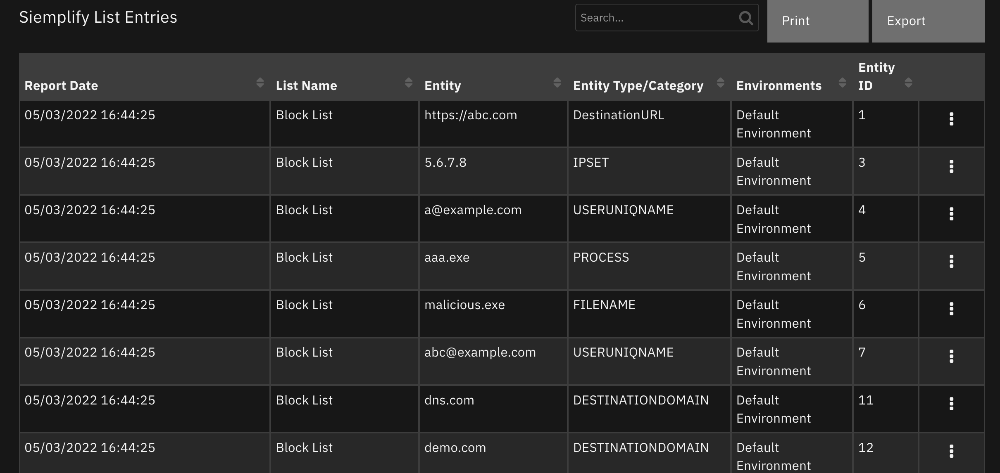

<!--
  This README.md is generated by running:
  "resilient-sdk docgen -p fn_siemplify"

  It is best edited using a Text Editor with a Markdown Previewer. VS Code
  is a good example. Checkout https://guides.github.com/features/mastering-markdown/
  for tips on writing with Markdown

  All fields followed by "::CHANGE_ME::"" should be manually edited

  If you make manual edits and run docgen again, a .bak file will be created

  Store any screenshots in the "doc/screenshots" directory and reference them like:
  

  NOTE: If your app is available in the container-format only, there is no need to mention the integration server in this readme.
-->

# Siemplify App for IBM QRadar SOAR

## Table of Contents
- [Release Notes](#release-notes)
- [Overview](#overview)
  - [Key Features](#key-features)
- [Requirements](#requirements)
  - [SOAR platform](#SOAR-platform)
  - [Cloud Pak for Security](#cloud-pak-for-security)
  - [Proxy Server](#proxy-server)
  - [Python Environment](#python-environment)
  - [Endpoint Developed With](#endpoint-developed-with)
- [Installation](#installation)
  - [Install](#install)
  - [App Configuration](#app-configuration)
  - [Custom Layouts](#custom-layouts)
- [Function - Siemplify Sync Task](#function---siemplify-sync-task)
- [Function - Siemplify Sync Attachment](#function---siemplify-sync-attachment)
- [Function - Siemplify Sync Case](#function---siemplify-sync-case)
- [Function - Siemplify Sync Artifact](#function---siemplify-sync-artifact)
- [Function - Siemplify Sync Comment](#function---siemplify-sync-comment)
- [Function - Siemplify Close Case](#function---siemplify-close-case)
- [Function - Siemplify Add/Update Entity to Blocklist](#function---siemplify-addupdate-entity-to-blocklist)
- [Function - Siemplify Add/Update Entity to Custom List](#function---siemplify-addupdate-entity-to-customlist)
- [Function - Siemplify Get Block List Entities](#function---siemplify-get-blocklist-entities)
- [Function - Siemplify Get Custom List Entities](#function---siemplify-get-custom-list-entities)
- [Data Table - Siemplify List Entries](#data-table---siemplify-list-entries)
- [Custom Fields](#custom-fields)
- [Rules](#rules)
- [Troubleshooting & Support](#troubleshooting--support)
---

## Release Notes
<!--
  Specify all changes in this release. Do not remove the release
  notes of a previous release
-->
| Version | Date | Notes |
| ------- | ---- | ----- |
| 1.0.0 | 02/2022 | Initial Release |

---

## Overview
<!--
  Provide a high-level description of the function itself and its remote software or application.
  The text below is parsed from the "description" and "long_description" attributes in the setup.py file
-->
**Siemplify App for IBM QRadar SOAR (SOAR)**

 

Bi-directional synchronization with Siemplify Cases from SOAR Incidents. Other Siemplify case components synchronized are:
* SOAR comments to Siempify case insights
* SOAR attachments
* SOAR case tasks
* Siemplify closed cases will update IBM SOAR incidents

### Key Features
<!--
  List the Key Features of the Integration
-->
* Sync SOAR incidents with Siemplify cases
* Sync Siemplify case close events with SOAR incidents
* Sync Siemplify case changes with existing SOAR incidents
* Flexible templates used allowing modification for your environment
* Get entities added to the Block or Custom list
* Add entities to the Block or Custom list

---

## Requirements
<!--
  List any Requirements
-->
This app supports the IBM QRadar SOAR Platform and the IBM Cloud Pak for Security.

### SOAR platform
The SOAR platform supports two app deployment mechanisms, App Host and integration server.

If deploying to a SOAR platform with an App Host, the requirements are:
* SOAR platform >= `40.2.81`.
* The app is in a container-based format (available from the AppExchange as a `zip` file).

If deploying to a SOAR platform with an integration server, the requirements are:
* SOAR platform >= `40.2.81`.
* The app is in the older integration format (available from the AppExchange as a `zip` file which contains a `tar.gz` file).
* Integration server is running `resilient-circuits>=43.0.0`.
* If using an API key account, make sure the account provides the following minimum permissions:
  | Name | Permissions |
  | ---- | ----------- |
  | Org Data | Read |
  | Function | Read |
  | Incident | Read all |

The following SOAR platform guides provide additional information:
* _App Host Deployment Guide_: provides installation, configuration, and troubleshooting information, including proxy server settings.
* _Integration Server Guide_: provides installation, configuration, and troubleshooting information, including proxy server settings.
* _System Administrator Guide_: provides the procedure to install, configure and deploy apps.

The above guides are available on the IBM Knowledge Center at [ibm.biz/soar-docs](https://ibm.biz/soar-docs). On this web page, select your SOAR platform version. On the follow-on page, you can find the _App Host Deployment Guide_ or _Integration Server Guide_ by expanding **SOAR Apps** in the Table of Contents pane. The System Administrator Guide is available by expanding **System Administrator**.

### Cloud Pak for Security
If you are deploying to IBM Cloud Pak for Security, the requirements are:
* IBM Cloud Pak for Security >= 1.4.
* Cloud Pak is configured with an App Host.
* The app is in a container-based format (available from the AppExchange as a `zip` file).

The following Cloud Pak guides provide additional information:
* _App Host Deployment Guide_: provides installation, configuration, and troubleshooting information, including proxy server settings. From the Table of Contents, select Case Management and Orchestration & Automation > **Orchestration and Automation Apps**.
* _System Administrator Guide_: provides information to install, configure, and deploy apps. From the IBM Cloud Pak for Security Knowledge Center table of contents, select Case Management and Orchestration & Automation > **System administrator**.

These guides are available on the IBM Knowledge Center at [ibm.biz/cp4s-docs](https://ibm.biz/cp4s-docs). From this web page, select your IBM Cloud Pak for Security version. From the version-specific Knowledge Center page, select Case Management and Orchestration & Automation.

### Proxy Server
The app **does** support a proxy server.

### Python Environment
Python 3.6 is supported.
Additional package dependencies may exist for each of these packages:
* jinja2
* pytz
* resilient-circuits>=43.0.0
* resilient_lib
* simplejson

### Endpoint Developed With Siemplify

This app has been tested using:
| Product Name | Product Version | API URL | API Version |
| ------------ | --------------- | ------- | ----------- |
| Siemplify | 5.6.x | https://<siemplify_host>/api/external/v1 | v1 |

#### Configuration
<!--
List any steps that are needed to configure the endpoint to use this app.
-->
* Generate an Siemplify API Key for use with IBM SOAR. This value will used with the app.config `api_key` setting.

---

## Installation

### Install
* To install or uninstall an App or Integration on the _Resilient platform_, see the documentation at [ibm.biz/soar-docs](https://ibm.biz/soar-docs).
* To install or uninstall an App on _IBM Cloud Pak for Security_, see the documentation at [ibm.biz/cp4s-docs](https://ibm.biz/cp4s-docs) and follow the instructions above to navigate to Orchestration and Automation.

### App Configuration
The following table provides the settings you need to configure the app. These settings are made in the app.config file. See the documentation discussed in the Requirements section for the procedure.

| Config | Required | Example | Description |
| ------ | :------: | ------- | ----------- |
| **base_url** | Yes | `https://<siemplify host>` | *Base URL for your Siemplify server*|
| **api_key** | Yes | `abc-123-def` | *API Generated from Siemplify*  |
| **cafile** | Yes | `false|/path/to/siemplify.cert` | *Certificate needed to access Siemplify* |
| **polling_interval** | Yes | `120` | *Seconds to wait between polling intervals. 0 disables poller. This will disable the ability to close an IBM SOAR incient when the Siempify Case closes.*  |
| **polling_lookback** | Yes | `120` | *Minutes to look back for cased cases the first time poller runs* |
| **poller_timezone** | Yes | `Etc/GMT` | *Timezone adjustment for Siemplify timestamp comparison*  |
| **default_case_environment** | Yes | `Default Environment` | *Siemplify environment to use when creating cases does not specify an environment* |
| **siemplify_create_case_template** | Yes | `/path/to/siemplify_create_case.jinja` | *Use when overriding the default template*  |
| **soar_close_case_template** | Yes | `/path/to/soar_close_case.jinja` | *Use when overriding the default template*  |
| **soar_update_case_template** | Yes | `/path/to/soar_update_case_case.jinja` | *Use when overriding the default template*  |

### Custom Layouts
<!--
  Use this section to provide guidance on where the user should add any custom fields and data tables.
  You may wish to recommend a new incident tab.
  You should save a screenshot "custom_layouts.png" in the doc/screenshots directory and reference it here
-->
* Import the Data Tables and Custom Fields in a tab like the screenshot below:

  

---

## Function - Siemplify Sync Task
Sync a SOAR Task to Siemplify

<details><summary>Inputs:</summary>
<p>

| Name | Type | Required | Example | Tooltip |
| ---- | :--: | :------: | ------- | ------- |
| `siemplify_case_id` | `number` | No | `42` | Siemplify case Id stored with the SOAR incident|
| `siemplify_soar_task_id` | `number` | No | `1003` | SOAR incident task id |
| `siemplify_task_assignee` | `text` | No | `@Administator` | Name of Siemplify assignee for the task |

</p>
</details>

<details><summary>Outputs:</summary>
<p>

```python
results = {
  'version': 2.0,
  'success': True,
  'reason': None,
  'content': {
    'status': 0,
    'priority': 0,
    'name': 'IBM SOAR: Investigate Malware',
    'owner': '@Administrator',
    'completor': None,
    'completionComment': None,
    'completionDateTimeUnixTimeInMs': None,
    'dueDateUnixTimeInMs': None,
    'creatorUserId': 'Siemplify automation',
    'id': 19,
    'type': 2,
    'caseId': 60,
    'isFavorite': False,
    'modificationTimeUnixTimeInMs': 1641570964725,
    'creationTimeUnixTimeInMs': 1641570964725,
    'alertIdentifier': None
  },
  'raw': None,
  'inputs': {
    'siemplify_task_assignee': '@Administrator',
    'siemplify_soar_task_id': 802,
    'siemplify_case_id': 60
  },
  'metrics': {
    'version': '1.0',
    'package': 'fn-siemplify',
    'package_version': '1.0.0',
    'host': 'Marks-MacBook-Pro.local',
    'execution_time_ms': 551,
    'timestamp': '2022-01-07 10:56:04'
  }
}
```

</p>
</details>

<details><summary>Example Pre-Process Script:</summary>
<p>

```python
inputs.siemplify_case_id = incident.properties.siemplify_case_id
inputs.siemplify_soar_task_id = task.id
inputs.siemplify_task_assignee = "@Administrator"

```

</p>
</details>

<details><summary>Example Post-Process Script:</summary>
<p>

```python
if results.success:
  task.addNote("Siemplify Sync Task: {}".format(task.name))
else:
  task.addNote("Siemplify Sync Task: {} failed: {}".format(task.name, results.reason))
```

</p>
</details>

---
## Function - Siemplify Sync Attachment
Create a Siemplify Attachment from a SOAR Case Attachment

<details><summary>Inputs:</summary>
<p>

| Name | Type | Required | Example | Tooltip |
| ---- | :--: | :------: | ------- | ------- |
| `siemplify_alert_id` | `text` | Yes | `123` | Siemplify alert id saved in the SOAR incident |
| `siemplify_attachment_id` | `number` | Yes | `` | SOAR incident attachment id |
| `siemplify_case_id` | `number` | Yes | `46` | Siemplify case id saved in the SOAR incident |
| `siemplify_incident_id` | `number` | Yes | `2009` | SOAR incident id |

</p>
</details>

<details><summary>Outputs:</summary>
<p>

```python
results = {
  'version': 2.0,
  'success': True,
  'reason': None,
  'content': {
    'evidenceName': 'app-rc_data_feed_plugin_odbcfeed-1',
    'description': 'created by IBM SOAR',
    'evidenceThumbnailBase64': '',
    'evidenceId': 12,
    'fileType': '.0.5.zip',
    'creatorUserId': 'Siemplify automation',
    'id': 12,
    'type': 4,
    'caseId': 60,
    'isFavorite': False,
    'modificationTimeUnixTimeInMs': 1641571089125,
    'creationTimeUnixTimeInMs': 1641571089125,
    'alertIdentifier': None
  },
  'raw': None,
  'inputs': {
    'siemplify_incident_id': 2145,
    'siemplify_alert_id': 'IBM SOAR Alert 2145_f48baf55-3618-4cf4-b2b5-d3b974d71785',
    'siemplify_case_id': 60,
    'siemplify_attachment_id': 15
  },
  'metrics': {
    'version': '1.0',
    'package': 'fn-siemplify',
    'package_version': '1.0.0',
    'host': 'Marks-MacBook-Pro.local',
    'execution_time_ms': 781,
    'timestamp': '2022-01-07 10:58:09'
  }
}
```

</p>
</details>

<details><summary>Example Pre-Process Script:</summary>
<p>

```python
inputs.siemplify_alert_id = incident.properties.siemplify_alert_id
inputs.siemplify_case_id = incident.properties.siemplify_case_id
inputs.siemplify_incident_id = incident.id
inputs.siemplify_attachment_id = attachment.id
```

</p>
</details>

<details><summary>Example Post-Process Script:</summary>
<p>

```python
if results.success:
  incident.addNote("Siemplify Sync Attachment: {} created".format(attachment.name))
else:
  incident.addNote("Siemplify Sync Attachment: {} failed. Reason: {}".format(attachment.name, results.reason))

```

</p>
</details>

---
## Function - Siemplify Sync Case
Sync a SOAR Case to Siemplify

<details><summary>Inputs:</summary>
<p>

| Name | Type | Required | Example | Tooltip |
| ---- | :--: | :------: | ------- | ------- |
| `siemplify_alert_id` | `text` | Yes | `IBM SOAR Alert 2148_abc-1234` | Siemplify alert id saved in the SOAR incident |
| `siemplify_assigned_user` | `text` | No | `@Administator` | Set Assigned User. Default is none.  |
| `siemplify_case_id` | `number` | Yes | `46` | Siemplify case id saved in the SOAR incident |
| `siemplify_environment` | `text` | No | `Default Environment` | Set environment. See app.config setting for default |
| `siemplify_incident_id` | `number` | Yes | `2009` | SOAR incident Id |
| `siemplify_sync_artifacts` | `boolean` | No | `true|false` | Set to Yes to sync artifacts to Siemplify |
| `siemplify_sync_attachments` | `boolean` | No | `true|false` | Set to Yes to sync attachments to Siemplify |
| `siemplify_sync_comments` | `boolean` | No | `true|false` | Set to Yes to sync comments to Siemplify |

</p>
</details>

<details><summary>Outputs:</summary>
<p>

```python
results = {
  'version': 2.0,
  'success': True,
  'reason': None,
  'content': {
    'wallData': [
      {
        'comment': 'Case creation reason: IBM SOAR Incident 2145',
        'creatorUserId': 'Siemplify automation',
        'id': 63,
        'type': 7,
        'caseId': 63,
        'isFavorite': False,
        'modificationTimeUnixTimeInMs': 1641571162242,
        'creationTimeUnixTimeInMs': 1641571162242,
        'alertIdentifier': 'IBM SOAR Alert 2145_38352c92-bf66-4a50-87e2-5875accd7d7b'
      },
      {
        'comment': 'Playbook SentinelOne Threat Remediation attached to case.',
        'creatorUserId': 'Siemplify automation',
        'id': 36,
        'type': 5,
        'caseId': 63,
        'isFavorite': False,
        'modificationTimeUnixTimeInMs': 1641571162382,
        'creationTimeUnixTimeInMs': 1641571162382,
        'alertIdentifier': None
      }
    ],
    'alerts': [
      {
        'ticketId': '',
        'identifier': 'IBM SOAR Alert 2145_38352c92-bf66-4a50-87e2-5875accd7d7b',
        'hasWorkflows': True,
        'workflowsStatus': 1,
        'sourceSystemName': '',
        'securityEventCards': [
          {
            'caseId': 63,
            'eventId': None,
            'alertIdentifier': 'IBM SOAR Alert 2145_38352c92-bf66-4a50-87e2-5875accd7d7b',
            'eventName': None,
            'product': None,
            'sources': [

            ],
            'destinations': [

            ],
            'artificats': [

            ],
            'port': None,
            'outcome': None,
            'time': '2022-01-05T17:52:10Z',
            'deviceEventClassId': None,
            'fields': [

            ]
          }
        ],
        'entityCards': [

        ],
        'productFamilies': [
          'Default'
        ],
        'fields': [
          {
            'isHighlight': True,
            'groupName': 'HIGHLIGHTED FIELDS',
            'items': [
              {
                'originalName': 'AlertName',
                'name': 'Alert Name',
                'value': 'IBM SOAR Alert 2145'
              },
              {
                'originalName': 'EndTime',
                'name': 'End Time',
                'value': '1641405130000'
              },
              {
                'originalName': 'StartTime',
                'name': 'Start Time',
                'value': '1641405130000'
              }
            ]
          },
          {
            'isHighlight': False,
            'groupName': 'Time',
            'items': [
              {
                'originalName': 'DetectionTime',
                'name': 'Detection Time',
                'value': '1641405130000'
              },
              {
                'originalName': 'EndTime',
                'name': 'End Time',
                'value': '1641405130000'
              },
              {
                'originalName': 'StartTime',
                'name': 'Start Time',
                'value': '1641405130000'
              }
            ]
          },
          {
            'isHighlight': False,
            'groupName': 'Case',
            'items': [
              {
                'originalName': 'AlertName',
                'name': 'Alert Name',
                'value': 'IBM SOAR Alert 2145'
              },
              {
                'originalName': 'RuleGenerator',
                'name': 'Rule Generator',
                'value': 'Manual Case'
              }
            ]
          },
          {
            'isHighlight': False,
            'groupName': 'Default',
            'items': [
              {
                'originalName': 'AlertGroupIdentifier',
                'name': 'AlertGroupIdentifier',
                'value': 'Manual Case_af8ee1c9-97de-4e45-a1a7-cb9926a8096d'
              },
              {
                'originalName': 'IsManualAlert',
                'name': 'IsManualAlert',
                'value': 'True'
              }
            ]
          },
          {
            'isHighlight': False,
            'groupName': 'Threat',
            'items': [
              {
                'originalName': 'Priority',
                'name': 'Priority',
                'value': 'Unchanged'
              }
            ]
          }
        ],
        'name': 'IBM SOAR Alert 2145',
        'product': None,
        'startTimeUnixTimeInMs': 1641405130000,
        'apiSlaExpiration': {
          'slaExpirationTime': None,
          'criticalExpirationTime': None,
          'expirationStatus': 2
        },
        'isManualAlert': True,
        'priority': 0,
        'id': 0,
        'creationTimeUnixTimeInMs': 0,
        'modificationTimeUnixTimeInMs': 0,
        'additionalProperties': {
          'identifier': 'IBM SOAR Alert 2145_38352c92-bf66-4a50-87e2-5875accd7d7b',
          'detectionTime': '1641405130000',
          'alertName': 'IBM SOAR Alert 2145',
          'ruleGenerator': 'Manual Case',
          'alertGroupIdentifier': 'Manual Case_af8ee1c9-97de-4e45-a1a7-cb9926a8096d',
          'isManualAlert': 'True',
          'priority': 'Unchanged',
          'endTime': '1641405130000',
          'startTime': '1641405130000'
        }
      }
    ],
    'caseRecommendations': {
      'similarCases': [
        {
          'id': 60,
          'title': 'IBM SOAR - default playbook',
          'caseRecommendationOutcomeStatus': 0,
          'priority': '50',
          'creationTime': '2022-01-05T17:52:28.652Z',
          'scorePercent': 100,
          'isClosed': False,
          'closedRootCause': None,
          'closedComment': None
        }
      ],
      'relevantAnalysts': [
        'Admin'
      ],
      'relevantTags': [

      ]
    },
    'tags': [
      {
        'caseId': 63,
        'tag': 'IBMSOAR',
        'priority': 0
      },
      {
        'caseId': 63,
        'tag': 'Manual Case',
        'priority': 0
      }
    ],
    'insights': [

    ],
    'productFamilies': [

    ],
    'summary': {
      'fields': [

      ]
    },
    'entityCards': [

    ],
    'entities': [

    ],
    'description': None,
    'canOpenIncident': False,
    'hasIncident': False,
    'title': 'IBM SOAR - default playbook',
    'isTouched': False,
    'hasSuspiciousEntity': False,
    'isMerged': False,
    'isImportant': True,
    'isIncident': False,
    'hasWorkflow': True,
    'environment': 'Default Environment',
    'priority': 50,
    'stage': 'Triage',
    'assignedUserName': '@Administrator',
    'apiSlaExpiration': {
      'slaExpirationTime': None,
      'criticalExpirationTime': None,
      'expirationStatus': 2
    },
    'apiStageSlaExpiration': {
      'slaExpirationTime': None,
      'criticalExpirationTime': None,
      'expirationStatus': 2
    },
    'status': 1,
    'isTestCase': False,
    'caseSource': 'User',
    'isOverflowCase': False,
    'id': 63,
    'creationTimeUnixTimeInMs': 1641571162101,
    'modificationTimeUnixTimeInMs': 1641571162183,
    'additionalProperties': {

    },
    'siemplify_case_url': 'https://9.55.194.8/#/main/cases/classic-view/63'
  },
  'raw': None,
  'inputs': {
    'siemplify_incident_id': 2145,
    'siemplify_sync_attachments': True,
    'siemplify_assigned_user': '@Administrator',
    'siemplify_environment': 'Default Environment',
    'siemplify_alert_id': 'IBM SOAR Alert 2145_f48baf55-3618-4cf4-b2b5-d3b974d71785',
    'siemplify_sync_comments': True,
    'siemplify_sync_artifacts': True,
    'siemplify_case_id': 60
  },
  'metrics': {
    'version': '1.0',
    'package': 'fn-siemplify',
    'package_version': '1.0.0',
    'host': 'Marks-MacBook-Pro.local',
    'execution_time_ms': 2809,
    'timestamp': '2022-01-07 10:59:24'
  }
}
```

</p>
</details>

<details><summary>Example Pre-Process Script:</summary>
<p>

```python
inputs.siemplify_incident_id = incident.id
inputs.siemplify_assigned_user = None
inputs.siemplify_environment = None
inputs.siemplify_case_id = incident.properties.siemplify_case_id
inputs.siemplify_alert_id = incident.properties.siemplify_alert_id
```

</p>
</details>

<details><summary>Example Post-Process Script:</summary>
<p>

```python
if results.success:
  incident.properties.siemplify_case_id = results.content.get('id')
  incident.properties.siemplify_case_link = helper.createRichText("<a target='blank' href='{}'>{}</a>".format(results.content.get('siemplify_case_url'), results.content.get('title')))
  incident.properties.siemplify_is_important = results.content.get('isImportant')
  incident.properties.siemplify_stage = results.content.get('stage')
  incident.properties.siemplify_assignee = results.content.get('assignedUserName')
  incident.properties.siemplify_priority = results.content.get('priority')
  incident.properties.siemplify_tags = ", ".join([tag['tag'] for tag in results.content.get('tags')])

  if results.content.get('alerts'):
    incident.properties.siemplify_alert_id = results.content['alerts'][0]['identifier']
  incident.addNote("Siemplify Sync Case {} created".format(results.content.get('id')))
else:
  incident.addNote("Siemplify Sync Case failed: {}".format(str(results.content)))
```

</p>
</details>

---
## Function - Siemplify Sync Artifact
Sync a SOAR Incident artifact to a Siemplify CASE alert and entity


<details><summary>Inputs:</summary>
<p>

| Name | Type | Required | Example | Tooltip |
| ---- | :--: | :------: | ------- | ------- |
| `siemplify_alert_id` | `text` | No | `IBM SOAR Alert 2148_abc-1234` | Siemplify alert id saved in the SOAR incident |
| `siemplify_artifact_id` | `number` | Yes | `1000` | - |
| `siemplify_artifact_type` | `text` | Yes | `IP Address` | - |
| `siemplify_artifact_value` | `text` | Yes | `1.2.3.4` | - |
| `siemplify_case_id` | `number` | No | `46` | Siemplify case id saved in the SOAR incident |
| `siemplify_environment` | `text` | No | `Default Environment` | Set environment. See app.config setting for default |

</p>
</details>

<details><summary>Outputs:</summary>
<p>


```python
results = {
  'version': 2.0,
  'success': True,
  'reason': None,
  'content': {

  },
  'raw': None,
  'inputs': {
    'siemplify_artifact_type': 'IP Address',
    'siemplify_alert_id': 'IBM SOAR Alert 2145_38352c92-bf66-4a50-87e2-5875accd7d7b',
    'siemplify_environment': None,
    'siemplify_artifact_id': 200,
    'siemplify_artifact_value': '121.24.56.9',
    'siemplify_case_id': 63
  },
  'metrics': {
    'version': '1.0',
    'package': 'fn-siemplify',
    'package_version': '1.0.0',
    'host': 'Marks-MacBook-Pro.local',
    'execution_time_ms': 597,
    'timestamp': '2022-01-07 11:02:05'
  }
}
```

</p>
</details>

<details><summary>Example Pre-Process Script:</summary>
<p>

```python
inputs.siemplify_case_id = incident.properties.siemplify_case_id
inputs.siemplify_alert_id = incident.properties.siemplify_alert_id
inputs.siemplify_artifact_type = artifact.type
inputs.siemplify_artifact_value = artifact.value
inputs.siemplify_environment = None
inputs.siemplify_artifact_id = artifact.id

```

</p>
</details>

<details><summary>Example Post-Process Script:</summary>
<p>

```python
if results.success:
  incident.addNote("Siemplify Sync Artifact: {} ({}) created".format(artifact.value, artifact.type))
else:
  incident.addNote("Siemplify Sync Artifact: {} ({}) failed".format(artifact.value, artifact.type))

```

</p>
</details>

---
## Function - Siemplify Sync Comment
Create a Siemplify Case comment


<details><summary>Inputs:</summary>
<p>

| Name | Type | Required | Example | Tooltip |
| ---- | :--: | :------: | ------- | ------- |
| `siemplify_alert_id` | `text` | No | `IBM SOAR Alert 2148_abc-1234` | Siemplify alert id saved in the SOAR incident |
| `siemplify_case_id` | `number` | No | `46` | Siemplfy case id saved in the SOAR incident|
| `siemplify_comment` | `text` | No | `comment text` | - |

</p>
</details>

<details><summary>Outputs:</summary>
<p>

```python
results = {
  'version': 2.0,
  'success': True,
  'reason': None,
  'content': {

  },
  'raw': None,
  'inputs': {
    'siemplify_alert_id': 'IBM SOAR Alert 2145_38352c92-bf66-4a50-87e2-5875accd7d7b',
    'siemplify_comment': '<div class="rte"><div>Issue appears to be malicious</div></div>',
    'siemplify_case_id': 63
  },
  'metrics': {
    'version': '1.0',
    'package': 'fn-siemplify',
    'package_version': '1.0.0',
    'host': 'Marks-MacBook-Pro.local',
    'execution_time_ms': 365,
    'timestamp': '2022-01-07 11:06:17'
  }
}
```

</p>
</details>

<details><summary>Example Pre-Process Script:</summary>
<p>

```python
inputs.siemplify_alert_id = incident.properties.siemplify_alert_id
inputs.siemplify_case_id = incident.properties.siemplify_case_id
inputs.siemplify_comment = note.text.content
```

</p>
</details>

<details><summary>Example Post-Process Script:</summary>
<p>

```python
if results.success:
  note.text = "<b>Siemplify Sync complete</b><br>"+note.text.content
else:
  incident.addNote(helper.createRichText("Siemplify Sync for note failed. Reason: {}".format(results.reason)))
```

</p>
</details>

---
## Function - Siemplify Close Case
Close a Siemplify Case


<details><summary>Inputs:</summary>
<p>

| Name | Type | Required | Example | Tooltip |
| ---- | :--: | :------: | ------- | ------- |
| `siemplify_alert_id` | `text` | Yes | `IBM SOAR Alert 2148_abc-1234` | Siemplify alert id saved in the SOAR incident |
| `siemplify_case_id` | `number` | Yes | `46` | Siemplify case id saved in the SOAR incident |
| `siemplify_comment` | `text` | No | `-` | Added as the Siemplfy close comment |
| `siemplify_reason` | `text` | Yes | `Resolved` | Added as the Siemplify close reason |
| `siemplify_root_cause` | `text` | Yes | `Not an Issue` | Added as the Siemplify root cause |

</p>
</details>

<details><summary>Outputs:</summary>
<p>

```python
results = {
  'version': 2.0,
  'success': True,
  'reason': None,
  'content': {
    'close_case': True
  },
  'raw': None,
  'inputs': {
    'siemplify_root_cause': '<div class="rte"><div>Threat mitigated</div></div>',
    'siemplify_alert_id': 'IBM SOAR Alert 2145_38352c92-bf66-4a50-87e2-5875accd7d7b',
    'siemplify_reason': 'Inconclusive',
    'siemplify_case_id': 63
  },
  'metrics': {
    'version': '1.0',
    'package': 'fn-siemplify',
    'package_version': '1.0.0',
    'host': 'Marks-MacBook-Pro.local',
    'execution_time_ms': 488,
    'timestamp': '2022-01-07 11:07:58'
  }
}
```

</p>
</details>

<details><summary>Example Pre-Process Script:</summary>
<p>

```python
# change as necessary. Value Siemplify values are:  Malicious, Non Malicious, Maintenance, Inconclusive
LOOKUP_STATUS = {
    "7": "Inconclusive", # Unresolved
    "8": "Inconclusive", # Duplicate
    "9": "Non Malicious", # Not an Issue
    "10": "Malicious" # Resolved
}

inputs.siemplify_alert_id = incident.properties.siemplify_alert_id
inputs.siemplify_case_id = incident.properties.siemplify_case_id
inputs.siemplify_root_cause = incident.resolution_summary.content
inputs.siemplify_reason = LOOKUP_STATUS.get(str(incident.resolution_id), 'Inconclusive')
```

</p>
</details>

<details><summary>Example Post-Process Script:</summary>
<p>

```python
if results.success:
  note = "Siemplify Sync cased {} closed".format(incident.properties.siemplify_case_id)
else:
  note = "Siemplify Sync cased {} failed to close: {}".format(incident.properties.siemplify_case_id, results.reason)
incident.addNote(helper.createPlainText(note))
```

</p>
</details>

---
## Function - Siemplify: Add/Update Entity to Blocklist
Add an artifact to the Siemplify Blacklist

<details><summary>Inputs:</summary>
<p>

| Name | Type | Required | Example | Tooltip |
| ---- | :--: | :------: | ------- | ------- |
| `siemplify_artifact_type` | `text` | No | `-` | - |
| `siemplify_artifact_value` | `text` | No | `-` | - |
| `siemplify_environment` | `text` | No | `Default Environment` | Set environment. See app.config setting for default |

</p>
</details>

<details><summary>Outputs:</summary>
<p>

```python
results = {
  'version': 2.0,
  'success': True,
  'reason': None,
  'content': {
    'entityIdentifier': 'malicious.exe',
    'entityType': 'FILENAME',
    'scope': 2,
    'environments': [
      'Default Environment'
    ]
  },
  'raw': None,
  'inputs': {
    'siemplify_artifact_type': 'File Name',
    'siemplify_environment': None,
    'siemplify_artifact_value': 'malicious.exe'
  },
  'metrics': {
    'version': '1.0',
    'package': 'fn-siemplify',
    'package_version': '1.0.0',
    'host': 'Marks-MacBook-Pro.local',
    'execution_time_ms': 582,
    'timestamp': '2022-01-07 11:26:32'
  }
}
```

</p>
</details>

<details><summary>Example Pre-Process Script:</summary>
<p>

```python
inputs.siemplify_artifact_type = artifact.type
inputs.siemplify_artifact_value = artifact.value
inputs.siemplify_environment = rule.properties.siemplify_environments
```

</p>
</details>

<details><summary>Example Post-Process Script:</summary>
<p>

```python
from java.util import Date

current_dt = Date().getTime()

if results.success:
    entity = results.content
    row = incident.addRow('siemplify_list_entries')
    row['report_date'] = current_dt
    row['list_name'] = 'Block List'
    row['entity'] = entity['entityIdentifier']
    row['entity_type'] = entity['entityType']
    row['environments'] = ", ".join(entity['environments'])
    incident.addNote("Siemplify Add/Update Blocklist successful for: {} ({})".format(artifact.value, artifact.type))
else:
  incident.addNote("Siemplify Add/Update Blocklist Entity failed: {}".format(results.reason))

```

</p>
</details>

---
## Function - Siemplify Add/Update Entity to Custom List
Add an artifact to the Siemplify custom list


<details><summary>Inputs:</summary>
<p>

| Name | Type | Required | Example | Tooltip |
| ---- | :--: | :------: | ------- | ------- |
| `siemplify_artifact_type` | `text` | No | `-` | - |
| `siemplify_artifact_value` | `text` | No | `-` | - |
| `siemplify_category` | `text` | No | `-` | If left empty, the artifact type is used |
| `siemplify_environment` | `text` | No | `Default Environment` | Set environment. See app.config setting for default |

</p>
</details>

<details><summary>Outputs:</summary>
<p>

```python
results = {
  'version': 2.0,
  'success': True,
  'reason': None,
  'content': {
    'entityIdentifier': 'malicious.exe',
    'category': 'Malicious Category',
    'environments': [
      'Default Environment'
    ]
  },
  'raw': None,
  'inputs': {
    'siemplify_artifact_type': 'File Name',
    'siemplify_environment': None,
    'siemplify_category': 'Malicious Category',
    'siemplify_artifact_value': 'malicious.exe'
  },
  'metrics': {
    'version': '1.0',
    'package': 'fn-siemplify',
    'package_version': '1.0.0',
    'host': 'Marks-MacBook-Pro.local',
    'execution_time_ms': 293,
    'timestamp': '2022-01-07 11:25:35'
  }
}
```

</p>
</details>

<details><summary>Example Pre-Process Script:</summary>
<p>

```python
inputs.siemplify_artifact_type = artifact.type
inputs.siemplify_artifact_value = artifact.value
inputs.siemplify_category = rule.properties.siemplify_list_category
inputs.siemplify_environment = rule.properties.siemplify_environments

```

</p>
</details>

<details><summary>Example Post-Process Script:</summary>
<p>

```python
from java.util import Date

current_dt = Date().getTime()

if results.success:
  entity = results.content
  row = incident.addRow('siemplify_list_entries')
  row['report_date'] = current_dt
  row['list_name'] = 'Custom List'
  row['entity'] = entity['entityIdentifier']
  row['entity_type'] = entity['category']
  row['environments'] = ", ".join(entity['environments'])
  incident.addNote("Siemplify Add/Update Custom List successful for: {} ({})".format(artifact.value, artifact.type))
else:
  incident.addNote("Siemplify Add/Update Custom List Entity failed: {}".format(results.reason))

```

</p>
</details>

---
## Function - Siemplify Get Custom List Entities
Get entities from Siemplify's custom list

 

<details><summary>Inputs:</summary>
<p>

| Name | Type | Required | Example | Tooltip |
| ---- | :--: | :------: | ------- | ------- |
| `siemplify_limit` | `number` | No | `-` | Limit the results returned |
| `siemplify_search` | `text` | No | `-` | Filter results based on a search entry |

</p>
</details>

<details><summary>Outputs:</summary>
<p>

```python
results = {
  'version': 2.0,
  'success': True,
  'reason': None,
  'content': [
    {
      'entityIdentifier': 'soar_list',
      'category': 'soar_category',
      'forDBMigration': False,
      'environments': [
        'Default Environment'
      ],
      'id': 1,
      'creationTimeUnixTimeInMs': 1638827701814,
      'modificationTimeUnixTimeInMs': 1638827701814
    },
    {
      'entityIdentifier': 'soar2_list',
      'category': 'soar_category',
      'forDBMigration': False,
      'environments': [
        'Default Environment'
      ],
      'id': 2,
      'creationTimeUnixTimeInMs': 1641490099338,
      'modificationTimeUnixTimeInMs': 1641490099338
    }
  ],
  'raw': None,
  'inputs': {
    'siemplify_search': None,
    'siemplify_limit': 100
  },
  'metrics': {
    'version': '1.0',
    'package': 'fn-siemplify',
    'package_version': '1.0.0',
    'host': 'Marks-MacBook-Pro.local',
    'execution_time_ms': 325,
    'timestamp': '2022-01-07 11:21:31'
  }
}
```

</p>
</details>

<details><summary>Example Pre-Process Script:</summary>
<p>

```python
inputs.siemplify_limit = rule.properties.siemplify_limit_result if rule.properties.siemplify_limit_result else 100
inputs.siemplify_search = rule.properties.siemplify_search_term

```

</p>
</details>

<details><summary>Example Post-Process Script:</summary>
<p>

```python
from java.util import Date

current_dt = Date().getTime()

if results.success:
  if isinstance(results.content, list):
    entity_list = results.content
  else:
    entity_list = results.content.get("objectsList", {})

  for entity in entity_list:
    row = incident.addRow('siemplify_list_entries')
    row['report_date'] = current_dt
    row['list_name'] = 'Custom List'
    row['entity'] = entity['entityIdentifier']
    row['entity_type'] = entity['category']
    row['environments'] = ", ".join(entity['environments'])
else:
  incident.addNote("Siemplify Get Blocklist Entities failed: {}".format(results.reason))
```

</p>
</details>

---
## Function - Siemplify: Get Blocklist Entities
Get entities from Siemplify's Blacklist

 

<details><summary>Inputs:</summary>
<p>

| Name | Type | Required | Example | Tooltip |
| ---- | :--: | :------: | ------- | ------- |
| `siemplify_limit` | `number` | No | `-` | Limit the results returned |
| `siemplify_search` | `text` | No | `-` | Filter results based on a search entry |

</p>
</details>

<details><summary>Outputs:</summary>
<p>

```python
results = {
  'version': 2.0,
  'success': True,
  'reason': None,
  'content': [
    {
      'id': 1,
      'entityIdentifier': 'https://abc.com',
      'entityType': 'DestinationURL',
      'elementType': 0,
      'scope': 2,
      'environments': [
        'Default Environment'
      ]
    },
    {
      'id': 2,
      'entityIdentifier': '1.2.3.4',
      'entityType': 'IPSET',
      'elementType': 0,
      'scope': 2,
      'environments': [
        'Default Environment'
      ]
    }
  ],
  'raw': None,
  'inputs': {
    'siemplify_search': None,
    'siemplify_limit': 100
  },
  'metrics': {
    'version': '1.0',
    'package': 'fn-siemplify',
    'package_version': '1.0.0',
    'host': 'Marks-MacBook-Pro.local',
    'execution_time_ms': 240,
    'timestamp': '2022-01-07 11:23:21'
  }
}
```

</p>
</details>

<details><summary>Example Pre-Process Script:</summary>
<p>

```python
inputs.siemplify_limit = rule.properties.siemplify_limit_result if rule.properties.siemplify_limit_result else 100
inputs.siemplify_search = rule.properties.siemplify_search_term
```

</p>
</details>

<details><summary>Example Post-Process Script:</summary>
<p>

```python
from java.util import Date

current_dt = Date().getTime()

if results.success:
  if isinstance(results.content, list):
    entity_list = results.content
  else:
    entity_list = results.content.get("objectsList", {})

  for entity in entity_list:
    row = incident.addRow('siemplify_list_entries')
    row['report_date'] = current_dt
    row['list_name'] = 'Block List'
    row['entity'] = entity['entityIdentifier']
    row['entity_type'] = entity['entityType']
    row['environments'] = ", ".join(entity['environments'])
else:
  incident.addNote("Siemplify Get Blocklist Entities failed: {}".format(results.reason))

```

</p>
</details>

---

## Data Table - Siemplify List Entries

 

#### API Name:
siemplify_list_entries

#### Columns:
| Column Name | API Access Name | Type | Tooltip |
| ----------- | --------------- | ---- | ------- |
| Report Date | `report_date` | `datetimepicker` | - |
| List Name | `list_name` | `text` | - |
| Entity | `entity` | `text` | - |
| Entity Type/Category | `entity_type` | `text` | - |
| Environments | `environments` | `text` | - |

---

## Custom Fields
| Label | API Access Name | Type | Prefix | Placeholder | Tooltip |
| ----- | --------------- | ---- | ------ | ----------- | ------- |
| Siemplify Assignee | `siemplify_assignee` | `text` | `properties` | - | Siemplify case assignee |
| Siemplify Is Important | `siemplify_is_important` | `boolean` | `properties` | - | Siemplify IsImportant |
| Siemplify Case Id | `siemplify_case_id` | `number` | `properties` | - | Siemplify case id used for synchronization |
| Siemplify Stage | `siemplify_stage` | `text` | `properties` | - | Siemplify case stage |
| Siemplify Priority | `siemplify_priority` | `number` | `properties` | - | Siemplify case priority |
| Siemplify Alert Id | `siemplify_alert_id` | `text` | `properties` | - | Siemplify alert id used for synchronization |
| Siemplify Case Link | `siemplify_case_link` | `textarea` | `properties` | - | URL link back to Case |

---


## Rules
| Rule Name | Object | Workflow Triggered |
| --------- | ------ | ------------------ |
| Siemplify Auto Sync Case | incident | `siemplify_sync_case` |
| Siemplify Auto Sync Attachment | attachment | `siemplify_sync_attachment` |
| Siemplify Auto Sync Comment | note | `siemplify_sync_comment` |
| Siemplify Sync Artifact | artifact | `siemplify_sync_artifact` |
| Siemplify Auto Close Case | incident | `siemplify_close_case` |
| Siemplify Sync Comment | note | `siemplify_sync_comment` |
| Siemplify Sync Task | task | `siemplify_sync_task` |
| Siemplify Auto Sync Artifact | artifact | `siemplify_sync_artifact` |
| Siemplify Sync Case | incident | `siemplify_m_sync_case` |
| Siemplify: Get Blocklist Entities | incident | siemplify_get_blocklist_entities |
| Siemplify: Get Custom List Entities | incident | siemplify_get_customlist_entities |
| Siemplify: Add/Update Entity to Blocklist | artifact | siemplify_addupdate_entity_to_blocklist |
| Siemplify: Add/Update entity to Custom List  | artifact | siemplify_addupdate_entity_to_customlist |

---

## Troubleshooting & Support
Refer to the documentation listed in the Requirements section for troubleshooting information.

### For Support
This is a IBM Supported App. Please search the Community [ibm.biz/soarcommunity](https://ibm.biz/soarcommunity) for assistance or open a case at [ibm.com/mysupport](https://ibm.com/mysupport).
