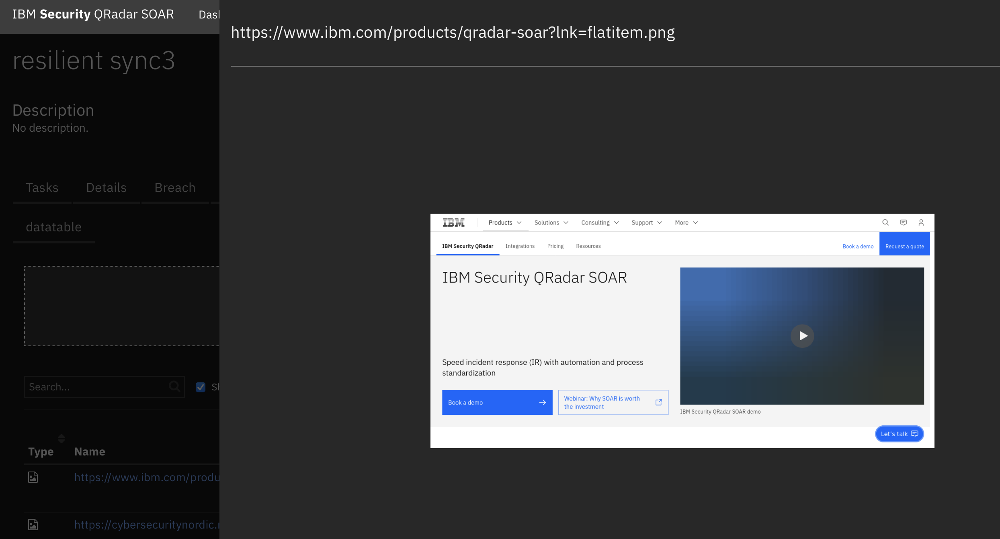
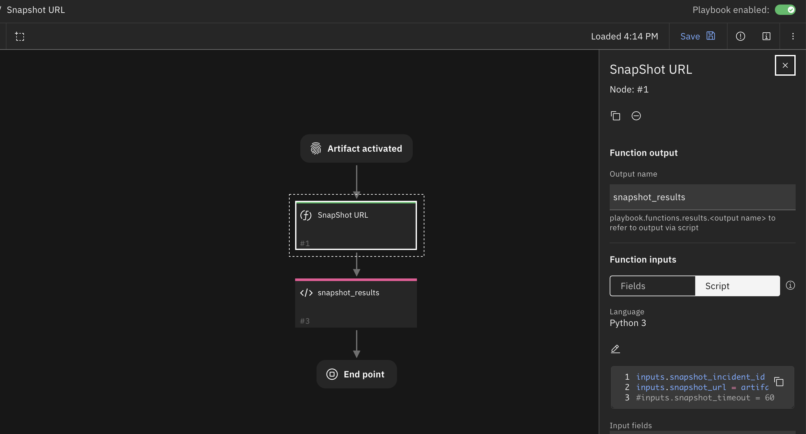
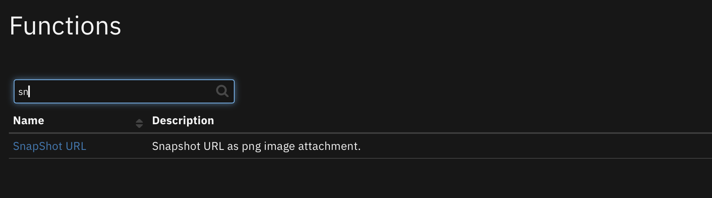

<!--
  This README.md is generated by running:
  "resilient-sdk docgen -p fn_snapshot_url"

  It is best edited using a Text Editor with a Markdown Previewer. VS Code
  is a good example. Checkout https://guides.github.com/features/mastering-markdown/
  for tips on writing with Markdown

  All fields followed by "::CHANGE_ME::"" should be manually edited

  If you make manual edits and run docgen again, a .bak file will be created

  Store any screenshots in the "doc/screenshots" directory and reference them like:
  

  NOTE: If your app is available in the container-format only, there is no need to mention the integration server in this readme.
-->

# Snapshot URL

## Table of Contents
- [Release Notes](#release-notes)
- [Overview](#overview)
  - [Key Features](#key-features)
- [Requirements](#requirements)
  - [SOAR platform](#soar-platform)
  - [Cloud Pak for Security](#cloud-pak-for-security)
  - [Proxy Server](#proxy-server)
  - [Python Environment](#python-environment)
- [Installation](#installation)
  - [Install](#install)
  - [App Configuration](#app-configuration)
- [Function - SnapShot URL](#function---snapshot-url)
- [Playbooks](#playbooks)
- [Troubleshooting & Support](#troubleshooting--support)
---

## Release Notes
<!--
  Specify all changes in this release. Do not remove the release 
  notes of a previous release
-->
| Version | Date | Notes |
| ------- | ---- | ----- |
| 1.0.0 | 01/2024 | Initial Release | 

---

## Overview
<!--
  Provide a high-level description of the function itself and its remote software or application.
  The text below is parsed from the "description" and "long_description" attributes in the setup.py file
-->
**Save snapshots of web pages as incident attachments**

 
 

Save snapshots of web pages as incident attachments

### Key Features
<!--
  List the Key Features of the Integration
-->
* URL Snapshot as PNG image attachment

---

## Requirements
<!--
  List any Requirements 
--> 
This app supports the IBM Security QRadar SOAR Platform and the IBM Security QRadar SOAR for IBM Cloud Pak for Security.

This implementation uses a FireFox browser to perform the url lookup and image rendering. The configuration of a Firefox browser may place additional constraints on an Integration Server. Therefore, the use of the App Host for container deployment is the easiest way to configure this app.

### SOAR platform
The SOAR platform supports two app deployment mechanisms, App Host and integration server.

If deploying to a SOAR platform with an App Host, the requirements are:
* SOAR platform >= `48.0.0`.
* The app is in a container-based format (available from the AppExchange as a `zip` file).

If deploying to a SOAR platform with an integration server, the requirements are:
* SOAR platform >= `48.0.0`.
* The app is in the older integration format (available from the AppExchange as a `zip` file which contains a `tar.gz` file).
* Integration server is running `resilient-circuits>=48.0.0`.
* If using an API key account, make sure the account provides the following minimum permissions: 
  | Name | Permissions |
  | ---- | ----------- |
  | Org Data | Read |
  | Function | Read |
  | Incident | Edit |

The following SOAR platform guides provide additional information: 
* _App Host Deployment Guide_: provides installation, configuration, and troubleshooting information, including proxy server settings. 
* _Integration Server Guide_: provides installation, configuration, and troubleshooting information, including proxy server settings.
* _System Administrator Guide_: provides the procedure to install, configure and deploy apps. 

The above guides are available on the IBM Documentation website at [ibm.biz/soar-docs](https://ibm.biz/soar-docs). On this web page, select your SOAR platform version. On the follow-on page, you can find the _App Host Deployment Guide_ or _Integration Server Guide_ by expanding **Apps** in the Table of Contents pane. The System Administrator Guide is available by expanding **System Administrator**.

### Cloud Pak for Security
If you are deploying to IBM Cloud Pak for Security, the requirements are:
* IBM Cloud Pak for Security >= 1.10.
* Cloud Pak is configured with an App Host.
* The app is in a container-based format (available from the AppExchange as a `zip` file).

The following Cloud Pak guides provide additional information: 
* _App Host Deployment Guide_: provides installation, configuration, and troubleshooting information, including proxy server settings. From the Table of Contents, select Case Management and Orchestration & Automation > **Orchestration and Automation Apps**.
* _System Administrator Guide_: provides information to install, configure, and deploy apps. From the IBM Cloud Pak for Security IBM Documentation table of contents, select Case Management and Orchestration & Automation > **System administrator**.

These guides are available on the IBM Documentation website at [ibm.biz/cp4s-docs](https://ibm.biz/cp4s-docs). From this web page, select your IBM Cloud Pak for Security version. From the version-specific IBM Documentation page, select Case Management and Orchestration & Automation.

### Proxy Server
The app **does** support a proxy server.

### Python Environment
Python 3.6 is supported.
Additional package dependencies may exist for each of these packages:
* resilient-circuits>=48.0.0
* selenium

---

## Installation

### Install
* To install or uninstall an App or Integration on the _SOAR platform_, see the documentation at [ibm.biz/soar-docs](https://ibm.biz/soar-docs).
* To install or uninstall an App on _IBM Cloud Pak for Security_, see the documentation at [ibm.biz/cp4s-docs](https://ibm.biz/cp4s-docs) and follow the instructions above to navigate to Orchestration and Automation.

### App Configuration

| Setting | Required | Example | Description |
| ------- | -------- | ------- | ----------- |
| proxy_server | No | `11.22.33.44` | HTTP(S) proxy server |

---

## Function - SnapShot URL
Snapshot URL as png image attachment.

 

<details><summary>Inputs:</summary>
<p>

| Name | Type | Required | Example | Tooltip |
| ---- | :--: | :------: | ------- | ------- |
| `snapshot_incident_id` | `number` | Yes | `-` | - |
| `snapshot_url` | `text` | Yes | `-` | - |
| `snapshot_timeout` | `number` | No | `30` | default is 30 seconds |
| `snapshot_fullpage` | bool | No | 'Yes' | full page image or just initial page height image |

</p>
</details>

<details><summary>Outputs:</summary>
<p>

> **NOTE:** This example might be in JSON format, but `results` is a Python Dictionary on the SOAR platform.

```python
results = {
  "content": {
    "attachment_name": "https://cybersecuritynordic.messukeskus.com/program-3/.png"
  },
  "inputs": {
    "snapshot_incident_id": 2103,
    "snapshot_url": "https://cybersecuritynordic.messukeskus.com/program-3/"
  },
  "metrics": {
    "execution_time_ms": 49769,
    "host": "1fd9269d-5558-411b-ba33-e4767f763c59-8678ccd8c8-xs2vr",
    "package": "fn-snapshot-url",
    "package_version": "1.0.0",
    "timestamp": "2023-12-28 20:51:10",
    "version": "1.0"
  },
  "raw": null,
  "reason": null,
  "success": true,
  "version": 2
}
```

</p>
</details>

<details><summary>Example Pre-Process Script:</summary>
<p>

```python
inputs.snapshot_incident_id = incident.id
inputs.snapshot_url = artifact.value
if getattr(playbook.inputs, "snapshot_url_load_timeout", None):
  inputs.snapshot_timeout = playbook.inputs.snapshot_url_load_timeout
inputs.snapshot_fullpage = playbook.inputs.snapshot_full_screen_capture
```

</p>
</details>

<details><summary>Example Post-Process Script:</summary>
<p>

```python
results = playbook.functions.results.snapshot_results

if results.success:
  incident.addNote(f"Snapshot URL for {results.inputs.snapshot_url} succeeded with attachment: {results.content.attachment_name}")
else:
  incident.addNote(f"Snapshot URL {results.reason}")

```

</p>
</details>

---

## Playbooks
| Playbook Name | Description | Object | Status |
| ------------- | ----------- | ------ | ------ |
| Snapshot URL | Manual playbook to snapshot URL as png attachment. | artifact | `enabled` |

---

## Troubleshooting & Support

### Full screen images are not viewable within SOAR. 
When viewing PNG files within SOAR by clicking on the attachment, only the bottom portion of the page is visible. Download the PNG attachment to view the entire URL page.

### For Support
This is a IBM Supported app. Refer issues to [ibm.com/mysupport](https://ibm.com/mysupport).
Also search the Community [ibm.biz/soarcommunity](https://ibm.biz/soarcommunity) for assistance.
