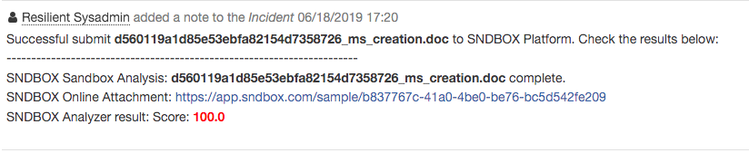
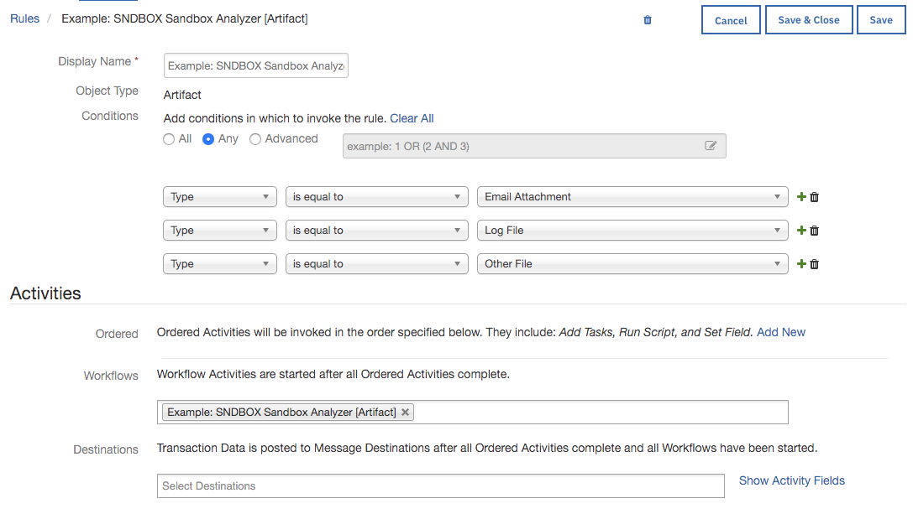
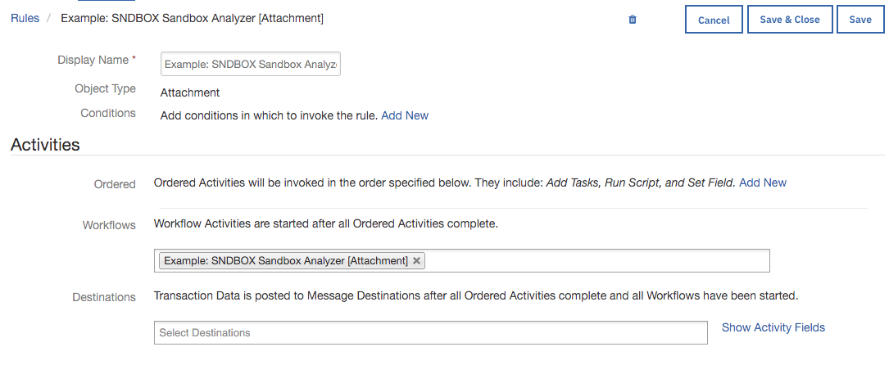

# SNDBOX Sandbox Analyzer Function for IBM Resilient

## Table of Contents
  - [app.config settings](#appconfig-settings)
  - [Function Inputs](#function-inputs)
  - [Function Output](#function-output)
  - [Pre-Process Script](#pre-process-script)
  - [Post-Process Script](#post-process-script)
  - [Rules](#rules)
  
--- 
 
This package contains a function that executes a SNDBOX Malware Sandbox Analysis using SNDBOX Cloud APIs, also included are two example workflows and two example rules that demonstrate how to use this function.


 

### Notes

* an attachment or artifact must be a file. Please refer https://app.sndbox.com/docs/files for the supported file list.
* The report only supports Type of JSON. HTML and PDF are not supported.

---

## app.config settings:  

```                                                                         
# Your SNDBOX Analyzer API Key                                                         
sndbox_api_key=

# Your SNDBOX Server URL, using https://api.sndbox.com if empty.
sndbox_analyzer_url=https://api.sndbox.com
             
# Amount of time in seconds to wait until timeout.
sndbox_analyzer_report_request_timeout=300 
```
---                                               

## Function Inputs:

| Function Name | Type | Required | Example  | Info |
| --------- | :---------: | ------------------ | ------| ----|
| `incident_id` | `Number` | Yes | `1001` | The ID of the current Incident|            
| `attachment_id` | `Number` | No | `5` | The ID of the Attachment to be analyzed|
| `artifact_id` | `Number` | No | `6` | The ID of the Artifact to be analyzed 
| `analyzer_report_status` | `Boolean` | Yes | `No` | Has the analysis report generated successfully. Options are: `Yes` or `No` |
---

## Function Output:

```python                                    
results = {
                "analysis_report_status": analysis_report_status,
                "incident_id": incident_id,
                "artifact_id": artifact_id,
                "attachment_id": attachment_id,
                "sample_final_result": sample_final_result
            }

```

---

## Pre-Process Script:

Example: SNDBOX Sandbox Analyzer [Attachment]

```python
inputs.incident_id = incident.id
inputs.attachment_id = attatchment.id
```
Example: SNDBOX Sandbox Analyzer [Artifact]

```python
inputs.incident_id = incident.id
inputs.artifact_id = artifact.id
```

---

## Post-Process Script:

This example adds a Note to the Incident and color codes the `analysis_status` depending if it was **malicious** or **clean**

```python
def font_color(score):
    color = "green"
    try:
        if float(score) >= 0.56:
            color = "red"
    except:
        pass
    return color

def sample_score(score):
    return round(score * 100) if score else 0

if not results.sndbox_analysis_report_status:
    noteText = u"""Successful submit <b>{}</b> to SNDBOX Platform. However it will take time to generate an analysis report, please submit it again later. <br>""".format(
        artifact.value)

else:
    noteText = u"""Successful submit <b>{}</b> to SNDBOX Platform. Check the results below: <br>""".format(
        artifact.value)

    for sample in results.sample_final_result:
        noteText += u"""-----------------------------------------------------------------------"""
        color = font_color(sample["sample_report"]["score"])
        noteText += u"""<br>SNDBOX Sandbox Analysis: <b>{sample_filename}</b> complete.<br>
                   SNDBOX Online Attachment: <a href={sample_online_report}>{sample_online_report}</a><br>
                   SNDBOX Analyzer result:  Score: <b style= "color:{color}">{sample_score}</b> <br>
               """.format(sample_filename=sample["sample_report"]["name"],
                          sample_online_report=sample["sample_report"]["sample_url"],
                          color=color,
                          sample_score=sample_score(sample["sample_report"]["score"]))

incident.addNote(helper.createRichText(noteText))
```

**Example of adding a incident note from post-processing scripts:**

 

---

## Rules

| Rule Name | Object Type | Workflow Triggered |
| --------- | :---------: | ------------------ |
| Example: SNDBOX Sandbox Analysis [Artifact]| `Artifact` | `Example: SNDBOX Sandbox Analyzer [Artifact]` |




| Rule Name | Object Type | Workflow Triggered2 |
| --------- | :---------: | ------------------ |
| Example: SNDBOX Sandbox Analyzer [Attachment]| `Attachment` | `Example: SNDBOX Sandbox Analyzer [Attachment]` |


