<!--
  This README.md is generated by running:
  "resilient-sdk docgen -p fn_soar_utils"

  It is best edited using a Text Editor with a Markdown Previewer. VS Code
  is a good example. Checkout https://guides.github.com/features/mastering-markdown/
  for tips on writing with Markdown

  All fields followed by "::CHANGE_ME::"" should be manually edited

  If you make manual edits and run docgen again, a .bak file will be created

  Store any screenshots in the "doc/screenshots" directory and reference them like:
  

  NOTE: If your app is available in the container-format only, there is no need to mention the integration server in this readme.
-->

# SOAR Function Utilities for SOAR

## Table of Contents
- [Release Notes](#release-notes)
- [Overview](#overview)
  - [Key Features](#key-features)
- [Requirements](#requirements)
  - [SOAR platform](#soar-platform)
  - [Cloud Pak for Security](#cloud-pak-for-security)
  - [Proxy Server](#proxy-server)
  - [Python Environment](#python-environment)
  - [Endpoint Developed With](#endpoint-developed-with)
- [Installation](#installation)
  - [Install](#install)
  - [App Configuration](#app-configuration)
- [Function - SOAR Utilities Artifact Hash](#function---soar-utilities-artifact-hash)
- [Function - SOAR Utilities: Attachment Hash](#function---soar-utilities-attachment-hash)
- [Function - SOAR Utilities: Attachment to Base64](#function---soar-utilities-attachment-to-base64)
- [Function - SOAR Utilities: Attachment Zip Extract](#function---soar-utilities-attachment-zip-extract)
- [Function - SOAR Utilities: Attachment Zip List](#function---soar-utilities-attachment-zip-list)
- [Function - SOAR Utilities: Base64 to Artifact](#function---soar-utilities-base64-to-artifact)
- [Function - SOAR Utilities: Base64 to Attachment](#function---soar-utilities-base64-to-attachment)
- [Function - SOAR Utilities: Close Incident](#function---soar-utilities-close-incident)
- [Function - SOAR Utilities: Create Incident](#function---soar-utilities-create-incident)
- [Function - SOAR Utilities: Get Contact Info](#function---soar-utilities-get-contact-info)
- [Function - SOAR Utilities: Search Incidents](#function---soar-utilities-search-incidents)
- [Function - SOAR Utilities: SOAR Search](#function---soar-utilities-soar-search)
- [Function - SOAR Utilities: String to Attachment](#function---soar-utilities-string-to-attachment)
- [Rules](#rules)
- [Troubleshooting & Support](#troubleshooting--support)
---

## Release Notes
<!--
  Specify all changes in this release. Do not remove the release 
  notes of a previous release
-->
| Version | Date | Notes |
| ------- | ---- | ----- |
| 1.0.0 | 10/2022 | Initial Release |

---

## Overview
<!--
  Provide a high-level description of the function itself and its remote software or application.
  The text below is parsed from the "description" and "long_description" attributes in the setup.py file
-->
**Useful workflow functions for common automation and integration activities in the SOAR platform.**

 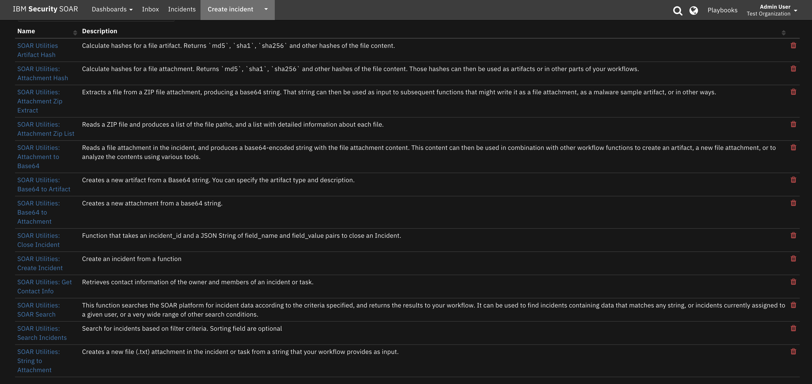

SOAR functions taken from fn_utilities to simplify development of integrations by wrapping each external activity into an individual workflow/playbook component. The SOAR Platform sends data from artifacts, attachments, incident data, etc. to the function component and returns results to the workflow/playbook. The results can be acted upon by scripts, rules, and workflow/playbook decision points to dynamically orchestrate the security incident response activities.
---

This app supports the IBM Security QRadar SOAR Platform and the IBM Security QRadar SOAR for IBM Cloud Pak for Security.

### SOAR platform
The SOAR platform supports two app deployment mechanisms, App Host and integration server.

If deploying to a SOAR platform with an App Host, the requirements are:
* SOAR platform >= `43.1.49`.
* The app is in a container-based format (available from the AppExchange as a `zip` file).

If deploying to a SOAR platform with an integration server, the requirements are:
* SOAR platform >= `43.1.49`.
* The app is in the older integration format (available from the AppExchange as a `zip` file which contains a `tar.gz` file).
* Integration server is running `resilient-circuits>=46.0.0`.
* If using an API key account, make sure the account provides the following minimum permissions: 
  | Name | Permissions |
  | ---- | ----------- |
  | Org Data | Read |
  | Function | Read |

The following SOAR platform guides provide additional information: 
* _App Host Deployment Guide_: provides installation, configuration, and troubleshooting information, including proxy server settings. 
* _Integration Server Guide_: provides installation, configuration, and troubleshooting information, including proxy server settings.
* _System Administrator Guide_: provides the procedure to install, configure and deploy apps. 

The above guides are available on the IBM Documentation website at [ibm.biz/soar-docs](https://ibm.biz/soar-docs). On this web page, select your SOAR platform version. On the follow-on page, you can find the _App Host Deployment Guide_ or _Integration Server Guide_ by expanding **Apps** in the Table of Contents pane. The System Administrator Guide is available by expanding **System Administrator**.

### Cloud Pak for Security
If you are deploying to IBM Cloud Pak for Security, the requirements are:
* IBM Cloud Pak for Security >= 1.7.
* Cloud Pak is configured with an App Host.
* The app is in a container-based format (available from the AppExchange as a `zip` file).

The following Cloud Pak guides provide additional information: 
* _App Host Deployment Guide_: provides installation, configuration, and troubleshooting information, including proxy server settings. From the Table of Contents, select Case Management and Orchestration & Automation > **Orchestration and Automation Apps**.
* _System Administrator Guide_: provides information to install, configure, and deploy apps. From the IBM Cloud Pak for Security IBM Documentation table of contents, select Case Management and Orchestration & Automation > **System administrator**.

These guides are available on the IBM Documentation website at [ibm.biz/cp4s-docs](https://ibm.biz/cp4s-docs). From this web page, select your IBM Cloud Pak for Security version. From the version-specific IBM Documentation page, select Case Management and Orchestration & Automation.

### Proxy Server
The app does support a proxy server.

### Python Environment
Both Python 3.6 and 3.9 are supported.
Additional package dependencies may exist for each of these packages:
* resilient-circuits>=46.0.0

---

## Installation

### Install
* To install or uninstall an App or Integration on the _SOAR platform_, see the documentation at [ibm.biz/soar-docs](https://ibm.biz/soar-docs).
* To install or uninstall an App on _IBM Cloud Pak for Security_, see the documentation at [ibm.biz/cp4s-docs](https://ibm.biz/cp4s-docs) and follow the instructions above to navigate to Orchestration and Automation.


---

## Function - SOAR Utilities Artifact Hash
Calculate hashes for a file artifact. Returns `md5`, `sha1`, `sha256` and other hashes of the file content.

 

<details><summary>Inputs:</summary>
<p>

| Name | Type | Required | Example | Tooltip |
| ---- | :--: | :------: | ------- | ------- |
| `artifact_id` | `number` | No | `-` | - |
| `incident_id` | `number` | Yes | `-` | - |

</p>
</details>

<details><summary>Outputs:</summary>
<p>

> **NOTE:** This example might be in JSON format, but `results` is a Python Dictionary on the SOAR platform.

```python
results = {
  "blake2b": "26c1297f39175f4b401ebf74e3e5ce49775ba7720f5cce375cabff28cd3b18511a8d9463c1c9f8c85a0cd6d9133b1e5d6486d1054946b2379e4dcafa1d91cc27",
  "blake2s": "9ee3fa9f9907f3c6321a7323aaf0bee5a4aa5eb59652911d3cde20567d90f75e",
  "content_type": "application/octet-stream",
  "created": 1663093337313,
  "filename": "fn_timer.log",
  "md5": "d6815ac62179797d87d21b942ed7c96f",
  "sha1": "44b7ed9daadb3ac89ead8977d04a0537fa3125ae",
  "sha224": "d859465ac0ccfadba558b6a4856f9517f3ab15ac3b338a96a815af7e",
  "sha256": "561976be4b6e992478c13ea230e0f6a4e708e3b7befc61642dcd281bcacec975",
  "sha384": "83a8bc932fc27c3e8f7c064a809c23aa8d737d2e1844b3c512e912fef14678f43bb0c994250a1d628b06b88075f2b441",
  "sha3_224": "18f24955d1f242a59f550f52c7bc09d08e423552774674058511cefc",
  "sha3_256": "756508e728338b4931e199674e65ff9ba5daa25914f75cca8d424efd7ab89f0d",
  "sha3_384": "6324ff6f2bfc710a0dfcb59f0c2f991e0d68f81976b1e85777bb94827ec031a22720dd4b66b12e2576bde798b74a0645",
  "sha3_512": "d3e927678ab6e0f6f00eba36f137565ba945d311f694a40fd8d1998296d41391e7ff9b07269499346ad65bc8f9f27d79b46680b1dc5656ad9e213491c2e1523a",
  "sha512": "f6f5835d41d48d27a1ed7101ae0e21dc3548aab452f5c5d9a634f68c09b50b3ec062f086296628f8d226566637887e5c7be815c83abe2dc8b2746e324b70ac5c",
  "shake_128": "8d64165fb1599e845faefe04040f8151589fec8fb13e09aeb6ea68e5f5b98ef5032e5233a6463785f1f613e8ba5b0fdb385754845c5f40b6d8f620496366d72709daca6b711ed9646f971e2ad76f78e83077bc8525e8b37610bc6584b96e89439672b093594b541a4c1a9b54bc9b5594d61aaaa3eee7435890cfa9035b820495",
  "shake_256": "356ba4b7bc9fda6ad64ed936f0d47e7b19022adfcfc236753182f13a82613c87e3b2dc206fb523952d1841837f785dd8bf137d74919253249327dec36a7b4f180a61cd29e2f2db53febac95deee3300519d4dd28ba08af297f29a5862653a314324e78e41fe2696ab25fb42aa80c63556eeb119d961157c0fb573d93953b7adc485e4cee5c3ecc5561acc5d45c2b1ccb5575a28763a877859d11c9f520d311a750314aebbd71e2459caa4d35a799aeee9f285934086f302d94f368ace46def566f6aac8884b5701914ff26f304b072931bbaeb697aa9d11a71d21767924c96ffe5793848aee50cf40d02dfe4f70f6d329cb83d380397f5f4081c1dcb39034458",
  "size": 14094
}
```

</p>
</details>

<details><summary>Example Pre-Process Script:</summary>
<p>

```python
inputs.incident_id = incident.id
inputs.artifact_id = artifact.id
```

</p>
</details>

<details><summary>Example Post-Process Script:</summary>
<p>

```python
# The result contains at least these three hashes
if results.get('sha256', None):
  incident.addArtifact("Malware SHA-256 Hash", results.get('sha256'), u"SHA-256 hash of '{}'".format(artifact.value))

if results.get('sha1', None):
  incident.addArtifact("Malware SHA-1 Hash", results.get('sha1'), u"SHA-1 hash of '{}'".format(artifact.value))

if results.get('md5', None):
  incident.addArtifact("Malware MD5 Hash", results.get('md5'), u"MD5 hash of '{}'".format(artifact.value))
```

</p>
</details>

---
## Function - SOAR Utilities: Attachment Hash
Calculate hashes for a file attachment. Returns `md5`, `sha1`, `sha256` and other hashes of the file content. Those hashes can then be used as artifacts or in other parts of your workflows.

 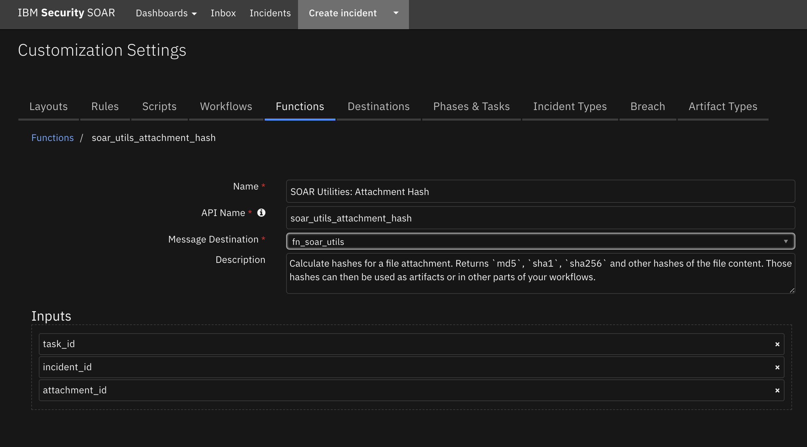

<details><summary>Inputs:</summary>
<p>

| Name | Type | Required | Example | Tooltip |
| ---- | :--: | :------: | ------- | ------- |
| `attachment_id` | `number` | No | `-` | - |
| `incident_id` | `number` | Yes | `-` | - |
| `task_id` | `number` | No | `-` | - |

</p>
</details>

<details><summary>Outputs:</summary>
<p>

> **NOTE:** This example might be in JSON format, but `results` is a Python Dictionary on the SOAR platform.

```python
results = {
  "blake2b": "26c1297f39175f4b401ebf74e3e5ce49775ba7720f5cce375cabff28cd3b18511a8d9463c1c9f8c85a0cd6d9133b1e5d6486d1054946b2379e4dcafa1d91cc27",
  "blake2s": "9ee3fa9f9907f3c6321a7323aaf0bee5a4aa5eb59652911d3cde20567d90f75e",
  "content_type": "application/octet-stream",
  "created": 1663177933110,
  "filename": "fn_timer.log",
  "md5": "d6815ac62179797d87d21b942ed7c96f",
  "sha1": "44b7ed9daadb3ac89ead8977d04a0537fa3125ae",
  "sha224": "d859465ac0ccfadba558b6a4856f9517f3ab15ac3b338a96a815af7e",
  "sha256": "561976be4b6e992478c13ea230e0f6a4e708e3b7befc61642dcd281bcacec975",
  "sha384": "83a8bc932fc27c3e8f7c064a809c23aa8d737d2e1844b3c512e912fef14678f43bb0c994250a1d628b06b88075f2b441",
  "sha3_224": "18f24955d1f242a59f550f52c7bc09d08e423552774674058511cefc",
  "sha3_256": "756508e728338b4931e199674e65ff9ba5daa25914f75cca8d424efd7ab89f0d",
  "sha3_384": "6324ff6f2bfc710a0dfcb59f0c2f991e0d68f81976b1e85777bb94827ec031a22720dd4b66b12e2576bde798b74a0645",
  "sha3_512": "d3e927678ab6e0f6f00eba36f137565ba945d311f694a40fd8d1998296d41391e7ff9b07269499346ad65bc8f9f27d79b46680b1dc5656ad9e213491c2e1523a",
  "sha512": "f6f5835d41d48d27a1ed7101ae0e21dc3548aab452f5c5d9a634f68c09b50b3ec062f086296628f8d226566637887e5c7be815c83abe2dc8b2746e324b70ac5c",
  "shake_128": "8d64165fb1599e845faefe04040f8151589fec8fb13e09aeb6ea68e5f5b98ef5032e5233a6463785f1f613e8ba5b0fdb385754845c5f40b6d8f620496366d72709daca6b711ed9646f971e2ad76f78e83077bc8525e8b37610bc6584b96e89439672b093594b541a4c1a9b54bc9b5594d61aaaa3eee7435890cfa9035b820495",
  "shake_256": "356ba4b7bc9fda6ad64ed936f0d47e7b19022adfcfc236753182f13a82613c87e3b2dc206fb523952d1841837f785dd8bf137d74919253249327dec36a7b4f180a61cd29e2f2db53febac95deee3300519d4dd28ba08af297f29a5862653a314324e78e41fe2696ab25fb42aa80c63556eeb119d961157c0fb573d93953b7adc485e4cee5c3ecc5561acc5d45c2b1ccb5575a28763a877859d11c9f520d311a750314aebbd71e2459caa4d35a799aeee9f285934086f302d94f368ace46def566f6aac8884b5701914ff26f304b072931bbaeb697aa9d11a71d21767924c96ffe5793848aee50cf40d02dfe4f70f6d329cb83d380397f5f4081c1dcb39034458",
  "size": 14094
}
```

</p>
</details>

<details><summary>Example Pre-Process Script:</summary>
<p>

```python
# Required inputs are: the incident id and attachment id
inputs.incident_id = incident.id
inputs.attachment_id = attachment.id

# If this is a "task attachment" then we will additionally have a task-id
if task is not None:
  inputs.task_id = task.id
```

</p>
</details>

<details><summary>Example Post-Process Script:</summary>
<p>

```python
# The result contains at least these three hashes
if results.get('sha256', None):
  incident.addArtifact("Malware SHA-256 Hash", results.get('sha256'), u"SHA-256 hash of '{}'".format(attachment.name))

if results.get('sha1', None):
  incident.addArtifact("Malware SHA-1 Hash", results.get('sha1'), u"SHA-1 hash of '{}'".format(attachment.name))

if results.get('md5', None):
  incident.addArtifact("Malware MD5 Hash", results.get('md5'), u"MD5 hash of '{}'".format(attachment.name))
```

</p>
</details>

---
## Function - SOAR Utilities: Attachment to Base64
Reads a file attachment in the incident, and produces a base64-encoded string with the file attachment content. This content can then be used in combination with other workflow functions to create an artifact, a new file attachment, or to analyze the contents using various tools.

 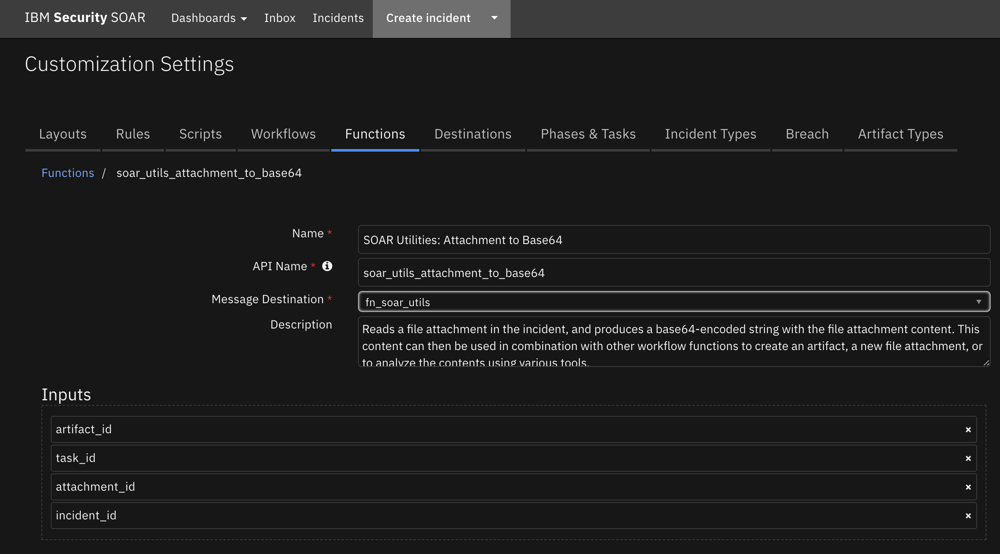 

<details><summary>Inputs:</summary>
<p>

| Name | Type | Required | Example | Tooltip |
| ---- | :--: | :------: | ------- | ------- |
| `artifact_id` | `number` | No | `-` | - |
| `attachment_id` | `number` | No | `-` | - |
| `incident_id` | `number` | Yes | `-` | - |
| `task_id` | `number` | No | `-` | - |

</p>
</details>

<details><summary>Outputs:</summary>
<p>

> **NOTE:** This example might be in JSON format, but `results` is a Python Dictionary on the SOAR platform.

```python
results = {
  "content": "+IENoYW5uZWw6IGZ1bmN0aW9ucy5mbl90aW1lcgoyMDIyLTA5LTA5IDE4OjA4OjM1LDQyOSBJTkZPIFtkZWNvcmF0b3JzXSBbZm5fdGltZXJdIFZhbGlkYXRlZCBmdW5jdGlvbiBpbnB1dHMKMjAyMi0wOS0wOSAxODowODozNSw0MzAgSU5GTyBbZGVjb3JhdG9yc10gW2ZuX3RpbWVyXSBTdGF0dXNNZXNzYWdlOiBTdGFydGluZyBBcHAgRnVuY3Rpb246ICdmbl90aW1lcicKMjAyMi0wOS0wOSAxODowODozNSw0MzAgSU5GTyBbZnVuY3RfZm5fdGltZXJdIHRpbWVyX3RpbWU6IDJtCjIwMjItMDktMDkgMTg6MDg6MzUsNDMzIElORk8gW2Z1bmN0X2ZuX3RpbWVyXSB0aW1lcl9lcG9jaDogTm9uZQoyMDIyLTA5LTA5IDE4OjA4OjM1LDQzMiBJTkZPIFtkZWNvcmF0b3JzXSBbZm5fdGltZXJdIFZhbGlkYXRlZCBmdW5jdGlvbiBpbnB1dHMKMjAyMi0wOS0wOSAxODowODozNSw0MzUgSU5GTyBbZGVjb3JhdG9yc10gW2ZuX3RpbWVyXSBTdGF0dXNNZXNzYWdlOiBTdGFydGluZyBBcHAgRnVuY3Rpb246ICdmbl90aW1lcicKMjAyMi0wOS0wOSAxODowODozNSw0MzYgSU5GTyBbZnVuY3RfZm5fdGltZXJdIHRpbWVyX3RpbWU6IDNtCjIwMjItMDktMDkgMTg6MDg6MzUsNDM2IElORk8gW2Z1bmN0X2ZuX3RpbWVyXSB0aW1lcl9lcG9jaDogTm9uZQoyMDIyLTA5LTA5IDE4OjA4OjM1LDUxNiBJTkZPIFtkZWNvcmF0b3JzXSBbZm5fdGltZXJdIFN0YXR1c01lc3NhZ2U6IFNsZWVwaW5nIGZvciAzMHMuIDAvMTIwcyBjb21wbGV0ZS4KMjAyMi0wOS0wOSAxODowODozNSw1MjkgSU5GTyBbZGVjb3JhdG9yc10gW2ZuX3RpbWVyXSBTdGF0dXNNZXNzYWdlOiBTbGVlcGluZyBmb3IgNDVzLiAwLzE4MHMgY29tcGxldGUuCjIwMjItMDktMDkgMTg6MDk6MDUsNjMwIElORk8gW2RlY29yYXRvcnNdIFtmbl90aW1lcl0gU3RhdHVzTWVzc2FnZTogV29ya2Zsb3cgd2FzIHRlcm1pbmF0ZWQuCjIwMjItMDktMDkgMTg6MDk6MDUsNjMyIElORk8gW2RlY29yYXRvcnNdIFtmbl90aW1lcl0gU3RhdHVzTWVzc2FnZTogVG90YWwgc2xlZXAgdGltZSAzMCBzZWNvbmRzIGNvbXBsZXRlLgoyMDIyLTA5LTA5IDE4OjA5OjA1LDYzMyBJTkZPIFtkZWNvcmF0b3JzXSBbZm5fdGltZXJdIFJldHVybmluZyByZXN1bHRzCjIwMjItMDktMDkgMTg6MDk6MDUsNjM2IElORk8gW2RlY29yYXRvcnNdIFtmbl90aW1lcl0gU3RhdHVzTWVzc2FnZTogRmluaXNoZWQgcnVubmluZyBBcHAgRnVuY3Rpb246ICdmbl90aW1lcicKMjAyMi0wOS0wOSAxODowOToyMCw2MzUgSU5GTyBbZGVjb3JhdG9yc10gW2ZuX3RpbWVyXSBTdGF0dXNNZXNzYWdlOiBXb3JrZmxvdyB3YXMgdGVybWluYXRlZC4KMjAyMi0wOS0wOSAxODowOToyMCw2MzYgSU5GTyBbZGVjb3JhdG9yc10gW2ZuX3RpbWVyXSBTdGF0dXNNZXNzYWdlOiBUb3RhbCBzbGVlcCB0aW1lIDQ1IHNlY29uZHMgY29tcGxldGUuCjIwMjItMDktMDkgMTg6MDk6MjAsNjM5IElORk8gW2RlY29yYXRvcnNdIFtmbl90aW1lcl0gUmV0dXJuaW5nIHJlc3VsdHMKMjAyMi0wOS0wOSAxODowOToyMCw2NDAgSU5GTyBbZGVjb3JhdG9yc10gW2ZuX3RpbWVyXSBTdGF0dXNNZXNzYWdlOiBGaW5pc2hlZCBydW5uaW5nIEFwcCBGdW5jdGlvbjogJ2ZuX3RpbWVyJwoyMDIyLTA5LTA5IDE4OjE5OjUxLDk3NCBJTkZPIFthY3Rpb25zX2NvbXBvbmVudF0gRXZlbnQ6IDxmbl90aW1lcltdIChpZD00MSwgd29ya2Zsb3c9cGxheWJvb2tfNTdmNmM1NjlfNWUxZV80ZTM4XzgwNjJfM2MzZDg2OTY1OTU3LCB1c2VyPWFkbWluQGV4YW1wbGUuY29tKSAyMDIyLTA5LTA5IDE4OjE5OjUxLjY5NzAwMD4gQ2hhbm5lbDogZnVuY3Rpb25zLmZuX3RpbWVyCjIwMjItMDktMDkgMTg6MTk6NTIsMTgwIElORk8gW2RlY29yYXRvcnNdIFtmbl90aW1lcl0gVmFsaWRhdGVkIGZ1bmN0aW9uIGlucHV0cwoyMDIyLTA5LTA5IDE4OjE5OjUyLDE4MSBJTkZPIFtkZWNvcmF0b3JzXSBbZm5fdGltZXJdIFN0YXR1c01lc3NhZ2U6IFN0YXJ0aW5nIEFwcCBGdW5jdGlvbjogJ2ZuX3RpbWVyJwoyMDIyLTA5LTA5IDE4OjE5OjUyLDE4MiBJTkZPIFtmdW5jdF9mbl90aW1lcl0gdGltZXJfdGltZTogNW0KMjAyMi0wOS0wOSAxODoxOTo1MiwxODIgSU5GTyBbZnVuY3RfZm5fdGltZXJdIHRpbWVyX2Vwb2NoOiBOb25lCjIwMjItMDktMDkgMTg6MTk6NTIsMTgyIFdBUk5JTkcgW2NvM10gVW52ZXJpZmllZCBIVFRQUyByZXF1ZXN0cyAoY2FmaWxlPWZhbHNlKS4KMjAyMi0wOS0wOSAxODoxOTo1MiwyODcgSU5GTyBbY28zYmFzZV0gVXNpbmcgb3JnIG5hbWU6IFRlc3QgT3JnYW5pemF0aW9uCjIwMjItMDktMDkgMTg6MTk6NTIsNDY3IElORk8gW2RlY29yYXRvcnNdIFtmbl90aW1lcl0gU3RhdHVzTWVzc2FnZTogU2xlZXBpbmcgZm9yIDc1cy4gMC8zMDBzIGNvbXBsZXRlLgoyMDIyLTA5LTA5IDE4OjIxOjA3LDYxMSBJTkZPIFtkZWNvcmF0b3JzXSBbZm5fdGltZXJdIFN0YXR1c01lc3NhZ2U6IFdvcmtmbG93IHdhcyB0ZXJtaW5hdGVkLgoyMDIyLTA5LTA5IDE4OjIxOjA3LDYxMiBJTkZPIFtkZWNvcmF0b3JzXSBbZm5fdGltZXJdIFN0YXR1c01lc3NhZ2U6IFRvdGFsIHNsZWVwIHRpbWUgNzUgc2Vjb25kcyBjb21wbGV0ZS4KMjAyMi0wOS0wOSAxODoyMTowNyw2MTYgSU5GTyBbZGVjb3JhdG9yc10gW2ZuX3RpbWVyXSBSZXR1cm5pbmcgcmVzdWx0cwoyMDIyLTA5LTA5IDE4OjIxOjA3LDYxNiBJTkZPIFtkZWNvcmF0b3JzXSBbZm5fdGltZXJdIFN0YXR1c01lc3NhZ2U6IEZpbmlzaGVkIHJ1bm5pbmcgQXBwIEZ1bmN0aW9uOiAnZm5fdGltZXIn",
  "content_type": "application/octet-stream",
  "created": 1663177933110,
  "filename": "fn_timer.log",
  "size": 14094
}
```

</p>
</details>

<details><summary>Example Pre-Process Script:</summary>
<p>

```python
# Required inputs are: incident_id artifact_id
inputs.incident_id = incident.id
inputs.artifact_id = artifact.id
```

</p>
</details>

<details><summary>Example Post-Process Script:</summary>
<p>

```python
if results.get("content", None) is not None:
  
  file_name = str(results.get("filename", ""))
  note_text = u"File {0} converted to base64 format: {1}...".format(file_name, results.get("content", "")[1:20] )

  incident.addNote(note_text)
```

</p>
</details>

---
## Function - SOAR Utilities: Attachment Zip Extract
Extracts a file from a ZIP file attachment, producing a base64 string.

That string can then be used as input to subsequent functions that might write it as a file attachment, as a malware sample artifact, or in other ways.

 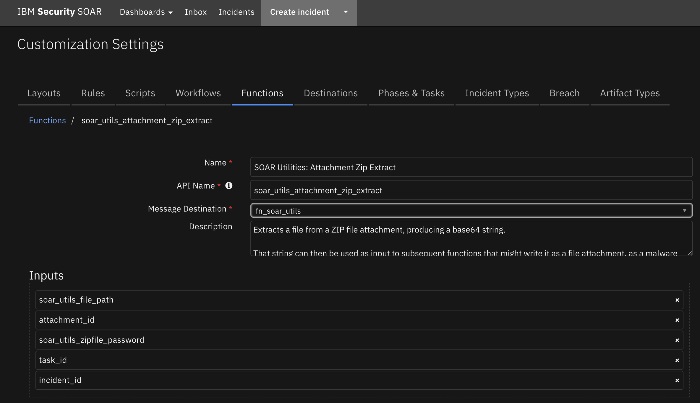

<details><summary>Inputs:</summary>
<p>

| Name | Type | Required | Example | Tooltip |
| ---- | :--: | :------: | ------- | ------- |
| `attachment_id` | `number` | No | `-` | - |
| `incident_id` | `number` | Yes | `-` | - |
| `soar_utils_file_path` | `text` | No | `-` | - |
| `soar_utils_zipfile_password` | `text` | No | `-` | - |
| `task_id` | `number` | No | `-` | - |

</p>
</details>

<details><summary>Outputs:</summary>
<p>

> **NOTE:** This example might be in JSON format, but `results` is a Python Dictionary on the SOAR platform.

```python
results = {
  "content": "+PG9tZ2RjOkJvdW5kcyBoZWlnaHQ9XCIxM1wiIHdpZHRoPVwiMFwiIHg9XCIyNjVcIiB5PVwiMTg0XCIvPjwvYnBtbmRpOkJQTU5MYWJlbD48L2JwbW5kaTpCUE1ORWRnZT48YnBtbmRpOkJQTU5FZGdlIGJwbW5FbGVtZW50PVwiU2VxdWVuY2VGbG93XzBlMDFxaTBcIiBpZD1cIlNlcXVlbmNlRmxvd18wZTAxcWkwX2RpXCI+PG9tZ2RpOndheXBvaW50IHg9XCI0MzJcIiB4c2k6dHlwZT1cIm9tZ2RjOlBvaW50XCIgeT1cIjIwNlwiLz48b21nZGk6d2F5cG9pbnQgeD1cIjU4M1wiIHhzaTp0eXBlPVwib21nZGM6UG9pbnRcIiB5PVwiMjA2XCIvPjxicG1uZGk6QlBNTkxhYmVsPjxvbWdkYzpCb3VuZHMgaGVpZ2h0PVwiMTNcIiB3aWR0aD1cIjBcIiB4PVwiNTA3LjVcIiB5PVwiMTg0LjVcIi8+PC9icG1uZGk6QlBNTkxhYmVsPjwvYnBtbmRpOkJQTU5FZGdlPjxicG1uZGk6QlBNTlNoYXBlIGJwbW5FbGVtZW50PVwiVGV4dEFubm90YXRpb25fMHBmcjY4N1wiIGlkPVwiVGV4dEFubm90YXRpb25fMHBmcjY4N19kaVwiPjxvbWdkYzpCb3VuZHMgaGVpZ2h0PVwiMzBcIiB3aWR0aD1cIjI4NlwiIHg9XCIxOTdcIiB5PVwiNTFcIi8+PC9icG1uZGk6QlBNTlNoYXBlPjxicG1uZGk6QlBNTkVkZ2UgYnBtbkVsZW1lbnQ9XCJBc3NvY2lhdGlvbl8xc3czOWxtXCIgaWQ9XCJBc3NvY2lhdGlvbl8xc3czOWxtX2RpXCI+PG9tZ2RpOndheXBvaW50IHg9XCIzNzBcIiB4c2k6dHlwZT1cIm9tZ2RjOlBvaW50XCIgeT1cIjE2NlwiLz48b21nZGk6d2F5cG9pbnQgeD1cIjM0NVwiIHhzaTp0eXBlPVwib21nZGM6UG9pbnRcIiB5PVwiODFcIi8+PC9icG1uZGk6QlBNTkVkZ2U+PC9icG1uZGk6QlBNTlBsYW5lPjwvYnBtbmRpOkJQTU5EaWFncmFtPjwvZGVmaW5pdGlvbnM+In0sICJjb250ZW50X3ZlcnNpb24iOiA1LCAiZGVzY3JpcHRpb24iOiAiUG9zdCBtZXNzYWdlIGZyb20gYSBUYXNrIHRvIHlvdXIgU2xhY2sgY2hhbm5lbC4gU2VuZCBzcGVjaWZpY3MgYWJvdXQgdGhlIFRhc2sgd2l0aCBhbiBvcHRpb25hbCBjdXN0b20gdGV4dCBtZXNzYWdlLiIsICJleHBvcnRfa2V5IjogInNsYWNrX2V4YW1wbGVfcG9zdF9tZXNzYWdlX3RvX3NsYWNrX190YXNrIiwgImxhc3RfbW9kaWZpZWRfYnkiOiAiYWRtaW5AZXhhbXBsZS5jb20iLCAibGFzdF9tb2RpZmllZF90aW1lIjogMTY1OTU1NDMxNzI0MSwgIm5hbWUiOiAiRXhhbXBsZTogUG9zdCBUYXNrIHRvIFNsYWNrIiwgIm9iamVjdF90eXBlIjogInRhc2siLCAicHJvZ3JhbW1hdGljX25hbWUiOiAic2xhY2tfZXhhbXBsZV9wb3N0X21lc3NhZ2VfdG9fc2xhY2tfX3Rhc2siLCAidGFncyI6IFt7InRhZ19oYW5kbGUiOiAiZm5fc2xhY2siLCAidmFsdWUiOiBudWxsfV0sICJ1dWlkIjogImViYThmMjcwLTJkMDMtNGRhOC1hODEyLTJjODc4Mzc0MjQ1NCIsICJ3b3JrZmxvd19pZCI6IDM2fV0sICJ3b3Jrc3BhY2VzIjogW119",
  "info": {
    "CRC": 1492648105,
    "comment": "",
    "compress_size": 10780,
    "compress_type": 8,
    "create_system": 3,
    "create_version": 20,
    "date_time": 1661452332000,
    "external_attr": 2175008768,
    "extract_version": 20,
    "file_size": 101541,
    "filename": "export.res",
    "flag_bits": 0,
    "header_offset": 588360,
    "internal_attr": 0,
    "volume": 0
  }
}
```

</p>
</details>

<details><summary>Example Pre-Process Script:</summary>
<p>

```python
# Required inputs are: the incident id and attachment id
inputs.incident_id = incident.id
inputs.attachment_id = attachment.id

# If this is a "task attachment" then we will additionally have a task-id
if task is not None:
  inputs.task_id = task.id

# The path within the zip that we want to extract
inputs.soar_utils_file_path = rule.properties.soar_utils_extract_file_path

# If the zipfile is password protected, specify here
# inputs.zipfile_password = 
if rule.properties.soar_utils_zip_password:
  inputs.soar_utils_zipfile_password = rule.properties.soar_utils_zip_password
```

</p>
</details>

<details><summary>Example Post-Process Script:</summary>
<p>

```python
None
```

</p>
</details>

---
## Function - SOAR Utilities: Attachment Zip List
Reads a ZIP file and produces a list of the file paths, and a list with detailed information about each file.

 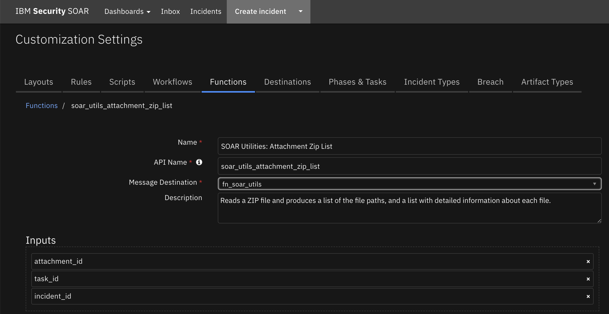

<details><summary>Inputs:</summary>
<p>

| Name | Type | Required | Example | Tooltip |
| ---- | :--: | :------: | ------- | ------- |
| `attachment_id` | `number` | No | `-` | - |
| `incident_id` | `number` | Yes | `-` | - |
| `task_id` | `number` | No | `-` | - |

</p>
</details>

<details><summary>Outputs:</summary>
<p>

> **NOTE:** This example might be in JSON format, but `results` is a Python Dictionary on the SOAR platform.

```python
results = {
  "infolist": [
    {
      "CRC": 2624755629,
      "comment": "",
      "compress_size": 563006,
      "compress_type": 8,
      "create_system": 3,
      "create_version": 20,
      "date_time": 1661452332000,
      "external_attr": 2175008768,
      "extract_version": 20,
      "file_size": 562852,
      "filename": "fn_slack-2.0.0.tar.gz",
      "flag_bits": 0,
      "header_offset": 0,
      "internal_attr": 0,
      "volume": 0
    },
    {
      "CRC": 3145654620,
      "comment": "",
      "compress_size": 25265,
      "compress_type": 8,
      "create_system": 3,
      "create_version": 20,
      "date_time": 1661452332000,
      "external_attr": 2175008768,
      "extract_version": 20,
      "file_size": 33851,
      "filename": "app.json",
      "flag_bits": 0,
      "header_offset": 563057,
      "internal_attr": 0,
      "volume": 0
    },
    {
      "CRC": 1492648105,
      "comment": "",
      "compress_size": 10780,
      "compress_type": 8,
      "create_system": 3,
      "create_version": 20,
      "date_time": 1661452332000,
      "external_attr": 2175008768,
      "extract_version": 20,
      "file_size": 101541,
      "filename": "export.res",
      "flag_bits": 0,
      "header_offset": 588360,
      "internal_attr": 0,
      "volume": 0
    }
  ],
  "namelist": [
    "fn_slack-2.0.0.tar.gz",
    "app.json",
    "export.res"
  ]
}
```

</p>
</details>

<details><summary>Example Pre-Process Script:</summary>
<p>

```python
# Required inputs are: the incident id and attachment id
inputs.incident_id = incident.id
inputs.attachment_id = attachment.id

# If this is a "task attachment" then we will additionally have a task-id
if task is not None:
  inputs.task_id = task.id
```

</p>
</details>

<details><summary>Example Post-Process Script:</summary>
<p>

```python
# The output contains two lists:
# - "namelist", which is just a list of the filenames (paths) within the zip file,
# - "infolist", which has full information for each file, including its name, size, and so on.

# For this example, let's create two notes

# One with a list of the namelist
html = u"<div><p>Contents of {}:</p>".format(attachment.name)
for filename in results.namelist:
  html = html + u"{}<br>".format(filename)
html = html + "</div>"
incident.addNote(helper.createRichText(html))

# Another with more detailed information
html = u"<div><p>Contents of {}:</p>".format(attachment.name)
for fileinfo in results.infolist:
  html = html + u"{} ({} bytes, {} compressed) {}<br>".format(fileinfo["filename"], fileinfo["file_size"], fileinfo["compress_size"], fileinfo["comment"])
html = html + "</div>"
incident.addNote(helper.createRichText(html))

```

</p>
</details>

---
## Function - SOAR Utilities: Base64 to Artifact
Creates a new artifact from a Base64 string. You can  specify the artifact type and description.

 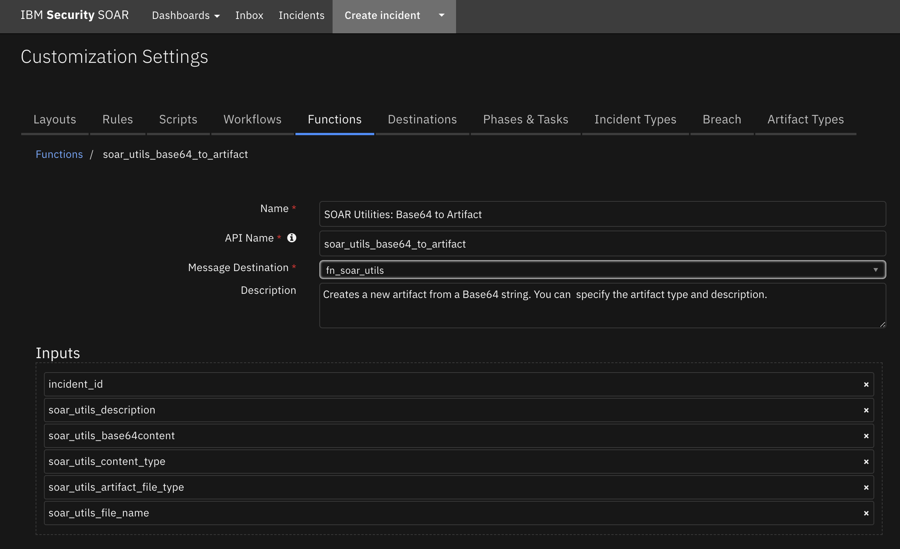

<details><summary>Inputs:</summary>
<p>

| Name | Type | Required | Example | Tooltip |
| ---- | :--: | :------: | ------- | ------- |
| `incident_id` | `number` | Yes | `-` | - |
| `soar_utils_artifact_file_type` | `select` | No | `-` | - |
| `soar_utils_base64content` | `text` | No | `-` | - |
| `soar_utils_content_type` | `text` | No | `-` | - |
| `soar_utils_description` | `textarea` | No | `-` | - |
| `soar_utils_file_name` | `text` | No | `-` | - |

</p>
</details>

<details><summary>Outputs:</summary>
<p>

> **NOTE:** This example might be in JSON format, but `results` is a Python Dictionary on the SOAR platform.

```python
results = {
  "actions": [],
  "attachment": {
    "actions": [
      {
        "enabled": true,
        "id": 33,
        "name": "Example: Virus Total for Attachments"
      },
      {
        "enabled": true,
        "id": 34,
        "name": "Example: Google Cloud - Inspect Attachment for PII"
      },
      {
        "enabled": true,
        "id": 35,
        "name": "Example: Google Cloud - Remove PII from Attachment"
      },
      {
        "enabled": true,
        "id": 47,
        "name": "Example: Attachment Hash"
      },
      {
        "enabled": true,
        "id": 48,
        "name": "Example: Attachment to Base64"
      },
      {
        "enabled": true,
        "id": 52,
        "name": "Example: Email Parsing (Attachment)"
      },
      {
        "enabled": true,
        "id": 41,
        "name": "Example: Post Incident / Task Attachment to Slack"
      },
      {
        "enabled": true,
        "id": 85,
        "name": "Example: SOAR Utilities Attachment Hash"
      },
      {
        "enabled": true,
        "id": 87,
        "name": "Example: SOAR Utilities Attachment to Base64"
      },
      {
        "enabled": true,
        "id": 59,
        "name": "Example: PDFiD"
      },
      {
        "enabled": true,
        "id": 60,
        "name": "Example: Resilient Search"
      },
      {
        "enabled": true,
        "id": 90,
        "name": "Example: SOAR Utilities SOAR Search"
      },
      {
        "enabled": false,
        "id": 65,
        "name": "Example: Use Excel Data"
      },
      {
        "enabled": false,
        "id": 67,
        "name": "Example: Zip Extract"
      },
      {
        "enabled": false,
        "id": 68,
        "name": "Example: Zip List"
      },
      {
        "enabled": false,
        "id": 96,
        "name": "Example: SOAR Utilities Zip List"
      },
      {
        "enabled": false,
        "id": 95,
        "name": "Example: SOAR Utilities Zip Extract"
      },
      {
        "enabled": false,
        "id": 97,
        "name": "Example: SOAR Utilities Zip Extract to Artifact"
      }
    ],
    "content_type": "image/jpeg",
    "created": 1663775473887,
    "creator_id": 6,
    "id": 71,
    "inc_id": 2112,
    "inc_name": "SOAR Utilities",
    "inc_owner": 1,
    "name": "tmppe_6ed00",
    "playbooks": [],
    "size": 180520,
    "task_at_id": null,
    "task_custom": null,
    "task_id": null,
    "task_members": null,
    "task_name": null,
    "type": "artifact",
    "uuid": "b2fb5c8f-92f8-46a8-a2a8-8b9342a1bb64",
    "vers": 12
  },
  "created": 1663775473530,
  "creator_principal": {
    "display_name": "Integration Server v43",
    "id": 6,
    "name": "0228e00e-2c47-43e6-a736-550f104c94ea",
    "type": "apikey"
  },
  "description": null,
  "global_artifact": [],
  "global_info": null,
  "hash": "c670630c6c19434d3d62b9f6e800bffd4cf5d5c361d64c8c92c628f1aba368ee",
  "hits": [],
  "id": 547,
  "inc_id": 2112,
  "inc_name": "SOAR Utilities",
  "inc_owner": 1,
  "ip": {
    "destination": null,
    "source": null
  },
  "last_modified_by": {
    "display_name": "Integration Server v43",
    "id": 6,
    "name": "0228e00e-2c47-43e6-a736-550f104c94ea",
    "type": "apikey"
  },
  "last_modified_time": 1663775473899,
  "parent_id": null,
  "pending_scan_result": false,
  "pending_sources": [],
  "perms": null,
  "playbooks": [],
  "properties": null,
  "related_incident_count": null,
  "relating": true,
  "type": 7,
  "value": "export.res.b64"
}
```

</p>
</details>

<details><summary>Example Pre-Process Script:</summary>
<p>

```python
inputs.soar_utils_base64content = workflow.properties.extracted_file.content
file_name = rule.properties.soar_utils_extract_file_path.split('/')[-1]

inputs.incident_id = incident.id
inputs.soar_utils_file_name = file_name + ".b64"
inputs.soar_utils_content_type = "image/jpeg"

```

</p>
</details>

<details><summary>Example Post-Process Script:</summary>
<p>

```python
None
```

</p>
</details>

---
## Function - SOAR Utilities: Base64 to Attachment
Creates a new attachment from a base64 string.

 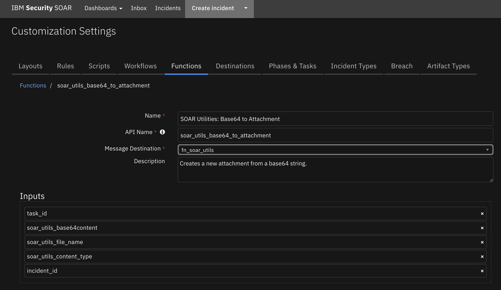

<details><summary>Inputs:</summary>
<p>

| Name | Type | Required | Example | Tooltip |
| ---- | :--: | :------: | ------- | ------- |
| `incident_id` | `number` | Yes | `-` | - |
| `soar_utils_base64content` | `text` | No | `-` | - |
| `soar_utils_content_type` | `text` | No | `-` | - |
| `soar_utils_file_name` | `text` | No | `-` | - |
| `task_id` | `number` | No | `-` | - |

</p>
</details>

<details><summary>Outputs:</summary>
<p>

> **NOTE:** This example might be in JSON format, but `results` is a Python Dictionary on the SOAR platform.

```python
results = {
  "actions": [
    {
      "enabled": true,
      "id": 33,
      "name": "Example: Virus Total for Attachments"
    },
    {
      "enabled": true,
      "id": 34,
      "name": "Example: Google Cloud - Inspect Attachment for PII"
    },
    {
      "enabled": true,
      "id": 35,
      "name": "Example: Google Cloud - Remove PII from Attachment"
    },
    {
      "enabled": true,
      "id": 47,
      "name": "Example: Attachment Hash"
    },
    {
      "enabled": true,
      "id": 48,
      "name": "Example: Attachment to Base64"
    },
    {
      "enabled": true,
      "id": 52,
      "name": "Example: Email Parsing (Attachment)"
    },
    {
      "enabled": true,
      "id": 41,
      "name": "Example: Post Incident / Task Attachment to Slack"
    },
    {
      "enabled": true,
      "id": 85,
      "name": "Example: SOAR Utilities Attachment Hash"
    },
    {
      "enabled": true,
      "id": 87,
      "name": "Example: SOAR Utilities Attachment to Base64"
    },
    {
      "enabled": true,
      "id": 59,
      "name": "Example: PDFiD"
    },
    {
      "enabled": true,
      "id": 60,
      "name": "Example: Resilient Search"
    },
    {
      "enabled": true,
      "id": 90,
      "name": "Example: SOAR Utilities SOAR Search"
    },
    {
      "enabled": false,
      "id": 65,
      "name": "Example: Use Excel Data"
    },
    {
      "enabled": false,
      "id": 67,
      "name": "Example: Zip Extract"
    },
    {
      "enabled": false,
      "id": 68,
      "name": "Example: Zip List"
    },
    {
      "enabled": false,
      "id": 96,
      "name": "Example: SOAR Utilities Zip List"
    },
    {
      "enabled": false,
      "id": 95,
      "name": "Example: SOAR Utilities Zip Extract"
    }
  ],
  "content_type": "image/jpeg",
  "created": 1663772427768,
  "creator_id": 6,
  "id": 70,
  "inc_id": 2112,
  "inc_name": "SOAR Utilities",
  "inc_owner": 1,
  "name": "export.res.b64",
  "playbooks": [],
  "size": 101541,
  "task_at_id": null,
  "task_custom": null,
  "task_id": null,
  "task_members": null,
  "task_name": null,
  "type": "incident",
  "uuid": "999c463c-4382-4435-9b3e-663f166080a8",
  "vers": 11
}
```

</p>
</details>

<details><summary>Example Pre-Process Script:</summary>
<p>

```python
inputs.soar_utils_base64content = workflow.properties.extracted_file.content
file_name = rule.properties.soar_utils_extract_file_path.split('/')[-1]

inputs.incident_id = incident.id
inputs.soar_utils_file_name = file_name + ".b64"
inputs.soar_utils_content_type = "image/jpeg"

```

</p>
</details>

<details><summary>Example Post-Process Script:</summary>
<p>

```python
None
```

</p>
</details>

---
## Function - SOAR Utilities: Close Incident
Function that takes an incident_id and a JSON String of field_name and field_value pairs to close an Incident.

 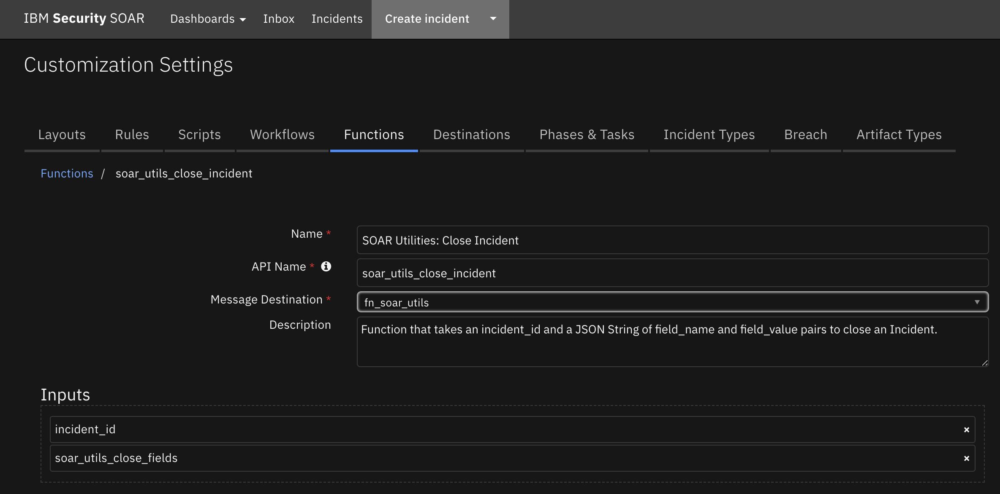

<details><summary>Inputs:</summary>
<p>

| Name | Type | Required | Example | Tooltip |
| ---- | :--: | :------: | ------- | ------- |
| `incident_id` | `number` | Yes | `-` | - |
| `soar_utils_close_fields` | `text` | No | `-` | A JSON String of the fields required to close an Incident e.g.: {"resolution_id":"Resolved","resolution_summary":"closing"} |

</p>
</details>

<details><summary>Outputs:</summary>
<p>

> **NOTE:** This example might be in JSON format, but `results` is a Python Dictionary on the SOAR platform.

```python
results = {
  "content": {
    "hints": [],
    "message": null,
    "success": true,
    "title": null
  },
  "inputs": {
    "incident_id": 2114,
    "soar_utils_close_fields": "{\"resolution_id\":\"Resolved\",\"resolution_summary\":\"closing\"}"
  },
  "metrics": {
    "execution_time_ms": 1781,
    "host": "My Host",
    "package": "fn-soar-utils",
    "package_version": "1.0.0",
    "timestamp": "2022-09-19 14:00:50",
    "version": "1.0"
  },
  "raw": "{\"success\": true, \"title\": null, \"message\": null, \"hints\": []}",
  "reason": null,
  "success": true,
  "version": "1.0"
}
```

</p>
</details>

<details><summary>Example Pre-Process Script:</summary>
<p>

```python
inputs.incident_id = incident.id
iu_close_fields = rule.properties.soar_utils_close_fields.content
inputs.soar_utils_close_fields = u"{}".format(iu_close_fields)
```

</p>
</details>

<details><summary>Example Post-Process Script:</summary>
<p>

```python
note_text = "Result from Example: Close Incident on Incident {0}: <strong>{1}</strong>".format(results.inputs['incident_id'], \
"success" if results.success else "failure.<br>Reason: {}".format(results.reason))
incident.addNote(helper.createRichText(note_text))
```

</p>
</details>

---
## Function - SOAR Utilities: Create Incident
Create an incident from a function

 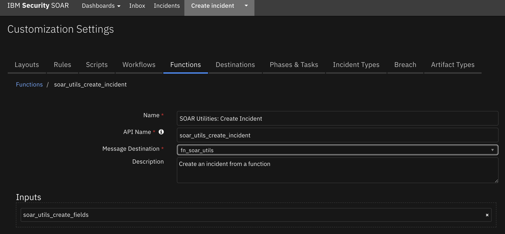 

<details><summary>Inputs:</summary>
<p>

| Name | Type | Required | Example | Tooltip |
| ---- | :--: | :------: | ------- | ------- |
| `soar_utils_create_fields` | `text` | Yes | `{"name": "sample", "description": "sample incident", "discovered_date": 1621110044000}` | json fields to create an incident |

</p>
</details>

<details><summary>Outputs:</summary>
<p>

> **NOTE:** This example might be in JSON format, but `results` is a Python Dictionary on the SOAR platform.

```python
results = {
  "content": {
    "actions": [
      {
        "enabled": true,
        "id": 69,
        "name": "Timer Epoch"
      },
      {
        "enabled": true,
        "id": 70,
        "name": "Timer in Parallel"
      },
      {
        "enabled": false,
        "id": 72,
        "name": "Symantec DLP: Get DLP Notes"
      },
      {
        "enabled": true,
        "id": 37,
        "name": "Example: Archive Incident Slack Channel"
      },
      {
        "enabled": true,
        "id": 42,
        "name": "Example: Post Incident to Slack"
      },
      {
        "enabled": false,
        "id": 75,
        "name": "Symantec DLP: Update DLP Incident"
      },
      {
        "enabled": false,
        "id": 78,
        "name": "Symantec DLP: Upload Binaries as Artifact"
      },
      {
        "enabled": false,
        "id": 79,
        "name": "Symantec DLP: Write DLP Incident Details to Note"
      },
      {
        "enabled": true,
        "id": 81,
        "name": "Example: Close Incident"
      },
      {
        "enabled": true,
        "id": 82,
        "name": "Example: Create Incident"
      },
      {
        "enabled": true,
        "id": 83,
        "name": "Example: Search Incidents"
      },
      {
        "enabled": true,
        "id": 55,
        "name": "Example: Get Incident Contact Info"
      },
      {
        "enabled": true,
        "id": 88,
        "name": "Example: SOAR Utilities Close Incident"
      },
      {
        "enabled": true,
        "id": 89,
        "name": "Example: SOAR Utilities Create Incident"
      },
      {
        "enabled": true,
        "id": 91,
        "name": "Example: SOAR Utilities Get Incident Contact Info"
      },
      {
        "enabled": true,
        "id": 63,
        "name": "Example: Timer Epoch"
      },
      {
        "enabled": true,
        "id": 64,
        "name": "Example: Timers in Parallel"
      },
      {
        "enabled": true,
        "id": 93,
        "name": "Example: SOAR Utilities Search Incidents"
      }
    ],
    "addr": null,
    "admin_id": null,
    "artifacts": null,
    "assessment": "\u003c?xml version=\"1.0\" encoding=\"UTF-8\" standalone=\"yes\"?\u003e\n\u003cassessment\u003e\n    \u003crollups/\u003e\n    \u003coptional\u003eThere are 1 required and 0 optional tasks from 1 regulators.\u003c/optional\u003e\n\u003c/assessment\u003e\n",
    "city": null,
    "cm": {
      "geo_counts": {},
      "total": 0,
      "unassigneds": []
    },
    "comments": null,
    "confirmed": false,
    "country": null,
    "create_date": 1663297952673,
    "creator": null,
    "creator_id": 6,
    "creator_principal": {
      "display_name": "Integration Server v43",
      "id": 6,
      "name": "0228e00e-2c47-43e6-a736-550f104c94ea",
      "type": "apikey"
    },
    "crimestatus_id": 1,
    "data_compromised": null,
    "description": "Testing",
    "discovered_date": 1621110044000,
    "draft": false,
    "dtm": {},
    "due_date": null,
    "employee_involved": null,
    "end_date": null,
    "exposure": 0,
    "exposure_dept_id": null,
    "exposure_individual_name": null,
    "exposure_type_id": 1,
    "exposure_vendor_id": null,
    "gdpr": {
      "gdpr_breach_circumstances": [],
      "gdpr_breach_type": null,
      "gdpr_breach_type_comment": null,
      "gdpr_consequences": null,
      "gdpr_consequences_comment": null,
      "gdpr_final_assessment": null,
      "gdpr_final_assessment_comment": null,
      "gdpr_identification": null,
      "gdpr_identification_comment": null,
      "gdpr_personal_data": null,
      "gdpr_personal_data_comment": null,
      "gdpr_subsequent_notification": null
    },
    "hard_liability": 0,
    "hipaa": {
      "hipaa_acquired": null,
      "hipaa_acquired_comment": null,
      "hipaa_additional_misuse": null,
      "hipaa_additional_misuse_comment": null,
      "hipaa_adverse": null,
      "hipaa_adverse_comment": null,
      "hipaa_breach": null,
      "hipaa_breach_comment": null,
      "hipaa_misused": null,
      "hipaa_misused_comment": null
    },
    "id": 2114,
    "inc_last_modified_date": 1663297953098,
    "inc_start": null,
    "inc_training": false,
    "incident_type_ids": [],
    "is_scenario": false,
    "jurisdiction_name": null,
    "jurisdiction_reg_id": null,
    "members": [],
    "name": "Create Incident",
    "negative_pr_likely": null,
    "nist_attack_vectors": [],
    "org_handle": 201,
    "org_id": 201,
    "owner_id": 3,
    "perms": {
      "assign": true,
      "attach_file": true,
      "change_members": true,
      "change_workspace": true,
      "close": true,
      "comment": true,
      "create_artifacts": true,
      "create_milestones": true,
      "delete": true,
      "delete_attachments": true,
      "list_artifacts": true,
      "list_milestones": true,
      "read": true,
      "read_attachments": true,
      "write": true
    },
    "phase_id": 1000,
    "pii": {
      "alberta_health_risk_assessment": null,
      "assessment": "\u003c?xml version=\"1.0\" encoding=\"UTF-8\" standalone=\"yes\"?\u003e\n\u003cassessment\u003e\n    \u003crollups/\u003e\n    \u003coptional\u003eThere are 1 required and 0 optional tasks from 1 regulators.\u003c/optional\u003e\n\u003c/assessment\u003e\n",
      "california_health_risk_assessment": null,
      "data_compromised": null,
      "data_contained": null,
      "data_encrypted": null,
      "data_format": null,
      "data_source_ids": [],
      "dc_impact_likely": null,
      "determined_date": 1621110044000,
      "exposure": 0,
      "gdpr_harm_risk": null,
      "gdpr_lawful_data_processing_categories": [],
      "harmstatus_id": 2,
      "impact_likely": null,
      "new_zealand_risk_assessment": null,
      "ny_impact_likely": null,
      "or_impact_likely": null,
      "singapore_risk_assessment": null,
      "wa_impact_likely": null
    },
    "plan_status": "A",
    "playbooks": [
      {
        "display_name": "TImer",
        "playbook_handle": 1
      }
    ],
    "properties": {
      "internal_customizations_field": null,
      "sdlp_incident_id": null,
      "sdlp_incident_status": null,
      "sdlp_incident_url": null,
      "sdlp_policy_group_id": null,
      "sdlp_policy_group_name": null,
      "sdlp_policy_id": null,
      "sdlp_policy_name": null
    },
    "regulator_risk": {},
    "regulators": {
      "ids": []
    },
    "reporter": null,
    "resolution_id": null,
    "resolution_summary": null,
    "sequence_code": null,
    "severity_code": null,
    "start_date": null,
    "state": null,
    "task_changes": {
      "added": [],
      "removed": []
    },
    "tasks": null,
    "timer_field_summarized_incident_data": [],
    "vers": 2,
    "workspace": 1,
    "zip": null
  },
  "inputs": {
    "soar_utils_create_fields": "{\"name\":\"Create Incident\",\"description\":\"Testing\",\"discovered_date\":1621110044000}"
  },
  "metrics": {
    "execution_time_ms": 1705,
    "host": "My Host",
    "package": "fn-soar-utils",
    "package_version": "1.0.0",
    "timestamp": "2022-09-15 23:12:33",
    "version": "1.0"
  },
  "raw": "{\"dtm\": {}, \"cm\": {\"unassigneds\": [], \"total\": 0, \"geo_counts\": {}}, \"regulators\": {\"ids\": []}, \"hipaa\": {\"hipaa_adverse\": null, \"hipaa_misused\": null, \"hipaa_acquired\": null, \"hipaa_additional_misuse\": null, \"hipaa_breach\": null, \"hipaa_adverse_comment\": null, \"hipaa_misused_comment\": null, \"hipaa_acquired_comment\": null, \"hipaa_additional_misuse_comment\": null, \"hipaa_breach_comment\": null}, \"tasks\": null, \"artifacts\": null, \"name\": \"Create Incident\", \"description\": \"Testing\", \"phase_id\": 1000, \"inc_training\": false, \"vers\": 2, \"addr\": null, \"city\": null, \"creator\": null, \"creator_principal\": {\"id\": 6, \"type\": \"apikey\", \"name\": \"0228e00e-2c47-43e6-a736-550f104c94ea\", \"display_name\": \"Integration Server v43\"}, \"exposure_type_id\": 1, \"incident_type_ids\": [], \"reporter\": null, \"state\": null, \"country\": null, \"zip\": null, \"workspace\": 1, \"exposure\": 0, \"org_handle\": 201, \"members\": [], \"negative_pr_likely\": null, \"perms\": {\"read\": true, \"write\": true, \"comment\": true, \"assign\": true, \"close\": true, \"change_members\": true, \"attach_file\": true, \"read_attachments\": true, \"delete_attachments\": true, \"create_milestones\": true, \"list_milestones\": true, \"create_artifacts\": true, \"list_artifacts\": true, \"delete\": true, \"change_workspace\": true}, \"confirmed\": false, \"task_changes\": {\"added\": [], \"removed\": []}, \"assessment\": \"\u003c?xml version=\\\"1.0\\\" encoding=\\\"UTF-8\\\" standalone=\\\"yes\\\"?\u003e\\n\u003cassessment\u003e\\n    \u003crollups/\u003e\\n    \u003coptional\u003eThere are 1 required and 0 optional tasks from 1 regulators.\u003c/optional\u003e\\n\u003c/assessment\u003e\\n\", \"data_compromised\": null, \"draft\": false, \"properties\": {\"sdlp_policy_name\": null, \"sdlp_policy_group_name\": null, \"sdlp_policy_id\": null, \"sdlp_incident_status\": null, \"sdlp_incident_url\": null, \"internal_customizations_field\": null, \"sdlp_incident_id\": null, \"sdlp_policy_group_id\": null}, \"resolution_id\": null, \"resolution_summary\": null, \"pii\": {\"data_compromised\": null, \"determined_date\": 1621110044000, \"harmstatus_id\": 2, \"data_encrypted\": null, \"data_contained\": null, \"impact_likely\": null, \"ny_impact_likely\": null, \"or_impact_likely\": null, \"wa_impact_likely\": null, \"dc_impact_likely\": null, \"data_source_ids\": [], \"data_format\": null, \"assessment\": \"\u003c?xml version=\\\"1.0\\\" encoding=\\\"UTF-8\\\" standalone=\\\"yes\\\"?\u003e\\n\u003cassessment\u003e\\n    \u003crollups/\u003e\\n    \u003coptional\u003eThere are 1 required and 0 optional tasks from 1 regulators.\u003c/optional\u003e\\n\u003c/assessment\u003e\\n\", \"exposure\": 0, \"gdpr_harm_risk\": null, \"gdpr_lawful_data_processing_categories\": [], \"alberta_health_risk_assessment\": null, \"california_health_risk_assessment\": null, \"new_zealand_risk_assessment\": null, \"singapore_risk_assessment\": null}, \"gdpr\": {\"gdpr_breach_circumstances\": [], \"gdpr_breach_type\": null, \"gdpr_personal_data\": null, \"gdpr_identification\": null, \"gdpr_consequences\": null, \"gdpr_final_assessment\": null, \"gdpr_breach_type_comment\": null, \"gdpr_personal_data_comment\": null, \"gdpr_identification_comment\": null, \"gdpr_consequences_comment\": null, \"gdpr_final_assessment_comment\": null, \"gdpr_subsequent_notification\": null}, \"regulator_risk\": {}, \"inc_last_modified_date\": 1663297953098, \"comments\": null, \"actions\": [{\"id\": 69, \"name\": \"Timer Epoch\", \"enabled\": true}, {\"id\": 70, \"name\": \"Timer in Parallel\", \"enabled\": true}, {\"id\": 72, \"name\": \"Symantec DLP: Get DLP Notes\", \"enabled\": false}, {\"id\": 37, \"name\": \"Example: Archive Incident Slack Channel\", \"enabled\": true}, {\"id\": 42, \"name\": \"Example: Post Incident to Slack\", \"enabled\": true}, {\"id\": 75, \"name\": \"Symantec DLP: Update DLP Incident\", \"enabled\": false}, {\"id\": 78, \"name\": \"Symantec DLP: Upload Binaries as Artifact\", \"enabled\": false}, {\"id\": 79, \"name\": \"Symantec DLP: Write DLP Incident Details to Note\", \"enabled\": false}, {\"id\": 81, \"name\": \"Example: Close Incident\", \"enabled\": true}, {\"id\": 82, \"name\": \"Example: Create Incident\", \"enabled\": true}, {\"id\": 83, \"name\": \"Example: Search Incidents\", \"enabled\": true}, {\"id\": 55, \"name\": \"Example: Get Incident Contact Info\", \"enabled\": true}, {\"id\": 88, \"name\": \"Example: SOAR Utilities Close Incident\", \"enabled\": true}, {\"id\": 89, \"name\": \"Example: SOAR Utilities Create Incident\", \"enabled\": true}, {\"id\": 91, \"name\": \"Example: SOAR Utilities Get Incident Contact Info\", \"enabled\": true}, {\"id\": 63, \"name\": \"Example: Timer Epoch\", \"enabled\": true}, {\"id\": 64, \"name\": \"Example: Timers in Parallel\", \"enabled\": true}, {\"id\": 93, \"name\": \"Example: SOAR Utilities Search Incidents\", \"enabled\": true}], \"playbooks\": [{\"playbook_handle\": 1, \"display_name\": \"TImer\"}], \"timer_field_summarized_incident_data\": [], \"admin_id\": null, \"creator_id\": 6, \"crimestatus_id\": 1, \"employee_involved\": null, \"end_date\": null, \"exposure_dept_id\": null, \"exposure_individual_name\": null, \"exposure_vendor_id\": null, \"jurisdiction_name\": null, \"jurisdiction_reg_id\": null, \"start_date\": null, \"inc_start\": null, \"org_id\": 201, \"is_scenario\": false, \"hard_liability\": 0, \"nist_attack_vectors\": [], \"id\": 2114, \"sequence_code\": null, \"discovered_date\": 1621110044000, \"due_date\": null, \"create_date\": 1663297952673, \"owner_id\": 3, \"severity_code\": null, \"plan_status\": \"A\"}",
  "reason": null,
  "success": true,
  "version": "1.0"
}
```

</p>
</details>

<details><summary>Example Pre-Process Script:</summary>
<p>

```python
inputs.soar_utils_create_fields = rule.properties.soar_utils_create_fields.content
```

</p>
</details>

<details><summary>Example Post-Process Script:</summary>
<p>

```python
if results.success:
  link = u'<a href="#incidents/{0}">{0}: {1}</a>'.format(results.content['id'], results.content['name'])
  incident.addNote(helper.createRichText(u"Incident successfully created: {}".format(link)))
else:
  incident.addNote(u"Incident creation failed: {}".format(results.reason))
```

</p>
</details>

---
## Function - SOAR Utilities: Get Contact Info
Retrieves contact information of the owner and members of an incident or task.

 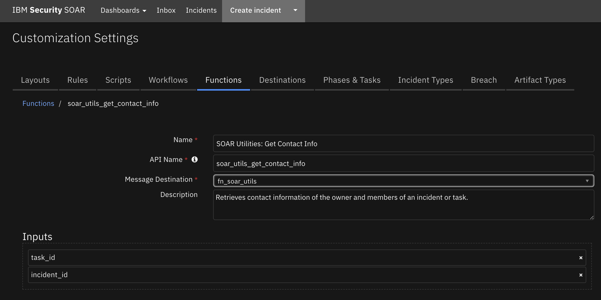

<details><summary>Inputs:</summary>
<p>

| Name | Type | Required | Example | Tooltip |
| ---- | :--: | :------: | ------- | ------- |
| `incident_id` | `number` | Yes | `-` | - |
| `task_id` | `number` | No | `-` | - |

</p>
</details>

<details><summary>Outputs:</summary>
<p>

> **NOTE:** This example might be in JSON format, but `results` is a Python Dictionary on the SOAR platform.

```python
results = {
  "members": [],
  "owner": {
    "cell": "",
    "display_name": "Admin User",
    "email": "admin@example.com",
    "fname": "Admin",
    "lname": "User",
    "phone": "",
    "title": ""
  }
}
```

</p>
</details>

<details><summary>Example Pre-Process Script:</summary>
<p>

```python
inputs.incident_id = incident.id
```

</p>
</details>

<details><summary>Example Post-Process Script:</summary>
<p>

```python
# {'owner': {'fname': 'Resilient', 'lname': 'Sysadmin', 'title': '', 'display_name': 'Resilient Sysadmin', 'email': 'b@a.com', 'phone': '781 838 4848', 'cell': '978 373 2839'}, 'members': []}
# {'owner': None, 'members': [{'fname': 'Resilient', 'lname': 'Sysadmin', 'title': '', 'display_name': 'Resilient Sysadmin', 'email': 'b@a.com', 'phone': '781 838 4848', 'cell': '978 373 2839'}]}
owner = u"{} ({})".format(results['owner']['display_name'], results['owner']['email']) if results['owner'] else 'Unassigned'
note_text = u"Owner: {}\nMembers:\n{}".format(owner, u"\n".join([u"{} ({})".format(member['display_name'], member['email']) for member in results['members']]))
incident.addNote(note_text)
```

</p>
</details>

---
## Function - SOAR Utilities: Search Incidents
Search for incidents based on filter criteria. Sorting field are optional

 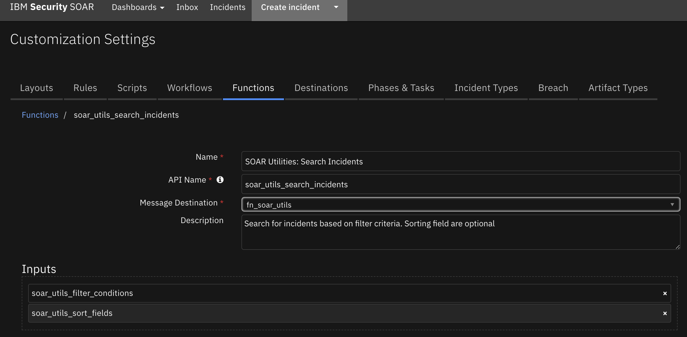

<details><summary>Inputs:</summary>
<p>

| Name | Type | Required | Example | Tooltip |
| ---- | :--: | :------: | ------- | ------- |
| `soar_utils_filter_conditions` | `text` | No | `[{"field_name":"name", "method":"contains", "value":"sample"}]` | json fields to filter incident records to return |
| `soar_utils_sort_fields` | `text` | No | `[{"field_name":"id", "type": "asc"}]` | json fields to order result set |

</p>
</details>

<details><summary>Outputs:</summary>
<p>

> **NOTE:** This example might be in JSON format, but `results` is a Python Dictionary on the SOAR platform.

```python
results = {
  "content": {
    "data": [
      {
        "addr": null,
        "admin_id": null,
        "assessment": "\u003c?xml version=\"1.0\" encoding=\"UTF-8\" standalone=\"yes\"?\u003e\n\u003cassessment\u003e\n    \u003crollups/\u003e\n    \u003coptional\u003eThere are 1 required and 0 optional tasks from 1 regulators.\u003c/optional\u003e\n\u003c/assessment\u003e\n",
        "city": null,
        "confirmed": true,
        "country": null,
        "create_date": 1643922148213,
        "creator": {
          "cell": "",
          "display_name": "Admin User",
          "email": "admin@example.com",
          "fname": "Admin",
          "id": 1,
          "is_external": false,
          "is_ldap": false,
          "is_saml": false,
          "lname": "User",
          "locked": false,
          "password_changed": false,
          "phone": "",
          "status": "A",
          "title": "",
          "ui_theme": "verydarkmode"
        },
        "creator_id": 1,
        "creator_principal": {
          "display_name": "Admin User",
          "id": 1,
          "name": "admin@example.com",
          "type": "user"
        },
        "crimestatus_id": 5,
        "data_compromised": null,
        "description": null,
        "discovered_date": 1643922138662,
        "draft": false,
        "due_date": null,
        "employee_involved": null,
        "end_date": null,
        "exposure": 0,
        "exposure_dept_id": null,
        "exposure_individual_name": null,
        "exposure_type_id": 1,
        "exposure_vendor_id": null,
        "gdpr": {
          "gdpr_breach_circumstances": [],
          "gdpr_breach_type": null,
          "gdpr_breach_type_comment": null,
          "gdpr_consequences": null,
          "gdpr_consequences_comment": null,
          "gdpr_final_assessment": null,
          "gdpr_final_assessment_comment": null,
          "gdpr_identification": null,
          "gdpr_identification_comment": null,
          "gdpr_personal_data": null,
          "gdpr_personal_data_comment": null,
          "gdpr_subsequent_notification": null
        },
        "hard_liability": 0,
        "id": 2095,
        "inc_last_modified_date": 1647529122634,
        "inc_start": null,
        "inc_training": false,
        "incident_type_ids": [],
        "is_scenario": false,
        "jurisdiction_name": null,
        "jurisdiction_reg_id": null,
        "members": [],
        "name": "AbuseIPDB",
        "negative_pr_likely": null,
        "nist_attack_vectors": [],
        "org_handle": 201,
        "org_id": 201,
        "owner_id": 1,
        "perms": {
          "assign": true,
          "attach_file": true,
          "change_members": true,
          "change_workspace": true,
          "close": true,
          "comment": true,
          "create_artifacts": true,
          "create_milestones": true,
          "delete": true,
          "delete_attachments": true,
          "list_artifacts": true,
          "list_milestones": true,
          "read": true,
          "read_attachments": true,
          "write": true
        },
        "phase_id": 1000,
        "pii": {
          "alberta_health_risk_assessment": null,
          "assessment": "\u003c?xml version=\"1.0\" encoding=\"UTF-8\" standalone=\"yes\"?\u003e\n\u003cassessment\u003e\n    \u003crollups/\u003e\n    \u003coptional\u003eThere are 1 required and 0 optional tasks from 1 regulators.\u003c/optional\u003e\n\u003c/assessment\u003e\n",
          "california_health_risk_assessment": null,
          "data_compromised": null,
          "data_contained": null,
          "data_encrypted": null,
          "data_format": null,
          "data_source_ids": [],
          "dc_impact_likely": null,
          "determined_date": 1643922138662,
          "exposure": 0,
          "gdpr_harm_risk": null,
          "gdpr_lawful_data_processing_categories": [],
          "harmstatus_id": 2,
          "impact_likely": null,
          "new_zealand_risk_assessment": null,
          "ny_impact_likely": null,
          "or_impact_likely": null,
          "singapore_risk_assessment": null,
          "wa_impact_likely": null
        },
        "plan_status": "A",
        "properties": {
          "internal_customizations_field": null,
          "sdlp_incident_id": null,
          "sdlp_incident_status": null,
          "sdlp_incident_url": null,
          "sdlp_policy_group_id": null,
          "sdlp_policy_group_name": null,
          "sdlp_policy_id": null,
          "sdlp_policy_name": null
        },
        "regulator_risk": {},
        "reporter": null,
        "resolution_id": null,
        "resolution_summary": null,
        "sequence_code": "E2E5-1",
        "severity_code": 4,
        "start_date": null,
        "state": null,
        "task_changes": {
          "added": [],
          "removed": []
        },
        "vers": 2,
        "workspace": 1,
        "zip": null
      },
      {
        "addr": null,
        "admin_id": null,
        "assessment": "\u003c?xml version=\"1.0\" encoding=\"UTF-8\" standalone=\"yes\"?\u003e\n\u003cassessment\u003e\n    \u003crollups/\u003e\n    \u003coptional\u003eThere are 1 required and 0 optional tasks from 1 regulators.\u003c/optional\u003e\n\u003c/assessment\u003e\n",
        "city": null,
        "confirmed": true,
        "country": null,
        "create_date": 1645039847583,
        "creator": {
          "cell": "",
          "display_name": "Admin User",
          "email": "admin@example.com",
          "fname": "Admin",
          "id": 1,
          "is_external": false,
          "is_ldap": false,
          "is_saml": false,
          "lname": "User",
          "locked": false,
          "password_changed": false,
          "phone": "",
          "status": "A",
          "title": "",
          "ui_theme": "verydarkmode"
        },
        "creator_id": 1,
        "creator_principal": {
          "display_name": "Admin User",
          "id": 1,
          "name": "admin@example.com",
          "type": "user"
        },
        "crimestatus_id": 5,
        "data_compromised": null,
        "description": null,
        "discovered_date": 1645039833651,
        "draft": false,
        "due_date": null,
        "employee_involved": null,
        "end_date": null,
        "exposure": 0,
        "exposure_dept_id": null,
        "exposure_individual_name": null,
        "exposure_type_id": 1,
        "exposure_vendor_id": null,
        "gdpr": {
          "gdpr_breach_circumstances": [],
          "gdpr_breach_type": null,
          "gdpr_breach_type_comment": null,
          "gdpr_consequences": null,
          "gdpr_consequences_comment": null,
          "gdpr_final_assessment": null,
          "gdpr_final_assessment_comment": null,
          "gdpr_identification": null,
          "gdpr_identification_comment": null,
          "gdpr_personal_data": null,
          "gdpr_personal_data_comment": null,
          "gdpr_subsequent_notification": null
        },
        "hard_liability": 0,
        "id": 2096,
        "inc_last_modified_date": 1647461667230,
        "inc_start": null,
        "inc_training": false,
        "incident_type_ids": [],
        "is_scenario": false,
        "jurisdiction_name": null,
        "jurisdiction_reg_id": null,
        "members": [],
        "name": "GoogleSafeBrowsing",
        "negative_pr_likely": null,
        "nist_attack_vectors": [],
        "org_handle": 201,
        "org_id": 201,
        "owner_id": 1,
        "perms": {
          "assign": true,
          "attach_file": true,
          "change_members": true,
          "change_workspace": true,
          "close": true,
          "comment": true,
          "create_artifacts": true,
          "create_milestones": true,
          "delete": true,
          "delete_attachments": true,
          "list_artifacts": true,
          "list_milestones": true,
          "read": true,
          "read_attachments": true,
          "write": true
        },
        "phase_id": 1000,
        "pii": {
          "alberta_health_risk_assessment": null,
          "assessment": "\u003c?xml version=\"1.0\" encoding=\"UTF-8\" standalone=\"yes\"?\u003e\n\u003cassessment\u003e\n    \u003crollups/\u003e\n    \u003coptional\u003eThere are 1 required and 0 optional tasks from 1 regulators.\u003c/optional\u003e\n\u003c/assessment\u003e\n",
          "california_health_risk_assessment": null,
          "data_compromised": null,
          "data_contained": null,
          "data_encrypted": null,
          "data_format": null,
          "data_source_ids": [],
          "dc_impact_likely": null,
          "determined_date": 1645039833651,
          "exposure": 0,
          "gdpr_harm_risk": null,
          "gdpr_lawful_data_processing_categories": [],
          "harmstatus_id": 2,
          "impact_likely": null,
          "new_zealand_risk_assessment": null,
          "ny_impact_likely": null,
          "or_impact_likely": null,
          "singapore_risk_assessment": null,
          "wa_impact_likely": null
        },
        "plan_status": "A",
        "properties": {
          "internal_customizations_field": null,
          "sdlp_incident_id": null,
          "sdlp_incident_status": null,
          "sdlp_incident_url": null,
          "sdlp_policy_group_id": null,
          "sdlp_policy_group_name": null,
          "sdlp_policy_id": null,
          "sdlp_policy_name": null
        },
        "regulator_risk": {},
        "reporter": null,
        "resolution_id": null,
        "resolution_summary": null,
        "sequence_code": "E2E5-2",
        "severity_code": 4,
        "start_date": null,
        "state": null,
        "task_changes": {
          "added": [],
          "removed": []
        },
        "vers": 2,
        "workspace": 1,
        "zip": null
      },
      {
        "addr": null,
        "admin_id": null,
        "assessment": "\u003c?xml version=\"1.0\" encoding=\"UTF-8\" standalone=\"yes\"?\u003e\n\u003cassessment\u003e\n    \u003crollups/\u003e\n    \u003coptional\u003eThere are 1 required and 0 optional tasks from 1 regulators.\u003c/optional\u003e\n\u003c/assessment\u003e\n",
        "city": null,
        "confirmed": true,
        "country": null,
        "create_date": 1646142354974,
        "creator": {
          "cell": "",
          "display_name": "Admin User",
          "email": "admin@example.com",
          "fname": "Admin",
          "id": 1,
          "is_external": false,
          "is_ldap": false,
          "is_saml": false,
          "lname": "User",
          "locked": false,
          "password_changed": false,
          "phone": "",
          "status": "A",
          "title": "",
          "ui_theme": "verydarkmode"
        },
        "creator_id": 1,
        "creator_principal": {
          "display_name": "Admin User",
          "id": 1,
          "name": "admin@example.com",
          "type": "user"
        },
        "crimestatus_id": 5,
        "data_compromised": null,
        "description": null,
        "discovered_date": 1646103998739,
        "draft": false,
        "due_date": null,
        "employee_involved": null,
        "end_date": null,
        "exposure": 0,
        "exposure_dept_id": null,
        "exposure_individual_name": null,
        "exposure_type_id": 1,
        "exposure_vendor_id": null,
        "gdpr": {
          "gdpr_breach_circumstances": [],
          "gdpr_breach_type": null,
          "gdpr_breach_type_comment": null,
          "gdpr_consequences": null,
          "gdpr_consequences_comment": null,
          "gdpr_final_assessment": null,
          "gdpr_final_assessment_comment": null,
          "gdpr_identification": null,
          "gdpr_identification_comment": null,
          "gdpr_personal_data": null,
          "gdpr_personal_data_comment": null,
          "gdpr_subsequent_notification": null
        },
        "hard_liability": 0,
        "id": 2097,
        "inc_last_modified_date": 1647974941312,
        "inc_start": null,
        "inc_training": false,
        "incident_type_ids": [],
        "is_scenario": false,
        "jurisdiction_name": null,
        "jurisdiction_reg_id": null,
        "members": [],
        "name": "PassiveTotal",
        "negative_pr_likely": null,
        "nist_attack_vectors": [],
        "org_handle": 201,
        "org_id": 201,
        "owner_id": 1,
        "perms": {
          "assign": true,
          "attach_file": true,
          "change_members": true,
          "change_workspace": true,
          "close": true,
          "comment": true,
          "create_artifacts": true,
          "create_milestones": true,
          "delete": true,
          "delete_attachments": true,
          "list_artifacts": true,
          "list_milestones": true,
          "read": true,
          "read_attachments": true,
          "write": true
        },
        "phase_id": 1000,
        "pii": {
          "alberta_health_risk_assessment": null,
          "assessment": "\u003c?xml version=\"1.0\" encoding=\"UTF-8\" standalone=\"yes\"?\u003e\n\u003cassessment\u003e\n    \u003crollups/\u003e\n    \u003coptional\u003eThere are 1 required and 0 optional tasks from 1 regulators.\u003c/optional\u003e\n\u003c/assessment\u003e\n",
          "california_health_risk_assessment": null,
          "data_compromised": null,
          "data_contained": null,
          "data_encrypted": null,
          "data_format": null,
          "data_source_ids": [],
          "dc_impact_likely": null,
          "determined_date": 1646103998739,
          "exposure": 0,
          "gdpr_harm_risk": null,
          "gdpr_lawful_data_processing_categories": [],
          "harmstatus_id": 2,
          "impact_likely": null,
          "new_zealand_risk_assessment": null,
          "ny_impact_likely": null,
          "or_impact_likely": null,
          "singapore_risk_assessment": null,
          "wa_impact_likely": null
        },
        "plan_status": "A",
        "properties": {
          "internal_customizations_field": null,
          "sdlp_incident_id": null,
          "sdlp_incident_status": null,
          "sdlp_incident_url": null,
          "sdlp_policy_group_id": null,
          "sdlp_policy_group_name": null,
          "sdlp_policy_id": null,
          "sdlp_policy_name": null
        },
        "regulator_risk": {},
        "reporter": null,
        "resolution_id": null,
        "resolution_summary": null,
        "sequence_code": "E2E5-3",
        "severity_code": 4,
        "start_date": null,
        "state": null,
        "task_changes": {
          "added": [],
          "removed": []
        },
        "vers": 2,
        "workspace": 1,
        "zip": null
      },
      {
        "addr": null,
        "admin_id": null,
        "assessment": "\u003c?xml version=\"1.0\" encoding=\"UTF-8\" standalone=\"yes\"?\u003e\n\u003cassessment\u003e\n    \u003crollups/\u003e\n    \u003coptional\u003eThere are 1 required and 0 optional tasks from 1 regulators.\u003c/optional\u003e\n\u003c/assessment\u003e\n",
        "city": null,
        "confirmed": true,
        "country": null,
        "create_date": 1647975111873,
        "creator": {
          "cell": "",
          "display_name": "Admin User",
          "email": "admin@example.com",
          "fname": "Admin",
          "id": 1,
          "is_external": false,
          "is_ldap": false,
          "is_saml": false,
          "lname": "User",
          "locked": false,
          "password_changed": false,
          "phone": "",
          "status": "A",
          "title": "",
          "ui_theme": "verydarkmode"
        },
        "creator_id": 1,
        "creator_principal": {
          "display_name": "Admin User",
          "id": 1,
          "name": "admin@example.com",
          "type": "user"
        },
        "crimestatus_id": 5,
        "data_compromised": null,
        "description": null,
        "discovered_date": 1647975098216,
        "draft": false,
        "due_date": null,
        "employee_involved": null,
        "end_date": null,
        "exposure": 0,
        "exposure_dept_id": null,
        "exposure_individual_name": null,
        "exposure_type_id": 1,
        "exposure_vendor_id": null,
        "gdpr": {
          "gdpr_breach_circumstances": [],
          "gdpr_breach_type": null,
          "gdpr_breach_type_comment": null,
          "gdpr_consequences": null,
          "gdpr_consequences_comment": null,
          "gdpr_final_assessment": null,
          "gdpr_final_assessment_comment": null,
          "gdpr_identification": null,
          "gdpr_identification_comment": null,
          "gdpr_personal_data": null,
          "gdpr_personal_data_comment": null,
          "gdpr_subsequent_notification": null
        },
        "hard_liability": 0,
        "id": 2098,
        "inc_last_modified_date": 1653512178112,
        "inc_start": null,
        "inc_training": false,
        "incident_type_ids": [],
        "is_scenario": false,
        "jurisdiction_name": null,
        "jurisdiction_reg_id": null,
        "members": [],
        "name": "ShadowServer",
        "negative_pr_likely": null,
        "nist_attack_vectors": [],
        "org_handle": 201,
        "org_id": 201,
        "owner_id": 1,
        "perms": {
          "assign": true,
          "attach_file": true,
          "change_members": true,
          "change_workspace": true,
          "close": true,
          "comment": true,
          "create_artifacts": true,
          "create_milestones": true,
          "delete": true,
          "delete_attachments": true,
          "list_artifacts": true,
          "list_milestones": true,
          "read": true,
          "read_attachments": true,
          "write": true
        },
        "phase_id": 1000,
        "pii": {
          "alberta_health_risk_assessment": null,
          "assessment": "\u003c?xml version=\"1.0\" encoding=\"UTF-8\" standalone=\"yes\"?\u003e\n\u003cassessment\u003e\n    \u003crollups/\u003e\n    \u003coptional\u003eThere are 1 required and 0 optional tasks from 1 regulators.\u003c/optional\u003e\n\u003c/assessment\u003e\n",
          "california_health_risk_assessment": null,
          "data_compromised": null,
          "data_contained": null,
          "data_encrypted": null,
          "data_format": null,
          "data_source_ids": [],
          "dc_impact_likely": null,
          "determined_date": 1647975098216,
          "exposure": 0,
          "gdpr_harm_risk": null,
          "gdpr_lawful_data_processing_categories": [],
          "harmstatus_id": 2,
          "impact_likely": null,
          "new_zealand_risk_assessment": null,
          "ny_impact_likely": null,
          "or_impact_likely": null,
          "singapore_risk_assessment": null,
          "wa_impact_likely": null
        },
        "plan_status": "A",
        "properties": {
          "internal_customizations_field": null,
          "sdlp_incident_id": null,
          "sdlp_incident_status": null,
          "sdlp_incident_url": null,
          "sdlp_policy_group_id": null,
          "sdlp_policy_group_name": null,
          "sdlp_policy_id": null,
          "sdlp_policy_name": null
        },
        "regulator_risk": {},
        "reporter": null,
        "resolution_id": null,
        "resolution_summary": null,
        "sequence_code": "E2E5-4",
        "severity_code": 4,
        "start_date": null,
        "state": null,
        "task_changes": {
          "added": [],
          "removed": []
        },
        "vers": 2,
        "workspace": 1,
        "zip": null
      },
      {
        "addr": null,
        "admin_id": null,
        "assessment": "\u003c?xml version=\"1.0\" encoding=\"UTF-8\" standalone=\"yes\"?\u003e\n\u003cassessment\u003e\n    \u003crollups/\u003e\n    \u003coptional\u003eThere are 1 required and 0 optional tasks from 1 regulators.\u003c/optional\u003e\n\u003c/assessment\u003e\n",
        "city": null,
        "confirmed": true,
        "country": null,
        "create_date": 1648839806477,
        "creator": {
          "cell": "",
          "display_name": "Admin User",
          "email": "admin@example.com",
          "fname": "Admin",
          "id": 1,
          "is_external": false,
          "is_ldap": false,
          "is_saml": false,
          "lname": "User",
          "locked": false,
          "password_changed": false,
          "phone": "",
          "status": "A",
          "title": "",
          "ui_theme": "verydarkmode"
        },
        "creator_id": 1,
        "creator_principal": {
          "display_name": "Admin User",
          "id": 1,
          "name": "admin@example.com",
          "type": "user"
        },
        "crimestatus_id": 5,
        "data_compromised": null,
        "description": null,
        "discovered_date": 1648839797719,
        "draft": false,
        "due_date": null,
        "employee_involved": null,
        "end_date": null,
        "exposure": 0,
        "exposure_dept_id": null,
        "exposure_individual_name": null,
        "exposure_type_id": 1,
        "exposure_vendor_id": null,
        "gdpr": {
          "gdpr_breach_circumstances": [],
          "gdpr_breach_type": null,
          "gdpr_breach_type_comment": null,
          "gdpr_consequences": null,
          "gdpr_consequences_comment": null,
          "gdpr_final_assessment": null,
          "gdpr_final_assessment_comment": null,
          "gdpr_identification": null,
          "gdpr_identification_comment": null,
          "gdpr_personal_data": null,
          "gdpr_personal_data_comment": null,
          "gdpr_subsequent_notification": null
        },
        "hard_liability": 0,
        "id": 2099,
        "inc_last_modified_date": 1649700668706,
        "inc_start": null,
        "inc_training": false,
        "incident_type_ids": [],
        "is_scenario": false,
        "jurisdiction_name": null,
        "jurisdiction_reg_id": null,
        "members": [],
        "name": "Yeti",
        "negative_pr_likely": null,
        "nist_attack_vectors": [],
        "org_handle": 201,
        "org_id": 201,
        "owner_id": 1,
        "perms": {
          "assign": true,
          "attach_file": true,
          "change_members": true,
          "change_workspace": true,
          "close": true,
          "comment": true,
          "create_artifacts": true,
          "create_milestones": true,
          "delete": true,
          "delete_attachments": true,
          "list_artifacts": true,
          "list_milestones": true,
          "read": true,
          "read_attachments": true,
          "write": true
        },
        "phase_id": 1000,
        "pii": {
          "alberta_health_risk_assessment": null,
          "assessment": "\u003c?xml version=\"1.0\" encoding=\"UTF-8\" standalone=\"yes\"?\u003e\n\u003cassessment\u003e\n    \u003crollups/\u003e\n    \u003coptional\u003eThere are 1 required and 0 optional tasks from 1 regulators.\u003c/optional\u003e\n\u003c/assessment\u003e\n",
          "california_health_risk_assessment": null,
          "data_compromised": null,
          "data_contained": null,
          "data_encrypted": null,
          "data_format": null,
          "data_source_ids": [],
          "dc_impact_likely": null,
          "determined_date": 1648839797719,
          "exposure": 0,
          "gdpr_harm_risk": null,
          "gdpr_lawful_data_processing_categories": [],
          "harmstatus_id": 2,
          "impact_likely": null,
          "new_zealand_risk_assessment": null,
          "ny_impact_likely": null,
          "or_impact_likely": null,
          "singapore_risk_assessment": null,
          "wa_impact_likely": null
        },
        "plan_status": "A",
        "properties": {
          "internal_customizations_field": null,
          "sdlp_incident_id": null,
          "sdlp_incident_status": null,
          "sdlp_incident_url": null,
          "sdlp_policy_group_id": null,
          "sdlp_policy_group_name": null,
          "sdlp_policy_id": null,
          "sdlp_policy_name": null
        },
        "regulator_risk": {},
        "reporter": null,
        "resolution_id": null,
        "resolution_summary": null,
        "sequence_code": "E2E5-5",
        "severity_code": 4,
        "start_date": null,
        "state": null,
        "task_changes": {
          "added": [],
          "removed": []
        },
        "vers": 2,
        "workspace": 1,
        "zip": null
      },
      {
        "addr": null,
        "admin_id": null,
        "assessment": "\u003c?xml version=\"1.0\" encoding=\"UTF-8\" standalone=\"yes\"?\u003e\n\u003cassessment\u003e\n    \u003crollups/\u003e\n    \u003coptional\u003eThere are 1 required and 0 optional tasks from 1 regulators.\u003c/optional\u003e\n\u003c/assessment\u003e\n",
        "city": null,
        "confirmed": true,
        "country": null,
        "create_date": 1649858943997,
        "creator": {
          "cell": "",
          "display_name": "Admin User",
          "email": "admin@example.com",
          "fname": "Admin",
          "id": 1,
          "is_external": false,
          "is_ldap": false,
          "is_saml": false,
          "lname": "User",
          "locked": false,
          "password_changed": false,
          "phone": "",
          "status": "A",
          "title": "",
          "ui_theme": "verydarkmode"
        },
        "creator_id": 1,
        "creator_principal": {
          "display_name": "Admin User",
          "id": 1,
          "name": "admin@example.com",
          "type": "user"
        },
        "crimestatus_id": 5,
        "data_compromised": null,
        "description": null,
        "discovered_date": 1649858935196,
        "draft": false,
        "due_date": null,
        "employee_involved": null,
        "end_date": null,
        "exposure": 0,
        "exposure_dept_id": null,
        "exposure_individual_name": null,
        "exposure_type_id": 1,
        "exposure_vendor_id": null,
        "gdpr": {
          "gdpr_breach_circumstances": [],
          "gdpr_breach_type": null,
          "gdpr_breach_type_comment": null,
          "gdpr_consequences": null,
          "gdpr_consequences_comment": null,
          "gdpr_final_assessment": null,
          "gdpr_final_assessment_comment": null,
          "gdpr_identification": null,
          "gdpr_identification_comment": null,
          "gdpr_personal_data": null,
          "gdpr_personal_data_comment": null,
          "gdpr_subsequent_notification": null
        },
        "hard_liability": 0,
        "id": 2100,
        "inc_last_modified_date": 1651092229697,
        "inc_start": null,
        "inc_training": false,
        "incident_type_ids": [],
        "is_scenario": false,
        "jurisdiction_name": null,
        "jurisdiction_reg_id": null,
        "members": [],
        "name": "hibp",
        "negative_pr_likely": null,
        "nist_attack_vectors": [],
        "org_handle": 201,
        "org_id": 201,
        "owner_id": 1,
        "perms": {
          "assign": true,
          "attach_file": true,
          "change_members": true,
          "change_workspace": true,
          "close": true,
          "comment": true,
          "create_artifacts": true,
          "create_milestones": true,
          "delete": true,
          "delete_attachments": true,
          "list_artifacts": true,
          "list_milestones": true,
          "read": true,
          "read_attachments": true,
          "write": true
        },
        "phase_id": 1000,
        "pii": {
          "alberta_health_risk_assessment": null,
          "assessment": "\u003c?xml version=\"1.0\" encoding=\"UTF-8\" standalone=\"yes\"?\u003e\n\u003cassessment\u003e\n    \u003crollups/\u003e\n    \u003coptional\u003eThere are 1 required and 0 optional tasks from 1 regulators.\u003c/optional\u003e\n\u003c/assessment\u003e\n",
          "california_health_risk_assessment": null,
          "data_compromised": null,
          "data_contained": null,
          "data_encrypted": null,
          "data_format": null,
          "data_source_ids": [],
          "dc_impact_likely": null,
          "determined_date": 1649858935196,
          "exposure": 0,
          "gdpr_harm_risk": null,
          "gdpr_lawful_data_processing_categories": [],
          "harmstatus_id": 2,
          "impact_likely": null,
          "new_zealand_risk_assessment": null,
          "ny_impact_likely": null,
          "or_impact_likely": null,
          "singapore_risk_assessment": null,
          "wa_impact_likely": null
        },
        "plan_status": "A",
        "properties": {
          "internal_customizations_field": null,
          "sdlp_incident_id": null,
          "sdlp_incident_status": null,
          "sdlp_incident_url": null,
          "sdlp_policy_group_id": null,
          "sdlp_policy_group_name": null,
          "sdlp_policy_id": null,
          "sdlp_policy_name": null
        },
        "regulator_risk": {},
        "reporter": null,
        "resolution_id": null,
        "resolution_summary": null,
        "sequence_code": "E2E5-6",
        "severity_code": 4,
        "start_date": null,
        "state": null,
        "task_changes": {
          "added": [],
          "removed": []
        },
        "vers": 2,
        "workspace": 1,
        "zip": null
      },
      {
        "addr": null,
        "admin_id": null,
        "assessment": "\u003c?xml version=\"1.0\" encoding=\"UTF-8\" standalone=\"yes\"?\u003e\n\u003cassessment\u003e\n    \u003crollups/\u003e\n    \u003coptional\u003eThere are 1 required and 0 optional tasks from 1 regulators.\u003c/optional\u003e\n\u003c/assessment\u003e\n",
        "city": null,
        "confirmed": true,
        "country": null,
        "create_date": 1651000737927,
        "creator": {
          "cell": "",
          "display_name": "Admin User",
          "email": "admin@example.com",
          "fname": "Admin",
          "id": 1,
          "is_external": false,
          "is_ldap": false,
          "is_saml": false,
          "lname": "User",
          "locked": false,
          "password_changed": false,
          "phone": "",
          "status": "A",
          "title": "",
          "ui_theme": "verydarkmode"
        },
        "creator_id": 1,
        "creator_principal": {
          "display_name": "Admin User",
          "id": 1,
          "name": "admin@example.com",
          "type": "user"
        },
        "crimestatus_id": 5,
        "data_compromised": null,
        "description": null,
        "discovered_date": 1651000728764,
        "draft": false,
        "due_date": null,
        "employee_involved": null,
        "end_date": null,
        "exposure": 0,
        "exposure_dept_id": null,
        "exposure_individual_name": null,
        "exposure_type_id": 1,
        "exposure_vendor_id": null,
        "gdpr": {
          "gdpr_breach_circumstances": [],
          "gdpr_breach_type": null,
          "gdpr_breach_type_comment": null,
          "gdpr_consequences": null,
          "gdpr_consequences_comment": null,
          "gdpr_final_assessment": null,
          "gdpr_final_assessment_comment": null,
          "gdpr_identification": null,
          "gdpr_identification_comment": null,
          "gdpr_personal_data": null,
          "gdpr_personal_data_comment": null,
          "gdpr_subsequent_notification": null
        },
        "hard_liability": 0,
        "id": 2101,
        "inc_last_modified_date": 1653580063528,
        "inc_start": null,
        "inc_training": false,
        "incident_type_ids": [],
        "is_scenario": false,
        "jurisdiction_name": null,
        "jurisdiction_reg_id": null,
        "members": [],
        "name": "VirusTotal",
        "negative_pr_likely": null,
        "nist_attack_vectors": [],
        "org_handle": 201,
        "org_id": 201,
        "owner_id": 1,
        "perms": {
          "assign": true,
          "attach_file": true,
          "change_members": true,
          "change_workspace": true,
          "close": true,
          "comment": true,
          "create_artifacts": true,
          "create_milestones": true,
          "delete": true,
          "delete_attachments": true,
          "list_artifacts": true,
          "list_milestones": true,
          "read": true,
          "read_attachments": true,
          "write": true
        },
        "phase_id": 1000,
        "pii": {
          "alberta_health_risk_assessment": null,
          "assessment": "\u003c?xml version=\"1.0\" encoding=\"UTF-8\" standalone=\"yes\"?\u003e\n\u003cassessment\u003e\n    \u003crollups/\u003e\n    \u003coptional\u003eThere are 1 required and 0 optional tasks from 1 regulators.\u003c/optional\u003e\n\u003c/assessment\u003e\n",
          "california_health_risk_assessment": null,
          "data_compromised": null,
          "data_contained": null,
          "data_encrypted": null,
          "data_format": null,
          "data_source_ids": [],
          "dc_impact_likely": null,
          "determined_date": 1651000728764,
          "exposure": 0,
          "gdpr_harm_risk": null,
          "gdpr_lawful_data_processing_categories": [],
          "harmstatus_id": 2,
          "impact_likely": null,
          "new_zealand_risk_assessment": null,
          "ny_impact_likely": null,
          "or_impact_likely": null,
          "singapore_risk_assessment": null,
          "wa_impact_likely": null
        },
        "plan_status": "A",
        "properties": {
          "internal_customizations_field": null,
          "sdlp_incident_id": null,
          "sdlp_incident_status": null,
          "sdlp_incident_url": null,
          "sdlp_policy_group_id": null,
          "sdlp_policy_group_name": null,
          "sdlp_policy_id": null,
          "sdlp_policy_name": null
        },
        "regulator_risk": {},
        "reporter": null,
        "resolution_id": null,
        "resolution_summary": null,
        "sequence_code": "E2E5-7",
        "severity_code": 4,
        "start_date": null,
        "state": null,
        "task_changes": {
          "added": [],
          "removed": []
        },
        "vers": 4,
        "workspace": 1,
        "zip": null
      },
      {
        "addr": null,
        "admin_id": null,
        "assessment": "\u003c?xml version=\"1.0\" encoding=\"UTF-8\" standalone=\"yes\"?\u003e\n\u003cassessment\u003e\n    \u003crollups/\u003e\n    \u003coptional\u003eThere are 1 required and 0 optional tasks from 1 regulators.\u003c/optional\u003e\n\u003c/assessment\u003e\n",
        "city": null,
        "confirmed": true,
        "country": null,
        "create_date": 1651264273600,
        "creator": {
          "cell": "",
          "display_name": "Admin User",
          "email": "admin@example.com",
          "fname": "Admin",
          "id": 1,
          "is_external": false,
          "is_ldap": false,
          "is_saml": false,
          "lname": "User",
          "locked": false,
          "password_changed": false,
          "phone": "",
          "status": "A",
          "title": "",
          "ui_theme": "verydarkmode"
        },
        "creator_id": 1,
        "creator_principal": {
          "display_name": "Admin User",
          "id": 1,
          "name": "admin@example.com",
          "type": "user"
        },
        "crimestatus_id": 5,
        "data_compromised": null,
        "description": null,
        "discovered_date": 1651264262077,
        "draft": false,
        "due_date": null,
        "employee_involved": null,
        "end_date": null,
        "exposure": 0,
        "exposure_dept_id": null,
        "exposure_individual_name": null,
        "exposure_type_id": 1,
        "exposure_vendor_id": null,
        "gdpr": {
          "gdpr_breach_circumstances": [],
          "gdpr_breach_type": null,
          "gdpr_breach_type_comment": null,
          "gdpr_consequences": null,
          "gdpr_consequences_comment": null,
          "gdpr_final_assessment": null,
          "gdpr_final_assessment_comment": null,
          "gdpr_identification": null,
          "gdpr_identification_comment": null,
          "gdpr_personal_data": null,
          "gdpr_personal_data_comment": null,
          "gdpr_subsequent_notification": null
        },
        "hard_liability": 0,
        "id": 2102,
        "inc_last_modified_date": 1652814527143,
        "inc_start": null,
        "inc_training": false,
        "incident_type_ids": [],
        "is_scenario": false,
        "jurisdiction_name": null,
        "jurisdiction_reg_id": null,
        "members": [],
        "name": "URLScan.io",
        "negative_pr_likely": null,
        "nist_attack_vectors": [],
        "org_handle": 201,
        "org_id": 201,
        "owner_id": 1,
        "perms": {
          "assign": true,
          "attach_file": true,
          "change_members": true,
          "change_workspace": true,
          "close": true,
          "comment": true,
          "create_artifacts": true,
          "create_milestones": true,
          "delete": true,
          "delete_attachments": true,
          "list_artifacts": true,
          "list_milestones": true,
          "read": true,
          "read_attachments": true,
          "write": true
        },
        "phase_id": 1000,
        "pii": {
          "alberta_health_risk_assessment": null,
          "assessment": "\u003c?xml version=\"1.0\" encoding=\"UTF-8\" standalone=\"yes\"?\u003e\n\u003cassessment\u003e\n    \u003crollups/\u003e\n    \u003coptional\u003eThere are 1 required and 0 optional tasks from 1 regulators.\u003c/optional\u003e\n\u003c/assessment\u003e\n",
          "california_health_risk_assessment": null,
          "data_compromised": null,
          "data_contained": null,
          "data_encrypted": null,
          "data_format": null,
          "data_source_ids": [],
          "dc_impact_likely": null,
          "determined_date": 1651264262077,
          "exposure": 0,
          "gdpr_harm_risk": null,
          "gdpr_lawful_data_processing_categories": [],
          "harmstatus_id": 2,
          "impact_likely": null,
          "new_zealand_risk_assessment": null,
          "ny_impact_likely": null,
          "or_impact_likely": null,
          "singapore_risk_assessment": null,
          "wa_impact_likely": null
        },
        "plan_status": "A",
        "properties": {
          "internal_customizations_field": null,
          "sdlp_incident_id": null,
          "sdlp_incident_status": null,
          "sdlp_incident_url": null,
          "sdlp_policy_group_id": null,
          "sdlp_policy_group_name": null,
          "sdlp_policy_id": null,
          "sdlp_policy_name": null
        },
        "regulator_risk": {},
        "reporter": null,
        "resolution_id": null,
        "resolution_summary": null,
        "sequence_code": "E2E5-8",
        "severity_code": 4,
        "start_date": null,
        "state": null,
        "task_changes": {
          "added": [],
          "removed": []
        },
        "vers": 74,
        "workspace": 1,
        "zip": null
      },
      {
        "addr": null,
        "admin_id": null,
        "assessment": "\u003c?xml version=\"1.0\" encoding=\"UTF-8\" standalone=\"yes\"?\u003e\n\u003cassessment\u003e\n    \u003crollups/\u003e\n    \u003coptional\u003eThere are 1 required and 0 optional tasks from 1 regulators.\u003c/optional\u003e\n\u003c/assessment\u003e\n",
        "city": null,
        "confirmed": true,
        "country": null,
        "create_date": 1655912245009,
        "creator": {
          "cell": "",
          "display_name": "Admin User",
          "email": "admin@example.com",
          "fname": "Admin",
          "id": 1,
          "is_external": false,
          "is_ldap": false,
          "is_saml": false,
          "lname": "User",
          "locked": false,
          "password_changed": false,
          "phone": "",
          "status": "A",
          "title": "",
          "ui_theme": "verydarkmode"
        },
        "creator_id": 1,
        "creator_principal": {
          "display_name": "Admin User",
          "id": 1,
          "name": "admin@example.com",
          "type": "user"
        },
        "crimestatus_id": 5,
        "data_compromised": null,
        "description": null,
        "discovered_date": 1655912228120,
        "draft": false,
        "due_date": null,
        "employee_involved": null,
        "end_date": null,
        "exposure": 0,
        "exposure_dept_id": null,
        "exposure_individual_name": null,
        "exposure_type_id": 1,
        "exposure_vendor_id": null,
        "gdpr": {
          "gdpr_breach_circumstances": [],
          "gdpr_breach_type": null,
          "gdpr_breach_type_comment": null,
          "gdpr_consequences": null,
          "gdpr_consequences_comment": null,
          "gdpr_final_assessment": null,
          "gdpr_final_assessment_comment": null,
          "gdpr_identification": null,
          "gdpr_identification_comment": null,
          "gdpr_personal_data": null,
          "gdpr_personal_data_comment": null,
          "gdpr_subsequent_notification": null
        },
        "hard_liability": 0,
        "id": 2103,
        "inc_last_modified_date": 1655924984252,
        "inc_start": null,
        "inc_training": false,
        "incident_type_ids": [],
        "is_scenario": false,
        "jurisdiction_name": null,
        "jurisdiction_reg_id": null,
        "members": [],
        "name": "Google Cloud DLP",
        "negative_pr_likely": null,
        "nist_attack_vectors": [],
        "org_handle": 201,
        "org_id": 201,
        "owner_id": 1,
        "perms": {
          "assign": true,
          "attach_file": true,
          "change_members": true,
          "change_workspace": true,
          "close": true,
          "comment": true,
          "create_artifacts": true,
          "create_milestones": true,
          "delete": true,
          "delete_attachments": true,
          "list_artifacts": true,
          "list_milestones": true,
          "read": true,
          "read_attachments": true,
          "write": true
        },
        "phase_id": 1000,
        "pii": {
          "alberta_health_risk_assessment": null,
          "assessment": "\u003c?xml version=\"1.0\" encoding=\"UTF-8\" standalone=\"yes\"?\u003e\n\u003cassessment\u003e\n    \u003crollups/\u003e\n    \u003coptional\u003eThere are 1 required and 0 optional tasks from 1 regulators.\u003c/optional\u003e\n\u003c/assessment\u003e\n",
          "california_health_risk_assessment": null,
          "data_compromised": null,
          "data_contained": null,
          "data_encrypted": null,
          "data_format": null,
          "data_source_ids": [],
          "dc_impact_likely": null,
          "determined_date": 1655912228120,
          "exposure": 0,
          "gdpr_harm_risk": null,
          "gdpr_lawful_data_processing_categories": [],
          "harmstatus_id": 2,
          "impact_likely": null,
          "new_zealand_risk_assessment": null,
          "ny_impact_likely": null,
          "or_impact_likely": null,
          "singapore_risk_assessment": null,
          "wa_impact_likely": null
        },
        "plan_status": "A",
        "properties": {
          "internal_customizations_field": null,
          "sdlp_incident_id": null,
          "sdlp_incident_status": null,
          "sdlp_incident_url": null,
          "sdlp_policy_group_id": null,
          "sdlp_policy_group_name": null,
          "sdlp_policy_id": null,
          "sdlp_policy_name": null
        },
        "regulator_risk": {},
        "reporter": null,
        "resolution_id": null,
        "resolution_summary": null,
        "sequence_code": "E2E5-9",
        "severity_code": 4,
        "start_date": null,
        "state": null,
        "task_changes": {
          "added": [],
          "removed": []
        },
        "vers": 12,
        "workspace": 1,
        "zip": null
      },
      {
        "addr": null,
        "admin_id": null,
        "assessment": "\u003c?xml version=\"1.0\" encoding=\"UTF-8\" standalone=\"yes\"?\u003e\n\u003cassessment\u003e\n    \u003crollups/\u003e\n    \u003coptional\u003eThere are 1 required and 0 optional tasks from 1 regulators.\u003c/optional\u003e\n\u003c/assessment\u003e\n",
        "city": null,
        "confirmed": true,
        "country": null,
        "create_date": 1656527541659,
        "creator": {
          "cell": "",
          "display_name": "Admin User",
          "email": "admin@example.com",
          "fname": "Admin",
          "id": 1,
          "is_external": false,
          "is_ldap": false,
          "is_saml": false,
          "lname": "User",
          "locked": false,
          "password_changed": false,
          "phone": "",
          "status": "A",
          "title": "",
          "ui_theme": "verydarkmode"
        },
        "creator_id": 1,
        "creator_principal": {
          "display_name": "Admin User",
          "id": 1,
          "name": "admin@example.com",
          "type": "user"
        },
        "crimestatus_id": 5,
        "data_compromised": null,
        "description": null,
        "discovered_date": 1656527528505,
        "draft": false,
        "due_date": null,
        "employee_involved": null,
        "end_date": null,
        "exposure": 0,
        "exposure_dept_id": null,
        "exposure_individual_name": null,
        "exposure_type_id": 1,
        "exposure_vendor_id": null,
        "gdpr": {
          "gdpr_breach_circumstances": [],
          "gdpr_breach_type": null,
          "gdpr_breach_type_comment": null,
          "gdpr_consequences": null,
          "gdpr_consequences_comment": null,
          "gdpr_final_assessment": null,
          "gdpr_final_assessment_comment": null,
          "gdpr_identification": null,
          "gdpr_identification_comment": null,
          "gdpr_personal_data": null,
          "gdpr_personal_data_comment": null,
          "gdpr_subsequent_notification": null
        },
        "hard_liability": 0,
        "id": 2104,
        "inc_last_modified_date": 1661269393325,
        "inc_start": null,
        "inc_training": false,
        "incident_type_ids": [],
        "is_scenario": false,
        "jurisdiction_name": null,
        "jurisdiction_reg_id": null,
        "members": [],
        "name": "Slack",
        "negative_pr_likely": null,
        "nist_attack_vectors": [],
        "org_handle": 201,
        "org_id": 201,
        "owner_id": 1,
        "perms": {
          "assign": true,
          "attach_file": true,
          "change_members": true,
          "change_workspace": true,
          "close": true,
          "comment": true,
          "create_artifacts": true,
          "create_milestones": true,
          "delete": true,
          "delete_attachments": true,
          "list_artifacts": true,
          "list_milestones": true,
          "read": true,
          "read_attachments": true,
          "write": true
        },
        "phase_id": 1000,
        "pii": {
          "alberta_health_risk_assessment": null,
          "assessment": "\u003c?xml version=\"1.0\" encoding=\"UTF-8\" standalone=\"yes\"?\u003e\n\u003cassessment\u003e\n    \u003crollups/\u003e\n    \u003coptional\u003eThere are 1 required and 0 optional tasks from 1 regulators.\u003c/optional\u003e\n\u003c/assessment\u003e\n",
          "california_health_risk_assessment": null,
          "data_compromised": null,
          "data_contained": null,
          "data_encrypted": null,
          "data_format": null,
          "data_source_ids": [],
          "dc_impact_likely": null,
          "determined_date": 1656527528505,
          "exposure": 0,
          "gdpr_harm_risk": null,
          "gdpr_lawful_data_processing_categories": [],
          "harmstatus_id": 2,
          "impact_likely": null,
          "new_zealand_risk_assessment": null,
          "ny_impact_likely": null,
          "or_impact_likely": null,
          "singapore_risk_assessment": null,
          "wa_impact_likely": null
        },
        "plan_status": "A",
        "properties": {
          "internal_customizations_field": null,
          "sdlp_incident_id": null,
          "sdlp_incident_status": null,
          "sdlp_incident_url": null,
          "sdlp_policy_group_id": null,
          "sdlp_policy_group_name": null,
          "sdlp_policy_id": null,
          "sdlp_policy_name": null
        },
        "regulator_risk": {},
        "reporter": null,
        "resolution_id": null,
        "resolution_summary": null,
        "sequence_code": "E2E5-10",
        "severity_code": 4,
        "start_date": null,
        "state": null,
        "task_changes": {
          "added": [],
          "removed": []
        },
        "vers": 16,
        "workspace": 1,
        "zip": null
      },
      {
        "addr": null,
        "admin_id": null,
        "assessment": "\u003c?xml version=\"1.0\" encoding=\"UTF-8\" standalone=\"yes\"?\u003e\n\u003cassessment\u003e\n    \u003crollups/\u003e\n    \u003coptional\u003eThere are 1 required and 0 optional tasks from 1 regulators.\u003c/optional\u003e\n\u003c/assessment\u003e\n",
        "city": null,
        "confirmed": true,
        "country": null,
        "create_date": 1660155971260,
        "creator": {
          "cell": "",
          "display_name": "Admin User",
          "email": "admin@example.com",
          "fname": "Admin",
          "id": 1,
          "is_external": false,
          "is_ldap": false,
          "is_saml": false,
          "lname": "User",
          "locked": false,
          "password_changed": false,
          "phone": "",
          "status": "A",
          "title": "",
          "ui_theme": "verydarkmode"
        },
        "creator_id": 1,
        "creator_principal": {
          "display_name": "Admin User",
          "id": 1,
          "name": "admin@example.com",
          "type": "user"
        },
        "crimestatus_id": 5,
        "data_compromised": null,
        "description": null,
        "discovered_date": 1660155959409,
        "draft": false,
        "due_date": null,
        "employee_involved": null,
        "end_date": null,
        "exposure": 0,
        "exposure_dept_id": null,
        "exposure_individual_name": null,
        "exposure_type_id": 1,
        "exposure_vendor_id": null,
        "gdpr": {
          "gdpr_breach_circumstances": [],
          "gdpr_breach_type": null,
          "gdpr_breach_type_comment": null,
          "gdpr_consequences": null,
          "gdpr_consequences_comment": null,
          "gdpr_final_assessment": null,
          "gdpr_final_assessment_comment": null,
          "gdpr_identification": null,
          "gdpr_identification_comment": null,
          "gdpr_personal_data": null,
          "gdpr_personal_data_comment": null,
          "gdpr_subsequent_notification": null
        },
        "hard_liability": 0,
        "id": 2107,
        "inc_last_modified_date": 1661281207911,
        "inc_start": null,
        "inc_training": false,
        "incident_type_ids": [],
        "is_scenario": false,
        "jurisdiction_name": null,
        "jurisdiction_reg_id": null,
        "members": [],
        "name": "New Slack",
        "negative_pr_likely": null,
        "nist_attack_vectors": [],
        "org_handle": 201,
        "org_id": 201,
        "owner_id": 1,
        "perms": {
          "assign": true,
          "attach_file": true,
          "change_members": true,
          "change_workspace": true,
          "close": true,
          "comment": true,
          "create_artifacts": true,
          "create_milestones": true,
          "delete": true,
          "delete_attachments": true,
          "list_artifacts": true,
          "list_milestones": true,
          "read": true,
          "read_attachments": true,
          "write": true
        },
        "phase_id": 1000,
        "pii": {
          "alberta_health_risk_assessment": null,
          "assessment": "\u003c?xml version=\"1.0\" encoding=\"UTF-8\" standalone=\"yes\"?\u003e\n\u003cassessment\u003e\n    \u003crollups/\u003e\n    \u003coptional\u003eThere are 1 required and 0 optional tasks from 1 regulators.\u003c/optional\u003e\n\u003c/assessment\u003e\n",
          "california_health_risk_assessment": null,
          "data_compromised": null,
          "data_contained": null,
          "data_encrypted": null,
          "data_format": null,
          "data_source_ids": [],
          "dc_impact_likely": null,
          "determined_date": 1660155959409,
          "exposure": 0,
          "gdpr_harm_risk": null,
          "gdpr_lawful_data_processing_categories": [],
          "harmstatus_id": 2,
          "impact_likely": null,
          "new_zealand_risk_assessment": null,
          "ny_impact_likely": null,
          "or_impact_likely": null,
          "singapore_risk_assessment": null,
          "wa_impact_likely": null
        },
        "plan_status": "A",
        "properties": {
          "internal_customizations_field": null,
          "sdlp_incident_id": null,
          "sdlp_incident_status": null,
          "sdlp_incident_url": null,
          "sdlp_policy_group_id": null,
          "sdlp_policy_group_name": null,
          "sdlp_policy_id": null,
          "sdlp_policy_name": null
        },
        "regulator_risk": {},
        "reporter": null,
        "resolution_id": null,
        "resolution_summary": null,
        "sequence_code": "E2E5-13",
        "severity_code": 4,
        "start_date": null,
        "state": null,
        "task_changes": {
          "added": [],
          "removed": []
        },
        "vers": 4,
        "workspace": 1,
        "zip": null
      },
      {
        "addr": null,
        "admin_id": null,
        "assessment": "\u003c?xml version=\"1.0\" encoding=\"UTF-8\" standalone=\"yes\"?\u003e\n\u003cassessment\u003e\n    \u003crollups/\u003e\n    \u003coptional\u003eThere are 1 required and 0 optional tasks from 1 regulators.\u003c/optional\u003e\n\u003c/assessment\u003e\n",
        "city": null,
        "confirmed": true,
        "country": null,
        "create_date": 1660245680733,
        "creator": {
          "cell": "",
          "display_name": "Admin User",
          "email": "admin@example.com",
          "fname": "Admin",
          "id": 1,
          "is_external": false,
          "is_ldap": false,
          "is_saml": false,
          "lname": "User",
          "locked": false,
          "password_changed": false,
          "phone": "",
          "status": "A",
          "title": "",
          "ui_theme": "verydarkmode"
        },
        "creator_id": 1,
        "creator_principal": {
          "display_name": "Admin User",
          "id": 1,
          "name": "admin@example.com",
          "type": "user"
        },
        "crimestatus_id": 5,
        "data_compromised": null,
        "description": null,
        "discovered_date": 1660245674318,
        "draft": false,
        "due_date": null,
        "employee_involved": null,
        "end_date": null,
        "exposure": 0,
        "exposure_dept_id": null,
        "exposure_individual_name": null,
        "exposure_type_id": 1,
        "exposure_vendor_id": null,
        "gdpr": {
          "gdpr_breach_circumstances": [],
          "gdpr_breach_type": null,
          "gdpr_breach_type_comment": null,
          "gdpr_consequences": null,
          "gdpr_consequences_comment": null,
          "gdpr_final_assessment": null,
          "gdpr_final_assessment_comment": null,
          "gdpr_identification": null,
          "gdpr_identification_comment": null,
          "gdpr_personal_data": null,
          "gdpr_personal_data_comment": null,
          "gdpr_subsequent_notification": null
        },
        "hard_liability": 0,
        "id": 2108,
        "inc_last_modified_date": 1661280682539,
        "inc_start": null,
        "inc_training": false,
        "incident_type_ids": [],
        "is_scenario": false,
        "jurisdiction_name": null,
        "jurisdiction_reg_id": null,
        "members": [],
        "name": "Slack2",
        "negative_pr_likely": null,
        "nist_attack_vectors": [],
        "org_handle": 201,
        "org_id": 201,
        "owner_id": 1,
        "perms": {
          "assign": true,
          "attach_file": true,
          "change_members": true,
          "change_workspace": true,
          "close": true,
          "comment": true,
          "create_artifacts": true,
          "create_milestones": true,
          "delete": true,
          "delete_attachments": true,
          "list_artifacts": true,
          "list_milestones": true,
          "read": true,
          "read_attachments": true,
          "write": true
        },
        "phase_id": 1000,
        "pii": {
          "alberta_health_risk_assessment": null,
          "assessment": "\u003c?xml version=\"1.0\" encoding=\"UTF-8\" standalone=\"yes\"?\u003e\n\u003cassessment\u003e\n    \u003crollups/\u003e\n    \u003coptional\u003eThere are 1 required and 0 optional tasks from 1 regulators.\u003c/optional\u003e\n\u003c/assessment\u003e\n",
          "california_health_risk_assessment": null,
          "data_compromised": null,
          "data_contained": null,
          "data_encrypted": null,
          "data_format": null,
          "data_source_ids": [],
          "dc_impact_likely": null,
          "determined_date": 1660245674318,
          "exposure": 0,
          "gdpr_harm_risk": null,
          "gdpr_lawful_data_processing_categories": [],
          "harmstatus_id": 2,
          "impact_likely": null,
          "new_zealand_risk_assessment": null,
          "ny_impact_likely": null,
          "or_impact_likely": null,
          "singapore_risk_assessment": null,
          "wa_impact_likely": null
        },
        "plan_status": "A",
        "properties": {
          "internal_customizations_field": null,
          "sdlp_incident_id": null,
          "sdlp_incident_status": null,
          "sdlp_incident_url": null,
          "sdlp_policy_group_id": null,
          "sdlp_policy_group_name": null,
          "sdlp_policy_id": null,
          "sdlp_policy_name": null
        },
        "regulator_risk": {},
        "reporter": null,
        "resolution_id": null,
        "resolution_summary": null,
        "sequence_code": "E2E5-14",
        "severity_code": 4,
        "start_date": null,
        "state": null,
        "task_changes": {
          "added": [],
          "removed": []
        },
        "vers": 6,
        "workspace": 1,
        "zip": null
      },
      {
        "addr": null,
        "admin_id": null,
        "assessment": "\u003c?xml version=\"1.0\" encoding=\"UTF-8\" standalone=\"yes\"?\u003e\n\u003cassessment\u003e\n    \u003crollups/\u003e\n    \u003coptional\u003eThere are 1 required and 0 optional tasks from 1 regulators.\u003c/optional\u003e\n\u003c/assessment\u003e\n",
        "city": null,
        "confirmed": true,
        "country": null,
        "create_date": 1661346206429,
        "creator": {
          "cell": "",
          "display_name": "Admin User",
          "email": "admin@example.com",
          "fname": "Admin",
          "id": 1,
          "is_external": false,
          "is_ldap": false,
          "is_saml": false,
          "lname": "User",
          "locked": false,
          "password_changed": false,
          "phone": "",
          "status": "A",
          "title": "",
          "ui_theme": "verydarkmode"
        },
        "creator_id": 1,
        "creator_principal": {
          "display_name": "Admin User",
          "id": 1,
          "name": "admin@example.com",
          "type": "user"
        },
        "crimestatus_id": 5,
        "data_compromised": null,
        "description": null,
        "discovered_date": 1661346194202,
        "draft": false,
        "due_date": null,
        "employee_involved": null,
        "end_date": null,
        "exposure": 0,
        "exposure_dept_id": null,
        "exposure_individual_name": null,
        "exposure_type_id": 1,
        "exposure_vendor_id": null,
        "gdpr": {
          "gdpr_breach_circumstances": [],
          "gdpr_breach_type": null,
          "gdpr_breach_type_comment": null,
          "gdpr_consequences": null,
          "gdpr_consequences_comment": null,
          "gdpr_final_assessment": null,
          "gdpr_final_assessment_comment": null,
          "gdpr_identification": null,
          "gdpr_identification_comment": null,
          "gdpr_personal_data": null,
          "gdpr_personal_data_comment": null,
          "gdpr_subsequent_notification": null
        },
        "hard_liability": 0,
        "id": 2110,
        "inc_last_modified_date": 1661447571753,
        "inc_start": null,
        "inc_training": false,
        "incident_type_ids": [],
        "is_scenario": false,
        "jurisdiction_name": null,
        "jurisdiction_reg_id": null,
        "members": [],
        "name": "debug incident",
        "negative_pr_likely": null,
        "nist_attack_vectors": [],
        "org_handle": 201,
        "org_id": 201,
        "owner_id": 1,
        "perms": {
          "assign": true,
          "attach_file": true,
          "change_members": true,
          "change_workspace": true,
          "close": true,
          "comment": true,
          "create_artifacts": true,
          "create_milestones": true,
          "delete": true,
          "delete_attachments": true,
          "list_artifacts": true,
          "list_milestones": true,
          "read": true,
          "read_attachments": true,
          "write": true
        },
        "phase_id": 1000,
        "pii": {
          "alberta_health_risk_assessment": null,
          "assessment": "\u003c?xml version=\"1.0\" encoding=\"UTF-8\" standalone=\"yes\"?\u003e\n\u003cassessment\u003e\n    \u003crollups/\u003e\n    \u003coptional\u003eThere are 1 required and 0 optional tasks from 1 regulators.\u003c/optional\u003e\n\u003c/assessment\u003e\n",
          "california_health_risk_assessment": null,
          "data_compromised": null,
          "data_contained": null,
          "data_encrypted": null,
          "data_format": null,
          "data_source_ids": [],
          "dc_impact_likely": null,
          "determined_date": 1661346194202,
          "exposure": 0,
          "gdpr_harm_risk": null,
          "gdpr_lawful_data_processing_categories": [],
          "harmstatus_id": 2,
          "impact_likely": null,
          "new_zealand_risk_assessment": null,
          "ny_impact_likely": null,
          "or_impact_likely": null,
          "singapore_risk_assessment": null,
          "wa_impact_likely": null
        },
        "plan_status": "A",
        "properties": {
          "internal_customizations_field": null,
          "sdlp_incident_id": null,
          "sdlp_incident_status": null,
          "sdlp_incident_url": null,
          "sdlp_policy_group_id": null,
          "sdlp_policy_group_name": null,
          "sdlp_policy_id": null,
          "sdlp_policy_name": null
        },
        "regulator_risk": {},
        "reporter": null,
        "resolution_id": null,
        "resolution_summary": null,
        "sequence_code": "E2E5-16",
        "severity_code": 4,
        "start_date": null,
        "state": null,
        "task_changes": {
          "added": [],
          "removed": []
        },
        "vers": 13,
        "workspace": 1,
        "zip": null
      },
      {
        "addr": null,
        "admin_id": null,
        "assessment": "\u003c?xml version=\"1.0\" encoding=\"UTF-8\" standalone=\"yes\"?\u003e\n\u003cassessment\u003e\n    \u003crollups/\u003e\n    \u003coptional\u003eThere are 1 required and 0 optional tasks from 1 regulators.\u003c/optional\u003e\n\u003c/assessment\u003e\n",
        "city": null,
        "confirmed": true,
        "country": null,
        "create_date": 1661800169751,
        "creator": {
          "cell": "",
          "display_name": "Admin User",
          "email": "admin@example.com",
          "fname": "Admin",
          "id": 1,
          "is_external": false,
          "is_ldap": false,
          "is_saml": false,
          "lname": "User",
          "locked": false,
          "password_changed": false,
          "phone": "",
          "status": "A",
          "title": "",
          "ui_theme": "verydarkmode"
        },
        "creator_id": 1,
        "creator_principal": {
          "display_name": "Admin User",
          "id": 1,
          "name": "admin@example.com",
          "type": "user"
        },
        "crimestatus_id": 5,
        "data_compromised": null,
        "description": null,
        "discovered_date": 1661800148708,
        "draft": false,
        "due_date": null,
        "employee_involved": null,
        "end_date": null,
        "exposure": 0,
        "exposure_dept_id": null,
        "exposure_individual_name": null,
        "exposure_type_id": 1,
        "exposure_vendor_id": null,
        "gdpr": {
          "gdpr_breach_circumstances": [],
          "gdpr_breach_type": null,
          "gdpr_breach_type_comment": null,
          "gdpr_consequences": null,
          "gdpr_consequences_comment": null,
          "gdpr_final_assessment": null,
          "gdpr_final_assessment_comment": null,
          "gdpr_identification": null,
          "gdpr_identification_comment": null,
          "gdpr_personal_data": null,
          "gdpr_personal_data_comment": null,
          "gdpr_subsequent_notification": null
        },
        "hard_liability": 0,
        "id": 2111,
        "inc_last_modified_date": 1662747629777,
        "inc_start": null,
        "inc_training": false,
        "incident_type_ids": [],
        "is_scenario": false,
        "jurisdiction_name": null,
        "jurisdiction_reg_id": null,
        "members": [],
        "name": "Timer",
        "negative_pr_likely": null,
        "nist_attack_vectors": [],
        "org_handle": 201,
        "org_id": 201,
        "owner_id": 1,
        "perms": {
          "assign": true,
          "attach_file": true,
          "change_members": true,
          "change_workspace": true,
          "close": true,
          "comment": true,
          "create_artifacts": true,
          "create_milestones": true,
          "delete": true,
          "delete_attachments": true,
          "list_artifacts": true,
          "list_milestones": true,
          "read": true,
          "read_attachments": true,
          "write": true
        },
        "phase_id": 1000,
        "pii": {
          "alberta_health_risk_assessment": null,
          "assessment": "\u003c?xml version=\"1.0\" encoding=\"UTF-8\" standalone=\"yes\"?\u003e\n\u003cassessment\u003e\n    \u003crollups/\u003e\n    \u003coptional\u003eThere are 1 required and 0 optional tasks from 1 regulators.\u003c/optional\u003e\n\u003c/assessment\u003e\n",
          "california_health_risk_assessment": null,
          "data_compromised": null,
          "data_contained": null,
          "data_encrypted": null,
          "data_format": null,
          "data_source_ids": [],
          "dc_impact_likely": null,
          "determined_date": 1661800148708,
          "exposure": 0,
          "gdpr_harm_risk": null,
          "gdpr_lawful_data_processing_categories": [],
          "harmstatus_id": 2,
          "impact_likely": null,
          "new_zealand_risk_assessment": null,
          "ny_impact_likely": null,
          "or_impact_likely": null,
          "singapore_risk_assessment": null,
          "wa_impact_likely": null
        },
        "plan_status": "A",
        "properties": {
          "internal_customizations_field": null,
          "sdlp_incident_id": null,
          "sdlp_incident_status": null,
          "sdlp_incident_url": null,
          "sdlp_policy_group_id": null,
          "sdlp_policy_group_name": null,
          "sdlp_policy_id": null,
          "sdlp_policy_name": null
        },
        "regulator_risk": {},
        "reporter": null,
        "resolution_id": null,
        "resolution_summary": null,
        "sequence_code": "E2E5-17",
        "severity_code": 4,
        "start_date": null,
        "state": null,
        "task_changes": {
          "added": [],
          "removed": []
        },
        "vers": 2,
        "workspace": 1,
        "zip": null
      },
      {
        "addr": null,
        "admin_id": null,
        "assessment": "\u003c?xml version=\"1.0\" encoding=\"UTF-8\" standalone=\"yes\"?\u003e\n\u003cassessment\u003e\n    \u003crollups/\u003e\n    \u003coptional\u003eThere are 1 required and 0 optional tasks from 1 regulators.\u003c/optional\u003e\n\u003c/assessment\u003e\n",
        "city": null,
        "confirmed": true,
        "country": null,
        "create_date": 1663093296645,
        "creator": {
          "cell": "",
          "display_name": "Admin User",
          "email": "admin@example.com",
          "fname": "Admin",
          "id": 1,
          "is_external": false,
          "is_ldap": false,
          "is_saml": false,
          "lname": "User",
          "locked": false,
          "password_changed": false,
          "phone": "",
          "status": "A",
          "title": "",
          "ui_theme": "verydarkmode"
        },
        "creator_id": 1,
        "creator_principal": {
          "display_name": "Admin User",
          "id": 1,
          "name": "admin@example.com",
          "type": "user"
        },
        "crimestatus_id": 5,
        "data_compromised": null,
        "description": null,
        "discovered_date": 1663093285999,
        "draft": false,
        "due_date": null,
        "employee_involved": null,
        "end_date": null,
        "exposure": 0,
        "exposure_dept_id": null,
        "exposure_individual_name": null,
        "exposure_type_id": 1,
        "exposure_vendor_id": null,
        "gdpr": {
          "gdpr_breach_circumstances": [],
          "gdpr_breach_type": null,
          "gdpr_breach_type_comment": null,
          "gdpr_consequences": null,
          "gdpr_consequences_comment": null,
          "gdpr_final_assessment": null,
          "gdpr_final_assessment_comment": null,
          "gdpr_identification": null,
          "gdpr_identification_comment": null,
          "gdpr_personal_data": null,
          "gdpr_personal_data_comment": null,
          "gdpr_subsequent_notification": null
        },
        "hard_liability": 0,
        "id": 2112,
        "inc_last_modified_date": 1663699613661,
        "inc_start": null,
        "inc_training": false,
        "incident_type_ids": [],
        "is_scenario": false,
        "jurisdiction_name": null,
        "jurisdiction_reg_id": null,
        "members": [],
        "name": "SOAR Utilities",
        "negative_pr_likely": null,
        "nist_attack_vectors": [],
        "org_handle": 201,
        "org_id": 201,
        "owner_id": 1,
        "perms": {
          "assign": true,
          "attach_file": true,
          "change_members": true,
          "change_workspace": true,
          "close": true,
          "comment": true,
          "create_artifacts": true,
          "create_milestones": true,
          "delete": true,
          "delete_attachments": true,
          "list_artifacts": true,
          "list_milestones": true,
          "read": true,
          "read_attachments": true,
          "write": true
        },
        "phase_id": 1000,
        "pii": {
          "alberta_health_risk_assessment": null,
          "assessment": "\u003c?xml version=\"1.0\" encoding=\"UTF-8\" standalone=\"yes\"?\u003e\n\u003cassessment\u003e\n    \u003crollups/\u003e\n    \u003coptional\u003eThere are 1 required and 0 optional tasks from 1 regulators.\u003c/optional\u003e\n\u003c/assessment\u003e\n",
          "california_health_risk_assessment": null,
          "data_compromised": null,
          "data_contained": null,
          "data_encrypted": null,
          "data_format": null,
          "data_source_ids": [],
          "dc_impact_likely": null,
          "determined_date": 1663093285999,
          "exposure": 0,
          "gdpr_harm_risk": null,
          "gdpr_lawful_data_processing_categories": [],
          "harmstatus_id": 2,
          "impact_likely": null,
          "new_zealand_risk_assessment": null,
          "ny_impact_likely": null,
          "or_impact_likely": null,
          "singapore_risk_assessment": null,
          "wa_impact_likely": null
        },
        "plan_status": "A",
        "properties": {
          "internal_customizations_field": null,
          "sdlp_incident_id": null,
          "sdlp_incident_status": null,
          "sdlp_incident_url": null,
          "sdlp_policy_group_id": null,
          "sdlp_policy_group_name": null,
          "sdlp_policy_id": null,
          "sdlp_policy_name": null
        },
        "regulator_risk": {},
        "reporter": null,
        "resolution_id": null,
        "resolution_summary": null,
        "sequence_code": "E2E5-18",
        "severity_code": 4,
        "start_date": null,
        "state": null,
        "task_changes": {
          "added": [],
          "removed": []
        },
        "vers": 7,
        "workspace": 1,
        "zip": null
      },
      {
        "addr": null,
        "admin_id": null,
        "assessment": "\u003c?xml version=\"1.0\" encoding=\"UTF-8\" standalone=\"yes\"?\u003e\n\u003cassessment\u003e\n    \u003crollups/\u003e\n    \u003coptional\u003eThere are 1 required and 0 optional tasks from 1 regulators.\u003c/optional\u003e\n\u003c/assessment\u003e\n",
        "city": null,
        "confirmed": false,
        "country": null,
        "create_date": 1663188001122,
        "creator": null,
        "creator_id": 6,
        "creator_principal": {
          "display_name": "Integration Server v43",
          "id": 6,
          "name": "0228e00e-2c47-43e6-a736-550f104c94ea",
          "type": "apikey"
        },
        "crimestatus_id": 1,
        "data_compromised": null,
        "description": "Test",
        "discovered_date": 1621110044000,
        "draft": false,
        "due_date": null,
        "employee_involved": null,
        "end_date": null,
        "exposure": 0,
        "exposure_dept_id": null,
        "exposure_individual_name": null,
        "exposure_type_id": 1,
        "exposure_vendor_id": null,
        "gdpr": {
          "gdpr_breach_circumstances": [],
          "gdpr_breach_type": null,
          "gdpr_breach_type_comment": null,
          "gdpr_consequences": null,
          "gdpr_consequences_comment": null,
          "gdpr_final_assessment": null,
          "gdpr_final_assessment_comment": null,
          "gdpr_identification": null,
          "gdpr_identification_comment": null,
          "gdpr_personal_data": null,
          "gdpr_personal_data_comment": null,
          "gdpr_subsequent_notification": null
        },
        "hard_liability": 0,
        "id": 2113,
        "inc_last_modified_date": 1663613729686,
        "inc_start": null,
        "inc_training": false,
        "incident_type_ids": [],
        "is_scenario": false,
        "jurisdiction_name": null,
        "jurisdiction_reg_id": null,
        "members": [],
        "name": "SOAR Utils",
        "negative_pr_likely": null,
        "nist_attack_vectors": [],
        "org_handle": 201,
        "org_id": 201,
        "owner_id": 3,
        "perms": {
          "assign": true,
          "attach_file": true,
          "change_members": true,
          "change_workspace": true,
          "close": true,
          "comment": true,
          "create_artifacts": true,
          "create_milestones": true,
          "delete": true,
          "delete_attachments": true,
          "list_artifacts": true,
          "list_milestones": true,
          "read": true,
          "read_attachments": true,
          "write": true
        },
        "phase_id": 1000,
        "pii": {
          "alberta_health_risk_assessment": null,
          "assessment": "\u003c?xml version=\"1.0\" encoding=\"UTF-8\" standalone=\"yes\"?\u003e\n\u003cassessment\u003e\n    \u003crollups/\u003e\n    \u003coptional\u003eThere are 1 required and 0 optional tasks from 1 regulators.\u003c/optional\u003e\n\u003c/assessment\u003e\n",
          "california_health_risk_assessment": null,
          "data_compromised": null,
          "data_contained": null,
          "data_encrypted": null,
          "data_format": null,
          "data_source_ids": [],
          "dc_impact_likely": null,
          "determined_date": 1621110044000,
          "exposure": 0,
          "gdpr_harm_risk": null,
          "gdpr_lawful_data_processing_categories": [],
          "harmstatus_id": 2,
          "impact_likely": null,
          "new_zealand_risk_assessment": null,
          "ny_impact_likely": null,
          "or_impact_likely": null,
          "singapore_risk_assessment": null,
          "wa_impact_likely": null
        },
        "plan_status": "A",
        "properties": {
          "internal_customizations_field": null,
          "sdlp_incident_id": null,
          "sdlp_incident_status": null,
          "sdlp_incident_url": null,
          "sdlp_policy_group_id": null,
          "sdlp_policy_group_name": null,
          "sdlp_policy_id": null,
          "sdlp_policy_name": null
        },
        "regulator_risk": {},
        "reporter": null,
        "resolution_id": null,
        "resolution_summary": null,
        "sequence_code": "E2E5-19",
        "severity_code": null,
        "start_date": null,
        "state": null,
        "task_changes": {
          "added": [],
          "removed": []
        },
        "vers": 2,
        "workspace": 1,
        "zip": null
      },
      {
        "addr": null,
        "admin_id": null,
        "assessment": "\u003c?xml version=\"1.0\" encoding=\"UTF-8\" standalone=\"yes\"?\u003e\n\u003cassessment\u003e\n    \u003crollups/\u003e\n    \u003coptional\u003eThere are 1 required and 0 optional tasks from 1 regulators.\u003c/optional\u003e\n\u003c/assessment\u003e\n",
        "city": null,
        "confirmed": false,
        "country": null,
        "create_date": 1663297952673,
        "creator": null,
        "creator_id": 6,
        "creator_principal": {
          "display_name": "Integration Server v43",
          "id": 6,
          "name": "0228e00e-2c47-43e6-a736-550f104c94ea",
          "type": "apikey"
        },
        "crimestatus_id": 1,
        "data_compromised": null,
        "description": "Testing",
        "discovered_date": 1621110044000,
        "draft": false,
        "due_date": null,
        "employee_involved": null,
        "end_date": 1663610449718,
        "exposure": 0,
        "exposure_dept_id": null,
        "exposure_individual_name": null,
        "exposure_type_id": 1,
        "exposure_vendor_id": null,
        "gdpr": {
          "gdpr_breach_circumstances": [],
          "gdpr_breach_type": null,
          "gdpr_breach_type_comment": null,
          "gdpr_consequences": null,
          "gdpr_consequences_comment": null,
          "gdpr_final_assessment": null,
          "gdpr_final_assessment_comment": null,
          "gdpr_identification": null,
          "gdpr_identification_comment": null,
          "gdpr_personal_data": null,
          "gdpr_personal_data_comment": null,
          "gdpr_subsequent_notification": null
        },
        "hard_liability": 0,
        "id": 2114,
        "inc_last_modified_date": 1663610451616,
        "inc_start": null,
        "inc_training": false,
        "incident_type_ids": [],
        "is_scenario": false,
        "jurisdiction_name": null,
        "jurisdiction_reg_id": null,
        "members": [],
        "name": "Create Incident",
        "negative_pr_likely": null,
        "nist_attack_vectors": [],
        "org_handle": 201,
        "org_id": 201,
        "owner_id": 3,
        "perms": {
          "assign": true,
          "attach_file": true,
          "change_members": true,
          "change_workspace": true,
          "close": true,
          "comment": true,
          "create_artifacts": true,
          "create_milestones": true,
          "delete": true,
          "delete_attachments": true,
          "list_artifacts": true,
          "list_milestones": true,
          "read": true,
          "read_attachments": true,
          "write": true
        },
        "phase_id": 1000,
        "pii": {
          "alberta_health_risk_assessment": null,
          "assessment": "\u003c?xml version=\"1.0\" encoding=\"UTF-8\" standalone=\"yes\"?\u003e\n\u003cassessment\u003e\n    \u003crollups/\u003e\n    \u003coptional\u003eThere are 1 required and 0 optional tasks from 1 regulators.\u003c/optional\u003e\n\u003c/assessment\u003e\n",
          "california_health_risk_assessment": null,
          "data_compromised": null,
          "data_contained": null,
          "data_encrypted": null,
          "data_format": null,
          "data_source_ids": [],
          "dc_impact_likely": null,
          "determined_date": 1621110044000,
          "exposure": 0,
          "gdpr_harm_risk": null,
          "gdpr_lawful_data_processing_categories": [],
          "harmstatus_id": 2,
          "impact_likely": null,
          "new_zealand_risk_assessment": null,
          "ny_impact_likely": null,
          "or_impact_likely": null,
          "singapore_risk_assessment": null,
          "wa_impact_likely": null
        },
        "plan_status": "C",
        "properties": {
          "internal_customizations_field": null,
          "sdlp_incident_id": null,
          "sdlp_incident_status": null,
          "sdlp_incident_url": null,
          "sdlp_policy_group_id": null,
          "sdlp_policy_group_name": null,
          "sdlp_policy_id": null,
          "sdlp_policy_name": null
        },
        "regulator_risk": {},
        "reporter": null,
        "resolution_id": 10,
        "resolution_summary": "closing",
        "sequence_code": "E2E5-20",
        "severity_code": null,
        "start_date": null,
        "state": null,
        "task_changes": {
          "added": [],
          "removed": []
        },
        "vers": 3,
        "workspace": 1,
        "zip": null
      }
    ],
    "recordsFiltered": 17,
    "recordsTotal": 17
  },
  "inputs": {
    "soar_utils_filter_conditions": null,
    "soar_utils_sort_fields": "[{\"field_name\":\"id\",\"type\":\"asc\"}]"
  },
  "metrics": {
    "execution_time_ms": 276,
    "host": "My Host",
    "package": "fn-soar-utils",
    "package_version": "1.0.0",
    "timestamp": "2022-09-20 14:46:54",
    "version": "1.0"
  },
  "raw": "{\"recordsTotal\": 17, \"recordsFiltered\": 17, \"data\": [{\"name\": \"AbuseIPDB\", \"description\": null, \"phase_id\": 1000, \"inc_training\": false, \"vers\": 2, \"addr\": null, \"city\": null, \"creator\": {\"id\": 1, \"fname\": \"Admin\", \"lname\": \"User\", \"display_name\": \"Admin User\", \"status\": \"A\", \"email\": \"admin@example.com\", \"phone\": \"\", \"cell\": \"\", \"title\": \"\", \"locked\": false, \"password_changed\": false, \"is_external\": false, \"ui_theme\": \"verydarkmode\", \"is_ldap\": false, \"is_saml\": false}, \"creator_principal\": {\"id\": 1, \"type\": \"user\", \"name\": \"admin@example.com\", \"display_name\": \"Admin User\"}, \"exposure_type_id\": 1, \"incident_type_ids\": [], \"reporter\": null, \"state\": null, \"country\": null, \"zip\": null, \"workspace\": 1, \"exposure\": 0, \"org_handle\": 201, \"members\": [], \"negative_pr_likely\": null, \"perms\": {\"read\": true, \"write\": true, \"comment\": true, \"assign\": true, \"close\": true, \"change_members\": true, \"attach_file\": true, \"read_attachments\": true, \"delete_attachments\": true, \"create_milestones\": true, \"list_milestones\": true, \"create_artifacts\": true, \"list_artifacts\": true, \"delete\": true, \"change_workspace\": true}, \"confirmed\": true, \"task_changes\": {\"added\": [], \"removed\": []}, \"assessment\": \"\u003c?xml version=\\\"1.0\\\" encoding=\\\"UTF-8\\\" standalone=\\\"yes\\\"?\u003e\\n\u003cassessment\u003e\\n    \u003crollups/\u003e\\n    \u003coptional\u003eThere are 1 required and 0 optional tasks from 1 regulators.\u003c/optional\u003e\\n\u003c/assessment\u003e\\n\", \"data_compromised\": null, \"draft\": false, \"properties\": {\"sdlp_policy_name\": null, \"sdlp_policy_group_name\": null, \"sdlp_policy_id\": null, \"sdlp_incident_status\": null, \"sdlp_incident_url\": null, \"internal_customizations_field\": null, \"sdlp_policy_group_id\": null, \"sdlp_incident_id\": null}, \"resolution_id\": null, \"resolution_summary\": null, \"pii\": {\"data_compromised\": null, \"determined_date\": 1643922138662, \"harmstatus_id\": 2, \"data_encrypted\": null, \"data_contained\": null, \"impact_likely\": null, \"ny_impact_likely\": null, \"or_impact_likely\": null, \"wa_impact_likely\": null, \"dc_impact_likely\": null, \"data_source_ids\": [], \"data_format\": null, \"assessment\": \"\u003c?xml version=\\\"1.0\\\" encoding=\\\"UTF-8\\\" standalone=\\\"yes\\\"?\u003e\\n\u003cassessment\u003e\\n    \u003crollups/\u003e\\n    \u003coptional\u003eThere are 1 required and 0 optional tasks from 1 regulators.\u003c/optional\u003e\\n\u003c/assessment\u003e\\n\", \"exposure\": 0, \"gdpr_harm_risk\": null, \"gdpr_lawful_data_processing_categories\": [], \"alberta_health_risk_assessment\": null, \"california_health_risk_assessment\": null, \"new_zealand_risk_assessment\": null, \"singapore_risk_assessment\": null}, \"gdpr\": {\"gdpr_breach_circumstances\": [], \"gdpr_breach_type\": null, \"gdpr_personal_data\": null, \"gdpr_identification\": null, \"gdpr_consequences\": null, \"gdpr_final_assessment\": null, \"gdpr_breach_type_comment\": null, \"gdpr_personal_data_comment\": null, \"gdpr_identification_comment\": null, \"gdpr_consequences_comment\": null, \"gdpr_final_assessment_comment\": null, \"gdpr_subsequent_notification\": null}, \"regulator_risk\": {}, \"inc_last_modified_date\": 1647529122634, \"admin_id\": null, \"creator_id\": 1, \"crimestatus_id\": 5, \"employee_involved\": null, \"end_date\": null, \"exposure_dept_id\": null, \"exposure_individual_name\": null, \"exposure_vendor_id\": null, \"jurisdiction_name\": null, \"jurisdiction_reg_id\": null, \"start_date\": null, \"inc_start\": null, \"org_id\": 201, \"is_scenario\": false, \"hard_liability\": 0, \"nist_attack_vectors\": [], \"id\": 2095, \"sequence_code\": \"E2E5-1\", \"discovered_date\": 1643922138662, \"due_date\": null, \"create_date\": 1643922148213, \"owner_id\": 1, \"severity_code\": 4, \"plan_status\": \"A\"}, {\"name\": \"GoogleSafeBrowsing\", \"description\": null, \"phase_id\": 1000, \"inc_training\": false, \"vers\": 2, \"addr\": null, \"city\": null, \"creator\": {\"id\": 1, \"fname\": \"Admin\", \"lname\": \"User\", \"display_name\": \"Admin User\", \"status\": \"A\", \"email\": \"admin@example.com\", \"phone\": \"\", \"cell\": \"\", \"title\": \"\", \"locked\": false, \"password_changed\": false, \"is_external\": false, \"ui_theme\": \"verydarkmode\", \"is_ldap\": false, \"is_saml\": false}, \"creator_principal\": {\"id\": 1, \"type\": \"user\", \"name\": \"admin@example.com\", \"display_name\": \"Admin User\"}, \"exposure_type_id\": 1, \"incident_type_ids\": [], \"reporter\": null, \"state\": null, \"country\": null, \"zip\": null, \"workspace\": 1, \"exposure\": 0, \"org_handle\": 201, \"members\": [], \"negative_pr_likely\": null, \"perms\": {\"read\": true, \"write\": true, \"comment\": true, \"assign\": true, \"close\": true, \"change_members\": true, \"attach_file\": true, \"read_attachments\": true, \"delete_attachments\": true, \"create_milestones\": true, \"list_milestones\": true, \"create_artifacts\": true, \"list_artifacts\": true, \"delete\": true, \"change_workspace\": true}, \"confirmed\": true, \"task_changes\": {\"added\": [], \"removed\": []}, \"assessment\": \"\u003c?xml version=\\\"1.0\\\" encoding=\\\"UTF-8\\\" standalone=\\\"yes\\\"?\u003e\\n\u003cassessment\u003e\\n    \u003crollups/\u003e\\n    \u003coptional\u003eThere are 1 required and 0 optional tasks from 1 regulators.\u003c/optional\u003e\\n\u003c/assessment\u003e\\n\", \"data_compromised\": null, \"draft\": false, \"properties\": {\"sdlp_policy_name\": null, \"sdlp_policy_group_name\": null, \"sdlp_policy_id\": null, \"sdlp_incident_status\": null, \"sdlp_incident_url\": null, \"internal_customizations_field\": null, \"sdlp_policy_group_id\": null, \"sdlp_incident_id\": null}, \"resolution_id\": null, \"resolution_summary\": null, \"pii\": {\"data_compromised\": null, \"determined_date\": 1645039833651, \"harmstatus_id\": 2, \"data_encrypted\": null, \"data_contained\": null, \"impact_likely\": null, \"ny_impact_likely\": null, \"or_impact_likely\": null, \"wa_impact_likely\": null, \"dc_impact_likely\": null, \"data_source_ids\": [], \"data_format\": null, \"assessment\": \"\u003c?xml version=\\\"1.0\\\" encoding=\\\"UTF-8\\\" standalone=\\\"yes\\\"?\u003e\\n\u003cassessment\u003e\\n    \u003crollups/\u003e\\n    \u003coptional\u003eThere are 1 required and 0 optional tasks from 1 regulators.\u003c/optional\u003e\\n\u003c/assessment\u003e\\n\", \"exposure\": 0, \"gdpr_harm_risk\": null, \"gdpr_lawful_data_processing_categories\": [], \"alberta_health_risk_assessment\": null, \"california_health_risk_assessment\": null, \"new_zealand_risk_assessment\": null, \"singapore_risk_assessment\": null}, \"gdpr\": {\"gdpr_breach_circumstances\": [], \"gdpr_breach_type\": null, \"gdpr_personal_data\": null, \"gdpr_identification\": null, \"gdpr_consequences\": null, \"gdpr_final_assessment\": null, \"gdpr_breach_type_comment\": null, \"gdpr_personal_data_comment\": null, \"gdpr_identification_comment\": null, \"gdpr_consequences_comment\": null, \"gdpr_final_assessment_comment\": null, \"gdpr_subsequent_notification\": null}, \"regulator_risk\": {}, \"inc_last_modified_date\": 1647461667230, \"admin_id\": null, \"creator_id\": 1, \"crimestatus_id\": 5, \"employee_involved\": null, \"end_date\": null, \"exposure_dept_id\": null, \"exposure_individual_name\": null, \"exposure_vendor_id\": null, \"jurisdiction_name\": null, \"jurisdiction_reg_id\": null, \"start_date\": null, \"inc_start\": null, \"org_id\": 201, \"is_scenario\": false, \"hard_liability\": 0, \"nist_attack_vectors\": [], \"id\": 2096, \"sequence_code\": \"E2E5-2\", \"discovered_date\": 1645039833651, \"due_date\": null, \"create_date\": 1645039847583, \"owner_id\": 1, \"severity_code\": 4, \"plan_status\": \"A\"}, {\"name\": \"PassiveTotal\", \"description\": null, \"phase_id\": 1000, \"inc_training\": false, \"vers\": 2, \"addr\": null, \"city\": null, \"creator\": {\"id\": 1, \"fname\": \"Admin\", \"lname\": \"User\", \"display_name\": \"Admin User\", \"status\": \"A\", \"email\": \"admin@example.com\", \"phone\": \"\", \"cell\": \"\", \"title\": \"\", \"locked\": false, \"password_changed\": false, \"is_external\": false, \"ui_theme\": \"verydarkmode\", \"is_ldap\": false, \"is_saml\": false}, \"creator_principal\": {\"id\": 1, \"type\": \"user\", \"name\": \"admin@example.com\", \"display_name\": \"Admin User\"}, \"exposure_type_id\": 1, \"incident_type_ids\": [], \"reporter\": null, \"state\": null, \"country\": null, \"zip\": null, \"workspace\": 1, \"exposure\": 0, \"org_handle\": 201, \"members\": [], \"negative_pr_likely\": null, \"perms\": {\"read\": true, \"write\": true, \"comment\": true, \"assign\": true, \"close\": true, \"change_members\": true, \"attach_file\": true, \"read_attachments\": true, \"delete_attachments\": true, \"create_milestones\": true, \"list_milestones\": true, \"create_artifacts\": true, \"list_artifacts\": true, \"delete\": true, \"change_workspace\": true}, \"confirmed\": true, \"task_changes\": {\"added\": [], \"removed\": []}, \"assessment\": \"\u003c?xml version=\\\"1.0\\\" encoding=\\\"UTF-8\\\" standalone=\\\"yes\\\"?\u003e\\n\u003cassessment\u003e\\n    \u003crollups/\u003e\\n    \u003coptional\u003eThere are 1 required and 0 optional tasks from 1 regulators.\u003c/optional\u003e\\n\u003c/assessment\u003e\\n\", \"data_compromised\": null, \"draft\": false, \"properties\": {\"sdlp_policy_name\": null, \"sdlp_policy_group_name\": null, \"sdlp_policy_id\": null, \"sdlp_incident_status\": null, \"sdlp_incident_url\": null, \"internal_customizations_field\": null, \"sdlp_policy_group_id\": null, \"sdlp_incident_id\": null}, \"resolution_id\": null, \"resolution_summary\": null, \"pii\": {\"data_compromised\": null, \"determined_date\": 1646103998739, \"harmstatus_id\": 2, \"data_encrypted\": null, \"data_contained\": null, \"impact_likely\": null, \"ny_impact_likely\": null, \"or_impact_likely\": null, \"wa_impact_likely\": null, \"dc_impact_likely\": null, \"data_source_ids\": [], \"data_format\": null, \"assessment\": \"\u003c?xml version=\\\"1.0\\\" encoding=\\\"UTF-8\\\" standalone=\\\"yes\\\"?\u003e\\n\u003cassessment\u003e\\n    \u003crollups/\u003e\\n    \u003coptional\u003eThere are 1 required and 0 optional tasks from 1 regulators.\u003c/optional\u003e\\n\u003c/assessment\u003e\\n\", \"exposure\": 0, \"gdpr_harm_risk\": null, \"gdpr_lawful_data_processing_categories\": [], \"alberta_health_risk_assessment\": null, \"california_health_risk_assessment\": null, \"new_zealand_risk_assessment\": null, \"singapore_risk_assessment\": null}, \"gdpr\": {\"gdpr_breach_circumstances\": [], \"gdpr_breach_type\": null, \"gdpr_personal_data\": null, \"gdpr_identification\": null, \"gdpr_consequences\": null, \"gdpr_final_assessment\": null, \"gdpr_breach_type_comment\": null, \"gdpr_personal_data_comment\": null, \"gdpr_identification_comment\": null, \"gdpr_consequences_comment\": null, \"gdpr_final_assessment_comment\": null, \"gdpr_subsequent_notification\": null}, \"regulator_risk\": {}, \"inc_last_modified_date\": 1647974941312, \"admin_id\": null, \"creator_id\": 1, \"crimestatus_id\": 5, \"employee_involved\": null, \"end_date\": null, \"exposure_dept_id\": null, \"exposure_individual_name\": null, \"exposure_vendor_id\": null, \"jurisdiction_name\": null, \"jurisdiction_reg_id\": null, \"start_date\": null, \"inc_start\": null, \"org_id\": 201, \"is_scenario\": false, \"hard_liability\": 0, \"nist_attack_vectors\": [], \"id\": 2097, \"sequence_code\": \"E2E5-3\", \"discovered_date\": 1646103998739, \"due_date\": null, \"create_date\": 1646142354974, \"owner_id\": 1, \"severity_code\": 4, \"plan_status\": \"A\"}, {\"name\": \"ShadowServer\", \"description\": null, \"phase_id\": 1000, \"inc_training\": false, \"vers\": 2, \"addr\": null, \"city\": null, \"creator\": {\"id\": 1, \"fname\": \"Admin\", \"lname\": \"User\", \"display_name\": \"Admin User\", \"status\": \"A\", \"email\": \"admin@example.com\", \"phone\": \"\", \"cell\": \"\", \"title\": \"\", \"locked\": false, \"password_changed\": false, \"is_external\": false, \"ui_theme\": \"verydarkmode\", \"is_ldap\": false, \"is_saml\": false}, \"creator_principal\": {\"id\": 1, \"type\": \"user\", \"name\": \"admin@example.com\", \"display_name\": \"Admin User\"}, \"exposure_type_id\": 1, \"incident_type_ids\": [], \"reporter\": null, \"state\": null, \"country\": null, \"zip\": null, \"workspace\": 1, \"exposure\": 0, \"org_handle\": 201, \"members\": [], \"negative_pr_likely\": null, \"perms\": {\"read\": true, \"write\": true, \"comment\": true, \"assign\": true, \"close\": true, \"change_members\": true, \"attach_file\": true, \"read_attachments\": true, \"delete_attachments\": true, \"create_milestones\": true, \"list_milestones\": true, \"create_artifacts\": true, \"list_artifacts\": true, \"delete\": true, \"change_workspace\": true}, \"confirmed\": true, \"task_changes\": {\"added\": [], \"removed\": []}, \"assessment\": \"\u003c?xml version=\\\"1.0\\\" encoding=\\\"UTF-8\\\" standalone=\\\"yes\\\"?\u003e\\n\u003cassessment\u003e\\n    \u003crollups/\u003e\\n    \u003coptional\u003eThere are 1 required and 0 optional tasks from 1 regulators.\u003c/optional\u003e\\n\u003c/assessment\u003e\\n\", \"data_compromised\": null, \"draft\": false, \"properties\": {\"sdlp_policy_name\": null, \"sdlp_policy_group_name\": null, \"sdlp_policy_id\": null, \"sdlp_incident_status\": null, \"sdlp_incident_url\": null, \"internal_customizations_field\": null, \"sdlp_policy_group_id\": null, \"sdlp_incident_id\": null}, \"resolution_id\": null, \"resolution_summary\": null, \"pii\": {\"data_compromised\": null, \"determined_date\": 1647975098216, \"harmstatus_id\": 2, \"data_encrypted\": null, \"data_contained\": null, \"impact_likely\": null, \"ny_impact_likely\": null, \"or_impact_likely\": null, \"wa_impact_likely\": null, \"dc_impact_likely\": null, \"data_source_ids\": [], \"data_format\": null, \"assessment\": \"\u003c?xml version=\\\"1.0\\\" encoding=\\\"UTF-8\\\" standalone=\\\"yes\\\"?\u003e\\n\u003cassessment\u003e\\n    \u003crollups/\u003e\\n    \u003coptional\u003eThere are 1 required and 0 optional tasks from 1 regulators.\u003c/optional\u003e\\n\u003c/assessment\u003e\\n\", \"exposure\": 0, \"gdpr_harm_risk\": null, \"gdpr_lawful_data_processing_categories\": [], \"alberta_health_risk_assessment\": null, \"california_health_risk_assessment\": null, \"new_zealand_risk_assessment\": null, \"singapore_risk_assessment\": null}, \"gdpr\": {\"gdpr_breach_circumstances\": [], \"gdpr_breach_type\": null, \"gdpr_personal_data\": null, \"gdpr_identification\": null, \"gdpr_consequences\": null, \"gdpr_final_assessment\": null, \"gdpr_breach_type_comment\": null, \"gdpr_personal_data_comment\": null, \"gdpr_identification_comment\": null, \"gdpr_consequences_comment\": null, \"gdpr_final_assessment_comment\": null, \"gdpr_subsequent_notification\": null}, \"regulator_risk\": {}, \"inc_last_modified_date\": 1653512178112, \"admin_id\": null, \"creator_id\": 1, \"crimestatus_id\": 5, \"employee_involved\": null, \"end_date\": null, \"exposure_dept_id\": null, \"exposure_individual_name\": null, \"exposure_vendor_id\": null, \"jurisdiction_name\": null, \"jurisdiction_reg_id\": null, \"start_date\": null, \"inc_start\": null, \"org_id\": 201, \"is_scenario\": false, \"hard_liability\": 0, \"nist_attack_vectors\": [], \"id\": 2098, \"sequence_code\": \"E2E5-4\", \"discovered_date\": 1647975098216, \"due_date\": null, \"create_date\": 1647975111873, \"owner_id\": 1, \"severity_code\": 4, \"plan_status\": \"A\"}, {\"name\": \"Yeti\", \"description\": null, \"phase_id\": 1000, \"inc_training\": false, \"vers\": 2, \"addr\": null, \"city\": null, \"creator\": {\"id\": 1, \"fname\": \"Admin\", \"lname\": \"User\", \"display_name\": \"Admin User\", \"status\": \"A\", \"email\": \"admin@example.com\", \"phone\": \"\", \"cell\": \"\", \"title\": \"\", \"locked\": false, \"password_changed\": false, \"is_external\": false, \"ui_theme\": \"verydarkmode\", \"is_ldap\": false, \"is_saml\": false}, \"creator_principal\": {\"id\": 1, \"type\": \"user\", \"name\": \"admin@example.com\", \"display_name\": \"Admin User\"}, \"exposure_type_id\": 1, \"incident_type_ids\": [], \"reporter\": null, \"state\": null, \"country\": null, \"zip\": null, \"workspace\": 1, \"exposure\": 0, \"org_handle\": 201, \"members\": [], \"negative_pr_likely\": null, \"perms\": {\"read\": true, \"write\": true, \"comment\": true, \"assign\": true, \"close\": true, \"change_members\": true, \"attach_file\": true, \"read_attachments\": true, \"delete_attachments\": true, \"create_milestones\": true, \"list_milestones\": true, \"create_artifacts\": true, \"list_artifacts\": true, \"delete\": true, \"change_workspace\": true}, \"confirmed\": true, \"task_changes\": {\"added\": [], \"removed\": []}, \"assessment\": \"\u003c?xml version=\\\"1.0\\\" encoding=\\\"UTF-8\\\" standalone=\\\"yes\\\"?\u003e\\n\u003cassessment\u003e\\n    \u003crollups/\u003e\\n    \u003coptional\u003eThere are 1 required and 0 optional tasks from 1 regulators.\u003c/optional\u003e\\n\u003c/assessment\u003e\\n\", \"data_compromised\": null, \"draft\": false, \"properties\": {\"sdlp_policy_name\": null, \"sdlp_policy_group_name\": null, \"sdlp_policy_id\": null, \"sdlp_incident_status\": null, \"sdlp_incident_url\": null, \"internal_customizations_field\": null, \"sdlp_policy_group_id\": null, \"sdlp_incident_id\": null}, \"resolution_id\": null, \"resolution_summary\": null, \"pii\": {\"data_compromised\": null, \"determined_date\": 1648839797719, \"harmstatus_id\": 2, \"data_encrypted\": null, \"data_contained\": null, \"impact_likely\": null, \"ny_impact_likely\": null, \"or_impact_likely\": null, \"wa_impact_likely\": null, \"dc_impact_likely\": null, \"data_source_ids\": [], \"data_format\": null, \"assessment\": \"\u003c?xml version=\\\"1.0\\\" encoding=\\\"UTF-8\\\" standalone=\\\"yes\\\"?\u003e\\n\u003cassessment\u003e\\n    \u003crollups/\u003e\\n    \u003coptional\u003eThere are 1 required and 0 optional tasks from 1 regulators.\u003c/optional\u003e\\n\u003c/assessment\u003e\\n\", \"exposure\": 0, \"gdpr_harm_risk\": null, \"gdpr_lawful_data_processing_categories\": [], \"alberta_health_risk_assessment\": null, \"california_health_risk_assessment\": null, \"new_zealand_risk_assessment\": null, \"singapore_risk_assessment\": null}, \"gdpr\": {\"gdpr_breach_circumstances\": [], \"gdpr_breach_type\": null, \"gdpr_personal_data\": null, \"gdpr_identification\": null, \"gdpr_consequences\": null, \"gdpr_final_assessment\": null, \"gdpr_breach_type_comment\": null, \"gdpr_personal_data_comment\": null, \"gdpr_identification_comment\": null, \"gdpr_consequences_comment\": null, \"gdpr_final_assessment_comment\": null, \"gdpr_subsequent_notification\": null}, \"regulator_risk\": {}, \"inc_last_modified_date\": 1649700668706, \"admin_id\": null, \"creator_id\": 1, \"crimestatus_id\": 5, \"employee_involved\": null, \"end_date\": null, \"exposure_dept_id\": null, \"exposure_individual_name\": null, \"exposure_vendor_id\": null, \"jurisdiction_name\": null, \"jurisdiction_reg_id\": null, \"start_date\": null, \"inc_start\": null, \"org_id\": 201, \"is_scenario\": false, \"hard_liability\": 0, \"nist_attack_vectors\": [], \"id\": 2099, \"sequence_code\": \"E2E5-5\", \"discovered_date\": 1648839797719, \"due_date\": null, \"create_date\": 1648839806477, \"owner_id\": 1, \"severity_code\": 4, \"plan_status\": \"A\"}, {\"name\": \"hibp\", \"description\": null, \"phase_id\": 1000, \"inc_training\": false, \"vers\": 2, \"addr\": null, \"city\": null, \"creator\": {\"id\": 1, \"fname\": \"Admin\", \"lname\": \"User\", \"display_name\": \"Admin User\", \"status\": \"A\", \"email\": \"admin@example.com\", \"phone\": \"\", \"cell\": \"\", \"title\": \"\", \"locked\": false, \"password_changed\": false, \"is_external\": false, \"ui_theme\": \"verydarkmode\", \"is_ldap\": false, \"is_saml\": false}, \"creator_principal\": {\"id\": 1, \"type\": \"user\", \"name\": \"admin@example.com\", \"display_name\": \"Admin User\"}, \"exposure_type_id\": 1, \"incident_type_ids\": [], \"reporter\": null, \"state\": null, \"country\": null, \"zip\": null, \"workspace\": 1, \"exposure\": 0, \"org_handle\": 201, \"members\": [], \"negative_pr_likely\": null, \"perms\": {\"read\": true, \"write\": true, \"comment\": true, \"assign\": true, \"close\": true, \"change_members\": true, \"attach_file\": true, \"read_attachments\": true, \"delete_attachments\": true, \"create_milestones\": true, \"list_milestones\": true, \"create_artifacts\": true, \"list_artifacts\": true, \"delete\": true, \"change_workspace\": true}, \"confirmed\": true, \"task_changes\": {\"added\": [], \"removed\": []}, \"assessment\": \"\u003c?xml version=\\\"1.0\\\" encoding=\\\"UTF-8\\\" standalone=\\\"yes\\\"?\u003e\\n\u003cassessment\u003e\\n    \u003crollups/\u003e\\n    \u003coptional\u003eThere are 1 required and 0 optional tasks from 1 regulators.\u003c/optional\u003e\\n\u003c/assessment\u003e\\n\", \"data_compromised\": null, \"draft\": false, \"properties\": {\"sdlp_policy_name\": null, \"sdlp_policy_group_name\": null, \"sdlp_policy_id\": null, \"sdlp_incident_status\": null, \"sdlp_incident_url\": null, \"internal_customizations_field\": null, \"sdlp_policy_group_id\": null, \"sdlp_incident_id\": null}, \"resolution_id\": null, \"resolution_summary\": null, \"pii\": {\"data_compromised\": null, \"determined_date\": 1649858935196, \"harmstatus_id\": 2, \"data_encrypted\": null, \"data_contained\": null, \"impact_likely\": null, \"ny_impact_likely\": null, \"or_impact_likely\": null, \"wa_impact_likely\": null, \"dc_impact_likely\": null, \"data_source_ids\": [], \"data_format\": null, \"assessment\": \"\u003c?xml version=\\\"1.0\\\" encoding=\\\"UTF-8\\\" standalone=\\\"yes\\\"?\u003e\\n\u003cassessment\u003e\\n    \u003crollups/\u003e\\n    \u003coptional\u003eThere are 1 required and 0 optional tasks from 1 regulators.\u003c/optional\u003e\\n\u003c/assessment\u003e\\n\", \"exposure\": 0, \"gdpr_harm_risk\": null, \"gdpr_lawful_data_processing_categories\": [], \"alberta_health_risk_assessment\": null, \"california_health_risk_assessment\": null, \"new_zealand_risk_assessment\": null, \"singapore_risk_assessment\": null}, \"gdpr\": {\"gdpr_breach_circumstances\": [], \"gdpr_breach_type\": null, \"gdpr_personal_data\": null, \"gdpr_identification\": null, \"gdpr_consequences\": null, \"gdpr_final_assessment\": null, \"gdpr_breach_type_comment\": null, \"gdpr_personal_data_comment\": null, \"gdpr_identification_comment\": null, \"gdpr_consequences_comment\": null, \"gdpr_final_assessment_comment\": null, \"gdpr_subsequent_notification\": null}, \"regulator_risk\": {}, \"inc_last_modified_date\": 1651092229697, \"admin_id\": null, \"creator_id\": 1, \"crimestatus_id\": 5, \"employee_involved\": null, \"end_date\": null, \"exposure_dept_id\": null, \"exposure_individual_name\": null, \"exposure_vendor_id\": null, \"jurisdiction_name\": null, \"jurisdiction_reg_id\": null, \"start_date\": null, \"inc_start\": null, \"org_id\": 201, \"is_scenario\": false, \"hard_liability\": 0, \"nist_attack_vectors\": [], \"id\": 2100, \"sequence_code\": \"E2E5-6\", \"discovered_date\": 1649858935196, \"due_date\": null, \"create_date\": 1649858943997, \"owner_id\": 1, \"severity_code\": 4, \"plan_status\": \"A\"}, {\"name\": \"VirusTotal\", \"description\": null, \"phase_id\": 1000, \"inc_training\": false, \"vers\": 4, \"addr\": null, \"city\": null, \"creator\": {\"id\": 1, \"fname\": \"Admin\", \"lname\": \"User\", \"display_name\": \"Admin User\", \"status\": \"A\", \"email\": \"admin@example.com\", \"phone\": \"\", \"cell\": \"\", \"title\": \"\", \"locked\": false, \"password_changed\": false, \"is_external\": false, \"ui_theme\": \"verydarkmode\", \"is_ldap\": false, \"is_saml\": false}, \"creator_principal\": {\"id\": 1, \"type\": \"user\", \"name\": \"admin@example.com\", \"display_name\": \"Admin User\"}, \"exposure_type_id\": 1, \"incident_type_ids\": [], \"reporter\": null, \"state\": null, \"country\": null, \"zip\": null, \"workspace\": 1, \"exposure\": 0, \"org_handle\": 201, \"members\": [], \"negative_pr_likely\": null, \"perms\": {\"read\": true, \"write\": true, \"comment\": true, \"assign\": true, \"close\": true, \"change_members\": true, \"attach_file\": true, \"read_attachments\": true, \"delete_attachments\": true, \"create_milestones\": true, \"list_milestones\": true, \"create_artifacts\": true, \"list_artifacts\": true, \"delete\": true, \"change_workspace\": true}, \"confirmed\": true, \"task_changes\": {\"added\": [], \"removed\": []}, \"assessment\": \"\u003c?xml version=\\\"1.0\\\" encoding=\\\"UTF-8\\\" standalone=\\\"yes\\\"?\u003e\\n\u003cassessment\u003e\\n    \u003crollups/\u003e\\n    \u003coptional\u003eThere are 1 required and 0 optional tasks from 1 regulators.\u003c/optional\u003e\\n\u003c/assessment\u003e\\n\", \"data_compromised\": null, \"draft\": false, \"properties\": {\"sdlp_policy_name\": null, \"sdlp_policy_group_name\": null, \"sdlp_policy_id\": null, \"sdlp_incident_status\": null, \"sdlp_incident_url\": null, \"internal_customizations_field\": null, \"sdlp_policy_group_id\": null, \"sdlp_incident_id\": null}, \"resolution_id\": null, \"resolution_summary\": null, \"pii\": {\"data_compromised\": null, \"determined_date\": 1651000728764, \"harmstatus_id\": 2, \"data_encrypted\": null, \"data_contained\": null, \"impact_likely\": null, \"ny_impact_likely\": null, \"or_impact_likely\": null, \"wa_impact_likely\": null, \"dc_impact_likely\": null, \"data_source_ids\": [], \"data_format\": null, \"assessment\": \"\u003c?xml version=\\\"1.0\\\" encoding=\\\"UTF-8\\\" standalone=\\\"yes\\\"?\u003e\\n\u003cassessment\u003e\\n    \u003crollups/\u003e\\n    \u003coptional\u003eThere are 1 required and 0 optional tasks from 1 regulators.\u003c/optional\u003e\\n\u003c/assessment\u003e\\n\", \"exposure\": 0, \"gdpr_harm_risk\": null, \"gdpr_lawful_data_processing_categories\": [], \"alberta_health_risk_assessment\": null, \"california_health_risk_assessment\": null, \"new_zealand_risk_assessment\": null, \"singapore_risk_assessment\": null}, \"gdpr\": {\"gdpr_breach_circumstances\": [], \"gdpr_breach_type\": null, \"gdpr_personal_data\": null, \"gdpr_identification\": null, \"gdpr_consequences\": null, \"gdpr_final_assessment\": null, \"gdpr_breach_type_comment\": null, \"gdpr_personal_data_comment\": null, \"gdpr_identification_comment\": null, \"gdpr_consequences_comment\": null, \"gdpr_final_assessment_comment\": null, \"gdpr_subsequent_notification\": null}, \"regulator_risk\": {}, \"inc_last_modified_date\": 1653580063528, \"admin_id\": null, \"creator_id\": 1, \"crimestatus_id\": 5, \"employee_involved\": null, \"end_date\": null, \"exposure_dept_id\": null, \"exposure_individual_name\": null, \"exposure_vendor_id\": null, \"jurisdiction_name\": null, \"jurisdiction_reg_id\": null, \"start_date\": null, \"inc_start\": null, \"org_id\": 201, \"is_scenario\": false, \"hard_liability\": 0, \"nist_attack_vectors\": [], \"id\": 2101, \"sequence_code\": \"E2E5-7\", \"discovered_date\": 1651000728764, \"due_date\": null, \"create_date\": 1651000737927, \"owner_id\": 1, \"severity_code\": 4, \"plan_status\": \"A\"}, {\"name\": \"URLScan.io\", \"description\": null, \"phase_id\": 1000, \"inc_training\": false, \"vers\": 74, \"addr\": null, \"city\": null, \"creator\": {\"id\": 1, \"fname\": \"Admin\", \"lname\": \"User\", \"display_name\": \"Admin User\", \"status\": \"A\", \"email\": \"admin@example.com\", \"phone\": \"\", \"cell\": \"\", \"title\": \"\", \"locked\": false, \"password_changed\": false, \"is_external\": false, \"ui_theme\": \"verydarkmode\", \"is_ldap\": false, \"is_saml\": false}, \"creator_principal\": {\"id\": 1, \"type\": \"user\", \"name\": \"admin@example.com\", \"display_name\": \"Admin User\"}, \"exposure_type_id\": 1, \"incident_type_ids\": [], \"reporter\": null, \"state\": null, \"country\": null, \"zip\": null, \"workspace\": 1, \"exposure\": 0, \"org_handle\": 201, \"members\": [], \"negative_pr_likely\": null, \"perms\": {\"read\": true, \"write\": true, \"comment\": true, \"assign\": true, \"close\": true, \"change_members\": true, \"attach_file\": true, \"read_attachments\": true, \"delete_attachments\": true, \"create_milestones\": true, \"list_milestones\": true, \"create_artifacts\": true, \"list_artifacts\": true, \"delete\": true, \"change_workspace\": true}, \"confirmed\": true, \"task_changes\": {\"added\": [], \"removed\": []}, \"assessment\": \"\u003c?xml version=\\\"1.0\\\" encoding=\\\"UTF-8\\\" standalone=\\\"yes\\\"?\u003e\\n\u003cassessment\u003e\\n    \u003crollups/\u003e\\n    \u003coptional\u003eThere are 1 required and 0 optional tasks from 1 regulators.\u003c/optional\u003e\\n\u003c/assessment\u003e\\n\", \"data_compromised\": null, \"draft\": false, \"properties\": {\"sdlp_policy_name\": null, \"sdlp_policy_group_name\": null, \"sdlp_policy_id\": null, \"sdlp_incident_status\": null, \"sdlp_incident_url\": null, \"internal_customizations_field\": null, \"sdlp_policy_group_id\": null, \"sdlp_incident_id\": null}, \"resolution_id\": null, \"resolution_summary\": null, \"pii\": {\"data_compromised\": null, \"determined_date\": 1651264262077, \"harmstatus_id\": 2, \"data_encrypted\": null, \"data_contained\": null, \"impact_likely\": null, \"ny_impact_likely\": null, \"or_impact_likely\": null, \"wa_impact_likely\": null, \"dc_impact_likely\": null, \"data_source_ids\": [], \"data_format\": null, \"assessment\": \"\u003c?xml version=\\\"1.0\\\" encoding=\\\"UTF-8\\\" standalone=\\\"yes\\\"?\u003e\\n\u003cassessment\u003e\\n    \u003crollups/\u003e\\n    \u003coptional\u003eThere are 1 required and 0 optional tasks from 1 regulators.\u003c/optional\u003e\\n\u003c/assessment\u003e\\n\", \"exposure\": 0, \"gdpr_harm_risk\": null, \"gdpr_lawful_data_processing_categories\": [], \"alberta_health_risk_assessment\": null, \"california_health_risk_assessment\": null, \"new_zealand_risk_assessment\": null, \"singapore_risk_assessment\": null}, \"gdpr\": {\"gdpr_breach_circumstances\": [], \"gdpr_breach_type\": null, \"gdpr_personal_data\": null, \"gdpr_identification\": null, \"gdpr_consequences\": null, \"gdpr_final_assessment\": null, \"gdpr_breach_type_comment\": null, \"gdpr_personal_data_comment\": null, \"gdpr_identification_comment\": null, \"gdpr_consequences_comment\": null, \"gdpr_final_assessment_comment\": null, \"gdpr_subsequent_notification\": null}, \"regulator_risk\": {}, \"inc_last_modified_date\": 1652814527143, \"admin_id\": null, \"creator_id\": 1, \"crimestatus_id\": 5, \"employee_involved\": null, \"end_date\": null, \"exposure_dept_id\": null, \"exposure_individual_name\": null, \"exposure_vendor_id\": null, \"jurisdiction_name\": null, \"jurisdiction_reg_id\": null, \"start_date\": null, \"inc_start\": null, \"org_id\": 201, \"is_scenario\": false, \"hard_liability\": 0, \"nist_attack_vectors\": [], \"id\": 2102, \"sequence_code\": \"E2E5-8\", \"discovered_date\": 1651264262077, \"due_date\": null, \"create_date\": 1651264273600, \"owner_id\": 1, \"severity_code\": 4, \"plan_status\": \"A\"}, {\"name\": \"Google Cloud DLP\", \"description\": null, \"phase_id\": 1000, \"inc_training\": false, \"vers\": 12, \"addr\": null, \"city\": null, \"creator\": {\"id\": 1, \"fname\": \"Admin\", \"lname\": \"User\", \"display_name\": \"Admin User\", \"status\": \"A\", \"email\": \"admin@example.com\", \"phone\": \"\", \"cell\": \"\", \"title\": \"\", \"locked\": false, \"password_changed\": false, \"is_external\": false, \"ui_theme\": \"verydarkmode\", \"is_ldap\": false, \"is_saml\": false}, \"creator_principal\": {\"id\": 1, \"type\": \"user\", \"name\": \"admin@example.com\", \"display_name\": \"Admin User\"}, \"exposure_type_id\": 1, \"incident_type_ids\": [], \"reporter\": null, \"state\": null, \"country\": null, \"zip\": null, \"workspace\": 1, \"exposure\": 0, \"org_handle\": 201, \"members\": [], \"negative_pr_likely\": null, \"perms\": {\"read\": true, \"write\": true, \"comment\": true, \"assign\": true, \"close\": true, \"change_members\": true, \"attach_file\": true, \"read_attachments\": true, \"delete_attachments\": true, \"create_milestones\": true, \"list_milestones\": true, \"create_artifacts\": true, \"list_artifacts\": true, \"delete\": true, \"change_workspace\": true}, \"confirmed\": true, \"task_changes\": {\"added\": [], \"removed\": []}, \"assessment\": \"\u003c?xml version=\\\"1.0\\\" encoding=\\\"UTF-8\\\" standalone=\\\"yes\\\"?\u003e\\n\u003cassessment\u003e\\n    \u003crollups/\u003e\\n    \u003coptional\u003eThere are 1 required and 0 optional tasks from 1 regulators.\u003c/optional\u003e\\n\u003c/assessment\u003e\\n\", \"data_compromised\": null, \"draft\": false, \"properties\": {\"sdlp_policy_name\": null, \"sdlp_policy_group_name\": null, \"sdlp_policy_id\": null, \"sdlp_incident_status\": null, \"sdlp_incident_url\": null, \"internal_customizations_field\": null, \"sdlp_policy_group_id\": null, \"sdlp_incident_id\": null}, \"resolution_id\": null, \"resolution_summary\": null, \"pii\": {\"data_compromised\": null, \"determined_date\": 1655912228120, \"harmstatus_id\": 2, \"data_encrypted\": null, \"data_contained\": null, \"impact_likely\": null, \"ny_impact_likely\": null, \"or_impact_likely\": null, \"wa_impact_likely\": null, \"dc_impact_likely\": null, \"data_source_ids\": [], \"data_format\": null, \"assessment\": \"\u003c?xml version=\\\"1.0\\\" encoding=\\\"UTF-8\\\" standalone=\\\"yes\\\"?\u003e\\n\u003cassessment\u003e\\n    \u003crollups/\u003e\\n    \u003coptional\u003eThere are 1 required and 0 optional tasks from 1 regulators.\u003c/optional\u003e\\n\u003c/assessment\u003e\\n\", \"exposure\": 0, \"gdpr_harm_risk\": null, \"gdpr_lawful_data_processing_categories\": [], \"alberta_health_risk_assessment\": null, \"california_health_risk_assessment\": null, \"new_zealand_risk_assessment\": null, \"singapore_risk_assessment\": null}, \"gdpr\": {\"gdpr_breach_circumstances\": [], \"gdpr_breach_type\": null, \"gdpr_personal_data\": null, \"gdpr_identification\": null, \"gdpr_consequences\": null, \"gdpr_final_assessment\": null, \"gdpr_breach_type_comment\": null, \"gdpr_personal_data_comment\": null, \"gdpr_identification_comment\": null, \"gdpr_consequences_comment\": null, \"gdpr_final_assessment_comment\": null, \"gdpr_subsequent_notification\": null}, \"regulator_risk\": {}, \"inc_last_modified_date\": 1655924984252, \"admin_id\": null, \"creator_id\": 1, \"crimestatus_id\": 5, \"employee_involved\": null, \"end_date\": null, \"exposure_dept_id\": null, \"exposure_individual_name\": null, \"exposure_vendor_id\": null, \"jurisdiction_name\": null, \"jurisdiction_reg_id\": null, \"start_date\": null, \"inc_start\": null, \"org_id\": 201, \"is_scenario\": false, \"hard_liability\": 0, \"nist_attack_vectors\": [], \"id\": 2103, \"sequence_code\": \"E2E5-9\", \"discovered_date\": 1655912228120, \"due_date\": null, \"create_date\": 1655912245009, \"owner_id\": 1, \"severity_code\": 4, \"plan_status\": \"A\"}, {\"name\": \"Slack\", \"description\": null, \"phase_id\": 1000, \"inc_training\": false, \"vers\": 16, \"addr\": null, \"city\": null, \"creator\": {\"id\": 1, \"fname\": \"Admin\", \"lname\": \"User\", \"display_name\": \"Admin User\", \"status\": \"A\", \"email\": \"admin@example.com\", \"phone\": \"\", \"cell\": \"\", \"title\": \"\", \"locked\": false, \"password_changed\": false, \"is_external\": false, \"ui_theme\": \"verydarkmode\", \"is_ldap\": false, \"is_saml\": false}, \"creator_principal\": {\"id\": 1, \"type\": \"user\", \"name\": \"admin@example.com\", \"display_name\": \"Admin User\"}, \"exposure_type_id\": 1, \"incident_type_ids\": [], \"reporter\": null, \"state\": null, \"country\": null, \"zip\": null, \"workspace\": 1, \"exposure\": 0, \"org_handle\": 201, \"members\": [], \"negative_pr_likely\": null, \"perms\": {\"read\": true, \"write\": true, \"comment\": true, \"assign\": true, \"close\": true, \"change_members\": true, \"attach_file\": true, \"read_attachments\": true, \"delete_attachments\": true, \"create_milestones\": true, \"list_milestones\": true, \"create_artifacts\": true, \"list_artifacts\": true, \"delete\": true, \"change_workspace\": true}, \"confirmed\": true, \"task_changes\": {\"added\": [], \"removed\": []}, \"assessment\": \"\u003c?xml version=\\\"1.0\\\" encoding=\\\"UTF-8\\\" standalone=\\\"yes\\\"?\u003e\\n\u003cassessment\u003e\\n    \u003crollups/\u003e\\n    \u003coptional\u003eThere are 1 required and 0 optional tasks from 1 regulators.\u003c/optional\u003e\\n\u003c/assessment\u003e\\n\", \"data_compromised\": null, \"draft\": false, \"properties\": {\"sdlp_policy_name\": null, \"sdlp_policy_group_name\": null, \"sdlp_policy_id\": null, \"sdlp_incident_status\": null, \"sdlp_incident_url\": null, \"internal_customizations_field\": null, \"sdlp_policy_group_id\": null, \"sdlp_incident_id\": null}, \"resolution_id\": null, \"resolution_summary\": null, \"pii\": {\"data_compromised\": null, \"determined_date\": 1656527528505, \"harmstatus_id\": 2, \"data_encrypted\": null, \"data_contained\": null, \"impact_likely\": null, \"ny_impact_likely\": null, \"or_impact_likely\": null, \"wa_impact_likely\": null, \"dc_impact_likely\": null, \"data_source_ids\": [], \"data_format\": null, \"assessment\": \"\u003c?xml version=\\\"1.0\\\" encoding=\\\"UTF-8\\\" standalone=\\\"yes\\\"?\u003e\\n\u003cassessment\u003e\\n    \u003crollups/\u003e\\n    \u003coptional\u003eThere are 1 required and 0 optional tasks from 1 regulators.\u003c/optional\u003e\\n\u003c/assessment\u003e\\n\", \"exposure\": 0, \"gdpr_harm_risk\": null, \"gdpr_lawful_data_processing_categories\": [], \"alberta_health_risk_assessment\": null, \"california_health_risk_assessment\": null, \"new_zealand_risk_assessment\": null, \"singapore_risk_assessment\": null}, \"gdpr\": {\"gdpr_breach_circumstances\": [], \"gdpr_breach_type\": null, \"gdpr_personal_data\": null, \"gdpr_identification\": null, \"gdpr_consequences\": null, \"gdpr_final_assessment\": null, \"gdpr_breach_type_comment\": null, \"gdpr_personal_data_comment\": null, \"gdpr_identification_comment\": null, \"gdpr_consequences_comment\": null, \"gdpr_final_assessment_comment\": null, \"gdpr_subsequent_notification\": null}, \"regulator_risk\": {}, \"inc_last_modified_date\": 1661269393325, \"admin_id\": null, \"creator_id\": 1, \"crimestatus_id\": 5, \"employee_involved\": null, \"end_date\": null, \"exposure_dept_id\": null, \"exposure_individual_name\": null, \"exposure_vendor_id\": null, \"jurisdiction_name\": null, \"jurisdiction_reg_id\": null, \"start_date\": null, \"inc_start\": null, \"org_id\": 201, \"is_scenario\": false, \"hard_liability\": 0, \"nist_attack_vectors\": [], \"id\": 2104, \"sequence_code\": \"E2E5-10\", \"discovered_date\": 1656527528505, \"due_date\": null, \"create_date\": 1656527541659, \"owner_id\": 1, \"severity_code\": 4, \"plan_status\": \"A\"}, {\"name\": \"New Slack\", \"description\": null, \"phase_id\": 1000, \"inc_training\": false, \"vers\": 4, \"addr\": null, \"city\": null, \"creator\": {\"id\": 1, \"fname\": \"Admin\", \"lname\": \"User\", \"display_name\": \"Admin User\", \"status\": \"A\", \"email\": \"admin@example.com\", \"phone\": \"\", \"cell\": \"\", \"title\": \"\", \"locked\": false, \"password_changed\": false, \"is_external\": false, \"ui_theme\": \"verydarkmode\", \"is_ldap\": false, \"is_saml\": false}, \"creator_principal\": {\"id\": 1, \"type\": \"user\", \"name\": \"admin@example.com\", \"display_name\": \"Admin User\"}, \"exposure_type_id\": 1, \"incident_type_ids\": [], \"reporter\": null, \"state\": null, \"country\": null, \"zip\": null, \"workspace\": 1, \"exposure\": 0, \"org_handle\": 201, \"members\": [], \"negative_pr_likely\": null, \"perms\": {\"read\": true, \"write\": true, \"comment\": true, \"assign\": true, \"close\": true, \"change_members\": true, \"attach_file\": true, \"read_attachments\": true, \"delete_attachments\": true, \"create_milestones\": true, \"list_milestones\": true, \"create_artifacts\": true, \"list_artifacts\": true, \"delete\": true, \"change_workspace\": true}, \"confirmed\": true, \"task_changes\": {\"added\": [], \"removed\": []}, \"assessment\": \"\u003c?xml version=\\\"1.0\\\" encoding=\\\"UTF-8\\\" standalone=\\\"yes\\\"?\u003e\\n\u003cassessment\u003e\\n    \u003crollups/\u003e\\n    \u003coptional\u003eThere are 1 required and 0 optional tasks from 1 regulators.\u003c/optional\u003e\\n\u003c/assessment\u003e\\n\", \"data_compromised\": null, \"draft\": false, \"properties\": {\"sdlp_policy_name\": null, \"sdlp_policy_group_name\": null, \"sdlp_policy_id\": null, \"sdlp_incident_status\": null, \"sdlp_incident_url\": null, \"internal_customizations_field\": null, \"sdlp_policy_group_id\": null, \"sdlp_incident_id\": null}, \"resolution_id\": null, \"resolution_summary\": null, \"pii\": {\"data_compromised\": null, \"determined_date\": 1660155959409, \"harmstatus_id\": 2, \"data_encrypted\": null, \"data_contained\": null, \"impact_likely\": null, \"ny_impact_likely\": null, \"or_impact_likely\": null, \"wa_impact_likely\": null, \"dc_impact_likely\": null, \"data_source_ids\": [], \"data_format\": null, \"assessment\": \"\u003c?xml version=\\\"1.0\\\" encoding=\\\"UTF-8\\\" standalone=\\\"yes\\\"?\u003e\\n\u003cassessment\u003e\\n    \u003crollups/\u003e\\n    \u003coptional\u003eThere are 1 required and 0 optional tasks from 1 regulators.\u003c/optional\u003e\\n\u003c/assessment\u003e\\n\", \"exposure\": 0, \"gdpr_harm_risk\": null, \"gdpr_lawful_data_processing_categories\": [], \"alberta_health_risk_assessment\": null, \"california_health_risk_assessment\": null, \"new_zealand_risk_assessment\": null, \"singapore_risk_assessment\": null}, \"gdpr\": {\"gdpr_breach_circumstances\": [], \"gdpr_breach_type\": null, \"gdpr_personal_data\": null, \"gdpr_identification\": null, \"gdpr_consequences\": null, \"gdpr_final_assessment\": null, \"gdpr_breach_type_comment\": null, \"gdpr_personal_data_comment\": null, \"gdpr_identification_comment\": null, \"gdpr_consequences_comment\": null, \"gdpr_final_assessment_comment\": null, \"gdpr_subsequent_notification\": null}, \"regulator_risk\": {}, \"inc_last_modified_date\": 1661281207911, \"admin_id\": null, \"creator_id\": 1, \"crimestatus_id\": 5, \"employee_involved\": null, \"end_date\": null, \"exposure_dept_id\": null, \"exposure_individual_name\": null, \"exposure_vendor_id\": null, \"jurisdiction_name\": null, \"jurisdiction_reg_id\": null, \"start_date\": null, \"inc_start\": null, \"org_id\": 201, \"is_scenario\": false, \"hard_liability\": 0, \"nist_attack_vectors\": [], \"id\": 2107, \"sequence_code\": \"E2E5-13\", \"discovered_date\": 1660155959409, \"due_date\": null, \"create_date\": 1660155971260, \"owner_id\": 1, \"severity_code\": 4, \"plan_status\": \"A\"}, {\"name\": \"Slack2\", \"description\": null, \"phase_id\": 1000, \"inc_training\": false, \"vers\": 6, \"addr\": null, \"city\": null, \"creator\": {\"id\": 1, \"fname\": \"Admin\", \"lname\": \"User\", \"display_name\": \"Admin User\", \"status\": \"A\", \"email\": \"admin@example.com\", \"phone\": \"\", \"cell\": \"\", \"title\": \"\", \"locked\": false, \"password_changed\": false, \"is_external\": false, \"ui_theme\": \"verydarkmode\", \"is_ldap\": false, \"is_saml\": false}, \"creator_principal\": {\"id\": 1, \"type\": \"user\", \"name\": \"admin@example.com\", \"display_name\": \"Admin User\"}, \"exposure_type_id\": 1, \"incident_type_ids\": [], \"reporter\": null, \"state\": null, \"country\": null, \"zip\": null, \"workspace\": 1, \"exposure\": 0, \"org_handle\": 201, \"members\": [], \"negative_pr_likely\": null, \"perms\": {\"read\": true, \"write\": true, \"comment\": true, \"assign\": true, \"close\": true, \"change_members\": true, \"attach_file\": true, \"read_attachments\": true, \"delete_attachments\": true, \"create_milestones\": true, \"list_milestones\": true, \"create_artifacts\": true, \"list_artifacts\": true, \"delete\": true, \"change_workspace\": true}, \"confirmed\": true, \"task_changes\": {\"added\": [], \"removed\": []}, \"assessment\": \"\u003c?xml version=\\\"1.0\\\" encoding=\\\"UTF-8\\\" standalone=\\\"yes\\\"?\u003e\\n\u003cassessment\u003e\\n    \u003crollups/\u003e\\n    \u003coptional\u003eThere are 1 required and 0 optional tasks from 1 regulators.\u003c/optional\u003e\\n\u003c/assessment\u003e\\n\", \"data_compromised\": null, \"draft\": false, \"properties\": {\"sdlp_policy_name\": null, \"sdlp_policy_group_name\": null, \"sdlp_policy_id\": null, \"sdlp_incident_status\": null, \"sdlp_incident_url\": null, \"internal_customizations_field\": null, \"sdlp_policy_group_id\": null, \"sdlp_incident_id\": null}, \"resolution_id\": null, \"resolution_summary\": null, \"pii\": {\"data_compromised\": null, \"determined_date\": 1660245674318, \"harmstatus_id\": 2, \"data_encrypted\": null, \"data_contained\": null, \"impact_likely\": null, \"ny_impact_likely\": null, \"or_impact_likely\": null, \"wa_impact_likely\": null, \"dc_impact_likely\": null, \"data_source_ids\": [], \"data_format\": null, \"assessment\": \"\u003c?xml version=\\\"1.0\\\" encoding=\\\"UTF-8\\\" standalone=\\\"yes\\\"?\u003e\\n\u003cassessment\u003e\\n    \u003crollups/\u003e\\n    \u003coptional\u003eThere are 1 required and 0 optional tasks from 1 regulators.\u003c/optional\u003e\\n\u003c/assessment\u003e\\n\", \"exposure\": 0, \"gdpr_harm_risk\": null, \"gdpr_lawful_data_processing_categories\": [], \"alberta_health_risk_assessment\": null, \"california_health_risk_assessment\": null, \"new_zealand_risk_assessment\": null, \"singapore_risk_assessment\": null}, \"gdpr\": {\"gdpr_breach_circumstances\": [], \"gdpr_breach_type\": null, \"gdpr_personal_data\": null, \"gdpr_identification\": null, \"gdpr_consequences\": null, \"gdpr_final_assessment\": null, \"gdpr_breach_type_comment\": null, \"gdpr_personal_data_comment\": null, \"gdpr_identification_comment\": null, \"gdpr_consequences_comment\": null, \"gdpr_final_assessment_comment\": null, \"gdpr_subsequent_notification\": null}, \"regulator_risk\": {}, \"inc_last_modified_date\": 1661280682539, \"admin_id\": null, \"creator_id\": 1, \"crimestatus_id\": 5, \"employee_involved\": null, \"end_date\": null, \"exposure_dept_id\": null, \"exposure_individual_name\": null, \"exposure_vendor_id\": null, \"jurisdiction_name\": null, \"jurisdiction_reg_id\": null, \"start_date\": null, \"inc_start\": null, \"org_id\": 201, \"is_scenario\": false, \"hard_liability\": 0, \"nist_attack_vectors\": [], \"id\": 2108, \"sequence_code\": \"E2E5-14\", \"discovered_date\": 1660245674318, \"due_date\": null, \"create_date\": 1660245680733, \"owner_id\": 1, \"severity_code\": 4, \"plan_status\": \"A\"}, {\"name\": \"debug incident\", \"description\": null, \"phase_id\": 1000, \"inc_training\": false, \"vers\": 13, \"addr\": null, \"city\": null, \"creator\": {\"id\": 1, \"fname\": \"Admin\", \"lname\": \"User\", \"display_name\": \"Admin User\", \"status\": \"A\", \"email\": \"admin@example.com\", \"phone\": \"\", \"cell\": \"\", \"title\": \"\", \"locked\": false, \"password_changed\": false, \"is_external\": false, \"ui_theme\": \"verydarkmode\", \"is_ldap\": false, \"is_saml\": false}, \"creator_principal\": {\"id\": 1, \"type\": \"user\", \"name\": \"admin@example.com\", \"display_name\": \"Admin User\"}, \"exposure_type_id\": 1, \"incident_type_ids\": [], \"reporter\": null, \"state\": null, \"country\": null, \"zip\": null, \"workspace\": 1, \"exposure\": 0, \"org_handle\": 201, \"members\": [], \"negative_pr_likely\": null, \"perms\": {\"read\": true, \"write\": true, \"comment\": true, \"assign\": true, \"close\": true, \"change_members\": true, \"attach_file\": true, \"read_attachments\": true, \"delete_attachments\": true, \"create_milestones\": true, \"list_milestones\": true, \"create_artifacts\": true, \"list_artifacts\": true, \"delete\": true, \"change_workspace\": true}, \"confirmed\": true, \"task_changes\": {\"added\": [], \"removed\": []}, \"assessment\": \"\u003c?xml version=\\\"1.0\\\" encoding=\\\"UTF-8\\\" standalone=\\\"yes\\\"?\u003e\\n\u003cassessment\u003e\\n    \u003crollups/\u003e\\n    \u003coptional\u003eThere are 1 required and 0 optional tasks from 1 regulators.\u003c/optional\u003e\\n\u003c/assessment\u003e\\n\", \"data_compromised\": null, \"draft\": false, \"properties\": {\"sdlp_policy_name\": null, \"sdlp_policy_group_name\": null, \"sdlp_policy_id\": null, \"sdlp_incident_status\": null, \"sdlp_incident_url\": null, \"internal_customizations_field\": null, \"sdlp_policy_group_id\": null, \"sdlp_incident_id\": null}, \"resolution_id\": null, \"resolution_summary\": null, \"pii\": {\"data_compromised\": null, \"determined_date\": 1661346194202, \"harmstatus_id\": 2, \"data_encrypted\": null, \"data_contained\": null, \"impact_likely\": null, \"ny_impact_likely\": null, \"or_impact_likely\": null, \"wa_impact_likely\": null, \"dc_impact_likely\": null, \"data_source_ids\": [], \"data_format\": null, \"assessment\": \"\u003c?xml version=\\\"1.0\\\" encoding=\\\"UTF-8\\\" standalone=\\\"yes\\\"?\u003e\\n\u003cassessment\u003e\\n    \u003crollups/\u003e\\n    \u003coptional\u003eThere are 1 required and 0 optional tasks from 1 regulators.\u003c/optional\u003e\\n\u003c/assessment\u003e\\n\", \"exposure\": 0, \"gdpr_harm_risk\": null, \"gdpr_lawful_data_processing_categories\": [], \"alberta_health_risk_assessment\": null, \"california_health_risk_assessment\": null, \"new_zealand_risk_assessment\": null, \"singapore_risk_assessment\": null}, \"gdpr\": {\"gdpr_breach_circumstances\": [], \"gdpr_breach_type\": null, \"gdpr_personal_data\": null, \"gdpr_identification\": null, \"gdpr_consequences\": null, \"gdpr_final_assessment\": null, \"gdpr_breach_type_comment\": null, \"gdpr_personal_data_comment\": null, \"gdpr_identification_comment\": null, \"gdpr_consequences_comment\": null, \"gdpr_final_assessment_comment\": null, \"gdpr_subsequent_notification\": null}, \"regulator_risk\": {}, \"inc_last_modified_date\": 1661447571753, \"admin_id\": null, \"creator_id\": 1, \"crimestatus_id\": 5, \"employee_involved\": null, \"end_date\": null, \"exposure_dept_id\": null, \"exposure_individual_name\": null, \"exposure_vendor_id\": null, \"jurisdiction_name\": null, \"jurisdiction_reg_id\": null, \"start_date\": null, \"inc_start\": null, \"org_id\": 201, \"is_scenario\": false, \"hard_liability\": 0, \"nist_attack_vectors\": [], \"id\": 2110, \"sequence_code\": \"E2E5-16\", \"discovered_date\": 1661346194202, \"due_date\": null, \"create_date\": 1661346206429, \"owner_id\": 1, \"severity_code\": 4, \"plan_status\": \"A\"}, {\"name\": \"Timer\", \"description\": null, \"phase_id\": 1000, \"inc_training\": false, \"vers\": 2, \"addr\": null, \"city\": null, \"creator\": {\"id\": 1, \"fname\": \"Admin\", \"lname\": \"User\", \"display_name\": \"Admin User\", \"status\": \"A\", \"email\": \"admin@example.com\", \"phone\": \"\", \"cell\": \"\", \"title\": \"\", \"locked\": false, \"password_changed\": false, \"is_external\": false, \"ui_theme\": \"verydarkmode\", \"is_ldap\": false, \"is_saml\": false}, \"creator_principal\": {\"id\": 1, \"type\": \"user\", \"name\": \"admin@example.com\", \"display_name\": \"Admin User\"}, \"exposure_type_id\": 1, \"incident_type_ids\": [], \"reporter\": null, \"state\": null, \"country\": null, \"zip\": null, \"workspace\": 1, \"exposure\": 0, \"org_handle\": 201, \"members\": [], \"negative_pr_likely\": null, \"perms\": {\"read\": true, \"write\": true, \"comment\": true, \"assign\": true, \"close\": true, \"change_members\": true, \"attach_file\": true, \"read_attachments\": true, \"delete_attachments\": true, \"create_milestones\": true, \"list_milestones\": true, \"create_artifacts\": true, \"list_artifacts\": true, \"delete\": true, \"change_workspace\": true}, \"confirmed\": true, \"task_changes\": {\"added\": [], \"removed\": []}, \"assessment\": \"\u003c?xml version=\\\"1.0\\\" encoding=\\\"UTF-8\\\" standalone=\\\"yes\\\"?\u003e\\n\u003cassessment\u003e\\n    \u003crollups/\u003e\\n    \u003coptional\u003eThere are 1 required and 0 optional tasks from 1 regulators.\u003c/optional\u003e\\n\u003c/assessment\u003e\\n\", \"data_compromised\": null, \"draft\": false, \"properties\": {\"sdlp_policy_name\": null, \"sdlp_policy_group_name\": null, \"sdlp_policy_id\": null, \"sdlp_incident_status\": null, \"sdlp_incident_url\": null, \"internal_customizations_field\": null, \"sdlp_policy_group_id\": null, \"sdlp_incident_id\": null}, \"resolution_id\": null, \"resolution_summary\": null, \"pii\": {\"data_compromised\": null, \"determined_date\": 1661800148708, \"harmstatus_id\": 2, \"data_encrypted\": null, \"data_contained\": null, \"impact_likely\": null, \"ny_impact_likely\": null, \"or_impact_likely\": null, \"wa_impact_likely\": null, \"dc_impact_likely\": null, \"data_source_ids\": [], \"data_format\": null, \"assessment\": \"\u003c?xml version=\\\"1.0\\\" encoding=\\\"UTF-8\\\" standalone=\\\"yes\\\"?\u003e\\n\u003cassessment\u003e\\n    \u003crollups/\u003e\\n    \u003coptional\u003eThere are 1 required and 0 optional tasks from 1 regulators.\u003c/optional\u003e\\n\u003c/assessment\u003e\\n\", \"exposure\": 0, \"gdpr_harm_risk\": null, \"gdpr_lawful_data_processing_categories\": [], \"alberta_health_risk_assessment\": null, \"california_health_risk_assessment\": null, \"new_zealand_risk_assessment\": null, \"singapore_risk_assessment\": null}, \"gdpr\": {\"gdpr_breach_circumstances\": [], \"gdpr_breach_type\": null, \"gdpr_personal_data\": null, \"gdpr_identification\": null, \"gdpr_consequences\": null, \"gdpr_final_assessment\": null, \"gdpr_breach_type_comment\": null, \"gdpr_personal_data_comment\": null, \"gdpr_identification_comment\": null, \"gdpr_consequences_comment\": null, \"gdpr_final_assessment_comment\": null, \"gdpr_subsequent_notification\": null}, \"regulator_risk\": {}, \"inc_last_modified_date\": 1662747629777, \"admin_id\": null, \"creator_id\": 1, \"crimestatus_id\": 5, \"employee_involved\": null, \"end_date\": null, \"exposure_dept_id\": null, \"exposure_individual_name\": null, \"exposure_vendor_id\": null, \"jurisdiction_name\": null, \"jurisdiction_reg_id\": null, \"start_date\": null, \"inc_start\": null, \"org_id\": 201, \"is_scenario\": false, \"hard_liability\": 0, \"nist_attack_vectors\": [], \"id\": 2111, \"sequence_code\": \"E2E5-17\", \"discovered_date\": 1661800148708, \"due_date\": null, \"create_date\": 1661800169751, \"owner_id\": 1, \"severity_code\": 4, \"plan_status\": \"A\"}, {\"name\": \"SOAR Utilities\", \"description\": null, \"phase_id\": 1000, \"inc_training\": false, \"vers\": 7, \"addr\": null, \"city\": null, \"creator\": {\"id\": 1, \"fname\": \"Admin\", \"lname\": \"User\", \"display_name\": \"Admin User\", \"status\": \"A\", \"email\": \"admin@example.com\", \"phone\": \"\", \"cell\": \"\", \"title\": \"\", \"locked\": false, \"password_changed\": false, \"is_external\": false, \"ui_theme\": \"verydarkmode\", \"is_ldap\": false, \"is_saml\": false}, \"creator_principal\": {\"id\": 1, \"type\": \"user\", \"name\": \"admin@example.com\", \"display_name\": \"Admin User\"}, \"exposure_type_id\": 1, \"incident_type_ids\": [], \"reporter\": null, \"state\": null, \"country\": null, \"zip\": null, \"workspace\": 1, \"exposure\": 0, \"org_handle\": 201, \"members\": [], \"negative_pr_likely\": null, \"perms\": {\"read\": true, \"write\": true, \"comment\": true, \"assign\": true, \"close\": true, \"change_members\": true, \"attach_file\": true, \"read_attachments\": true, \"delete_attachments\": true, \"create_milestones\": true, \"list_milestones\": true, \"create_artifacts\": true, \"list_artifacts\": true, \"delete\": true, \"change_workspace\": true}, \"confirmed\": true, \"task_changes\": {\"added\": [], \"removed\": []}, \"assessment\": \"\u003c?xml version=\\\"1.0\\\" encoding=\\\"UTF-8\\\" standalone=\\\"yes\\\"?\u003e\\n\u003cassessment\u003e\\n    \u003crollups/\u003e\\n    \u003coptional\u003eThere are 1 required and 0 optional tasks from 1 regulators.\u003c/optional\u003e\\n\u003c/assessment\u003e\\n\", \"data_compromised\": null, \"draft\": false, \"properties\": {\"sdlp_policy_name\": null, \"sdlp_policy_group_name\": null, \"sdlp_policy_id\": null, \"sdlp_incident_status\": null, \"sdlp_incident_url\": null, \"internal_customizations_field\": null, \"sdlp_policy_group_id\": null, \"sdlp_incident_id\": null}, \"resolution_id\": null, \"resolution_summary\": null, \"pii\": {\"data_compromised\": null, \"determined_date\": 1663093285999, \"harmstatus_id\": 2, \"data_encrypted\": null, \"data_contained\": null, \"impact_likely\": null, \"ny_impact_likely\": null, \"or_impact_likely\": null, \"wa_impact_likely\": null, \"dc_impact_likely\": null, \"data_source_ids\": [], \"data_format\": null, \"assessment\": \"\u003c?xml version=\\\"1.0\\\" encoding=\\\"UTF-8\\\" standalone=\\\"yes\\\"?\u003e\\n\u003cassessment\u003e\\n    \u003crollups/\u003e\\n    \u003coptional\u003eThere are 1 required and 0 optional tasks from 1 regulators.\u003c/optional\u003e\\n\u003c/assessment\u003e\\n\", \"exposure\": 0, \"gdpr_harm_risk\": null, \"gdpr_lawful_data_processing_categories\": [], \"alberta_health_risk_assessment\": null, \"california_health_risk_assessment\": null, \"new_zealand_risk_assessment\": null, \"singapore_risk_assessment\": null}, \"gdpr\": {\"gdpr_breach_circumstances\": [], \"gdpr_breach_type\": null, \"gdpr_personal_data\": null, \"gdpr_identification\": null, \"gdpr_consequences\": null, \"gdpr_final_assessment\": null, \"gdpr_breach_type_comment\": null, \"gdpr_personal_data_comment\": null, \"gdpr_identification_comment\": null, \"gdpr_consequences_comment\": null, \"gdpr_final_assessment_comment\": null, \"gdpr_subsequent_notification\": null}, \"regulator_risk\": {}, \"inc_last_modified_date\": 1663699613661, \"admin_id\": null, \"creator_id\": 1, \"crimestatus_id\": 5, \"employee_involved\": null, \"end_date\": null, \"exposure_dept_id\": null, \"exposure_individual_name\": null, \"exposure_vendor_id\": null, \"jurisdiction_name\": null, \"jurisdiction_reg_id\": null, \"start_date\": null, \"inc_start\": null, \"org_id\": 201, \"is_scenario\": false, \"hard_liability\": 0, \"nist_attack_vectors\": [], \"id\": 2112, \"sequence_code\": \"E2E5-18\", \"discovered_date\": 1663093285999, \"due_date\": null, \"create_date\": 1663093296645, \"owner_id\": 1, \"severity_code\": 4, \"plan_status\": \"A\"}, {\"name\": \"SOAR Utils\", \"description\": \"Test\", \"phase_id\": 1000, \"inc_training\": false, \"vers\": 2, \"addr\": null, \"city\": null, \"creator\": null, \"creator_principal\": {\"id\": 6, \"type\": \"apikey\", \"name\": \"0228e00e-2c47-43e6-a736-550f104c94ea\", \"display_name\": \"Integration Server v43\"}, \"exposure_type_id\": 1, \"incident_type_ids\": [], \"reporter\": null, \"state\": null, \"country\": null, \"zip\": null, \"workspace\": 1, \"exposure\": 0, \"org_handle\": 201, \"members\": [], \"negative_pr_likely\": null, \"perms\": {\"read\": true, \"write\": true, \"comment\": true, \"assign\": true, \"close\": true, \"change_members\": true, \"attach_file\": true, \"read_attachments\": true, \"delete_attachments\": true, \"create_milestones\": true, \"list_milestones\": true, \"create_artifacts\": true, \"list_artifacts\": true, \"delete\": true, \"change_workspace\": true}, \"confirmed\": false, \"task_changes\": {\"added\": [], \"removed\": []}, \"assessment\": \"\u003c?xml version=\\\"1.0\\\" encoding=\\\"UTF-8\\\" standalone=\\\"yes\\\"?\u003e\\n\u003cassessment\u003e\\n    \u003crollups/\u003e\\n    \u003coptional\u003eThere are 1 required and 0 optional tasks from 1 regulators.\u003c/optional\u003e\\n\u003c/assessment\u003e\\n\", \"data_compromised\": null, \"draft\": false, \"properties\": {\"sdlp_policy_name\": null, \"sdlp_policy_group_name\": null, \"sdlp_policy_id\": null, \"sdlp_incident_status\": null, \"sdlp_incident_url\": null, \"internal_customizations_field\": null, \"sdlp_policy_group_id\": null, \"sdlp_incident_id\": null}, \"resolution_id\": null, \"resolution_summary\": null, \"pii\": {\"data_compromised\": null, \"determined_date\": 1621110044000, \"harmstatus_id\": 2, \"data_encrypted\": null, \"data_contained\": null, \"impact_likely\": null, \"ny_impact_likely\": null, \"or_impact_likely\": null, \"wa_impact_likely\": null, \"dc_impact_likely\": null, \"data_source_ids\": [], \"data_format\": null, \"assessment\": \"\u003c?xml version=\\\"1.0\\\" encoding=\\\"UTF-8\\\" standalone=\\\"yes\\\"?\u003e\\n\u003cassessment\u003e\\n    \u003crollups/\u003e\\n    \u003coptional\u003eThere are 1 required and 0 optional tasks from 1 regulators.\u003c/optional\u003e\\n\u003c/assessment\u003e\\n\", \"exposure\": 0, \"gdpr_harm_risk\": null, \"gdpr_lawful_data_processing_categories\": [], \"alberta_health_risk_assessment\": null, \"california_health_risk_assessment\": null, \"new_zealand_risk_assessment\": null, \"singapore_risk_assessment\": null}, \"gdpr\": {\"gdpr_breach_circumstances\": [], \"gdpr_breach_type\": null, \"gdpr_personal_data\": null, \"gdpr_identification\": null, \"gdpr_consequences\": null, \"gdpr_final_assessment\": null, \"gdpr_breach_type_comment\": null, \"gdpr_personal_data_comment\": null, \"gdpr_identification_comment\": null, \"gdpr_consequences_comment\": null, \"gdpr_final_assessment_comment\": null, \"gdpr_subsequent_notification\": null}, \"regulator_risk\": {}, \"inc_last_modified_date\": 1663613729686, \"admin_id\": null, \"creator_id\": 6, \"crimestatus_id\": 1, \"employee_involved\": null, \"end_date\": null, \"exposure_dept_id\": null, \"exposure_individual_name\": null, \"exposure_vendor_id\": null, \"jurisdiction_name\": null, \"jurisdiction_reg_id\": null, \"start_date\": null, \"inc_start\": null, \"org_id\": 201, \"is_scenario\": false, \"hard_liability\": 0, \"nist_attack_vectors\": [], \"id\": 2113, \"sequence_code\": \"E2E5-19\", \"discovered_date\": 1621110044000, \"due_date\": null, \"create_date\": 1663188001122, \"owner_id\": 3, \"severity_code\": null, \"plan_status\": \"A\"}, {\"name\": \"Create Incident\", \"description\": \"Testing\", \"phase_id\": 1000, \"inc_training\": false, \"vers\": 3, \"addr\": null, \"city\": null, \"creator\": null, \"creator_principal\": {\"id\": 6, \"type\": \"apikey\", \"name\": \"0228e00e-2c47-43e6-a736-550f104c94ea\", \"display_name\": \"Integration Server v43\"}, \"exposure_type_id\": 1, \"incident_type_ids\": [], \"reporter\": null, \"state\": null, \"country\": null, \"zip\": null, \"workspace\": 1, \"exposure\": 0, \"org_handle\": 201, \"members\": [], \"negative_pr_likely\": null, \"perms\": {\"read\": true, \"write\": true, \"comment\": true, \"assign\": true, \"close\": true, \"change_members\": true, \"attach_file\": true, \"read_attachments\": true, \"delete_attachments\": true, \"create_milestones\": true, \"list_milestones\": true, \"create_artifacts\": true, \"list_artifacts\": true, \"delete\": true, \"change_workspace\": true}, \"confirmed\": false, \"task_changes\": {\"added\": [], \"removed\": []}, \"assessment\": \"\u003c?xml version=\\\"1.0\\\" encoding=\\\"UTF-8\\\" standalone=\\\"yes\\\"?\u003e\\n\u003cassessment\u003e\\n    \u003crollups/\u003e\\n    \u003coptional\u003eThere are 1 required and 0 optional tasks from 1 regulators.\u003c/optional\u003e\\n\u003c/assessment\u003e\\n\", \"data_compromised\": null, \"draft\": false, \"properties\": {\"sdlp_policy_name\": null, \"sdlp_policy_group_name\": null, \"sdlp_policy_id\": null, \"sdlp_incident_status\": null, \"sdlp_incident_url\": null, \"internal_customizations_field\": null, \"sdlp_incident_id\": null, \"sdlp_policy_group_id\": null}, \"resolution_id\": 10, \"resolution_summary\": \"closing\", \"pii\": {\"data_compromised\": null, \"determined_date\": 1621110044000, \"harmstatus_id\": 2, \"data_encrypted\": null, \"data_contained\": null, \"impact_likely\": null, \"ny_impact_likely\": null, \"or_impact_likely\": null, \"wa_impact_likely\": null, \"dc_impact_likely\": null, \"data_source_ids\": [], \"data_format\": null, \"assessment\": \"\u003c?xml version=\\\"1.0\\\" encoding=\\\"UTF-8\\\" standalone=\\\"yes\\\"?\u003e\\n\u003cassessment\u003e\\n    \u003crollups/\u003e\\n    \u003coptional\u003eThere are 1 required and 0 optional tasks from 1 regulators.\u003c/optional\u003e\\n\u003c/assessment\u003e\\n\", \"exposure\": 0, \"gdpr_harm_risk\": null, \"gdpr_lawful_data_processing_categories\": [], \"alberta_health_risk_assessment\": null, \"california_health_risk_assessment\": null, \"new_zealand_risk_assessment\": null, \"singapore_risk_assessment\": null}, \"gdpr\": {\"gdpr_breach_circumstances\": [], \"gdpr_breach_type\": null, \"gdpr_personal_data\": null, \"gdpr_identification\": null, \"gdpr_consequences\": null, \"gdpr_final_assessment\": null, \"gdpr_breach_type_comment\": null, \"gdpr_personal_data_comment\": null, \"gdpr_identification_comment\": null, \"gdpr_consequences_comment\": null, \"gdpr_final_assessment_comment\": null, \"gdpr_subsequent_notification\": null}, \"regulator_risk\": {}, \"inc_last_modified_date\": 1663610451616, \"admin_id\": null, \"creator_id\": 6, \"crimestatus_id\": 1, \"employee_involved\": null, \"end_date\": 1663610449718, \"exposure_dept_id\": null, \"exposure_individual_name\": null, \"exposure_vendor_id\": null, \"jurisdiction_name\": null, \"jurisdiction_reg_id\": null, \"start_date\": null, \"inc_start\": null, \"org_id\": 201, \"is_scenario\": false, \"hard_liability\": 0, \"nist_attack_vectors\": [], \"id\": 2114, \"sequence_code\": \"E2E5-20\", \"discovered_date\": 1621110044000, \"due_date\": null, \"create_date\": 1663297952673, \"owner_id\": 3, \"severity_code\": null, \"plan_status\": \"C\"}]}",
  "reason": null,
  "success": true,
  "version": "1.0"
}
```

</p>
</details>

<details><summary>Example Pre-Process Script:</summary>
<p>

```python
inputs.soar_utils_filter_conditions = rule.properties.soar_utils_search_fields.content
inputs.soar_utils_sort_fields = rule.properties.soar_utils_sort_fields.content
```

</p>
</details>

<details><summary>Example Post-Process Script:</summary>
<p>

```python
msgs = [u"Filter conditions: {}".format(results.inputs['soar_utils_filter_conditions'])]
if results.success:
  for inc in results.content['data']:
    msgs.append(u"id: <a target='blank' href='/#incidents/{0}'>{0}</a> Name: {1}".format(inc['id'], inc['name']))
  incident.addNote(helper.createRichText(u"Found {} incidents<br>{}".format(results.content['recordsTotal'], '<br>'.join(msgs))))

else:
  incident.addNote(u"Search error found: {}<br>Filter conditions: {}<br>Sort Fields conditions: {}".format(results.reason, 
      results.inputs.get("soar_utils_filter_conditions"), results.inputs.get("soar_utils_sort_fields")))
  
```

</p>
</details>

---
## Function - SOAR Utilities: SOAR Search
This function searches the SOAR platform for incident data according to the criteria specified, and returns the results to your workflow. It can be used to find incidents containing data that matches any string, or incidents currently assigned to a given user, or a very wide range of other search conditions.

NOTE: The search results may include data from incidents that the current SOAR user (the person who triggered the workflow) cannot access. Often your SOAR users have the Default role that allows them to only see incidents where they are members. This function runs with the permissions of your app account, which typically may have much wider access privileges. Use with caution, to avoid information disclosure.

 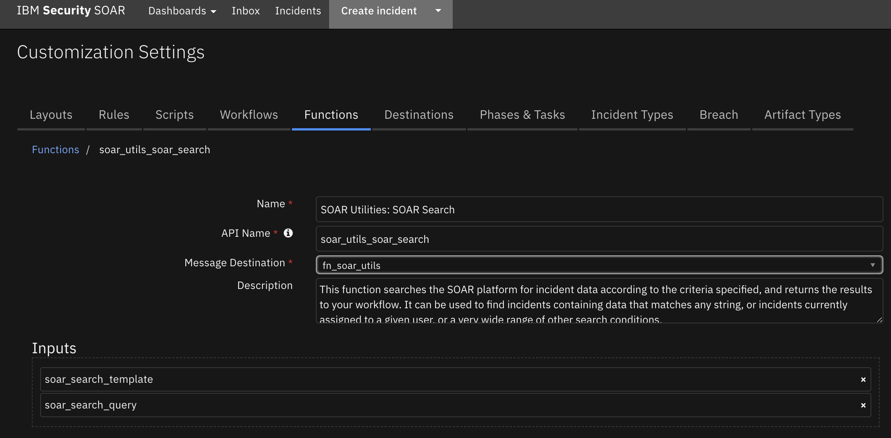

<details><summary>Inputs:</summary>
<p>

| Name | Type | Required | Example | Tooltip |
| ---- | :--: | :------: | ------- | ------- |
| `soar_search_query` | `text` | No | `-` | - |
| `soar_search_template` | `textarea` | No | `-` | - |

</p>
</details>

<details><summary>Outputs:</summary>
<p>

> **NOTE:** This example might be in JSON format, but `results` is a Python Dictionary on the SOAR platform.

```python
results = {
  "results": [
    {
      "inc_id": 2112,
      "inc_name": "SOAR Utilities",
      "inc_owner_id": 1,
      "match_field_name": "Content Type",
      "match_field_value": "application/\u003cResilientHighlight\u003ezip\u003c/ResilientHighlight\u003e",
      "match_highlights": [
        {
          "match_field_name": "Content Type",
          "match_field_value": "application/\u003cResilientHighlight\u003ezip\u003c/ResilientHighlight\u003e"
        },
        {
          "match_field_name": "Name",
          "match_field_value": "\u003cResilientHighlight\u003eapp\u003c/ResilientHighlight\u003e-\u003cResilientHighlight\u003efn_slack\u003c/ResilientHighlight\u003e-\u003cResilientHighlight\u003e2.0.0\u003c/ResilientHighlight\u003e-\u003cResilientHighlight\u003e13477\u003c/ResilientHighlight\u003e.\u003cResilientHighlight\u003ezip\u003c/ResilientHighlight\u003e"
        }
      ],
      "obj_create_date": 1663640024209,
      "obj_creator_id": 1,
      "obj_id": 68,
      "obj_name": "app-fn_slack-2.0.0-13477.zip",
      "org_id": 201,
      "result": {
        "actions": [],
        "content_type": "application/zip",
        "created": 1663640024209,
        "creator_id": {
          "display_name": "Admin User",
          "id": 1,
          "name": "admin@example.com",
          "type": "user"
        },
        "id": 68,
        "inc_id": 2112,
        "inc_name": "SOAR Utilities",
        "inc_owner": {
          "display_name": "Admin User",
          "id": 1,
          "name": "admin@example.com",
          "type": "user"
        },
        "name": "app-fn_slack-2.0.0-13477.zip",
        "playbooks": [],
        "size": 599379,
        "task_at_id": null,
        "task_custom": null,
        "task_id": null,
        "task_members": null,
        "task_name": null,
        "type": "incident",
        "uuid": "e5868c93-581b-4543-8113-358becb2c9cc",
        "vers": 7
      },
      "score": 18.473476,
      "task_id": null,
      "task_name": null,
      "type_id": "attachment"
    }
  ]
}
```

</p>
</details>

<details><summary>Example Pre-Process Script:</summary>
<p>

```python
# Search for other occurrences of the same file attachment in Resilient.

# The search template determines the type(s) of object to search, and the filter conditions.
# This can be used to search within a specific incident field, or to search only incidents that meet other criteria.
# Refer to SearchExInputDTO in the REST API documentation for additional details of this data structure.

# The search query can be a simple string.
inputs.soar_search_query = attachment.name
```

</p>
</details>

<details><summary>Example Post-Process Script:</summary>
<p>

```python
# Search results include "results", which is a list of the search hits.
# There might be lots of results!

# In this example we add a note with information about each result.
result_info = []
for result in results.results:
  link = u'<a href="#incidents/{}">{}</a>'.format(result['result']['inc_id'], result['result']['inc_name'])
  result_info.append(u"<p>{} - {}</p>".format(link, result['obj_name']))
  
if len(result_info)==0:
  html = "<div>No results</div>"
else:
  html = u"<div>{}</div>".format("".join(result_info))

incident.addNote(helper.createRichText(html))
```

</p>
</details>

---
## Function - SOAR Utilities: String to Attachment
Creates a new file (.txt) attachment in the incident or task from a string that your workflow provides as input.

 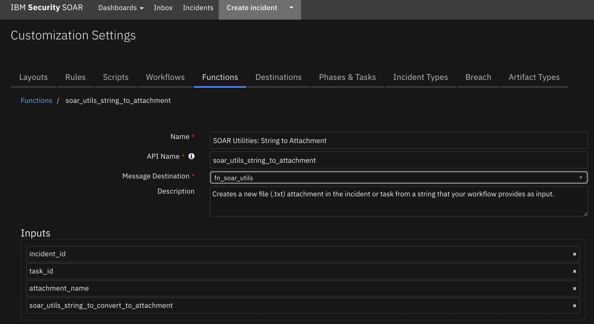

<details><summary>Inputs:</summary>
<p>

| Name | Type | Required | Example | Tooltip |
| ---- | :--: | :------: | ------- | ------- |
| `attachment_name` | `text` | Yes | `-` | - |
| `incident_id` | `number` | Yes | `-` | - |
| `soar_utils_string_to_convert_to_attachment` | `text` | Yes | `-` | - |
| `task_id` | `number` | No | `-` | - |

</p>
</details>

<details><summary>Outputs:</summary>
<p>

> **NOTE:** This example might be in JSON format, but `results` is a Python Dictionary on the SOAR platform.

```python
results = {
  "attachment_id": 72
}
```

</p>
</details>

<details><summary>Example Pre-Process Script:</summary>
<p>

```python
# Required inputs are: the string to convert, the incident id and the attachment name
inputs.soar_utils_string_to_convert_to_attachment = artifact.value
inputs.incident_id = incident.id
#inputs.attachment_name = "A Test Attachment Name"

# If this is a "task attachment" then we will additionally have a task-id
if task is not None:
  inputs.task_id = task.id
```

</p>
</details>

<details><summary>Example Post-Process Script:</summary>
<p>

```python
# result: {'attachment_id': 28}

```

</p>
</details>

---


## Rules
| Rule Name | Object | Workflow Triggered |
| --------- | ------ | ------------------ |
| Example: SOAR Utilities (Artifact) Attachment to Base64 | artifact | `example_soar_utilities_artifact_attachment_to_base64` |
| Example: SOAR Utilities Artifact Hash | artifact | `example_soar_utilities_artifact_hash` |
| Example: SOAR Utilities Attachment Hash | attachment | `example_soar_utilities_attachment_hash` |
| Example: SOAR Utilities Attachment to Base64 | attachment | `example_soar_utilities_attachment_to_base64` |
| Example: SOAR Utilities Close Incident | incident | `example_soar_utilities_close_incident` |
| Example: SOAR Utilities Create Incident | incident | `example_soar_utilities_create_incident` |
| Example: SOAR Utilities Get Incident Contact Info | incident | `example_soar_utilities_get_incident_contact_info` |
| Example: SOAR Utilities Get Task Contact Info | task | `example_soar_utilities_get_task_contact_info` |
| Example: SOAR Utilities Search Incidents | incident | `example_soar_utilities_search_incidents` |
| Example: SOAR Utilities SOAR Search | attachment | `example_soar_utilities_soar_search` |
| Example: SOAR Utilities String to Attachment | artifact | `example_soar_utilities_string_to_attachment` |
| Example: SOAR Utilities Zip Extract | attachment | `example_soar_utilities_zip_extract` |
| Example: SOAR Utilities Zip Extract to Artifact | attachment | `example_soar_utilities_zip_extract_to_artifact` |
| Example: SOAR Utilities Zip List | attachment | `example_soar_utilities_zip_list` |

---


## Troubleshooting & Support
Refer to the documentation listed in the Requirements section for troubleshooting information.

### For Support
This is a IBM Community provided App. Please search the Community [ibm.biz/soarcommunity](https://ibm.biz/soarcommunity) for assistance.
