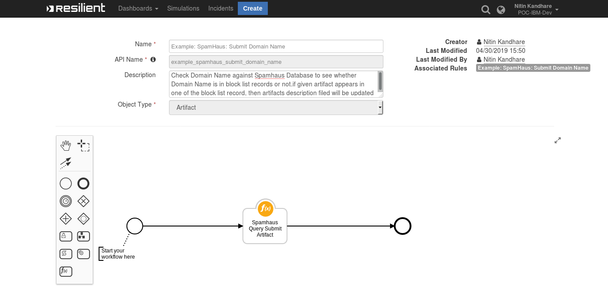
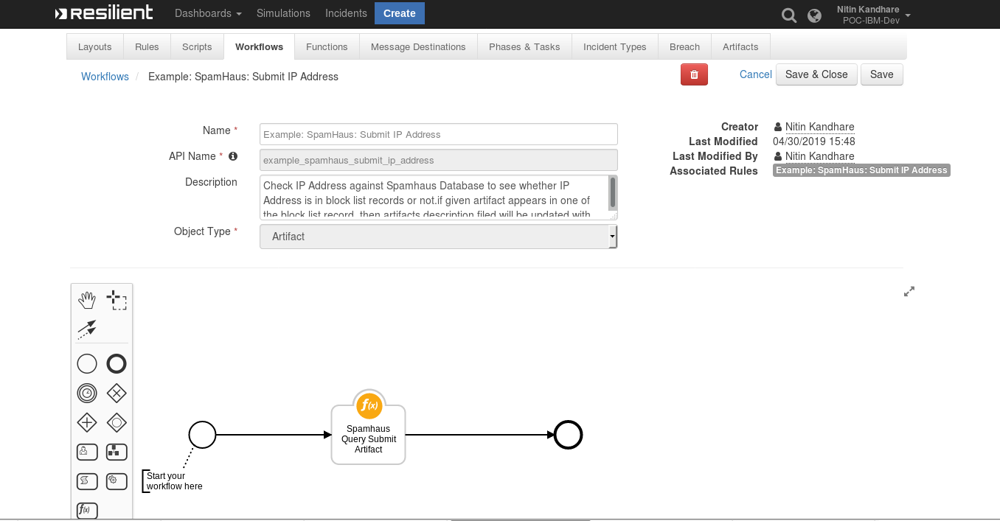
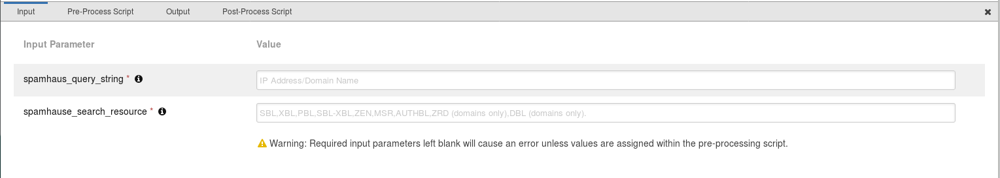
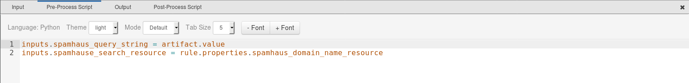
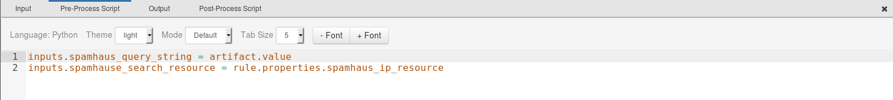
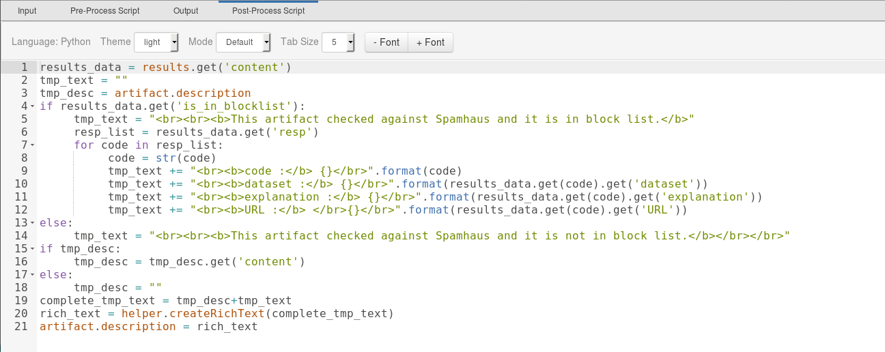

# Spamhaus Function for IBM Resilient

## Table of Contents
- [About This Package](#about-this-package)
 - [Prerequisites](#prerequisites)
 - [Installation](#installation)
 - [Function Inputs](#function-inputs)
 - [Function Output](#function-output)
 - [Pre-Process Script](#pre-process-script)
 - [Post-Process Script](#post-process-script)
 - [Rules](#rules)

---
## About This Package

**This function checks IP Address & Domain Name type artifacts against the [Spamhaus](https://www.spamhaustech.com/) database to determine whether a given artifact is found in a blocklist.
If a given artifact appears in one of the block list records, then the artifacts description is updated with additional enrichment information.**
Provided in this integration package is an example rule configured to be run against
the following artifacts in the Resilient platform:
  * IP Address Artifacts of Resilient
  * Domain Names Artifacts of Resilient

After the successful scan of a given artifact, the artifact's description field is updated with the results.

### Spamhaus Function Layout
##### For Domain Names:

##### For IP Address:


### Spamhaus Inputs:


### Spamhaus Pre-Process Script
##### For Domain Names:

##### For IP Address:

### Spamhaus Post-Process Script

## Installation
You download the function package from the App Exchange to a Resilient integration server, and from there you deploy the functions and components to a Resilient platform. These procedures are provided in the Resilient [Integration Server Guide (PDF)](https://github.com/ibmresilient/resilient-reference/blob/master/developer_guides/Integration%20Server%20Guide.pdf). The file is called:
`fn_spamhaus_query-<version>.tar.gz`
The functions included this package have the following requirements, which are above and beyond those listed in the Resilient Integration Server Guide.
  * Resilient Appliance >= v31.0.0
  * Integrations Server running resilient_circuits >= v30.0.0
  * requests >= v2.21.0

After installing the package, Resilient Circuits creates a new section, `fn_spamhaus_query`, in the app.config file.
```
[fn_spamhaus_query]
# The API endpoint URL to query Spamhaus Web Query Service
spamhaus_wqs_url = https://apibl.spamhaus.net/lookup/v1/{}/{}
spamhaus_dqs_key =
# Proxy Configuration if any by default will be None
http_proxy=
https_proxy=
```
 You need to edit the following settings in that section as follows:

 * `spamhaus_dqs_key* : Spamhaus API Key. `
 * `http_proxy/https_proxy* : proxy server address if any `

## Function Inputs
|Input Name  |Type     |Required |Example  | Info |
|---------------|-----------|-----------|----------|--------|
|`spamhaus_query_string`| String|Yes | `127.0.0.2`/`test` | IP Address or Domain Name to be checked against Spamhaus database.|
|`spamhause_search_resource`| String|Yes | `SBL,XBL,PBL,SBL-XBL,ZEN,MSR,AUTHBL,ZRD (domains only),DBL (domains only).` |resource-name is a required enumerated field that represents which block list should be queried. |
## Function Output
The payload from integration will wrap the results of the Spamhaus response in the following JSON structure.

```python
results = {
    "inputs": {
        "spamhause_search_resource": "SBL",
        "spamhaus_query_string": "127.0.0.2"
    },
    "metrics": {
        "package": "fn-spamhaus-query",
        "timestamp": "2019-05-06 15:51:55",
        "package_version": "1.0.0",
        "host": "oc3777881733.ibm.com",
        "version": "1.0",
        "execution_time_ms": 970
    },
    "success": true,
    "content": {
        "status": 200,
        "resp": [1002],
        "is_in_blocklist": true,
        "1002": {
            "URL": "https://www.spamhaus.org/sbl/",
            "explanation": "IP addresses are listed on the SBL because they appear to Spamhaus to be under the control of, used by, or made available for use by spammers and abusers in unsolicited bulk email or other types of Internet-based abuse that threatens networks or users.",
            "dataset": "SBL"
        }
    },
    "raw": "{\"status\": 200, \"resp\": [1002], \"is_in_blocklist\": true, \"1002\": {\"URL\": \"https://www.spamhaus.org/sbl/\", \"explanation\": \"IP addresses are listed on the SBL because they appear to Spamhaus to be under the control of, used by, or made available for use by spammers and abusers in unsolicited bulk email or other types of Internet-based abuse that threatens networks or users.\", \"dataset\": \"SBL\"}}",
    "reason": null,
    "version": "1.0"
}
```


To see the output of of the Function, we recommend running `resilient-circuits` in `DEBUG` mode as follows:
  ```
   resilient-circuits run --loglevel=DEBUG
  ```

## Pre-Process Script
#### For Domain Names:
This example sets the `Example: SpamHaus: Submit Domain Name` inputs to the artifact values.
A pre-process script relays the Resilient artifact value data to function inputs similar to this example:
```python
inputs.spamhaus_query_string = artifact.value.
inputs.spamhause_search_resource = rule.properties.spamhaus_domain_name_resource
```
#### For IP Address:
This example sets the `Example: SpamHaus: Submit IP Address` inputs to the artifact values.
A pre-process script relays the Resilient artifact value data to function inputs similar to this example:
```python
inputs.spamhaus_query_string = artifact.value
inputs.spamhause_search_resource = rule.properties.spamhaus_ip_resource
```

## Post-Process Script
This post-process script is used to update the `artifact description` field in the Resilient incidents, based on the returned Spamhaus block list status data.

```
# Get the actual data from results
results_data = results.get('content')
tmp_text = ""
tmp_desc = artifact.description
if results_data.get('is_in_blocklist'):
   tmp_text = "<br><br><b>This artifact checked against Spamhaus and it is in block list.</b>"
   resp_list = results_data.get('resp')
   for code in resp_list:
     code = str(code)
     tmp_text += "<br><b>code :</b> {}</br>".format(code)
     tmp_text += "<br><b>dataset :</b> {}</  br>".format(results_data.get(code).get('dataset'))
     tmp_text += "<br><b>explanation :</b> {}</  br>".format(results_data.get(code).get('explanation'))
     tmp_text += "<br><b>URL :</b> </br>{}</  br>".format(results_data.get(code).get('URL'))
else:
   tmp_text = "<br><br><b>This artifact checked against Spamhaus and it is not in block list.</b></br></br>"
if tmp_desc:
   tmp_desc = tmp_desc.get('content')
else:
   tmp_desc = ""
complete_tmp_text = tmp_desc+tmp_text
rich_text = helper.createRichText(complete_tmp_text)
artifact.description = rich_text
```
## Rules
#### For Domain Names:
This Spamhaus rule is configured with a condition that it works only on Domain Names artifacts.
| Rule Name | Object Type | Workflow Triggered |Activity Fields|
| --------- | :---------: | ------------------ |---------------|
|`Example: SpamHaus: Submit Domain Name`| `Artifact` | `example_spamhaus_submit_domain_name` |`spamhaus_domain_name_resource`|
#### For IP Address
This Spamhaus rule is configured with a condition that it works only on IP Address artifacts.
| Rule Name | Object Type | Workflow Triggered |Activity Fields|
| --------- | :---------: | ------------------ |---------------|
|`Example: SpamHaus: Submit IP Address`| `Artifact` | `example_spamhaus_submit_ip_address` |`spamhaus_ip_resource`|


Copyright IBM Corp. 2010, 2019. All Rights Reserved.