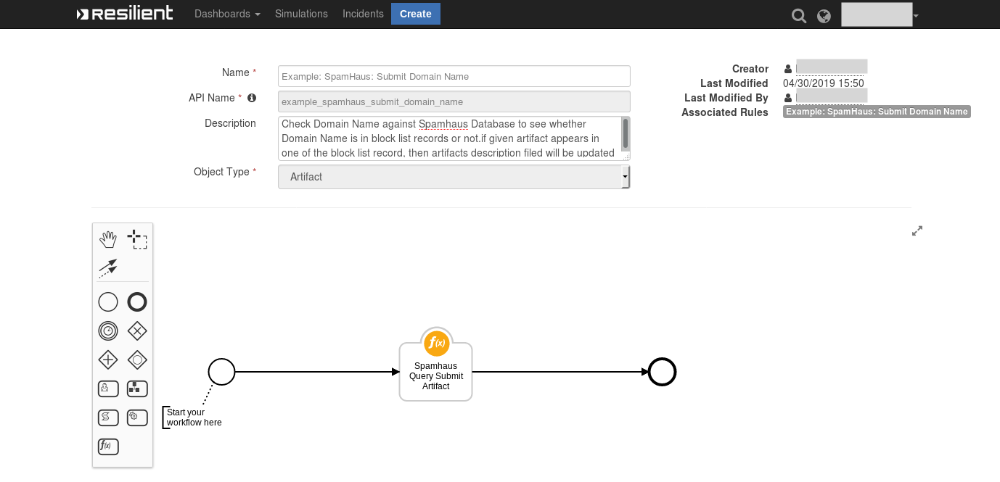

<!--
  This User README.md is generated by running:
  "resilient-sdk docgen -p fn_spamhaus_query --user-guide"

  It is best edited using a Text Editor with a Markdown Previewer. VS Code
  is a good example. Checkout https://guides.github.com/features/mastering-markdown/
  for tips on writing with Markdown

  If you make manual edits and run docgen again, a .bak file will be created

  Store any screenshots in the "doc/screenshots" directory and reference them like:
  
-->

# **User Guide:** fn_spamhaus_query_v1.0.1

## Table of Contents
- [Key Features](#key-features)
- [Function - Spamhaus Query Submit Artifact](#function---spamhaus-query-submit-artifact)
- [Rules](#rules)

---

## Key Features
<!--
  List the Key Features of the Integration
-->
* Look up IP Addresses in Spamhaus Datasets
* Look up Domain Names in Spamhaus Datasets
* Add the enrichment data to the Resilient artifact

---

## Function - Spamhaus Query Submit Artifact
Function to check IP Addresses & Domain Names against Spamhaus Dataset to see whether it appears in the Dataset or not

 

<details><summary>Inputs:</summary>
<p>

| Name | Type | Required | Example | Tooltip |
| ---- | :--: | :------: | ------- | ------- |
| `spamhaus_query_string` | `text` | Yes | `IP Address/Domain Name` | An IP Address or a Domain Name |
| `spamhaus_search_resource` | `text` | Yes | `SBL,XBL,PBL,SBL-XBL,ZEN,MSR,AUTHBL,ZRD,DBL` | The name of the Dataset to seach (e.g. SBL) |

</p>
</details>

<details><summary>Outputs:</summary>
<p>

```python
results = {
    'inputs': {
        'spamhaus_search_resource': 'SBL',
        'spamhaus_query_string': '127.0.0.2'
    },
    'metrics': {
        'package': 'fn-spamhaus-query',
        'timestamp': '2020-08-20 15:27:44',
        'package_version': '1.0.1',
        'host': 'example',
        'version': '1.0',
        'execution_time_ms': 412
    },
    'success': True,
    'content': {
        'status': 200,
        'resp': [1002],
        'is_in_blocklist': True,
        1002: {
            'URL': 'https://www.spamhaus.org/sbl/',
            'explanation': 'IP addresses are listed on the SBL because they appear to Spamhaus to be under the control of, used by, or made available for use by spammers and abusers in unsolicited bulk email or other types of Internet-based abuse that threatens networks or users.',
            'dataset': 'SBL'
        }
    },
    'raw': '{"status": 200, "resp": [1002], "is_in_blocklist": true, "1002": {"URL": "https://www.spamhaus.org/sbl/", "explanation": "IP addresses are listed on the SBL because they appear to Spamhaus to be under the control of, used by, or made available for use by spammers and abusers in unsolicited bulk email or other types of Internet-based abuse that threatens networks or users.", "dataset": "SBL"}}',
    'reason': None,
    'version': '1.0'
}
```

</p>
</details>

<details><summary>Workflows</summary>

  <details><summary>Example Pre-Process Script:</summary>
  <p>

  ```python
  inputs.spamhaus_query_string = artifact.value
inputs.spamhaus_search_resource = rule.properties.spamhaus_domain_name_resource
  ```

  </p>
  </details>

  <details><summary>Example Post-Process Script:</summary>
  <p>

  ```python
  results_data = results.get('content')
tmp_text = ""
tmp_desc = artifact.description
if results_data.get('is_in_blocklist'):
     tmp_text = "<br><br><b>This artifact checked against Spamhaus and it is in block list.</b>"
     resp_list = results_data.get('resp')
     for code in resp_list:
          code = str(code)
          tmp_text += "<br><b>code :</b> {}</br>".format(code)
          tmp_text += "<br><b>dataset :</b> {}</br>".format(results_data.get(code).get('dataset'))
          tmp_text += "<br><b>explanation :</b> {}</br>".format(results_data.get(code).get('explanation'))
          tmp_text += "<br><b>URL :</b> </br>{}</br>".format(results_data.get(code).get('URL'))
else:
     tmp_text = "<br><br><b>This artifact checked against Spamhaus Dataset: {} and it is not in block list.</b></br></br>".format(results.get('inputs').get('spamhaus_search_resource'))
if tmp_desc:
     tmp_desc = tmp_desc.get('content')
else:
     tmp_desc = "" 
complete_tmp_text = tmp_desc+tmp_text
rich_text = helper.createRichText(complete_tmp_text)
artifact.description = rich_text
  ```

  </p>
  </details>

</details>

---


## Rules
| Rule Name | Object | Workflow Triggered |
| --------- | ------ | ------------------ |
| Example: SpamHaus: Submit IP Address | artifact | `example_spamhaus_submit_ip_address` |
| Example: SpamHaus: Submit Domain Name | artifact | `example_spamhaus_submit_domain_name` |

---

<!--
## Inform Resilient Users
  Use this section to optionally provide additional information so that Resilient playbook 
  designer can get the maximum benefit of your integration.
-->