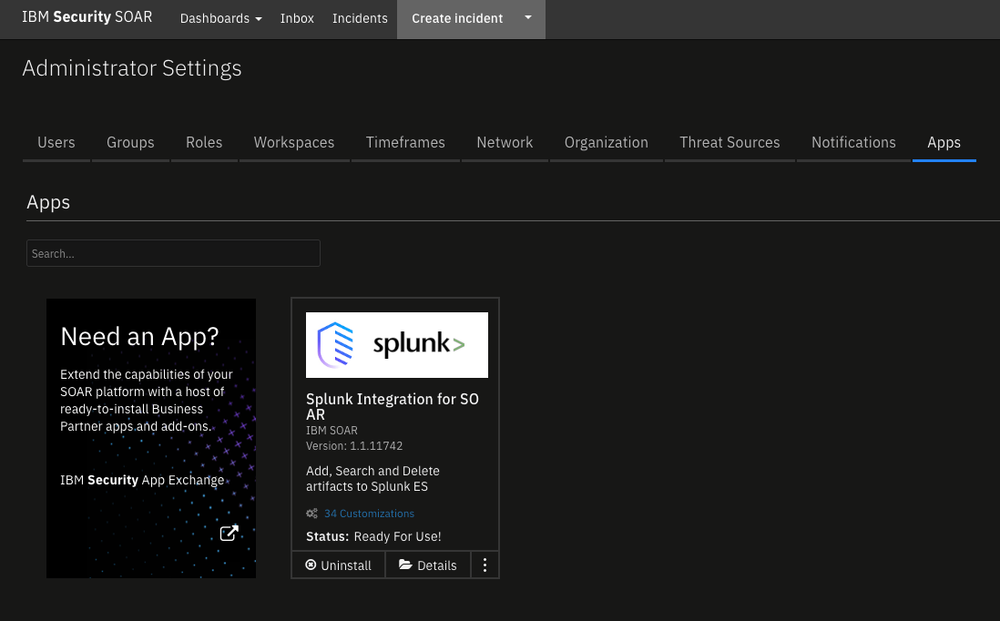
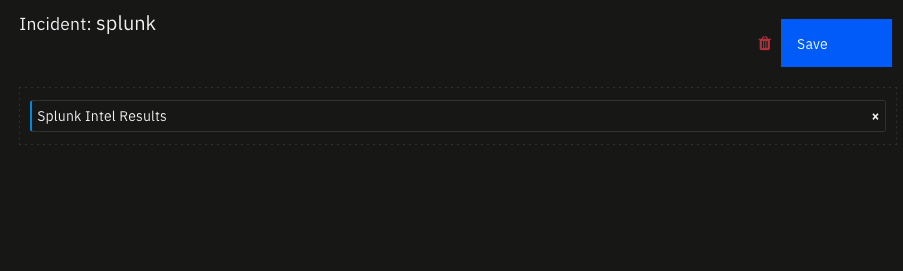
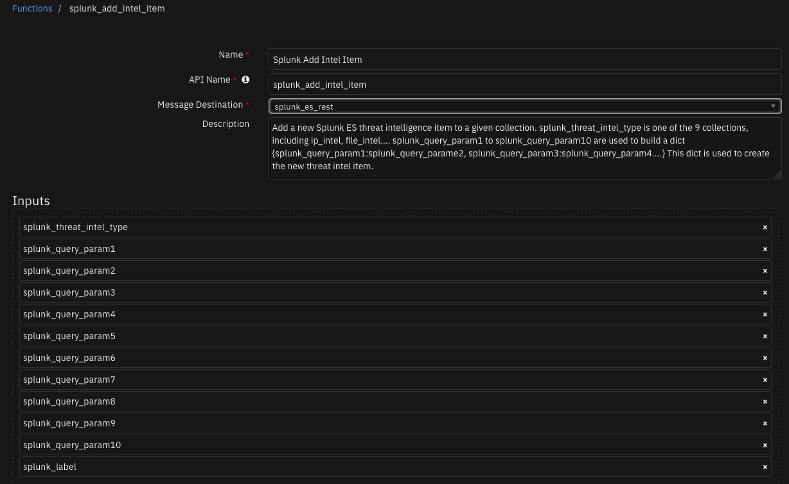
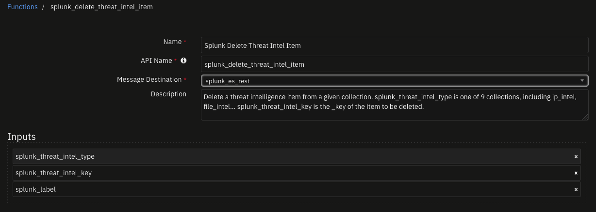
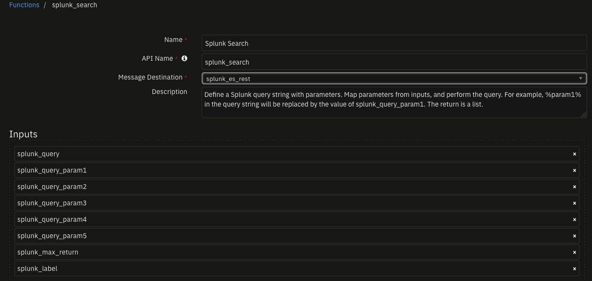
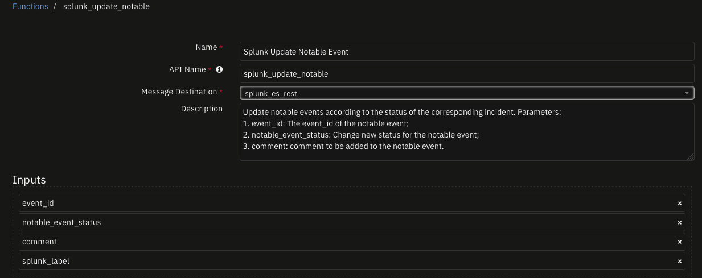
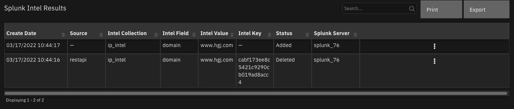

<!--
  This README.md is generated by running:
  "resilient-sdk docgen -p fn_splunk_integration"

  It is best edited using a Text Editor with a Markdown Previewer. VS Code
  is a good example. Checkout https://guides.github.com/features/mastering-markdown/
  for tips on writing with Markdown

  All fields followed by "::CHANGE_ME::"" should be manually edited

  If you make manual edits and run docgen again, a .bak file will be created

  Store any screenshots in the "doc/screenshots" directory and reference them like:
  

  NOTE: If your app is available in the container-format only, there is no need to mention the integration server in this readme.
-->

# Splunk Integration for SOAR

## Table of Contents
- [Release Notes](#release-notes)
- [Overview](#overview)
  - [Key Features](#key-features)
- [Requirements](#requirements)
  - [SOAR platform](#soar-platform)
  - [Cloud Pak for Security](#cloud-pak-for-security)
  - [Proxy Server](#proxy-server)
  - [Python Environment](#python-environment)
  - [Endpoint Developed With](#endpoint-developed-with)
- [Installation](#installation)
  - [Install](#install)
  - [App Configuration](#app-configuration)
  - [Custom Layouts](#custom-layouts)
- [Function - Splunk Add Intel Item](#function---splunk-add-intel-item)
- [Function - Splunk Delete Threat Intel Item](#function---splunk-delete-threat-intel-item)
- [Function - Splunk Search](#function---splunk-search)
- [Function - Splunk Update Notable Event](#function---splunk-update-notable-event)
- [Data Table - Splunk Intel Results](#data-table---splunk-intel-results)
- [Rules](#rules)
- [Troubleshooting & Support](#troubleshooting--support)
---

## Release Notes
<!--
  Specify all changes in this release. Do not remove the release 
  notes of a previous release
-->
| Version | Date | Notes |
| ------- | ---- | ----- |
| 1.0.0 | 06/2018 | Initial Release |
| 1.0.1 | 10/2019 | added SSL validation to the integrations server |
| 1.0.2 | 05/2020 | Support added for App Host |
| 1.0.3 | 09/2020 | Updated Example Rules and Workflows |
| 1.1.0 | 03/2022 | Allow for configuration of multiple Splunk instances |

---

## Overview

**Add, Search and Delete artifacts to Splunk ES**

 

Several functions to operate with Splunk ES intel collections, including updates to SplunkES notable events and add, search and delete operations to intel collections based on artifact type values.

### Key Features
* Add a new threat intelligence item to the collections of Splunk ES
* Delete a threat intelligence item
* Execute a given Splunk or Splunk ES search/query
* Update a Splunk ES notable event

---

## Requirements
- SOAR Server version 42 or later
- Splunk version 7.0 or later, or Splunk Cloud
- Splunk ES 4.7.2 or later, or Splunk ES Cloud
- Ability to connect to SOAR server with HTTPS on port 443 and 65001
- Ability to connect to Splunk server with HTTPS on port 8089
This app supports the IBM Security QRadar SOAR Platform and the IBM Security QRadar SOAR for IBM Cloud Pak for Security.

### SOAR platform
The SOAR platform supports two app deployment mechanisms, App Host and integration server.

If deploying to a SOAR platform with an App Host, the requirements are:
* SOAR platform >= `42.0.7058`.
* The app is in a container-based format (available from the AppExchange as a `zip` file).

If deploying to a SOAR platform with an integration server, the requirements are:
* SOAR platform >= `42.0.7058`.
* The app is in the older integration format (available from the AppExchange as a `zip` file which contains a `tar.gz` file).
* Integration server is running `resilient_circuits>=40.0.0`.
* If using an API key account, make sure the account provides the following minimum permissions: 
  | Name | Permissions |
  | ---- | ----------- |
  | Org Data | Read |
  | Function | Read |

The following SOAR platform guides provide additional information: 
* _App Host Deployment Guide_: provides installation, configuration, and troubleshooting information, including proxy server settings. 
* _Integration Server Guide_: provides installation, configuration, and troubleshooting information, including proxy server settings.
* _System Administrator Guide_: provides the procedure to install, configure and deploy apps. 

The above guides are available on the IBM Documentation website at [ibm.biz/soar-docs](https://ibm.biz/soar-docs). On this web page, select your SOAR platform version. On the follow-on page, you can find the _App Host Deployment Guide_ or _Integration Server Guide_ by expanding **Apps** in the Table of Contents pane. The System Administrator Guide is available by expanding **System Administrator**.

### Cloud Pak for Security
If you are deploying to IBM Cloud Pak for Security, the requirements are:
* IBM Cloud Pak for Security >= 1.4.
* Cloud Pak is configured with an App Host.
* The app is in a container-based format (available from the AppExchange as a `zip` file).

The following Cloud Pak guides provide additional information: 
* _App Host Deployment Guide_: provides installation, configuration, and troubleshooting information, including proxy server settings. From the Table of Contents, select Case Management and Orchestration & Automation > **Orchestration and Automation Apps**.
* _System Administrator Guide_: provides information to install, configure, and deploy apps. From the IBM Cloud Pak for Security IBM Documentation table of contents, select Case Management and Orchestration & Automation > **System administrator**.

These guides are available on the IBM Documentation website at [ibm.biz/cp4s-docs](https://ibm.biz/cp4s-docs). From this web page, select your IBM Cloud Pak for Security version. From the version-specific IBM Documentation page, select Case Management and Orchestration & Automation.

### Proxy Server
The app does not support a proxy server.

### Python Environment
Python 3.6 are supported.
Additional package dependencies may exist for each of these packages:
* resilient_circuits>=40.0.0
* resilient_lib
* splunk-sdk

---

## Installation

### Install
* To install or uninstall an App or Integration on the _SOAR platform_, see the documentation at [ibm.biz/soar-docs](https://ibm.biz/soar-docs).
* To install or uninstall an App on _IBM Cloud Pak for Security_, see the documentation at [ibm.biz/cp4s-docs](https://ibm.biz/cp4s-docs) and follow the instructions above to navigate to Orchestration and Automation.

### App Configuration
The following table provides the settings you need to configure the app. These settings are made in the app.config file. See the documentation discussed in the Requirements section for the procedure.

| Config | Required | Example | Description |
| ------ | :------: | ------- | ----------- |
| **host** | Yes | `localhost` | Splunk host |
| **port** | Yes | `8089` | Splunk port for restapi |
| **splunkpassword** | Yes | `changeme` | Splunk password |
| **username** | Yes | `admin` | Splunk login username |
| **verify_cert** | Yes | `false|/path/to/cert` | Verify https certtificate or not |

### Custom Layouts

* Import the Data Tables and Custom Fields like the screenshot below:

  


---

## Function - Splunk Add Intel Item
Add a new Splunk ES threat intelligence item to a given collection. splunk_threat_intel_type is one of the 9 collections, including ip_intel, file_intel.... splunk_query_param1 to splunk_query_param10 are used to build a dict {splunk_query_param1:splunk_query_parame2, splunk_query_param3:splunk_query_param4....} This dict is used to create the new threat intel item.

 

<details><summary>Inputs:</summary>
<p>

| Name | Type | Required | Example | Tooltip |
| ---- | :--: | :------: | ------- | ------- |
| `splunk_label` | `text` | No | `-` | Label given to each splunk server in the app.config |
| `splunk_query_param1` | `text` | No | `-` | - |
| `splunk_query_param10` | `text` | No | `-` | - |
| `splunk_query_param2` | `text` | No | `-` | - |
| `splunk_query_param3` | `text` | No | `-` | - |
| `splunk_query_param4` | `text` | No | `-` | - |
| `splunk_query_param5` | `text` | No | `-` | - |
| `splunk_query_param6` | `text` | No | `-` | - |
| `splunk_query_param7` | `text` | No | `-` | - |
| `splunk_query_param8` | `text` | No | `-` | - |
| `splunk_query_param9` | `text` | No | `-` | - |
| `splunk_threat_intel_type` | `text` | No | `-` | - |

</p>
</details>

<details><summary>Outputs:</summary>
<p>

> **NOTE:** This example might be in JSON format, but `results` is a Python Dictionary on the SOAR platform.

```python
results = {
  "content": {
    "message": "Create operation successful.",
    "status": true
  },
  "inputs": {
    "splunk_label": "splunk_76",
    "splunk_query_param1": "domain",
    "splunk_query_param2": "www.hgj.com",
    "splunk_threat_intel_type": "ip_intel"
  },
  "metrics": {
    "execution_time_ms": 2824,
    "host": "local",
    "package": "fn-splunk-integration",
    "package_version": "1.1.0",
    "timestamp": "2022-03-17 10:44:17",
    "version": "1.0"
  },
  "raw": "{\"message\": \"Create operation successful.\", \"status\": true}",
  "reason": null,
  "success": true,
  "version": "1.0"
}
```

</p>
</details>

<details><summary>Example Pre-Process Script:</summary>
<p>

```python
lookup_map = {
  "DNS Name": ("ip_intel", "domain"),
  "Email Attachment": None,
  "Email Attachment Name": ("file_intel", "file_name"),
  "Email Body": None,
  "Email Recipient": None,
  "Email Sender": ("email_intel", "src_user"),
  "Email Sender Name": ("email_intel", "src_user"),
  "Email Subject": ("email_intel", "subject"),
  "File Name": ("file_intel", "file_name"),
  "File Path": None,
  "HTTP Request Header": None,
  "HTTP Response Header": None,
  "IP Address": ("ip_intel", "ip"),
  "Log File": None,
  "MAC Address": None,
  "Malware Family/Variant": None,
  "Malware MD5 Hash": ("file_intel", "file_hash"),
  "Malware Sample": None,
  "Malware Sample Fuzzy Hash": ("file_intel", "file_hash"),
  "Malware SHA-1 Hash": ("file_intel", "file_hash"),
  "Malware SHA-256 Hash": ("file_intel", "file_hash"),
  "Mutex": None,
  "Network CIDR Range": None,
  "Other File": None,
  "Password": None,
  "Port": None,
  "Process Name": ("process_intel", "process"),
  "Registry Key": ("registry_intel", "registry_value_name"),
  "RFC 822 Email Message File": None,
  "Service": ("service_intel", "service"),
  "String": None,
  "System Name": ("service_intel", "service"),
  "URI Path": None,
  "URL": ("http_intel", "url"),
  "URL Referer": ("http_intel", "http_referrer"),
  "User Account": None,
  "User Agent": ("http_intel", "http_user_agent")
}

if artifact.type in lookup_map and lookup_map[artifact.type]:
  threat_type, threat_field_name = lookup_map[artifact.type]
  inputs.splunk_threat_intel_type = threat_type
  inputs.splunk_query_param1 = threat_field_name
  inputs.splunk_query_param2 = artifact.value
  inputs.splunk_label = rule.properties.splunk_servers
else:
  helper.fail("Artifact type not supported: {}".format(artifact.type))

```

</p>
</details>

<details><summary>Example Post-Process Script:</summary>
<p>

```python
# {'status_code': 201, 'content': {'message': 'Create operation successful.', 'status': True}}
import java.util.Date as Date 

now = Date().time

result_note = u"""<b>Artifact</b>: {}<br><br>
<b>Splunk Add Status</b>: {}<br>
<b>Message</b>: {}""".format(artifact.value,
                             "Successful" if results.get("content", {}).get("status", False) else "Unsuccessful",
                             results.get("content", {}).get("message", "None"))

if results.get("content", {}).get("status", False):
  incident.addNote(helper.createRichText(result_note))
  result_row = incident.addRow("splunk_intel_results")
  result_row.create_date = now
  result_row.status = "Added"
  result_row.intel_collection = results.inputs['splunk_threat_intel_type']
  result_row.intel_field = results.inputs['splunk_query_param1']
  result_row.intel_value = results.inputs['splunk_query_param2']
  result_row.splunk_server = rule.properties.splunk_servers

```

</p>
</details>

---
## Function - Splunk Delete Threat Intel Item
Delete a threat intelligence item from a given collection. splunk_threat_intel_type is one of 9 collections, including ip_intel, file_intel... splunk_threat_intel_key is the _key of the item to be deleted.

 

<details><summary>Inputs:</summary>
<p>

| Name | Type | Required | Example | Tooltip |
| ---- | :--: | :------: | ------- | ------- |
| `splunk_label` | `text` | No | `-` | Label given to each splunk server in the app.config |
| `splunk_threat_intel_key` | `text` | No | `-` | The _key from Splunk ES for this threat_intel item |
| `splunk_threat_intel_type` | `text` | No | `-` | - |

</p>
</details>

<details><summary>Outputs:</summary>
<p>

> **NOTE:** This example might be in JSON format, but `results` is a Python Dictionary on the SOAR platform.

```python
results = {
  "content": {
    "message": "Delete operation successful.",
    "status": true
  },
  "inputs": {
    "splunk_label": "splunk_76",
    "splunk_threat_intel_key": "cabf173ee8c5421c9290cb019ad8acc4",
    "splunk_threat_intel_type": "ip_intel"
  },
  "metrics": {
    "execution_time_ms": 1282,
    "host": "local",
    "package": "fn-splunk-integration",
    "package_version": "1.1.0",
    "timestamp": "2022-03-17 10:45:13",
    "version": "1.0"
  },
  "raw": "{\"message\": \"Delete operation successful.\", \"status\": true}",
  "reason": null,
  "success": true,
  "version": "1.0"
}
```

</p>
</details>

<details><summary>Example Pre-Process Script:</summary>
<p>

```python
inputs.splunk_threat_intel_type = row.intel_collection
inputs.splunk_threat_intel_key = row.intel_key
inputs.splunk_label = row.splunk_server
```

</p>
</details>

<details><summary>Example Post-Process Script:</summary>
<p>

```python
# {'status_code': 201, 'content': {'message': 'Delete operation successful.', 'status': True}}

result_note = u"""<b>Artifact</b>: {}<br><br>
<b>Splunk Delete Status</b>: {}<br>
<b>Message</b>: {}""".format(row.intel_value,
                             "Successful" if results.get("content", {}).get("status", False) else "Unsuccessful",
                             results.get("content", {}).get("message", "None"))

incident.addNote(helper.createRichText(result_note))
row.status = "Deleted"
```

</p>
</details>

---
## Function - Splunk Search
Define a Splunk query string with parameters. Map parameters from inputs, and perform the query. For example, %param1% in the query string will be replaced by the value of splunk_query_param1. The return is a list.

 

<details><summary>Inputs:</summary>
<p>

| Name | Type | Required | Example | Tooltip |
| ---- | :--: | :------: | ------- | ------- |
| `splunk_label` | `text` | No | `-` | Label given to each splunk server in the app.config |
| `splunk_max_return` | `number` | No | `-` | Max number of events to return (used in head max) |
| `splunk_query` | `textarea` | No | `-` | - |
| `splunk_query_param1` | `text` | No | `-` | - |
| `splunk_query_param2` | `text` | No | `-` | - |
| `splunk_query_param3` | `text` | No | `-` | - |
| `splunk_query_param4` | `text` | No | `-` | - |
| `splunk_query_param5` | `text` | No | `-` | - |

</p>
</details>

<details><summary>Outputs:</summary>
<p>

> **NOTE:** This example might be in JSON format, but `results` is a Python Dictionary on the SOAR platform.

```python
results = {
  "content": [
    {
      "_key": "cabf173ee8c5421c9290cb019ad8acc4",
      "domain": "www.hgj.com",
      "item_key": "cabf173ee8c5421c9290cb019ad8acc4",
      "threat_key": "restapi",
      "time": "1647528256"
    }
  ],
  "inputs": {
    "splunk_label": "splunk_76",
    "splunk_max_return": 10,
    "splunk_query": {
      "content": "inputlookup %param1% | search NOT disabled=* AND %param2%=%param3% | eval item_key=_key",
      "format": "text"
    },
    "splunk_query_param1": "ip_intel",
    "splunk_query_param2": "domain",
    "splunk_query_param3": "www.hgj.com"
  },
  "metrics": {
    "execution_time_ms": 3772,
    "host": "local",
    "package": "fn-splunk-integration",
    "package_version": "1.1.0",
    "timestamp": "2022-03-17 10:44:40",
    "version": "1.0"
  },
  "raw": "[{\"_key\": \"cabf173ee8c5421c9290cb019ad8acc4\", \"domain\": \"www.hgj.com\", \"item_key\": \"cabf173ee8c5421c9290cb019ad8acc4\", \"threat_key\": \"restapi\", \"time\": \"1647528256\"}]",
  "reason": null,
  "success": true,
  "version": "1.0"
}
```

</p>
</details>

<details><summary>Example Pre-Process Script:</summary>
<p>

```python
lookup_map = {
  "DNS Name": ("ip_intel", "domain"),
  "Email Attachment": None,
  "Email Attachment Name": ("file_intel", "file_name"),
  "Email Body": None,
  "Email Recipient": None,
  "Email Sender": ("email_intel", "src_user"),
  "Email Sender Name": ("email_intel", "src_user"),
  "Email Subject": ("email_intel", "subject"),
  "File Name": ("file_intel", "file_name"),
  "File Path": None,
  "HTTP Request Header": None,
  "HTTP Response Header": None,
  "IP Address": ("ip_intel", "ip"),
  "Log File": None,
  "MAC Address": None,
  "Malware Family/Variant": None,
  "Malware MD5 Hash": ("file_intel", "file_hash"),
  "Malware Sample": None,
  "Malware Sample Fuzzy Hash": ("file_intel", "file_hash"),
  "Malware SHA-1 Hash": ("file_intel", "file_hash"),
  "Malware SHA-256 Hash": ("file_intel", "file_hash"),
  "Mutex": None,
  "Network CIDR Range": None,
  "Other File": None,
  "Password": None,
  "Port": None,
  "Process Name": ("process_intel", "process"),
  "Registry Key": ("registry_intel", "registry_value_name"),
  "RFC 822 Email Message File": None,
  "Service": ("service_intel", "service"),
  "String": None,
  "System Name": ("service_intel", "service"),
  "URI Path": None,
  "URL": ("http_intel", "url"),
  "URL Referer": ("http_intel", "http_referrer"),
  "User Account": None,
  "User Agent": ("http_intel", "http_user_agent")
}

if artifact.type in lookup_map and lookup_map.get(artifact.type):
  threat_type, threat_field_name = lookup_map.get(artifact.type)
  inputs.splunk_query_param1 = threat_type
  inputs.splunk_query_param2 = threat_field_name
  inputs.splunk_query_param3 = artifact.value
  inputs.splunk_label = rule.properties.splunk_servers
else:
  helper.fail("Artifact type not supported: {}".format(artifact.type))
```

</p>
</details>

<details><summary>Example Post-Process Script:</summary>
<p>

```python
# {'events': [OrderedDict([('_key', '4fa89feac1004d7cbfcb974eb79c62e9'), ('ip', 'https://ibm.biz/soarcommunity'), ('item_key', '4fa89feac1004d7cbfcb974eb79c62e9'), ('threat_key', 'restapi'), ('time', '1598296740.6724114')]), OrderedDict([('_key', '9b14932c75aa4b1f909775bd10cb78d6'), ('ip', 'https://ibm.biz/soarcommunity'), ('item_key', '9b14932c75aa4b1f909775bd10cb78d6'), ('threat_key', 'restapi'), ('time', '1598296660.9374135')])]}

if results.get("content", None):
  for event in results.content:
    result_row = incident.addRow("splunk_intel_results")
    result_row.create_date = int(float(event.pop("time"))*1000)
    result_row.source = event.pop("threat_key")
    result_row.intel_collection = results.inputs['splunk_query_param1']
    result_row.intel_key = event.pop("_key")
    result_row.splunk_server = rule.properties.splunk_servers
    result_row.status = "Active"
    event.pop("item_key") # Not presented
    # What's left is the artifact value
    for k, v in event.items():
      result_row.intel_field = k
      result_row.intel_value = v
      break
else:
  result_row = incident.addRow("splunk_intel_results")
  result_row.intel_value = artifact.value
  result_row.status = "Not Found"
  result_row.splunk_server = rule.properties.splunk_servers
  

```

</p>
</details>

---
## Function - Splunk Update Notable Event
Update notable events according to the status of the corresponding incident. Parameters:
1. event_id: The event_id of the notable event;
2. notable_event_status: Change new status for the notable event;
3. comment: comment to be added to the notable event.

 

<details><summary>Inputs:</summary>
<p>

| Name | Type | Required | Example | Tooltip |
| ---- | :--: | :------: | ------- | ------- |
| `comment` | `text` | No | `-` | Update the notable comment using this |
| `event_id` | `text` | No | `-` | Notable event id from splunk ES |
| `notable_event_status` | `number` | No | `-` | - |
| `splunk_label` | `text` | No | `-` | Label given to each splunk server in the app.config |

</p>
</details>

<details><summary>Outputs:</summary>
<p>

> **NOTE:** This example might be in JSON format, but `results` is a Python Dictionary on the SOAR platform.

```python
results = {
  "content": {
    "details": {},
    "failure_count": 0,
    "message": "1 event updated successfully",
    "success": true,
    "success_count": 1,
    "warnings": []
  },
  "inputs": {
    "comment": "SOAR incident is active",
    "event_id": "7D8101AA-B8DB-44FF-94A2-E06831523B77@@_internal@@8bb2bdb9cfa9795e6fb4beef77440e59",
    "notable_event_status": 2,
    "splunk_label": "splunk_76"
  },
  "metrics": {
    "execution_time_ms": 5794,
    "host": "local",
    "package": "fn-splunk-integration",
    "package_version": "1.1.0",
    "timestamp": "2022-03-17 10:55:55",
    "version": "1.0"
  },
  "raw": "{\"details\": {}, \"success_count\": 1, \"failure_count\": 0, \"warnings\": [], \"success\": true, \"message\": \"1 event updated successfully\"}",
  "reason": null,
  "success": true,
  "version": "1.0"
}
```

</p>
</details>

<details><summary>Example Pre-Process Script:</summary>
<p>

```python
if incident.properties.splunk_notable_event_id:
  inputs.event_id = incident.properties.splunk_notable_event_id
  if incident.plan_status == "C":
      inputs.notable_event_status = 5
      inputs.comment = "SOAR incident is closed"
  else:
      inputs.notable_event_status = 2
      inputs.comment = "SOAR incident is active"
  inputs.splunk_label = rule.properties.splunk_servers
else:
  helper.fail("Ensure that the incident custom field is set: splunk_notable_event_id")
```

</p>
</details>

<details><summary>Example Post-Process Script:</summary>
<p>

```python
# {'status_code': 200, 'content': {'details': {}, 'success_count': 1, 'failure_count': 0, 'warnings': [], 'success': True, 'message': '1 event updated successfully'}}

result_note = u"<b>Splunk Update notable event</b>:<br><br>"
if isinstance(results.get("content"), dict):
  result_note = result_note + u"""<b>Splunk Update Status</b>: {}<br>
<b>Message</b>: {}""".format("Successful" if results.get("content", {}).get("success", False) else "Unsuccessful",
                             results.get("content", {}).get("message", "None"))
else:
  result_note = result_note + results.get("content")

incident.addNote(helper.createRichText(result_note))
```

</p>
</details>

---


## Data Table - Splunk Intel Results

 

#### API Name:
splunk_intel_results

#### Columns:
| Column Name | API Access Name | Type | Tooltip |
| ----------- | --------------- | ---- | ------- |
| Create Date | `create_date` | `datetimepicker` | - |
| Intel Collection | `intel_collection` | `text` | - |
| Intel Field | `intel_field` | `text` | - |
| Intel Key | `intel_key` | `text` | - |
| Intel Value | `intel_value` | `text` | - |
| Source | `source` | `text` | - |
| Splunk Server | `splunk_server` | `text` | - |
| Status | `status` | `text` | - |

---


## Rules
| Rule Name | Object | Workflow Triggered |
| --------- | ------ | ------------------ |
| Add artifact to Splunk ES | artifact | `splunk_add_new_ip_intel` |
| Delete an intel entry in Splunk ES | splunk_intel_results | `example_of_deleting_an_intel_entry_in_splunk_es` |
| Search Splunk ES for an artifact | artifact | `search_splunk_ip_intel` |
| Update Splunk ES notable event | incident | `splunk_update_notable` |

---


## Troubleshooting & Support
Refer to the documentation listed in the Requirements section for troubleshooting information.

### For Support
This is a IBM Community provided App. Please search the Community [ibm.biz/soarcommunity](https://ibm.biz/soarcommunity) for assistance.
