<!--
  This README.md is generated by running:
  "resilient-sdk docgen -p fn_sumo_logic"

  This file was generated with resilient-sdk v51.0.2.2.1096

  It is best edited using a Text Editor with a Markdown Previewer. VS Code
  is a good example. Checkout https://guides.github.com/features/mastering-markdown/
  for tips on writing with Markdown

  All fields followed by "::CHANGE_ME::"" should be manually edited

  If you make manual edits and run docgen again, a .bak file will be created

  Store any screenshots in the "doc/screenshots" directory and reference them like:
  

  NOTE: If your app is available in the container-format only, there is no need to mention the integration server in this readme.
-->

# Sumo Logic Cloud SIEM


## Table of Contents
- [Sumo Logic Cloud SIEM](#sumo-logic-cloud-siem)
  - [Table of Contents](#table-of-contents)
  - [Release Notes](#release-notes)
  - [Overview](#overview)
    - [Key Features](#key-features)
  - [Requirements](#requirements)
    - [SOAR platform](#soar-platform)
    - [Cloud Pak for Security](#cloud-pak-for-security)
    - [Proxy Server](#proxy-server)
    - [Python Environment](#python-environment)
    - [Sumo Logic Development Version](#sumo-logic-development-version)
      - [Prerequisites](#prerequisites)
      - [Configuration](#configuration)
    - [Generate an Access Key and Secret in Sumo Log Analytics Platform](#generate-an-access-key-and-secret-in-sumo-log-analytics-platform)
  - [](#)
  - [Installation](#installation)
    - [Install](#install)
    - [App Configuration](#app-configuration)
    - [Poller Considerations](#poller-considerations)
    - [Insights Filtering](#insights-filtering)
      - [Polling Filter Examples](#polling-filter-examples)
      - [Poller Templates for SOAR Cases](#poller-templates-for-soar-cases)
  - [Function - Sumo Logic: Add Comment to Insight](#function---sumo-logic-add-comment-to-insight)
  - [Function - Sumo Logic: Add Tag to Insight](#function---sumo-logic-add-tag-to-insight)
  - [Function - Sumo Logic: Get Entity](#function---sumo-logic-get-entity)
  - [Function - Sumo Logic: Get Insight By ID](#function---sumo-logic-get-insight-by-id)
  - [Function - Sumo Logic: Get Insights Comments](#function---sumo-logic-get-insights-comments)
  - [Function - Sumo Logic: Get Signal by ID](#function---sumo-logic-get-signal-by-id)
  - [Function - Sumo Logic: Update Insight Status](#function---sumo-logic-update-insight-status)
  - [Script - Convert JSON to rich text v1.3](#script---convert-json-to-rich-text-v13)
  - [Script - Sumo Logic: Add Artifacts from Insight](#script---sumo-logic-add-artifacts-from-insight)
  - [Script - Sumo Logic: Populate Signals Data Table](#script---sumo-logic-populate-signals-data-table)
  - [Playbooks](#playbooks)
  - [Custom Layouts](#custom-layouts)
  - [Data Table - Signals](#data-table---signals)
      - [API Name:](#api-name)
      - [Columns:](#columns)
  - [Custom Fields](#custom-fields)
  - [Troubleshooting \& Support](#troubleshooting--support)
    - [For Support](#for-support)

---

## Release Notes
<!--
  Specify all changes in this release. Do not remove the release
  notes of a previous release
-->
| Version | Date | Notes |
| ------- | ---- | ----- |
| 1.0.0 | 08/2024 | Initial Release |

---

## Overview
<!--
  Provide a high-level description of the function itself and its remote software or application.
  The text below is parsed from the "description" and "long_description" attributes in the setup.py file
-->
**IBM SOAR app - bidirectional synchronization and functions for Sumo Logic**

 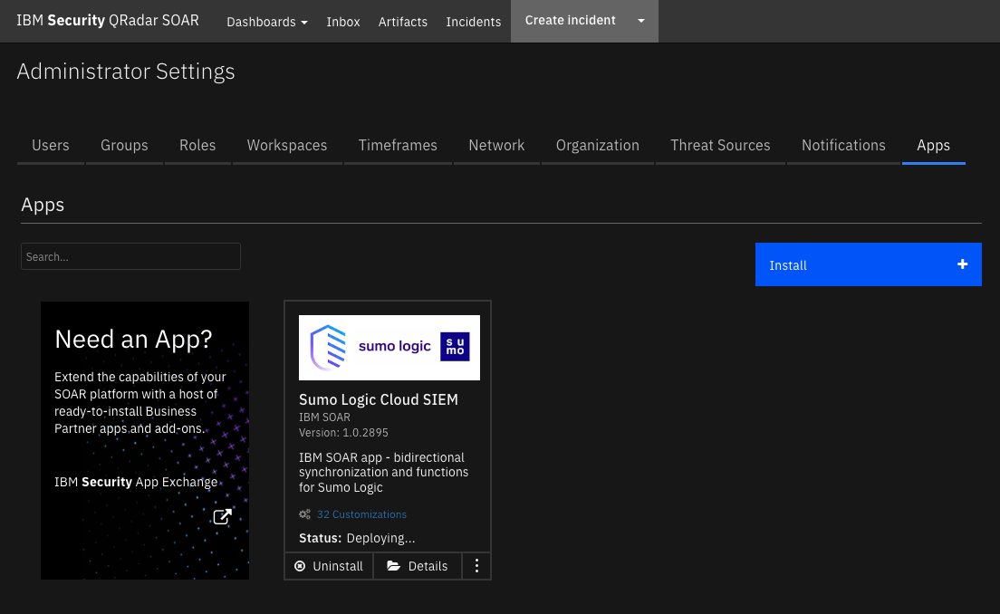

Bi-directional App for Sumo Logic Cloud SIEM. Query Sumo Logic for insights based on user-defined query parameters and create and update cases in SOAR.<br>

### Key Features
<!--
  List the Key Features of the Integration
-->
* Poll Sumo Logic insights and create and update the corresponding cases in SOAR
* Allow user to specify insight polling filters to limit insights escalated to SOAR 
* Create artifacts in SOAR case from Sumo Logic entities
* Create hits on SOAR artifacts based on the corresponding entity's Signal Severity Total in Sumo Logic via automatic or manual playbooks
* Synchronize comments and notes between Sumo Logic insight and corresponding SOAR case
* View insight signal details in the Signals data table
* Write the insight, signal and entity full JSON data from Sumo Logic to a note in SOAR
* Post tags to an insight from SOAR
* Sumo Logic custom incident tab that contains insight custom fields, a link back to the insight in Sumo Logic and the Signals data table

---

## Requirements
<!--
  List any Requirements
-->

This app supports the IBM Security QRadar SOAR Platform and the IBM Security QRadar SOAR for IBM Cloud Pak for Security.

### SOAR platform
The SOAR platform supports two app deployment mechanisms, Edge Gateway (also known as App Host) and integration server.

If deploying to a SOAR platform with an App Host, the requirements are:
* SOAR platform >= `51.0.0.0`.
* The app is in a container-based format (available from the AppExchange as a `zip` file).

If deploying to a SOAR platform with an integration server, the requirements are:
* SOAR platform >= `51.0.0.0`.
* The app is in the older integration format (available from the AppExchange as a `zip` file which contains a `tar.gz` file).
* Integration server is running `resilient-circuits>=51.0.0`.
* If using an API key account, make sure the account provides the following minimum permissions:
  | Name | Permissions |
  | ---- | ----------- |
  | Org Data | Read |
  | Function | Read |
  | Incidents | Read, Create |
  | Edit Incidents | Fields, Status |
  | Layouts | Read, Edit |

The following SOAR platform guides provide additional information:
* _Edge Gateway Deployment Guide_ or _App Host Deployment Guide_: provides installation, configuration, and troubleshooting information, including proxy server settings.
* _Integration Server Guide_: provides installation, configuration, and troubleshooting information, including proxy server settings.
* _System Administrator Guide_: provides the procedure to install, configure and deploy apps.

The above guides are available on the IBM Documentation website at [ibm.biz/soar-docs](https://ibm.biz/soar-docs). On this web page, select your SOAR platform version. On the follow-on page, you can find the _Edge Gateway Deployment Guide_, _App Host Deployment Guide_, or _Integration Server Guide_ by expanding **Apps** in the Table of Contents pane. The System Administrator Guide is available by expanding **System Administrator**.

### Cloud Pak for Security
If you are deploying to IBM Cloud Pak for Security, the requirements are:
* IBM Cloud Pak for Security >= `1.10`.
* Cloud Pak is configured with an Edge Gateway.
* The app is in a container-based format (available from the AppExchange as a `zip` file).

The following Cloud Pak guides provide additional information:
* _Edge Gateway Deployment Guide_ or _App Host Deployment Guide_: provides installation, configuration, and troubleshooting information, including proxy server settings. From the Table of Contents, select Case Management and Orchestration & Automation > **Orchestration and Automation Apps**.
* _System Administrator Guide_: provides information to install, configure, and deploy apps. From the IBM Cloud Pak for Security IBM Documentation table of contents, select Case Management and Orchestration & Automation > **System administrator**.

These guides are available on the IBM Documentation website at [ibm.biz/cp4s-docs](https://ibm.biz/cp4s-docs). From this web page, select your IBM Cloud Pak for Security version. From the version-specific IBM Documentation page, select Case Management and Orchestration & Automation.

### Proxy Server
The app **does** support a proxy server.

### Python Environment
Python 3.9, 3.11, and 3.12 are officially supported. When deployed as an app, the app runs on Python 3.11.
Additional package dependencies may exist for each of these packages:
* resilient-circuits>=51.0.0

### Sumo Logic Development Version

This app has been implemented using:
| Product Name | Product Version | API URL | API Version |
| ------------ | --------------- | ------- | ----------- |
| Sumo Logic Cloud SIEM | N/A | https://api.sumologic.com/api | v1 |

#### Prerequisites
<!--
List any prerequisites that are needed to use with this endpoint solution. Remove any section that is unnecessary.
-->
* A Sumo Logic Log Analytics Platform user account in which Cloud SIEM Enterprise is enabled.

#### Configuration
<!--
List any steps that are needed to configure the endpoint to use this app.
-->
### Generate an Access Key and Secret in Sumo Log Analytics Platform
In the lower left corner of the Sumo Logic panel in the User Account Preferences menu item, Click on the `+ Add Access Key` blue button:

 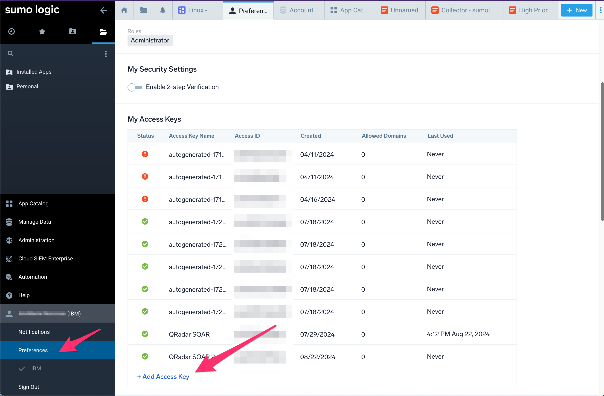

In the `Create an Access Key` dialog, enter an `Access Key Name` and Click the blue `Create Key` button.

 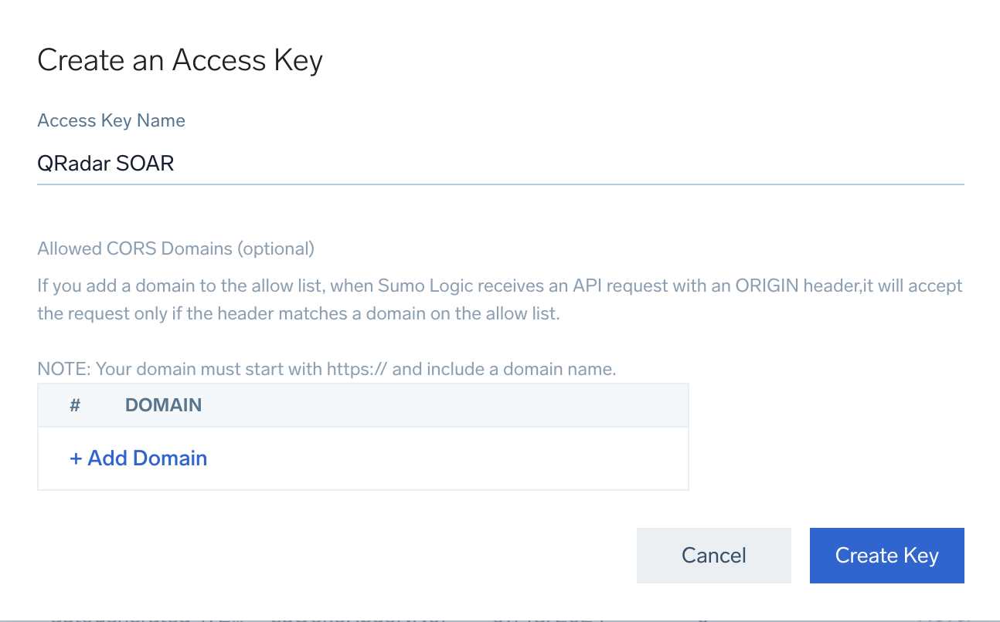

Copy the Access ID and Access Key for use in the app.config file.

 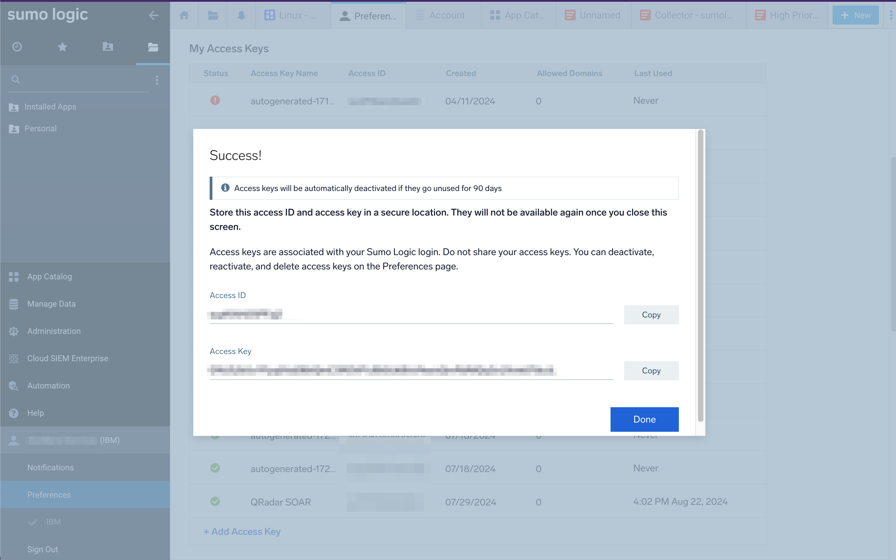
---

## Installation

### Install
* To install or uninstall an App or Integration on the _SOAR platform_, see the documentation at [ibm.biz/soar-docs](https://ibm.biz/soar-docs).
* To install or uninstall an App on _IBM Cloud Pak for Security_, see the documentation at [ibm.biz/cp4s-docs](https://ibm.biz/cp4s-docs) and follow the instructions above to navigate to Orchestration and Automation.

### App Configuration
The following table provides the settings you need to configure the app. These settings are made in the app.config file. See the documentation discussed in the Requirements section for the procedure.

| Config | Required | Example | Description |
| ------ | :------: | ------- | ----------- |
| **access_id** | Yes | `xxx` | *Sumo Logic Access ID.* |
| **access_key** | Yes | `xxx` | *Sumo Logic Access Key.* |
| **api_endpoint_url** | Yes | `https://api.sumologic.com/api` | *Sumo Logic REST API endpoint URL. See Sumo Logic documentation to determine URL for your region: https://help.sumologic.com/docs/api/getting-started/#which-endpoint-should-i-should-use .* |
| **console_url** | Yes | `https://service.sumologic.com` | *Sumo Logic console URL - used to create links back to Sumo Logic Insight.*  |
| **polling_interval** | Yes | `600` | *Poller interval time in seconds. Value of zero turns poller off.*  |
| **polling_lookback** | Yes | `20160` | *Number of minutes to lookback for queries the first time the poller runs.* |
| **polling_add_case_url_comment_in_sumo_logic** | No | `True` | *Boolean flag indicating whether or not to add a comment in the Sumo Logic Insight that contains the URL link back to corresponding SOAR case.* |
| **polling_filters** | No | `status:in("inprogress","new","closed") confidence:>=.70 severity:>="MEDIUM"` | *Polling filters to limit escalated insights - Sumo Logic DSL query statement - each query parameter separated by a space.* |
| **soar_create_case_template** | No | `/var/rescircuits/create_case.jinja` | *Path to override template for automatic case creation. See [Poller Considerations](#poller-considerations).* |
| **soar_update_case_template** | No | `/var/rescircuits/update_case.jinja` | *Path to override template for automatic case updating. See [Poller Considerations](#poller-considerations).* |
| **soar_close_case_template** | No | `/var/rescircuits/close_case.jinja` | *Path to override template for automatic case closing. See [Poller Considerations](#poller-considerations).* |


### Poller Considerations
When the poller is enabled, cases are automatically escalated from this app. Any updates are checked at the cadence defined by the value set for `polling_interval`. It is possible, however, to escalate cases from other sources.
In this scenario, the poller would be disabled by setting `polling_interval=0` and a separate source might capture a case from the endpoint and in turn create a case in SOAR. This app can still be useful for enrichment of that
newly created case even though it was not directly escalated from this app. As long as the reference ID (i.e. alert ID, event ID, etc...) for each case is preserved, all remaining details will synchronize to the SOAR case through this app automatically.

Sumo Logic REST API does not allow querying insights based on insight field `lastUpdated` timestamp. In order to implement bidirectional synchronization between Sumo Logic insights and SOAR cases, all Sumo Logic insights that have cases in SOAR are fetched and each case is updated on each polling interval.  Take this overhead into consideration when determining the `polling_interval`, especially if you have a large number of Sumo Logic cases in SOAR. 

### Insights Filtering

To limit the number of insights escalated to SOAR, consider using the optional `polling_filters` parameter in the app configuration file. The query string format is documented in Sumo Logic at: https://api.sumologic.com/docs/sec/#operation/GetInsights and below:


The search query string uses sumo logic custom DSL that is used to filter the results.   

Each filter is in the format `field:operator:value`. Multiple filters are separated by a space.

   Operators:
   - `exampleField:"bar"`: The value of the field is equal to "bar".
   - `exampleField:in("bar", "baz", "qux")`: The value of the field is equal to either "bar", "baz", or "qux".
   - `exampleTextField:contains("foo bar")`: The value of the field contains the phrase "foo bar".
   - `exampleNumField:>5`: The value of the field is greater than 5. There are similar `<`, `<=`, and `>=` operators.
   - `exampleNumField:5..10`: The value of the field is between 5 and 10 (inclusive).
   - `exampleDateField:>2019-02-01T05:00:00+00:00`: The value of the date field is after 5 a.m. UTC time on February 2, 2019.
   - `exampleDateField:2019-02-01T05:00:00+00:00..2019-02-01T08:00:00+00:00`: The value of the date field is between 5 a.m. and 8 a.m. UTC time on February 2, 2019.

   Fields:
   - readableId
   - status
   - statusId
   - name
   - insightId
   - serialId
   - description
   - created
   - timestamp
   - closed
   - assignee
   - entity.id
   - entity.ip
   - entity.hostname
   - entity.username
   - entity.sensorZone
   - entity.type
   - entity.value
   - involvedEntities.id
   - involvedEntities.type,
   - involvedEntities.value
   - enrichment
   - sensorZone
   - tag
   - severity
   - resolution
   - subResolution
   - ruleId
   - records
   - confidence

NOTE: The poller uses the `created` field to escalate new insights to SOAR, so this insight field should not be used to filter insights.

#### Polling Filter Examples

```
polling_filters = status:in("inprogress","new","closed") confidence:>=.85 severity:>="HIGH"
```

In this example, the query will return all insights with a status of either "inprogress", "new", and "closed" AND a confidence greater than or equal to .85 AND a severity greater than or equal to "HIGH" (which includes values "HIGH" or "CRITICAL").


#### Poller Templates for SOAR Cases
It may be necessary to modify the templates used to create, update, or close SOAR cases based on your required custom fields in SOAR.

This is especially relevant if you have required custom _close_ fields that need to be filled when closing a case in SOAR. If that is the case, be sure to implement a custom `close_case_template` and reference those required close fields in the template.

When overriding the template in App Host, specify the file path for each file as `/var/rescircuits`.

Below are the default templates used which can be copied, modified, and used with app_config's
`soar_create_case_template`, `soar_update_case_template`, and `soar_close_case_template` settings to override the default templates.

<details><summary>soar_create_case.jinja</summary>

```jinja
{
  {# JINJA template for creating a new SOAR incident from an endpoint #}
  {# See https://ibmresilient.github.io/resilient-python-api/pages/resilient-lib/resilient-lib.html#module-resilient_lib.components.templates_common
     for details on available jinja methods. Examples for `soar_substitute` and more are included below.
  #}
  
  {# modify to specify your specific **data** fields #}
  "name": "Sumo Logic {{ readableId }} - {{ name }}",
  "description": "{{ description | replace('"', '\\"') }}",
  {# start_date cannot be after discovered_date #}
  
  "discovered_date": {{ created| soar_datetimeformat(split_at='.') }},
  "start_date": {{ start_date | soar_datetimeformat(split_at='.') }},
  {# if alert users are different than SOAR users, consider using a mapping table using soar_substitute: #}
  {# "owner_id": "{{ **assignedTo** |soar_substitute('{"Automation": "soar_user1@example.com", "default_user@example.com": "soar_user2@example.com", "DEFAULT": "default_user@example.com" }') }}", #}
  "plan_status": "A",
  "severity_code": "{{ severity | soar_substitute(severity_mapping) }}",
  {# specify your custom fields for your endpoint solution #}
  "properties": {
    "sumo_logic_insight_id": "{{ id }}"
  }
}
```
</details>

<details><summary>soar_update_case.jinja</summary>

```jinja
{
  {# JINJA template for updating a new SOAR incident from an endpoint #}
  {# modify to specify your specific **data** fields #}
  
  "severity_code": "{{ severity | soar_substitute(severity_mapping) }}",
  {# specify your custom fields for your endpoint solution #}
  "properties": {
    "sumo_logic_insight_global_confidence": {{ (confidence*100)|int }},
    "sumo_logic_insight_assignee": "{{ assignee.displayName }} ({{assignee.username}})",
    "sumo_logic_insight_status": "{{ status.displayName }}",
    "sumo_logic_insight_readable_id": "{{ readableId }}",
    "sumo_logic_insight_resolution": "{{ resolution }}",
    "sumo_logic_insight_source": "{{ source }}",
    "sumo_logic_insight_sub_resolution": "{{ subResolution }}",
    "sumo_logic_insight_link": "<a target='_blank' href='{{ entity_url }}'>Insight</a>"
    
    ,"sumo_logic_insight_tags": "{{ tags | join(', ') }}"
    
  }
}

```
</details>

<details><summary>soar_close_case.jinja</summary>

```jinja
{
  {# JINJA template for closing a SOAR incident using endpoint data #}
  {# modify to specify your specific **data** fields #}
  "plan_status": "C",
  "resolution_id": "{{ resolution | soar_substitute('{"False Positive": "Not an Issue", "Resolved": "Resolved", "Duplicate": "Duplicate", "No Action": "Unresolved" }') }}",
  "resolution_summary": "Closed by Sumo Logic, Insight Status: {{ status.displayName }}"
  {# add additional fields based on your 'on close' field requirements #}
  {#
  ,"properties": {
      "your_custom_field": "value"
  }
  #}
}
```
</details>


 ---

## Function - Sumo Logic: Add Comment to Insight
Post a comment to a Sumo Logic insight in Sumo Logic.

 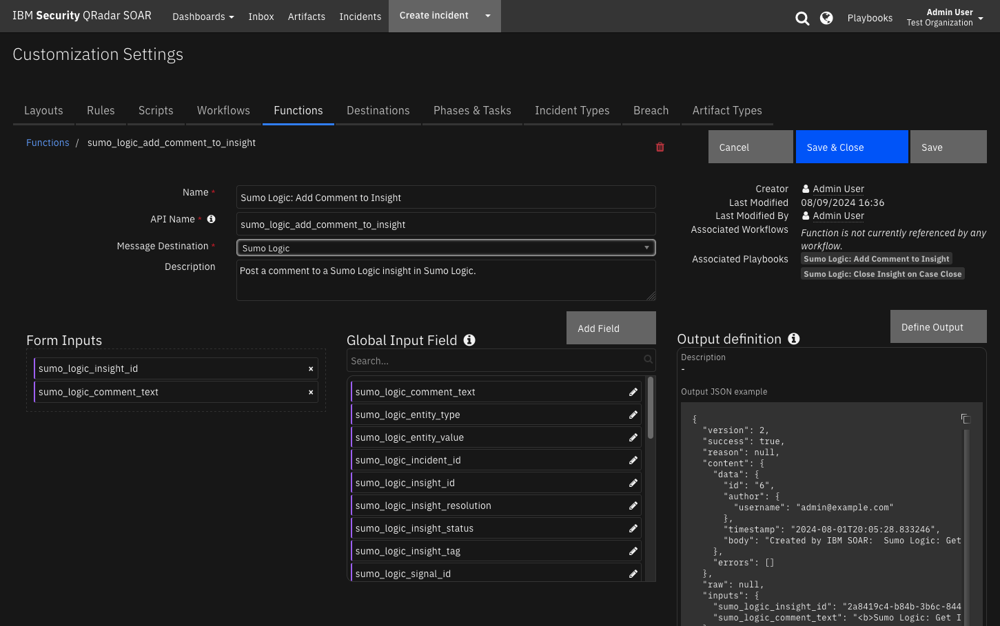

<details><summary>Inputs:</summary>
<p>

| Name | Type | Required | Example | Tooltip |
| ---- | :--: | :------: | ------- | ------- |
| `sumo_logic_comment_text` | `text` | Yes | `-` | - |
| `sumo_logic_insight_id` | `text` | Yes | `-` | - |

</p>
</details>

<details><summary>Outputs:</summary>
<p>

> **NOTE:** This example might be in JSON format, but `results` is a Python Dictionary on the SOAR platform.

```python
results = {
  "content": {
    "data": {
      "author": {
        "username": "admin@example.com"
      },
      "body": "Created by IBM SOAR:  Sumo Logic: Get Insight Comments  playbook created 1 notes in SOAR.",
      "id": "6",
      "timestamp": "2024-08-01T20:05:28.833246"
    },
    "errors": []
  },
  "inputs": {
    "sumo_logic_comment_text": "\u003cb\u003eSumo Logic: Get Insight Comments\u003c/b\u003e playbook created 1 notes in SOAR.",
    "sumo_logic_insight_id": "2a8419c4-b84b-3b6c-8447-af4ccbfba9c6"
  },
  "metrics": {
    "execution_time_ms": 9515,
    "host": "my.app.host",
    "package": "fn-sumo-logic",
    "package_version": "1.0.0",
    "timestamp": "2024-08-01 16:05:30",
    "version": "1.0"
  },
  "raw": null,
  "reason": null,
  "success": true,
  "version": 2.0
}
```

</p>
</details>

<details><summary>Example Function Input Script:</summary>
<p>

```python
inputs.sumo_logic_insight_id = incident.properties.sumo_logic_insight_id
inputs.sumo_logic_comment_text = note.text.content
```

</p>
</details>

<details><summary>Example Function Post Process Script:</summary>
<p>

```python
from datetime import datetime

results = playbook.functions.results.add_comment_to_insight_results

# Edit note in SOAR to indicate it was sent to CBC alert
if results.get("success"):
  # Get the current time
  now = datetime.now()
  note.text = u"<b>Post comment to Sumo Logic insight at {0}</b><br>{1}".format(now, note.text.content)
```

</p>
</details>

---
## Function - Sumo Logic: Add Tag to Insight
Add a tag to a Sumo Logic insight in Sumo Logic.

 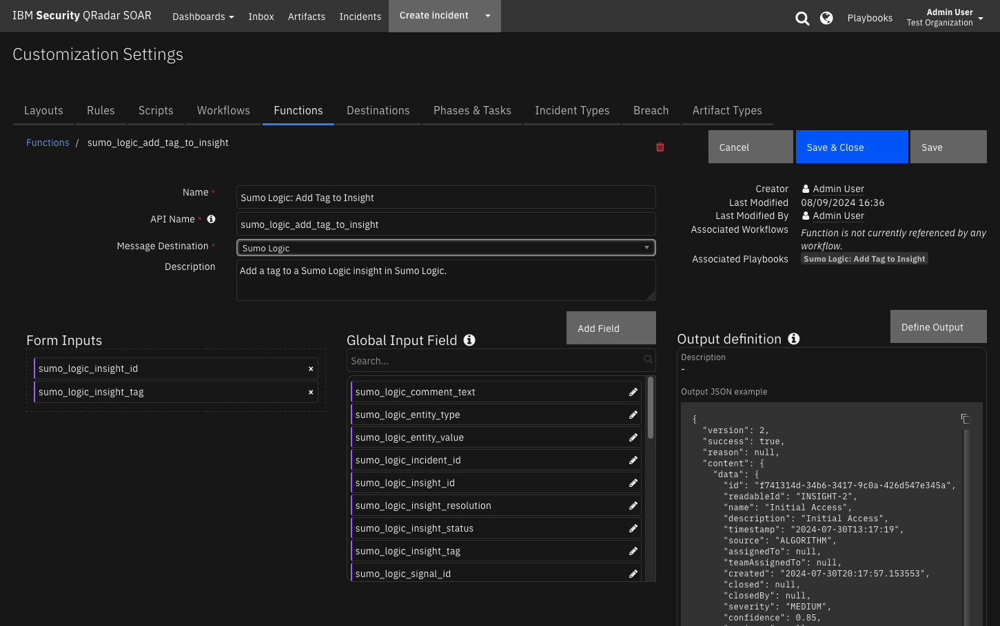

<details><summary>Inputs:</summary>
<p>

| Name | Type | Required | Example | Tooltip |
| ---- | :--: | :------: | ------- | ------- |
| `sumo_logic_insight_id` | `text` | Yes | `-` | - |
| `sumo_logic_insight_tag` | `text` | Yes | `-` | - |

</p>
</details>

<details><summary>Outputs:</summary>
<p>

> **NOTE:** This example might be in JSON format, but `results` is a Python Dictionary on the SOAR platform.

```python
results = {
  "content": {
    "data": {
      "artifacts": [],
      "assignedTo": null,
      "assignee": null,
      "closed": null,
      "closedBy": null,
      "confidence": 0.85,
      "created": "2024-07-30T20:17:57.153553",
      "description": "Initial Access",
      "entity": {
        "entityType": "_username",
        "hostname": null,
        "id": "_username-root",
        "macAddress": null,
        "name": "root",
        "sensorZone": "",
        "value": "root"
      },
      "id": "f741314d-34b6-3417-9c0a-426d547e345a",
      "involvedEntities": [
        {
          "entityType": "_process",
          "hostname": null,
          "id": "_process-sshd",
          "macAddress": null,
          "name": "sshd",
          "sensorZone": null,
          "value": "sshd"
        },
        {
          "entityType": "_username",
          "hostname": null,
          "id": "_username-root",
          "macAddress": null,
          "name": "root",
          "sensorZone": null,
          "value": "root"
        },
        {
          "entityType": "_ip",
          "hostname": null,
          "id": "_ip-9.108.160.132",
          "macAddress": null,
          "name": "9.108.160.132",
          "sensorZone": null,
          "value": "9.108.160.132"
        },
        {
          "entityType": "_hostname",
          "hostname": "sumologic1",
          "id": "_hostname-sumologic1",
          "macAddress": null,
          "name": "sumologic1",
          "sensorZone": null,
          "value": "sumologic1"
        }
      ],
      "lastUpdated": "2024-08-01T13:18:50.606099",
      "lastUpdatedBy": null,
      "name": "Initial Access",
      "orgId": "0000000000BD6D7C",
      "readableId": "INSIGHT-2",
      "resolution": null,
      "severity": "MEDIUM",
      "signals": [
        {
          "allRecords": [
            {
              "baseImage": "sshd",
              "bro_dns_answers": [],
              "bro_file_bytes": {},
              "bro_file_connUids": [],
              "bro_flow_service": [],
              "bro_ftp_pendingCommands": [],
              "bro_http_cookieVars": [],
              "bro_http_origFuids": [],
              "bro_http_origMimeTypes": [],
              "bro_http_request_headers": {},
              "bro_http_request_proxied": [],
              "bro_http_response_headers": {},
              "bro_http_response_respFuids": [],
              "bro_http_response_respMimeTypes": [],
              "bro_http_tags": [],
              "bro_http_uriVars": [],
              "bro_kerberos_clientCert": {},
              "bro_kerberos_serverCert": {},
              "bro_sip_headers": {},
              "bro_sip_requestPath": [],
              "bro_sip_responsePath": [],
              "bro_ssl_certChainFuids": [],
              "bro_ssl_clientCertChainFuids": [],
              "cseSignal": {},
              "day": 30,
              "device_hostname": "sumologic1",
              "device_hostname_raw": "sumologic1",
              "dstDevice_hostname": "sumologic1",
              "dstDevice_hostname_raw": "sumologic1",
              "fieldTags": {},
              "fields": {
                "event_id": "sshd-failed-invalid-password",
                "source_ip": "9.108.160.132",
                "source_port": "53371",
                "ssh_version": "ssh2",
                "syslog_hostname": "sumologic1",
                "syslog_message": "Failed password for root from 9.108.160.132 port 53371 ssh2",
                "syslog_process": "sshd",
                "syslog_process_id": "35224",
                "syslog_timestamp": "Jul 30 13:17:19",
                "user": "root"
              },
              "friendlyName": "record",
              "hour": 13,
              "http_requestHeaders": {},
              "listMatches": [],
              "matchedItems": [],
              "metadata_deviceEventId": "sshd-failed-invalid-password",
              "metadata_mapperName": "Linux OS Syslog - Process sshd - SSH Auth Failure Invalid Password",
              "metadata_mapperUid": "05445189-0e1e-425a-8f2b-5d1f41e9546e",
              "metadata_orgId": "0000000000BD6D7C",
              "metadata_parseTime": 1722370665323,
              "metadata_parser": "/Parsers/System/Linux/Linux OS Syslog",
              "metadata_product": "Linux OS Syslog",
              "metadata_productGuid": "0e20c932-d992-4bd4-b276-c15119ca5c0b",
              "metadata_receiptTime": 1722370640,
              "metadata_schemaVersion": 3,
              "metadata_sensorId": "0000000000BD6D7C",
              "metadata_sensorInformation": {},
              "metadata_sensorZone": "default",
              "metadata_sourceBlockId": "2295449033841068855",
              "metadata_sourceCategory": "linux/system",
              "metadata_sourceMessageId": "-7272543713819412727",
              "metadata_vendor": "Linux",
              "month": 7,
              "normalizedAction": "logon",
              "objectClassification": "Authentication",
              "objectType": "Authentication",
              "pid": 35224,
              "srcDevice_ip": "9.108.160.132",
              "srcDevice_ip_ipv4IntValue": 158113924,
              "srcDevice_ip_isInternal": false,
              "srcDevice_ip_version": 4,
              "srcPort": 53371,
              "success": false,
              "timestamp": 1722345439000,
              "uid": "aac19471-8442-5536-9742-bcc5aacc1e80",
              "user_username": "root",
              "user_username_raw": "root",
              "year": 2024
            }
          ],
          "artifacts": [],
          "contentType": "RULE",
          "created": "2024-07-30T13:17:19",
          "description": "Detects multiple failed login attempts for the same username over a 24 hour timeframe. This is designed to catch both slow and quick brute force type attacks. The threshold and time frame can be adjusted based on the customer\u0027s environment.",
          "entity": {
            "entityType": "_username",
            "hostname": null,
            "id": "_username-root",
            "macAddress": null,
            "name": "root",
            "sensorZone": "",
            "value": "root"
          },
          "id": "f16f0e84-66c4-50c7-a0b2-b02b5cbdd543",
          "name": "Brute Force Attempt",
          "recordCount": 1,
          "recordSearchDetails": {
            "query": "_index=sec_record_* | json field=_raw \"resultType\" as _unpacked__raw_resultType nodrop\n| where (if (isNull(objectType), false, objectType == \"Authentication\") and if (isNull(normalizedAction), false, normalizedAction == \"logon\") and if (isNull(success), false, !(success)) and !(if (isNull(metadata_deviceEventId), false, metadata_deviceEventId == \"Security-4776\") and !isBlank(listMatches) AND jsonArrayContains(listMatches, \"domain_controllers\")) and !(if (isNull(metadata_vendor), false, metadata_vendor == \"Microsoft\") and if (isNull(metadata_product), false, metadata_product == \"Azure\") and if (isNull(_unpacked__raw_resultType), false, _unpacked__raw_resultType == \"700082\")) and !(metadata_vendor in (\"Microsoft\", \"Intersect Alliance\") and metadata_product in (\"Windows\", \"Snare Enterprise Agent for Windows\") and user_username matches /^[\\s\\S]*\\$[\\s\\S]*$/) and !(!isBlank(listMatches) AND jsonArrayContains(listMatches, \"vuln_scanners\")) and if (isNull(metadata_deviceEventId), false, metadata_deviceEventId == \"sshd-failed-invalid-password\") and if (isNull(metadata_product), false, metadata_product == \"Linux OS Syslog\") and if (isNull(metadata_vendor), false, metadata_vendor == \"Linux\") and if (isNull(user_username), false, user_username == \"root\"))",
            "queryEndTime": "2024-07-30T14:24:00",
            "queryStartTime": "2024-07-29T14:24:00"
          },
          "recordTypes": [],
          "ruleId": "THRESHOLD-S00096",
          "severity": 4,
          "stage": "Initial Access",
          "tags": [
            "_mitreAttackTactic:TA0006",
            "_mitreAttackTechnique:T1078",
            "_mitreAttackTactic:TA0001",
            "_mitreAttackTechnique:T1110.001",
            "_mitreAttackTechnique:T1110.002",
            "_mitreAttackTactic:TA0008",
            "_mitreAttackTechnique:T1110",
            "_mitreAttackTechnique:T1586"
          ],
          "timestamp": "2024-07-30T13:17:19"
        }
      ],
      "source": "ALGORITHM",
      "status": {
        "displayName": "In Progress",
        "name": "inprogress"
      },
      "subResolution": null,
      "tags": [
        "New tag",
        "_mitreAttackTactic:TA0001",
        "_mitreAttackTactic:TA0006",
        "_mitreAttackTactic:TA0008",
        "_mitreAttackTechnique:T1078",
        "_mitreAttackTechnique:T1110",
        "_mitreAttackTechnique:T1110.001",
        "_mitreAttackTechnique:T1110.002",
        "_mitreAttackTechnique:T1586"
      ],
      "teamAssignedTo": null,
      "timeToDetection": 25238.153553,
      "timeToRemediation": null,
      "timeToResponse": 147653.411281,
      "timestamp": "2024-07-30T13:17:19"
    },
    "errors": []
  },
  "inputs": {
    "sumo_logic_insight_id": "f741314d-34b6-3417-9c0a-426d547e345a",
    "sumo_logic_insight_tag": "New tag"
  },
  "metrics": {
    "execution_time_ms": 151744,
    "host": "my.app.host",
    "package": "fn-sumo-logic",
    "package_version": "1.0.0",
    "timestamp": "2024-08-02 13:49:08",
    "version": "1.0"
  },
  "raw": null,
  "reason": null,
  "success": true,
  "version": 2.0
}
```

</p>
</details>

<details><summary>Example Function Input Script:</summary>
<p>

```python
inputs.sumo_logic_insight_id = incident.properties.sumo_logic_insight_id
inputs.sumo_logic_insight_tag = playbook.inputs.sumo_logic_insight_tag
```

</p>
</details>

<details><summary>Example Function Post Process Script:</summary>
<p>

```python
results = playbook.functions.results.add_tag_results

if results.get("success"):
    content = results.get("content")
    if content:
        data = content.get("data", None)
        tags = data.get("tags", None)
        incident.properties.sumo_logic_insight_tags = ", ".join(tags) if isinstance(tags, list) else None
        note_text = f"<b>Sumo Logic Add Tag to Insight:</b>  {playbook.inputs.sumo_logic_insight_tag} added."
    else:
        note_text = "<b>Sumo Logic: Add Tag to Insight</b> failed to post tag(s) - no content."
else:
    reason = results.get("reason")
    note_text = "<b>VMware CBC: Add Tag to Insight</b> failed to add tag(s) {reason}."
  
incident.addNote(note_text)
```

</p>
</details>

---
## Function - Sumo Logic: Get Entity
Query Sumo Logic to get details of an entity.

 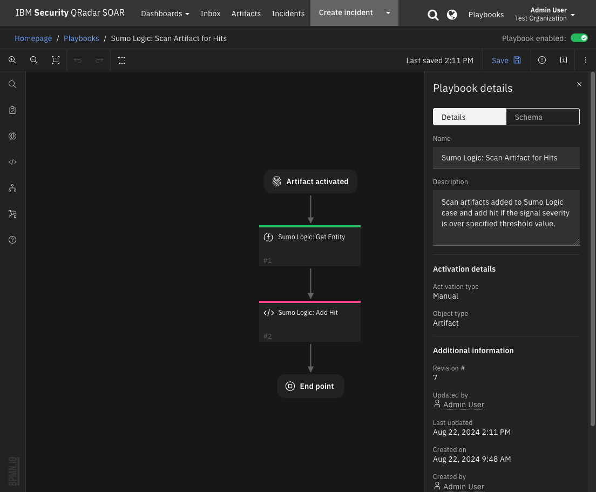

The **Sumo Logic: Scan Artifact for Hits** playbooks create hits on artifacts based on the Signal Severity score associated with Sumo Logic entities.
<p>
NOTE: Edit the following playbook post-script variable to set the minimum threshold at which a hit is added to an artifact:

```python
MINIMUM_RECENT_SIGNAL_SEVERITY = 8
```

 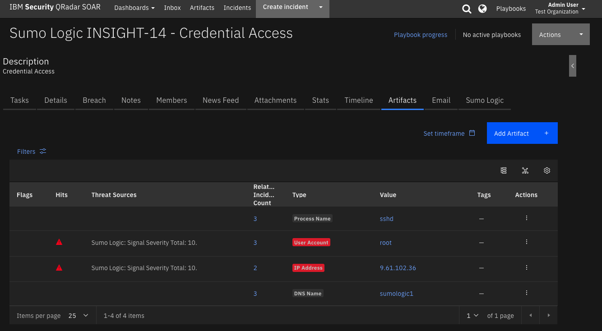

<details><summary>Inputs:</summary>
<p>

| Name | Type | Required | Example | Tooltip |
| ---- | :--: | :------: | ------- | ------- |
| `sumo_logic_entity_type` | `text` | No | `-` | - |
| `sumo_logic_entity_value` | `text` | No | `-` | - |

</p>
</details>

<details><summary>Outputs:</summary>
<p>

> **NOTE:** This example might be in JSON format, but `results` is a Python Dictionary on the SOAR platform.

```python
results = {
  "content": [
    {
      "activityScore": 0,
      "criticality": null,
      "entityType": "_ip",
      "firstSeen": null,
      "hostname": null,
      "id": "_ip-9.61.102.36",
      "isSuppressed": false,
      "lastSeen": "2024-08-20T08:39:03",
      "macAddress": null,
      "name": "9.61.102.36",
      "recentSignalSeverity": 10,
      "reputation": null,
      "sensorZone": null,
      "tags": [],
      "value": "9.61.102.36"
    }
  ],
  "inputs": {
    "sumo_logic_entity_type": "_ip",
    "sumo_logic_entity_value": "9.61.102.36",
    "sumo_logic_insight_id": "0b5f00b6-b14d-3492-9564-28bd98610a29"
  },
  "metrics": {
    "execution_time_ms": 7397,
    "host": "my.app.host",
    "package": "fn-sumo-logic",
    "package_version": "1.0.0",
    "timestamp": "2024-08-21 11:39:58",
    "version": "1.0"
  },
  "raw": null,
  "reason": null,
  "success": true,
  "version": 2.0
}
```

</p>
</details>

<details><summary>Example Function Input Script:</summary>
<p>

```python
ARTIFACT_TYPE_MAPPING = {
  "DNS Name": "_hostname",
  "IP Address": "_ip",
  "File Path": "_file",
  "MAC Address": "_mac",
  "Process Name": "_process",
  "User Account": "_username",
  "User Agent": "_useragent",
  "URL": "_url"
}

inputs.sumo_logic_entity_type = ARTIFACT_TYPE_MAPPING.get(artifact.type, None)
if not inputs.sumo_logic_entity_type:
  helper.fail(f"Artifact {artifact.type} not mapped.")
inputs.sumo_logic_entity_value = artifact.value
```

</p>
</details>

<details><summary>Example Function Post Process Script:</summary>
<p>

```python
# Edit the following variable to change the minimum threshold at which a hit is added to an artifact.
MINIMUM_RECENT_SIGNAL_SEVERITY = 8
results = playbook.functions.results.get_entity_results

note_text = "<b>Sumo Logic Automatic Scan Artifact:</b><br>"
if results.get("success"):
    content = results.get("content")
    if content:
        data = content.get("data", {})
        if data:
            total = data.get("total", 0)
            if total >= 1:
                objects = data.get("objects", [])
                if total >= 1:
                    entity = objects[0]
                    recent_signal_severity = entity.get("recentSignalSeverity")
                    if recent_signal_severity >= MINIMUM_RECENT_SIGNAL_SEVERITY:
                        # Create a hit on the artifact.
                        hit = [
                          {
                            "name": "Artifact Value",
                            "type": "string",
                            "value": f"{artifact.value}"
                          }
                        ]
                        artifact.addHit(f"Sumo Logic: Signal Severity Total: {recent_signal_severity}.", hit)
                        note_text = f"{note_text} Hit added on <b>{artifact.type} {artifact.value}</b> with Signal Severity Total: <b>{recent_signal_severity}</b>."

                        incident.addNote(note_text)
```

</p>
</details>

---
## Function - Sumo Logic: Get Insight By ID
Get the details of a Sumo Logic insight given the insight ID.

 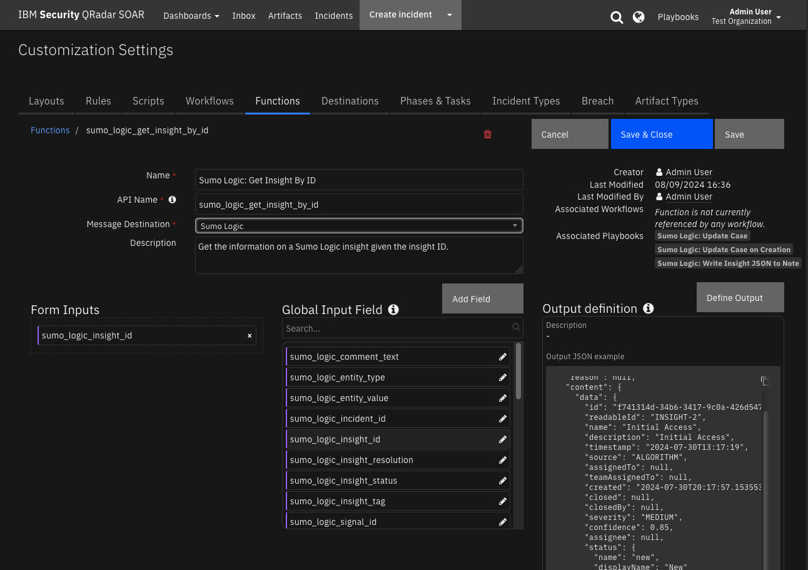

<details><summary>Inputs:</summary>
<p>

| Name | Type | Required | Example | Tooltip |
| ---- | :--: | :------: | ------- | ------- |
| `sumo_logic_insight_id` | `text` | Yes | `-` | - |

</p>
</details>

<details><summary>Outputs:</summary>
<p>

> **NOTE:** This example might be in JSON format, but `results` is a Python Dictionary on the SOAR platform.

```python
results = {
  "content": {
    "data": {
      "artifacts": [],
      "assignedTo": null,
      "assignee": null,
      "closed": null,
      "closedBy": null,
      "confidence": 0.85,
      "created": "2024-07-30T20:17:57.153553",
      "description": "Initial Access",
      "entity": {
        "entityType": "_username",
        "hostname": null,
        "id": "_username-root",
        "macAddress": null,
        "name": "root",
        "sensorZone": "",
        "value": "root"
      },
      "id": "f741314d-34b6-3417-9c0a-426d547e345a",
      "involvedEntities": [
        {
          "entityType": "_process",
          "hostname": null,
          "id": "_process-sshd",
          "macAddress": null,
          "name": "sshd",
          "sensorZone": null,
          "value": "sshd"
        },
        {
          "entityType": "_username",
          "hostname": null,
          "id": "_username-root",
          "macAddress": null,
          "name": "root",
          "sensorZone": null,
          "value": "root"
        },
        {
          "entityType": "_ip",
          "hostname": null,
          "id": "_ip-9.108.160.132",
          "macAddress": null,
          "name": "9.108.160.132",
          "sensorZone": null,
          "value": "9.108.160.132"
        },
        {
          "entityType": "_hostname",
          "hostname": "sumologic1",
          "id": "_hostname-sumologic1",
          "macAddress": null,
          "name": "sumologic1",
          "sensorZone": null,
          "value": "sumologic1"
        }
      ],
      "lastUpdated": "2024-07-30T20:18:10.061087",
      "lastUpdatedBy": null,
      "name": "Initial Access",
      "orgId": "0000000000BD6D7C",
      "readableId": "INSIGHT-2",
      "recordSummaryFields": [],
      "resolution": null,
      "severity": "MEDIUM",
      "signals": [
        {
          "allRecords": [
            {
              "baseImage": "sshd",
              "bro_dns_answers": [],
              "bro_file_bytes": {},
              "bro_file_connUids": [],
              "bro_flow_service": [],
              "bro_ftp_pendingCommands": [],
              "bro_http_cookieVars": [],
              "bro_http_origFuids": [],
              "bro_http_origMimeTypes": [],
              "bro_http_request_headers": {},
              "bro_http_request_proxied": [],
              "bro_http_response_headers": {},
              "bro_http_response_respFuids": [],
              "bro_http_response_respMimeTypes": [],
              "bro_http_tags": [],
              "bro_http_uriVars": [],
              "bro_kerberos_clientCert": {},
              "bro_kerberos_serverCert": {},
              "bro_sip_headers": {},
              "bro_sip_requestPath": [],
              "bro_sip_responsePath": [],
              "bro_ssl_certChainFuids": [],
              "bro_ssl_clientCertChainFuids": [],
              "cseSignal": {},
              "day": 30,
              "device_hostname": "sumologic1",
              "device_hostname_raw": "sumologic1",
              "dstDevice_hostname": "sumologic1",
              "dstDevice_hostname_raw": "sumologic1",
              "fieldTags": {},
              "fields": {
                "event_id": "sshd-failed-invalid-password",
                "source_ip": "90.8.160.132",
                "source_port": "53371",
                "ssh_version": "ssh2",
                "syslog_hostname": "sumologic1",
                "syslog_message": "Failed password for root from 90.8.160.132 port 53371 ssh2",
                "syslog_process": "sshd",
                "syslog_process_id": "35224",
                "syslog_timestamp": "Jul 30 13:17:19",
                "user": "root"
              },
              "friendlyName": "record",
              "hour": 13,
              "http_requestHeaders": {},
              "listMatches": [],
              "matchedItems": [],
              "metadata_deviceEventId": "sshd-failed-invalid-password",
              "metadata_mapperName": "Linux OS Syslog - Process sshd - SSH Auth Failure Invalid Password",
              "metadata_mapperUid": "05445189-0e1e-425a-8f2b-5d1f41e9546e",
              "metadata_orgId": "0000000000BD6D7C",
              "metadata_parseTime": 1722370665323,
              "metadata_parser": "/Parsers/System/Linux/Linux OS Syslog",
              "metadata_product": "Linux OS Syslog",
              "metadata_productGuid": "0e20c932-d992-4bd4-b276-c15119ca5c0b",
              "metadata_receiptTime": 1722370640,
              "metadata_schemaVersion": 3,
              "metadata_sensorId": "0000000000BD6D7C",
              "metadata_sensorInformation": {},
              "metadata_sensorZone": "default",
              "metadata_sourceBlockId": "2295449033841068855",
              "metadata_sourceCategory": "linux/system",
              "metadata_sourceMessageId": "-7272543713819412727",
              "metadata_vendor": "Linux",
              "month": 7,
              "normalizedAction": "logon",
              "objectClassification": "Authentication",
              "objectType": "Authentication",
              "pid": 35224,
              "srcDevice_ip": "90.8.160.132",
              "srcDevice_ip_ipv4IntValue": 158113924,
              "srcDevice_ip_isInternal": false,
              "srcDevice_ip_version": 4,
              "srcPort": 53371,
              "success": false,
              "timestamp": 1722345439000,
              "uid": "aac19471-8442-5536-9742-bcc5aacc1e80",
              "user_username": "root",
              "user_username_raw": "root",
              "year": 2024
            }
          ],
          "artifacts": [],
          "contentType": "RULE",
          "created": "2024-07-30T13:17:19",
          "description": "Detects multiple failed login attempts for the same username over a 24 hour timeframe. This is designed to catch both slow and quick brute force type attacks. The threshold and time frame can be adjusted based on the customer\u0027s environment.",
          "entity": {
            "entityType": "_username",
            "hostname": null,
            "id": "_username-root",
            "macAddress": null,
            "name": "root",
            "sensorZone": "",
            "value": "root"
          },
          "id": "f16f0e84-66c4-50c7-a0b2-b02b5cbdd543",
          "name": "Brute Force Attempt",
          "recordCount": 1,
          "recordSearchDetails": {
            "query": "_index=sec_record_* | json field=_raw \"resultType\" as _unpacked__raw_resultType nodrop\n| where (if (isNull(objectType), false, objectType == \"Authentication\") and if (isNull(normalizedAction), false, normalizedAction == \"logon\") and if (isNull(success), false, !(success)) and !(if (isNull(metadata_deviceEventId), false, metadata_deviceEventId == \"Security-4776\") and !isBlank(listMatches) AND jsonArrayContains(listMatches, \"domain_controllers\")) and !(if (isNull(metadata_vendor), false, metadata_vendor == \"Microsoft\") and if (isNull(metadata_product), false, metadata_product == \"Azure\") and if (isNull(_unpacked__raw_resultType), false, _unpacked__raw_resultType == \"700082\")) and !(metadata_vendor in (\"Microsoft\", \"Intersect Alliance\") and metadata_product in (\"Windows\", \"Snare Enterprise Agent for Windows\") and user_username matches /^[\\s\\S]*\\$[\\s\\S]*$/) and !(!isBlank(listMatches) AND jsonArrayContains(listMatches, \"vuln_scanners\")) and if (isNull(metadata_deviceEventId), false, metadata_deviceEventId == \"sshd-failed-invalid-password\") and if (isNull(metadata_product), false, metadata_product == \"Linux OS Syslog\") and if (isNull(metadata_vendor), false, metadata_vendor == \"Linux\") and if (isNull(user_username), false, user_username == \"root\"))",
            "queryEndTime": "2024-07-30T14:24:00",
            "queryStartTime": "2024-07-29T14:24:00"
          },
          "recordTypes": [],
          "ruleId": "THRESHOLD-S00096",
          "severity": 4,
          "stage": "Initial Access",
          "tags": [
            "_mitreAttackTactic:TA0006",
            "_mitreAttackTechnique:T1078",
            "_mitreAttackTactic:TA0001",
            "_mitreAttackTechnique:T1110.001",
            "_mitreAttackTechnique:T1110.002",
            "_mitreAttackTactic:TA0008",
            "_mitreAttackTechnique:T1110",
            "_mitreAttackTechnique:T1586"
          ],
          "timestamp": "2024-07-30T13:17:19"
        }
      ],
      "source": "ALGORITHM",
      "status": {
        "displayName": "New",
        "name": "new"
      },
      "subResolution": null,
      "tags": [
        "_mitreAttackTactic:TA0001",
        "_mitreAttackTactic:TA0006",
        "_mitreAttackTactic:TA0008",
        "_mitreAttackTechnique:T1078",
        "_mitreAttackTechnique:T1110",
        "_mitreAttackTechnique:T1110.001",
        "_mitreAttackTechnique:T1110.002",
        "_mitreAttackTechnique:T1586"
      ],
      "teamAssignedTo": null,
      "timeToDetection": 25238.153553,
      "timeToRemediation": null,
      "timeToResponse": null,
      "timestamp": "2024-07-30T13:17:19"
    },
    "errors": []
  },
  "inputs": {
    "sumo_logic_insight_id": "f741314d-34b6-3417-9c0a-426d547e345a"
  },
  "metrics": {
    "execution_time_ms": 7981,
    "host": "my.app.host",
    "package": "fn-sumo-logic",
    "package_version": "1.0.0",
    "timestamp": "2024-07-31 12:25:37",
    "version": "1.0"
  },
  "raw": null,
  "reason": null,
  "success": true,
  "version": 2.0
}
```

</p>
</details>

<details><summary>Example Function Input Script:</summary>
<p>

```python
inputs.sumo_logic_insight_id = incident.properties.sumo_logic_insight_id

```

</p>
</details>

<details><summary>Example Function Post Process Script:</summary>
<p>

```python
# Map Sumo Logic resolution values SOAR resolution id values.
#    Duplicate — The insight has triggered before on the same entity and is a duplicate.
#    False Positive—An insight triggered and it is legitimate activity.
#    No Action—An insight triggered and it might not be an incident but is also not a false positive.
#    Resolved — An incident occurred and was resolved.

MAPPING_RESOLUTION = {
  "Duplicate" : "Duplicate",
  "False Positive": "Resolved",
  "No Action": "Resolved",
  "Resolved" : "Resolved"
}

# Map Sumo Logic subResolution values to SOAR resolution id values.
MAPPING_SUB_RESOLUTION_ON_CLOSE = {
  "None": "Resolved",
  "False positive": "Not an Issue",
  "True positive": "Resolved"
}
results = playbook.functions.results.get_insight_by_id_results

if not results.success:
    incident.addNote("<b>Sumo Logic: Update Case on Creation:</b> Unable to get case data to update custom fields.")
else:
    content = results.get("content", {})
    if content:
        data = content.get("data", None)
        tags = data.get("tags", None)
        incident.properties.sumo_logic_insight_tags = ", ".join(tags) if isinstance(tags, list) else None
        entity_url = content.get("entity_url", None)
        if entity_url:
            incident.properties.sumo_logic_insight_link = "<a target='_blank' href='{0}'>Insight</a>".format(entity_url)
        confidence = data.get("confidence", None)
        incident.properties.sumo_logic_insight_global_confidence = int(confidence * 100) if confidence and (confidence <= 1) else None
        incident.properties.sumo_logic_insight_readable_id = data.get("readableId", None)
        incident.properties.sumo_logic_insight_source = data.get("source", None)
        incident.properties.sumo_logic_insight_resolution = data.get("resolution", None)
        incident.properties.sumo_logic_insight_sub_resolution = data.get("subResolution", None)
        assignee = data.get("assignee", None)
        if assignee:
            display_name = assignee.get("displayName", "")
            username     = assignee.get("username", "")
            incident.properties.sumo_logic_insight_assignee = f"{display_name} ({username})"
        status = data.get("status", None)
        if status:
          incident.properties.sumo_logic_insight_status = status.get("displayName")

        incident.addNote(f"<b>Sumo Logic: Update Case on Creation:</b> Write Alert Custom Fields complete.")
        if incident.properties.sumo_logic_insight_status.lower() == "closed":
            incident.plan_status = "C"
            incident.resolution_id = MAPPING_RESOLUTION.get(incident.properties.sumo_logic_insight_resolution, "Resolved")
            incident.resolution_summary = "Case {0} Closed in SOAR".format(incident.id)
    else: 
        incident.addNote("<b>Sumo Logic: Update Case on Creation:</b> Write Insight Custom Fields did NOT complete.")
```

</p>
</details>

---
## Function - Sumo Logic: Get Insights Comments
Get comments from a Sumo Logic insight and add any new ones as notes to the corresponding SOAR case.

 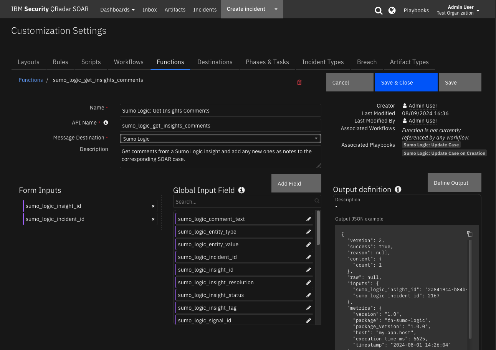

<details><summary>Inputs:</summary>
<p>

| Name | Type | Required | Example | Tooltip |
| ---- | :--: | :------: | ------- | ------- |
| `sumo_logic_incident_id` | `number` | Yes | `-` | - |
| `sumo_logic_insight_id` | `text` | Yes | `-` | - |

</p>
</details>

<details><summary>Outputs:</summary>
<p>

> **NOTE:** This example might be in JSON format, but `results` is a Python Dictionary on the SOAR platform.

```python
results = {
  "content": {
    "count": 1
  },
  "inputs": {
    "sumo_logic_incident_id": 2167,
    "sumo_logic_insight_id": "2a8419c4-b84b-3b6c-8447-af4ccbfba9c6"
  },
  "metrics": {
    "execution_time_ms": 6625,
    "host": "my.app.host",
    "package": "fn-sumo-logic",
    "package_version": "1.0.0",
    "timestamp": "2024-08-01 14:26:04",
    "version": "1.0"
  },
  "raw": null,
  "reason": null,
  "success": true,
  "version": 2.0
}
```

</p>
</details>

<details><summary>Example Function Input Script:</summary>
<p>

```python
inputs.sumo_logic_incident_id = incident.id
inputs.sumo_logic_insight_id = incident.properties.sumo_logic_insight_id
```

</p>
</details>

<details><summary>Example Function Post Process Script:</summary>
<p>

```python
results = playbook.functions.results.get_insights_comments_results

if results.get("success"):
  content = results.get("content")
  if content:
    note_text = "<b>Sumo Logic: Update Case on Creation - Get Insight Comments</b> function added {0} note(s) in SOAR.".format(content.get("count"))
  else:
    note_text = "<b>Sumo Logic: Update Case on Creation - Get Insight Comments</b> function failed to get notes from Sumo Logic."
else:
  note_text = "<b>Sumo Logic: Update Case on Creation - Get Insight Comments</b> function failed to get notes from Sumo Logic."
  
incident.addNote(note_text)
```

</p>
</details>

---
## Function - Sumo Logic: Get Signal by ID
Get the details of a Sumo Logic signal given the signal ID.

 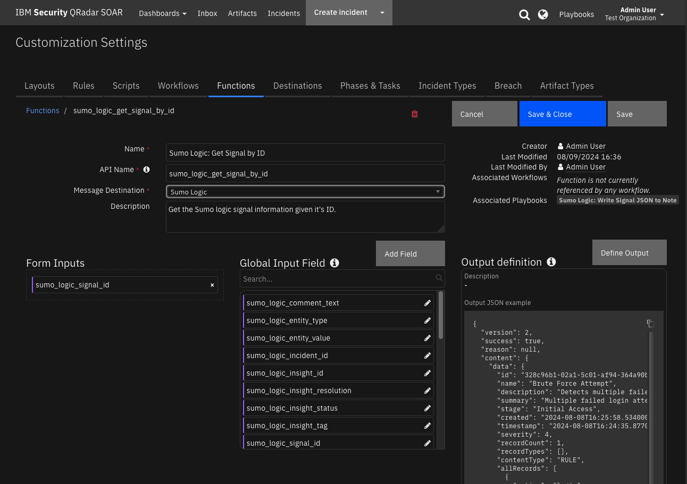

<details><summary>Inputs:</summary>
<p>

| Name | Type | Required | Example | Tooltip |
| ---- | :--: | :------: | ------- | ------- |
| `sumo_logic_signal_id` | `text` | Yes | `-` | - |

</p>
</details>

<details><summary>Outputs:</summary>
<p>

> **NOTE:** This example might be in JSON format, but `results` is a Python Dictionary on the SOAR platform.

```python
results = {
  "content": {
    "data": {
      "allRecords": [
        {
          "action": "login",
          "baseImage": "/usr/sbin/sshd",
          "bro_dns_answers": [],
          "bro_file_bytes": {},
          "bro_file_connUids": [],
          "bro_flow_service": [],
          "bro_ftp_pendingCommands": [],
          "bro_http_cookieVars": [],
          "bro_http_origFuids": [],
          "bro_http_origMimeTypes": [],
          "bro_http_request_headers": {},
          "bro_http_request_proxied": [],
          "bro_http_response_headers": {},
          "bro_http_response_respFuids": [],
          "bro_http_response_respMimeTypes": [],
          "bro_http_tags": [],
          "bro_http_uriVars": [],
          "bro_kerberos_clientCert": {},
          "bro_kerberos_serverCert": {},
          "bro_sip_headers": {},
          "bro_sip_requestPath": [],
          "bro_sip_responsePath": [],
          "bro_ssl_certChainFuids": [],
          "bro_ssl_clientCertChainFuids": [],
          "cseSignal": {},
          "day": 8,
          "fieldTags": {},
          "fields": {
            "AUID": "unset",
            "UID": "root",
            "acct": "(unknown)",
            "addr": "9.30.223.75",
            "auid": "4294967295",
            "event_id": "USER_LOGIN",
            "exe": "/usr/sbin/sshd",
            "msg": "audit(1723134275.877:33373):",
            "op": "login",
            "pid": "61267",
            "res": "failed",
            "ses": "4294967295",
            "subj": "kernel",
            "syslog_message": "type=USER_LOGIN msg=audit(1723134275.877:33373): pid=61267 uid=0 auid=4294967295 ses=4294967295 subj=kernel msg=\u0027op=login acct=\"(unknown)\" exe=\"/usr/sbin/sshd\" hostname=? addr=9.30.223.75 terminal=ssh res=failed\u0027\u001dUID=\"root\" AUID=\"unset\"",
            "syslog_process": "systemdjournal",
            "syslog_timestamp": "1723134275.877",
            "terminal": "ssh",
            "type": "USER_LOGIN",
            "uid": "0"
          },
          "friendlyName": "record",
          "hour": 16,
          "http_requestHeaders": {},
          "listMatches": [],
          "matchedItems": [],
          "metadata_deviceEventId": "USER_LOGIN",
          "metadata_mapperName": "Linux OS Systemd Journal - Login Events",
          "metadata_mapperUid": "0e5cbfbb-91ac-4658-918c-709c76d53f1e",
          "metadata_orgId": "0000000000BD6D7C",
          "metadata_parseTime": 1723134354974,
          "metadata_parser": "/Parsers/System/Linux/Linux OS Syslog",
          "metadata_product": "Systemd Journal",
          "metadata_productGuid": "5be5af82-c248-4c4c-a485-0571025f242c",
          "metadata_receiptTime": 1723134278,
          "metadata_schemaVersion": 3,
          "metadata_sensorId": "0000000000BD6D7C",
          "metadata_sensorInformation": {},
          "metadata_sensorZone": "default",
          "metadata_sourceBlockId": "1864672286443784304",
          "metadata_sourceCategory": "linux/system",
          "metadata_sourceMessageId": "-6870926605261705032",
          "metadata_vendor": "Linux",
          "month": 8,
          "normalizedAction": "logon",
          "objectClassification": "Authentication",
          "objectType": "Authentication",
          "pid": 61267,
          "srcDevice_ip": "9.30.223.75",
          "srcDevice_ip_ipv4IntValue": 153018187,
          "srcDevice_ip_isInternal": false,
          "srcDevice_ip_version": 4,
          "success": false,
          "targetUser_username": "0",
          "targetUser_username_raw": "0",
          "timestamp": 1723134275877,
          "uid": "6c825674-ab7b-5cf1-9250-ba35c9746835",
          "user_username": "(unknown)",
          "user_username_raw": "(unknown)",
          "year": 2024
        }
      ],
      "artifacts": [],
      "contentType": "RULE",
      "created": "2024-08-08T16:25:58.534000",
      "description": "Detects multiple failed login attempts for the same username over a 24 hour timeframe. This is designed to catch both slow and quick brute force type attacks. The threshold and time frame can be adjusted based on the customer\u0027s environment.",
      "entity": {
        "entityType": "_username",
        "hostname": null,
        "id": "_username-(unknown)",
        "macAddress": null,
        "name": "(unknown)",
        "sensorZone": "",
        "value": "(unknown)"
      },
      "id": "328c96b1-02a1-5c01-af94-364a90b9c0d6",
      "involvedEntities": [
        {
          "entityType": "_ip",
          "hostname": null,
          "id": "_ip-9.30.223.75",
          "macAddress": null,
          "name": "9.30.223.75",
          "sensorZone": "",
          "value": "9.30.223.75"
        },
        {
          "entityType": "_ip",
          "hostname": null,
          "id": "_ip-9.30.48.247",
          "macAddress": null,
          "name": "9.30.48.247",
          "sensorZone": "",
          "value": "9.30.48.247"
        },
        {
          "entityType": "_process",
          "hostname": null,
          "id": "_process-/usr/sbin/sshd",
          "macAddress": null,
          "name": "/usr/sbin/sshd",
          "sensorZone": "",
          "value": "/usr/sbin/sshd"
        },
        {
          "entityType": "_username",
          "hostname": null,
          "id": "_username-0",
          "macAddress": null,
          "name": "0",
          "sensorZone": "",
          "value": "0"
        },
        {
          "entityType": "_username",
          "hostname": null,
          "id": "_username-(unknown)",
          "macAddress": null,
          "name": "(unknown)",
          "sensorZone": "",
          "value": "(unknown)"
        }
      ],
      "name": "Brute Force Attempt",
      "recordCount": 1,
      "recordSearchDetails": {
        "query": "_index=sec_record_* | json field=_raw \"resultType\" as _unpacked__raw_resultType nodrop\n| where (if (isNull(objectType), false, objectType == \"Authentication\") and if (isNull(normalizedAction), false, normalizedAction == \"logon\") and if (isNull(success), false, !(success)) and !(if (isNull(metadata_deviceEventId), false, metadata_deviceEventId == \"Security-4776\") and !isBlank(listMatches) AND jsonArrayContains(listMatches, \"domain_controllers\")) and !(if (isNull(metadata_vendor), false, metadata_vendor == \"Microsoft\") and if (isNull(metadata_product), false, metadata_product == \"Azure\") and if (isNull(_unpacked__raw_resultType), false, _unpacked__raw_resultType == \"700082\")) and !(metadata_vendor in (\"Microsoft\", \"Intersect Alliance\") and metadata_product in (\"Windows\", \"Snare Enterprise Agent for Windows\") and user_username matches /^[\\s\\S]*\\$[\\s\\S]*$/) and !(!isBlank(listMatches) AND jsonArrayContains(listMatches, \"vuln_scanners\")) and if (isNull(metadata_deviceEventId), false, metadata_deviceEventId == \"USER_LOGIN\") and if (isNull(metadata_product), false, metadata_product == \"Systemd Journal\") and if (isNull(metadata_vendor), false, metadata_vendor == \"Linux\") and if (isNull(user_username), false, user_username == \"(unknown)\"))",
        "queryEndTime": "2024-08-08T19:12:00",
        "queryStartTime": "2024-08-07T19:12:00"
      },
      "recordTypes": [],
      "ruleId": "THRESHOLD-S00096",
      "severity": 4,
      "stage": "Initial Access",
      "summary": "Multiple failed login attempts for user: (unknown)",
      "suppressed": false,
      "tags": [
        "_mitreAttackTactic:TA0006",
        "_mitreAttackTechnique:T1078",
        "_mitreAttackTactic:TA0001",
        "_mitreAttackTechnique:T1110.001",
        "_mitreAttackTechnique:T1110.002",
        "_mitreAttackTactic:TA0008",
        "_mitreAttackTechnique:T1110",
        "_mitreAttackTechnique:T1586"
      ],
      "threatIntelIndicatorIds": [],
      "timestamp": "2024-08-08T16:24:35.877000"
    },
    "errors": []
  },
  "inputs": {
    "sumo_logic_signal_id": "328c96b1-02a1-5c01-af94-364a90b9c0d6"
  },
  "metrics": {
    "execution_time_ms": 19139,
    "host": "my.app.host",
    "package": "fn-sumo-logic",
    "package_version": "1.0.0",
    "timestamp": "2024-08-09 14:56:09",
    "version": "1.0"
  },
  "raw": null,
  "reason": null,
  "success": true,
  "version": 2.0
}
```

</p>
</details>

<details><summary>Example Function Input Script:</summary>
<p>

```python
inputs.sumo_logic_signal_id = row.sumo_logic_signal_id
```

</p>
</details>

<details><summary>Example Function Post Process Script:</summary>
<p>

```python
results = playbook.functions.results.get_signal_by_id_results
inputs = results.get("inputs", None)
signal_id = inputs.get("sumo_logic_signal_id", None)
  
header = u"<b>Sumo Logic: Get Signal by ID:</b> {0}".format(signal_id)

json_note = {
              "version": "1.3",
              "header": header, 
              "json": results.content,
              "sort": False
            }
playbook.addProperty('convert_json_to_rich_text', json_note)
```

</p>
</details>

---
## Function - Sumo Logic: Update Insight Status
Update the status of an insight in Sumo Logic.  If the status is set to closed, set the resolution reason.

 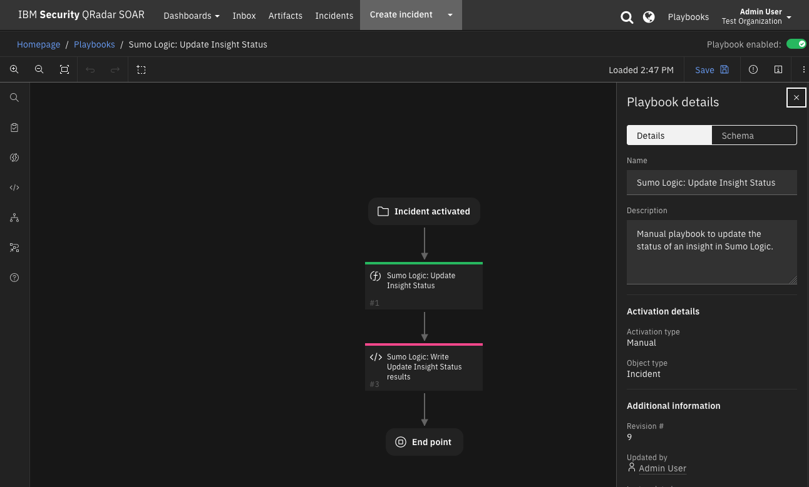

Dialog box to set an Insight's status through a manual playbook:

 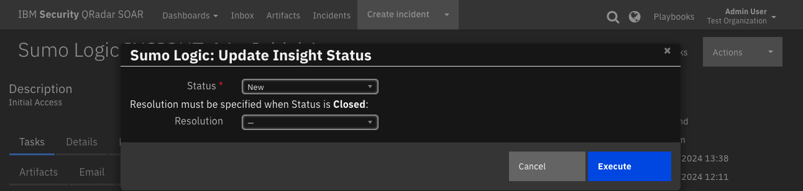
<details><summary>Inputs:</summary>
<p>

| Name | Type | Required | Example | Tooltip |
| ---- | :--: | :------: | ------- | ------- |
| `sumo_logic_insight_id` | `text` | Yes | `-` | - |
| `sumo_logic_insight_resolution` | `text` | No | `-` | - |
| `sumo_logic_insight_status` | `select` | Yes | `-` | - |

</p>
</details>

<details><summary>Outputs:</summary>
<p>

> **NOTE:** This example might be in JSON format, but `results` is a Python Dictionary on the SOAR platform.

```python
results = {
  "content": {
    "data": {
      "artifacts": [],
      "assignedTo": null,
      "assignee": null,
      "closed": null,
      "closedBy": null,
      "confidence": 0.85,
      "created": "2024-07-30T20:17:57.153553",
      "description": "Initial Access",
      "entity": {
        "entityType": "_username",
        "hostname": null,
        "id": "_username-root",
        "macAddress": null,
        "name": "root",
        "sensorZone": "",
        "value": "root"
      },
      "id": "f741314d-34b6-3417-9c0a-426d547e345a",
      "involvedEntities": [
        {
          "entityType": "_process",
          "hostname": null,
          "id": "_process-sshd",
          "macAddress": null,
          "name": "sshd",
          "sensorZone": null,
          "value": "sshd"
        },
        {
          "entityType": "_username",
          "hostname": null,
          "id": "_username-root",
          "macAddress": null,
          "name": "root",
          "sensorZone": null,
          "value": "root"
        },
        {
          "entityType": "_ip",
          "hostname": null,
          "id": "_ip-9.108.160.132",
          "macAddress": null,
          "name": "9.108.160.132",
          "sensorZone": null,
          "value": "9.108.160.132"
        },
        {
          "entityType": "_hostname",
          "hostname": "sumologic1",
          "id": "_hostname-sumologic1",
          "macAddress": null,
          "name": "sumologic1",
          "sensorZone": null,
          "value": "sumologic1"
        }
      ],
      "lastUpdated": "2024-08-02T20:50:41.638872",
      "lastUpdatedBy": null,
      "name": "Initial Access",
      "orgId": "0000000000BD6D7C",
      "readableId": "INSIGHT-2",
      "resolution": null,
      "severity": "MEDIUM",
      "signals": [
        {
          "allRecords": [
            {
              "baseImage": "sshd",
              "bro_dns_answers": [],
              "bro_file_bytes": {},
              "bro_file_connUids": [],
              "bro_flow_service": [],
              "bro_ftp_pendingCommands": [],
              "bro_http_cookieVars": [],
              "bro_http_origFuids": [],
              "bro_http_origMimeTypes": [],
              "bro_http_request_headers": {},
              "bro_http_request_proxied": [],
              "bro_http_response_headers": {},
              "bro_http_response_respFuids": [],
              "bro_http_response_respMimeTypes": [],
              "bro_http_tags": [],
              "bro_http_uriVars": [],
              "bro_kerberos_clientCert": {},
              "bro_kerberos_serverCert": {},
              "bro_sip_headers": {},
              "bro_sip_requestPath": [],
              "bro_sip_responsePath": [],
              "bro_ssl_certChainFuids": [],
              "bro_ssl_clientCertChainFuids": [],
              "cseSignal": {},
              "day": 30,
              "device_hostname": "sumologic1",
              "device_hostname_raw": "sumologic1",
              "dstDevice_hostname": "sumologic1",
              "dstDevice_hostname_raw": "sumologic1",
              "fieldTags": {},
              "fields": {
                "event_id": "sshd-failed-invalid-password",
                "source_ip": "9.108.160.132",
                "source_port": "53371",
                "ssh_version": "ssh2",
                "syslog_hostname": "sumologic1",
                "syslog_message": "Failed password for root from 9.108.160.132 port 53371 ssh2",
                "syslog_process": "sshd",
                "syslog_process_id": "35224",
                "syslog_timestamp": "Jul 30 13:17:19",
                "user": "root"
              },
              "friendlyName": "record",
              "hour": 13,
              "http_requestHeaders": {},
              "listMatches": [],
              "matchedItems": [],
              "metadata_deviceEventId": "sshd-failed-invalid-password",
              "metadata_mapperName": "Linux OS Syslog - Process sshd - SSH Auth Failure Invalid Password",
              "metadata_mapperUid": "05445189-0e1e-425a-8f2b-5d1f41e9546e",
              "metadata_orgId": "0000000000BD6D7C",
              "metadata_parseTime": 1722370665323,
              "metadata_parser": "/Parsers/System/Linux/Linux OS Syslog",
              "metadata_product": "Linux OS Syslog",
              "metadata_productGuid": "0e20c932-d992-4bd4-b276-c15119ca5c0b",
              "metadata_receiptTime": 1722370640,
              "metadata_schemaVersion": 3,
              "metadata_sensorId": "0000000000BD6D7C",
              "metadata_sensorInformation": {},
              "metadata_sensorZone": "default",
              "metadata_sourceBlockId": "2295449033841068855",
              "metadata_sourceCategory": "linux/system",
              "metadata_sourceMessageId": "-7272543713819412727",
              "metadata_vendor": "Linux",
              "month": 7,
              "normalizedAction": "logon",
              "objectClassification": "Authentication",
              "objectType": "Authentication",
              "pid": 35224,
              "srcDevice_ip": "9.108.160.132",
              "srcDevice_ip_ipv4IntValue": 158113924,
              "srcDevice_ip_isInternal": false,
              "srcDevice_ip_version": 4,
              "srcPort": 53371,
              "success": false,
              "timestamp": 1722345439000,
              "uid": "aac19471-8442-5536-9742-bcc5aacc1e80",
              "user_username": "root",
              "user_username_raw": "root",
              "year": 2024
            }
          ],
          "artifacts": [],
          "contentType": "RULE",
          "created": "2024-07-30T13:17:19",
          "description": "Detects multiple failed login attempts for the same username over a 24 hour timeframe. This is designed to catch both slow and quick brute force type attacks. The threshold and time frame can be adjusted based on the customer\u0027s environment.",
          "entity": {
            "entityType": "_username",
            "hostname": null,
            "id": "_username-root",
            "macAddress": null,
            "name": "root",
            "sensorZone": "",
            "value": "root"
          },
          "id": "f16f0e84-66c4-50c7-a0b2-b02b5cbdd543",
          "name": "Brute Force Attempt",
          "recordCount": 1,
          "recordSearchDetails": {
            "query": "_index=sec_record_* | json field=_raw \"resultType\" as _unpacked__raw_resultType nodrop\n| where (if (isNull(objectType), false, objectType == \"Authentication\") and if (isNull(normalizedAction), false, normalizedAction == \"logon\") and if (isNull(success), false, !(success)) and !(if (isNull(metadata_deviceEventId), false, metadata_deviceEventId == \"Security-4776\") and !isBlank(listMatches) AND jsonArrayContains(listMatches, \"domain_controllers\")) and !(if (isNull(metadata_vendor), false, metadata_vendor == \"Microsoft\") and if (isNull(metadata_product), false, metadata_product == \"Azure\") and if (isNull(_unpacked__raw_resultType), false, _unpacked__raw_resultType == \"700082\")) and !(metadata_vendor in (\"Microsoft\", \"Intersect Alliance\") and metadata_product in (\"Windows\", \"Snare Enterprise Agent for Windows\") and user_username matches /^[\\s\\S]*\\$[\\s\\S]*$/) and !(!isBlank(listMatches) AND jsonArrayContains(listMatches, \"vuln_scanners\")) and if (isNull(metadata_deviceEventId), false, metadata_deviceEventId == \"sshd-failed-invalid-password\") and if (isNull(metadata_product), false, metadata_product == \"Linux OS Syslog\") and if (isNull(metadata_vendor), false, metadata_vendor == \"Linux\") and if (isNull(user_username), false, user_username == \"root\"))",
            "queryEndTime": "2024-07-30T14:24:00",
            "queryStartTime": "2024-07-29T14:24:00"
          },
          "recordTypes": [],
          "ruleId": "THRESHOLD-S00096",
          "severity": 4,
          "stage": "Initial Access",
          "tags": [
            "_mitreAttackTactic:TA0006",
            "_mitreAttackTechnique:T1078",
            "_mitreAttackTactic:TA0001",
            "_mitreAttackTechnique:T1110.001",
            "_mitreAttackTechnique:T1110.002",
            "_mitreAttackTactic:TA0008",
            "_mitreAttackTechnique:T1110",
            "_mitreAttackTechnique:T1586"
          ],
          "timestamp": "2024-07-30T13:17:19"
        }
      ],
      "source": "ALGORITHM",
      "status": {
        "displayName": "New",
        "name": "new"
      },
      "subResolution": null,
      "tags": [
        "AnnMarie-2",
        "AnnMarie tag",
        "_mitreAttackTactic:TA0001",
        "_mitreAttackTactic:TA0006",
        "_mitreAttackTactic:TA0008",
        "_mitreAttackTechnique:T1078",
        "_mitreAttackTechnique:T1110",
        "_mitreAttackTechnique:T1110.001",
        "_mitreAttackTechnique:T1110.002",
        "_mitreAttackTechnique:T1586"
      ],
      "teamAssignedTo": null,
      "timeToDetection": 25238.153553,
      "timeToRemediation": null,
      "timeToResponse": 147653.411281,
      "timestamp": "2024-07-30T13:17:19"
    },
    "errors": []
  },
  "inputs": {
    "sumo_logic_insight_id": "f741314d-34b6-3417-9c0a-426d547e345a",
    "sumo_logic_insight_resolution": null,
    "sumo_logic_insight_status": "New"
  },
  "metrics": {
    "execution_time_ms": 64088,
    "host": "my.app.host",
    "package": "fn-sumo-logic",
    "package_version": "1.0.0",
    "timestamp": "2024-08-02 16:51:21",
    "version": "1.0"
  },
  "raw": null,
  "reason": null,
  "success": true,
  "version": 2.0
}
```

</p>
</details>

<details><summary>Example Function Input Script:</summary>
<p>

```python
inputs.sumo_logic_insight_id = incident.properties.sumo_logic_insight_id
inputs.sumo_logic_insight_status = playbook.inputs.sumo_logic_insight_status
inputs.sumo_logic_insight_resolution = playbook.inputs.sumo_logic_insight_resolution

if inputs.sumo_logic_insight_status == "Closed" and not playbook.inputs.sumo_logic_insight_resolution:
  helper.fail("Resolution musted be specified if status is Closed.")
```

</p>
</details>

<details><summary>Example Function Post Process Script:</summary>
<p>

```python
results = playbook.functions.results.update_insight_status_results

if results.get("success"):
    note_text = f"<b>Sumo Logic: Update Insight Status: </b> set:<br>"
    if playbook.inputs.sumo_logic_insight_status:
        incident.properties.sumo_logic_insight_status = playbook.inputs.sumo_logic_insight_status
        note_text = f"{note_text}<br>   Status:  {playbook.inputs.sumo_logic_insight_status}"
    if playbook.inputs.sumo_logic_insight_resolution and playbook.inputs.sumo_logic_insight_status == 'Closed':
        incident.properties.sumo_logic_insight_resolution = playbook.inputs.sumo_logic_insight_resolution
        note_text = f"{note_text}<br>   Resolution: {playbook.inputs.sumo_logic_insight_resolution}"
    # Uncomment if sub_resolution is implemented.
    #if playbook.inputs.sumo_logic_insight_sub_resolution and playbook.inputs.sumo_logic_insight_status == 'Closed':
    #    incident.properties.sumo_logic_insight_sub_resolution = playbook.inputs.sumo_logic_insight_sub_resolution
    #    note_text = f"{note_text}<br>   Sub Resolution: {playbook.inputs.sumo_logic_insight_sub_resolution"
else:
    reason = results.get("reason")
    note_text = f"<b>Sumo Logic: Update Insight Status: </b> failed to update status to <b>{playbook.inputs.sumo_logic_insight_status}</b>:<br>  {reason}"
  
incident.addNote(note_text)
```

</p>
</details>

---

## Script - Convert JSON to rich text v1.3
This script converts a json object into a hierarchical display of rich text and adds the rich text to an incident's rich text (custom) field or an incident note. A workflow property is used to share the json to convert and identify parameters used on how to perform the conversion.
Typically, a function will create workflow property and this script will run after that function to perform the conversion.

Features:

* Display the hierarchical nature of json, presenting the json keys (sorted if specified) as bold labels
* Provide links to found URLs
* Create either an incident note or add results to an incident (custom) rich text field.

**Object:** incident

<details><summary>Script Text:</summary>
<p>

```python
# (c) Copyright IBM Corp. 2010, 2023. All Rights Reserved.
VERSION = 1.3
"""
  This script converts a json object into a hierarchical display of rich text and adds the rich text to an incident's rich text (custom) field or an incident note.
  A workflow property is used to define the json to convert and identify parameters used on how to perform the conversion.
  Typically, a function will create workflow property and this script will run after that function to perform the conversion.
  Features:
    * Display the hierarchical nature of json, presenting the json keys as bold labels
    * Provide links to found URLs
    * Create either an incident note or add results to an incident (custom) rich text field.
  
  In order to use this script, define a workflow property called: convert_json_to_rich_text, to define the json and parameters to use for the conversion.
  Workflow properties can be added using a command similar to this:
  workflow.addProperty('convert_json_to_rich_text', {
    "version": 1.3,
    "header": "Artifact scan results for: {}".format(artifact.value),
    "padding": 10,
    "separator": u"<br />",
    "sort": True,
    "json": results.content,
    "json_omit_list": ["omit"],
    "incident_field": None
  })
  
  Format of workflow.property.convert_json_to_rich_text:
  { 
    "version": 1.3, [this is for future compatibility]
    "header": str, [header line to add to converted json produced or None. Ex: Results from scanning artifact: xxx. The header may contain rich text tags]
    "padding": 10, [padding for nested json elements, or defaults to 10]
    "separator": u"<br />"|list such as ['<span>','</span>'], [html separator between json keys and lists or defaults to html break: '<br />'. 
                                                If a list, then the data is brackets by the pair specified]
    "sort": True|False, [sort the json keys at each level when displayed]
    "json": json, [required json to convert]
    "json_omit_list": [list of json keys to exclude or None]
    "incident_field": "<incident_field>" [indicates a builtin rich text incident field, such as 'description' 
                                          or a custom rich text field in the format: 'properties.<field>'. default: create an incident note]
  }

  For playbooks, use playbook.addProperty() with the same format as workflow.addProperty()

  Playbooks can also use playbook.functions.results.convert_json_to_rich_text using the standard function output which contains the 'content' json element.
  When using playbook.functions.results.convert_json_to_rich_text with standard function results, all the defaults for padding, separator, etc. are used.
"""

import re

# needed for python 3
try:
    unicode("abc") # fails in py3
    py2 = True
except:
    unicode = str
    py2 = False


rc = re.compile(r'http[s]?://(?:[a-zA-Z]|[0-9]|[$-_@.&+#\?]|[!*\(\),]|(?:%[0-9a-fA-F][0-9a-fA-F]))+')

class ConvertJson:
    """Class to hold the conversion parameters and perform the conversion"""

    def __init__(self, omit_keys=[], padding=10, separator=u"<br />", sort_keys=False):
        self.omit_keys = omit_keys
        self.padding = padding
        self.separator = separator
        self.sort_keys = sort_keys


    def format_link(self, item):
        """[summary]
          Find embedded urls (http(s)) and add html anchor tags to display as links
          Args:
              item ([string])

          Returns:
              [str]: None|original text if no links|text with html links
        """
        formatted_item = item
        if py2:
            num_type = bool(item and isinstance(item, (int, long, bool, float)))
        else:
            num_type = bool(item and isinstance(item, (int, bool, float)))

        if item and not num_type:
            list = rc.findall(item)
            if list:
                for link in list:
                    formatted_item = formatted_item.replace(link, u"<a target='blank' href='{0}'>{0}</a>".format(link))

        return formatted_item

    def expand_list(self, list_value, is_list=False):
        """[summary]
          convert items to html, adding indents to nested dictionaries.
          Args:
              list_value ([dict|list]): json element

          Returns:
              [str]: html converted code
        """
        if not isinstance(list_value, list):
            return self.format_link(list_value)
        elif not list_value:
            return u"None<br>"

        try:
            items_list = []  # this will ensure list starts on second line of key label
            for item in list_value:
                if isinstance(item, dict):
                    result = self.convert_json_to_rich_text(item)
                    if is_list:
                        items_list.append(u"<li>{}</li>".format(result))
                    else:
                        items_list.append(result)
                elif isinstance(item, list):
                    items_list.append(self.expand_list(item, is_list=True))
                elif is_list:
                    items_list.append(u"<li>{}</li>".format(self.format_link(unicode(item))))
                else:
                    items_list.append(self.format_link(unicode(item)))

            expand_list_result = self.add_separator(self.separator if not is_list else u"",
                                                    items_list,
                                                    is_list=is_list)

            if is_list:
                return u"<ul>{}</ul>".format(expand_list_result)
            else:
                return u"<div style='padding:5px'>{}</div>".format(expand_list_result)
        except Exception as err:
            return str(err)

    def convert_json_to_rich_text(self, sub_dict):
        """[summary]
          Walk dictionary tree and convert to html for better display
          Args:
              sub_dict ([type]): [description]

          Returns:
              [type]: [description]
        """
        notes = []
        if sub_dict and isinstance(sub_dict, (list, dict)):
            if isinstance(sub_dict, list):
                expanded_list = self.expand_list(sub_dict, is_list=True)
                notes.append(self.add_separator(self.separator, expanded_list))
            else:
                keys = sorted (sub_dict.keys()) if self.sort_keys else sub_dict.keys()

                for key in keys:
                    if key not in self.omit_keys:
                        value = sub_dict[key]
                        is_list = isinstance(value, list)
                        item_list = [u"<strong>{0}</strong>: ".format(key)]
                        if isinstance(value, dict):
                            convert_result = self.convert_json_to_rich_text(value)
                            if convert_result:
                                item_list.append(u"<div style='padding:{}px'>{}</div>".format(self.padding, convert_result))
                            else:
                                item_list.append(u"None<br>")
                        else:
                            item_list.append(self.expand_list(value, is_list=is_list))

                        notes.append(self.add_separator(self.separator, u"".join(make_unicode(v) for v in item_list), is_list=is_list))

        result_notes = u"".join(notes)
        if isinstance(self.separator, list):
            return result_notes
        else:
            return result_notes.replace(
                u"</div>{0}".format(self.separator), u"</div>").replace(
                u"{0}</div>".format(self.separator), u"</div>"
            )  # tighten up result

    def add_separator(self, separator, items, is_list=False):
        """
        apply the separator to the data
        :param separator: None, str or list such as ['<span>', '</span>']
        :param items: str or list to add separator
        :return: text with separator applied
        """
        _items = items

        if not _items:
            return "<br>"

        if not isinstance(_items, list):
            _items = [_items]

        if isinstance(separator, list):
            return u"".join([u"{}{}{}".format(separator[0], item, separator[1]) for item in _items])

        return u"{}{}".format(separator.join(_items), separator if not is_list else u"")

def make_unicode(value):
    if value is None:
        return 'None'

    return unicode(value)

def get_results(property_name):
    if playbook and playbook.functions.results[property_name] is not None:
        return playbook.functions.results[property_name]
    elif playbook and playbook.properties[property_name] is not None:
        return playbook.properties[property_name]
    elif workflow and workflow.properties[property_name] is not None:
        return workflow.properties[property_name]

    return None

def get_properties(property_name):
    """
    Logic to collect the json and parameters from a workflow property.
    Args:
      property_name: workflow property to reference
    Returns:
      padding, separator, header, json_omit_list, incident_field, json, sort_keys
    """
    result_properties = get_results(property_name)
    if not result_properties:
        helper.fail("Playbook/workflow property not found: {}".format(property_name))

    padding = int(result_properties.get("padding", 10))
    separator = result_properties.get("separator", u"<br />")
    if isinstance(separator, list) and len(separator) != 2:
        helper.fail("list of separators should be specified as a pair such as ['<div>', '</div>']: {}".format(separator))

    header = result_properties.get("header")
    sort_keys = bool(result_properties.get("sort", False))
    json_omit_list = result_properties.get("json_omit_list")
    if not json_omit_list:
        json_omit_list = []
    incident_field = result_properties.get("incident_field")
    
    # workflow formatted content is 'json'. Standard functions is 'content'
    json = result_properties.get("json") if result_properties.get("json") else result_properties.get("content")
    json_err = None
    # is there an issue we need handle now?
    if not json and \
        result_properties.get("success") == False and result_properties.get("reason"):
        json_err = result_properties.get("reason")
    
    return padding, separator, header, json_omit_list, incident_field, json, json_err, sort_keys


## S T A R T
padding, separator, header, json_omit_list, incident_field, json, json_err, sort_keys = get_properties('convert_json_to_rich_text')
if json_err:
    result = "Result error: {}".format(json_err)
else:
    if header:
        if isinstance(separator, list):
            hdr = u"{0}{1}{2}".format(separator[0], header, separator[1])
        else:
            hdr = u"{0}{1}".format(header, separator)
    else:
        hdr = u""

    convert = ConvertJson(omit_keys=json_omit_list, padding=padding, separator=separator, sort_keys=sort_keys)
    converted_json = convert.convert_json_to_rich_text(json)
    result = u"{}{}".format(hdr, converted_json if converted_json else "\nNone")

rich_text_note = helper.createRichText(result)
if incident_field:
    incident[incident_field] = rich_text_note
else:
    incident.addNote(rich_text_note)

```

</p>
</details>

---
## Script - Sumo Logic: Add Artifacts from Insight
Create artifacts in SOAR from the Sumo Logic Get Insight by ID function and write the results to a note.

**Object:** incident

<details><summary>Script Text:</summary>
<p>

```python
ARTIFACT_TYPE_MAPPING = {
  "_ip": "IP Address",
  "_hostname": "DNS Name",
  "_file": "File Path",
  "_mac": "MAC Address",
  "_process": "Process Name",
  "_username": "User Account",
  "_useragent": "User Agent",
  "_url": "URL"
}

results = playbook.functions.results.get_insight_by_id_results

note_text = "<b>Sumo Logic: Add Artifacts from Insight:</b>"
if results.get("success", False):
  content = results.get("content", {})
  if content:
      data = content.get("data", None)
      if data:
          involved_entities = data.get("involvedEntities", [])
          artifact_count = 0
          for entity in involved_entities:
              entity_type = ARTIFACT_TYPE_MAPPING.get(entity.get("entityType"), None)
              entity_value = entity.get("value", None)
              if entity_type and entity_value:
                  incident.addArtifact(entity_type, entity_value, f"Artifact created from Sumo Logic insight {incident.properties.sumo_logic_insight_readable_id}")
                  artifact_count += 1
              else:
                  note_text = f"{note_text}<br>Unable to create artifact from entity: {entity}"
          note_text = f"{note_text}<br>{artifact_count} artifact(s) created."
      else:
          note_text = f"{note_text}<br>no data found in insight results."
  else:
      note_text = f"{note_text}<br>no content found in insight results."
else:
    note_text = f"{note_text}<br>results found in insight results."

incident.addNote(note_text)
```

</p>
</details>

---
## Script - Sumo Logic: Populate Signals Data Table
Populate the Signals data table with results from get insight function.

**Object:** incident

<details><summary>Script Text:</summary>
<p>

```python
results = playbook.functions.results.get_insight_by_id_results
note_text = f"<b>Sumo Logic: Populate Signals Data Table:</b>"
if results.get("success", False):
  content = results.get("content", {})
  if content:
      data = content.get("data", None)
      if data:
          signals = data.get("signals", [])
          for signal in signals:
              signal_row = incident.addRow("sumo_logic_insight_signals_dt")
              signal_row.sumo_logic_signal_timestamp   = signal.get("timestamp", None)
              signal_row.sumo_logic_signal_id          = signal.get("id", None)
              signal_row.sumo_logic_signal_name        = signal.get("name", None)
              signal_row.sumo_logic_signal_stage       = signal.get("stage", None)
              signal_row.sumo_logic_signal_description = signal.get("description", None)
              signal_row.sumo_logic_signal_rule_id     = signal.get("ruleId", None)
              signal_row.sumo_logic_signal_severity = str(signal.get("severity")) if signal.get("severity", None) else None
          num_signals = len(signals)
          note_text = f"{note_text} {num_signals} signal(s) written to Signals data table."
      else:
          note_text = f"{note_text} Failed - no data found."
  else:
      note_text = f"{note_text} Failed - no data content found."
else:
    reason = results.get("reason", "No reason")
    note_text = f"{note_text} Failed - {reason}"
incident.addNote(note_text)
```

</p>
</details>

---

## Playbooks
| Playbook Name | Description | Activation Type | Object | Status | Condition | 
| ------------- | ----------- | --------------- | ------ | ------ | --------- | 
| Sumo Logic: Add Comment to Insight | Manual playbook to add a comment to a Sumo Logic insight in Sumo Logic. | Manual | note | `enabled` | `incident.properties.sumo_logic_insight_id has_a_value` | 
| Sumo Logic: Add Tag to Insight | Manual playbook to add a tag to a Sumo Logic insight. | Manual | incident | `enabled` | `incident.properties.sumo_logic_insight_id has_a_value` | 
| Sumo Logic: Close Insight on Case Close | Automatic playbook that updates the Status and Resolution of the associated insight in Sumo Logic  when the cases is closed in SOAR.  The SOAR case resolution summary is written as a comment to the Sumo Logic insight. | Automatic | incident | `enabled` | `incident.plan_status changed_to Closed AND incident.properties.sumo_logic_insight_id has_a_value` | 
| Sumo Logic: Scan Artifact for Hits | Scan artifacts added to Sumo Logic case and add hit if | Manual | artifact | `enabled` | `artifact.type in ['IP Address', 'DNS Name', 'URL', 'User Account', 'Process Name', 'File Name', 'File Path', 'MAC Address', 'User Agent'] AND incident.properties.sumo_logic_insight_id has_a_value` | 
| Sumo Logic: Scan Artifact for Hits Automatic | Automatic playbook to scan artifacts added to Sumo Logic case and add hit on artifact if recent Signal Severity Total is greater than specified threshold value. | Automatic | artifact | `enabled` | `artifact.type in ['IP Address', 'DNS Name', 'URL', 'User Account', 'Process Name', 'File Name', 'File Path', 'MAC Address', 'User Agent'] AND incident.properties.sumo_logic_insight_id has_a_value AND object_added` | 
| Sumo Logic: Update Case | Manual playbook to update Sumo Logic case. Custom fields, data tables and comments are updated in the SOAR case. | Manual | incident | `enabled` | `incident.properties.sumo_logic_insight_id has_a_value` | 
| Sumo Logic: Update Case on Creation | Automatic playbook to update Sumo Logic case when the case is created. Custom fields, data tables and comments are updated in the SOAR case. | Automatic | incident | `enabled` | `incident.properties.sumo_logic_insight_id has_a_value AND object_added` | 
| Sumo Logic: Update Insight Status | Manual playbook to update the status of an insight in Sumo Logic. | Manual | incident | `enabled` | `-` | 
| Sumo Logic: Write Entity JSON to Note | Write the Sumo Logic entity JSON to an incident note in SOAR. | Manual | artifact | `enabled` | `-` | 
| Sumo Logic: Write Insight JSON to Note | Write the Sumo Logic insight JSON to an incident note in SOAR. | Manual | incident | `enabled` | `incident.properties.sumo_logic_insight_id has_a_value` | 
| Sumo Logic: Write Signal JSON to Note | Write the Sumo Logic signal JSON to an incident note in SOAR. | Manual | sumo_logic_insight_signals_dt | `enabled` | `-` | 

---

## Custom Layouts
<!--
  Use this section to provide guidance on where the user should add any custom fields and data tables.
  You may wish to recommend a new incident tab.
  You should save a screenshot "custom_layouts.png" in the doc/screenshots directory and reference it here
-->
A custom layout Sumo Logic tab is included that contains Custom Fields and Signals Data Tables and Custom Fields like the screenshot below:

  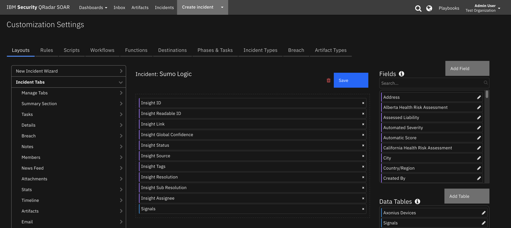

Sumo Logic Incident tab example:

  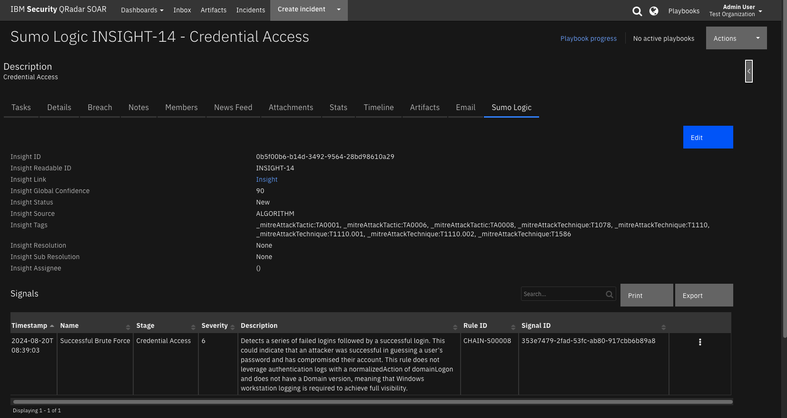

## Data Table - Signals

 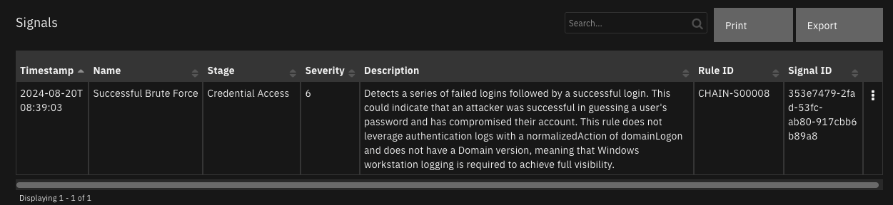

#### API Name:
sumo_logic_insight_signals_dt

#### Columns:
| Column Name | API Access Name | Type | Tooltip |
| ----------- | --------------- | ---- | ------- |
| Description | `sumo_logic_signal_description` | `text` | - |
| Name | `sumo_logic_signal_name` | `text` | - |
| Rule ID | `sumo_logic_signal_rule_id` | `text` | - |
| Severity | `sumo_logic_signal_severity` | `text` | - |
| Signal ID | `sumo_logic_signal_id` | `text` | - |
| Stage | `sumo_logic_signal_stage` | `text` | - |
| Timestamp | `sumo_logic_signal_timestamp` | `text` | - |

---

## Custom Fields
| Label | API Access Name | Type | Prefix | Placeholder | Tooltip |
| ----- | --------------- | ---- | ------ | ----------- | ------- |
| Insight Assignee | `sumo_logic_insight_assignee` | `text` | `properties` | - | - |
| Insight Global Confidence | `sumo_logic_insight_global_confidence` | `number` | `properties` | - | - |
| Insight ID | `sumo_logic_insight_id` | `text` | `properties` | - | - |
| Insight Link | `sumo_logic_insight_link` | `textarea` | `properties` | - | - |
| Insight Readable ID | `sumo_logic_insight_readable_id` | `text` | `properties` | - | - |
| Insight Resolution | `sumo_logic_insight_resolution` | `text` | `properties` | - | - |
| Insight Source | `sumo_logic_insight_source` | `text` | `properties` | - | - |
| Insight Status | `sumo_logic_insight_status` | `text` | `properties` | - | - |
| Insight Sub Resolution | `sumo_logic_insight_sub_resolution` | `text` | `properties` | - | - |
| Insight Tags | `sumo_logic_insight_tags` | `text` | `properties` | - | - |

---


## Troubleshooting & Support
Refer to the documentation listed in the Requirements section for troubleshooting information.
 
### For Support
This is an IBM supported app. Please search [ibm.com/mysupport](https://ibm.com/mysupport) for assistance.
