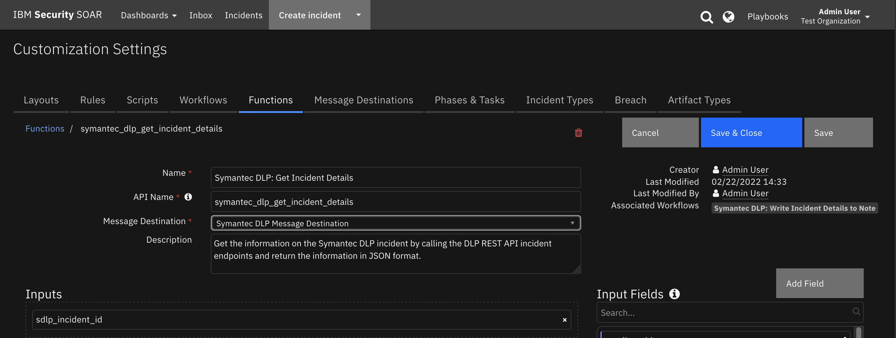
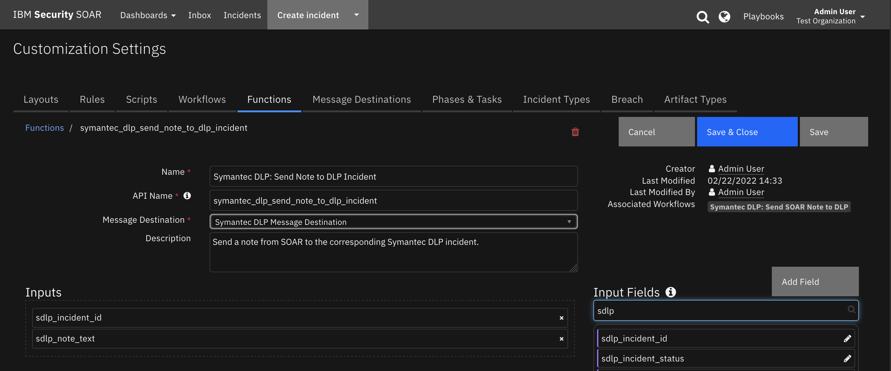
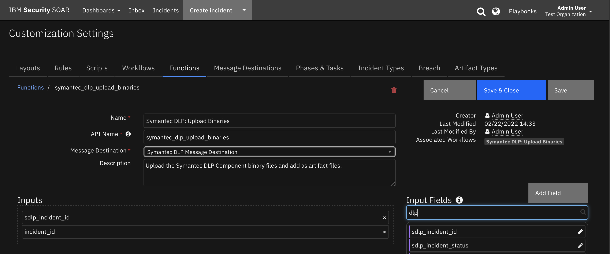

<!--
  This README.md is generated by running:
  "resilient-sdk docgen -p fn_symantec_dlp"

  It is best edited using a Text Editor with a Markdown Previewer. VS Code
  is a good example. Checkout https://guides.github.com/features/mastering-markdown/
  for tips on writing with Markdown

  All fields followed by "::CHANGE_ME::"" should be manually edited

  If you make manual edits and run docgen again, a .bak file will be created

  Store any screenshots in the "doc/screenshots" directory and reference them like:
  

  NOTE: If your app is available in the container-format only, there is no need to mention the integration server in this readme.
-->

# Symantec DLP

## Table of Contents
- [Release Notes](#release-notes)
- [Overview](#overview)
  - [Key Features](#key-features)
- [Requirements](#requirements)
  - [SOAR platform](#soar-platform)
  - [Cloud Pak for Security](#cloud-pak-for-security)
  - [Proxy Server](#proxy-server)
  - [Python Environment](#python-environment)
  - [Endpoint Developed With](#endpoint-developed-with)
- [Installation](#installation)
  - [Install](#install)
  - [App Configuration](#app-configuration)
- [Function - Symantec DLP: Get Incident Details](#function---symantec-dlp-get-incident-details)
- [Function - Symantec DLP: Send Note to DLP Incident](#function---symantec-dlp-send-note-to-dlp-incident)
- [Function - Symantec DLP: Update Incident Status in DLP](#function---symantec-dlp-update-incident-status-in-dlp)
- [Function - Symantec DLP: Upload Binaries](#function---symantec-dlp-upload-binaries)
- [Script - Convert JSON to rich text v1.1](#script---convert-json-to-rich-text-v11)
- [Custom Fields](#custom-fields)
- [Rules](#rules)
- [Troubleshooting & Support](#troubleshooting--support)
---

## Release Notes
<!--
  Specify all changes in this release. Do not remove the release 
  notes of a previous release
-->
| Version | Date | Notes |
| ------- | ---- | ----- |
| 2.0.0 | 2022 | REST API | 
| 1.0.0 | 2019 | Initial Release (SOAP-based)|

---

## Overview
<!--
  Provide a high-level description of the function itself and its remote software or application.
  The text below is parsed from the "description" and "long_description" attributes in the setup.py file
-->
**IBM QRadar SOAR app for Symantec DLP**

 

This app allows bi-directional synchronization between IBM Security QRadar SOAR and Symantec DLP.  Symantec DLP incidents are escalated to IBM SOAR as cases with the creation of artifacts and notes in SOAR from the incident.

### Key Features
<!--
  List the Key Features of the Integration
-->
The Symantec DLP app implements the following functionality in the IBM QRadar SOAR platform:

* Poll Symantec DLP for incidents using a DLP saved report search filter and create a corresponding incident/case in the IBM SOAR platform.
* Add Symantec DLP notes to corresponding IBM SOAR incident/case.
* Create artifacts from the Symantec DLP incident in the IBM SOAR incident/case.
* Resolve a Symantec DLP incident when the corresponding IBM SOAR incident/case is closed.
* Close an IBM SOAR incident/case when the corresponding Symantec DLP incident is resolved in Symantec DLP.
* Get the Symantec DLP incident details and write the JSON in a formatted SOAR incident note.
* Create a live link in the Symantec DLP incident to the corresponding SOAR case. 
* Create a live link in the a SOAR case to the corresponding Symantec DLP incident. 
---

## Requirements
<!--
  List any Requirements 
--> 
This app supports the IBM Security QRadar SOAR Platform and the IBM Security QRadar SOAR for IBM Cloud Pak for Security.

### SOAR platform
The SOAR platform supports two app deployment mechanisms, App Host and integration server.

If deploying to a SOAR platform with an App Host, the requirements are:
* SOAR platform >= `42.0.0`.
* The app is in a container-based format (available from the AppExchange as a `zip` file).

If deploying to a SOAR platform with an integration server, the requirements are:
* SOAR platform >= `42.0.0`.
* The app is in the older integration format (available from the AppExchange as a `zip` file which contains a `tar.gz` file).
* Integration server is running `resilient_circuits>=43.0.0`.
* If using an API key account, make sure the account provides the following minimum permissions: 
  | Name | Permissions |
  | ---- | ----------- |
  | Org Data | Read |
  | Function | Read |
  | Incident | Read, Edit, Create, Owner, Status |
  | Incident Notes | Edit |

The following SOAR platform guides provide additional information: 
* _App Host Deployment Guide_: provides installation, configuration, and troubleshooting information, including proxy server settings. 
* _Integration Server Guide_: provides installation, configuration, and troubleshooting information, including proxy server settings.
* _System Administrator Guide_: provides the procedure to install, configure and deploy apps. 

The above guides are available on the IBM Documentation website at [ibm.biz/soar-docs](https://ibm.biz/soar-docs). On this web page, select your SOAR platform version. On the follow-on page, you can find the _App Host Deployment Guide_ or _Integration Server Guide_ by expanding **Apps** in the Table of Contents pane. The System Administrator Guide is available by expanding **System Administrator**.

### Cloud Pak for Security
If you are deploying to IBM Cloud Pak for Security, the requirements are:
* IBM Cloud Pak for Security >= 1.4.
* Cloud Pak is configured with an App Host.
* The app is in a container-based format (available from the AppExchange as a `zip` file).

The following Cloud Pak guides provide additional information: 
* _App Host Deployment Guide_: provides installation, configuration, and troubleshooting information, including proxy server settings. From the Table of Contents, select Case Management and Orchestration & Automation > **Orchestration and Automation Apps**.
* _System Administrator Guide_: provides information to install, configure, and deploy apps. From the IBM Cloud Pak for Security IBM Documentation table of contents, select Case Management and Orchestration & Automation > **System administrator**.

These guides are available on the IBM Documentation website at [ibm.biz/cp4s-docs](https://ibm.biz/cp4s-docs). From this web page, select your IBM Cloud Pak for Security version. From the version-specific IBM Documentation page, select Case Management and Orchestration & Automation.

### Proxy Server
The app **does** support a proxy server.

### Python Environment
Both Python 2.7 and Python 3.6 are supported.
Additional package dependencies may exist for each of these packages:
* jinja2
* resilient_circuits>=43.0.0

### Endpoint Developed With

This app has been implemented using:
| Product Name | Product Version | API URL | API Version |
| ------------ | --------------- | ------- | ----------- |
| Symantec DLP | 15.8 | https://enforce-server/ProtectManager/webservices/v2 | v2 |

#### Prerequisites
<!--
List any prerequisites that are needed to use with this endpoint solution. Remove any section that is unnecessary.
-->
* Symantec DLP Enforce Server

#### Configuration
<!--
List any steps that are needed to configure the endpoint to use this app.
-->
##### Configure Symantec DLP Custom Attributes

Two DLP Custom Attributes are used by the DLP integration to hold relevant information from the IBM SOAR platform. 

`ibm_soar_case_id` custom attribute is used for filtering out already imported to SOAR incidents and avoiding duplication. Without this custom attribute in place, there is a potential for incident duplication.  

`ibm_soar_case_url` custom attribute is used to provide a live link from Symantec DLP to IBM SOAR.

To create the custom attribute in Symantec DLP navigate to `System->Incident Attributes->Custom Attributes`

 

Select the option to Add a new Custom Attribute and create an `ibm_soar_case_id` and an `ibm_soar_case_url` custom  attribute.

 
 

#### Permissions
<!--
List any user permissions that are needed to use this endpoint. For example, list the API key permissions.
-->
* Valid DLP user account created using the DLP Enforce Server administration console in order to access the REST API service.

---

## Installation

### Install
* To install or uninstall an App or Integration on the _SOAR platform_, see the documentation at [ibm.biz/soar-docs](https://ibm.biz/soar-docs).
* To install or uninstall an App on _IBM Cloud Pak for Security_, see the documentation at [ibm.biz/cp4s-docs](https://ibm.biz/cp4s-docs) and follow the instructions above to navigate to Orchestration and Automation.

### App Configuration
The following table provides the settings you need to configure the app. These settings are made in the app.config file. See the documentation discussed in the Requirements section for the procedure.

| Config | Required | Example | Description |
| ------ | :------: | ------- | ----------- |
| **api_version** | Yes | `v2` | *Symantec DLP REST API version.* |
| **cafile** | No | `` | *false or /path/to/certificate.* |
| **polling_interval** | Yes | `60` | *Poller interval time in seconds. Value of zero to turn poller off.* |
| **polling_lookback** | Yes | `12000` | *Number of days to look back for DLP incidents. Value is only used on the first time polling when the app starts.* |
| **sdlp_host** | Yes | `<serverip>` | *Symantec DLP Enforce Server.*  |
| **sdlp_username** | Yes | `<SDLP Username>` | *Symantec DLP account username.* |
| **sdlp_password** | Yes | `<SDLP Password>` |  *Symantec DLP account password.* |
| **sdlp_saved_report_id** | Yes | `0` | *Saved Report ID used to query for incidents.* |
| **create_case_template** | No | /path/create_case_template.jinja | *Use when overriding the default template.* |
| **close_case_template** | No | /path/close_case_template.jinja | *Use when overriding the default template.* |
| **update_case_template** | No | /path/update_case_template.jinja | *Use when overriding the default template.* |


---

## Function - Symantec DLP: Get Incident Details
Get the information on the Symantec DLP incident by calling the DLP REST API incident endpoints for edittable, static and notes and return the information in JSON format.

 

<details><summary>Inputs:</summary>
<p>

| Name | Type | Required | Example | Tooltip |
| ---- | :--: | :------: | ------- | ------- |
| `sdlp_incident_id` | `number` | Yes | `-` | - |

</p>
</details>

<details><summary>Outputs:</summary>
<p>

> **NOTE:** This example might be in JSON format, but `results` is a Python Dictionary on the SOAR platform.

<!-- ::CHANGE_ME:: -->
```python
results = {
  "version": 2.0,
  "success": true,
  "reason": null,
  "content": {
    "notes": [
      "<b>From Symantec DLP</b>\n                        <br>\n                        <b>User: </b>Administrator added note at 2022-02-07T16:23:50.32\n                        <br>\n                        <b>Note detail</b>: <p>added a note 2/7/2022 4:23pm</p>\n                        ",
      "<b>From Symantec DLP</b>\n                        <br>\n                        <b>User: </b>Administrator added note at 2022-02-08T08:31:12.158\n                        <br>\n                        <b>Note detail</b>: <p>added a second note 2/7/2022</p>\n                        ",
      "<b>From Symantec DLP</b>\n                        <br>\n                        <b>User: </b>Administrator added note at 2022-02-10T20:49:58.47\n                        <br>\n                        <b>Note detail</b>: <p>added note to SOAR and will send it to DLP</p>\n                        ",
      "<b>From Symantec DLP</b>\n                        <br>\n                        <b>User: </b>Administrator added note at 2022-02-10T20:49:58.47\n                        <br>\n                        <b>Note detail</b>: <p>added note to SOAR and will send it to DLP</p>\n                        "
    ],
    "editableIncidentDetails": {
      "incidentId": 468,
      "infoMap": {
        "detectedRemediationStatus": 0,
        "preventOrProtectStatusId": 0,
        "incidentStatusName": "Resolved",
        "isHidingNotAllowed": false,
        "severityId": 1,
        "incidentStatusId": 3,
        "isHidden": false
      },
      "customAttributeGroups": [
        {
          "name": "custom_attribute_group.default",
          "nameInternationalized": true,
          "customAttributes": [
            {
              "name": "ibm_soar_case_url",
              "index": 17,
              "displayOrder": 1,
              "value": "https://mysoar.com:443/#incidents/3449",
              "email": false
            },
            {
              "name": "ibm_soar_case_id",
              "index": 18,
              "displayOrder": 2,
              "value": "3449",
              "email": false
            }
          ]
        },
        {
          "name": "Predefined",
          "nameInternationalized": false,
          "customAttributes": [
            {
              "name": "Resolution",
              "index": 1,
              "displayOrder": 1,
              "value": "Business Issue",
              "email": false
            },
            {
              "name": "Dismissal Reason",
              "index": 2,
              "displayOrder": 2,
              "value": "Bus. Process Issue",
              "email": false
            },
            {
              "name": "Assigned To",
              "index": 3,
              "displayOrder": 3,
              "email": false
            },
            {
              "name": "Business Unit",
              "index": 4,
              "displayOrder": 4,
              "email": false
            },
            {
              "name": "Employee Code",
              "index": 5,
              "displayOrder": 5,
              "email": false
            },
            {
              "name": "First Name",
              "index": 6,
              "displayOrder": 6,
              "email": false
            },
            {
              "name": "Last Name",
              "index": 7,
              "displayOrder": 7,
              "email": false
            },
            {
              "name": "Phone",
              "index": 8,
              "displayOrder": 8,
              "email": false
            },
            {
              "name": "Sender Email",
              "index": 9,
              "displayOrder": 9,
              "email": true
            },
            {
              "name": "Manager First Name",
              "index": 11,
              "displayOrder": 10,
              "email": false
            },
            {
              "name": "Manager Last Name",
              "index": 10,
              "displayOrder": 11,
              "email": false
            },
            {
              "name": "Manager Phone",
              "index": 12,
              "displayOrder": 12,
              "email": false
            },
            {
              "name": "Manager Email",
              "index": 13,
              "displayOrder": 13,
              "email": true
            },
            {
              "name": "Region",
              "index": 14,
              "displayOrder": 14,
              "email": false
            },
            {
              "name": "Country",
              "index": 15,
              "displayOrder": 15,
              "email": false
            },
            {
              "name": "Postal Code",
              "index": 16,
              "displayOrder": 16,
              "email": false
            }
          ]
        }
      ]
    },
    "staticIncidentDetails": {
      "incidentId": 468,
      "infoMap": {
        "messageType": "EDAR",
        "discoverContentRootPath": "DLP-WINDOWS10-8",
        "policyName": "Customer Data Protection",
        "discoverMillisSinceFirstSeen": 165799618,
        "detectionServerName": "Single-tier Detection Server",
        "discoverTargetId": 21,
        "discoverName": "passwordpolicy.ini",
        "fileOwner": "BUILTIN\\administrators",
        "policyVersion": 2,
        "discoverServer": "DLP-WINDOWS10-8",
        "discoverRepositoryLocation": "DLP-WINDOWS10-8 - c:\\passwordpolicy.ini",
        "discoverScanId": 41,
        "endpointConnectionStatus": "CONNECTED",
        "policyId": 16,
        "detectionServerId": 1,
        "messageId": 468,
        "creationDate": "2022-02-04T16:08:48.678",
        "isBlockedStatusSuperseded": false,
        "detectionDate": "2022-02-04T16:08:43.08",
        "messageDate": "2022-02-03T22:40:43",
        "attachmentInfo": [
          {
            "messageComponentName": "c:\\passwordpolicy.ini",
            "messageComponentId": 981,
            "wasCracked": false,
            "documentFormat": "unicode",
            "messageComponentType": 3,
            "originalSize": 16482
          }
        ],
        "fileCreateDate": "2021-02-12T09:50:16.39",
        "fileAccessDate": "2022-02-04T16:01:06.431",
        "discoverTargetName": "SS number on 9.30.94.38",
        "policyGroupName": "Customer Data Protection",
        "policyGroupId": 5,
        "messageSource": "DISCOVER",
        "matchCount": 2,
        "messageAclEntries": [
          {
            "cloudStorageCollaborator": "BUILTIN\\administrators",
            "aclType": "FILE",
            "sharepointPermission": "WRITE",
            "cloudstorageRole": "WRITE",
            "grantDeny": "GRANT",
            "sharePointACL": "BUILTIN\\administrators",
            "readACLShare": "BUILTIN\\administrators",
            "readACLFile": "BUILTIN\\administrators"
          },
          {
            "cloudStorageCollaborator": "BUILTIN\\administrators",
            "aclType": "FILE",
            "sharepointPermission": "READ",
            "cloudstorageRole": "READ",
            "grantDeny": "GRANT",
            "sharePointACL": "BUILTIN\\administrators",
            "readACLShare": "BUILTIN\\administrators",
            "readACLFile": "BUILTIN\\administrators"
          },
          {
            "cloudStorageCollaborator": "NT AUTHORITY\\system",
            "aclType": "FILE",
            "sharepointPermission": "WRITE",
            "cloudstorageRole": "WRITE",
            "grantDeny": "GRANT",
            "sharePointACL": "NT AUTHORITY\\system",
            "readACLShare": "NT AUTHORITY\\system",
            "readACLFile": "NT AUTHORITY\\system"
          },
          {
            "cloudStorageCollaborator": "NT AUTHORITY\\system",
            "aclType": "FILE",
            "sharepointPermission": "READ",
            "cloudstorageRole": "READ",
            "grantDeny": "GRANT",
            "sharePointACL": "NT AUTHORITY\\system",
            "readACLShare": "NT AUTHORITY\\system",
            "readACLFile": "NT AUTHORITY\\system"
          },
          {
            "cloudStorageCollaborator": "BUILTIN\\users",
            "aclType": "FILE",
            "sharepointPermission": "READ",
            "cloudstorageRole": "READ",
            "grantDeny": "GRANT",
            "sharePointACL": "BUILTIN\\users",
            "readACLShare": "BUILTIN\\users",
            "readACLFile": "BUILTIN\\users"
          },
          {
            "cloudStorageCollaborator": "NT AUTHORITY\\authenticated users",
            "aclType": "FILE",
            "sharepointPermission": "WRITE",
            "cloudstorageRole": "WRITE",
            "grantDeny": "GRANT",
            "sharePointACL": "NT AUTHORITY\\authenticated users",
            "readACLShare": "NT AUTHORITY\\authenticated users",
            "readACLFile": "NT AUTHORITY\\authenticated users"
          },
          {
            "cloudStorageCollaborator": "NT AUTHORITY\\authenticated users",
            "aclType": "FILE",
            "sharepointPermission": "READ",
            "cloudstorageRole": "READ",
            "grantDeny": "GRANT",
            "sharePointACL": "NT AUTHORITY\\authenticated users",
            "readACLShare": "NT AUTHORITY\\authenticated users",
            "readACLFile": "NT AUTHORITY\\authenticated users"
          }
        ],
        "messageTypeId": 15,
        "discoverScanStartDate": "2022-02-04T15:39:28",
        "discoverUrl": "DLP-WINDOWS10-8 - c:\\passwordpolicy.ini"
      }
    },
    "sdlp_incident_url": "https://my-IP/ProtectManager/IncidentDetail.do?value(variable_1)=incident.id&value(operator_1)=incident.id_in&value(operand_1)=468"
  },
  "raw": null,
  "inputs": {
    "sdlp_incident_id": 468
  },
  "metrics": {
    "version": "1.0",
    "package": "fn-symantec-dlp",
    "package_version": "2.0.0",
    "host": "my-laptop",
    "execution_time_ms": 7312,
    "timestamp": "2022-03-03 10:53:00"
  }
} 
```

</p>
</details>

<details><summary>Example Pre-Process Script:</summary>
<p>

```python
inputs.sdlp_incident_id = incident.properties.sdlp_incident_id
```

</p>
</details>

<details><summary>Example Post-Process Script:</summary>
<p>

```python
# Put the results json into a workflow property so we can call the 
# convert_json_to_rich_text script to print readable formatted json in an incident note.
inputs = results.get("inputs")
sdlp_incident_id = inputs.get("sdlp_incident_id")
content = results.get("content")

header = u"Symantec DLP Incident Id: {0} Details:".format(sdlp_incident_id)

json_note = {
              "version": "1.1",
              "header": header, 
              "json": content,
              "sort": False
            }

workflow.addProperty('convert_json_to_rich_text', json_note)
```

</p>
</details>

---
## Function - Symantec DLP: Send Note to DLP Incident
Send an case note from SOAR to the corresponding Symantec DLP incident.

  <!-- ::CHANGE_ME:: -->

<details><summary>Inputs:</summary>
<p>

| Name | Type | Required | Example | Tooltip |
| ---- | :--: | :------: | ------- | ------- |
| `sdlp_incident_id` | `number` | Yes | `-` | - |
| `sdlp_note_text` | `text` | Yes | `-` | - |

</p>
</details>

<details><summary>Outputs:</summary>
<p>

> **NOTE:** This example might be in JSON format, but `results` is a Python Dictionary on the SOAR platform.

```python
results = {
  "version": 2.0,
  "success": true,
  "reason": null,
  "content": {
    "success": true,
    "reason:": null
  },
  "raw": null,
  "inputs": {
    "sdlp_note_text": "<b>Symantec DLP: Update Incident Status</b><br /> DLP incident 468 status set to: Resolved.",
    "sdlp_incident_id": 468
  },
  "metrics": {
    "version": "1.0",
    "package": "fn-symantec-dlp",
    "package_version": "2.0.0",
    "host": "my-laptop",
    "execution_time_ms": 30032,
    "timestamp": "2022-03-03 11:29:55"
  }
} 
```

</p>
</details>

<details><summary>Example Pre-Process Script:</summary>
<p>

```python
inputs.sdlp_incident_id = incident.properties.sdlp_incident_id
inputs.sdlp_note_text = note.text.content
```

</p>
</details>

<details><summary>Example Post-Process Script:</summary>
<p>

```python
# Import Date
from java.util import Date

# Edit note in SOAR to indicate it was sent to SentinelOne
if results.success:
  # Get the current time
  dt_now = Date()
  note.text = u"<b>Sent to Symantec DLP at {0}</b><br>{1}".format(dt_now, unicode(note.text.content))
```

</p>
</details>

---
## Function - Symantec DLP: Update Incident Status in DLP
Update the incident status of the Symantec DLP incident in DLP.

  

<details><summary>Inputs:</summary>
<p>

| Name | Type | Required | Example | Tooltip |
| ---- | :--: | :------: | ------- | ------- |
| `incident_id` | `number` | Yes | `-` | the id of the incident |
| `sdlp_incident_status` | `select` | Yes | `-` | - |

</p>
</details>

<details><summary>Outputs:</summary>
<p>

> **NOTE:** This example might be in JSON format, but `results` is a Python Dictionary on the SOAR platform.

```python
results = {
  "version": 2.0,
  "success": true,
  "reason": null,
  "content": {
    "success": true,
    "sdlp_incident_id": 468,
    "sdlp_incident_status": "Resolved"
  },
  "raw": null,
  "inputs": {
    "incident_id": 3449,
    "sdlp_incident_status": "Resolved"
  },
  "metrics": {
    "version": "1.0",
    "package": "fn-symantec-dlp",
    "package_version": "2.0.0",
    "host": "MacBook-Pro.local",
    "execution_time_ms": 16146,
    "timestamp": "2022-03-03 10:53:44"
  }
} 
```

</p>
</details>

<details><summary>Example Pre-Process Script:</summary>
<p>

```python
inputs.incident_id = incident.id
inputs.sdlp_incident_status = rule.properties.sdlp_incident_status
```

</p>
</details>

<details><summary>Example Post-Process Script:</summary>
<p>

```python
content = results.get("content")
success = content.get("success", False)
sdlp_incident_id = content.get("sdlp_incident_id", None)
sdlp_incident_status = content.get("sdlp_incident_status", None)
if success:
  noteText = u'<b>Symantec DLP: Update Incident Status</b><br> DLP incident {0} status set to: {1}.'.format(sdlp_incident_id, sdlp_incident_status)
else:
  noteText = u'<b>Symantec DLP: Update Incident Status</b><br>Error: Check DLP incidentId {0} status in Symantec DLP.'.format(sdlp_incident_id)

incident.addNote(noteText)
```

</p>
</details>

---
## Function - Symantec DLP: Upload Binaries
Upload the Symantec DLP Component binary files and add as artifact files.

  

<details><summary>Inputs:</summary>
<p>

| Name | Type | Required | Example | Tooltip |
| ---- | :--: | :------: | ------- | ------- |
| `incident_id` | `number` | Yes | `-` | the id of the incident |
| `sdlp_incident_id` | `number` | Yes | `-` | - |

</p>
</details>

<details><summary>Outputs:</summary>
<p>

> **NOTE:** This example might be in JSON format, but `results` is a Python Dictionary on the SOAR platform.

```python
results = {
    # TODO: Generate an example of the Function Output within this code block.
    # To get the output of a Function:
    #   1. Run resilient-circuits in DEBUG mode: $ resilient-circuits run --loglevel=DEBUG
    #   2. Invoke the Function in SOAR
    #   3. Gather the results using: $ resilient-sdk codegen -p fn_symantec_dlp --gather-results
    #   4. Run docgen again: $ resilient-sdk docgen -p fn_symantec_dlp
} 
```

</p>
</details>

<details><summary>Example Pre-Process Script:</summary>
<p>

```python
inputs.sdlp_incident_id = incident.properties.sdlp_incident_id
inputs.incident_id = incident.id
```

</p>
</details>

<details><summary>Example Post-Process Script:</summary>
<p>

```python
sdlp_inputs = results.get("inputs")
sdlp_incident_id = sdlp_inputs.get("sdlp_incident_id")

note = u"<b>Symantec DLP: Upload Binaries for incident Id {0}</b><br>".format(sdlp_incident_id)
success = results.get("success")
if success:
  content = results.get('artifact_name_list')
  num_artifacts = len(content)
  note = u"{0} {1} artifact files added".format(note, num_artifacts)
else
  note = u"{0}artifact NOT added".format(note)
incident.addNote(helper.createRichText(note))
```

</p>
</details>

---

## Script - Convert JSON to rich text v1.1
This script converts a json object into a hierarchical display of rich text and adds the rich text to an incident's rich text (custom) field or an incident note. A workflow property is used to share the json to convert and identify parameters used on how to perform the conversion.

Typically, a function will create the workflow property 'convert_json_to_rich_text', and this script will run after that function to perform the conversion.

Features:
* Display the hierarchical nature of json, presenting the json keys (sorted if specified) as bold labels
* Provide links to found URLs
* Create either an incident note or add results to an incident (custom) rich text field.

**Object:** incident

<details><summary>Script Text:</summary>
<p>

```python
# (c) Copyright IBM Corp. 2010, 2020. All Rights Reserved.
VERSION = 1.1
"""
  This script converts a json object into a hierarchical display of rich text and adds the rich text to an incident's rich text (custom) field or an incident note.
  A workflow property is used to define the json to convert and identify parameters used on how to perform the conversion.
  Typically, a function will create workflow property and this script will run after that function to perform the conversion.
  Features:
    * Display the hierarchical nature of json, presenting the json keys as bold labels
    * Provide links to found URLs
    * Create either an incident note or add results to an incident (custom) rich text field.
  
  In order to use this script, define a workflow property called: convert_json_to_rich_text, to define the json and parameters to use for the conversion.
  Workflow properties can be added using a command similar to this:
  workflow.addProperty('convert_json_to_rich_text', {
    "version": 1.1,
    "header": "Artifact scan results for: {}".format(artifact.value),
    "padding": 10,
    "separator": u"<br />",
    "sort": True,
    "json": results.content,
    "json_omit_list": ["omit"],
    "incident_field": None
  })
  
  Format of workflow.property.convert_json_to_rich_text:
  { 
    "version": 1.1, [this is for future compatibility]
    "header": str, [header line to add to converted json produced or None. Ex: Results from scanning artifact: xxx. The header may contain rich text tags]
    "padding": 10, [padding for nested json elements, or defaults to 10]
    "separator": u"<br />"|list such as ['<span>','</span>'], [html separator between json keys and lists or defaults to html break: '<br />'. 
                                                If a list, then the data is brackets by the pair specified]
    "sort": True|False, [sort the json keys at each level when displayed]
    "json": json, [required json to convert]
    "json_omit_list": [list of json keys to exclude or None]
    "incident_field": "<incident_field>" [indicates a builtin rich text incident field, such as 'description' 
                                          or a custom rich text field in the format: 'properties.<field>'. default: create an incident note]
  }
"""

import re

# needed for python 3
try:
    unicode("abc")
except:
    unicode = str


rc = re.compile(r'http[s]?://(?:[a-zA-Z]|[0-9]|[$-_@.&+#\?]|[!*\(\),]|(?:%[0-9a-fA-F][0-9a-fA-F]))+')

class ConvertJson:
    """Class to hold the conversion parameters and perform the conversion"""

    def __init__(self, omit_keys=[], padding=10, separator=u"<br />", sort_keys=False):
        self.omit_keys = omit_keys
        self.padding = padding
        self.separator = separator
        self.sort_keys = sort_keys


    def format_link(self, item):
        """[summary]
          Find embedded urls (http(s)) and add html anchor tags to display as links
          Args:
              item ([string])

          Returns:
              [str]: None|original text if no links|text with html links
        """
        formatted_item = item
        if item and not isinstance(item, (int, bool, float)):
            list = rc.findall(item)
            if list:
                for link in list:
                    formatted_item = formatted_item.replace(link, u"<a target='blank' href='{0}'>{0}</a>".format(link))

        return formatted_item

    def expand_list(self, list_value, is_list=False):
        """[summary]
          convert items to html, adding indents to nested dictionaries.
          Args:
              list_value ([dict|list]): json element

          Returns:
              [str]: html converted code
        """
        if not isinstance(list_value, list):
            return self.format_link(list_value)
        elif not list_value:
            return u"None<br>"

        try:
            items_list = []  # this will ensure list starts on second line of key label
            for item in list_value:
                if isinstance(item, dict):
                    result = self.convert_json_to_rich_text(item)
                    if is_list:
                        items_list.append(u"<li>{}</li>".format(result))
                    else:
                        items_list.append(result)
                elif isinstance(item, list):
                    items_list.append(self.expand_list(item, is_list=True))
                elif is_list:
                    items_list.append(u"<li>{}</li>".format(self.format_link(unicode(item))))
                else:
                    items_list.append(self.format_link(unicode(item)))

            expand_list_result = self.add_separator(self.separator if not is_list else u"",
                                                    items_list,
                                                    is_list=is_list)

            if is_list:
                return u"<ul>{}</ul>".format(expand_list_result)
            else:
                return u"<div style='padding:5px'>{}</div>".format(expand_list_result)
        except Exception as err:
            return str(err)

    def convert_json_to_rich_text(self, sub_dict):
        """[summary]
          Walk dictionary tree and convert to html for better display
          Args:
              sub_dict ([type]): [description]

          Returns:
              [type]: [description]
        """
        notes = []
        if sub_dict:
            if isinstance(sub_dict, list):
                expanded_list = self.expand_list(sub_dict, is_list=True)
                notes.append(self.add_separator(self.separator, expanded_list))
            else:
                keys = sorted (sub_dict.keys()) if self.sort_keys else sub_dict.keys()

                for key in keys:
                    if key not in self.omit_keys:
                        value = sub_dict[key]
                        is_list = isinstance(value, list)
                        item_list = [u"<strong>{0}</strong>: ".format(key)]
                        if isinstance(value, dict):
                            convert_result = self.convert_json_to_rich_text(value)
                            if convert_result:
                                item_list.append(u"<div style='padding:{}px'>{}</div>".format(self.padding, convert_result))
                            else:
                                item_list.append(u"None<br>")
                        else:
                            item_list.append(self.expand_list(value, is_list=is_list))
                        notes.append(self.add_separator(self.separator, u"".join(unicode(v) for v in item_list), is_list=is_list))

        result_notes = u"".join(notes)
        if isinstance(self.separator, list):
            return result_notes
        else:
            return result_notes.replace(
                u"</div>{0}".format(self.separator), u"</div>").replace(
                u"{0}</div>".format(self.separator), u"</div>"
            )  # tighten up result

    def add_separator(self, separator, items, is_list=False):
        """
        apply the separator to the data
        :param separator: None, str or list such as ['<span>', '</span>']
        :param items: str or list to add separator
        :return: text with separator applied
        """
        _items = items

        if not _items:
            return "<br>"

        if not isinstance(_items, list):
            _items = [_items]

        if isinstance(separator, list):
            return u"".join([u"{}{}{}".format(separator[0], item, separator[1]) for item in _items])

        return u"{}{}".format(separator.join(_items), separator if not is_list else u"")

def get_properties(property_name):
    """
    Logic to collect the json and parameters from a workflow property.
    Args:
      property_name: workflow property to reference
    Returns:
      padding, separator, header, json_omit_list, incident_field, json, sort_keys
    """
    if not workflow.properties.get(property_name):
        helper.fail("workflow.properties.{} undefined".format(property_name))

    padding = int(workflow.properties[property_name].get("padding", 10))
    separator = workflow.properties[property_name].get("separator", u"<br />")
    if isinstance(separator, list) and len(separator) != 2:
        helper.fail("list of separators should be specified as a pair such as ['<div>', '</div>']: {}".format(separator))

    header = workflow.properties[property_name].get("header")
    json_omit_list = workflow.properties[property_name].get("json_omit_list")
    if not json_omit_list:
        json_omit_list = []
    incident_field = workflow.properties[property_name].get("incident_field")
    json = workflow.properties[property_name].get("json", {})
    if not isinstance(json, dict) and not isinstance(json, list):
        helper.fail("json element is not formatted correctly: {}".format(json))
    sort_keys = bool(workflow.properties[property_name].get("sort", False))

    return padding, separator, header, json_omit_list, incident_field, json, sort_keys


## S T A R T
if 'workflow' in globals():
    padding, separator, header, json_omit_list, incident_field, json, sort_keys = get_properties('convert_json_to_rich_text')

    if header:
        if isinstance(separator, list):
            hdr = u"{0}{1}{2}".format(separator[0], header, separator[1])
        else:
            hdr = u"{0}{1}".format(header, separator)
    else:
        hdr = u""

    convert = ConvertJson(omit_keys=json_omit_list, padding=padding, separator=separator, sort_keys=sort_keys)
    converted_json = convert.convert_json_to_rich_text(json)
    result = u"{}{}".format(hdr, converted_json if converted_json else "\nNone")

    rich_text_note = helper.createRichText(result)
    if incident_field:
        incident[incident_field] = rich_text_note
    else:
        incident.addNote(rich_text_note)

```

</p>
</details>

---


## Custom Fields
| Label | API Access Name | Type | Prefix | Placeholder | Tooltip |
| ----- | --------------- | ---- | ------ | ----------- | ------- |
| Symantec DLP Incident ID | `sdlp_incident_id` | `number` | `properties` | - | - |
| Symantec DLP Incident Status | `sdlp_incident_status` | `text` | `properties` | - | - |
| Symantec DLP Incident URL  | `sdlp_incident_url` | `textarea` | `properties` | - | - |

---


## Rules
| Rule Name | Object | Workflow Triggered |
| --------- | ------ | ------------------ |
| Symantec DLP: Send SOAR Note to DLP | note | `sdlp_send_soar_note_to_dlp` |
| Symantec DLP: Update DLP Incident Status | incident | `sdlp_update_incident_status` |
| Symantec DLP: Upload Binaries | incident | `sdlp_upload_binaries` |
| Symantec DLP: Upload Binaries as Artifact | incident | `sdlp_upload_binaries` |
| Symantec DLP: Write DLP Incident Details to Note | incident | `sdlp_write_incident_details_to_note` |

---


## Troubleshooting & Support
Refer to the documentation listed in the Requirements section for troubleshooting information.

### For Support
This is an IBM supported app. Please search [ibm.com/mysupport](https://ibm.com/mysupport) for assistance.

## Template Appendix
Below are examples of templates for creating, updating, and closing IBM SOAR incidents. Customize these templates and refer to them in the app.config file.
These default jinja templates map IBM SOAR fields to SentinelOne threat and agent fields.

Each template should be reviewed for correctness in your enterprise.
For instance, closing a SOAR incident may include additional custom fields which the default template
does not include.

<details><summary>incident_creation_template</summary>
<pre>

    "name": "Symantec DLP Incident Id {{ staticIncidentDetails.incidentId }}",
    "description": "An incident imported using the Symantec DLP Integration",
    "discovered_date": {{ staticIncidentDetails.infoMap.creationDate|soar_datetimeformat }},
    "start_date": {{ staticIncidentDetails.infoMap.detectionDate|soar_datetimeformat }},
    "incident_type_ids": [16],
    "severity_code": "{{ editableIncidentDetails.infoMap.severityId|string|soar_substitute('{"1": "High", "2": "Medium", "3": "Low", "4": "Low"}')}}",

    {#  Custom properties for DLP Attributes #}
    "properties": {
        "sdlp_incident_id": {{ staticIncidentDetails.incidentId }},
        "sdlp_incident_status": "{{ editableIncidentDetails.infoMap.incidentStatusName }}",
        "sdlp_incident_url": {"format" : "html", "content" : "<a target='blank' href='{{ sdlp_incident_url }}'>Symantec DLP Incident</a>"},
        "sdlp_policy_name": "{{ staticIncidentDetails.infoMap.policyName }}",
        "sdlp_policy_id": {{ staticIncidentDetails.infoMap.policyId }},
        "sdlp_policy_group_id": {{ staticIncidentDetails.infoMap.policyGroupId }},
        "sdlp_policy_group_name": "{{ staticIncidentDetails.infoMap.policyGroupName }}"
    },
    {# Artifacts which we will try to pull out of the Incident #}
    "artifacts": [
    
      {{- comma() }}
      {
        "type": {"name": "System Name"},
        "value": "{{ staticIncidentDetails.infoMap.discoverServer|replace('\\', '\\\\')|replace('"', '\\"') }}",
        "description": {
          "format": "text",
          "content": "System Name of the machine that generated Symantec DLP Incident Id {{ staticIncidentDetails.incidentId }}"
        }
      }
    
    
      {{- comma() }}
      {
        "type": { "name": "File Path"}, 
        "value": "{{ staticIncidentDetails.infoMap.discoverContentRootPath|replace("\\", "\\\\") }}",
        "description" : {
            "format" : "html", 
            "content" : "File Path of the file that generated Symantec DLP Incident Id {{ staticIncidentDetails.incidentId }}"
        }
      }
    
    
      {{- comma() }}
      {
        "type": { "name": "File Name"}, 
        "value": "{{ staticIncidentDetails.infoMap.discoverName|replace("\\", "\\\\") }}",
        "description" : {
            "format" : "html", 
            "content" : "File Name of the file that generated Symantec DLP Incident Id {{ staticIncidentDetails.incidentId }}"
        }
      }
    
    
      {{- comma() }}
      {
        "type": { "name": "User Account"}, 
        "value": "{{ staticIncidentDetails.infoMap.fileOwner|replace("\\", "\\\\") }}",
        "description" : {
            "format" : "html", 
            "content" : "File Owner of the file that generated Symantec DLP Incident Id {{ staticIncidentDetails.incidentId }}"
        }
      }
    
    
      {{- comma() }}
      {
        "type": {"name": "IP Address"},
        "value": "{{ staticIncidentDetails.infoMap.endpointMachineIpAddress|replace('\\', '\\\\')|replace('"', '\\"') }}",
        "description": {
          "format": "text",
          "content": "IP Address of the machine that generated Symantec DLP Incident Id {{ staticIncidentDetails.incidentId }}",
          "properties": [{"name": "source", "value": true}]
        }
      }
    
    ],
    "comments": [
        
        {    
            "text": {
                "format": "html",
                "content": "{{note_text|replace('\\', '\\\\')|replace('"', '\\"')}}"
            }        
        }
        {{ "," if not loop.last else "" }}
        
    ]
}
</pre>
</details>
<details><summary>incident_close_template</summary>
<pre>
{
 {# JINJA template for closing a new SOAR case from a Symantec DLP incident. #}
  "plan_status": "C",
  "resolution_id": "Resolved",
  "resolution_summary": "Closed from Symantec DLP."
  {# additional fields may be needed. Add as necessary #}
  {# "properties": { } #}
}
</pre>
</details>
<details><summary>incident_update_template</summary>
<pre>
{
  {# JINJA template for updating a SOAR case from a Symantec DLP incident. #}
  "severity_code": "{{ editableIncidentDetails.infoMap.severityId|string|soar_substitute('{"1": "High", "2": "Medium", "3": "Low", "4": "Low"}')}}",

  "properties": {
    "sdlp_incident_status": "{{ editableIncidentDetails.infoMap.incidentStatusName }}"
  }
}
```
