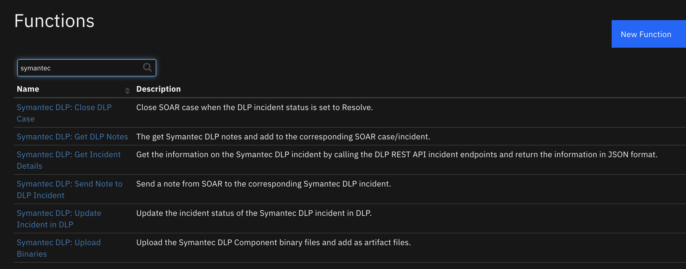
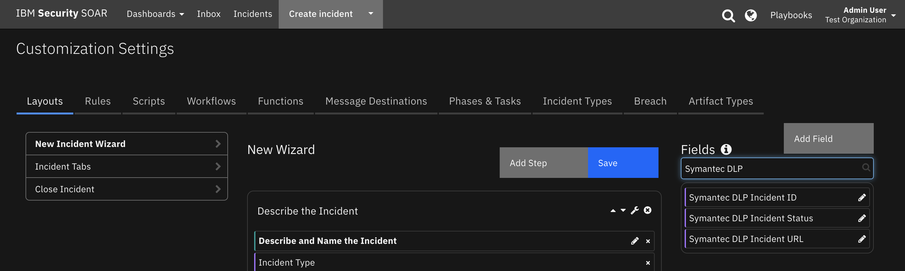

# fn-symantec-dlp Integration for IBM Resilient

- [Release Notes](#release-notes)
- [Overview](#overview)
- [Requirements](#requirements)
- [Installation](#installation)
- [Uninstall](#uninstall)
- [Troubleshooting](#troubleshooting)
- [Support](#support)
- [Configure Symantec DLP](#configure-symantec-dlp)

---

## Release Notes
### v0.0.1
* Pre-Release -- DLP Polling Component to import incidents into the Resilient platform.
### v1.0.0
* Initial Release -- Includes a DLP Polling Component to import incidents into the Resilient platform and also a function to update DLP incidents as a part of the incident response process.

---

## Overview
**Resilient Circuits Components used to establish DLP as a source of incidents for the Resilient platform**

 

Included in this package are two main components; a incident Poller used to gather incidents from DLP and a Resilient Circuits Function for updating a Symantec DLP incident from the Resilient platform.

---

## Requirements
<!--
  List any Requirements 
-->
* Resilient platform >= `v31.0.4235`
* An Integration Server running `resilient_circuits>=30.0.0`
  * To set up an Integration Server see: [ibm.biz/res-int-server-guide](https://ibm.biz/res-int-server-guide)

---

## Installation
* Download the `fn_symantec_dlp.zip`.
* Copy the `.zip` to your Integration Server and SSH into it.
* **Unzip** the package:
  ```
  $ unzip fn_symantec_dlp-x.x.x.zip
  ```
* **Change Directory** into the unzipped directory:
  ```
  $ cd fn_symantec_dlp-x.x.x
  ```
* **Install** the package:
  ```
  $ pip install fn_symantec_dlp-x.x.x.tar.gz
  ```
* Import the **configurations** into your app.config file:
  ```
  $ resilient-circuits config -u
  ```
* Import the fn_symantec_dlp **customizations** into the Resilient platform:
  ```
  $ resilient-circuits customize -y -l fn-symantec-dlp
  ```
* Open the config file, scroll to the bottom and edit your fn_symantec_dlp configurations:
  ```
  $ nano ~/.resilient/app.config
  ```
  | Config | Required | Example | Description |
  | ------ | :------: | ------- | ----------- |
  | **sdlp_should_poller_run** | Yes | `True` | *Whether or not to start the listener* |
  | **sdlp_host** | Yes | `https://<serverip>:<port>` | *The URL of the DLP Installation* |
  | **sdlp_wsdl** | Yes | `https://<serverip>:<port>/ProtectManager/services/v2011/incidents?wsdl` | *The location of your WSDL file used to construct requests when dealing with the incident and Reporting API* |
  | **sdlp_incident_endpoint** | Yes | `https://<serverip>:<port>/ProtectManager/services/v2011/incidents` | *The URL of the incident and Reporting API for your DLP Installation* |
  | **sdlp_username** | Yes | `<SDLP Username>` | *Username for DLP* |
  | **sdlp_password** | Yes | `<SDLP Password>` | *Password for DLP* |
  | **sdlp_cafile** | No | `<SDLP Password>` | *Location of the CA file for DLP, leave Blank or ‘comment out’ for unverified requests* |
  | **sdlp_listener_timer** | Yes | `600` | *Used to set how often the Listener should poll, default is 10 mins (600)sdlp_listener_timer=600* |
  | **sdlp_savedreportid** | Yes | `0` | *Saved Report ID used to query for incidents, must be set otherwise the integration will fail* |
  | **sdlp_should_search_res** | Yes | `False` | *Optional. If set to True, it performs an additional filter on DLP incident results to ensure that no Resilient incident exists with the same DLP incident ID. Uses search_ex to query for incidents with an sdlp_incident_id custom field* |

* **Save** and **Close** the app.config file.
* [Optional]: Run selftest to test the Integration you configured:
  ```
  $ resilient-circuits selftest -l fn-symantec-dlp
  ```
* **Run** resilient-circuits or restart the Service on Windows/Linux:
  ```
  $ resilient-circuits run
  ```

### Custom Layouts
Their are two custom fields which are used by the integration; `sdlp_incident_id` and `sdlp_incident_url`. `sdlp_incident_id` is used by the integration to perform an optional secondary filter when importing incidents into the Resilient platform. `sdlp_incident_url` provides a clickable URL when a DLP incident is imported giving quick access to the DLP console.

* Import the and custom fields like the screenshot below:

  

---

## Uninstall
* SSH into your Integration Server.
* **Uninstall** the package:
  ```
  $ pip uninstall fn-symantec-dlp
  ```
* Open the config file, scroll to the [fn_symantec_dlp] section and remove the section or prefix `#` to comment out the section.
* **Save** and **Close** the app.config file.

---

## Troubleshooting
There are several ways to verify the successful operation of a function.

### Resilient platform Action Status
* When viewing an incident, use the Actions menu to view **Action Status**.
* By default, pending and errors are displayed.
* Modify the filter for actions to also show Completed actions.
* Clicking on an action displays additional information on the progress made or what error occurred.

### Resilient platform Scripting Log
* A separate log file is available to review scripting errors.
* This is useful when issues occur in the pre-processing or post-processing scripts.
* The default location for this log file is: `/var/log/resilient-scripting/resilient-scripting.log`.

### Resilient platform Logs
* By default, Resilient platform logs are retained at `/usr/share/co3/logs`.
* The `client.log` may contain additional information regarding the execution of functions.

### Resilient-Circuits
* The log is controlled in the `.resilient/app.config` file under the section [resilient] and the property `logdir`.
* The default file name is `app.log`.
* Each function will create progress information.
* Failures will show up as errors and may contain python trace statements.

---


## Configure Symantec DLP 

### Configure Symantec DLP custom attribute
2 Custom attributes are used by the DLP integration to hold relevant information from the Resilient platform. `resilient_incident_id` is used as a predicate for filtering out already imported incidents and avoiding duplication. Without this custom attribute in place, there is a potential for incident dupliciation. In Symantec DLP navagate to `System > Incident Attributes > Custom Attributes`

 

 You will be given the option to set things such as Status values for incidents and custom attributes. Select the option to add a new custom attribute and create a `resilient_incident_id` custom  attribute.
 
 


### Configure Symantec DLP saved report

This integration with Symantec DLP works by querying a DLP Saved Report for incidents. When the saved report results are retrieved, any incident which does not have a value for the `resilient_incident_id` custom attribute is imported into Resilient. Afterward, the `resilient_incident_id` custom DLP attribute will be filled in with the new Resilient incident ID. This Saved Report can be customized to specify which incidents should be imported to the Resilient platform.

To setup a basic Saved Report for the integration follow these high level steps: 
* Login to Symantec DLP and navagate to the incidents View 
* View any existing report such as `Endpoint incidents - All`
* Apply filtering rules as needed by your Org
* Include an additional filter to be done on the `resilient_incident_id` where the value `Is Unassigned`
* Click `Save As` and name your new report 
* With the saved report active, note the `reportID` value in the URL. This will be the saved Report ID needed. 


---


## Support
| Name | Version | Author | Support URL |
| ---- | ------- | ------ | ----------- |
| fn_symantec_dlp | 1.0.0 | IBM Resilient | https://github.com/ibmresilient/resilient-community-apps |