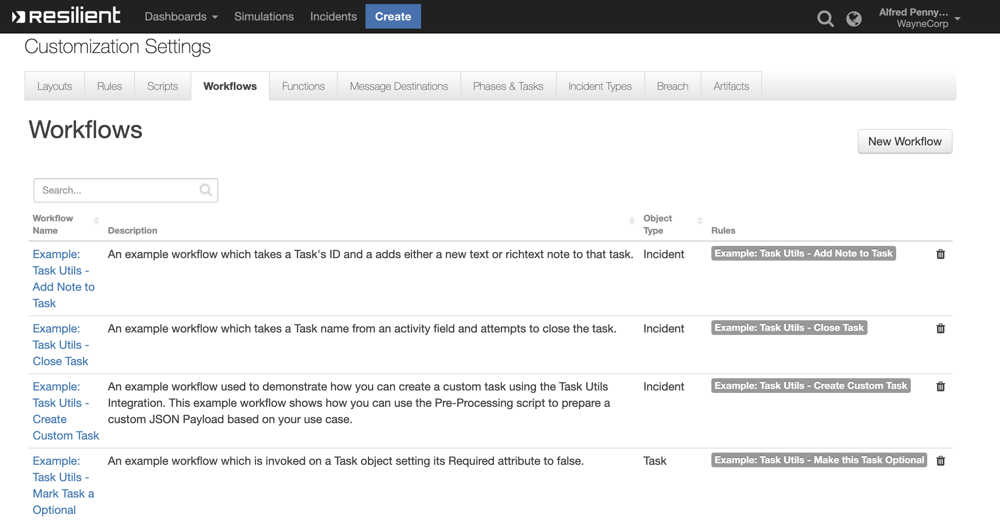

# IBM Resilient - Task Helper Functions
 
This Resilient Integration provides tools to improve interoperability between the different Object Types in Resilient. 

**This package contains 4 Functions, 4 Workflows and 4 Rules that help you orchestrate the creation, updating and closure of Tasks as a part of your SOAR plan**

 
## Table of Contents
 
- [IBM Resilient - Task Helper Functions](#ibm-resilient---task-helper-functions)
  - [Table of Contents](#table-of-contents)
- [app.config settings:](#appconfig-settings)
  - [Functions:](#functions)
  - [Task Utils - Add Note](#task-utils---add-note)
    - [Function Inputs:](#function-inputs)
    - [Function Output:](#function-output)
  - [Task Utils - Close Task](#task-utils---close-task)
    - [Function Inputs:](#function-inputs-1)
    - [Function Output:](#function-output-1)
  - [Task Utils - Create Custom Task](#task-utils---create-custom-task)
    - [Function Inputs:](#function-inputs-2)
    - [Function Output:](#function-output-2)
  - [Task Utils - Update Task](#task-utils---update-task)
    - [Function Inputs:](#function-inputs-3)
    - [Function Output:](#function-output-3)
  - [Rules:](#rules)

# app.config settings:

No app.config values are used for this integration. 

## Functions:

## Task Utils - Add Note

### Function Inputs:

| Input Name | Type | Required | Example | Info |
| ------------- | :--: | :-------:| ------- | ------- |
| `incident_id` | `Number` | Yes | `2105`  | ------- |
| `task_id` | `Number` | No | `221205` | ------- |
| `task_name` | `String` | No | `New Task` | ------- |
| `task_utils_note_type` | `Select` | No | `None` | `What type of note we are adding; html or text` |
| `task_utils_note_body` | `Text` | No | `None` | `The note content in a format specified by task_utils_note_type` |

### Function Output:

```python
results = {
        'content': {
                'task': {
                        'actions': [],
                        'children': [],
                        'comment_perms': {
                                'delete': True,
                                'update': True
                        },
                        'create_date': 1556530480087,
                        'id': 260,
                        'inc_id': 2095,
                        'inc_name': 'Test',
                        'inc_owner': 39,
                        'is_deleted': False,
                        'mentioned_users': [],
                        'modify_date': 1556530480087,
                        'modify_principal': {
                                'display_name': 'Alfred Pennyworth',
                                'id': 39,
                                'name': 'alfred@waynecorp.com',
                                'type': 'user'
                        },
                        'modify_user': {
                                'first_name': 'Alfred',
                                'id': 39,
                                'last_name': 'Pennyworth'
                        },
                        'parent_id': None,
                        'task_at_id': 89,
                        'task_custom': True,
                        'task_id': 2251224,
                        'task_members': None,
                        'task_name': 'Review the output and status of anti-virus '
                        'software',
                        'text': '<div>test</div>',
                        'type': 'task',
                        'user_fname': 'Alfred',
                        'user_id': 39,
                        'user_lname': 'Pennyworth',
                        'user_name': 'Alfred Pennyworth'
                },
                'task_notes': [{
                                'actions': [],
                                'children': [],
                                'comment_perms': {
                                        'delete': True,
                                        'update': True
                                },
                                'create_date': 1556530099314,
                                'id': 254,
                                'inc_id': 2095,
                                'inc_name': 'Test',
                                'inc_owner': 39,
                                'is_deleted': False,
                                'mentioned_users': [],
                                'modify_date': 1556530099314,
                                'modify_principal': {
                                        'display_name': 'Alfred '
                                        'Pennyworth',
                                        'id': 39,
                                        'name': 'alfred@waynecorp.com',
                                        'type': 'user'
                                },
                                'modify_user': {
                                        'first_name': 'Alfred',
                                        'id': 39,
                                        'last_name': 'Pennyworth'
                                },
                                'parent_id': None,
                                'task_at_id': 89,
                                'task_custom': True,
                                'task_id': 2251224,
                                'task_members': None,
                                'task_name': 'Review the output and status of '
                                'anti-virus software',
                                'text': '<div>test</div>',
                                'type': 'task',
                                'user_fname': 'Alfred',
                                'user_id': 39,
                                'user_lname': 'Pennyworth',
                                'user_name': 'Alfred Pennyworth'
                        },
                        {
                                'actions': [],
                                'children': [],
                                'comment_perms': {
                                        'delete': True,
                                        'update': True
                                },
                                'create_date': 1556530226631,
                                'id': 255,
                                'inc_id': 2095,
                                'inc_name': 'Test',
                                'inc_owner': 39,
                                'is_deleted': False,
                                'mentioned_users': [],
                                'modify_date': 1556530226631,
                                'modify_principal': {
                                        'display_name': 'Alfred '
                                        'Pennyworth',
                                        'id': 39,
                                        'name': 'alfred@waynecorp.com',
                                        'type': 'user'
                                },
                                'modify_user': {
                                        'first_name': 'Alfred',
                                        'id': 39,
                                        'last_name': 'Pennyworth'
                                },
                                'parent_id': None,
                                'task_at_id': 89,
                                'task_custom': True,
                                'task_id': 2251224,
                                'task_members': None,
                                'task_name': 'Review the output and status of '
                                'anti-virus software',
                                'text': '<div>test</div>',
                                'type': 'task',
                                'user_fname': 'Alfred',
                                'user_id': 39,
                                'user_lname': 'Pennyworth',
                                'user_name': 'Alfred Pennyworth'
                        },
                        {
                                'actions': [],
                                'children': [],
                                'comment_perms': {
                                        'delete': True,
                                        'update': True
                                },
                                'create_date': 1556530251278,
                                'id': 256,
                                'inc_id': 2095,
                                'inc_name': 'Test',
                                'inc_owner': 39,
                                'is_deleted': False,
                                'mentioned_users': [],
                                'modify_date': 1556530251278,
                                'modify_principal': {
                                        'display_name': 'Alfred '
                                        'Pennyworth',
                                        'id': 39,
                                        'name': 'alfred@waynecorp.com',
                                        'type': 'user'
                                },
                                'modify_user': {
                                        'first_name': 'Alfred',
                                        'id': 39,
                                        'last_name': 'Pennyworth'
                                },
                                'parent_id': None,
                                'task_at_id': 89,
                                'task_custom': True,
                                'task_id': 2251224,
                                'task_members': None,
                                'task_name': 'Review the output and status of '
                                'anti-virus software',
                                'text': '<div>test</div>',
                                'type': 'task',
                                'user_fname': 'Alfred',
                                'user_id': 39,
                                'user_lname': 'Pennyworth',
                                'user_name': 'Alfred Pennyworth'
                        },
                        {
                                'actions': [],
                                'children': [],
                                'comment_perms': {
                                        'delete': True,
                                        'update': True
                                },
                                'create_date': 1556530308580,
                                'id': 257,
                                'inc_id': 2095,
                                'inc_name': 'Test',
                                'inc_owner': 39,
                                'is_deleted': False,
                                'mentioned_users': [],
                                'modify_date': 1556530308580,
                                'modify_principal': {
                                        'display_name': 'Alfred '
                                        'Pennyworth',
                                        'id': 39,
                                        'name': 'alfred@waynecorp.com',
                                        'type': 'user'
                                },
                                'modify_user': {
                                        'first_name': 'Alfred',
                                        'id': 39,
                                        'last_name': 'Pennyworth'
                                },
                                'parent_id': None,
                                'task_at_id': 89,
                                'task_custom': True,
                                'task_id': 2251224,
                                'task_members': None,
                                'task_name': 'Review the output and status of '
                                'anti-virus software',
                                'text': '<div>test</div>',
                                'type': 'task',
                                'user_fname': 'Alfred',
                                'user_id': 39,
                                'user_lname': 'Pennyworth',
                                'user_name': 'Alfred Pennyworth'
                        },
                        {
                                'actions': [],
                                'children': [],
                                'comment_perms': {
                                        'delete': True,
                                        'update': True
                                },
                                'create_date': 1556530340701,
                                'id': 258,
                                'inc_id': 2095,
                                'inc_name': 'Test',
                                'inc_owner': 39,
                                'is_deleted': False,
                                'mentioned_users': [],
                                'modify_date': 1556530340701,
                                'modify_principal': {
                                        'display_name': 'Alfred '
                                        'Pennyworth',
                                        'id': 39,
                                        'name': 'alfred@waynecorp.com',
                                        'type': 'user'
                                },
                                'modify_user': {
                                        'first_name': 'Alfred',
                                        'id': 39,
                                        'last_name': 'Pennyworth'
                                },
                                'parent_id': None,
                                'task_at_id': 89,
                                'task_custom': True,
                                'task_id': 2251224,
                                'task_members': None,
                                'task_name': 'Review the output and status of '
                                'anti-virus software',
                                'text': '<div>test</div>',
                                'type': 'task',
                                'user_fname': 'Alfred',
                                'user_id': 39,
                                'user_lname': 'Pennyworth',
                                'user_name': 'Alfred Pennyworth'
                        },
                        {
                                'actions': [],
                                'children': [],
                                'comment_perms': {
                                        'delete': True,
                                        'update': True
                                },
                                'create_date': 1556530357543,
                                'id': 259,
                                'inc_id': 2095,
                                'inc_name': 'Test',
                                'inc_owner': 39,
                                'is_deleted': False,
                                'mentioned_users': [],
                                'modify_date': 1556530357543,
                                'modify_principal': {
                                        'display_name': 'Alfred '
                                        'Pennyworth',
                                        'id': 39,
                                        'name': 'alfred@waynecorp.com',
                                        'type': 'user'
                                },
                                'modify_user': {
                                        'first_name': 'Alfred',
                                        'id': 39,
                                        'last_name': 'Pennyworth'
                                },
                                'parent_id': None,
                                'task_at_id': 89,
                                'task_custom': True,
                                'task_id': 2251224,
                                'task_members': None,
                                'task_name': 'Review the output and status of '
                                'anti-virus software',
                                'text': '<div>test</div>',
                                'type': 'task',
                                'user_fname': 'Alfred',
                                'user_id': 39,
                                'user_lname': 'Pennyworth',
                                'user_name': 'Alfred Pennyworth'
                        },
                        {
                                'actions': [],
                                'children': [],
                                'comment_perms': {
                                        'delete': True,
                                        'update': True
                                },
                                'create_date': 1556530480087,
                                'id': 260,
                                'inc_id': 2095,
                                'inc_name': 'Test',
                                'inc_owner': 39,
                                'is_deleted': False,
                                'mentioned_users': [],
                                'modify_date': 1556530480087,
                                'modify_principal': {
                                        'display_name': 'Alfred '
                                        'Pennyworth',
                                        'id': 39,
                                        'name': 'alfred@waynecorp.com',
                                        'type': 'user'
                                },
                                'modify_user': {
                                        'first_name': 'Alfred',
                                        'id': 39,
                                        'last_name': 'Pennyworth'
                                },
                                'parent_id': None,
                                'task_at_id': 89,
                                'task_custom': True,
                                'task_id': 2251224,
                                'task_members': None,
                                'task_name': 'Review the output and status of '
                                'anti-virus software',
                                'text': '<div>test</div>',
                                'type': 'task',
                                'user_fname': 'Alfred',
                                'user_id': 39,
                                'user_lname': 'Pennyworth',
                                'user_name': 'Alfred Pennyworth'
                        }
                ]
        },
        'inputs': {
                'incident_id': 2095,
                'task_name': 'Review the output and status of anti-virus software',
                'task_utils_note_body': 'test',
                'task_utils_note_type': {
                        'id': 1800,
                        'name': 'text'
                }
        },
        'metrics': {
                'execution_time_ms': 800,
                'host': 'rg-mbp-18.galway.ie.ibm.com',
                'package': 'unknown',
                'package_version': 'unknown',
                'timestamp': '2019-04-29 10:34:40',
                'version': '1.0'
        },
        'raw': '<raw output of the payload>',
        'reason': None,
        'success': True,
        'version': '1.0'
}

```


## Task Utils - Close Task

### Function Inputs:

| Input Name | Type | Required | Example | Info |
| ------------- | :--: | :-------:| ------- | ------- |
| `incident_id` | `Number` | Yes | `2105`  | ------- |
| `task_id` | `Number` | No | `221205` | ------- |
| `task_name` | `String` | No | `Task Name` | `A Task name which can be supplied instead of task_id to search an incident for a task with that name` |

### Function Output:

```python
results = {
        'content': {
                'task_id': 2251208,
                'task_name': 'Interview key individuals'
        },
        'inputs': {
                'incident_id': 2095,
                'task_name': 'Interview key individuals'
        },
        'metrics': {
                'execution_time_ms': 832,
                'host': 'rg-mbp-18.galway.ie.ibm.com',
                'package': 'unknown',
                'package_version': 'unknown',
                'timestamp': '2019-04-29 10:38:41',
                'version': '1.0'
        },
        'raw': '{"task_id": 2251208, "task_name": "Interview key individuals"}',
        'reason': None,
        'success': True,
        'version': '1.0'
}

```


## Task Utils - Create Custom Task

### Function Inputs:

| Input Name | Type | Required | Example | Info |
| ------------- | :--: | :-------:| ------- | ------- |
| `incident_id` | `Number` | Yes | `2105`  | ------- |
| `task_name` | `String` | No | `Task Name` | ------- |
| `task_utils_payload` | `String` | No | `{"required": false}` | `A Dict which contains details about the new task. Refer to the TaskDTO object schema to understand what inputs can be supplied` |

### Function Output:

```python
results = {
        'content': {
                'task': {
                        'id': 2251231
                },
                'task_id': 2251231
        },
        'inputs': {
                'incident_id': 2095,
                'task_name': 'New Task',
                'task_utils_payload': {
                        'content': '{"phase_id":"Initial","required":true,"instr_text":"Close '
                        'out this required Task"}',
                        'format': 'text'
                }
        },
        'metrics': {
                'execution_time_ms': 708,
                'host': 'rg-mbp-18.galway.ie.ibm.com',
                'package': 'unknown',
                'package_version': 'unknown',
                'timestamp': '2019-04-29 10:37:17',
                'version': '1.0'
        },
        'raw': '{"task_id": 2251231, "task": {"id": 2251231}}',
        'reason': None,
        'success': True,
        'version': '1.0'
}

```


## Task Utils - Update Task

### Function Inputs:

| Input Name | Type | Required | Example | Info |
| ------------- | :--: | :-------:| ------- | ------- |
| `incident_id` | `Number` | Yes | `2105`  | ------- |
| `task_id` | `Number` | No | `221205` | ------- |
| `task_name` | `String` | No | `New Task` | ------- |
| `task_utils_payload` | `String` | No | `{"required": false}` | `A Dict which contains details about the new task. Refer to the TaskDTO object schema to understand what inputs can be supplied` |

### Function Output:

```python
results = {
        'content': {
                'task': {
                        'actions': [{
                                'enabled': True,
                                'id': 31,
                                'name': 'Task Utils: Make this Task '
                                'Optional'
                        }],
                        'active': True,
                        'at_id': 105,
                        'attachments_count': 0,
                        'auto_deactivate': True,
                        'cat_name': 'Engage',
                        'category_id': None,
                        'closed_date': None,
                        'creator': {
                                'cell': '',
                                'create_date': 1542899612421,
                                'display_name': 'Alfred Pennyworth',
                                'email': 'alfred@waynecorp.com',
                                'fname': 'Alfred',
                                'id': 39,
                                'is_external': False,
                                'last_login': 1556530476322,
                                'last_modified_time': 1556530476322,
                                'lname': 'Pennyworth',
                                'locked': False,
                                'password_changed': False,
                                'phone': '',
                                'status': 'A',
                                'title': ''
                        },
                        'creator_principal': {
                                'display_name': 'Alfred Pennyworth',
                                'id': 39,
                                'name': 'alfred@waynecorp.com',
                                'type': 'user'
                        },
                        'custom': True,
                        'description': None,
                        'due_date': None,
                        'form': None,
                        'frozen': False,
                        'id': 2251210,
                        'inc_id': 2095,
                        'inc_name': 'Test',
                        'inc_owner_id': 39,
                        'inc_training': False,
                        'init_date': 1556530018342,
                        'instr_text': 'Execute an initial triage of the '
                        'incident. Focus on determining '
                        'information such as: \n'
                        '<ul>\n'
                        '<li>is this an actual incident or false '
                        'alarm, </li>\n'
                        '<li>the scope and impact, </li>\n'
                        '<li> systems involved including '
                        'applications, operating systems, and '
                        'business and technical owners,</li>\n'
                        '<li>is the incident still ongoing, </li>\n'
                        '<li>has confidential or personal data '
                        'possibly been exposed or exfiltrated, '
                        '</li>\n'
                        '<li>has there been illegal activity, '
                        '</li>\n'
                        '<li>are employees involved, </li>\n'
                        '<li>have your communication systems been '
                        'compromised. </li>\n'
                        '</ul>\n'
                        'Add notes to this task capturing all of '
                        'your activities and initial findings. '
                        'Adjust the incident team membership to '
                        'include the necessary individuals and add '
                        'details to the incident description '
                        'including logistics around regularly '
                        'scheduled meetings, and so on.\n'
                        '<br /><br />\n'
                        'Note: If criminal or inappropriate '
                        'employee activity is involved, you should '
                        'consider ensuring that the appropriate '
                        'evidence collection and preservation '
                        'procedures are followed.',
                        'instructions': 'Execute an initial triage of the '
                        'incident. Focus on determining '
                        'information such as: \n'
                        '<ul>\n'
                        '<li>is this an actual incident or false '
                        'alarm, </li>\n'
                        '<li>the scope and impact, </li>\n'
                        '<li> systems involved including '
                        'applications, operating systems, and '
                        'business and technical owners,</li>\n'
                        '<li>is the incident still ongoing, '
                        '</li>\n'
                        '<li>has confidential or personal data '
                        'possibly been exposed or exfiltrated, '
                        '</li>\n'
                        '<li>has there been illegal activity, '
                        '</li>\n'
                        '<li>are employees involved, </li>\n'
                        '<li>have your communication systems '
                        'been compromised. </li>\n'
                        '</ul>\n'
                        'Add notes to this task capturing all of '
                        'your activities and initial findings. '
                        'Adjust the incident team membership to '
                        'include the necessary individuals and '
                        'add details to the incident description '
                        'including logistics around regularly '
                        'scheduled meetings, and so on.\n'
                        '<br /><br />\n'
                        'Note: If criminal or inappropriate '
                        'employee activity is involved, you '
                        'should consider ensuring that the '
                        'appropriate evidence collection and '
                        'preservation procedures are followed.',
                        'members': None,
                        'name': 'Initial Triage',
                        'notes': [],
                        'notes_count': 0,
                        'owner_fname': None,
                        'owner_id': None,
                        'owner_lname': None,
                        'perms': {
                                'assign': True,
                                'attach_file': True,
                                'change_members': True,
                                'close': True,
                                'comment': True,
                                'delete_attachments': True,
                                'read': True,
                                'read_attachments': True,
                                'write': True
                        },
                        'phase_id': 1010,
                        'private': None,
                        'regs': {},
                        'required': False,
                        'src_name': None,
                        'status': 'O',
                        'task_layout': [],
                        'user_notes': None
                },
                'task_id': 2251210
        },
        'inputs': {
                'incident_id': 2095,
                'task_id': 2251210,
                'task_utils_payload': {
                        'content': '{\n"required": false\n}',
                        'format': 'text'
                }
        },
        'metrics': {
                'execution_time_ms': 455,
                'host': 'rg-mbp-18.galway.ie.ibm.com',
                'package': 'unknown',
                'package_version': 'unknown',
                'timestamp': '2019-04-29 10:35:59',
                'version': '1.0'
        },
        'raw': '<raw output of the payload>',
        'reason': None,
        'success': True,
        'version': '1.0'
}

```

## Rules:
| Rule Name | Object Type | Workflow Triggered | Conditions |
| --------- | :---------: | ------------------ | ---------- |
| Example: Task Utils - Add Note to Task | `Incident` | `task_utils_add_note_to_task` | None |
| Example: Task Utils - Close Task | `Incident` | `task_utils_close_task` | None |
| Example: Task Utils - Create Custom Task | `Incident` | `task_utils_create_custom_task` | None |
| Example: Task Utils - Make this Task Optional | `Task` | `task_utils_mark_task_optional` | None |
