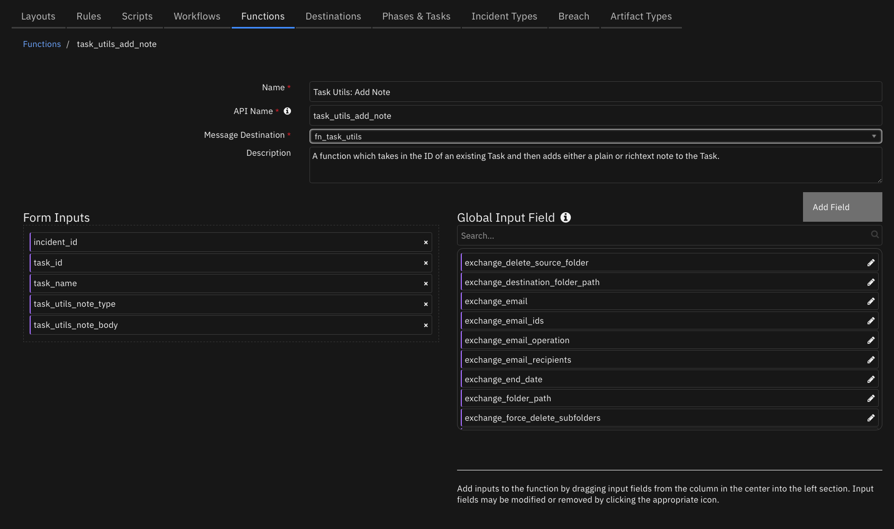
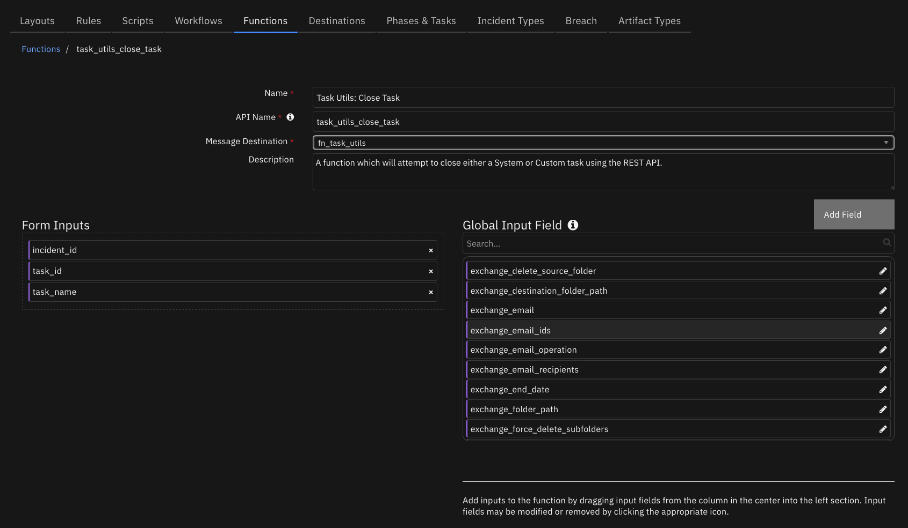
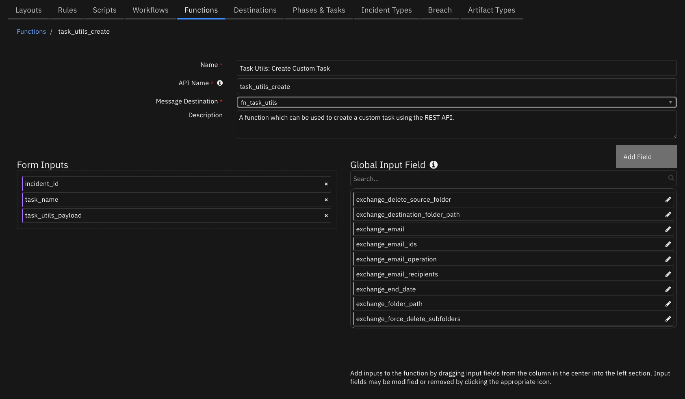
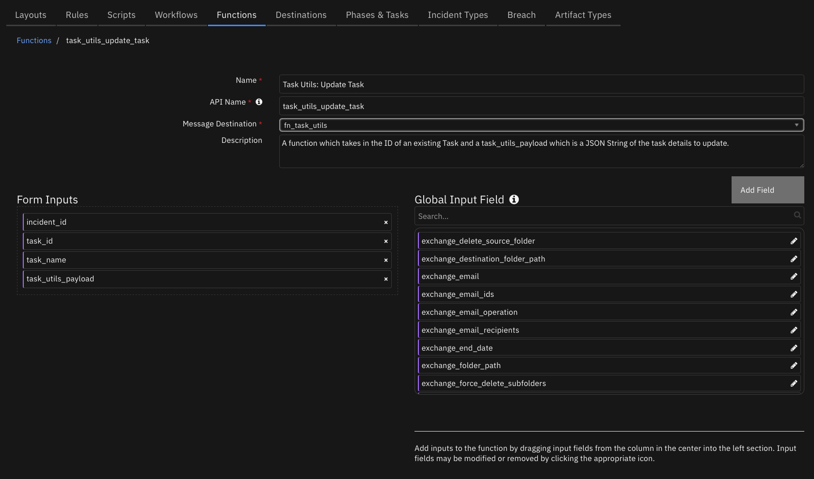

<!--
  This README.md is generated by running:
  "resilient-sdk docgen -p fn_task_utils"

  This file was generated with resilient-sdk v51.0.6.0.1543

  It is best edited using a Text Editor with a Markdown Previewer. VS Code
  is a good example. Checkout https://guides.github.com/features/mastering-markdown/
  for tips on writing with Markdown

  All fields followed by "::CHANGE_ME::"" should be manually edited

  If you make manual edits and run docgen again, a .bak file will be created

  Store any screenshots in the "doc/screenshots" directory and reference them like:
  

  NOTE: If your app is available in the container-format only, there is no need to mention the integration server in this readme.
-->

# Task Utilities Function for SOAR


## Table of Contents
- [Release Notes](#release-notes)
- [Overview](#overview)
  - [Key Features](#key-features)
- [Requirements](#requirements)
  - [SOAR platform](#soar-platform)
  - [Cloud Pak for Security](#cloud-pak-for-security)
  - [Proxy Server](#proxy-server)
  - [Python Environment](#python-environment)
- [Installation](#installation)
  - [Install](#install)
  - [App Configuration](#app-configuration)
- [Function - Task Utils: Add Note](#function---task-utils-add-note)
- [Function - Task Utils: Close Task](#function---task-utils-close-task)
- [Function - Task Utils: Create Custom Task](#function---task-utils-create-custom-task)
- [Function - Task Utils: Update Task](#function---task-utils-update-task)
- [Playbooks](#playbooks)
- [Troubleshooting & Support](#troubleshooting--support)

---

## Release Notes
<!--
  Specify all changes in this release. Do not remove the release
  notes of a previous release
-->
| Version | Date | Notes |
| ------- | ---- | ----- |
| 1.1.0 | 06/2025 | Added support for including user information executing the playbook in a task notes (Refer: [App Configuration](#app-configuration) for more information); converted workflows to playbooks |
| 1.0.3 | 03/2025 | Converted example workflows to python3 |
| 1.0.2   | 2/2021 | Updated api key permissions for creating a task in App Host |
| 1.0.1   | 6/2020 | Support added for App Host  |
| 1.0.0   | 6/2019 | Initial release | 

---

## Overview
<!--
  Provide a high-level description of the function itself and its remote software or application.
  The text below is parsed from the "description" and "long_description" attributes in the setup.py file
-->
**Resilient Circuits Components for 'fn_task_utils'**

 

Resilient Circuits Components which can be used to manipulate existing tasks or create new ones. Provides functions which can be integrated as part of a custom playbook.

### Key Features
<!--
  List the Key Features of the Integration
-->
* Create or Update tasks as a part of playbook.
* Add Notes to tasks from an integration to provide updates as actions are performed
* Ability to close either System or Custom tasks

---

## Requirements
<!--
  List any Requirements
-->
This app supports the IBM Security QRadar SOAR Platform and the IBM Security QRadar SOAR for IBM Cloud Pak for Security.

### SOAR platform
The SOAR platform supports two app deployment mechanisms, Edge Gateway (also known as App Host) and integration server.

If deploying to a SOAR platform with an App Host, the requirements are:
* SOAR platform >= `51.0.0.0.9339`.
* The app is in a container-based format (available from the AppExchange as a `zip` file).

If deploying to a SOAR platform with an integration server, the requirements are:
* SOAR platform >= `51.0.0.0.9339`.
* The app is in the older integration format (available from the AppExchange as a `zip` file which contains a `tar.gz` file).
* Integration server is running `resilient_circuits>=51.0.0`.
* If using an API key account, make sure the account provides the following minimum permissions:
  | Name | Permissions |
  | ---- | ----------- |
  | Org Data | Read |
  | Function | Read |

The following SOAR platform guides provide additional information:
* _Edge Gateway Deployment Guide_ or _App Host Deployment Guide_: provides installation, configuration, and troubleshooting information, including proxy server settings.
* _Integration Server Guide_: provides installation, configuration, and troubleshooting information, including proxy server settings.
* _System Administrator Guide_: provides the procedure to install, configure and deploy apps.

The above guides are available on the IBM Documentation website at [ibm.biz/soar-docs](https://ibm.biz/soar-docs). On this web page, select your SOAR platform version. On the follow-on page, you can find the _Edge Gateway Deployment Guide_, _App Host Deployment Guide_, or _Integration Server Guide_ by expanding **Apps** in the Table of Contents pane. The System Administrator Guide is available by expanding **System Administrator**.

### Cloud Pak for Security
If you are deploying to IBM Cloud Pak for Security, the requirements are:
* IBM Cloud Pak for Security >= `1.10.15`.
* Cloud Pak is configured with an Edge Gateway.
* The app is in a container-based format (available from the AppExchange as a `zip` file).

The following Cloud Pak guides provide additional information:
* _Edge Gateway Deployment Guide_ or _App Host Deployment Guide_: provides installation, configuration, and troubleshooting information, including proxy server settings. From the Table of Contents, select Case Management and Orchestration & Automation > **Orchestration and Automation Apps**.
* _System Administrator Guide_: provides information to install, configure, and deploy apps. From the IBM Cloud Pak for Security IBM Documentation table of contents, select Case Management and Orchestration & Automation > **System administrator**.

These guides are available on the IBM Documentation website at [ibm.biz/cp4s-docs](https://ibm.biz/cp4s-docs). From this web page, select your IBM Cloud Pak for Security version. From the version-specific IBM Documentation page, select Case Management and Orchestration & Automation.

### Proxy Server
The app **does** support a proxy server.

### Python Environment
Python 3.9, 3.11, and 3.12 are officially supported. When deployed as an app, the app runs on Python 3.11.
Additional package dependencies may exist for each of these packages:
* resilient-lib>=51.0.0
* resilient_circuits>=51.0.0
---

## Installation

### Install
* To install or uninstall an App or Integration on the _SOAR platform_, see the documentation at [ibm.biz/soar-docs](https://ibm.biz/soar-docs).
* To install or uninstall an App on _IBM Cloud Pak for Security_, see the documentation at [ibm.biz/cp4s-docs](https://ibm.biz/cp4s-docs) and follow the instructions above to navigate to Orchestration and Automation.

### App Configuration
The following table provides the settings you need to configure the app. These settings are made in the app.config file. See the documentation discussed in the Requirements section for the procedure.

| Config | Required | Example | Description |
| ------ | :------: | ------- | ----------- |
| **add_user_info_to_note** | No | `False` | *(Included in v1.1.0) Set this to true to automatically include the user's name and email to task note* |
 ---

## Function - Task Utils: Add Note
A function which takes in the ID of an existing Task and then adds either a plain or richtext note to the Task.

  

<details><summary>Inputs:</summary>
<p>

| Name | Type | Required | Example | Tooltip |
| ---- | :--: | :------: | ------- | ------- |
| `incident_id` | `number` | Yes | `-` | - |
| `task_id` | `number` | No | `-` | - |
| `task_name` | `text` | No | `-` | - |
| `task_utils_note_body` | `text` | No | `-` | A Text field used to specify the note that will be added to a given Task. Accepts text or html and is parsed based on the result of task_utils_note_type. Default is text |
| `task_utils_note_type` | `select` | Yes | `-` | A field used to specify where the field task_utils_note_body is plaintext or html. |

</p>
</details>

<details><summary>Outputs:</summary>
<p>

> **NOTE:** This example might be in JSON format, but `results` is a Python Dictionary on the SOAR platform.

```python
results = {
  "content": {
    "task_note": {
      "actions": [],
      "children": [],
      "comment_perms": {
        "delete": true,
        "update": true
      },
      "create_date": 1751637194035,
      "id": 298,
      "inc_id": 2117,
      "inc_name": "Test_task_utils",
      "inc_owner": 5,
      "is_deleted": false,
      "mentioned_users": [],
      "modify_date": 1751637194035,
      "modify_principal": {
        "display_name": "admin example",
        "id": 5,
        "name": "admin@example.com",
        "type": "user"
      },
      "modify_user": {
        "first_name": "admin",
        "id": 5,
        "last_name": "example"
      },
      "parent_id": null,
      "playbooks": [],
      "task_at_id": null,
      "task_custom": true,
      "task_id": 302,
      "task_members": null,
      "task_name": "Sample_task",
      "text": "\u003cdiv\u003eadmin example (admin\u0026#x40;example.com) added a note:\u003cbr/\u003etest\u003c/div\u003e",
      "type": "task",
      "user_fname": "admin",
      "user_id": 5,
      "user_lname": "example",
      "user_name": "admin example"
    }
  },
  "inputs": {
    "incident_id": 2117,
    "task_name": "Sample_task",
    "task_utils_note_body": "test",
    "task_utils_note_type": {
      "id": 302,
      "name": "text"
    }
  },
  "metrics": {
    "execution_time_ms": 1808,
    "host": "my.app.host",
    "package": "unknown",
    "package_version": "unknown",
    "timestamp": "2025-07-04 14:53:15",
    "version": "1.0"
  },
  "raw": "",
  "reason": null,
  "success": true,
  "version": "1.0"
}
```

</p>
</details>

<details><summary>Example Function Input Script:</summary>
<p>

```python
inputs.incident_id = incident.id 
inputs.task_name = playbook.inputs.task_utils_task_name
inputs.task_utils_note_type = "text"  #html or text
inputs.task_utils_note_body = "Test body"
```

</p>
</details>

<details><summary>Example Function Post Process Script:</summary>
<p>

```python
results = playbook.functions.results.task_note_result
```

</p>
</details>

---
## Function - Task Utils: Close Task
A function which will attempt to close either a System or Custom task using the REST API.

 

<details><summary>Inputs:</summary>
<p>

| Name | Type | Required | Example | Tooltip |
| ---- | :--: | :------: | ------- | ------- |
| `incident_id` | `number` | Yes | `-` | - |
| `task_id` | `number` | No | `-` | - |
| `task_name` | `text` | No | `-` | - |

</p>
</details>

<details><summary>Outputs:</summary>
<p>

> **NOTE:** This example might be in JSON format, but `results` is a Python Dictionary on the SOAR platform.

```python
results = {
  "content": {
    "task_id": 302,
    "task_name": "Sample_task"
  },
  "inputs": {
    "incident_id": 2117,
    "task_name": "Sample_task"
  },
  "metrics": {
    "execution_time_ms": 1815,
    "host": "my.app.host",
    "package": "unknown",
    "package_version": "unknown",
    "timestamp": "2025-07-04 14:54:21",
    "version": "1.0"
  },
  "raw": "",
  "reason": null,
  "success": true,
  "version": "1.0"
}
```

</p>
</details>

<details><summary>Example Function Input Script:</summary>
<p>

```python
inputs.incident_id = incident.id
inputs.task_name = playbook.inputs.task_utils_task_name
```

</p>
</details>

<details><summary>Example Function Post Process Script:</summary>
<p>

```python
results = playbook.functions.results.task_close_result

if results:
  note_text = f"<b> Task Utils: Close Task - Example (PB): </b> Task: {playbook.inputs.task_utils_task_name} closed successfully"
else:
  note_text = f"<b> Task Utils: Close Task - Example (PB): </b> Failed: {results.reason}"
  
incident.addNote(note_text)
```

</p>
</details>

---
## Function - Task Utils: Create Custom Task
A function which can be used to create a custom task using the REST API.

 

<details><summary>Inputs:</summary>
<p>

| Name | Type | Required | Example | Tooltip |
| ---- | :--: | :------: | ------- | ------- |
| `incident_id` | `number` | Yes | `-` | - |
| `task_name` | `text` | No | `-` | - |
| `task_utils_payload` | `textarea` | No | `-` | A JSON Object which may contain the Phase, Instruction Set or Assigned User values for a new task |

</p>
</details>

<details><summary>Outputs:</summary>
<p>

> **NOTE:** This example might be in JSON format, but `results` is a Python Dictionary on the SOAR platform.

```python
results = {
  "content": {
    "task": {
      "id": 302
    }
  },
  "inputs": {
    "incident_id": 2117,
    "task_name": "Sample_task",
    "task_utils_payload": {
      "content": "{\"required\": true, \"instr_text\": \"Close out this required Task\", \"phase_id\": \"Initial\"}",
      "format": "text"
    }
  },
  "metrics": {
    "execution_time_ms": 2695,
    "host": "my.app.host",
    "package": "unknown",
    "package_version": "unknown",
    "timestamp": "2025-07-04 14:52:26",
    "version": "1.0"
  },
  "raw": "",
  "reason": null,
  "success": true,
  "version": "1.0"
}
```

</p>
</details>

<details><summary>Example Function Input Script:</summary>
<p>

```python
from json import dumps

# Take the incident id from this incident
inputs.incident_id = incident.id

# If you specified a value in the Activity Field then use it for task_name
if playbook.inputs.task_utils_task_name:
    inputs.task_name = playbook.inputs.task_utils_task_name

payload = {
    "required": True,
    "instr_text": "Close out this required Task",
    "phase_id": "Initial"
}

inputs.task_utils_payload = dumps(payload)

```

</p>
</details>

<details><summary>Example Function Post Process Script:</summary>
<p>

```python
results = playbook.functions.results.create_task_result

if results.success:
  note_text = f"<b>Task Utils: Create Custom Task - Example (PB):</b> {playbook.inputs.task_utils_task_name} created sucessfully"
else:
  note_text = f"<b>Task Utils: Create Custom Task - Example (PB):</b> Failed: {results.reason}"
  
incident.addNote(note_text)
```

</p>
</details>

---
## Function - Task Utils: Update Task
A function which takes in the ID of an existing Task and a task_utils_payload which is a JSON String of the task details to update.

 

<details><summary>Inputs:</summary>
<p>

| Name | Type | Required | Example | Tooltip |
| ---- | :--: | :------: | ------- | ------- |
| `incident_id` | `number` | Yes | `-` | - |
| `task_id` | `number` | No | `-` | - |
| `task_name` | `text` | No | `-` | - |
| `task_utils_payload` | `textarea` | No | `-` | A JSON Object which may contain the Phase, Instruction Set or Assigned User values for a new task |

</p>
</details>

<details><summary>Outputs:</summary>
<p>

> **NOTE:** This example might be in JSON format, but `results` is a Python Dictionary on the SOAR platform.

```python
results = {
  "content": {
    "task": {
      "actions": [
        {
          "enabled": true,
          "id": 121,
          "name": "Example: Task Utils - Make this Task Optional"
        }
      ],
      "active": true,
      "at_id": null,
      "attachments_count": 0,
      "auto_deactivate": true,
      "cat_name": "Initial",
      "category_id": null,
      "closed_date": null,
      "creator_principal": {
        "display_name": "admin example",
        "id": 5,
        "name": "admin@example.com",
        "type": "user"
      },
      "custom": true,
      "description": null,
      "due_date": null,
      "form": null,
      "frozen": false,
      "id": 302,
      "inc_id": 2117,
      "inc_name": "Test_task_utils",
      "inc_owner_id": 5,
      "inc_training": false,
      "init_date": 1751637144637,
      "instr_text": "Close out this required Task",
      "instructions": "Close out this required Task",
      "members": null,
      "name": "Sample_task",
      "notes": [],
      "notes_count": 1,
      "owner_fname": null,
      "owner_id": null,
      "owner_lname": null,
      "perms": {
        "assign": true,
        "attach_file": true,
        "change_header": false,
        "change_members": true,
        "close": true,
        "comment": true,
        "delete_attachments": true,
        "read": true,
        "read_attachments": true,
        "write": true
      },
      "phase_id": 1009,
      "playbooks": [
        {
          "display_name": "Task Utils: Mark Task as Optional - Example (PB)",
          "playbook_handle": 53
        }
      ],
      "private": null,
      "regs": {},
      "required": false,
      "src_name": null,
      "status": "O",
      "task_layout": [],
      "timeframe_name": null,
      "user_notes": null
    },
    "task_id": 302
  },
  "inputs": {
    "incident_id": 2117,
    "task_id": 302,
    "task_name": "Sample_task",
    "task_utils_payload": {
      "content": "{\"required\": false}",
      "format": "text"
    }
  },
  "metrics": {
    "execution_time_ms": 2105,
    "host": "my.app.host",
    "package": "unknown",
    "package_version": "unknown",
    "timestamp": "2025-07-04 14:53:51",
    "version": "1.0"
  },
  "raw": "",
  "reason": null,
  "success": true,
  "version": "1.0"
}
```

</p>
</details>

<details><summary>Example Function Input Script:</summary>
<p>

```python
from json import dumps

inputs.task_id = task.id
inputs.incident_id = incident.id
inputs.task_name = task.name

payload = {
"required": False
}
inputs.task_utils_payload = dumps(payload)
```

</p>
</details>

<details><summary>Example Function Post Process Script:</summary>
<p>

```python
results = playbook.functions.results.task_as_optional_result

if results:
  note_text = f"<b> Task Utils: Mark Task as Optional - Example (PB):</b> Task: {task.name} marked as optinal"
else:
  note_text = f"<b> Task Utils: Mark Task as Optional - Example (PB):</b> Failed: {results.reason}"
  
task.addNote(note_text)
```

</p>
</details>

---


## Playbooks
| Playbook Name | Description | Activation Type | Object | Status | Condition | 
| ------------- | ----------- | --------------- | ------ | ------ | --------- | 
| Task Utils: Add Note To Task - Example (PB) | An example playbook which takes a task's name and adds either a new text or richtext note to that task. | Manual | incident | `enabled` | `-` | 
| Task Utils: Close Task - Example (PB) | An example playbook which takes a task name from an activity field and attempts to close the task. | Manual | incident | `enabled` | `-` | 
| Task Utils: Create Custom Task - Example (PB) | An example playbook used to demonstrate how you can create a custom task using the Task Utils Integration. This example playbook shows how you can use the Pre-Processing script to prepare a custom JSON Payload based on your use case. | Manual | incident | `enabled` | `-` | 
| Task Utils: Mark Task as Optional - Example (PB) | An example playbook to make task optional | Manual | task | `enabled` | `-` | 

---


## Troubleshooting & Support
Refer to the documentation listed in the Requirements section for troubleshooting information.
 
### For Support
This is a IBM Community provided app. Please search the Community [ibm.biz/soarcommunity](https://ibm.biz/soarcommunity) for assistance.
