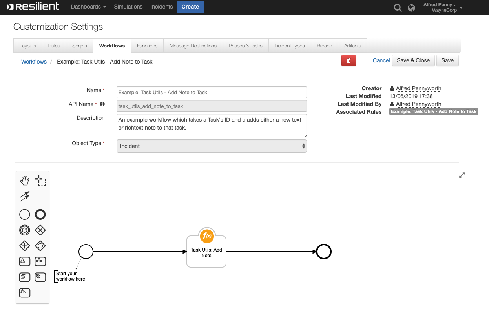
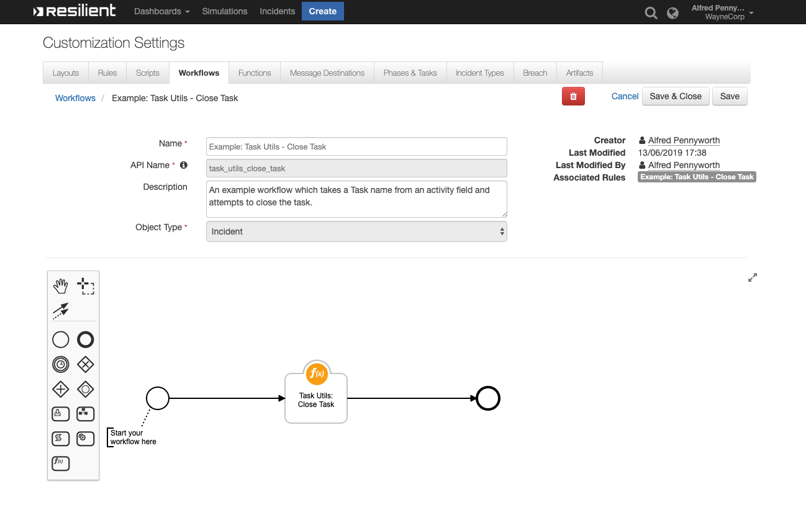
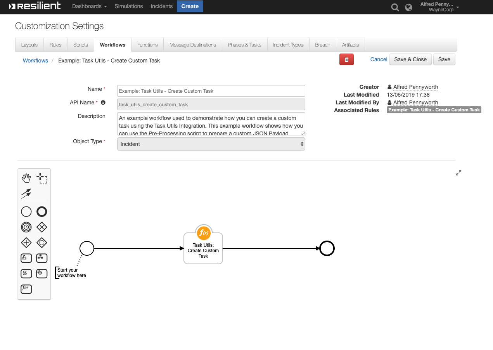
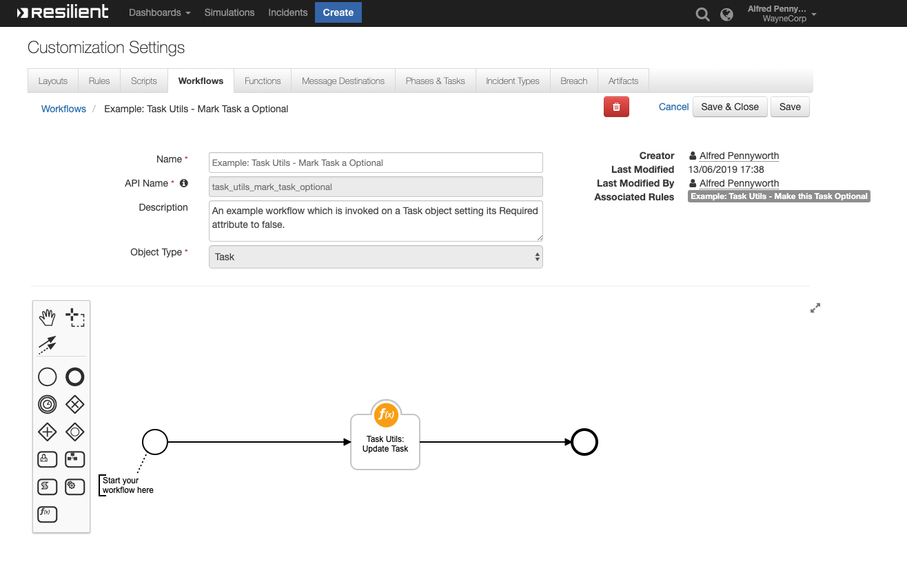

<!-- This file is generated by running resilient-circuits docgen -->
# **User Guide:** fn_task_utils_v1.0.0

## Table of Contents
- [**User Guide:** fn_task_utils_v1.0.0](#user-guide-fntaskutilsv100)
  - [Table of Contents](#table-of-contents)
  - [App Config Settings:](#app-config-settings)
  - [Function - Task Utils: Add Note](#function---task-utils-add-note)
  - [Function - Task Utils: Close Task](#function---task-utils-close-task)
  - [Function - Task Utils: Create Custom Task](#function---task-utils-create-custom-task)
  - [Function - Task Utils: Update Task](#function---task-utils-update-task)
  - [Rules](#rules)

---
## App Config Settings:
```
None
```
---
## Function - Task Utils: Add Note
A function which takes in the ID of an existing Task and then adds either a plain or richtext note to the Task.

 

<details><summary>Inputs:</summary>
<p>

| Name | Type | Required | Example | Description |
| ---- | :--: | :------: | ------- | ----------- |
| `incident_id` | `number` | No | `-` | - |
| `task_id` | `number` | No | `-` | - |
| `task_name` | `text` | No | `-` | - |
| `task_utils_note_type` | `select` | No | `-` | A field used to specify where the field task_utils_note_body is plaintext or html. |
| `task_utils_note_body` | `text` | No | `-` | A Text field used to specify the note that will be added to a given Task. Accepts text or html and is parsed based on the result of task_utils_note_type. Default is text |

</p>
</details>

<details><summary>Outputs:</summary>
<p>

```python
results = {
        'content': {
                'task': {
                        'actions': [],
                        'children': [],
                        'comment_perms': {
                                'delete': True,
                                'update': True
                        },
                        'create_date': 1556530480087,
                        'id': 260,
                        'inc_id': 2095,
                        'inc_name': 'Test',
                        'inc_owner': 39,
                        'is_deleted': False,
                        'mentioned_users': [],
                        'modify_date': 1556530480087,
                        'modify_principal': {
                                'display_name': 'Resilient Sysadmin',
                                'id': 39,
                                'name': 'ryan@example.com',
                                'type': 'user'
                        },
                        'modify_user': {
                                'first_name': 'Resilient',
                                'id': 39,
                                'last_name': 'Sysadmin'
                        },
                        'parent_id': None,
                        'task_at_id': 89,
                        'task_custom': True,
                        'task_id': 2251224,
                        'task_members': None,
                        'task_name': 'Review the output and status of anti-virus '
                        'software',
                        'text': '<div>test</div>',
                        'type': 'task',
                        'user_fname': 'Resilient',
                        'user_id': 39,
                        'user_lname': 'Sysadmin',
                        'user_name': 'Resilient Sysadmin'
                },
                'task_notes': [{
                                'actions': [],
                                'children': [],
                                'comment_perms': {
                                        'delete': True,
                                        'update': True
                                },
                                'create_date': 1556530099314,
                                'id': 254,
                                'inc_id': 2095,
                                'inc_name': 'Test',
                                'inc_owner': 39,
                                'is_deleted': False,
                                'mentioned_users': [],
                                'modify_date': 1556530099314,
                                'modify_principal': {
                                        'display_name': 'Resilient '
                                        'Sysadmin',
                                        'id': 39,
                                        'name': 'ryan@example.com',
                                        'type': 'user'
                                },
                                'modify_user': {
                                        'first_name': 'Resilient',
                                        'id': 39,
                                        'last_name': 'Pennyworth'
                                },
                                'parent_id': None,
                                'task_at_id': 89,
                                'task_custom': True,
                                'task_id': 2251224,
                                'task_members': None,
                                'task_name': 'Review the output and status of '
                                'anti-virus software',
                                'text': '<div>test</div>',
                                'type': 'task',
                                'user_fname': 'Resilient',
                                'user_id': 39,
                                'user_lname': 'Sysadmin',
                                'user_name': 'Resilient Sysadmin'
                        }
                ]
        },
        'inputs': {
                'incident_id': 2095,
                'task_name': 'Review the output and status of anti-virus software',
                'task_utils_note_body': 'test',
                'task_utils_note_type': {
                        'id': 1800,
                        'name': 'text'
                }
        },
        'metrics': {
                'execution_time_ms': 800,
                'host': 'rg-mbp-18.galway.ie.ibm.com',
                'package': 'unknown',
                'package_version': 'unknown',
                'timestamp': '2019-04-29 10:34:40',
                'version': '1.0'
        },
        'raw': '<raw output of the payload>',
        'reason': None,
        'success': True,
        'version': '1.0'
}
```

</p>
</details>

<details><summary>Example Pre-Process Script:</summary>
<p>

```python
inputs.incident_id = incident.id 
```

</p>
</details>

<details><summary>Example Post-Process Script:</summary>
<p>

```python
None
```

</p>
</details>

---
## Function - Task Utils: Close Task
A function which will attempt to close either a System or Custom task using the REST API.

 

<details><summary>Inputs:</summary>
<p>

| Name | Type | Required | Example | Description |
| ---- | :--: | :------: | ------- | ----------- |
| `incident_id` | `number` | No | `-` | - |
| `task_id` | `number` | No | `-` | - |
| `task_name` | `text` | No | `-` | - |

</p>
</details>

<details><summary>Outputs:</summary>
<p>

```python
results = {
        'content': {
                'task_id': 2251208,
                'task_name': 'Interview key individuals'
        },
        'inputs': {
                'incident_id': 2095,
                'task_name': 'Interview key individuals'
        },
        'metrics': {
                'execution_time_ms': 832,
                'host': 'rg-mbp-18.galway.ie.ibm.com',
                'package': 'unknown',
                'package_version': 'unknown',
                'timestamp': '2019-04-29 10:38:41',
                'version': '1.0'
        },
        'raw': '{"task_id": 2251208, "task_name": "Interview key individuals"}',
        'reason': None,
        'success': True,
        'version': '1.0'
}
```

</p>
</details>

<details><summary>Example Pre-Process Script:</summary>
<p>

```python
inputs.incident_id = incident.id
inputs.task_name = rule.properties.task_utils_task_name
```

</p>
</details>

<details><summary>Example Post-Process Script:</summary>
<p>

```python
None
```

</p>
</details>

---
## Function - Task Utils: Create Custom Task
A function which can be used to create a custom task using the REST API.

 

<details><summary>Inputs:</summary>
<p>

| Name | Type | Required | Example | Description |
| ---- | :--: | :------: | ------- | ----------- |
| `incident_id` | `number` | No | `-` | - |
| `task_name` | `text` | No | `-` | - |
| `task_utils_payload` | `textarea` | No | `-` | A JSON Object which may contain the Phase, Instruction Set or Assigned User values for a new task |

</p>
</details>

<details><summary>Outputs:</summary>
<p>

```python
results = {
        'content': {
                'task': {
                        'id': 2251231
                },
                'task_id': 2251231
        },
        'inputs': {
                'incident_id': 2095,
                'task_name': 'New Task',
                'task_utils_payload': {
                        'content': '{"phase_id":"Initial","required":true,"instr_text":"Close '
                        'out this required Task"}',
                        'format': 'text'
                }
        },
        'metrics': {
                'execution_time_ms': 708,
                'host': 'rg-mbp-18.galway.ie.ibm.com',
                'package': 'unknown',
                'package_version': 'unknown',
                'timestamp': '2019-04-29 10:37:17',
                'version': '1.0'
        },
        'raw': '{"task_id": 2251231, "task": {"id": 2251231}}',
        'reason': None,
        'success': True,
        'version': '1.0'
}
```

</p>
</details>

<details><summary>Example Pre-Process Script:</summary>
<p>

```python
#######################################
### Define pre-processing functions ###
#######################################
payload = {
"required": True,
"instr_text": "Close out this required Task",
"phase_id": "Initial"
}

def dict_to_json_str(d):
  """Function that converts a dictionary into a JSON stringself.
     Supports basestring, bool and int.
     If the value is None, it sets it to False"""

  json_str = '"{ {0} }"'
  json_entry = '"{0}":{1}'
  json_entry_str = '"{0}":"{1}"'
  entries = [] 
  
  for entry in d:
    key = entry
    value = d[entry]
    
      
    if value is None:
      value = False
      
    
    if isinstance(value, basestring):
      entries.append(json_entry_str.format(key, value))
    
    elif isinstance(value, bool):
      value = 'true' if value == True else 'false'
      entries.append(json_entry.format(key, value))
    
    else:
      entries.append(json_entry.format(key, value))
  
  return '{' + ','.join(entries) + '}'

# If you don't already have something in task_utils_payload
if inputs.task_utils_payload != None: 
  # prepare a JSON payload using above code; 
  inputs.task_utils_payload = dict_to_json_str(payload)

# Take the incident id from this incident
inputs.incident_id = incident.id

# If you specified a value in the Activity Field then use it for task_name
if rule.properties.task_utils_task_name != None:
  inputs.task_name = rule.properties.task_utils_task_name
```

</p>
</details>

<details><summary>Example Post-Process Script:</summary>
<p>

```python
None
```

</p>
</details>

---
## Function - Task Utils: Update Task
A function which takes in the ID of an existing Task and a task_utils_payload which is a JSON String of the task details to update.

 

<details><summary>Inputs:</summary>
<p>

| Name | Type | Required | Example | Description |
| ---- | :--: | :------: | ------- | ----------- |
| `incident_id` | `number` | No | `-` | - |
| `task_id` | `number` | No | `-` | - |
| `task_name` | `text` | No | `-` | - |
| `task_utils_payload` | `textarea` | No | `-` | A JSON Object which may contain the Phase, Instruction Set or Assigned User values for a new task |

</p>
</details>

<details><summary>Outputs:</summary>
<p>

```python
results = {
        'content': {
                'task': {
                        'actions': [{
                                'enabled': True,
                                'id': 31,
                                'name': 'Task Utils: Make this Task '
                                'Optional'
                        }],
                        'active': True,
                        'at_id': 105,
                        'attachments_count': 0,
                        'auto_deactivate': True,
                        'cat_name': 'Engage',
                        'category_id': None,
                        'closed_date': None,
                        'creator': {
                                'cell': '',
                                'create_date': 1542899612421,
                                'display_name': 'Resilient Sysadmin',
                                'email': 'ryan@example.com',
                                'fname': 'Resilient',
                                'id': 39,
                                'is_external': False,
                                'last_login': 1556530476322,
                                'last_modified_time': 1556530476322,
                                'lname': 'Sysadmin',
                                'locked': False,
                                'password_changed': False,
                                'phone': '',
                                'status': 'A',
                                'title': ''
                        },
                        'creator_principal': {
                                'display_name': 'Resilient Sysadmin',
                                'id': 39,
                                'name': 'ryan@example.com',
                                'type': 'user'
                        },
                        'custom': True,
                        'description': None,
                        'due_date': None,
                        'form': None,
                        'frozen': False,
                        'id': 2251210,
                        'inc_id': 2095,
                        'inc_name': 'Test',
                        'inc_owner_id': 39,
                        'inc_training': False,
                        'init_date': 1556530018342,
                        'instr_text': 'Execute an initial triage of the '
                        'incident.',
                        'members': None,
                        'name': 'Initial Triage',
                        'notes': [],
                        'notes_count': 0,
                        'owner_fname': None,
                        'owner_id': None,
                        'owner_lname': None,
                        'perms': {
                                'assign': True,
                                'attach_file': True,
                                'change_members': True,
                                'close': True,
                                'comment': True,
                                'delete_attachments': True,
                                'read': True,
                                'read_attachments': True,
                                'write': True
                        },
                        'phase_id': 1010,
                        'private': None,
                        'regs': {},
                        'required': False,
                        'src_name': None,
                        'status': 'O',
                        'task_layout': [],
                        'user_notes': None
                },
                'task_id': 2251210
        },
        'inputs': {
                'incident_id': 2095,
                'task_id': 2251210,
                'task_utils_payload': {
                        'content': '{\n"required": false\n}',
                        'format': 'text'
                }
        },
        'metrics': {
                'execution_time_ms': 455,
                'host': 'rg-mbp-18.galway.ie.ibm.com',
                'package': 'unknown',
                'package_version': 'unknown',
                'timestamp': '2019-04-29 10:35:59',
                'version': '1.0'
        },
        'raw': '<raw output of the payload>',
        'reason': None,
        'success': True,
        'version': '1.0'
}
```

</p>
</details>

<details><summary>Example Pre-Process Script:</summary>
<p>

```python
inputs.task_id = task.id
inputs.incident_id = incident.id

```

</p>
</details>

<details><summary>Example Post-Process Script:</summary>
<p>

```python
None
```

</p>
</details>

---


## Rules
| Rule Name | Object | Workflow Triggered |
| --------- | ------ | ------------------ |
| **Example: Task Utils - Add Note to Task** | incident | `task_utils_add_note_to_task` |
| **Example: Task Utils - Close Task** | incident | `task_utils_close_task` |
| **Example: Task Utils - Create Custom Task** | incident | `task_utils_create_custom_task` |
| **Example: Task Utils - Make this Task Optional** | task | `task_utils_mark_task_optional` |
