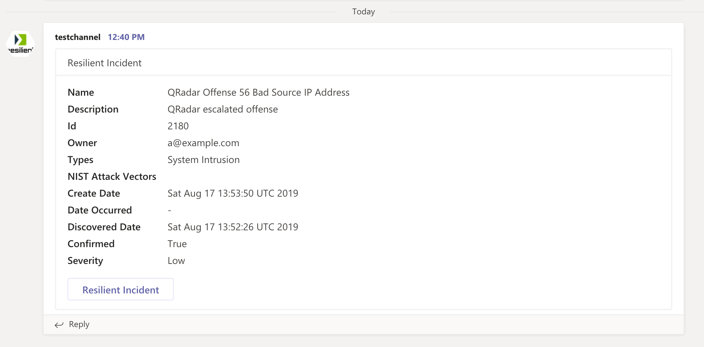

<!--
  This Install README.md is generated by running:
  "resilient-circuits docgen -p fn_teams --only-install-guide"

  It is best edited using a Text Editor with a Markdown Previewer. VS Code
  is a good example. Checkout https://guides.github.com/features/mastering-markdown/
  for tips on writing with Markdown

  If you make manual edits and run docgen again, a .bak file will be created

  Store any screenshots in the "doc/screenshots" directory and reference them like:
  
-->

# fn-teams Functions for IBM Resilient

- [Release Notes](#release-notes)
- [Overview](#overview)
- [Requirements](#requirements)
- [Installation](#installation)
- [Uninstall](#uninstall)
- [Troubleshooting](#troubleshooting)
- [Support](#support)
- [Futures](#futures)

---

## Release Notes
<!--
  Specify all changes in this release. Do not remove the release 
  notes of a previous release
-->
### v1.0.0
* Initial Release

---

## Overview
<!--
  Provide a high-level description of the function itself and its remote software or application.
  The text below is parsed from the "description" and "long_description" attributes in the setup.py file
-->
**Resilient Circuits Components for fn_teams**

 

This python package contains the integration code necessary to connect to Microsoft Soft teams to esclate incident data to an existing Teams channel.  Included are example workflows and rules for pushing incident and task information to a Teams channel. See the README documentation in the doc/ folder for further information on how to use this integration.

---

## Requirements
<!--
  List any Requirements 
-->
* Resilient platform >= `v31.0.4254`
* An Integration Server running `resilient_circuits>=30.0.0' 'resilient_lib`
  * To set up an Integration Server see: [ibm.biz/res-int-server-guide](https://ibm.biz/res-int-server-guide)

---

## Installation
* Download the `fn_teams.zip`.
* Copy the `.zip` to your Integration Server and SSH into it.
* **Unzip** the package:
  ```
  $ unzip fn_teams-x.x.x.zip
  ```
* **Change Directory** into the unzipped directory:
  ```
  $ cd fn_teams-x.x.x
  ```
* **Install** the package:
  ```
  $ pip install fn_teams-x.x.x.tar.gz
  ```
* Import the fn_teams **customizations** into the Resilient platform:
  ```
  $ resilient-circuits customize -y -l fn-teams
  ```
* Configure the fn_teams **app.config** settings. See [Configure](#configure-fn_teams) for setting changes
  ```
  $ resilient-circuits config -l fn-teams
  ```
* [Optional]: Run selftest to test the Integration you configured:
  ```
  $ resilient-circuits selftest -l fn-teams
  ```
* **Run** resilient-circuits or restart the Service on Windows/Linux:
  ```
  $ resilient-circuits run
  ```


---

## Uninstall
* SSH into your Integration Server.
* **Uninstall** the package:
  ```
  $ pip uninstall fn-teams
  ```

---

## Troubleshooting
There are several ways to verify the successful operation of a function.

### Resilient Action Status
* When viewing an incident, use the Actions menu to view **Action Status**.
* By default, pending and errors are displayed.
* Modify the filter for actions to also show Completed actions.
* Clicking on an action displays additional information on the progress made or what error occurred.

### Resilient Scripting Log
* A separate log file is available to review scripting errors.
* This is useful when issues occur in the pre-processing or post-processing scripts.
* The default location for this log file is: `/var/log/resilient-scripting/resilient-scripting.log`.

### Resilient Logs
* By default, Resilient logs are retained at `/usr/share/co3/logs`.
* The `client.log` may contain additional information regarding the execution of functions.

### Resilient-Circuits
* The log is controlled in the `.resilient/app.config` file under the section [resilient] and the property `logdir`.
* The default file name is `app.log`.
* Each function will create progress information.
* Failures will show up as errors and may contain python trace statements.

---


## Configure fn_teams
After running `resilient-circuits config -l fn-teams`, your app.config file will contain the following section

```
[fn_teams]
# add multiple parameters for the channels to access and their webhook. 
#  The channel name is used in the function input: teams_channel
#<channel_name>=<teams channel webhook>
```

Any number of channels can be configured, each with it's own inbound webhook. If you're unfamiliar with Teams' inbound webhooks, refer to the setup 
documentation such as this [medium article](https://medium.com/@ankush.kumar133/get-started-with-microsoft-team-connectors-incoming-webhook-a330657993e7)

Copy the webhook URL and add it to your `[fn_teams]` section using a label which refers to the channel. This label is then used in your Resilient workflow, configuring the `Teams Post Message` function's `teams_channel` input parameter.


## Support
| Name | Version | Author | Support URL |
| ---- | ------- | ------ | ----------- |
| fn_teams | 1.0.0 | Resilient Labs | Resilient Labs |

## Futures
Microsoft is planning an full API for Teams communications. This API is presently in beta. When this API is released, this integration will be modified for more complete, bi-directional message posting.