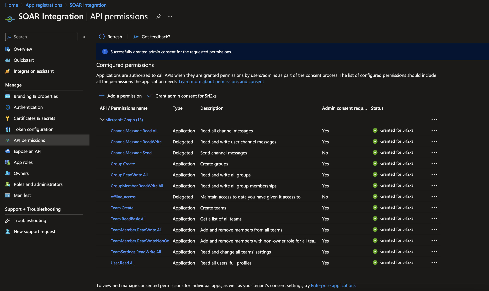
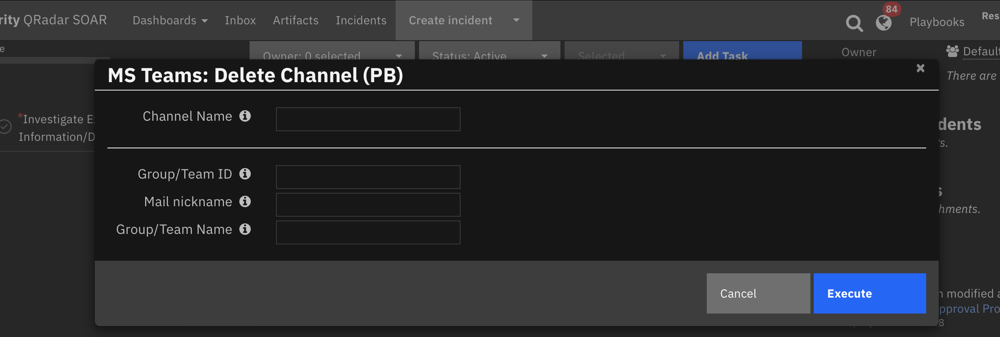
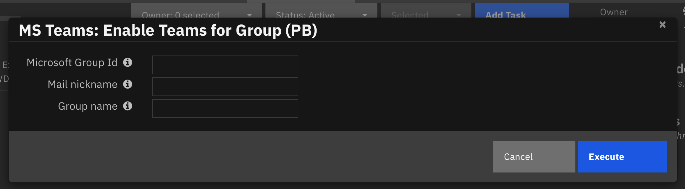

# Microsoft Teams for IBM QRadar SOAR

## Table of Contents
- [Microsoft Teams for IBM QRadar SOAR](#microsoft-teams-for-ibm-qradar-soar)
  - [Table of Contents](#table-of-contents)
  - [Release Notes](#release-notes)
  - [Overview](#overview)
    - [Key Features](#key-features)
  - [Requirements](#requirements)
    - [SOAR platform](#soar-platform)
    - [Cloud Pak for Security](#cloud-pak-for-security)
    - [Proxy Server](#proxy-server)
    - [Python Environment](#python-environment)
    - [Endpoint Developed With](#endpoint-developed-with)
  - [Installation](#installation)
  - [Endpoint Configuration](#endpoint-configuration)
    - [Register a new application using the Azure portal](#register-a-new-application-using-the-azure-portal)
    - [Selecting required API Permissions](#selecting-required-api-permissions)
    - [Create a client Secret Value](#create-a-client-secret-value)
    - [App Configuration](#app-configuration)
  - [Function - MS Teams: Archive Team](#function---ms-teams-archive-team)
  - [Function - MS Teams: Create Channel](#function---ms-teams-create-channel)
  - [Function - MS Teams: Create group](#function---ms-teams-create-group)
  - [Function - MS Teams: Create team](#function---ms-teams-create-team)
  - [Function - MS Teams: Delete Channel](#function---ms-teams-delete-channel)
  - [Function - MS Teams: Delete Group](#function---ms-teams-delete-group)
  - [Function - MS Teams: Enable Team](#function---ms-teams-enable-team)
  - [Function - MS Teams: Post Message](#function---ms-teams-post-message)
  - [Rules](#rules)
  - [Troubleshooting \& Support](#troubleshooting--support)
    - [For Support](#for-support)
---

## Release Notes
| Version | Date | Notes |
| ------- | ---- | ----- |
| 2.0.0 | 12/2022 | Added support for creating and deleting MS Groups, Teams and Channels |
| 1.0.0 | 10/2019 | Post Incident/task information to MS Teams |

---

## Overview

This application extends the meeting and collaboration functionality of Microsoft Teams to IBM Security QRadar SOAR Platform. This provides SOAR platform with the ability to interface with Microsoft Endpoint to create Groups, Teams and Channels. Users can also post Incident or task information directly from SOAR to a MS Channel. The Microsoft 365 Group are created with resources that members of the group share, including:

* Outlook conversations
* Outlook calendar
* SharePoint files
* OneNote notebook
* SharePoint team site
* Planner plans
* Intune device management

### Key Features
* This program offers tools for establishing one or more Groups, Teams, and Channels and enables the addition of participants to an incident or task.
* This program also offers the ability to delete Groups, Channels, and Teams, as well as to archive or un-archive them.
* It is now possible to create It Groups, Teams, and channels with members who are not a part of an incident or task but who have a functioning MS account that is a part of the same organization. 
* Information about the Incident or task can be directly posted to a MS Channel from within SOAR.
* Example workflows are included that performs the aforementioned operation and stores related information as a incident or a task note.
* Examples of rules that invoke a menu popup asking the user for inputs to carry out the aforementioned activities are provided. 
---

## Requirements
This app supports the IBM Security QRadar SOAR Platform and the IBM Security QRadar SOAR for IBM Cloud Pak for Security.

### SOAR platform
The SOAR platform supports two app deployment mechanisms, App Host and integration server.

If deploying to a SOAR platform with an App Host, the requirements are:
* SOAR platform >= `45.0`.
* The app is in a container-based format (available from the AppExchange as a `zip` file).

If deploying to a SOAR platform with an integration server, the requirements are:
* SOAR platform >= `45.0`.
* The app is in the older integration format (available from the AppExchange as a `zip` file which contains a `tar.gz` file).
* Integration server is running `resilient_circuits>=45.0.0`.
* If using an API key account, make sure the account provides the following minimum permissions: 
  | Name | Permissions |
  | ---- | ----------- |
  | Org Data | Read |
  | Function | Read |
  | Group | Read |
  | Users | Read |

The following SOAR platform guides provide additional information: 
* _App Host Deployment Guide_: provides installation, configuration, and troubleshooting information, including proxy server settings. 
* _Integration Server Guide_: provides installation, configuration, and troubleshooting information, including proxy server settings.
* _System Administrator Guide_: provides the procedure to install, configure and deploy apps. 

The above guides are available on the IBM Documentation website at [ibm.biz/soar-docs](https://ibm.biz/soar-docs). On this web page, select your SOAR platform version. On the follow-on page, you can find the _App Host Deployment Guide_ or _Integration Server Guide_ by expanding **Apps** in the Table of Contents pane. The System Administrator Guide is available by expanding **System Administrator**.

### Cloud Pak for Security
If you are deploying to IBM Cloud Pak for Security, the requirements are:
* IBM Cloud Pak for Security >= 1.9.
* Cloud Pak is configured with an App Host.
* The app is in a container-based format (available from the AppExchange as a `zip` file).

The following Cloud Pak guides provide additional information: 
* _App Host Deployment Guide_: provides installation, configuration, and troubleshooting information, including proxy server settings. From the Table of Contents, select Case Management and Orchestration & Automation > **Orchestration and Automation Apps**.
* _System Administrator Guide_: provides information to install, configure, and deploy apps. From the IBM Cloud Pak for Security IBM Documentation table of contents, select Case Management and Orchestration & Automation > **System administrator**.

These guides are available on the IBM Documentation website at [ibm.biz/cp4s-docs](https://ibm.biz/cp4s-docs). From this web page, select your IBM Cloud Pak for Security version. From the version-specific IBM Documentation page, select Case Management and Orchestration & Automation.

### Proxy Server
The app **does support a proxy server.

### Python Environment
Both Python 3.6 and Python 3.9 are supported.
Additional package dependencies may exist for each of these packages:
* msal ~= 1.19
* pymsteams ~= 0.2.1
* resilient_circuits>=45.0.0

### Endpoint Developed With

This app has been implemented using:
| Product Name | Product Version | API URL | API Version |
| ------------ | --------------- | ------- | ----------- |
| Microsoft Graph REST API |  | `https://graph.microsoft.com/` | V1.0 |

---

## Installation
* To install or uninstall an App or Integration on the _SOAR platform_, see the documentation at [ibm.biz/soar-docs](https://ibm.biz/soar-docs).
* To install or uninstall an App on _IBM Cloud Pak for Security_, see the documentation at [ibm.biz/cp4s-docs](https://ibm.biz/cp4s-docs) and follow the instructions above to navigate to Orchestration and Automation.

## Endpoint Configuration
This application needs an access token from the Microsoft identity platform since it uses the Microsoft Graph API to communicate with the endpoint.
The access token includes details about the application and the permission it has to use the Microsoft Graph resources and APIs. The app needs to be registered with the Microsoft identity platform and given permission to access the required Microsoft Graph resources by a user or an administrator in order to obtain an access token.

### Register a new application using the Azure portal
 The application must be registered with the identity provider for the identity provider to be aware that a specific app is attempting to access user information. The configuration necessary for the application to interface with the Microsoft identity platform is then made available when it registers with Azure Active Directory (Azure AD). You can learn more about this at [learn.microsoft.com/application-model](https://learn.microsoft.com/en-us/azure/active-directory/develop/application-model)

* Sign in to the Azure portal using either a work or school account or a personal Microsoft account.
* If your account gives you access to more than one tenant, select your account in the top right corner, and set your portal session to the Azure AD tenant that you want.
* In the left-hand navigation pane, select the `Azure Active Directory service`, and then select `App registrations` > `New registration`.
* When the Register an application page appears, enter your application's registration information:
    * `Name` - Enter a meaningful application name that will be displayed to users of the app.
    * `Supported account types` - Select which accounts you would like your application to support.
    * `Redirect URI` - Enter the redirect URI (or reply URL) for this application, i.e : `https://localhost:8080/callback`
  
<p align="center">

</p>

* Note down this information as this would be required later while setting up the **app.conf** file.
* When finished, select Register.
* In the left-hand navigation pane under the `Manage` section, select `Authentication`.
* Select `Yes` for `Enable the following mobile and desktop flows` then click `Save`.

### Selecting required API Permissions
The application requires the resource owner's permission to access a protected resource, such as email or calendar information. The request made by your app may be granted or denied by the resource owner. The appropriate delegated permissions must be granted to the client app. Scopes are another name for delegated permissions. Scopes are permissions that specify what a client application can access on the user's behalf for a specific resource. See scopes and permissions for further details on scopes. You can learn more about this concept at [learn.microsoft.com/scopes-oidc](https://learn.microsoft.com/en-us/azure/active-directory/develop/scopes-oidc)

* In the left-hand navigation pane under the `Manage` section select `API Permission`.
* Click `Add a permission`. On the Request API permission screen, select `Microsoft Graph`.
* An admin account is required to `Grant admin consent`, to enable these permissions.
* In Graph API, choose delegated permission and add the required permissions as shown below:

<p align="center">

</p>

### Create a client Secret Value
* In the left-hand navigation pane under the `Manage` section, select `Certificate and secrets`.
* Click on the `New client secret` button.
* Enter a name for the client secret and click on the `Add` button.
* Note down this information as this would be required later while setting up the **app.conf** file.

<p align="center">

</p>

More information about this process can be found at [OAuth Utilities for IBM SOAR](https://exchange.xforce.ibmcloud.com/api/hub/extensionsNew/504c896aa38087ba897fa054bc79e598/README.pdf)

### App Configuration
The following table provides the settings you need to configure the app. These settings are made in the app.config file. See the documentation discussed in the Requirements section for the procedure.

| Config | Required | Example | Description |
| ------ | :------: | ------- | ----------- |
| **application_id** | Yes | 18d10049-72e3-4652-ac9f-d9b13f24303c | `Application (client) ID` (can be found in the app overview section) |
| **directory_id** | Yes | 1d8a5928-8678-408e-ab06-50ca7e01766a | `Directory (tenant) ID` (can be found in the app overview section) |
| **secret_value** | Yes | oCN****************** | `Secret Value` (can be found in the certificate and secrets section) !

---


## Function - MS Teams: Archive Team
This function allows for archiving or unarchivig a Microsoft Team using the Microsoft Graph API. This provides SOAR with the ability to archive an existing MS Team or unarchive a previously archived MS Team within a SOAR incident or a  task. `archive_operation` specifies if the team is to be archived or unarchived. Archiving does not delete the MS Team. To locate this team for the archival/unarchival operation, one of the following inputs can be used:

* `ms_groupteam_id`
* `ms_group_mail_nickname`
* `ms_groupteam_name`

**<ins>Note</ins>**: When multiple options are provided to locate the Graph object (Group or a Team), the `ms_group_mail_nickname` option will take precedence over the `ms_groupteam_name` option and the `ms_groupteam_id` option will take precedence over the other two options.

<p align="center">

</p>

<p align="center">

</p>


<details><summary>Inputs:</summary>
<p>

| Name | Type | Required | Example | Tooltip |
| ---- | :--: | :------: | ------- | ------- |
| `archive_operation` | `select` | No | `archive` | Specify the operation to be performed |
| `ms_group_mail_nickname` | `text` | No | `Engineering` | Unique value, as no two MS Objects can have the same email ID. The mail address need not include the domain suffix (i.e. @example.com) |
| `ms_groupteam_id` | `text` | No | `4dfde5ae-4c27-4461` | Unique id assigned to a MS Group or Team while being created |
| `ms_groupteam_name` | `text` | No | `Engineering Team` | Name assigned to the MS Group or Team while being created |

</p>
</details>

<details><summary>Outputs:</summary>
<p>

> **NOTE:** This example might be in JSON format, but `results` is a Python Dictionary on the SOAR platform.

```python
results = {
  "content": {
    "classification": null,
    "createdDateTime": "2022-11-17T19:38:40Z",
    "creationOptions": [
      "Team",
      "ExchangeProvisioningFlags:3552"
    ],
    "deletedDateTime": null,
    "description": "Sample",
    "displayName": "Admin",
    "expirationDateTime": null,
    "groupTypes": [
      "Unified"
    ],
    "id": "4dfde5ae-4c27-4461",
    "isAssignableToRole": null,
    "mail": "Engineering@.onmicrosoft.com",
    "mailEnabled": true,
    "mailNickname": "Engineering",
    "membershipRule": null,
    "membershipRuleProcessingState": null,
    "message": "Successfully archived Team: Engineering",
    "onPremisesDomainName": null,
    "onPremisesLastSyncDateTime": null,
    "onPremisesNetBiosName": null,
    "onPremisesProvisioningErrors": [],
    "onPremisesSamAccountName": null,
    "onPremisesSecurityIdentifier": null,
    "onPremisesSyncEnabled": null,
    "preferredDataLocation": null,
    "preferredLanguage": null,
    "proxyAddresses": [
      "SPO:SPO_6a9b33c4-5b75-4854-8cd8-***********_1d8a5928-8678-408e-ab06-50ca7e01766a",
      "SMTP:Engineering@.onmicrosoft.com"
    ],
    "renewedDateTime": "2022-11-17T19:38:40Z",
    "resourceBehaviorOptions": [
      "HideGroupInOutlook",
      "SubscribeMembersToCalendarEventsDisabled",
      "WelcomeEmailDisabled"
    ],
    "resourceProvisioningOptions": [
      "Team"
    ],
    "securityEnabled": false,
    "securityIdentifier": "S-1-12-1-********-1147227175-132734357-2269728913",
    "teamsEnabled": "Archived",
    "theme": null,
    "visibility": "Public"
  },
  "inputs": {
    "archive_operation": "Archive",
    "ms_team_name": "Engineering"
  },
  "metrics": {
    "execution_time_ms": 5367,
    "host": "appHost",
    "package": "fn-teams",
    "package_version": "2.0.0",
    "timestamp": "2022-11-22 11:21:47",
    "version": "1.0"
  },
  "raw": null,
  "reason": null,
  "success": true,
  "version": 2.0
}
```

</p>
</details>

<details><summary>Example Pre-Process Script:</summary>
<p>

```python
if rule.properties.archive_operation:
  inputs.archive_operation = rule.properties.archive_operation

if rule.properties.ms_groupteam_id:
  inputs.ms_groupteam_id = rule.properties.ms_groupteam_id

elif rule.properties.ms_group_mail_nickname:
  inputs.ms_group_mail_nickname = rule.properties.ms_group_mail_nickname

elif rule.properties.ms_groupteam_name:
  inputs.ms_groupteam_name = rule.properties.ms_groupteam_name

else:
  helper.fail("No input was provided")
```

</p>
</details>

<details><summary>Example Post-Process Script:</summary>
<p>

```python
content = results.get("content")

if not results.success:
  text = u"Unable to create Microsoft Group"
  fail_reason = results.reason
  if fail_reason:
    text = u"{0}:\n\tFailure reason: {1}".format(text, fail_reason)
    
else:
  text  = u"<b>Microsoft Group Details:</b><br />"
  text += u"<br />The Team associated with this Group has now been {}.<br />".format(content.get("teamsEnabled"))
  text += u"<br />Name: {}".format(content.get("displayName"))
  text += u"<br />Description: {}".format(content.get("description"))
  text += u"<br />Teams Enabled: {}".format(content.get("teamsEnabled"))
  text += u"<br />ID: {}".format(content.get("id"))
  text += u"<br />Mail: {}".format(content.get("mail"))
  text += u"<br />Visibility: {}".format(content.get("visibility"))
  text += u"<br />Group Types: {}".format(content.get("groupTypes"))
  text += u"<br />Created date and time: {}".format(content.get("createdDateTime"))
  if content.get("unfoundUsers"):
    text += u"<br />*Note the following users were unable to be added to the group: {}".format(content.get("unfoundUsers"))

note = helper.createRichText(text)

if task:
  task.addNote(note)
else:
  incident.addNote(note)

```

</p>
</details>

---
## Function - MS Teams: Create Channel
This function allows for creating a Microsoft Channel for a MS Team using the Graph API. This provides SOAR with the ability to create a channel for a MS Team from within a SOAR incident or a task. A MS Team can have multiple channels. Here a request is formulated and posted to the Microsoft Graph API for channel creation. To create a Channel for an MS Team, 3 key attributes are required, namely: teamId, displayName, and description. Out of these attributes, teamId is crucial as the MS Team must be properly identified before channel addition operation can take place. This function has the ability to find the required teamId using anyone of the below mentioned options:

  * `ms_groupteam_id`
  * `ms_group_mail_nickname`
  * `ms_groupteam_name`

**<ins>Note</ins>**: When multiple options are provided to locate the Graph object (Group or a Team), the `ms_group_mail_nickname` option will take precedence over the `ms_groupteam_name` option and the `ms_groupteam_id` option will take precedence over the other two options.

<p align="center">

</p>

<p align="center">

</p>

<details><summary>Inputs:</summary>
<p>

| Name | Type | Required | Example | Tooltip |
| ---- | :--: | :------: | ------- | ------- |
| `ms_channel_name` | `text` | No | `Team 2` | Name of the Microsoft Teams channel |
| `ms_description` | `text` | No | `Engineering SubTeam2` | Description for the MS Graph Object (Group / Team / Channel) that is being created |
| `ms_group_mail_nickname` | `text` | No | `Engineering2` | Unique value, as no two MS Objects can have the same email ID. The mail address need not include the domain suffix (i.e. @example.com) |
| `ms_groupteam_id` | `text` | No | `4dfde5ae-4c27-4461` | Unique id assigned to a MS Group or Team while being created |
| `ms_groupteam_name` | `text` | No | `Engineering` | Name assigned to the MS Group or Team while being created |

</p>
</details>

<details><summary>Outputs:</summary>
<p>

> **NOTE:** This example might be in JSON format, but `results` is a Python Dictionary on the SOAR platform.

```python
results = {
  "content": {
    "@odata.context": "https://graph.microsoft.com/v1.0/$metadata#teams(\u00274e8349d3-a5e1-****-****-3d81f5252b7f\u0027)/channels/$entity",
    "createdDateTime": "2022-11-22T12:21:20.4305814Z",
    "description": "Engineering SubTeam 2",
    "displayName": "Team 2",
    "email": "engineering2",
    "id": "19:8d4fbf7358174021ae16374572797fce@thread.tacv2",
    "isFavoriteByDefault": false,
    "membershipType": "standard",
    "message": "Successfully created channel: Team 2",
    "status_code": 201,
    "webUrl": "https://teams.microsoft.com/l/channel/19%3a8d4fbf7************72797fce%40thread.tacv2/Engineering Team?groupId=4e8349d3-a5e1-****-*****-3d81f5252b7f\u0026tenantId=1d8a5928-8678-408e-ab06-50ca7e01766a"
  },
  "inputs": {
    "ms_channel_name": "Team 2",
    "ms_group_description": "Engineering SubTeam 2",
    "ms_groupteam_name": "Engineering"
  },
  "metrics": {
    "execution_time_ms": 9106,
    "host": "appHost",
    "package": "fn-teams",
    "package_version": "2.0.0",
    "timestamp": "2022-11-22 12:21:20",
    "version": "1.0"
  },
  "raw": null,
  "reason": null,
  "success": true,
  "version": 2.0
}
```

</p>
</details>

<details><summary>Example Pre-Process Script:</summary>
<p>

```python
inputs.ms_channel_name = rule.properties.ms_channel_name if rule.properties.ms_channel_name else f"Incident {incident.id} {incident.name}"
inputs.ms_description = rule.properties.ms_description if rule.properties.ms_description else f"{incident.description.content}"

if rule.properties.ms_groupteam_id:
  inputs.ms_groupteam_id = rule.properties.ms_groupteam_id
elif rule.properties.ms_group_mail_nickname:
  inputs.ms_group_mail_nickname = rule.properties.ms_group_mail_nickname
elif rule.properties.ms_groupteam_name:
  inputs.ms_groupteam_name = rule.properties.ms_groupteam_name
else:
  helper.fail("No input was provided")
```

</p>
</details>

<details><summary>Example Post-Process Script:</summary>
<p>

```python
content = results.get("content")

if not results.success:
  text = u"Unable to create Microsoft Group"
  fail_reason = results.reason
  if fail_reason:
    text = u"{0}:\n\tFailure reason: {1}".format(text, fail_reason)
    
else:
  url   = u'<a href="{}">Click here</a>'.format(content.get("webUrl"))
  text  = u"<b>Microsoft Channel Details:</b><br />"
  text += u"<br />Name: {}".format(content.get("displayName"))
  text += u"<br />Web URL: {}".format(url)
  text += u"<br />Description: {}".format(content.get("description"))
  text += u"<br />Teams Enabled: {}".format(True)
  text += u"<br />ID: {}".format(content.get("id"))
  text += u"<br />Mail: {}".format(content.get("email"))
  text += u"<br />Membership Type: {}".format(content.get("membershipType"))

note = helper.createRichText(text)
incident.addNote(note)

```

</p>
</details>

---
## Function - MS Teams: Create group

This function allows for creating a Microsoft Group using the Microsoft Graph API. This provides SOAR with the ability to create Groups from within a SOAR incident or a task. This function has the ability to create an MS Group with a Name and description from an Incident or a task. It also has the ability to add multiple owners by specifying their email addresses in a comma-separated manner. At least one owner must be mentioned for group creation. The function is developed to automatically add all members of an incident or a task to the MS Group. If the function is executed from within a task, in addition to task members, all incident members can also be automatically added if that option is selected. Apart from automatic member addition, individual members can be added by directly specifying their email addresses.

<p align="center">

</p>

<p align="center">

</p>

<details><summary>Inputs:</summary>
<p>

| Name | Type | Required | Example | Tooltip |
| ---- | :--: | :------: | ------- | ------- |
| `add_members_from` | `select` | Yes | `Incident/Task` | Allows for adding incident or task members to Team/Group |
| `additional_members` | `text` | No | `user1@example.com, user2@example.com` | Add members who are not members of this incident or task |
| `incident_id` | `number` | No | `1098` | Unique id assigned to an incident while being created  |
| `ms_description` | `text` | No | `-` | Description for the MS Graph Object (Group / Team / Channel) that is being created |
| `ms_group_mail_nickname` | `text` | No | `SOAR` | Unique value, as no two MS Objects can have the same email ID. The mail address need not include the domain suffix (i.e. @example.com) |
| `ms_group_name` | `text` | No | `SOAR` | Name of the MS Group |
| `ms_owners_list` | `text` | No | `AdminSoarMS@.onmicrosoft.com` | A list of owners for the group or team |
| `task_id` | `number` | No | `-` | Unique id of a task assigned while being created |

</p>
</details>

<details><summary>Outputs:</summary>
<p>

> **NOTE:** This example might be in JSON format, but `results` is a Python Dictionary on the SOAR platform.

```python
results = {
  "content": {
    "classification": null,
    "createdDateTime": "2022-11-15T16:30:37Z",
    "creationOptions": [],
    "deletedDateTime": null,
    "description": "Incident 2095: MS Teams This is a sample incident created for MS teams in SOAR v45",
    "displayName": "SOAR",
    "expirationDateTime": null,
    "groupTypes": [
      "Unified"
    ],
    "id": "489acc09-3bac-4c43-a168-544df4bf40ff",
    "isAssignableToRole": null,
    "mail": "SOAR@.onmicrosoft.com",
    "mailEnabled": true,
    "mailNickname": "SOAR",
    "membershipRule": null,
    "membershipRuleProcessingState": null,
    "onPremisesDomainName": null,
    "onPremisesLastSyncDateTime": null,
    "onPremisesNetBiosName": null,
    "onPremisesProvisioningErrors": [],
    "onPremisesSamAccountName": null,
    "onPremisesSecurityIdentifier": null,
    "onPremisesSyncEnabled": null,
    "preferredDataLocation": null,
    "preferredLanguage": null,
    "proxyAddresses": [
      "SMTP:SOAR@.onmicrosoft.com"
    ],
    "renewedDateTime": "2022-11-15T16:30:37Z",
    "resourceBehaviorOptions": [],
    "resourceProvisioningOptions": [],
    "securityEnabled": false,
    "securityIdentifier": "S-1-12-1-1218104329-1279474604-1297377441-4282433524",
    "teamsEnabled": false,
    "theme": null,
    "unfoundUsers": [],
    "visibility": "Public"
  },
  "inputs": {
    "add_members_from": "Incident",
    "incident_id": 2095,
    "ms_group_description": "Incident 2095: MS Teams This is a sample incident created for MS teams in SOAR v45",
    "ms_group_mail_nickname": "SOAR",
    "ms_group_name": "SOAR",
    "ms_owners_list": "AdminSoarMS@.onmicrosoft.com"
  },
  "metrics": {
    "execution_time_ms": 20595,
    "host": "Apphost",
    "package": "fn-teams",
    "package_version": "2.0.0",
    "timestamp": "2022-11-15 16:30:46",
    "version": "1.0"
  },
  "raw": null,
  "reason": null,
  "success": true,
  "version": 2.0
}
```

</p>
</details>

<details><summary>Example Pre-Process Script:</summary>
<p>

```python
if task:
    inputs.task_id = task.id
  
inputs.incident_id = str(incident.id)
inputs.ms_group_name = "Incident {}: {}".format(str(incident.id),  incident.name) if rule.properties.ms_group_name is None else rule.properties.ms_group_name

if rule.properties.ms_owners_list is not None:
    inputs.ms_owners_list = rule.properties.ms_owners_list
    
if rule.properties.add_members_incident is not None:
  _value = rule.properties.add_members_incident.lower().strip()
  if _value == "all incident members":
    inputs.add_members_from = "Incident"
  else:
    inputs.add_members_from = "None"
    
if rule.properties.additional_members.content is not None:
    inputs.additional_members = rule.properties.additional_members.content
    
if rule.properties.ms_description is not None:
    inputs.ms_description = rule.properties.ms_description
else:
    inputs.ms_description = f"Incident {incident.id}: {incident.name} {incident.description.content}"
  

if rule.properties.ms_group_mail_nickname is not None:
    inputs.ms_group_mail_nickname = rule.properties.ms_group_mail_nickname

```

</p>
</details>

<details><summary>Example Post-Process Script:</summary>
<p>

```python
content = results.get("content")

if not results.success:
  text = u"Unable to create Microsoft Group"
  fail_reason = results.reason
  if fail_reason:
    text = u"{0}:\n\tFailure reason: {1}".format(text, fail_reason)
    
else:
  text  = u"<b>Microsoft Group Details:</b><br />"
  text += u"<br />Name: {}".format(content.get("displayName"))
  text += u"<br />Description: {}".format(content.get("description"))
  text += u"<br />Teams Enabled: {}".format(content.get("teamsEnabled"))
  text += u"<br />ID: {}".format(content.get("id"))
  text += u"<br />Mail: {}".format(content.get("mail"))
  text += u"<br />Visibility: {}".format(content.get("visibility"))
  text += u"<br />Group Types: {}".format(content.get("groupTypes"))
  text += u"<br />Created date and time: {}".format(content.get("createdDateTime"))
  if content.get("unfoundUsers"):
    text += u"<br />*Note the following users were unable to be added to the group: {}".format(content.get("unfoundUsers"))

note = helper.createRichText(text)
incident.addNote(note)

```

</p>
</details>

---
## Function - MS Teams: Create team

This function allows for creating a Microsoft Team using the Microsoft Graph API. This provides SOAR with the ability to create a MS Team from within a SOAR incident or a task. This function has the ability to create an MS Team with a Name and description from an Incident or a task. It also has the ability to add multiple owners by specifying their email addresses in a comma-separated manner. At least one owner must be mentioned for group creation. The function is developed to automatically add all members of an incident or a task to the MS Team. If the function is executed from within a task, in addition to task members, all incident members can also be automatically added if that option is selected. Apart from automatic member addition, individual members can be added by directly specifying their email addresses.

<p align="center">

</p>

<p align="center">

</p>

<details><summary>Inputs:</summary>
<p>

| Name | Type | Required | Example | Tooltip |
| ---- | :--: | :------: | ------- | ------- |
| `add_members_from` | `select` | Yes | `Incident/Task` | Allows for adding incident or task members to Team/Group |
| `additional_members` | `text` | No | `user1@example.com, user2@example.com` | Add members who are not members of this incident or task |
| `incident_id` | `number` | No | `1098` | Unique id assigned to an incident while being created  |
| `ms_description` | `text` | No | `-` | Description for the MS Graph Object (Group / Team / Channel) that is being created |
| `ms_owners_list` | `text` | No | `AdminSoarMS@.onmicrosoft.com` | A list of owners for the group or team |
| `ms_team_name` | `text` | No | `SoarTeam` | Name of the Microsoft Team |
| `task_id` | `number` | No | `-` | Unique id of a task assigned while being created |

</p>
</details>

<details><summary>Outputs:</summary>
<p>

> **NOTE:** This example might be in JSON format, but `results` is a Python Dictionary on the SOAR platform.

```python
results = {
  "content": {
    "@odata.context": "https://graph.microsoft.com/v1.0/$metadata#groups/$entity",
    "classification": null,
    "createdDateTime": "2022-11-16T12:11:47Z",
    "creationOptions": [
      "Team",
      "ExchangeProvisioningFlags:3552"
    ],
    "deletedDateTime": null,
    "description": "SoarTeam",
    "displayName": "SoarTeam",
    "expirationDateTime": null,
    "groupTypes": [
      "Unified"
    ],
    "id": "db7350fc-b6df-4041",
    "isAssignableToRole": null,
    "mail": "soargroup@.onmicrosoft.com",
    "mailEnabled": true,
    "mailNickname": "soargroup",
    "membershipRule": null,
    "membershipRuleProcessingState": null,
    "onPremisesDomainName": null,
    "onPremisesLastSyncDateTime": null,
    "onPremisesNetBiosName": null,
    "onPremisesProvisioningErrors": [],
    "onPremisesSamAccountName": null,
    "onPremisesSecurityIdentifier": null,
    "onPremisesSyncEnabled": null,
    "preferredDataLocation": null,
    "preferredLanguage": null,
    "proxyAddresses": [
      "SMTP:soargroup@.onmicrosoft.com"
    ],
    "renewedDateTime": "2022-11-16T12:11:47Z",
    "resourceBehaviorOptions": [
      "HideGroupInOutlook",
      "SubscribeMembersToCalendarEventsDisabled",
      "WelcomeEmailDisabled"
    ],
    "resourceProvisioningOptions": [
      "Team"
    ],
    "securityEnabled": false,
    "securityIdentifier": "S-1-12-1-3681767676-1078048479-3610037686-3668414296",
    "status_code": 200,
    "teamsEnabled": true,
    "theme": null,
    "unfoundUsers": null,
    "visibility": "Public"
  },
  "inputs": {
    "add_members_from": "Incident",
    "incident_id": 2095,
    "ms_owners_list": "AdminSoarMS@.onmicrosoft.com",
    "ms_team_description": "SoarTeam",
    "ms_team_name": "SoarTeam"
  },
  "metrics": {
    "execution_time_ms": 18257,
    "host": "AppHost",
    "package": "fn-teams",
    "package_version": "2.0.0",
    "timestamp": "2022-11-16 12:11:53",
    "version": "1.0"
  },
  "raw": null,
  "reason": null,
  "success": true,
  "version": 2.0
}
```

</p>
</details>

<details><summary>Example Pre-Process Script:</summary>
<p>

```python
if task:
    inputs.task_id = task.id
  
inputs.incident_id = str(incident.id)
inputs.ms_team_name = "Incident {}: {}".format(str(incident.id),  incident.name) if rule.properties.ms_team_name is None else rule.properties.ms_team_name

if rule.properties.ms_owners_list is not None:
    inputs.ms_owners_list = rule.properties.ms_owners_list
    
if rule.properties.add_members_incident is not None:
  _value = rule.properties.add_members_incident.lower().strip()
  if _value == "all incident members":
    inputs.add_members_from = "Incident"
  else:
    inputs.add_members_from = "None"
    
if rule.properties.additional_members.content is not None:
    inputs.additional_members = rule.properties.additional_members.content
    
if rule.properties.ms_description is not None:
    inputs.ms_description = rule.properties.ms_description
else:
    inputs.ms_description = f"Incident {incident.id}: {incident.name} {incident.description.content}"

```

</p>
</details>

<details><summary>Example Post-Process Script:</summary>
<p>

```python
content = results.get("content")

if not results.success:
  text = u"Unable to create Microsoft Group"
  fail_reason = results.reason
  if fail_reason:
    text = u"{0}:\n\tFailure reason: {1}".format(text, fail_reason)
    
else:
  text  = u"<b>Microsoft Group Details:</b><br />"
  text += u"<br />Name: {}".format(content.get("displayName"))
  text += u"<br />Description: {}".format(content.get("description"))
  text += u"<br />Teams Enabled: {}".format(content.get("teamsEnabled"))
  text += u"<br />ID: {}".format(content.get("id"))
  text += u"<br />Mail: {}".format(content.get("mail"))
  text += u"<br />Visibility: {}".format(content.get("visibility"))
  text += u"<br />Group Types: {}".format(content.get("groupTypes"))
  text += u"<br />Created date and time: {}".format(content.get("createdDateTime"))
  if content.get("unfoundUsers"):
    text += u"<br />*Note the following users were unable to be added to the group: {}".format(content.get("unfoundUsers"))

note = helper.createRichText(text)
incident.addNote(note)

```

</p>
</details>

---
## Function - MS Teams: Delete Channel

This function allows for deleting a MS Channel using the Microsoft Graph API. This provides SOAR with the ability to delete an existing MS Channel of a Team. A MS Team can have multiple channels, but each MS Group can have only one Team. In order to delete an MS Channel, it's MS Team/Group needs to be identified. To locate this team for this operation, one of the following inputs can be used:

  * `ms_groupteam_id`
  * `ms_group_mail_nickname`
  * `ms_groupteam_name`

**<ins>Note</ins>**: When multiple options are provided to locate the Graph object (Group or a Team), the `ms_group_mail_nickname` option will take precedence over the `ms_groupteam_name` option and the `ms_groupteam_id` option will take precedence over the other two options.

<p align="center">

</p>

<p align="center">

</p>

<details><summary>Inputs:</summary>
<p>

| Name | Type | Required | Example | Tooltip |
| ---- | :--: | :------: | ------- | ------- |
| `ms_channel_name` | `text` | No | `Engineering Channel` | Name of the Microsoft Teams channel |
| `ms_group_mail_nickname` | `text` | No | `engineeringTeam` | Unique value, as no two MS Objects can have the same email ID. The mail address need not include the domain suffix (i.e. @example.com) |
| `ms_groupteam_id` | `text` | No | `db7350fc-b6df-4041` | Unique id assigned to a MS Group or Team while being created |
| `ms_groupteam_name` | `text` | No | `Engineering Team` | Name assigned to the MS Group or Team while being created |

</p>
</details>

<details><summary>Outputs:</summary>
<p>

> **NOTE:** This example might be in JSON format, but `results` is a Python Dictionary on the SOAR platform.

```python
results = {
  "content": {
    "message": "Successfully deleted channel: Engineering Team",
    "status_code": 204
  },
  "inputs": {
    "ms_channel_name": "Engineering Channel",
    "ms_groupteam_name": "Engineering Team"
  },
  "metrics": {
    "execution_time_ms": 6253,
    "host": "appHost",
    "package": "fn-teams",
    "package_version": "2.0.0",
    "timestamp": "2022-11-22 12:31:03",
    "version": "1.0"
  },
  "raw": null,
  "reason": null,
  "success": true,
  "version": 2.0
}
```

</p>
</details>

<details><summary>Example Pre-Process Script:</summary>
<p>

```python
inputs.ms_channel_name = rule.properties.ms_channel_name if rule.properties.ms_channel_name else f"Incident {incident.id} {incident.name}"

if rule.properties.ms_groupteam_id:
  inputs.ms_groupteam_id = rule.properties.ms_groupteam_id
elif rule.properties.ms_group_mail_nickname:
  inputs.ms_group_mail_nickname = rule.properties.ms_group_mail_nickname
elif rule.properties.ms_groupteam_name:
  inputs.ms_groupteam_name = rule.properties.ms_groupteam_name
else:
  helper.fail("No input was provided")
```

</p>
</details>

<details><summary>Example Post-Process Script:</summary>
<p>

```python
content = results.get("content")

if not results.success:
  text = u"Unable to create Microsoft Group"
  fail_reason = results.reason
  if fail_reason:
    text = u"{0}:\n\tFailure reason: {1}".format(text, fail_reason)
    
else:
  url   = u'<a href="{}">Click here</a>'.format(content.get("webUrl"))
  text  = u"<b>Microsoft Channel Details:</b><br />"
  text += u"<br />Name: {}".format(content.get("displayName"))
  text += u"<br />Web URL: {}".format(url)
  text += u"<br />Description: {}".format(content.get("description"))
  text += u"<br />Teams Enabled: {}".format(True)
  text += u"<br />ID: {}".format(content.get("id"))
  text += u"<br />Mail: {}".format(content.get("email"))
  text += u"<br />Membership Type: {}".format(content.get("membershipType"))

note = helper.createRichText(text)
incident.addNote(note)

```

</p>
</details>

---
## Function - MS Teams: Delete Group

This function allows for deleting a MS Group using the Microsoft Graph API. This provides SOAR with the ability to delete an existing MS Group. To locate this Group for this operation, one of the following inputs can be used:

  * `ms_group_id`
  * `ms_group_mail_nickname`
  * `ms_group_name`

**<ins>Note</ins>**: When multiple options are provided to locate the Graph object (Group or a Team), the `ms_group_mail_nickname` option will take precedence over the `ms_group_name` option and the `ms_group_id` option will take precedence over the other two options.

<p align="center">

</p>

<p align="center">

</p>

<details><summary>Inputs:</summary>
<p>

| Name | Type | Required | Example | Tooltip |
| ---- | :--: | :------: | ------- | ------- |
| `ms_group_id` | `text` | No | `db7350fc-b6df-4041` | Unique id assigned to a team while being created |
| `ms_group_mail_nickname` | `text` | No | `ProductionTeam` | Unique value, as no two MS Objects can have the same email ID. The mail address need not include the domain suffix (i.e. @example.com) |
| `ms_group_name` | `text` | No | `ProductionTeam` | Name of the MS Group |

</p>
</details>

<details><summary>Outputs:</summary>
<p>

> **NOTE:** This example might be in JSON format, but `results` is a Python Dictionary on the SOAR platform.

```python
results = {
  "content": {
    "message": "Successfully deleted Group: Production Team",
    "status_code": 204
  },
  "inputs": {
    "ms_group_mail_nickname": "ProductionTeam@.onmicrosoft.com"
  },
  "metrics": {
    "execution_time_ms": 2996,
    "host": "AppHost",
    "package": "fn-teams",
    "package_version": "2.0.0",
    "timestamp": "2022-11-22 12:14:11",
    "version": "1.0"
  },
  "raw": null,
  "reason": null,
  "success": true,
  "version": 2.0
}
```

</p>
</details>

<details><summary>Example Pre-Process Script:</summary>
<p>

```python
if rule.properties.ms_group_id:
    inputs.ms_group_id = rule.properties.ms_group_id

elif rule.properties.ms_group_mail_nickname:
    inputs.ms_group_mail_nickname = rule.properties.ms_group_mail_nickname

elif rule.properties.ms_group_name:
    inputs.ms_group_name = rule.properties.ms_group_name

else:
    helper.fail("At least one option must be specified to delete a group")
```

</p>
</details>

<details><summary>Example Post-Process Script:</summary>
<p>

```python
content = results.get("content")

if not results.success:
  text = u"Unable to delete Microsoft Group"
  fail_reason = results.reason
  if fail_reason:
    text = u"{0}:\n\tFailure reason: {1}".format(text, fail_reason)
    
else:
  text = u"<b>Microsoft Groups:</b><br />"
  text += u"<br />{}".format(content.get("message"))

note = helper.createRichText(text)
incident.addNote(note)

```

</p>
</details>

---
## Function - MS Teams: Enable Team

This function allows for enabling a Microsoft Team for an MS Group using the MS Graph API. It provides SOAR with the ability to enable MS Teams from within a SOAR incident or task. When an MS Group is created, the teams' functionality is not enabled by default. To enable this for an MS Group that was recently created or an existing Group, this function can be used. To locate the group, one of the following inputs can be used:

  * `ms_group_id`
  * `ms_group_mail_nickname`
  * `ms_group_name`

**<ins>Note</ins>**: When multiple options are provided to locate the Graph object (Group or a Team), the `ms_group_mail_nickname` option will take precedence over the `ms_group_name` option and the `ms_group_id` option will take precedence over the other two options.

<p align="center">

</p>

<p align="center">

</p>

<details><summary>Inputs:</summary>
<p>

| Name | Type | Required | Example | Tooltip |
| ---- | :--: | :------: | ------- | ------- |
| `ms_group_id` | `text` | No | `764a62f2-b759-4dd9` | Unique id assigned to a team while being created |
| `ms_group_mail_nickname` | `text` | No | `engineeringTeam` | Unique value, as no two MS Objects can have the same email ID. The mail address need not include the domain suffix (i.e. @example.com) |
| `ms_group_name` | `text` | No | `Engineering Team` | Name of the MS Group |

</p>
</details>

<details><summary>Outputs:</summary>
<p>

> **NOTE:** This example might be in JSON format, but `results` is a Python Dictionary on the SOAR platform.

```python
results = {
  "content": {
    "classification": null,
    "createdDateTime": "2022-11-17T15:35:29Z",
    "creationOptions": [],
    "deletedDateTime": null,
    "description": "This is a sample group",
    "displayName": "Engineering Team",
    "expirationDateTime": null,
    "groupTypes": [
      "Unified"
    ],
    "id": "764a62f2-b759-4dd9",
    "isAssignableToRole": null,
    "mail": "example@.onmicrosoft.com",
    "mailEnabled": true,
    "mailNickname": "example",
    "membershipRule": null,
    "membershipRuleProcessingState": null,
    "message": "Successfully enabled Teams for Group: Engineering Team",
    "onPremisesDomainName": null,
    "onPremisesLastSyncDateTime": null,
    "onPremisesNetBiosName": null,
    "onPremisesProvisioningErrors": [],
    "onPremisesSamAccountName": null,
    "onPremisesSecurityIdentifier": null,
    "onPremisesSyncEnabled": null,
    "preferredDataLocation": null,
    "preferredLanguage": null,
    "proxyAddresses": [
      "SMTP:example@.onmicrosoft.com"
    ],
    "renewedDateTime": "2022-11-17T15:35:29Z",
    "resourceBehaviorOptions": [],
    "resourceProvisioningOptions": [],
    "securityEnabled": false,
    "securityIdentifier": "S-1-12-1-1984586482-1306113881-1226499974-2109203529",
    "teamsEnabled": true,
    "theme": null,
    "visibility": "Public"
  },
  "inputs": {
    "ms_group_mail_nickname": "engineeringTeam@.onmicrosoft.com"
  },
  "metrics": {
    "execution_time_ms": 5220,
    "host": "AppHost",
    "package": "fn-teams",
    "package_version": "2.0.0",
    "timestamp": "2022-11-17 15:37:00",
    "version": "1.0"
  },
  "raw": null,
  "reason": null,
  "success": true,
  "version": 2.0
}
```

</p>
</details>

<details><summary>Example Pre-Process Script:</summary>
<p>

```python
if rule.properties.ms_group_id:
  inputs.ms_group_id = rule.properties.ms_group_id
elif rule.properties.ms_group_mail_nickname:
  inputs.ms_group_mail_nickname = rule.properties.ms_group_mail_nickname
elif rule.properties.ms_group_name:
  inputs.ms_group_name = rule.properties.ms_group_name
else:
  helper.fail("No input was provided.")
```

</p>
</details>

<details><summary>Example Post-Process Script:</summary>
<p>

```python
content = results.get("content")

if not results.success:
  text = u"Unable to create Microsoft Group"
  fail_reason = results.reason
  if fail_reason:
    text = u"{0}:\n\tFailure reason: {1}".format(text, fail_reason)
    
else:
  text  = u"<b>Microsoft Group Details:</b><br />"
  text += u"<br />Teams functionality has now been enabled for this Group.<br />"
  text += u"<br />Name: {}".format(content.get("displayName"))
  text += u"<br />Description: {}".format(content.get("description"))
  text += u"<br />Teams Enabled: {}".format(content.get("teamsEnabled"))
  text += u"<br />ID: {}".format(content.get("id"))
  text += u"<br />Mail: {}".format(content.get("mail"))
  text += u"<br />Visibility: {}".format(content.get("visibility"))
  text += u"<br />Group Types: {}".format(content.get("groupTypes"))
  text += u"<br />Created date and time: {}".format(content.get("createdDateTime"))
  if content.get("unfoundUsers"):
    text += u"<br />*Note the following users were unable to be added to the group: {}".format(content.get("unfoundUsers"))

note = helper.createRichText(text)
incident.addNote(note)

```

</p>
</details>

---
## Function - MS Teams: Post Message

This application allows for posting Incident/Task details to a MS Teams channel. The application can be triggered from either incident or task level where, information about the incident or task is formulated and posted in a convenient manner. This information is posted to a channel specified by the teams_channel input. This channel name (specified by teams_channel) is used to lookup app.config to retrieve the appropriate channel webhook url.

<p align="center">

</p>

<p align="center">

</p>

<details><summary>Inputs:</summary>
<p>

| Name | Type | Required | Example | Tooltip |
| ---- | :--: | :------: | ------- | ------- |
| `incident_id` | `number` | No | `-` | Unique id assigned to an incident while being created  |
| `task_id` | `number` | No | `-` | Unique id of a task assigned while being created |
| `teams_channel` | `text` | Yes | `-` | Lookup value to channel to post a message |
| `teams_mrkdown` | `boolean` | Yes | `-` | - |
| `teams_payload` | `text` | Yes | `-` | json of teams conversation message: sections, title, text, facts |

</p>
</details>

<details><summary>Outputs:</summary>
<p>

> **NOTE:** This example might be in JSON format, but `results` is a Python Dictionary on the SOAR platform.

```python
results = {
  "content": {
    "message": "Information successfully posted in channel Engineering"
  },
  "inputs": {
    "incident_id": 2096,
    "task_id": 78,
    "teams_channel": "Soar Incident",
    "teams_mrkdown": true,
    "teams_payload": "{ \"summary\": \"SOAR Incident\", \"sections\": [ \n  { \"facts\": [ \n    { \"name\": \"Name\", \"value\": \"Gootloader\" }, \n    { \"name\": \"Description\", \"value\": \"\u003cdiv class=\\\"rte\\\"\u003e\u003cdiv\u003eDelivery method: Distributed via web download\u003c/div\u003e\u003cdiv\u003eDropped by: example\u003c/div\u003e\u003cdiv\u003eLink: \u003ca href=\\\"https://example.com/example\\\" target=\\\"_blank\\\"\u003ehttps://example.com/gootloadersites\u003c/a\u003e\u003c/div\u003e\u003c/div\u003e\" }, \n    { \"name\": \"Id\", \"value\": \"2096\" }, \n    { \"name\": \"Owner\", \"value\": \"adminsoarms@.onmicrosoft.com\" }, \n    { \"name\": \"Types\", \"value\": \"Malware\" }, \n    { \"name\": \"NIST Attack Vectors\", \"value\": \"\" }, \n    { \"name\": \"Create Date\", \"value\": \"Wed Nov 16 14:35:03 GMT 2022\" }, \n    { \"name\": \"Date Occurred\", \"value\": \"Wed Oct 26 00:00:00 IST 2022\" }, \n    { \"name\": \"Discovered Date\", \"value\": \"Wed Oct 26 14:25:12 IST 2022\" }, \n    { \"name\": \"Confirmed\", \"value\": \"True\" }, \n    { \"name\": \"Severity\", \"value\": \"High\" } \n   ]\n  },\n  { \"text\": \"Task\", \"facts\": [ \n    { \"name\": \"Task\", \"value\": \"Research AV vendor databases\" }, \n    { \"name\": \"Owner\", \"value\": \"-\" },\n    { \"name\": \"Instructions\", \"value\": \"Research AV vendor databases for recent outbreaks, symptoms and remediation guidance based on observed symptoms and findings. Possible source for intelligence include the following.\n\u003cul\u003e\n\u003cli\u003eexample: http://www.example.com/en/threats/detect \u003c/li\u003e\n\u003cli\u003eexample: http://www.example.com/security/portal/threat/threats.aspx \u003c/li\u003e\n\u003cli\u003eexample:  http://example.com/security_response/landing/azlisting.jsp\u003c/li\u003e\n\u003cli\u003eexample: http://example.com/us/threatencyclopedia#malware \u003c/li\u003e\n\u003c/ul\u003e\" },\n    { \"name\": \"Due Date\", \"value\": \"-\" }\n    ]\n  }\n ] \n} \n"
  },
  "metrics": {
    "execution_time_ms": 25451,
    "host": "Apphost",
    "package": "fn-teams",
    "package_version": "2.0.0",
    "timestamp": "2022-11-23 12:22:20",
    "version": "1.0"
  },
  "raw": null,
  "reason": null,
  "success": true,
  "version": 2.0
}
```

</p>
</details>

<details><summary>Example Pre-Process Script:</summary>
<p>

```python
from java.util import Date

inputs.incident_id = incident.id

"""
format of a payload. * = optional
{ "title"*: xx, 
  "summary": xx, 
  "sections": [{ "title"*: yy, "text"*: yy, 
                        "facts"*: [{"name": zz, "value": zz}]
              }]
}
"""

payload = u"""{{ "summary": "SOAR Incident", "sections": [ 
  {{ "facts": [ 
    {{ "name": "Name", "value": "{}" }}, 
    {{ "name": "Description", "value": "{}" }}, 
    {{ "name": "Id", "value": "{}" }}, 
    {{ "name": "Owner", "value": "{}" }}, 
    {{ "name": "Types", "value": "{}" }}, 
    {{ "name": "NIST Attack Vectors", "value": "{}" }}, 
    {{ "name": "Create Date", "value": "{}" }}, 
    {{ "name": "Date Occurred", "value": "{}" }}, 
    {{ "name": "Discovered Date", "value": "{}" }}, 
    {{ "name": "Confirmed", "value": "{}" }}, 
    {{ "name": "Severity", "value": "{}" }} 
   ]
  }}
 ] 
}} 
""".format(incident.name, incident.description.content.replace('"', '\\"') if incident.description else "-", incident.id,
   incident.owner_id if incident.owner_id else "-",
   ", ".join(str(x) for x in incident.incident_type_ids), ", ".join(str(x) for x in incident.nist_attack_vectors),
   Date(incident.create_date), Date(incident.start_date) if incident.start_date else "-", Date(incident.discovered_date),
   "True" if incident.confirmed else "False",
   "-" if not incident.severity_code else incident.severity_code
   )

inputs.teams_payload = payload
```

</p>
</details>

<details><summary>Example Post-Process Script:</summary>
<p>

```python
content = results.get("content")

if not results.success:
  text = u"Unable to Post message"
  fail_reason = results.reason
  if fail_reason:
    text = u"{0}:\n\tFailure reason: {1}".format(text, fail_reason)
  text = helper.createRichText(text)
  incident.addNote(text)
```

</p>
</details>

---


## Rules
| Rule Name | Object | Workflow Triggered |
| --------- | ------ | ------------------ |
| MS Teams: Archive Team From Incident | incident | `common_archive_unarchive_a_microsoft_team` |
| MS Teams: Archive Team From Task | task | `common_archive_unarchive_a_microsoft_team` |
| MS Teams: Create Channel From Incident | incident | `common_create_a_teams_channel` |
| MS Teams: Create Channel From Task | task | `common_create_a_teams_channel` |
| MS Teams: Create Group From Incident | incident | `incident_create_a_microsoft_group` |
| MS Teams: Create Group From Task | task | `task_create_a_microsoft_group` |
| MS Teams: Create Team From Incident | incident | `incident_create_a_microsoft_team` |
| MS Teams: Create Team From Task | task | `task_create_a_microsoft_team` |
| MS Teams: Delete Channel From Incident | incident | `common_delete_a_teams_channel` |
| MS Teams: Delete Channel From Task | task | `common_delete_a_teams_channel` |
| MS Teams: Delete Group From Incident | incident | `common_delete_a_microsoft_group` |
| MS Teams: Delete Group From Task | task | `common_delete_a_microsoft_group` |
| MS Teams: Enable Teams for Group From Incident | incident | `common_enable_microsoft_team_for_group` |
| MS Teams: Enable Teams for Group From Task | task | `common_enable_microsoft_team_for_group` |
| MS Teams: Post Incident Information to Teams | incident | `incident_post_message_to_teams` |
| MS Teams: Post Task Information to Teams | task | `task_post_message_to_teams` |

---


## Troubleshooting & Support
Refer to the documentation listed in the Requirements section for troubleshooting information.

### For Support
This is a IBM Community provided App. Please search the Community [ibm.biz/soarcommunity](https://ibm.biz/soarcommunity) for assistance.
